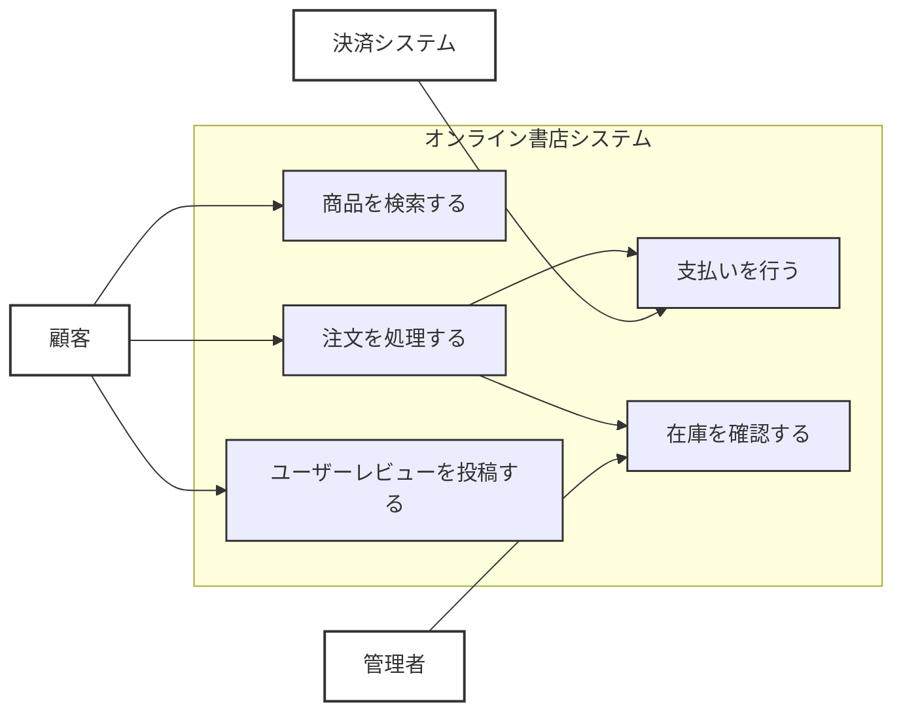
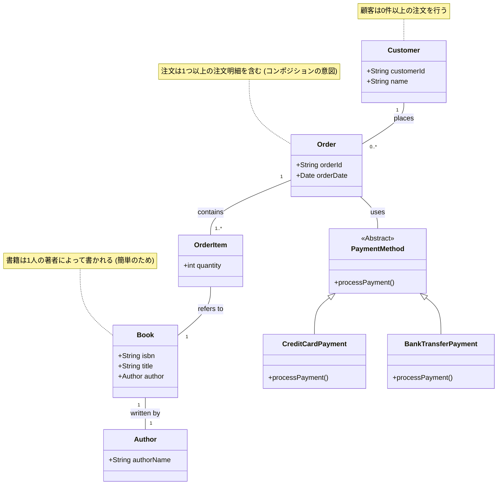
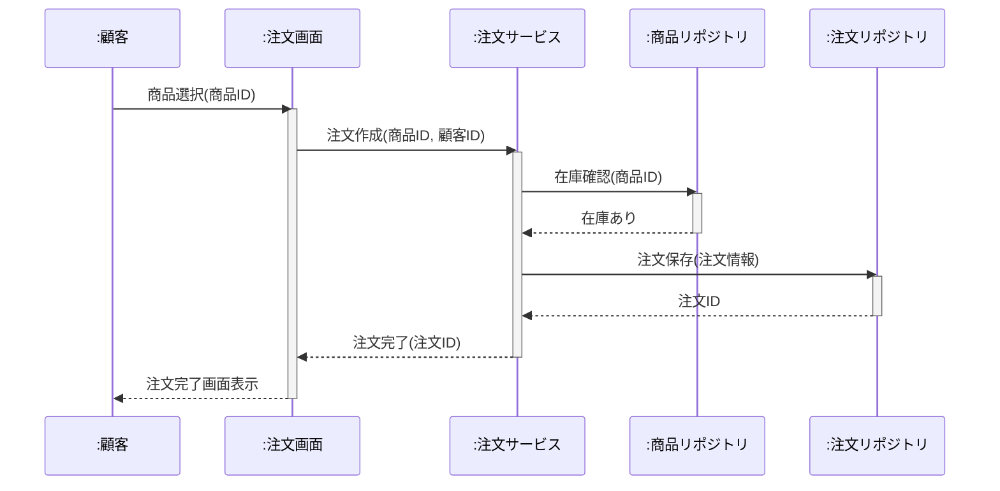

**目次**

- [オブジェクト指向分析・設計 (OOA/D) プロセス入門：要求をモデルに、モデルをコードへ](#オブジェクト指向分析設計-ooad-プロセス入門要求をモデルにモデルをコードへ)
- [はじめに：なぜ「分析」と「設計」のプロセスが大切なのか](#はじめになぜ分析と設計のプロセスが大切なのか)
  - [コーディングの前に何を考えるべきか？](#コーディングの前に何を考えるべきか)
  - [OOA/D が目指すもの：問題の理解と解決策の構造化](#ooad-が目指すもの問題の理解と解決策の構造化)
  - [この資料で目指すこと：OOA/D の基本的な流れ](#この資料で目指すことooad-の基本的な流れ)
- [第 1 部：要求を理解するフェーズ（オブジェクト指向分析 - OOA）](#第-1-部要求を理解するフェーズオブジェクト指向分析---ooa)
  - [要求定義とは何か？：何を作るべきかを明確にする](#要求定義とは何か何を作るべきかを明確にする)
    - [機能要件と非機能要件](#機能要件と非機能要件)
    - [要求を引き出すテクニック（ヒアリング、ブレインストーミングなど）](#要求を引き出すテクニックヒアリングブレインストーミングなど)
  - [ユースケースモデリング：システムの振る舞いを捉える](#ユースケースモデリングシステムの振る舞いを捉える)
    - [アクターの特定：システムと関わる「誰か」](#アクターの特定システムと関わる誰か)
    - [ユースケースの抽出：システムが提供する「価値」](#ユースケースの抽出システムが提供する価値)
    - [ユースケース記述の基本：シナリオを明確に](#ユースケース記述の基本シナリオを明確に)
    - [UML ユースケース図の役割と書き方](#uml-ユースケース図の役割と書き方)
  - [ドメインモデリング（概念モデリング）：問題領域の「モノ」と「コト」を捉える](#ドメインモデリング概念モデリング問題領域のモノとコトを捉える)
    - [ドメイン（問題領域）とは何か？](#ドメイン問題領域とは何か)
    - [名詞分析によるクラス候補の抽出](#名詞分析によるクラス候補の抽出)
    - [クラス間の基本的な関係性（関連、汎化など）の発見](#クラス間の基本的な関係性関連汎化などの発見)
    - [UML クラス図の初期段階としての活用](#uml-クラス図の初期段階としての活用)
    - [CRC カードによるインタラクティブなモデリング](#crc-カードによるインタラクティブなモデリング)
- [第 2 部：解決策を構造化するフェーズ（オブジェクト指向設計 - OOD）](#第-2-部解決策を構造化するフェーズオブジェクト指向設計---ood)
  - [分析モデルから設計モデルへ：何を考慮して進化させるか](#分析モデルから設計モデルへ何を考慮して進化させるか)
    - [技術的制約、非機能要件の反映](#技術的制約非機能要件の反映)
    - [再利用性、保守性、拡張性の考慮](#再利用性保守性拡張性の考慮)
  - [クラス設計の深化：責務、属性、メソッドの具体化](#クラス設計の深化責務属性メソッドの具体化)
    - [単一責任の原則 (SRP) の適用](#単一責任の原則-srp-の適用)
    - [情報隠蔽とカプセル化の実践](#情報隠蔽とカプセル化の実践)
    - [インターフェースの設計（何を提供し、どう使われるか）](#インターフェースの設計何を提供しどう使われるか)
  - [クラス間の関係性の詳細化](#クラス間の関係性の詳細化)
    - [関連の多重度、集約、コンポジションの明確化](#関連の多重度集約コンポジションの明確化)
    - [継承（is-a）と委譲（has-a）の適切な選択（LSP、継承より委譲）](#継承is-aと委譲has-aの適切な選択lsp継承より委譲)
    - [依存関係の方向性の制御（DIP）](#依存関係の方向性の制御dip)
    - [UML クラス図による詳細設計の表現](#uml-クラス図による詳細設計の表現)
  - [オブジェクトの動的な振る舞いの設計（インタラクションモデリング）](#オブジェクトの動的な振る舞いの設計インタラクションモデリング)
    - [UML シーケンス図：オブジェクト間のメッセージの流れを時系列で](#uml-シーケンス図オブジェクト間のメッセージの流れを時系列で)
    - [UML コミュニケーション図（コラボレーション図）：オブジェクト間の連携関係を強調](#uml-コミュニケーション図コラボレーション図オブジェクト間の連携関係を強調)
    - [シナリオに基づく相互作用の検証](#シナリオに基づく相互作用の検証)
  - [オブジェクトの状態変化の設計（ステートモデリング）](#オブジェクトの状態変化の設計ステートモデリング)
    - [状態を持つオブジェクトの特定](#状態を持つオブジェクトの特定)
    - [UML ステートマシン図（状態遷移図）：オブジェクトのライフサイクルを表現](#uml-ステートマシン図状態遷移図オブジェクトのライフサイクルを表現)
- [第 3 部：設計から実装、そしてその先へ](#第-3-部設計から実装そしてその先へ)
  - [設計モデルからコードへのマッピング](#設計モデルからコードへのマッピング)
    - [クラス定義、メソッド実装、関連の実装方法](#クラス定義メソッド実装関連の実装方法)
    - [設計原則のコードレベルでの反映](#設計原則のコードレベルでの反映)
  - [テスト容易性を考慮した設計の重要性（再訪）](#テスト容易性を考慮した設計の重要性再訪)
  - [反復的な分析・設計プロセス：アジャイル開発との関係](#反復的な分析設計プロセスアジャイル開発との関係)
    - [小さなサイクルでの分析・設計・実装・フィードバック](#小さなサイクルでの分析設計実装フィードバック)
    - [設計の継続的な改善（リファクタリング）](#設計の継続的な改善リファクタリング)
  - [設計ドキュメントの役割と保守](#設計ドキュメントの役割と保守)
- [おわりに：OOA/D はより良いソフトウェアへの道しるべ](#おわりにooad-はより良いソフトウェアへの道しるべ)

# オブジェクト指向分析・設計 (OOA/D) プロセス入門：要求をモデルに、モデルをコードへ

# はじめに：なぜ「分析」と「設計」のプロセスが大切なのか

若手エンジニアの皆さん、これまでに「プログラミング基礎」や「オブジェクト指向設計入門」といった資料を通じて、良いコードを書くための原則や、オブジェクト指向という強力な設計パラダイムの基本的な考え方について学んできましたね。これらの知識は、ソフトウェアの品質を高める上で非常に重要です。

しかし、実際にソフトウェア開発プロジェクトを進める上で、

- 「顧客やユーザーが本当に求めているものは何だろう？」
- 「それを実現するためには、どのような機能が必要で、それらはどう連携すべきだろうか？」
- 「複雑な要求を、どのように整理し、理解しやすい形に落とし込めばよいのだろうか？」
- 「そして、その理解を、どのようにして具体的なプログラムの構造（クラスやモジュール）に繋げていけばよいのだろうか？」

といった疑問や課題に直面することは少なくありません。ただ闇雲にコードを書き始めるだけでは、手戻りが多くなったり、価値のあるソフトウェアを作れなかったりするリスクがあります。

## コーディングの前に何を考えるべきか？

家を建てる前に詳細な設計図が必要なように、ソフトウェア構築前にも、何をどう作るか考え計画するプロセスが不可欠です。この「考えるプロセス」が「**分析 (Analysis)**」と「**設計 (Design)**」です。

- **分析 (OOA - Object-Oriented Analysis)**  
  主に「**何を作るべきか？**」という問題領域を理解し、ユーザーの要求を明確にし、システムが満たすべき機能や振る舞いを特定する活動です。問題の本質を捉え、解決すべき課題を定義します。
- **設計 (OOD - Object-Oriented Design)**  
  分析結果を受け「**どう作るか？**」という解決策を具体的に構築する活動です。ソフトウェア構造、クラス間の関係、オブジェクトの振る舞いなどを定義し、実装可能な設計図を作成します。

この 2 つを合わせて、**オブジェクト指向分析・設計 (OOA/D)** と呼びます。

## OOA/D が目指すもの：問題の理解と解決策の構造化

OOA/D の目的は、単なるプログラム設計図の作成だけではありません。

- **問題領域の深い理解:** 対象業務や課題の本質を正確に捉え、関係者と共通認識を持ちます。
- **要求の明確化と合意形成:** 曖昧な要求を具体化し、関係者間で「何を作るか」の合意を形成します。
- **複雑性の管理:** 複雑な問題を理解・管理しやすい単位（オブジェクトやモジュール）に分割し、それらの関係性を整理します。
- **変更に強い構造の構築:** 将来の仕様変更や機能追加に柔軟に対応できる、保守・拡張性の高いソフトウェア構造を目指します。
- **効果的なコミュニケーション:** 設計モデル（UML 図など）を共通言語とし、チーム内や関係者間で設計アイデアや決定事項を正確に伝達し、議論を深めます。

## この資料で目指すこと：OOA/D の基本的な流れ

本資料では、オブジェクト指向分析・設計 (OOA/D) の基本プロセス、主要な考え方、モデリング技法（とくに UML 活用）を、若手エンジニアの皆さんにも分かりやすく解説します。

要求をどう捉え、それをどうオブジェクト指向モデルとして表現し、最終的にどう実装へ繋げるか。その一連の流れを理解することで、皆さんが日々の開発で、より体系的かつ効果的なアプローチでソフトウェア開発に取り組むための一助となることを目指します。

OOA/D は一度学べば終わりではなく、経験を積むとさらに理解が深まります。本資料が、その長い学びの旅の確かな第一歩となるのを願っています。

# 第 1 部：要求を理解するフェーズ（オブジェクト指向分析 - OOA）

ソフトウェア開発は、まず「何を作るべきか？」の正確な理解から始まります。この最初の重要フェーズが「**オブジェクト指向分析 (Object-Oriented Analysis - OOA)**」です。OOA の主な目的は、ユーザーや顧客の問題・ニーズを深く掘り下げ、開発すべきシステムが満たすべき**要求**を明確にし、それをシステムが提供すべき**機能**や**振る舞い**としてモデル化します。

OOA では、「どう実装するか」という技術的詳細には深入りせず、あくまで「**問題領域（ドメイン）を理解し、システムが何をすべきか定義する**」ことに焦点を当てます。

## 要求定義とは何か？：何を作るべきかを明確にする

ソフトウェア開発プロジェクトの成否を左右する最重要要素の 1 つが「**要求定義 (Requirements Definition)**」です。要求定義が曖昧だったり、関係者間で認識がズレていたりすると、どんな優れたプログラマーがいても、最終的に「作ってはみたものの、これじゃない…」と残念な結果になりかねません。

要求定義とは、**開発するシステムに対し、ユーザー、顧客、ビジネスが何を期待し、何を達成したいか、どんな制約があるかなどの情報を明確にし、文書化し、関係者間で合意するプロセス**です。

### 機能要件と非機能要件

ソフトウェアの要求は、主に「**機能要件 (Functional Requirements)**」と「**非機能要件 (Non-Functional Requirements)**」の 2 つに分類されます。

**機能要件**

システムが「**何をするか**」、つまり「**どのような機能を提供すべきか**」を定義します。ユーザーがシステムで達成できる具体的なタスクや、システムが処理すべき情報などが該当します。

- 例: 「ユーザーは商品情報を検索できること」「システムは注文を受け付け、在庫を引き当てること」「管理者は売上レポートを生成できること」
  機能要件は、後述する「ユースケース」として詳細化されることが多いです。

**非機能要件**

システムが機能を提供する際の「**どう振る舞うべきか**」「**どんな品質特性を持つべきか**」といった、機能以外の側面に関する要求を定義します。「品質要件」とも呼ばれます。

- 例:
  - **性能:** 「検索結果は 3 秒以内に表示」「同時 1000 ユーザーのアクセス処理」
  - **信頼性:** 「システム稼働率 99.9%」「1 時間に 1 回以上クラッシュしない」
  - **セキュリティ:** 「パスワードは暗号化して保存」「不正アクセスの検知と通知」
  - **使用性 (ユーザビリティ):** 「新規ユーザーでも直感操作可能」「エラーメッセージは分かりやすい日本語表示」
  - **保守性:** 「新しい商品カテゴリの追加が 1 日以内に完了」
  - **移植性:** 「Windows と macOS の両方で動作」
  - **その他:** 法的準拠、運用性、リソース制約（メモリ、CPU）など。

非機能要件はしばしば見過ごされがちですが、システムの品質や成功に極めて大きな影響を与えます。たとえば、どんなに素晴らしい機能でも、動作が遅すぎたり、頻繁にクラッシュしたり、セキュリティが脆弱だったりすれば、そのソフトウェアは使われません。

**これらの非機能要件は、後の設計フェーズ（OOD）で、システムアーキテクチャ、技術選択、データ構造やアルゴリズムの選定といった重要判断を下す際の、非常に重要な制約条件や目標値となります。**

### 要求を引き出すテクニック（ヒアリング、ブレインストーミングなど）

要求は最初から明確な形で与えられるとは限りません。多くの場合、ユーザーや顧客自身も「何が本当に欲しいか」「何が問題を解決するか」を完全には理解していない場合もあります。

そのためアナリストや設計者は、さまざまなテクニックを駆使し、隠れた要求や真のニーズを積極的に「**引き出す (Elicitation)**」必要があります。

- **インタビュー / ヒアリング**  
  ユーザー、顧客、ドメインエキスパート（業務に詳しい人）などに直接話を聞き、現在の業務の流れ、問題点、期待などを詳細に聞き出します。
- **アンケート**  
  多数のユーザーから広範囲な意見やニーズを収集する場合に有効です。
- **ワークショップ / ブレインストーミング**  
  関係者を集め自由にアイデアを出し合い、要求に関する議論を深めます。
- **ドキュメント分析**  
  既存の業務マニュアル、システム仕様書、業界標準などを分析し、要求の手がかりを得ます。
- **プロトタイピング**  
  簡単な試作品（プロトタイプ）を作成しユーザーに試用してもらうことで、具体的なフィードバックを得て要求を明確化します。
- **観察**  
  ユーザーの作業を観察することで、言葉で表現されない暗黙的な要求や問題点を発見できる場合もあります。

これらの活動で収集した情報は、整理・分析され、要求仕様書などの形で文書化されます。この文書化された要求が、次のユースケースモデリングやドメインモデリングなど分析活動の重要なインプットとなります。

要求定義はソフトウェア開発のまさに「始点」であり、ここでの品質がプロジェクト全体の成功を大きく左右します。

## ユースケースモデリング：システムの振る舞いを捉える

要求定義で「何を作るべきか」の大枠が見えたら、次にその要求を、**ユーザー視点でシステムがどう振る舞い、どのような価値を提供するか**という観点でより具体化します。この活動の中心となるのが、「**ユースケースモデリング (Use Case Modeling)**」です。

ユースケースモデリングは、オブジェクト指向分析初期の重要な工程で、システムが提供すべき機能をユーザー視点から洗い出し、その範囲（スコープ）を明確にするのに役立ちます。

### アクターの特定：システムと関わる「誰か」

まず、システムと**直接やり取りする「外部の存在」**を特定します。このシステムと相互作用する外部エンティティを「**アクター (Actor)**」と呼びます。アクターは、システムに操作を行ったり、システムから情報を受け取ったりする役割を持ちます。

アクターは、必ずしも「人間」とは限りません。

- **人間のユーザー:** システムを直接操作する人（例: 銀行顧客、図書館司書、EC サイト購入者、管理者）。
- **他のシステム:** 連携する別システムや HW デバイス（例: 外部の決済 GW、在庫管理システム、センサー）。
- **時間:** 特定時刻に処理を開始するなどの場合、「時間」もアクターとして考える場合もあります（例: 夜間バッチ起動スケジューラ）。

アクターを特定する際には、「このシステムは誰（何）のために存在するか？」「誰（何）がシステムに情報を与え、システムから情報を受け取るか？」などの問いかけが有効です。

アクターは通常、その役割（ロール）で命名します（例: 「顧客」であり「山田太郎さん」ではない）。

### ユースケースの抽出：システムが提供する「価値」

アクター特定後、次に各アクターがシステムで**達成したい「目的（ゴール）」**、あるいはシステムがアクターへ提供する**意味のある「機能（サービス）」**を洗い出します。これらを「**ユースケース (Use Case)**」と呼びます。

ユースケースは、アクター視点のシステムの「利用例」「使われ方」を表し、システムが外部へ提供する価値を具体的に示します。

- **命名:** 通常「動詞 + 目的語」形式で、アクターが達成したい目的を表すように命名します（例: 「商品を検索する」「現金を引き出す」）。
- **粒度:** 分析初期では細かすぎず、アクターにとって意味ある一連の操作として捉えるのが一般的です。後で必要に応じ詳細化・分割できます。

ユースケース抽出時には「このアクターはこのシステムで何をしたいか？」「このシステムはこのアクターに何を提供できるか？」などの問いかけが役立ちます。

### ユースケース記述の基本：シナリオを明確に

抽出した各ユースケースは、内容をより具体的に記述した「**ユースケース記述 (Use Case Description)**」または「**ユースケース仕様書 (Use Case Specification)**」として文書化することが一般的です。これにより、ユースケースの開始時の状況、進行手順や結果について、関係者間で共通理解を持つことができます。

ユースケース記述には通常、次の情報を含めます。

- **ユースケース名:** 一意な名前。
- **アクター:** 当該ユースケースを開始する（主に関わる）アクター。
- **事前条件 (Preconditions):** ユースケース開始のために満たすべきシステム（またはアクター）の状態。
- **事後条件 (Postconditions):** ユースケース成功裏に完了した後に保証されるシステム（またはアクター）の状態。
- **基本フロー (Main Flow / Basic Path):** もっとも典型的かつ正常な場合のステップ（アクター操作とシステム応答）。
- **代替フロー (Alternative Flows / Exceptional Paths):** 基本フロー途中で発生しうるエラーや例外的状況、または異なる選択肢の処理ステップ。
- **（その他）:** 関連する非機能要件、特記事項など。

**基本フロー例（「商品を検索する」ユースケース）:**

1. アクターは、検索キーワードを入力し検索ボタンを押す。
2. システムは、入力キーワードで商品を検索する。
3. システムは、検索結果（商品リスト）をアクターに表示する。

**代替フロー例（「商品を検索する」ユースケース）:**

- 3a. キーワードに一致する商品が見つからない場合:
  1. システムは「該当商品はありませんでした」と表示する。
- 2a. 検索キーワードが未入力の場合:
  1. システムは「検索キーワードを入力してください」とエラー表示する。

ユースケース記述は、形式張らず関係者が理解できる平易な言葉で記述することが重要です。このユースケース記述が、後の設計フェーズで具体的なクラスのメソッドやオブジェクト間の相互作用を設計する際の重要なインプットとなります。

### UML ユースケース図の役割と書き方

ユースケースモデリングの結果（アクター、ユースケース、それらの関係）を視覚的に表現するために、「**UML ユースケース図 (Use Case Diagram)**」がよく用いられます。

ユースケース図は、システムの機能範囲の全体像を俯瞰し、アクターとシステムが提供する機能（ユースケース）との関係性を把握するのに役立ちます。

**ユースケース図の主な構成要素:**

- **アクター (Actor):** 人型アイコンで表現します。
- **ユースケース (Use Case):** 楕円で表現し、中にユースケース名を記述します。
- **関連 (Association):** アクターとユースケース間を実線で結び、アクターがそのユースケースを利用（または関与）することを示します。
- **システム境界 (System Boundary):** システム範囲を大きな四角で囲み、中にユースケースを配置します。アクターは通常、境界の外側に配置します。
- **（オプション）ユースケース間の関係:**
  - **包含 (Include):** あるユースケースの処理の一部として、別の共通ユースケースが必ず実行される場合、`<<include>>` ステレオタイプ付きの破線矢印で表現します（矢印は包含される側へ）。
  - **拡張 (Extend):** 基本ユースケースに対し、特定の条件下でのみ実行される追加ユースケース（拡張ユースケース）がある場合、`<<extend>>` ステレオタイプ付きの破線矢印で表現します（矢印は基本側へ）。拡張ポイントも記述できます。
  - **汎化 (Generalization):** アクター間やユースケース間に一般要素と特殊要素の関係（継承のような関係）がある場合、白抜き三角矢印で表現します（矢印は一般側へ）。



_図: 簡単なオンライン書店のユースケース図の例_

ユースケース図はシステムの全体像把握と、関係者間のコミュニケーション円滑化のツールであり、詳細な振る舞いはユースケース記述で補完します。

ユースケースモデリングを通じ、システムが誰のために何をするべきかの輪郭が明確になります。これは次のドメインモデリング（システムが扱う「モノ」「コト」特定）や、その先のオブジェクト指向設計へ進むための、非常に重要な土台となります。

## ドメインモデリング（概念モデリング）：問題領域の「モノ」と「コト」を捉える

ユースケースモデリングによって、システムがユーザー（アクター）に対してどのような振る舞いを提供すべきか、その外側から見た機能が明らかになりました。次にオブジェクト指向分析 (OOA) で行う重要な活動は、「**ドメインモデリング (Domain Modeling)**」（または「**概念モデリング (Conceptual Modeling)**」とも呼ばれます）です。

ドメインモデリングの目的は、**ソフトウェアが対象とする「問題領域（ドメイン）」に存在する主要な「モノ（エンティティ）」、「コト（概念）」、そしてそれらの間の「関係性」を識別し、モデルとして表現する**ことです。この段階では、まだソフトウェア内部の具体的なデータ構造やアルゴリズムの詳細には踏み込まず、あくまで問題領域そのものを理解し、その構造を捉えることに集中します。

このドメインモデルは、後のオブジェクト指向設計 (OOD) において、具体的なクラスやその属性、関連を設計していく上での非常に重要な基盤（出発点）となります。

### ドメイン（問題領域）とは何か？

まず、「**ドメイン (Domain)**」という言葉について確認しておきましょう。ソフトウェア開発におけるドメインとは、そのソフトウェアが**適用される特定の業務領域、知識分野、あるいは問題空間**のことを指します。

- たとえば、オンライン書店のシステムであれば、「書籍販売」「在庫管理」「顧客管理」「注文処理」といったものがドメインの中心的な概念となります。
- 銀行のシステムであれば、「口座」「預金」「振込」「為替」などがドメインの概念です。
- 組み込みシステムであれば、それが制御する対象（例: エンジン、医療機器、家電）の物理的な振る舞いや、関連する制御ロジック、安全規格などがドメイン知識に含まれます。

ドメインモデリングを行うためには、このドメインに関する深い知識（**ドメイン知識**）が不可欠です。ドメインエキスパート（その業務に精通した人）とのコミュニケーションや、関連資料の調査を通じて、ドメインに対する理解を深めていく必要があります。

### 名詞分析によるクラス候補の抽出

ドメインモデルを構築する初期のステップとして、問題領域に関連する情報源（要求仕様書、ユースケース記述、ドメインエキスパートへのインタビュー記録など）から、**重要な「名詞」や「名詞句」を洗い出し、それらを「クラス（またはオブジェクト）の候補」としてリストアップする**という、シンプルながら効果的なテクニックがあります。これは「**名詞抽出法**」などとも呼ばれます。

たとえば、オンライン書店のユースケース記述「顧客は、書籍を検索し、カートに追加し、注文を確定する」という文からは、

- 「顧客 (Customer)」
- 「書籍 (Book)」
- 「カート (ShoppingCart)」
- 「注文 (Order)」

といった名詞が抽出でき、これらがドメインモデルにおける重要なクラスの候補となり得ます。

**抽出した名詞候補の吟味:**

ただし、抽出されたすべての名詞がそのままクラスになるとは限りません。リストアップした候補を吟味し、以下の点などを考慮して整理します。

- **本当に「モノ」や「概念」を表しているか？**
  単なる属性値（例: 「名前」「価格」）や、操作（例: 「検索」という動詞の名詞形）ではなく、システムが情報を保持したり、明確な責務を持ったりする対象か。
- **ドメインにとって重要か？**
  その名詞が、問題領域を理解する上で本質的な役割を果たしているか。些末な詳細は、この段階ではまだ含めない方が良い場合もあります。
- **同義語や曖昧な言葉はないか？**
  異なる言葉で同じものを指していないか（例: 「商品」と「アイテム」）、あるいは 1 つの言葉が複数の意味を持っていないかを確認し、用語を統一・明確化します。
- **属性として表現すべきものではないか？**
  ある名詞が、他の主要なクラスの単なる「特性」や「データ項目」として表現できるのであれば、独立したクラスとするのではなく、そのクラスの属性として扱う方が適切かもしれません。（例: 「書籍のタイトル」は、「書籍」クラスの「タイトル」属性）

この名詞分析は、ドメインモデルの出発点として非常に有効ですが、これだけですべてのクラスが見つかるわけではありません。ドメインエキスパートとの対話や、ユースケースのシナリオを具体的に辿っていく中で、さらに必要なクラスや概念が明らかになっていくこともあります。

### クラス間の基本的な関係性（関連、汎化など）の発見

クラス候補がいくつか見えてきたら、次にそれらの**クラス間にどのような「関係性」が存在するのか**を識別します。この段階では、あまり詳細な実装レベルの関係ではなく、概念的な結びつきを捉えることが重要です。

オブジェクト指向分析でよく注目される基本的な関係性には、以下のようなものがあります。

- **関連 (Association):**
  2 つ以上のクラスのインスタンス間に、何らかの持続的な「つながり」や「意味的な結びつき」があることを示します。
  - 例: 「顧客 (Customer)」は複数の「注文 (Order)」を**行う** (関連)。「書籍 (Book)」は特定の「出版社 (Publisher)」によって**出版される** (関連)。
  - 関連には、しばしば「**多重度 (Multiplicity)**」（カーディナリティとも呼ばれます。例: 1 対多、多対多）が付随します。たとえば、「一人の顧客は、0 個以上の注文を持つことができる (1 対 0..\*)」といった具合です。
- **汎化 (Generalization) / 特化 (Specialization) (is-a 関係):**
  あるクラスが、別のより一般的なクラスの「一種である」という関係を表します。これは、オブジェクト指向における「**継承**」の概念に対応します。
  - 例: 「クレジットカード決済 (CreditCardPayment)」と「銀行振込決済 (BankTransferPayment)」は、どちらも「決済方法 (PaymentMethod)」の**一種である** (汎化)。
  - 汎化関係は、共通の特性をスーパークラス（一般的なクラス）にまとめ、サブクラス（特殊なクラス）がそれを引き継ぐ、という形で表現されます。
- **集約 (Aggregation) (has-a 関係の一部):**
  「全体」と「部分」の関係を表す特殊な関連ですが、**部分が全体から独立して存在できる**ような、比較的弱い結びつきを示します。「～が～を持っている」という関係です。
  - 例: 「部署 (Department)」は複数の「従業員 (Employee)」を**持っている** (集約)。部署が解散しても、従業員は（別の部署に所属するなどして）存在し続けることができます。
- **コンポジション (Composition) (part-of 関係):**
  集約よりもさらに強い「全体」と「部分」の関係を表します。**部分のライフサイクルが全体に強く依存し、全体が消滅すれば部分も通常消滅する**ような、不可分の結びつきを示します。「～の一部である」という関係です。
  - 例: 「自動車 (Car)」は「エンジン (Engine)」や「タイヤ (Wheel)」を**部品として持っている** (コンポジション)。自動車が廃棄されれば、そのエンジンやタイヤも通常は一緒に廃棄されます（個別に再利用される可能性はありますが、概念的には一体です）。

これらの関係性を識別し、モデルに含めることで、ドメイン内の要素がどのように相互に関連し合っているのか、その構造がより明確になります。

### UML クラス図の初期段階としての活用

ドメインモデリングの結果（識別されたクラス候補とその間の基本的な関係性）を視覚的に表現し、関係者間で共有・議論するためのツールとして、「**UML クラス図 (Class Diagram)**」が非常に有効です。

この分析段階でのクラス図は、まだ実装の詳細（具体的なメソッドのシグネチャや、属性のデータ型など）を細かく記述する必要はありません。むしろ、

- 主要な**ドメイン概念を表すクラス名**
- クラス間の**関連**（必要であれば関連名や多重度も）
- 明確な**汎化関係**

といった、ドメインの構造を理解するための**概念的な要素**を中心に記述します。これを「**概念クラス図 (Conceptual Class Diagram)**」と呼ぶこともあります。



_図: 簡単なオンライン書店の概念クラス図の例（一部）_

この段階のクラス図は、完璧である必要はありません。むしろ、ドメインに対する理解を深め、関係者とのコミュニケーションを促進し、後の設計フェーズへのインプットとなる「叩き台」としての役割が重要です。

### CRC カードによるインタラクティブなモデリング

クラス候補の抽出や、それらの責務、そしてクラス間の連携（協調関係）を、よりインタラクティブに、チームで議論しながら進めるための軽量な手法として、「**CRC カード (Class-Responsibility-Collaboration cards)**」も有効です。（これについては、後の「設計を支援するツール」のセクションでも触れます。）

各クラス候補に対して一枚の物理的なカード（またはそれに類するデジタルツール）を用意し、

- **Class (クラス名)**
- **Responsibilities (責務):** そのクラスが何を知っているべきか、何ができるべきか。
- **Collaborators (協調者):** その責務を果たすために連携する必要がある他のクラス。

を記述していきます。特定のユースケースシナリオを想定し、カードを動かしながらオブジェクト間のやり取りをシミュレーションすることで、クラスの責務分担が適切か、必要な連携相手は誰か、といった点を具体的に検討できます。

ドメインモデリングは、ソフトウェアが「何を」扱うべきか、その問題領域の本質的な構造を明らかにするための、オブジェクト指向分析における非常に重要なステップです。ここで構築されたドメインモデルが、次のオブジェクト指向設計（OOD）において、より具体的で堅牢なソフトウェア構造へと進化していくのです。

# 第 2 部：解決策を構造化するフェーズ（オブジェクト指向設計 - OOD）

第 1 部のオブジェクト指向分析 (OOA) では、システムが「何を」すべきか、その問題領域（ドメイン）の主要な概念やユーザーの要求を明らかにし、分析モデル（ユースケースモデルや概念的なドメインモデル）を構築しました。

この第 2 部で取り組む「**オブジェクト指向設計 (Object-Oriented Design - OOD)**」は、その分析モデルを入力として、「**どのように**」ソフトウェアを構築していくか、その具体的な**解決策の構造**を設計していくフェーズです。分析が「問題の理解」に焦点を当てるのに対し、設計は「解決策の創造」に焦点を当てます。

OOD の目標は、分析モデルで特定された要件を満たしつつ、**保守性、再利用性、拡張性、堅牢性、効率性といった品質特性の高い、実際に実装可能なソフトウェアの「設計図」**を作り上げることです。

## 分析モデルから設計モデルへ：何を考慮して進化させるか

オブジェクト指向分析 (OOA) で作成されたドメインモデル（概念クラス図など）は、問題領域の「モノ」や「コト」を捉えたものであり、まだ実装の詳細や技術的な制約はあまり考慮されていませんでした。オブジェクト指向設計 (OOD) では、この分析モデルを基盤としつつ、より具体的で実行可能な「**設計モデル**」へと進化させていきます。

この進化の過程で、主に以下のような点を考慮し、分析モデルに情報を追加したり、構造を洗練させたりしていきます。

### 技術的制約、非機能要件の反映

分析段階ではあまり深く踏み込まなかった、具体的な技術的制約や非機能要件を、設計モデルに反映させる必要があります。

- **プログラミング言語の特性:** 使用するプログラミング言語（Java, C++, Python, C# など）が持つオブジェクト指向機能（例: 多重継承の可否、インターフェースの扱い、ジェネリクスなど）や、標準ライブラリの機能を考慮し、それに適した設計を行います。
- **フレームワークやライブラリの利用:** 特定のアプリケーションフレームワーク（例: Spring, Ruby on Rails, .NET Core）や、GUI ライブラリ、データベースアクセスライブラリなどを使用する場合、それらのフレームワークが提供する構造やパターンに合わせて設計を調整する必要があります。
- **パフォーマンス要件:** 特定の処理の応答時間やスループットに関する要求があれば、それを満たすためのデータ構造やアルゴリズムの選択、あるいはキャッシュ機構の導入などを設計に盛り込みます。
- **メモリ制約（とくに組み込み）:** 利用可能なメモリ（ROM/RAM）に制約がある場合は、オブジェクトの生成数、データの持ち方、アルゴリズムのメモリ効率などを慎重に検討する必要があります。
- **セキュリティ要件:** 認証・認可の仕組み、データ暗号化、入力値の検証といったセキュリティ対策を、どのクラスやモジュールが担当するのかを設計します。
- **永続化の設計:** ドメインオブジェクトの状態をどのようにデータベースやファイルに保存・読み込みするか、そのためのクラス（リポジトリパターンなど）やマッピング方法を設計します。
- **通信の設計:** 外部システムとの連携が必要な場合、その通信プロトコル、データ形式、エラー処理などを考慮したインターフェースと連携方法を設計します。

これらの技術的側面や非機能要件を考慮することで、分析モデルはより現実的で実装可能な形へと具体化されていきます。

### 再利用性、保守性、拡張性の考慮

OOD の大きな目標の一つは、**長期間にわたって価値を提供し続けられる、変化に強いソフトウェア**を構築することです。そのためには、以下の品質特性を意識した設計が不可欠です。

- **再利用性 (Reusability):** 設計されたクラスやコンポーネントが、現在のシステム内の他の部分や、あるいは将来の別のシステムでも再利用できるように、汎用性や独立性を高めることを目指します。
  - **対策例:** 共通の機能をライブラリとして切り出す、汎用的なインターフェースを定義する、デザインパターン（とくに Factory や Strategy など）を活用する。
- **保守性 (Maintainability):** ソフトウェアがリリースされた後、バグ修正や小さな仕様変更、環境への対応などが容易に行えるように、コードの理解しやすさ、修正のしやすさ、テストのしやすさを高める設計を目指します。
  - **対策例:** 単一責任の原則 (SRP) の遵守、情報隠蔽とカプセル化、凝集度を高め結合度を下げる、明確な命名、適切なドキュメント化。
- **拡張性 (Extensibility / Scalability):** 将来的に新しい機能を追加したり、システムの規模（データ量やユーザー数など）が大きくなったりした場合にも、既存の構造に大きな変更を加えることなく、スムーズに対応できるような設計を目指します。
  - **対策例:** オープン/クローズドの原則 (OCP) の適用、インターフェースへの依存、プラグインアーキテクチャの採用、マイクロサービス化（大規模な場合）。

これらの品質特性は、しばしばトレードオフの関係にあることもあります（たとえば、過度な汎用化は複雑性を増すなど）。設計者は、プロジェクトの目的や制約条件の中で、これらのバランスを適切に取ることが求められます。

分析モデルから設計モデルへの移行は、単に詳細を追加するだけでなく、これらの技術的側面や品質特性を深く考慮し、より洗練され、より堅牢で、そしてより長期的な価値を持つソフトウェア構造を創造していく、非常に重要な思考プロセスなのです。この過程で、オブジェクト指向の設計原則（SOLID 原則など）やデザインパターンが、具体的な設計判断を下す上での強力な指針となります。

## クラス設計の深化：責務、属性、メソッドの具体化

オブジェクト指向分析 (OOA) のドメインモデリング段階で、私たちは問題領域の主要な「モノ」や「コト」をクラス候補として抽出し、それらの間の大まかな関係性を捉えました。オブジェクト指向設計 (OOD) のこのステップでは、これらのクラス候補の一つ一つについて、その役割をより具体的にし、実際にプログラムとして実装できるレベルまで詳細を詰めていきます。

具体的には、各クラスが「**何を知っているべきか（属性）**」そして「**何ができるべきか（メソッド）」**を明確に定義し、そのクラスがシステム全体の中で果たすべき「**責務 (Responsibility)**」を具体化していきます。

### 単一責任の原則 (SRP) の適用

クラス設計を深化させる上で、常に念頭に置くべき最も重要な原則の一つが、「**単一責任の原則 (Single Responsibility Principle - SRP)**」です。「オブジェクト指向設計入門」の SOLID 原則でも学びましたが、SRP は「クラスは、変更するための理由が一つ、ただ一つであるべきである」と主張します。

つまり、**一つのクラスには、一つの明確な役割や関心事だけを持たせるべき**であり、複数の異なる責任を一つのクラスに混在させてはいけません。

- **ドメインモデルのクラス候補の見直し:**
  分析段階で抽出したクラス候補が、複数の責任を持っているように見える場合は、この段階で分割を検討します。たとえば、「注文」クラスが、注文情報の保持だけでなく、在庫の引き当て処理や、請求処理、配送手配といった多くの異なる責任を担っているとしたら、それは SRP 違反の可能性があります。「在庫管理サービス」「請求サービス」「配送サービス」といった別のクラスやモジュールに責任を分離することを考えます。
- **凝集度の向上:**
  SRP に従うことで、クラス内部の要素（属性とメソッド）が、単一の目的のために強く関連し合うようになり、クラスの「凝集度」が高まります。これは、クラスの理解しやすさ、テストしやすさ、そして再利用性を向上させます。

### 情報隠蔽とカプセル化の実践

クラスが持つべきデータ（**属性 / フィールド / メンバー変数**）と、そのデータを操作するための手続き（**メソッド / メンバー関数**）を具体的に定義していきます。

ここで重要なのが、「**情報隠蔽 (Information Hiding)**」と「**カプセル化 (Encapsulation)**」の原則を徹底することです。

- **属性の可視性（アクセス修飾子）:**
  クラスの属性は、原則として**外部から直接アクセスできないように `private`**（または言語によっては `protected`）として宣言します。これにより、クラスの内部状態が意図せずに外部から変更されることを防ぎ、データの整合性をクラス自身が責任を持って管理できるようになります。
- **公開インターフェースとしてのメソッド:**
  クラスの外部から利用されるべき機能（責務）は、**`public` なメソッド**として明確に定義します。これらの public メソッドが、そのクラスの「インターフェース（外部との窓口）」となります。
  属性の値を取得したり設定したりする必要がある場合も、直接属性にアクセスさせるのではなく、専用のゲッター (getter) メソッドやセッター (setter) メソッドを（必要に応じて）public で提供し、その中でバリデーションや追加のロジックを挟むことができます。
- **内部処理のためのメソッド:**
  クラス内部でのみ使用される補助的な処理は、`private` なメソッドとして定義し、外部からは呼び出せないようにします。これにより、クラスのインターフェースをシンプルに保ち、内部実装の変更が外部に影響を与えるのを防ぎます。

カプセル化を徹底することで、クラスの利用者はその内部実装の詳細を意識する必要がなくなり、クラスの独立性と保守性が高まります。

### インターフェースの設計（何を提供し、どう使われるか）

クラスが外部に提供する public メソッド群、つまりそのクラスの「**インターフェース**」は、そのクラスがどのように使われるかを規定する非常に重要な部分です。良いインターフェースを設計するためには、以下の点を考慮します。

- **責務に基づいたメソッド:**
  各 public メソッドは、そのクラスが担うべき明確な責務に対応しているべきです。メソッド名も、その責務が何であるかを具体的に示す、分かりやすい動詞（または「動詞＋目的語」）で命名します。
- **必要最小限の公開:**
  クラスの利用者が本当に必要とする機能だけを public メソッドとして公開し、それ以外の内部的な処理は隠蔽します。インターフェースはできるだけ小さく、シンプルに保つことが、使いやすさと保守性を高めます。これは「**インターフェース分離の原則 (ISP)**」にも通じます。
- **使いやすさと分かりやすさ:**
  メソッドのパラメータの数や型、順序、そして戻り値の型は、利用者が直感的に理解でき、間違いなく使えるように設計します。
- **事前条件と事後条件（契約による設計の考え方）:**
  各メソッドが呼び出されるための前提条件（例: 引数が null でないこと、特定の範囲の値であること）や、メソッド実行後に保証される状態（例: オブジェクトの特定の属性が更新されること、特定の値が返されること）を意識し、必要であればドキュメント化したり、アサーションやバリデーション処理をメソッドの冒頭や末尾に組み込んだりします。（これは「契約による設計 (Design by Contract)」という考え方に繋がります。）
- **副作用の明示:**
  メソッドがオブジェクトの状態を変更したり、外部システムに影響を与えたりする「副作用」を持つ場合は、それがメソッド名やドキュメントから明確に分かるようにします。可能であれば、副作用を持つメソッド（コマンド）と、副作用を持たずに値を返すだけのメソッド（クエリ）を分離する「**コマンド・クエリ分離 (CQS: Command-Query Separation)**」の原則も有効です。

クラス設計の深化は、単に属性とメソッドをリストアップする作業ではありません。そのクラスがシステム全体の中でどのような役割を果たし、他のクラスとどのように安全かつ効果的に連携するのか、その「振る舞いの契約」を具体的に定義していく、創造的なプロセスなのです。この段階で、SOLID 原則や「継承より委譲」といった設計原則を意識的に適用することが、より質の高いオブジェクト指向設計へと繋がります。

## クラス間の関係性の詳細化

オブジェクト指向分析 (OOA) のドメインモデリング段階で、クラス候補間の大まかな関連（アソシエーション）や汎化（継承）といった関係性を捉えました。オブジェクト指向設計 (OOD) のこのステップでは、これらの関係性をさらに具体的にし、実装可能なレベルまで詳細化していきます。クラス間の関係性を適切に設計することは、システムの構造を明確にし、結合度をコントロールし、そして保守性や拡張性を高める上で非常に重要です。

### 関連の多重度、集約、コンポジションの明確化

**関連 (Association)** は、クラス間の最も一般的な結びつきを表しますが、設計段階ではその性質をより明確にする必要があります。

- **多重度 (Multiplicity / Cardinality):**
  関連する二つのクラスのインスタンスが、互いにいくつ存在しうるのか、その対応数を明確に定義します。

  - **一対一 (One-to-One):** 例: 「一人の従業員 (Employee) は、一つの社員証 (IDCard) を持つ（そしてその逆も真）」。
  - **一対多 (One-to-Many):** 例: 「一人の顧客 (Customer) は、複数の注文 (Order) を行うことができるが、一つの注文は一人の顧客にのみ属する」。
  - **多対多 (Many-to-Many):** 例: 「一人の学生 (Student) は複数の講義 (Course) を履修でき、一つの講義は複数の学生によって履修される」。
    多重度は、UML クラス図では関連線の端に `1`, `0..1` (ゼロまたは一つ), `*` (ゼロ以上多数), `1..*` (一つ以上多数), `2..5` (2 から 5 まで) のように記述されます。この多重度の情報は、後の実装で、インスタンス変数を単一のオブジェクトにするか、リストやセットのようなコレクションにするか、といった判断の基になります。

- **集約 (Aggregation) とコンポジション (Composition):**
  これらはどちらも「全体と部分」の関係 (has-a 関係) を表す特殊な関連ですが、その結びつきの強さに違いがあります。
  - **集約 (Aggregation):** 部分が全体から独立して存在できる、比較的**弱い**所有関係。「全体」オブジェクトがなくなっても、「部分」オブジェクトは存在し続けることができます。UML では白抜きの菱形で表現されます。
    - 例: 「自動車 (Car)」と「乗客 (Passenger)」。自動車が廃車になっても、乗客は存在し続けます。
  - **コンポジション (Composition):** 部分が全体に強く依存し、部分のライフサイクル（生成と消滅）が全体と運命を共にする、**強い**所有関係。「全体」オブジェクトがなくなれば、「部分」オブジェクトも通常は一緒に消滅します。UML では黒塗りの菱形で表現されます。
    - 例: 「注文 (Order)」と「注文明細 (OrderItem)」。注文がキャンセル（消滅）されれば、その注文に含まれる明細も通常は意味をなさなくなり、一緒に消滅します。
      この集約とコンポジションの区別は、オブジェクトの生成・破棄の責任や、参照の管理方法を設計する上で重要になります。コンポジションの場合、通常、「全体」オブジェクトが「部分」オブジェクトの生成と破棄に責任を持ちます。

### 継承（is-a）と委譲（has-a）の適切な選択（LSP、継承より委譲）

オブジェクト指向の強力なメカニズムである「**継承 (Inheritance)**」は、「is-a（〜は〜の一種である）」という関係性を表現し、コードの再利用性を高めるのに役立ちます。しかし、継承は親クラスと子クラスの間に強い結合を生み出すため、慎重に使う必要があります。

- **リスコフの置換原則 (LSP) の遵守:**
  「オブジェクト指向設計入門」で学んだように、継承関係を築く際には、必ず LSP を満たすように設計しなければなりません。つまり、**サブクラス（子クラス）のオブジェクトは、そのスーパークラス（親クラス）のオブジェクトが期待されるいかなる場所でも、スーパークラスの振る舞いの規約を破ることなく、安全に置き換えることができなければなりません**。LSP に違反する継承は、ポリモーフィズムを損ない、予期せぬバグの原因となります。
  「正方形は長方形の一種か？」という古典的な問題は、LSP を考える上で良い示唆を与えてくれます。
- **「継承より委譲を優先する (Composition over Inheritance)」原則:**
  多くの場合、コードの再利用や機能の拡張を実現するためには、継承を使うよりも、「**委譲 (Delegation)**」や「**コンポジション (Composition)**」（つまり、あるクラスのインスタンスが、別のクラスのインスタンスを内部に持ち、その機能を利用する "has-a" や "uses-a" の関係）を用いた方が、より柔軟で、結合度が低く、保守しやすい設計になることが知られています。
  継承は、明確な「is-a」関係が存在し、かつ LSP を満たせる場合に限定して使うべきであり、安易なコード再利用の手段として乱用すべきではありません。機能の組み合わせや振る舞いの変更には、委譲とインターフェースを組み合わせた Strategy パターンや Decorator パターン（デザインパターンの資料で学ぶでしょう）などが、より適切な解決策となることが多いです。

### 依存関係の方向性の制御（DIP）

クラス間の依存関係を設計する際には、その「方向性」も非常に重要です。前述の SOLID 原則の一つである「**依存性逆転の原則 (Dependency Inversion Principle - DIP)**」は、この依存関係の方向性を制御するための重要な指針です。

- **抽象への依存:**
  具体的な実装クラスに直接依存するのではなく、**抽象的なインターフェースや抽象クラスに依存する**ように設計します。
  たとえば、あるクラス `HighLevelModule` が、別のクラス `LowLevelModule` の機能を利用したい場合、`HighLevelModule` が `LowLevelModule` の具体的な実装に直接依存するのではなく、まず `LowLevelModule` が提供すべきサービスの「契約」として `ILowLevelService` というインターフェースを定義します。そして、`HighLevelModule` はこの `ILowLevelService` インターフェースにのみ依存し、`LowLevelModule` がそのインターフェースを実装する、という形にします。
- **依存性の注入 (DI):**
  `HighLevelModule` が必要とする `ILowLevelService` の具体的なインスタンス（`LowLevelModule` のインスタンス）は、`HighLevelModule` 自身が生成するのではなく、外部からコンストラクタやセッターメソッドを通じて「注入」されるようにします。
  これにより、`HighLevelModule` は `LowLevelModule` の具体的な実装から完全に切り離され、テスト時には `ILowLevelService` を実装したテストダブル（モックやスタブ）を簡単に注入できるようになり、テスト容易性が大幅に向上します。また、将来 `LowLevelModule` の実装を変更したり、別の実装に差し替えたりする場合も、`HighLevelModule` に影響を与えることなく行えます。

依存関係の方向性を適切に管理することは、システムの結合度を下げ、変更への柔軟性を高め、テストしやすい構造を作るための鍵となります。

### UML クラス図による詳細設計の表現

これらの詳細化されたクラスの構造（属性、メソッド、可視性）や、クラス間のより具体的な関係性（多重度、集約、コンポジション、継承、インターフェース実装、依存の方向など）は、「**UML クラス図**」を用いて視覚的に表現することで、設計内容を明確に伝え、関係者間でのレビューや合意形成を円滑に進めることができます。

分析段階の概念クラス図がドメインの「骨格」を示したのに対し、設計段階のクラス図は、実装に向けたより詳細な「肉付け」と言えるでしょう。ただし、すべての詳細をクラス図に詰め込みすぎると、かえって分かりにくくなる場合もあるため、伝えるべき情報に応じて図の粒度を調整することが重要です。

クラス間の関係性を慎重に、かつ意図を持って設計することは、オブジェクト指向システム全体の品質を左右する、非常にクリエイティブで重要な作業なのです。

## オブジェクトの動的な振る舞いの設計（インタラクションモデリング）

これまでのクラス設計では、主にシステムの「静的な構造」、つまりどのようなクラスが存在し、それらがどのような属性やメソッドを持ち、クラス間がどのような関係（継承、関連など）で結ばれているか、といった側面を中心に見てきました。

しかし、ソフトウェアは実際に動作する際には、これらのクラスから生成された「オブジェクト」たちが、互いにメッセージを送り合い（メソッドを呼び出し合い）、連携して特定の機能やユースケースを実現していきます。この**オブジェクト間の「動的なやり取り」や「相互作用 (Interaction)」**を設計し、検証するのが、「**インタラクションモデリング (Interaction Modeling)**」です。

インタラクションモデリングは、特定のユースケースシナリオや機能が、設計されたオブジェクト群によってどのように実行されるのか、その時間的な流れやメッセージのシーケンスを明確にするのに役立ちます。これにより、

- クラスの責務分担が適切かどうかを検証できる。
- 必要なメソッドがクラスに定義されているか、あるいは不足していないかを確認できる。
- オブジェクト間の結合度が適切か、あるいは不必要な依存関係がないかを評価できる。
- 複雑な処理の流れを関係者間で共有し、認識を合わせることができる。

インタラクションモデリングを視覚的に表現するために、UML では主に「**シーケンス図 (Sequence Diagram)**」と「**コミュニケーション図 (Communication Diagram / 旧コラボレーション図)**」という 2 種類の図がよく用いられます。

### UML シーケンス図：オブジェクト間のメッセージの流れを時系列で

「**UML シーケンス図**」は、特定のシナリオ（ユースケースの一連のステップなど）において、**オブジェクト間でどのようなメッセージ（メソッド呼び出し）が、どのような順序で、時間経過とともに交換されるのか**を視覚的に表現するダイアグラムです。

**シーケンス図の主な構成要素:**

- **ライフライン (Lifeline):** 各オブジェクト（あるいはアクター）を表現し、図の上部にオブジェクト名（例: `:ClassName` や `objectName:ClassName`）を記述した四角を置き、そこから下に垂れ下がる破線で表します。ライフラインは、そのオブジェクトが生存している期間を示します。
- **活性区間 (Activation / Focus of Control):** ライフライン上に描かれる細長い長方形で、そのオブジェクトが何らかの処理を実行している（メソッドがアクティブである）期間を示します。
- **メッセージ (Message):** オブジェクト間のやり取り（メソッド呼び出しや戻り値）を、ライフライン間を結ぶ矢印で表現します。
  - **同期メッセージ (Synchronous Message):** 送信側が受信側の処理完了を待つメソッド呼び出し。実線の矢印に黒塗りの三角頭で描かれます。
  - **非同期メッセージ (Asynchronous Message):** 送信側が受信側の処理完了を待たないメソッド呼び出し。実線の矢印に開いた矢頭で描かれます。
  - **応答メッセージ (Reply Message / Return Message):** メソッド呼び出しからの戻り値。破線の矢印に開いた矢頭で描かれます。（省略されることも多い）
  - **生成メッセージ (Create Message):** オブジェクトを生成するメッセージ。破線の矢印で、生成されるオブジェクトのライフラインの開始点（四角）に向かって描かれます。
  - **消滅メッセージ (Destroy Message):** オブジェクトを消滅させるメッセージ。ライフラインの途中に大きな「X」マークを記述します。
- **複合フラグメント (Combined Fragment):** ループ (`loop`)、条件分岐 (`alt`, `opt`)、並行処理 (`par`) といった、メッセージシーケンスの制御構造を表現するための枠です。

**シーケンス図の例（簡単な商品注文シナリオ）:**



_図: 簡単な商品注文シナリオのシーケンス図の例_

この図は、顧客 (Alice) が注文画面 (OrderUI) で商品を注文する際の、オブジェクト間のメッセージの流れを時系列で示しています。`OrderUI` が `OrderService` のメソッドを呼び出し、`OrderService` がさらに `ProductRepo` や `OrderRepo` とやり取りしている様子が分かります。

シーケンス図を作成することで、「このユースケースを実現するためには、これらのオブジェクトがこんな順番でこんなメッセージを交換すれば良さそうだ」という、具体的な処理の流れを設計・検証できます。

### UML コミュニケーション図（コラボレーション図）：オブジェクト間の連携関係を強調

「**UML コミュニケーション図**」（以前は「コラボレーション図」と呼ばれていました）も、オブジェクト間の相互作用を表現するダイアグラムですが、シーケンス図が「時間的な順序」を重視するのに対し、コミュニケーション図は「**オブジェクト間の静的な関連やリンクと、その上で交換されるメッセージ**」を重視します。

**コミュニケーション図の主な構成要素:**

- **オブジェクト (Object):** シーケンス図のライフラインの開始点（四角）と同様に表現されます。
- **リンク (Link):** オブジェクト間を結ぶ実線で、オブジェクト間に何らかの関連があることを示します。
- **メッセージ (Message):** リンク上に、矢印とメッセージ名（メソッド名）、そしてメッセージの順序を示す番号（例: `1: メソッドA()`, `1.1: メソッドB()`）を記述します。

コミュニケーション図は、特定のオブジェクトを中心に、それがどのオブジェクトと、どのようなメッセージをやり取りするのか、その「協力関係（コラボレーション）」を把握するのに適しています。シーケンス図ほど時間的な流れは明確ではありませんが、オブジェクト間の構造的なつながりを理解しやすいという利点があります。

（現代の UML モデリングツールでは、シーケンス図の方がより一般的に使われる傾向にありますが、コミュニケーション図も特定の目的には有効です。）

### シナリオに基づく相互作用の検証

インタラクションモデリング、とくにシーケンス図の作成は、単に図を描くことが目的ではありません。重要なのは、**ユースケース記述で定義された様々なシナリオ（基本フロー、代替フロー、エラーフローなど）を想定し、それぞれのシナリオにおいて、設計されたオブジェクト群が期待通りに連携して動作するかどうかを検証する**ことです。

- 「このメソッド呼び出しで、本当に必要な情報はすべて渡せているだろうか？」
- 「エラーが発生した場合、どのオブジェクトがそれを検知し、どのように処理を分岐させるべきだろうか？」
- 「このオブジェクトは、この処理を行うために、他のどのオブジェクトの助けを借りる必要があるだろうか？」

といった点を、シーケンス図などを描きながら具体的にシミュレーションすることで、クラス設計の妥当性を確認したり、必要なメソッドや属性の漏れを発見したり、あるいは責務分担の不備に気づいたりすることができます。

インタラクションモデリングは、静的なクラス構造だけでは見えてこない、システムの「動的な側面」を明らかにし、より具体的で実行可能な設計へと落とし込むための、非常に重要なステップなのです。

## オブジェクトの状態変化の設計（ステートモデリング）

システム内のオブジェクトの中には、そのライフサイクル（生成されてから消滅するまで）の間に、外部からのイベントや内部の条件変化に応じて、自身の「**状態 (State)**」を変化させ、その状態によって振る舞いが変わるものが存在します。

たとえば、

- 「注文 (Order)」オブジェクトは、「新規受付」「支払い待ち」「発送準備中」「発送済み」「キャンセル済み」といった状態遷移を辿るかもしれません。そして、それぞれの状態で可能な操作（例: 「支払い待ち」なら「支払いを行う」ことができるが、「発送済み」ならできない）や、イベントに対する応答が変わります。
- 組み込みシステムの「モーター制御」オブジェクトは、「停止中」「正転中」「逆転中」「エラー発生」といった状態を持ち、それぞれの状態で制御コマンドに対する反応が異なります。
- ユーザーインターフェースの「ボタン」オブジェクトは、「通常状態」「マウスオーバー状態」「クリックされた状態」「無効状態」といった状態に応じて見た目や動作が変わります。

このように、**オブジェクトが時間とともに変化する状態と、その状態間の遷移、そして各状態での振る舞いをモデル化し、設計する**のが、「**ステートモデリング (State Modeling)**」または「**状態設計**」です。

ステートモデリングは、とくに以下のような場合に有効です。

- オブジェクトが明確なライフサイクルや状態を持つ。
- 状態によって、オブジェクトが受け付けるイベントや、イベントに対する応答（振る舞い）が大きく異なる。
- 状態遷移のルールが複雑で、それを正確に定義・管理する必要がある。

### 状態を持つオブジェクトの特定

まず、システム内のどのオブジェクトが、注目すべき「状態」を持ち、その状態によって振る舞いが変化するのかを特定します。すべてのオブジェクトが複雑な状態管理を必要とするわけではありません。ドメインモデルやユースケースを分析し、ライフサイクルが重要となるオブジェクトや、状態に依存した振る舞いをするオブジェクトを見つけ出します。

### UML ステートマシン図（状態遷移図）：オブジェクトのライフサイクルを表現

オブジェクトの状態と、その間の遷移を視覚的に、かつ厳密に表現するための強力なツールが、「**UML ステートマシン図 (State Machine Diagram)**」（単に「状態遷移図」や「ステートチャート」と呼ばれることもあります）です。

ステートマシン図は、オブジェクトが取りうるすべての状態、状態間の遷移を引き起こすイベント、そして遷移時や状態内で実行されるアクションを明確に記述します。

**ステートマシン図の主な構成要素:**

- **状態 (State):** オブジェクトが取りうる特定の状況や条件。通常、角の丸い四角形で表現されます。
  - **初期状態 (Initial State):** オブジェクトが生成されたときの最初の状態。黒丸で示されます。
  - **終了状態 (Final State):** オブジェクトがそのライフサイクルを終える状態。二重丸（◎）で示されます。
- **遷移 (Transition):** ある状態から別の状態へ移り変わること。状態間を結ぶ矢印で表現されます。
- **イベント (Event / Trigger):** 遷移を引き起こすきっかけとなる出来事（メソッド呼び出し、条件成立、時間経過など）。通常、矢印のそばに記述されます。
- **ガード条件 (Guard Condition):** イベントが発生しても、この条件が真 (true) でなければ遷移が発生しない、という追加の条件。イベント名の後に `[条件]` の形で記述されます。
- **アクション (Action / Effect):** 状態遷移時（矢印のそばに `/ アクション名` と記述）や、特定の状態に入ったとき (`entry / アクション名`)、状態から出るとき (`exit / アクション名`)、あるいは状態に留まっている間 (`do / アクティビティ名`) に実行される処理。

**ステートマシン図の例（簡単な注文オブジェクトの状態遷移）:**

```mermaid
stateDiagram-v2
    [*] --> 新規受付: 注文作成
    新規受付 --> 支払い待ち: 支払い情報入力
    支払い待ち --> 発送準備中: 支払い完了
    支払い待ち --> キャンセル済み: 支払い期限切れ
    支払い待ち --> キャンセル済み: 顧客キャンセル
    発送準備中 --> 発送済み: 発送処理完了
    発送準備中 --> キャンセル済み: 管理者キャンセル [在庫不足]
    発送済み --> [*]: 配達完了
    キャンセル済み --> [*]

    state "支払い待ち" as WaitingForPayment {
        state "一部入金" as PartialPayment
        [*] --> PartialPayment: 一部金額入金
        PartialPayment --> WaitingForPayment: 残額入金催促
    }
    note right of WaitingForPayment : 顧客は支払いを変更可能
```

_図: 簡単な注文オブジェクトのステートマシン図の例。初期状態から始まり、イベントによって状態が遷移し、最終的に終了状態に至る。_

**ステートモデリングのメリット:**

- **オブジェクトの振る舞いの明確化:** 状態によってオブジェクトがどのように振る舞うのか、その複雑なロジックを視覚的かつ体系的に整理できます。
- **仕様の網羅性向上:** 考えられるすべての状態や遷移を洗い出すことで、仕様の漏れや曖昧さを発見しやすくなります。
- **テストケース設計への活用:** 各状態や遷移が、そのままテストすべきケース（状態遷移テストのテスト条件）の重要なインプットとなります。
- **実装の指針:** 設計されたステートマシンは、具体的なコード（例: `switch-case` 文や State パターン（デザインパターン））として実装する際の明確な指針となります。

ステートモデリングは、とくにイベント駆動型で、内部状態によって動作が大きく変わるようなオブジェクトやシステムの設計において、その振る舞いを正確に捉え、堅牢な実装へと繋げるための非常に有効なアプローチです。

# 第 3 部：設計から実装、そしてその先へ

オブジェクト指向分析 (OOA) で問題領域を理解し、オブジェクト指向設計 (OOD) でその解決策となるソフトウェアの構造と振る舞いを具体化しました。ユースケース、クラス図、シーケンス図、ステートマシン図といった設計モデル（設計図）は、私たちがこれから構築すべきソフトウェアの青写真を示しています。

この第 3 部では、これらの設計モデルをどのようにして実際の「動くコード」に落とし込んでいくのか、そして設計という行為がコーディングだけで終わるものではなく、テストやその後の保守・改善といったソフトウェアのライフサイクル全体を通じてどのように関わってくるのか、といった点について考えていきます。

## 設計モデルからコードへのマッピング

設計モデル（とくに UML クラス図、シーケンス図、ステートマシン図など）は、それ自体が目的ではなく、最終的に品質の高いソフトウェアを効率的に実装するための「手段」です。設計モデルで定義された要素や関係性を、選択したプログラミング言語の機能を使って、どのように具体的なコードに変換（マッピング）していくか、その基本的な対応関係を見ていきましょう。

（以下のマッピングは、Java や C# といった典型的なオブジェクト指向言語を念頭に置いていますが、他の言語でも基本的な考え方は共通です。）

### クラス定義、メソッド実装、関連の実装方法

**UML クラス図からのマッピング:**

- **クラス (Class):**
  そのままプログラミング言語の**クラス定義**に対応します。
  - UML クラス図のクラス名 → クラス名
  - UML クラス図の属性 (Attributes) → クラスの**インスタンス変数 (フィールド)**。可視性（`public`, `private`, `protected`）も UML の定義に従います。型も指定されていれば、言語のデータ型にマッピングします。
  - UML クラス図の操作 (Operations) → クラスの**メソッド**。パラメータの型、戻り値の型、可視性も UML の定義に従います。メソッドの具体的な処理ロジックは、シーケンス図やアクティビティ図、あるいはユースケース記述などを参考に実装します。
- **インターフェース (Interface):**
  プログラミング言語の**インターフェース定義**（Java の `interface`, C# の `interface` など）に直接対応します。インターフェースが持つ操作は、そのインターフェースを実装するクラスが実装すべきメソッドのシグネチャとなります。
- **継承 (Generalization):**
  言語の**継承メカニズム**（Java/C# の `extends` キーワードなど）を使って実現します。サブクラスがスーパークラスを継承します。
- **インターフェース実装 (Realization):**
  言語の**インターフェース実装メカニズム**（Java/C# の `implements` キーワードなど）を使って実現します。具象クラスがインターフェースを実装します。
- **関連 (Association):**
  クラス間の関連は、多くの場合、一方または両方のクラスが、関連先のクラス型の**インスタンス変数（参照）を持つ**ことで実装されます。
  - **多重度:**
    - `1` または `0..1`: 単一のオブジェクト参照。
    - `*` や `1..*`: リスト (`List`)、セット (`Set`)、マップ (`Map`) といった**コレクション型**のインスタンス変数。
  - **関連の方向性（ナビゲーション可能性）:** UML クラス図で矢印が付いている場合、その方向に参照を持つことを意味します。双方向の関連であれば、両方のクラスが互いへの参照を持ちます（ただし、双方向の関連は依存関係を複雑にする可能性があるため、慎重に設計する必要があります）。
  - **関連名:** 関連名がある場合、それがインスタンス変数名やアクセスメソッド名のヒントになることがあります。
- **集約 (Aggregation) とコンポジション (Composition):**
  これらも関連の一種として、インスタンス変数（参照）で実装されます。とくに**コンポジション**の場合は、通常、「全体」クラスのコンストラクタで「部分」クラスのインスタンスを生成したり、あるいは「全体」クラスが「部分」クラスのライフサイクル（生成と破棄）を管理したりするような実装が伴います。
- **依存 (Dependency):**
  あるクラスが、別のクラスをメソッドの引数や戻り値として一時的に利用したり、メソッド内でローカルにインスタンスを生成して利用したりする関係は、直接的なインスタンス変数を持たない形で表現されることが多いです。

**UML シーケンス図からのマッピング:**

シーケンス図は、オブジェクト間のメッセージ（メソッド呼び出し）の流れを示します。

- 各メッセージは、対応するクラスの**メソッド呼び出し**として実装されます。メッセージ名がメソッド名、パラメータがメソッドの引数に対応します。
- 活性区間は、メソッドの実行期間を示唆します。
- シーケンス図で描かれたオブジェクト間の連携ロジックが、メソッド内部の具体的な処理内容を実装する際の重要なガイドとなります。

**UML ステートマシン図からのマッピング:**

オブジェクトの状態遷移は、いくつかの方法で実装できます。

- **状態変数の利用と `if-else` / `switch`:**
  クラス内に現在の状態を表す変数（列挙型など）を持ち、各メソッド内でこの状態変数の値に応じて `if-else` や `switch-case` 文を使って処理を分岐させます。状態遷移は、状態変数の値を更新することで行います。シンプルな状態遷移であれば、この方法で十分な場合があります。
- **State パターン (デザインパターン):**
  各状態を独立したクラス（State クラス）として定義し、状態を持つクラス（Context クラス）が現在の状態オブジェクトへの参照を持ちます。処理の要求は現在の状態オブジェクトに委譲され、状態遷移は Context が保持する状態オブジェクトを別のものに差し替えることで実現します。より複雑な状態遷移や、状態ごとの振る舞いが大きく異なる場合に有効なパターンです。（デザインパターンの資料で詳しく学びます。）

### 設計原則のコードレベルでの反映

設計段階で意識した SOLID 原則や、その他の設計原則（DRY, KISS, YAGNI など）は、この実装フェーズにおいても常に念頭に置き、具体的なコードの書き方として反映させる必要があります。

- **SRP:** メソッドが短く、一つのことだけを行うようにする。クラスの責務が明確になるようにメソッドを配置する。
- **OCP:** 変更が予想される箇所には、インターフェースや抽象クラスを介した拡張ポイントを設ける。
- **LSP:** 継承を使う場合は、サブクラスがスーパークラスの契約を破らないように注意深く実装する。
- **ISP:** クラスが必要以上に大きなインターフェースを実装しないように、インターフェースを適切に分割する。
- **DIP:** 具象クラスではなく、インターフェースや抽象クラスに依存するようにし、依存性の注入（DI）を活用する。

これらの原則をコードレベルで意識することが、設計モデルの意図を損なうことなく、真に保守しやすく拡張性の高いソフトウェアを実装するための鍵となります。

設計モデルからコードへのマッピングは、機械的な変換作業だけではありません。設計段階では見えなかった細部の問題点や、より良い実装方法が、コーディングを進める中で明らかになることもあります。そのような場合は、必要に応じて設計モデルにフィードバックし、設計と実装を反復的に洗練させていく柔軟な姿勢も重要です。

## テスト容易性を考慮した設計の重要性（再訪）

オブジェクト指向分析・設計 (OOA/D) のプロセス全体を通じて、そしてとくに設計モデルを具体的なコードに落とし込む実装フェーズにおいて、常に意識し続けるべき非常に重要な品質特性が「**テスト容易性 (Testability)**」です。

「オブジェクト指向設計入門」の資料でもその重要性に触れましたが、この OOA/D の文脈で改めて強調したいのは、**分析・設計の初期段階からテストのことを考慮に入れることが、結果として高品質で保守しやすいソフトウェアシステム全体の実現に不可欠である**という点です。

**なぜ OOA/D の段階からテスト容易性を考えるのか？**

- **手戻りの防止:** 実装が完了してから「この設計ではテストが非常に難しい」と気づいた場合、設計や実装の大幅な手戻りが発生し、多大なコストと時間を浪費する可能性があります。初期の分析・設計段階でテストのしやすさを考慮しておけば、このようなリスクを低減できます。
- **要求・仕様の明確化:** 「このユースケースはどのようにテストできるだろうか？」「このクラスの振る舞いを検証するためには、どのような入力と期待出力が必要だろうか？」と考えることは、要求仕様やクラスの責務、インターフェースの曖昧な点を明らかにし、より具体的で明確な定義へと導く効果があります。テストの観点から仕様を見直すことで、考慮漏れや矛盾点を発見しやすくなるのです。
- **より良い設計への促進:** 実は、「テストしやすい設計」は、多くの場合、「関心の分離が適切に行われ」「モジュール間の結合度が低く」「各部品の凝集度が高い」といった、一般的に「良い」とされる設計原則を満たしている傾向があります。テストのことを考えるという制約が、結果としてよりクリーンで理解しやすく、変更に強い設計を生み出す触媒となるのです。
- **自動テストの基盤作り:** 現代のソフトウェア開発、とくにアジャイル開発などでは、迅速なフィードバックと品質保証のために自動テスト（単体テスト、結合テストなど）が不可欠です。OOA/D の段階からテスト容易性を意識した設計を行うことは、これらの自動テストを効率的かつ効果的に導入し、継続的に実行していくための強固な基盤を築くことにつながります。

**OOA/D の各フェーズにおけるテスト容易性への配慮**

- **要求分析・ユースケースモデリング:**
  - 各ユースケースに対して、「このユースケースが正しく実行されたことを、どのように検証できるか？」という**受け入れ基準 (Acceptance Criteria)** を明確に定義します。これは、後の受け入れテストの設計に直結します。
  - 代替フローや例外フローも具体的に記述し、それらがどのようにテストされるべきかを考慮します。
- **ドメインモデリング・クラス設計:**
  - 各クラスの責務を単一に保ち（SRP）、テスト対象を明確にします。
  - クラス間の依存関係を疎に保ち、特定のクラスだけを独立してテストできるように、インターフェースへの依存や依存性の注入 (DI) を検討します。
  - 副作用を持つ処理（外部システムとの連携、状態の変更など）と、純粋なロジック（計算処理、データ変換など）を可能な限り分離し、それぞれに適したテストができるようにします。
  - オブジェクトの状態を外部から（テストコードから）観測可能にするための適切なインターフェース（ゲッターメソッドなど）を用意することを検討します（ただし、カプセル化を不必要に壊さない範囲で）。
- **インタラクションモデリング・ステートモデリング:**
  - シーケンス図でオブジェクト間のメッセージの流れを設計する際に、「このメソッド呼び出しの結果はどのように検証できるか？」「このオブジェクトの状態遷移はテストで確認できるか？」といった点を意識します。
  - ステートマシン図で定義された各状態や遷移が、テスト可能なイベントや条件に対応しているかを確認します。

**テストは「後工程」ではない**

伝統的なウォーターフォール型の開発プロセスでは、テストは開発の最終段階で行われる「後工程」と見なされがちでした。しかし、オブジェクト指向開発、とくに反復的・漸進的な開発スタイル（アジャイル開発など）においては、テストは開発ライフサイクル全体を通じて継続的に行われるべき活動であり、**設計とテストは互いに影響を与え合う、密接不可分の関係**にあります。

OOA/D の初期段階からテスト容易性を意識し、テストのことを考えながら設計を進める。そして、設計されたモデルに基づいてテストケースを具体化し、実装と並行してテストを実行し、そのフィードバックを再び設計や実装に活かしていく。この「**テストを道しるべとする開発**」こそが、現代のソフトウェア開発において、高品質なシステムを効率的に、かつ継続的に提供していくための鍵となるのです。

テスト容易性は、単なる「テスト担当者のための便宜」ではなく、ソフトウェア全体の品質、保守性、そして開発チーム全体の生産性を左右する、設計における非常に重要な品質特性であることを、常に心に留めておきましょう。

## 反復的な分析・設計プロセス：アジャイル開発との関係

これまでの説明で、オブジェクト指向分析・設計 (OOA/D) の各ステップ（要求定義、ユースケースモデリング、ドメインモデリング、クラス設計、インタラクションモデリング、ステートモデリングなど）を見てきました。これらの活動は、一見すると、ウォーターフォール型開発のように、大きなフェーズとして順番に実行されていくような印象を与えるかもしれません。

しかし、現代の多くのソフトウェア開発プロジェクト、とくに変化の速いビジネス環境や、要求が初期には完全に固まっていない状況においては、「**反復的 (Iterative)**」かつ「**漸進的 (Incremental)**」なアプローチで分析・設計・実装・テストのサイクルを回していく「**アジャイル開発 (Agile Development)**」の考え方が主流となっています。

では、このアジャイル開発の文脈において、OOA/D はどのように位置づけられ、実践されていくのでしょうか？

### 小さなサイクルでの分析・設計・実装・フィードバック

アジャイル開発では、開発対象となるシステム全体を、一度にすべて詳細に分析・設計するのではなく、価値の高い小さな機能単位（ユーザーストーリーやフィーチャーと呼ばれることが多い）に分割し、その小さな単位ごとに、

1. **要求の理解と分析 (Mini-Analysis):** その機能に関する要求を具体化し、関連するドメインの側面を理解します。
2. **設計 (Mini-Design):** その機能を実現するためのオブジェクトやクラス、それらの間の連携を設計します。この際、既存の設計との整合性や、将来の拡張性も考慮しますが、あくまで「今必要な範囲」に焦点を当てます。
3. **実装 (Implementation):** 設計に基づいてコーディングを行います。テスト駆動開発 (TDD) を実践し、テストコードと本番コードを並行して作成することが推奨されます。
4. **テスト (Testing):** 作成した機能が要求通りに動作するか、既存の機能に悪影響を与えていないかを確認します。
5. **フィードバックと学習 (Feedback & Learning):** 動くソフトウェアを早期に顧客やユーザーに見せ、フィードバックを得ます。また、開発チーム内でも、このサイクルで得られた知見（設計上の課題、技術的な発見など）を共有し、次のサイクルに活かします。

という短いサイクル（イテレーションやスプリントと呼ばれる、通常 1 ～ 4 週間程度の期間）を繰り返していきます。

このアジャイルなアプローチにおいて、OOA/D は「**最初の大きな設計フェーズで一度だけ行うもの**」ではなく、「**各イテレーションの中で、必要な範囲に対して、継続的に、かつ軽量に行われる活動**」となります。

- **イテレーションの開始時:** そのイテレーションで取り組む機能について、ユースケースの明確化、関連するドメインの分析、そして大まかなクラス設計やインターフェース設計などを行います。ただし、細部まで完璧に設計するのではなく、実装を進めながら具体化していく余地を残します。
- **実装中:** コーディングを進める中で、より詳細な設計判断が必要になったり、当初の設計では不十分な点が見つかったりすれば、その都度、設計に立ち返って検討・修正します。UML のスケッチを描いたり、チームメンバーとホワイトボードで議論したりといった、軽量なモデリング活動が頻繁に行われます。
- **リファクタリング:** テストが通る動くコードを維持しつつ、コードの内部構造を継続的に改善する「リファクタリング」を通じて、設計品質を高めていきます。このリファクタリングの過程で、より適切なクラス分割や、デザインパターンの適用などが行われることもあります。

### 設計の継続的な改善（リファクタリング）

アジャイル開発における OOA/D は、「**最初から完璧な設計を目指すのではなく、動くソフトウェアを通じて学びを得ながら、設計を進化させていく**」という考え方に基づいています。

- **Just Enough Design Up Front (JEDUF):** 開発を始める前に、ある程度の全体的なアーキテクチャや、主要なモジュールのインターフェースといった、システムの骨格となる部分は設計しておきますが（「走り出すための最低限の設計」）、細部については、実際に開発を進める中で必要になった時点で設計・実装します（YAGNI 原則の適用）。
- **Emergent Design（創発的設計）:** リファクタリングや、新しい要求への対応を通じて、設計が徐々に「姿を現し」、洗練されていくプロセスを重視します。
- **テストによる設計のフィードバック:** テスト駆動開発 (TDD) を実践すると、「テストしやすいコードはどうあるべきか」という視点から、自然と疎結合で責務が明確な、良い設計が導き出されることが期待されます。テストが、設計に対する強力なフィードバックメカニズムとして機能するのです。

この反復的なアプローチは、要求の変化に柔軟に対応し、手戻りのリスクを低減し、そして実際に動作するソフトウェアを通じて継続的に学習し改善していくことを可能にします。

ただし、アジャイル開発だからといって、**分析や設計が不要になるわけでは決してありません**。むしろ、短いサイクルの中で、より迅速かつ効果的に適切な設計判断を下すためには、OOA/D の基本的な考え方やモデリングのスキル、そして設計原則への深い理解が、これまで以上に重要になると言えるでしょう。

## 設計ドキュメントの役割と保守

伝統的なウォーターフォール型開発では、詳細な設計書が事前に作成され、それが実装の厳密な指示書となることが多かったのに対し、アジャイル開発では、「動くソフトウェア」が最も重視され、包括的なドキュメントよりも、フェイス・トゥ・フェイスのコミュニケーションが推奨される傾向があります。

しかし、これは「アジャイルではドキュメントは一切不要」という意味では**ありません**。重要なのは、**ドキュメントの「目的」と「価値」を問い直し、その時々の状況に応じて、必要かつ十分なドキュメントを、効率的に作成・維持していく**ことです。

**アジャイルにおける設計ドキュメントの考え方:**

- **コミュニケーションと合意形成のツール:**
  設計ドキュメント（UML のスケッチ、ホワイトボードの写真、軽量な Wiki ページなど）は、チーム内やステークホルダーとの間で、設計に関するアイデアや決定事項を共有し、議論し、合意を形成するための「コミュニケーションの触媒」としての役割が重要です。
- **「なぜ」を記録する:**
  コードだけでは伝わらない、設計上の重要な判断（なぜそのアーキテクチャを選んだのか、どのようなトレードオフを考慮したのかなど）の「背景」や「根拠」を記録しておくことは、将来の保守や機能追加において非常に価値があります。
- **生きたドキュメント (Living Document):**
  ドキュメントは、一度作ったら終わりではなく、ソフトウェアの進化に合わせて継続的に更新され、常に最新の状態を反映している必要があります。古くて現状と乖離したドキュメントは、むしろ害になります。
- **必要最小限で、価値を提供するものに:**
  誰のためにも読まれない、ただ形式的に作られるだけの詳細すぎるドキュメントは避け、本当に価値を提供する情報（例: システムの全体像、主要なインターフェース、複雑なロジックの解説など）に焦点を当てます。
- **コード自身もドキュメント:**
  明確な命名、適切なコメント、そして何よりも「読みやすいコード」は、それ自体が非常に優れたドキュメントとなり得ます。テストコードもまた、そのコードがどのように使われるべきかを示す「生きた仕様書」としての役割を果たします。

**ドキュメントの保守コストとのバランス:**

ドキュメントを作成・維持するにはコストがかかります。そのコストと、ドキュメントがもたらす価値（コミュニケーションの円滑化、知識の共有、将来の保守性の向上など）を常に天秤にかけ、プロジェクトの状況やチームの文化に合わせて、最適なドキュメント戦略を選択することが求められます。

OOA/D のプロセスで作成されるユースケース記述や UML 図といったモデルも、その目的を理解し、必要に応じて軽量な形で活用したり、あるいはより詳細なドキュメントとして整備したりと、状況に応じた使い分けが重要です。重要なのは、それらがチームの助けとなり、より良いソフトウェア開発に貢献することです。

# おわりに：OOA/D はより良いソフトウェアへの道しるべ

この「オブジェクト指向分析・設計 (OOA/D) プロセス入門」では、ソフトウェア開発における「何を作るべきか（分析）」と「それをどのように作るか（設計）」という、二つの重要な問いに、オブジェクト指向の考え方を軸としてどのように取り組んでいくのか、その基本的なプロセスと主要なモデリング技法について学んできました。

要求定義から始まり、ユースケースでシステムの振る舞いを捉え、ドメインモデルで問題領域の構造を明らかにし、そしてクラス設計、インタラクション設計、状態設計を通じて、具体的なソフトウェアの青写真を描き出す。この一連の流れは、複雑な要求を整理し、関係者間の共通理解を築き、そして最終的に品質の高い、変更に強く、保守しやすいソフトウェアシステムを構築するための、非常に強力な「**道しるべ**」となります。

**OOA/D は、単なる「お絵描き」や「ドキュメント作成」ではありません。**

それは、

- **問題の本質を深く洞察する「思考の訓練」**であり、
- **多様なアイデアや制約を構造化していく「創造的な活動」**であり、
- **チームメンバーやステークホルダーと効果的に「コミュニケーション」するための手段**であり、
- そして、**将来にわたって価値を提供し続けられるソフトウェアの「土台を築く」ための重要な投資**

なのです。

この資料で紹介したユースケースモデリング、UML の各種ダイアグラム（クラス図、シーケンス図、ステートマシン図など）、そしてその背後にある設計原則（SRP、LSP、DIP など）は、皆さんが OOA/D を実践していく上での「道具箱」に入るべき、基本的なツールです。

しかし、これらのツールを効果的に使いこなすためには、知識として知っているだけでは不十分です。

- **実践を通じて学ぶ:** 実際のプロジェクトの中で、小さな部分からでも良いので、意識してこれらの分析・設計のテクニックを試してみてください。うまくいったこと、いかなかったこと、すべてが貴重な経験となります。
- **モデリングの「目的」を常に意識する:** 何のためにこの図を描いているのか、このモデルで何を明らかにしたいのか、その目的を見失わないようにしましょう。ツールを使うこと自体が目的になってはいけません。
- **コミュニケーションを重視する:** モデルは、自分だけのものではなく、チームや関係者と認識を共有するためのものです。分かりやすく、意図が伝わるモデルを作成し、積極的に議論を交わしましょう。
- **反復と改善を恐れない:** 最初から完璧な分析や設計ができることは稀です。実装やテストからのフィードバックを得ながら、あるいは新しい要求が出てきたら、柔軟にモデルを見直し、改善していく姿勢が重要です。

オブジェクト指向分析・設計のスキルは、一朝一夕に身につくものではありません。多くの実践と、時には失敗からの学びを通じて、徐々に磨かれていくものです。

この資料が、皆さんが OOA/D という奥深くもやりがいのある世界への興味を深め、日々のソフトウェア開発において、より自信を持って、より質の高い分析と設計を行っていくための一助となることを心から願っています。

より良いソフトウェアは、より良い分析と設計から生まれます。その探求の旅を、ぜひ楽しんでください。
