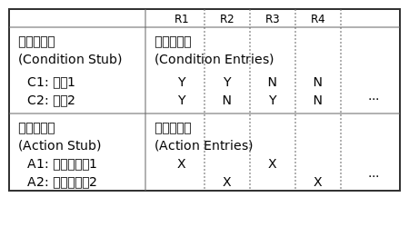
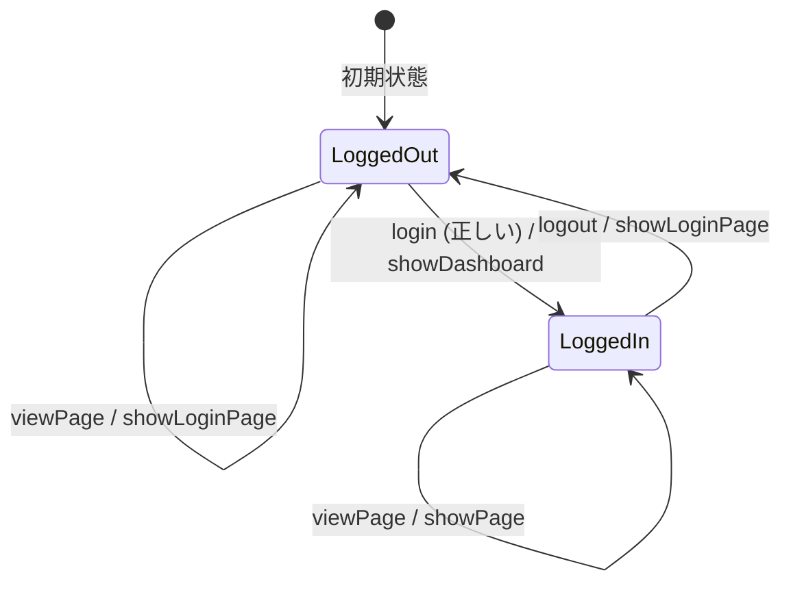

**目次**

- [テスト設計技法入門：効率と網羅性を高めるテストケース作成術](#テスト設計技法入門効率と網羅性を高めるテストケース作成術)
- [はじめに：テスト条件からテストケースへ、技法を学ぶ意義](#はじめにテスト条件からテストケースへ技法を学ぶ意義)
- [テスト設計技法とは？ なぜ必要なのか？：テスト作成を体系化する「道具箱」](#テスト設計技法とは-なぜ必要なのかテスト作成を体系化する道具箱)
  - [テスト設計技法の役割：効率性と網羅性の向上](#テスト設計技法の役割効率性と網羅性の向上)
  - [技法を使わないテスト作成の課題](#技法を使わないテスト作成の課題)
  - [テスト技法の分類：ブラックボックスとホワイトボックス](#テスト技法の分類ブラックボックスとホワイトボックス)
- [ブラックボックステスト技法：仕様からテストを作る技術](#ブラックボックステスト技法仕様からテストを作る技術)
  - [3.1 同値分割法：効率的に代表値を選ぶ](#31-同値分割法効率的に代表値を選ぶ)
    - [3.1.1 この技法は何？：同じ扱いのデータをグループ化する](#311-この技法は何同じ扱いのデータをグループ化する)
    - [3.1.2 どんなときに使う？：入力範囲が広い、選択肢が多い場合](#312-どんなときに使う入力範囲が広い選択肢が多い場合)
    - [3.1.3 どうやって使う？：同値クラスの特定と代表値の選択](#313-どうやって使う同値クラスの特定と代表値の選択)
    - [3.1.4 メリットと注意点](#314-メリットと注意点)
  - [3.2 境界値分析：境界を狙い撃ちする](#32-境界値分析境界を狙い撃ちする)
    - [3.2.1 この技法は何？：エラーが出やすい境界をテストする](#321-この技法は何エラーが出やすい境界をテストする)
    - [3.2.2 どんなときに使う？：数値範囲、文字数制限などの境界がある場合](#322-どんなときに使う数値範囲文字数制限などの境界がある場合)
    - [3.2.3 どうやって使う？：境界値とその隣の値を選択 (同値分割と併用)](#323-どうやって使う境界値とその隣の値を選択-同値分割と併用)
    - [3.2.4 メリットと注意点](#324-メリットと注意点)
  - [3.3 デシジョンテーブル：複雑な条件の組み合わせを整理する](#33-デシジョンテーブル複雑な条件の組み合わせを整理する)
    - [3.3.1 この技法は何？：条件と動作を表で整理する](#331-この技法は何条件と動作を表で整理する)
    - [3.3.2 どんなときに使う？：複数の条件が絡み合うロジック](#332-どんなときに使う複数の条件が絡み合うロジック)
    - [3.3.3 どうやって使う？：条件記述部と動作記述部の作成、ルールの抽出](#333-どうやって使う条件記述部と動作記述部の作成ルールの抽出)
    - [3.3.4 メリットと注意点](#334-メリットと注意点)
  - [3.4 状態遷移テスト：システムの「状態」の変化を追う](#34-状態遷移テストシステムの状態の変化を追う)
    - [3.4.1 この技法は何？：状態と遷移に着目してテストする](#341-この技法は何状態と遷移に着目してテストする)
    - [3.4.2 どんなときに使う？：状態を持つシステム（例：自動販売機、ログイン状態）](#342-どんなときに使う状態を持つシステム例自動販売機ログイン状態)
    - [3.4.3 どうやって使う？：状態遷移図/表の作成、遷移の網羅](#343-どうやって使う状態遷移図表の作成遷移の網羅)
    - [3.4.4 メリットと注意点](#344-メリットと注意点)
  - [3.5 組み合わせテスト（ペアワイズ法など）：多数のパラメータを効率よく](#35-組み合わせテストペアワイズ法など多数のパラメータを効率よく)
    - [3.5.1 この技法は何？：パラメータの組み合わせを効率的にテストする](#351-この技法は何パラメータの組み合わせを効率的にテストする)
    - [3.5.2 どんなときに使う？：設定項目、検索条件などパラメータが多い場合](#352-どんなときに使う設定項目検索条件などパラメータが多い場合)
    - [3.5.3 どうやって使う？：ペアの組み合わせを網羅するテストケース作成](#353-どうやって使うペアの組み合わせを網羅するテストケース作成)
    - [3.5.4 メリットと注意点](#354-メリットと注意点)
- [ホワイトボックステスト技法（概要）：コードの中身を見てテストを作る技術](#ホワイトボックステスト技法概要コードの中身を見てテストを作る技術)
  - [ホワイトボックステストの考え方](#ホワイトボックステストの考え方)
  - [代表的なカバレッジ基準（命令網羅、分岐網羅など）の紹介](#代表的なカバレッジ基準命令網羅分岐網羅などの紹介)
  - [ブラックボックステストとの使い分け](#ブラックボックステストとの使い分け)
- [技法の選択と組み合わせ：適切な道具を選ぶ技術](#技法の選択と組み合わせ適切な道具を選ぶ技術)
  - [状況に応じた技法の選択](#状況に応じた技法の選択)
  - [複数の技法を組み合わせる効果](#複数の技法を組み合わせる効果)
  - [経験の重要性](#経験の重要性)
- [おわりに：テスト設計技法を武器にするために](#おわりにテスト設計技法を武器にするために)

# テスト設計技法入門：効率と網羅性を高めるテストケース作成術

# はじめに：テスト条件からテストケースへ、技法を学ぶ意義

若手エンジニアの皆さん、「テスト設計入門」ではテストの目的を定め、対象を理解し、テストすべき条件を洗い出すプロセスについて学びましたね。しかし、洗い出したテスト条件を、そのまま 1 つ 1 つテストケースにしていくのは、多くの場合、現実的ではありません。なぜなら、ソフトウェアが取りうる状況や入力の組み合わせは膨大であり、すべてをテストしようとすると時間もコストも際限なくかかってしまうからです。

かといって、やみくもにテストケースを間引いてしまっては、重要な欠陥を見逃してしまうリスクが高まります。ここで必要になるのが、「**テスト設計技法**」の知識です。

テスト設計技法とは、洗い出したテスト条件の中から、**欠陥を発見する可能性が高く、かつ効率的なテストケースを選び出すための体系的な考え方や手順**のことです。いわば、テストケース作成における「定石」や「ノウハウ」と言えるでしょう。

この資料では、数多く存在するテスト設計技法の中から、とくに基本的で広く使われているものを中心に紹介します。これらの技法を身につけることで、皆さんのテスト設計は次のように変わるはずです。

- **テストの抜け漏れを防ぎ、網羅性を高めることができる。**
- **テストケースの数を最適化し、テストの効率を上げることができる。**
- **根拠に基づいたテストケースを作成し、テストの品質と説得力を高めることができる。**

テスト設計技法は、単なるテクニックの紹介ではありません。ソフトウェアのどこに欠陥が潜みやすいのか、どのようにすれば効率的にそれを見つけ出せるのか、といったテストに関する深い洞察に基づいています。この資料を通じて、テスト設計技法という「武器」を手に入れ、皆さんのテスト設計スキルをさらに向上させるための一助となることを願っています。

---

# テスト設計技法とは？ なぜ必要なのか？：テスト作成を体系化する「道具箱」

## テスト設計技法の役割：効率性と網羅性の向上

「テスト設計入門」で学んだように、テスト設計のプロセスでは、まずテスト対象を理解し、テストすべき条件を洗い出します。しかし、洗い出したテスト条件は、そのままではテストケースとして不十分な場合や、数が多すぎる場合があります。

たとえば、「年齢入力フィールド（18 歳以上 65 歳未満が有効）」というテスト条件があったとします。この条件を満たす年齢は無数に存在しますが、すべての年齢をテストすることはできませんよね。また、「OS (3 種類)」「ブラウザ (4 種類)」「ユーザー権限 (2 種類)」の組み合わせをテストする場合、単純計算で 3 x 4 x 2 = 24 通りの組み合わせがありますが、すべてをテストするのは大変です。

ここでテスト設計技法が登場します。テスト設計技法は、このような膨大なテスト対象の中から、**より少ないテストケースで、より効果的に欠陥を発見する**ための「知恵」や「戦略」を提供してくれます。具体的には、以下のような役割を果たします。

1. **テストケースの選択:** 無限に近いテスト対象の中から、欠陥を発見する可能性が高い、あるいは重要な動作を確認できる、意味のあるテストケースを選択するための基準を与えます。
2. **テストケース数の最適化:** すべての組み合わせをテストするのではなく、一定の網羅性を保ちつつ、テストケース数を現実的な範囲に削減するための方法を示します。
3. **網羅性の確保:** 特定の観点（たとえば、条件の組み合わせ、状態の遷移など）について、テストの抜け漏れがないかを体系的にチェックするための枠組みを提供します。
4. **テスト設計の標準化:** チーム内で共通の技法を用いることで、テスト設計のプロセスや成果物の品質を一定に保ち、コミュニケーションを円滑にします。

テスト設計技法は、テスト設計者の経験や勘だけに頼るのではなく、論理的かつ体系的にテストケースを導き出すための強力な「道具箱」なのです。

## 技法を使わないテスト作成の課題

もし、テスト設計技法を知らずに、あるいは使わずにテストケースを作成しようとすると、どうなるでしょうか？

- **経験と勘頼り:** どのようなテストケースを選べばよいかの判断が、個人の経験や勘に大きく依存してしまいます。経験豊富なエンジニアであれば質の高いテストができるかもしれませんが、経験の浅いエンジニアにとっては難しい作業となり、品質にばらつきが出やすくなります。
- **非効率と抜け漏れ:** 「念のためこれもテストしておこう」「これもやっておいた方が安心だ」と、場当たり的にテストケースを追加していくと、重複したテストや、効果の薄いテストが増えがちです。一方で、開発者自身が思いもよらないような条件や組み合わせが見落とされ、テスト漏れが発生するリスクも高まります。
- **説明責任の欠如:** なぜそのテストケースを選んだのか、なぜその数で十分だと言えるのか、といった問いに対して、客観的・論理的な根拠を示すことが難しくなります。テストの妥当性を他者に説明したり、レビューしたりすることが困難になります。

これらの課題は、テストのコスト増加や、品質の低下、リリース遅延などに繋がる可能性があります。テスト設計技法を学ぶことは、こうした課題を克服し、よりプロフェッショナルなテスト活動を行うための第一歩となります。

## テスト技法の分類：ブラックボックスとホワイトボックス

テスト設計技法は、テストケースを作成する際に「何に着目するか」によって、大きく 2 つのカテゴリに分類されます。

1. **ブラックボックステスト技法 (Black-Box Test Techniques)**
   - ソフトウェアの内部構造（コード）を見ずに、**外部から見た仕様**（入力と出力の関係）に基づいてテストケースを設計する技法です。まるで中身が見えない「黒い箱」を扱うように、入力に対して期待通りの出力が得られるかを確認します。
   - 主なテストベースは、要求仕様書やユーザーマニュアルなどです。
   - この資料で中心的に解説する**同値分割法、境界値分析、デシジョンテーブル、状態遷移テスト、組み合わせテスト**などは、このブラックボックステスト技法に分類されます。
2. **ホワイトボックステスト技法 (White-Box Test Techniques)**
   - ソフトウェアの**内部構造**（ソースコードのロジック、分岐、パスなど）に基づいてテストケースを設計する技法です。プログラムの「中身が見える箱」を扱うように、コードの各部分が意図通りに実行されるかを確認します。
   - 主なテストベースは、ソースコードや詳細設計書などです。
   - **命令網羅**（ステートメントカバレッジ）、**分岐網羅**（ブランチカバレッジ）といったコードカバレッジ基準を満たすためのテストケース作成などが、この技法に含まれます。

一般的に、ブラックボックステストは「仕様通りに機能するか」を検証するのに適しており、ホワイトボックステストは「コード内部のロジックに問題がないか」を検証するのに適しています。効果的なテストのためには、これらの技法を目的に応じて適切に選択し、組み合わせて使うことが重要です。

この資料では、まずは仕様に基づいてテストを設計する際に広く使われる「ブラックボックステスト技法」を中心に、具体的な使い方や考え方を学んでいきましょう。

---

# ブラックボックステスト技法：仕様からテストを作る技術

ブラックボックステスト技法は、ソフトウェアの内部構造（コードがどう書かれているか）を考慮せず、入力とそれに対する出力（振る舞い）の関係性に着目してテストケースを設計するアプローチです。ユーザーや外部システムから見たソフトウェアの動作を検証するのに適しています。ここでは、代表的なブラックボックステスト技法を 5 つ紹介します。

## 3.1 同値分割法：効率的に代表値を選ぶ

### 3.1.1 この技法は何？：同じ扱いのデータをグループ化する

ソフトウェアへの入力や、満たすべき条件を考えるとき、多くの場合、「ある範囲の値は、プログラム内部で同じように処理され、同じ結果になるだろう」と期待できるグループが存在します。たとえば、年齢を入力するシステムで「18 歳以上は成人として扱う」という仕様があれば、「20 歳」も「30 歳」も「50 歳」も、システム内部では同じ「成人」という扱いを受けるはずです。

同値分割法（Equivalence Partitioning）は、このように**同じ結果をもたらすと期待される入力値や条件の集合 (グループ)** を「**同値クラス**」または「**同値パーティション**」として識別し、**各同値クラスから代表的な値を 1 つだけ選んでテストケースとする**、という考え方に基づいた技法です。『はじめて学ぶソフトウェアのテスト技法』など、多くのテスト入門書で基本として紹介されています。

もし、ある同値クラスの代表値でテストして問題がなければ、同じクラスの他の値でテストしても、おそらく同じように問題なく動作するだろう、と考えるわけです。これにより、テストすべき値の候補が無数にある場合でも、テストケースの数を大幅に削減し、効率的にテストを行うことができます。

### 3.1.2 どんなときに使う？：入力範囲が広い、選択肢が多い場合

同値分割法は、以下のような状況でとくに有効です。

- **数値入力:** 年齢、個数、金額など、入力可能な数値の範囲が広い場合。
- **文字列入力:** 文字数制限がある場合や、特定の文字種（半角英数字のみ、など）が要求される場合。
- **選択肢:** ドロップダウンリストやラジオボタンのように、複数の選択肢の中から 1 つを選ぶ場合。
- **条件:** 特定の条件を満たすかどうか（例：会員である/ない、在庫がある/ない）で処理が変わる場合。

これらの状況で、すべての可能な入力や条件をテストするのは現実的ではありません。同値分割法を使うことで、テストすべき本質的なパターンを効率的に抽出できます。

### 3.1.3 どうやって使う？：同値クラスの特定と代表値の選択

同値分割法を適用する手順は、以下のようになります。

1. **テスト対象の入力条件や出力条件を特定する**  
   仕様書などから、テストすべき入力項目や、満たすべき条件を洗い出します。入力だけでなく、期待される出力に対しても同値分割を適用できます（例：計算結果が正の値になるグループ、ゼロになるグループ、負の値になるグループ）。
2. **有効同値クラスと無効同値クラスを特定する**
   - **有効同値クラス:** 仕様上、**有効**とみなされる入力値や条件のグループです。システムが正常に処理することが期待される値の集まりです。
   - **無効同値クラス:** 仕様上、**無効**または**エラー**として扱われるべき入力値や条件のグループです。システムがエラー処理をすることが期待される値の集まりです。
3. **各同値クラスから代表値を選択する**  
   特定した各同値クラスの中から、テストに使用する**代表値を 1 つ**選びます。代表値は、そのクラスの典型的な値であれば基本的に何でも構いませんが、クラスの中央値や、後述する境界値に近い値などが選ばれることもあります。
4. **テストケースを作成する**  
   選択した代表値を使って、具体的なテスト手順と期待結果を記述したテストケースを作成します。

**例：年齢入力フィールド（18 歳以上 65 歳未満が有効）**

1. **入力条件:** 年齢（整数）
2. **同値クラスの特定:**
   - 無効同値クラス 1: 17 歳以下 (`age < 18`)
   - 有効同値クラス: 18 歳以上 65 歳未満 (`18 <= age < 65`)
   - 無効同値クラス 2: 65 歳以上 (`age >= 65`)
3. **代表値の選択:**
   - 無効 1 から: 10
   - 有効から: 30
   - 無効 2 から: 70
4. **テストケース作成:**
   - TC1: 年齢に 10 を入力 → エラーメッセージが表示されること。
   - TC2: 年齢に 30 を入力 → 正常に受け付けられること。
   - TC3: 年齢に 70 を入力 → エラーメッセージが表示されること。

このように、無数にある年齢の中から、たった 3 つのテストケースで、仕様の主要なパターンをテストすることができました。

### 3.1.4 メリットと注意点

**メリット:**

- **テストケース数の削減:** テストすべき値の候補が膨大にある場合でも、同値クラスという考え方に基づいて代表値を選ぶことで、テストケース数を大幅に削減でき、テストの効率が向上します。
- **網羅性の向上（ある程度）:** やみくもにテストするのに比べ、仕様に基づいたグループ分けを行うため、意図しないテスト漏れを防ぎやすくなります。とくに無効同値クラスを考慮することで、エラー処理のテストも体系的に行えます。
- **適用しやすさ:** 考え方が比較的シンプルで、さまざまな種類の入力や条件に対して適用しやすい技法です。

**注意点:**

- **同値クラスの特定:** どの範囲を「同じ扱い」とみなすか、その同値クラスの分割が適切でないと、テストの効果が薄れてしまいます。仕様の深い理解が必要です。
- **境界での欠陥の見逃し:** 同値クラスの内部の値では問題なくても、クラスの境界付近でバグが発生することがあります。同値分割法だけでは、境界付近の欠陥を見逃す可能性があります。そのため、**通常は境界値分析と組み合わせて使用されます**。
- **組み合わせの考慮不足:** 複数の入力条件が絡み合って動作が決まる場合、同値分割法だけでは条件の組み合わせに関する問題を見つけにくいことがあります。そのような場合は、デシジョンテーブルや組み合わせテストなどの技法を併用する必要があります。

同値分割法は、テスト設計の基本中の基本とも言える技法です。単独で使うだけでなく、他の技法と組み合わせることで、より効果的なテストケース設計が可能になります。

---

## 3.2 境界値分析：境界を狙い撃ちする

### 3.2.1 この技法は何？：エラーが出やすい境界をテストする

ソフトウェア開発における長年の経験から、「**プログラムの誤り（バグ）は、仕様や条件の境界部分で発生しやすい**」ということが知られています。たとえば、「10 文字まで入力可能」という仕様の場合、「10 文字」や「11 文字」を入力したとき、あるいは「0 文字」の場合に問題が起きやすい、といった具合です。

境界値分析（Boundary Value Analysis, BVA）は、この経験則に基づいて、同値クラスの**境界となる値**と、その**境界のすぐ隣の値**（境界のすぐ内側とすぐ外側）を重点的にテストする技法です。同値分割法がグループの「代表」をテストするのに対し、境界値分析はグループの「端っこ」を狙ってテストします。（『ソフトウェアテストの教科書』など多くのテキストで、同値分割法とセットで解説されています。）

なぜ境界で問題が起きやすいのでしょうか？それは、プログラマーが条件判定（たとえば `>` と `>=`、`<` と `<=` の使い分け）を誤ったり、ループの終了条件を間違えたり、境界ぴったりでの計算が特殊なケースになったりすることが多いためです。境界値分析は、こうした間違いを発見するのに非常に効果的です。

### 3.2.2 どんなときに使う？：数値範囲、文字数制限などの境界がある場合

境界値分析は、以下のように明確な「境界」が存在する入力や条件に対して適用されます。

- **数値の範囲:** 年齢（例：18 歳以上）、点数（例：0 点～ 100 点）、個数（例：1 個～ 99 個まで）、金額など。
- **文字数:** パスワードの長さ（例：8 文字～ 16 文字）、コメントの文字数制限（例：200 文字以内）など。
- **日付や時刻:** 有効期間（例：開始日～終了日）、予約可能時間帯など。
- **配列やリストの要素数:** ループ処理の回数、リストの容量制限など。
- **物理的な制限:** メモリ容量、ファイルサイズの上限など。

これらのように、「ここからここまでが有効」「これ以上はダメ」といった境界が定義されている場合に、その境界周辺をテストすることが重要になります。

### 3.2.3 どうやって使う？：境界値とその隣の値を選択 (同値分割と併用)

境界値分析は、**通常、同値分割法と組み合わせて使用されます**。まず同値分割で有効/無効のグループを特定し、その境界に対して境界値分析を適用します。

手順は以下のようになります。

1. **同値分割を行う**  
   テスト対象の入力条件や出力条件について、有効同値クラスと無効同値クラスを特定します（同値分割法の手順 1, 2 と同じ）。
2. **境界値を特定する**  
   各同値クラスの境界となる値を明確にします。
3. **境界値テストケースを選択する**  
   特定した各境界値について、以下の値を選びテストケースとします。
   - **境界値そのもの**
   - **境界値のすぐ内側の値**（有効範囲の場合）
   - **境界値のすぐ外側の値**（無効範囲との境界の場合）
4. **テストケースを作成する**  
   選択した境界値を使って、具体的なテスト手順と期待結果を記述したテストケースを作成します。

**例：年齢入力フィールド（18 歳以上 65 歳未満が有効）**

1. **同値クラス:**
   - 無効 1: `age < 18`
   - 有効: `18 <= age < 65`
   - 無効 2: `age >= 65`
2. **境界値:** 18 と 65
3. **境界値テストケースの選択:**
   - 下限境界 (18) 周辺:
     - 17 （境界のすぐ外側、無効同値クラス 1）
     - 18 （境界値そのもの、有効同値クラスの開始）
     - 19 （境界のすぐ内側、有効同値クラス）
   - 上限境界 (65) 周辺:
     - 64 （境界のすぐ内側、有効同値クラス）
     - 65 （境界値そのもの、無効同値クラス 2 の開始）
     - 66 （境界のすぐ外側、無効同値クラス 2）
4. **テストケース作成:**
   - TC1: 年齢 17 を入力 → エラー
   - TC2: 年齢 18 を入力 → 正常
   - TC3: 年齢 19 を入力 → 正常
   - TC4: 年齢 64 を入力 → 正常
   - TC5: 年齢 65 を入力 → エラー
   - TC6: 年齢 66 を入力 → エラー

同値分割法では代表値として 3 ケースでしたが、境界値分析を加えることで、境界付近を重点的にテストする 6 ケースが導き出されました。多くの場合、**同値分割の代表値テストと境界値テストを組み合わせる**ことで、効率性と網羅性のバランスを取ります。（例：上記の境界値テストケースに、有効同値クラスの代表値として 30 や 40 を加えるなど）

### 3.2.4 メリットと注意点

**メリット:**

- **欠陥検出率の高さ:** 経験的にバグが潜みやすい境界部分を狙ってテストするため、欠陥を発見する可能性が高い技法です。
- **効率性:** すべての値をテストするのではなく、問題が発生しやすい境界に絞ってテストするため、効率的です。
- **適用しやすさ:** 境界が明確な仕様に対しては、比較的容易に適用できます。

**注意点:**

- **境界の特定:** 仕様から正確な境界値を読み取ることが重要です。仕様が曖昧だと、誤った境界でテストしてしまう可能性があります。
- **境界の種類:** 数値だけでなく、文字数、日付、リストの要素数など、さまざまな種類の境界が存在することを意識する必要があります。
- **組み合わせへの考慮不足:** 複数の入力条件が絡み合う場合の境界については、境界値分析だけでは不十分な場合があります。他の技法（デシジョンテーブル、組み合わせテストなど）との併用を検討します。
- **内部構造の考慮:** ブラックボックステスト技法であるため、プログラム内部のロジック（例：内部で +1 してから比較しているなど）に起因する境界問題を見逃す可能性もゼロではありません。

境界値分析は、同値分割法と並んで、テスト設計の基本中の基本であり、非常に強力な欠陥検出手法です。仕様に数値範囲や制限などの境界が含まれている場合は、必ず適用を検討すべき技法と言えるでしょう。

---

## 3.3 デシジョンテーブル：複雑な条件の組み合わせを整理する

### 3.3.1 この技法は何？：条件と動作を表で整理する

ソフトウェアの機能の中には、**複数の条件の組み合わせによって、実行されるべき動作（アクション）や結果が変わる**ような、複雑なルールやロジックを持つものがあります。

たとえば、オンラインショッピングサイトの送料計算ルールを考えてみましょう。「購入金額が 5000 円以上か？」「プレミアム会員か？」「配送先は沖縄・離島か？」といった複数の条件によって、適用される送料が変わるかもしれません。このようなルールを文章だけで記述したり、コード内の `if-else` 文だけで表現しようとすると、条件の組み合わせが漏れていたり、矛盾があったり、あるいは仕様が非常に分かりにくくなったりする可能性があります。

デシジョンテーブル（Decision Table、決定表）は、このような**複数の条件とその組み合わせ、そして各組み合わせに対応するアクション（動作や結果）を表形式で整理し、明確にする**ためのテスト設計技法です。『はじめて学ぶソフトウェアのテスト技法』などでも、複雑なビジネスルールを扱う際に有効な手法として紹介されています。

デシジョンテーブルを使うことで、複雑な条件分岐のロジックを視覚的に分かりやすく表現でき、仕様の曖昧さ、矛盾、網羅性の欠如などを発見しやすくなります。そして、作成したデシジョンテーブルの各ルール（条件の組み合わせと対応するアクション）が、そのままテストケースの元となります。

**基本的なデシジョンテーブルの構成**

- **条件部（Condition Stub）**: 判断基準となる条件を列挙
- **条件エントリー（Condition Entry）**: 各条件の値（Y/N、T/F など）
- **動作記述部（Action Stub）**: 実行すべき行動を列挙
- **動作エントリー（Action Entry）**: 各行動を実行するかどうか（×/○ など）

### 3.3.2 どんなときに使う？：複数の条件が絡み合うロジック

デシジョンテーブルは、以下のような状況でテスト設計を行う際にとくに役立ちます。

- **複数の入力条件やビジネスルールの組み合わせによって、システムの動作や出力が決定される場合。**（例：保険料の計算、割引率の適用、承認ワークフローの分岐など）
- **仕様書が文章で記述されており、条件分岐のロジックが複雑で分かりにくい場合。**（表形式で整理することで理解が深まる）
- **条件の組み合わせに漏れや矛盾がないかを確認したい場合。**
- **複雑なロジックに対するテストケースを体系的に作成したい場合。**

条件の数が少ない（1 つか 2 つ程度）単純な分岐であれば、デシジョンテーブルを作成するまでもないかもしれません。しかし、条件が 3 つ以上絡み合ってくると、この技法の効果が顕著になります。

### 3.3.3 どうやって使う？：条件記述部と動作記述部の作成、ルールの抽出

デシジョンテーブルの作成手順は、一般的に以下のようになります。

1. **条件の洗い出し**  
   システムの動作に影響を与えるすべての独立した条件をリストアップします。条件は、通常「Yes/No」または「True/False」で答えられる形式にします。（例：「購入金額は 5000 円以上か？」「プレミアム会員か？」）
2. **アクションの洗い出し**  
   各条件の組み合わせによって実行される可能性のあるすべてのアクション（システムの動作や出力）をリストアップします。（例：「送料無料にする」「通常送料を適用する」「割引を適用する」）
3. **テーブルの作成**
   - 表の上半分に条件を列挙します（**条件記述部**）。
   - 表の下半分にアクションを列挙します（**動作記述部**）。
4. **ルールの作成（条件の組み合わせとアクションの決定）**
   - 条件記述部の右側に、考えられるすべての条件の組み合わせ（通常は Y/N または T/F で表現）を列として記入します。条件が n 個あれば、理論上 2^n 通りの組み合わせが存在します。
   - 各条件の組み合わせ（列）に対して、実行されるべきアクションを動作記述部の対応するセルにマーク（例：'X'印）で示します。これが 1 つの**ルール**（規則）となります。
5. **テーブルの単純化（任意）**
   - もし、特定の条件の値（Y か N か）にかかわらずアクションが同じになるルールが存在する場合、その条件を「Don't Care（どうでもよい）」とし、テーブルを圧縮・単純化できることがあります。（例：購入金額にかかわらずプレミアム会員なら常に割引、など）
   - 論理的にありえない条件の組み合わせのルールは削除します。
   - 同じアクションになるルールをまとめることもあります。
6. **テストケースの作成**  
   作成（または単純化）されたデシジョンテーブルの**各ルール（列）が、1 つ以上のテストケースに対応**します。各ルールを満たすような具体的な入力値や状況を設定し、対応するアクションが期待通り実行されることを確認するテストケースを作成します。

**例：送料計算ルール**

- 条件 1 (C1): 購入金額 5000 円以上 (Y/N)
- 条件 2 (C2): プレミアム会員 (Y/N)
- アクション 1 (A1): 送料無料
- アクション 2 (A2): 送料 500 円
- アクション 3 (A3): プレミアム割引適用

| 条件/ルール     | R1  | R2  | R3  | R4  | R5  | R6  | R7  | R8  |
| :-------------- | :-: | :-: | :-: | :-: | :-: | :-: | :-: | :-: |
| C1: >= 5000 円  |  Y  |  Y  |  Y  |  Y  |  N  |  N  |  N  |  N  |
| C2: プレミアム  |  Y  |  Y  |  N  |  N  |  Y  |  Y  |  N  |  N  |
| **アクション**  |     |     |     |     |     |     |     |     |
| A1: 送料無料    |  X  |  -  |  X  |  -  |  -  |  -  |  -  |  -  |
| A2: 送料 500 円 |  -  |  -  |  -  |  -  |  X  |  -  |  X  |  -  |
| A3: 割引適用    |  X  |  X  |  -  |  -  |  X  |  X  |  -  |  -  |

**(※注意: 上記の R2, R4, R6, R8 はアクションが指定されていません。実際には仕様に基づいて決定します。ここでは例としてアクションを設定します。また、単純化前の状態を示しています。)**

仮に R2, R4, R6, R8 のアクションを以下のように仕様から決定したとします。
(R2: 5000 円以上プレミアム → 送料無料＆割引、R4: 5000 円以上非プレミアム → 送料無料、R6: 5000 円未満プレミアム → 送料 500 円＆割引、R8: 5000 円未満非プレミアム → 送料 500 円)

完成したデシジョンテーブル（単純化前）:

| 条件/ルール     | R1  | R2  | R3  | R4  | R5  | R6  | R7  | R8  |
| :-------------- | :-: | :-: | :-: | :-: | :-: | :-: | :-: | :-: |
| C1: >= 5000 円  |  Y  |  Y  |  Y  |  Y  |  N  |  N  |  N  |  N  |
| C2: プレミアム  |  Y  |  Y  |  N  |  N  |  Y  |  Y  |  N  |  N  |
| **アクション**  |     |     |     |     |     |     |     |     |
| A1: 送料無料    |  X  |  X  |  X  |  X  |  -  |  -  |  -  |  -  |
| A2: 送料 500 円 |  -  |  -  |  -  |  -  |  X  |  X  |  X  |  X  |
| A3: 割引適用    |  X  |  X  |  -  |  -  |  X  |  X  |  -  |  -  |

この場合、8 つのルールそれぞれに対応するテストケースを作成します。たとえば、ルール R1 をテストするケースは「購入金額 6000 円、プレミアム会員」→「送料無料、割引適用を確認」となります。

**(単純化の例)** 上記テーブルを見ると、C1 が Y なら必ず A1 が X、C1 が N なら必ず A2 が X になっています。また、C2 が Y なら必ず A3 が X です。これを利用して単純化できます。

単純化後（例）：

| 条件/ルール     | R1' | R2' | R3' |
| :-------------- | :-: | :-: | :-: |
| C1: >= 5000 円  |  Y  |  N  |  N  |
| C2: プレミアム  |  Y  |  Y  |  N  |
| **アクション**  |     |     |     |
| A1: 送料無料    |  X  |  -  |  -  |
| A2: 送料 500 円 |  -  |  X  |  X  |
| A3: 割引適用    |  X  |  X  |  -  |

この単純化されたテーブルから、3 つのテストケースを作成します。

### 3.3.4 メリットと注意点

**メリット:**

- **網羅性の向上:** 複雑な条件の組み合わせを体系的に洗い出すため、考慮漏れを防ぎ、テストの網羅性を高めることができます。仕様の矛盾や曖昧さを発見するのにも役立ちます。
- **仕様理解の促進:** デシジョンテーブルを作成するプロセス自体が、仕様に対する深い理解を促します。関係者間での仕様確認ツールとしても有効です。
- **テストケース作成の効率化:** テーブルの各ルールがテストケースの元となるため、複雑なロジックに対するテストケースを効率的に、かつ根拠を持って作成できます。

**注意点:**

- **条件の数の爆発:** 条件の数が増えると、組み合わせの数は指数関数的に増加します (2^n)。すべての組み合わせをテストするのが現実的でない場合は、リスクの高い組み合わせに絞ったり、後述の組み合わせテスト技法を適用したりする必要があります。
- **テーブル作成の手間:** 条件やアクションの洗い出し、ルールの決定、単純化など、デシジョンテーブルの作成自体に手間がかかる場合があります。
- **条件の独立性:** この技法は、各条件が互いに独立していることを前提としています。条件間に依存関係がある場合は、適用が難しくなるか、工夫が必要になります。

デシジョンテーブルは、とくにビジネスルールや制御ロジックが複雑な場合に、その仕様を明確にし、テストの網羅性を高めるための非常に有効な技法です。仕様書を読むだけでは分かりにくいと感じたら、この技法の適用を検討してみると良いでしょう。

---

## 3.4 状態遷移テスト：システムの「状態」の変化を追う

### 3.4.1 この技法は何？：状態と遷移に着目してテストする

私たちが日常で使う多くの製品やシステムは、そのときどきの「**状態 (State)**」によって、できることや振る舞いが変わります。たとえば、スマートフォンの画面は「ロック状態」「ホーム画面表示状態」「アプリ実行状態」などがあり、それぞれの状態でできる操作や画面の表示が異なります。エレベーターも「停止中」「上昇中」「下降中」「ドア開き中」「ドア閉まり中」といった状態を持ち、状態によってボタンを押したときの反応が変わります。

このように、システムが内部的に持つ「状態」と、ある状態から別の状態へ移るきっかけとなる「**イベント (Event)**」（ユーザーの操作、時間の経過、外部からの通知など）、そして状態が変わる際や特定の状態で行われる「**アクション (Action)**」（システムの動作や応答）に着目してテストケースを設計する技法が、**状態遷移テスト (State Transition Testing)** です。

この技法では、システムの振る舞いを「状態」と「遷移」のモデルとして捉え、そのモデルに基づいてテストを行います。モデルを視覚的に表現するために、**状態遷移図 (State Transition Diagram)** や**状態遷移表 (State Transition Table)** がよく用いられます。（『ソフトウェアテストの教科書』などで図や表を用いた手法が紹介されています。）

### 3.4.2 どんなときに使う？：状態を持つシステム（例：自動販売機、ログイン状態）

状態遷移テストは、以下のように明確な「状態」とその間の「遷移」が存在するシステムのテストにとくに有効です。

- **GUI アプリケーション:** 画面の状態（例：初期表示、入力中、確認画面、完了画面）や、コンポーネントの状態（例：ボタンの有効/無効、チェックボックスのオン/オフ）の遷移。
- **組み込みシステム:** 自動販売機、ATM、家電製品など、内部状態によって動作が変わる機器。
- **ワークフローシステム:** 申請、承認、却下といった業務プロセスの状態遷移。
- **通信プロトコル:** 接続確立、データ送受信、切断といった通信シーケンスの状態管理。
- **ユーザーセッション管理:** Web アプリケーションにおけるログイン状態、ログアウト状態、セッションタイムアウトなど。

これらのシステムでは、特定の状態での振る舞いや、予期しないイベントが発生したときの状態遷移などにバグが潜んでいることが多いため、状態遷移テストが効果を発揮します。

### 3.4.3 どうやって使う？：状態遷移図/表の作成、遷移の網羅

状態遷移テストの一般的な手順は以下の通りです。

1. **状態の洗い出し**  
   システムが取りうるすべての状態を特定し、リストアップします。状態は互いに排他的（同時に複数の状態になることはない）である必要があります。
2. **イベントの洗い出し**  
   ある状態から別の状態へ遷移を引き起こす可能性のあるイベント（ユーザー操作、外部入力、内部条件など）をすべて洗い出します。
3. **アクションの洗い出し**  
   状態遷移時や特定の状態においてシステムが行うべきアクション（処理、出力、応答など）を特定します。
4. **状態遷移モデルの作成**  
   洗い出した状態、イベント、アクションの関係性を状態遷移図または状態遷移表で表現します。
   - **状態遷移図:** 状態をノード（円や箱）、イベントとアクションを矢印（遷移）で表現した図です。視覚的に分かりやすいのが特徴です。
   - **状態遷移表:** 縦軸に現在の状態、横軸にイベントを配置し、各セルに遷移先の状態と実行されるアクションを記述した表です。網羅的な確認に適しています。
5. **テストケースの設計（網羅基準の適用）**  
   作成した状態遷移モデルに基づいて、テストケースを設計します。どのような遷移パスをテストするかを決定するために、以下のような**網羅基準 (カバレッジ基準)** が用いられます。
   - **全状態網羅 (All States Coverage):** すべての状態を少なくとも 1 回はテストする。（もっとも基本的な基準）
   - **全イベント網羅 (All Events Coverage):** すべてのイベントを少なくとも 1 回はテストする。（通常、全状態網羅と組み合わせて使う）
   - **全遷移網羅 (All Transitions Coverage):** 可能なすべての状態遷移（図の矢印、表のセル）を少なくとも 1 回はテストする。（より強力な基準）
   - **全アクション網羅 (All Actions Coverage):** すべてのアクションが少なくとも 1 回は実行されるようにテストする。
   - **(発展)** 0 スイッチカバレッジ（全遷移網羅と同じ）、1 スイッチカバレッジ（連続する 2 つの遷移を網羅）、n スイッチカバレッジなど、より高度な基準もあります。
6. **テストケースの作成**  
   選択した網羅基準を満たすように、具体的なテスト手順（イベントを発生させる操作）、期待される状態遷移、および期待されるアクションを記述したテストケースを作成します。

**例：シンプルなログイン状態管理**

- **状態:** 未ログイン (LoggedOut), ログイン中 (LoggedIn)
- **イベント:** login (正しい ID/PW), login (誤った ID/PW), logout, viewPage (ページ閲覧)
- **アクション:** showLoginPage, showDashboard, showError, showPage

**状態遷移図（例）:**

**状態遷移表（例）:**

| 現在状態  | イベント            | 次の状態  | アクション    |
| :-------- | :------------------ | :-------- | :------------ |
| LoggedOut | login (正しい)      | LoggedIn  | showDashboard |
| LoggedOut | login (誤り)        | LoggedOut | showError     |
| LoggedOut | logout              | LoggedOut | (何もしない)  |
| LoggedOut | viewPage            | LoggedOut | showLoginPage |
| LoggedIn  | login (正しい/誤り) | LoggedIn  | (何もしない)  |
| LoggedIn  | logout              | LoggedOut | showLoginPage |
| LoggedIn  | viewPage            | LoggedIn  | showPage      |

**テストケース設計（全遷移網羅を目指す場合）:**

- TC1: LoggedOut 状態で正しい login → LoggedIn に遷移し、Dashboard が表示されることを確認。
- TC2: LoggedOut 状態で誤った login → LoggedOut のままで、エラーが表示されることを確認。
- TC3: LoggedOut 状態で logout → LoggedOut のままで、変化がないことを確認。
- TC4: LoggedOut 状態で viewPage → LoggedOut のままで、LoginPage が表示されることを確認。
- TC5: LoggedIn 状態で login → LoggedIn のままで、変化がないことを確認。
- TC6: LoggedIn 状態で logout → LoggedOut に遷移し、LoginPage が表示されることを確認。
- TC7: LoggedIn 状態で viewPage → LoggedIn のままで、要求した Page が表示されることを確認。

この 7 ケースで、表中のすべての有効な遷移（矢印）をテストできます。

### 3.4.4 メリットと注意点

**メリット:**

- **状態遷移の網羅:** システムの状態変化に関するロジックを体系的にテストでき、遷移漏れや予期しない状態での振る舞いといった欠陥を発見しやすくなります。
- **仕様理解の深化:** 状態遷移図や表を作成する過程で、システムの振る舞いや状態遷移に関する仕様の理解が深まり、曖昧さや矛盾を発見する助けになります。
- **テストケースの明確化:** どの状態からどのイベントでテストを行うかが明確になり、テストケースの設計とレビューが容易になります。

**注意点:**

- **状態爆発:** システムが持つ状態の数や、状態間の遷移を引き起こすイベントの種類が多くなると、状態遷移図や表が非常に複雑になり、管理や網羅的なテストが困難になる（「状態爆発」と呼ばれる）ことがあります。適切な粒度でモデル化する工夫が必要です。
- **状態の特定:** システムが内部的にどのような状態を持っているのかを正確に把握することが、この技法の適用の前提となります。状態が外部から観測しにくい場合、適用が難しいこともあります。
- **イベントのタイミング:** イベントが発生するタイミングや順序によってシステムの振る舞いが変わる場合、単純な状態遷移テストだけでは不十分なことがあります。他の技法（例：タイミングテスト）との組み合わせが必要になる場合があります。

状態遷移テストは、システムの動的な振る舞い、とくに状態の変化に関連する問題を検出するための重要な技法です。状態を持つシステムの開発に関わる際には、ぜひ活用を検討してみてください。

---

## 3.5 組み合わせテスト（ペアワイズ法など）：多数のパラメータを効率よく

### 3.5.1 この技法は何？：パラメータの組み合わせを効率的にテストする

現代のソフトウェアは、多くの設定項目、オプション、入力パラメータを持っており、それらの組み合わせによって動作が変わることがよくあります。たとえば、Web アプリケーションの互換性テストでは、「OS の種類」「ブラウザの種類」「画面解像度」「言語設定」など、多くの要因（パラメータ）が絡み合います。

これらの要因のすべての組み合わせをテストしようとすると、テストケースの数はあっという間に膨大な数になってしまいます。仮に OS が 3 種類、ブラウザが 4 種類、解像度が 3 種類、言語が 2 種類あるとすると、単純な掛け算で 3 x 4 x 3 x 2 = 72 通りの組み合わせテストが必要になります。要因や、各要因が取りうる値（水準）が増えれば、テストケース数は指数関数的に増加し、現実的な時間とコストですべてをテストすることは不可能になります。

しかし、ソフトウェアの不具合に関する調査から、「**ほとんどの不具合は、高々 1 つまたは 2 つの要因（パラメータ）の特定の組み合わせによって引き起こされる**」という経験則が知られています。3 つ以上の要因が複雑に絡み合ってはじめて発生する不具合は、比較的少ないのです。

組み合わせテスト（Combinatorial Testing）は、この経験則を利用して、**すべての要因の組み合わせをテストする代わりに、少なくともすべての「ペア（2 つの要因）の組み合わせ」を網羅するようにテストケースを効率的に設計する**技法です。とくに、すべてのペアの組み合わせを網羅する「**ペアワイズ法（Pairwise Testing / All-Pairs Testing）**」がよく知られています。（『ソフトウェアテスト技法ドリル』などで具体的な手法が紹介されています。）

すべての組み合わせ（網羅的テスト）に比べてテストケース数を大幅に削減しつつも、多くの不具合を発見できる可能性が高い、非常に実用的な技法です。

### 3.5.2 どんなときに使う？：設定項目、検索条件などパラメータが多い場合

組み合わせテスト、とくにペアワイズ法は、以下のような状況でテストケース数を効率的に削減したい場合に非常に有効です。

- **多数の設定項目を持つ機能:** ソフトウェアの環境設定画面、印刷設定、レポート生成オプションなど。
- **複数の検索条件やフィルタを持つ機能:** Web ショップの商品検索、データベースのクエリ条件など。
- **システムの構成要素の組み合わせ:** OS、ブラウザ、データベース、ミドルウェア、プラグインなどの組み合わせによる互換性テスト。
- **API のパラメータ:** 複数のオプションパラメータを持つ API のテスト。

これらのように、テストすべき要因（パラメータ）が多く、それぞれの要因が取りうる値（水準）も複数存在し、すべての組み合わせをテストするのが現実的でない場合に、この技法の適用を検討します。

### 3.5.3 どうやって使う？：ペアの組み合わせを網羅するテストケース作成

ペアワイズ法などの組み合わせテスト技法を用いてテストケースを作成する手順は、通常以下のようになります。

1. **要因（パラメータ）の特定**
   テスト対象の動作に影響を与えるすべての要因（設定項目、入力パラメータなど）をリストアップします。
2. **水準（値）の特定**
   各要因が取りうる具体的な値（水準）をリストアップします。同値分割法や境界値分析の結果を利用して、各要因の代表的な値や境界値を選ぶことが効果的です。
3. **組み合わせテストツールの利用**
   特定した要因と水準を入力として、ペアワイズ法などのアルゴリズムに基づいてテストケースの組み合わせを生成してくれるツール（多くのフリーウェアや商用ツールが存在します）を利用するのが一般的です。手作業でペアを網羅する組み合わせを作成することも可能ですが、要因や水準が増えると非常に複雑で間違いやすくなります。
   - ツールは、たとえば「直交表」や「All-Pairs アルゴリズム」といった数学的な手法を用いて、できるだけ少ないテストケース数で、すべてのペア（2 要因間）の組み合わせ水準を少なくとも 1 回は含むような組み合わせリストを生成します。
4. **テストケースの作成**
   ツールが出力した組み合わせリストに基づき、具体的なテスト手順と期待結果を記述したテストケースを作成します。

**例：Web サイトの表示テスト**

- **要因:**
  - OS (Windows, macOS, Linux) - 3 水準
  - ブラウザ (Chrome, Firefox, Edge, Safari) - 4 水準
  - 言語 (日本語、英語) - 2 水準
- **水準:** 上記の通り
- **ツールの利用:** これらの要因と水準を組み合わせテストツールに入力します。
- **生成される組み合わせ（例）：** ツールは、全組み合わせ 24 通りではなく、たとえば以下のような 12 ケース程度（ツールにより異なる）ですべてのペアを網羅する組み合わせを生成します。（※あくまで例です）

  | ケース | OS      | ブラウザ | 言語   |
  | :----- | :------ | :------- | :----- |
  | 1      | Windows | Chrome   | 日本語 |
  | 2      | Windows | Firefox  | 英語   |
  | 3      | Windows | Edge     | 日本語 |
  | 4      | Windows | Safari   | 英語   |
  | 5      | macOS   | Chrome   | 英語   |
  | 6      | macOS   | Firefox  | 日本語 |
  | 7      | macOS   | Edge     | 英語   |
  | 8      | macOS   | Safari   | 日本語 |
  | 9      | Linux   | Chrome   | 日本語 |
  | 10     | Linux   | Firefox  | 英語   |
  | 11     | Linux   | Edge     | 日本語 |
  | 12     | Linux   | Safari   | 英語   |

この 12 ケースで、(OS、ブラウザ), (OS、言語), (ブラウザ、言語) のすべてのペアの組み合わせが少なくとも 1 回は出現しています。

### 3.5.4 メリットと注意点

**メリット:**

- **テストケース数の大幅な削減:** 要因や水準が多い場合に、すべての組み合わせをテストする場合と比較して、テストケース数を劇的に削減できます。これにより、テストにかかる時間とコストを大幅に節約できます。
- **高い欠陥検出効果（経験的に）:** 多くの不具合が 2 要因以下の組み合わせで発生するという経験則に基づいているため、削減されたテストケース数でも、比較的高い確率で不具合を発見することが期待できます。
- **体系的な組み合わせの選択:** 勘や経験だけに頼らず、数学的な根拠に基づいて組み合わせを選択するため、テストの網羅性（ペア網羅）を客観的に示すことができます。

**注意点:**

- **3 要因以上の組み合わせ不具合の見逃し:** ペアワイズ法は、3 つ以上の要因が特定の組み合わせになった場合にのみ発生するような不具合は、原理的に見逃す可能性があります。もし特定の組み合わせに高いリスクがあると分かっている場合は、その組み合わせを別途テストケースとして追加（ピンポイントテスト）する必要があります。
- **要因と水準の選定:** どの要因と水準を選ぶかが、テストの効果を大きく左右します。重要な要因や、問題を引き起こしやすい水準（境界値など）を見逃すと、効果が薄れます。
- **ツールの利用:** 効果的な組み合わせを生成するには、専用のツールを利用することが推奨されますが、ツールの選定や使い方に慣れが必要です。
- **期待結果の設定:** 生成された組み合わせごとに、正しい期待結果を設定する必要があります。組み合わせによっては、期待結果を導き出すのが難しい場合もあります。

組み合わせテスト、とくにペアワイズ法は、多因子テストにおけるテストケース爆発の問題に対する非常に強力な解決策です。すべての組み合わせをテストできない現実の中で、効率性と網羅性のバランスを取るための実用的な技法として、多くの場面で活用されています。

---

# ホワイトボックステスト技法（概要）：コードの中身を見てテストを作る技術

これまでに解説してきたブラックボックステスト技法は、ソフトウェアの外部仕様（入力と出力の関係）に着目し、内部構造を知らなくてもテストケースを設計できるアプローチでした。これに対し、ホワイトボックステスト技法（White-Box Test Techniques）は、ソフトウェアの**内部構造、つまりソースコードのロジックや流れを分析**して、それに基づいてテストケースを設計するアプローチです。中身が見える「白い箱（または透明な箱）」をテストするイメージです。

## ホワイトボックステストの考え方

ホワイトボックステストの主な目的は、**プログラムのコードが意図した通りに実行されるか**、**コード内部のすべての経路や条件が適切にテストされているか**を確認することにあります。ブラックボックステストでは見つけにくい、特定のコードパスを通ったときにのみ発生するような欠陥や、実装上の誤りを発見するのに役立ちます。

たとえば、以下のような点を確認します。

- コード中のすべての命令（ステートメント）が少なくとも 1 回は実行されるか？
- 条件分岐（`if` 文など）のすべての結果（真と偽）がテストされるか？
- ループ処理が正しく動作するか（0 回、1 回、複数回実行されるか）？
- 設計通りにデータが処理されているか？

ホワイトボックステストは、主に単体テスト (ユニットテスト)のレベルで、開発者自身によって行われることが多いです。なぜなら、コードの内部構造をもっともよく理解しているのは、そのコードを書いた開発者だからです。（『単体テストの考え方/使い方』でも、開発者による内部構造を意識したテストの重要性が述べられています。）

## 代表的なカバレッジ基準（命令網羅、分岐網羅など）の紹介

ホワイトボックステストにおいて、テストがコードのどの程度をカバーできているかを測る指標として「**コードカバレッジ（Code Coverage）**」があります。テストケースを実行した際に、ソースコードのどの部分が実行されたかを測定し、その割合（網羅率）を示します。100% のカバレッジを目指すことが常に最善とは限りませんが、カバレッジを測定することで、テストが不足している箇所を特定するのに役立ちます。

代表的なカバレッジ基準には、以下のようなものがあります。

- **命令網羅 (Statement Coverage / C0)**  
  コード中のすべての実行可能な命令（ステートメント）が、テスト実行時に少なくとも 1 回は実行されることを目指す基準です。もっとも基本的なカバレッジですが、これだけでは条件分岐のすべてのパターンをテストできない場合があります。
- **分岐網羅 (Branch Coverage / C1)**  
  コード中のすべての条件分岐（`if`, `while` など）について、その結果が真 (True) となる場合と偽 (False) となる場合の両方が、テスト実行時に少なくとも 1 回は実行されることを目指す基準です。命令網羅よりも強力な基準とされます。
- **条件網羅 (Condition Coverage)**  
  複雑な条件式（例： `if (A && B)`）を構成する個々の単純条件（A, B）について、それぞれが真となる場合と偽となる場合の両方が、テスト実行時に少なくとも 1 回は実行されることを目指す基準です。
- **複合条件網羅 / 分岐条件網羅 (Modified Condition/Decision Coverage - MC/DC)**  
  条件網羅と分岐網羅を組み合わせ、さらに「個々の単純条件が、独立して全体の条件式の評価結果に影響を与える」ことを確認する、より厳密な基準です。航空宇宙分野など、高い信頼性が求められるシステムで使われることがあります。
- **経路網羅 (Path Coverage)**  
  プログラム内で実行可能なすべての経路（パス）を少なくとも 1 回は実行することを目指す基準です。ループなどがあると経路数は爆発的に増加するため、完全な経路網羅は現実的でないことが多いです。

これらのカバレッジ基準は、テストの網羅性を測るための指標であり、カバレッジが高いことが必ずしもテストの品質が高いことを意味するわけではありません（たとえば、意味のないテストでカバレッジだけを稼ぐことも可能です）。しかし、カバレッジが著しく低い箇所は、テストが不足している可能性を示唆する重要なサインとなります。

## ブラックボックステストとの使い分け

ブラックボックステストとホワイトボックステストは、対立するものではなく、互いに補完しあう関係にあります。

- ブラックボックステストは、「仕様通りに機能するか」「ユーザーの要求を満たしているか」といった外部から見た品質を確認するのに適しています。仕様の誤解や欠落を発見するのにも役立ちます。
- ホワイトボックステストは、「コードの内部ロジックが正しいか」「実装上の誤りはないか」「特定のコードパスに問題はないか」といった内部的な品質を確認するのに適しています。ブラックボックスでは見つけにくい、実装依存のバグを発見するのに役立ちます。

効果的なテスト戦略のためには、両者の長所を理解し、テストレベルや目的に応じて適切に使い分ける、あるいは組み合わせてテスト設計を行うことが重要です。たとえば、単体テストレベルではホワイトボックス的な観点（カバレッジなど）も意識しつつ、システムテストレベルではブラックボックス的な観点（ユーザーシナリオ、要求仕様）を重視する、といった使い分けが一般的です。

---

# 技法の選択と組み合わせ：適切な道具を選ぶ技術

これまで、いくつかの代表的なテスト設計技法を見てきました。同値分割法、境界値分析、デシジョンテーブル、状態遷移テスト、組み合わせテスト、そしてホワイトボックステストの考え方。これらは、テストケースを作成するための強力な「道具」ですが、どの道具をいつ、どのように使うべきかを知ることが、効果的なテスト設計には不可欠です。

## 状況に応じた技法の選択

すべてのテスト対象に対して、すべての技法を適用する必要はありませんし、それは非効率的です。テスト対象の特性、テストの目的、利用可能なテストベース、そして潜在的なリスクなどを考慮して、もっとも効果的と思われる技法を選択することが重要です。

以下に、技法選択の簡単な目安を示します。

- **入力値の範囲や種類が多い場合**  
  まず**同値分割法**でグループ分けし、**境界値分析**で境界付近を重点的にテストするのが基本です。
- **複数の条件が複雑に絡み合って動作が決まる場合**  
  **デシジョンテーブル**を作成して、条件の組み合わせと対応する動作を整理し、網羅的にテストします。
- **システムが明確な「状態」を持ち、状態によって動作が変わる場合**  
  **状態遷移テスト**を用いて、状態と遷移をモデル化し、テストします。
- **多くの設定項目やパラメータの組み合わせをテストする必要がある場合**  
  **組み合わせテスト (ペアワイズ法など)** を適用して、効率的にテストケース数を削減します。
- **コード内部のロジックの網羅性を高めたい場合（主に単体テスト）**  
  **ホワイトボックステスト**の考え方（カバレッジ基準など）を意識してテストケースを設計します。

どの技法が最適かは、状況によって異なります。仕様をよく読み、対象の振る舞いを分析し、「この機能のテストにはどの技法が一番フィットするだろうか？」と考えることが、テスト設計者の重要なスキルの 1 つです。

## 複数の技法を組み合わせる効果

多くの場合、単一のテスト設計技法だけで十分なテストケースを設計できるわけではありません。むしろ、複数の技法を効果的に組み合わせることで、より網羅的で質の高いテストが可能になります。

- **同値分割法と境界値分析:** これはもっとも基本的な組み合わせです。同値クラスの代表値と、そのクラスの境界値をテストすることで、効率性と欠陥検出能力を高めます。
- **デシジョンテーブルと境界値分析:** デシジョンテーブルで条件の組み合わせを整理した後、各条件が数値範囲などを持つ場合に、その境界値をテストケースの入力値として使うことがあります。
- **状態遷移テストと同値分割/境界値:** 状態遷移を引き起こすイベントのパラメータに対して、同値分割や境界値分析を適用してテストデータを選ぶことがあります。（例：入金イベントの金額に対して）
- **組み合わせテストと同値分割/境界値:** 組み合わせテストの各要因の水準（値）を選ぶ際に、同値分割の代表値や境界値を選ぶことで、より効果的な組み合わせテストケースを作成できます。

このように、各技法の長所を理解し、弱点を補うように他の技法と組み合わせることで、より少ないテストケースで、より多くの種類の欠陥を発見する可能性を高めることができます。

## 経験の重要性

テスト設計技法は強力なツールですが、それを使いこなすには**経験**も重要です。

- **どの技法を選択すべきか:** 理論上は適用できても、実際のプロジェクトの状況（時間、コスト、リスク）を考えると、よりシンプルな技法で十分な場合や、特定の技法に注力すべき場合があります。このような判断には経験が役立ちます。
- **どこに欠陥が潜みやすいか:** 過去の経験から、「この種の機能では、こういうバグが出やすい」「このライブラリを使うときは、ここに注意が必要だ」といった知見があると、テストの焦点を絞り込みやすくなります。
- **技法の適用レベル:** どこまで厳密に技法を適用するか（たとえば、デシジョンテーブルをどこまで単純化するか、組み合わせテストで何因子間の網羅を目指すか）といった判断にも、経験や状況に応じたバランス感覚が求められます。

書籍や資料で技法を学ぶことは重要ですが、それと同時に、実際のプロジェクトで技法を使ってみて、その結果を振り返り、経験を積んでいくことが、テスト設計スキルを向上させる上で不可欠です。『ソフトウェアテスト 293 の鉄則』のような書籍には、経験に基づいた実践的なアドバイスが多く含まれており、参考になるでしょう。

恐れずに技法を試してみて、うまくいったこと、いかなかったことから学び、自分なりの「引き出し」を増やしていくことが大切です。

---

# おわりに：テスト設計技法を武器にするために

この資料では、テスト設計におけるテストケース作成をより効率的かつ効果的に行うための「テスト設計技法」について、その必要性と代表的な種類、そして使い方や選択の考え方を解説してきました。

同値分割法や境界値分析といった基本的な技法から、デシジョンテーブル、状態遷移テスト、組み合わせテストといった特定の状況で力を発揮する技法まで、それぞれがソフトウェアに潜む欠陥を発見するための独自の視点とアプローチを提供してくれることを理解いただけたかと思います。

テスト設計技法は、テスト担当者の経験や勘だけに頼るのではなく、**論理的かつ体系的にテストケースを導き出すための強力な武器**となります。これらの武器を使いこなすことで、皆さんは以下のことができるようになるはずです。

- テストの**網羅性**を高め、見逃されがちな問題を発見する。
- テストの**効率**を向上させ、限られたリソースを最大限に活用する。
- テスト設計の**根拠**を明確にし、テストの品質と信頼性を高める。

しかし、これらの技法は、一度学べばすぐに完璧に使いこなせるようになる魔法の杖ではありません。知識として理解することに加えて、**実際の開発プロジェクトの中で意識的に使ってみる**ことが何よりも重要です。

最初は、どの技法を適用すべきか迷ったり、うまくテストケースに落とし込めなかったりすることもあるでしょう。それでも、恐れずに試してみてください。そして、なぜその技法を選んだのか、その結果どうだったのかを振り返り、チームメンバーと議論する中で、徐々にスキルは磨かれていきます。

また、ここで紹介した技法がすべてではありません。テストの世界には、さらに多くの技法や考え方が存在します。この資料をきっかけとして、ぜひ『はじめて学ぶソフトウェアのテスト技法』や『【この 1 冊でよくわかる】ソフトウェアテストの教科書 増補改訂 第 2 版』といった専門書を手に取り、さらに学びを深めていくことをオススメします。

テスト設計技法という武器を手に、自信を持ってソフトウェアの品質保証に取り組んでいけるようになることを願っています。皆さんのエンジニアとしての成長を応援しています。
