目次

- [ソフトウェア設計：デザインパターン入門 ～定石を知り、設計力を高める～](#ソフトウェア設計デザインパターン入門-定石を知り設計力を高める)
- [1. はじめに：デザインパターンとは何か？](#1-はじめにデザインパターンとは何か)
- [2. デザインパターンの分類（現代的な視点）](#2-デザインパターンの分類現代的な視点)
- [3.【Core パターン編】 日々活用したい設計の基本形](#3core-パターン編-日々活用したい設計の基本形)
  - [3.1 Strategy パターン：振る舞いを柔軟に切り替える「戦略」](#31-strategy-パターン振る舞いを柔軟に切り替える戦略)
    - [どんな問題を解決するか？ (Problem)](#どんな問題を解決するか-problem)
    - [パターンの考え方と登場人物 (Solution \& Structure)](#パターンの考え方と登場人物-solution--structure)
    - [このパターンが役立つ場面 (Context)](#このパターンが役立つ場面-context)
    - [コード例：初心者が書きがちなコード](#コード例初心者が書きがちなコード)
    - [コード例：Strategy パターン適用後](#コード例strategy-パターン適用後)
    - [利点と注意点（トレードオフ）](#利点と注意点トレードオフ)
  - [3.2 Template Method パターン：処理の骨組みは固定、詳細は子クラスへ](#32-template-method-パターン処理の骨組みは固定詳細は子クラスへ)
    - [どんな問題を解決するか？ (Problem)](#どんな問題を解決するか-problem-1)
    - [パターンの考え方と登場人物 (Solution \& Structure)](#パターンの考え方と登場人物-solution--structure-1)
    - [このパターンが役立つ場面 (Context)](#このパターンが役立つ場面-context-1)
    - [コード例：初心者が書きがちなコード](#コード例初心者が書きがちなコード-1)
    - [コード例：Template Method パターン適用後](#コード例template-method-パターン適用後)
    - [利点と注意点（トレードオフ）](#利点と注意点トレードオフ-1)
  - [3.3 Iterator パターン：コレクションの要素に順番にアクセスする「案内役」](#33-iterator-パターンコレクションの要素に順番にアクセスする案内役)
    - [どんな問題を解決するか？ (Problem)](#どんな問題を解決するか-problem-2)
    - [パターンの考え方と登場人物 (Solution \& Structure)](#パターンの考え方と登場人物-solution--structure-2)
    - [このパターンが役立つ場面 (Context)](#このパターンが役立つ場面-context-2)
    - [コード例：初心者が書きがちなコード](#コード例初心者が書きがちなコード-2)
    - [コード例：Iterator パターン適用後](#コード例iterator-パターン適用後)
    - [利点と注意点（トレードオフ）](#利点と注意点トレードオフ-2)
  - [3.4 Composite パターン：「個」と「全体」を同じように扱う器](#34-composite-パターン個と全体を同じように扱う器)
    - [どんな問題を解決するか？ (Problem)](#どんな問題を解決するか-problem-3)
    - [パターンの考え方と登場人物 (Solution \& Structure)](#パターンの考え方と登場人物-solution--structure-3)
    - [このパターンが役立つ場面 (Context)](#このパターンが役立つ場面-context-3)
    - [コード例：初心者が書きがちなコード](#コード例初心者が書きがちなコード-3)
    - [コード例：Composite パターン適用後](#コード例composite-パターン適用後)
    - [利点と注意点（トレードオフ）](#利点と注意点トレードオフ-3)
  - [3.5 Facade パターン：複雑な内部を隠すシンプルな「窓口」](#35-facade-パターン複雑な内部を隠すシンプルな窓口)
    - [どんな問題を解決するか？ (Problem)](#どんな問題を解決するか-problem-4)
    - [パターンの考え方と登場人物 (Solution \& Structure)](#パターンの考え方と登場人物-solution--structure-4)
    - [このパターンが役立つ場面 (Context)](#このパターンが役立つ場面-context-4)
    - [コード例：初心者が書きがちなコード](#コード例初心者が書きがちなコード-4)
    - [コード例：Facade パターン適用後](#コード例facade-パターン適用後)
    - [利点と注意点（トレードオフ）](#利点と注意点トレードオフ-4)
  - [3.6 Proxy パターン：本人に代わって処理をする「代理人」](#36-proxy-パターン本人に代わって処理をする代理人)
    - [どんな問題を解決するか？ (Problem)](#どんな問題を解決するか-problem-5)
    - [パターンの考え方と登場人物 (Solution \& Structure)](#パターンの考え方と登場人物-solution--structure-5)
    - [このパターンが役立つ場面 (Context)](#このパターンが役立つ場面-context-5)
    - [コード例：初心者が書きがちなコード](#コード例初心者が書きがちなコード-5)
    - [コード例：Proxy パターン適用後 (Virtual Proxy の例)](#コード例proxy-パターン適用後-virtual-proxy-の例)
    - [利点と注意点（トレードオフ）](#利点と注意点トレードオフ-5)
  - [3.7 State パターン：状態に合わせて振る舞いを切り替える仕組み](#37-state-パターン状態に合わせて振る舞いを切り替える仕組み)
    - [どんな問題を解決するか？ (Problem)](#どんな問題を解決するか-problem-6)
    - [パターンの考え方と登場人物 (Solution \& Structure)](#パターンの考え方と登場人物-solution--structure-6)
    - [このパターンが役立つ場面 (Context)](#このパターンが役立つ場面-context-6)
    - [コード例：初心者が書きがちなコード](#コード例初心者が書きがちなコード-6)
    - [コード例：State パターン適用後](#コード例state-パターン適用後)
    - [利点と注意点（トレードオフ）](#利点と注意点トレードオフ-6)
  - [3.8 Command パターン：操作そのものを「依頼書」としてオブジェクト化](#38-command-パターン操作そのものを依頼書としてオブジェクト化)
    - [どんな問題を解決するか？ (Problem)](#どんな問題を解決するか-problem-7)
    - [パターンの考え方と登場人物 (Solution \& Structure)](#パターンの考え方と登場人物-solution--structure-7)
    - [このパターンが役立つ場面 (Context)](#このパターンが役立つ場面-context-7)
    - [コード例：初心者が書きがちなコード](#コード例初心者が書きがちなコード-7)
    - [コード例：Command パターン適用後](#コード例command-パターン適用後)
    - [利点と注意点（トレードオフ）](#利点と注意点トレードオフ-7)
- [4.【Creation パターン編】 オブジェクト生成の柔軟性を高める](#4creation-パターン編-オブジェクト生成の柔軟性を高める)
  - [4.1 Factory Method パターン：オブジェクト生成を「専門工場」に任せる](#41-factory-method-パターンオブジェクト生成を専門工場に任せる)
    - [どんな問題を解決するか？ (Problem)](#どんな問題を解決するか-problem-8)
    - [パターンの考え方と登場人物 (Solution \& Structure)](#パターンの考え方と登場人物-solution--structure-8)
    - [このパターンが役立つ場面 (Context)](#このパターンが役立つ場面-context-8)
    - [コード例：もし Factory Method を知らなかったら](#コード例もし-factory-method-を知らなかったら)
    - [コード例：Factory Method パターンを適用したら](#コード例factory-method-パターンを適用したら)
    - [利点と注意点（トレードオフ）](#利点と注意点トレードオフ-8)
  - [4.2 Builder パターン：複雑なオブジェクトを段階的に組み立てる](#42-builder-パターン複雑なオブジェクトを段階的に組み立てる)
    - [どんな問題を解決するか？ (Problem)](#どんな問題を解決するか-problem-9)
    - [パターンの考え方と登場人物 (Solution \& Structure)](#パターンの考え方と登場人物-solution--structure-9)
    - [このパターンが役立つ場面 (Context)](#このパターンが役立つ場面-context-9)
    - [コード例：初心者が書きがちなコード](#コード例初心者が書きがちなコード-8)
    - [コード例：Builder パターン適用後](#コード例builder-パターン適用後)
    - [利点と注意点（トレードオフ）](#利点と注意点トレードオフ-9)
  - [4.3 Prototype パターン：コピーして新しいオブジェクトを作る「原型」](#43-prototype-パターンコピーして新しいオブジェクトを作る原型)
    - [どんな問題を解決するか？ (Problem)](#どんな問題を解決するか-problem-10)
    - [パターンの考え方と登場人物 (Solution \& Structure)](#パターンの考え方と登場人物-solution--structure-10)
    - [このパターンが役立つ場面 (Context)](#このパターンが役立つ場面-context-10)
    - [コード例：もし Prototype パターンを知らなかったら…](#コード例もし-prototype-パターンを知らなかったら)
    - [コード例：Prototype パターン適用後](#コード例prototype-パターン適用後)
    - [利点と注意点（トレードオフ）](#利点と注意点トレードオフ-10)
  - [4.4 Dependency Injection (DI)：必要な「部品」を外から与える](#44-dependency-injection-di必要な部品を外から与える)
    - [どんな問題を解決するか？ (Problem)](#どんな問題を解決するか-problem-11)
    - [パターンの考え方と実現方法 (Solution \& Structure)](#パターンの考え方と実現方法-solution--structure)
    - [このパターン（原則）が役立つ場面 (Context)](#このパターン原則が役立つ場面-context)
    - [コード例：もし DI を知らなかったら…](#コード例もし-di-を知らなかったら)
    - [コード例：Dependency Injection 適用後 (コンストラクタ注入)](#コード例dependency-injection-適用後-コンストラクタ注入)
    - [利点と注意点（トレードオフ）](#利点と注意点トレードオフ-11)
- [5. デザインパターンの学び方と注意点](#5-デザインパターンの学び方と注意点)
- [6. おわりに：設計の引き出しを増やそう](#6-おわりに設計の引き出しを増やそう)

# ソフトウェア設計：デザインパターン入門 ～定石を知り、設計力を高める～

# 1. はじめに：デザインパターンとは何か？

若手エンジニアの皆さん、オブジェクト指向設計の基礎を学んだ次のステップへようこそ。日々のソフトウェア開発において、私たちはさまざまな設計上の課題に直面します。「この処理、もっと柔軟に変更できるようにするにはどうすればいいだろう？」「オブジェクトの作り方が複雑になってきたな…」「クラス間の連携をもっとシンプルにできないか？」といった悩みは、多くの開発者が経験することです。

実は、オブジェクト指向設計の世界には、このような繰り返し現れる特定の問題に対して、経験的に有効であることがわかっている解決策の「型」が存在します。これが「**デザインパターン**」と呼ばれるものです。

デザインパターンは、建築の世界における設計様式（たとえば、特定の構造や様式）から着想を得ています。建築家が過去の優れた建築から学び、共通のパターンを見出して再利用するように、ソフトウェアエンジニアも過去の優れた設計から抽出されたパターンを学び、自身の設計に活かすことができます。

デザインパターンという概念をソフトウェア設計の世界で広く普及させたのは、エーリヒ・ガンマ、リチャード・ヘルム、ラルフ・ジョンソン、ジョン・ブリシディースの 4 人（Gang of Four、略して GoF と呼ばれます）による名著『オブジェクト指向における再利用のためのデザインパターン 改訂版』です。この書籍では 23 の基本的なデザインパターンが紹介されており、今日の多くのパターンの基礎となっています。

**デザインパターンを学ぶメリット**

デザインパターンを学ぶことには、以下のような大きなメリットがあります。

- **設計品質の向上:** 実証済みの解決策を利用することで、より再利用性が高く、保守しやすく、拡張性に優れたソフトウェア設計を行うための指針を得られます。ゼロから設計を考えるよりも、効率的かつ効果的に質の高い設計に到達しやすくなります。
- **共通言語の獲得:** デザインパターンにはそれぞれ名前が付けられています（例: Strategy, Observer, Factory Method）。これにより、設計に関する議論を行う際に、具体的な設計アイデアや構造を「〇〇パターンを使おう」といった形で簡潔かつ正確に伝え合うことができます。チーム内でのコミュニケーションが円滑になります。
- **既存コードの理解促進:** 他の人が書いたコードや、フレームワーク、ライブラリの内部構造を理解する際にも、デザインパターンの知識は役立ちます。「ここは Adapter パターンが使われているな」と気づくことで、そのコードの意図や設計思想を素早く把握できます。

**この資料で目指すこと**

この資料では、数多く存在するデザインパターンの中から、とくに利用頻度が高く、オブジェクト指向設計の基礎となる「Core パターン」と、オブジェクト生成の課題に焦点を当てた「Creation パターン」を中心に紹介します。それぞれのパターンが「どのような問題を解決するためのものか」「どのような構造を持っているか」「どのように使うのか」そして「利用する上での利点や注意点」を、できるだけ分かりやすく解説することを目指します。

デザインパターンは、単に暗記するものではありません。それぞれのパターンの意図と背景にある設計原則を理解し、実際の開発で直面する問題に対して「どのパターンが適用できるか」を見極める**設計の「引き出し」**を増やすことが重要です。この資料が、皆さんの設計スキル向上のための一助となれば幸いです。

---

# 2. デザインパターンの分類（現代的な視点）

オブジェクト指向設計におけるデザインパターンは、その目的や性質に応じて様々に分類されます。古典的には GoF（Gang of Four）による「生成」「構造」「振る舞い」という分類が有名ですが、ここではより実践的な利用頻度や重要度に着目した視点も交えながら、パターンの全体像と学び方について解説します。

- **さまざまな分類視点**

  - **GoF の分類:** パターンの目的による分類（生成・構造・振る舞い）は、パターンの意図を理解する上で今でも有用です。
  - **利用頻度や重要度による分類（本資料での考え方）:** 実際の開発でよく使われるパターン、まず押さえておくべきパターンを区別することで、学習の優先順位をつけやすくします。

- **Core パターンとは何か？ なぜ重要か？**
  オブジェクト指向プログラミングを行う上で、日常的に頻繁に遭遇し、活用する機会が多いとされる基本的なパターン群です（例: `Strategy`, `Template Method`, `Composite` など）。
  これらは、ポリモーフィズムや委譲といった OOD の基本概念を効果的に活用するための具体的な「型」を示してくれます。Core パターンを理解し使いこなすことは、コードの可読性・保守性・拡張性を高める上で直接的に役立ち、リファクタリングを進める際の目標となることも多い重要なパターンです。第 3 章では、これらの Core パターンを詳しく見ていきます。

- **Creation パターンとは何か？**
  オブジェクトの生成プロセスに関わるパターン群です（例: `Factory Method`, `Builder`, `Dependency Injection` など）。
  オブジェクトの生成方法を柔軟にしたり、生成の複雑さを隠蔽したりする際に役立ちます。システムの初期化や依存関係の解決において重要な役割を果たします。第 4 章で詳しく解説します。

- **Peripheral / Other パターン（概要紹介）:**
  Core や Creation ほど頻繁ではありませんが、特定の設計問題を解決するために有用なパターン（例: `Visitor`, `Decorator`, `Null Object` など）や、特定の目的（性能最適化など）で使われるパターン（例: `Flyweight` など）も存在します。これらは、Core と Creation を理解した上で、必要に応じて学んでいくと良いでしょう。

- **リファクタリングとの関係性：「リファクタリングのゴールとしてのパターン」**
  デザインパターンは、必ずしも最初から完璧に適用する必要はありません。むしろ、最初はシンプルに実装し、コードが複雑化したり、変更が困難になったりした際に、リファクタリングを行い、結果としてデザインパターンが適用された構造へと進化させていく、というアプローチが現実的です。デザインパターンは、より良い設計への「道標」や「目標地点」として機能します。

この章で紹介した分類や考え方を念頭に置きながら、次の章から具体的なパターンを学んでいきましょう。

**注意:**
デザインパターンの分類や個々のパターンの重要度は、議論の文脈や個人の経験によって見解が分かれることもあります。ここで紹介した分類はあくまで一例であり、大切なのは、それぞれのパターンが**どのような問題を解決し、どのようなメリット・デメリットがあるのか**を理解し、目の前の設計課題に対して適切に活用できるようになることです。

---

# 3.【Core パターン編】 日々活用したい設計の基本形

## 3.1 Strategy パターン：振る舞いを柔軟に切り替える「戦略」

ソフトウェアを作っていると、「やり方は色々あるんだけど、場合によって一番いい方法を選びたい」ということはよくありますよね。たとえば、ネットショッピングで支払い方法を選ぶとき、クレジットカード、銀行振込、代金引換など、複数の選択肢（アルゴリズム）から一つを選びます。あるいは、地図アプリで経路を検索するとき、「最短時間」「最短距離」「高速道路を使わない」といった異なるルート計算（アルゴリズム）を選べるのも、身近な例かもしれません。

こんな風に、**「ある目的を達成するための方法（アルゴリズムや戦略）が複数あって、それを状況に応じて切り替えたい」** という場面で役立つのが、Strategy パターンです。このパターンを使うと、それぞれの「戦略」を独立した部品（クラス）として用意しておき、必要に応じて簡単に入れ替えられるようになります。（『Java 言語で学ぶデザインパターン入門第 3 版』などを参考にしています）

### どんな問題を解決するか？ (Problem)

Strategy パターンは、たとえばこんな悩みがあるときに助けになります。

- **色々なやり方をスマートに使い分けたい**
  ある処理（支払い、計算、表示方法など）に複数のバリエーションがあって、プログラムを使う人が状況に合わせて選べるようにしたい。
- **`if` や `switch` がどんどん増えて困る…**
  やり方の種類が増えるたびに、`if (方法 == A) { ... } else if (方法 == B) { ... } else if ...` のような条件分岐をコードに追加していくと、あっという間にコードが長くて複雑になってしまいます。これでは、新しい方法を追加するのも大変ですし、間違いも起こりやすくなります（これはオープン/クローズドの原則にも反しがちです）。
- **やり方の詳細（中身）は隠しておきたい**
  プログラムの他の部分には、具体的な処理方法の詳細を知られたくない、という場合もあります。Strategy パターンなら、処理方法を部品として隠す（カプセル化する）ことができます。

### パターンの考え方と登場人物 (Solution & Structure)

Strategy パターンでは、問題を解決するために、大きく分けて 3 種類の役割（登場人物）を用意します。（『オブジェクト指向における再利用のためのデザインパターン 改訂版』の考え方を参考に）

- **`Strategy`（戦略の共通ルール）**
  これから作る色々な「戦略」クラスすべてに共通する「約束事」（インターフェースや API）を決めます。ふつう、Java などでは `interface` として定義され、「どんな戦略でも、このメソッドを持っていてね」というルールを定めます（例: `execute()` メソッド）。
- **`ConcreteStrategy`（具体的な戦略）**
  `Strategy` で決めた「約束事」に従って、具体的なアルゴリズム（やり方）を実装したクラスです。「徒歩での移動戦略」「自転車での移動戦略」「車での移動戦略」のように、戦略の種類ごとに作ります。
- **`Context`（戦略を使う人）**
  このクラスは、実際に「戦略」を使って何か具体的な仕事をする役割を持ちます。
  `Context` は、どの `ConcreteStrategy`（具体的な戦略）を使うかを、**自分自身で判断する**か、あるいは**外部（この `Context` を使う他のプログラム部分）から指示されて**、その戦略オブジェクトを内部に保持します。
  仕事の依頼（メソッド呼び出し）が来ると、`Context` は「どの戦略を使うか」という情報に基づいて、保持している `Strategy` オブジェクトに実際の処理を**委譲**します。`Context` 自身は、各戦略が内部で具体的に何をしているか（計算方法など）を知る必要はありません。実行中に `Strategy` オブジェクトを入れ替えるためのメソッド（例: `setStrategy()`）を持っていることも多く、これにより、状況に応じて柔軟に戦略を変更できます。

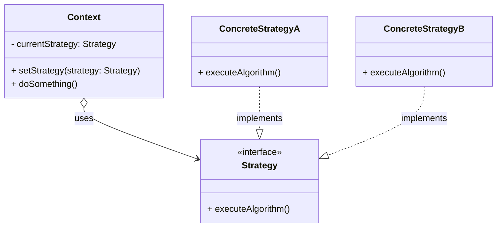

_図: Strategy パターンの基本的な関係図_

### このパターンが役立つ場面 (Context)

では、どんなときに Strategy パターンの出番を考えると良いでしょうか？

- **同じ処理でも、やり方（アルゴリズム）にバリエーションがあって、それを切り替えたいとき。**
- **これから新しい「やり方」が追加される可能性が高いとき。**（新しいクラスを追加するだけで済むので、変更に強くなります！）
- **`if-else` や `switch` 文が長くなって、コードの見通しが悪くなってきたとき。**
- **処理方法（アルゴリズム）だけを独立させて、テストしやすくしたいとき。**

逆に、もし「やり方」の種類が少なく、今後もほとんど増える見込みがない、そして `if-else` もとてもシンプル、という状況であれば、無理に Strategy パターンを使う必要はないかもしれません。パターンを使うことでクラスが増えて、かえって少し複雑に見えてしまうこともあるからです。

### コード例：初心者が書きがちなコード

ここでは例として、移動手段（徒歩、自転車、車）に応じて移動時間を計算するシンプルなケースを考えます。初心者のうちは、以下のように `if-else` で処理を分岐させてしまうかもしれません。

```java
// 移動手段を表すenum (例)
enum Transportation { WALK, BICYCLE, CAR }

// 移動時間を計算するクラス (Strategy パターン適用前)
class RoutePlanner {
    // 移動手段に応じて時間を計算するメソッド
    public int calculateTime(Transportation mode, int distance) {
        if (mode == Transportation.WALK) {
            // 徒歩の場合の計算ロジック (例: 距離 / 5 km/h)
            return distance * 60 / 5;
        } else if (mode == Transportation.BICYCLE) {
            // 自転車の場合の計算ロジック (例: 距離 / 15 km/h)
            return distance * 60 / 15;
        } else if (mode == Transportation.CAR) {
            // 車の場合の計算ロジック (例: 距離 / 40 km/h + 渋滞考慮)
            return distance * 60 / 40 + 10; // 適当な例
        } else {
            // 未対応の移動手段
            throw new IllegalArgumentException("Unsupported transportation mode.");
        }
        // 新しい移動手段（例：電車）を追加する場合、ここの if-else を修正する必要がある！
    }
}

// 利用例
RoutePlanner planner = new RoutePlanner();
int walkTime = planner.calculateTime(Transportation.WALK, 10); // 10kmを徒歩で
System.out.println("徒歩での所要時間: " + walkTime + "分");
```

このコードの問題点は、新しい移動手段（例: 電車）を追加したい場合に、`calculateTime` メソッド内の `if-else` 文を修正しなければならない点です。これはオープン/クローズドの原則（OCP）に違反します。

### コード例：Strategy パターン適用後

Strategy パターンを適用すると、各移動手段の計算ロジック（戦略）を独立したクラスとして定義できます。

```java
// 1. Strategy インターフェースの定義
interface RouteStrategy {
    int calculateTime(int distance); // 移動時間を計算する共通インターフェース
}

// 2. ConcreteStrategy クラスの実装
class WalkStrategy implements RouteStrategy {
    @Override
    public int calculateTime(int distance) {
        return distance * 60 / 5; // 徒歩の計算ロジック
    }
}

class BicycleStrategy implements RouteStrategy {
    @Override
    public int calculateTime(int distance) {
        return distance * 60 / 15; // 自転車の計算ロジック
    }
}

class CarStrategy implements RouteStrategy {
    @Override
    public int calculateTime(int distance) {
        return distance * 60 / 40 + 10; // 車の計算ロジック
    }
}
// 新しい移動手段（例：電車）は、新しい Strategy クラスを追加するだけで対応可能！
// class TrainStrategy implements RouteStrategy { ... }

// 3. Context クラスの実装
class RoutePlannerContext {
    private RouteStrategy strategy; // 現在の戦略を保持

    // コンストラクタやセッターで戦略を設定
    public RoutePlannerContext(RouteStrategy strategy) {
        this.strategy = strategy;
    }

    public void setStrategy(RouteStrategy strategy) {
        this.strategy = strategy;
    }

    // 計算処理を保持している Strategy に委譲
    public int calculateTime(int distance) {
        // Context 自身は具体的な計算方法を知らない
        return strategy.calculateTime(distance);
    }
}

// 利用例
// 利用者は、使いたい戦略 (RouteStrategy) を選択して Context に渡す
RoutePlannerContext planner = new RoutePlannerContext(new WalkStrategy());
int walkTime = planner.calculateTime(10);
System.out.println("徒歩での所要時間: " + walkTime + "分");

// 戦略を切り替えることも可能
planner.setStrategy(new CarStrategy());
int carTime = planner.calculateTime(10);
System.out.println("車での所要時間: " + carTime + "分");
```

### 利点と注意点（トレードオフ）

**利点**

- **アルゴリズムの容易な追加・変更**
  新しいアルゴリズムは新しい `ConcreteStrategy` クラスを追加するだけで対応でき、既存の `Context` や他の `Strategy` を修正する必要がありません。オープン/クローズドの原則 (OCP) に準拠しやすくなります。（『Head First デザインパターン 第 2 版』でもこの点が強調されています）
- **アルゴリズムの独立性と再利用性**
  各アルゴリズムが独立したクラスとしてカプセル化されるため、個々の実装、テスト、保守が容易になり、他の `Context` でも再利用しやすくなります。
- **条件分岐の排除**
  `Context` 内の複雑な `if-else` や `switch` 文を排除でき、コードがよりシンプルで読みやすくなります。処理の委譲により、`Context` の責務も明確になります。
- **アルゴリズムの動的な切り替え**
  `Context` が保持する `Strategy` オブジェクトを実行時に変更することで、アプリケーションの振る舞いを柔軟に変更できます。

**注意点 / トレードオフ**

- **クラス数の増加**
  アルゴリズムごとにクラスを作成するため、システムのクラス数は増加します。アルゴリズムが非常に単純な場合は、パターンの導入によるオーバーヘッドがメリットを上回る可能性も考慮が必要です。
- **クライアントの認識**
  `Context` を利用するクライアントは、どのような `Strategy` が存在し、どの `Strategy` を選択して `Context` に設定すべきかを知る必要があります。（ただし、この選択ロジックを `Context` 自身や、後述する **Factory パターン** などを用いて隠蔽することも可能です）
- **`Strategy` オブジェクトの管理**
  `Strategy` オブジェクトが状態を持つ場合（通常はステートレスにすることが推奨されます）、その管理が複雑になる可能性があります。また、頻繁なオブジェクト生成・破棄が性能に影響を与える場合は、**Flyweight パターン**などを利用した共有化を検討することもあります。
- **通信オーバーヘッド**
  `Context` と `Strategy` 間のやり取り（メソッド呼び出し）は、すべての処理を 1 つのクラス内に記述する場合と比較して、わずかながら実行時オーバーヘッドが発生します。（通常は問題になりません）

**他のパターンとの関連**

- **State パターン**
  Strategy パターンと非常によく似た構造を持ちますが、State パターンはオブジェクトの「状態」に応じて振る舞いを変えることに焦点を当て、状態遷移の管理も含むことが多いのに対し、Strategy パターンは主に「アルゴリズム」の交換可能性に焦点を当てます。
- **Factory パターン**
  クライアントがどの `ConcreteStrategy` を使うかの選択・生成ロジックを隠蔽するために、Factory Method パターンや Abstract Factory パターンと組み合わせて使われることがあります。
- **Template Method パターン**
  アルゴリズムの骨組みを Template Method で定義し、具体的なステップの実装を Strategy パターンで切り替える、といった組み合わせも考えられます。

Strategy パターンは、振る舞い（アルゴリズム）を柔軟に扱いたい場合に非常に有用なパターンです。その構造と意図を理解し、適切な場面で活用することで、より洗練されたオブジェクト指向設計を目指しましょう。

## 3.2 Template Method パターン：処理の骨組みは固定、詳細は子クラスへ

ソフトウェア開発をしていると、「大まかな手順は決まっているんだけど、細かい部分だけ状況によって変えたい」というケースによく出会います。たとえば、料理のレシピを考えてみましょう。「カレーを作る」という目的のためには、「材料を切る → 炒める → 煮込む → ルーを入れる」といった一連の基本的な手順（骨組み）があります。しかし、「どんな具材を切るか」「どのカレールーを使うか」といった具体的な部分は、作るカレーの種類（チキンカレー、野菜カレーなど）によって変わってきますよね。

Template Method パターンは、まさにこのような状況で役立つ設計パターンです。このパターンでは、**処理全体のアルゴリズムの骨組み（テンプレート）を親クラスで定義**し、その骨組みの中で行われる**具体的な処理内容（細かいステップ）の一部を、子クラスに実装させる**というアプローチを取ります。（『オブジェクト指向における再利用のためのデザインパターン 改訂版』参照）

つまり、親クラスが「カレーの基本的な作り方」というテンプレートを管理し、子クラスが「我が家の特製カレーの具材とルー」という具体的な部分を担当する、という役割分担を実現するわけです。

### どんな問題を解決するか？ (Problem)

Template Method パターンは、主に以下のような問題を解決するのに役立ちます。

- **コードの重複を避けたい**
  複数のクラスで、処理手順の大部分が共通しているが、一部のステップだけが異なる場合に、共通部分を重複して記述するのを避けたい。
- **アルゴリズムの骨組みを統一したい**
  ある処理を行う際の基本的な手順（アルゴリズムの構造）を固定し、子クラスがそれを勝手に変更できないようにしたい。一方で、その手順の中の具体的な実装は子クラスごとに変えさせたい。
- **フレームワークの実装**
  ライブラリやフレームワークを作る際に、全体的な処理の流れはフレームワーク側で制御しつつ、利用者がカスタマイズ可能な部分（フック）を提供したい。

### パターンの考え方と登場人物 (Solution & Structure)

Template Method パターンは、継承を利用して実現されます。主な登場人物は以下の 2 種類です。（『Java 言語で学ぶデザインパターン入門第 3 版』の構成を参考に）

- **`AbstractClass`（抽象クラス）:**
  - アルゴリズムの骨組みとなる**テンプレートメソッド (`templateMethod`)** を定義します。このメソッドは通常 `final`（変更不可）として宣言され、処理のステップを順番に呼び出す形で実装されます。
  - テンプレートメソッド内で呼び出される個々のステップに対応するメソッドを定義します。このうち、子クラスで実装されるべき具体的な処理は**抽象メソッド (`abstractMethod`)** として宣言します。
  - また、子クラスで任意にオーバーライド可能な**フックメソッド (`hookMethod`)** を用意することもあります。フックメソッドは、親クラスでデフォルトの振る舞いを提供したり、何もしなかったりします。
- **`ConcreteClass`（具象クラス）:**
  - `AbstractClass` を継承します。
  - 親クラスで宣言された**抽象メソッド (`abstractMethod`)** を、自身の具体的な処理内容で実装（オーバーライド）します。
  - 必要に応じて、**フックメソッド (`hookMethod`)** をオーバーライドして、振る舞いをカスタマイズします。

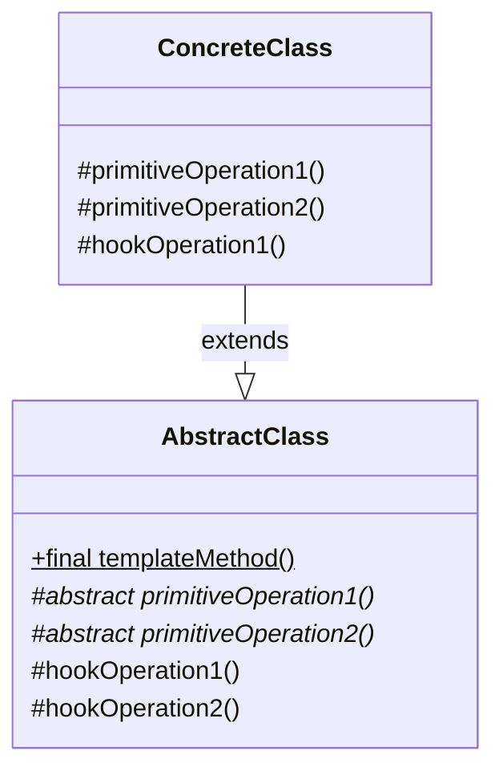

_図: Template Method パターンの基本的なクラス構造_
_(`templateMethod` が骨組みを定義し、`primitiveOperation`（抽象メソッド）や `hookOperation`（フックメソッド）を呼び出す。)_

このパターンは、「**ハリウッドの原則（Don't call us, we'll call you. / 我々を呼び出すな、必要なら我々が君を呼び出す）**」の一例とも言えます。つまり、子クラスが親クラスのメソッドを呼び出すのではなく、親クラス（のテンプレートメソッド）が子クラスで実装されたメソッドを適切なタイミングで呼び出す、という制御構造になっています。（『Head First デザインパターン 第 2 版』参照）

### このパターンが役立つ場面 (Context)

Template Method パターンは、以下のような状況で適用を検討すると良いでしょう。

- **複数のクラスに共通するアルゴリズムの骨組みが存在し、その骨組みを再利用したいとき。**
- **アルゴリズムの特定の部分だけを子クラスで変更可能にしたい、しかし全体の流れは固定したいとき。**
- **子クラスに共通の振る舞いを強制しつつ、一部のカスタマイズを許可したいとき。**
- **コードの重複を排除し、共通ロジックを一箇所（親クラス）にまとめたいとき。**

ただし、子クラスで変更したい箇所がアルゴリズムのごく一部で、そのために継承を使うのが大げさに感じる場合や、アルゴリズムの骨組み自体を柔軟に変更したい場合には、Strategy パターンなど、他のパターンの方が適している可能性もあります。

### コード例：初心者が書きがちなコード

たとえば、テキストファイルと CSV ファイルを処理するプログラムを考えます。どちらも「ファイルを開く → データを読み込む → データを処理する → ファイルを閉じる」という流れは同じですが、データの読み込み方と処理の仕方が異なるとします。Template Method を知らないと、以下のように似たようなコードを別々に書いてしまうかもしれません。

```java
// テキストファイル処理クラス (パターン適用前)
class TextFileProcessor {
    public void processFile(String filePath) {
        System.out.println("テキストファイルを開きます: " + filePath); // 共通処理1
        String content = readFileContent(filePath); // 固有処理1
        processTextData(content);                   // 固有処理2
        System.out.println("テキストファイルを閉じます。");    // 共通処理2
    }

    private String readFileContent(String filePath) {
        // テキストファイル固有の読み込み処理
        System.out.println("  テキストデータを読み込み中...");
        return "これはテキストデータです。"; // ダミー
    }

    private void processTextData(String data) {
        // テキストデータ固有の処理
        System.out.println("  テキストデータを処理中: " + data.toUpperCase());
    }
}

// CSVファイル処理クラス (パターン適用前)
class CsvFileProcessor {
    public void processFile(String filePath) {
        System.out.println("CSVファイルを開きます: " + filePath); // 共通処理1 (テキストとほぼ同じ)
        List<String[]> data = readCsvData(filePath); // 固有処理1
        processCsvData(data);                      // 固有処理2
        System.out.println("CSVファイルを閉じます。");     // 共通処理2 (テキストとほぼ同じ)
    }

    private List<String[]> readCsvData(String filePath) {
        // CSVファイル固有の読み込み処理
        System.out.println("  CSVデータを読み込み中...");
        // ダミーデータ
        List<String[]> dummyData = new ArrayList<>();
        dummyData.add(new String[]{"header1", "header2"});
        dummyData.add(new String[]{"data1", "data2"});
        return dummyData;
    }

    private void processCsvData(List<String[]> data) {
        // CSVデータ固有の処理
        System.out.println("  CSVデータを処理中: " + data.size() + "行");
    }
}

// 利用例
TextFileProcessor textProcessor = new TextFileProcessor();
textProcessor.processFile("document.txt");

CsvFileProcessor csvProcessor = new CsvFileProcessor();
csvProcessor.processFile("data.csv");

// 問題点：ファイルを開く/閉じる処理が重複している。
// 新しいファイル形式（例：XML）を追加する場合、また同じようなクラスを作る必要がある。
```

このコードでは、「ファイルを開く」「ファイルを閉じる」という共通の処理が、`TextFileProcessor` と `CsvFileProcessor` の両方に重複して書かれています。

### コード例：Template Method パターン適用後

Template Method パターンを使うと、共通の処理の流れ（骨組み）を親クラスにまとめ、異なる部分だけを子クラスで実装できます。

```java
// 1. AbstractClass: 処理の骨組みを定義
abstract class AbstractFileProcessor {
    // テンプレートメソッド (final で変更不可にするのが一般的)
    public final void processFile(String filePath) {
        openFile(filePath);       // ステップ1: ファイルを開く (共通)
        Object data = readFile(); // ステップ2: データを読む (子クラスで実装)
        processData(data);        // ステップ3: データを処理する (子クラスで実装)
        closeFile();              // ステップ4: ファイルを閉じる (共通)
    }

    // 共通の処理 (子クラスからは変更させない場合 private も可)
    protected void openFile(String filePath) {
        System.out.println("ファイルを開きます: " + filePath);
    }

    protected void closeFile() {
        System.out.println("ファイルを閉じます。");
    }

    // 子クラスに実装を強制する抽象メソッド
    protected abstract Object readFile();
    protected abstract void processData(Object data);

    // フックメソッド (子クラスで任意にオーバーライド可能)
    // protected void afterProcessHook() { /* デフォルトは何もしない */ }
}

// 2. ConcreteClass: テキストファイル用の具体的な処理を実装
class TextFileProcessor extends AbstractFileProcessor {
    private String fileContent;

    @Override
    protected Object readFile() {
        System.out.println("  テキストデータを読み込み中...");
        this.fileContent = "これはテキストデータです。"; // 実際はファイルから読む
        return this.fileContent;
    }

    @Override
    protected void processData(Object data) {
        String textData = (String) data; // キャストが必要な場合も
        System.out.println("  テキストデータを処理中: " + textData.toUpperCase());
    }
}

// 3. ConcreteClass: CSVファイル用の具体的な処理を実装
class CsvFileProcessor extends AbstractFileProcessor {
    private List<String[]> csvData;

    @Override
    protected Object readFile() {
        System.out.println("  CSVデータを読み込み中...");
        this.csvData = new ArrayList<>(); // 実際はファイルから読む
        this.csvData.add(new String[]{"header1", "header2"});
        this.csvData.add(new String[]{"data1", "data2"});
        return this.csvData;
    }

    @Override
    protected void processData(Object data) {
        List<String[]> csvList = (List<String[]>) data; // キャスト
        System.out.println("  CSVデータを処理中: " + csvList.size() + "行");
    }
}

// 利用例 (利用側は AbstractFileProcessor 型として扱える)
AbstractFileProcessor processor1 = new TextFileProcessor();
processor1.processFile("document.txt");

System.out.println("---");

AbstractFileProcessor processor2 = new CsvFileProcessor();
processor2.processFile("data.csv");

// 新しいファイル形式（例：XML）は、AbstractFileProcessor を継承して
// readFile() と processData() を実装するだけで追加できる！
```

### 利点と注意点（トレードオフ）

**利点**

- **コードの重複削減**
  アルゴリズムの共通部分（骨組み）を親クラスに集約できるため、コードの重複を効果的に排除できます。
- **骨組みの強制**
  親クラスでアルゴリズムの構造を固定できるため、子クラスが処理手順を勝手に変更してしまうことを防ぎ、全体としての一貫性を保つことができます。
- **拡張性**
  新しいバリエーションを追加したい場合、子クラスを作成し、抽象メソッドを実装するだけで済みます。これはオープン/クローズドの原則 (OCP) の実現に寄与します。
- **子クラス実装の強制**
  抽象メソッドを使うことで、子クラスに対して特定部分の実装を強制できます。

**注意点 / トレードオフ**

- **クラス数の増加**
  バリエーションごとに子クラスが必要になるため、クラス数は増加する傾向があります。
- **継承への依存**
  継承を基盤としているため、継承の持つデメリット（親クラスとの密結合など）の影響を受ける可能性があります。
- **骨組みの変更への影響**
  親クラスのテンプレートメソッド（骨組み）を変更すると、すべての子クラスに影響が及ぶ可能性があります。
- **子クラスの理解**
  子クラスのコードだけを見ても、全体の処理の流れ（テンプレートメソッドの存在）を把握しにくい場合があります。

**他のパターンとの関連**

- **Strategy パターン**
  Template Method パターンと Strategy パターンは、どちらもアルゴリズムのバリエーションを扱う点で似ていますが、実現方法が異なります。Template Method は**継承**を使い、アルゴリズムの「骨組み」は固定し「一部」を子クラスで変えます。一方、Strategy パターンは**委譲**を使い、アルゴリズム全体を独立したオブジェクトとして「丸ごと」入れ替えます。一般的に、Strategy の方が柔軟性が高いと言われます。
- **Factory Method パターン**
  Template Method パターンの中で、特定のステップ（たとえば、使用するオブジェクトの生成）を子クラスに決定させるために、Factory Method パターンが利用されることがあります。

Template Method パターンは、処理手順の共通化と部分的なカスタマイズを両立させたい場合に有効なパターンです。フレームワークなどでも頻繁に利用される基本的なパターンの 1 つですので、その考え方を理解しておくことは非常に重要です。

## 3.3 Iterator パターン：コレクションの要素に順番にアクセスする「案内役」

プログラムを書いていると、配列 (`Array`) やリスト (`List`)、セット (`Set`) のように、たくさんの要素（データ）をまとめて保持する「コレクション」を扱う場面が非常に多くあります。そして、これらのコレクションに格納されている要素を、最初から最後まで順番に取り出して何か処理をしたい、という要求も頻繁に発生します。

たとえば、ショッピングカートに入っている商品のリストを画面に表示したり、顧客リストの中から特定の条件に合う顧客を探したりする場合などです。

しかし、コレクションの種類によって、要素にアクセスするための方法は微妙に異なります。配列ならインデックス番号を使いますが、リストやセットでは異なる方法を使うかもしれません。もし、コレクションの種類ごとにアクセス方法を書き分けていると、コードが複雑になったり、将来コレクションの種類を変更したときに修正箇所が多くなったりしてしまいます。

Iterator パターンは、このような問題を解決するためのデザインパターンです。このパターンは、**コレクション（要素の集まり）の内部構造を隠蔽したまま、その要素に順番にアクセスするための統一的な方法（インターフェース）を提供する**ものです。（『オブジェクト指向における再利用のためのデザインパターン 改訂版』参照）

Iterator は、コレクションを案内してくれる「案内役」や「添乗員」のようなものだとイメージすると分かりやすいかもしれません。私たちは案内役に「次の要素は？」「まだ要素はある？」と尋ねるだけで、コレクションの中身がどうなっているかを気にせずに、順番に要素を見ていくことができます。

### どんな問題を解決するか？ (Problem)

Iterator パターンは、主に以下のような課題を解決します。

- **コレクション内部構造の隠蔽**
  コレクションを利用する側（クライアント）に、そのコレクションが配列なのかリストなのか、あるいは他のどんな構造なのか、といった内部の詳細を知られたくない。アクセス方法を統一したい。
- **多様な走査方法の提供**
  1 つのコレクションに対して、複数の異なる方法で要素を走査したい場合（たとえば、順方向だけでなく逆方向にもアクセスしたい、特定の条件を満たす要素だけをスキップしたいなど）。
- **複数のクライアントによる同時走査**
  同じコレクションに対して、複数のクライアントがそれぞれ独立して、異なる位置から要素の走査を開始・進行できるようにしたい。

### パターンの考え方と登場人物 (Solution & Structure)

Iterator パターンでは、要素へのアクセス（走査）の責務をコレクション本体から分離し、専用の `Iterator` オブジェクトに担当させます。主な登場人物は以下の通りです。（『Java 言語で学ぶデザインパターン入門第 3 版』の構成を参考に）

- **`Iterator`（イテレータ、反復子）**
  - コレクションの要素に順番にアクセスするための**統一的なインターフェース**を定義します。通常、以下のようなメソッドを持ちます。
    - `hasNext()`: 次にアクセスすべき要素が存在するかどうかを判定する。
    - `next()`: 次の要素を取得し、内部的な現在位置を進める。
- **`ConcreteIterator`（具体的なイテレータ）**
  - `Iterator` インターフェースを実装し、特定の種類のコレクション (`ConcreteAggregate`) に対応した具体的な走査ロジックを実装します。どの要素を次に返すか、走査が終了したかを管理します。
- **`Aggregate`（集合体）**
  - `Iterator` オブジェクトを生成するためのインターフェースを定義します。通常、`iterator()` や `createIterator()` といったメソッドを持ちます。
- **`ConcreteAggregate`（具体的な集合体）**
  - `Aggregate` インターフェースを実装し、具体的なコレクション（配列、リストなど）の機能を提供します。
  - 自身に対応する `ConcreteIterator` のインスタンスを生成して返す `iterator()` メソッドを実装します。

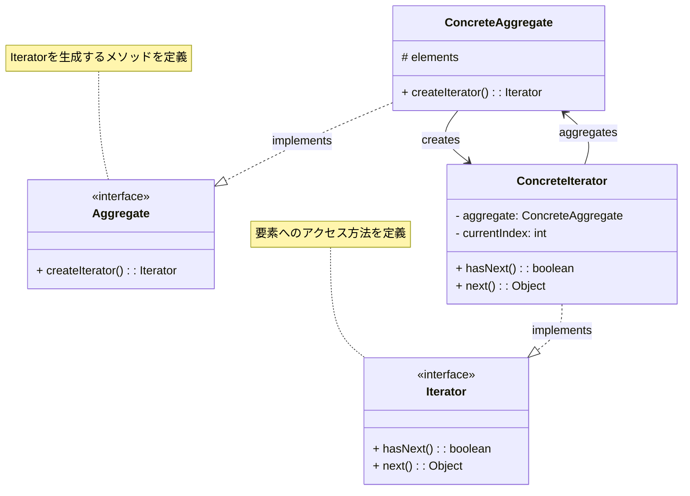

_図: Iterator パターンの基本的なクラス構造_

利用側（クライアント）は、`Aggregate` オブジェクトに対して `createIterator()` を呼び出して `Iterator` を取得し、あとは `Iterator` の `hasNext()` と `next()` メソッドだけを使って要素にアクセスします。これにより、クライアントは `ConcreteAggregate` や `ConcreteIterator` の具体的なクラスを意識する必要がなくなります。

### このパターンが役立つ場面 (Context)

Iterator パターンの適用を検討すべき状況は以下の通りです。

- **コレクションの内部表現（データ構造）を隠蔽し、統一的なインターフェースで要素にアクセスしたいとき。** (カプセル化の促進)
- **リスト、配列、ツリー構造など、さまざまな種類のコレクションに対して、共通の方法で要素を処理したいとき。**
- **1 つのコレクションに対して、複数の異なる走査方法（順方向、逆方向、フィルタリングなど）を提供したいとき。** (それぞれに対応する `ConcreteIterator` を用意する)
- **複数のクライアントが、それぞれ独立してコレクションの要素を走査する必要があるとき。** (各クライアントが独自の `Iterator` を持つ)

多くのプログラミング言語では、標準ライブラリの一部として Iterator パターンに基づいた機能（Java の `Iterator` インターフェースや拡張 `for` 文、Python のイテレータプロトコルなど）が提供されています。そのため、自前で `Iterator` を実装する場面は以前より減っていますが、パターン自体の考え方を理解しておくことは、ライブラリを効果的に利用したり、独自のコレクションクラスを設計したりする上で依然として重要です。

### コード例：初心者が書きがちなコード

たとえば、本のリスト (`BookList`) があり、その中の本の名前をすべて表示したいとします。もし `BookList` が内部で配列を使って本を管理している場合、以下のように内部の配列に直接アクセスしてしまうかもしれません。

```java
// 本クラス (例)
class Book {
    private String title;
    public Book(String title) { this.title = title; }
    public String getTitle() { return title; }
}

// 本のリストクラス (内部で配列を使用, Iterator パターン適用前)
class BookList {
    private Book[] books;
    private int last = 0; // 次に追加する位置

    public BookList(int maxSize) {
        this.books = new Book[maxSize];
    }

    public void addBook(Book book) {
        if (last < books.length) {
            this.books[last] = book;
            last++;
        }
    }

    // 内部の配列を直接返すメソッド (カプセル化が不十分)
    public Book[] getBooks() {
        return books;
    }

    // 現在の要素数を返すメソッド (これも内部構造に依存)
    public int getNumberOfBooks() {
        return last;
    }
}

// 利用例
BookList bookList = new BookList(5);
bookList.addBook(new Book("デザインパターン入門"));
bookList.addBook(new Book("Clean Code"));
bookList.addBook(new Book("リファクタリング"));

// 利用側が内部構造 (配列) を知っている必要がある
Book[] books = bookList.getBooks();
int count = bookList.getNumberOfBooks();
System.out.println("--- 本のリスト ---");
for (int i = 0; i < count; i++) {
    System.out.println(books[i].getTitle());
}

// 問題点：
// 1. BookList の内部実装 (配列) が外部に漏洩している。
// 2. もし BookList が内部実装を配列から ArrayList に変更したら、
//    利用側のコード (for ループ) も修正が必要になる。
// 3. 要素へのアクセス方法が BookList クラスと密結合している。
```

このコードの問題点は、`BookList` を利用する側が、`BookList` が内部で配列 (`Book[]`) を使っていることを知っており、その配列に直接アクセスしている点です。これでは `BookList` の内部実装を変更することが難しくなります。

### コード例：Iterator パターン適用後

Iterator パターンを適用すると、`BookList` は `Iterator` を提供する責任を持ち、利用側はその `Iterator` を通じて要素にアクセスします。

```java
import java.util.Iterator; // Java の標準 Iterator を使う例
import java.util.NoSuchElementException;

// 本クラス (変更なし)
class Book {
    private String title;
    public Book(String title) { this.title = title; }
    public String getTitle() { return title; }
}

// 1. Aggregate インターフェース (Java標準を使う場合は不要なことも)
// interface Aggregate { Iterator<Book> iterator(); }

// 2. ConcreteAggregate クラス
class BookListAggregate /* implements Aggregate */ { // 今回は標準Iterator前提で interface 省略
    private Book[] books;
    private int last = 0;

    public BookListAggregate(int maxSize) {
        this.books = new Book[maxSize];
    }

    public void addBook(Book book) {
        if (last < books.length) {
            this.books[last] = book;
            last++;
        }
    }

    // 内部の要素数を取得するメソッド (Iterator生成で利用)
    public int getLength() {
        return last;
    }
    // インデックスで要素を取得するメソッド (Iterator生成で利用)
    public Book getBookAt(int index) {
        return books[index];
    }

    // Iterator を生成して返すメソッド
    public Iterator<Book> iterator() {
        return new BookListIterator(this); // 対応する ConcreteIterator を生成
    }
}

// 3. ConcreteIterator クラス
class BookListIterator implements Iterator<Book> {
    private BookListAggregate aggregate;
    private int index;

    public BookListIterator(BookListAggregate aggregate) {
        this.aggregate = aggregate;
        this.index = 0;
    }

    @Override
    public boolean hasNext() {
        // 現在のインデックスが要素数未満なら true
        return index < aggregate.getLength();
    }

    @Override
    public Book next() {
        if (!hasNext()) {
            throw new NoSuchElementException();
        }
        // 現在のインデックスの Book を取得し、インデックスを次に進める
        Book book = aggregate.getBookAt(index);
        index++;
        return book;
    }
}

// 利用例
BookListAggregate bookList = new BookListAggregate(5);
bookList.addBook(new Book("デザインパターン入門"));
bookList.addBook(new Book("Clean Code"));
bookList.addBook(new Book("リファクタリング"));

// 利用側は Iterator を使ってアクセスする (内部構造を知る必要がない！)
System.out.println("--- 本のリスト (Iterator使用) ---");
Iterator<Book> it = bookList.iterator();
while (it.hasNext()) {
    Book book = it.next();
    System.out.println(book.getTitle());
}

// Java の拡張 for 文も内部で Iterator を利用している
System.out.println("--- 本のリスト (拡張 for 文) ---");
// for (Book book : bookList) { // これを可能にするには BookListAggregate が Iterable を実装する必要がある
//     System.out.println(book.getTitle());
// }
// ※ 上記拡張for文を使うには、BookListAggregate が java.lang.Iterable<Book> を
//   実装し、iterator() メソッドを持つ必要がある。
//   class BookListAggregate implements Iterable<Book> { ... }
```

このコードでは、利用側は `BookListAggregate` の内部が配列であることを知る必要がありません。`iterator()` メソッドで `Iterator` を取得し、`hasNext()` と `next()` だけで要素にアクセスできます。将来 `BookListAggregate` の内部実装が `ArrayList` などに変更されたとしても、`BookListIterator` を適切に修正すれば、利用側のコードは変更不要です。

### 利点と注意点（トレードオフ）

**利点**

- **コレクションの内部構造の隠蔽**
  クライアントはコレクションの具体的なデータ構造を知る必要がなくなり、`Iterator` インターフェースのみに依存するため、カプセル化が促進されます。
- **アクセス方法の統一**
  異なる種類のコレクションに対しても、`Iterator` という統一された方法で要素にアクセスできます。
- **多様な走査方法の実装**
  順方向、逆方向、フィルタリング付きなど、さまざまな走査ロジックを持つ `ConcreteIterator` を提供できます。
- **複数の走査の並行**
  各クライアントが独自の `Iterator` インスタンスを持つことで、同じコレクションに対して複数の走査を同時に、独立して行うことができます。

**注意点 / トレードオフ:**

- **クラス数の増加**
  コレクションごとに `ConcreteIterator` クラスが必要になる場合があり、クラス数が増える可能性があります。（ただし、言語によっては内部クラスやラムダ式などで簡潔に書ける場合もあります）
- **単純なケースでは冗長**
  非常に単純なコレクション（例: 要素数が少なく、アクセス方法が自明な配列）に対しては、`Iterator` パターンを導入することが過剰設計になる可能性もあります。
- **走査中のコレクション変更**
  `Iterator` がコレクションを走査している最中に、そのコレクションの要素が追加・削除されると、予期せぬ動作（例: `ConcurrentModificationException` in Java）を引き起こす可能性があります。この問題に対処するための考慮（フェイルファスト設計など）が必要です。

**他のパターンとの関連:**

- **Composite パターン:** ツリーのような再帰的な構造を持つ Composite パターンにおいて、その要素（葉や枝）を順番に走査するために Iterator パターンがよく利用されます。
- **Factory Method パターン:** `Aggregate` が `ConcreteIterator` を生成する `iterator()` メソッドは、Factory Method パターンの適用例と見なすことができます。

Iterator パターンは、コレクションとその要素へのアクセス方法を分離するための、オブジェクト指向における基本的なパターンの 1 つです。多くの言語で標準的にサポートされているため、その仕組みを理解しておくことは、ライブラリの利用や独自のデータ構造を扱う際に役立ちます。

## 3.4 Composite パターン：「個」と「全体」を同じように扱う器

ソフトウェアを開発していると、物事を階層的に、つまり「入れ子」のような構造で扱いたい場面がよくあります。たとえば、コンピュータのファイルシステムを考えてみてください。フォルダ（ディレクトリ）の中には、ファイルだけでなく、さらに別のフォルダを入れることができますよね。あるいは、グラフィックソフトで図形を描くとき、「線」や「円」といった個別の図形（部品）と、それらをグループ化した「複合図形」（全体）があったりします。

このような「個別の要素（部品）」と「それらをまとめたグループ（全体）」が混在する構造を扱うとき、もし個別の要素とグループで扱い方が違うと、プログラムは少し面倒になります。たとえば、ディレクトリの内容を表示する処理を書くとき、「これはファイルかな？それともフォルダかな？」と毎回チェックして処理を分ける必要があるかもしれません。

Composite パターンは、このような問題を解決するためのデザインパターンです。このパターンを使うと、**個別のオブジェクト（「葉」= Leaf）と、それらオブジェクトの集まり（「枝」= Composite）を、クライアント（利用側）から見て区別なく、同じように扱える**ようにします。（『オブジェクト指向における再利用のためのデザインパターン 改訂版』参照）

Composite パターンは、まるで「**中身が『部品』でも『部品の集まり』でも、同じように入れられる器**」のようなものです。利用者は、器の中身が 1 つなのか複数なのかを気にせずに、器に対して同じ操作（たとえば「表示して！」）を指示できます。

### どんな問題を解決するか？ (Problem)

Composite パターンは、主に以下のような設計上の課題に取り組むのに役立ちます。

- **部分-全体階層の表現**
  ディレクトリとファイル、組織の部署と従業員、GUI のコンテナと部品のように、オブジェクトが木のような階層構造（ツリー構造）を形成しているものを表現したい。
- **クライアントコードの単純化**
  個別のオブジェクト（葉）と、それらをまとめた複合オブジェクト（枝）を、クライアントが区別せずに統一的なインターフェースで扱えるようにしたい。クライアント側の `if` 文による型チェックや分岐処理を減らしたい。
- **再帰的な構造の操作**
  階層構造全体に対して、再帰的に同じ操作（たとえば、サイズの計算、内容の表示）を適用したい。

### パターンの考え方と登場人物 (Solution & Structure)

Composite パターンは、個別の要素と複合オブジェクトに共通のインターフェースを持たせることで、「部分」と「全体」の区別をなくします。主な登場人物は以下の通りです。（『Java 言語で学ぶデザインパターン入門第 3 版』の構成を参考に）

- **`Component`（構成要素）:**
  - 階層構造に含まれるすべてのオブジェクト（`Leaf` と `Composite`）に共通の**インターフェース**を定義します。クライアントはこのインターフェースを通じてオブジェクトを操作します。
  - 共通の操作（例: `operation()`）を宣言します。
  - **オプション:** 子要素を管理するためのメソッド（`add()`, `remove()`, `getChild()` など）のインターフェースをここで宣言する場合もありますが、これには設計上のトレードオフがあります（後述）。
- **`Leaf`（葉）:**
  - 階層構造の**末端**を表す、個別のオブジェクトです。子要素を持ちません。
  - `Component` インターフェースで宣言された操作（例: `operation()`）を実装します。
  - もし `Component` で子要素管理メソッドが宣言されている場合、`Leaf` では通常、それらをサポートしない（空実装にするか、例外をスローする）ように実装します。
- **`Composite`（複合要素、枝）:**
  - `Component` 型の子要素（`Leaf` または他の `Composite`）を**保持・管理**するためのオブジェクトです。階層構造の中間ノード（枝）にあたります。
  - `Component` インターフェースで宣言された操作（例: `operation()`）を実装します。この実装では、通常、**保持している子要素に対して再帰的に同じ操作を呼び出し**、その結果を集約したりします。
  - 子要素を管理するためのメソッド（`add()`, `remove()`, `getChild()` など）を実装します。
- **`Client`（利用者）:**
  - `Component` インターフェースを通じて、階層構造のオブジェクト（`Leaf` や `Composite`）を操作します。`Client` は、扱っているオブジェクトが `Leaf` なのか `Composite` なのかを意識する必要がありません。

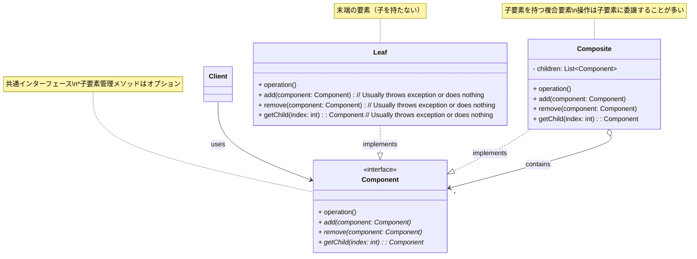

_図: Composite パターンの基本的なクラス構造。`Component` が共通のインターフェースを提供し、`Client` は `Leaf` と `Composite` を区別なく扱える。_

### このパターンが役立つ場面 (Context)

Composite パターンは、以下のような状況でその真価を発揮します。

- **オブジェクトの間に「部分-全体」の関係があり、木のような階層構造（ツリー構造）を表現したいとき。** (例: ファイルシステム、組織構造、GUI コンポーネントツリー、部品-組立品の構造など)
- **クライアントに、個別のオブジェクト（葉）と複合オブジェクト（枝）を区別させずに、統一的に扱わせたいとき。** これによりクライアントのコードがシンプルになります。
- **階層構造に対して、再帰的なアルゴリズムを適用したいとき。** (例: ディレクトリ内の全ファイルサイズ合計、組織全体のコスト計算など)

一方で、階層構造が非常に単純（深さが固定されているなど）な場合や、`Leaf` と `Composite` で共通化できる操作がほとんどない場合には、このパターンを導入するメリットは少ないかもしれません。また、`Component` インターフェースに子要素管理メソッド（`add`, `remove` など）を含める設計（透過的な設計）は、クライアントの利便性を高める一方で、`Leaf` オブジェクトに対して不適切な操作（`Leaf` に子を追加しようとするなど）を許してしまうリスクがあり、型安全性が低下するというトレードオフがあります。（『Head First デザインパターン 第 2 版』では、このトレードオフについて議論されています）

### コード例：初心者が書きがちなコード

ファイルとディレクトリ（フォルダ）を扱うプログラムを考えてみましょう。それぞれの情報を表示する際に、Composite パターンを知らないと、型をチェックして処理を分けるコードになりがちです。

```java
// ファイルクラス (Composite適用前)
class File {
    private String name;
    private int size;

    public File(String name, int size) {
        this.name = name;
        this.size = size;
    }
    public String getName() { return name; }
    public int getSize() { return size; }

    public void display() {
        System.out.println("File: " + name + " (" + size + " bytes)");
    }
}

// ディレクトリクラス (Composite適用前)
class Directory {
    private String name;
    private List<Object> children = new ArrayList<>(); // File と Directory が混在

    public Directory(String name) { this.name = name; }
    public String getName() { return name; }

    public void add(Object entry) { // File か Directory か分からない
        children.add(entry);
    }

    // ディレクトリの内容を表示するメソッド (型チェックが必要)
    public void display() {
        System.out.println("Directory: " + name);
        for (Object entry : children) {
            if (entry instanceof File) {
                ((File) entry).display(); // File なら File の display
            } else if (entry instanceof Directory) {
                ((Directory) entry).display(); // Directory なら Directory の display (再帰)
            }
        }
    }
    // サイズ計算なども同様に型チェックが必要になる
}

// 利用例
Directory root = new Directory("root");
Directory subDir = new Directory("subdir");
File file1 = new File("file1.txt", 100);
File file2 = new File("file2.txt", 200);
File file3 = new File("file3.txt", 300);

root.add(file1);
root.add(subDir);
subDir.add(file2);
subDir.add(file3);

// 表示処理 (利用側は内部構造を意識しないが、displayメソッド内で型チェック発生)
root.display();

// 問題点：
// 1. Directoryクラス内で File と Directory を区別するための型チェック (instanceof) が必要。
// 2. 新しい種類のエントリ（例：シンボリックリンク）を追加する場合、Directoryクラスの修正が必要。
// 3. File と Directory を統一的に扱えない。
```

このコードでは、`Directory` の `display` メソッド内で、子要素が `File` なのか `Directory` なのかを `instanceof` で判定し、それぞれ異なる処理を呼び出しています。

### コード例：Composite パターン適用後

Composite パターンを適用すると、`File` と `Directory` に共通のインターフェースを持たせ、クライアントや `Directory` 内部での型チェックが不要になります。

```java
import java.util.ArrayList;
import java.util.List;

// 1. Component インターフェース
interface FileSystemComponent {
    String getName();
    int getSize(); // ファイル/ディレクトリのサイズを返す (例)
    void display(String indent); // インデント付きで表示 (例)

    // 子要素管理メソッド (オプション、ここでは含めない安全な設計も可能)
    // void add(FileSystemComponent component);
    // void remove(FileSystemComponent component);
    // FileSystemComponent getChild(int index);
}

// 2. Leaf クラス (ファイル)
class FileLeaf implements FileSystemComponent {
    private String name;
    private int size;

    public FileLeaf(String name, int size) {
        this.name = name;
        this.size = size;
    }

    @Override
    public String getName() { return name; }

    @Override
    public int getSize() { return size; }

    @Override
    public void display(String indent) {
        System.out.println(indent + "File: " + name + " (" + size + " bytes)");
    }

    // 子要素管理メソッドは Leaf には不要 (もし Component で宣言されていたら例外を投げるなど)
    // @Override public void add(...) { throw new UnsupportedOperationException(); }
    // ...
}

// 3. Composite クラス (ディレクトリ)
class DirectoryComposite implements FileSystemComponent {
    private String name;
    private List<FileSystemComponent> children = new ArrayList<>();

    public DirectoryComposite(String name) { this.name = name; }

    @Override
    public String getName() { return name; }

    // ディレクトリ自身のサイズは 0 とし、中身の合計サイズを返す (例)
    @Override
    public int getSize() {
        int totalSize = 0;
        for (FileSystemComponent component : children) {
            totalSize += component.getSize(); // 再帰的にサイズを取得
        }
        return totalSize;
    }

    @Override
    public void display(String indent) {
        System.out.println(indent + "Directory: " + name + " (total size: " + getSize() + " bytes)");
        // 保持している子要素の display を再帰的に呼び出す
        for (FileSystemComponent component : children) {
            component.display(indent + "  "); // インデントを増やす
        }
    }

    // 子要素を管理するメソッド
    public void add(FileSystemComponent component) {
        children.add(component);
    }

    public void remove(FileSystemComponent component) {
        children.remove(component);
    }

    public FileSystemComponent getChild(int index) {
        return children.get(index);
    }
}

// 利用例 (Client)
DirectoryComposite root = new DirectoryComposite("root");
DirectoryComposite subDir = new DirectoryComposite("subdir");
FileSystemComponent file1 = new FileLeaf("file1.txt", 100);
FileSystemComponent file2 = new FileLeaf("file2.txt", 200);
FileSystemComponent file3 = new FileLeaf("file3.txt", 300);

// File も Directory も同じように add できる
root.add(file1);
root.add(subDir);
subDir.add(file2);
subDir.add(file3);

// 利用側は Component インターフェースを通じて操作するだけ
System.out.println("--- ファイルシステム表示 ---");
root.display(""); // 型チェック不要！

System.out.println("\nroot ディレクトリの合計サイズ: " + root.getSize());
System.out.println("subdir ディレクトリの合計サイズ: " + subDir.getSize());
```

このコードでは、`DirectoryComposite` の `display` や `getSize` メソッドは、内部で保持している `children`（`FileSystemComponent` のリスト）に対して、**再帰的に**同じメソッドを呼び出しています。クライアントや `DirectoryComposite` 自身は、個々の子要素が `FileLeaf` なのか `DirectoryComposite` なのかを気にする必要がありません。

### 利点と注意点（トレードオフ）

**利点 (Pros):**

- **統一的な扱い:** 個別のオブジェクト（葉）と複合オブジェクト（枝）を同じインターフェースで扱えるため、クライアントのコードが非常にシンプルになります。型チェックや条件分岐が不要になります。
- **新しい種類の追加が容易:** 新しい種類の `Component`（たとえば `SymbolicLinkLeaf` など）を追加したい場合、`Component` インターフェースを実装するだけで済み、既存のクライアントコードや `Composite` クラスへの影響が少ないです（**オープン/クローズドの原則 (OCP)** に貢献します）。
- **階層構造の柔軟性:** オブジェクトを自由に組み合わせて複雑な階層構造を容易に構築できます。

**注意点 (Cons) / トレードオフ:**

- **共通インターフェース設計の難しさ:** `Component` インターフェースにどのような操作を含めるべきか、設計が難しい場合があります。とくに子要素を管理するメソッド（`add`, `remove` など）を `Component` に含めるかどうかが大きな論点です。
  - **含める場合（透過的な設計）:** クライアントは `Leaf` も `Composite` も完全に同じように扱えますが、`Leaf` に対して `add` を呼び出すなど、意味のない操作ができてしまい、実行時エラーのリスクや型安全性の低下につながります。
  - **含めない場合（安全な設計）:** `Leaf` に不適切な操作はできなくなりますが、クライアントはオブジェクトが `Composite` かどうかを判定してキャストしてから子要素操作を行う必要があり、透過性が失われます。
- **実行時エラーの可能性:** 透過的な設計を採用した場合、`Leaf` オブジェクトに対して子要素管理メソッドを呼び出すと、実行時に例外が発生する可能性があります（`Leaf` 側で適切にエラー処理を実装する必要がある）。
- **過剰適用のリスク:** 構造が単純で、葉と枝で共通の操作が少ない場合に適用すると、設計が不必要に複雑になることがあります。

**他のパターンとの関連:**

- **Iterator パターン:** Composite 構造の要素（葉や枝）を順番に走査するために、Iterator パターンがしばしば一緒に使われます。`Composite` クラスが `iterator()` メソッドを提供することが多いです。
- **Visitor パターン:** Composite 構造内の各要素に対して、構造を変更せずに新しい操作を追加したい場合に、Visitor パターンが有効です。
- **Decorator パターン:** 個々の `Component` オブジェクトに対して、動的に機能を追加したい場合に Decorator パターンが利用できます。
- **Flyweight パターン:** 大量の `Leaf` オブジェクトが存在する場合に、メモリ使用量を削減するために Flyweight パターンと組み合わせることがあります。

Composite パターンは、木構造のような再帰的なデータ構造を扱う際に非常に強力なパターンです。部分と全体を同一視することで、クライアントコードを大幅に単純化し、構造の柔軟性を高めることができます。ただし、共通インターフェースの設計には注意が必要です。

## 3.5 Facade パターン：複雑な内部を隠すシンプルな「窓口」

ソフトウェア開発を進めていくと、システムが大きくなるにつれて、多くのクラスやサブシステム（機能的なまとまり）が連携して動作するようになります。たとえば、オンラインで映画を予約するシステムを考えてみましょう。予約を完了するためには、「ユーザー認証サブシステム」「座席選択サブシステム」「決済サブシステム」「通知サブシステム」など、多くのサブシステムが内部で複雑に連携する必要があるかもしれません。

もし、このシステムを利用するクライアント（たとえば、予約画面のプログラム）が、これらのサブシステムのクラスすべてを直接知り、正しい順序で呼び出さなければならないとしたら、クライアント側のコードは非常に複雑になってしまいます。また、サブシステムの内部構造が変更された場合、クライアント側のコードも修正が必要になる可能性が高くなります。

**Facade パターン**は、このような問題を解決するためのデザインパターンです。このパターンは、**複雑なサブシステム（複数のクラスやモジュール群）に対して、シンプルで統一されたインターフェース（窓口）を提供する**ものです。（『オブジェクト指向における再利用のためのデザインパターン 改訂版』参照）

Facade は、建物の「正面（ファサード）」を意味する言葉です。建物の正面が綺麗に整えられていて、内部の複雑な構造（配管、配線、構造材など）を隠しているように、Facade パターンも、**サブシステムの複雑さを隠蔽し、外部に対しては分かりやすい「窓口」だけを見せる**役割を果たします。利用者は、このシンプルな窓口に必要なことをお願いするだけで、内部でどのような複雑な処理が行われているかを意識する必要がなくなります。

### どんな問題を解決するか？ (Problem)

Facade パターンは、主に以下のような設計上の課題に対処します。

- **サブシステムの複雑性の隠蔽:** 多くのクラスやオブジェクトが絡み合って構成される複雑なサブシステムがあり、その利用を簡単にしたい。
- **サブシステムとクライアントの結合度の低減:** クライアントがサブシステム内の多数のクラスに直接依存している状態（密結合）を解消し、サブシステムの内部変更がクライアントに影響を与えにくくしたい（**疎結合**）。
- **使いやすい高レベルインターフェースの提供:** サブシステムの詳細な機能を知らなくても、基本的な機能を利用できるような、シンプルで分かりやすいインターフェース（API）を提供したい。
- **システムの階層化:** システム全体をいくつかのレイヤー（層）に分割し、各レイヤー間のやり取りを Facade を通じて行うことで、システム全体の構造を整理したい。

### パターンの考え方と登場人物 (Solution & Structure)

Facade パターンは非常にシンプルな構造をしています。主な登場人物は以下の通りです。

- **`Facade`（窓口）:**
  - サブシステムへの**統一されたインターフェース**を提供します。クライアントはこの `Facade` クラスを通じてサブシステムを利用します。
  - どのサブシステムのクラスがクライアントの要求に責任を持つかを知っています。
  - クライアントからの要求を、サブシステム内の適切なオブジェクトに**委譲**します。
- **サブシステムクラス群 (Subsystem classes):**
  - 実際の機能を提供する、複数のクラスやモジュールの集まりです。
  - サブシステムの機能はこれらのクラスが実装しますが、`Facade` の存在は知りません（`Facade` からは利用されるが、`Facade` には依存しない）。

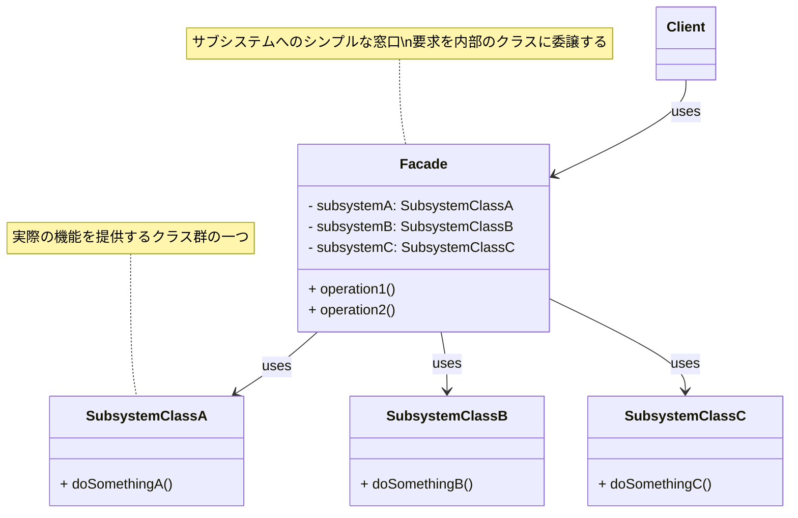

_図: Facade パターンの基本的なクラス構造。`Client` は `Facade` のみを利用し、サブシステムの複雑さから隔離される。_

重要なのは、`Facade` はサブシステムの機能を**隠蔽**しますが、クライアントが**必要であれば**サブシステム内のクラスに直接アクセスすることを**禁止するものではない**という点です。`Facade` はあくまで便利な「近道」や「簡単な入り口」を提供するものであり、より高度な機能を使いたいクライアントは、直接サブシステムクラスを利用することも可能です。（『Java 言語で学ぶデザインパターン入門第 3 版』参照）

### このパターンが役立つ場面 (Context)

Facade パターンは、以下のような状況で適用を検討すると効果的です。

- **複雑なライブラリやフレームワーク、あるいは既存のレガシーシステムに対して、シンプルで分かりやすい利用インターフェースを提供したいとき。**
- **システムを複数のサブシステムに分割し、それらの間の依存関係を整理・低減したいとき。** (各サブシステムに Facade を設けることで、サブシステム間の直接的な依存を減らす)
- **クライアントコードからサブシステムの内部実装の詳細を隠蔽し、クライアントとサブシステムの結合度を下げたいとき。** これにより、サブシステムの内部変更がクライアントに与える影響を小さくできます。
- **多数のクラスが存在するが、ほとんどのクライアントはごく一部の典型的な機能しか利用しない場合。** Facade がその典型的な利用パターンを提供します。

ただし、Facade がすべての処理を自身で実装してしまうと、Facade 自身が「神クラス」のような、責務が大きすぎるオブジェクトになってしまう可能性があります。Facade の役割はあくまで「窓口」であり、実際の処理はサブシステム内の適切なクラスに**委譲**することが重要です。

### コード例：初心者が書きがちなコード

先ほどの映画予約システムの例で考えてみましょう。Facade パターンを知らない場合、クライアントコード（たとえば予約処理を行うコントローラーなど）が、各サブシステムのクラスを直接呼び出す形になるかもしれません。

```java
// サブシステムクラス群 (例)
class Authenticator {
    public boolean authenticate(String userId, String password) {
        System.out.println(userId + " を認証しました。"); return true;
    }
}
class SeatSelector {
    public void selectSeat(String movieId, int seatNumber) {
        System.out.println(movieId + " の座席 " + seatNumber + " を選択しました。");
    }
}
class PaymentProcessor {
    public void processPayment(String userId, double amount) {
        System.out.println(userId + " の " + amount + " 円の支払いを処理しました。");
    }
}
class NotificationSender {
    public void sendNotification(String userId, String message) {
        System.out.println(userId + " へ通知: " + message);
    }
}

// クライアント (予約処理、Facade適用前)
class BookingClient {
    private Authenticator authenticator = new Authenticator();
    private SeatSelector seatSelector = new SeatSelector();
    private PaymentProcessor paymentProcessor = new PaymentProcessor();
    private NotificationSender notificationSender = new NotificationSender();

    public void bookMovieTicket(String userId, String password, String movieId, int seatNumber, double amount) {
        System.out.println("--- 予約処理開始 ---");

        // 1. 認証
        if (!authenticator.authenticate(userId, password)) {
            System.out.println("認証失敗");
            return;
        }

        // 2. 座席選択
        seatSelector.selectSeat(movieId, seatNumber);

        // 3. 支払い処理
        paymentProcessor.processPayment(userId, amount);

        // 4. 通知送信
        notificationSender.sendNotification(userId, movieId + " の予約が完了しました。");

        System.out.println("--- 予約処理完了 ---");
    }
}

// 利用例
BookingClient client = new BookingClient();
client.bookMovieTicket("user123", "pass", "MovieXYZ", 5, 1800.0);

// 問題点：
// 1. クライアントが多くのサブシステムクラス (Authenticator, SeatSelector など) を直接知っている必要がある (密結合)。
// 2. 予約処理の正しい手順 (認証->座席選択->支払い->通知) をクライアントが知っていなければならない。
// 3. サブシステムのクラスやメソッドに変更があった場合、クライアントコードも修正が必要になる可能性が高い。
```

このコードでは、`BookingClient` がサブシステムの各クラスと直接やり取りしており、処理の順序も `BookingClient` が管理しています。

### コード例：Facade パターン適用後

Facade パターンを適用すると、これらのサブシステムの複雑な連携を隠蔽する `BookingFacade` クラスを作成します。

```java
// サブシステムクラス群 (変更なし)
class Authenticator { /* ... */ }
class SeatSelector { /* ... */ }
class PaymentProcessor { /* ... */ }
class NotificationSender { /* ... */ }


// 1. Facade クラスの実装
class BookingFacade {
    // Facade はサブシステムのクラスへの参照を持つ
    private Authenticator authenticator;
    private SeatSelector seatSelector;
    private PaymentProcessor paymentProcessor;
    private NotificationSender notificationSender;

    // 通常、Facade は内部でサブシステムのインスタンスを生成・管理する
    public BookingFacade() {
        this.authenticator = new Authenticator();
        this.seatSelector = new SeatSelector();
        this.paymentProcessor = new PaymentProcessor();
        this.notificationSender = new NotificationSender();
    }

    // シンプルなインターフェース (窓口メソッド) を提供
    public boolean bookMovieTicket(String userId, String password, String movieId, int seatNumber, double amount) {
        System.out.println("--- Facade経由 予約処理開始 ---");
        // Facade がサブシステムのメソッドを適切な順序で呼び出す
        if (!authenticator.authenticate(userId, password)) {
            System.out.println("認証失敗");
            System.out.println("--- Facade経由 予約処理中断 ---");
            return false;
        }
        seatSelector.selectSeat(movieId, seatNumber);
        paymentProcessor.processPayment(userId, amount);
        notificationSender.sendNotification(userId, movieId + " の予約が完了しました。");

        System.out.println("--- Facade経由 予約処理完了 ---");
        return true;
    }

    // 他にも便利な窓口メソッドを追加できる (例: 予約キャンセルなど)
    // public boolean cancelBooking(...) { ... }
}

// クライアント (Facade適用後)
class BookingClientFacadeUser {
    public static void main(String[] args) {
        // クライアントは Facade クラスだけを知っていれば良い！
        BookingFacade facade = new BookingFacade();

        // Facade のシンプルなメソッドを呼び出すだけ
        boolean success = facade.bookMovieTicket("user456", "pass", "MovieABC", 10, 2000.0);

        if (success) {
            System.out.println("クライアント：予約成功！");
        } else {
            System.out.println("クライアント：予約失敗。");
        }
    }
}
```

このコードでは、クライアント (`BookingClientFacadeUser`) は `BookingFacade` クラスのことだけを知っていればよく、サブシステムの個々のクラスや複雑な連携手順を意識する必要がなくなりました。

### 利点と注意点（トレードオフ）

**利点 (Pros):**

- **サブシステムの単純化:** クライアントは `Facade` というシンプルなインターフェースだけを扱えばよいため、サブシステムの利用が非常に簡単になります。
- **疎結合:** クライアントとサブシステムの間の結合度を大幅に下げることができます。サブシステムの内部実装が変更されても、`Facade` インターフェースが変わらなければ、クライアントへの影響を最小限に抑えられます。
- **コードの可読性向上:** クライアント側のコードが、サブシステムの詳細から解放され、より本来の目的に集中した、すっきりとしたコードになります。
- **システムの階層化促進:** `Facade` を用いることで、システムをより明確なレイヤー（層）に分割し、レイヤー間の依存関係を整理するのに役立ちます。

**注意点 (Cons) / トレードオフ:**

- **Facade の肥大化リスク:** サブシステムのすべての機能を Facade が提供しようとすると、Facade 自体が巨大で複雑なクラス（神クラス）になってしまう可能性があります。Facade は、あくまで一般的な利用シナリオに対応するシンプルな窓口を提供することに注力すべきです。
- **不要な抽象化:** サブシステム自体が非常にシンプルで、クラス数も少ない場合には、Facade を導入することがかえって余計な間接層を増やすだけになる可能性もあります。
- **サブシステムへの直接アクセス:** Facade は便利な窓口ですが、クライアントがサブシステムのより詳細な機能にアクセスする必要がある場合、その手段も（直接アクセスを許可するなどして）提供されている必要があります。Facade がすべてのアクセスを完全にブロックしてしまうと、柔軟性が失われる可能性があります。

**他のパターンとの関連:**

- **Abstract Factory パターン:** Facade パターンは、特定のサブシステム（たとえば、特定の OS やデータベースに依存するクラス群）を生成するための Abstract Factory と組み合わせて使われることがあります。クライアントは Facade を通じて、具体的な Factory を意識せずにサブシステムを利用できます。
- **Mediator パターン:** Facade はサブシステムへの「統一インターフェース」を提供しますが、Mediator パターンはサブシステム内のオブジェクト間の「複雑な相互作用」を仲介・調整することに焦点を当てます。目的は異なりますが、どちらもオブジェクト間の結合度を下げる点で共通しています。

Facade パターンは、複雑なシステムをより扱いやすくするための非常に実用的なパターンです。ライブラリやフレームワークを利用する際、あるいは自身が大規模なシステムを設計する際に、この「シンプルな窓口」という考え方は大いに役立つでしょう。

## 3.6 Proxy パターン：本人に代わって処理をする「代理人」

ソフトウェア開発では、あるオブジェクト（本人）へのアクセスを直接行うのではなく、間に別のオブジェクト（代理人）を挟んで、アクセスを制御したり、追加の処理を行ったりしたい場合があります。たとえば、

- 作成に時間やコストがかかる「重い」オブジェクトがあり、本当に必要になるまで生成を遅らせたい。
- ネットワーク越しにあるオブジェクトにアクセスしたいが、ネットワーク通信の詳細を隠蔽したい。
- 特定のオブジェクトへのアクセス権限をチェックしたい。
- オブジェクトへのアクセス前後にログを取るなどの付加的な処理を行いたい。

**Proxy パターン**は、このような状況で使われるデザインパターンです。このパターンは、**他のオブジェクト（本人 = RealSubject）へのアクセスを制御するための代理（Proxy）オブジェクトを提供する**ものです。Proxy は RealSubject と同じインターフェースを持つため、クライアントは Proxy を RealSubject であるかのように透過的に利用できます。（『オブジェクト指向における再利用のためのデザインパターン 改訂版』参照）

Proxy は、文字通り「**代理人**」の役割を果たします。クライアントは代理人にお願いごと（メソッド呼び出し）をし、代理人は必要に応じて本人にそのお願いを取り次いだり、あるいは代理人自身が一部の処理を行ったり、アクセスを制限したりします。クライアントは、相手が本人なのか代理人なのかを意識する必要がないのがポイントです。

### どんな問題を解決するか？ (Problem)

Proxy パターンは、以下のような様々なアクセス制御や付加機能の実現に役立ちます。

- **遅延初期化 (Lazy Initialization):** オブジェクトの生成コストが高い場合に、実際にそのオブジェクトが必要になるまで生成を遅らせたい（**Virtual Proxy**）。
- **アクセス制御 (Access Control):** クライアントごとにオブジェクトへのアクセス権限をチェックし、許可された操作のみを実行させたい（**Protection Proxy**）。
- **リモートアクセス (Remote Access):** 異なるアドレス空間（たとえば、ネットワーク越しのサーバー）にあるオブジェクトを、あたかもローカルにあるかのように透過的に扱いたい（**Remote Proxy**）。
- **ロギング・キャッシュなど付加機能:** オブジェクトへのアクセス前後にログを記録したり、結果をキャッシュしたり、参照カウントを管理したりするなど、本体の機能に付加的な処理を追加したい（**Smart Reference / Smart Proxy**）。

### パターンの考え方と登場人物 (Solution & Structure)

Proxy パターンでは、代理オブジェクトが本人オブジェクトと同じ「顔」（インターフェース）を持つことで、クライアントからの透過的なアクセスを実現します。主な登場人物は以下の通りです。（『Java 言語で学ぶデザインパターン入門第 3 版』の構成を参考に）

- **`Subject`（主題）:**
  - `RealSubject`（本人）と `Proxy`（代理人）に共通の**インターフェース**を定義します。クライアントはこのインターフェースを通じてオブジェクトを利用します。
- **`RealSubject`（実際の主題、本人）:**
  - `Proxy` が代理する、実際のオブジェクトです。本来のビジネスロジックや重い処理などを担当します。
  - `Subject` インターフェースを実装します。
- **`Proxy`（代理人）:**
  - `RealSubject` と同じ `Subject` インターフェースを実装します。これにより、クライアントは `Proxy` を `RealSubject` の代わりに利用できます。
  - `RealSubject` オブジェクトへの参照を保持します（生成タイミングは Proxy の種類によります）。
  - クライアントからの要求（メソッド呼び出し）を受け取ると、アクセス制御、遅延初期化、ログ記録などの自身の処理を行った上で、必要であれば `RealSubject` に処理を**委譲**します。
  - Proxy の種類によっては、`RealSubject` に処理を委譲せずに、`Proxy` 自身が応答を返すこともあります（例: キャッシュされた結果を返す）。
- **`Client`（利用者）:**
  - `Subject` インターフェースを通じて、`Proxy` オブジェクトを操作します。通常、`Client` は自分がやり取りしている相手が `Proxy` なのか `RealSubject` なのかを意識しません。

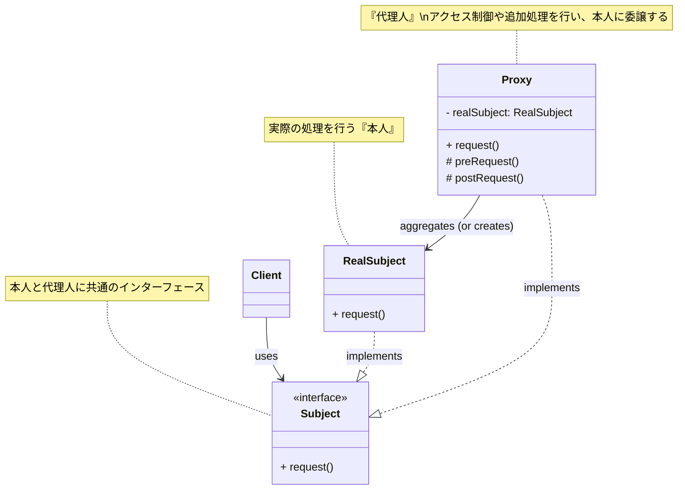

_図: Proxy パターンの基本的なクラス構造。`Client` は `Subject` インターフェースを通じて `Proxy` を利用する。_

### このパターンが役立つ場面 (Context)

Proxy パターンは、オブジェクトへのアクセスに対して何らかの**間接層**を設けたい場合に幅広く適用できます。具体的な適用場面としては、以下のようなものが考えられます。

- **リソース消費の大きいオブジェクトの生成を遅延させたいとき (Virtual Proxy):** たとえば、巨大な画像ファイルを表示する際に、サムネイルだけを先に表示し、ユーザーがクリックしたら初めて本体の画像を読み込むようなケース。
- **アクセス権限に基づいて操作を制限したいとき (Protection Proxy):** たとえば、ユーザーの役割（管理者、一般ユーザーなど）に応じて、特定の機能へのアクセスを許可したり拒否したりするケース。
- **ネットワーク通信の詳細を隠蔽したいとき (Remote Proxy):** クライアントからは、あたかもローカルのオブジェクトを呼び出しているかのように見せかけ、実際には Proxy がネットワーク通信を行ってリモートサーバー上のオブジェクトとやり取りするケース（RPC: Remote Procedure Call などで利用される）。
- **メソッド呼び出しの前後に共通の処理（ログ出力、トランザクション管理、キャッシュなど）を挟み込みたいとき (Smart Proxy):** AOP（Aspect-Oriented Programming）の基本的な考え方にも通じます。

Proxy パターンは非常に用途が広い反面、不必要に導入すると余計な複雑さを生む可能性もあります。アクセス制御や付加機能が必要ない単純なオブジェクトに対して適用するのは過剰設計となるでしょう。

### コード例：初心者が書きがちなコード

たとえば、高解像度の画像を表示する機能を考えます。画像の読み込みには時間がかかるとします。Proxy パターンを知らない場合、クライアント側で直接、重い画像読み込み処理を呼び出してしまうかもしれません。

```java
// 高解像度画像を表すクラス (読み込みに時間がかかる想定)
class HighResolutionImage {
    private String imagePath;

    // コンストラクタで重い読み込み処理が発生する (例)
    public HighResolutionImage(String imagePath) {
        this.imagePath = imagePath;
        loadImageFromServer(); // 重い処理
    }

    private void loadImageFromServer() {
        System.out.println("サーバーから画像をロード中...: " + imagePath + " (時間がかかる)");
        try { Thread.sleep(3000); } catch (InterruptedException e) {} // 3秒待つダミー処理
    }

    public void displayImage() {
        System.out.println("画像を表示します: " + imagePath);
    }
}

// クライアント (画像表示プログラム、Proxy適用前)
class ImageGallery {
    public static void main(String[] args) {
        System.out.println("ギャラリーを開きます。");

        // 画像オブジェクトを生成しただけで、重い読み込みが始まってしまう！
        HighResolutionImage image1 = new HighResolutionImage("photo1.jpg");
        HighResolutionImage image2 = new HighResolutionImage("photo2.png");
        HighResolutionImage image3 = new HighResolutionImage("photo3.gif");

        System.out.println("画像の準備ができました。"); // 実際はまだロード中かも…

        // 実際に表示するときに displayImage を呼ぶ
        System.out.println("画像1を表示します。");
        image1.displayImage(); // ここで初めて表示される
        System.out.println("画像2を表示します。");
        image2.displayImage();
        // 途中で表示しない画像があっても、生成時にロードされてしまっている
    }
}

// 問題点：
// 1. HighResolutionImage オブジェクトを生成した瞬間に、時間のかかる画像ロードが始まってしまう。
// 2. 実際に表示しないかもしれない画像までロードしてしまい、リソースが無駄になる可能性がある。
// 3. クライアントは、画像ロードが重い処理であることを意識する必要がある。
```

このコードでは、`ImageGallery` が `HighResolutionImage` のインスタンスを作成した時点で、画像が表示されるかどうかに関わらず、重い `loadImageFromServer()` が実行されてしまいます。

### コード例：Proxy パターン適用後 (Virtual Proxy の例)

Proxy パターン（ここでは Virtual Proxy）を適用すると、画像の読み込みを実際に必要になるまで遅らせることができます。

```java
// 1. Subject インターフェース
interface Image {
    void displayImage();
}

// 2. RealSubject クラス (本人)
class HighResolutionImageReal implements Image {
    private String imagePath;

    // コンストラクタではパスを覚えるだけ
    public HighResolutionImageReal(String imagePath) {
        this.imagePath = imagePath;
        // ここではロードしない！
    }

    private void loadImageFromServer() {
        System.out.println("<< Virtual Proxy による遅延ロード >>");
        System.out.println("サーバーから画像をロード中...: " + imagePath + " (時間がかかる)");
        try { Thread.sleep(3000); } catch (InterruptedException e) {}
    }

    // 初めて displayImage が呼ばれたときにロードする
    @Override
    public void displayImage() {
        // (実際にはロード済みかチェックするが、ここでは簡略化)
        // loadImageFromServer(); // 本来はここでロードするなどの実装
        System.out.println("画像を表示します: " + imagePath);
    }
}

// 3. Proxy クラス (代理人)
class ImageProxy implements Image {
    private String imagePath;
    private HighResolutionImageReal realImage; // 本人オブジェクトへの参照 (最初は null)

    public ImageProxy(String imagePath) {
        this.imagePath = imagePath;
        this.realImage = null; // 最初は本人を生成しない
    }

    // displayImage が呼ばれたら、必要なら本人を生成して委譲する
    @Override
    public void displayImage() {
        // もし本人がまだ生成されていなければ、ここで初めて生成（遅延初期化）
        if (realImage == null) {
            System.out.println("Proxy: 本人(RealSubject)が必要になったので生成します。");
            realImage = new HighResolutionImageReal(imagePath);
            // ☆重要な注意：Proxy のコンストラクタではなく、
            //   実際に必要とされるメソッド (displayImage) の中で
            //   RealSubject の重い処理 (loadImageFromServer) を
            //   呼び出すように RealSubject 側を実装するのがより一般的です。
            //   この例では RealSubject のコンストラクタからロード処理を削除し、
            //   displayImage が呼ばれたときに初めてロードする、という想定です。
        }
        // 本人に処理を委譲
        System.out.println("Proxy: 本人に表示処理をお願いします。");
        realImage.displayImage();
    }
}

// クライアント (Proxy適用後)
class ImageGalleryProxyUser {
    public static void main(String[] args) {
        System.out.println("ギャラリーを開きます。");

        // Proxy オブジェクトを生成するだけでは、重い処理は実行されない！
        Image image1 = new ImageProxy("photo1.jpg");
        Image image2 = new ImageProxy("photo2.png");
        Image image3 = new ImageProxy("photo3.gif");

        System.out.println("Proxyオブジェクトの準備ができました。");

        // 実際に表示するメソッドが呼ばれたときに、初めてロード処理が（Proxy経由で）発生する
        System.out.println("\n画像1を表示します。");
        image1.displayImage(); // ここで初めて photo1.jpg のロードと表示が行われる

        System.out.println("\n画像3を表示します。");
        image3.displayImage(); // ここで初めて photo3.gif のロードと表示が行われる

        // 画像2は displayImage が呼ばれなかったので、ロード処理は実行されない
        System.out.println("\nギャラリーを閉じます。");
    }
}
```

このコードでは、クライアントは `Image` インターフェースを通じて `ImageProxy` を利用します。`ImageProxy` は、`displayImage()` が初めて呼び出されるまで `HighResolutionImageReal`（本人）の生成や重いロード処理を行いません。これにより、不要なリソース消費を避けることができます。

### 利点と注意点（トレードオフ）

**利点 (Pros):**

- **アクセス制御:** オブジェクトへのアクセスを Proxy が仲介することで、様々な制御（権限チェック、遅延実行、ロギングなど）を柔軟に追加できます。
- **透過性:** クライアントは、Proxy を RealSubject と同じインターフェースで扱えるため、Proxy の存在を意識する必要がありません。
- **関心の分離:** RealSubject は本来の責務に集中でき、アクセス制御や付加機能に関するロジックは Proxy に分離できます。
- **多様な適用:** Virtual Proxy, Protection Proxy, Remote Proxy, Smart Proxy など、目的に応じた様々な種類の Proxy を実装できます。

**注意点 (Cons) / トレードオフ:**

- **複雑性の増加:** Proxy クラスという間接層が増えるため、システムの構造はやや複雑になります。
- **応答時間の変動:** Proxy が行う処理（例: 遅延初期化、ネットワーク通信）によっては、クライアントからの要求に対する応答時間が変動する可能性があります。クライアントが常に一定の応答時間を期待している場合には注意が必要です。
- **インターフェースの維持:** Proxy は RealSubject と同じインターフェースを実装する必要があるため、Subject インターフェースに変更があった場合は、RealSubject と Proxy の両方を修正する必要があります。

**他のパターンとの関連:**

- **Decorator パターン:** Proxy パターンと Decorator パターンは、どちらも対象オブジェクトをラップして機能を追加・変更する点で似ていますが、目的が異なります。Proxy は主に**アクセス制御**や**リソース管理**に焦点を当てるのに対し、Decorator はオブジェクトに**動的に責務（機能）を追加**することに焦点を当てます。Proxy は通常、ラップするオブジェクトのインターフェースを変更しませんが、Decorator は新しい機能を提供するためにインターフェースを拡張することがあります。
- **Adapter パターン:** Adapter パターンは**異なるインターフェース間の互換性**を提供するのが目的ですが、Proxy パターンは**同じインターフェース**を提供しつつアクセスを制御するのが目的です。
- **Facade パターン:** Facade は**複数の**サブシステムオブジェクトへの統一インターフェースを提供しますが、Proxy は通常、**単一の**オブジェクトへのアクセスを代理・制御します。

Proxy パターンは、オブジェクトへのアクセス方法を工夫したい場合に非常に役立つ、応用範囲の広いパターンです。その種類と目的を理解し、状況に応じて適切に使い分けることが重要です。

## 3.7 State パターン：状態に合わせて振る舞いを切り替える仕組み

ソフトウェアの中には、自身の「状態」によって振る舞いが大きく変わるオブジェクトがあります。たとえば、自動販売機を考えてみましょう。「お金が投入されていない状態」「お金が投入されているが商品は選択されていない状態」「商品が選択された状態」「お釣りがある状態」など、状態によって「お金を入れる」「ボタンを押す」「商品を取り出す」といった操作に対する反応（振る舞い）が変わりますよね。

もし、このような状態に基づく振る舞いの変化を、オブジェクト自身のクラス内に `if-else` 文や `switch` 文を使って大量に記述すると、コードは非常に複雑になりがちです。状態の種類が増えたり、各状態での振る舞いが変更されたりするたびに、巨大な条件分岐を修正する必要があり、保守が困難になります。

**State パターン**は、このような問題を解決するためのデザインパターンです。このパターンは、**オブジェクトの内部状態に応じてその振る舞いが変わる様子を、状態ごとに独立したクラスとして表現し、オブジェクト自身が状態に応じて振る舞いを切り替えられるようにする**ものです。（『オブジェクト指向における再利用のためのデザインパターン 改訂版』参照）

State パターンを使うと、オブジェクトはまるで**状態ごとに「性格」が変わる**かのように見えます。オブジェクトは、現在の「状態」を表すオブジェクトに実際の振る舞いを**委譲**します。そして、状態が変化すると、委譲先の「状態」オブジェクトを別のものに差し替えることで、あたかもオブジェクト自身のクラスが変わったかのように振る舞いが変化します。

### どんな問題を解決するか？ (Problem)

State パターンは、主に以下のような設計上の課題に対処します。

- **状態に依存する振る舞いの管理:** オブジェクトの振る舞いが、その内部状態によって大きく変化し、その状態管理と振る舞いの分岐ロジックが複雑になっている。
- **巨大な条件分岐の排除:** オブジェクトのメソッド内に、状態を判定するための `if-else` や `switch` 文が多数存在し、コードの見通しが悪く、修正が困難になっている。
- **状態遷移ロジックの明確化:** 状態がどのように変化（遷移）するのか、そのルールを明確にし、管理しやすくしたい。
- **状態ごとの振る舞いの追加・変更の容易化:** 新しい状態を追加したり、特定の状態における振る舞いを変更したりする際に、既存のコードへの影響を最小限に抑えたい（**オープン/クローズドの原則**）。

### パターンの考え方と登場人物 (Solution & Structure)

State パターンでは、オブジェクトの状態とその状態における振る舞いをカプセル化した `State` クラス群を導入します。主な登場人物は以下の通りです。（『Java 言語で学ぶデザインパターン入門第 3 版』の構成を参考に）

- **`Context`（文脈）:**
  - 状態を持つオブジェクト本体です。クライアントはこの `Context` オブジェクトとやり取りします。
  - 現在の状態を表す `State` オブジェクト（`currentState`）への参照を内部に保持します。
  - クライアントからの要求（メソッド呼び出し）を受け取ると、実際の処理を現在の `State` オブジェクトに**委譲**します。
  - 現在の状態を変更（遷移）するためのメソッド（例: `changeState()`）を提供します。このメソッドは、`Context` 自身が呼び出すことも、`State` オブジェクトが次の状態を指定して呼び出すこともあります。
- **`State`（状態）:**
  - 特定の状態における振る舞いを表す**共通のインターフェース**（または抽象クラス）を定義します。`Context` が委譲してくる可能性のあるすべてのメソッド（操作）を宣言します。
  - **オプション:** 状態遷移を引き起こすメソッド（例: `handleEvent()`）の中で、次の状態を `Context` に通知する役割を持つこともあります。
- **`ConcreteState`（具体的な状態）:**
  - `State` インターフェースを実装（または継承）し、特定の状態における具体的な振る舞いを実装します。
  - `Context` から委譲された処理を実行します。
  - **オプション:** 特定の条件やイベントに応じて、`Context` に対して次の状態への遷移を指示することがあります。

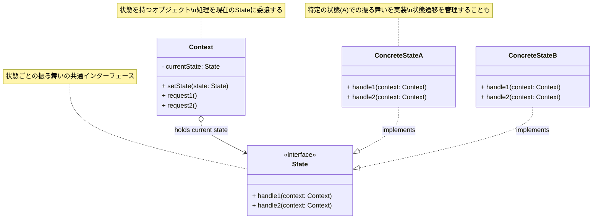

_図: State パターンの基本的なクラス構造。`Context` が現在の `State` を持ち、処理を委譲する。`ConcreteState` が状態ごとの振る舞いを実装する。_

### このパターンが役立つ場面 (Context)

State パターンの適用を検討するのが効果的な状況は以下の通りです。

- **オブジェクトの振る舞いが、その状態を示す変数の値によって明確に変化するとき。**
- **メソッド内に、オブジェクトの状態をチェックする `if-else` や `switch` 文が多数含まれており、それが複雑化・肥大化しているとき。**
- **状態の種類が多く、かつ、将来的に状態が増減する可能性があるとき。** (新しい状態は新しい `ConcreteState` クラスを追加するだけで対応できる)
- **状態遷移のルールが明確に定義されており、それをコード上で表現したいとき。** (`ConcreteState` 内に遷移ロジックを記述できる)

一方で、状態の種類が非常に少なく、振る舞いの変化も単純な場合は、State パターンを導入するとクラス数が増え、かえって複雑になる可能性もあります。状態管理がシンプルであれば、`Context` 内の条件分岐で十分な場合もあります。

### コード例：初心者が書きがちなコード

簡単な信号機 (`TrafficLight`) を例に考えてみましょう。信号機には「赤」「黄」「青」の状態があり、時間が経つと状態が変わります。また、現在の色（状態）を問い合わせる機能があるとします。State パターンを知らないと、状態を管理する変数と `if-else` を使うかもしれません。

```java
// 信号機の状態を表す定数 (例)
final int RED = 0;
final int YELLOW = 1;
final int GREEN = 2;

// 信号機クラス (Stateパターン適用前)
class TrafficLight {
    private int currentState = RED; // 現在の状態を整数で管理

    // 時間経過で状態を変化させるメソッド
    public void change() {
        if (currentState == RED) {
            currentState = GREEN;
            System.out.println("信号が 青 になりました。");
        } else if (currentState == YELLOW) {
            currentState = RED;
            System.out.println("信号が 赤 になりました。");
        } else if (currentState == GREEN) {
            currentState = YELLOW;
            System.out.println("信号が 黄 になりました。");
        }
    }

    // 現在の色を取得するメソッド
    public String getColor() {
        if (currentState == RED) {
            return "Red";
        } else if (currentState == YELLOW) {
            return "Yellow";
        } else if (currentState == GREEN) {
            return "Green";
        } else {
            return "Unknown";
        }
    }

    // もし、状態ごとに行える操作（例：歩行者用ボタンを押す）が増えると、
    // さらに if-else が増えていく…
}

// 利用例
TrafficLight light = new TrafficLight();
System.out.println("現在の色: " + light.getColor());
light.change();
System.out.println("現在の色: " + light.getColor());
light.change();
System.out.println("現在の色: " + light.getColor());
light.change();
System.out.println("現在の色: " + light.getColor());

// 問題点：
// 1. 状態が増えるたびに、すべてのメソッド内の if-else を修正する必要がある。
// 2. 状態遷移のロジックと、状態ごとの振る舞い（getColor）が同じクラス内に混在している。
// 3. 状態を管理する変数 (currentState) がクラス全体に散らばりがち。
```

このコードでは、`change()` メソッドと `getColor()` メソッドの両方に、現在の状態 (`currentState`) をチェックするための `if-else` 文が存在します。

### コード例：State パターン適用後

State パターンを適用すると、各状態（赤、黄、青）を独立したクラスとして定義し、状態遷移や振る舞いを各 State クラスに担当させます。

```java
// 1. State インターフェース
interface TrafficLightState {
    void change(TrafficLightContext context); // 次の状態へ遷移させる
    String getColor();                     // 現在の色を返す
}

// 2. ConcreteState クラスの実装
class RedState implements TrafficLightState {
    @Override
    public void change(TrafficLightContext context) {
        System.out.println("信号が 青 になりました。");
        context.setState(new GreenState()); // 次の状態 (Green) を Context にセット
    }
    @Override
    public String getColor() { return "Red"; }
}

class YellowState implements TrafficLightState {
    @Override
    public void change(TrafficLightContext context) {
        System.out.println("信号が 赤 になりました。");
        context.setState(new RedState()); // 次の状態 (Red) を Context にセット
    }
    @Override
    public String getColor() { return "Yellow"; }
}

class GreenState implements TrafficLightState {
    @Override
    public void change(TrafficLightContext context) {
        System.out.println("信号が 黄 になりました。");
        context.setState(new YellowState()); // 次の状態 (Yellow) を Context にセット
    }
    @Override
    public String getColor() { return "Green"; }
}

// 3. Context クラスの実装
class TrafficLightContext {
    private TrafficLightState currentState; // 現在の状態 (Stateオブジェクト)

    public TrafficLightContext() {
        // 初期状態を設定
        this.currentState = new RedState();
        System.out.println("信号が 赤 になりました。(初期状態)");
    }

    // 状態を変更するためのメソッド
    public void setState(TrafficLightState state) {
        this.currentState = state;
    }

    // 処理を現在の State オブジェクトに委譲
    public void change() {
        currentState.change(this); // 状態遷移の処理は State に任せる
    }

    // 処理を現在の State オブジェクトに委譲
    public String getColor() {
        return currentState.getColor(); // 色を返す処理も State に任せる
    }
}

// 利用例
TrafficLightContext lightContext = new TrafficLightContext();
System.out.println("現在の色: " + lightContext.getColor());
lightContext.change();
System.out.println("現在の色: " + lightContext.getColor());
lightContext.change();
System.out.println("現在の色: " + lightContext.getColor());
lightContext.change();
System.out.println("現在の色: " + lightContext.getColor());

// 新しい状態（例：点滅）を追加する場合、
// 新しい State クラスを作り、関連する State クラスの change メソッドを修正するだけで済む。
// TrafficLightContext クラスの修正は不要。
```

このコードでは、`TrafficLightContext` は現在の状態 (`currentState`) を保持するだけで、実際の振る舞い（`change`, `getColor`）はすべて `currentState` が指す具体的な `State` オブジェクト（`RedState`, `YellowState`, `GreenState`）に委譲しています。状態遷移のロジックも各 `ConcreteState` クラス内にカプセル化されています。

### 利点と注意点（トレードオフ）

**利点 (Pros):**

- **状態固有の振る舞いの局所化:** 各状態における振る舞いが、対応する `ConcreteState` クラス内にまとめられるため、コードの凝集度が高まり、理解しやすくなります。
- **条件分岐の排除:** `Context` のメソッドから状態を判定する複雑な条件分岐がなくなり、コードがシンプルになります。
- **状態遷移の明示化:** 状態間の遷移ルールが、各 `ConcreteState` クラス内で明示的に表現されるため、状態遷移の管理が容易になります。
- **新しい状態の追加が容易:** 新しい状態を追加するには、新しい `ConcreteState` クラスを作成し、必要に応じて既存の `State` クラスからの遷移ロジックを修正するだけで済みます。`Context` クラスへの変更は最小限（あるいは不要）となり、**オープン/クローズドの原則 (OCP)** に貢献します。

**注意点 (Cons) / トレードオフ:**

- **クラス数の増加:** 状態の種類ごとに `ConcreteState` クラスが必要になるため、状態が多い場合はクラス数が大幅に増加します。
- **設計の複雑さ:** 状態の種類が少ない、あるいは状態遷移が非常に単純な場合には、State パターンを導入することが過剰設計となり、かえってコードを複雑にしてしまう可能性があります。
- **State オブジェクトの管理:** `ConcreteState` オブジェクトをいつ生成するか（毎回生成するか、Singleton などで共有するか）を考慮する必要があります。状態が内部データを持たない場合は、Singleton として実装し共有することで効率化できます。

**他のパターンとの関連:**

- **Strategy パターン:** State パターンと Strategy パターンは構造が非常によく似ています。主な違いは「意図」です。State パターンはオブジェクトの「状態」に応じて「振る舞い」を内部的に切り替えることに焦点を当て、状態遷移も管理することが多いのに対し、Strategy パターンはクライアントが「アルゴリズム」を明示的に選択し、`Context` に設定して利用することに焦点を当てます。`Context` が自身の状態に基づいて内部的に `Strategy` を切り替えるような実装も可能であり、両者は密接に関連しています。
- **Flyweight パターン:** 状態オブジェクト (`ConcreteState`) が内部状態を持たず共有可能な場合、Flyweight パターンを適用してオブジェクト生成のコストを削減できます。

State パターンは、オブジェクトの状態によって振る舞いが大きく変わる場合の複雑さを解消するための強力なパターンです。状態遷移が複雑なシステムや、状態ごとのロジックが肥大化しがちな場合に、その適用を検討する価値があります。

## 3.8 Command パターン：操作そのものを「依頼書」としてオブジェクト化

ソフトウェアを開発していると、「ある操作（アクション）を実行してほしい」という要求を、すぐには実行せずに、後で実行したり、実行する順序を指定したり、実行した操作を取り消したり（Undo）、記録しておいたりしたい場合があります。たとえば、

- GUI アプリケーションで、ボタンがクリックされたときの動作（「保存」「印刷」「終了」など）を、ボタン自身から切り離して定義したい。
- 複数の操作を順番に記録しておき、後でまとめて実行したり、逆順で取り消したりしたい（マクロ機能や Undo/Redo 機能）。
- ネットワーク越しに、別のコンピュータに処理を依頼したい。

もし、操作を実行する側（Invoker）が、操作の具体的な内容（Receiver とそのメソッド）を直接知っていると、Invoker と Receiver が密接に結びついてしまい、上記のような柔軟な要求に応えるのが難しくなります。

**Command パターン**は、このような問題を解決するためのデザインパターンです。このパターンは、**実行されるべき操作（アクション）に関するすべての情報（どのオブジェクトの、どのメソッドを、どのパラメータで呼び出すか）を、一つのオブジェクト（Command オブジェクト）としてカプセル化**します。これにより、操作の要求（「これをやってほしい」という依頼）と、その操作を実際に実行するオブジェクトや具体的な手順とを分離することができます。（『オブジェクト指向における再利用のためのデザインパターン 改訂版』参照）

Command パターンは、操作の依頼を「**依頼書**」や「**作業指示書**」のようなオブジェクトとして扱うイメージです。依頼を出す人（Client）は、具体的な作業内容を書いた依頼書（Command オブジェクト）を作成し、それを実行担当者（Invoker）に渡します。実行担当者は、依頼書を受け取って保管しておき、好きなタイミングで依頼書に書かれた指示（`execute` メソッド）を実行します。実行担当者は、依頼書が具体的にどんな作業を指示しているか（たとえば、「ファイルを保存する」のか「印刷する」のか）を知る必要はありません。

### どんな問題を解決するか？ (Problem)

Command パターンは、主に以下のような設計上の課題に対処します。

- **要求と実行の分離:** 操作を要求するオブジェクトと、その操作を実際に実行するオブジェクトを分離したい。これにより、要求側は実行の詳細を知る必要がなくなり、両者の結合度を下げることができます。
- **操作のパラメータ化:** 異なる操作（コマンド）をオブジェクトとして表現し、パラメータとして渡したり、キューに格納したり、ログに記録したりできるようにしたい。
- **Undo/Redo 機能の実装:** 実行した操作を取り消したり、再度実行したりする機能を実装したい。Command オブジェクトに `undo()` メソッドを持たせることで実現できます。
- **操作のキューイングとスケジューリング:** 操作（コマンド）をキューに溜めておき、後で順番に実行したり、特定の時間に実行したりしたい（非同期処理やバッチ処理）。
- **マクロ記録:** 一連の操作（コマンド）を記録しておき、後でまとめて再生するようなマクロ機能を実装したい。

### パターンの考え方と登場人物 (Solution & Structure)

Command パターンでは、「実行すべき操作」そのものをオブジェクトとして扱います。主な登場人物は以下の通りです。（『Java 言語で学ぶデザインパターン入門第 3 版』の構成を参考に）

- **`Command`（命令）:**
  - すべての具体的なコマンドクラスが実装すべき**共通のインターフェース**を定義します。通常、「操作を実行する」ためのメソッド（例: `execute()`）を宣言します。
  - **オプション:** Undo 機能を実現するために、操作を取り消すメソッド（例: `undo()`）を宣言することもあります。
- **`ConcreteCommand`（具体的な命令）:**
  - `Command` インターフェースを実装し、特定の操作を実行するための具体的な実装を提供します。
  - 通常、操作の対象となるオブジェクト（**`Receiver`**）への参照と、操作に必要なパラメータを保持します。
  - `execute()` メソッドが呼び出されると、保持している `Receiver` オブジェクトの適切なメソッドを呼び出して、実際の処理を実行します。
  - `undo()` メソッドが宣言されている場合は、`execute()` で行った操作を取り消す処理を実装します。
- **`Receiver`（受信者、実行者）:**
  - `Command` オブジェクトが依頼する操作を、**実際に実行する**オブジェクトです。ビジネスロジックや具体的な処理は、この `Receiver` が担当します。
- **`Invoker`（起動者、依頼者）:**
  - `Command` オブジェクトを保持し、その実行タイミングを決定するオブジェクトです。たとえば、GUI のボタンやメニュー項目、あるいはコマンドキューなどが `Invoker` にあたります。
  - `Invoker` は、保持している `Command` オブジェクトに対して `execute()` メソッドを呼び出すことで、操作の実行を要求します。`Invoker` は、`Command` が具体的に何をするのか、あるいは `Receiver` が誰なのかを知る必要はありません。
- **`Client`（利用者）:**
  - `ConcreteCommand` オブジェクトを生成し、そのコマンドが操作すべき `Receiver` オブジェクトを設定します。
  - 生成した `ConcreteCommand` オブジェクトを、適切な `Invoker` オブジェクトに登録（設定）します。

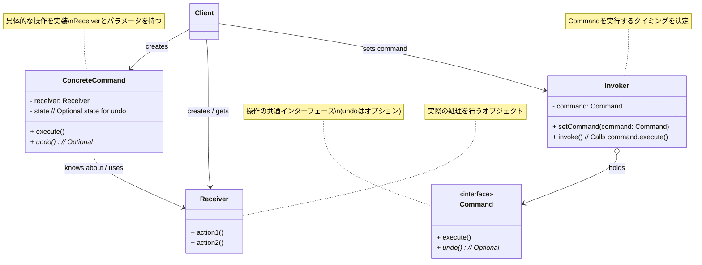

_図: Command パターンの基本的なクラス構造。`Invoker` は `Command` を実行し、`ConcreteCommand` が `Receiver` のメソッドを呼び出す。_

### このパターンが役立つ場面 (Context)

Command パターンの適用を検討すると良い状況は以下の通りです。

- **操作の要求元（`Invoker`）と実行内容（`Receiver` とそのメソッド）を分離したいとき。** これにより、`Invoker` はさまざまな `Command` を実行できるようになり、`Receiver` は `Invoker` を意識する必要がなくなります。
- **実行する操作をオブジェクトとして扱いたいとき。** これにより、操作をキューに入れたり、ログに記録したり、ネットワーク経由で送信したりすることが容易になります。
- **Undo/Redo 機能を実装したいとき。** Command オブジェクトに実行履歴や状態を持たせ、`undo()` メソッドを実装することで実現できます。
- **GUI のボタンやメニューのアクションを実装するとき。** 各ボタンやメニュー項目を `Invoker` とし、それぞれに対応する `ConcreteCommand` を設定することで、アクションの定義と実行を分離できます。
- **複数の操作をまとめて実行するマクロ機能や、トランザクション処理（一連の操作をすべて成功させるか、すべて失敗させるか）を実装したいとき。**

コマンドの種類が非常に少なく、かつ Undo/Redo やキューイングなどの機能も不要な単純なケースでは、Command パターンを導入するとクラスが増え、設計が過剰になる可能性もあります。

### コード例：初心者が書きがちなコード

たとえば、シンプルな電卓 (`Calculator`) があり、GUI アプリケーションから足し算と引き算を実行したいとします。Command パターンを知らないと、ボタンのイベントハンドラ内で直接 `Calculator` のメソッドを呼び出してしまうかもしれません。

```java
// 計算を実行するクラス (Receiver)
class Calculator {
    private int currentValue = 0;

    public void add(int value) {
        currentValue += value;
        System.out.println("足し算実行: " + value + " (現在値: " + currentValue + ")");
    }

    public void subtract(int value) {
        currentValue -= value;
        System.out.println("引き算実行: " + value + " (現在値: " + currentValue + ")");
    }

    public int getResult() {
        return currentValue;
    }
}

// GUI のボタンのようなもの (Invoker相当だが、Receiverと密結合)
class CalculatorButton {
    private Calculator calculator;
    private String operation; // '+' or '-'
    private int operand;

    public CalculatorButton(Calculator calc, String op, int val) {
        this.calculator = calc;
        this.operation = op;
        this.operand = val;
    }

    // ボタンがクリックされたときの処理
    public void onClick() {
        System.out.println("ボタンクリック: " + operation + operand);
        if ("+".equals(operation)) {
            calculator.add(operand); // Calculatorのメソッドを直接呼び出し
        } else if ("-".equals(operation)) {
            calculator.subtract(operand); // Calculatorのメソッドを直接呼び出し
        }
        // もしUndo機能を追加したい場合、ここに履歴管理などを追加する必要があり、
        // Buttonクラスの責務がどんどん増えていく…
    }
}

// 利用例 (Client相当)
Calculator calc = new Calculator();
// ボタンに直接 Calculator と操作内容を渡している
CalculatorButton addButton = new CalculatorButton(calc, "+", 10);
CalculatorButton subtractButton = new CalculatorButton(calc, "-", 5);

addButton.onClick();    // +10 を実行
subtractButton.onClick(); // -5 を実行
addButton.onClick();    // +10 を実行

System.out.println("最終結果: " + calc.getResult());

// 問題点：
// 1. CalculatorButton が Calculator の具体的なメソッド (add, subtract) を知っている必要がある (密結合)。
// 2. 新しい操作（掛け算など）を追加する場合、CalculatorButton の onClick メソッドを修正する必要がある。
// 3. Undo/Redo 機能などを追加するのが難しい。Button の責務ではない。
```

このコードでは、`CalculatorButton` が `Calculator` の実装に直接依存しており、柔軟性に欠けます。

### コード例：Command パターン適用後

Command パターンを適用すると、各操作（足し算、引き算）を `Command` オブジェクトとしてカプセル化します。

```java
// Receiver クラス (変更なし)
class Calculator {
    private int currentValue = 0;
    public void add(int value) { /* ... */ }
    public void subtract(int value) { /* ... */ }
    public int getResult() { return currentValue; }
     // Undo用に値を戻すメソッドを追加することも考えられる
     // public void setValue(int value) { this.currentValue = value; }
}

// 1. Command インターフェース
interface Command {
    void execute();
    // void undo(); // Undoが必要なら追加
}

// 2. ConcreteCommand クラスの実装
class AddCommand implements Command {
    private Calculator calculator;
    private int operand;
    // private int previousValue; // Undo用

    public AddCommand(Calculator calculator, int operand) {
        this.calculator = calculator;
        this.operand = operand;
    }

    @Override
    public void execute() {
        // previousValue = calculator.getResult(); // Undo用
        System.out.print("Command実行: ");
        calculator.add(operand); // Receiver のメソッドを呼び出す
    }

    // @Override public void undo() { calculator.setValue(previousValue); } // Undo実装例
}

class SubtractCommand implements Command {
    private Calculator calculator;
    private int operand;

    public SubtractCommand(Calculator calculator, int operand) {
        this.calculator = calculator;
        this.operand = operand;
    }

    @Override
    public void execute() {
        System.out.print("Command実行: ");
        calculator.subtract(operand); // Receiver のメソッドを呼び出す
    }
    // Undo実装...
}

// 3. Invoker クラス (ボタンなど)
class CalculatorInvoker {
    private Command command;

    public void setCommand(Command command) {
        this.command = command;
    }

    // ボタンクリックなどのイベントで Command を実行
    public void buttonPressed() {
        System.out.println("Invoker: ボタンが押されたので Command を実行します。");
        if (command != null) {
            command.execute(); // 保持している Command の execute を呼び出すだけ
        }
    }
}

// 4. Client (セットアップ)
public class CommandClient {
    public static void main(String[] args) {
        Calculator calculator = new Calculator(); // Receiver

        // ConcreteCommand を生成し、Receiver を設定
        Command addCmd = new AddCommand(calculator, 10);
        Command subtractCmd = new SubtractCommand(calculator, 5);

        // Invoker (ボタン) を生成し、Command を設定
        CalculatorInvoker addButtonInvoker = new CalculatorInvoker();
        addButtonInvoker.setCommand(addCmd);

        CalculatorInvoker subtractButtonInvoker = new CalculatorInvoker();
        subtractButtonInvoker.setCommand(subtractCmd);

        // ボタンを押す (Invoker が Command を実行)
        addButtonInvoker.buttonPressed();
        subtractButtonInvoker.buttonPressed();
        addButtonInvoker.buttonPressed();

        System.out.println("最終結果: " + calculator.getResult());

        // もし Undo/Redo が必要なら、実行した Command をリストに保持する機構などを追加できる
    }
}
```

このコードでは、`CalculatorInvoker` (ボタン) は `Command` インターフェースのことだけを知っていればよく、具体的な操作内容 (`AddCommand` か `SubtractCommand` か) や、操作対象の `Calculator` を直接知る必要がなくなりました。操作の要求と実行が明確に分離されています。

### 利点と注意点（トレードオフ）

**利点 (Pros):**

- **要求と実行の分離:** `Invoker` と `Receiver` を疎結合にできます。`Invoker` は `Command` インターフェースにのみ依存し、`Receiver` は `Invoker` の存在を知る必要がありません。
- **操作のオブジェクト化:** 操作をオブジェクトとして扱えるため、パラメータ化、キューイング、ロギング、Undo/Redo など、柔軟な操作管理が可能になります。
- **拡張性:** 新しい操作を追加したい場合、新しい `ConcreteCommand` クラスを作成するだけで済み、既存の `Invoker` や `Receiver` を修正する必要がない場合があります（**オープン/クローズドの原則 (OCP)**）。
- **組み立て可能性:** `Composite` パターンと組み合わせて、複数のコマンドをまとめたマクロコマンドを作成することも容易です。

**注意点 (Cons) / トレードオフ:**

- **クラス数の増加:** 操作ごとに `ConcreteCommand` クラスが必要になるため、システムのクラス数は増加します。非常に単純な操作しかない場合は、過剰設計になる可能性があります。
- **実装の複雑さ:** 単純なメソッド呼び出しに比べて、間に `Command` オブジェクトを挟むため、コードのステップ数は増え、若干のオーバーヘッドが発生します。Undo/Redo を実装する場合は、さらに状態管理などが複雑になります。

**他のパターンとの関連:**

- **Composite パターン:** 複数の `Command` オブジェクトをまとめて 1 つのコマンドのように扱えるマクロコマンドを実装する際に、Composite パターンが利用できます。
- **Memento パターン:** Undo 機能を実装する際に、操作前の `Receiver` の状態を保存するために Memento パターンが使われることがあります。
- **Prototype パターン:** コピー可能な `Command` オブジェクトを作成するために Prototype パターンが利用されることがあります。

Command パターンは、操作の要求と実行を分離し、操作自体をオブジェクトとして柔軟に扱いたい場合に非常に強力なパターンです。GUI アプリケーションのイベント処理、非同期処理、Undo/Redo 機能など、応用範囲は多岐にわたります。

# 4.【Creation パターン編】 オブジェクト生成の柔軟性を高める

これまでは、主にオブジェクトが「どのように振る舞うか」や「どのように連携するか」に焦点を当てた Core パターンを見てきました。この章では、ソフトウェア設計のもう一つの重要な側面である「**オブジェクトをどのように生成（インスタンス化）するか**」に関わる **Creation パターン（生成に関するパターン）** をいくつか紹介します。

オブジェクトを生成するコードは、一見単純に見えますが、生成プロセスが複雑だったり、生成するオブジェクトの種類を実行時に決定したかったりする場合、コードの柔軟性や保守性を損なう原因となることがあります。Creation パターンは、このようなオブジェクト生成に関する課題に対処し、より柔軟で管理しやすい方法を提供します。

## 4.1 Factory Method パターン：オブジェクト生成を「専門工場」に任せる

ソフトウェア開発をしていると、「何を作るかは後で決めたい」「作るものを状況によって変えたい」という場面が出てきます。たとえば、文書作成ソフトを作っているとしましょう。「新規作成」ボタンを押したときに、テキスト文書 (`TextDocument`) を作るのか、図形文書 (`DrawingDocument`) を作るのかは、ユーザーが選んだり、ソフトの種類によって決まったりします。

もし、文書作成ソフト本体（親クラスのような存在）が、具体的な文書クラス (`TextDocument` や `DrawingDocument`) の名前を知っていて、直接 `new` していたらどうなるでしょう？ 新しい種類の文書（たとえば `SpreadsheetDocument`）を追加したいときに、ソフト本体のコードを修正しなければならなくなります。これは少し面倒ですし、変更に弱い構造になってしまいます。

**Factory Method パターン**は、まさにこのような「**どのクラスのインスタンスを生成するかを、すぐには決めずに、後で（あるいは別の場所で）決められるようにしたい**」という問題を解決するためのデザインパターンです。このパターンでは、**オブジェクトを生成するためのメソッド（これを Factory Method と呼びます）を用意することだけを親クラスで決め**ておき、**実際にどのクラスのインスタンスを作るかの具体的な決定は、子クラスに任せます**。（『オブジェクト指向における再利用のためのデザインパターン 改訂版』参照）

このパターンは、製品を作る**「工場 (Factory)」**に例えられます。親クラスは「うちの工場では『製品を作るメソッド』を持っていますよ」と宣言するだけで、具体的な製品（たとえば、「テレビ」なのか「冷蔵庫」なのか）を作るのは、それぞれの製品を専門に作る「専門工場」（子クラス）の役割、というイメージです。この「製品を作るメソッド」が Factory Method にあたります。

### どんな問題を解決するか？ (Problem)

Factory Method パターンは、オブジェクトの作り方に関する、たとえばこんな悩みがあるときに役立ちます。

- **作るものを固定したくない:** オブジェクトを使う側のクラスで、作るオブジェクトの具体的なクラス名（`new TextDocument()` など）を直接書きたくない。後から作るものを変えられるようにしたい。
- **作る責任を他に任せたい:** どの種類のオブジェクトを作るべきか、その決定を子クラスや他のクラスに委ねたい。これにより、プログラムの役割分担が明確になり、拡張しやすくなります。
- **作る過程を隠したい:** オブジェクトを作る手順が少し複雑な場合に、その詳細を利用する側から隠したい。

### パターンの考え方と登場人物 (Solution & Structure)

Factory Method パターンは、オブジェクト生成の責任を子クラスに移すために、主に**継承**の仕組みを使います。登場人物は以下の 4 タイプです。（『Java 言語で学ぶデザインパターン入門第 3 版』の構成を参考に）

- **`Product`（製品）:**
  - 工場（Factory Method）が作り出すオブジェクトたちが共通して持つべき「お約束事」（インターフェースや API）を定義します。たとえば、「すべての文書には `open()` メソッドがある」といったルールです。Java などでは `interface` や抽象クラスで作られます。
- **`ConcreteProduct`（具体的な製品）:**
  - `Product` で決められた「お約束事」に従って作られる、具体的なオブジェクトのクラスです。`TextDocument` クラスや `DrawingDocument` クラスなどがこれにあたります。
- **`Creator`（作成者 / 工場の親クラス）:**
  - 「製品を作るメソッド（**Factory Method**）」を**宣言**します。このメソッド（たとえば `createDocument()`）は、「`Product` 型のものを返す」ということだけを決めます。
  - 多くの場合、`Creator` 自身も、Factory Method で作った `Product` を使って何か仕事（たとえば `newDocument()` メソッド内で `createDocument()` を呼び、`open()` するなど）をします。
  - Factory Method は、**抽象メソッド**（中身は子クラスで書いてね、という宣言）として定義されるか、あるいは「標準の製品」を返すデフォルトの実装を持つこともあります。
- **`ConcreteCreator`（具体的な作成者 / 専門工場）:**
  - `Creator` クラスを**継承**した子クラスです。
  - 親クラスで宣言された **Factory Method（例: `createDocument()`）を実際に実装（オーバーライド）**します。ここで、**どの `ConcreteProduct`（たとえば `TextDocument`）を `new` して返すか**を具体的に決定します。この「何を生成するか」を決めるのが、`ConcreteCreator` の重要な役割です。

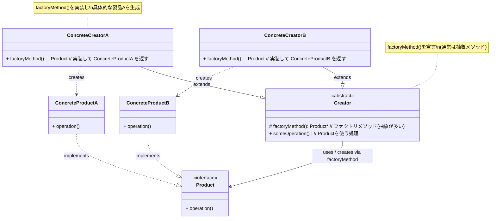

_図: Factory Method パターンの基本的なクラス構造。`Creator` が `factoryMethod` を宣言し、子クラスである `ConcreteCreator` がそれを実装して具体的な `Product` を生成する。_

### このパターンが役立つ場面 (Context)

Factory Method パターンの利用を検討すると良いのは、以下のような状況です。

- **生成するオブジェクトの種類を、実行時や設定によって変えたいとき。** (どの `ConcreteCreator` を使うかで生成物が変わる)
- **ライブラリやフレームワークを設計していて、オブジェクトの生成方法だけを利用者にカスタマイズさせたいとき。** (利用者は `ConcreteCreator` を作る)
- **オブジェクト生成のロジックを、それが必要となる場所（`ConcreteCreator`）にまとめたいとき。**
- **具体的な生成クラスへの依存を減らし、コードの結合度を下げたいとき。** (`Creator` やクライアントは `Product` インターフェースにのみ依存できる)

Template Method パターンと構造が似ていると感じるかもしれませんが、Factory Method は特に**オブジェクト生成**という目的に特化している点がポイントです。

### コード例：もし Factory Method を知らなかったら

簡単な図形描画ソフトを考えてみましょう。図形 (`Shape`) を作成し、それを利用する機能があるとします。もし Factory Method を使わない場合、図形を利用するクラス内で、具体的な図形クラス (`Circle`, `Rectangle`) を直接 `new` してしまうかもしれません。

```java
// 図形インターフェース (Product)
interface Shape {
    void draw();
}

// 具体的な図形クラス (ConcreteProduct)
class Circle implements Shape {
    @Override public void draw() { System.out.println("円を描画"); }
}
class Rectangle implements Shape {
    @Override public void draw() { System.out.println("長方形を描画"); }
}
// class Triangle implements Shape { ... } // 新しい図形

// 図形を利用するクラス (Creator に相当するが、生成を内包)
class DrawingApplication {

    // 図形を作成して利用するメソッド
    // 問題点：どの図形を作るかが、このメソッド内にハードコードされている！
    public void createAndDrawShape(String shapeType) {
        Shape shape = null;
        if ("Circle".equalsIgnoreCase(shapeType)) {
            shape = new Circle(); // ★ 具体的なクラス名を指定して new
        } else if ("Rectangle".equalsIgnoreCase(shapeType)) {
            shape = new Rectangle(); // ★ 具体的なクラス名を指定して new
        }
        // もし Triangle を追加したら、ここの if-else も修正が必要！

        if (shape != null) {
            System.out.print("生成された図形: ");
            shape.draw(); // 生成された Product を利用
        } else {
            System.out.println("不明な図形タイプ: " + shapeType);
        }
    }
}

// 利用例
DrawingApplication app = new DrawingApplication();
app.createAndDrawShape("Circle");
app.createAndDrawShape("Rectangle");
// app.createAndDrawShape("Triangle"); // これに対応するには DrawingApplication の修正が必要

// 問題点：
// 1. DrawingApplication が具体的な図形クラス (Circle, Rectangle) に依存している。
// 2. 新しい図形を追加する場合、DrawingApplication の createAndDrawShape メソッドを修正する必要がある (OCP違反)。
// 3. オブジェクト生成のロジックが利用側のコードに分散しやすい。
```

このコードでは、`DrawingApplication` が生成する `Shape` の具体的なクラス名を直接知っており、`new` を行っています。

### コード例：Factory Method パターンを適用したら

Factory Method パターンを適用すると、`Shape` を生成する責任を `DrawingApplication` から分離し、子クラスに委譲できます。

```java
// Product インターフェース (変更なし)
interface Shape { void draw(); }
// ConcreteProduct クラス (変更なし)
class Circle implements Shape { /* ... */ }
class Rectangle implements Shape { /* ... */ }
class Triangle implements Shape { // 新しい図形を追加
    @Override public void draw() { System.out.println("三角形を描画"); }
}

// 1. Creator 抽象クラス
abstract class ShapeCreator {
    // Product を利用する処理 (例)
    public void processShape() {
        Shape shape = createShape(); // ★ ファクトリメソッドを呼び出して生成
        System.out.print("ファクトリが生成した図形: ");
        shape.draw();
    }

    // ファクトリメソッド (抽象メソッドとして宣言)
    // どの具体的な Shape を作るかは子クラスが決める
    protected abstract Shape createShape();
}

// 2. ConcreteCreator クラスの実装
class CircleCreator extends ShapeCreator {
    // Circle を生成するファクトリメソッドを実装
    @Override
    protected Shape createShape() {
        System.out.println("CircleCreator: 円を生成します。");
        return new Circle();
    }
}

class RectangleCreator extends ShapeCreator {
    // Rectangle を生成するファクトリメソッドを実装
    @Override
    protected Shape createShape() {
        System.out.println("RectangleCreator: 長方形を生成します。");
        return new Rectangle();
    }
}

class TriangleCreator extends ShapeCreator {
    // Triangle を生成するファクトリメソッドを実装
    @Override
    protected Shape createShape() {
        System.out.println("TriangleCreator: 三角形を生成します。");
        return new Triangle();
    }
}

// 利用例 (Client)
public class FactoryMethodClient {
    public static void main(String[] args) {
        // どの Creator を使うかで、生成される Shape が決まる
        ShapeCreator creator1 = new CircleCreator();
        creator1.processShape(); // Circle が生成されて利用される

        System.out.println("---");

        ShapeCreator creator2 = new RectangleCreator();
        creator2.processShape(); // Rectangle が生成されて利用される

        System.out.println("---");

        ShapeCreator creator3 = new TriangleCreator(); // 新しい図形も Creator を変えるだけ
        creator3.processShape(); // Triangle が生成されて利用される

        // ShapeCreator (や Client) は、具体的な Shape クラス名を知る必要がない！
    }
}
```

このコードでは、`ShapeCreator` は `createShape()` メソッド（これが Factory Method）を呼び出すだけで、実際にどの `Shape` が生成されるかは子クラス（`CircleCreator`, `RectangleCreator` など）の実装に依存します。新しい `Triangle` を追加する際も、`ShapeCreator` を修正する必要はありませんでした。

### 利点と注意点（トレードオフ）

**利点**

- **作るものと使うものを分離できる:** オブジェクトを生成するコード (`ConcreteCreator`) と、それを利用するコード (`Creator` やクライアント) をきれいに分けることができます。利用側は、具体的なクラス名を知らなくてもよくなります。
- **拡張しやすい:** 新しい種類の「製品 (`Product`)」を追加したいときは、新しい `ConcreteProduct` クラスと、それを作るための `ConcreteCreator` クラスを追加するだけで対応できます。既存のコードへの影響が少なく、**オープン/クローズドの原則 (OCP)** を守りやすくなります。
- **生成方法も柔軟に:** 子クラスで Factory Method を実装するので、単に `new` するだけでなく、たとえばオブジェクトプールからインスタンスを返すとか、Singleton インスタンスを返すといった、生成方法自体のカスタマイズも可能です。

**注意点 / トレードオフ**

- **クラスが増える:** 新しい種類の製品を追加するたびに、通常は `ConcreteCreator` クラスもセットで増えるため、クラス階層が少し複雑になり、全体のクラス数は増加する傾向があります。
- **継承が必要:** パターンの基本構造として `Creator` を継承する必要があるため、場合によっては既存のクラス階層に組み込むのが難しいこともあります。

**他のパターンとの関連:**

- **Abstract Factory パターン:** Factory Method が通常 1 種類のオブジェクト生成を扱うのに対し、Abstract Factory パターンは**関連する複数の種類**のオブジェクト（たとえば、UI 部品のセット：ボタン、テキストボックス、スクロールバーなど）をまとめて生成するためのパターンです。Factory Method は、Abstract Factory を実装するための一つの手段として使われることもあります。
- **Template Method パターン:** Factory Method は、Template Method パターンの考え方をオブジェクト生成に応用したもの、と見ることもできます。`Creator` の処理（たとえば `someOperation`）がテンプレートで、`factoryMethod` が子クラスで実装される具体的なステップ、という関係です。
- **Prototype パターン:** オブジェクトの生成を `new` ではなく、既存のインスタンスをコピーする方法で行いたい場合、Factory Method の中で Prototype パターンを使ってインスタンスを生成することも考えられます。

Factory Method パターンは、オブジェクトの「作り方」を柔軟にするための、基本的で重要な生成パターンです。とくに、将来的に生成するオブジェクトの種類が増える可能性がある場合や、フレームワークのように拡張性を重視する設計において、その力を発揮します。

## 4.2 Builder パターン：複雑なオブジェクトを段階的に組み立てる

ソフトウェア開発では、多くの属性（フィールド）を持っていたり、生成プロセスがいくつかのステップに分かれていたりする「複雑なオブジェクト」を生成したい場合があります。たとえば、

- ユーザー設定オブジェクト: フォント、色、レイアウト、通知設定など、多数のオプション設定を持つ。
- データベース接続設定: ホスト名、ポート番号、ユーザー名、パスワード、接続タイムアウト、SSL 設定など、多くのパラメータを持つ。
- HTML ドキュメント: ヘッダー、ボディ、段落、リスト、リンクなど、階層的な要素を組み合わせて構築する。

このようなオブジェクトを、もしコンストラクタだけで生成しようとすると、引数が非常に多くなりがちです（これは「**テレスコーピングコンストラクタ**」問題と呼ばれ、引数の意味が分かりにくく、順番を間違えやすいという欠点があります）。あるいは、Setter メソッドを多数用意する方法もありますが、これだとオブジェクトが完全に構築される前に利用されてしまう（不整合な状態）リスクがあります。また、不変（Immutable）なオブジェクトを作りたい場合にも Setter は適していません。

**Builder パターン**は、このような**複雑なオブジェクトの生成プロセスを、そのオブジェクトの最終的な表現（完成形）から分離する**ことを目的としたデザインパターンです。このパターンを使うと、オブジェクトの生成を**段階的なステップ**に分け、各ステップで部品（属性）を設定していき、最後に**組み立て（build）**て完成したオブジェクトを取得することができます。（『オブジェクト指向における再利用のためのデザインパターン 改訂版』参照）

Builder パターンは、まるで「**注文を受けてから、ステップバイステップで料理を組み立てるシェフ**」のようなイメージです。お客さん（Client）は、シェフ（Builder）に「こういう材料で、こういう手順で料理を作ってほしい」と段階的に指示を出し、最後に「完成品をください」と頼みます。シェフは、指示された手順に従って内部で料理（Product）を組み立てていき、最終的に完成した料理を提供します。お客さんは、料理の複雑な組み立て工程を意識する必要はありません。

### どんな問題を解決するか？ (Problem)

Builder パターンは、主に以下のようなオブジェクト生成に関する問題を解決します。

- **多数のパラメータを持つコンストラクタの回避:** オブジェクト生成に必要なパラメータが多く、コンストラクタの引数リストが長くなりすぎる（あるいは、多数のオーバーロードされたコンストラクタが必要になる）のを避けたい。
- **段階的なオブジェクト構築:** オブジェクトの生成プロセスが複数のステップに分かれており、それを明確に表現したい。
- **生成途中の一貫性:** オブジェクトの生成が完了するまでは、不完全な状態のオブジェクトが外部に公開されないようにしたい。Setter を多用する場合のこの問題を回避します。
- **不変オブジェクトの生成:** 生成後に状態が変更されない不変（Immutable）なオブジェクトを、段階的に設定しながら安全に生成したい。
- **異なる表現の生成:** 同じ構築プロセス（ステップ）を使いながら、異なる種類の複雑なオブジェクト（たとえば、HTML ドキュメントとプレーンテキストドキュメント）を生成したい。

### パターンの考え方と登場人物 (Solution & Structure)

Builder パターンでは、オブジェクトの構築プロセスとその最終的な表現を分離します。主な登場人物は以下の通りです。（『Java 言語で学ぶデザインパターン入門第 3 版』などの構成を参考に）

- **`Builder`（ビルダー、建築者）:**
  - 生成物（`Product`）の**各パーツを組み立てるためのインターフェース**を定義します。通常、パーツを追加・設定するためのメソッド（例: `buildPartA()`, `buildPartB()`, `setAttributeX()` など）と、最終的な生成物を取得するためのメソッド（例: `getResult()`, `build()`）を宣言します。
- **`ConcreteBuilder`（具体的なビルダー）:**
  - `Builder` インターフェースを実装し、**具体的なパーツの組み立て方法**と、**生成物の内部表現**を管理します。どのパーツをどのように組み合わせて最終的な `Product` を作るかの詳細を知っています。
  - `getResult()` や `build()` メソッドで、組み立てた結果（`Product` オブジェクト）を返します。
- **`Product`（生成物）:**
  - Builder パターンによって構築される、**複雑なオブジェクト**そのものです。通常、複数のパーツ（属性や内部オブジェクト）から構成されます。
  - 多くの場合、`Product` のコンストラクタは `private` または `package-private` とされ、`Builder` を介さずに直接インスタンス化されることを防ぎます。これにより、`Builder` を使うことが強制され、オブジェクトの一貫性が保たれます。
- **`Director`（監督、任意）:**
  - `Builder` インターフェースを使って `Product` を組み立てる**手順（アルゴリズム）**を知っているクラスです。`Director` は、特定の `Builder` を受け取り、その `Builder` のメソッドを特定の順序で呼び出して `Product` の構築プロセスを実行します。
  - `Director` は**必須ではありません**。クライアントが直接 `Builder` のメソッドを呼び出してオブジェクトを構築することも一般的です。`Director` を使うのは、構築プロセス自体が複雑で再利用したい場合などです。

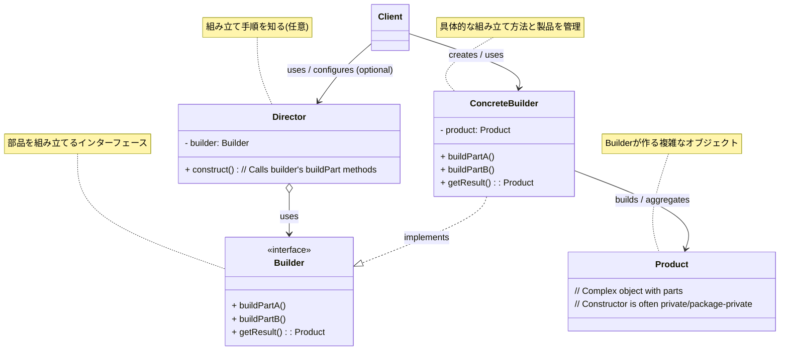

_図: Builder パターンの基本的なクラス構造 (Director を含む場合)。`Client` が `ConcreteBuilder` と `Director` を設定し、`Director` が `Builder` を使って `Product` を組み立てる。_

近年よく使われる実装スタイルとして、`Builder` を `Product` の **static な内部クラス**として定義し、`Director` を使わずに**メソッドチェーン**で設定を行う**Fluent Interface** スタイルがあります。（『Effective Java 第 3 版』などで推奨）

```mermaid
classDiagram
    class Client
    class Product {
        - partA: TypeA
        - partB: TypeB
        + Product(builder: Builder) // Private/Protected Constructor
        + static Builder builder(requiredArg: TypeX) : Builder
    }
    class Builder {
        <<static inner class>>
        - requiredArg: TypeX
        - partA: TypeA
        - partB: TypeB
        + Builder(requiredArg: TypeX)
        + setPartA(partA: TypeA) : Builder
        + setPartB(partB: TypeB) : Builder
        + build() : Product
    }

    Client -> Product : calls static builder()
    Client -> Builder : sets parts via method chaining
    Client -> Builder : calls build()
    Builder -> Product : creates

    note for Product "最終製品\nBuilder経由でのみ生成"
    note for Builder "部品設定と最終製品取得\nメソッドチェーンを可能にする"
```

_図: Builder パターンの一般的な実装 (Fluent Interface スタイル)。Client が Product.builder() で Builder を取得し、メソッドチェーンで設定後、build() で Product を得る。_

### このパターンが役立つ場面 (Context)

Builder パターンの適用が特に有効なのは、以下のような状況です。

- **生成するオブジェクトが多数のパラメータやオプション設定を持つ場合。** (コンストラクタの引数地獄や Setter の乱用を防ぐ)
- **オブジェクトの生成プロセスが複雑で、複数のステップを要する場合。** (生成手順を `Director` や `Builder` にカプセル化できる)
- **生成プロセスは同じだが、生成されるオブジェクトの内部表現（構成パーツ）が異なる可能性がある場合。** (異なる `ConcreteBuilder` を用意する)
- **段階的に、かつ安全に、不変（Immutable）なオブジェクトを作りたい場合。** (`build()` メソッドで一度に完成したオブジェクトを生成できる)

一方で、生成するオブジェクトが単純で、パラメータも少なく、生成プロセスも簡単な場合には、Builder パターンは過剰な設計となる可能性があります。

### コード例：初心者が書きがちなコード

たとえば、多くのオプションを持つ `Computer` オブジェクトを生成する場合を考えます。CPU, メモリ (RAM), ストレージ (SSD/HDD), グラフィックカード (GPU) など、組み合わせは様々です。初心者の場合、コンストラクタの引数を増やしたり、Setter を多用したりするかもしれません。

```java
// Computer クラス (Builder パターン適用前)
class Computer {
    // 必須の属性
    private String cpu;
    private int ramGB;
    // オプションの属性
    private int storageGB = 256; // デフォルト値
    private String gpu = "Integrated"; // デフォルト値
    private String os = "Windows"; // デフォルト値

    // 引数の多いコンストラクタ (テレスコーピングコンストラクタ問題)
    public Computer(String cpu, int ramGB) {
        this(cpu, ramGB, 256); // デフォルト値を使い、他のコンストラクタを呼ぶ
    }
    public Computer(String cpu, int ramGB, int storageGB) {
        this(cpu, ramGB, storageGB, "Integrated");
    }
    public Computer(String cpu, int ramGB, int storageGB, String gpu) {
        this(cpu, ramGB, storageGB, gpu, "Windows");
    }
    public Computer(String cpu, int ramGB, int storageGB, String gpu, String os) {
        this.cpu = cpu;
        this.ramGB = ramGB;
        this.storageGB = storageGB;
        this.gpu = gpu;
        this.os = os;
        System.out.println("Computer created (Constructor): CPU=" + cpu + ", RAM=" + ramGB +
                           "GB, Storage=" + storageGB + "GB, GPU=" + gpu + ", OS=" + os);
    }

    // Setter を使う方法もあるが、不整合状態を生む可能性
    // public void setStorageGB(int storageGB){ this.storageGB = storageGB; }
    // public void setGpu(String gpu){ this.gpu = gpu; }
    // public void setOs(String os){ this.os = os; }
}

// 利用例
// 1. コンストラクタで生成 (引数の意味が分かりにくい、不要な引数も必要)
Computer pc1 = new Computer("Core i5", 16, 512, "NVIDIA GTX 3060", "Linux");

// 2. Setter で生成 (途中で不完全な状態になる可能性がある)
// Computer pc2 = new Computer("Ryzen 7", 32);
// pc2.setStorageGB(1024);
// pc2.setGpu("Radeon RX 6800");
// // この時点で pc2 はまだ OS がデフォルト (Windows) かもしれない

// 問題点：
// 1. コンストラクタの引数が多くなると、どれがどの値か分かりにくく、間違いやすい。
// 2. 不要なパラメータにもデフォルト値を指定するか、null を渡す必要がある。
// 3. Setter を使うと、オブジェクトが完全に設定される前に使われるリスクがある。
```

このコードでは、コンストラクタの引数が多くて使いにくい、あるいは Setter を使うと不完全なオブジェクトができてしまう、という問題があります。

### コード例：Builder パターン適用後

Builder パターンを適用すると、オブジェクトの生成プロセスが明確になり、読みやすく安全なコードになります。ここでは、`Director` を使わず、クライアントが直接 `Builder` を操作する一般的な実装（Fluent Interface スタイル）を示します。

```java
// 1. Product クラス (生成物)
class ComputerProduct {
    // final にして不変オブジェクトにするのが一般的
    private final String cpu;
    private final int ramGB;
    private final int storageGB;
    private final String gpu;
    private final String os;

    // コンストラクタは Builder からのみ呼び出せるように private/protected にすることが多い
    private ComputerProduct(Builder builder) {
        this.cpu = builder.cpu;
        this.ramGB = builder.ramGB;
        this.storageGB = builder.storageGB;
        this.gpu = builder.gpu;
        this.os = builder.os;
    }

    @Override
    public String toString() {
        return "Computer [CPU=" + cpu + ", RAM=" + ramGB + "GB, Storage=" + storageGB +
               "GB, GPU=" + gpu + ", OS=" + os + "]";
    }

    // 2. Builder クラス (通常は Product の static ネストクラスとして定義)
    public static class Builder {
        // 必須パラメータは final にすることも
        private final String cpu;
        private final int ramGB;
        // オプションパラメータにはデフォルト値を設定
        private int storageGB = 256;
        private String gpu = "Integrated";
        private String os = "Windows";

        // 必須パラメータはコンストラクタで受け取る
        public Builder(String cpu, int ramGB) {
            this.cpu = cpu;
            this.ramGB = ramGB;
        }

        // オプションパラメータを設定するメソッド (メソッドチェーンのため this を返す)
        public Builder storageGB(int storageGB) {
            this.storageGB = storageGB;
            return this; // メソッドチェーン用
        }
        public Builder gpu(String gpu) {
            this.gpu = gpu;
            return this; // メソッドチェーン用
        }
        public Builder os(String os) {
            this.os = os;
            return this; // メソッドチェーン用
        }

        // 最終的に Product オブジェクトを生成して返すメソッド
        public ComputerProduct build() {
            // ここでパラメータの整合性チェックなども可能
            ComputerProduct product = new ComputerProduct(this);
            System.out.println("Computer built: " + product);
            return product;
        }
    }
}

// 3. Client (利用者)
public class BuilderClient {
    public static void main(String[] args) {
        // Builder を使って Computer を生成
        // 必須パラメータを指定して Builder を作成
        ComputerProduct gamingPC = new ComputerProduct.Builder("Core i9", 32)
                                        // オプションをメソッドチェーンで設定 (読みやすい！)
                                        .storageGB(1024)
                                        .gpu("NVIDIA RTX 4080")
                                        .os("Windows Pro")
                                        .build(); // 最後に build() で生成

        ComputerProduct officePC = new ComputerProduct.Builder("Core i5", 16)
                                        .storageGB(512)
                                        // gpu と os はデフォルト値を使う
                                        .build();

        // 生成されたオブジェクトを利用
        System.out.println("\nGaming PC Specs: " + gamingPC);
        System.out.println("Office PC Specs: " + officePC);
    }
}
```

このコードでは、`ComputerProduct` の生成は `Builder` クラスが担当します。クライアントは `Builder` に対して、どの属性をどのように設定したいかをメソッド呼び出し（メソッドチェーン）で明確に指示し、最後に `build()` メソッドを呼び出すことで、設定に基づいた `ComputerProduct` オブジェクトを取得できます。必須パラメータとオプションパラメータの区別も明確で、読みやすく安全なコードになっています。

### 利点と注意点（トレードオフ）

**利点 (Pros):**

- **可読性の向上:** 多数のパラメータを持つオブジェクトの生成コードが、メソッドチェーンなどにより非常に読みやすくなります（どのパラメータにどの値を設定しているかが一目瞭然）。
- **柔軟なオブジェクト構築:** 必須パラメータとオプションパラメータを明確に区別でき、必要なパラメータだけを設定してオブジェクトを生成できます。
- **不変オブジェクトの生成:** `build()` メソッドが呼ばれた時点で、必要な設定が完了した不変（Immutable）なオブジェクトを生成するのに適しています。これにより、オブジェクト生成後の意図しない状態変更を防げます。
- **生成プロセスと表現の分離:** `Builder` インターフェースと `ConcreteBuilder` を使うことで、オブジェクトの組み立て手順（`Director`）とその具体的な表現（`ConcreteBuilder` が作る `Product`）を分離でき、同じ手順で異なる表現のオブジェクトを作ることが可能になります。
- **生成途中の一貫性:** `build()` が呼ばれるまで `Product` オブジェクトは完成しないため、不完全な状態のオブジェクトが利用されることを防げます。

**注意点 (Cons) / トレードオフ:**

- **クラス数の増加:** `Product` に加えて `Builder`（場合によっては `Director` も）クラスを作成する必要があるため、クラス数は増加します。単純なオブジェクト生成には過剰になる可能性があります。
- **コード量の増加:** 各属性に対応する設定メソッドを `Builder` に記述する必要があるため、コード量は増える傾向があります（定型的なコードが多くなることも）。
- **Builder の可変性:** Builder オブジェクト自体は、`build()` が呼ばれるまでは可変（mutable）です。マルチスレッド環境などで Builder を共有する場合は注意が必要です。

**他のパターンとの関連:**

- **Abstract Factory パターン:** Builder パターンは、Abstract Factory が生成するオブジェクトファミリーの中に、複雑なオブジェクトが含まれる場合に、そのオブジェクトの生成を担当するために使われることがあります。
- **Composite パターン:** 複雑な Composite 構造を持つオブジェクト（たとえば、GUI のウィンドウやパネル）を生成する際に、Builder パターンが役立つことがあります。
- **Fluent Interface:** Builder パターンの実装では、メソッドチェーンを可能にする Fluent Interface スタイルが非常によく用いられ、可読性を高めます。

Builder パターンは、とくに多くの（とくにオプションの）パラメータを持つオブジェクトや、不変オブジェクトを安全かつ分かりやすく生成したい場合に非常に有効な生成パターンです。Effective Java でも推奨されている設計手法の一つであり、現代的な開発においても広く活用されています。

## 4.3 Prototype パターン：コピーして新しいオブジェクトを作る「原型」

ソフトウェア開発では、新しいオブジェクトを作りたいときに、一から `new` で生成するのではなく、**既にあるオブジェクトをコピー（複製）して、それを元に少しだけ変更を加えて新しいオブジェクトを作りたい**、という場面があります。たとえば、

- たくさんの種類の図形を描画するツールで、ユーザーが「円」を選択したら、あらかじめ用意しておいた「円の見本（原型）」をコピーして、新しい円オブジェクトをキャンバスに配置する。
- ゲームで、同じ種類の敵キャラクターをたくさん登場させたいときに、最初の敵キャラクター（原型）をコピーして、位置やパラメータを少し変えて配置する。
- 生成コストが高いオブジェクト（たとえば、データベースから読み込んだ設定情報など）があり、毎回生成する代わりに、最初に一つだけ作っておいて、必要になるたびにそれをコピーして使いたい。

**Prototype パターン**は、このような「**既存のインスタンスを複製することによって新しいインスタンスを生成する**」というアプローチを実現するためのデザインパターンです。このパターンでは、コピー元となるオブジェクト（**プロトタイプ**）自身に、自分自身を複製する能力（メソッド）を持たせます。（『オブジェクト指向における再利用のためのデザインパターン 改訂版』参照）

Prototype パターンは、まるで「**粘土の『原型』**」のようなものです。新しい粘土作品を作りたいときに、一から形を作る代わりに、既にある「原型」に粘土を押し付けてコピーを作り、そのコピーに少し手を加えて（色を塗ったり、飾りを付けたりして）完成させる、というイメージです。この「コピーを作る」という作業を、オブジェクト自身に行わせるのがポイントです。

### どんな問題を解決するか？ (Problem)

Prototype パターンは、オブジェクト生成に関する以下のような課題を解決するのに役立ちます。

- **生成するクラスの多様性:** 生成したいオブジェクトの種類（クラス）がたくさんあり、それらを生成するためのロジックが複雑になるのを避けたい。クライアントは、具体的なクラス名を意識せずに、プロトタイプをコピーするだけでインスタンスを得られるようにしたい。
- **生成コストの削減:** オブジェクトの生成（`new` や初期化処理）に時間やリソースがかかる場合に、毎回生成する代わりに、既存のインスタンスを効率的にコピーして利用したい。
- **`new` の代替:** フレームワークなどから利用するクラスのコンストラクタが直接呼び出せない場合や、生成するクラスを実行時に動的に決定したい場合に、`new` を使わずにオブジェクトを生成する手段を提供したい。
- **状態の初期設定:** 特定の初期状態を持つオブジェクトを複数生成したい場合に、その状態を持つプロトタイプを一つ用意しておき、それをコピーすることで、同じ初期状態を持つインスタンスを簡単に作れるようにしたい。

### パターンの考え方と登場人物 (Solution & Structure)

Prototype パターンでは、コピー機能を持つオブジェクト（プロトタイプ）を用意し、クライアントはそれを複製して新しいオブジェクトを得ます。主な登場人物は以下の通りです。（『Java 言語で学ぶデザインパターン入門第 3 版』の構成を参考に）

- **`Prototype`（原型）:**
  - 自分自身を複製するための**インターフェース**（メソッド）を宣言します。通常、`clone()` や `copy()` といった名前のメソッドを持ちます。
- **`ConcretePrototype`（具体的な原型）:**
  - `Prototype` インターフェースを実装する具体的なクラスです。
  - 自身を複製するための `clone()` メソッドを**実装**します。このメソッドは、自分自身の新しいインスタンスを生成し、必要に応じて内部の状態（フィールドの値）をコピーして返します。コピーの方法には、**浅いコピー (Shallow Copy)** と **深いコピー (Deep Copy)** があり、どちらを実装するかは状況に応じて注意深く選択する必要があります（後述）。
- **`Client`（利用者）:**
  - `Prototype` オブジェクト（通常は `ConcretePrototype` のインスタンス）への参照を持ちます。
  - 新しいオブジェクトが必要になったときに、`Prototype` オブジェクトの `clone()` メソッドを呼び出して、そのコピーを取得します。
  - 取得したコピーに対して、必要であればさらに状態を変更して利用します。

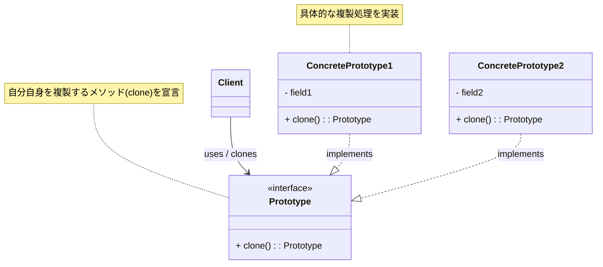

_図: Prototype パターンの基本的なクラス構造。`Client` が `Prototype` の `clone()` を呼び出して新しいインスタンスを得る。_

多くのオブジェクト指向言語（Java, C# など）では、オブジェクトのコピーをサポートするための仕組み（例: Java の `Cloneable` インターフェースと `clone()` メソッド）が用意されていることがあります。Prototype パターンを実装する際には、これらの言語機能を利用することが一般的です。

### このパターンが役立つ場面 (Context)

Prototype パターンの適用を検討すると良い状況は以下の通りです。

- **生成すべきオブジェクトの種類が実行時に決まる場合。** (あらかじめプロトタイプを用意しておき、必要なものをコピーする)
- **クラスのインスタンス化（`new`）のコストが高い場合。** (コピーの方が高速な場合がある)
- **たくさんの種類のクラスがあり、それらを生成するための Factory クラス階層を作りたくない場合。** (各クラスが自身のコピー責任を持つ)
- **オブジェクトの初期状態の組み合わせが多数あり、それぞれをプロトタイプとして用意しておきたい場合。**

逆に、オブジェクトの生成コストが低く、生成するクラスの種類も少ない、あるいは状態のコピーが非常に複雑になるような場合には、無理に Prototype パターンを使うメリットは少ないかもしれません。

### コード例：もし Prototype パターンを知らなかったら…

簡単な図形描画ツールで、ツールボックスから図形（円、四角）を選んでキャンバスに配置する機能を考えます。新しい図形を配置するたびに `new` で生成すると、図形の種類が増えたときに `if-else` が必要になるかもしれません。

```java
// 図形インターフェース
interface Shape {
    void draw(int x, int y); // 指定位置に描画
    // ... 他のメソッド ...
}

// 具体的な図形クラス
class Circle implements Shape {
    @Override public void draw(int x, int y) { System.out.println("円を (" + x + ", " + y + ") に描画"); }
}
class Rectangle implements Shape {
    @Override public void draw(int x, int y) { System.out.println("長方形を (" + x + ", " + y + ") に描画"); }
}

// 図形を管理・生成するクラス (Prototype適用前)
class ShapeRegistry {
    // 図形を生成するメソッド (どのクラスをnewするかがハードコードされている)
    public Shape createShape(String shapeType) {
        if ("Circle".equalsIgnoreCase(shapeType)) {
            System.out.println("新しい円を生成します。");
            return new Circle(); // ★ new で生成
        } else if ("Rectangle".equalsIgnoreCase(shapeType)) {
            System.out.println("新しい長方形を生成します。");
            return new Rectangle(); // ★ new で生成
        }
        // 新しい図形タイプが増えたら、ここの if-else を修正する必要がある
        return null;
    }
}

// 利用例 (Client)
ShapeRegistry registry = new ShapeRegistry();

// 新しい円が必要な場合
Shape circle1 = registry.createShape("Circle");
if (circle1 != null) circle1.draw(10, 10);

// 新しい長方形が必要な場合
Shape rect1 = registry.createShape("Rectangle");
if (rect1 != null) rect1.draw(20, 30);

// 問題点：
// 1. ShapeRegistry が具体的なクラス (Circle, Rectangle) を知っている必要がある。
// 2. 新しい図形を追加するには ShapeRegistry の修正が必要 (OCP違反)。
// 3. オブジェクト生成のロジックが ShapeRegistry に集中する。
```

このコードでは、`ShapeRegistry` が `new Circle()` や `new Rectangle()` を直接呼び出しています。

### コード例：Prototype パターン適用後

Prototype パターンを適用すると、あらかじめ「原型」となる図形オブジェクトを用意しておき、必要に応じてそれをコピー（`clone`）して新しい図形オブジェクトを得ます。

```java
// 1. Prototype インターフェース (Java の Cloneable を使うことも多い)
interface ShapePrototype extends Cloneable { // Cloneable を継承
    void draw(int x, int y);
    ShapePrototype clone() throws CloneNotSupportedException; // cloneメソッドを定義
}

// 2. ConcretePrototype クラスの実装
class CirclePrototype implements ShapePrototype {
    private String color = "Red"; // 例：プロトタイプが持つ状態

    @Override
    public void draw(int x, int y) {
        System.out.println(color + "の円を (" + x + ", " + y + ") に描画");
    }

    // cloneメソッドの実装 (Javaの標準的な実装)
    @Override
    public ShapePrototype clone() throws CloneNotSupportedException {
        System.out.println("円のプロトタイプをコピーします...");
        return (ShapePrototype) super.clone(); // Objectクラスのcloneを利用
    }

    public void setColor(String color) { this.color = color; } // コピー後に色を変える例
}

class RectanglePrototype implements ShapePrototype {
    @Override
    public void draw(int x, int y) {
        System.out.println("長方形を (" + x + ", " + y + ") に描画");
    }

    @Override
    public ShapePrototype clone() throws CloneNotSupportedException {
        System.out.println("長方形のプロトタイプをコピーします...");
        return (ShapePrototype) super.clone();
    }
}

// 3. プロトタイプを管理するクラス (Client の一部や専用クラス)
class PrototypeManager {
    private java.util.Map<String, ShapePrototype> prototypes = new java.util.HashMap<>();

    // プロトタイプを登録
    public void register(String name, ShapePrototype prototype) {
        prototypes.put(name, prototype);
    }

    // 名前を指定してプロトタイプのコピーを取得
    public ShapePrototype createClone(String name) {
        ShapePrototype p = prototypes.get(name);
        if (p != null) {
            try {
                return p.clone();
            } catch (CloneNotSupportedException e) {
                e.printStackTrace(); // エラー処理
                return null;
            }
        }
        return null;
    }
}

// 利用例 (Client)
public class PrototypeClient {
    public static void main(String[] args) {
        PrototypeManager manager = new PrototypeManager();

        // 1. プロトタイプとなるインスタンスを生成・登録
        ShapePrototype originalCircle = new CirclePrototype();
        ShapePrototype originalRectangle = new RectanglePrototype();
        manager.register("Circle", originalCircle);
        manager.register("Rectangle", originalRectangle);

        System.out.println("--- プロトタイプ準備完了 ---");

        // 2. 必要なときにプロトタイプをコピーして新しいインスタンスを得る
        ShapePrototype circle1 = manager.createClone("Circle");
        ShapePrototype circle2 = manager.createClone("Circle");
        ShapePrototype rect1 = manager.createClone("Rectangle");

        // 3. 取得したコピーを利用する (必要なら状態を変更)
        if (circle1 != null) {
            ((CirclePrototype) circle1).setColor("Blue"); // コピーしたものの色を変える
            circle1.draw(10, 10);
        }
        if (circle2 != null) {
            circle2.draw(50, 50); // こちらは元のプロトタイプの色(Red)のまま
        }
        if (rect1 != null) {
            rect1.draw(100, 100);
        }

        // 新しい図形を追加する場合、新しい Prototype クラスを作り、
        // manager に登録するだけで、利用側のコード修正は不要！
    }
}
```

このコードでは、クライアントは `PrototypeManager` を通じて、具体的なクラス名を意識せずに `"Circle"` や `"Rectangle"` といった名前でプロトタイプのコピーを取得できます。新しい種類の図形を追加する場合も、対応する `ConcretePrototype` クラスを作成し、`PrototypeManager` に登録するだけで済みます。

### 利点と注意点（トレードオフ）

**利点 (Pros):**

- **具象クラスからの独立:** クライアントは生成したいオブジェクトの具体的なクラス名を知る必要がなく、`Prototype` インターフェースと `clone()` メソッドだけを知っていればよいため、疎結合になります。
- **実行時の種類指定:** 生成するオブジェクトの種類を実行時に動的に指定できます（どのプロトタイプをコピーするか選ぶだけ）。
- **生成コストの削減:** `new` 演算子によるインスタンス化や初期化のコストが高い場合に、`clone()` によるコピーの方が効率的な場合があります。
- **新しい種類の追加容易性:** 新しい `ConcretePrototype` クラスを追加し、プロトタイプ管理機構に登録するだけで、新しい種類のオブジェクトを生成できるようになります（**オープン/クローズドの原則 (OCP)**）。

**注意点 (Cons) / トレードオフ:**

- **`clone()` メソッドの実装:** 各 `ConcretePrototype` クラスに `clone()` メソッドを正しく実装する必要があります。とくに、オブジェクトが他のオブジェクトへの参照を持っている場合に、**浅いコピー (Shallow Copy)** で良いのか、**深いコピー (Deep Copy)** が必要なのかを慎重に判断する必要があります。
  - **浅いコピー:** 参照先のオブジェクトはコピーせず、参照値のみをコピーします。コピー元とコピー先で同じ参照先オブジェクトを共有することになるため、片方での変更がもう片方に影響します。
  - **深いコピー:** 参照先のオブジェクトも含めて再帰的にすべてコピーします。コピー元とコピー先は完全に独立しますが、実装が複雑になり、コストもかかる可能性があります。
    Java のデフォルトの `Object.clone()` は浅いコピーです。深いコピーが必要な場合は、`clone()` メソッド内で明示的に参照先オブジェクトのコピー処理を実装する必要があります。
- **循環参照の問題:** オブジェクト間に循環参照がある場合、`clone()` の実装（とくに深いコピー）が非常に複雑になる、あるいは無限ループに陥る可能性があります。

**他のパターンとの関連:**

- **Abstract Factory パターン:** Abstract Factory パターンは、関連するオブジェクトファミリーを生成するインターフェースを提供しますが、その具体的なオブジェクト生成の手段として Prototype パターン（プロトタイプのコピー）を利用することがあります。
- **Factory Method パターン:** Factory Method が返すオブジェクトを、`new` する代わりにプロトタイプの `clone()` で生成することも可能です。
- **Composite パターン / Decorator パターン:** これらのパターンで構築された複雑な構造を持つオブジェクトをコピーしたい場合、`clone()` の実装（とくに深いコピー）が複雑になることがあります。

Prototype パターンは、オブジェクト生成の柔軟性を高め、とくに生成コストや種類の多様性が問題となる場合に有効なパターンです。ただし、`clone()` メソッドの実装、とくに浅いコピーと深いコピーの違いを正しく理解して適用することが重要です。

## 4.4 Dependency Injection (DI)：必要な「部品」を外から与える

ソフトウェア開発において、多くのクラス（オブジェクト）は、自分の仕事（責務）を果たすために、他のクラス（オブジェクト）の助けを借ります。たとえば、「注文処理クラス (`OrderProcessor`)」が注文完了メールを送るために「メール送信クラス (`MailSender`)」を使ったり、「データアクセスクラス (`UserRepository`)」がデータベース接続を管理する「接続管理クラス (`DatabaseConnector`)」を使ったりする、といった具合です。この、あるクラスが他のクラスを必要としている関係を「**依存関係**」と呼びます。

問題は、「**あるクラスが必要とする『部品』（依存オブジェクト）を、どうやってそのクラスに渡すか？**」ということです。初心者のうちは、クラスの中で直接、必要な部品を `new` して作ってしまうかもしれません。

```java
class OrderProcessor {
    private MailSender mailSender;

    public OrderProcessor() {
        // ★ 自分で直接 MailSender を作ってしまっている！
        this.mailSender = new RealMailSender();
    }
    // ...
}
```

この方法は一見簡単ですが、いくつかの大きな問題があります。

1.  **密結合:** `OrderProcessor` が具体的な `RealMailSender` クラスに**強く依存**してしまいます。もし将来 `MailSender` の実装を変えたくなったら（たとえば `SmtpMailSender` にするなど）、`OrderProcessor` のコードも修正しなければなりません。
2.  **テストの困難さ:** `OrderProcessor` を単体テストしたいときに、本物の `RealMailSender` が動いてしまい、テスト中に実際にメールが送られてしまうかもしれません。テストのためだけに `RealMailSender` の代わりに「メールを送ったフリをする偽物（テストダブル）」を使いたいのに、それができません。

**Dependency Injection (DI)** は、このような問題を解決するための**設計原則**であり、**テクニック**です。DI の基本的な考え方は非常にシンプルで、「**クラスが必要とするオブジェクト（依存性 = Dependency）は、そのクラス自身が内部で作るのではなく、外部から与えてもらう（注入 = Injection）ようにしよう**」というものです。（これは SOLID 原則の**依存性逆転の原則 (DIP)** を実現するための具体的な手段の一つでもあります）

DI は、まるで「**料理人が、使う道具（包丁、鍋など）を自分で買ってくるのではなく、厨房（外部環境）から提供される道具を使う**」ようなイメージです。料理人は「こういう機能の包丁が必要だ」と言うだけで、具体的な包丁（たとえば「〇〇社製の牛刀」）は外部から与えられます。これにより、料理人は特定の道具に縛られず、もし新しい道具が提供されればそれを使うことができますし、テストの際には練習用の道具を使うこともできます。

### どんな問題を解決するか？ (Problem)

Dependency Injection は、主に以下のような設計上の課題に対処します。

- **クラス間の密結合:** あるクラスが、利用する具体的なクラスの実装に直接依存してしまう問題を解消したい。
- **テスト容易性の向上:** クラスを単体テストする際に、依存するオブジェクトを本物からテスト用の偽物（テストダブル：モック、スタブ）に簡単に差し替えられるようにしたい。
- **柔軟性と拡張性の向上:** 依存するオブジェクトの実装を、利用側のコードを変更せずに容易に切り替えられるようにしたい（たとえば、本番用と開発用で異なるデータベース接続を使うなど）。
- **関心の分離:** オブジェクトを「利用する責任」と、オブジェクトを「生成・管理する責任」を分離したい。

### パターンの考え方と実現方法 (Solution & Structure)

DI の中心的な考え方は、「**制御の反転 (Inversion of Control - IoC)**」とも呼ばれます。これは、オブジェクトが自身の依存性を自分で解決（生成・検索）するのではなく、その制御を外部の仕組み（DI コンテナや手動の組み立てコード）に委ねる、という意味です。

DI を実現するには、主に以下の 3 つの方法（注入の種類）があります。

1.  **コンストラクタ注入 (Constructor Injection):**
    - **方法:** クラスが必要とする依存オブジェクトを、そのクラスの**コンストラクタの引数**として受け取ります。
    - **特徴:** 依存関係がクラスの生成時に明確になり、必要な依存性がすべて揃わないとインスタンスを生成できないため、オブジェクトが常に**一貫した状態**にあることを保証しやすいです。とくに**不変オブジェクト**との相性が良いです。一般的に**最も推奨される**注入方法です。
2.  **セッター注入 (Setter Injection):**
    - **方法:** 依存オブジェクトを設定するための**セッターメソッド**（例: `setMailSender()`) を用意し、インスタンス生成後に外部からそのメソッドを呼び出して依存性を注入します。
    - **特徴:** 依存性がオプションである場合や、後から依存性を変更したい場合に適しています。ただし、依存性が注入される前にメソッドが呼ばれる可能性があるなど、オブジェクトの状態管理に注意が必要です。
3.  **インターフェース注入 (Interface Injection):**
    - **方法:** 依存性を注入するためのメソッド（例: `injectMailSender()`) を定義した**専用のインターフェース**をクラスに実装させ、外部がそのメソッドを呼び出して注入します。
    - **特徴:** 比較的まれな方法ですが、特定のフレームワークなどで使われることがあります。コンストラクタ注入やセッター注入に比べて、やや複雑になる傾向があります。

ここでは、最も一般的で推奨される**コンストラクタ注入**の例を中心に見ていきます。DI を行う場合、依存される側（`MailSender` など）は**インターフェース**として定義し、依存する側（`OrderProcessor`）はそのインターフェースに依存するのが基本です。

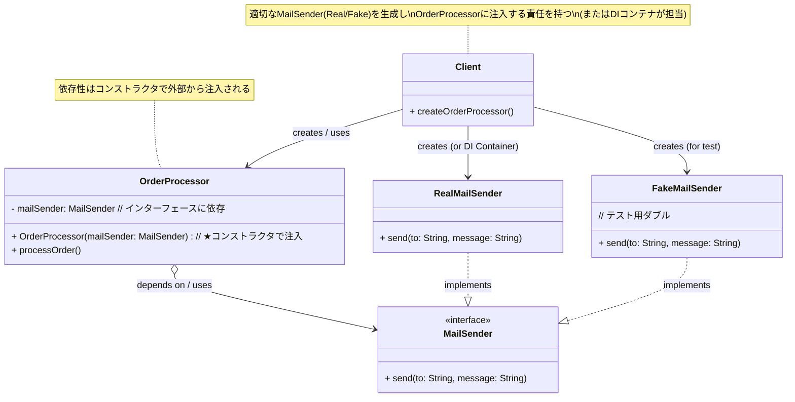

_図: コンストラクタ注入による Dependency Injection の基本的な構造_

### このパターン（原則）が役立つ場面 (Context)

Dependency Injection は、特定の状況というよりも、現代的なオブジェクト指向設計において**広く適用が推奨される原則・テクニック**です。とくに以下のような場合にその効果を発揮します。

- **クラス間の依存関係を疎結合にしたい場合。（ほぼすべての場合）**
- **単体テストを容易に行いたい場合。（テストダブルを使いたい場合）**
- **アプリケーションの構成（どの実装クラスを使うか）を、設定ファイルや外部の仕組みで管理したい場合。** (DI コンテナの利用)
- **異なる環境（開発、テスト、本番）で異なる依存オブジェクト（設定、データベース接続など）を使いたい場合。**

DI の考え方は、小規模なプログラムから大規模なエンタープライズシステムまで、幅広く適用できます。手動で依存性を注入することも可能ですが、複雑なアプリケーションでは **DI コンテナ**（Spring Framework, Google Guice, Dagger, ASP.NET Core の DI 機能など）と呼ばれるフレームワークを利用することが一般的です。DI コンテナは、オブジェクトの生成と依存性の注入を自動的に管理してくれます。

### コード例：もし DI を知らなかったら…

（※ このセクションは冒頭や「どんな問題を解決するか？」で示した `OrderProcessor` が内部で `RealMailSender` を `new` する例と同様のため省略します）

### コード例：Dependency Injection 適用後 (コンストラクタ注入)

DI（コンストラクタ注入）を適用すると、`OrderProcessor` は必要な `MailSender` を外部から受け取るようになります。

```java
// 依存される側のインターフェース
interface MailSender {
    void send(String to, String message);
}

// 具体的な実装クラス (本番用)
class RealMailSender implements MailSender {
    @Override
    public void send(String to, String message) {
        System.out.println("実際にメール送信: To=" + to + ", Message=" + message);
        // ... 実際の送信処理 ...
    }
}

// 依存する側のクラス
class OrderProcessor {
    private final MailSender mailSender; // ★ インターフェースに依存 (finalにもできる)

    // ★ コンストラクタで依存性を受け取る (注入)
    public OrderProcessor(MailSender mailSender) {
        if (mailSender == null) {
            throw new IllegalArgumentException("MailSender cannot be null");
        }
        this.mailSender = mailSender;
    }

    public void completeOrder(String customerEmail) {
        System.out.println("注文処理を完了しました。");
        // 注入された MailSender を使ってメールを送信
        this.mailSender.send(customerEmail, "ご注文ありがとうございます！");
    }
}

// --- 利用例 (Client または組み立て係) ---

// 1. 本番環境での利用
MailSender realSender = new RealMailSender();
OrderProcessor productionProcessor = new OrderProcessor(realSender); // 本番用Senderを注入
productionProcessor.completeOrder("customer@example.com");

System.out.println("---");

// 2. テスト環境での利用
// テスト用の偽物 (テストダブル: スタブの例)
class StubMailSender implements MailSender {
    @Override
    public void send(String to, String message) {
        System.out.println("テスト用スタブ: メール送信をシミュレート (実際には送らない)");
    }
}

MailSender stubSender = new StubMailSender();
OrderProcessor testProcessor = new OrderProcessor(stubSender); // テスト用Senderを注入
testProcessor.completeOrder("test@example.com");

// これで OrderProcessor のロジックだけを安全にテストできる！
```

このコードでは、`OrderProcessor` は `MailSender` インターフェースにのみ依存し、具体的な実装 (`RealMailSender` や `StubMailSender`) は外部から与えられます。これにより、テストが容易になり、実装の切り替えも可能になりました。

### 利点と注意点（トレードオフ）

**利点 (Pros):**

- **疎結合:** クラス間の依存関係が大幅に減り、各クラスがより独立して変更・再利用しやすくなります。
- **テスト容易性の劇的な向上:** 依存オブジェクトをテストダブルに簡単に差し替えられるため、単体テストの作成と実行が非常に容易になります。これは DI の最も大きなメリットの一つです。
- **柔軟性と拡張性:** 依存オブジェクトの実装を、利用側のコードを変更することなく切り替えられます。新しい実装を追加するのも容易です。
- **コードの明確化:** クラスが必要とする依存性が、コンストラクタやセッターのシグネチャとして明確に示されるため、クラスの役割や前提条件が理解しやすくなります。
- **関心の分離:** オブジェクトを利用するロジックと、オブジェクトを生成し依存関係を解決するロジックを分離できます（DI コンテナを使うとさらに顕著）。

**注意点 (Cons) / トレードオフ:**

- **コードの複雑さ（最初は）:** DI を導入すると、オブジェクトを生成し、依存性を解決（注入）するためのコード（手動または DI コンテナの設定）が別途必要になるため、最初は少しコードが増えたり、構成が複雑に感じられたりするかもしれません。
- **DI コンテナへの学習コスト:** DI コンテナを利用する場合、その設定方法やライフサイクル管理などを学ぶ必要があります。
- **デバッグの難しさ（場合による）:** 依存関係が実行時に解決されるため、問題発生時に依存関係の解決経路を追跡するのが、直接 `new` する場合に比べて少し難しく感じることがあるかもしれません（ただし、DI コンテナの機能や適切なログでカバーできます）。

**他のパターンとの関連:**

- **依存性逆転の原則 (DIP):** DI は DIP を実現するための主要なテクニックです。抽象（インターフェース）に依存するという DIP の原則を、具体的な依存性の注入という形で実践します。
- **Factory パターン:** DI コンテナは、内部的に Factory パターンなどの生成パターンを利用してオブジェクトを生成・管理していることが多いです。また、手動で DI を行う際に、依存オブジェクトの生成ロジックを Factory クラスにまとめることもあります。
- **Service Locator パターン:** DI と似た目的（依存性の解決）で使われることがありますが、Service Locator は利用側が能動的に依存性を「検索」しにいくのに対し、DI は外部から依存性が「注入」されるという違いがあります。一般的に、DI の方が依存関係が明確になり、テスト容易性が高いとされています。

Dependency Injection は、現代のオブジェクト指向開発、とくにテスト駆動開発 (TDD) や疎結合なアーキテクチャを目指す上で、非常に基本的かつ強力な原則・テクニックです。最初は少し考え方に慣れが必要かもしれませんが、そのメリットは非常に大きいので、ぜひ積極的に理解し、活用していくことをお勧めします。

# 5. デザインパターンの学び方と注意点

これまで、Core パターンと Creation パターンを中心に、いくつかの重要なデザインパターンを見てきました。これらの知識を実際の開発で効果的に活用するためには、学び方と注意点を改めて意識することが大切です。

**デザインパターンの学び方**

- **パターンカタログの活用**
  GoF の『オブジェクト指向における再利用のためのデザインパターン 改訂版』をはじめ、『Head First デザインパターン 第 2 版』、『Java 言語で学ぶデザインパターン入門第 3 版』など、信頼できる書籍や資料を参照し、各パターンの詳細（目的、構造、適用例、結果など）を学びましょう。
- **目的と背景の理解を深める**
  なぜそのパターンが必要とされるのか、どのような設計課題を解決しようとしているのか、その背景にある動機を理解することが、適切な場面でパターンを選択・適用する鍵となります。
- **サンプルコードの実践**
  読むだけでなく、実際に自分で手を動かしてサンプルコードを書いてみることが、パターンの構造や動きを体で覚える上で効果的です。
- **実コードでの発見と考察**
  既存のプロジェクトコードやライブラリ、フレームワークのソースコードを読む際に、「この部分は〇〇パターンかもしれない」と意識的に探してみましょう。そして、なぜそこでそのパターンが採用されているのかを考察することで、実践的な知見が得られます。

**パターンを適用する際の注意点**

- **パターンは銀の弾丸ではない**
  デザインパターンは万能の解決策ではありません。問題の性質や制約によっては、パターンを適用しないシンプルな解決策の方が適切な場合もあります。
- **過剰適用（パターン中毒）に注意**
  パターンを知っているからといって、むやみやたらに適用するのは避けましょう。「ハンマーを持つとすべてが釘に見える」という言葉があるように、パターンを使うこと自体が目的化してしまうと、不必要に複雑なコードを生み出す原因となります。
- **シンプルさを心がける**
  まずは要求を満たすもっともシンプルな設計・実装を目指し、必要に応じて（たとえば、将来の変更が見込まれる、コードが複雑化してきた、テストが困難になってきたなどの理由で）パターンの適用を検討するのが健全なアプローチです。
- **チームとの共通認識**
  パターン名は便利な共通言語ですが、チーム内でそのパターンに対する理解度に差があると、かえってコミュニケーションの齟齬を生む可能性があります。パターンを導入する際は、その意図や使い方についてチームで認識を合わせることが重要です。

**Core パターン、Creation パターンを学んだ後、次に学ぶべきこと**

この資料で扱った Core パターンと Creation パターンは、多くの場面で役立つ基本的なものです。これらの理解が深まったら、次は Peripheral パターン（例: `Decorator`, `Visitor`, `Null Object` など）や、その他のパターン、あるいはより高度な設計原則やアーキテクチャスタイル（ドメイン駆動設計、イベント駆動アーキテクチャなど）へと学習を進めていくと、さらに設計の幅が広がるでしょう。

---

# 6. おわりに：設計の引き出しを増やそう

この入門資料を通じて、デザインパターンの基本的な考え方、代表的な Core パターンと Creation パターンのいくつか、そして学び方や注意点について解説してきました。

デザインパターンは、オブジェクト指向設計における先人たちの知恵の結晶であり、私たちがより良いソフトウェアを効率的に設計・構築するための強力なガイドとなります。パターンを学ぶことは、単に特定のコード構造を覚えることではなく、**なぜその構造が良いのか**、**どのようなトレードオフがあるのか**といった、設計の本質について考える訓練でもあります。

デザインパターンは、いわば皆さんの設計ツールボックスに入れることができる「道具」のようなものです。道具の種類が多ければ多いほど、さまざまな問題に対して適切なアプローチを選択できるようになります。つまり、設計の「引き出し」が増えるのです。

皆さんの設計ツールボックスに、今日学んだパターンという「道具」が加わったことと思います。しかし、もっとも重要なのは、これらの道具を実際の開発現場で使ってみることです。最初はうまく適用できないこともあるかもしれませんが、試行錯誤を繰り返し、コードレビューなどを通じてフィードバックを得ながら、少しずつ経験を積んでいくことが大切です。

ぜひ、日々のコーディングの中で「この問題、あのパターンが使えないかな？」と考えてみてください。そうした小さな実践の積み重ねが、皆さんの設計スキルを着実に向上させ、より複雑な課題にも自信を持って立ち向かえるエンジニアへと成長させてくれるはずです。

設計の学びの旅は続きます。この資料が、その旅の良きスタート地点となることを願っています。
