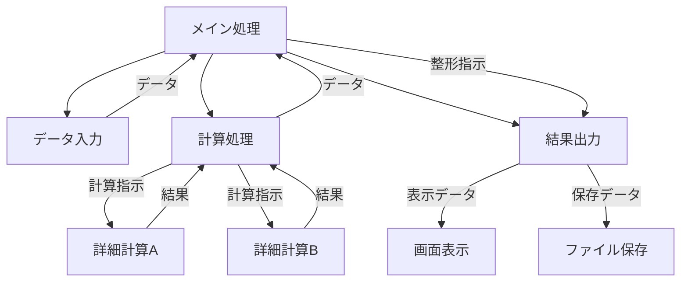

- [ソフトウェア設計：構造化設計入門](#ソフトウェア設計構造化設計入門)
  - [はじめに](#はじめに)
  - [構造化設計とは？](#構造化設計とは)
    - [構造化設計の主な特徴](#構造化設計の主な特徴)
  - [構造化設計の実践：どうやって設計を進めるか](#構造化設計の実践どうやって設計を進めるか)
    - [段階的詳細化 (Stepwise Refinement)](#段階的詳細化-stepwise-refinement)
    - [関数分割の手法：モジュールをどう分けるか](#関数分割の手法モジュールをどう分けるか)
    - [関数設計のポイント：良い関数を作るために](#関数設計のポイント良い関数を作るために)
    - [データ構造に関する考慮事項（補足）：データも整理しよう](#データ構造に関する考慮事項補足データも整理しよう)
    - [モジュール間のデータのやり取り](#モジュール間のデータのやり取り)
    - [エラーハンドリングの基本的な考え方：予期せぬ事態に備える](#エラーハンドリングの基本的な考え方予期せぬ事態に備える)
    - [構造化設計とテスト容易性：作ったものが正しく動くか確認しやすくする](#構造化設計とテスト容易性作ったものが正しく動くか確認しやすくする)
    - [組み込みシステムにおける構造化設計の適用](#組み込みシステムにおける構造化設計の適用)
  - [構造化プログラミング：設計をコードにする原則](#構造化プログラミング設計をコードにする原則)
  - [設計ツール：構造を視覚化する](#設計ツール構造を視覚化する)
    - [関数構造図 / モジュール構造図 (Structure Chart)](#関数構造図--モジュール構造図-structure-chart)
    - [モジュール構造の良否の目安](#モジュール構造の良否の目安)
  - [構造化設計の限界と、その後の発展](#構造化設計の限界とその後の発展)
    - [大規模化・複雑化への対応の難しさ](#大規模化複雑化への対応の難しさ)
    - [再利用性の限界](#再利用性の限界)
    - [変更への弱さ](#変更への弱さ)
    - [その後の発展：オブジェクト指向へ](#その後の発展オブジェクト指向へ)

# ソフトウェア設計：構造化設計入門

## はじめに

ソフトウェア開発の世界へようこそ！この資料では、ソフトウェア設計の基本的な考え方の 1 つである「構造化設計」について解説します。とくに、プログラミング経験が浅い若手エンジニアの皆さんが、ソフトウェアを整理し、分かりやすく、そして保守しやすく作るための第一歩となることを目指します。

---

## 構造化設計とは？

皆さんがこれからソフトウェアを作るとき、頭の中にあるアイデアをどのようにコンピューターが理解できる形（プログラム）に落とし込んでいくでしょうか？小さなプログラムなら一気に書けるかもしれませんが、少し複雑になると、どこから手をつけて良いか分からなくなったり、あとで読んだときに自分でも意味が分からなくなったりすることがあります。

**構造化設計**は、そのような問題を解決するために、1960 年代後半から 1970 年代にかけて考え出された、プログラムを論理的かつ体系的に組み立てるための設計手法です。E.W. ダイクストラらがその理論的基礎を築き、『構造化プログラミング』(サイエンス社, 1975) という古典的名著で広く知られるようになりました。この手法は、複雑なソフトウェアも、小さな機能の部品（**モジュール**）に分割し、それらを階層的に組み合わせることで、全体として分かりやすく、管理しやすい構造を作ることを目指します。

### 構造化設計の主な特徴

構造化設計には、主に二つの大きな特徴があります。

1. **トップダウン設計 (Top-Down Approach)**
   家を建てる時、まず「どんな家にするか（全体像）」を考え、次に「リビング」「寝室」「キッチン」などの部屋（大きな部分）を決め、最後に「壁紙の色」「ドアノブの形」といった詳細を決めていきますよね。トップダウン設計もこれと同じで、ソフトウェア全体の大きな目的から考え始め、それを実現するために必要な主要な機能に分解し、さらにその機能をより小さな具体的な処理へと段階的に掘り下げていくアプローチです。これにより、複雑な問題を、扱いやすい小さな問題の集まりとして考えることができます。

2. **モジュール化 (Modularization)**
   ソフトウェアを、特定の機能や役割を持つ独立した部品（**モジュール**）に分割します。たとえば、「ユーザー情報を登録する」「商品の在庫を確認する」「請求書を作成する」といった単位でモジュールに分けるイメージです。各モジュールは、できるだけ他のモジュールの内部を知らなくても動作するように、また、1 つのモジュールが 1 つの明確な責務を持つように設計することが理想とされます。モジュールの凝集度や結合度については、Steve McConnell の『CODE COMPLETE 第 2 版』(日経 BP, 2005) でも、質の高いモジュール設計のための重要な要素として詳しく解説されています。
   - **モジュール結合度**
     モジュール同士がどれくらい互いに依存しているかを示す度合いです。結合度が低い（疎結合）ほど、1 つのモジュールを変更しても他のモジュールへの影響が少なくなり、修正や機能追加が容易になります。
   - **モジュール強度（凝集度）**
     1 つのモジュール内部の要素（コード）が、どれだけ強く関連し合っているかを示す度合いです。強度が高い（高凝集）ほど、モジュールが 1 つのまとまった機能や責任を持っており、理解しやすく再利用しやすくなります。

このように、まとまった処理をモジュールとして切り出し、他のモジュールから呼び出すという考え方は、入れ子構造にできます。最上位のプログラムから徐々に詳細な処理をモジュールとして定義していき、最終的にそれらを組み合わせたプログラム全体の形が、構造化設計における「構造」となります。

---

## 構造化設計の実践：どうやって設計を進めるか

では、具体的にどのように構造化設計を進めていけば良いのでしょうか。ここでは、代表的な手法と考え方を紹介します。

### 段階的詳細化 (Stepwise Refinement)

これは、構造化設計の中心的な考え方であり、トップダウン設計を具体的に進めるための手法です。いきなりプログラムの細部まで考えるのではなく、まずは大枠から捉え、徐々に詳細を詰めていきます。この考え方は、『構造化プログラミング』(サイエンス社, 1975) で提唱された概念に深く根ざしています。

**段階的詳細化の具体的な進め方**

段階的詳細化は、大きな問題を一気に解決しようとするのではなく、段階を踏んで徐々に具体的にしていく思考プロセスです。ここでは、その具体的な進め方をステップに分けて説明します。簡単な例として、「テキストファイルから数値を読み込み、合計値を計算して画面に表示する」プログラムを設計するケースを考えてみましょう。

**ステップ 0: 問題の理解と最上位レベルの定義**

1. **何をするプログラムか？を一文で**
   まず、プログラムが最終的に達成すべきことを、もっとも簡単な言葉で表現します。
   - 例：「指定されたファイルから数値を読み込み、合計を計算し、結果を表示する。」
2. **もっとも大きな処理の塊に分ける**
   次に、その目的を達成するための、ごく大まかなステップに分解します。多くの場合、「入力」「処理」「出力」の 3 ステップが基本になります。この段階では、具体的な方法は考えません。
   - 例：
     1. ファイルからデータを **読み込む**。
     2. 読み込んだデータで **合計を計算する**。
     3. 計算結果を画面に **表示する**。

**ステップ 1: 少し具体的に – 主要な機能と流れを考える**

ステップ 0 で分けた大まかな塊を、もう少しだけ具体的な機能に分解し、それらがどのような順序や条件で実行されるか（制御構造）を考えます。

1. **各塊を少し分解:**
   - 「読み込む」→ ファイルを開く、データを読み取る、ファイルを閉じる
   - 「計算する」→ 読み取ったデータが数値かチェックする、数値なら合計に加算する
   - 「表示する」→ 合計値を画面に出力する
2. **処理の流れ（制御）を追加:**
   これらのサブ機能がどのように連携するかを考えます。ここでは、ファイルを順番に読み進め、各データに対してチェックと加算を行い、最後に結果を表示するという流れが見えます。エラーが発生した場合の考慮も少し加えます。
   - 例（自然言語に近い記述）
   ```
   プログラム開始
     ファイル名を受け取る
     ファイルを開く (もし開けなかったら、エラーを表示して終了)
     合計値を0で初期化
     ファイルの終わりまで、繰り返し：
       ファイルから1行読み込む
       もし読み込みに失敗したら、エラーを表示して繰り返しを抜ける
       読み込んだ行が数値かチェックする
       もし数値なら：
         数値に変換する
         合計値に加算する
       そうでなければ：
         警告メッセージを表示する (処理は続行)
     繰り返し終わり
     ファイルを閉じる
     計算した合計値を表示する
   プログラム終了
   ```
   - この段階で、簡単な擬似コード（特定のプログラミング言語に依存しない、プログラム風の記述）を使い始めると、より明確になります。

**ステップ 2: さらに具体的に – 関数レベルへの分割**

ステップ 1 で考えた処理の流れを、具体的な関数（あるいはモジュール）に分割します。各関数が特定の役割を持つように意識します。

1. **処理のまとまりを関数候補にする:**
   ステップ 1 の擬似コードから、まとまった処理を関数として切り出せないか考えます。
   - 例：
     - `ファイルを開く処理` → `openFile(ファイル名)` 関数
     - `1行読み込む処理` → `readLineFromFile(ファイルハンドル)` 関数
     - `数値かチェックし、数値なら変換する処理` → `parseNumber(文字列)` 関数 (数値でなければエラーを示す値を返す)
     - `合計値を表示する処理` → `displayResult(合計値)` 関数
2. **関数間の連携を考える（データの受け渡し）:**
   これらの関数がどのようにデータをやり取りするかを考えます（引数と戻り値）。

   - 例（擬似コードの関数化）：

   ```
   function main()
     ファイル名 = getFileNameFromUser()
     ファイルハンドル = openFile(ファイル名)
     if (ファイルハンドル が 無効) then
       showError("ファイルが開けません")
       return
     endif

     合計 = 0
     loop
       行データ, 読み込みステータス = readLineFromFile(ファイルハンドル)
       if (読み込みステータス が ファイル終端) then break loop // ループを抜ける
       if (読み込みステータス が エラー) then
         showError("ファイルの読み込みエラー")
         break loop // ループを抜ける
       endif

       数値, 変換ステータス = parseNumber(行データ)
       if (変換ステータス が OK) then
         合計 = 合計 + 数値
       else
         showWarning("数値でない行をスキップ: " + 行データ)
       endif
     end loop

     closeFile(ファイルハンドル)
     displayResult(合計)
   end function

   // --- 以下、各関数の定義 (まだ中身は詳細化しない) ---
   function openFile(ファイル名) returns ファイルハンドル
   function readLineFromFile(ファイルハンドル) returns (文字列, ステータス)
   function parseNumber(文字列) returns (数値, ステータス)
   function closeFile(ファイルハンドル)
   function displayResult(合計値)
   // ... など
   ```

**ステップ 3 以降: 関数の内部を詳細化する**

ステップ 2 で定義した各関数（`openFile`, `readLineFromFile`, `parseNumber` など）の内部処理を、さらに具体的に設計します。このステップを、関数の中身が十分に単純になり、プログラミング言語の基本的な文法で直接コードが書けるようになるまで繰り返します。

- 例：「`parseNumber` 関数の詳細化」
  - 入力文字列の先頭と末尾の空白を除去する。
  - 文字列が数字、小数点、符号のみで構成されているかチェックする。
  - 数値に変換してみる（言語機能を使う）。変換に成功したら数値を、失敗したらエラーを示すステータスを返す。

**段階的詳細化を進める上でのポイント**

- **抽象度を揃える**
  各ステップで分解する際は、できるだけ同じくらいの具体性（抽象度）の要素に分けるように意識します。
- **データも一緒に**
  処理を考えるときは、その処理に必要な入力データは何か、処理の結果としてどんなデータが出力されるかも同時に考えます。
- **「今は考えない」勇気**
  そのステップで詳細化している箇所以外の、さらに細かいことは「後で考える」ことにして、目の前のレベルに集中します。これを「決定の延期」と呼びます。
- **行ったり来たり**
  詳細化を進めていく中で、「1 つ前の分割、ちょっとまずかったかも？」と気づくこともあります。その際は、ためらわずに前のステップに戻って見直すことが重要です。設計は一直線に進むとは限りません。

このように、段階的詳細化は、大きな問題を小さなステップに分け、それぞれのステップで考える範囲を限定しながら、徐々に具体的な設計へと落とし込んでいくための非常に有効な思考ツールです。

**段階的詳細化の利点**

- **複雑さの克服**
  一度に考える範囲を限定できるため、複雑な問題も管理可能な小さな問題の集まりとして扱えます。
- **焦点化**
  設計中の部分に関係のない情報はいったん無視できるため、目の前の課題に集中できます。
- **決定の延期**
  細かい実装方法などは、後の段階で決めれば良いため、早期に本質的でない決定に悩む必要がありません。
- **分かりやすさ**
  このプロセスを経て設計された個々の処理は、比較的単純で、役割が明確になり、理解しやすくなります。

### 関数分割の手法：モジュールをどう分けるか

ソフトウェアを機能単位（モジュール、多くの場合は関数やメソッドとして実装されます）に分割する際には、いくつかの観点があります。

- **機能分割**
  ソフトウェアに必要な機能を洗い出し、それぞれの機能が独立した単位となるように分割する、最も基本的な方法です。たとえば、「データを読み込む」「データを計算する」「結果を表示する」といった機能ごとにモジュールを分けます。
- **TR 分割 (Transaction 分割法)**
  入力されるデータの種類（トランザクション）によって処理内容が分岐する場合に有効な分割方法です。たとえば、ユーザーの操作コマンド（「登録」「更新」「削除」など）に応じて、それぞれの処理を担当するモジュールに振り分けるような場合に用います。
- **STS 分割 (Source-Transform-Sink 分割法)**
  データの流れに着目した分割方法です。データが発生する源泉 (Source)、データを加工・変換する処理 (Transform)、処理結果を出力・吸収する先 (Sink) の 3 つの部分に分割します。データの入力から出力までの一連の流れを意識した設計に適しています。
- **共通機能分割**
  複数のモジュールで同じような処理が必要になる場合、その共通部分を独立したモジュールとして括り出し、各モジュールから呼び出して利用する方法です。コードの重複をなくし、保守性を高めます。

### 関数設計のポイント：良い関数を作るために

構造化設計では、関数（あるいは手続き、サブルーチン）が基本的な構成要素となります。分かりやすく、再利用しやすく、修正しやすい関数を設計するためのポイントをいくつか紹介します。『リーダブルコード』(オライリー・ジャパン, 2012) で述べられているような、読みやすいコードを書くための原則とも重なります。また、『CODE COMPLETE 第 2 版』(日経 BP, 2005) には、質の高い関数（サブルーチン）を作成するための詳細なガイドラインが豊富に含まれています。

1. **1 つの関数には、1 つの役割だけを (単一責任の原則)**
   関数は、明確な 1 つの仕事だけを行うように設計しましょう。たとえば、「ユーザー情報を読み込んで、検証し、データベースに保存する」という関数は、複数の責任を持っています。「読み込み」「検証」「保存」の 3 つの関数に分けることで、各関数の目的が明確になり、テストや再利用がしやすくなります。変更が必要になった場合も、修正箇所を特定しやすくなります。関数の凝集度を高めるという考え方は、『CODE COMPLETE 第 2 版』でも強調されています。
2. **分かりやすい名前を付ける**
   関数名を見ただけで、その関数が何をするのかが推測できるように、具体的で分かりやすい名前を付けましょう。動詞や「動詞 + 目的語」の形が良い場合が多いです（例: `calculateTotalPrice`, `validateUserInput`）。『リーダブルコード』では、名前の重要性が繰り返し強調されています。
3. **短く、シンプルに**
   関数はできるだけ短く保つことを目指しましょう。一般的に、1 画面に収まる程度の長さ（たとえば 20〜30 行以内）が 1 つの目安ですが、絶対的な基準ではありません。関数が長くなってきたら、それは複数の責任を持っているサインかもしれません。適切に分割することを検討しましょう。『CODE COMPLETE 第 2 版』でも、サブルーチンの適切な長さについて議論されています。
4. **引数は少なく、明確に**
   関数が必要とする情報は、引数として明確に渡します。引数の数は少ないほど、関数の使い方を理解しやすくなります。目安として 3 つ程度までが良いとされます。引数が多くなる場合は、関連するデータを構造体やオブジェクトにまとめて渡すことを検討しましょう。また、関数が何を受け取り（引数）、何を返すのか（戻り値）が明確になるように設計します。
5. **副作用を意識する（そして、できれば避ける）**
   関数が、その関数の外の状態（たとえば、グローバル変数や参照渡しされた引数の中身）を変更することを**副作用**と呼びます。副作用は、プログラムの動作を追跡しにくくする原因になります。可能であれば、関数は受け取った入力に基づいて結果を計算し、それを戻り値として返すだけで、外部の状態を変更しないように設計する（**純粋関数**に近い形を目指す）ことが望ましいです。どうしても副作用が必要な場合は、その影響範囲を最小限にし、関数名やコメントで副作用があることを明示すると良いでしょう。
6. **早めにリターンする (Early Return)**
   関数の最初に、エラーケースや事前条件チェックを行い、条件を満たさない場合はすぐに `return` するスタイルです。これにより、ネスト（if 文の入れ子）が深くなるのを防ぎ、正常系の処理の流れが追いやすくなります。『リーダブルコード』でも推奨されているテクニックです。

   ```c
   // Early Return の例
   int processData(Data* data) {
       if (data == NULL) {
           logError("データがNULLです。");
           return ERROR_INVALID_ARGUMENT; // 条件を満たさないので早期リターン
       }
       if (!isValid(data)) {
           logError("データが無効です。");
           return ERROR_INVALID_DATA;   // 条件を満たさないので早期リターン
       }

       // ここからが正常系の処理
       Result result = performCalculation(data);
       if (!saveResult(result)) {
           logError("結果の保存に失敗しました。");
           return ERROR_SAVE_FAILED;
       }

       return SUCCESS; // 最後に正常終了
   }
   ```

これらのポイントを意識することで、構造化設計の基本単位である関数を、より質の高いものにできます。

---

### データ構造に関する考慮事項（補足）：データも整理しよう

これまでは主に「処理」をどのように分割し、関数として設計するかに焦点を当ててきました。しかし、ソフトウェアが扱う「データ」をどのように整理し、扱うかも同じくらい重要です。構造化設計においても、データ構造の設計を意識することで、より分かりやすく、保守しやすいプログラムを作ることができます。

- **モジュール間で受け渡すデータはシンプルに**
  関数（モジュール）間でデータをやり取りする際、そのデータの構造はできるだけシンプルに保つことが望ましいです。複雑すぎるデータ構造は、モジュール間の依存関係を強め、変更時の影響範囲を広げてしまう可能性があります。可能であれば、関数が必要とする最小限の情報だけを含むようにデータ構造を設計しましょう。
  **情報隠蔽の考え方**
  関連して、「情報隠蔽」という原則があります。これは、モジュールの内部の詳細（たとえば、データが具体的にどのように格納されているかなど）を外部から隠し、決められたインターフェース（関数呼び出しや、公開されたデータ構造）だけを通じてアクセスするようにするという考え方です。これにより、モジュールの内部実装を変更しても、外部への影響を最小限に抑えることができます。構造化設計でも、この考え方を意識すると良いでしょう。
- **関連するデータは構造体にまとめる**
  複数のデータ項目が密接に関連している場合（たとえば、「顧客」に関する氏名、住所、電話番号など）、それらを個別の変数として扱うのではなく、1 つの構造体にまとめることを検討しましょう。
  **メリット**
  - 関連性が明確になり、データが 1 つの単位として扱えます。
  - 関数にデータを渡す際、構造体を 1 つ渡すだけで済むため、引数の数を減らせます（これは「関数設計のポイント」で述べた「引数は少なく」にも繋がります）。
  - データの意味的なまとまりがコード上で表現され、可読性が向上します。
- **データの不変性 (Immutability) を意識する（可能であれば）**
  これは少し発展的な考え方ですが、関数が受け取ったデータを直接変更する（副作用）のではなく、変更が必要な場合は元のデータをコピーして新しいデータを作成し、それを返す、というアプローチがあります。データを「不変（変更されない）」ものとして扱うことで、予期せぬ副作用を防ぎ、プログラムの動作を予測しやすくできます。常に適用できるわけではありませんが、とくに複雑なデータ構造を扱う際には有効な考え方です。

プログラムは「処理」と「データ」から成り立っています。処理の流れを整理する構造化設計の考え方と合わせて、扱うデータの構造も整理することを意識してみてください。『CODE COMPLETE 第 2 版』でも、データ型の作成や使い方がコードの品質に与える影響について言及されています。

---

### モジュール間のデータのやり取り

モジュール同士が連携するためには、データの受け渡しが必要です。主な方法として「引数」と「共有データ（グローバル変数など）」があります。

#### 引数

関数を呼び出す際に、必要なデータを直接渡す方法です。

```c
// 引数によるデータの受け渡し
int sum = add(3, 5); // 関数addに3と5を渡す
```

この方法は、どのデータが関数に渡され、どのデータが返されるのかが明確になります。モジュール間の関係性がはっきりし、それぞれのモジュールが独立して動作しやすくなるため、**構造化設計では基本的に引数によるデータの受け渡しが推奨されます**。とくに、複数の処理が同時に同じ関数を安全に使えるようにする「リエントラント」な設計では、引数の使用が不可欠です。

#### 共有データ (グローバル変数など)

複数のモジュールからアクセス可能な共通のデータ領域（たとえばグローバル変数）を用意し、それを通じてデータの読み書きを行う方法です。

```c
// グローバル変数によるデータの共有（例）
int global_status = 0;

void moduleA() {
    // ... 処理 ...
    global_status = 1; // 共有データを変更
}

void moduleB() {
    if (global_status == 1) { // 共有データを参照
        // ... 処理 ...
    }
}
```

この方法は、一見すると引数でデータを渡し回す手間が省けて便利なように思えますが、以下のような問題点があります。『CODE COMPLETE 第 2 版』でも、グローバル変数の使用は慎重に行うべきであり、そのスコープをできるだけ限定することの重要性が述べられています。

- **依存関係の隠蔽:** どのモジュールがいつ、どのように共有データを変更したのかが分かりにくくなり、モジュール間の依存関係が強くなります。
- **追跡の困難さ:** データが予期せず変更された場合、原因箇所を特定するのが難しくなります（デバッグが困難）。
- **再利用性の低下:** 共有データに依存しているモジュールは、その共有データがない環境では再利用できません。
- **副作用の温床:** 関数のインターフェース（引数と戻り値）を見ただけでは、共有データを変更する副作用があるかどうかが分かりません。
- **変更への影響:** 共有データの構造や意味を変更すると、それを利用しているすべてのモジュールに影響が及ぶ可能性があります。

ただし、どうしても共有データを使わざるを得ない場合や、使った方が効率的な場面も存在します（例: プログラム全体で普遍的な設定値、割り込み処理とメイン処理間の非同期な情報伝達など）。そのような場合でも、共有データへのアクセスは最小限に留め、アクセスする箇所を限定する、読み取り専用にするなどの工夫が必要です。

---

### エラーハンドリングの基本的な考え方：予期せぬ事態に備える

ソフトウェア開発において、エラー（予期せぬ入力、リソース不足、外部要因による失敗など）は避けられません。重要なのは、エラーが発生する可能性を考慮し、それに対して適切に対処する仕組みを設計段階から組み込んでおくことです。これをエラーハンドリングと呼びます。

**エラーの検出**

まず、どこでエラーが発生しうるかを想定し、それを検出するコードが必要です。

- **関数の入り口でのチェック:** 関数が期待する前提条件（たとえば、引数が NULL でないか、特定の値の範囲内か）を満たしているかを確認します。これは「防御的プログラミング」の基本です。
- **処理中のチェック:** ファイル操作、メモリ確保、計算処理などが失敗する可能性を考慮し、その結果をチェックします。

**エラーの通知方法**

関数内でエラーを検出した場合、その事実を呼び出し元の関数に伝える必要があります。主な方法には以下のようなものがあります。

- **戻り値を使う**
  もっとも一般的で、構造化設計と相性の良い方法です。
  - **エラーコード**
    正常終了時は 0、エラーの種類に応じて負の値や特定のエラーコード（定数で定義すると分かりやすい）を返す。
  - **不正な値**
    ポインタを返す関数なら NULL、サイズを返す関数なら -1 など、通常ありえない値をエラーとして返す。
  - **ステータス変数との組み合わせ**
    戻り値で処理結果のデータそのものを返し、引数で渡したポインタ変数などにエラーコードやステータスを格納して返す方法もあります。
- **エラーフラグ（共有変数）を使う**
  グローバル変数や共有メモリ領域にエラー状態を示すフラグを立てる方法もあります。しかし、これは「共有データ」の問題点（追跡困難、副作用の隠蔽など）を伴うため、使用は慎重に行うべきです。引数でエラー情報を返す方が、通常はより安全で明確です。

**エラー処理の戦略**

エラーを検出・通知された呼び出し元の関数は、そのエラーに対してどのように振る舞うべきでしょうか。いくつかの基本的な戦略があります。

- **呼び出し元に判断を委ねる**
  エラーコードやステータスをそのまま上位の関数に伝搬させ、最終的にユーザーへの通知やプログラムの終了などを担当する部分で判断します。
- **処理を中断する（フェイルファスト）**
  エラーが発生したら、それ以上の処理を続けずに速やかに処理を中断し、安全な状態（たとえば、確保したリソースの解放などを行う）にして終了またはエラー処理フローに移ります。
- **回復処理を試みる**
  可能であれば、エラーから回復するための処理（たとえば、リトライ、代替処理の実行など）を行います。
- **エラーログを出力する**
  エラーが発生した日時、場所、原因などの情報をログファイルなどに出力し、あとで開発者が原因を調査できるようにします。

どの戦略を取るかは、エラーの種類やプログラムの性質によって異なります。重要なのは、プログラム全体で一貫性のあるエラーハンドリング方針を持つことです。場当たり的に対処するのではなく、設計段階で「この種のエラーはどう扱うか」を決めておくことが、堅牢で保守しやすいソフトウェアに繋がります。

---

### 構造化設計とテスト容易性：作ったものが正しく動くか確認しやすくする

ソフトウェアを作ったら、それが設計通りに正しく動作するかを確認する「テスト」が不可欠です。実は、これまで説明してきた構造化設計の原則は、このテストのしやすさ（テスト容易性）を高める上でも非常に役立ちます。

- **モジュール化とユニットテスト**
  プログラムを独立した機能単位（モジュール、多くは関数）に分割することで、各モジュールを個別にテストする「**ユニットテスト**」が可能になります。家全体を一度に検査するのではなく、キッチンだけ、寝室だけを個別にチェックするようなイメージです。モジュールが小さく、役割が明確であればあるほど、テストは容易になります。特定の入力（引数）を与えたときに、期待される出力（戻り値や状態変化）が得られるかを確認します。

- **単一責任の原則とテスト**
  関数が 1 つの明確な責任だけを持っていれば、その関数がテストすべきことも明確になります。逆に、関数が多くのことをしていると、テストケースを網羅するのが難しくなり、テストコードも複雑になりがちです。

- **引数と戻り値の明確化とテスト**
  関数が必要とするデータが引数として明確に渡され、結果が戻り値として明確に返される設計は、テストを非常に容易にします。なぜなら、テストコードから特定の引数を与えて関数を呼び出し、その戻り値を検証するだけで、関数の動作を確認できるからです。

- **副作用の低減とテスト**
  関数が外部の状態（グローバル変数など）を読み書きする「副作用」を持つ場合、テストは難しくなります。テストの前に特定の状態を作り込み、テスト後に状態を元に戻すといった手間が必要になることがあります。また、他のテストの影響を受けやすくなり、テストの独立性や再現性が損なわれる可能性もあります。副作用のない（あるいは少ない）関数は、入力さえ決まれば出力が一意に決まるため、非常にテストしやすいのです。

このように、モジュール間の結合度を低くし、モジュール内の凝集度を高め、インターフェースを明確にするといった、構造化設計で推奨される「良い設計」のプラクティスは、そのまま「テストしやすい設計」にも繋がります。

開発の初期段階からテストのことを意識して設計を進めることで、バグの早期発見、修正コストの削減、そしてソフトウェア全体の品質向上に繋がります。テスト容易性は、ソフトウェアの保守性にも直結する重要な品質特性なのです。

---

### 組み込みシステムにおける構造化設計の適用

構造化設計は、PC 上のアプリケーションだけでなく、家電や産業機器などに組み込まれるソフトウェア（組み込みシステム）の開発でも広く使われてきました。ただし、組み込みシステム特有の制約に対応する必要があります。

#### リソース制約への対応

組み込みシステムは、使えるメモリ容量や CPU の処理能力が限られていることが多いです。そのため、設計段階から以下の点を考慮する必要があります。

- **メモリ効率**
  モジュール分割の仕方やデータの持ち方が、メモリ使用量にどう影響するかを意識します。とくに、関数呼び出し時に使われるスタック領域の使用量には注意が必要です。再帰呼び出し（関数が自分自身を呼び出すこと）は、スタックを大量に消費する可能性があるため、避けるか、回数に上限を設けるなどの対策が必要です。
- **実行速度**
  処理に時間がかかりすぎないように、効率的なアルゴリズムを選択したり、モジュール間のデータの受け渡し方法を工夫したりします。

#### 安全性の確保

組み込みシステムでは、誤動作が人命や財産に関わることもあるため、安全性が非常に重要です。構造化設計においても、以下のような点を考慮して、堅牢なソフトウェアを作る必要があります。『CODE COMPLETE 第 2 版』では、**防御的プログラミング**のテクニックが詳しく紹介されており、組み込み開発においても非常に重要です。

- **エラー処理**
  想定されるエラー（不正な入力、ハードウェアの異常など）を洗い出し、それぞれのケースで適切に処理（エラー通知、安全な状態への移行など）するコードを組み込みます。
- **境界値の考慮**
  入力データやループ回数などが、想定される範囲の最小値や最大値（境界値）を取った場合に、正しく動作するかを検証します。
- **防御的プログラミング**
  予期しない値が入力された場合でも、プログラムがクラッシュしたり、危険な状態になったりしないように、関数の入り口で引数をチェックする（アサーションやエラーチェック）などの防御策を講じます。
- **タイムアウト**
  外部デバイスからの応答待ちなど、処理が完了するまでに時間がかかりすぎる場合に備えて、一定時間で処理を打ち切るタイムアウト機構を設けます。

---

## 構造化プログラミング：設計をコードにする原則

構造化設計の考え方を実際のプログラミングに落とし込むためのルールが構造化プログラミングです。このプログラミングスタイルは、ダイクストラらによる古典的名著『構造化プログラミング』(サイエンス社, 1975) によって提唱され、ソフトウェア開発に大きな影響を与えました。 その中心的な原則は、「プログラムは、基本的に以下の 3 つの制御構造（と関数呼び出し）だけで構成するべき」というものです。

1. **順次 (Sequential):** 処理を上から下へ順番に実行します。
2. **選択 (Selection):** 条件に応じて、実行する処理を選びます（if-then-else, switch-case など）。
3. **反復 (Repetition / Iteration):** 条件が満たされている間、または指定回数だけ、同じ処理を繰り返します（while, for など）。

そして、もう 1 つの重要な原則が`goto`文の制限（あるいは禁止）です。`goto`文は、プログラムの実行順序を自由に変えられますが、多用すると処理の流れが非常に分かりにくくなり、「スパゲッティコード」と呼ばれる読解困難なプログラムを生み出す原因となります。『構造化プログラミング』では、`goto`文を使わなくてもこれら 3 つの基本構造で任意のプログラムが記述できることが示され、`goto`文の排除が推奨されました。
（例外的に、深いネストからの脱出や特定のエラー処理などで限定的に`goto`文が使われることもありますが、基本的には避けるべきとされています。『CODE COMPLETE 第 2 版』でも、`goto`文の限定的な使用について触れられています。）

---

## 設計ツール：構造を視覚化する

設計したソフトウェアの構造を、図を使って表現すると、チームメンバーとの認識合わせや、後からの見直しに役立ちます。

### 関数構造図 / モジュール構造図 (Structure Chart)

どのモジュールがどのモジュールを呼び出しているのか、そしてその際にどのようなデータがやり取りされているのかを視覚的に表現する図です。木の形になることが多く、上位のモジュールから下位の具体的な処理モジュールへと分解されていく様子が分かります。



- **見方:** 上の箱が呼び出し元、下の箱が呼び出し先のモジュールを表します。矢印は呼び出し関係を示し、矢印に添えられた小さな矢印やラベルは、データの受け渡し（引数や戻り値）を表すことがあります。

### モジュール構造の良否の目安

良い構造になっているかどうかの目安として、以下のような点が挙げられます。

- **木の形:** 一般的に、逆さまの木のような形（ルートが上で葉が下）になるのが良いとされます。頂上付近（メイン処理に近い部分）では処理を大まかに分割し、中間層で具体的な処理を行い、末端（葉に近い部分）では再利用可能な共通処理などが現れるイメージです。
- **ファンアウト (Fan-out):** 1 つのモジュールが直接呼び出している他のモジュールの数です。ファンアウトが多すぎると、そのモジュールが多くのことに関与しすぎており、複雑になっている可能性があります。一般的に、7 個前後（多くても 9 個以下）が良いとされています（これは、人間が一度に覚えられる情報量に関連する「マジックナンバー 7±2」から来ています）。
- **ファンイン (Fan-in):** 1 つのモジュールが、いくつのモジュールから呼び出されているかを示す数です。共通機能として括り出されたモジュールは、ファンインが大きくなる傾向があります。ただし、システムの根幹に近い上位モジュールのファンインが大きいと、そのモジュールを変更した際の影響範囲が広くなるため、注意が必要です。

---

## 構造化設計の限界と、その後の発展

構造化設計は、ソフトウェア開発に大きな進歩をもたらしましたが、ソフトウェアがますます大規模化・複雑化するにつれて、いくつかの限界も見えてきました。

### 大規模化・複雑化への対応の難しさ

- **構造の把握:** プログラムが非常に大きくなると、トップダウンで作られた多数のモジュール間の関係性をすべて把握し、管理することが困難になってきます。
- **データ構造の扱い:** 構造化設計は主に「処理の流れ（制御構造）」に焦点を当てており、「データ構造」をどう設計し、管理するかについては十分な指針がありませんでした。データとそのデータを操作する手続きが分離されているため、データ構造の変更が多くの手続きに影響を及ぼすことがありました。
- **グローバル変数の問題:** 前述の通り、共有データ（とくにグローバル変数）を多用すると、データの整合性を保つのが難しくなり、変更の影響範囲も広がりやすくなります。Robert C. Martin 氏が『Clean Architecture』(翔泳社, 2018) で指摘するように、状態管理の難しさは構造化アプローチの課題の 1 つでした。

### 再利用性の限界

- 関数単位での再利用は可能ですが、データ構造と処理が密接に関連するような部品（たとえば、「顧客データとその操作」）を、ひとまとまりの部品として再利用することは困難でした。

### 変更への弱さ

- ソフトウェアに対する要求は常に変化します。仕様変更や機能追加があった場合、構造化設計で作られたプログラムは、変更箇所が広範囲に散らばってしまうことがありました。とくに、中心的なデータ構造や、上位のモジュールの設計に変更が必要になると、その影響は甚大になる傾向がありました。

### その後の発展：オブジェクト指向へ

これらの限界を克服するために、新しい設計の考え方が登場しました。その代表がオブジェクト指向設計 (Object-Oriented Design)です。

オブジェクト指向設計では、「データ」と、そのデータを操作する「手続き（メソッド）」を「オブジェクト」という 1 つのまとまりとして捉えます。これにより、関連性の高いデータと処理をカプセル化し、モジュールの独立性をさらに高め、再利用性や保守性を向上させることを目指します。

構造化設計は、現代でも小規模なプログラムや、特定の処理モジュールの内部実装を考える上で有効な考え方です。とくに、関数や手続きの内部をどのように整理し、読みやすく、保守しやすく書くかという点においては、『CODE COMPLETE 第 2 版』で解説されているような構築のプラクティスと合わせて、今でも重要な知識です。 しかし、大規模で複雑なソフトウェア全体を設計する際には、オブジェクト指向設計や、さらに進んだ設計原則を取り入れることが一般的になっています。

構造化設計を学ぶことは、これらのより進んだ設計手法を理解するための基礎となります。まずはこの構造化設計の考え方をしっかりと身につけ、整理された分かりやすいコードを書くことから始めましょう。

---

**参考文献（この資料を作成する上で参考にした書籍）**

- E.W. ダイクストラ, O.-J. ダール, C.A.R. ホーア『構造化プログラミング』サイエンス社、1975 年
- Steve McConnell『CODE COMPLETE 第 2 版 完全なプログラミングを目指して』日経 BP、2005 年
- Dustin Boswell, Trevor Foucher『リーダブルコード ―より良いコードを書くためのシンプルで実践的なテクニック』オライリー・ジャパン、2012 年
