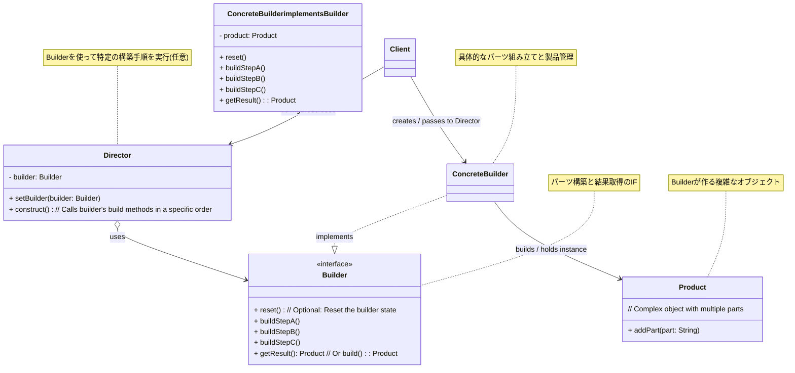

**目次**

- [デザインパターン詳細解説：Builder パターン](#デザインパターン詳細解説builder-パターン)
- [1. Builder パターンとは？ ～目的と解決したい問題～](#1-builder-パターンとは-目的と解決したい問題)
  - [1.1 このパターンを一言で言うと？（核心的な目的）](#11-このパターンを一言で言うと核心的な目的)
  - [1.2 なぜ Builder パターンが必要なのか？（動機と背景）](#12-なぜ-builder-パターンが必要なのか動機と背景)
    - [1.2.1 コンストラクタや Setter の問題点](#121-コンストラクタや-setter-の問題点)
    - [1.2.2 複雑な構築プロセスを分離したい](#122-複雑な構築プロセスを分離したい)
  - [1.3 このパターンで解決できること（メリットの要約）](#13-このパターンで解決できることメリットの要約)
- [2. パターンの構造と実装 ～どのように実現するか～](#2-パターンの構造と実装-どのように実現するか)
  - [2.1 登場人物とその役割（クラス図と解説）](#21-登場人物とその役割クラス図と解説)
  - [2.2 実装のポイント：段階的構築と結果取得](#22-実装のポイント段階的構築と結果取得)
  - [2.3 コード例：具体的なシナリオでの実装](#23-コード例具体的なシナリオでの実装)
    - [2.3.1 シナリオ設定（例：ピザの注文）](#231-シナリオ設定例ピザの注文)
    - [2.3.2 サンプルコード（Java での例 - Fluent Interface スタイル）](#232-サンプルコードjava-での例---fluent-interface-スタイル)
    - [2.3.3 コードのポイント解説](#233-コードのポイント解説)
- [3. Builder パターンの利点 ～採用するメリット～](#3-builder-パターンの利点-採用するメリット)
  - [3.1 可読性の高いオブジェクト生成コード](#31-可読性の高いオブジェクト生成コード)
  - [3.2 多数のパラメータ（特にオプション）の扱いやすさ](#32-多数のパラメータ特にオプションの扱いやすさ)
  - [3.3 不変 (Immutable) オブジェクトの安全な生成](#33-不変-immutable-オブジェクトの安全な生成)
  - [3.4 生成プロセスと表現の分離](#34-生成プロセスと表現の分離)
  - [3.5 生成途中の一貫性確保](#35-生成途中の一貫性確保)
- [4. 注意点とトレードオフ ～適用前に考えるべきこと～](#4-注意点とトレードオフ-適用前に考えるべきこと)
  - [4.1 コード量の増加とクラスの追加](#41-コード量の増加とクラスの追加)
  - [4.2 Builder の可変性 (Mutability)](#42-builder-の可変性-mutability)
  - [4.3 構築プロセスの複雑さ（古典的な Builder）](#43-構築プロセスの複雑さ古典的な-builder)
  - [4.4 必須パラメータの強制](#44-必須パラメータの強制)
- [5. 実装上のヒントと考慮事項 ～より良く使うために～](#5-実装上のヒントと考慮事項-より良く使うために)
  - [5.1 Builder クラスの配置場所](#51-builder-クラスの配置場所)
  - [5.2 必須パラメータとオプションパラメータの区別](#52-必須パラメータとオプションパラメータの区別)
  - [5.3 メソッドチェーンのための `this` 返却 (Fluent Interface)](#53-メソッドチェーンのための-this-返却-fluent-interface)
  - [5.4 `build()` メソッドでの検証](#54-build-メソッドでの検証)
  - [5.5 `Builder` の再利用性](#55-builder-の再利用性)
- [6. 他のパターンとの関連 ～比較と組み合わせ～](#6-他のパターンとの関連-比較と組み合わせ)
  - [6.1 似ているパターンとの比較](#61-似ているパターンとの比較)
    - [6.1.1 Builder vs Factory パターン (Factory Method, Abstract Factory)](#611-builder-vs-factory-パターン-factory-method-abstract-factory)
    - [6.1.2 Builder vs コンストラクタ / Setter](#612-builder-vs-コンストラクタ--setter)
  - [6.2 組み合わせると効果的なパターン](#62-組み合わせると効果的なパターン)
- [7. リファクタリング：いつ Builder パターンを導入するか](#7-リファクタリングいつ-builder-パターンを導入するか)
  - [7.1 導入のきっかけとなる「コードの不吉な臭い」や状況変化](#71-導入のきっかけとなるコードの不吉な臭いや状況変化)
  - [7.2 段階的なリファクタリング手順（概要）](#72-段階的なリファクタリング手順概要)
- [8. まとめ ～ Builder パターンの本質～](#8-まとめ--builder-パターンの本質)

# デザインパターン詳細解説：Builder パターン

# 1. Builder パターンとは？ ～目的と解決したい問題～

## 1.1 このパターンを一言で言うと？（核心的な目的）

Builder パターンは、「**複雑なオブジェクトの構築プロセスを、そのオブジェクトの最終的な表現から分離することで、同じ構築プロセスでも異なる表現（バリエーション）のオブジェクトを生成できるようにする**」ための、生成に関するデザインパターンです。オブジェクトの生成を段階的なステップに分解します。

## 1.2 なぜ Builder パターンが必要なのか？（動機と背景）

ソフトウェア開発において、オブジェクトを生成（インスタンス化）する際に、そのオブジェクトが多数の属性（フィールド）を持っていたり、設定が必須な項目とオプションの項目が混在していたり、あるいは生成自体が複数のステップを要したりする場合があります。このような「複雑なオブジェクト」を生成しようとすると、いくつかの課題が生じます。

### 1.2.1 コンストラクタや Setter の問題点

- **テレスコーピングコンストラクタ問題:**
  多数のパラメータ（特にオプションパラメータ）に対応するために、引数の数が異なるコンストラクタを多数オーバーロードする方式です。例えば、必須パラメータだけのコンストラクタ、必須＋オプション A のコンストラクタ、必須＋オプション A ＋オプション B のコンストラクタ…といった具合です。これは、
  - **引数の意味が不明瞭:** 引数が多くなると、どの引数がどのパラメータに対応するのか分かりにくく、間違いやすくなります。
  - **コードの可読性低下:** コンストラクタ呼び出しコードが長くなり、読みにくくなります。
  - **柔軟性の欠如:** パラメータの組み合わせが増えると、コンストラクタの数が爆発的に増加します。
- **Setter メソッドの乱用 (JavaBeans パターン):**
  デフォルトコンストラクタでオブジェクトを生成した後、多数の Setter メソッドを呼び出して各属性を設定していく方式です。これは、
  - **不整合な状態:** オブジェクトが必要な設定をすべて終える前に、他のコードからアクセスされてしまう可能性があります（オブジェクトが一時的に不完全な状態になる）。
  - **不変性の喪失:** Setter が存在するため、オブジェクトが生成された後でも状態を変更できてしまい、不変（Immutable）オブジェクトを作ることが難しくなります。スレッドセーフティの確保も難しくなります。

### 1.2.2 複雑な構築プロセスを分離したい

オブジェクトの生成プロセス自体が、単にコンストラクタを呼び出すだけでなく、複数のステップや複雑なロジックを必要とする場合があります。例えば、特定のパーツを組み立て、設定し、検証するといった手順です。この構築プロセスを、オブジェクトを利用するクライアントコードや、生成されるオブジェクト自身のクラス内に直接記述すると、責任が混在し、コードが複雑化します。

Builder パターンは、これらの課題、すなわち「コンストラクタ/Setter の問題」「複雑な構築プロセスの分離」を解決するために考案されました。

## 1.3 このパターンで解決できること（メリットの要約）

Builder パターンを適用することで、以下のようなメリットが期待できます。

- 多数のパラメータを持つ**複雑なオブジェクトの生成を、分かりやすく安全に**行える。
- **必須パラメータとオプションパラメータを明確に区別**できる。
- **メソッドチェーン**などにより、**可読性の高い**オブジェクト生成コードを実現できる（Fluent Interface）。
- オブジェクトの**構築プロセスと最終的な表現を分離**できる。
- **不変 (Immutable) オブジェクト**の生成に適している。
- 同じ構築プロセスで**異なるバリエーションのオブジェクト**を生成できる。

---

# 2. パターンの構造と実装 ～どのように実現するか～

Builder パターンは、複雑なオブジェクト (`Product`) の構築プロセスを、専門の `Builder` オブジェクトに担当させることで実現します。必要に応じて、構築手順を指示する `Director` を使うこともあります。

## 2.1 登場人物とその役割（クラス図と解説）

Builder パターンは、主に以下の 4 つの役割から構成されます。（`Director` は任意です）

- **`Builder`（ビルダーインターフェース/抽象クラス）:**
  - **役割:** 生成物 (`Product`) の**各パーツを構築するためのステップ**（メソッド）と、最終的な**結果を取得するメソッド**を定義するインターフェースまたは抽象クラスです。
  - **定義:** パーツを構築するメソッド（例: `buildPartA()`, `setOptionX()` など）と、完成した `Product` を返すメソッド（例: `getResult()`, `build()`）を宣言します。
- **`ConcreteBuilder`（具体的なビルダー）:**
  - **役割:** `Builder` インターフェースを実装し、**具体的なパーツの組み立て方法**を提供します。
  - **実装:**
    - 内部で**構築中の `Product` オブジェクト（またはその構成要素）を保持・管理**します。
    - `Builder` で宣言された各構築ステップメソッドを実装し、パーツを作成して内部の `Product` に設定します。
    - `getResult()` または `build()` メソッドで、最終的に完成した `Product` オブジェクトを返します。
- **`Product`（生成物）:**
  - **役割:** Builder パターンによって**最終的に構築される複雑なオブジェクト**です。複数のパーツ（属性や内部オブジェクト）から構成されます。
  - **実装:** 通常、`Product` のコンストラクタは `private` や `package-private` にして、`Builder` 経由でのみ生成されるようにアクセスを制限し、オブジェクトの一貫性を保ちます。
- **`Director`（監督役 - 任意）:**
  - **役割:** `Builder` インターフェースを使って、特定の**構築手順（アルゴリズム）**を実行するクラスです。
  - **実装:**
    - `Builder` オブジェクトへの参照を持ちます。
    - `construct()` のようなメソッドを持ち、その中で `Builder` の構築ステップメソッドを特定の順序で呼び出して `Product` を組み立てます。
  - **利用場面:** 構築プロセス自体が複雑で再利用したい場合や、クライアントから構築手順を隠蔽したい場合に利用します。必須ではありません。

**構造図 (Director を含む場合):**



_図: Builder パターンのクラス図 (Director を含む古典的な形式)_

## 2.2 実装のポイント：段階的構築と結果取得

- **段階的な構築:** `Builder` インターフェースには、オブジェクトを構成する各パーツを設定・構築するためのメソッドが用意されます。クライアント（または `Director`）はこれらのメソッドを順に呼び出すことで、オブジェクトをステップ・バイ・ステップで組み立てていきます。
- **結果の取得:** すべての必要なパーツが設定された後、`getResult()` または `build()` メソッドを呼び出すことで、最終的に完成した `Product` オブジェクトを取得します。
- **Fluent Interface (流れるようなインターフェース):** 近年よく使われる実装スタイルとして、`Builder` の各設定メソッドが `Builder` 自身 (`this`) を返すように設計する「Fluent Interface」があります。これにより、メソッド呼び出しを `.methodA().methodB().methodC()` のように連鎖させることができ、コードの可読性が向上します。（後述のコード例はこのスタイルを採用）
- **`Product` のコンストラクタ:** `Product` のコンストラクタは、通常 `Builder` オブジェクトを引数に取り、`Builder` が保持しているパーツ情報を使って自身のフィールドを初期化するように実装します。そして、このコンストラクタへのアクセスは `private` や `protected`, `package-private` などに制限し、`Builder` 以外から直接呼び出せないようにすることが多いです。これにより、`Builder` を介した正しい手順でのみ `Product` が生成されることを保証できます。
- **`Builder` の配置:** `Builder` クラスは、対象となる `Product` クラスの **`static` なネストクラス（内部クラス）** として定義されることが Java などでは一般的です。これにより、`Product` と `Builder` の関連性が明確になり、`Builder` から `Product` の `private` なコンストラクタにアクセスしやすくなります。

## 2.3 コード例：具体的なシナリオでの実装

### 2.3.1 シナリオ設定（例：ピザの注文）

様々なオプション（生地、ソース、トッピング、チーズ有無など）を指定してピザ (`Pizza`) オブジェクトを生成するシナリオを考えます。ピザは一度作られたら変更できない不変 (Immutable) オブジェクトとします。

### 2.3.2 サンプルコード（Java での例 - Fluent Interface スタイル）

```java
// 1. Product: ピザクラス (不変オブジェクト)
public final class Pizza { // final で不変性を強調
    // final フィールドで属性を定義
    private final String dough;
    private final String sauce;
    private final String topping;
    private final boolean cheese;

    // ★ コンストラクタは Builder からのみ呼び出す (private)
    private Pizza(Builder builder) {
        this.dough = builder.dough; // Builder から値を取得して設定
        this.sauce = builder.sauce;
        this.topping = builder.topping;
        this.cheese = builder.cheese;
    }

    // ゲッターのみを提供 (Setter はなし)
    public String getDough() { return dough; }
    public String getSauce() { return sauce; }
    public String getTopping() { return topping; }
    public boolean hasCheese() { return cheese; }

    @Override
    public String toString() {
        return "Pizza [dough=" + dough + ", sauce=" + sauce + ", topping=" + topping + ", cheese=" + cheese + "]";
    }

    // 2. Builder クラス (Pizza クラスの static ネストクラス)
    public static class Builder {
        // Product のフィールドに対応する変数を持つ
        // 必須フィールドは final にすることも可能
        private final String dough;
        private final String sauce;
        // オプションフィールドにはデフォルト値を設定
        private String topping = "マッシュルーム";
        private boolean cheese = true;

        // ★ 必須フィールドは Builder のコンストラクタで受け取る
        public Builder(String dough, String sauce) {
            if (dough == null || sauce == null) {
                throw new IllegalArgumentException("生地とソースは必須です。");
            }
            this.dough = dough;
            this.sauce = sauce;
        }

        // ★ オプションフィールドを設定するメソッド (this を返してメソッドチェーンを可能に)
        public Builder topping(String topping) {
            this.topping = topping;
            return this; // 自分自身を返す
        }

        public Builder noCheese() {
            this.cheese = false;
            return this; // 自分自身を返す
        }

        public Builder addCheese() { // チーズありに戻すメソッド (例)
             this.cheese = true;
             return this;
        }

        // ★ 最終的に Product オブジェクトを生成して返すメソッド
        public Pizza build() {
            // ここで設定値の整合性チェックなども可能
            Pizza pizza = new Pizza(this); // private コンストラクタを呼び出す
            System.out.println("ピザを焼き上げました: " + pizza);
            return pizza;
        }
    }
}

// --- Client (利用側) ---
public class BuilderClient {
    public static void main(String[] args) {
        // Builder を使ってピザを注文（生成）
        // 1. 必須項目を指定して Builder を取得
        // 2. メソッドチェーンでオプションを設定
        // 3. build() で Pizza インスタンスを取得
        Pizza margherita = new Pizza.Builder("薄力粉", "トマトソース")
                                  .topping("モッツァレラ") // デフォルトのマッシュルームを上書き
                                  .addCheese()         // デフォルトはtrueだが明示的に
                                  .build();

        Pizza veggie = new Pizza.Builder("全粒粉", "オリーブオイル")
                               .topping("野菜ミックス")
                               .noCheese()              // チーズ抜きに設定
                               .build();

        Pizza simple = new Pizza.Builder("クリスピー", "ガーリックソース")
                               // topping と cheese はデフォルト値のまま
                               .build();

        // 生成された不変オブジェクトを利用
        // margherita.setTopping("サラミ"); // エラー！ Setter がないので変更できない
    }
}
```

### 2.3.3 コードのポイント解説

- `Pizza` クラスは `final` フィールドのみを持ち、Setter がないため**不変**です。コンストラクタは `private` で、`Builder` からしか呼び出せません。
- `Builder` クラスは `Pizza` の `static` なネストクラスとして定義されています。
- 必須の `dough` と `sauce` は `Builder` のコンストラクタで設定します。
- オプションの `topping` と `cheese` は、`topping()`, `noCheese()`, `addCheese()` といったメソッドで設定します。これらのメソッドは `this` を返すことで、**メソッドチェーン**を可能にしています（例: `.topping("...").noCheese()`）。
- 最後に `build()` メソッドを呼び出すと、`Builder` の現在の設定値を使って `Pizza` オブジェクトが生成され、返されます。
- クライアントコードは、どのパラメータを設定しているかが非常に**明確**で、**読みやすい**です。

このように、Builder パターン（特に Fluent Interface スタイル）は、複雑なオブジェクト、特に不変オブジェクトを安全かつ直感的に生成するための効果的な方法を提供します。

---

# 3. Builder パターンの利点 ～採用するメリット～

Builder パターンは、特に複雑なオブジェクトの生成において、多くの設計上のメリットをもたらします。

## 3.1 可読性の高いオブジェクト生成コード

テレスコーピングコンストラクタ（多数の引数を持つコンストラクタ）や、多数の Setter メソッド呼び出しと比較して、Builder パターン（特に Fluent Interface スタイル）は**非常に読みやすいオブジェクト生成コード**を実現します。

```java
// Builder パターンによる生成コード (再掲)
Pizza margherita = new Pizza.Builder("薄力粉", "トマトソース") // 必須
                          .topping("モッツァレラ")       // オプション
                          .addCheese()             // オプション
                          .build();
```

このコードは、まるで自然言語のように「薄力粉とトマトソースの生地で、トッピングはモッツァレラ、チーズありのピザを作って」と読めます。各メソッド呼び出しが、どのパラメータを設定しているのかが一目瞭然であり、**コードの意図が明確**になります。これにより、コードレビューや将来のメンテナンスが容易になります。

## 3.2 多数のパラメータ（特にオプション）の扱いやすさ

オブジェクトが多数のパラメータ、特に**オプションのパラメータ**を多く持つ場合に、Builder パターンはその真価を発揮します。

- クライアントは、**設定したいオプションパラメータに対応するメソッドだけを呼び出せばよく**、設定しないオプションについては `Builder` が持つデフォルト値が適用されます。
- テレスコーピングコンストラクタのように、不要なパラメータに対して `null` やダミー値を渡す必要がありません。
- Setter メソッドのように、どのメソッドをどの順序で呼び出すべきか、あるいは呼び出し忘れるリスクを気にする必要が（`build()` を呼び出すまでは）少なくなります。

## 3.3 不変 (Immutable) オブジェクトの安全な生成

Builder パターンは、**不変オブジェクト**（一度生成されるとその状態を変更できないオブジェクト）を生成するための非常に優れた方法です。

- `Product` クラスのフィールドをすべて `final` とし、Setter メソッドを提供しないようにします。
- `Product` のコンストラクタを `private` または `package-private` とし、`Builder` からのみ呼び出せるようにします。
- `Builder` は可変（Mutable）な状態でパーツの設定を受け付けますが、最後の `build()` メソッド呼び出しで、すべての設定が完了した**完全な状態の不変オブジェクト**を生成して返します。

これにより、オブジェクトが生成された後はその状態が変更されないことが保証され、**スレッドセーフティ**の確保や、**予期せぬ状態変化によるバグ**の防止に繋がります。『Effective Java』でも、不変オブジェクトの生成方法として Builder パターンが推奨されています。

## 3.4 生成プロセスと表現の分離

（古典的な Builder パターン、特に `Director` を使う場合）オブジェクトの**構築手順（どのステップをどの順序で実行するか）**を `Director` にカプセル化し、**具体的なパーツの組み立て方や最終的な表現**を `ConcreteBuilder` にカプセル化することができます。

これにより、同じ `Director`（構築手順）を使いながら、異なる `ConcreteBuilder` を差し替えることで、**異なる内部表現を持つ `Product` オブジェクトを生成する**ことが可能になります。例えば、同じマークアップ構造から HTML ドキュメントを生成する `HtmlBuilder` と、プレーンテキストドキュメントを生成する `TextBuilder` を切り替える、といった応用が考えられます。

## 3.5 生成途中の一貫性確保

Setter メソッドを多用する場合と異なり、Builder パターンでは `build()` メソッドが呼び出されるまでは `Product` オブジェクトは完成しません。クライアントは、構築途中の不完全なオブジェクトにアクセスすることができません。`build()` メソッド内（または `Builder` のコンストラクタ）で、設定されたパラメータの**整合性チェック**を行うことも可能です。これにより、常に**一貫性のある状態**でオブジェクトが生成されることを保証しやすくなります。

---

# 4. 注意点とトレードオフ ～適用前に考えるべきこと～

Builder パターンは複雑なオブジェクト生成に有効ですが、その導入にはいくつかの注意点と、考慮すべきトレードオフが存在します。

## 4.1 コード量の増加とクラスの追加

Builder パターンを導入すると、生成対象の `Product` クラスに加えて、**必ず `Builder` クラス（インターフェースや具象クラス）を作成する**必要があります。`Product` の各設定可能フィールドに対応するメソッドを `Builder` に定義するため、特にフィールド数が多い場合は、**定型的なコード（ボイラープレートコード）が増加する**傾向があります。

もし、生成するオブジェクトが非常にシンプルで、パラメータも少なく、将来的にオプションが増える可能性も低いのであれば、Builder パターンの導入は**過剰設計**となり、単純なコンストラクタや静的ファクトリメソッドの方が適切かもしれません。パターン導入のメリット（可読性向上、不変性確保など）が、コード量増加のコストに見合うかを検討する必要があります。

## 4.2 Builder の可変性 (Mutability)

（特に Fluent Interface スタイルの場合）`Builder` オブジェクト自体は、`build()` メソッドが呼び出されて最終的な `Product` が生成されるまでの間、**可変 (Mutable)** です。つまり、設定メソッドを呼び出すことで `Builder` の内部状態は変化します。

これは通常問題ありませんが、もし**同じ `Builder` インスタンスを複数のスレッドで共有**しようとすると、競合状態が発生する可能性があります。`Builder` インスタンスは、通常、単一の `Product` を構築するために一時的に使われ、スレッドセーフであることを前提としていない場合が多いです。マルチスレッド環境で Builder を利用する場合は注意が必要です。

## 4.3 構築プロセスの複雑さ（古典的な Builder）

`Director` を使って構築プロセスをカプセル化する古典的な Builder パターンでは、`Builder` インターフェース、`ConcreteBuilder`、`Product`、そして `Director` という複数のクラスが登場し、全体の構造がやや複雑になります。Fluent Interface スタイルの方が、クラス数は少なくシンプルになる傾向があります。

## 4.4 必須パラメータの強制

Fluent Interface スタイルの Builder では、必須パラメータを `Builder` のコンストラクタで受け取ることで、設定漏れを防ぐのが一般的です。しかし、開発者が誤って必須パラメータを設定せずに `build()` を呼び出してしまう可能性は残ります。

これを防ぐために、`build()` メソッド内で必須パラメータが設定されているかを**検証**するロジックを追加することが推奨されます。あるいは、言語機能（例: 型システム）やビルド時の静的解析ツールなどを使って、より厳密に必須パラメータの設定を強制する方法も考えられます。

これらの注意点を理解し、Builder パターンを導入する目的（可読性、不変性、複雑な構築など）と、それに伴うコスト（コード量増加など）を比較衡量することが、適切な設計判断には不可欠です。

---

# 5. 実装上のヒントと考慮事項 ～より良く使うために～

Builder パターンを効果的に実装し、そのメリットを最大限に引き出すためには、いくつかの実装上のヒントや考慮事項があります。特に Fluent Interface スタイルを中心に解説します。

## 5.1 Builder クラスの配置場所

Java など多くの言語では、`Builder` クラスを、それが構築する対象である **`Product` クラスの `static` なネストクラス（内部クラス）** として定義するのが一般的で、推奨されるプラクティスです。

```java
public final class Pizza {
    // ... Product のフィールドと private コンストラクタ ...

    public static class Builder { // ★ static ネストクラス
        // ... Builder のフィールドとメソッド ...
        public Pizza build() {
            return new Pizza(this); // ★ Product の private コンストラクタにアクセス可能
        }
    }
}
```

この配置には以下の利点があります。

- **関連性の明示:** `Builder` がどの `Product` を構築するためのものかが明確になります。
- **カプセル化:** `Product` のコンストラクタを `private` または `package-private` にして、`Builder` からのみアクセスできるようにし、外部からの直接的なインスタンス化を防ぐことができます。
- **名前空間の整理:** `Product.Builder` という形で利用でき、クラス名の衝突を防ぎます。

## 5.2 必須パラメータとオプションパラメータの区別

オブジェクト生成に必要なパラメータを「必須」と「オプション」に明確に区別し、`Builder` の設計に反映させることが重要です。

- **必須パラメータ:** `Builder` の**コンストラクタ**で受け取るようにします。これにより、`Builder` インスタンスを作成する時点で、必須パラメータが必ず設定されることを強制できます。コンストラクタ内で `null` チェックなどを行うと、より安全です。
- **オプションパラメータ:** `Builder` の**設定メソッド**（例: `topping()`, `noCheese()`）で受け取るようにします。これらのメソッドは、クライアントが必要に応じて呼び出します。オプションパラメータには、`Builder` のフィールドで**適切なデフォルト値**を設定しておくのが一般的です。

```java
// Builder コンストラクタで必須パラメータを受け取る例
public static class Builder {
    private final String dough; // final で必須を示す
    private final String sauce; // final で必須を示す
    private String topping = "デフォルトトッピング"; // オプション (デフォルト値あり)

    public Builder(String dough, String sauce) { // ★ 必須パラメータ
        this.dough = Objects.requireNonNull(dough, "生地は必須です");
        this.sauce = Objects.requireNonNull(sauce, "ソースは必須です");
    }
    public Builder topping(String topping) { // ★ オプションパラメータ
        this.topping = topping;
        return this;
    }
    // ... build() ...
}
```

## 5.3 メソッドチェーンのための `this` 返却 (Fluent Interface)

オプションパラメータを設定するメソッド（例: `topping()`, `noCheese()`）は、**メソッドの戻り値として `Builder` 自身 (`this`) を返す**ように実装します。これにより、クライアントは以下のようにメソッド呼び出しを繋げて記述（**メソッドチェーン**）できます。

```java
Pizza p = new Pizza.Builder("生地", "ソース")
                  .topping("具材") // topping() は Builder を返す
                  .noCheese()   // noCheese() も Builder を返す
                  .build();      // 最後に build() を呼ぶ
```

この Fluent Interface スタイルは、コードの可読性を大幅に向上させます。

## 5.4 `build()` メソッドでの検証

`Builder` の設定メソッドで受け取った値が妥当かどうか、あるいは必須パラメータとオプションパラメータの組み合わせとして問題ないかなどを、最終的に `Product` を生成する **`build()` メソッド内で検証する**ことが推奨されます。

```java
public Pizza build() {
    // 例: 組み合わせの検証
    if (this.sauce.equals("デザートソース") && this.topping.equals("サラミ")) {
        throw new IllegalStateException("デザートソースとサラミは組み合わせられません");
    }
    // 検証が通れば Product を生成
    return new Pizza(this);
}
```

これにより、不正な状態の `Product` オブジェクトが生成されるのを防ぐことができます。

## 5.5 `Builder` の再利用性

一度 `build()` メソッドを呼び出して `Product` を生成した後、同じ `Builder` インスタンスを再利用して別の（少し設定が異なる）`Product` を生成できるかどうかは、設計によります。

- `build()` メソッドが `Builder` の内部状態を変更しないように実装されていれば、再利用可能です。
- `build()` メソッド内で何らかの状態リセットを行わない限り、通常は `build()` 後も設定値は保持されています。
- 多くの場合、`Builder` は一時的なオブジェクトとして使い、`Product` を 1 つ生成したら破棄するのがシンプルで安全です。必要であれば、新しい `Builder` インスタンスを作成します。

これらの実装上のヒントを考慮することで、Builder パターンをより効果的に、そして安全に活用することができます。

---

# 6. 他のパターンとの関連 ～比較と組み合わせ～

Builder パターンは、特に他の生成に関するパターンと比較されたり、構造に関するパターンと組み合わせて使われたりします。これらの関連性を理解することで、Builder パターンの特性をより深く把握し、設計の選択肢を広げることができます。

## 6.1 似ているパターンとの比較

### 6.1.1 Builder vs Factory パターン (Factory Method, Abstract Factory)

- **焦点の違い:**
  - **Builder:** 複雑なオブジェクトの**構築プロセス**そのものに焦点を当て、ステップ・バイ・ステップでオブジェクトを組み立てます。特に、**多数のパラメータ**や**不変オブジェクト**の生成に適しています。
  - **Factory パターン:** オブジェクト生成の**決定**（どの具象クラスを生成するか）を分離・遅延させること、あるいは**関連するオブジェクトファミリー**をまとめて生成することに焦点を当てます。生成プロセス自体は比較的単純な場合が多いです。
- **生成タイミング:**
  - **Builder:** パーツの設定が完了し、`build()` メソッドが呼び出された時点で最終的なオブジェクトが返されます。
  - **Factory パターン:** 通常、Factory のメソッドが呼び出された時点ですぐにオブジェクトが生成されて返されます。
- **使い分け:** 多数の（特にオプションの）パラメータを持つオブジェクトを柔軟かつ安全に生成したい場合は `Builder`。どのクラスを生成するかの決定をサブクラスや別のクラスに委ねたい場合や、関連部品一式を生成したい場合は `Factory` パターンを検討します。

### 6.1.2 Builder vs コンストラクタ / Setter

- **コンストラクタ:** パラメータが少ない場合にはシンプルですが、多くなるとテレスコーピングコンストラクタ問題を引き起こします。
- **Setter (JavaBeans パターン):** オブジェクト生成後に値を設定できますが、オブジェクトが一時的に不完全な状態になる可能性があり、不変オブジェクトの実現も困難です。
- **Builder:** これらの問題点を解決し、可読性、安全性（特に不変性）、柔軟性をバランス良く提供します。

## 6.2 組み合わせると効果的なパターン

- **Composite パターン:**
  - **連携:** 複雑な Composite 構造（深い階層や多様なノードを持つ木構造）を生成する際に、Builder パターンを利用して構築プロセスをカプセル化することができます。`Builder` が `add()` メソッドなどを提供し、段階的に木構造を組み立てていく、といった使い方が考えられます。
- **Abstract Factory パターン:**
  - **連携:** Abstract Factory が生成するオブジェクトファミリーの中に、Builder パターンを使って構築されるような複雑なオブジェクトが含まれる場合があります。Abstract Factory が具体的な `Builder` インスタンスを返し、クライアントがその `Builder` を使ってオブジェクトを構築する、という連携も可能です。
- **Fluent Interface:**
  - **連携:** Builder パターンの実装において、設定メソッドが `Builder` 自身を返す Fluent Interface スタイルを採用することは、コードの可読性を高める上で非常に効果的であり、広く用いられています。

これらのパターンとの関連性を理解することで、Builder パターンをどのような状況で適用するのが最も効果的か、また他のパターンとどのように連携させてより良い設計を実現できるか、といった判断がしやすくなります。

---

# 7. リファクタリング：いつ Builder パターンを導入するか

Builder パターンは、新しいクラスを設計する際に最初から適用することも有効ですが、既存のコードがオブジェクト生成に関して問題を抱えている場合に、**リファクタリング**によって後から導入することも非常に効果的です。

## 7.1 導入のきっかけとなる「コードの不吉な臭い」や状況変化

既存のコードベースに以下のような兆候（コードの不吉な臭い）や状況の変化が見られた場合、Builder パターンの導入を検討する価値があります。

- **テレスコーピングコンストラクタ (Telescoping Constructor):**
  - **症状:** あるクラスに、引数の数が異なる**コンストラクタが多数オーバーロード**されている。オプションパラメータに対応するために、引数の組み合わせがどんどん増えてしまっている。
  - **問題:** コンストラクタ呼び出し時の引数の意味が分かりにくく、順番を間違えやすい。可読性が低い。新しいオプションを追加するたびに、さらにコンストラクタを追加する必要があり、保守性が低い。
  - **解決策:** Builder パターンを導入します。必須パラメータは Builder のコンストラクタで、オプションパラメータは Builder の設定メソッドで受け取るように変更し、多数のコンストラクタを置き換えます。
- **巨大コンストラクタ (Large Constructor):**
  - **症状:** コンストラクタの引数が非常に多く（例えば 5 つ以上）、呼び出しコードが長くて読みにくい。
  - **問題:** テレスコーピングコンストラクタと同様に、可読性と保守性が低い。引数の指定ミスも起こりやすい。
  - **解決策:** Builder パターンを導入し、設定メソッドを通じてパラメータを段階的に設定できるようにします。Fluent Interface を使えば、より可読性が高まります。
- **Setter の多用による不安定なオブジェクト:**
  - **症状:** オブジェクトをデフォルトコンストラクタで生成した後、多数の Setter メソッドを呼び出して初期化を行っている。
  - **問題:** オブジェクトが必要な設定をすべて終える前に利用されてしまうリスクがある（不整合な状態）。また、オブジェクトが可変（Mutable）になってしまい、不変性を保証できない。
  - **解決策:** Builder パターンを導入し、`build()` メソッドが呼ばれた時点で完全な状態のオブジェクトを生成するようにします。`Product` クラスから Setter を削除し、不変オブジェクトにすることも可能です。
- **複雑なオブジェクト生成ロジック:**
  - **症状:** オブジェクトの生成プロセスに、単なるフィールド設定だけでなく、他のオブジェクトの生成、設定値の計算、条件によるパーツの選択など、複雑な手順が含まれている。これらのロジックがコンストラクタやクライアントコード内に散らばっている。
  - **問題:** 生成ロジックが分散し、見通しが悪く、変更が困難になります。
  - **解決策:** Builder パターン（場合によっては Director も併用）を導入し、構築プロセスを `Builder`（や `Director`）にカプセル化します。

これらの状況は、オブジェクトの生成方法がその複雑さに見合っておらず、可読性、安全性、保守性に問題が生じている可能性を示唆しており、Builder パターンの導入によって設計を大幅に改善できる可能性があります。

## 7.2 段階的なリファクタリング手順（概要）

既存のコード（特にコンストラクタや Setter で複雑な初期化を行っているクラス）に Builder パターンを導入する際の、一般的なリファクタリング手順の概要は以下の通りです。（テストによる安全確保が前提です）

1. **`Builder` クラスの作成:**
   - 生成対象の `Product` クラスの `static` なネストクラスとして、新しい `Builder` クラスを作成します。
2. **フィールドのミラーリング:**
   - `Product` クラスのフィールドに対応するフィールドを `Builder` クラスにも定義します。オプションパラメータにはデフォルト値を設定します。
3. **`Builder` のコンストラクタ作成:**
   - `Product` の生成に必要な**必須パラメータ**を引数に取る `Builder` のコンストラクタを作成します。
4. **設定メソッドの作成:**
   - `Product` の**オプションパラメータ**に対応する設定メソッドを `Builder` に作成します。各メソッドは `Builder` 自身 (`this`) を返すようにして、Fluent Interface を実現します。
5. **`build()` メソッドの作成:**
   - `Builder` クラスに、最終的な `Product` オブジェクトを生成して返す `build()` メソッドを作成します。このメソッド内で、`Product` の（通常は `private` な）コンストラクタを呼び出します。必要であれば、パラメータの検証ロジックもここに追加します。
6. **`Product` のコンストラクタ修正:**
   - `Product` クラスに、`Builder` オブジェクトを引数に取る新しいコンストラクタ（アクセス修飾子は `private` や `package-private` が望ましい）を追加します。このコンストラクタ内で、引数の `Builder` オブジェクトから値を取得して自身のフィールドを初期化します。
   - 既存の古いコンストラクタや Setter メソッドは、段階的に**非推奨 (Deprecated)** にするか、最終的には削除します。
7. **クライアントコードの修正:**
   - `Product` を `new` していた箇所や Setter で初期化していた箇所を、新しい `Builder` を使った生成方法に置き換えます。
   - （例: `new Product(a, b, c, d)` → `Product.builder(a, b).optionC(c).optionD(d).build()`）
8. **テスト:** 各ステップの後、および最終的に、テストを実行してリファクタリングによってオブジェクトが正しく生成され、外部から見た振る舞いが変わっていないことを確認します。

このリファクタリングプロセスにより、複雑なオブジェクトの生成コードが、より読みやすく、安全で、保守しやすい形へと改善されます。

---

# 8. まとめ ～ Builder パターンの本質～

**Builder パターン**は、**複雑なオブジェクトの構築プロセスとその表現（最終的なオブジェクト）を分離する**ための、生成に関する重要なデザインパターンです。

このパターンを適用することで、

- 多数のパラメータを持つオブジェクトの生成を、**可読性が高く、分かりやすいコード**で実現できる（特に Fluent Interface スタイル）。
- **必須パラメータとオプションパラメータを明確に区別**し、柔軟なオブジェクト設定を可能にする。
- **不変 (Immutable) オブジェクト**を安全かつ段階的に生成するための効果的な手段となる。
- オブジェクトの**構築プロセスをカプセル化**し、再利用可能にする（特に Director を使う場合）。
- 生成途中での**オブジェクトの一貫性**を保ちやすい。

といったメリットが得られます。

その本質は、「**オブジェクトを作る『手順』と、実際にできる『モノ』を分ける**」ことにあります。料理に例えれば、レシピ（`Director` またはクライアントによる `Builder` の操作手順）と、それに基づいて調理するシェフ（`Builder`）、そして完成した料理（`Product`）を分離するようなものです。これにより、同じレシピ（手順）で異なるシェフ（`Builder`）が異なる料理（`Product` のバリエーション）を作ることも可能になります。

ただし、単純なオブジェクト生成には**過剰設計**となり、**クラス数やコード量が増加する**という**トレードオフ**も存在します。

Builder パターンは、特にコンストラクタの引数が多くなりがちな場合や、不変オブジェクトを扱いたい場合に非常に有効です。『Effective Java』などでも推奨されるプラクティスであり、現代的なソフトウェア開発において広く活用されています。複雑なオブジェクトの生成に悩んだ際には、この「組み立て役」を導入するアプローチが、設計を改善するための強力な選択肢となるでしょう。
