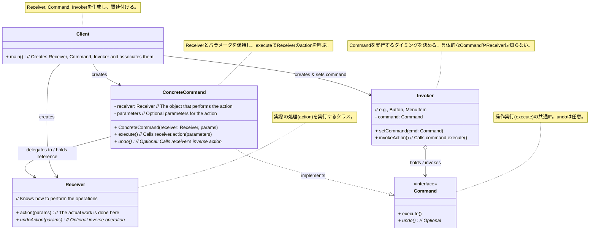

**目次**

- [デザインパターン詳細解説：Command パターン](#デザインパターン詳細解説command-パターン)
- [1. Command パターンとは？ ～目的と解決したい問題～](#1-command-パターンとは-目的と解決したい問題)
  - [1.1 このパターンを一言で言うと？（核心的な目的）](#11-このパターンを一言で言うと核心的な目的)
  - [1.2 なぜ Command パターンが必要なのか？（動機と背景）](#12-なぜ-command-パターンが必要なのか動機と背景)
    - [1.2.1 要求と実行の密結合が引き起こす問題](#121-要求と実行の密結合が引き起こす問題)
    - [1.2.2 操作（リクエスト）自体をオブジェクトとして扱いたい](#122-操作リクエスト自体をオブジェクトとして扱いたい)
  - [1.3 このパターンで解決できること（メリットの要約）](#13-このパターンで解決できることメリットの要約)
- [2. パターンの構造と実装 ～どのように実現するか～](#2-パターンの構造と実装-どのように実現するか)
  - [2.1 登場人物とその役割（クラス図と解説）](#21-登場人物とその役割クラス図と解説)
  - [2.2 実装のポイント：操作のカプセル化と委譲](#22-実装のポイント操作のカプセル化と委譲)
  - [2.3 コード例：具体的なシナリオでの実装](#23-コード例具体的なシナリオでの実装)
    - [2.3.1 シナリオ設定（例：シンプルなリモコン）](#231-シナリオ設定例シンプルなリモコン)
    - [2.3.2 サンプルコード（Java での例）](#232-サンプルコードjava-での例)
    - [2.3.3 コードのポイント解説](#233-コードのポイント解説)
- [3. Command パターンの利点 ～採用するメリット～](#3-command-パターンの利点-採用するメリット)
  - [3.1 要求元と実行者の分離（疎結合）](#31-要求元と実行者の分離疎結合)
  - [3.2 操作のオブジェクト化による柔軟な管理](#32-操作のオブジェクト化による柔軟な管理)
  - [3.3 Undo/Redo 機能の実装基盤](#33-undoredo-機能の実装基盤)
  - [3.4 拡張性の向上（OCP 準拠）](#34-拡張性の向上ocp-準拠)
  - [3.5 マクロコマンドによる組み立て可能性](#35-マクロコマンドによる組み立て可能性)
- [4. 注意点とトレードオフ ～適用前に考えるべきこと～](#4-注意点とトレードオフ-適用前に考えるべきこと)
  - [4.1 クラス数の増加](#41-クラス数の増加)
  - [4.2 実装のオーバーヘッドと複雑さ](#42-実装のオーバーヘッドと複雑さ)
  - [4.3 デバッグの難しさ（場合による）](#43-デバッグの難しさ場合による)
  - [4.4 「神」コマンドのリスク](#44-神コマンドのリスク)
- [5. 実装上のヒントと考慮事項 ～より良く使うために～](#5-実装上のヒントと考慮事項-より良く使うために)
  - [5.1 Command の粒度を適切に保つ](#51-command-の粒度を適切に保つ)
  - [5.2 Receiver の役割を明確にする](#52-receiver-の役割を明確にする)
  - [5.3 Undo/Redo の実装戦略](#53-undoredo-の実装戦略)
  - [5.4 コマンドのライフサイクルとパラメータ](#54-コマンドのライフサイクルとパラメータ)
  - [5.5 言語機能やライブラリの活用](#55-言語機能やライブラリの活用)
- [6. 他のパターンとの関連 ～比較と組み合わせ～](#6-他のパターンとの関連-比較と組み合わせ)
  - [6.1 似ているパターンとの比較](#61-似ているパターンとの比較)
  - [6.2 組み合わせると効果的なパターン](#62-組み合わせると効果的なパターン)
- [7. リファクタリング：いつ Command パターンを導入するか](#7-リファクタリングいつ-command-パターンを導入するか)
  - [7.1 導入のきっかけとなる「コードの不吉な臭い」や状況変化](#71-導入のきっかけとなるコードの不吉な臭いや状況変化)
  - [7.2 段階的なリファクタリング手順（概要）](#72-段階的なリファクタリング手順概要)
- [8. まとめ ～ Command パターンの本質～](#8-まとめ--command-パターンの本質)

# デザインパターン詳細解説：Command パターン

# 1. Command パターンとは？ ～目的と解決したい問題～

## 1.1 このパターンを一言で言うと？（核心的な目的）

Command パターンは、「**実行されるべき操作（アクション）を、それ自身の情報（実行内容、パラメータなど）を含んだオブジェクトとしてカプセル化する**」デザインパターンです。これにより、操作の**要求**と**実行**を分離し、操作をオブジェクトとして柔軟に扱えるようにします。

## 1.2 なぜ Command パターンが必要なのか？（動機と背景）

ソフトウェア開発において、ある処理を実行する「要求」が発生する場面と、その要求された処理を「実行」する場面を、時間的または空間的に分離したい、あるいは要求そのものをデータとして扱いたい、というニーズがしばしば生じます。

### 1.2.1 要求と実行の密結合が引き起こす問題

単純な実装では、操作を要求する側（たとえば、GUI のボタン `Invoker`）が、操作を実行するオブジェクト (`Receiver`) の具体的なメソッドを直接呼び出すことが多いです。

```java
// ボタンが直接ドキュメントの保存メソッドを呼び出す例
buttonSave.addActionListener(event -> {
    document.save(); // ★ Invoker (button) が Receiver (document) を直接知っている
});
```

この直接的な呼び出しには、以下のような問題があります。

- **密結合:** `Invoker` (ボタン) が `Receiver` (ドキュメント) の具体的なクラスやメソッドを知っている必要があり、両者の**結合度が高く**なります。もし `Receiver` のインターフェースや実装が変わると、`Invoker` 側の修正も必要になる可能性があります。
- **操作の柔軟な管理が困難:**
  - 実行した操作を後で**取り消したい (Undo)**。
  - 複数の操作を**記録してまとめて実行（マクロ）**したい。
  - 操作の要求を**キューに入れて後で非同期に実行**したい。
  - 操作要求を**ログに記録**したい。
  - 操作要求を**ネットワーク経由で送信**したい。
    このような要求に、直接的なメソッド呼び出しだけで対応するのは非常に困難です。

### 1.2.2 操作（リクエスト）自体をオブジェクトとして扱いたい

もし、「ファイルを保存する」「テキストを切り取る」「印刷する」といった**操作の「要求」そのもの**を、データ（パラメータ）と一緒に**オブジェクトとして表現**できれば、上記のような様々な要求に柔軟に対応できるようになります。

オブジェクトになった操作は、変数に格納したり、リストやキューに入れたり、ログに記録したり、ネットワークで送受信したりすることが可能になります。また、そのオブジェクトに `execute()` メソッドだけでなく `undo()` メソッドを持たせることで、操作の取り消しも実現できます。

Command パターンは、この「**操作のオブジェクト化**」を実現するためのデザインパターンです。

## 1.3 このパターンで解決できること（メリットの要約）

Command パターンを適用することで、以下のようなメリットが期待できます。

- **要求元 (`Invoker`) と実行者 (`Receiver`) を完全に分離**できる（疎結合）。
- **操作（リクエスト）をオブジェクトとして扱える**ようになり、パラメータ化、キューイング、ロギングなどが可能になる。
- **Undo/Redo 機能**を実装するための基盤を提供できる。
- **マクロ機能**（複数のコマンドの組み合わせ）を容易に実現できる。
- **非同期処理**や**遅延実行**の仕組みを構築しやすくなる。

---

# 2. パターンの構造と実装 ～どのように実現するか～

Command パターンは、「操作の要求」をオブジェクトとしてカプセル化することで、要求元と実行者を分離します。この章では、その具体的な構造と実装方法について見ていきましょう。

## 2.1 登場人物とその役割（クラス図と解説）

Command パターンは、主に以下の 5 つの登場人物（役割）から構成されます。

- **`Command`（命令インターフェース）:**
  - **役割:** すべての具体的なコマンドオブジェクト (`ConcreteCommand`) が実装すべき**共通のインターフェース**を定義します。
  - **主な定義:** 操作を実行するためのメソッド、通常は `execute()` という名前のメソッドを宣言します。オプションとして、操作を取り消すための `undo()` メソッドなどを宣言することもあります。
- **`ConcreteCommand`（具体的な命令）:**
  - **役割:** `Command` インターフェースを実装し、**特定の操作を実行するための具体的な情報**をカプセル化します。
  - **実装:**
    - 操作の対象となるオブジェクトである **`Receiver` への参照**を持ちます。
    - 操作を実行するために必要な**パラメータ**を保持することもあります。
    - `execute()` メソッドが呼び出された際に、保持している `Receiver` オブジェクトの**適切なメソッドを呼び出して**、実際の処理を実行します。
    - `undo()` メソッドが定義されている場合は、`execute()` で行った操作を取り消すためのロジックを実装します。
- **`Receiver`（受信者、実行者）:**
  - **役割:** `Command` オブジェクトからの要求を受けて、**実際のビジネスロジックや処理を実行する**オブジェクトです。
  - **実装:** 要求された操作を実行するための具体的なメソッド（例: `turnOn()`, `saveFile()`, `pasteText()` など）を持ちます。`Command` パターンの他の登場人物については知りません。
- **`Invoker`（起動者、依頼者）:**
  - **役割:** `Command` オブジェクトを**保持し、その実行タイミングを決定**するオブジェクトです。`execute()` メソッドを呼び出すことで、コマンドの実行を**起動**します。
  - **例:** GUI のボタン、メニュー項目、キーボードショートカットハンドラ、コマンドキュー、マクロ記録機能など。
  - **実装:** `Command` オブジェクト（またはそのリストやキュー）への参照を持ちます。重要なのは、`Invoker` は**具体的な `ConcreteCommand` や `Receiver` のことを知る必要がなく**、`Command` インターフェースの `execute()` メソッドを呼び出すだけである、という点です。
- **`Client`（利用者）:**
  - **役割:** システムの**セットアップ**を担当します。
  - **実装:**
    - `Receiver` オブジェクトを生成します。
    - `ConcreteCommand` オブジェクトを生成し、それに `Receiver` オブジェクトと必要なパラメータを設定します。
    - 生成した `Command` オブジェクトを、適切な `Invoker` オブジェクトに登録（関連付け）します。



_図: Command パターンのクラス図_

## 2.2 実装のポイント：操作のカプセル化と委譲

- **操作のカプセル化:** `ConcreteCommand` オブジェクトが、特定の操作を実行するために必要なすべての情報（どの `Receiver` の、どのメソッドを、どのパラメータで呼び出すか）を**内部に保持（カプセル化）**します。これにより、操作自体が独立したオブジェクトとして扱えるようになります。
- **`Invoker` の独立性:** `Invoker` は `Command` インターフェースにのみ依存し、具体的な `ConcreteCommand` や `Receiver` からは完全に独立します。これにより、`Invoker` を変更することなく、実行するコマンドを自由に入れ替えることができます。
- **`Receiver` への委譲:** `ConcreteCommand` の `execute()` メソッドの主な役割は、保持している `Receiver` オブジェクトの適切なメソッドを呼び出して、**実際の処理を委譲する**ことです。`Command` オブジェクト自身が複雑なビジネスロジックを持つことは通常ありません。
- **Undo 機能の実装:** Undo 機能を実現する場合、`ConcreteCommand` は `execute()` を実行する前の `Receiver` の状態を保存しておくか、あるいは `execute()` とは逆の操作を行うロジックを `undo()` メソッド内に実装する必要があります。状態保存には Memento パターンが利用されることもあります。

## 2.3 コード例：具体的なシナリオでの実装

### 2.3.1 シナリオ設定（例：シンプルなリモコン）

照明 (`Light`) のオンとオフを操作できる、ボタンが 1 つだけのシンプルなリモコン (`SimpleRemoteControl`) を考えます。ボタンが押されたときに実行される操作（オンにするか、オフにするか）を、リモコン自身が知ることなく、外部から設定できるようにします。

### 2.3.2 サンプルコード（Java での例）

```java
// 1. Receiver: 操作対象のオブジェクト
class Light {
    private String location;
    public Light(String location) { this.location = location; }
    public void turnOn() { System.out.println(location + " の照明をオンにしました。"); }
    public void turnOff() { System.out.println(location + " の照明をオフにしました。"); }
}

// 2. Command インターフェース
interface Command {
    void execute();
    // void undo(); // Undoが必要なら追加
}

// 3. ConcreteCommand: 具体的な操作
class LightOnCommand implements Command {
    private Light light; // Receiver への参照
    public LightOnCommand(Light light) { this.light = light; } // Receiver を設定

    @Override
    public void execute() {
        light.turnOn(); // Receiver のメソッドを呼び出す
    }
    // @Override public void undo() { light.turnOff(); }
}

class LightOffCommand implements Command {
    private Light light; // Receiver への参照
    public LightOffCommand(Light light) { this.light = light; } // Receiver を設定

    @Override
    public void execute() {
        light.turnOff(); // Receiver のメソッドを呼び出す
    }
    // @Override public void undo() { light.turnOn(); }
}

// 4. Invoker: コマンドを実行するもの (リモコンのボタン)
class SimpleRemoteControl {
    private Command slot; // 実行する Command オブジェクトを保持

    // 実行する Command を設定するメソッド
    public void setCommand(Command command) {
        this.slot = command;
    }

    // ボタンが押されたら、設定されている Command を実行する
    public void buttonWasPressed() {
        System.out.println("リモコンのボタンが押されました...");
        if (slot != null) {
            slot.execute(); // ★ Command の execute を呼び出すだけ
        } else {
            System.out.println("コマンドが設定されていません。");
        }
    }
    // public void undoButtonWasPressed() { if (slot != null) slot.undo(); }
}

// 5. Client: セットアップを行う
public class CommandClient {
    public static void main(String[] args) {
        SimpleRemoteControl remote = new SimpleRemoteControl(); // Invoker を生成
        Light livingRoomLight = new Light("リビング"); // Receiver を生成

        // --- 照明をオンにする操作をセットアップ ---
        // ConcreteCommand を生成し、Receiver (livingRoomLight) を設定
        Command lightOn = new LightOnCommand(livingRoomLight);
        // Invoker (remote) に Command を設定
        remote.setCommand(lightOn);
        // ボタンを押す -> Invoker が Command を実行 -> Command が Receiver を操作
        remote.buttonWasPressed();

        System.out.println("---");

        // --- 照明をオフにする操作をセットアップ ---
        Command lightOff = new LightOffCommand(livingRoomLight);
        remote.setCommand(lightOff);
        remote.buttonWasPressed();

        // RemoteControl (Invoker) は、Light クラスや LightOn/OffCommand クラスのことを
        // 一切知る必要がなく、Command インターフェースだけを知っていれば動作する。
    }
}
```

### 2.3.3 コードのポイント解説

- `Light` が `Receiver` として、実際のオン/オフ操作を担当します。
- `Command` が共通インターフェース、`LightOnCommand` と `LightOffCommand` が `ConcreteCommand` です。各 `ConcreteCommand` は、対応する `Light` オブジェクトへの参照を持ち、`execute` メソッド内で `light.turnOn()` または `light.turnOff()` を呼び出します。
- `SimpleRemoteControl` が `Invoker` です。`setCommand` で実行する `Command` を受け取り、`buttonWasPressed` でその `Command` の `execute` を呼び出します。リモコン自身は、照明を操作していることや、オン/オフの具体的な処理を知りません。
- `CommandClient` が `Client` として、`Light`, `LightOn/OffCommand`, `SimpleRemoteControl` を生成し、それらを結びつける（`remote.setCommand(...)`）役割を担います。

これにより、リモコン (`Invoker`) と照明 (`Receiver`) が完全に分離され、リモコンに設定する `Command` を変えるだけで、同じボタンで異なる操作（例えば、別の家電を操作するコマンド）を実行させることも可能になります。

---

# 3. Command パターンの利点 ～採用するメリット～

Command パターンを適用することで、操作の要求と実行を分離し、システムに高い柔軟性をもたらす多くのメリットが得られます。

## 3.1 要求元と実行者の分離（疎結合）

これが Command パターンの最も基本的なメリットです。操作を要求する側（`Invoker`）と、その操作を実際に実行する側（`Receiver`）を**完全に分離**することができます。

- `Invoker` は、`Command` インターフェース（通常は `execute()` メソッド）のみを知っていればよく、具体的な `ConcreteCommand` クラスや `Receiver` クラスについて知る必要がありません。
- `Receiver` は、`Invoker` や `Command` の存在を意識する必要がなく、自身のビジネスロジックを実行するメソッドを提供するだけで済みます。

この疎結合により、`Invoker` と `Receiver` をそれぞれ独立して変更・拡張・再利用することが容易になります。例えば、`Invoker`（ボタン）を変更せずに、実行するコマンド（機能）を後から差し替えたり、`Receiver`（ビジネスロジック）を変更しても、`Invoker` に影響を与えにくくなります。

## 3.2 操作のオブジェクト化による柔軟な管理

操作（リクエスト）自体が `Command` オブジェクトとしてカプセル化されるため、操作を**第一級オブジェクト (First-Class Object)** として扱えるようになります。これにより、以下のような様々な柔軟な操作管理が可能になります。

- **パラメータ化:** 異なるコマンドオブジェクトをメソッドの引数として渡したり、設定として保持したりできます。
- **キューイング:** コマンドオブジェクトをキュー（待ち行列）に格納しておき、後で順番に取り出して実行する（非同期処理、タスクスケジューリングなど）。
- **ロギング:** 実行されたコマンドオブジェクトをログに記録し、操作履歴を残す。
- **永続化:** コマンドオブジェクトの状態を保存しておき、後で復元して再実行する。
- **ネットワーク転送:** コマンドオブジェクトをシリアライズしてネットワーク経由で送信し、リモートで実行する。

## 3.3 Undo/Redo 機能の実装基盤

Command パターンは、操作の**取り消し（Undo）** や **再実行（Redo）** 機能を実装するための強力な基盤を提供します。

`Command` インターフェースに `undo()` メソッドを追加し、各 `ConcreteCommand` に `execute()` とは逆の操作を行うロジックを実装します。実行したコマンドオブジェクトの履歴をスタックなどで管理しておけば、

- Undo 要求があった場合: 最後に実行したコマンドをスタックから取り出し、その `undo()` メソッドを呼び出す。
- Redo 要求があった場合: Undo で戻したコマンドを別のスタックに保持しておき、Redo 要求時に取り出して再度 `execute()` を呼び出す。

といった実装が可能になります。状態の保存が必要な場合は Memento パターンと組み合わせることもあります。

## 3.4 拡張性の向上（OCP 準拠）

新しい操作を追加したい場合、既存の `Invoker` や `Receiver` のコードを変更することなく、**新しい `ConcreteCommand` クラスを作成**し、それを `Client` が生成して `Invoker` に設定するだけで対応できます。これは**オープン/クローズドの原則 (OCP)** に適合しており、システムの拡張性を高めます。

## 3.5 マクロコマンドによる組み立て可能性

複数のコマンドオブジェクトをまとめて、**一連の操作として実行する「マクロコマンド」** を容易に作成できます。これは **Composite パターン** と組み合わせることで実現できます。マクロコマンド自身も `Command` インターフェースを実装し、その `execute()` メソッド内で保持している個々のコマンドの `execute()` を順番に呼び出すように実装します。これにより、複雑な操作の組み合わせを単一のコマンドとして扱うことができます。

これらのメリットにより、Command パターンは、操作の実行をより柔軟に、かつ高度に制御・管理する必要がある場合に、非常に有効な設計ソリューションとなります。

---

# 4. 注意点とトレードオフ ～適用前に考えるべきこと～

Command パターンは操作の分離と柔軟な管理に多くの利点をもたらしますが、導入にあたってはいくつかの注意点と考慮すべきトレードオフが存在します。

## 4.1 クラス数の増加

Command パターンの最も分かりやすいトレードオフは、**クラス数が確実に増加する**ことです。実行したい**操作の種類ごとに `ConcreteCommand` クラスを作成する**必要があるため、操作の種類が多いシステムでは、多数の小さなコマンドクラスが生まれることになります。

もし、システムが扱う操作の種類が非常に少なく、かつ Undo/Redo やキューイングといった高度な管理機能も不要な、ごく単純なメソッド呼び出しのケースであれば、Command パターンを導入することが**過剰設計**となり、かえってコードベースを複雑にしてしまう可能性があります。単純なコールバック関数やラムダ式で十分に目的を達成できる場合もあります。

## 4.2 実装のオーバーヘッドと複雑さ

単純なメソッド呼び出しと比較すると、Command パターンでは間に `Command` オブジェクトという**間接層**が挟まることになります。これにより、以下のオーバーヘッドや複雑さが生じる可能性があります。

- **コード量の増加:** 各 `ConcreteCommand` クラスの実装（`Receiver` の保持、`execute` メソッドでの委譲など）は、定型的であるとはいえ、記述するコード量は増えます。
- **実行時オーバーヘッド:** `Invoker` → `Command.execute()` → `Receiver.action()` というメソッド呼び出しの連鎖は、直接 `Invoker` → `Receiver.action()` と呼び出す場合に比べて、わずかながら実行時のオーバーヘッド（パフォーマンスへの影響）があります。通常は無視できるレベルですが、極端に性能が重要な箇所では考慮が必要かもしれません。
- **Undo/Redo 実装の複雑さ:** Undo/Redo 機能を実現する場合、`ConcreteCommand` に状態を保持したり、逆操作を実装したりする必要があり、その実装は複雑になりがちです。特に、元に戻せない操作（外部システムへの影響など）の扱いには注意が必要です。

## 4.3 デバッグの難しさ（場合による）

処理の流れが `Invoker` → `Command` → `Receiver` と分離・委譲されるため、デバッグ時に**処理のステップを追うのが少しだけ煩雑になる**可能性があります。どの `ConcreteCommand` が実行され、どの `Receiver` のどのメソッドが呼び出されたのかを把握する必要があります。特に、コマンドがキューに入れられて非同期に実行される場合などは、問題発生時の原因特定がより難しくなることがあります。

## 4.4 「神」コマンドのリスク

もし、一つの `ConcreteCommand` クラスが、あまりにも多くのパラメータを保持したり、`execute` メソッド内で複雑すぎるロジック（複数の `Receiver` メソッド呼び出しや条件分岐など）を持っていたりすると、そのコマンドクラス自体が**複雑で巨大な「神」コマンド**になってしまう可能性があります。`ConcreteCommand` は、可能な限り**単一の、具体的な操作**に責任を持つように設計することが望ましいです。必要であれば、より小さなコマンドに分割したり、マクロコマンド（Composite パターン）を利用したりすることを検討します。

これらの注意点を理解し、Command パターンを導入するメリット（疎結合、柔軟な操作管理、Undo/Redo など）が、これらのトレードオフ（クラス数増加、複雑さ）を上回るかどうかを、解決したい問題の性質やシステムの要件に照らして慎重に判断することが重要です。

---

# 5. 実装上のヒントと考慮事項 ～より良く使うために～

Command パターンを効果的に実装し、そのメリットを最大限に引き出すためには、いくつかの実践的なヒントや考慮事項があります。

## 5.1 Command の粒度を適切に保つ

前章の注意点でも触れましたが、`ConcreteCommand` クラスは、可能な限り**単一の、具体的な操作**を表すように設計することが重要です。一つのコマンドが多くのことをやりすぎると、そのコマンド自体の再利用性やテスト容易性が低下し、複雑さが増してしまいます。

- **例:** 「ユーザー情報を取得し、更新し、ログを記録する」という一連の処理を一つのコマンドにするのではなく、「ユーザー情報取得コマンド」「ユーザー情報更新コマンド」「ログ記録コマンド」のように分割し、必要であればこれらを組み合わせる（マクロコマンドなど）方が、柔軟性が高まります。

コマンドの粒度が適切であれば、それぞれのコマンドがシンプルになり、管理しやすくなります。

## 5.2 Receiver の役割を明確にする

`Command` オブジェクトは操作の要求をカプセル化しますが、**実際のビジネスロジックやドメイン知識は `Receiver` オブジェクトが担当**します。`ConcreteCommand` の `execute` メソッドは、`Receiver` のメソッドを呼び出すことに専念し、自身で複雑なロジックを持つべきではありません。

- `Receiver` は、コマンドパターンとは独立して設計・テストできるべきです。
- `Command` は、`Receiver` のどのメソッドをどのパラメータで呼び出すか、という「指示」に集中します。

この役割分担を明確にすることで、関心の分離が保たれ、各クラスの責任が明確になります。

## 5.3 Undo/Redo の実装戦略

Undo/Redo 機能は Command パターンの強力な応用例ですが、その実装にはいくつかの戦略があります。

- **状態の保存 (Memento パターン):** `execute` を実行する前に `Receiver` の状態を Memento オブジェクトとして保存しておき、`undo` ではその Memento を使って状態を復元する方法。状態が複雑な場合に有効ですが、状態保存のコストがかかります。
- **逆操作の実装:** `execute` とは逆の効果を持つ操作を `undo` メソッドとして実装する方法。状態保存は不要ですが、すべての操作に対して逆操作を定義できるとは限りません。また、逆操作の実装が複雑になることもあります。
- **トランザクションログ:** 実行したコマンド（とパラメータ）のログを記録しておき、Undo/Redo はそのログに基づいて操作を再現または取り消す方法。

どの戦略が良いかは、アプリケーションの性質や Undo/Redo の要求レベルによって異なります。

## 5.4 コマンドのライフサイクルとパラメータ

- **コマンドインスタンスの再利用:** もしコマンドが状態を持たない（ステートレス）場合、同じ種類のコマンドインスタンスを再利用できる可能性があります（Flyweight パターンの適用）。しかし、コマンドが操作固有のパラメータを持つ場合や、Undo のために状態を保持する必要がある場合は、通常、操作ごとに新しいコマンドインスタンスを生成します。
- **パラメータの渡し方:** 操作に必要なパラメータを、コマンド生成時に `ConcreteCommand` のフィールドとして保持させるのが一般的です。これにより、`execute` メソッドのシグネチャをシンプル（例: 引数なし）に保つことができます。

## 5.5 言語機能やライブラリの活用

- **関数型インターフェースとラムダ式 (Java 8+ など):** `Command` インターフェースが `execute` メソッド 1 つだけを持つ場合（関数型インターフェース）、`ConcreteCommand` クラスを明示的に作成する代わりに、ラムダ式やメソッド参照を使ってより簡潔にコマンドを表現できることがあります。
  ```java
  // 例: ラムダ式を使ったコマンド設定
  Command lightOnLambda = () -> livingRoomLight.turnOn();
  remote.setCommand(lightOnLambda);
  remote.buttonWasPressed();
  ```
  ただし、Undo 機能が必要な場合や、コマンド自体が状態を持つ必要がある場合は、個別のクラスとして実装する方が適切な場合が多いです。
- **既存のライブラリ:** GUI フレームワーク（Swing, JavaFX, WPF など）には、アクションリスナーやコマンドバインディングといった形で、Command パターンに基づいた（あるいは類似した）仕組みが組み込まれていることがよくあります。これらの既存の仕組みを活用することも有効です。

これらのヒントを参考に、状況に応じて最適な実装方法を選択し、Command パターンを効果的に活用してください。

---

# 6. 他のパターンとの関連 ～比較と組み合わせ～

Command パターンは、他のデザインパターンと連携して使われることで、より強力な機能を実現したり、特定の設計課題を解決したりする上で役立ちます。また、他のパターンと比較することで、その役割や特徴がより明確になります。

## 6.1 似ているパターンとの比較

Command パターン自体は「操作のオブジェクト化」というユニークな目的を持っていますが、関連する概念を持つパターンと比較してみましょう。

- **Strategy パターン:**
  - **類似点:** どちらも特定の振る舞い（アルゴリズムや操作）をオブジェクトとしてカプセル化します。
  - **違い:** 主な目的が異なります。Strategy は**アルゴリズムそのものを交換可能にする**ことに焦点を当て、クライアントが Context に Strategy を設定します。Command は**操作の要求（リクエスト）をオブジェクト化**し、要求元と実行者を分離することに焦点を当てます。Command は Undo/Redo やキューイングといった操作管理機能を持つことが多いですが、Strategy は通常持ちません。
- **Adapter パターン:**
  - **違い:** Adapter は**インターフェースの不適合を解決**するのが目的です。既存のクラスのインターフェースを別のインターフェースに変換します。Command は操作を実行するための**統一インターフェース (`execute`)** を提供し、要求と実行を分離します。インターフェース変換が主目的ではありません。
- **Observer パターン:**
  - **違い:** Observer は、**状態の変化を監視し、通知する**仕組みを提供します。Subject の状態変化が Observer に通知されます。Command は**操作要求**をカプセル化します。状態変化の通知が目的ではありません。（ただし、Observer が通知を受けて Command を実行する、という連携はありえます）

## 6.2 組み合わせると効果的なパターン

Command パターンは、以下のようなパターンと効果的に組み合わせることができます。

- **Composite パターン:**
  - **連携:** 複数の `Command` オブジェクトをまとめて、単一の**マクロコマンド**として扱いたい場合に Composite パターンが役立ちます。`MacroCommand` クラスも `Command` インターフェースを実装し、その `execute` メソッド内で保持している子コマンドの `execute` を順番に呼び出すように実装します。Undo をサポートする場合は、逆順で子コマンドの `undo` を呼び出す必要があります。
- **Memento パターン:**
  - **連携:** Command パターンで **Undo 機能**を実装する際に、操作前の `Receiver` の状態を保存・復元するために Memento パターンがしばしば利用されます。`ConcreteCommand` は `execute` を実行する前に `Receiver` から Memento を取得して保持し、`undo` が呼ばれたらその Memento を使って `Receiver` の状態を元に戻します。
- **Prototype パターン:**
  - **連携:** 同じ種類のコマンドオブジェクト（ただし、パラメータや `Receiver` が異なる可能性がある）を効率的に生成したい場合に、Prototype パターンを利用して**コマンドオブジェクト自体をコピー**する、という使い方が考えられます。例えば、コピー可能なコマンドテンプレートを用意しておくようなケースです。
- **Factory パターン (Factory Method, Abstract Factory):**
  - **連携:** `ConcreteCommand` オブジェクトの生成プロセスが複雑な場合や、生成するコマンドの種類を柔軟に切り替えたい場合に、Factory パターンを利用してコマンドオブジェクトの生成をカプセル化することができます。
- **Decorator パターン:**
  - **連携:** コマンドの `execute` や `undo` の前後に、ログ記録やトランザクション管理などの**追加的な責務（機能）を動的に付与**したい場合に、Command オブジェクトを Decorator パターンで修飾（ラップ）することが考えられます。

これらのパターンとの関連性や組み合わせ方を理解することで、Command パターンをより洗練された設計の中で活用し、複雑な要求に応えるソリューションを構築することが可能になります。

---

# 7. リファクタリング：いつ Command パターンを導入するか

Command パターンは、システムの機能拡張や要求の変化に伴い、既存のコードを**リファクタリング**して導入されることも多いパターンです。操作の実行方法が複雑化したり、Undo/Redo のような高度な機能が必要になったりした場合に、Command パターンの導入が有効な改善策となることがあります。

## 7.1 導入のきっかけとなる「コードの不吉な臭い」や状況変化

既存のコードベースに以下のような兆候や状況の変化が見られた場合、Command パターンの導入を検討する価値があります。

- **Invoker と Receiver の密結合:**
  - **症状:** GUI のボタンやメニュー項目などの `Invoker` が、特定のビジネスロジッククラス (`Receiver`) のメソッドを直接呼び出しており、両者が強く依存し合っている。`Invoker` が `Receiver` の詳細を知りすぎている。
  - **問題:** `Invoker` の再利用性が低い。`Receiver` の変更が `Invoker` に影響する。実行する操作を後から変更するのが難しい。
  - **解決策:** Command パターンを導入し、`Invoker` が `Command` インターフェースのみに依存するように変更します。具体的な操作は `ConcreteCommand` にカプセル化し、`Receiver` への委譲を行います。
- **パラメータ化されたアクションの必要性:**
  - **症状:** 実行したい操作の種類やパラメータが、実行時や設定によって変わる。これらの操作要求をキューに入れたり、ログに記録したり、ネットワークで送信したりする必要が出てきた。
  - **問題:** 単純なメソッド呼び出しでは、操作要求自体をデータとして扱うことが難しい。
  - **解決策:** Command パターンを導入し、操作要求を `Command` オブジェクトとしてカプセル化します。これにより、操作をオブジェクトとして受け渡し、保存、実行できるようになります。
- **Undo/Redo 機能の要求:**
  - **症状:** アプリケーションに「元に戻す」「やり直し」機能を追加する必要が出てきた。
  - **問題:** 直接的なメソッド呼び出しでは、過去の操作を取り消すための情報を管理するのが非常に困難です。
  - **解決策:** Command パターンを導入し、各 `ConcreteCommand` に `undo()` 操作を実装します。実行されたコマンドの履歴を管理することで、Undo/Redo を実現します。
- **複雑なコールバック処理:**
  - **症状:** イベントハンドラやコールバック関数の中身が複雑になり、複数の処理ステップやパラメータの受け渡しが必要になっている。
  - **問題:** コールバック処理が肥大化し、テストや保守が困難になります。
  - **解決策:** コールバックで実行されるべき処理を `ConcreteCommand` として抽出し、イベントハンドラは単純にその `Command` の `execute` を呼び出すだけにします。

これらの状況は、操作の要求と実行の間に、より明確な分離と柔軟な管理メカニズムが必要であることを示唆しており、Command パターンが効果的な解決策となり得ます。

## 7.2 段階的なリファクタリング手順（概要）

既存のコード（特に `Invoker` が `Receiver` を直接呼び出しているような場合）に Command パターンを導入する際の、一般的なリファクタリング手順の概要は以下の通りです。（テストによる安全確保が前提です）

1. **`Command` インターフェースの作成:**
   - 操作を実行するための共通メソッド（例: `execute()`）を持つ `Command` インターフェースを定義します。必要であれば `undo()` なども宣言します。
2. **`ConcreteCommand` クラスの作成:**
   - 置き換えたい各操作について、`Command` インターフェースを実装する `ConcreteCommand` クラスを作成します。
   - 各 `ConcreteCommand` は、対応する `Receiver` オブジェクトへの参照と、操作に必要なパラメータを保持するようにします（コンストラクタで受け取るのが一般的）。
   - `execute` メソッド内に、元の `Invoker` が行っていた `Receiver` のメソッド呼び出しロジックを**移動 (Move Method)** します。
   - 必要であれば `undo` メソッドも実装します。
3. **`Invoker` の修正:**
   - `Invoker` が `Receiver` を直接参照・呼び出ししていた部分を削除します。
   - 代わりに、`Command` インターフェース型のフィールドを追加し、`Command` オブジェクトを保持できるようにします。
   - `Invoker` がアクションを起動する箇所（例: ボタンのクリックハンドラ）で、保持している `Command` オブジェクトの `execute()` メソッドを呼び出すように修正します。
4. **`Client` (セットアップコード) の修正:**
   - `Receiver` オブジェクトを生成します。
   - 適切な `ConcreteCommand` オブジェクトを生成し、`Receiver` とパラメータを設定します。
   - 生成した `Command` オブジェクトを `Invoker` に設定（登録）します。
5. **テスト:** 各ステップの後、および最終的に、テストを実行してリファクタリングによって外部から見た振る舞いが変わっていないこと、そして `Invoker` が正しく `Command` を実行することを確認します。

このリファクタリングプロセスを通じて、`Invoker` と `Receiver` が分離され、操作がオブジェクトとして扱えるようになり、システムの柔軟性と拡張性が向上します。

---

# 8. まとめ ～ Command パターンの本質～

**Command パターン**は、**操作（アクション）の要求をオブジェクトとしてカプセル化**し、それによって**要求元と実行者を分離する**ことを目的とした、振る舞いに関するデザインパターンです。

このパターンを適用することで、

- **要求元 (`Invoker`) と実行者 (`Receiver`) の間の結合度を低く**できる。
- **操作要求をオブジェクトとして扱える**ため、パラメータ化、キューイング、ロギング、永続化、ネットワーク転送などが可能になる。
- **Undo/Redo 機能**や**マクロ機能**の実装が容易になる。
- **非同期処理**や**遅延実行**の基盤となる。
- 新しい操作の**追加が容易**になる（OCP 準拠）。

といった多くのメリットが得られ、システムの**柔軟性、拡張性、保守性**が向上します。

その本質は、「**『～してほしい』というリクエスト自体を、具体的な指示書（Command オブジェクト）として表現し、それを『実行係』（Invoker）に渡して、好きなタイミングで『作業担当者』（Receiver）に実行してもらう**」という、役割分担と間接性の導入にあります。

一方で、操作ごとにコマンドクラスが必要になるため**クラス数が増加**し、単純なメソッド呼び出しに比べて**実装がやや複雑になる**というトレードオフも存在します。特に Undo/Redo の実装は注意が必要です。

Command パターンは、GUI のイベント処理から非同期タスク実行、トランザクション管理まで、非常に幅広い応用範囲を持つ強力なパターンです。操作の実行をより柔軟に制御したい、要求と実行をきれいに分離したいと考えた場合に、この「操作のオブジェクト化」という考え方は、設計上の課題を解決するための有効な選択肢となるでしょう。
