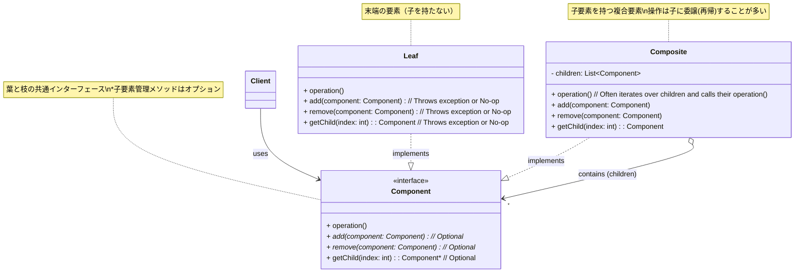

# デザインパターン詳細解説：Composite パターン

# 1. Composite パターンとは？ ～目的と解決したい問題～

## 1.1 このパターンを一言で言うと？（核心的な目的）

Composite パターンは、「**個別のオブジェクト（葉: Leaf）と、それらをまとめた複合オブジェクト（枝: Composite）を、クライアントが区別することなく、同じインターフェースを通じて扱えるようにする**」ためのデザインパターンです。これにより、木構造のような再帰的な階層構造をシンプルに表現し、操作することができます。

## 1.2 なぜ Composite パターンが必要なのか？（動機と背景）

ソフトウェア開発では、物事を階層的に表現したい、つまり「入れ子」構造で扱いたい場面が数多く存在します。ファイルシステムのディレクトリとファイル、GUI のコンテナと部品、組織図の部署と従業員などがその典型例です。

### 1.2.1 部分と全体を区別するコードの複雑さ

このような階層構造を扱う際に、もし「個別の要素（部分）」と「それらをまとめるグループ（全体）」でプログラム上の扱い方（呼び出すメソッドやデータ構造）が異なっていると、利用側のコード（クライアント）は非常に複雑になりがちです。

例えば、ディレクトリ内の全要素のサイズを計算する場合、クライアントは各要素に対して「これはファイルか？それともディレクトリか？」を `if` 文などで判定し、ファイルならサイズを取得、ディレクトリならさらにその中身を再帰的に処理する、といった分岐ロジックを書く必要が出てきます。このような型チェックと分岐処理は、コードを読みにくくし、新しい種類の要素（例えばシンボリックリンク）が追加された場合には、クライアントコードの修正が必要となり、保守性を低下させます。

### 1.2.2 再帰的な構造をシンプルに扱いたい

木構造のような再帰的なデータ構造に対して、操作（例えば、全要素の表示、サイズの合計計算など）を行いたい場合、再帰呼び出しを用いた処理が自然です。しかし、前述のように葉と枝で扱いが異なると、再帰処理のロジックも複雑になりがちです。葉と枝を同じように扱える統一的なインターフェースがあれば、再帰処理を非常にシンプルに記述できます。

### 1.2.3 透過的な操作を実現したい

クライアントコードとしては、操作対象が「個別の部品」なのか「部品の集まり」なのかを**意識せずに（透過的に）**、同じ命令（メソッド呼び出し）で操作できるのが理想的です。例えば、「表示しろ」と命令すれば、ファイルならファイル情報が、ディレクトリならディレクトリ情報とその中身が（再帰的に）表示される、といった具合です。

Composite パターンは、これらの課題を解決するために考案されました。

## 1.3 このパターンで解決できること（メリットの要約）

Composite パターンを適用することで、以下のようなメリットが期待できます。

- **クライアントコードの単純化:** クライアントは個別の要素と複合要素を区別なく、**統一的なインターフェース**で扱える。
- **階層構造の自然な表現:** 木構造のような**再帰的な構造**をシンプルに表現・操作できる。
- **新しい要素の追加容易性:** 新しい種類の要素（Leaf や Composite）を追加する際に、既存のクライアントコードへの影響が少ない（**OCP 準拠**）。

---

# 2. パターンの構造と実装 ～どのように実現するか～

Composite パターンは、個別の要素（葉）と複合的な要素（枝）に共通のインターフェースを持たせることで、クライアントからの透過的な扱いを実現します。その具体的な構造と実装のポイントを見ていきましょう。

## 2.1 登場人物とその役割（クラス図と解説）

Composite パターンは、主に以下の 3 つの役割から構成されます。

- **`Component`（構成要素インターフェース）:**
  - **役割:** 階層構造に含まれるすべてのオブジェクト、つまり「葉」(`Leaf`)と「枝」(`Composite`)の両方が実装すべき**共通のインターフェース**を定義します。クライアントはこのインターフェースを通じて、葉と枝を区別なく操作します。
  - **主な定義:** 階層内のオブジェクトに共通して適用したい操作（例: `operation()`, `display()`, `getSize()` など）を宣言します。
  - **注意点:** 子要素を追加・削除するためのメソッド（`add()`, `remove()` など）をこの共通インターフェースに含めるかどうかは、設計上の重要なトレードオフがあります（後述）。
- **`Leaf`（葉）:**
  - **役割:** 階層構造の**末端**を表す、個別のオブジェクトです。これは「部品」や「ファイル」のように、それ以上の子要素を持たない要素に対応します。
  - **実装:** `Component` インターフェースを実装し、宣言された操作を自身の具体的な振る舞いとして定義します。もし `Component` インターフェースに子要素管理メソッドが宣言されている場合、`Leaf` は通常、これらのメソッドをサポートしない（例えば、例外をスローするか、何もしない）ように実装します。
- **`Composite`（複合要素、枝）:**
  - **役割:** `Leaf` または他の `Composite` といった、**`Component` 型の子要素を内部に保持し、管理する**オブジェクトです。これは「グループ」や「ディレクトリ」、「コンテナ」のように、他の要素をまとめる役割に対応します。
  - **実装:** `Component` インターフェースを実装します。多くの場合、`Component` で宣言された操作（例: `operation()`) は、自身の処理を行った後、内部で保持している**子要素たちに対して再帰的に同じ操作を呼び出し**、その結果を集約する、といった形で実装されます。また、子要素を追加・削除・取得するためのメソッド（`add()`, `remove()`, `getChild()` など）も実装します。



_図: Composite パターンのクラス図_

## 2.2 実装のポイント：共通インターフェースと再帰的委譲

- **共通インターフェース (`Component`) の重要性:** このパターンの中核は、`Leaf` と `Composite` が同じ `Component` インターフェースを実装することにあります。これにより、クライアントはオブジェクトがどちらの型であるかを意識することなく、`Component` 型として透過的に扱うことができます。
- **`Composite` での再帰的委譲:** `Composite` クラスが `Component` インターフェースの操作（例: `operation()`）を実装する際には、**内部で保持している子要素（`children` リスト内の各 `Component`）に対して、同じ `operation()` メソッドを再帰的に呼び出す**ことが一般的です。これにより、木構造全体に対する操作がシンプルに実現できます。（例: ディレクトリのサイズ計算は、内部のファイルやサブディレクトリのサイズを再帰的に合計する）
- **子要素管理メソッドの配置（トレードオフ）:**
  - **`Component` に宣言する（透過的設計）:** `add`, `remove` などを共通インターフェースに入れると、クライアントは `Leaf` も `Composite` も同じように扱え、子要素を追加したい場合に型キャストなどが不要になります。しかし、`Leaf` に対して `add` を呼び出すなど、意味論的に不適切な操作が可能になり、実行時エラー（`UnsupportedOperationException` など）を発生させる必要が出てきます。型安全性がやや低下します。
  - **`Composite` のみに実装する（安全な設計）:** 子要素管理メソッドを `Composite` クラス固有のメソッドとすると、`Leaf` に不適切な操作をすることは防げます。しかし、クライアントが子要素を追加したい場合には、対象オブジェクトが `Composite` であることを確認し、ダウンキャストしてからメソッドを呼び出す必要があり、透過性が損なわれます。
    どちらの設計が良いかは、状況や優先事項（利便性 vs 安全性）によって異なりますが、一般的には、安全な設計の方が推奨されることが多いです。

## 2.3 コード例：具体的なシナリオでの実装

### 2.3.1 シナリオ設定（例：ファイルシステム）

コンピュータのファイルシステムのように、ファイル（Leaf）とディレクトリ（Composite、ファイルや他のディレクトリを含む）から構成される階層構造を考えます。各要素の名前、サイズ（ファイルは自身のサイズ、ディレクトリは含む要素の合計サイズ）、そして階層構造を表示する機能を実現します。

### 2.3.2 サンプルコード（Java での例）

```java
import java.util.ArrayList;
import java.util.List;

// 1. Component インターフェース
interface FileSystemComponent {
    String getName();
    int getSize();
    // display メソッドで階層構造を表示する際にインデントを渡す
    void display(String indent);
}

// 2. Leaf クラス (ファイル)
class FileLeaf implements FileSystemComponent {
    private String name;
    private int size;

    public FileLeaf(String name, int size) {
        this.name = name;
        this.size = size;
    }
    @Override public String getName() { return name; }
    @Override public int getSize() { return size; } // ファイル自身のサイズを返す

    @Override public void display(String indent) {
        System.out.println(indent + "- " + name + " (" + size + " KB)");
    }
}

// 3. Composite クラス (ディレクトリ)
class DirectoryComposite implements FileSystemComponent {
    private String name;
    private List<FileSystemComponent> children = new ArrayList<>(); // 子要素を保持

    public DirectoryComposite(String name) { this.name = name; }
    @Override public String getName() { return name; }

    // ディレクトリ自身のサイズは 0 とし、中身の合計サイズを再帰的に計算
    @Override
    public int getSize() {
        int totalSize = 0;
        for (FileSystemComponent component : children) {
            totalSize += component.getSize(); // ★ 子要素の getSize() を再帰呼び出し
        }
        return totalSize;
    }

    @Override
    public void display(String indent) {
        System.out.println(indent + "+ " + name + " (Total: " + getSize() + " KB)");
        // 子要素の display を再帰的に呼び出す
        for (FileSystemComponent component : children) {
            component.display(indent + "  "); // ★ 子要素の display() を再帰呼び出し
        }
    }

    // 子要素を管理するメソッド (Composite固有)
    public void add(FileSystemComponent component) {
        children.add(component);
    }
    public void remove(FileSystemComponent component) {
        children.remove(component);
    }
    public List<FileSystemComponent> getChildren() {
        return children; // 必要に応じて子要素リストを取得できるようにする
    }
}

// --- Client (利用側) ---
public class CompositeClient {
    public static void main(String[] args) {
        // 木構造を構築
        DirectoryComposite root = new DirectoryComposite("root");
        DirectoryComposite documents = new DirectoryComposite("Documents");
        DirectoryComposite pictures = new DirectoryComposite("Pictures");
        FileSystemComponent file1 = new FileLeaf("report.docx", 150);
        FileSystemComponent file2 = new FileLeaf("budget.xlsx", 200);
        FileSystemComponent pic1 = new FileLeaf("cat.jpg", 1024);
        FileSystemComponent pic2 = new FileLeaf("dog.png", 512);
        DirectoryComposite work = new DirectoryComposite("Work");
        work.add(new FileLeaf("memo.txt", 10));

        // Composite に Leaf や Composite を追加
        root.add(documents);
        root.add(pictures);
        documents.add(file1);
        documents.add(file2);
        documents.add(work); // ディレクトリの中にディレクトリ
        pictures.add(pic1);
        pictures.add(pic2);

        // Client は Component インターフェースを通じて操作する
        // display を呼び出すだけで、階層構造全体が表示される
        System.out.println("--- File System Display ---");
        root.display(""); // 最上位から表示開始

        // 特定のディレクトリの合計サイズも簡単に取得できる
        System.out.println("\nTotal size of Documents directory: " + documents.getSize() + " KB");
        System.out.println("Total size of root directory: " + root.getSize() + " KB");
    }
}
```

### 2.3.3 コードのポイント解説

- `FileLeaf` (葉) と `DirectoryComposite` (枝) は、共通の `FileSystemComponent` インターフェースを実装しています。これにより、クライアントは両者を区別なく `FileSystemComponent` 型として扱うことができます。
- `DirectoryComposite` の `getSize()` メソッドと `display()` メソッドは、内部で保持している `children` リストの各要素（これも `FileSystemComponent` 型）に対して、**再帰的に**同じメソッド (`getSize()`, `display()`) を呼び出しています。これにより、複雑な木構造全体の処理が、シンプルかつエレガントなコードで実現されています。
- クライアントコード (`CompositeClient`) は、`FileSystemComponent` インターフェースのメソッドを呼び出すだけで、対象がファイルかディレクトリかを意識する必要がありません。これが Composite パターンの**透過性**です。
- この例では、子要素管理メソッド (`add`, `remove`) は `DirectoryComposite` クラスにのみ実装されており、「安全な設計」を採用しています。クライアントが `add` を呼び出したい場合は、対象が `DirectoryComposite` であることを確認（またはキャスト）する必要があります。

このように、Composite パターンは共通インターフェースと再帰的な委譲によって、木構造の扱を大幅に単純化します。

---

# 3. Composite パターンの利点 ～採用するメリット～

Composite パターンを適用することで、特に階層的なデータ構造を扱う際に、多くの設計上のメリットが得られます。

## 3.1 クライアントコードの単純化と透過性

これが Composite パターンの最も顕著なメリットです。個別の要素（`Leaf`）と複合的な要素（`Composite`）が共通の `Component` インターフェースを実装するため、クライアント（利用側のコード）は**両者を区別することなく、統一的な方法で操作**できます。

クライアントは、操作対象が葉なのか枝なのかを判定するための `if` 文や型チェック（`instanceof` など）を書く必要がなくなります。これにより、クライアントコードは**非常にシンプル**になり、**可読性**が向上します。クライアントから見ると、葉も枝も同じ `Component` として**透過的に**扱えるのです。

## 3.2 階層構造の柔軟な表現と操作

木構造（ツリー構造）のような**再帰的なデータ構造を自然かつエレガントに表現**できます。`Composite` オブジェクトが他の `Composite` オブジェクトを子要素として持つことができるため、任意の深さの階層構造を柔軟に構築できます。

また、`Composite` が自身への操作を子要素に再帰的に委譲する仕組みにより、階層全体に対する操作（例: 全ノードの描画、全要素の合計値計算など）を、**シンプルで理解しやすい再帰的なコード**で実装できます。

## 3.3 新しいコンポーネントの追加容易性 (OCP 準拠)

新しい種類の要素（新しい `Leaf` クラスや `Composite` クラス）を追加したい場合、`Component` インターフェースを実装する新しいクラスを作成するだけで済みます。クライアントコードは `Component` インターフェースにのみ依存しているため、新しいクラスが追加されても、**既存のクライアントコードを修正する必要は（基本的には）ありません**。

これは、**オープン/クローズドの原則 (OCP)** に適合しており、システムの**拡張性**を高めます。例えば、ファイルシステムに「シンボリックリンク」という新しい種類の要素を追加する場合でも、`SymbolicLinkLeaf` クラスを作成すれば、既存の `display` や `getSize` を呼び出すクライアントコードはそのまま機能し続けるでしょう。

これらの利点により、Composite パターンは、階層構造を持つデータを扱う際の複雑さを軽減し、柔軟で保守しやすく、拡張性の高い設計を実現するための強力な手段となります。

---

# 4. 注意点とトレードオフ ～適用前に考えるべきこと～

Composite パターンは木構造を扱う上で非常に強力ですが、適用する際にはいくつかの注意点や設計上のトレードオフが存在します。これらを理解しておくことが、パターンを効果的に活用するために重要です。

## 4.1 共通インターフェース設計の難しさ（透明性 vs 安全性）

Composite パターンの根幹は `Leaf` と `Composite` の共通インターフェース (`Component`) ですが、このインターフェースに**何を含めるべきか**は慎重に設計する必要があります。特に問題となるのが、**子要素を管理する操作（`add`, `remove`, `getChild` など）**の扱いです。

- **選択肢 1: `Component` に子管理メソッドを含める（透明な設計）**
  - **利点:** クライアントは `Leaf` も `Composite` も完全に同じインターフェースで扱えるため、**透過性が最大**になります。子要素を追加したい場合に、オブジェクトが `Composite` かどうかを気にする必要がありません。
  - **欠点:** `Leaf` オブジェクト（子を持てない）に対しても `add` や `remove` といったメソッドが呼び出せることになってしまいます。`Leaf` クラスではこれらのメソッドを**意味のないものとして実装**（例: 何もしない、あるいは `UnsupportedOperationException` などの例外をスローする）する必要があります。これにより、**コンパイル時の型チェックでは防げない実行時エラーのリスク**が生じ、**型安全性が低下**します。インターフェースに不要なメソッドが含まれることにもなります。
- **選択肢 2: `Component` に子管理メソッドを含めず、`Composite` 固有のメソッドとする（安全な設計）**
  - **利点:** `Leaf` に不適切な操作（子を追加するなど）ができなくなるため、**型安全性が向上**します。`Component` インターフェースは、葉と枝の両方に本当に共通する操作だけに限定され、よりクリーンになります。
  - **欠点:** クライアントが子要素を操作したい場合、対象オブジェクトが `Composite` であることを**明示的に確認し、ダウンキャスト**してから `Composite` 固有のメソッドを呼び出す必要があります。これにより、クライアントコードの**透過性が失われ**、若干複雑になる可能性があります。

どちらの設計が良いかは一概には言えず、プロジェクトの要件や優先順位（利便性 vs 安全性）によって判断が異なります。一般的には、**安全性を重視して選択肢 2 を選ぶ**ことが多いですが、その場合でもクライアント側の条件分岐が増えすぎないような工夫が必要です。

## 4.2 制約の付与が困難

Composite パターンは、`Composite` が任意の `Component`（`Leaf` または他の `Composite`）を子要素として持てる、という非常に柔軟な構造を基本とします。

しかし、場合によっては、「特定の `Composite`（例: 図形グループ）は、特定の種類の `Leaf`（例: 基本図形）しか含めないようにしたい」あるいは「階層の深さを制限したい」といった**制約**を設けたいことがあります。

Composite パターン自体には、このような複雑な制約を強制する組み込みの仕組みはありません。制約を実装するには、`add` メソッド内での型チェックや、他のデザインパターン（例: Builder パターンで構築プロセスを制御する）との組み合わせなど、追加の工夫が必要になります。

## 4.3 パフォーマンスへの影響（再帰処理）

`Composite` の操作が子要素への再帰的な委譲によって実装される場合、階層が非常に深くなると、メソッド呼び出しのスタックが深くなりすぎたり（StackOverflowError のリスク）、処理に時間がかかったりする可能性があります。

特に、頻繁に呼び出される操作（例: GUI の再描画など）で、かつ階層が非常に深い場合には、パフォーマンスへの影響を考慮する必要があるかもしれません。キャッシュの導入や、再帰ではない反復的なアルゴリズムの採用などを検討することもありますが、通常は再帰によるシンプルさのメリットの方が大きい場合が多いです。

## 4.4 過剰適用のリスク

階層構造が非常に単純（例: 深さが 1 段しかない）であったり、`Leaf` と `Composite` で共通化できる操作がほとんどなかったりする場合に Composite パターンを適用すると、共通インターフェースのメリットが薄く、かえって設計が**不必要に複雑化**してしまう可能性があります。

パターンはあくまで問題を解決するための手段です。単純な構造であれば、必ずしも Composite パターンに当てはめる必要はありません。

これらの注意点とトレードオフを理解し、パターンを適用するメリットがデメリットを上回るかを慎重に評価することが、Composite パターンを効果的に活用する鍵となります。

---

# 5. 実装上のヒントと考慮事項 ～より良く使うために～

Composite パターンを実装する際には、その効果を最大限に引き出し、潜在的な問題を回避するために、いくつかのヒントや考慮すべき点があります。

## 5.1 子要素の管理方法

`Composite` クラスは、子要素 (`Component` オブジェクト) のリストを内部で管理する必要があります。このリストをどのように実装・管理するかは、性能や要件に応じて選択します。

- **データ構造の選択:** 子要素を格納するためのデータ構造として、`ArrayList` (Java), `List<T>` (C#), `std::vector` (C++) などが一般的に使われます。要素の追加・削除の頻度、順序の重要性、アクセスパターンなどを考慮して最適なものを選択します。
- **順序の保証:** 子要素の順序が重要である場合（例: GUI コンポーネントの表示順）、リスト系のデータ構造を選択し、順序が保持されるようにします。
- **子要素への参照:** `Composite` は `Component` インターフェース型で子要素への参照を保持します。これにより、具体的な `Leaf` や `Composite` の型を意識せずに済みます。

## 5.2 親への参照（Parent Pointer）

場合によっては、子要素 (`Component`) からその親 (`Composite`) への参照（Parent Pointer）を持たせたいことがあります。これにより、例えば特定の要素から階層を上に辿るような操作が可能になります。

しかし、親への参照を追加すると、以下の点に注意が必要です。

- **循環参照:** 親と子が互いに参照し合う形になり、メモリ管理（特にガベージコレクションがない環境）が複雑になる可能性があります。
- **整合性の維持:** 子要素が `Composite` に追加・削除される際に、親への参照も正しく設定・解除する必要があります。この管理を怠ると、不整合な状態が発生しやすくなります。

親への参照は、本当に必要かどうかを慎重に検討し、導入する場合には整合性維持のロジックを確実に実装する必要があります。

## 5.3 キャッシュによるパフォーマンス最適化

`Composite` の操作（特に `getSize()` のような再帰的な計算）が頻繁に呼び出され、かつ計算コストが高い場合、結果を**キャッシュ**することを検討できます。

- 最初に計算した結果を `Composite` オブジェクトの内部に保持しておき、2 回目以降の呼び出しでは計算せずにキャッシュした値を返します。
- ただし、子要素が追加・削除されたり、子要素の状態が変更されたりした場合には、**キャッシュを無効化**し、再計算する必要があるため、キャッシュ管理のロジックが追加で必要になります。

パフォーマンスが重要な場合に有効なテクニックですが、キャッシュ管理の複雑さとのトレードオフになります。

## 5.4 透過性と安全性のバランス（再掲）

第 4 章で述べた、子要素管理メソッド (`add`, `remove` など) を共通の `Component` インターフェースに含めるかどうかのトレードオフは、実装時に最も重要な決定事項の一つです。

- **透過性重視:** クライアントの利便性を優先し、`Component` に宣言する。`Leaf` では例外をスローするなどの対応が必要。
- **安全性重視:** 型安全性を優先し、`Composite` 固有のメソッドとする。クライアント側での型チェック・キャストが必要になる場合がある。

プロジェクトの要件やチームのコーディング規約に合わせて、一貫した方針を選択することが重要です。

## 5.5 Iterator パターンとの組み合わせ

Composite 構造内の要素を順番に処理したい場合、**Iterator パターン**を組み合わせることが非常に有効です。`Composite` クラス（または `Component` インターフェース）に `createIterator()` のようなメソッドを定義し、木構造を深さ優先、幅優先など、特定の順序で走査する `Iterator` を返すように実装します。これにより、クライアントは複雑な再帰走査ロジックを自分で書くことなく、単純なループで全要素にアクセスできます。（詳細は Iterator パターンの解説を参照）

これらの実装上のヒントを考慮することで、Composite パターンをより堅牢で、効率的で、使いやすい形で実装することができます。

---

# 6. 他のパターンとの関連 ～比較と組み合わせ～

Composite パターンは、他のデザインパターンと組み合わせて使われたり、構造や目的が似ているパターンと比較されたりすることで、その特徴や適用範囲がより明確になります。

## 6.1 似ているパターンとの比較

Composite パターン自体は木構造の表現というユニークな目的を持ちますが、関連する概念を持つパターンと比較することで理解が深まります。

- **Decorator パターン:**
  - **関連性:** Decorator も対象オブジェクトを「ラップ」する構造を持ち、再帰的に機能を付加していくことができます。`Component` インターフェースを共有する点で構造が似ています。
  - **違い:** 主な目的が異なります。Composite は**構造**そのもの（部分と全体の関係）を表現し、**複数の**子要素を持つことを意図しています。Decorator はオブジェクトに**動的に責務（機能）を追加**することを目的とし、通常は**単一の** `Component` をラップします。
- **Flyweight パターン:**
  - **関連性:** Composite 構造において、大量の `Leaf` オブジェクトが存在し、それらが状態の一部を共有できる場合、メモリ効率を高めるために Flyweight パターンと組み合わせることがあります。`Leaf` オブジェクトを Flyweight として実装し、共有可能な状態（内部状態）と、コンテキストに依存する状態（外部状態）を分離します。
- **Iterator パターン:**
  - （既出ですが再掲）Composite 構造内の要素を順番に**走査**するための標準的な方法として、Iterator パターンが非常によく組み合わせて使われます。

## 6.2 組み合わせると効果的なパターン

Composite パターンは、以下のようなパターンと組み合わせて使われることがよくあります。

- **Iterator パターン:**
  - **連携:** Composite 構造内の全要素に対して、クライアントが内部構造を意識せずに順番にアクセスできるように、`Composite` や `Component` が `Iterator` を提供します。深さ優先探索、幅優先探索など、様々な走査アルゴリズムを持つイテレータを実装できます。
- **Visitor パターン:**
  - **連携:** Composite 構造（`Component`, `Leaf`, `Composite` クラス）自体を変更することなく、**新しい操作（処理）**を構造内の各要素に対して追加したい場合に有効です。Visitor パターンでは、操作をカプセル化した `Visitor` オブジェクトが構造を巡回し、各要素（`Component`）が `Visitor` を受け入れて、自身の型に応じた処理を `Visitor` に実行させます。これにより、操作の追加が容易になります（OCP 準拠）。
- **Builder パターン:**
  - **連携:** 複雑な Composite 構造（深い階層や多数のノードを持つツリー）を生成するプロセスが煩雑な場合、Builder パターンを使って構築プロセスをカプセル化し、段階的に、かつ分かりやすく Composite オブジェクトを生成することができます。
- **Command パターン:**
  - **連携:** Composite 構造全体、あるいは特定のノードに対して実行したい操作を Command パターンでカプセル化し、それを `Component` のメソッドとして呼び出す、といった使い方が考えられます。例えば、GUI のコンポーネントツリー全体に「再描画」コマンドを発行する、などです。
- **Flyweight パターン:**
  - **連携:** 前述の通り、多数の `Leaf` オブジェクトが存在する場合に、メモリ使用量を最適化するために組み合わせることがあります。

これらのパターンとの関連性や組み合わせ方を理解することで、Composite パターンをより大きな設計文脈の中で捉え、より洗練されたソリューションを構築するためのヒントを得ることができます。

---

# 7. リファクタリング：いつ Composite パターンを導入するか

Composite パターンは、階層構造を持つシステムを設計する際に初期段階から適用されることもありますが、既存のコードが複雑化してきた際に、**リファクタリング**によって導入することも非常に効果的です。ここでは、どのような状況が Composite パターンの導入を示唆するのか、そしてリファクタリングの進め方の概要を見ていきます。

## 7.1 導入のきっかけとなる「コードの不吉な臭い」

既存のコードベースに以下のような兆候（コードの不吉な臭い）が見られた場合、Composite パターンの適用を検討する良いサインかもしれません。

- **クライアントコードでの型チェックと分岐:**
  - **症状:** クライアントコードが、扱っているオブジェクトが「個別の要素（葉）」なのか「グループ（枝）」なのかを `instanceof` などで判定し、それぞれに対して異なる処理（異なるメソッド呼び出しなど）を行っている箇所が多数存在する。
  - **問題:** クライアントコードが、要素の種類（葉か枝か）に強く依存してしまっています。新しい種類の要素が追加されるたびに、クライアント側の条件分岐を修正する必要があり、保守性が低下します。
  - **解決策:** Composite パターンを導入し、葉と枝に共通の `Component` インターフェースを持たせ、クライアントが型チェックや分岐なしに透過的に操作できるようにします。
- **再帰的な処理の複雑化:**
  - **症状:** ディレクトリ内のファイルサイズ合計計算のように、階層構造全体に対して再帰的な処理を行いたいが、葉と枝で処理が異なるため、再帰関数の実装が複雑になっている（関数内で型チェックと分岐が繰り返されるなど）。
  - **問題:** 再帰ロジックが読みにくく、間違いやすくなります。
  - **解決策:** Composite パターンを導入し、各要素（`Leaf` と `Composite`）が共通の操作（例: `getSize()`）を持つようにします。`Composite` はその操作を子要素に再帰的に委譲するように実装することで、複雑な再帰処理を各クラス内に分散させ、シンプルにします。
- **似たようなインターフェースを持つ複数のクラス:**
  - **症状:** 個別の要素を表すクラスと、それらをまとめるグループを表すクラスが存在するが、両者が提供する操作（メソッド）が似通っているにもかかわらず、共通のインターフェースで統一されていない。
  - **問題:** クライアントは両者を区別して扱う必要があり、コードの重複や一貫性の欠如が生じやすいです。
  - **解決策:** Composite パターンを導入し、共通の `Component` インターフェースを定義して、両クラスがそれを実装するように変更します。

これらの「臭い」は、部分と全体を一貫した方法で扱えていないことを示唆しており、Composite パターンの導入によって設計を大幅に改善できる可能性があります。

## 7.2 段階的なリファクタリング手順（概要）

既存のコードに Composite パターンを導入する際の、大まかなリファクタリング手順は以下のようになります。（ここでも、テストによる安全確保が前提です）

1.  **`Component` インターフェースの抽出:**
    - 既存の「葉」を表すクラス群と「枝」を表すクラス群に共通して適用できる操作（メソッド）を洗い出し、それらを宣言する共通の `Component` インターフェース（または抽象クラス）を**抽出 (Extract Interface / Extract Superclass)** します。
2.  **インターフェースの実装:**
    - 既存の葉クラスと枝クラスが、作成した `Component` インターフェースを実装（または継承）するように変更します。
3.  **`Composite` クラスの整備:**
    - 枝クラス（これが `Composite` になります）に、`Component` 型の子要素を保持するためのリスト（`children`）を追加します。
    - 子要素を管理するためのメソッド（`add`, `remove`, `getChild` など）を実装します。（これらのメソッドを `Component` に含めるか、`Composite` 固有にするかは、設計方針に従います）
4.  **再帰的委譲の実装:**
    - `Composite` クラスが実装する `Component` インターフェースの各操作（例: `operation()`）について、内部で保持している `children` に対して同じ操作を再帰的に呼び出すようにロジックを修正します。
5.  **クライアントコードの修正:**
    - クライアントコード内で、葉クラスや枝クラスの具体的な型に依存していた箇所を修正し、代わりに `Component` インターフェース型を使うように変更します。
    - 型チェックや分岐を行っていた箇所を削除し、`Component` インターフェースのメソッドを直接呼び出すようにします。
    - 子要素の操作が必要な場合は、適切な方法（キャストまたは `Composite` 固有メソッド呼び出し）に修正します。
6.  **テスト:** 各ステップの後、および最終的に、テストを実行してリファクタリングによって外部から見た振る舞いが変わっていないこと、そしてクライアントコードが正しく動作することを確認します。

このリファクタリングプロセスを通じて、クライアントコードはシンプルになり、葉と枝の区別を意識する必要がなくなります。また、新しい種類の `Component` の追加も容易になります。

---

# 8. まとめ ～ Composite パターンの本質～

**Composite パターン**は、**部分と全体の関係を持つオブジェクト（葉と枝）を、再帰的な構造で表現し、クライアントがそれらを区別なく統一的なインターフェースで扱えるようにする**ための、構造に関する重要なデザインパターンです。

このパターンを適用することで、

- **木構造のような階層構造**を自然かつシンプルに表現できる。
- クライアントコードが**葉と枝を透過的に扱える**ようになり、単純化される。
- 階層全体に対する**再帰的な操作**をエレガントに実装できる。
- 新しい種類の構成要素（`Leaf` や `Composite`）の**追加が容易**になる（OCP 準拠）。

といったメリットが得られます。

その本質は、「**個別の要素と、それらをまとめる複合要素に、共通の『顔』（インターフェース）を持たせることで、両者の区別をなくし、再帰的な構造をシンプルに操作できるようにする**」ことにあります。`Composite` オブジェクトが内部の子要素に処理を再帰的に委譲する点が、このパターンの特徴的な動作です。

一方で、共通インターフェースの設計、特に**子要素管理メソッドの扱い（透過性 vs 安全性）**には注意深い検討が必要です。また、非常に単純な階層構造への適用は過剰設計になる可能性もあります。

Composite パターンは、ファイルシステム、GUI コンポーネント、組織構造、部品表など、階層構造が現れる様々な場面で効果を発揮します。Iterator パターンや Visitor パターンなど、他のパターンと組み合わせることで、さらに強力な機能を実現することも可能です。

このパターンの考え方を理解し、適切に活用することで、複雑な階層構造を扱うソフトウェアの設計を、よりシンプルで、柔軟で、保守しやすいものにすることができるでしょう。
