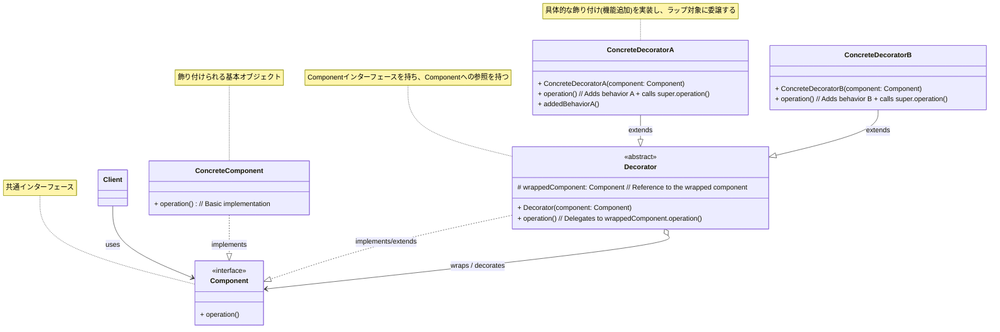

**目次**

- [デザインパターン詳細解説：Decorator パターン](#デザインパターン詳細解説decorator-パターン)
- [1. Decorator パターンとは？ ～目的と解決したい問題～](#1-decorator-パターンとは-目的と解決したい問題)
  - [1.1 このパターンを一言で言うと？（核心的な目的）](#11-このパターンを一言で言うと核心的な目的)
  - [1.2 なぜ Decorator パターンが必要なのか？（動機と背景）](#12-なぜ-decorator-パターンが必要なのか動機と背景)
    - [1.2.1 静的な継承による機能追加の限界](#121-静的な継承による機能追加の限界)
    - [1.2.2 オブジェクト単位で動的に機能を追加したい](#122-オブジェクト単位で動的に機能を追加したい)
  - [1.3 このパターンで解決できること（メリットの要約）](#13-このパターンで解決できることメリットの要約)
- [2. パターンの構造と実装 ～どのように実現するか～](#2-パターンの構造と実装-どのように実現するか)
  - [2.1 登場人物とその役割（クラス図と解説）](#21-登場人物とその役割クラス図と解説)
  - [2.2 実装のポイント：インターフェース共有と再帰的ラップ](#22-実装のポイントインターフェース共有と再帰的ラップ)
  - [2.3 コード例：具体的なシナリオでの実装](#23-コード例具体的なシナリオでの実装)
    - [2.3.1 シナリオ設定（例：コーヒーにトッピングを追加）](#231-シナリオ設定例コーヒーにトッピングを追加)
    - [2.3.2 サンプルコード（Java での例）](#232-サンプルコードjava-での例)
    - [2.3.3 コードのポイント解説](#233-コードのポイント解説)
- [3. Decorator パターンの利点 ～採用するメリット～](#3-decorator-パターンの利点-採用するメリット)
  - [3.1 継承よりも柔軟な機能追加](#31-継承よりも柔軟な機能追加)
  - [3.2 オープン/クローズドの原則 (OCP) の遵守](#32-オープンクローズドの原則-ocp-の遵守)
  - [3.3 単一責任の原則 (SRP) の促進](#33-単一責任の原則-srp-の促進)
  - [3.4 クライアントからの透過性](#34-クライアントからの透過性)
- [4. 注意点とトレードオフ ～適用前に考えるべきこと～](#4-注意点とトレードオフ-適用前に考えるべきこと)
  - [4.1 小さなオブジェクトが多数生成される可能性](#41-小さなオブジェクトが多数生成される可能性)
  - [4.2 Component インターフェースへの依存](#42-component-インターフェースへの依存)
  - [4.3 オブジェクトの同一性 (Identity) の問題](#43-オブジェクトの同一性-identity-の問題)
  - [4.4 特定の Decorator へのアクセス](#44-特定の-decorator-へのアクセス)
- [5. 実装上のヒントと考慮事項 ～より良く使うために～](#5-実装上のヒントと考慮事項-より良く使うために)
  - [5.1 `Decorator` を抽象クラスにするか、インターフェースにするか](#51-decorator-を抽象クラスにするかインターフェースにするか)
  - [5.2 デコレータの適用順序](#52-デコレータの適用順序)
  - [5.3 Decorator の生成（Factory や Builder の利用）](#53-decorator-の生成factory-や-builder-の利用)
  - [5.4 コンポーネントの同一性確認](#54-コンポーネントの同一性確認)
  - [5.5 Decorator の除去](#55-decorator-の除去)
- [6. 他のパターンとの関連 ～比較と組み合わせ～](#6-他のパターンとの関連-比較と組み合わせ)
  - [6.1 似ているパターンとの比較](#61-似ているパターンとの比較)
    - [6.1.1 Decorator vs Proxy](#611-decorator-vs-proxy)
    - [6.1.2 Decorator vs Adapter](#612-decorator-vs-adapter)
    - [6.1.3 Decorator vs Composite](#613-decorator-vs-composite)
  - [6.2 組み合わせると効果的なパターン](#62-組み合わせると効果的なパターン)
- [7. リファクタリング：いつ Decorator パターンを導入するか](#7-リファクタリングいつ-decorator-パターンを導入するか)
  - [7.1 導入のきっかけとなる「コードの不吉な臭い」や状況変化](#71-導入のきっかけとなるコードの不吉な臭いや状況変化)
  - [7.2 段階的なリファクタリング手順（概要）](#72-段階的なリファクタリング手順概要)
- [8. まとめ ～ Decorator パターンの本質～](#8-まとめ--decorator-パターンの本質)

# デザインパターン詳細解説：Decorator パターン

# 1. Decorator パターンとは？ ～目的と解決したい問題～

## 1.1 このパターンを一言で言うと？（核心的な目的）

Decorator パターンは、「**オブジェクトに、そのクラスを変更することなく、動的かつ透過的に新しい責務（機能や振る舞い）を追加する**」ための、構造に関するデザインパターンです。継承よりも柔軟な機能拡張の方法を提供します。

## 1.2 なぜ Decorator パターンが必要なのか？（動機と背景）

ソフトウェア開発では、既存のオブジェクトに対して、状況に応じて**機能を追加したり、振る舞いを変更したり**したい場合があります。たとえば、

- テキスト表示コンポーネントに、スクロールバー機能や枠線描画機能を追加したい。
- ネットワークストリームに、データの暗号化機能やバッファリング機能を追加したい。
- コーヒーに、ミルクや砂糖、ホイップクリームなどのトッピングを追加して価格や説明文を変えたい。

### 1.2.1 静的な継承による機能追加の限界

このような機能追加を実現するもっとも単純な方法は、元のクラスを**継承**してサブクラスを作成し、そこで新しい機能を追加することかもしれません。しかし、このアプローチにはいくつかの大きな問題があります。

- **組み合わせ爆発:** 追加したい機能（装飾）の種類が多く、それらを自由に組み合わせたい場合、考えられるすべての組み合わせに対応するサブクラスを作成する必要が出てきます。たとえば、「スクロールバー付きテキスト」「枠線付きテキスト」「スクロールバー＋枠線付きテキスト」のように、機能が増えるごとにクラスの数が指数関数的に増加（**組み合わせ爆発**）してしまい、管理が非常に困難になります。
- **静的な関係:** 継承による機能追加は、コンパイル時にクラス構造として固定されます。実行時に動的に機能を追加したり、取り外したりすることはできません。
- **柔軟性の欠如:** すべてのサブクラスが、親クラスのインターフェースだけでなく、追加された機能も含めて固定的な関係を持つことになります。

### 1.2.2 オブジェクト単位で動的に機能を追加したい

継承の限界を克服し、より柔軟に機能を追加・変更する仕組みが求められます。理想的には、

- 既存のクラスのコードを変更することなく、新しい機能を追加したい（**オープン/クローズドの原則**）。
- 機能の追加・削除を**実行時に動的に**行いたい。
- 複数の機能を**自由に組み合わせて**利用したい。
- 機能を追加しても、**元のオブジェクトと同じインターフェース**で扱えるようにしたい（透過性）。

Decorator パターンは、これらの要求に応えるために、「**オブジェクトを別のオブジェクトで『飾り付け（デコレート）』するようにラップし、機能を追加していく**」というアプローチを取ります。

## 1.3 このパターンで解決できること（メリットの要約）

Decorator パターンを適用することで、以下のようなメリットが期待できます。

- **継承を使わずに**、オブジェクトに**動的に責務（機能）を追加**できる。
- 機能の**組み合わせ**が容易になり、クラスの爆発的な増加を防げる。
- 元のクラスを変更することなく機能を追加できるため、**オープン/クローズドの原則**に適合する。
- 機能追加後も、**元のオブジェクトと同じインターフェース**で扱えるため、クライアントコードへの影響が少ない（透過性）。
- **単一責任の原則**を促進する（各 Decorator は特定の追加機能に責任を持つ）。

---

# 2. パターンの構造と実装 ～どのように実現するか～

Decorator パターンは、オブジェクトを「飾り付け」するように、動的に機能を追加する仕組みを提供します。これを実現するために、装飾されるオブジェクトと装飾するオブジェクトが共通のインターフェースを共有し、装飾オブジェクトが内部的に装飾対象への参照を持つという構造を取ります。

## 2.1 登場人物とその役割（クラス図と解説）

Decorator パターンは、主に以下の 4 つの役割から構成されます。

- **`Component`（コンポーネントインターフェース）:**
  - **役割:** 飾り付けられる対象のオブジェクト (`ConcreteComponent`) と、飾り付けを行うオブジェクト (`Decorator`) の両方が実装すべき**共通のインターフェース**を定義します。クライアントはこのインターフェースを通じて、装飾されたオブジェクトも元のオブジェクトも同じように扱います。
  - **定義:** クライアントが利用する共通の操作（メソッド）を宣言します。
- **`ConcreteComponent`（具体的なコンポーネント）:**
  - **役割:** **飾り付けられる対象**となる、中心的な機能を持つ具体的なクラスです。
  - **実装:** `Component` インターフェースを実装し、基本的な機能を提供します。
- **`Decorator`（デコレータ抽象クラス/インターフェース）:**
  - **役割:** すべての具体的な飾り付けクラス (`ConcreteDecorator`) の**基底**となるクラス（通常は抽象クラス）またはインターフェースです。
  - **実装:**
    - `Component` インターフェースと**同じインターフェースを実装（または継承）**します。
    - 内部に、**飾り付け対象となる `Component` オブジェクトへの参照**（フィールド）を持ちます。この参照は、通常コンストラクタで設定されます。
    - `Component` インターフェースで宣言された操作を実装します。多くの場合、この実装は、**内部で保持している `Component` オブジェクトの対応する操作に処理を委譲**するだけです。具体的な飾り付け（追加機能）はサブクラスに任せます。
- **`ConcreteDecorator`（具体的なデコレータ）:**
  - **役割:** `Decorator` を継承（または実装）し、**具体的な飾り付け（追加機能）**を提供するクラスです。
  - **実装:**
    - オーバーライドした操作メソッドの中で、**追加したい機能**（前処理や後処理）を実装します。
    - 多くの場合、追加処理に加えて、**親クラス (`Decorator`) を通じて、ラップしている `Component` オブジェクトの元の操作も呼び出し**ます（処理を委譲します）。



_図: Decorator パターンのクラス図_

## 2.2 実装のポイント：インターフェース共有と再帰的ラップ

- **インターフェースの共有:** `ConcreteComponent` と `Decorator` (およびそのサブクラス) が**同じ `Component` インターフェースを共有**することが、クライアントからの透過性を実現する鍵です。クライアントは、オブジェクトが装飾されているかどうかを意識する必要がありません。
- **委譲による機能呼び出し:** 各 `ConcreteDecorator` は、自身が追加する機能の処理を行うだけでなく、多くの場合、**ラップしている `Component` オブジェクトの対応するメソッドを呼び出す**（処理を委譲する）必要があります。これにより、元のオブジェクトの機能が失われずに、新しい機能が追加されます。委譲は、通常 `super.operation()` (Decorator が抽象クラスの場合) や `wrappedComponent.operation()` (Decorator がインターフェースの場合など) のように行われます。
- **再帰的なラップ（飾り付けの連鎖）:** `Decorator` 自身も `Component` インターフェースを実装しているため、**`Decorator` をさらに別の `Decorator` でラップする**ことが可能です。これにより、複数の機能をオブジェクトに動的に「重ね着」させるように追加していくことができます。
  ```java
  // 例: 複数の Decorator を重ねる
  Component component = new ConcreteComponent();
  Component decoratedA = new ConcreteDecoratorA(component);
  Component decoratedB = new ConcreteDecoratorB(decoratedA); // DecoratorA をさらに DecoratorB で飾る
  decoratedB.operation(); // B の追加機能 + A の追加機能 + 元の機能 が実行される
  ```
- **Decorator のコンストラクタ:** `Decorator`（および `ConcreteDecorator`）のコンストラクタは、通常、**ラップ対象となる `Component` オブジェクトを引数として受け取り**、それを内部のフィールドに保持します。

## 2.3 コード例：具体的なシナリオでの実装

### 2.3.1 シナリオ設定（例：コーヒーにトッピングを追加）

基本的なコーヒー (`SimpleCoffee`) があり、それにミルク (`MilkDecorator`) や砂糖 (`SugarDecorator`) を動的に追加できるようにします。トッピングを追加するごとに、価格 (`getCost()`) と説明文 (`getDescription()`) が変化するように設計します。

### 2.3.2 サンプルコード（Java での例）

```java
// 1. Component インターフェース: 飲み物
interface Beverage {
    String getDescription();
    double getCost();
}

// 2. ConcreteComponent: 基本のコーヒー
class SimpleCoffee implements Beverage {
    @Override
    public String getDescription() {
        return "シンプルなコーヒー";
    }
    @Override
    public double getCost() {
        return 200; // 基本価格 200円
    }
}

// 3. Decorator 抽象クラス: トッピング(調味料)の基底
abstract class CondimentDecorator implements Beverage {
    // ★ラップする Beverage オブジェクトへの参照
    protected Beverage beverage;

    // コンストラクタでラップ対象を受け取る
    public CondimentDecorator(Beverage beverage) {
        this.beverage = beverage;
    }

    // getDescription はサブクラスで実装する必要があるため abstract にする
    @Override
    public abstract String getDescription();

    // getCost は多くの場合、ラップ対象のコストに自身のコストを加える
    // (サブクラスでオーバーライドも可能)
    // ここでは getCost はサブクラスで実装するものとする (例として)
    // @Override
    // public double getCost() {
    //     return beverage.getCost(); // 基本は何もしないか、エラーにする
    // }
}

// 4. ConcreteDecorator: 具体的なトッピング
class MilkDecorator extends CondimentDecorator {
    public MilkDecorator(Beverage beverage) {
        super(beverage);
    }

    @Override
    public String getDescription() {
        // ★ラップ対象の説明に自分の説明を追加
        return beverage.getDescription() + ", ミルク";
    }

    @Override
    public double getCost() {
        // ★ラップ対象の価格に自分の価格を追加
        return beverage.getCost() + 50; // ミルク代 50円
    }
}

class SugarDecorator extends CondimentDecorator {
    public SugarDecorator(Beverage beverage) {
        super(beverage);
    }

    @Override
    public String getDescription() {
        return beverage.getDescription() + ", 砂糖";
    }

    @Override
    public double getCost() {
        return beverage.getCost() + 30; // 砂糖代 30円
    }
}

// --- Client (利用側) ---
public class DecoratorClient {
    public static void main(String[] args) {
        // 1. まず基本のコーヒーを作る
        Beverage coffee = new SimpleCoffee();
        System.out.println("注文: " + coffee.getDescription() + ", 価格: " + coffee.getCost() + "円");

        // 2. コーヒーにミルクを追加（デコレート）
        Beverage milkCoffee = new MilkDecorator(coffee);
        System.out.println("注文: " + milkCoffee.getDescription() + ", 価格: " + milkCoffee.getCost() + "円");

        // 3. ミルクコーヒーにさらに砂糖を追加（二重にデコレート）
        Beverage milkSugarCoffee = new SugarDecorator(milkCoffee);
        System.out.println("注文: " + milkSugarCoffee.getDescription() + ", 価格: " + milkSugarCoffee.getCost() + "円");

        // 4. 最初に砂糖、次にミルクを追加（順序を変えることも可能）
        Beverage sugarMilkCoffee = new MilkDecorator(new SugarDecorator(coffee));
        System.out.println("注文: " + sugarMilkCoffee.getDescription() + ", 価格: " + sugarMilkCoffee.getCost() + "円");

        // Client は最終的に得られたオブジェクトを Beverage インターフェースとして扱える
    }
}
```

### 2.3.3 コードのポイント解説

- `Beverage` が共通インターフェース (`Component`) です。
- `SimpleCoffee` が基本的な飲み物 (`ConcreteComponent`) です。
- `CondimentDecorator` がデコレータの基底となる抽象クラス (`Decorator`) です。ラップする `Beverage` オブジェクトへの参照 (`beverage`) を持ちます。
- `MilkDecorator` と `SugarDecorator` が具体的な飾り付け (`ConcreteDecorator`) です。コンストラクタでラップ対象の `Beverage` を受け取ります。
- `getDescription()` と `getCost()` メソッドでは、まずラップしている `beverage` の対応するメソッドを呼び出し、その結果に対して自身の追加情報（", ミルク" や +50 円）を加えて返しています。これが「飾り付け」の処理にあたります。
- クライアントコードでは、`new MilkDecorator(coffee)` や `new SugarDecorator(milkCoffee)` のように、**既存の `Beverage` オブジェクトを新しい `Decorator` でラップする**ことで、動的に機能（トッピング）を追加しています。複数のデコレータを重ねることも可能です。

このように、Decorator パターンはオブジェクトを包み込むようにして、柔軟に機能を追加する仕組みを提供します。

---

# 3. Decorator パターンの利点 ～採用するメリット～

Decorator パターンを適用することで、とくにオブジェクトへの機能追加に関して、静的な継承では得られない多くのメリットを享受できます。

## 3.1 継承よりも柔軟な機能追加

これが Decorator パターンのもっとも大きな利点です。継承を使って機能を追加しようとすると、機能の組み合わせごとにサブクラスが必要になり、クラス数が爆発的に増加する可能性があります（組み合わせ爆発）。

Decorator パターンでは、追加したい機能（飾り付け）を独立した `ConcreteDecorator` クラスとして定義し、それらを**実行時に動的に、かつ任意の順序でオブジェクトに「ラップ」する**ことで機能を追加します。これにより、

- **必要な機能だけを選択して組み合わせる**ことが可能です。
- 新しい機能を追加する場合も、新しい `ConcreteDecorator` を作成するだけで済み、既存のクラス階層に影響を与えません。
- 実行時に機能を追加したり、削除したりする（※削除は実装によります）ことも原理的には可能です。

このように、継承に比べてはるかに**柔軟でスケーラブルな機能拡張**メカニズムを提供します。

## 3.2 オープン/クローズドの原則 (OCP) の遵守

Decorator パターンは、オープン/クローズドの原則に適合した設計を促進します。

- **修正に対して閉じている:** 新しい機能を追加するために、既存の `Component` クラスや `ConcreteComponent` クラス、あるいは他の `Decorator` クラスの**コードを修正する必要はありません**。
- **拡張に対して開いている:** 新しい機能は、新しい `ConcreteDecorator` クラスを**追加**することによって実現できます。

これにより、既存の安定したコードへの影響を最小限に抑えながら、システムの機能を安全に拡張していくことができます。

## 3.3 単一責任の原則 (SRP) の促進

各 `ConcreteDecorator` クラスは、**特定の追加機能（飾り付け）を提供する**という、**単一の明確な責任**を持ちます。たとえば、`MilkDecorator` はミルクを追加する責任、`ScrollbarDecorator` はスクロールバー機能を追加する責任、といった具合です。

これにより、機能追加に関するロジックが特定のクラスに集中するのを防ぎ、各クラスが小さく、凝集度が高く、理解しやすいものになります。これは、コードの**保守性**と**テスト容易性**の向上にも繋がります。

## 3.4 クライアントからの透過性

装飾されたオブジェクトも、元のオブジェクトも、共通の `Component` インターフェースを実装しているため、クライアントは両者を**区別なく、同じインターフェースを通じて**利用できます。クライアントコードは、オブジェクトがどのように装飾されているかを意識する必要がありません。

これにより、Decorator パターンを導入しても、既存のクライアントコードへの影響を最小限に抑えることができます。

これらの利点により、Decorator パターンは、オブジェクトに柔軟かつ動的に機能を追加するための強力でエレガントなソリューションとして、多くの場面（とくに I/O ストリームや GUI コンポーネントなど）で活用されています。

---

# 4. 注意点とトレードオフ ～適用前に考えるべきこと～

Decorator パターンは機能追加に柔軟性をもたらしますが、その利用にあたってはいくつかの注意点や考慮すべきトレードオフが存在します。

## 4.1 小さなオブジェクトが多数生成される可能性

Decorator パターンでは、機能を追加するたびに新しい `Decorator` オブジェクトで既存のオブジェクトをラップします。複数の機能を追加する場合、多くの小さな `Decorator` オブジェクトが数珠つなぎのように生成されることになります。

- **オブジェクト数の増加:** システム内に存在するオブジェクトの総数が増える可能性があります。
- **構成の複雑さ:** 多くのデコレータがネストすると、特定の機能がどのデコレータによって提供されているのか、あるいはデバッグ時に呼び出しスタックを追跡するのが少し難しくなることがあります。
- **初期化コードの複雑化:** 複数のデコレータを正しい順序でラップするためのコードが、クライアント側（または Factory など）で必要になり、やや冗長になる可能性があります。

機能の数が少なく、組み合わせも限定的な場合には、Decorator パターンが過剰設計となり、単純な継承や他のアプローチの方がシンプルになる可能性も考慮する必要があります。

## 4.2 Component インターフェースへの依存

Decorator パターンが効果を発揮するためには、装飾されるオブジェクト (`ConcreteComponent`) と装飾するオブジェクト (`Decorator`) が、**共通の `Component` インターフェースを共有している**ことが前提となります。

もし、装飾したい対象が特定の具象クラスであり、共通のインターフェースが存在しない場合、まずインターフェースを抽出するリファクタリングが必要になることがあります。また、`Component` インターフェース自体が巨大で多くのメソッドを持っている場合、それを実装するすべての `Decorator` が、たとえ自身が関与しないメソッドであっても、何らかの形で（通常はラップ対象への委譲として）実装を提供する必要があり、コードが冗長になる可能性があります。（これはインターフェース分離の原則 (ISP) に関連する問題です）

## 4.3 オブジェクトの同一性 (Identity) の問題

Decorator パターンでは、オブジェクトをラップするため、装飾されたオブジェクトと元のオブジェクトは**異なるインスタンス**となります。

```java
Beverage coffee = new SimpleCoffee();
Beverage milkCoffee = new MilkDecorator(coffee);

// coffee と milkCoffee は異なるオブジェクト
assert coffee != milkCoffee;
```

クライアントコードが、オブジェクトの**参照の同一性 (`==` 比較)** に依存するようなロジックを持っている場合、Decorator パターンを導入すると予期せぬ問題を引き起こす可能性があります。オブジェクトの内容が等しいかどうか（`equals()`）で比較するなどの注意が必要です。

## 4.4 特定の Decorator へのアクセス

クライアントが通常 `Component` インターフェースを通じてオブジェクトを操作する場合、特定の `ConcreteDecorator` が追加した独自のメソッド（`Component` インターフェースにはないメソッド）にアクセスするのは困難です。

もし特定のデコレータの機能に直接アクセスしたい場合は、型チェックとダウンキャストが必要になり、Decorator パターンの利点である透過性が損なわれてしまいます。このような要求がある場合は、Decorator パターンが最適ではないか、あるいは設計を見直す必要があるかもしれません。

これらの注意点を理解し、Decorator パターンがもたらす柔軟性と、それに伴う複雑さの増加や実装上の考慮事項とのバランスを評価することが、パターンを適切に利用するためには重要です。

---

# 5. 実装上のヒントと考慮事項 ～より良く使うために～

Decorator パターンを効果的に実装し、そのメリットを活かすためには、いくつかの実装上のヒントや考慮すべき点があります。

## 5.1 `Decorator` を抽象クラスにするか、インターフェースにするか

`Decorator` の基底をどのように定義するかは、主に 2 つの選択肢があります。

- **抽象クラス (Abstract Class) として定義:**
  - **利点:**
    - ラップする `Component` オブジェクトへの参照 (`wrappedComponent`) をフィールドとして持ち、コンストラクタで初期化する共通実装を提供できます。
    - `Component` インターフェースのメソッドについて、デフォルトの委譲実装（例: `return wrappedComponent.operation();`）を提供できます。これにより、`ConcreteDecorator` は追加したい機能に関連するメソッドだけをオーバーライドすればよくなり、定型的な委譲コードを削減できます。
  - **欠点:** Java や C# など単一継承しか許さない言語では、`ConcreteDecorator` が他のクラスを継承できなくなります。
- **インターフェース (Interface) として定義:**
  - **利点:** `ConcreteDecorator` は他のクラスを自由に継承できます。
  - **欠点:** `Component` への参照保持やデフォルトの委譲実装を、各 `ConcreteDecorator` で（あるいは別のヘルパークラスなどを介して）実装する必要があります。コードの重複が発生しやすくなる可能性があります。（ただし、Java 8 以降の `default` メソッドなどを使えば、インターフェースでもある程度の共通実装は可能です）

多くの場合、**抽象クラス**として `Decorator` を定義する方が、共通実装を提供できるため、`ConcreteDecorator` の実装をシンプルにできるメリットがあります。ただし、継承の制約がある場合にはインターフェースを選択することになります。

## 5.2 デコレータの適用順序

複数のデコレータを重ねて適用する場合、その**適用順序**が最終的な振る舞いに影響を与える可能性があります。

たとえば、ストリーム処理で「暗号化デコレータ」と「圧縮デコレータ」を使う場合、「先に圧縮してから暗号化する」のと「先に暗号化してから圧縮する」のでは、結果（と効率）が異なります。

クライアントがデコレータを適用する順序を意識する必要があるのか、あるいは特定の順序が強制されるべきなのかを設計時に考慮する必要があります。順序が重要な場合は、それをドキュメント化したり、Builder パターンなどを利用して適切な順序でデコレートする仕組みを提供したりすることも考えられます。

## 5.3 Decorator の生成（Factory や Builder の利用）

デコレータの組み合わせが複雑になったり、特定の組み合わせを頻繁に利用したりする場合、クライアントが毎回 `new DecoratorB(new DecoratorA(new ConcreteComponent()))` のように記述するのは煩雑です。

このような場合、**Factory パターン**や **Builder パターン**を利用して、目的の装飾が施されたオブジェクトを生成するプロセスをカプセル化できます。

- **Factory:** 特定のデコレータの組み合わせ（例: スクロールバーと枠線付きテキストビュー）を生成する専用のファクトリメソッドを用意する。
- **Builder:** メソッドチェーンで適用したいデコレータを指定していき、最後に `build()` で装飾済みオブジェクトを取得する。

これにより、クライアントコードをシンプルに保ち、デコレータの生成と組み合わせのロジックを一箇所にまとめることができます。

## 5.4 コンポーネントの同一性確認

前章でも触れましたが、デコレートされたオブジェクトは元のオブジェクトとは異なるインスタンスになります。もし、装飾の有無にかかわらず、核となる `ConcreteComponent` が同じであれば「同じ」とみなしたい場合、`equals()` メソッドや `hashCode()` メソッドを適切にオーバーライドする必要があります。

`Decorator` の `equals()` は、自身がラップしている `Component` の `equals()` を呼び出すように実装するなどが考えられますが、実装は慎重に行う必要があります。

## 5.5 Decorator の除去

Decorator パターンは機能の追加には非常に柔軟ですが、一度適用した特定の Decorator を後から**取り除く**のは、一般的には簡単ではありません。

もし機能の動的な削除が必要な場合は、Decorator パターンが最適ではない可能性があります。別のパターン（例: Strategy パターンで振る舞いを切り替える、あるいは状態管理を工夫するなど）を検討するか、Decorator を除去するための特別な仕組み（例: デコレータのチェーンを辿って特定のデコレータをスキップするなど）を設計する必要がありますが、これは複雑さを増します。

これらの実装上のヒントを考慮することで、Decorator パターンをより効果的に、かつ管理しやすい形でプロジェクトに導入できます。

---

# 6. 他のパターンとの関連 ～比較と組み合わせ～

Decorator パターンは、とくに構造に関する他のパターンと比較されたり、連携して使われたりすることがあります。これらの関連性を理解することで、Decorator パターンの特徴をより深く把握し、設計上の適切な判断を下すのに役立ちます。

## 6.1 似ているパターンとの比較

### 6.1.1 Decorator vs Proxy

- **類似点:** どちらも対象オブジェクトを「ラップ」し、同じインターフェースを実装することで、クライアントからの透過性を維持します。構造が非常に似ています。
- **違い (主目的):**
  - **Decorator:** オブジェクトに**動的に新しい責務（機能）を追加・変更**することが主な目的です。「飾り付け」のように振る舞いを拡張します。
  - **Proxy:** オブジェクトへの**アクセスを制御・代替**すること（権限、遅延、リモート、キャッシュなど）が主な目的です。必ずしも新しい機能を追加するわけではありません。
- **見分け方:** 目的が「機能の追加・変更」であれば Decorator、「アクセス制御・管理」であれば Proxy を検討します。Decorator は複数重ねて適用されることが多いですが、Proxy は通常 1 つの Proxy が 1 つの RealSubject を代理します。

### 6.1.2 Decorator vs Adapter

- **類似点:** どちらも既存のオブジェクトをラップ（包み込む）することがあります。
- **違い (インターフェース):**
  - **Decorator:** **同じインターフェース**を維持しつつ、機能を追加します。クライアントはインターフェースの変更を意識しません。
  - **Adapter:** **異なるインターフェース間のギャップを埋める**のが目的です。既存オブジェクトのインターフェースを、クライアントが期待する**別のインターフェースに変換**します。
- **見分け方:** 既存のインターフェースを変更せずに機能を追加したいなら Decorator。互換性のないインターフェース同士を連携させたいなら Adapter を検討します。

### 6.1.3 Decorator vs Composite

- **類似点:** どちらも再帰的な構造を持つことがあり、共通の Component インターフェースを利用します。
- **違い (オブジェクトの構成):**
  - **Decorator:** 通常、**単一の** Component オブジェクトをラップして機能を追加します。
  - **Composite:** **複数の** Component オブジェクト（Leaf または他の Composite）をまとめて、単一のオブジェクトのように扱います。「部分－全体」の階層構造を表現します。
- **連携:** Composite パターンで構築された木構造の個々の要素（Leaf や Composite）に対して、Decorator パターンを使って動的に機能を追加することは可能です。

## 6.2 組み合わせると効果的なパターン

Decorator パターンは、他のパターンと組み合わせて、より複雑な要求に応える設計を構築するために利用できます。

- **Factory パターン (Factory Method, Abstract Factory):**
  - **連携:** 特定の Decorator の組み合わせを持つオブジェクトを生成するプロセスが複雑な場合、Factory パターンを使ってその生成ロジックをカプセル化できます。たとえば、「スクロールバー付きで枠線もあるテキストビュー」を生成する専用の Factory メソッドを用意するなどです。
- **Strategy パターン:**
  - **連携:** Decorator が追加する機能（振る舞い）自体を、Strategy パターンを使って交換可能にすることも考えられます。たとえば、「枠線描画 Decorator」が、描画する線のスタイル（実線、破線など）を内部で Strategy として切り替えられるようにするなどです。（ただし、設計が複雑になる可能性もあります）
- **Composite パターン:**
  - **連携:** 前述の通り、Composite 構造の個々の要素に対して Decorator を適用できます。たとえば、ファイルシステムを表す Composite 構造で、特定のファイルやディレクトリに「読み取り専用」や「暗号化」といった属性（機能）を Decorator で動的に付与する、などが考えられます。

これらのパターンとの関係性を理解することで、Decorator パターンを単独で適用するだけでなく、他のパターンと効果的に組み合わせて、より柔軟で強力な設計ソリューションを構築するための視点を得ることができます。

---

# 7. リファクタリング：いつ Decorator パターンを導入するか

Decorator パターンは、機能追加に関する柔軟性が求められるようになった際に、既存のコードを**リファクタリング**して導入する価値のあるパターンです。とくに、継承による機能追加が行き詰まりを見せ始めた場合や、動的な機能の組み合わせが必要になった場合に有効です。

## 7.1 導入のきっかけとなる「コードの不吉な臭い」や状況変化

既存のコードベースに以下のような兆候や状況の変化が見られた場合、Decorator パターンの導入を検討する良いサインです。

- **継承による組み合わせ爆発:**
  - **症状:** ある基本機能に対して、複数のオプション機能（例: スクロール、枠線、背景色など）があり、それらの**組み合わせごとにサブクラスが作成**されている。クラスの数が指数関数的に増加し、管理が困難になっている。
  - **問題:** クラス数が多くなりすぎる。新しいオプション機能を追加する際に、既存のすべての組み合わせに対応する新しいサブクラスを作成する必要があり、変更コストが高い（OCP 違反）。
  - **解決策:** Decorator パターンを導入します。基本機能を `ConcreteComponent` とし、各オプション機能を `ConcreteDecorator` として実装します。クライアントは必要な Decorator を動的にラップすることで、任意の機能の組み合わせを実現できます。クラス数を大幅に削減できます。
- **巨大なクラス (Large Class) - オプション機能による肥大化:**
  - **症状:** 1 つのクラスが、多数のオプション機能をフラグ変数と `if` 文で管理しており、クラスが非常に大きくなっている。メソッド内に、オプション機能の有効/無効を判定する条件分岐が多数存在する。
  - **問題:** クラスの責務が曖昧になり、凝集度が低下します。コードが複雑で読みにくく、新しいオプションの追加や既存オプションの修正が困難になります。
  - **解決策:** Decorator パターンを導入し、各オプション機能を独立した `ConcreteDecorator` クラスに分離します。`if` 文による分岐は、Decorator の適用（ラップするかしないか）によって置き換えられます。
- **実行時の動的な機能追加/削除の要求:**
  - **症状:** アプリケーションの実行中に、ユーザーの操作や設定に応じて、オブジェクトの機能（振る舞い）を**動的に追加したり、削除したり**する必要が出てきた。
  - **問題:** 静的な継承では、実行時に機能の構成を変更することは困難です。
  - **解決策:** Decorator パターンを導入すれば、オブジェクトを Decorator でラップしたり、ラップを解除したりする（※解除は工夫が必要な場合あり）ことで、動的な機能の変更に対応しやすくなります。

これらの状況は、機能追加の方法として継承が限界に達している、あるいは柔軟性が不足していることを示唆しており、Decorator パターンの導入によって設計を大幅に改善できる可能性があります。

## 7.2 段階的なリファクタリング手順（概要）

既存のコード（とくに継承で機能追加を行っている場合）に Decorator パターンを導入する際の、一般的なリファクタリング手順の概要は以下の通りです。（テストによる安全確保が前提です）

1. **`Component` インターフェースの作成:**
   - 装飾対象となるオブジェクト（既存の基本クラスやサブクラス）と、追加したい機能（装飾）に共通の操作を定義する `Component` インターフェースを作成します。
2. **`ConcreteComponent` の準備:**
   - 基本的な機能を持つクラス（多くの場合、既存の基本クラス）が `Component` インターフェースを実装するように変更します。これが `ConcreteComponent` となります。
3. **`Decorator` 抽象クラス（またはインターフェース）の作成:**
   - `Component` インターフェースを実装（または継承）し、内部に `Component` 型の参照 (`wrappedComponent`) を持つ `Decorator` 基底クラス（通常は抽象クラス）を作成します。コンストラクタでラップ対象を受け取るようにします。`Component` のメソッドについては、デフォルトで `wrappedComponent` に委譲する実装を提供します。
4. **`ConcreteDecorator` クラスの作成:**
   - 追加したい各機能（オプション）について、`Decorator` を継承する `ConcreteDecorator` クラスを作成します。
   - オーバーライドしたメソッド内で、追加したい機能のロジックを実装し、必要に応じて `super.operation()` や `wrappedComponent.operation()` を呼び出して元の処理に委譲します。
   - （もし既存のサブクラスに機能が実装されていた場合）サブクラスから機能追加のロジックを対応する `ConcreteDecorator` に**移動 (Move Method/Field)** します。
5. **クライアントコードの修正:**
   - クライアントコードが、サブクラスを直接 `new` していた箇所を修正します。まず `ConcreteComponent` のインスタンスを生成し、その後、必要な `ConcreteDecorator` で順番にラップしていくように変更します。クライアントは最終的に `Component` インターフェース型としてオブジェクトを扱います。
   - 継承による組み合わせを実現していたサブクラスは、最終的に不要になる可能性があります。
6. **テスト:** 各ステップの後、および最終的に、テストを実行してリファクタリングによってオブジェクトの振る舞いが期待通りであること（機能が正しく追加されていること、元の機能も損なわれていないこと）を確認します。

このリファクタリングにより、クラスの組み合わせ爆発が解消され、機能追加がより柔軟かつ安全に行えるようになり、コードの構造が改善されます。

---

# 8. まとめ ～ Decorator パターンの本質～

**Decorator パターン**は、オブジェクトに対して、その**クラスを変更することなく、動的かつ透過的に新しい責務（機能や振る舞い）を追加する**ための、構造に関するデザインパターンです。

このパターンを適用することで、

- **継承よりも柔軟**に機能を追加・組み合わせることができる（クラス爆発を防ぐ）。
- オブジェクトに**動的に**機能を追加したり、削除したりする（※削除は実装による）ことが容易になる。
- 既存のクラスを変更せずに機能拡張できるため、**オープン/クローズドの原則 (OCP)** に適合する。
- 追加される機能（Decorator）と、本来の機能（Component）の**責任を分離**できる（SRP 促進）。
- クライアントは、装飾されたオブジェクトも元のオブジェクトも**同じインターフェースで透過的に**扱える。

といったメリットが得られます。

その本質は、「**対象オブジェクトを、同じインターフェースを持つ別のオブジェクト（Decorator）で『包み込む（ラップする）』ことによって、機能を『飾り付け』のように追加していく**」という点にあります。Decorator は内部に包み込んだオブジェクトへの参照を持ち、自身の処理（追加機能）を実行しつつ、必要に応じて元のオブジェクトの処理も呼び出します。このラップ構造は再帰的に適用できるため、複数の機能を自由に重ね合わせることが可能です。

ただし、多くの小さな Decorator オブジェクトが生成されることによる**構成の複雑化**や、**オブジェクトの同一性の問題**といった**トレードオフ**も存在します。

Decorator パターンは、静的な継承による機能追加の限界を超えるための強力な代替手段を提供します。とくに、GUI コンポーネントの機能拡張や、Java の I/O ストリームのように、フィルタリングやバッファリングといった機能を段階的に追加していくような場面で、その効果を発揮します。機能の組み合わせや動的な変更が求められる場合に、この「飾り付け」のアプローチは非常に有効な設計の選択肢となるでしょう。
