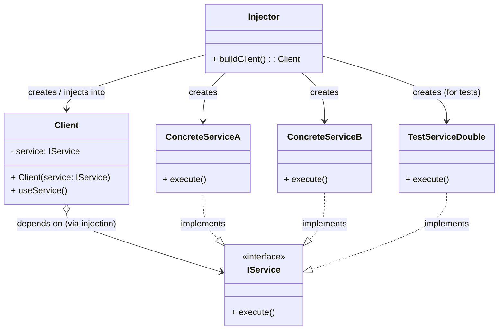

**目次**

- [デザインパターン詳細解説：Dependency Injection (DI)](#デザインパターン詳細解説dependency-injection-di)
- [1. Dependency Injection とは？ ～目的と解決したい問題～](#1-dependency-injection-とは-目的と解決したい問題)
  - [1.1 このパターン（原則）を一言で言うと？（核心的な目的）](#11-このパターン原則を一言で言うと核心的な目的)
  - [1.2 なぜ Dependency Injection が必要なのか？（動機と背景）](#12-なぜ-dependency-injection-が必要なのか動機と背景)
    - [1.2.1 依存性を内部で解決する問題点](#121-依存性を内部で解決する問題点)
    - [1.2.2 依存性の解決を外部に委ねたい](#122-依存性の解決を外部に委ねたい)
  - [1.3 この原則/テクニックで解決できること（メリットの要約）](#13-この原則テクニックで解決できることメリットの要約)
- [2. パターンの構造と実装 ～どのように実現するか～](#2-パターンの構造と実装-どのように実現するか)
  - [2.1 登場人物とその役割（クラス図と解説）](#21-登場人物とその役割クラス図と解説)
  - [2.2 実装のポイント：注入の方法](#22-実装のポイント注入の方法)
    - [2.2.1 コンストラクタ注入 (Constructor Injection) - 推奨](#221-コンストラクタ注入-constructor-injection---推奨)
    - [2.2.2 セッター注入 (Setter Injection / Property Injection)](#222-セッター注入-setter-injection--property-injection)
    - [2.2.3 インターフェース注入 (Interface Injection)](#223-インターフェース注入-interface-injection)
  - [2.3 コード例：具体的なシナリオでの実装](#23-コード例具体的なシナリオでの実装)
    - [2.3.1 シナリオ設定（例：ユーザー通知サービス）](#231-シナリオ設定例ユーザー通知サービス)
    - [2.3.2 サンプルコード（Java での例 - コンストラクタ注入）](#232-サンプルコードjava-での例---コンストラクタ注入)
    - [2.3.3 コードのポイント解説](#233-コードのポイント解説)
- [3. Dependency Injection の利点 ～採用するメリット～](#3-dependency-injection-の利点-採用するメリット)
  - [3.1 疎結合 (Loose Coupling) の実現](#31-疎結合-loose-coupling-の実現)
  - [3.2 テスト容易性の劇的な向上](#32-テスト容易性の劇的な向上)
  - [3.3 柔軟性と拡張性の向上](#33-柔軟性と拡張性の向上)
  - [3.4 再利用性の向上](#34-再利用性の向上)
  - [3.5 関心の分離 (Separation of Concerns)](#35-関心の分離-separation-of-concerns)
- [4. 注意点とトレードオフ ～適用前に考えるべきこと～](#4-注意点とトレードオフ-適用前に考えるべきこと)
  - [4.1 構成の複雑化（とくに最初は）](#41-構成の複雑化とくに最初は)
  - [4.2 DI コンテナへの学習コストと依存](#42-di-コンテナへの学習コストと依存)
  - [4.3 実行時エラーのリスク](#43-実行時エラーのリスク)
  - [4.4 デバッグ時の追跡の難しさ（場合による）](#44-デバッグ時の追跡の難しさ場合による)
  - [4.5 DI の乱用・誤用](#45-di-の乱用誤用)
- [5. 実装上のヒントと考慮事項 ～より良く使うために～](#5-実装上のヒントと考慮事項-より良く使うために)
  - [5.1 インターフェースへの依存を徹底する](#51-インターフェースへの依存を徹底する)
  - [5.2 コンストラクタ注入を基本とする](#52-コンストラクタ注入を基本とする)
  - [5.3 依存性の数は少なく保つ（SRP の遵守）](#53-依存性の数は少なく保つsrp-の遵守)
  - [5.4 循環依存を避ける](#54-循環依存を避ける)
  - [5.5 DI コンテナの利用検討](#55-di-コンテナの利用検討)
- [6. 他のパターンとの関連 ～比較と組み合わせ～](#6-他のパターンとの関連-比較と組み合わせ)
  - [6.1 関連性の高い原則とパターン](#61-関連性の高い原則とパターン)
    - [6.1.1 依存性逆転の原則 (DIP: Dependency Inversion Principle)](#611-依存性逆転の原則-dip-dependency-inversion-principle)
    - [6.1.2 Factory パターン (Factory Method, Abstract Factory)](#612-factory-パターン-factory-method-abstract-factory)
    - [6.1.3 Strategy パターン / State パターン](#613-strategy-パターン--state-パターン)
    - [6.1.4 Service Locator パターンとの比較](#614-service-locator-パターンとの比較)
  - [6.2 DI コンテナとの関係](#62-di-コンテナとの関係)
- [7. リファクタリング：いつ Dependency Injection を導入するか](#7-リファクタリングいつ-dependency-injection-を導入するか)
  - [7.1 導入のきっかけとなる「コードの不吉な臭い」や状況変化](#71-導入のきっかけとなるコードの不吉な臭いや状況変化)
  - [7.2 段階的なリファクタリング手順（概要）](#72-段階的なリファクタリング手順概要)
- [8. まとめ ～ Dependency Injection の本質～](#8-まとめ--dependency-injection-の本質)

# デザインパターン詳細解説：Dependency Injection (DI)

# 1. Dependency Injection とは？ ～目的と解決したい問題～

## 1.1 このパターン（原則）を一言で言うと？（核心的な目的）

Dependency Injection (DI) は、「**あるオブジェクト（クラス）が必要とする別のオブジェクト（依存性: Dependency）を、そのオブジェクト自身が内部で生成・解決するのではなく、外部から与えてもらう（注入: Injection）ようにする**」という設計原則であり、それを実現するためのテクニックです。これにより、クラス間の**結合度を下げ、テスト容易性や柔軟性を高める**ことを目的とします。

**注意:** DI は GoF のデザインパターンには含まれていませんが、現代のオブジェクト指向設計、とくに疎結合やテスト容易性を実現する上で非常に重要かつ基本的な概念・テクニックとして広く認識・利用されています。しばしば「DI パターン」と呼ばれることもありますが、より正確には「原則」や「テクニック」と捉えるのが適切です。

## 1.2 なぜ Dependency Injection が必要なのか？（動機と背景）

オブジェクト指向プログラミングでは、クラスが他のクラスの機能を利用して自身の責務を果たすことが一般的です。この関係を「依存関係」と呼びます。たとえば、`OrderService` が `PaymentGateway` や `UserRepository` に依存する、といった具合です。

### 1.2.1 依存性を内部で解決する問題点

もっとも単純な実装方法は、クラスが必要な依存オブジェクトを、自身のコンストラクタやメソッド内部で直接 `new` 演算子などを使って生成・取得することです。

```java
public class OrderService {
    private PaymentGateway paymentGateway;
    private UserRepository userRepository;

    public OrderService() {
        // ★ 依存オブジェクトを内部で直接生成！
        this.paymentGateway = new StripePaymentGateway();
        this.userRepository = new DatabaseUserRepository();
    }

    public void placeOrder(Order order) {
        // paymentGateway や userRepository を利用する処理...
        paymentGateway.charge(order.getAmount());
        User user = userRepository.findById(order.getUserId());
        // ...
    }
}
```

この方法は一見簡単ですが、ソフトウェアの成長とともに深刻な問題を引き起こします。

- **密結合 (Tight Coupling):** `OrderService` が、具体的な実装クラスである `StripePaymentGateway` や `DatabaseUserRepository` に**強く依存**してしまいます。もし将来、支払いゲートウェイを PayPal に変更したり、ユーザーリポジトリをインメモリ実装に切り替えたりしたくなった場合、`OrderService` の**コード自体を修正**しなければなりません。
- **テスト困難性 (Poor Testability):** `OrderService` のユニットテストを行いたい場合、本物の `StripePaymentGateway`（外部 API 通信）や `DatabaseUserRepository`（データベース接続）が動いてしまい、テストが不安定になったり、実行が遅くなったり、外部環境に依存したりします。テストのためにこれらの依存先を**偽物（テストダブル）に差し替えたいのに、それができません**。
- **再利用性の低下:** `OrderService` は特定の `PaymentGateway` や `UserRepository` 実装とセットでないと動作しないため、異なる環境での再利用が困難になります。

### 1.2.2 依存性の解決を外部に委ねたい

これらの問題を解決するためには、「**クラスは自身が必要とする依存性の『解決』（どの具体的な実装を使うか、どのようにインスタンスを取得するか）を、自分自身で行うべきではない**」という考え方が重要になります。この依存性の解決という「関心事」を、クラスの本来の責務から分離し、**外部の仕組み**に委ねるべきだ、という発想が DI の根底にあります。

外部から依存性を「注入」してもらうことで、クラスは具体的な実装クラスではなく、**抽象（インターフェースや抽象クラス）にのみ依存**することが可能になります。これが **依存性逆転の原則 (DIP)** の実現につながり、疎結合で柔軟、かつテスト容易な設計を促進します。

## 1.3 この原則/テクニックで解決できること（メリットの要約）

Dependency Injection を適用することで、以下のようなメリットが期待できます。

- **クラス間の結合度を大幅に低下**させ、**疎結合**な設計を実現できる。
- **テスト容易性が劇的に向上**し、テストダブルの利用が容易になる。
- 依存コンポーネントの**実装を容易に切り替え**られるようになり、**柔軟性・拡張性**が高まる。
- クラスの**責務が明確**になり、**再利用性**が向上する。
- オブジェクトの生成・設定と、それを利用するロジックとを**分離**できる（関心の分離）。

---

# 2. パターンの構造と実装 ～どのように実現するか～

Dependency Injection (DI) は、特定のクラス構造を指すというよりは、**依存関係を解決するためのアプローチやテクニック**を指します。その中心的な考え方は「**制御の反転 (Inversion of Control - IoC)**」です。オブジェクトが自身の依存性を内部で制御（生成・検索）するのではなく、その制御を外部のコードやフレームワークに委ねます。

## 2.1 登場人物とその役割（クラス図と解説）

DI の基本的な関係性を示す登場人物は以下の通りです。

- **`Client`（利用者 / 依存する側）**
  - **役割:** 別のオブジェクト（`Service`）の機能を利用する必要があるクラス。DI の文脈では、「依存性を受け取る側」となります。
  - **実装:** 自身が必要とする `Service` を、インターフェース（または抽象クラス）の形で宣言します。**具体的な実装クラスには依存しません**。依存性は、後述する注入方法（コンストラクタ、セッターなど）を通じて外部から受け取ります。
- **`Service`（サービス / 依存される側インターフェース）**
  - **役割:** `Client` が必要とする機能（責務）の**契約**を定義するインターフェース（または抽象クラス）。
  - **定義:** `Client` が利用したいメソッドのシグネチャを宣言します。
- **`ConcreteService`（具体的なサービス / 依存される側実装）**
  - **役割:** `Service` インターフェースを**実装**する具体的なクラス。実際の機能を提供します。複数種類の実装が存在しえます（例: `DatabaseUserService`, `InMemoryUserService`）。
- **`Injector`（注入者 / 組み立て役）**
  - **役割:** `Client` が必要とする `Service` の**具体的なインスタンス (`ConcreteService`) を生成**し、それを `Client` に**注入（設定）する**責任を持つ外部のコードまたは仕組みです。
  - **実装:**
    - **手動 DI:** アプリケーションの起動時や特定のセットアップコード (`main` メソッド、ファクトリクラスなど) が `Injector` の役割を果たします。
    - **DI コンテナ:** Spring Framework, Google Guice, Dagger (Java), ASP.NET Core DI, Autofac (C#) などの DI フレームワーク（コンテナ）が、設定に基づいてオブジェクトの生成と依存性の注入を自動的に管理します。



_図: Dependency Injection の基本的な関係図 (コンストラクタ注入の例)_

## 2.2 実装のポイント：注入の方法

依存性を外部から注入するには、主に以下の 3 つの方法があります。

### 2.2.1 コンストラクタ注入 (Constructor Injection) - 推奨

- **方法:** クラスが必要とする依存オブジェクトを、そのクラスの**コンストラクタの引数**として受け取ります。
- **特徴:**
  - **依存性が明確:** クラスをインスタンス化するために何が必要かが、コンストラクタのシグネチャを見れば一目瞭然です。
  - **不変性の確保:** コンストラクタで受け取った依存性を `final` フィールドに格納すれば、オブジェクト生成後に依存性を変更できなくなり、不変性を保証しやすくなります。
  - **完全な状態での生成:** 必要な依存性がすべて揃わないとインスタンスを生成できないため、オブジェクトが常に利用可能な状態で生成されることを保証できます。
  - **一般的にもっとも推奨される方法**です。

```java
public class Client {
    private final IService service; // final で不変にできる

    // ★ コンストラクタで依存性 (IService) を受け取る
    public Client(IService service) {
        this.service = Objects.requireNonNull(service, "Service must not be null");
    }
    // ...
}
// Injector (手動): Client client = new Client(new ConcreteServiceA());
```

### 2.2.2 セッター注入 (Setter Injection / Property Injection)

- **方法:** 依存オブジェクトを設定するための `public` な**セッターメソッド**（例: `setService(IService service)`) を用意し、インスタンス生成**後**に外部からそのメソッドを呼び出して依存性を注入します。C# などではプロパティを通じて注入することもあります。
- **特徴:**
  - **依存性がオプションの場合**に適しています。必ずしも注入されなくても動作する場合や、デフォルトの実装がある場合など。
  - オブジェクト生成後に**依存性を変更**することが可能です（ただし、これが望ましいかは状況によります）。
  - **注意点:** 依存性が注入される前に他のメソッドが呼ばれると `NullPointerException` などが発生する可能性があります。また、オブジェクトが可変（Mutable）になります。コンストラクタ注入に比べて依存関係がコード上で見えにくくなることがあります。

```java
public class Client {
    private IService service;

    public Client() {
        // デフォルトコンストラクタ
    }

    // ★ セッターメソッドで依存性を注入
    public void setService(IService service) {
        this.service = service;
    }

    public void useService() {
        if (service == null) {
            throw new IllegalStateException("Service not set");
        }
        service.execute();
    }
}
// Injector (手動):
// Client client = new Client();
// client.setService(new ConcreteServiceA());
```

### 2.2.3 インターフェース注入 (Interface Injection)

- **方法:** 依存性を注入するためのメソッド（例: `injectService(IService service)`) を定義した**専用のインターフェース**（例: `IServiceSetter`) を `Client` クラスに実装させ、外部がそのメソッドを呼び出して注入します。
- **特徴:**
  - どの依存性を注入できるかがインターフェースによって明示されます。
  - コンストラクタ注入やセッター注入に比べて、**現在ではあまり使われない**方法です。実装がやや冗長になりがちです。

**どの注入方法を選ぶか？**

一般的には、**コンストラクタ注入を第一候補**として検討します。依存性が明確になり、不変性も確保しやすいため、より安全で堅牢な設計につながります。依存性がオプションであるなど、特別な理由がある場合にセッター注入を検討します。

## 2.3 コード例：具体的なシナリオでの実装

### 2.3.1 シナリオ設定（例：ユーザー通知サービス）

ユーザーに対して通知（メールや SMS）を送る `UserService` が、具体的な通知手段を提供する `Notifier` に依存しているシナリオを考えます。DI を使って、`Notifier` の実装（`EmailNotifier` または `SmsNotifier`）を外部から注入できるようにします。

### 2.3.2 サンプルコード（Java での例 - コンストラクタ注入）

```java
// 1. Service インターフェース: 通知機能
interface Notifier {
    void send(String userId, String message);
}

// 2. ConcreteService: 具体的な通知手段
class EmailNotifier implements Notifier {
    @Override public void send(String userId, String message) {
        System.out.println("EMAIL送信 to " + userId + ": " + message);
        // ... 実際のメール送信ロジック ...
    }
}
class SmsNotifier implements Notifier {
    @Override public void send(String userId, String message) {
        System.out.println("SMS送信 to " + userId + ": " + message);
        // ... 実際のSMS送信ロジック ...
    }
}
// テスト用ダブル (例: Mock)
class MockNotifier implements Notifier {
    public boolean sendCalled = false;
    /* ... 他の検証用フィールド ... */
    @Override public void send(String userId, String message) {
        this.sendCalled = true; /* ... */
        System.out.println("MOCK Notifier: send called for " + userId);
    }
}

// 3. Client: 依存性を受け取るクラス
class UserService {
    private final Notifier notifier; // ★ インターフェースに依存 (final)

    // ★ コンストラクタで Notifier を注入
    public UserService(Notifier notifier) {
        this.notifier = Objects.requireNonNull(notifier);
    }

    public void registerUser(String userId, String welcomeMessage) {
        // ... ユーザー登録処理 ...
        System.out.println(userId + " を登録しました。");
        // 注入された Notifier を使って通知
        notifier.send(userId, welcomeMessage);
    }
}

// 4. Injector (手動での組み立て例)
public class DIAssembler {
    public static void main(String[] args) {
        // --- 設定に応じて依存性を選択 ---
        Notifier chosenNotifier;
        String notificationType = "SMS"; // 設定ファイルなどから読み込む想定

        if ("SMS".equals(notificationType)) {
            chosenNotifier = new SmsNotifier();
        } else {
            chosenNotifier = new EmailNotifier();
        }

        // --- Client に依存性を注入して生成 ---
        UserService userService = new UserService(chosenNotifier);

        // --- Client を利用 ---
        userService.registerUser("Alice", "ようこそ！");

        // --- テストの場合 ---
        Notifier mockNotifier = new MockNotifier();
        UserService userServiceForTest = new UserService(mockNotifier);
        userServiceForTest.registerUser("Bob", "テストユーザー登録");
        // assert mockNotifier.sendCalled ... (テストコードで検証)
    }
}
```

### 2.3.3 コードのポイント解説

- `Notifier` が依存される側のインターフェース (`Service`) です。
- `EmailNotifier`, `SmsNotifier`, `MockNotifier` が具体的な実装 (`ConcreteService` またはテストダブル) です。
- `UserService` が依存する側のクラス (`Client`) です。`Notifier` インターフェースにのみ依存しています。
- `UserService` のコンストラクタが、依存性注入ポイントです。外部から `Notifier` のインスタンスを受け取ります。
- `DIAssembler` (main メソッド内) が `Injector` の役割を果たし、どの `Notifier` 実装を使うかを決定し、`UserService` に注入しています。これにより、`UserService` のコードを変更することなく、使用する通知手段を切り替えることができます。テスト時には `MockNotifier` を注入できます。

このように、Dependency Injection は、クラス間の依存関係を外部で管理・解決することにより、柔軟でテストしやすい設計を実現します。

---

# 3. Dependency Injection の利点 ～採用するメリット～

Dependency Injection (DI) の原則に従い、依存性の注入を実践することは、ソフトウェアの設計と開発プロセス全体に多大なメリットをもたらします。

## 3.1 疎結合 (Loose Coupling) の実現

これが DI のもっとも根本的なメリットです。クラスが依存するオブジェクトを内部で直接生成 (`new`) する代わりに、外部から注入されるインターフェースに依存することで、**クラス間の結合度が劇的に低下**します。

- **実装の独立性:** 依存する側 (`Client`) は、依存される側 (`Service`) の具体的な実装クラスを知る必要がなくなります。`Service` インターフェースという「契約」だけを知っていればよいため、`ConcreteService` の実装が変更されても、`Client` 側のコードは影響を受けません（インターフェースが変わらない限り）。
- **変更容易性の向上:** たとえば、使用するデータベースの種類を変更する場合、`UserRepository` インターフェースの実装クラスを差し替えるだけで済み、それを利用する `UserService` などの上位クラスのコードを修正する必要はありません。

## 3.2 テスト容易性の劇的な向上

DI は**ユニットテストを容易にする上で決定的に重要**です。依存性が外部から注入されるため、テスト時には本番用の `ConcreteService` の代わりに、**テストダブル（モックやスタブ）を簡単に注入**できます。

```java
// テストコードでの注入例
Notifier mockNotifier = new MockNotifier(); // テストダブルを生成
UserService userServiceForTest = new UserService(mockNotifier); // ★テストダブルを注入

// これで userServiceForTest のロジックだけを、
// 実際の通知処理の影響を受けずにテストできる！
userServiceForTest.registerUser("test", "message");
// assert mockNotifier.sendCalled ...
```

これにより、

- テスト対象のクラスを**他の部分から隔離**して、そのユニット固有のロジックを正確に検証できます。
- データベース接続やネットワーク通信といった、**テストを不安定にしたり低速化させたりする要因を排除**できます。
- 依存オブジェクトを**特定の状態（エラーを返すなど）に制御**し、テスト対象のさまざまな振る舞い（エラーハンドリングなど）を容易にテストできます。

テスト容易性の向上は、結果的にコード品質の向上、バグの早期発見、そして開発者の自信向上に繋がります。

## 3.3 柔軟性と拡張性の向上

依存性の注入により、アプリケーションの**構成（どの具象クラスを使うか）を外部で柔軟に決定・変更**できるようになります。

- **実装の切り替え:** たとえば、設定ファイルや起動時引数に基づいて、使用する `Notifier`（メールか SMS か）や `UserRepository`（DB かインメモリか）を簡単に切り替えることができます。開発環境、テスト環境、本番環境で異なる実装を使うことも容易です。
- **新しい実装の追加:** 新しい通知手段（例: `PushNotifier`）を追加する場合、`Notifier` インターフェースを実装する新しいクラスを作成し、注入する部分（Injector）でそれを選択するように変更するだけで、既存の `UserService` を修正する必要はありません（**オープン/クローズドの原則**）。

## 3.4 再利用性の向上

クラスが特定の具象実装に依存しなくなるため、そのクラスを**異なる環境やアプリケーションで再利用**しやすくなります。必要な依存性（インターフェース）さえ満たせば、さまざまな場所で活用できます。

## 3.5 関心の分離 (Separation of Concerns)

DI は、オブジェクトが持つべき本来の**ビジネスロジックに関する「関心」** と、**依存性を解決しオブジェクトを生成・組み立てるという「関心」** とを明確に分離します。

- クラス (`Client`) は自身の責務に集中できます。
- 依存性の解決とオブジェクトの組み立ては、外部の `Injector`（手動コードまたは DI コンテナ）が担当します。

これにより、コード全体の構造が整理され、各部分の責任が明確になり、理解しやすさ・保守しやすさが向上します。

これらのメリットにより、Dependency Injection は、現代的で堅牢、かつ保守性の高いオブジェクト指向ソフトウェアを構築するための、事実上の標準的な設計プラクティスとなっています。

---

# 4. 注意点とトレードオフ ～適用前に考えるべきこと～

Dependency Injection (DI) は多くのメリットをもたらしますが、万能ではなく、その導入と運用にはいくつかの注意点や考慮すべきトレードオフが存在します。

## 4.1 構成の複雑化（とくに最初は）

DI を導入するということは、クラスが自身の依存性を内部で解決する代わりに、**依存関係を外部で設定・管理する**必要があることを意味します。

- **手動 DI の場合:** オブジェクトを生成し、必要な依存性を次々に注入していく「組み立てコード」をアプリケーションのどこか（通常は起動時やエントリーポイント付近）に記述する必要があります。依存関係が複雑になると、この組み立てコード自体が長大化し、管理が煩雑になる可能性があります。
- **DI コンテナの場合:** DI コンテナを利用すると、この組み立て作業を自動化できますが、代わりにコンテナの設定方法（アノテーション、XML、コードベース設定など）を学び、適切に構成する必要があります。コンテナの「魔法」（暗黙的な動作）が、かえって処理の流れを追いにくく感じさせることもあります。

単純なアプリケーションや、依存関係がほとんどないクラスに対して DI を導入すると、そのメリットよりも、構成の複雑化によるコストの方が上回ってしまう可能性も考慮する必要があります。

## 4.2 DI コンテナへの学習コストと依存

DI コンテナ（フレームワーク）を利用する場合、その**特定のコンテナの使い方、設定方法、ライフサイクル管理、スコープ（Singleton, Transient など）の概念**などを学ぶ必要があります。これは初期の学習コストとなります。

また、アプリケーションが特定の DI コンテナに強く依存してしまうと、将来的に別のコンテナに乗り換えたり、コンテナを使わない形に戻したりするのが難しくなる可能性もあります。ただし、標準的なインターフェース（例: `jakarta.inject` (旧 `javax.inject`)）を利用するなどして、特定のコンテナ実装への依存度を低減する工夫も可能です。

## 4.3 実行時エラーのリスク

依存関係の解決が、コンパイル時ではなく**実行時**に行われるため（とくに DI コンテナ利用時）、設定ミスや構成の誤りがあると、アプリケーションの起動時や、実際にオブジェクトが必要とされた時点で**実行時エラー**が発生する可能性があります。

たとえば、

- 必要な依存性がコンテナに登録されていない。
- インターフェースに対して複数の実装が登録されているのに、どちらを使うかが明示されていない。
- 循環依存（A が B に依存し、B が A に依存する）が発生している。

といった問題です。コンパイル時にはエラーにならないため、実行してはじめて問題に気づくことがあります。多くの DI コンテナは設定検証機能を提供していますが、開発者は実行時の依存性解決エラーに対処できるようにしておく必要があります。

## 4.4 デバッグ時の追跡の難しさ（場合による）

依存関係がコード上で明示的に `new` されるのではなく、外部から注入されたり、DI コンテナによって自動的に解決されたりするため、デバッグ時に「**このオブジェクトはどこで生成され、どのようにしてここに渡ってきたのか？**」を追跡するのが、最初は少し難しく感じることがあります。

DI コンテナの設定や、アプリケーションの組み立てロジックを理解していないと、オブジェクト間の関係性を把握するのが困難になる場合があります。適切なログ出力や、デバッガの機能を活用することが重要になります。

## 4.5 DI の乱用・誤用

DI は強力なテクニックですが、その原則を誤解したり、乱用したりすると、かえって設計を悪化させる可能性もあります。

- **何でもかんでも注入する:** 本来クラス内部の詳細であるべきものまで外部から注入しようとしたり、不必要に多くの依存性を持たせてしまったりすると、クラスの凝集度が低下し、カプセル化が損なわれます。
- **コンストラクタの肥大化:** コンストラクタ注入を多用しすぎると、コンストラクタの引数が非常に多くなり、結局テレスコーピングコンストラクタ問題に似た状況を引き起こす可能性があります。これは、クラスの責務が大きすぎる（SRP 違反）サインかもしれません。

DI はあくまで**疎結合とテスト容易性を実現するための手段**です。その目的を見失わず、クラスの責務や依存関係を適切に設計することが前提となります。

これらの注意点を理解し、DI を導入することのメリットとコストを比較検討し、プロジェクトの規模や性質、チームのスキルレベルに合わせて、適切な方法（手動 DI かコンテナ利用か、どの注入方式か）を選択することが重要です。

---

# 5. 実装上のヒントと考慮事項 ～より良く使うために～

Dependency Injection (DI) を効果的に実装し、そのメリットを最大限に活かすためには、いくつかの実践的なヒントや設計上の考慮事項があります。

## 5.1 インターフェースへの依存を徹底する

DI の効果を最大限に引き出すための**もっとも重要な原則**は、「**具象クラスではなく、インターフェース（または抽象クラス）に依存する**」ことです。

```java
// NG: 具象クラスに依存
public class OrderService {
    private final StripePaymentGateway paymentGateway; // ← 具体的なクラス！

    public OrderService(StripePaymentGateway paymentGateway) { // ← 具体的なクラス！
        this.paymentGateway = paymentGateway;
    }
    // ...
}

// OK: インターフェースに依存
interface PaymentGateway { /* ... */ }

public class OrderService {
    private final PaymentGateway paymentGateway; // ← インターフェース！

    public OrderService(PaymentGateway paymentGateway) { // ← インターフェース！
        this.paymentGateway = paymentGateway;
    }
    // ...
}
```

インターフェースに依存することで、

- **実装の切り替え:** `Client` (例: `OrderService`) のコードを変更することなく、注入する `ConcreteService` (例: `StripePaymentGateway`, `PayPalPaymentGateway`, `MockPaymentGateway`) を自由に入れ替えることができます。
- **テスト容易性:** テスト時にテストダブル（モックやスタブ）を容易に注入できます。テストダブルも同じインターフェースを実装します。
- **疎結合:** `Client` は `Service` の「契約」だけを知っていればよく、具体的な実装の詳細から完全に分離されます。

可能な限り、依存関係はインターフェースを通じて定義するように心がけましょう。

## 5.2 コンストラクタ注入を基本とする

第 2 章で紹介した注入方法のうち、**コンストラクタ注入を第一の選択肢**として検討することを強く推奨します。

- **依存性が明確:** オブジェクトを生成するために何が必要かがコンストラクタのシグネチャで明確になります。
- **完全な状態:** インスタンス生成時に必要な依存性がすべて揃うため、オブジェクトが不完全な状態で使われるリスクを低減できます。
- **不変性の促進:** 注入された依存性を `final` フィールドに代入することで、オブジェクトの不変性を確保しやすくなります。

セッター注入は、依存性がオプションである場合や、循環依存（後述）を避けたい場合など、限定的な状況での利用を検討します。

## 5.3 依存性の数は少なく保つ（SRP の遵守）

コンストラクタ注入を使う場合、注入する依存性の数が多くなりすぎると、コンストラクタの引数リストが長くなり、可読性が低下する可能性があります（コンストラクタの肥大化）。

コンストラクタの引数が多くなる（たとえば 4 つや 5 つ以上）のは、多くの場合、その**クラスが持つ責務が多すぎる（単一責任の原則: SRP に違反している）** というサインです。

その場合は、クラスの責務を見直し、**関連する責務を持つ小さなクラスに分割**することを検討しましょう。分割された各クラスは、より少ない依存性を持つようになり、コンストラクタもシンプルになります。DI は SRP を遵守するためのリファクタリングを促す効果もあります。

## 5.4 循環依存を避ける

DI を適用する際には、**クラス間の循環依存**（クラス A がクラス B に依存し、かつクラス B がクラス A に依存するような関係）が発生しないように注意する必要があります。

循環依存があると、オブジェクトの生成順序を解決できなくなり、アプリケーションの起動時や依存性解決時にエラーが発生する原因となります（とくに DI コンテナ利用時）。

循環依存が発生している場合、それは多くの場合、クラス間の責務分担や設計に問題があることを示唆しています。以下の方法で解消を試みます。

- **クラスの再設計:** 責務を見直し、循環依存が発生しないようにクラスを分割・再構成します。共通の依存関係を別のクラスに抽出するなどが考えられます。
- **インターフェースの導入:** 依存の方向を一方通行にするために、間にインターフェースを挟むことを検討します。
- **(最終手段) セッター注入の利用:** コンストラクタ注入では解決できない循環依存の場合、片方の依存性をセッター注入にすることで、インスタンス生成自体は可能になる場合があります。ただし、これは根本的な解決ではなく、設計の問題を隠蔽している可能性があるため、慎重に検討すべきです。

## 5.5 DI コンテナの利用検討

アプリケーションの規模が大きくなり、管理するオブジェクトや依存関係が複雑になってくると、手動で DI を行う（組み立てコードを書く）のが大変になってきます。このような場合には、**DI コンテナ (フレームワーク)** の導入を検討する価値があります。

DI コンテナは、設定（アノテーション、XML、コードなど）に基づいて、オブジェクトの生成、依存性の注入、ライフサイクル管理などを自動的に行ってくれます。これにより、開発者は依存性解決の煩雑なコードから解放され、ビジネスロジックの実装に集中できます。

ただし、コンテナの導入には学習コストや設定の複雑さといった側面もあるため、プロジェクトの規模やチームの状況に合わせて導入を判断します。

これらのヒントを参考に、DI を単なるテクニックとしてだけでなく、より良いオブジェクト指向設計を実現するための原則として捉え、実践していくことが重要です。

---

# 6. 他のパターンとの関連 ～比較と組み合わせ～

Dependency Injection (DI) は、多くのデザインパターン、とくに生成に関するパターンや構造に関するパターンと密接に関連しており、しばしば組み合わせて利用されます。他のパターンとの関係性を理解することで、DI の位置づけや活用方法がより明確になります。

## 6.1 関連性の高い原則とパターン

### 6.1.1 依存性逆転の原則 (DIP: Dependency Inversion Principle)

- **関係:** DI は、SOLID 原則の 1 つである**依存性逆転の原則 (DIP) を実現するための主要なテクニック**です。DIP は「上位レベルのモジュールは下位レベルのモジュールに依存すべきではない。両方とも抽象に依存すべきである」「抽象は詳細に依存すべきではない。詳細は抽象に依存すべきである」と述べています。
- **連携:** DI を用い、依存性をインターフェース（抽象）を通じて外部から注入することで、上位レベルのモジュール（例: `UserService`）が下位レベルの具体的な実装（例: `DatabaseUserRepository`）に直接依存するのではなく、抽象（例: `UserRepository` インターフェース）に依存する形を実現します。

### 6.1.2 Factory パターン (Factory Method, Abstract Factory)

- **関係:** Factory パターンはオブジェクトの**生成**を担当し、DI はオブジェクト間の**依存関係の解決 (配線)** を担当します。これらはしばしば連携して使われます。
- **連携:**
  - DI コンテナは、内部的に Factory パターン（あるいはそれに類する仕組み）を使ってオブジェクトを生成・管理していることが多いです。
  - 手動 DI を行う際に、依存オブジェクトの生成ロジックが複雑な場合、その生成処理を Factory Method や Abstract Factory を持つクラスにカプセル化し、`Injector` はその Factory を使ってインスタンスを取得してから `Client` に注入する、という構成が考えられます。
  - `Client` が必要とする依存性が、単純なインスタンスではなく「ファクトリ自体」である場合もあります（例: `Client` が実行時に複数の `Product` インスタンスを生成する必要がある場合、`ProductFactory` インターフェースを注入する）。

### 6.1.3 Strategy パターン / State パターン

- **関係:** Strategy パターンや State パターンでは、`Context` クラスが `Strategy` または `State` インターフェースに依存します。
- **連携:** `Context` が利用する具体的な `ConcreteStrategy` または初期の `ConcreteState` オブジェクトを、**DI を使って外部から `Context` に注入する**のが一般的です。これにより、`Context` は具体的な Strategy や State クラスを知る必要がなくなり、より疎結合になります。

```java
// Strategy パターンでの DI 例
public class PriceCalculator {
    private final DiscountStrategy discountStrategy;

    // ★ コンストラクタで Strategy を注入
    public PriceCalculator(DiscountStrategy discountStrategy) {
        this.discountStrategy = discountStrategy;
    }
    // ...
}
// Client or Injector: new PriceCalculator(new PercentageDiscountStrategy(0.1));
```

### 6.1.4 Service Locator パターンとの比較

- **目的の類似性:** Service Locator も DI と同様に、クラスが依存性を直接生成するのを避け、依存関係を疎にする目的で使われることがあります。Service Locator は、依存性を取得するための「検索場所（ロケーター）」を提供し、クラスは必要なときにロケーターに問い合わせて依存オブジェクトを取得します。
- **違い:**
  - **DI (Push 型):** 依存性は**外部から押し込まれ (注入され)** ます。クラスは受動的に依存性を受け取ります。依存関係はコンストラクタやシグネチャで明示されます。
  - **Service Locator (Pull 型):** クラスが**能動的にロケーターに問い合わせて依存性を引っ張って**きます。依存関係がコード上で隠蔽されやすくなります（ロケーターへの依存は残る）。
- **推奨:** 一般的に、**DI の方が依存関係が明確になり、テスト容易性も高いため、Service Locator よりも推奨される**ことが多いです。Service Locator は依存関係を隠蔽してしまうため、アンチパターンと見なされることもあります。

## 6.2 DI コンテナとの関係

前述の通り、DI コンテナ（フレームワーク）は、DI の原則を大規模かつ効率的に適用するためのツールです。DI コンテナは、設定に基づいて以下の役割を自動化します。

- オブジェクトのインスタンス化
- 依存関係の解析と解決
- 依存性の注入（コンストラクタ、セッター、フィールドなど）
- オブジェクトのライフサイクル管理（Singleton, Transient/Prototype, Scoped など）

DI コンテナを利用することで、開発者は依存性解決の定型的なコードから解放され、ビジネスロジックの実装に集中できます。しかし、DI コンテナはあくまで DI を実現するための「ツール」であり、DI の「原則」そのものを理解しておくことが、コンテナを効果的に使いこなす上でも重要です。

これらのパターンや原則との関連性を理解することで、DI を設計全体の中でどのように位置づけ、活用していくべきかの判断がしやすくなります。

---

# 7. リファクタリング：いつ Dependency Injection を導入するか

Dependency Injection (DI) は、新しいコードを設計する際に最初から適用すべき重要な原則ですが、テスト容易性の向上や疎結合化を目指して、既存のコードベースに**リファクタリング**によって後から導入することも非常に一般的です。とくに、レガシーコード（テストがない、あるいは変更が困難なコード）を改善していく過程で、DI の導入が鍵となることがよくあります。

## 7.1 導入のきっかけとなる「コードの不吉な臭い」や状況変化

既存のコードに以下のような兆候が見られた場合、DI の導入を検討する良いタイミングです。これは、クラスが依存性を内部で解決していることに起因する問題点として現れます。

- **テストの書きにくさ・実行の困難さ**
  - **症状:** あるクラスのユニットテストを書こうとしても、そのクラスが依存している別のクラス（とくにデータベースアクセス、外部 API 呼び出し、ファイル I/O などを行うクラス）も一緒に動作してしまい、テストが不安定になったり、実行が遅くなったり、テスト環境の準備が大変になったりする。テストダブル（モックやスタブ）を使いたいのに、差し込む隙間がない。
  - **問題:** テスト容易性が著しく低い状態です。バグの発見が遅れ、リファクタリングも安全に行えません。
  - **解決策:** DI を導入し、依存性を外部から注入できるように変更します。これにより、テスト時にテストダブルを注入できるようになり、テスト対象クラスを隔離してテストできます。（『レガシーコード改善ガイド』で紹介される多くのテクニックは、DI を可能にすることを目指しています）
- **具象クラスへの直接依存 (`new` の多用)**
  - **症状:** クラスのコンストラクタやメソッド内部で、依存するオブジェクトを具体的なクラス名で直接 `new` している箇所が多い。
  - **問題:** クラス間の結合度が高く、依存先の実装を変更したり、差し替えたりするのが困難です。再利用性も低下します。
  - **解決策:** DI を導入します。依存性をインターフェースとして定義し、`new` による生成を外部（Injector）に移譲し、コンストラクタやセッターでインターフェース型の依存性を受け取るように変更します。
- **設定や環境による実装の切り替え要求**
  - **症状:** 開発環境ではメモリ内データベースを、本番環境では実際のデータベースを使いたい、あるいは、外部サービスの接続先を環境ごとに切り替えたい、といった要求があるが、その切り替えロジックがコード内のあちこちに `if` 文などで埋め込まれている。
  - **問題:** 環境ごとの設定がコードにハードコーディングされ、管理が煩雑になり、新しい環境への対応も難しくなります。
  - **解決策:** DI を導入し、インターフェースに依存するようにします。どの具象実装（メモリ内 DB か、実際の DB か）を使うかは、外部の設定（DI コンテナの設定ファイルなど）で決定し、実行時に適切なインスタンスが注入されるようにします。
- **クラスの責務の混在**
  - **症状:** クラスが自身の本来の責務だけでなく、依存オブジェクトの生成やライフサイクル管理といった責務まで負ってしまっている。
  - **問題:** 単一責任の原則 (SRP) に反し、クラスが肥大化し、テストや変更が困難になります。
  - **解決策:** DI を導入し、依存性の解決（生成・管理）という責務を外部に移譲します。クラスは自身の本来の責務に集中できるようになります。

これらの状況は、依存関係の管理方法に問題があることを示唆しており、DI の導入によってコードの構造を大幅に改善できる可能性が高いです。

## 7.2 段階的なリファクタリング手順（概要）

既存のコード（依存性を内部で解決しているクラス）に DI を導入する（DI に適合させる）ための、一般的なリファクタリング手順の概要は以下の通りです。（テストによる安全確保が重要ですが、DI 導入自体がテスト容易性を高める目的でもあるため、可能な範囲で進めることになります）

1. **依存性の特定:**
   - リファクタリング対象のクラスが、どの外部オブジェクトに依存しているかを特定します。内部で `new` されている箇所などが手がかりになります。
2. **インターフェースの抽出**
   - 依存される側のオブジェクト（`ConcreteService`）に対して、クライアントが必要とするメソッドを定義する**インターフェース (`Service`) を抽出 (Extract Interface)** します。`ConcreteService` がこの新しいインターフェースを実装するように変更します。
3. **依存性の注入ポイントの決定**
   - 依存性を注入する方法を決定します。通常は**コンストラクタ注入**が第一候補です。
4. **コンストラクタ（またはセッター）の修正:**
   - **コンストラクタ注入の場合:** 対象クラスのコンストラクタを変更し、ステップ 2 で抽出したインターフェース型の引数を追加します。内部のフィールドもインターフェース型で宣言し、コンストラクタで受け取ったインスタンスを代入します。
   - **セッター注入の場合:** インターフェース型の依存性を受け取るセッターメソッドを追加します。
5. **内部での生成コードの削除:**
   - 対象クラス内部で依存オブジェクトを `new` していたコードを削除します。代わりに、注入されたインスタンス（フィールド）を使用するようにコードを修正します。
6. **Injector (組み立て役) の実装:**
   - 対象クラス（`Client`）をインスタンス化する箇所（アプリケーションの起動時など）で、必要な依存オブジェクト（`ConcreteService`）のインスタンスを先に生成し、それを対象クラスのコンストラクタ（またはセッター）に渡して注入するように、**組み立てコードを修正**します。
   - DI コンテナを使用する場合は、コンテナの設定を行い、依存性の解決をコンテナに任せます。
7. **テスト:** リファクタリング後に、アプリケーションが以前と同様に動作することを確認します。DI が導入されたことで、**ユニットテストが書きやすくなっているはず**なので、可能であればユニットテストを追加・実行して検証します。（レガシーコードの場合、最初は結合テストレベルでの確認が主になるかもしれません）

このリファクタリングは、とくに依存関係が複雑なコードに対して行う場合、影響範囲が広くなる可能性があります。そのため、**小さなステップで、テストによる確認を繰り返しながら慎重に進める**ことが非常に重要です。『レガシーコード改善ガイド』には、テストがないコードに安全に変更を加えるためのさまざまなテクニックが紹介されており、DI 導入リファクタリングの際にも参考になります。

DI へのリファクタリングは、コードのテスト容易性、柔軟性、保守性を根本的に改善するための強力な一歩となります。

---

# 8. まとめ ～ Dependency Injection の本質～

**Dependency Injection (DI)** は、オブジェクト指向設計における**疎結合**と**テスト容易性**を実現するための、極めて重要かつ基本的な**設計原則でありテクニック**です。

この原則/テクニックを採用することで、

- クラス間の**結合度を大幅に低下**させ、互いに独立して変更・再利用可能なコンポーネントを構築できる。
- **ユニットテストが劇的に容易**になり、テストダブル（モックやスタブ）の利用が簡単になる。
- 依存するコンポーネントの**実装を柔軟に切り替え**られるようになり、システムの**拡張性**が高まる。
- オブジェクトの**生成・設定**という関心事と、**利用**という関心事を明確に**分離**できる。

といった、現代的なソフトウェア開発において不可欠とも言える多くのメリットが得られます。

その本質は、「**制御の反転 (Inversion of Control - IoC)**」にあります。つまり、「**クラスが必要とする『部品』（依存オブジェクト）を、自分で探しに行ったり作ったりするのではなく、外部の誰か（Injector や DI コンテナ）に用意してもらって、受け取る（注入される）**」という、依存性解決の**責任の所在を逆転させる**考え方です。

これにより、クラスは具体的な実装ではなく**抽象（インターフェース）に依存**することが可能となり、**依存性逆転の原則 (DIP)** が実現されます。

DI を実現する主な方法にはコンストラクタ注入（推奨）、セッター注入、インターフェース注入があり、プロジェクトの規模や要求に応じて手動で行うことも、DI コンテナを利用して自動化することも可能です。

一方で、構成の複雑化（とくに最初は）、DI コンテナへの学習コスト、実行時エラーの可能性といった**トレードオフ**も存在します。しかし、DI がもたらす疎結合性やテスト容易性のメリットは、多くの場合これらのコストを上回ります。

Dependency Injection は、単なる特定のパターンというよりも、**より良いオブジェクト指向設計を行うための基本的な考え方・姿勢**として捉えるべきです。この原則を理解し、日々の設計やコーディング、リファクタリングにおいて意識的に適用していくことが、高品質で保守しやすく、変化に強いソフトウェアを構築するための鍵となるでしょう。
