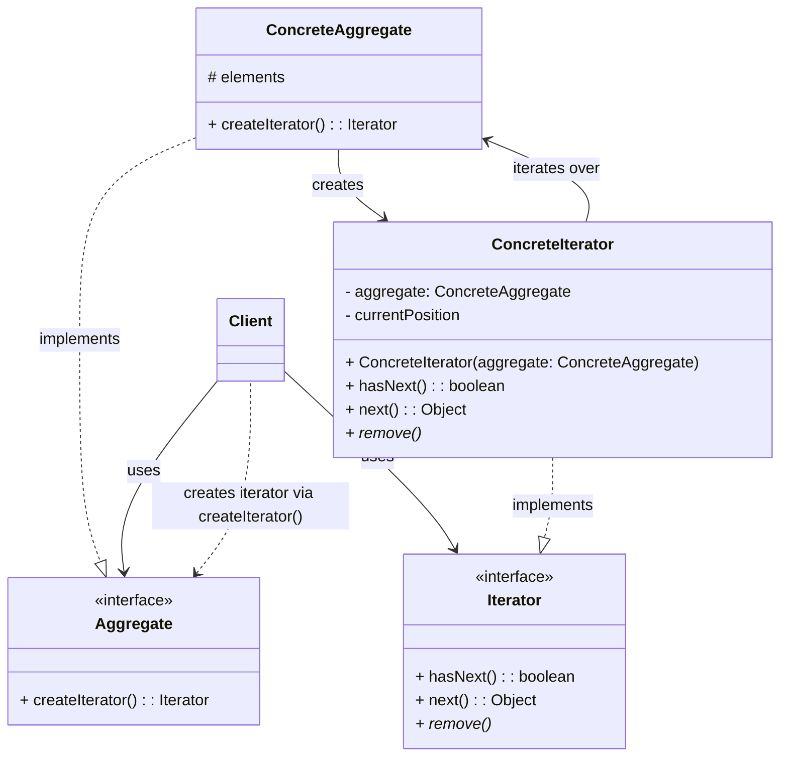

**目次**

- [デザインパターン詳細解説：Iterator パターン](#デザインパターン詳細解説iterator-パターン)
- [1. Iterator パターンとは？ ～目的と解決したい問題～](#1-iterator-パターンとは-目的と解決したい問題)
  - [1.1 このパターンを一言で言うと？（核心的な目的）](#11-このパターンを一言で言うと核心的な目的)
  - [1.2 なぜ Iterator パターンが必要なのか？（動機と背景）](#12-なぜ-iterator-パターンが必要なのか動機と背景)
    - [1.2.1 コレクションごとに異なるアクセス方法の問題](#121-コレクションごとに異なるアクセス方法の問題)
    - [1.2.2 内部構造を隠蔽し、アクセス方法を統一したい](#122-内部構造を隠蔽しアクセス方法を統一したい)
  - [1.3 このパターンで解決できること（メリットの要約）](#13-このパターンで解決できることメリットの要約)
- [2. パターンの構造と実装 ～どのように実現するか～](#2-パターンの構造と実装-どのように実現するか)
  - [2.1 登場人物とその役割（クラス図と解説）](#21-登場人物とその役割クラス図と解説)
    - [2.1.1 Iterator (イテレータ、反復子インターフェース)](#211-iterator-イテレータ反復子インターフェース)
    - [2.1.2 ConcreteIterator (具体的なイテレータ)](#212-concreteiterator-具体的なイテレータ)
    - [2.1.3 Aggregate (集合体インターフェース)](#213-aggregate-集合体インターフェース)
    - [2.1.4 ConcreteAggregate (具体的な集合体)](#214-concreteaggregate-具体的な集合体)
  - [2.2 実装のポイント：走査ロジックの分離と統一インターフェース](#22-実装のポイント走査ロジックの分離と統一インターフェース)
  - [2.3 コード例：具体的なシナリオでの実装](#23-コード例具体的なシナリオでの実装)
    - [2.3.1 シナリオ設定（例：本棚の本を順番に表示）](#231-シナリオ設定例本棚の本を順番に表示)
    - [2.3.2 サンプルコード（Java での例）](#232-サンプルコードjava-での例)
    - [2.3.3 コードのポイント解説](#233-コードのポイント解説)
- [3. Iterator パターンの利点 ～採用するメリット～](#3-iterator-パターンの利点-採用するメリット)
  - [3.1 内部構造の隠蔽（カプセル化の促進）](#31-内部構造の隠蔽カプセル化の促進)
  - [3.2 アクセス方法の統一とクライアントコードの単純化](#32-アクセス方法の統一とクライアントコードの単純化)
  - [3.3 走査ロジックの分離と多様な走査方法の提供](#33-走査ロジックの分離と多様な走査方法の提供)
  - [3.4 複数の走査の並行サポート](#34-複数の走査の並行サポート)
- [4. 注意点とトレードオフ ～適用前に考えるべきこと～](#4-注意点とトレードオフ-適用前に考えるべきこと)
  - [4.1 クラス数の増加と設計の複雑さ](#41-クラス数の増加と設計の複雑さ)
  - [4.2 走査中のコレクション変更（Concurrent Modification）](#42-走査中のコレクション変更concurrent-modification)
  - [4.3 単純なケースでの冗長性](#43-単純なケースでの冗長性)
  - [4.4 パフォーマンスへの影響（通常は軽微）](#44-パフォーマンスへの影響通常は軽微)
- [5. 実装上のヒントと考慮事項 ～より良く使うために～](#5-実装上のヒントと考慮事項-より良く使うために)
  - [5.1 言語やフレームワークの標準機能の活用](#51-言語やフレームワークの標準機能の活用)
  - [5.2 イテレータの堅牢性（Robustness）](#52-イテレータの堅牢性robustness)
  - [5.3 内部イテレータ vs 外部イテレータ](#53-内部イテレータ-vs-外部イテレータ)
  - [5.4 イテレータの状態管理](#54-イテレータの状態管理)
- [6. 他のパターンとの関連 ～比較と組み合わせ～](#6-他のパターンとの関連-比較と組み合わせ)
  - [6.1 似ているパターンとの比較](#61-似ているパターンとの比較)
  - [6.2 組み合わせると効果的なパターン](#62-組み合わせると効果的なパターン)
- [7. リファクタリング：いつ Iterator パターンを導入するか](#7-リファクタリングいつ-iterator-パターンを導入するか)
  - [7.1 導入のきっかけとなる「コードの不吉な臭い」](#71-導入のきっかけとなるコードの不吉な臭い)
  - [7.2 段階的なリファクタリング手順（概要）](#72-段階的なリファクタリング手順概要)
- [8. まとめ ～ Iterator パターンの本質～](#8-まとめ--iterator-パターンの本質)

# デザインパターン詳細解説：Iterator パターン

# 1. Iterator パターンとは？ ～目的と解決したい問題～

## 1.1 このパターンを一言で言うと？（核心的な目的）

Iterator パターンは、「**コレクション（要素の集まり）の内部表現を公開することなく、その要素に順番にアクセスする方法（走査）を提供する**」ためのデザインパターンです。要素へのアクセス方法をコレクション本体から分離します。

## 1.2 なぜ Iterator パターンが必要なのか？（動機と背景）

プログラムでは、配列、リスト、セット、マップ、木構造など、さまざまな方法でデータの集まり（コレクション）を扱います。これらのコレクションに格納された要素を 1 つずつ順番に取り出して処理したい、という要求は非常に一般的です。

### 1.2.1 コレクションごとに異なるアクセス方法の問題

もし、コレクションを利用する側のコード（クライアント）が、コレクションの**内部構造**（たとえば、それが配列なのか、連結リストなのか）を知っていて、その構造に合わせた方法（配列ならインデックス `i` を使う、リストなら `get(i)` を使うなど）で要素にアクセスしていると、以下のような問題が生じます。

- **内部構造への依存:** クライアントコードが、コレクションの**内部実装の詳細に強く依存**してしまいます。もし将来、コレクションの内部実装（データ構造）を変更した場合（たとえば、`ArrayList` を `LinkedList` に変えた場合）、要素にアクセスしているクライアントコードも**すべて修正する必要**が出てきます。これは保守性を著しく低下させます。
- **アクセスロジックの分散:** コレクションの要素を走査するためのロジック（ループの制御、インデックス管理など）が、コレクションを利用する**クライアントコードのあちこちに分散**してしまいます。似たようなループ処理が繰り返し書かれることになり、コードの重複や読みにくさを招きます。
- **統一性の欠如:** コレクションの種類ごとにアクセス方法が異なるため、異なる種類のコレクションを同じように扱いたい場合に、クライアント側で複雑な条件分岐が必要になることがあります。

### 1.2.2 内部構造を隠蔽し、アクセス方法を統一したい

オブジェクト指向の重要な原則の 1 つに**カプセル化**があります。コレクションの内部構造は、本来カプセル化によって隠蔽されるべき詳細情報です。クライアントは、内部がどうなっているかを知らなくても、必要な操作（要素の追加、削除、そして**順番にアクセス**）ができるべきです。

また、どのような種類のコレクションであっても、**要素を順番に走査するための標準的で統一された方法**があれば、クライアントコードはよりシンプルになり、異なるコレクションを透過的に扱えるようになります。

Iterator パターンは、これらの課題を解決するために考案されました。

## 1.3 このパターンで解決できること（メリットの要約）

Iterator パターンを適用することで、以下のようなメリットが期待できます。

- コレクションの**内部構造を隠蔽**できる（カプセル化の促進）。
- コレクションの種類にかかわらず、**統一的なインターフェース**で要素にアクセスできる。
- 要素を走査するロジックを、コレクション本体から**分離**できる。
- 1 つのコレクションに対して、**複数の異なる走査方法**（順方向、逆方向など）を提供できる。
- 複数のクライアントが**同時に、独立して**コレクションを走査できる。

---

# 2. パターンの構造と実装 ～どのように実現するか～

Iterator パターンは、コレクションの要素へのアクセス（走査）という責務を、コレクション本体から独立した「イテレータ」オブジェクトに委ねることで実現されます。

## 2.1 登場人物とその役割（クラス図と解説）

Iterator パターンは、主に 4 つの役割（インターフェースまたはクラス）から構成されます。

### 2.1.1 Iterator (イテレータ、反復子インターフェース)

- **役割:** コレクションの要素に順番にアクセスするための**統一的なインターフェース**を定義します。
- **主なメソッド:**
  - `hasNext()`: 次にアクセスすべき要素が存在するかどうかを判定する（通常 `boolean` を返す）。
  - `next()`: 次の要素を取得し、内部的な現在位置を次に進める（通常、要素の型を返す）。
  - `remove()` (任意): `next()` で返された要素をコレクションから削除する（サポートされない場合もある）。

### 2.1.2 ConcreteIterator (具体的なイテレータ)

- **役割:** `Iterator` インターフェースを実装し、**特定の `ConcreteAggregate`（具体的なコレクション）に対応した具体的な走査アルゴリズム**を提供します。
- **実装すること:**
  - どの `ConcreteAggregate` を走査するか、その参照を保持します。
  - 現在の走査位置（例: インデックス、ポインタ）を内部で管理します。
  - `hasNext()` と `next()` メソッドを、対象コレクションの構造に合わせて実装します。

### 2.1.3 Aggregate (集合体インターフェース)

- **役割:** `Iterator` オブジェクトを**生成するためのメソッド**（例: `iterator()`, `createIterator()`）を定義するインターフェース。
- **目的:** クライアントが、具体的なコレクションクラスを知らなくても、そのコレクションに対応する `Iterator` を取得できるようにします。

### 2.1.4 ConcreteAggregate (具体的な集合体)

- **役割:** `Aggregate` インターフェースを実装する、**実際のコレクションクラス**（例: `ArrayList`, `BookShelf` など）。要素を保持し、管理する責務を持ちます。
- **実装すること:**
  - `Aggregate` インターフェースで宣言された `iterator()` メソッドを実装し、自身に対応する `ConcreteIterator` のインスタンスを生成して返します。



_図: Iterator パターンのクラス図_

## 2.2 実装のポイント：走査ロジックの分離と統一インターフェース

- **責務の分離:** このパターンの核心は、**要素を保持・管理する責務 (Aggregate)** と、**要素を順番に走査する責務 (Iterator)** を明確に分離することにあります。これにより、コレクション本体のクラスは要素管理に集中でき、走査方法が複雑になっても本体クラスへの影響を抑えられます。
- **統一インターフェース:** クライアントは、具体的なコレクションクラス (`ConcreteAggregate`) や具体的なイテレータクラス (`ConcreteIterator`) を意識する必要がなく、抽象的な `Aggregate` インターフェースと `Iterator` インターフェースのみを通じて操作を行います。これにより、クライアントコードとコレクション実装の間の**結合度が低下**します。
- **イテレータの生成:** `ConcreteAggregate` が自身に対応する `ConcreteIterator` を生成する責務を持ちます (`createIterator()` メソッド)。これは **Factory Method パターン**の一種と見なすこともできます。
- **内部イテレータと外部イテレータ:**
  - **外部イテレータ (External Iterator):** 上記の構造のように、クライアントがイテレータを明示的に取得し、`next()` を呼び出して走査を進める方式。クライアントが走査のタイミングを制御できます。（Java の `java.util.Iterator` はこれにあたる）
  - **内部イテレータ (Internal Iterator):** イテレータが走査の制御を持ち、各要素に対してクライアントが提供した処理（関数やラムダ式など）を実行する方式。（Smalltalk の `do:` メソッドや、Java の `Stream API` の `forEach` などがこれに近い考え方）

## 2.3 コード例：具体的なシナリオでの実装

### 2.3.1 シナリオ設定（例：本棚の本を順番に表示）

複数の本 (`Book`) オブジェクトを保持する本棚 (`BookShelf`) クラスがあり、その本棚に格納されている本のタイトルを順番に表示したい、というシナリオを考えます。本棚の内部実装（配列かリストかなど）をクライアントに意識させずに実現します。

### 2.3.2 サンプルコード（Java での例）

(※ 前回の回答で提示したコード例と同様です。Java の標準インターフェース `Iterable` と `Iterator` を利用する形で示します。)

```java
import java.util.ArrayList;
import java.util.List;
import java.util.Iterator; // Java 標準の Iterator
import java.util.NoSuchElementException;

// 要素となるクラス (例)
class Book {
    private String title;
    public Book(String title) { this.title = title; }
    public String getTitle() { return title; }
}

// ConcreteAggregate: 本棚クラス (Java標準のIterableを実装)
class BookShelf implements Iterable<Book> { // ★ Iterable を実装
    private List<Book> books; // 内部実装として ArrayList を使用

    public BookShelf() {
        this.books = new ArrayList<>();
    }

    public void addBook(Book book) {
        this.books.add(book);
    }

    // Iterator から利用されるメソッド群 (package-private や private でも可)
    /* protected */ Book getBookAt(int index) {
        return books.get(index);
    }
    /* protected */ int getLength() {
        return books.size();
    }

    // ★ Iterable インターフェースの iterator メソッドを実装
    @Override
    public Iterator<Book> iterator() {
        return new BookShelfIterator(this); // 対応する ConcreteIterator を返す
    }
}

// ConcreteIterator: 本棚用のイテレータ (Java標準のIteratorを実装)
class BookShelfIterator implements Iterator<Book> { // ★ Iterator を実装
    private BookShelf bookShelf;
    private int index;

    public BookShelfIterator(BookShelf bookShelf) {
        this.bookShelf = bookShelf;
        this.index = 0;
    }

    // ★ hasNext の実装
    @Override
    public boolean hasNext() {
        return index < bookShelf.getLength();
    }

    // ★ next の実装
    @Override
    public Book next() {
        if (!hasNext()) {
            throw new NoSuchElementException();
        }
        Book book = bookShelf.getBookAt(index);
        index++;
        return book;
    }

    // remove メソッドは任意 (今回は実装しないのでデフォルトのままでも良いが、
    // 明示的に UnsupportedOperationException を投げるのが親切)
    @Override
    public void remove() {
        throw new UnsupportedOperationException("remove operation is not supported");
    }
}

// --- Client (利用側) ---
public class IteratorClient {
    public static void main(String[] args) {
        BookShelf bookShelf = new BookShelf();
        bookShelf.addBook(new Book("デザインパターン入門"));
        bookShelf.addBook(new Book("Clean Code"));
        bookShelf.addBook(new Book("Effective Java"));

        // --- 方法1: Iterator を直接使う ---
        System.out.println("--- Iterator を直接使用 ---");
        Iterator<Book> it = bookShelf.iterator(); // AggregateからIteratorを取得
        while (it.hasNext()) { // hasNextで確認
            Book book = it.next(); // nextで要素を取得
            System.out.println(book.getTitle());
        }

        // --- 方法2: 拡張 for 文を使う (Iterable を実装しているため可能) ---
        System.out.println("\n--- 拡張 for 文を使用 ---");
        for (Book book : bookShelf) { // 内部で iterator() が呼ばれ、hasNext/nextが使われる
            System.out.println(book.getTitle());
        }

        // Client は BookShelf の内部が ArrayList であることを気にする必要がない！
    }
}
```

### 2.3.3 コードのポイント解説

- `BookShelf` (ConcreteAggregate) は `Iterable<Book>` を実装し、`iterator()` メソッドを提供します。これにより、拡張 `for` 文で利用可能になります。
- `BookShelfIterator` (ConcreteIterator) は `Iterator<Book>` を実装し、`hasNext()` と `next()` で具体的な走査ロジック（配列のインデックスを進める）を実装します。`BookShelf` への参照を持ち、その `getLength()` や `getBookAt()` を利用して走査を行います。
- クライアント (`IteratorClient`) は、`BookShelf` から `iterator()` を使って `Iterator` を取得するか、あるいは直接拡張 `for` 文を使います。どちらの方法でも、`BookShelf` の内部実装（`ArrayList` を使っていること）を意識する必要はありません。

このように、Iterator パターンはコレクションの内部構造を隠蔽し、統一的なアクセス方法を提供します。多くの言語では標準ライブラリでサポートされているため、自前で実装する機会は少ないかもしれませんが、その仕組みを理解しておくことは非常に重要です。

---

# 3. Iterator パターンの利点 ～採用するメリット～

Iterator パターンを適用することで、コレクション（要素の集まり）とその利用方法に関して、多くの設計上のメリットが得られます。

## 3.1 内部構造の隠蔽（カプセル化の促進）

これが Iterator パターンのもっとも重要なメリットの 1 つです。コレクションを利用するクライアントコードは、そのコレクションが内部で**どのように要素を保持・管理しているか（配列なのか、連結リストなのか、木構造なのか等）を知る必要がなくなります**。

クライアントは、標準化された `Iterator` インターフェース（`hasNext()`, `next()` など）を通じてのみ要素にアクセスします。これにより、コレクションクラスの**内部実装の詳細が外部から隠蔽され、カプセル化が強化**されます。

この結果、コレクションクラスの内部実装（たとえば、パフォーマンス改善のために `ArrayList` から `LinkedList` に変更するなど）を、**クライアントコードに影響を与えることなく自由に変更**することが可能になります。これはソフトウェアの**保守性**を大幅に向上させます。

## 3.2 アクセス方法の統一とクライアントコードの単純化

異なる種類のコレクション（リスト、セット、自作のコレクションなど）があったとしても、それぞれが `Iterator` を提供するように設計されていれば、クライアントは**どのコレクションに対しても同じ方法（`Iterator` インターフェースを使う）で要素にアクセス**できます。

これにより、クライアント側のコードは特定のコレクション実装に依存することなく、より**汎用的かつシンプル**に記述できます。コレクションの種類ごとにアクセス方法を `if` 文などで分岐させる必要がなくなります。多くの言語で提供されている拡張 `for` 文（`for-each` ループ）は、この統一インターフェースの恩恵を活かした代表的な例です。

## 3.3 走査ロジックの分離と多様な走査方法の提供

要素を順番にアクセスする（走査する）ためのロジックは、コレクション本体 (`Aggregate`) から `Iterator` クラスに分離されます。これにより、`Aggregate` は要素の保持・管理という本来の責務に集中でき、`Iterator` は走査という責務に集中できます（**単一責任の原則**）。

さらに、この分離により、**1 つのコレクションに対して複数の異なる走査方法**を提供することが容易になります。たとえば、

- 通常の順方向イテレータ (`ForwardIterator`)
- 逆方向イテレータ (`ReverseIterator`)
- 特定の条件を満たす要素のみを返すフィルタリングイテレータ (`FilteringIterator`)
- 木構造を深さ優先または幅優先で走査するイテレータ

など、必要に応じてさまざまな種類の `ConcreteIterator` を作成し、クライアントに提供できます。クライアントは、利用したい走査方法に対応する `Iterator` を取得して使うだけです。

## 3.4 複数の走査の並行サポート

クライアントがコレクションから `iterator()` メソッドを呼び出すたびに、通常は新しい `Iterator` インスタンスが生成されます。各 `Iterator` インスタンスは、自身の現在の走査位置を独立して管理します。

これにより、**同じコレクションオブジェクトに対して、複数のクライアント（または同じクライアント内の異なる部分）が、それぞれ異なるペースで、互いに影響を与えることなく同時に要素を走査する**ことが可能になります。

これらの利点により、Iterator パターンは、コレクションとそのクライアント間の結合度を下げ、コードの再利用性、保守性、拡張性を高めるための、オブジェクト指向における基本的な設計パターンとして広く認識され、利用されています。

---

# 4. 注意点とトレードオフ ～適用前に考えるべきこと～

Iterator パターンは多くのメリットを提供しますが、万能ではありません。適用する際にはいくつかの注意点や考慮すべきトレードオフが存在します。

## 4.1 クラス数の増加と設計の複雑さ

Iterator パターンを厳密に適用しようとすると、コレクションクラス (`ConcreteAggregate`) ごとに、対応するイテレータクラス (`ConcreteIterator`) を作成する必要があります。また、`Aggregate` と `Iterator` のインターフェースも必要です。

コレクションの種類が多かったり、単純なコレクションに対してもパターンを適用したりすると、**システム全体のクラス数が増加**し、設計が**やや複雑になる**可能性があります。

ただし、多くの現代的なプログラミング言語では、標準ライブラリで `Iterator` や `Iterable` に相当するインターフェースや、それらを簡単に実装するための仕組み（例: C# の `yield return`、Python のジェネレータ）が提供されているため、自前ですべてのクラスを実装する手間が軽減される場合も多いです。また、内部クラスや匿名クラス、ラムダ式などを使って、`ConcreteIterator` の実装を簡略化することも可能です。

## 4.2 走査中のコレクション変更（Concurrent Modification）

Iterator がコレクションの要素を走査している最中に、**別の場所からそのコレクション自体が変更（要素の追加、削除など）される**と、予期せぬ問題が発生する可能性があります。

- **予期しない動作:** イテレータがすでに通り過ぎたはずの要素に再度アクセスしたり、スキップしてしまったりする可能性があります。
- **エラーの発生:** 多くの実装（とくに Java の `java.util` パッケージのコレクション）では、走査中の変更を検知すると **`ConcurrentModificationException`** のような例外をスローして、安全のために処理を中断します（**フェイルファスト設計**）。

この問題に対処するには、いくつかの方法が考えられます。

- **不変 (Immutable) コレクション:** そもそも変更不可能なコレクションに対して Iterator を使う。
- **コピーオンライト (Copy-on-Write):** 変更時にコレクションのコピーを作成し、イテレータは元の（変更前の）コピーを走査し続ける。
- **明示的なロック:** 走査中はコレクションへの変更をロックする（ただし、パフォーマンスやデッドロックのリスクに注意が必要）。
- **イテレータの `remove()` メソッド:** イテレータ自身が提供する `remove()` メソッド（実装されていれば）を使って要素を削除する。これならイテレータは変更を認識できます。

いずれにせよ、コレクションを走査中に変更する可能性がある場合は、その影響を十分に考慮し、安全な方法を選択する必要があります。

## 4.3 単純なケースでの冗長性

コレクションが非常に単純で（例: 内部が単純な配列で、サイズも小さい）、かつその内部構造が変更される可能性が低い場合、Iterator パターンを厳密に導入することが過剰設計となり、コードが冗長に感じられる可能性もあります。

たとえば、メソッド内部だけで使われる一時的な小さな配列に対して、わざわざ `Iterator` クラスを作成するのは、多くの場合やりすぎでしょう。通常の `for` ループなどで直接アクセスする方がシンプルで分かりやすい場合もあります。

パターンの適用は、常に費用対効果 (導入によるメリットと、複雑さの増加というコスト) を考慮して判断すべきです。

## 4.4 パフォーマンスへの影響（通常は軽微）

Iterator を介したアクセスは、配列のインデックスを使った直接アクセスなどに比べると、メソッド呼び出しなどのオーバーヘッドが若干発生します。しかし、ほとんどのアプリケーションにおいて、このオーバーヘッドが性能上のボトルネックになることは稀です。

コレクションのサイズが非常に大きい場合や、アクセス頻度が極端に高い性能クリティカルな箇所では、イテレータの利用による影響を測定・考慮する必要があるかもしれませんが、通常は Iterator パターンがもたらす設計上のメリット（カプセル化、柔軟性、保守性）の方が重要視されます。

これらの注意点とトレードオフを理解した上で、Iterator パターンの適用を検討することが、より良い設計判断につながります。

---

# 5. 実装上のヒントと考慮事項 ～より良く使うために～

Iterator パターンを効果的に実装し、活用するためには、いくつかのヒントや考慮事項があります。

## 5.1 言語やフレームワークの標準機能の活用

多くのモダンなプログラミング言語（Java, C#, Python, Ruby, JavaScript など）では、Iterator パターンをサポートするための**標準的なインターフェースや構文**が用意されています。

- **Java:** `java.util.Iterator<E>` インターフェースと `java.lang.Iterable<E>` インターフェース。`Iterable` を実装すれば、拡張 `for` 文 (`for (Element e : collection)`) が利用可能になります。
- **C#:** `System.Collections.Generic.IEnumerator<T>` インターフェースと `System.Collections.Generic.IEnumerable<T>` インターフェース。`IEnumerable<T>` を実装すれば `foreach` ループが利用可能です。`yield return` キーワードを使うと `IEnumerator<T>` の実装を大幅に簡略化できます。
- **Python:** イテレータプロトコル (`__iter__()` メソッドと `__next__()` メソッド）。`for ... in ...` 構文で利用できます。ジェネレータ (`yield`) を使うと簡単にイテレータを作成できます。

可能な限り、これらの**標準的な仕組みを利用する**ことを強く推奨します。これにより、

- コードの記述量を削減できます。
- 他の開発者にとって馴染み深く、理解しやすいコードになります。
- 言語が提供する便利な構文（拡張 `for` 文など）の恩恵を受けることができます。

独自に `MyIterator` のようなインターフェースを定義するのではなく、まずは標準の仕組みを使えないか検討しましょう。

## 5.2 イテレータの堅牢性（Robustness）

イテレータを実装する際には、予期せぬ状況（例: コレクションが空、`next()` が `hasNext()` が `false` のときに呼ばれる）に対する考慮が必要です。

- **`hasNext()` が `false` の場合の `next()`:** `NoSuchElementException` (Java) のような適切な例外をスローするのが一般的です。これにより、クライアントが誤った使い方をした場合に、問題を早期に検知できます。
- **空のコレクション:** コレクションが空の場合でも、`iterator()` は有効なイテレータ（`hasNext()` が最初から `false` を返す）を返すべきです。`null` を返すのは避けるべきです（NullPointerException の原因）。
- **`remove()` メソッド:** `remove()` 操作をサポートしない場合は、`UnsupportedOperationException` (Java) をスローするように実装するのが良いプラクティスです。単に何もしないという実装は、クライアントに誤解を与える可能性があります。

## 5.3 内部イテレータ vs 外部イテレータ

前述（2.2 節）したように、イテレータには大きく分けて外部イテレータと内部イテレータのアプローチがあります。

- **外部イテレータ (External Iterator):**
  - クライアントが `hasNext()` と `next()` を使って明示的に走査を制御します。
  - Java の `Iterator`, C# の `IEnumerator` はこちらです。
  - **利点:** クライアントが走査のタイミングや、各要素に対する処理を細かく制御できます。複数のコレクションを並行して走査するような複雑な処理も可能です。
  - **欠点:** ループ制御のコード（`while (it.hasNext()) { ... it.next(); }`）をクライアントが書く必要があります（ただし拡張 for 文で隠蔽されることが多い）。
- **内部イテレータ (Internal Iterator):**
  - コレクション自身（またはイテレータ）が走査のループを制御し、各要素に対してクライアントが提供した処理（コールバック関数、ラムダ式など）を実行します。
  - Java の `Stream API` の `forEach()`, Ruby の `each` メソッドなどがこの考え方に近いです。
  - **利点:** クライアント側のコードが非常にシンプルになります。ループ制御の記述が不要です。
  - **欠点:** クライアント側での複雑な走査制御（例: 特定の条件でループを中断する、複数のコレクションを同時に走査する）が難しくなる場合があります。

どちらのアプローチが良いかは、言語の機能や設計の要求によって異なります。Java や C# では外部イテレータが基本ですが、関数型プログラミングの要素を取り入れたライブラリ（Stream API など）では内部イテレータ的なスタイルも多用されます。

## 5.4 イテレータの状態管理

`ConcreteIterator` は、現在の走査位置を内部で保持・管理する必要があります。この状態管理が複雑にならないように、シンプルに実装することを心がけます。配列やリストの場合はインデックス変数で十分ですが、木構造などの複雑なデータ構造の場合は、スタックやキューを使って走査状態を管理する必要があるかもしれません。

これらのヒントを参考に、言語の機能を活かしつつ、堅牢で分かりやすい Iterator パターンの実装を目指しましょう。

---

# 6. 他のパターンとの関連 ～比較と組み合わせ～

Iterator パターンは、他のデザインパターンと連携して使われたり、関連性の高いパターンと比較されたりすることがあります。これらの関係性を知ることで、Iterator パターンの位置づけや応用範囲への理解が深まります。

## 6.1 似ているパターンとの比較

Iterator パターン自体は非常にユニークな目的（コレクションの走査）を持っていますが、関連する概念として以下のパターンとの比較が考えられます。

- **Visitor パターン:**
  - **関連性:** Visitor パターンも、データ構造（とくに Composite パターンで構築されたような複雑な構造）の要素を巡回（トラバース）し、各要素に対して操作を行う点で似ています。
  - **違い:** Iterator は要素への**アクセス方法**を抽象化・提供することに主眼があるのに対し、Visitor は要素に対する**操作 (処理)** を分離し、新しい操作を追加しやすくすることに主眼があります。Iterator は「どうやって次に進むか」を提供し、Visitor は「各要素で何をするか」を定義します。しばしば、Visitor パターンは内部で Iterator（またはそれに類する走査メカニズム）を利用します。
- **(内部イテレータと) Command パターン:**
  - **関連性:** 内部イテレータのように、各要素に対して特定の処理（コマンド）を実行させたい場合があります。
  - **違い:** Iterator はあくまで要素への**アクセス手段**を提供するのに対し、Command は**操作（アクション）そのもの**をオブジェクトとしてカプセル化します。内部イテレータのコールバック処理が複雑になる場合に、その処理を Command オブジェクトとして渡す、といった組み合わせは考えられます。

## 6.2 組み合わせると効果的なパターン

Iterator パターンは、他のパターンと組み合わせて使われることで、その効果を発揮することがよくあります。

- **Composite パターン:**
  - **連携:** Composite パターンで構築された木構造のような再帰的なデータ構造に対して、その要素（`Leaf` や `Composite`）を順番に、あるいは特定の順序（深さ優先、幅優先など）で**走査**するために、Iterator パターンが非常によく用いられます。`Composite` クラスが `Aggregate` インターフェースを実装し、木構造を走査するための `ConcreteIterator` を提供します。
- **Factory Method パターン:**
  - **連携:** `Aggregate` インターフェースの `iterator()` (または `createIterator()`) メソッドは、**対応する `ConcreteIterator` を生成する**役割を持ちます。これは、生成するオブジェクトの種類（この場合は `ConcreteIterator`）をサブクラス（`ConcreteAggregate`）に決定させる **Factory Method パターン**の適用例と見なすことができます。
- **Memento パターン:**
  - **連携:** イテレータが複雑な走査状態（例: グラフ探索の途中状態など）を持つ場合、その状態を保存しておき、あとで復元したいという要求があるかもしれません。このような場合に、イテレータの内部状態を **Memento パターン**を使って外部に保存・復元する仕組みを考えることができます。（ただし、これは比較的まれなケースです）

Iterator パターンは、コレクションを扱う上で基本的な役割を果たすため、データ構造に関連する他の多くのパターン（Composite など）と自然に連携します。また、その生成メカニズムには Factory Method の考え方が含まれています。これらの関連性を理解しておくと、より大きな設計の中で Iterator パターンを効果的に位置づけることができます。

---

# 7. リファクタリング：いつ Iterator パターンを導入するか

Iterator パターンは、新しいコレクションクラスを設計する際に最初から導入されることも多いですが、既存のコードを改善する**リファクタリング**の過程で適用することも有効です。ここでは、どのような状況が Iterator パターンの導入を示唆するのか、そしてどのようにリファクタリングを進めるかの概要を見ていきます。

## 7.1 導入のきっかけとなる「コードの不吉な臭い」

既存のコードベースの中に以下のような兆候（コードの不吉な臭い）が見られた場合、Iterator パターンの導入を検討する価値があります。

- **コレクションの内部構造への直接アクセス:**
  - **症状:** クライアントコード（コレクションを利用する側のコード）が、コレクションクラスの内部的なデータ構造（例: `public` な配列フィールド、`List` 型のゲッターなど）に直接アクセスし、それを使って `for` ループなどで要素を走査している。
  - **問題:** クライアントがコレクションの内部実装に強く依存してしまい、カプセル化が破れています。コレクションの内部構造を変更すると、クライアントコードの修正が必要になります。
  - **解決策:** Iterator パターンを導入し、内部構造を隠蔽します。クライアントは `Iterator` インターフェースを通じてのみ要素にアクセスするように変更します。
- **クライアントコード内での複雑な走査ロジック:**
  - **症状:** コレクションの要素を走査するためのループ制御（インデックス管理、終了条件判定など）が、コレクションを利用するクライアントコードのあちこちに記述されており、そのロジックが複雑になっている。
  - **問題:** 走査ロジックがクライアント側に分散し、コードが読みにくく、保守も困難になります。同じような走査ロジックが重複して書かれる可能性もあります。
  - **解決策:** Iterator パターンを導入し、走査ロジックを `ConcreteIterator` クラスにカプセル化します。クライアントは単純に `Iterator` の `hasNext()` と `next()` を呼び出すだけでよくなります。
- **多様な走査方法の必要性:**
  - **症状:** 1 つのコレクションに対して、順方向だけでなく逆方向、あるいは特定の条件でフィルタリングしながら走査したい、といった複数の走査方法が必要になってきたが、それらをクライアント側で `if` 文などで実装しようとしてコードが複雑化している。
  - **問題:** クライアントコードが肥大化し、新しい走査方法の追加が困難になります。
  - **解決策:** Iterator パターンを導入し、それぞれの走査方法に対応する `ConcreteIterator` クラスを作成します。クライアントは必要に応じて適切な `Iterator` を取得して利用します。

これらの「臭い」は、コレクションとその利用側の間の結合度が高すぎる、あるいは責務の分離が不十分であることを示唆しており、Iterator パターンの導入によって設計を改善できる可能性を示しています。

## 7.2 段階的なリファクタリング手順（概要）

既存のコレクションクラスに Iterator パターンを導入する際の、一般的なリファクタリング手順の概要は以下の通りです。（安全に進めるためには、テストが整備されていることが望ましいです）

1. **`Iterator` インターフェースの定義（または選択）:**
   - 言語標準のイテレータインターフェース（例: `java.util.Iterator`）を利用するか、必要であれば独自の `Iterator` インターフェースを定義します。主要なメソッド (`hasNext()`, `next()`) を含めます。
2. **`Aggregate` インターフェースの定義（または選択）:**
   - 言語標準の集合体インターフェース（例: `java.lang.Iterable`）を利用するか、必要であれば独自の `Aggregate` インターフェースを定義します。`iterator()` (または `createIterator()`) メソッドを含めます。
3. **`ConcreteIterator` クラスの作成:**
   - 対象となる `ConcreteAggregate` クラスの内部構造に合わせて、`Iterator` インターフェースを実装する `ConcreteIterator` クラスを作成します。
   - このクラスは、`ConcreteAggregate` への参照と、現在の走査位置を保持します。
   - `hasNext()` と `next()` メソッドに、具体的な走査ロジックを実装します。
4. **`ConcreteAggregate` クラスの修正:**
   - `Aggregate` インターフェースを実装します（まだ実装していない場合）。
   - `iterator()` メソッドを実装し、ステップ 3 で作成した `ConcreteIterator` のインスタンスを生成して返すようにします。
   - （推奨）これまで内部構造を外部に公開していたメソッド（例: 配列を直接返すゲッターなど）があれば、アクセスレベルを下げる（`private` や `protected` にする）か、削除することを検討します。
5. **クライアントコードの修正:**
   - コレクションの内部構造に直接アクセスしていた箇所を修正し、代わりに `iterator()` メソッドで `Iterator` を取得し、`hasNext()` と `next()` を使って要素を走査するように書き換えます。（または、言語の拡張 `for` 文など、イテレータを利用する構文に書き換えます）
6. **テスト:** 各ステップの後、および最終的に、テストを実行してリファクタリングによって外部から見た振る舞いが変わっていないこと、そしてクライアントコードが正しく動作することを確認します。

このリファクタリングにより、コレクションクラスのカプセル化が強化され、クライアントコードはコレクションの内部実装から独立し、よりシンプルで保守しやすい形になります。

---

# 8. まとめ ～ Iterator パターンの本質～

**Iterator パターン**は、データ構造（コレクション）とその**要素へのアクセス（走査）方法を分離**するための、オブジェクト指向における基本的なデザインパターンです。

このパターンを適用することで、

- コレクションの**内部実装をクライアントから隠蔽**し、カプセル化を強化できる。
- どのような種類のコレクションに対しても、**統一されたインターフェース** (`hasNext()`, `next()`) で要素にアクセスできる。
- 要素を走査するための**ロジックを、コレクション本体から独立した `Iterator` オブジェクトに分離**できる。
- 順方向、逆方向、フィルタリングなど、**多様な走査方法を容易に追加・提供**できる。

といったメリットが得られ、結果としてソフトウェアの**保守性、再利用性、拡張性**が向上します。

その本質は、「**コレクションを『巡る』という責務を別のオブジェクト（Iterator）に委譲し、そのための標準的な『会話方法』（インターフェース）を定義する**」ことにあります。これにより、コレクションを使う側は、内部がどうなっているかを気にすることなく、「次の要素をください」と頼むだけでよくなります。

多くのプログラミング言語では、この Iterator パターンの考え方が標準ライブラリや言語機能（拡張 for 文など）に組み込まれており、開発者は日常的にその恩恵を受けています。たとえ自ら `Iterator` を実装する機会が少なくても、このパターンがどのように機能し、どのような問題を解決するのかを理解しておくことは、ライブラリを効果的に利用したり、データアクセスに関するコードを設計したりする上で非常に重要です。

Iterator パターンは、オブジェクト指向における**カプセル化**と**インターフェースによる抽象化**の強力さを示す好例と言えるでしょう。
