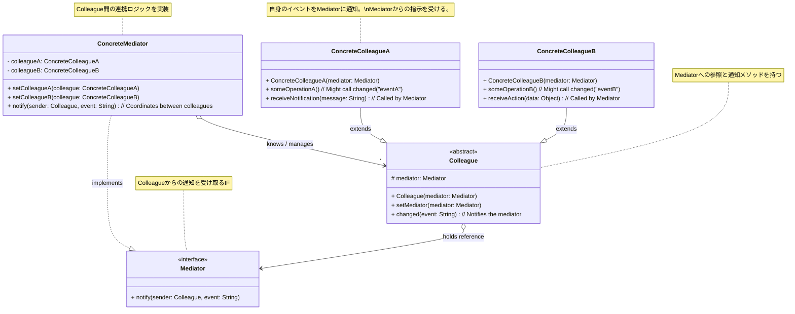

**目次**

- [デザインパターン詳細解説：Mediator パターン](#デザインパターン詳細解説mediator-パターン)
- [1. Mediator パターンとは？ ～目的と解決したい問題～](#1-mediator-パターンとは-目的と解決したい問題)
  - [1.1 このパターンを一言で言うと？（核心的な目的）](#11-このパターンを一言で言うと核心的な目的)
  - [1.2 なぜ Mediator パターンが必要なのか？（動機と背景）](#12-なぜ-mediator-パターンが必要なのか動機と背景)
    - [1.2.1 オブジェクト間の複雑な相互作用（網の目状の依存関係）](#121-オブジェクト間の複雑な相互作用網の目状の依存関係)
    - [1.2.2 密結合が引き起こす問題点（変更の影響、再利用性の低下）](#122-密結合が引き起こす問題点変更の影響再利用性の低下)
    - [1.2.3 コミュニケーションを一元管理したい](#123-コミュニケーションを一元管理したい)
  - [1.3 このパターンで解決できること（メリットの要約）](#13-このパターンで解決できることメリットの要約)
- [2. パターンの構造と実装 ～どのように実現するか～](#2-パターンの構造と実装-どのように実現するか)
  - [2.1 登場人物とその役割（クラス図と解説）](#21-登場人物とその役割クラス図と解説)
  - [2.2 実装のポイント：コミュニケーションの仲介](#22-実装のポイントコミュニケーションの仲介)
  - [2.3 コード例：具体的なシナリオでの実装](#23-コード例具体的なシナリオでの実装)
    - [2.3.1 シナリオ設定（例：チャットルーム）](#231-シナリオ設定例チャットルーム)
    - [2.3.2 サンプルコード（Java での例）](#232-サンプルコードjava-での例)
    - [2.3.3 コードのポイント解説](#233-コードのポイント解説)
- [3. Mediator パターンの利点 ～採用するメリット～](#3-mediator-パターンの利点-採用するメリット)
  - [3.1 Colleague 間の疎結合](#31-colleague-間の疎結合)
  - [3.2 相互作用ロジックの一元管理と単純化](#32-相互作用ロジックの一元管理と単純化)
  - [3.3 再利用性の向上](#33-再利用性の向上)
  - [3.4 拡張性の向上](#34-拡張性の向上)
- [4. 注意点とトレードオフ ～適用前に考えるべきこと～](#4-注意点とトレードオフ-適用前に考えるべきこと)
  - [4.1 Mediator の肥大化リスク（神クラス化）](#41-mediator-の肥大化リスク神クラス化)
  - [4.2 パフォーマンスへの影響（間接性によるオーバーヘッド）](#42-パフォーマンスへの影響間接性によるオーバーヘッド)
  - [4.3 適用範囲の見極め](#43-適用範囲の見極め)
  - [4.4 Mediator の発見・設定方法](#44-mediator-の発見設定方法)
- [5. 実装上のヒントと考慮事項 ～より良く使うために～](#5-実装上のヒントと考慮事項-より良く使うために)
  - [5.1 Mediator と Colleague の間の通知方法](#51-mediator-と-colleague-の間の通知方法)
  - [5.2 `Colleague` のインターフェース/抽象クラス](#52-colleague-のインターフェース抽象クラス)
  - [5.3 `Mediator` のインスタンス化と設定](#53-mediator-のインスタンス化と設定)
  - [5.4 `Mediator` のスコープ](#54-mediator-のスコープ)
- [6. 他のパターンとの関連 ～比較と組み合わせ～](#6-他のパターンとの関連-比較と組み合わせ)
  - [6.1 似ているパターンとの比較](#61-似ているパターンとの比較)
    - [6.1.1 Mediator vs Observer](#611-mediator-vs-observer)
    - [6.1.2 Mediator vs Facade](#612-mediator-vs-facade)
    - [6.1.3 Mediator vs Command](#613-mediator-vs-command)
  - [6.2 組み合わせると効果的なパターン](#62-組み合わせると効果的なパターン)
- [7. リファクタリング：いつ Mediator パターンを導入するか](#7-リファクタリングいつ-mediator-パターンを導入するか)
  - [7.1 導入のきっかけとなる「コードの不吉な臭い」や状況変化](#71-導入のきっかけとなるコードの不吉な臭いや状況変化)
  - [7.2 段階的なリファクタリング手順（概要）](#72-段階的なリファクタリング手順概要)
- [8. まとめ ～ Mediator パターンの本質～](#8-まとめ--mediator-パターンの本質)

# デザインパターン詳細解説：Mediator パターン

# 1. Mediator パターンとは？ ～目的と解決したい問題～

## 1.1 このパターンを一言で言うと？（核心的な目的）

Mediator パターンは、「**多数のオブジェクト（Colleague: 同僚）間の複雑な相互作用（コミュニケーション）を、専用の仲介オブジェクト（Mediator: 調停者）にカプセル化する**」ための、振る舞いに関するデザインパターンです。オブジェクト間の直接的な依存関係を減らし、疎結合なシステムを構築することを目指します。

## 1.2 なぜ Mediator パターンが必要なのか？（動機と背景）

オブジェクト指向でシステムを設計する際、複数のオブジェクトが互いに連携しあって機能を実現することは一般的です。しかし、連携するオブジェクトの数が増えるにつれて、その関係性が複雑化し、問題を引き起こすことがあります。

### 1.2.1 オブジェクト間の複雑な相互作用（網の目状の依存関係）

たとえば、GUI アプリケーションのダイアログボックスを考えてみましょう。テキストボックス、リストボックス、チェックボックス、ボタンなど、複数のウィジェット（オブジェクト）が存在し、互いに影響しあいます。

- リストボックスで項目を選択すると、テキストボックスの内容が更新され、ボタンが有効化される。
- チェックボックスの状態によって、リストボックスの選択肢が変わる。
- テキストボックスへの入力内容に応じて、ボタンの有効/無効が切り替わる。

もし、これらのウィジェットが**互いに直接参照し合い、直接メソッドを呼び出しあって**状態の変更や通知を行っていると、ウィジェット間の依存関係は**網の目状（スパゲッティ状）**になり、非常に複雑になります。

### 1.2.2 密結合が引き起こす問題点（変更の影響、再利用性の低下）

このようなオブジェクト間の密結合な状態は、以下のような問題を引き起こします。

- **変更の影響が大きい:** あるウィジェットの仕様や振る舞いを変更した場合、それが依存している他の多くのウィジェットに影響を及ぼし、予期せぬバグや広範囲な修正が必要になる可能性があります。
- **再利用性の低下:** 各ウィジェットが他の多くのウィジェットのことを知っている（依存している）ため、特定のウィジェットだけを別のダイアログやアプリケーションで再利用することが困難になります。
- **理解の困難さ:** オブジェクト間の相互作用のロジックが各オブジェクト内に分散してしまい、システム全体の動作や、特定のイベントがどのように伝播していくのかを理解するのが難しくなります。

### 1.2.3 コミュニケーションを一元管理したい

これらの問題を解決するためには、オブジェクト同士が直接やり取りするのではなく、**コミュニケーションや相互作用のロジックを一箇所に集約し、管理する**仕組みが必要です。

Mediator パターンは、この「**コミュニケーションの仲介役**」として `Mediator` オブジェクトを導入し、各オブジェクト (`Colleague`) は `Mediator` を介してのみ他のオブジェクトとやり取りするようにします。

## 1.3 このパターンで解決できること（メリットの要約）

Mediator パターンを適用することで、以下のようなメリットが期待できます。

- オブジェクト（`Colleague`）間の**直接的な依存関係をなくし、疎結合**にする。
- オブジェクト間の**相互作用（コミュニケーション）のロジックを `Mediator` に集約**し、一元管理できる。
- 個々のオブジェクト（`Colleague`）の**再利用性**を高める。
- システムの**変更や拡張**を容易にする（影響範囲を局所化できる）。
- システム全体の**コミュニケーションの流れを理解しやすく**する。

---

# 2. パターンの構造と実装 ～どのように実現するか～

Mediator パターンは、オブジェクト間のコミュニケーションを仲介する `Mediator` オブジェクトを導入することで、直接的な依存関係を排除します。

## 2.1 登場人物とその役割（クラス図と解説）

Mediator パターンは、主に以下の 4 つの役割から構成されます。

- **`Mediator`（調停者インターフェース）:**
  - **役割:** `Colleague` オブジェクトとの**コミュニケーションのためのインターフェース**を定義します。`Colleague` オブジェクトはこのインターフェースを通じて `Mediator` とやり取りします。
  - **定義:** 通常、特定の `Colleague` から通知を受け取るためのメソッドや、`Colleague` 間の調整を行うためのメソッドなどを宣言します。
- **`ConcreteMediator`（具体的な調停者）:**
  - **役割:** `Mediator` インターフェースを実装し、**`Colleague` オブジェクト間の実際の相互作用（連携ロジック）を調整・実行**します。
  - **実装:**
    - 連携する**すべての `Colleague` オブジェクトへの参照**を保持します。
    - 特定の `Colleague` から通知や要求を受け取ると、他のどの `Colleague` に何を伝えるべきかを判断し、適切な `Colleague` のメソッドを呼び出します。オブジェクト間の複雑なコミュニケーションロジックは、このクラスにカプセル化されます。
- **`Colleague`（同僚インターフェース/抽象クラス）:**
  - **役割:** 互いに連携する必要があるオブジェクト（同僚）の**共通のインターフェースまたは基底クラス**を定義します（必須ではありませんが、あると便利です）。
  - **実装:** 自身が関連する `Mediator` オブジェクトへの参照を保持するためのフィールドと、それを設定するメソッド（例: `setMediator`）を持つことが多いです。
- **`ConcreteColleague`（具体的な同僚）:**
  - **役割:** システム内の**個々の具体的なオブジェクト**（例: GUI のボタン、テキストボックス）。
  - **実装:**
    - `Colleague` インターフェース（または抽象クラス）を実装（または継承）します。
    - 自身が関連する `Mediator` オブジェクトへの参照を持ちます。
    - 他の `Colleague` と直接通信する代わりに、**何かイベントが発生した場合（例: 状態が変わった、ユーザー操作があった）は `Mediator` に通知**します。
    - `Mediator` からの指示（例: 状態を変更する、表示を更新する）を受け取るためのメソッドを持ちます。



_図: Mediator パターンのクラス図_

## 2.2 実装のポイント：コミュニケーションの仲介

- **`Colleague` から `Mediator` への通知:** `ConcreteColleague` オブジェクトは、自身の状態が変化したり、重要なイベントが発生したりした場合、**直接他の `Colleague` に通知するのではなく、`Mediator` に対して通知**します（例: `mediator.notify(this, "stateChanged")`）。
- **`Mediator` による調整と指示:** `ConcreteMediator` は、特定の `Colleague` から通知を受け取ると、その通知内容と他の `Colleague` の状態を考慮し、**必要な連携ロジックを実行**します。これには、他の `Colleague` オブジェクトのメソッドを呼び出して、状態の変更やアクションの実行を指示することが含まれます。
- **`Colleague` 間の直接参照の排除:** このパターンを適用する主な目的は、`Colleague` オブジェクト間の直接的な参照関係をなくすことです。各 `ConcreteColleague` は、`Mediator` のことだけを知っていればよく、他の `ConcreteColleague` のことを知る必要はありません。
- **`Mediator` の実装:**
  - `ConcreteMediator` は、連携するすべての `ConcreteColleague` オブジェクトを知っている必要があります。これらの参照は、コンストラクタで注入したり、専用の登録メソッドを用意したりして設定します。
  - `notify` (またはそれに類する) メソッドの実装が `Mediator` の中核となり、複雑な連携ロジックがここに集約されます。

## 2.3 コード例：具体的なシナリオでの実装

### 2.3.1 シナリオ設定（例：チャットルーム）

複数のユーザー (`User`) が参加するチャットルームを考えます。あるユーザーがメッセージを送信すると、そのメッセージがチャットルーム (`ChatRoom` が Mediator) を介して他のすべてのユーザーに配信される、というシナリオです。ユーザー同士は直接互いを知る必要はありません。

### 2.3.2 サンプルコード（Java での例）

```java
import java.util.ArrayList;
import java.util.List;

// 1. Mediator インターフェース
interface ChatMediator {
    void sendMessage(String message, User sender);
    void addUser(User user);
}

// 3. Colleague: ユーザー基底クラス (抽象クラス)
abstract class User {
    protected ChatMediator mediator; // Mediator への参照
    protected String name;

    public User(ChatMediator mediator, String name) {
        this.mediator = mediator;
        this.name = name;
    }

    public String getName() { return name; }

    // メッセージを送信する (Mediatorに通知)
    public abstract void send(String message);

    // メッセージを受信する (Mediatorから呼び出される)
    public abstract void receive(String message, String senderName);
}

// 4. ConcreteColleague: 具体的なユーザー
class ChatUser extends User {
    public ChatUser(ChatMediator mediator, String name) {
        super(mediator, name);
    }

    @Override
    public void send(String message) {
        System.out.println("[" + this.name + "] 送信: " + message);
        // ★ Mediator にメッセージ送信を通知
        mediator.sendMessage(message, this);
    }

    @Override
    public void receive(String message, String senderName) {
        // ★ Mediator からメッセージを受信して表示
        System.out.println("[" + this.name + "] 受信 from " + senderName + ": " + message);
    }
}

// 2. ConcreteMediator: チャットルーム
class ChatRoom implements ChatMediator {
    private List<User> users; // 参加ユーザー (Colleague) のリスト

    public ChatRoom() {
        this.users = new ArrayList<>();
    }

    @Override
    public void addUser(User user) {
        System.out.println("チャットルーム: " + user.getName() + " が参加しました。");
        this.users.add(user);
    }

    @Override
    public void sendMessage(String message, User sender) {
        System.out.println("チャットルーム: " + sender.getName() + " からメッセージを受信、配信します。");
        // ★ 自分以外の全ユーザーにメッセージを配信 (連携ロジック)
        for (User user : users) {
            // 送信者自身には送らない
            if (user != sender) {
                user.receive(message, sender.getName());
            }
        }
    }
}

// --- Client (利用側) ---
public class MediatorClient {
    public static void main(String[] args) {
        // Mediator (チャットルーム) を作成
        ChatMediator chatRoom = new ChatRoom();

        // Colleague (ユーザー) を作成し、Mediator に登録
        User user1 = new ChatUser(chatRoom, "Alice");
        User user2 = new ChatUser(chatRoom, "Bob");
        User user3 = new ChatUser(chatRoom, "Charlie");

        chatRoom.addUser(user1);
        chatRoom.addUser(user2);
        chatRoom.addUser(user3);

        System.out.println("\n--- 会話開始 ---");
        // ユーザーは Mediator (を介して他のユーザー) にメッセージを送るだけ
        user1.send("こんにちは！");
        user2.send("やあ、Alice！元気？");
        user3.send("二人とも、よろしく！");

        // 各ユーザーは他のユーザーを直接知らなくても、
        // Mediator を通じてメッセージの送受信ができる。
    }
}
```

### 2.3.3 コードのポイント解説

- `ChatMediator` が Mediator のインターフェースです。
- `ChatRoom` が `ConcreteMediator` で、参加ユーザー (`users`) のリストを持ち、`sendMessage` 内でユーザー間のメッセージ配信ロジックを実装しています。
- `User` が `Colleague` の抽象基底クラスで、`Mediator` への参照を持っています。
- `ChatUser` が `ConcreteColleague` です。`send` メソッドでは `Mediator` に通知し、`receive` メソッドで `Mediator` からの指示を受け取ります。
- クライアント (`MediatorClient`) は、`Mediator` と `User` を生成し、`User` を `Mediator` に登録します。ユーザーがメッセージを送ると (`user1.send(...)`)、`ChatRoom` (Mediator) がそれを他のユーザーに配信します。ユーザー同士は直接やり取りしません。

このように、Mediator パターンはオブジェクト間の複雑な相互作用を `Mediator` に集約することで、システム全体の結合度を下げ、理解しやすく保守しやすい構造を実現します。

---

# 3. Mediator パターンの利点 ～採用するメリット～

Mediator パターンを適用することで、とくに複数のオブジェクトが複雑に相互作用するシステムにおいて、設計上の多くのメリットが得られます。

## 3.1 Colleague 間の疎結合

これが Mediator パターンの**もっとも重要なメリット**です。各 `Colleague` オブジェクトは、他の `Colleague` オブジェクトを直接知る（参照する）必要がなくなり、**`Mediator` のみを知っていれば**よくなります。

これにより、`Colleague` 間の**結合度が劇的に低下**します。ある `Colleague` の実装が変更されても、それが他の `Colleague` に直接影響を与えることがなくなります（`Mediator` とのインターフェースが変わらない限り）。個々の `Colleague` は、より独立したコンポーネントとなります。

## 3.2 相互作用ロジックの一元管理と単純化

オブジェクト間の複雑な**コミュニケーションや連携のロジック**（どのオブジェクトがどのオブジェクトに、いつ、何を通知・依頼するか）は、個々の `Colleague` に分散するのではなく、**`ConcreteMediator` クラスに集約**されます。

これにより、

- **相互作用の全体像が把握しやすくなる:** システム全体のコミュニケーションの流れを理解するには、主に `ConcreteMediator` を見ればよくなります。
- **変更が容易になる:** 相互作用のルールに変更があった場合、修正箇所は `ConcreteMediator` に限定されるため、影響範囲が明確になり、修正が容易になります。
- **`Colleague` の単純化:** 各 `Colleague` は、他のオブジェクトとの複雑な連携について考慮する必要がなくなり、自身の本来の責務に集中できるため、よりシンプルになります。

## 3.3 再利用性の向上

各 `Colleague` オブジェクトは、他の特定の `Colleague` への依存がなくなるため、**独立したコンポーネントとしての再利用性**が高まります。必要な `Mediator` インターフェースさえ満たせば、異なるシステムや異なる `Mediator` の下で再利用することが容易になります。

たとえば、GUI のウィジェット（`Colleague`）を考えてみましょう。Mediator パターンを使っていれば、同じボタンウィジェットやリストボックスウィジェットを、異なるダイアログ（異なる `Mediator`）で、そのダイアログ固有の連携ロジック（`Mediator` が実装）の下で再利用できます。

## 3.4 拡張性の向上

新しい `Colleague` をシステムに追加する場合、既存の `Colleague` を修正する必要はありません。新しい `ConcreteColleague` クラスを作成し、それを `ConcreteMediator` に認識させ、必要に応じて `ConcreteMediator` の連携ロジックにその新しい `Colleague` を組み込むだけで済みます。

また、`Colleague` 間の連携方法を変更したい場合も、主に `ConcreteMediator` を修正すればよいため、システム全体の拡張が比較的容易になります。

これらの利点により、Mediator パターンは、多くのオブジェクトが相互に通信しあうことで複雑性が増しやすいシステム（例: GUI アプリケーション、イベント駆動システムなど）において、その**複雑さを管理し、疎結合で保守しやすく、再利用性の高い設計**を実現するための有効な手段となります。

---

# 4. 注意点とトレードオフ ～適用前に考えるべきこと～

Mediator パターンはオブジェクト間の結合度を下げるのに有効ですが、一方で考慮すべき注意点やトレードオフも存在します。パターンを適用する前にこれらを理解しておくことが重要です。

## 4.1 Mediator の肥大化リスク（神クラス化）

Mediator パターンの**もっとも大きな潜在的欠点**は、**`ConcreteMediator` オブジェクトが複雑化・肥大化しやすい**ことです。すべての `Colleague` 間の相互作用ロジックが `Mediator` に集中するため、連携する `Colleague` の種類や連携パターンが増えるにつれて、`Mediator` がシステム全体の知識を持ちすぎた、巨大で複雑な「**神クラス (God Class)**」になってしまう可能性があります。

神クラス化した `Mediator` は、

- **理解が困難:** 内部のロジックが複雑になりすぎて、全体の動作を把握するのが難しくなります。
- **保守性の低下:** 少しの変更でも `Mediator` の広範囲に影響が及ぶ可能性があり、修正が困難でリスクも高くなります。
- **テストが困難:** 多くの `Colleague` との連携をテストする必要があり、テストのセットアップや実行が複雑になります。

**対策:**

- `Mediator` の責務を限定する：システム全体で 1 つの巨大な `Mediator` を作るのではなく、関連性の高い `Colleague` 群ごとに、より小さな、**特定の関心事に特化した複数の `Mediator` に分割**することを検討します。
- `Mediator` 内部のロジックを整理する：複雑な連携ロジックを `Mediator` 内部でさらにメソッドに分割するなどして、構造化を心がけます。
- 他のパターンとの組み合わせ：`Mediator` が行う処理の一部を Command パターンや Strategy パターンなどに分離することも考えられます。

## 4.2 パフォーマンスへの影響（間接性によるオーバーヘッド）

`Colleague` 同士が直接通信する代わりに、常に `Mediator` を介して通信するため、メソッド呼び出しの**間接層**が 1 つ増えることになります。これにより、ごくわずかながら**実行時のオーバーヘッド**が発生する可能性があります。

ほとんどのアプリケーションでは、このオーバーヘッドが性能上の問題になることは稀ですが、非常に高いパフォーマンスが要求されるシステムや、オブジェクト間の通信頻度が極端に高い場合には、考慮が必要となるかもしれません。しかし、通常は Mediator パターンによる設計改善（疎結合、保守性向上）のメリットの方が大きいと考えられます。

## 4.3 適用範囲の見極め

`Colleague` の数が少ない、あるいはオブジェクト間の相互作用が非常に単純で、直接通信しても問題がないような場合には、Mediator パターンを導入することが**過剰設計**となる可能性があります。

パターンを導入することによる複雑さの増加が、得られるメリット（疎結合化など）を上回らないかを検討する必要があります。常にもっともシンプルな解決策から考え、必要性が生じた場合に Mediator パターンの導入を検討するのが良いアプローチです。

## 4.4 Mediator の発見・設定方法

各 `Colleague` は、自身が通信すべき `Mediator` オブジェクトを知っている必要があります。この `Mediator` への参照をどのように取得・設定するかは、設計上の考慮点です。

- **コンストラクタ注入:** `Colleague` のコンストラクタで `Mediator` を受け取るのが一般的で、依存関係が明確になります。
- **セッター注入:** 後から `Mediator` を設定・変更したい場合に有効ですが、設定前に `Mediator` を使おうとするリスクがあります。
- **`Colleague` が `Mediator` を生成？:** これは避けるべきです。`Colleague` が `Mediator` を生成すると、`Colleague` が `ConcreteMediator` に依存してしまい、疎結合のメリットが失われます。

通常は、アプリケーションの初期化時などに、`Mediator` とすべての `Colleague` を生成し、`Mediator` に `Colleague` を登録し、`Colleague` に `Mediator` を設定（注入）する、という組み立て処理が必要になります。DI コンテナなどを利用すると、このプロセスを簡略化できます。

これらの注意点を理解し、Mediator パターンが本当に解決しようとしている問題（オブジェクト間の複雑な相互作用と密結合）に合致しているか、そして導入によるメリットがトレードオフを上回るかを慎重に評価することが、パターンを効果的に活用する鍵となります。

---

# 5. 実装上のヒントと考慮事項 ～より良く使うために～

Mediator パターンを実装する際には、その効果を最大限に引き出し、保守しやすく、理解しやすいコードにするために、いくつかの実践的なヒントや考慮事項があります。

## 5.1 Mediator と Colleague の間の通知方法

`Colleague` が自身の状態変化やイベントを `Mediator` に通知する方法、および `Mediator` が他の `Colleague` に指示を出す方法について、いくつかの実装アプローチが考えられます。

- **`Mediator` インターフェースに汎用通知メソッド:**
  `Mediator` インターフェースに `notify(sender: Colleague, event: String)` のような汎用的なメソッドを定義します。`Colleague` はこのメソッドを呼び出し、自身とイベントの種類（文字列や Enum など）を渡します。`ConcreteMediator` は `sender` と `event` の情報に基づいて、どの `Colleague` に何をすべきかを判断します。
  - **利点:** `Mediator` インターフェースがシンプルに保たれます。新しい種類の `Colleague` やイベントを追加する際に、インターフェースの変更が不要な場合があります。
  - **欠点:** `ConcreteMediator` の `notify` メソッド内に、イベントの種類を判定するための条件分岐（`if` や `switch`）が集中しやすくなります。イベントの種類が増えると `notify` メソッドが肥大化する可能性があります。
- **イベントごとに特化したメソッド:**
  `Mediator` インターフェースに、`buttonClicked(button: Button)`, `textFieldChanged(textField: TextField)`, `listItemChanged(list: ListBox)` のように、特定のイベントや `Colleague` の種類に特化したメソッドを定義します。`Colleague` は対応するメソッドを直接呼び出します。
  - **利点:** `ConcreteMediator` 内での条件分岐が不要になり、各メソッドが特定の連携ロジックに集中するため、コードが分かりやすくなる場合があります。型安全性も高まります。
  - **欠点:** 新しい種類の `Colleague` やイベントを追加するたびに、`Mediator` インターフェースとその実装クラスに新しいメソッドを追加する必要があり、変更の手間が増える可能性があります。
- **Observer パターンとの組み合わせ:**
  `Mediator` を Observer パターンの Subject（通知元）とし、各 `Colleague` を Observer（通知受け）とする方法も考えられます。`Colleague` は自身の変更を `Mediator` に通知し、`Mediator` はその変更に関心のある他の `Colleague` (Observer) に更新通知を送ります。これはとくに `Mediator` が状態を持ち、その状態変化を `Colleague` が監視するような場合に有効です。

どの方法が良いかは、システムの複雑さ、`Colleague` の種類やイベントの数、将来の拡張性などを考慮して選択します。

## 5.2 `Colleague` のインターフェース/抽象クラス

連携する `Colleague` オブジェクト群に共通のインターフェースや抽象基底クラス (`Colleague`) を設けることは必須ではありませんが、多くの場合有用です。

- **`Mediator` への参照:** `Colleague` 基底クラスに `Mediator` への参照を保持するフィールドと `setMediator` メソッドを定義することで、`ConcreteColleague` での定型的なコードを削減できます。
- **`Mediator` への通知メソッド:** 状態変更などを `Mediator` に通知するための共通メソッド（例: `changed()`）を基底クラスで提供することもできます。
- **型安全性:** `Mediator` が `Colleague` を管理する際に、共通の型として扱えるようになります。

ただし、連携するオブジェクトの種類がまったく異なり、共通化できる部分がほとんどない場合は、無理に共通の基底クラスを設ける必要はありません。`Mediator` が直接 `ConcreteColleague` の型を知って連携する形になります（ただし、結合度は少し高まります）。

## 5.3 `Mediator` のインスタンス化と設定

`ConcreteMediator` と `ConcreteColleague` をどのように生成し、互いに関連付けるかは重要な実装ポイントです。

- **組み立て役:** 通常、アプリケーションの初期化時や、特定の UI 画面が表示される際などに、「組み立て役」となるコード（`Client` や、専用の Factory、DI コンテナなど）が `ConcreteMediator` と必要な `ConcreteColleague` のインスタンスを生成します。
- **相互参照の設定:**
  1. 生成した `Colleague` インスタンスを `Mediator` に登録します（例: `mediator.setColleagueA(colleagueA)`）。
  2. 生成した `Mediator` インスタンスを各 `Colleague` に設定します（例: `colleagueA.setMediator(mediator)`）。
     この相互参照の設定を確実に行う必要があります。

DI コンテナを利用すると、この生成と相互参照の設定プロセスを自動化できるため、コードが簡潔になり、設定ミスも減らせます。

## 5.4 `Mediator` のスコープ

`Mediator` オブジェクトが管理する範囲（スコープ）を適切に設計することが重要です。

- システム全体で 1 つの `Mediator` がすべてのオブジェクトの連携を管理しようとすると、前述の通り「神クラス化」のリスクが高まります。
- 通常は、特定の機能単位、UI 画面（ダイアログ、ウィンドウ）、あるいは密接に関連するコンポーネント群ごとに、**専用の `Mediator` を設ける**のが現実的です。これにより、各 `Mediator` の責務が限定され、管理しやすくなります。

これらの実装上のヒントを考慮することで、Mediator パターンをより効果的に、そして保守しやすい形でシステムに組み込むことができます。

---

# 6. 他のパターンとの関連 ～比較と組み合わせ～

Mediator パターンは、オブジェクト間のコミュニケーションを管理するという点で、他のいくつかのデザインパターンと比較されたり、連携して使われたりします。これらの関係性を理解することは、適切なパターン選択や設計の洗練に役立ちます。

## 6.1 似ているパターンとの比較

### 6.1.1 Mediator vs Observer

- **目的の類似性:** どちらもオブジェクト間の**通知**や**依存関係**を扱います。Observer パターンでは、Subject（通知元）の状態変化が Observer（通知受け）に通知されます。
- **違い (コミュニケーションの方向と仲介者の有無):**
  - **Observer:** 主に Subject から Observer への**一方向**の通知メカニズムを提供します。Subject と Observer は互いを（通常はインターフェースを通じて）知っていますが、直接的なやり取りが中心です。明確な「仲介者」はいません。
  - **Mediator:** `Colleague` 間の**双方向**または**多方向**の複雑なコミュニケーションを**中央の `Mediator` が仲介**します。`Colleague` は他の `Colleague` を知らず、`Mediator` とだけやり取りします。
- **使い分け:** 状態変化に対する一方向の通知であれば `Observer`。複数のオブジェクト間の複雑な相互作用を整理・集中管理したい場合は `Mediator` を検討します。`Mediator` が内部で `Observer` パターンを利用して `Colleague` からの変更通知を受け取る、という実装も可能です。

### 6.1.2 Mediator vs Facade

- **違い (目的と方向性):**
  - **Mediator:** **多対多**のオブジェクト間の**相互作用（コミュニケーション）**をカプセル化し、`Colleague` 間の**直接的な依存をなくす**ことが目的です。コミュニケーションは `Colleague` から `Mediator` を経由して他の `Colleague` へ、という流れになります。
  - **Facade:** **複雑なサブシステム**に対する**一方向**の**シンプルなインターフェース（窓口）**を提供することが目的です。クライアントからサブシステムへのアクセスを単純化し、内部構造を隠蔽します。サブシステム内のオブジェクト間の相互作用を管理することが主目的ではありません。
- **見分け方:** オブジェクト間の「対話」や「連携」のルールを整理したいなら `Mediator`。複雑なシステムへの「入口」を単純化したいなら `Facade` を検討します。

### 6.1.3 Mediator vs Command

- **違い (焦点):**
  - **Mediator:** オブジェクト間の**コミュニケーション**の調整・仲介に焦点を当てます。
  - **Command:** **操作（リクエスト）**そのものをオブジェクトとしてカプセル化し、要求と実行を分離することに焦点を当てます。
- **連携:** `Mediator` が `Colleague` から受け取った通知に応じて、特定の操作を実行する必要がある場合に、その操作を `Command` オブジェクトとして生成・実行する、という組み合わせが考えられます。

## 6.2 組み合わせると効果的なパターン

- **Observer パターン:**
  - **連携:** 前述の通り、`Colleague` が自身の状態変化を `Mediator` に通知する手段として、Observer パターンを利用できます。`Mediator` が Subject、`Colleague` が Observer（またはその逆）となる構成です。
- **Command パターン:**
  - **連携:** `Mediator` が調整の結果として実行すべきアクションを、`Command` オブジェクトとしてカプセル化し、実行（またはキューイング）できます。これにより、`Mediator` の責務を連携ロジックの決定に集中させ、具体的なアクションの実行は `Command` と `Receiver` に委譲できます。
- **Factory パターン (Factory Method, Abstract Factory):**
  - **連携:** `ConcreteMediator` や `ConcreteColleague` のインスタンス生成が複雑な場合、Factory パターンを利用して生成プロセスをカプセル化できます。
- **Singleton パターン:**
  - **連携:** 特定の `ConcreteMediator` がシステム全体で唯一のインスタンスであるべき場合（たとえば、アプリケーション全体の設定ダイアログの Mediator など）、Singleton パターンとして実装することが考えられます。ただし、グローバルなアクセスポイントとなるため、依存関係の隠蔽やテスト容易性の低下に繋がる可能性もあり、慎重な検討が必要です。

これらのパターンとの関係性を理解し、必要に応じて組み合わせることで、Mediator パターンをより効果的に活用し、複雑な相互作用を持つシステムを、より疎結合で管理しやすい構造に導くことができます。

---

# 7. リファクタリング：いつ Mediator パターンを導入するか

Mediator パターンは、システムの開発が進み、オブジェクト間の相互作用が複雑化してきた際に、**リファクタリング**によって導入することで、設計を改善し保守性を高めるのに役立ちます。

## 7.1 導入のきっかけとなる「コードの不吉な臭い」や状況変化

既存のコードベースに以下のような兆候（コードの不吉な臭い）が見られた場合、Mediator パターンの導入を検討する価値があります。

- **クラス間の過剰な結合 (High Coupling):**
  - **症状:** 多数のクラス（`Colleague` に相当）が、互いに**直接参照し合い、メソッドを呼び出し合っている**。1 つのクラスが、他の多くのクラスのことを知っている必要がある。依存関係が網の目状になっている。
  - **問題:** あるクラスを変更すると、それが依存している、あるいは依存されている多くのクラスに影響が波及する可能性がある。変更が困難で、デグレードのリスクが高い。クラスの再利用も難しい。
  - **解決策:** Mediator パターンを導入し、`Colleague` 間の直接的な依存関係を排除します。各 `Colleague` は `Mediator` とのみ通信するように変更し、結合度を大幅に低下させます。
- **相互作用ロジックの分散:**
  - **症状:** オブジェクト間の連携やコミュニケーションに関するロジック（たとえば、A が変更されたら B と C を更新し、D に通知するなど）が、**個々の `Colleague` クラス内に分散して記述**されている。
  - **問題:** システム全体の相互作用のルールを理解するのが難しい。連携ロジックに変更があった場合、複数のクラスに修正が必要になり、修正漏れが発生しやすい。
  - **解決策:** Mediator パターンを導入し、これらの**相互作用ロジックを `ConcreteMediator` クラスに集約・一元管理**します。これにより、連携ルールが明確になり、変更箇所も限定されます。
- **再利用困難なコンポーネント:**
  - **症状:** あるクラス（ウィジェットなど）は単体としては有用そうだが、他の多くのクラスと密接に連携しているため、別のコンテキストで**再利用することができない**。
  - **問題:** コードの再利用性が損なわれ、開発効率が低下します。
  - **解決策:** Mediator パターンを導入して、そのクラスを他のクラスから独立させ（`Mediator` にのみ依存するようにし）、再利用可能な `Colleague` コンポーネントにします。
- **複雑な状態遷移やイベント処理:**
  - **症状:** 複数のオブジェクトの状態変化やイベントが相互に影響しあい、その処理ロジックが各オブジェクトに複雑に絡み合って実装されている。
  - **問題:** 全体の動作を追跡・理解するのが困難で、デバッグも難しい。
  - **解決策:** Mediator パターンを導入し、状態変化やイベントの通知を `Mediator` に集約させ、`Mediator` が全体の調停役として適切な処理を指示するようにします。（Observer パターンとの組み合わせも有効です）

これらの「臭い」は、オブジェクト間のコミュニケーションが複雑になりすぎて、システムの保守性や拡張性が損なわれ始めているサインであり、Mediator パターンによる仲介役の導入が有効な解決策となり得ることを示唆しています。

## 7.2 段階的なリファクタリング手順（概要）

既存のコード（密結合な `Colleague` 群）に Mediator パターンを導入する際の、一般的なリファクタリング手順の概要は以下の通りです。（テストによる安全確保が前提です）

1. **`Mediator` インターフェースの定義:**
   - `Colleague` が `Mediator` と通信するために必要なメソッド（例: `notify`, `sendMessage` など）を定義する `Mediator` インターフェースを作成します。
2. **`ConcreteMediator` クラスの作成:**
   - `Mediator` インターフェースを実装する `ConcreteMediator` クラスを作成します。
   - このクラスには、連携する `Colleague` オブジェクトへの参照を保持するためのフィールドを追加します。
3. **`Colleague` の修正（`Mediator` への参照追加）:**
   - 既存の `Colleague` クラス（または共通のスーパークラス/インターフェース）に、`Mediator` への参照を持つフィールドを追加します。
   - `Mediator` を設定するためのコンストラクタまたはセッターメソッドを追加します。
4. **相互作用ロジックの移動:**
   - 各 `Colleague` クラス内から、他の `Colleague` を直接参照・呼び出ししていた連携ロジックを探し出します。
   - そのロジックを、`ConcreteMediator` クラス内の適切なメソッド（例: `notify` の実装）に**移動 (Move Method)** します。`Mediator` は、通知元 `Colleague` やイベント情報に基づいて、他の `Colleague` のメソッドを呼び出すように実装します。
5. **`Colleague` の通信方法の変更:**
   - `Colleague` が他の `Colleague` を直接呼び出していた箇所を修正し、代わりに保持している `Mediator` のメソッドを呼び出して通知・依頼するように変更します。
6. **`Colleague` 間の直接参照の削除:**
   - `Colleague` クラスから、他の `Colleague` クラスへの直接的な参照を削除します。
7. **組み立てコードの修正:**
   - `ConcreteMediator` と `ConcreteColleague` をインスタンス化し、互いに関連付ける（`Mediator` に `Colleague` を登録し、`Colleague` に `Mediator` を設定する）ためのコードを、アプリケーションの初期化部分などに追加します。
8. **テスト:** 各ステップの後、および最終的に、テストを実行してリファクタリングによって外部から見た振る舞いが変わっていないこと、そしてオブジェクト間の連携が `Mediator` を介して正しく行われることを確認します。

このリファクタリングは、クラス間の依存関係を大きく変更するため、影響範囲が広くなる可能性があります。テストによる保護の下で、段階的に慎重に進めることが非常に重要です。結果として、オブジェクト間の結合度が下がり、相互作用ロジックが一元化され、より保守しやすく再利用性の高い設計へと改善されます。

---

# 8. まとめ ～ Mediator パターンの本質～

**Mediator パターン**は、**多数のオブジェクト（`Colleague`）間の複雑な相互作用（コミュニケーション）を、専用の仲介オブジェクト（`Mediator`）にカプセル化する**ことで、オブジェクト間の**直接的な依存関係を排除し、疎結合を実現する**振る舞いに関するデザインパターンです。

このパターンを適用することで、

- `Colleague` 間の**結合度を大幅に低下**させ、個々の**再利用性**を高める。
- オブジェクト間の**相互作用ロジックを `Mediator` に集約**し、一元管理を可能にする。
- システムの**変更や拡張**を容易にし、**保守性**を向上させる。
- 複雑なコミュニケーションの流れを**理解しやすく**する。

といったメリットが得られます。

その本質は、「**オブジェクト同士が直接会話する代わりに、すべての会話を『調停者』（Mediator）を通して行う**」という、コミュニケーションモデルの変更にあります。これにより、各オブジェクト（`Colleague`）は調停者のことだけを知っていればよくなり、他のオブジェクトのことを気にする必要がなくなります。

ただし、すべての相互作用が `Mediator` に集中するため、`Mediator` 自身が**複雑化・肥大化するリスク**（神クラス化）という**トレードオフ**が存在します。そのため、適用範囲や `Mediator` の粒度を適切に設計することが重要です。

Mediator パターンは、GUI コンポーネント間の連携、ネットワークプロトコルにおける状態管理とイベント処理、ワークフローエンジンなど、多くのオブジェクトが互いに影響を与え合うようなシステムにおいて、その複雑さを効果的に管理するための強力な設計手段となります。オブジェクト間の依存関係が網の目のように複雑になり始めたと感じたら、この「調停者」の導入を検討する価値は高いでしょう。
