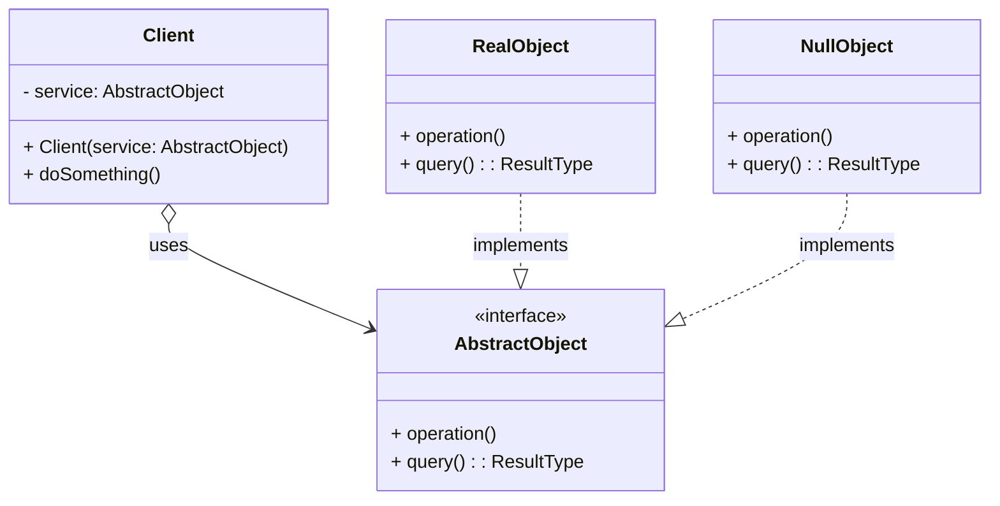

**目次**

- [デザインパターン詳細解説：Null Object パターン](#デザインパターン詳細解説null-object-パターン)
- [1. Null Object パターンとは？ ～目的と解決したい問題～](#1-null-object-パターンとは-目的と解決したい問題)
  - [1.1 このパターンを一言で言うと？（核心的な目的）](#11-このパターンを一言で言うと核心的な目的)
  - [1.2 なぜ Null Object パターンが必要なのか？（動機と背景）](#12-なぜ-null-object-パターンが必要なのか動機と背景)
    - [1.2.1 `null` チェックだらけのコードが招く問題点](#121-null-チェックだらけのコードが招く問題点)
    - [1.2.2 `NullPointerException` (NPE) を避けたい](#122-nullpointerexception-npe-を避けたい)
    - [1.2.3 クライアントコードをシンプルに保ちたい](#123-クライアントコードをシンプルに保ちたい)
  - [1.3 このパターンで解決できること（メリットの要約）](#13-このパターンで解決できることメリットの要約)
- [2. パターンの構造と実装 ～どのように実現するか～](#2-パターンの構造と実装-どのように実現するか)
  - [2.1 登場人物とその役割（クラス図と解説）](#21-登場人物とその役割クラス図と解説)
  - [2.2 実装のポイント：インターフェース共有と「何もしない」実装](#22-実装のポイントインターフェース共有と何もしない実装)
  - [2.3 コード例：具体的なシナリオでの実装](#23-コード例具体的なシナリオでの実装)
    - [2.3.1 シナリオ設定（例：ロギング機能）](#231-シナリオ設定例ロギング機能)
    - [2.3.2 サンプルコード（Java での例）](#232-サンプルコードjava-での例)
    - [2.3.3 コードのポイント解説](#233-コードのポイント解説)
- [3. Null Object パターンの利点 ～採用するメリット～](#3-null-object-パターンの利点-採用するメリット)
  - [3.1 `null` チェックの削減とコードの単純化](#31-null-チェックの削減とコードの単純化)
  - [3.2 `NullPointerException` (NPE) のリスク低減](#32-nullpointerexception-npe-のリスク低減)
  - [3.3 デフォルトの振る舞いのカプセル化](#33-デフォルトの振る舞いのカプセル化)
  - [3.4 ポリモーフィズムの活用](#34-ポリモーフィズムの活用)
- [4. 注意点とトレードオフ ～適用前に考えるべきこと～](#4-注意点とトレードオフ-適用前に考えるべきこと)
  - [4.1 パターンの適用範囲：`null` が「何もしない」を意味する場合](#41-パターンの適用範囲null-が何もしないを意味する場合)
  - [4.2 クラス数の増加](#42-クラス数の増加)
  - [4.3 「何もしない」振る舞いの定義の曖昧さ](#43-何もしない振る舞いの定義の曖昧さ)
  - [4.4 パターンの認知度と意図の伝達](#44-パターンの認知度と意図の伝達)
  - [4.5 デバッグ時の挙動](#45-デバッグ時の挙動)
- [5. 実装上のヒントと考慮事項 ～より良く使うために～](#5-実装上のヒントと考慮事項-より良く使うために)
  - [5.1 Singleton パターンとしての実装](#51-singleton-パターンとしての実装)
  - [5.2 `NullObject` であることを判定する方法（通常は不要）](#52-nullobject-であることを判定する方法通常は不要)
  - [5.3 デフォルト値の選択](#53-デフォルト値の選択)
  - [5.4 ライブラリや言語機能との関連](#54-ライブラリや言語機能との関連)
- [6. 他のパターンとの関連 ～比較と組み合わせ～](#6-他のパターンとの関連-比較と組み合わせ)
  - [6.1 似ているパターンや概念との比較](#61-似ているパターンや概念との比較)
    - [6.1.1 Null Object vs `null` 参照](#611-null-object-vs-null-参照)
    - [6.1.2 Null Object vs Optional (Java 8+) / Nullable Types (C# など)](#612-null-object-vs-optional-java-8--nullable-types-c-など)
    - [6.1.3 Null Object vs Special Case パターン](#613-null-object-vs-special-case-パターン)
  - [6.2 組み合わせると効果的なパターン](#62-組み合わせると効果的なパターン)
- [7. リファクタリング：いつ Null Object パターンを導入するか](#7-リファクタリングいつ-null-object-パターンを導入するか)
  - [7.1 導入のきっかけとなる「コードの不吉な臭い」や状況変化](#71-導入のきっかけとなるコードの不吉な臭いや状況変化)
  - [7.2 段階的なリファクタリング手順（概要）](#72-段階的なリファクタリング手順概要)
- [8. まとめ ～ Null Object パターンの本質～](#8-まとめ--null-object-パターンの本質)

# デザインパターン詳細解説：Null Object パターン

# 1. Null Object パターンとは？ ～目的と解決したい問題～

## 1.1 このパターンを一言で言うと？（核心的な目的）

Null Object パターンは、「**何もしない（無害な）デフォルトの振る舞いを提供するオブジェクト**」を利用することで、クライアントコードにおける **`null` チェックの必要性をなくす**ことを目的としたデザインパターンです。

## 1.2 なぜ Null Object パターンが必要なのか？（動機と背景）

オブジェクト指向プログラミングにおいて、メソッドがオブジェクトを返す場合、該当するオブジェクトが存在しない状況を示すために `null` を返すことがよくあります。たとえば、データベース検索で見つからなかった場合、設定が存在しなかった場合などです。

### 1.2.1 `null` チェックだらけのコードが招く問題点

メソッドの戻り値が `null` である可能性がある場合、そのオブジェクトを利用するクライアントコードは、メソッドを呼び出す前に**必ず `null` かどうかをチェック**する必要があります。

```java
// null チェックが必要な例
Logger logger = loggerFactory.getLogger(); // logger は null の可能性がある
if (logger != null) { // ★ null チェック
    logger.log("処理を開始します。");
}
// ... 他の処理 ...
if (logger != null) { // ★ また null チェック
    logger.log("処理を終了します。");
}
```

このような `null` チェックは、コードのあちこちに繰り返し現れる傾向があり、以下のような問題を引き起こします。

- **コードの冗長化:** 同じような `if (object != null)` の記述が何度も登場し、コードが長くなります。
- **可読性の低下:** 本来の処理の流れの中に `null` チェックのロジックが割り込み、コードが読みにくくなります。
- **保守性の低下:** `null` を返す可能性があるメソッドが増えるほど、クライアント側の `null` チェック漏れのリスクが高まります。

### 1.2.2 `NullPointerException` (NPE) を避けたい

もしクライアントが `null` チェックを忘れて `null` 参照に対してメソッドを呼び出そうとすると、多くの言語（Java, C# など）では **`NullPointerException`** (またはそれに類する実行時エラー) が発生し、プログラムがクラッシュする原因となります。これは非常によく発生し、かつ厄介なバグの 1 つです。`null` チェックを徹底することは、この NPE を防ぐための基本的な対策ですが、前述の通りコードの冗長化を招きます。

### 1.2.3 クライアントコードをシンプルに保ちたい

クライアントコードとしては、オブジェクトが「実際に何かをするオブジェクト」なのか、「存在しない（あるいは何もする必要がない）状態」なのかを**意識せずに、常に同じようにメソッドを呼び出せる**のが理想的です。`null` である可能性をクライアント側で毎回心配し、条件分岐を書く負担を減らしたい、という要求があります。

Null Object パターンは、これらの課題、すなわち「`null` チェックの繰り返し」「`NullPointerException` のリスク」「クライアントコードの複雑化」を解決するために考案されました。

## 1.3 このパターンで解決できること（メリットの要約）

Null Object パターンを適用することで、以下のようなメリットが期待できます。

- クライアントコードから**冗長な `null` チェックを削減**できる。
- **`NullPointerException` の発生リスクを低減**できる。
- クライアントコードが**シンプル**になり、**可読性**が向上する。
- オブジェクトが存在する場合としない場合の**振る舞いの差を、ポリモーフィズムを使って**吸収できる。

---

# 2. パターンの構造と実装 ～どのように実現するか～

Null Object パターンは、特別な「何もしない」オブジェクトを導入することで、`null` の代替として機能させます。

## 2.1 登場人物とその役割（クラス図と解説）

Null Object パターンの主要な登場人物は以下の通りです。

- **`AbstractObject`（抽象オブジェクト、インターフェースまたは抽象クラス）:**
  - **役割:** 実際の処理を行うオブジェクト (`RealObject`) と、何もしないオブジェクト (`NullObject`) の**共通のインターフェース**を定義します。クライアントはこのインターフェース型を通じてオブジェクトを利用します。
  - **定義:** クライアントが利用する可能性のある操作（メソッド）を宣言します。
- **`RealObject`（実際のオブジェクト）:**
  - **役割:** 本来の具体的な処理やデータを持つ、**実際のオブジェクト**です。
  - **実装:** `AbstractObject` インターフェース（または抽象クラス）を実装（または継承）し、具体的な処理内容を定義します。
- **`NullObject`（ヌルオブジェクト、何もしないオブジェクト）:**
  - **役割:** 「オブジェクトが存在しない」あるいは「何もする必要がない」という状況を表す、**特別なオブジェクト**です。`null` の代わりとして機能します。
  - **実装:**
    - `RealObject` と同じ **`AbstractObject` インターフェースを実装**します。
    - インターフェースで宣言されたメソッドを実装しますが、その**実装内容は基本的に「何もしない」**（空のメソッドボディ）、あるいは**無害なデフォルト値**（例: 空文字列、0、空のリスト、`false` など）を返すようにします。
    - 副作用（状態の変更など）を伴うメソッドは、文字通り何もしません。
    - 多くの場合、`NullObject` は状態を持たないため、**Singleton パターン**として実装され、システム全体で唯一のインスタンスが共有されます。
- **`Client`（利用者）:**
  - **役割:** `AbstractObject` 型のオブジェクトを利用します。
  - **実装:** `AbstractObject` 型の参照を受け取り、それが `RealObject` なのか `NullObject` なのかを**区別することなく**、インターフェースで定義されたメソッドを呼び出します。`null` チェックは不要になります。



_図: Null Object パターンのクラス図_

## 2.2 実装のポイント：インターフェース共有と「何もしない」実装

- **共通インターフェース (`AbstractObject`):** `RealObject` と `NullObject` が**同じインターフェースを共有**することが、クライアントからの透過性を実現する鍵です。クライアントは常に `AbstractObject` 型としてオブジェクトを扱えます。
- **`NullObject` の「何もしない」実装:**
  - 戻り値がない (`void`) メソッド: メソッドボディを空にします。
  - 戻り値があるメソッド: その型に応じた**無害なデフォルト値**を返します。
    - 数値型: `0`
    - 真偽値型: `false`
    - 文字列型: 空文字列 (`""`)
    - オブジェクト型: `null` を返すのではなく、可能であればそのオブジェクト型の **`NullObject` バージョン**（例: 空のリスト `Collections.emptyList()`）を返すか、あるいは `null` を返さざるを得ない場合はドキュメント化が必要です（ただし、これはパターンの利点を減じます）。
  - `NullObject` は、エラーをスローしたり、予期せぬ副作用を引き起こしたりしてはいけません。あくまで「何もしない」「デフォルト」の振る舞いに徹します。
- **`NullObject` の取得方法:**
  - `RealObject` を返す可能性のあるメソッド（例: `findObject()`）が、対象が見つからない場合に `null` の代わりに `NullObject` の**シングルトンインスタンス**を返すように実装します。
  - あるいは、クライアントが初期値として `NullObject` のインスタンスを使うようにします。

```java
// 例: NullObject を返すメソッド
public AbstractObject findObject(String id) {
    AbstractObject found = // ... 検索処理 ...
    if (found != null) {
        return found; // RealObject を返す
    } else {
        return NullObject.getInstance(); // ★ null の代わりに NullObject を返す
    }
}
```

- **Singleton としての `NullObject`:** `NullObject` は通常、内部状態を持たず、その振る舞いは常に同じです。そのため、インスタンスは 1 つあれば十分であり、**Singleton パターン**として実装するのが一般的です。これにより、不要なオブジェクト生成を避けることができます。

## 2.3 コード例：具体的なシナリオでの実装

### 2.3.1 シナリオ設定（例：ロギング機能）

アプリケーションの各所でログを出力する機能を考えます。設定によってログ出力を有効にするか無効にするかを切り替えたいとします。ログ出力が無効の場合でも、クライアントコードはログ出力処理の呼び出し箇所で毎回 `null` チェックをしたくない、という状況です。

### 2.3.2 サンプルコード（Java での例）

```java
// 1. AbstractObject: ロガーインターフェース
interface Logger {
    void log(String message);
    boolean isEnabled(); // ログが有効かを示すメソッド (例)
}

// 2. RealObject: 実際にログを出力するロガー
class ConsoleLogger implements Logger {
    @Override
    public void log(String message) {
        System.out.println("LOG: " + message); // コンソールに出力
    }
    @Override
    public boolean isEnabled() { return true; }
}

// 3. NullObject: 何もしないロガー
class NullLogger implements Logger {
    // ★ Singleton として実装
    private static final NullLogger INSTANCE = new NullLogger();
    private NullLogger() {} // private コンストラクタ
    public static NullLogger getInstance() {
        return INSTANCE;
    }

    @Override
    public void log(String message) {
        // ★ 何もしない
    }
    @Override
    public boolean isEnabled() { return false; } // 無効であることを示す
}

// 4. Logger を提供するファクトリ (例)
class LoggerFactory {
    public static Logger getLogger(boolean enabled) {
        if (enabled) {
            System.out.println("ConsoleLogger を返します。");
            return new ConsoleLogger(); // 本番では設定に応じて DI などで切り替える
        } else {
            System.out.println("NullLogger を返します。");
            return NullLogger.getInstance(); // ★ null の代わりに NullLogger を返す
        }
    }
}

// 5. Client (利用者)
public class NullObjectClient {
    public static void main(String[] args) {
        boolean loggingEnabled = false; // 設定によって切り替わる想定

        Logger logger = LoggerFactory.getLogger(loggingEnabled);

        // ★ Client は logger が NullLogger かどうかを意識する必要がない！
        // ★ if (logger != null) というチェックが不要！
        System.out.println("処理を開始します...");
        logger.log("メイン処理を実行中..."); // loggingEnabled=false なら何も出力されない

        // isEnabled() で判定することも可能 (オプション)
        if (logger.isEnabled()){
             System.out.println("詳細ログ: " + System.currentTimeMillis());
        }

        logger.log("メイン処理を終了しました。");
        System.out.println("処理を完了しました。");
    }
}
```

### 2.3.3 コードのポイント解説

- `Logger` が共通インターフェース (`AbstractObject`) です。
- `ConsoleLogger` が実際の処理を行うクラス (`RealObject`) です。
- `NullLogger` が何もしないクラス (`NullObject`) です。`log()` メソッドは空で、`isEnabled()` は `false` を返します。Singleton パターンで実装されています。
- `LoggerFactory` は、設定 (`enabled`) に応じて `ConsoleLogger` または `NullLogger.getInstance()` を返します。**`null` を返すことはありません**。
- クライアント (`NullObjectClient`) は `LoggerFactory` から `Logger` を取得し、**`null` チェックを行うことなく** `logger.log()` を呼び出しています。ログが無効 (`enabled=false`) の場合、`NullLogger` の `log()` が呼ばれますが、何も起こらないため、安全に処理が続行されます。

このように、Null Object パターンは `null` の代替となる「何もしない」オブジェクトを提供することで、クライアントコードから `null` チェックを排除し、コードをシンプルで堅牢にします。

---

# 3. Null Object パターンの利点 ～採用するメリット～

Null Object パターンを適用することで、とくに `null` 参照の扱いに関連するコードの品質と堅牢性を向上させる、いくつかの重要なメリットが得られます。

## 3.1 `null` チェックの削減とコードの単純化

これが Null Object パターンの**もっとも直接的なメリット**です。オブジェクトが存在しない、あるいはデフォルトの振る舞いをすべき場合に `null` を返す代わりに、共通インターフェースを実装した「何もしない」`NullObject` を返すようにします。

これにより、クライアントコード（オブジェクトの利用者側）は、**受け取ったオブジェクトが `null` かどうかを毎回チェックする必要がなくなります**。クライアントは、オブジェクトが実際に処理を行う `RealObject` なのか、何もしない `NullObject` なのかを区別せずに、常に同じようにメソッドを呼び出すことができます。

```java
// Null Object パターン適用前 (null チェックが必要)
SomeObject obj = service.findObject(id);
if (obj != null) { // ★ null チェック
    obj.doSomething();
}

// Null Object パターン適用後 (null チェックが不要)
AbstractObject obj = service.findObjectOrNullObject(id); // NullObject が返る可能性
obj.doSomething(); // ★ チェック不要！ NullObject なら何もしない
```

結果として、クライアントコードから冗長な `if (obj != null)` の記述が減り、**コードが大幅にシンプル**になり、**本来のロジックの流れが追いやすく**なります。**可読性**が向上します。

## 3.2 `NullPointerException` (NPE) のリスク低減

`null` チェックが不要になるということは、`null` チェック漏れによる **`NullPointerException` (またはそれに類する実行時エラー) の発生リスクを大幅に低減できる**ことを意味します。NPE は Java など多くの言語で非常に頻繁に発生し、デバッグが難しいバグの原因の 1 つですが、Null Object パターンはこの種のバグを未然に防ぐのに役立ちます。

メソッドが決して `null` を返さず、常に `AbstractObject` 型の有効なインスタンス（`RealObject` または `NullObject`）を返すように設計することで、クライアントはより安心してメソッドを利用できます。

## 3.3 デフォルトの振る舞いのカプセル化

「オブジェクトが存在しない場合に、どのような振る舞いをすべきか（何もしない、デフォルト値を返すなど）」という**デフォルトの振る舞い（あるいは「何もしない」という振る舞い）に関する知識**を、クライアントコードから分離し、**`NullObject` クラス内にカプセル化**できます。

これにより、もしデフォルトの振る舞いを変更する必要が生じた場合（たとえば、ログレベルを変更する、返すデフォルト値を変えるなど）、修正箇所は `NullObject` クラスに限定され、クライアントコードへの影響を防ぐことができます。

## 3.4 ポリモーフィズムの活用

Null Object パターンは、オブジェクト指向の重要な概念である**ポリモーフィズム**を効果的に活用した例と言えます。`RealObject` と `NullObject` が同じ `AbstractObject` インターフェースを実装しているため、クライアントはどちらのオブジェクトに対しても同じメッセージ（メソッド呼び出し）を送ることができます。オブジェクトの種類（`RealObject` か `NullObject` か）によって、そのメッセージに対する応答（実際の処理か、何もしないか）が変わる、というポリモーフィックな振る舞いが実現されます。

これらのメリットにより、Null Object パターンは、`null` 参照の扱いをより安全で、シンプルで、オブジェクト指向的な方法で解決するための有効なデザインパターンとなります。

---

# 4. 注意点とトレードオフ ～適用前に考えるべきこと～

Null Object パターンは `null` チェックを減らしコードをシンプルにする上で有効ですが、万能ではなく、適用にあたってはいくつかの注意点と考慮すべきトレードオフが存在します。

## 4.1 パターンの適用範囲：`null` が「何もしない」を意味する場合

Null Object パターンがもっとも効果を発揮するのは、**`null` が「何もしない」「デフォルトの動作」「欠落しているがエラーではない」といった意味合いを持つ状況**です。たとえば、ログ出力が無効な場合のロガー、オプション機能が無効な場合の設定オブジェクトなどが該当します。

しかし、**`null` が明確な「エラー状態」や「予期せぬ欠落」を示すべき状況**では、Null Object パターンを適用するのは**不適切**な場合があります。そのような場合に Null Object を返してしまうと、本来エラーとして扱われるべき状況が隠蔽され、問題の発見が遅れたり、予期せぬ動作を引き起こしたりする可能性があります。

たとえば、必須であるはずのユーザー情報がデータベースから取得できなかった場合に `NullUser` を返すのではなく、明確に例外をスローするか、あるいは `Optional<User>` (Java 8+) のような `null` の可能性を明示する型を使って、呼び出し元にエラー処理を促す方が適切な設計となります。

**Null Object パターンを使うべきかどうかの判断基準:** クライアントコードが、オブジェクトが存在しない場合に「何もしなくてよい」あるいは「デフォルトの振る舞いでよい」のであれば、Null Object パターンは良い選択肢です。しかし、「オブジェクトが存在しないことは異常であり、特別なエラー処理が必要」なのであれば、`null` を返す（そしてクライアントでチェックする）か、例外をスローする方が適切です。

## 4.2 クラス数の増加

Null Object パターンを導入すると、`RealObject` に加えて、対応する `NullObject` クラス（および共通の `AbstractObject` インターフェース/抽象クラス）が必要になります。これにより、システム全体の**クラス数は増加**します。

インターフェースの種類が多い場合、それぞれに対応する `NullObject` を用意する必要があり、管理するクラスが増える可能性があります。

## 4.3 「何もしない」振る舞いの定義の曖昧さ

`NullObject` が実装すべき「何もしない」振る舞いや「デフォルト値」が、必ずしも自明でない場合があります。

- 戻り値を持つメソッドの場合、どのような値をデフォルトとして返すのがもっとも「無害」か？（空文字列か？0 か？`false`か？空リストか？）
- 複数のメソッドが連携して動作する場合、「何もしない」実装が、他の部分で予期せぬ前提条件の崩れを引き起こさないか？

`NullObject` の振る舞いは、クライアントがそれを `RealObject` と同じように扱っても問題が発生しないように、慎重に設計する必要があります。

## 4.4 パターンの認知度と意図の伝達

Null Object パターンは GoF の古典的な 23 パターンには含まれていないため、チームメンバーによってはこのパターンに馴染みがない可能性もあります。

`NullObject` が返されることを知らない開発者が、返ってきたオブジェクトが常に `RealObject` であると期待してコードを書いてしまうと、問題を引き起こす可能性があります（もっとも、Null Object パターン自体が NPE を防ぐ目的があるため、深刻なクラッシュには繋がりにくいですが）。

パターンを導入する際には、チーム内でその意図と使い方について共通認識を持つことが重要です。クラス名（例: `NullLogger`, `EmptyUser`）やドキュメントで、それが Null Object であることを明確に示すのが良いでしょう。

## 4.5 デバッグ時の挙動

デバッグ時に、メソッドが期待した動作をしない場合、その原因が `RealObject` のバグなのか、あるいは意図通り `NullObject` が返されていて「何もしない」のが正しい動作なのかを、一瞬判断しにくいことがあるかもしれません。`NullObject` のメソッド内に、デバッグレベルのログ出力（例: "NullLogger.log() called, doing nothing."）を入れておくと、デバッグの助けになる場合があります。

これらの注意点を理解し、Null Object パターンを適用するメリット（`null` チェック削減、NPE 防止、コード単純化）が、これらのトレードオフ（クラス数増加、適用範囲の限定など）を上回るかどうかを、具体的な状況に応じて判断することが重要です。

---

# 5. 実装上のヒントと考慮事項 ～より良く使うために～

Null Object パターンを効果的に実装し、そのメリットを活かすためには、いくつかの実践的なヒントや考慮事項があります。

## 5.1 Singleton パターンとしての実装

`NullObject` は、通常、**内部状態を持たず、その振る舞いは常に同じ**です。「何もしない」あるいは「デフォルト値を返す」という役割に、インスタンスごとの違いは必要ありません。

したがって、`NullObject` クラスは**Singleton パターン**として実装するのが一般的であり、効率的です。

- **実装方法:**
  - コンストラクタを `private` にします。
  - 自身の静的な `final` フィールドとして、唯一のインスタンス (`INSTANCE`) を保持します。
  - その唯一のインスタンスを取得するための `public static` なメソッド（例: `getInstance()`) を提供します。

```java
public final class NullLogger implements Logger { // final で継承を防ぐ

    private static final NullLogger INSTANCE = new NullLogger(); // 唯一のインスタンス

    private NullLogger() { // private コンストラクタ
        // 初期化処理 (通常は不要)
    }

    public static NullLogger getInstance() { // インスタンス取得メソッド
        return INSTANCE;
    }

    @Override
    public void log(String message) { /* 何もしない */ }

    @Override
    public boolean isEnabled() { return false; }
}
```

これにより、`NullObject` のインスタンスが不必要に複数生成されるのを防ぎ、メモリ使用量を抑えることができます。クライアントは常に `NullLogger.getInstance()` を通じて同じインスタンスを利用します。

## 5.2 `NullObject` であることを判定する方法（通常は不要）

Null Object パターンの基本的な考え方は、クライアントが `RealObject` と `NullObject` を**区別せずに**透過的に扱うことです。そのため、クライアントコード内に「もしこれが `NullObject` ならば〜」というような**判定ロジックを入れることは、原則として避けるべき**です。そのような判定が必要になる場合、そもそも Null Object パターンの適用が適切でない可能性があります。

しかし、ごく稀に、デバッグ目的や特殊なケースで `NullObject` かどうかを判定したい場合があるかもしれません。その場合は、以下のような方法が考えられます（推奨はしません）。

- `AbstractObject` インターフェースに `isNull()` のようなメソッドを追加し、`NullObject` では `true` を、`RealObject` では `false` を返すようにする。
- `instanceof` 演算子を使う（ただし、これは具体的なクラスへの依存を生むため避けるべき）。

繰り返しますが、クライアントが `NullObject` を特別扱いする必要があるなら、それは設計を見直すべきサインである可能性が高いです。

## 5.3 デフォルト値の選択

`NullObject` が戻り値を持つメソッドを実装する場合、返す**デフォルト値**は慎重に選択する必要があります。その値は、クライアントが受け取っても**安全であり、かつ意味のある「デフォルト」** でなければなりません。

- **空のコレクション:** リストを返すメソッドなら、`null` ではなく空のリスト (`Collections.emptyList()` など）を返します。
- **数値:** 合計値などを返すなら `0`、個数なら `0`、割引率なら `0` など、文脈に応じた自然なデフォルト値を選びます。
- **文字列:** 空文字列 (`""`) が適切な場合が多いですが、状況によっては `"N/A"` や `"Unknown"` のような特定の文字列が適する場合もあります。
- **ブール値:** `false` がデフォルトとして自然な場合が多いですが、文脈によります（例: `isEnabled()` なら `false`）。

不適切なデフォルト値を返すと、クライアント側で予期せぬ動作を引き起こす可能性があるため注意が必要です。

## 5.4 ライブラリや言語機能との関連

- **Optional (Java 8+):** Java 8 で導入された `Optional<T>` は、`null` の可能性を明示的に表現するための型であり、Null Object パターンとは異なるアプローチで `null` 問題に対処します。`Optional` は値が存在しない可能性を型レベルで示し、クライアントに `isPresent()` や `orElse()` などを使って明示的な処理を促します。どちらを使うかは状況や設計思想によりますが、「値がないことがエラーではない」状況では Null Object、「値がない可能性があることを明示し、対処を強制したい」状況では `Optional` が適していると言えます。
- **コレクションライブラリ:** 多くのコレクションライブラリでは、「空のコレクション」を返すための便利な静的メソッド（例: `Collections.emptyList()`, `List.of()`) が提供されており、これは Null Object の考え方を適用したものです。

これらの実装上のヒントを参考に、Null Object パターンを適切に実装・活用することで、コードの安全性と可読性を高めることができます。

---

# 6. 他のパターンとの関連 ～比較と組み合わせ～

Null Object パターンは、他のデザインパターンと直接的な構造上の類似性は少ないかもしれませんが、その目的や適用場面において、いくつかのパターンと比較されたり、連携して使われたりすることがあります。

## 6.1 似ているパターンや概念との比較

### 6.1.1 Null Object vs `null` 参照

- **根本的な違い:** Null Object パターンは、**`null` 参照そのものを使わないようにする**ためのアプローチです。`null` が持つ「参照先が存在しない」という意味合いの代わりに、「何もしない」あるいは「デフォルトの振る舞いをする」という具体的な意味を持つオブジェクト (`NullObject`) を提供します。
- **目的:** `null` チェックのコードを削減し、`NullPointerException` を防ぐことを目指します。

### 6.1.2 Null Object vs Optional (Java 8+) / Nullable Types (C# など)

- **目的の共通点:** どちらも `null` に起因する問題を扱おうとします。
- **アプローチの違い:**
  - **Null Object:** オブジェクトが存在しない場合に、**ポリモーフィズム**を利用してデフォルトの振る舞いを提供します。クライアントは `null` を意識しません。
  - **Optional/Nullable:** 値が存在しない**可能性を型レベルで明示**します。クライアントは、値が存在するかどうかを**明示的にチェック**し、存在しない場合の代替処理（`orElse` など）を記述する必要があります。
- **使い分け:**
  - 「値がない場合にデフォルトの振る舞いで良い（エラーではない）」状況で、クライアントの `null` チェックをなくしたい場合は **Null Object** が適しています。
  - 「値がない可能性があることを明確に伝え、クライアントにその場合の対処を強制したい」場合は **Optional/Nullable** が適しています。エラー処理に近い文脈で有効です。

### 6.1.3 Null Object vs Special Case パターン

- **関連性:** Null Object パターンは、**Special Case パターン**の一種と見なすことができます。Special Case パターンは、特別な状況（境界条件、エラー状態、デフォルト状態など）を、通常のオブジェクトと同じインターフェースを持つ別のオブジェクトとして表現する、より広範な考え方です。Null Object は、その中でもとくに「何もない」「デフォルト」という特殊なケースを扱うパターンです。

## 6.2 組み合わせると効果的なパターン

- **Factory パターン (Factory Method, Abstract Factory):**
  - **連携:** オブジェクトを生成する Factory が、条件（例: ID が見つからない、設定が無効）によって `RealObject` を返す代わりに、**`NullObject` のインスタンスを返す**ように実装できます。これにより、Factory の利用者は常に有効な（`null` でない）オブジェクトを受け取ることが保証され、`null` チェックが不要になります。
  ```java
  // Factory で NullObject を返す例
  public Logger createLogger(boolean enabled) {
      if (enabled) {
          return new ConsoleLogger();
      } else {
          return NullLogger.getInstance(); // ★ NullObject を返す
      }
  }
  ```
- **Singleton パターン:**
  - **連携:** 前述の通り、`NullObject` は状態を持たないことが多いため、**Singleton パターン**として実装し、システム全体で唯一のインスタンスを共有するのが効率的で一般的です。
- **Strategy パターン:**
  - **連携:** Strategy パターンにおいて、「適用する戦略がない」あるいは「デフォルトの戦略（何もしないなど）」を表すために、`NullStrategy` という Null Object を用意することが考えられます。これにより、`Context` は常に有効な `Strategy` オブジェクトを持つことができ、`null` チェックが不要になります。
- **Composite パターン:**
  - **連携:** Composite パターンで木構造を扱う際に、「子要素を持たない」ことを示すために、特別な `NullComponent` (何もしない Leaf のようなもの) を利用する、といった応用も考えられなくはありませんが、一般的ではありません。通常は `Leaf` が子を持たないことを表現します。

Null Object パターンは、とくに Factory パターンや Singleton パターンと組み合わせることで、オブジェクトの生成と `null` の扱いに関するコードをより堅牢でシンプルにするのに役立ちます。`null` を返す可能性がある箇所で、代わりに「何もしない」オブジェクトを返せないか検討してみることは、良い設計プラクティスの 1 つです。

---

# 7. リファクタリング：いつ Null Object パターンを導入するか

Null Object パターンは、既存のコードに存在する `null` チェックの煩雑さや `NullPointerException` のリスクを軽減するために、**リファクタリング**によって導入されることが多いパターンです。

## 7.1 導入のきっかけとなる「コードの不吉な臭い」や状況変化

既存のコードベースに以下のような兆候（コードの不吉な臭い）が見られた場合、Null Object パターンの導入を検討する価値があります。

- **繰り返される `null` チェック:**
  - **症状:** 特定の型のオブジェクト（メソッドの戻り値やフィールド）に対して、それを利用する**クライアントコードのあちこちで `if (object != null)` のようなチェックが繰り返し現れる**。
  - **問題:** コードが冗長になり、可読性が低下します。また、`null` チェック漏れによる `NullPointerException` のリスクが常に伴います。
  - **解決策:** Null Object パターンを導入します。オブジェクトを返す可能性のあるメソッドが、`null` の代わりに「何もしない」`NullObject` インスタンスを返すように修正します。クライアント側の `null` チェックを削除できます。
- **条件分岐によるデフォルト処理:**
  - **症状:** オブジェクトが `null` の場合に、クライアント側で特定のデフォルト処理（例: デフォルト値を設定する、ログを出力しない、特定の処理をスキップする）を行うための `if-else` 文が記述されている。
  - **問題:** デフォルト処理のロジックがクライアント側に分散し、重複する可能性があります。デフォルト処理の内容を変更する場合、多くの箇所を修正する必要があります。
  - **解決策:** Null Object パターンを導入し、そのデフォルト処理を `NullObject` のメソッド実装としてカプセル化します。クライアントは `null` の場合を特別扱いする必要がなくなり、コードがシンプルになります。
- **頻発する `NullPointerException`:**
  - **症状:** 特定のオブジェクト参照に関連する `NullPointerException` がテストや運用環境で頻繁に発生している。
  - **問題:** ソフトウェアの安定性を損ない、ユーザーエクスペリエンスを低下させます。根本的な原因（`null` チェック漏れや予期せぬ `null` の代入）を特定・修正する必要があります。
  - **解決策:** 原因分析の結果、特定の箇所で `null` が「存在しない」または「デフォルト」を意味することが妥当であると判断された場合、Null Object パターンを導入して `null` 参照自体をなくすことが、NPE を根本的に解消する有効な手段となり得ます。

これらの状況は、現在の `null` の扱い方がコードの複雑性や不安定性を招いている可能性を示唆しており、Null Object パターンの導入によって設計を改善できる可能性があります。

## 7.2 段階的なリファクタリング手順（概要）

既存のコードに Null Object パターンを導入する際の、一般的なリファクタリング手順の概要は以下の通りです。（テストによる安全確保が前提です）

1. **`AbstractObject` インターフェース（または抽象クラス）の作成/確認:**
   - `RealObject` と `NullObject` が共有する共通インターフェース (`AbstractObject`) を特定または作成します。既存のインターフェースがあればそれを利用します。なければ、`RealObject` から**インターフェースを抽出 (Extract Interface)** します。
   - `RealObject` がこのインターフェースを実装するようにします。
2. **`NullObject` クラスの作成:**
   - `AbstractObject` インターフェースを実装する `NullObject` クラスを作成します。
   - インターフェースで定義された各メソッドに対して、「何もしない」または「無害なデフォルト値を返す」実装を与えます。
   - 通常、Singleton パターンとして実装します（`private` コンストラクタ、`static final` な `INSTANCE` フィールド、`static` な `getInstance()` メソッド）。
3. **`null` を返す箇所の修正:**
   - コード全体から、`AbstractObject` 型（または元の `RealObject` 型）の `null` を返す可能性のある箇所（メソッドの戻り値、フィールドの初期値など）を探します。
   - それらの箇所で `null` を返す代わりに、**`NullObject.getInstance()` を返す**ように修正します。
4. **クライアントコードの `null` チェック削除:**
   - `AbstractObject` 型のオブジェクトを利用しているクライアントコードから、**`if (object != null)` という形式のチェックを削除**します。
   - `null` だった場合の `else` ブロックで行っていたデフォルト処理なども、`NullObject` がその振る舞いを担当するため、削除できるはずです。
5. **テスト:** 各ステップの後、および最終的に、テストを実行してリファクタリングによって外部から見た振る舞いが変わっていないこと（とくに、オブジェクトが存在しない場合に期待されるデフォルトの振る舞いになっていること）、そして `NullPointerException` が発生しなくなっていることを確認します。

このリファクタリングプロセスにより、コードから `null` チェックが削減され、NullPointerException のリスクが低減し、よりシンプルで堅牢なコードになります。ただし、前述の通り、`null` がエラーを示すべき状況には適用しないよう注意が必要です。

---

# 8. まとめ ～ Null Object パターンの本質～

**Null Object パターン**は、**オブジェクトが存在しない、あるいは「何もしない」という特別なケースを、通常のオブジェクトと同じインターフェースを持つ専用のオブジェクト (`NullObject`) で表現する**デザインパターンです。

このパターンを適用することで、

- クライアントコードにおける**冗長な `null` チェック (`if (obj != null)`) を削減**できる。
- **`NullPointerException` (NPE) の発生リスクを大幅に低減**し、コードの堅牢性を高める。
- コードが**シンプル**になり、**可読性**が向上する。
- 「オブジェクトがない場合のデフォルトの振る舞い」を **`NullObject` クラスにカプセル化**できる。

といったメリットが得られます。

その本質は、「**`null` 参照という『特別な値』に頼る代わりに、『特別な振る舞い（何もしない、デフォルト値を返す）』を持つ『普通のオブジェクト』を使う**」という点にあります。これにより、クライアントはオブジェクトが存在する場合としない場合を区別する必要がなくなり、**ポリモーフィズム**の恩恵を受けて、常に同じインターフェースでオブジェクトを扱うことができます。

ただし、このパターンは **`null` が「エラー」や「予期せぬ欠落」を意味する状況には適用すべきではありません**。あくまで `null` が「デフォルト」や「何もしない」といった意味合いを持つ場合に限定して適用することで、その効果を発揮します。また、クラス数が増えるという側面もあります。

Null Object パターンは、`null` 参照の扱いに伴う一般的な問題を解決するための、エレガントでオブジェクト指向的なアプローチの 1 つです。コード中の `null` チェックの多さに悩まされたり、NPE に苦しめられたりした場合に、このパターンの導入を検討してみる価値は十分にあります。適切な場面で活用すれば、より安全で読みやすいコードベースの構築に貢献するでしょう。
