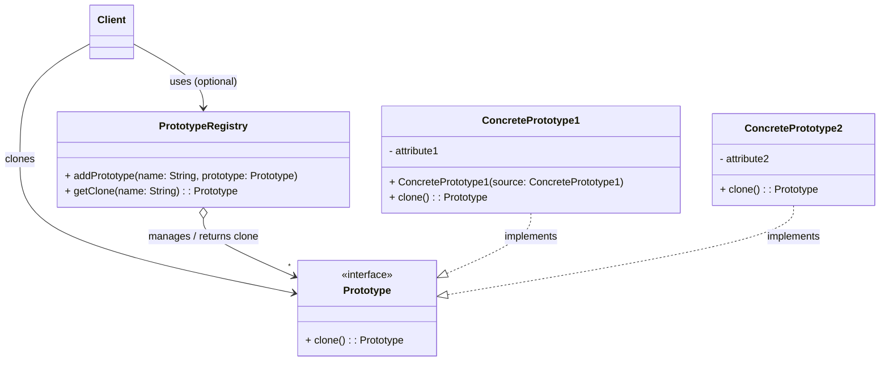

**目次**

- [デザインパターン詳細解説：Prototype パターン](#デザインパターン詳細解説prototype-パターン)
- [1. Prototype パターンとは？ ～目的と解決したい問題～](#1-prototype-パターンとは-目的と解決したい問題)
  - [1.1 このパターンを一言で言うと？（核心的な目的）](#11-このパターンを一言で言うと核心的な目的)
  - [1.2 なぜ Prototype パターンが必要なのか？（動機と背景）](#12-なぜ-prototype-パターンが必要なのか動機と背景)
    - [1.2.1 オブジェクト生成コストが高い](#121-オブジェクト生成コストが高い)
    - [1.2.2 生成したいオブジェクトの種類が多い、または動的に決まる](#122-生成したいオブジェクトの種類が多いまたは動的に決まる)
    - [1.2.3 特定の初期状態を持つオブジェクトを効率的に作りたい](#123-特定の初期状態を持つオブジェクトを効率的に作りたい)
  - [1.3 このパターンで解決できること（メリットの要約）](#13-このパターンで解決できることメリットの要約)
- [2. パターンの構造と実装 ～どのように実現するか～](#2-パターンの構造と実装-どのように実現するか)
  - [2.1 登場人物とその役割（クラス図と解説）](#21-登場人物とその役割クラス図と解説)
  - [2.2 実装のポイント：複製メソッド `clone()` の実装](#22-実装のポイント複製メソッド-clone-の実装)
  - [2.3 コード例：具体的なシナリオでの実装](#23-コード例具体的なシナリオでの実装)
    - [2.3.1 シナリオ設定（例：図形オブジェクトの複製）](#231-シナリオ設定例図形オブジェクトの複製)
    - [2.3.2 サンプルコード（Java での例 - `Cloneable` を使用）](#232-サンプルコードjava-での例---cloneable-を使用)
    - [2.3.3 コードのポイント解説](#233-コードのポイント解説)
- [3. Prototype パターンの利点 ～採用するメリット～](#3-prototype-パターンの利点-採用するメリット)
  - [3.1 生成コストの削減（効率化）](#31-生成コストの削減効率化)
  - [3.2 具象クラスからの独立（疎結合）](#32-具象クラスからの独立疎結合)
  - [3.3 実行時の種類指定と動的な追加](#33-実行時の種類指定と動的な追加)
  - [3.4 新しい種類の追加容易性](#34-新しい種類の追加容易性)
  - [3.5 初期状態設定の簡略化](#35-初期状態設定の簡略化)
- [4. 注意点とトレードオフ ～適用前に考えるべきこと～](#4-注意点とトレードオフ-適用前に考えるべきこと)
  - [4.1 `clone()` メソッドの実装の複雑さ（とくに深いコピー）](#41-clone-メソッドの実装の複雑さとくに深いコピー)
  - [4.2 循環参照の問題](#42-循環参照の問題)
  - [4.3 `clone()` メソッドの規約と落とし穴](#43-clone-メソッドの規約と落とし穴)
  - [4.4 初期化ロジックの場所](#44-初期化ロジックの場所)
- [5. 実装上のヒントと考慮事項 ～より良く使うために～](#5-実装上のヒントと考慮事項-より良く使うために)
  - [5.1 複製メカニズムの選択：`clone()` vs コピーコンストラクタ/Factory](#51-複製メカニズムの選択clone-vs-コピーコンストラクタfactory)
  - [5.2 プロトタイプ管理クラス (Registry/Manager) の活用](#52-プロトタイプ管理クラス-registrymanager-の活用)
  - [5.3 プロトタイプ自身の状態変更](#53-プロトタイプ自身の状態変更)
  - [5.4 深いコピーの実装戦略](#54-深いコピーの実装戦略)
- [6. 他のパターンとの関連 ～比較と組み合わせ～](#6-他のパターンとの関連-比較と組み合わせ)
  - [6.1 似ているパターンとの比較](#61-似ているパターンとの比較)
    - [6.1.1 Prototype vs Factory パターン (Factory Method, Abstract Factory)](#611-prototype-vs-factory-パターン-factory-method-abstract-factory)
    - [6.1.2 Prototype vs Flyweight パターン](#612-prototype-vs-flyweight-パターン)
  - [6.2 組み合わせると効果的なパターン](#62-組み合わせると効果的なパターン)
- [7. リファクタリング：いつ Prototype パターンを導入するか](#7-リファクタリングいつ-prototype-パターンを導入するか)
  - [7.1 導入のきっかけとなる「コードの不吉な臭い」や状況変化](#71-導入のきっかけとなるコードの不吉な臭いや状況変化)
  - [7.2 段階的なリファクタリング手順（概要）](#72-段階的なリファクタリング手順概要)
- [8. まとめ ～ Prototype パターンの本質～](#8-まとめ--prototype-パターンの本質)

# デザインパターン詳細解説：Prototype パターン

# 1. Prototype パターンとは？ ～目的と解決したい問題～

## 1.1 このパターンを一言で言うと？（核心的な目的）

Prototype パターンは、「**既存のオブジェクト（原型：プロトタイプ）をコピー（複製）することによって、新しいオブジェクトを生成する**」ための、生成に関するデザインパターンです。クラスから直接インスタンス化 (`new`) する代わりに、複製という手段を提供します。

## 1.2 なぜ Prototype パターンが必要なのか？（動機と背景）

オブジェクト指向プログラミングにおけるオブジェクト生成のもっとも基本的な方法は、クラスのコンストラクタを `new` 演算子などで呼び出すことです。しかし、この方法が常に最適とは限らず、以下のような状況では別の生成アプローチが求められることがあります。

### 1.2.1 オブジェクト生成コストが高い

- オブジェクトのインスタンス化に時間やリソースが多くかかる場合があります。たとえば、データベースへのアクセス、ネットワーク通信、複雑な初期計算などがコンストラクタ内で必要なケースです。毎回 `new` で生成するのは非効率的になる可能性があります。
- このような場合、最初にコストをかけて「原型」となるオブジェクトを 1 つ生成しておき、**その後は比較的低コストな「コピー」操作で新しいインスタンスを生成**できれば、パフォーマンスを改善できます。

### 1.2.2 生成したいオブジェクトの種類が多い、または動的に決まる

- システムが扱うオブジェクトの種類が非常に多く、それぞれに対応する具体的なクラス名を生成側のコード（クライアントや Factory）がすべて知っている必要がある場合、コードが複雑になり、新しい種類の追加も大変になります。
- あるいは、どの種類のオブジェクトを生成すべきかが、実行時の設定や条件によって動的に決まる場合、`new` を使うための条件分岐が複雑になりがちです。
- もし、あらかじめさまざまな種類の「原型」オブジェクトを用意しておき、**クライアントがクラス名を意識せずに、必要な「原型」を選んでコピー**できれば、生成側のコードをシンプルに保ち、柔軟性を高めることができます。

### 1.2.3 特定の初期状態を持つオブジェクトを効率的に作りたい

- ある特定の属性値や構成を持ったオブジェクトを多数生成したい場合、毎回 `new` した後に同じ初期化処理を繰り返すのは冗長です。
- 目的の初期状態を持つ「原型」オブジェクトを 1 つ作っておけば、それを**コピーするだけで、同じ初期状態を持つ新しいインスタンスを簡単に**得ることができます。

Prototype パターンは、これらの課題、すなわち「生成コストの削減」「クラス名の抽象化」「効率的な初期状態設定」を実現するための有効な手段となります。

## 1.3 このパターンで解決できること（メリットの要約）

Prototype パターンを適用することで、以下のようなメリットが期待できます。

- **生成コストの削減:** 高コストな初期化処理を避け、既存インスタンスのコピーにより効率的にオブジェクトを生成できる場合がある。
- **具象クラスからの独立:** クライアントは具体的なクラス名を意識せず、プロトタイプオブジェクトを通じてインスタンスを生成できる。
- **実行時の種類指定:** 生成するオブジェクトの種類を実行時に動的に指定（どのプロトタイプをコピーするか選択）しやすくなる。
- **新しい種類の追加容易性:** 新しい `ConcretePrototype` クラスを追加し、プロトタイプ管理機構に登録するだけで、新しい種類のオブジェクト生成に対応できる。
- **初期状態設定の簡略化:** 特定の状態を持つプロトタイプをコピーすることで、同じ状態を持つインスタンスを簡単に生成できる。

---

# 2. パターンの構造と実装 ～どのように実現するか～

Prototype パターンは、複製能力を持つオブジェクト（プロトタイプ）自身が、新しいインスタンスを生成する責務の一部を担うことで実現されます。

## 2.1 登場人物とその役割（クラス図と解説）

Prototype パターンの基本的な登場人物は非常にシンプルです。

- **`Prototype`（原型インターフェース/抽象クラス）:**
  - **役割:** 自分自身を複製するための**インターフェース (メソッド)** を宣言します。
  - **主な定義:** 複製を行うメソッド、一般的には `clone()` や `copy()` という名前のメソッドを宣言します。戻り値の型は通常、`Prototype` インターフェース（またはそれを実装する型）です。
- **`ConcretePrototype`（具体的な原型）:**
  - **役割:** `Prototype` インターフェースを実装する**具体的なクラス**です。これが実際にコピーされる「原型」となります。
  - **実装:**
    - `Prototype` インターフェースで宣言された `clone()` メソッドを**実装**します。このメソッドは、**自分自身の新しいインスタンスを生成し、現在のインスタンスの状態（フィールドの値）を新しいインスタンスにコピーして**返します。
    - コピーの方法には**浅いコピー (Shallow Copy)** と **深いコピー (Deep Copy)** があり、どちらを実装するかが非常に重要です（後述）。
- **`Client`（利用者）:**
  - **役割:** 新しいオブジェクトが必要になったときに、**既存の `Prototype` オブジェクト（通常は `ConcretePrototype` のインスタンス）に対して `clone()` メソッドを呼び出し**、そのコピーを取得して利用します。
  - **実装:** どのプロトタイプをコピーするかを知る必要があります。多くの場合、後述する「プロトタイプ管理クラス」を通じて目的のプロトタイプを取得します。

**(任意) Prototype Manager / Registry (プロトタイプ管理クラス):**

- **役割:** 利用可能なプロトタイプオブジェクトを**管理 (登録、検索)** するためのクラスです。必須ではありませんが、プロトタイプの種類が多い場合に便利です。
- **実装:** プロトタイプオブジェクトを名前などと関連付けて保持し（例: `Map` を使う）、クライアントからの要求に応じて対応するプロトタイプオブジェクト（またはそのコピー）を返します。



_図: Prototype パターンのクラス図 (プロトタイプ管理クラスを含む場合)_

## 2.2 実装のポイント：複製メソッド `clone()` の実装

Prototype パターンの実装におけるもっとも重要なポイントは、`ConcretePrototype` クラスにおける **`clone()` メソッドの実装方法**です。とくに、**浅いコピー (Shallow Copy)** と **深いコピー (Deep Copy)** の違いを理解し、状況に応じて適切に実装する必要があります。

- **浅いコピー (Shallow Copy):**
  - オブジェクト自身のプリミティブ型フィールドの値と、参照型フィールドの**参照値（メモリアドレス）のみ**をコピーします。
  - 参照先のオブジェクト自体はコピーされず、**コピー元とコピー先で共有**されます。
  - **影響:** 片方のオブジェクトから共有している参照先オブジェクトの状態を変更すると、もう片方のオブジェクトから見てもその変更が見えてしまいます。
  - **Java の `Object.clone()` のデフォルト動作は浅いコピー**です。`Cloneable` インターフェースを実装し、`super.clone()` を呼び出すだけでは浅いコピーになります。
- **深いコピー (Deep Copy):**
  - オブジェクト自身のフィールド値だけでなく、**参照している先のオブジェクトも再帰的にすべてコピー**します。
  - コピー元とコピー先は、完全に独立したオブジェクトグラフを形成します。
  - **影響:** 片方のオブジェクトでの変更が、もう片方に影響を与えることはありません。
  - **実装:** `clone()` メソッド内で、参照型フィールドが指すオブジェクトに対しても再帰的に `clone()` を呼び出すなど、**明示的なコピー処理を実装する**必要があります。実装は複雑になりがちです。

**どちらを選ぶか？**

- プロトタイプが持つフィールドがすべて**プリミティブ型**または**不変 (Immutable) な参照型**（例: `String`, `Integer` など）であれば、**浅いコピーで十分**な場合が多いです。
- プロトタイプが**可変 (Mutable) な参照型**フィールドを持っており、コピー元とコピー先でその状態を独立させたい場合は、**深いコピーが必要**です。深いコピーが必要なのに浅いコピーを行うと、予期せぬ副作用やバグの原因となります。

**Java における `Cloneable` と `clone()`:**

Java では `Cloneable` インターフェースと `Object.clone()` メソッドを使ったコピーが標準的な方法の 1 つですが、いくつか注意点があります。

- `Cloneable` はマーカーインターフェース（メソッドを持たない）であり、`clone()` 可能であることを示すだけです。
- `Object.clone()` は `protected` なので、サブクラスで `public` にオーバーライドする必要があります。
- `clone()` は `CloneNotSupportedException` をスローする可能性があるため、例外処理が必要です。
- 前述の通り、デフォルトは浅いコピーです。

これらの複雑さから、`clone()` を使わずに、**コピーコンストラクタ**（自身の型のオブジェクトを引数に取り、その値をコピーするコンストラクタ）や、**専用の `copy()` メソッド**を独自に定義するアプローチもよく用いられます。

## 2.3 コード例：具体的なシナリオでの実装

### 2.3.1 シナリオ設定（例：図形オブジェクトの複製）

GUI エディタなどで、ツールボックスにあらかじめ用意された図形の「原型」をクリックすると、キャンバス上にその図形のコピーが配置されるような機能を考えます。円 (`Circle`) と長方形 (`Rectangle`) のプロトタイプを用意します。

### 2.3.2 サンプルコード（Java での例 - `Cloneable` を使用）

```java
import java.util.HashMap;
import java.util.Map;
import java.util.Objects;

// 1. Prototype インターフェース (Cloneable を継承)
interface Shape extends Cloneable { // ★ Cloneable を実装
    void draw();
    Shape clone(); // ★ clone メソッドを定義 (throws を省略する工夫も可能)

    // 状態を変更するためのメソッド (例)
    void move(int dx, int dy);
}

// 2. ConcretePrototype クラス: 円
class Circle implements Shape {
    private int x, y, radius;
    private String color;
    // 参照型を持つ例 (もしこれが可変なら深いコピーが必要)
    // private ShapeStyle style;

    public Circle(int x, int y, int radius, String color) {
        this.x = x; this.y = y; this.radius = radius; this.color = color;
        // this.style = new ShapeStyle(...);
    }

    @Override public void draw() { System.out.println("円: 中心(" + x + "," + y + "), 半径=" + radius + ", 色=" + color); }
    @Override public void move(int dx, int dy) { this.x += dx; this.y += dy; }

    @Override
    public Shape clone() {
        Shape cloned = null;
        try {
            // まず浅いコピーを行う (Object.clone())
            cloned = (Shape) super.clone(); // ★ super.clone() を呼び出す

            // ★ もし可変な参照型フィールドがあれば、ここで深いコピーを行う
            // ((Circle) cloned).style = this.style.clone(); // 例: ShapeStyleもCloneableなら

        } catch (CloneNotSupportedException e) {
            // Cloneable を実装しているので基本的には発生しないはずだが、念のため
            e.printStackTrace();
        }
        System.out.println("円のプロトタイプをコピーしました。 HashCode: " + cloned.hashCode());
        return cloned;
    }
}

// 2. ConcretePrototype クラス: 長方形
class Rectangle implements Shape {
    private int x, y, width, height;
    public Rectangle(int x, int y, int width, int height) { /*...*/ }
    @Override public void draw() { /*...*/ System.out.println("長方形: 左上(" + x + "," + y + "), 幅=" + width + ", 高さ=" + height); }
    @Override public void move(int dx, int dy) { this.x += dx; this.y += dy; }
    @Override public Shape clone() {
        Shape cloned = null;
        try {
            cloned = (Shape) super.clone();
        } catch (CloneNotSupportedException e) { e.printStackTrace(); }
         System.out.println("長方形のプロトタイプをコピーしました。 HashCode: " + cloned.hashCode());
        return cloned;
    }
}

// 3. プロトタイプ管理クラス (任意)
class PrototypeManager {
    private Map<String, Shape> registry = new HashMap<>();

    public void register(String name, Shape prototype) {
        registry.put(name, prototype);
    }

    public Shape getClone(String name) {
        Shape prototype = registry.get(name);
        return (prototype != null) ? prototype.clone() : null;
    }
}

// --- Client (利用側) ---
public class PrototypeClient {
    public static void main(String[] args) {
        PrototypeManager manager = new PrototypeManager();

        // プロトタイプを生成・登録
        Shape redCirclePrototype = new Circle(0, 0, 50, "赤");
        Shape blueRectanglePrototype = new Rectangle(0, 0, 100, 80); // 色は仮に省略
        manager.register("RedCircle", redCirclePrototype);
        manager.register("BlueRectangle", blueRectanglePrototype);
        System.out.println("プロトタイプ登録完了");

        // 必要なときにコピーを取得
        System.out.println("\n--- コピー生成 ---");
        Shape circle1 = manager.getClone("RedCircle");
        Shape circle2 = manager.getClone("RedCircle");
        Shape rectangle1 = manager.getClone("BlueRectangle");

        // コピーしたオブジェクトの状態を変更して利用
        System.out.println("\n--- 利用 ---");
        if (circle1 != null) {
            circle1.move(10, 10);
            circle1.draw();
        }
        if (circle2 != null) {
             // circle1 の move は circle2 に影響しない (独立している)
             circle2.draw();
        }
         if (rectangle1 != null) {
            rectangle1.move(100, 50);
            rectangle1.draw();
        }

        // 元のプロトタイプは影響を受けない
        System.out.println("\n--- 元のプロトタイプ ---");
        redCirclePrototype.draw(); // (0,0) のまま
    }
}
```

### 2.3.3 コードのポイント解説

- `Shape` インターフェースが `Prototype` に相当し、`Cloneable` を継承して `clone()` メソッドを定義しています。
- `Circle` と `Rectangle` が `ConcretePrototype` です。それぞれ `clone()` メソッドを実装しています。（この例では浅いコピーで十分です）
- `PrototypeManager` は、プロトタイプを名前で管理し、`getClone()` で指定された名前のプロトタイプのコピーを返します。
- クライアント (`PrototypeClient`) は、`PrototypeManager` を通じて、具体的なクラス名 (`Circle` や `Rectangle`) を意識せずに、必要な図形のコピーを取得し、利用しています。コピーされたオブジェクト (`circle1`, `circle2`, `rectangle1`) は、元のプロトタイプとは独立したインスタンスです。

このように、Prototype パターンは既存のインスタンスを元に新しいインスタンスを生成する仕組みを提供します。

---

# 3. Prototype パターンの利点 ～採用するメリット～

Prototype パターンを適用することで、オブジェクト生成に関して、とくに効率性や柔軟性の面で多くのメリットが得られます。

## 3.1 生成コストの削減（効率化）

オブジェクトのインスタンス化（`new` 演算子の実行やコンストラクタ内の処理）に、**顕著な時間やリソース（メモリ、CPU、外部アクセスなど）がかかる場合**、Prototype パターンは大きなメリットをもたらします。

最初にコストをかけて「原型」となるオブジェクトを 1 つだけ生成しておけば、2 回目以降は比較的**低コストなコピー操作 (メモリ上のデータ複製が主)** で新しいインスタンスを生成できます。これにより、アプリケーション全体のパフォーマンスを改善できる可能性があります。とくに、同じようなオブジェクトを大量に生成する必要がある場合に効果的です。

## 3.2 具象クラスからの独立（疎結合）

クライアントコードは、生成したいオブジェクトの**具体的なクラス名を意識する必要がありません**。クライアントは、あらかじめ用意されたプロトタイプオブジェクト（あるいはそれを管理するレジストリ）を知っており、共通の `Prototype` インターフェース（の `clone()` メソッド）を通じてインスタンスの複製を依頼するだけです。

これにより、クライアントと具体的な生成物クラス (`ConcretePrototype`) との間の**結合度が低下**します。将来、新しい種類の `ConcretePrototype` が追加されても、クライアントコードを変更する必要はありません（プロトタイプを取得する方法が変更なければ）。

## 3.3 実行時の種類指定と動的な追加

生成するオブジェクトの種類を、**アプリケーションの実行時に動的に決定する**ことが容易になります。たとえば、設定ファイルやユーザーの選択に応じて、コピーするプロトタイプを切り替える、といった実装が可能です。

また、アプリケーションの実行中に、**新しいプロトタイプオブジェクトを動的に登録**し、それをコピーして利用できるようにすることも原理的には可能です。これにより、システムの柔軟性がさらに高まります。（ただし、管理は複雑になる可能性があります）

## 3.4 新しい種類の追加容易性

システムに新しい種類のオブジェクトを追加したい場合、対応する `ConcretePrototype` クラス（`clone()` メソッドを実装）を作成し、それをプロトタイプとして利用できるように（たとえば、プロトタイプ管理クラスに）登録するだけで済みます。**既存の Factory クラス階層などを修正する必要がない**ため、拡張が比較的容易です。

## 3.5 初期状態設定の簡略化

特定の属性値や構成を持つオブジェクトを繰り返し生成したい場合、その状態を持つプロトタイプオブジェクトを事前に準備しておけば、`clone()` するだけで、**同じ初期状態を持つ新しいインスタンスを簡単に**得ることができます。`new` した後に毎回同じような初期化コードを書く手間が省けます。

これらのメリットにより、Prototype パターンは、オブジェクト生成の効率化、柔軟性の向上、そしてクライアントコードの単純化に貢献する有効な設計パターンとなります。

---

# 4. 注意点とトレードオフ ～適用前に考えるべきこと～

Prototype パターンはオブジェクト生成の効率化や柔軟性向上に寄与しますが、その適用にあたってはいくつかの重要な注意点と考慮すべきトレードオフが存在します。

## 4.1 `clone()` メソッドの実装の複雑さ（とくに深いコピー）

Prototype パターンの**実装における最大の難関**は、多くの場合、**`clone()` メソッドを正しく実装すること**です。とくに、オブジェクトが他の**可変 (Mutable) オブジェクトへの参照**を持っている場合に、**浅いコピー (Shallow Copy)** と **深いコピー (Deep Copy)** のどちらが必要かを判断し、適切に実装する必要があります。

- **浅いコピーの問題点:** 浅いコピーを行うと、コピー元とコピー先で参照先のオブジェクトが共有されます。片方で共有オブジェクトの状態を変更すると、もう片方にも意図せず影響が及んでしまい、**予期せぬバグの原因**となります。Java の `Object.clone()` のデフォルトは浅いコピーであるため、とくに注意が必要です。
- **深いコピーの複雑さ:** 深いコピーを実装するには、参照しているオブジェクトも再帰的に `clone()` する必要があります。参照関係が複雑だったり、循環参照があったりすると、深いコピーの実装は**非常に複雑**になり、間違いも起こりやすくなります。また、コピーの**パフォーマンスコスト**も高くなる可能性があります。

`clone()` の実装が複雑になりすぎる場合は、Prototype パターンの適用自体を見直すか、コピーコンストラクタや他のシリアライズ/デシリアライズを利用した複製方法など、別の手段を検討する方が良いかもしれません。

## 4.2 循環参照の問題

オブジェクト間に**循環参照**（オブジェクト A が B を参照し、B が A を参照しているような関係）が存在する場合、深いコピーを素朴に実装すると**無限ループ**に陥ってしまう可能性があります。これを避けるためには、コピー済みのオブジェクトを記録しておくなど、より高度なコピーアルゴリズムが必要となり、実装の複雑さがさらに増します。

## 4.3 `clone()` メソッドの規約と落とし穴

Java の `Cloneable` インターフェースと `Object.clone()` メソッドには、設計上のいくつかの問題点が指摘されています（『Effective Java』参照）。

- `Cloneable` はメソッドを持たないマーカーインターフェースであり、実装を強制しません。
- `Object.clone()` は `protected` であり、`CloneNotSupportedException` をスローするため、利用が煩雑です。
- デフォルトが浅いコピーであるため、意図せず不完全なコピーを作ってしまうリスクがあります。

これらの理由から、Java においては `Cloneable` や `Object.clone()` に頼らず、**コピーコンストラクタ**や**静的ファクトリメソッド (コピー用)** を独自に定義する方が、より安全で分かりやすい複製メカニズムを実装できる、という考え方が有力です。

```java
// コピーコンストラクタの例
public class MyClass {
    private SomeObject field1;
    private int field2;

    // 通常のコンストラクタ
    public MyClass(SomeObject field1, int field2) { /* ... */ }

    // ★コピーコンストラクタ
    public MyClass(MyClass other) {
        // 深いコピーが必要なら、ここで other.field1 をコピーする
        this.field1 = (other.field1 != null) ? other.field1.deepCopy() : null;
        this.field2 = other.field2;
    }
}
// 利用側: MyClass newObj = new MyClass(originalObj);
```

## 4.4 初期化ロジックの場所

オブジェクトの初期化ロジックが、コンストラクタと `clone()` メソッド（あるいはコピーコンストラクタ）の両方に重複して必要になる場合があります。初期化ロジックが複雑な場合、この重複は保守性の低下につながる可能性があります。共通の初期化メソッドを用意するなどの工夫が必要になるかもしれません。

これらの注意点を理解し、とくに `clone()` メソッドの実装（浅いコピー/深いコピー）に伴う複雑さとリスクを十分に評価した上で、Prototype パターンの導入を検討することが重要です。

---

# 5. 実装上のヒントと考慮事項 ～より良く使うために～

Prototype パターンを効果的に実装し、活用するためには、複製メカニズムの選択やプロトタイプの管理方法など、いくつかの実践的なヒントと考慮事項があります。

## 5.1 複製メカニズムの選択：`clone()` vs コピーコンストラクタ/Factory

前章で触れたように、Java における `Cloneable` と `Object.clone()` の利用には注意が必要です。より安全で分かりやすい代替案として、以下の方法も広く用いられます。

- **コピーコンストラクタ:**
  - **方法:** 自身のクラス型のオブジェクトを引数に取り、そのオブジェクトの状態をコピーして新しいインスタンスを初期化するコンストラクタを定義します。
  - **利点:** `Cloneable` や例外処理が不要。`final` フィールドのコピーも（コンストラクタ内なので）可能。型安全性が高い。クラス階層がある場合でも、サブクラスのコピーコンストラクタからスーパークラスのコピーコンストラクタを呼び出すことで対応できます。
  - **欠点:** クラスごとに明示的に実装する必要がある。ポリモーフィックなコピー（インターフェース型変数から具体的な型のコピーを作る）は直接的には行いにくい（別途 Factory が必要になる場合がある）。
- **コピーファクトリ (Copy Factory):**
  - **方法:** オブジェクトを複製するための静的ファクトリメソッド（例: `public static MyClass newInstance(MyClass other)`）や、インスタンスメソッド（例: `public MyClass copy()`）を定義します。内部実装としてはコピーコンストラクタを呼び出すことが多いです。
  - **利点:** コピーコンストラクタと同様の利点に加え、メソッド名で意図を明確にできたり、サブクラスのインスタンスを返すなど、より柔軟な実装が可能です。
  - **欠点:** やはりクラスごとに明示的な実装が必要です。

どの複製メカニズムを選択するかは、言語の特性、プロジェクトの規約、必要なコピーの複雑さ（浅い/深い）、ポリモーフィズムの必要性などを考慮して決定します。`Cloneable` を使う場合でも、その挙動と限界を十分に理解しておくことが重要です。

## 5.2 プロトタイプ管理クラス (Registry/Manager) の活用

生成したいプロトタイプの種類が多い場合、それらを管理するための**レジストリ（登録簿）**や**マネージャ**クラスを用意すると便利です。

- **役割:** プロトタイプオブジェクトを、名前や ID などのキーと関連付けて保持します（例: `Map<String, Prototype>`）。
- **機能:**
  - プロトタイプの**登録 (`register`)** 機能。
  - キーを指定して、対応するプロトタイプの**コピーを取得 (`getClone`, `create`)** する機能。
- **メリット:**
  - クライアントは、具体的なプロトタイプクラスを知らなくても、キー（名前など）を指定するだけで目的のオブジェクトのコピーを得られます。
  - プロトタイプの管理を一元化できます。アプリケーション起動時などにプロトタイプを初期化・登録しておくことができます。
  - 設定ファイルなどから動的にプロトタイプを登録・選択するような仕組みも作りやすくなります。

前章のコード例 (2.3.2) の `PrototypeManager` は、このレジストリの一例です。

## 5.3 プロトタイプ自身の状態変更

プロトタイプオブジェクトは、あくまで「原型」であり、通常はコピー操作の元となるだけで、プロトタイプ自身の状態が実行中に頻繁に変更されることは想定されていません。

もしプロトタイプ自身の状態が変更されると、それ以降にそのプロトタイプからコピーされるオブジェクトの初期状態も変わってしまうことになります。これが意図した動作であれば問題ありませんが、意図しない変更を防ぐためには、プロトタイプオブジェクトを**不変 (Immutable)** にするか、あるいは状態変更を厳密に管理する必要があります。

多くの場合、プロトタイプはアプリケーションの初期化時などに設定され、その後は変更されずにコピー元としてのみ利用されます。

## 5.4 深いコピーの実装戦略

深いコピーが必要な場合、その実装は注意深く行う必要があります。

- **再帰的な呼び出し:** 参照しているオブジェクトの `clone()` (または `copy()`) メソッドを再帰的に呼び出します。参照先のクラスも適切に複製メソッドを実装している必要があります。
- **循環参照への対策:** 循環参照がある場合は、コピー済みのオブジェクトを記録しておくなどの対策が必要です。
- **シリアライズ/デシリアライズの利用:** オブジェクトグラフ全体をバイト列などに一度シリアライズし、それをデシリアライズすることで深いコピーを実現する方法もあります。実装は比較的容易になる場合がありますが、パフォーマンスのオーバーヘッドや、シリアライズ不可能なオブジェクトが含まれる場合の問題があります。

これらのヒントを参考に、Prototype パターンを実装する際には、複製方法、プロトタイプの管理、状態の扱いなどを適切に設計することが重要です。

---

# 6. 他のパターンとの関連 ～比較と組み合わせ～

Prototype パターンは、他の生成に関するパターンと比較されたり、他のパターンと組み合わせて使われたりすることで、その特徴や適用場面がより明確になります。

## 6.1 似ているパターンとの比較

### 6.1.1 Prototype vs Factory パターン (Factory Method, Abstract Factory)

どちらもオブジェクト生成を扱いますが、そのアプローチが異なります。

- **Factory パターン:**
  - **アプローチ:** 主に**クラスの継承**（Factory Method）や**オブジェクトのコンポジション**（Abstract Factory）を利用して、オブジェクト生成の**プロセスや責任**をカプセル化・分離します。通常、`new` 演算子を使ってインスタンスを生成します。
  - **焦点:** 「どのクラスを生成するか」の決定を柔軟にしたり、関連オブジェクト群を整合性を持って生成したりすること。
- **Prototype パターン:**
  - **アプローチ:** **既存のインスタンスをコピー (`clone`)** することによって新しいインスタンスを生成します。継承階層とは独立して利用できます。
  - **焦点:** `new` を使わずにオブジェクトを生成すること、生成コストを削減すること、あるいはクラス名を意識せずにインスタンスを得ること。

**使い分けのヒント:**

- 生成したいオブジェクトの種類が少なく、クラス階層が明確で、生成プロセス自体をサブクラス化したい場合は **Factory Method** が適しているかもしれません。
- 関連する部品ファミリーをまとめて生成したい場合は **Abstract Factory**。
- 生成コストが高い、あるいはクラスの種類が多くて Factory クラスを作るのが大変な場合、または実行時に動的に種類が決まる場合は **Prototype** が有効な選択肢となります。
- **組み合わせ:** Factory パターン（とくに Abstract Factory）が、具体的なオブジェクト生成の手段として内部的に Prototype パターン（プロトタイプの `clone`）を利用することも可能です。

### 6.1.2 Prototype vs Flyweight パターン

- **関連性:** どちらもオブジェクトの数を減らす（あるいは効率的に扱う）ことに関連しますが、目的が異なります。
- **違い:**
  - **Prototype:** 新しいオブジェクトが必要なときに、既存のものを**コピーして新しいインスタンスを生成**します。オブジェクトの数は増えます。
  - **Flyweight:** 多数のオブジェクトで**共有可能な状態（内部状態）**をまとめ、それを**共有**することでオブジェクトの総数を減らし、メモリ使用量を削減します。共有不可能な状態（外部状態）は別途管理します。
- **使い分け:** オブジェクト生成コストを削減したい、あるいは初期状態を簡単に複製したいなら `Prototype`。多数の類似オブジェクトによるメモリ消費を抑えたいなら `Flyweight` を検討します。

## 6.2 組み合わせると効果的なパターン

- **Abstract Factory パターン:**
  - **連携:** Abstract Factory が具体的な製品を生成するメソッド（例: `createButton()`, `createWindow()`) の実装として、あらかじめ用意されたプロトタイプ（`buttonPrototype`, `windowPrototype`）を `clone()` して返す、という実装が可能です。これにより、製品ファミリーの生成に Prototype パターンを利用できます。
- **Composite パターン:**
  - **連携:** 複雑な Composite 構造（木構造）を持つオブジェクトを複製したい場合、Prototype パターン（とくに深いコピー）を実装する必要があります。Composite ノードの `clone()` は、自身をコピーするとともに、保持している子要素（`Component`）も再帰的に `clone()` する必要があります。
- **Decorator パターン:**
  - **連携:** Decorator で装飾されたオブジェクト全体を複製したい場合にも、Prototype パターンの実装が必要になることがあります。Decorator の `clone()` は、自身をコピーし、かつ内部でラップしている `Component` も `clone()` する必要があります。
- **Command パターン:**
  - **連携:** 同じようなパラメータを持つ Command オブジェクトを繰り返し生成したい場合、コマンドのプロトタイプを用意しておき、それを `clone()` してから一部のパラメータ（例: 実行対象の `Receiver`）だけを設定する、といった使い方が考えられます。

Prototype パターンは、他の多くのパターン、とくに生成や構造に関するパターンと連携し、オブジェクトの生成や管理をより柔軟かつ効率的に行うための基盤を提供できます。

---

# 7. リファクタリング：いつ Prototype パターンを導入するか

Prototype パターンは、オブジェクト生成に関する特定の問題を解決するため、既存のコードベースに対して**リファクタリング**によって導入されることがあります。とくに、生成コストやクラス依存に関する問題が顕在化してきた場合に有効な改善策となり得ます。

## 7.1 導入のきっかけとなる「コードの不吉な臭い」や状況変化

既存のコードに以下のような兆候や状況の変化が見られた場合、Prototype パターンの導入を検討する価値があります。

- **高コストなコンストラクタ:**
  - **症状:** 特定のクラスのコンストラクタで、時間のかかる処理（例: 大規模なデータ読み込み、複雑な初期計算、外部リソースへのアクセス）が行われており、そのクラスのインスタンス生成が頻繁に必要なため、パフォーマンスのボトルネックになっている。
  - **問題:** アプリケーションの応答性やスループットが低下します。
  - **解決策:** Prototype パターンを導入し、最初にコストをかけてプロトタイプインスタンスを生成しておき、以降はそのプロトタイプを `clone()` する（比較的低コストなメモリコピー）ことでインスタンスを生成するように変更します。
- **多数の具象クラスへの依存と条件分岐による生成:**
  - **症状:** オブジェクトを生成するコード（クライアントや Factory）が、多数の具体的なクラス名を知っており、`if-else` や `switch` 文を使って、条件に応じて `new ConcreteProductA()`, `new ConcreteProductB()`, ... のように生成するクラスを切り替えている。
  - **問題:** 生成側のコードが具体的なクラスに強く依存し、新しい種類を追加するたびに条件分岐の修正が必要になります（OCP 違反）。
  - **解決策:** Prototype パターンを導入します。各具象クラスをプロトタイプとして管理するレジストリを用意し、クライアントはクラス名ではなく、プロトタイプのキー（名前など）を指定して `clone()` を呼び出すように変更します。これにより、クライアントは具体的なクラス名から解放されます。
- **初期状態のバリエーションが多い:**
  - **症状:** 同じクラスのインスタンスでも、初期状態（フィールド値の組み合わせ）のバリエーションが多数あり、それぞれの状態にするための初期化コードが複雑になっている、または重複している。
  - **問題:** オブジェクトのセットアップが煩雑で、間違いやすくなります。
  - **解決策:** よく使われる初期状態を持つインスタンスをそれぞれプロトタイプとして用意しておきます。クライアントは、目的の状態に近いプロトタイプを `clone()` し、必要であればわずかな変更を加えるだけで、目的のインスタンスを得られます。

これらの状況は、現在のオブジェクト生成方法が非効率的であったり、柔軟性に欠けていたりすることを示唆しており、Prototype パターンによる改善が有効な可能性があります。

## 7.2 段階的なリファクタリング手順（概要）

既存のコードに Prototype パターンを導入する際の、一般的なリファクタリング手順の概要は以下の通りです。（テストによる安全確保が前提です）

1. **`Prototype` インターフェース（または抽象クラス）の作成:**
   - 複製機能を提供する共通インターフェース `Prototype` を定義し、`clone()` メソッド（またはそれに代わる複製メソッド）を宣言します。
2. **`ConcretePrototype` の修正:**
   - 複製対象となる既存のクラス（`ConcreteProduct` に相当）が、`Prototype` インターフェースを実装するように変更します。
   - `clone()` メソッド（または複製メソッド）を実装します。**浅いコピーか深いコピーかを慎重に検討し、必要に応じて適切なコピーロジックを実装**します。（既存の `clone()` メソッドがあれば、それを適切に修正します）
3. **(任意) プロトタイプ管理クラスの作成:**
   - プロトタイプの種類が多い場合、プロトタイプインスタンスを管理するレジストリクラス（例: `PrototypeManager`）を作成します。プロトタイプの登録機能と、キーを指定してコピーを取得する機能を持たせます。
4. **プロトタイプの初期化・登録:**
   - アプリケーションの初期化時などに、必要なプロトタイプインスタンスを生成し、レジストリに登録します。（レジストリを使わない場合は、クライアントが直接プロトタイプへの参照を持つことになります）
5. **クライアントコードの修正:**
   - `new ConcreteProduct()` でインスタンスを生成していた箇所を、プロトタイプ（またはレジストリ）から `clone()` を呼び出してインスタンスを取得するように変更します。
   - 条件分岐で生成クラスを切り替えていた場合は、条件に応じてコピーするプロトタイプを選択するようにロジックを変更します。
6. **テスト:** 各ステップの後、および最終的に、テストを実行してリファクタリングによってオブジェクトが正しく複製され、外部から見た振る舞いが変わっていないことを確認します。とくに、複製後のオブジェクトの状態が期待通りであり、コピー元との意図しない共有（浅いコピーの問題）が発生していないかを注意深く検証します。

このリファクタリングプロセスにより、オブジェクト生成の効率が向上したり、生成ロジックが単純化されたり、クライアントコードの柔軟性が高まったりする効果が期待できます。ただし、`clone()` の実装の複雑さには十分注意が必要です。

---

# 8. まとめ ～ Prototype パターンの本質～

**Prototype パターン**は、**既存のオブジェクトインスタンスを複製（コピー）する**ことによって、新しいオブジェクトを生成する、生成に関するデザインパターンです。

このパターンを適用することで、

- オブジェクトの**生成コストが高い**場合に、コピーによって**効率化**できる可能性がある。
- 生成するオブジェクトの**具体的なクラス名をクライアントから隠蔽**し、**疎結合**にできる。
- **実行時に生成するオブジェクトの種類を動的に指定**しやすくなる。
- **新しい種類のオブジェクトの追加**が、既存の生成ロジックへの影響を抑えつつ行える。
- 特定の**初期状態を持つオブジェクトを簡単に複製**できる。

といったメリットが得られます。

その本質は、「**クラスからの生成 (`new`) ではなく、インスタンスからの生成 (`clone`)**」という、オブジェクト生成の別のアプローチを提供することにあります。オブジェクト自身が自己複製の方法を知っている（`clone` メソッドを持つ）点が特徴です。

しかし、このパターンを効果的に利用するためには、**`clone` メソッドの実装、とくに浅いコピーと深いコピーの違いと影響を正確に理解し、適切に実装する**ことが不可欠です。参照型フィールドを持つオブジェクトのコピーは、予期せぬ副作用を招く可能性があるため、細心の注意が必要です。コピーコンストラクタやコピーファクトリといった代替手段も考慮に入れるべきです。

Prototype パターンは、オブジェクト生成の効率や柔軟性が求められる特定の状況において、Factory パターンなどとは異なるユニークな解決策を提供します。その適用可能性とトレードオフを理解し、設計の選択肢の 1 つとして持っておくと良いでしょう。
