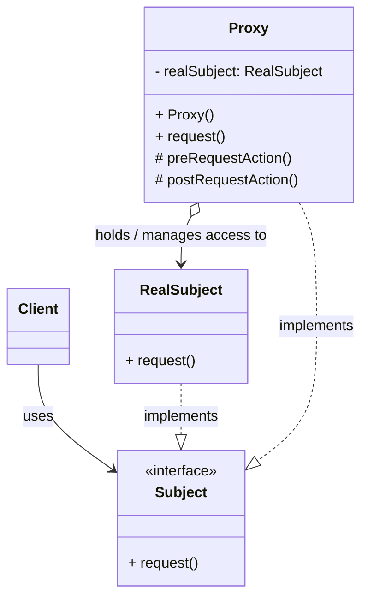

**目次**

- [デザインパターン詳細解説：Proxy パターン](#デザインパターン詳細解説proxy-パターン)
- [1. Proxy パターンとは？ ～目的と解決したい問題～](#1-proxy-パターンとは-目的と解決したい問題)
  - [1.1 このパターンを一言で言うと？（核心的な目的）](#11-このパターンを一言で言うと核心的な目的)
  - [1.2 なぜ Proxy パターンが必要なのか？（動機と背景）](#12-なぜ-proxy-パターンが必要なのか動機と背景)
    - [1.2.1 直接アクセスが望ましくない、または不可能な状況](#121-直接アクセスが望ましくないまたは不可能な状況)
    - [1.2.2 直接アクセスが引き起こす問題](#122-直接アクセスが引き起こす問題)
  - [1.3 このパターンで解決できること（メリットの要約）](#13-このパターンで解決できることメリットの要約)
- [2. パターンの構造と実装 ～どのように実現するか～](#2-パターンの構造と実装-どのように実現するか)
  - [2.1 登場人物とその役割（クラス図と解説）](#21-登場人物とその役割クラス図と解説)
  - [2.2 実装のポイント：インターフェース共有と委譲](#22-実装のポイントインターフェース共有と委譲)
  - [2.3 コード例：具体的なシナリオでの実装](#23-コード例具体的なシナリオでの実装)
    - [2.3.1 シナリオ設定（例：画像の遅延読み込み - Virtual Proxy）](#231-シナリオ設定例画像の遅延読み込み---virtual-proxy)
    - [2.3.2 サンプルコード（Java での例）](#232-サンプルコードjava-での例)
    - [2.3.3 コードのポイント解説](#233-コードのポイント解説)
- [3. Proxy パターンの利点 ～採用するメリット～](#3-proxy-パターンの利点-採用するメリット)
  - [3.1 アクセス制御の実現](#31-アクセス制御の実現)
  - [3.2 クライアントからの透過性](#32-クライアントからの透過性)
  - [3.3 関心の分離と責務の明確化](#33-関心の分離と責務の明確化)
  - [3.4 多様な応用可能性](#34-多様な応用可能性)
- [4. 注意点とトレードオフ ～適用前に考えるべきこと～](#4-注意点とトレードオフ-適用前に考えるべきこと)
  - [4.1 複雑性の増加とクラス数の増加](#41-複雑性の増加とクラス数の増加)
  - [4.2 応答時間の変動可能性](#42-応答時間の変動可能性)
  - [4.3 インターフェースの維持・同期](#43-インターフェースの維持同期)
  - [4.4 デバッグの難しさ（場合による）](#44-デバッグの難しさ場合による)
- [5. 実装上のヒントと考慮事項 ～より良く使うために～](#5-実装上のヒントと考慮事項-より良く使うために)
  - [5.1 Proxy の種類に応じた実装](#51-proxy-の種類に応じた実装)
  - [5.2 RealSubject の生成とライフサイクル管理](#52-realsubject-の生成とライフサイクル管理)
  - [5.3 インターフェース vs 抽象クラス vs 具象クラス](#53-インターフェース-vs-抽象クラス-vs-具象クラス)
  - [5.4 言語機能やライブラリの活用](#54-言語機能やライブラリの活用)
- [6. 他のパターンとの関連 ～比較と組み合わせ～](#6-他のパターンとの関連-比較と組み合わせ)
  - [6.1 似ているパターンとの比較](#61-似ているパターンとの比較)
  - [6.2 組み合わせると効果的なパターン](#62-組み合わせると効果的なパターン)
- [7. リファクタリング：いつ Proxy パターンを導入するか](#7-リファクタリングいつ-proxy-パターンを導入するか)
  - [7.1 導入のきっかけとなる「コードの不吉な臭い」や状況変化](#71-導入のきっかけとなるコードの不吉な臭いや状況変化)
  - [7.2 段階的なリファクタリング手順（概要）](#72-段階的なリファクタリング手順概要)
- [8. まとめ ～ Proxy パターンの本質～](#8-まとめ--proxy-パターンの本質)

# デザインパターン詳細解説：Proxy パターン

# 1. Proxy パターンとは？ ～目的と解決したい問題～

## 1.1 このパターンを一言で言うと？（核心的な目的）

Proxy パターンは、「**あるオブジェクト（本人）へのアクセスを、別の代理オブジェクト（Proxy）を介して行うことで、アクセスを制御したり、付加的な処理を挟んだりする**」ためのデザインパターンです。クライアントは Proxy を本人であるかのように透過的に利用できます。

## 1.2 なぜ Proxy パターンが必要なのか？（動機と背景）

ソフトウェア開発では、オブジェクトに直接アクセスするのではなく、そのアクセスを**間接的に**扱いたい、あるいは**制御**したいという状況がしばしば発生します。

### 1.2.1 直接アクセスが望ましくない、または不可能な状況

以下のような場合、オブジェクトへの直接アクセスが困難だったり、望ましくなかったりします。

- **生成コストが高いオブジェクト:** オブジェクトのインスタンス化に時間がかかる、あるいは多くのリソースを消費するため、本当に必要になるまで生成を遅らせたい（**遅延初期化**）。
- **リモートにあるオブジェクト:** アクセスしたいオブジェクトがネットワーク越しの別のマシン上にある場合、ネットワーク通信の詳細（シリアライズ、接続管理、エラー処理など）をクライアントから隠蔽したい。
- **アクセス制御が必要なオブジェクト:** 特定のクライアントやユーザーにだけ、オブジェクトへのアクセスや特定の操作を許可したい（**権限管理**）。
- **アクセス時に付加処理を行いたいオブジェクト:** オブジェクトのメソッドが呼び出される前後に、ログ記録、キャッシュ処理、トランザクション管理、参照カウントなどの**共通的な処理**を挟み込みたい。

### 1.2.2 直接アクセスが引き起こす問題

これらの状況でクライアントがオブジェクトに直接アクセスしようとすると、以下のような問題が生じます。

- **クライアントの複雑化:** クライアントが、遅延初期化のロジック、ネットワーク通信の詳細、アクセス権チェックのロジックなどを自身で実装する必要があり、本来の責務から逸脱し、コードが複雑になります。
- **関心の混在:** 本来のオブジェクトの責務（ビジネスロジックなど）と、アクセス制御やリソース管理といった付加的な関心事が、クライアントまたは本人オブジェクト内に混在してしまいます。
- **柔軟性の欠如:** アクセス制御の方法や付加処理の内容を変更したい場合に、クライアントコードや本人オブジェクトのコードに修正が必要になり、変更が困難になります。

Proxy パターンは、これらの問題を解決するために、「代理人」となる Proxy オブジェクトを間に挟むというアプローチを取ります。

## 1.3 このパターンで解決できること（メリットの要約）

Proxy パターンを適用することで、以下のようなメリットが期待できます。

- オブジェクトへの**アクセス制御**（権限チェックなど）を透過的に実現できる。
- 生成コストが高いオブジェクトの**初期化を遅延**させ、パフォーマンスを改善できる (Virtual Proxy)。
- **リモートオブジェクトへのアクセス**を、ローカルオブジェクトと同じように扱えるように隠蔽できる (Remote Proxy)。
- オブジェクトへのアクセス前後に、**ログ記録、キャッシュ、ロックなどの付加的な処理**を、本体を変更せずに追加できる (Smart Proxy など)。
- 本体オブジェクトの**責務を純粋に保ち**、アクセス制御などの関心事を Proxy に分離できる。

---

# 2. パターンの構造と実装 ～どのように実現するか～

Proxy パターンは、代理オブジェクト (`Proxy`) が本物のオブジェクト (`RealSubject`) と同じインターフェース (`Subject`) を実装することで、クライアントからの透過的なアクセスを実現します。

## 2.1 登場人物とその役割（クラス図と解説）

Proxy パターンは、主に以下の 3 つ（＋クライアント）の役割から構成されます。

- **`Subject`（主題インターフェース）:**
  - **役割:** `RealSubject`（本人）と `Proxy`（代理人）の両方が実装すべき**共通のインターフェース**を定義します。クライアントはこのインターフェース型を通じてオブジェクトを利用します。
  - **定義:** クライアントが必要とする操作（メソッド）を宣言します。
- **`RealSubject`（実際の主題、本人）:**
  - **役割:** `Proxy` が代理する、**本来の機能やビジネスロジックを提供する**実際のオブジェクトです。
  - **実装:** `Subject` インターフェースを実装し、具体的な処理内容を定義します。`Proxy` の存在は通常知りません。
- **`Proxy`（代理人）:**
  - **役割:** `RealSubject` への**アクセスを仲介・制御**する代理オブジェクトです。
  - **実装:**
    - `RealSubject` と同じ **`Subject` インターフェースを実装**します。これにより、クライアントは `Proxy` を `RealSubject` と同じように扱えます。
    - 内部に **`RealSubject` オブジェクトへの参照**を保持します。ただし、この参照をいつ初期化するか（`Proxy` 生成時か、メソッド呼び出し時かなど）は、Proxy の種類（とくに Virtual Proxy）によって異なります。
    - クライアントから `Subject` インターフェースのメソッドが呼び出されると、`Proxy` は**独自の処理**（アクセス制御、遅延初期化、ログ記録、キャッシュチェック、ネットワーク通信など）を実行します。
    - 必要であれば、保持している `RealSubject` の対応するメソッドを呼び出し、処理を**委譲**します。
    - `RealSubject` からの結果を受け取り、必要であれば後処理を行ってからクライアントに結果を返します。



_図: Proxy パターンのクラス図_

## 2.2 実装のポイント：インターフェース共有と委譲

- **インターフェースの共有:** `Proxy` が `RealSubject` と同じ `Subject` インターフェースを実装することが、クライアントからの**透過性**を確保する鍵となります。クライアントは、自分が扱っているのが `Proxy` なのか `RealSubject` なのかを意識する必要がありません。
- **委譲:** `Proxy` は、自身で処理を完結させる場合（例: キャッシュを返す）を除き、基本的には最終的な処理を `RealSubject` に**委譲**します。`Proxy` の役割は、あくまでアクセスを仲介し、制御や付加処理を行うことです。
- **`RealSubject` インスタンスの管理:** `Proxy` が `RealSubject` のインスタンスをいつ生成・取得するかは、Proxy の種類によって異なります。
  - **Virtual Proxy:** `RealSubject` が実際に必要とされるメソッドが呼び出された時にはじめて、`RealSubject` のインスタンスを生成（**遅延初期化**）します。
  - **Remote Proxy:** `Proxy` はリモートオブジェクトの情報を持ち、メソッド呼び出し時にネットワーク通信を行ってリモートの `RealSubject` と連携します。ローカルには `RealSubject` のインスタンスは存在しません。
  - **Protection Proxy:** `Proxy` 生成時に `RealSubject` への参照を持つことが多いですが、アクセス権チェックの結果によっては `RealSubject` への委譲を行いません。
- **Proxy の生成:** クライアントが `Proxy` を利用するためには、`Proxy` オブジェクトを生成する必要があります。これはクライアントが直接 `new Proxy(...)` する場合もあれば、Factory パターンや DI コンテナが適切な `Proxy` を生成・提供する場合もあります。

## 2.3 コード例：具体的なシナリオでの実装

### 2.3.1 シナリオ設定（例：画像の遅延読み込み - Virtual Proxy）

高解像度の画像ファイルを表示するアプリケーションを考えます。画像の読み込みには時間がかかるため、アプリケーション起動時ではなく、実際にその画像が表示されるタイミングではじめて読み込み処理を行いたいとします。

### 2.3.2 サンプルコード（Java での例）

(※ 前回の回答で提示した Virtual Proxy のコード例と同様です。)

```java
// 1. Subject インターフェース
interface Image {
    void display();
}

// 2. RealSubject: 実際の画像（読み込みに時間がかかる）
class RealImage implements Image {
    private String filename;
    private boolean loaded = false; // ロード済みフラグ

    public RealImage(String filename) {
        this.filename = filename;
        System.out.println("RealImage: オブジェクト生成 (ロードはまだ) - " + filename);
    }

    // 実際の重いロード処理
    private void loadFromDisk() {
        if (!loaded) {
            System.out.println("<< ロード処理実行 >> ディスクから画像をロード中: " + filename + " (時間がかかる...)");
            try { Thread.sleep(2000); } catch (InterruptedException e) { Thread.currentThread().interrupt(); }
            loaded = true;
        }
    }

    @Override
    public void display() {
        loadFromDisk(); // ★ 表示時に初めてロードする
        System.out.println("画像を表示: " + filename);
    }
}

// 3. Proxy: 画像読み込みを代理・遅延させる (Virtual Proxy)
class ProxyImage implements Image {
    private RealImage realImage; // 本人への参照 (最初は null)
    private String filename;

    public ProxyImage(String filename) {
        this.filename = filename;
        this.realImage = null; // 最初は本人を生成しない
        System.out.println("ProxyImage: オブジェクト生成 (RealImageはまだ生成しない) - " + filename);
    }

    @Override
    public void display() {
        System.out.println("Proxy: display() が呼ばれました。RealImageが必要か確認します。");
        // まだ本人が生成されていなければ、ここで初めて生成 (遅延初期化)
        if (realImage == null) {
            System.out.println("Proxy: RealImageを生成します...");
            realImage = new RealImage(filename);
        }
        // 本人に処理を委譲 (実際のロードは RealImage の display 内で行われる)
        System.out.println("Proxy: RealImageに表示を依頼します。");
        realImage.display();
    }
}

// --- Client (利用側) ---
public class ProxyClient {
    public static void main(String[] args) {
        System.out.println("--- 画像表示開始 ---");
        // Proxyオブジェクトを生成 (この時点では重いロード処理は走らない)
        Image image1 = new ProxyImage("photoA.jpg");
        Image image2 = new ProxyImage("photoB.png");

        System.out.println("Proxyオブジェクト生成完了。");

        // 最初に image1 を表示しようとしたときに、初めてRealImageが生成され、ロードが実行される
        System.out.println("\n1回目の image1.display() 呼び出し:");
        image1.display();

        // 2回目に image1 を表示するときは、RealImageは生成済みで、ロードも済んでいる
        System.out.println("\n2回目の image1.display() 呼び出し:");
        image1.display();

        // image2 はまだ表示されていないので、RealImageもロードもされていない
        System.out.println("\nimage2.display() 呼び出し:");
        image2.display(); // ここで初めて imageB.png の RealImage 生成とロードが実行される

        System.out.println("\n--- 画像表示終了 ---");
    }
}
```

### 2.3.3 コードのポイント解説

- `Image` が共通インターフェース (`Subject`) です。
- `RealImage` が実際の画像処理を行うクラス (`RealSubject`) ですが、重いロード処理 (`loadFromDisk`) は `display` メソッドが呼ばれるまで実行されません。
- `ProxyImage` が代理クラス (`Proxy`) です。内部に `RealImage` への参照を持ちますが、初期状態では `null` です。
- クライアントが `ProxyImage` の `display()` を呼び出すと、`ProxyImage` はまず `realImage` が `null` かどうかをチェックします。もし `null` ならば、ここではじめて `new RealImage()` を実行して本人オブジェクトを生成します（**遅延初期化**）。
- その後、`ProxyImage` は保持している `realImage` オブジェクトの `display()` メソッドを呼び出して処理を**委譲**します。`RealImage` の `display()` 内で、必要であれば実際のロード処理が行われます。
- クライアントは、`Image` インターフェースを通じて `ProxyImage` を操作するだけで、遅延読み込みの仕組みを意識する必要はありません。

このように、Proxy パターンはインターフェースの共有と委譲によって、オブジェクトへのアクセスを透過的に制御・代替する仕組みを提供します。

---

# 3. Proxy パターンの利点 ～採用するメリット～

Proxy パターンを適用することで、オブジェクトへのアクセス制御や付加機能の実装において、多くの設計上のメリットが得られます。

## 3.1 アクセス制御の実現

Proxy パターンのもっとも基本的なメリットの 1 つは、**対象オブジェクト (`RealSubject`) へのアクセスを制御できる**点です。代理である `Proxy` オブジェクトがクライアントと `RealSubject` の間に介在することで、以下のようなさまざまなアクセス制御を実装できます。

- **権限チェック (Protection Proxy):** クライアントが特定の操作を実行する権限を持っているかを `Proxy` がチェックし、権限がない場合は `RealSubject` へのアクセスを拒否する。
- **遅延初期化 (Virtual Proxy):** `RealSubject` の生成コストが高い場合に、実際に必要とされるまでインスタンス化を遅らせる。
- **アクセス数の制限:** 特定の期間内のアクセス回数を制限する。
- **キャッシュ:** `RealSubject` への問い合わせ結果を `Proxy` がキャッシュしておき、同じ問い合わせが来た場合に `RealSubject` にアクセスせずにキャッシュした結果を返す。

これらの制御ロジックを `RealSubject` 本体から分離し、`Proxy` に持たせることができます。

## 3.2 クライアントからの透過性

`Proxy` は `RealSubject` と**同じインターフェース (`Subject`) を実装する**ため、クライアントは `Proxy` の存在を意識することなく、`Subject` 型として透過的に利用できます。クライアントコードは、自分がやり取りしている相手が本物の `RealSubject` なのか、代理の `Proxy` なのかを知る必要が（通常は）ありません。

これにより、Proxy パターンを導入したり、Proxy の種類を変更したりしても、**クライアントコードへの変更を最小限に抑える**ことができます。

## 3.3 関心の分離と責務の明確化

Proxy パターンは、**本来のビジネスロジック（`RealSubject` の責務）** と、**アクセス制御やリソース管理、付加機能（`Proxy` の責務）** とを明確に分離することを可能にします。

`RealSubject` は自身のコアな機能の実装に集中でき、アクセス制御などの横断的な関心事について考慮する必要がなくなります。一方、`Proxy` はアクセス制御や付加機能の実装に特化します。これにより、各クラスの**単一責任の原則 (SRP)** が守られやすくなり、コードの**凝集度**が高まり、**理解しやすく保守しやすい**構造になります。

## 3.4 多様な応用可能性

Proxy パターンは、その目的に応じてさまざまなバリエーション（種類）が存在し、幅広い応用が可能です。

- **Virtual Proxy:** リソースの効率的な利用、アプリケーションの起動時間短縮。
- **Protection Proxy:** セキュリティ要件の実現。
- **Remote Proxy:** 分散システムにおける透過的なリモートオブジェクトアクセス。
- **Smart Proxy:** 参照カウントによるリソース管理、スレッドセーフなアクセス制御、キャッシュによる性能改善、メソッド呼び出しのロギングなど、付加的な管理機能の実装。

これらの多様な応用により、さまざまな設計上の課題に対して、Proxy パターンが有効な解決策となり得ます。

---

# 4. 注意点とトレードオフ ～適用前に考えるべきこと～

Proxy パターンは多くのメリットを提供する一方で、導入にあたってはいくつかの注意点や考慮すべきトレードオフが存在します。

## 4.1 複雑性の増加とクラス数の増加

Proxy パターンを適用すると、`RealSubject` に加えて `Proxy` クラス（および共通の `Subject` インターフェース）が必要になります。これにより、システム全体の**クラス数は増加**し、オブジェクト間の関係性も**間接層が一つ増える**ことになります。

非常に単純なケース、たとえばアクセス制御や付加機能がまったく不要で、遅延初期化のメリットもないような状況で Proxy パターンを導入すると、単に**設計が不必要に複雑化**するだけ（過剰設計）になる可能性があります。パターンの導入は、解決したい明確な問題がある場合に限定すべきです。

## 4.2 応答時間の変動可能性

Proxy が行う処理によっては、クライアントからの要求に対する**応答時間 (レスポンスタイム) が変動する**可能性があります。

- **Virtual Proxy:** はじめてアクセスされた際には `RealSubject` の初期化処理が実行されるため、応答時間が長くなる可能性があります。2 回目以降は速くなります。
- **Remote Proxy:** ネットワーク通信を伴うため、ネットワークの遅延や帯域によって応答時間が大きく変動します。ローカルオブジェクトへのアクセスとは応答時間の特性が異なります。
- **その他の Proxy:** キャッシュヒット時とミス時、アクセス権チェックの処理時間など、Proxy が行う処理によって応答が変わることがあります。

クライアント側が常に一定の応答時間を期待しているようなシステムでは、Proxy の導入による応答時間の変動を考慮する必要があります。

## 4.3 インターフェースの維持・同期

`Proxy` は `RealSubject` と同じ `Subject` インターフェースを実装する必要があります。これはクライアントからの透過性を保つために不可欠です。

しかし、これは同時に、もし `Subject` インターフェース（つまり、`RealSubject` が提供するメソッド）に**変更**があった場合、`RealSubject` だけでなく **`Proxy` クラスも併せて修正**し、インターフェースの同期を保つ必要があることを意味します。インターフェースの変更が頻繁に発生する場合、この同期作業が**保守コスト**となる可能性があります。

## 4.4 デバッグの難しさ（場合による）

間に `Proxy` が介在することで、デバッグ時に処理の流れを追うのが少しだけ複雑になる場合があります。クライアントが呼び出しているのは `Proxy` のメソッドであり、そこから `RealSubject` のメソッドが呼び出される、という間接的なステップを意識する必要があります。

とくに Remote Proxy のように、物理的に離れたオブジェクトへのアクセスを隠蔽している場合、問題発生時の原因切り分け（クライアント側の問題か、ネットワークの問題か、サーバー側の `RealSubject` の問題か）がより複雑になる可能性があります。

これらの注意点を理解し、Proxy パターンを導入するメリット（アクセス制御、遅延初期化、関心の分離など）が、これらのトレードオフを上回るかどうかを慎重に評価することが、適切な設計判断には不可欠です。

---

# 5. 実装上のヒントと考慮事項 ～より良く使うために～

Proxy パターンを実装する際には、その種類や目的に応じて、いくつかの考慮事項や実装上のヒントがあります。

## 5.1 Proxy の種類に応じた実装

Proxy パターンにはさまざまな種類があり、それぞれ実装のポイントが異なります。

- **Virtual Proxy:**
  - `Proxy` は `RealSubject` の**生成に必要な情報**（例: ファイルパス、URL、設定など）を保持します。
  - `RealSubject` の**インスタンスへの参照**も持ちますが、初期値は `null` にしておきます。
  - クライアントから `Subject` のメソッドが**はじめて呼び出された**際に、`RealSubject` のインスタンスを生成し、参照を保持します（**遅延初期化**）。
  - 2 回目以降のメソッド呼び出しでは、すでに生成済みの `RealSubject` インスタンスに処理を委譲します。
- **Protection Proxy:**
  - `Proxy` は、クライアントからのメソッド呼び出しを受け取ると、まず**アクセス権限をチェック**するロジックを実行します。
  - 権限がある場合のみ、`RealSubject` に処理を委譲します。権限がない場合は、例外をスローするか、エラーを示す値を返すなどの処理を行います。
  - `Proxy` は通常、`RealSubject` への参照を最初から持っています。
- **Remote Proxy:**
  - `Proxy` は、リモートオブジェクトの**所在地情報**（例: IP アドレス、ポート番号、オブジェクト識別子など）を持ちます。
  - メソッド呼び出しを受け取ると、引数をネットワーク経由で送信可能な形式に**シリアライズ**し、リモートの `RealSubject`（またはその代理）に送信します。
  - リモートからの結果を受け取り、**デシリアライズ**してクライアントに返します。ネットワーク通信に関する複雑な処理（接続、エラーハンドリングなど）は `Proxy` が担当します。
- **Smart Proxy (例: Logging Proxy):**
  - メソッド呼び出しを受け取ると、**前処理**（例: 呼び出しログの記録）を実行します。
  - `RealSubject` に処理を委譲します。
  - `RealSubject` から結果を受け取った後、**後処理**（例: 結果ログの記録、実行時間の計測）を実行します。

## 5.2 RealSubject の生成とライフサイクル管理

`Proxy` が `RealSubject` のインスタンスをいつ、どのように生成し、管理するかは重要な設計ポイントです。

- **Virtual Proxy** では、前述の通り遅延初期化が行われます。
- 他の種類の Proxy では、`Proxy` のコンストラクタで `RealSubject` を生成または受け取るのが一般的です。
- DI コンテナを利用している場合、`Proxy` が `RealSubject` (のインターフェース) をコンストラクタで注入してもらい、`Proxy` 自身もコンテナに管理させる、といった構成も可能です。（Proxy を AOP (Aspect-Oriented Programming) の仕組みで自動生成する場合もあります）

`RealSubject` のライフサイクル（いつ生成され、いつ破棄されるか）を誰が責任を持つのかを明確に設計する必要があります。

## 5.3 インターフェース vs 抽象クラス vs 具象クラス

- **Subject:** 通常は**インターフェース**として定義するのがもっとも柔軟性が高く、推奨されます。これにより、`Proxy` も `RealSubject` も同じ契約を実装し、クライアントはインターフェースにのみ依存できます。
- **RealSubject:** 具体的な実装を持つ**具象クラス**です。
- **Proxy:** `Subject` インターフェースを実装する**具象クラス**です。場合によっては、共通のロジックを持つ Proxy のための抽象クラスを設けることも考えられます。

## 5.4 言語機能やライブラリの活用

いくつかのプログラミング言語やフレームワークには、Proxy パターン（とくに動的な Proxy）の実装を支援する機能が備わっています。

- **Java:** `java.lang.reflect.Proxy` クラスと `InvocationHandler` インターフェースを使うことで、実行時に動的に Proxy インスタンスを生成できます。これにより、コンパイル時に `Proxy` クラスを明示的に作成しなくても、インターフェースに対する Proxy を作ることが可能です。AOP フレームワーク (AspectJ, Spring AOP) も Proxy パターンを内部で多用しています。
- **C#:** `System.Runtime.Remoting.Proxies.RealProxy` クラスや、Castle DynamicProxy などのライブラリを利用して動的 Proxy を作成できます。
- **その他の言語:** 同様のメタプログラミングやリフレクション機能を持つ言語では、動的な Proxy 生成が可能な場合があります。

これらの機能を活用することで、定型的な Proxy コードの記述を削減できる場合がありますが、一方でコードの挙動が追いにくくなる可能性もあるため、利用する際はその仕組みを理解しておくことが重要です。

これらの実装上のヒントを考慮することで、目的に合った、効果的で保守しやすい Proxy パターンを実装できます。

---

# 6. 他のパターンとの関連 ～比較と組み合わせ～

Proxy パターンは、他のデザインパターン、とくに構造に関するパターンとしばしば比較されたり、組み合わせて利用されたりします。これらの関連性を理解することで、各パターンの役割を明確にし、設計の選択肢を広げることができます。

## 6.1 似ているパターンとの比較

Proxy パターンと構造や目的が似ているとされるパターンとの違いを見ていきましょう。

- **Decorator パターン:**

  - **類似点:** どちらも対象オブジェクトを「ラップ」し、同じインターフェースを実装することで透過性を提供します。クライアントはラッパーの存在を意識せずに利用できます。
  - **違い (主目的):**
    - **Proxy:** オブジェクトへの**アクセスを制御**すること（権限、遅延、リモートなど）や、ライフサイクル管理（参照カウントなど）が主な目的です。インターフェースは通常変更しません。
    - **Decorator:** オブジェクトに**動的に新しい責務（機能）を追加**することが主な目的です。「飾り付け」のように機能を重ねていきます。インターフェースを拡張（新しいメソッドを追加）することもあります。
  - **見分け方:** 「アクセス方法やタイミングを管理したい」なら Proxy、「機能を追加・変更したい」なら Decorator を検討します。実装上、Proxy はしばしば内部で `RealSubject` を管理しますが、Decorator はラップする `Component` を外部から受け取ることが多いです。

- **Adapter パターン:**

  - **類似点:** どちらも既存のオブジェクトへの「間接的なアクセス」を提供します。
  - **違い (インターフェース):**
    - **Proxy:** **同じインターフェース**を提供します。クライアントは `Proxy` を `RealSubject` と同じ型として扱います。
    - **Adapter:** **異なるインターフェース**を提供します。既存のオブジェクトのインターフェースを、クライアントが期待する別のインターフェースに**変換**します。
  - **見分け方:** クライアントが期待するインターフェースが、対象オブジェクトのインターフェースと**同じ**なら Proxy、**異なる**なら Adapter を検討します。

- **Facade パターン:**
  - **類似点:** どちらも既存のオブジェクト（群）へのアクセスを単純化したり、隠蔽したりする役割を持ちます。
  - **違い (対象):**
    - **Proxy:** 通常、**単一の** `RealSubject` オブジェクトへのアクセスを代理・制御します。
    - **Facade:** **複数の**サブシステムオブジェクト群への**統一された高レベルなインターフェース**を提供し、サブシステムの複雑さを隠蔽します。
  - **見分け方:** アクセスを制御したい対象が**一つ**なら Proxy、**複数のクラスからなる複雑なシステム**への窓口を作りたいなら Facade を検討します。

## 6.2 組み合わせると効果的なパターン

Proxy パターンは、他のパターンと組み合わせて使われることもあります。

- **Factory パターン (Factory Method, Abstract Factory):**
  - **連携:** `Proxy` オブジェクト自身、あるいは `Proxy` が内部で利用する `RealSubject` オブジェクトの生成を、Factory パターンに任せることができます。たとえば、クライアントには常に `Subject` インターフェース型を返し、内部的に `Proxy` を返すか `RealSubject` を返すかを Factory が決定する、といった構成が考えられます。
- **Singleton パターン:**
  - **連携:** `RealSubject` がシステム全体で唯一のインスタンスであるべき場合（Singleton パターン）、`Proxy` はその Singleton インスタンスへのアクセスを制御する役割を担うことがあります。たとえば、Singleton へのアクセス時に追加のチェックを行う Protection Proxy などです。
- **Flyweight パターン:**
  - **連携:** 多数のオブジェクトへのアクセスを管理する際に、Proxy が Flyweight オブジェクトへの参照を管理し、必要に応じて状態（外部状態）を設定するような使い方が考えられます。（ただし、これは少し高度な組み合わせです）

これらのパターンとの関係性を理解しておくことで、Proxy パターンを単独で使うだけでなく、他のパターンと効果的に組み合わせることで、より洗練された設計が可能になります。

---

# 7. リファクタリング：いつ Proxy パターンを導入するか

Proxy パターンは、システムの要求が変化したり、新たな課題（性能、セキュリティ、分散化など）が明らかになったりした際に、**リファクタリング**によって既存のコードに後から導入されることも多いパターンです。ここでは、どのような状況が Proxy パターンの導入を示唆するのか、そしてリファクタリングの進め方の概要を見ていきます。

## 7.1 導入のきっかけとなる「コードの不吉な臭い」や状況変化

既存のコードベースに以下のような兆候や状況の変化が見られた場合、Proxy パターンの適用を検討する良い機会かもしれません。

- **オブジェクト生成時のパフォーマンス問題:**
  - **症状:** 特定のクラスのインスタンス生成に非常に時間がかかり、アプリケーションの起動や応答性を損なっている。しかし、そのオブジェクトが常にすぐに必要とされるわけではない。
  - **解決策:** **Virtual Proxy** を導入し、オブジェクトの生成を実際に必要になるまで遅延させることを検討します。
- **メソッド呼び出し前後の定型処理の重複:**
  - **症状:** 複数のメソッド呼び出し箇所で、呼び出し前に権限チェックを行ったり、呼び出し後にログを記録したりするような、**類似した前処理・後処理コード**が繰り返し現れている。
  - **問題:** コードが重複し、修正漏れのリスクや保守性の低下を招きます。
  - **解決策:** **Protection Proxy** や **Logging Proxy** (Smart Proxy の一種) を導入し、これらの横断的な関心事を Proxy にカプセル化することを検討します。（AOP フレームワークの利用も有効な場合があります）
- **リモートアクセスロジックの混在:**
  - **症状:** クライアントコード内に、ネットワーク通信、データのシリアライズ/デシリアライズ、リモートエラーハンドリングといった、リモートオブジェクトへのアクセスに固有のロジックが直接記述されている。
  - **問題:** クライアントコードが複雑化し、ネットワークの詳細に依存してしまいます。
  - **解決策:** **Remote Proxy** を導入し、リモートアクセスに関する複雑な処理を Proxy に隠蔽し、クライアントからはローカルオブジェクトのように扱えるようにします。
- **アクセス制御ロジックの分散:**
  - **症状:** オブジェクトへのアクセス権限チェックのロジックが、クライアントコードのあちこちや、あるいはビジネスロジックの中に散らばってしまっている。
  - **問題:** 制御ロジックの変更が困難になり、セキュリティホールを生むリスクがあります。
  - **解決策:** **Protection Proxy** を導入し、アクセス制御の責任を Proxy に集約します。

これらの状況は、オブジェクトへの直接アクセスに起因する問題や、関心事が適切に分離されていない可能性を示唆しており、Proxy パターンの導入によって設計を改善できる可能性があります。

## 7.2 段階的なリファクタリング手順（概要）

既存のコードに Proxy パターンを導入する際の、一般的なリファクタリング手順の概要は以下の通りです。（ここでも、テストによる安全確保が前提です）

1. **`Subject` インターフェースの抽出:**
   - 代理対象となる既存のクラス (`RealSubject` の元) から、クライアントが必要とするメソッド群を定義する**インターフェース (`Subject`) を抽出 (Extract Interface)** します。
   - `RealSubject` がこの新しいインターフェースを実装するように変更します。
   - クライアントコードが、具象クラスではなく、この新しい `Subject` インターフェースを利用するように修正します。（このステップ自体が大きなリファクタリングになる場合があります）
2. **`Proxy` クラスの作成:**
   - ステップ 1 で作成した `Subject` インターフェースを実装する、新しい `Proxy` クラスを作成します。
   - `Proxy` クラス内に、`RealSubject` (のインターフェース型 `Subject`) への参照を持つフィールドを追加します。
3. **`Proxy` の実装:**
   - `Proxy` が `RealSubject` のインスタンスをいつ・どのように取得・生成するかを決定します（例: コンストラクタで受け取る、遅延初期化するなど）。
   - `Subject` インターフェースの各メソッドを `Proxy` クラスに実装します。この実装には、Proxy の種類に応じた**独自の処理**（アクセス制御、遅延初期化、ログ記録など）と、必要に応じた **`RealSubject` への処理の委譲**が含まれます。
4. **クライアントコードの修正:**
   - クライアントコードが `RealSubject` を直接生成・利用していた箇所を修正し、代わりに **`Proxy` オブジェクトを生成・利用**するように変更します。クライアントは引き続き `Subject` インターフェースを通じて操作するため、この修正は比較的容易な場合があります（とくに DI が使われている場合）。
5. **テスト:** 各ステップの後、および最終的に、テストを実行してリファクタリングによって外部から見た振る舞いが変わっていないこと（あるいは意図した通りに制御・変更されていること）、そしてクライアントコードが正しく機能することを確認します。

このリファクタリングプロセスにより、既存のコードを変更することなく（あるいは最小限の変更で）、オブジェクトへのアクセス制御や付加機能の導入が可能になります。結果として、システムの柔軟性、保守性、そして場合によってはパフォーマンスやセキュリティが向上します。

---

# 8. まとめ ～ Proxy パターンの本質～

**Proxy パターン**は、あるオブジェクトへの**アクセスを代理・制御**するための構造に関するデザインパターンです。本物のオブジェクト (`RealSubject`) と同じインターフェース (`Subject`) を持つ代理オブジェクト (`Proxy`) を用意し、クライアントからのアクセスをこの `Proxy` が仲介します。

このパターンを適用することで、

- **アクセス制御:** 権限チェックなど、オブジェクトへのアクセスを条件に応じて制御できる。
- **遅延初期化 (Virtual Proxy):** リソース消費の大きいオブジェクトの生成を、実際に必要になるまで遅らせることができる。
- **リモートアクセス隠蔽 (Remote Proxy):** ネットワーク越しのオブジェクトを、ローカルにあるかのように透過的に扱える。
- **付加機能の追加:** ログ記録、キャッシュ、参照カウントなど、本来の機能に影響を与えずに付加的な処理を挟むことができる。
- **関心の分離:** 本来のビジネスロジックと、アクセス制御やリソース管理といった横断的な関心事を分離できる。

といったメリットが得られ、システムの**柔軟性、効率性、保守性、そして場合によってはセキュリティ**を向上させることができます。

その本質は、「**対象への『間接層』を設けることで、直接アクセスでは実現できない制御や付加価値を提供する**」ことにあります。クライアントは `Proxy` の存在を意識することなく、共通のインターフェースを通じてサービスを利用できる「**透過性**」が重要な特徴です。

ただし、間接層が増えることによる**複雑性の増加**や、**応答時間の変動**といったトレードオフも存在するため、導入のメリットがコストを上回るかを慎重に検討する必要があります。

Proxy パターンは、Virtual, Protection, Remote, Smart などさまざまな形態で応用され、オブジェクト指向設計において広く使われる強力なパターンの 1 つです。オブジェクトへのアクセス方法に工夫を加えたい場合に、この「代理人」という考え方は、有効な解決策の選択肢となるでしょう。
