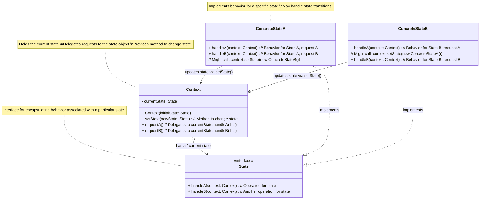

**目次**

- [デザインパターン詳細解説：State パターン](#デザインパターン詳細解説state-パターン)
- [1. State パターンとは？ ～目的と解決したい問題～](#1-state-パターンとは-目的と解決したい問題)
  - [1.1 このパターンを一言で言うと？（核心的な目的）](#11-このパターンを一言で言うと核心的な目的)
  - [1.2 なぜ State パターンが必要なのか？（動機と背景）](#12-なぜ-state-パターンが必要なのか動機と背景)
    - [1.2.1 状態に依存する条件分岐の問題点](#121-状態に依存する条件分岐の問題点)
    - [1.2.2 状態ごとの振る舞いを整理・分離したい](#122-状態ごとの振る舞いを整理分離したい)
  - [1.3 このパターンで解決できること（メリットの要約）](#13-このパターンで解決できることメリットの要約)
- [2. パターンの構造と実装 ～どのように実現するか～](#2-パターンの構造と実装-どのように実現するか)
  - [2.1 登場人物とその役割（クラス図と解説）](#21-登場人物とその役割クラス図と解説)
  - [2.2 実装のポイント：委譲と状態遷移](#22-実装のポイント委譲と状態遷移)
  - [2.3 コード例：具体的なシナリオでの実装](#23-コード例具体的なシナリオでの実装)
    - [2.3.1 シナリオ設定（例：オンライン文書の状態）](#231-シナリオ設定例オンライン文書の状態)
    - [2.3.2 サンプルコード（Java での例）](#232-サンプルコードjava-での例)
    - [2.3.3 コードのポイント解説](#233-コードのポイント解説)
- [3. State パターンの利点 ～採用するメリット～](#3-state-パターンの利点-採用するメリット)
  - [3.1 状態固有のロジックの局所化と凝集度の向上](#31-状態固有のロジックの局所化と凝集度の向上)
  - [3.2 条件分岐の排除とコードの単純化](#32-条件分岐の排除とコードの単純化)
  - [3.3 状態遷移の明示化と管理の容易さ](#33-状態遷移の明示化と管理の容易さ)
  - [3.4 新しい状態の追加容易性（OCP への貢献）](#34-新しい状態の追加容易性ocp-への貢献)
- [4. 注意点とトレードオフ ～適用前に考えるべきこと～](#4-注意点とトレードオフ-適用前に考えるべきこと)
  - [4.1 クラス数の増加](#41-クラス数の増加)
  - [4.2 設計の複雑さ（単純なケースでは）](#42-設計の複雑さ単純なケースでは)
  - [4.3 State オブジェクトの管理と生成コスト](#43-state-オブジェクトの管理と生成コスト)
  - [4.4 状態遷移ロジックの分散](#44-状態遷移ロジックの分散)
- [5. 実装上のヒントと考慮事項 ～より良く使うために～](#5-実装上のヒントと考慮事項-より良く使うために)
  - [5.1 State クラスをどこに配置するか](#51-state-クラスをどこに配置するか)
  - [5.2 State オブジェクトの共有（Flyweight / Singleton の活用）](#52-state-オブジェクトの共有flyweight--singleton-の活用)
  - [5.3 状態遷移ロジックの置き場所](#53-状態遷移ロジックの置き場所)
  - [5.4 `State` インターフェース vs 抽象クラス](#54-state-インターフェース-vs-抽象クラス)
  - [5.5 エントリーアクションとイグジットアクション](#55-エントリーアクションとイグジットアクション)
- [6. 他のパターンとの関連 ～比較と組み合わせ～](#6-他のパターンとの関連-比較と組み合わせ)
  - [6.1 似ているパターンとの比較](#61-似ているパターンとの比較)
    - [6.1.1 State vs Strategy：状態遷移か、アルゴリズム交換か](#611-state-vs-strategy状態遷移かアルゴリズム交換か)
    - [6.1.2 State vs 有限状態マシン (FSM) ライブラリ/フレームワーク](#612-state-vs-有限状態マシン-fsm-ライブラリフレームワーク)
  - [6.2 組み合わせると効果的なパターン](#62-組み合わせると効果的なパターン)
- [7. リファクタリング：いつ State パターンを導入するか](#7-リファクタリングいつ-state-パターンを導入するか)
  - [7.1 導入のきっかけとなる「コードの不吉な臭い」](#71-導入のきっかけとなるコードの不吉な臭い)
  - [7.2 段階的なリファクタリング手順（概要）](#72-段階的なリファクタリング手順概要)
- [8. まとめ ～ State パターンの本質～](#8-まとめ--state-パターンの本質)

# デザインパターン詳細解説：State パターン

# 1. State パターンとは？ ～目的と解決したい問題～

## 1.1 このパターンを一言で言うと？（核心的な目的）

State パターンは、「**オブジェクトの内部状態が変わると、その振る舞いも変わるような場合に、各状態を独立したオブジェクトとして表現し、あたかもオブジェクトのクラスが切り替わったかのように振る舞いを変更する**」ためのデザインパターンです。状態に依存するロジックをカプセル化します。

## 1.2 なぜ State パターンが必要なのか？（動機と背景）

ソフトウェアの中には、その時々の「状態」によって振る舞いが大きく変化するオブジェクトが数多く存在します。例えば、

- **自動販売機:** 「お金が入っていない状態」「お金は入っているが商品は選ばれていない状態」「商品選択済みの状態」で、ボタンを押したときの反応は全く異なります。
- **ネットワーク接続:** 「未接続状態」「接続中状態」「接続済み状態」「切断中状態」で、データ送信・受信の可否や挙動が変わります。
- **文書エディタの文書:** 「編集中」「保存済み」「読み取り専用」などの状態で、保存や編集といった操作に対する反応が変わります。

### 1.2.1 状態に依存する条件分岐の問題点

このような状態に基づく振る舞いの変化を実装する際、最も素朴な方法は、状態を表す変数（例えば `int status` や `enum Status`）を用意し、メソッドの中でその変数の値を `if-else` 文や `switch` 文でチェックして処理を分岐させることです。

しかし、このアプローチには以下のような問題があります。

- **巨大な条件分岐:** 状態の種類や、状態によって変化する操作が増えるにつれて、メソッド内の条件分岐が非常に長く、複雑になります。コードの可読性が著しく低下し、理解やデバッグが困難になります。
- **状態ロジックの分散:** 特定の状態に関する処理ロジックが、複数のメソッドの `if-else` ブロック内に分散してしまいがちです。例えば、「レビュー中」状態の処理を追加・修正したい場合、関係するすべてのメソッドの条件分岐を確認・修正する必要があり、保守性が低下します。
- **変更への弱さ (OCP 違反):** 新しい状態を追加する場合、既存のすべてのメソッド内の条件分岐に新しい `else if` や `case` を追加修正する必要があります。これはオープン/クローズドの原則に反し、変更によるバグのリスクを高めます。
- **状態遷移の管理:** 状態がどのように変化（遷移）するかのルールも、条件分岐の中に埋もれてしまい、複雑な遷移ロジックを管理するのが難しくなります。

### 1.2.2 状態ごとの振る舞いを整理・分離したい

理想的には、それぞれの「状態」における「振る舞い」を、もっと整理された形で、互いに独立して管理したいと考えられます。また、状態遷移のルールも、より明確に表現したいという要求があります。

State パターンは、このような課題、すなわち「状態依存の複雑な条件分岐」「状態ロジックの分散」「変更への弱さ」「状態遷移管理の難しさ」を解決するために生まれました。

## 1.3 このパターンで解決できること（メリットの要約）

State パターンを適用することで、以下のようなメリットが期待できます。

- **状態固有のロジックを局所化**し、対応する State クラスにカプセル化できる。
- `Context` クラスから**巨大な条件分岐を排除**し、コードをシンプルにできる。
- **新しい状態の追加が容易**になり、拡張性が向上する（OCP 準拠）。
- **状態遷移のルールを明確**に表現・管理しやすくなる。

---

# 2. パターンの構造と実装 ～どのように実現するか～

State パターンは、オブジェクトの状態とその状態における振る舞いを分離し、状態遷移に応じて振る舞いを動的に切り替える仕組みを提供します。その実現方法と構造を見ていきましょう。

## 2.1 登場人物とその役割（クラス図と解説）

State パターンは、主に以下の 3 つの役割から構成されます。

- **`Context`（文脈）:**
  - **役割:** 内部状態を持つオブジェクト本体です。クライアントはこの `Context` オブジェクトと直接やり取りします。
  - **実装:**
    - 現在の状態を表す **`State` オブジェクトへの参照**（例: `currentState` フィールド）を保持します。
    - クライアントからの要求（メソッド呼び出し）を受け取ると、その処理を**現在の `currentState` オブジェクトに委譲**します。
    - 現在の状態を**新しい状態に切り替えるためのメソッド**（例: `setState(newState)`) を提供します。このメソッドは、通常 `State` オブジェクトから呼び出されます。
- **`State`（状態インターフェースまたは抽象クラス）:**
  - **役割:** 特定の状態における振る舞いを表す**共通のインターフェース**を定義します。`Context` が持つ可能性のあるすべての状態に共通の操作（メソッド）を宣言します。
  - **定義:** `Context` から委譲される可能性のあるメソッド（例: `handleRequestA()`, `handleRequestB()` など）を宣言します。多くの場合、これらのメソッドは `Context` オブジェクトを引数として受け取り、必要に応じて `Context` の状態を変更できるようにします。
- **`ConcreteState`（具体的な状態）:**
  - **役割:** `State` インターフェース（または抽象クラス）を実装（または継承）し、**特定の状態における具体的な振る舞い**を実装します。
  - **実装:**
    - `Context` から委譲されたメソッドに対して、その状態固有の処理を実行します。
    - 特定の条件やイベントが発生した場合に、**次の状態への遷移**を決定し、`Context` の `setState()` メソッドを呼び出して状態を切り替える責務を持つことが多いです。



_図: State パターンのクラス図_

## 2.2 実装のポイント：委譲と状態遷移

- **振る舞いの委譲:** State パターンの核心は、`Context` が自身の状態に基づく複雑な条件分岐を持つ代わりに、**処理を現在の `State` オブジェクトに完全に委譲する**点にあります。`Context` のメソッドは、単に `currentState.handleA(this)` のように、対応する `State` のメソッドを呼び出すだけになります。
- **状態遷移の管理:** 状態がどのように遷移するかのロジックは、どこで管理するかがポイントです。
  - **`ConcreteState` が遷移を決定する (一般的):** 各 `ConcreteState` が、自身の処理結果や受け取ったイベントに応じて、次にどの状態に遷移すべきかを判断し、`Context` の `setState()` を呼び出して状態を変更します。状態遷移の知識が各 `State` クラスに分散しますが、その状態からの遷移ルールはその状態クラスを見れば分かる、というメリットがあります。
  - **`Context` が遷移を決定する:** `Context` 自身が、現在の状態と発生したイベントに基づいて次の状態を決定し、`setState()` を呼び出す方法もあります。状態遷移のロジックが一箇所に集まりますが、`Context` がすべての状態遷移を知る必要があり、状態が増えると複雑になる可能性があります。
  - 多くの場合、`ConcreteState` が遷移を決定する方が、状態ごとの関心がまとまりやすいため、より一般的です。
- **State オブジェクトのインスタンス:**
  - **状態ごとにインスタンスを生成:** `setState()` が呼ばれるたびに新しい `ConcreteState` インスタンスを `new` する方法。実装は簡単ですが、状態遷移が頻繁だとオブジェクト生成のオーバーヘッドが気になる場合があります。
  - **インスタンスを共有 (Flyweight):** もし `ConcreteState` オブジェクトが内部状態を持たない（ステートレスである）ならば、各状態に対応するインスタンスを**一つだけ**生成し、それを複数の `Context` や状態遷移で**共有**する（例: Singleton パターンや Flyweight パターンを適用）ことができます。これにより、オブジェクト生成コストを削減できます。

## 2.3 コード例：具体的なシナリオでの実装

### 2.3.1 シナリオ設定（例：オンライン文書の状態）

Web 上で編集可能な文書があり、「下書き (Draft)」「レビュー中 (Moderation)」「公開済み (Published)」という 3 つの状態を持つとします。各状態で「公開 (publish)」「編集 (edit)」「レビュー却下 (reviewFailed)」といった操作を行ったときの振る舞いが異なるとします。例えば、レビュー中は編集できない、公開済みは再公開できない、などです。

### 2.3.2 サンプルコード（Java での例）

```java
// 1. State インターフェース
interface DocumentState {
    void publish(DocumentContext document); // 公開操作
    void edit(DocumentContext document, String text); // 編集操作
    void reviewFailed(DocumentContext document); // レビュー却下操作
    String getStateName(); // 現在の状態名を取得 (表示用)
}

// 2. ConcreteState クラス群
class DraftState implements DocumentState {
    private static final DraftState instance = new DraftState(); // Singleton
    private DraftState() {}
    public static DraftState getInstance() { return instance; }

    @Override
    public void publish(DocumentContext document) {
        System.out.println("[" + getStateName() + "] 'publish' -> レビュー中に遷移");
        document.changeState(ModerationState.getInstance()); // レビュー中へ
    }
    @Override
    public void edit(DocumentContext document, String text) {
        System.out.println("[" + getStateName() + "] 'edit' -> 内容を更新");
        document.setContent(document.getContent() + text); // 編集可能
    }
    @Override
    public void reviewFailed(DocumentContext document) {
        System.out.println("[" + getStateName() + "] 'reviewFailed' -> 操作不可");
        // 下書き状態ではレビュー却下は意味がない
    }
    @Override public String getStateName() { return "下書き"; }
}

class ModerationState implements DocumentState {
    private static final ModerationState instance = new ModerationState(); // Singleton
    private ModerationState() {}
    public static ModerationState getInstance() { return instance; }

    @Override
    public void publish(DocumentContext document) {
        System.out.println("[" + getStateName() + "] 'publish' -> 公開済みに遷移");
        document.changeState(PublishedState.getInstance()); // 公開済みへ
    }
    @Override
    public void edit(DocumentContext document, String text) {
        System.out.println("[" + getStateName() + "] 'edit' -> 編集不可");
        // レビュー中は編集できない
    }
    @Override
    public void reviewFailed(DocumentContext document) {
        System.out.println("[" + getStateName() + "] 'reviewFailed' -> 下書きに戻る");
        document.changeState(DraftState.getInstance()); // 下書きへ
    }
    @Override public String getStateName() { return "レビュー中"; }
}

class PublishedState implements DocumentState {
    private static final PublishedState instance = new PublishedState(); // Singleton
    private PublishedState() {}
    public static PublishedState getInstance() { return instance; }

    @Override
    public void publish(DocumentContext document) {
        System.out.println("[" + getStateName() + "] 'publish' -> 操作不可 (既に公開済み)");
    }
    @Override
    public void edit(DocumentContext document, String text) {
        System.out.println("[" + getStateName() + "] 'edit' -> 編集不可 (公開済み)");
        // 必要なら下書きに戻すロジックをここに追加できる
        // document.changeState(DraftState.getInstance());
        // document.setContent(text);
    }
    @Override
    public void reviewFailed(DocumentContext document) {
        System.out.println("[" + getStateName() + "] 'reviewFailed' -> 操作不可 (公開済み)");
    }
    @Override public String getStateName() { return "公開済み"; }
}

// 3. Context クラス
class DocumentContext {
    private DocumentState currentState; // 現在の状態を保持
    private String content;

    public DocumentContext() {
        // 初期状態は下書き (Singletonインスタンスを使用)
        this.currentState = DraftState.getInstance();
        this.content = "";
        System.out.println("文書が生成されました。初期状態: " + currentState.getStateName());
    }

    // 状態を変更するメソッド (Stateから呼び出される)
    /* package-private or protected */ void changeState(DocumentState newState) {
        this.currentState = newState;
        System.out.println("状態が '" + currentState.getStateName() + "' に遷移しました。");
    }

    // クライアントが呼び出す操作メソッド (現在のStateに委譲)
    public void publish() { currentState.publish(this); }
    public void edit(String text) { currentState.edit(this, text); }
    public void reviewFailed() { currentState.reviewFailed(this); }

    // コンテンツ操作用メソッド (Stateから呼び出される)
    public String getContent() { return content; }
    /* package-private or protected */ void setContent(String content) { this.content = content; }
    public String getCurrentStateName() { return currentState.getStateName();} // 現在状態確認用
}


// --- Client (利用側) ---
public class StateClient {
    public static void main(String[] args) {
        DocumentContext doc = new DocumentContext();
        System.out.println("現在の内容: '" + doc.getContent() + "'");

        doc.edit("最初のコンテンツです。"); // 下書き状態で編集
        System.out.println("現在の内容: '" + doc.getContent() + "'");

        doc.publish(); // 下書き -> レビュー中
        System.out.println("現在の状態: " + doc.getCurrentStateName());

        doc.edit("レビュー中に追記しようとします。"); // 編集不可のはず

        doc.reviewFailed(); // レビュー失敗 -> 下書き
         System.out.println("現在の状態: " + doc.getCurrentStateName());

        doc.edit("レビュー後に修正します。"); // 下書きなので編集可能
        System.out.println("現在の内容: '" + doc.getContent() + "'");

        doc.publish(); // 下書き -> レビュー中
        doc.publish(); // レビュー中 -> 公開済み
        System.out.println("現在の状態: " + doc.getCurrentStateName());

        doc.publish(); // 再度 publish -> 操作不可のはず
        doc.edit("公開後に編集しようとします。"); // 編集不可のはず
    }
}
```

### 2.3.3 コードのポイント解説

- `DocumentState` が状態の共通インターフェースです。各状態で行われる可能性のある操作 (`publish`, `edit`, `reviewFailed`) を宣言しています。
- `DraftState`, `ModerationState`, `PublishedState` が具体的な状態 (`ConcreteState`) です。それぞれが `DocumentState` を実装し、自身の状態における各操作の振る舞いを定義しています。状態遷移が必要な場合、`document.changeState()` を呼び出して `DocumentContext` の状態を更新しています。また、ここでは各 State クラスを Singleton として実装し、インスタンスを共有しています。
- `DocumentContext` が状態を持つ本体 (`Context`) です。`currentState` フィールドで現在の状態オブジェクトを保持し、`publish()`, `edit()`, `reviewFailed()` といったクライアントからの要求を、`currentState` に**委譲**しています。`changeState()` メソッドで状態の切り替えを行います。
- クライアント (`StateClient`) は `DocumentContext` オブジェクトを操作するだけです。`DocumentContext` の内部状態がどのように変化し、それによって振る舞いがどう変わるかをクライアントは意識する必要がありません。複雑な `if-else` はどこにも現れていません。

このように、State パターンは状態と振る舞いを結びつけてカプセル化し、状態遷移のロジックを整理することで、状態に依存する複雑な振る舞いをクリーンに実装する手段を提供します。

---

# 3. State パターンの利点 ～採用するメリット～

State パターンを適用することで、状態に依存する振る舞いを持つオブジェクトの設計において、顕著なメリットが得られます。

## 3.1 状態固有のロジックの局所化と凝集度の向上

このパターンにおける最大の利点は、**特定の状態に関連する振る舞いのロジックが、対応する `ConcreteState` クラス内に完全にカプセル化される**ことです。

例えば、「レビュー中」状態のときの `publish` 操作の振る舞い、`edit` 操作の振る舞い、`reviewFailed` 操作の振る舞いは、すべて `ModerationState` クラスの中にまとまります。これにより、以下の効果があります。

- **高い凝集度:** 特定の状態に関するコードが一箇所に集まるため、クラスの**凝集度**が高まります。
- **理解の容易さ:** 特定の状態のときの動作を知りたい場合、対応する `ConcreteState` クラスを見るだけで済みます。コードの**可読性**が向上します。
- **保守性の向上:** 特定の状態の振る舞いを修正したい場合、変更箇所はその `ConcreteState` クラスに限定されます。他の状態クラスや `Context` クラスへの影響を心配する必要が（基本的には）ありません。

## 3.2 条件分岐の排除とコードの単純化

`Context` クラスの各メソッド内に存在していた、現在の状態を判定するための**巨大で複雑な `if-else` 文や `switch` 文を完全に排除**できます。`Context` のメソッドは、単に処理を現在の `State` オブジェクトに委譲するだけになり、非常にシンプルになります。

これにより、`Context` クラス自体の**可読性が大幅に向上**し、**サイクロマティック複雑度**も低下します。コードが理解しやすくなり、バグが入り込む余地も減少します。

## 3.3 状態遷移の明示化と管理の容易さ

状態がどのように遷移するかのルール（状態遷移ロジック）は、多くの場合 `ConcreteState` クラス内に記述されます。例えば、「`DraftState` で `publish` が呼ばれたら `ModerationState` に遷移する」といったルールが、`DraftState` クラスの `publish` メソッド内に明示的にコード化されます。

これにより、**どの状態でどのイベントが発生すると、次にどの状態へ遷移するのか**、というルールがコード上で明確になり、**状態遷移の管理**が容易になります。状態遷移図や状態遷移表で設計した内容を、比較的素直にコードに落とし込むことができます。

## 3.4 新しい状態の追加容易性（OCP への貢献）

新しい状態を追加する必要が生じた場合、**新しい `ConcreteState` クラスを作成し、`State` インターフェースを実装**します。そして、**既存の `ConcreteState` クラスの中から、新しい状態へ遷移する可能性のある箇所の遷移ロジックを修正**するだけで済みます。

重要なのは、**`Context` クラス自体には（通常）変更を加える必要がない**ことです。これは、**オープン/クローズドの原則 (OCP)** に適合しており、システムの**拡張性**を高めます。既存の安定したコードへの影響を最小限に抑えながら、新しい状態と振る舞いを安全に追加できます。

これらの利点により、State パターンは、状態に依存する複雑な振る舞いを、オブジェクト指向の原則に則って整理し、保守しやすく拡張性の高い構造で実装するための強力な手段となります。

---

# 4. 注意点とトレードオフ ～適用前に考えるべきこと～

State パターンは状態管理の複雑さを解消する強力な手段ですが、適用にあたってはいくつかの注意点と考慮すべきトレードオフが存在します。

## 4.1 クラス数の増加

State パターンの最も顕著な特徴であり、デメリットともなりうるのが、**状態の数だけ `ConcreteState` クラスを作成する必要がある**ことです。状態の種類が多いシステムでは、これによって**システム全体のクラス数が大幅に増加**し、管理対象が増える可能性があります。

もし状態の数が非常に少なく、各状態での振る舞いの違いもごくわずかである場合、State パターンを導入することが**過剰設計**となり、かえってコードの把握を難しくしてしまう可能性もあります。シンプルな状態管理であれば、`Context` 内の `switch` 文や Strategy パターン（状態を戦略とみなす）などで対応する方が適切な場合もあります。

## 4.2 設計の複雑さ（単純なケースでは）

クラス数が増えることとも関連しますが、単純な状態遷移ロジックに対して State パターンを適用すると、`Context`, `State` インターフェース, 複数の `ConcreteState` という構成要素を用意する必要があり、**設計全体がやや複雑に見える**ことがあります。

パターンの導入によるメリット（条件分岐の排除、拡張性向上など）が、この複雑さの増加というコストを上回るかどうかを慎重に評価する必要があります。

## 4.3 State オブジェクトの管理と生成コスト

`Context` が状態遷移する際に、次の `State` オブジェクトをどのように取得・設定するかは実装上のポイントです。

- **毎回 `new` する:** 状態遷移のたびに新しい `ConcreteState` インスタンスを生成するのは実装が簡単ですが、状態遷移が頻繁に起こる場合、オブジェクト生成とガベージコレクションの**オーバーヘッド**が無視できなくなる可能性があります。
- **インスタンスを共有 (Flyweight / Singleton):** もし `ConcreteState` オブジェクトが内部状態を持たない（ステートレスである）ならば、各状態に対応するインスタンスを**一つだけ**生成し、それを**共有**する（例: Singleton パターンや Flyweight パターンを適用）ことで、オブジェクト生成コストを削減できます。前章のコード例ではこのアプローチを取りました。ただし、`ConcreteState` が何らかの内部状態を持つ必要がある場合は、インスタンスの共有はできません。

どの方法を選択するかは、状態の性質（ステートフルかステートレスか）、状態遷移の頻度、パフォーマンス要件などを考慮して決定する必要があります。

## 4.4 状態遷移ロジックの分散

状態遷移のロジックを各 `ConcreteState` クラス内に記述する場合、特定の状態からの遷移はそのクラスを見れば分かりますが、**システム全体の状態遷移図のような全体像を把握するには、複数のクラスを確認する必要**があります。

状態遷移が非常に複雑で多岐にわたる場合、この分散が逆に管理を難しくすると感じる可能性もあります。そのような場合には、状態遷移のルールをテーブルや別の専用クラスに集約するアプローチ（例: 状態マシンライブラリの利用）も検討の余地があります。

これらの注意点を理解し、State パターンの適用がもたらすメリットと、それに伴う複雑さやコストとのバランスを考慮することが、適切な設計判断には不可欠です。

---

# 5. 実装上のヒントと考慮事項 ～より良く使うために～

State パターンを実装し、その効果を最大限に引き出すためには、いくつかの実践的なヒントや考慮事項があります。

## 5.1 State クラスをどこに配置するか

`State` インターフェースと `ConcreteState` クラス群を、`Context` クラスに対してどのように配置するかは、いくつかの選択肢があります。

- **トップレベルクラスとして定義:** 各 `State` を独立した `.java` (や `.cs` など) ファイルとして定義する、最も一般的な方法です。クラス間の依存関係が明確になります。
- **`Context` クラスの内部クラス（ネストクラス）として定義:**
  - **利点:** `State` クラス群が特定の `Context` に強く関連していることを明示でき、`State` クラスから `Context` の `private` メンバーにアクセスしやすくなる場合があります（言語による）。パッケージの構成もシンプルになります。
  - **欠点:** `Context` クラスが肥大化する可能性があります。`State` クラスが他の `Context` から再利用される可能性が低い場合に適しています。
- **`State` インターフェースの内部クラスとして定義:** `State` インターフェースの中に `ConcreteState` を `static` なネストクラスとして定義する方法もあります。関連するクラスをグループ化できます。

どの方法が良いかは、プロジェクトの規模、チームのコーディング規約、`State` クラスの再利用性などによって判断します。

## 5.2 State オブジェクトの共有（Flyweight / Singleton の活用）

前章でも触れましたが、`ConcreteState` オブジェクトが**状態を持たない（ステートレス）**、つまり、どの `Context` インスタンスから使われても振る舞いが同じである場合、**各 `ConcreteState` クラスのインスタンスは 1 つだけ生成し、それを複数の `Context` で共有する**ことが効率的です。

- **実装方法:** 各 `ConcreteState` クラスを **Singleton パターン**として実装するか、あるいは **Flyweight パターン**の考え方を適用して、状態オブジェクトを管理するファクトリを用意します。
- **メリット:** オブジェクト生成のコストとメモリ使用量を削減できます。
- **注意点:** `ConcreteState` が `Context` ごとに異なるデータ（一時的な計算結果など）をフィールドとして持つ必要がある場合は、この共有方法は使えません。

ステートレスにできるかどうかは、State パターンを効率的に実装する上で重要な検討事項です。

## 5.3 状態遷移ロジックの置き場所

状態遷移を引き起こすロジックをどこに実装するかは、設計上の選択です。

- **`ConcreteState` に実装 (推奨されることが多い):** 各 `State` クラスが、自身の状態で特定のイベントが発生したときに次にどの `State` に遷移するかを知っています。状態固有の振る舞いと遷移ロジックが同じ場所にまとまるため、凝集度が高まります。
- **`Context` に実装:** `Context` が現在の状態とイベントを受け取り、遷移テーブルや `switch` 文などを使って次の状態を決定します。状態遷移の全体像は把握しやすいですが、`Context` がすべての状態と遷移を知る必要があり、状態が増えると `Context` が複雑化します。

多くの場合、`ConcreteState` に遷移ロジックを持たせる方が、責務の分散と拡張性の観点から好ましいとされます。

## 5.4 `State` インターフェース vs 抽象クラス

`State` をインターフェースとして定義するか、抽象クラスとして定義するかは、状況によって選択します。

- **インターフェース:**
  - Java 8 以降の `default` メソッドを使わない限り、共通の実装を持つことはできません。
  - 実装クラスは他のクラスを自由に継承できます（単一継承の制約を受けない）。
- **抽象クラス:**
  - すべての `ConcreteState` で共通となる可能性のある処理やフィールドを、親クラスで実装・定義できます。
  - ただし、実装クラスは他のクラスを継承できなくなります（単一継承の制約）。

共通の振る舞いやデータを持たせたい場合は抽象クラスが便利ですが、柔軟性を重視するならインターフェースが適しています。

## 5.5 エントリーアクションとイグジットアクション

より高度な状態マシンの実装では、特定の状態に**入る (Entry)** とき、または特定の状態から**出る (Exit)** ときに、必ず実行されるべき処理（アクション）を定義したい場合があります。

これを実現するには、`State` インターフェースに `onEntry(Context context)` や `onExit(Context context)` のようなメソッドを追加し、`Context` の `setState()` メソッド内で、状態が切り替わる前後にこれらのメソッドを呼び出すように実装します。これにより、状態遷移に伴う初期化処理やクリーンアップ処理を体系的に記述できます。

これらのヒントを参考に、State パターンを状況に合わせて適切に実装することで、そのメリットを最大限に活かすことができます。

---

# 6. 他のパターンとの関連 ～比較と組み合わせ～

State パターンは、特に振る舞いに関する他のパターンと構造が似ていたり、連携して使われたりすることがあります。これらの関連性を理解することで、パターンの使い分けや組み合わせの可能性について、より深く考察できるようになります。

## 6.1 似ているパターンとの比較

### 6.1.1 State vs Strategy：状態遷移か、アルゴリズム交換か

- **類似点:** どちらのパターンも `Context` が別のオブジェクト (`State` または `Strategy`) に処理を委譲するという構造を持ち、`Context` の振る舞いを変更するメカニズムを提供します。クラス図も非常によく似ています。
- **違い (核心的な意図):**
  - **State パターン:** オブジェクトの**内部状態**に応じて**振る舞いを自動的に切り替える**こと、そして**状態間の遷移を管理する**ことに焦点を当てます。「オブジェクトが今『何であるか』」に基づいて振る舞いが決まります。状態遷移は通常、`State` オブジェクト自身または `Context` が内部的に引き起こします。
  - **Strategy パターン:** 特定のタスクを実行するための**アルゴリズム（方法）**を**外部から選択・設定**し、交換可能にすることに焦点を当てます。「タスクを『どのように』実行するか」を選択します。どの戦略を使うかは、通常クライアントが決定し `Context` に注入します。
- **見分け方:** 振る舞いの変更がオブジェクトの**内部的なライフサイクルや状態変化**に起因する場合は `State`。振る舞いの変更が**外部からのアルゴリズム選択**に起因する場合は `Strategy` を検討します。

### 6.1.2 State vs 有限状態マシン (FSM) ライブラリ/フレームワーク

- **関連性:** State パターンは、有限状態マシン (Finite State Machine, FSM) の概念をオブジェクト指向で実装する一つの方法と言えます。
- **違い:** State パターンは FSM の基本的な考え方（状態、イベント、遷移、アクション）をクラス構造で表現しますが、より複雑な状態マシン機能（例: 階層的状態マシン、並行状態マシン、状態遷移テーブルの自動生成など）を提供したい場合は、専用の FSM ライブラリやフレームワークを利用する方が効率的な場合があります。これらのライブラリは、State パターンを内部で使用していることも多いです。

## 6.2 組み合わせると効果的なパターン

State パターンは、他のパターンと組み合わせて使うことで、より洗練された設計を実現できる場合があります。

- **Flyweight パターン:**
  - **連携:** `ConcreteState` オブジェクトが**内部状態を持たない（ステートレス）**場合、各状態に対応するインスタンスを 1 つだけ生成し、複数の `Context` オブジェクトで**共有**することができます。これは Flyweight パターンの考え方であり、オブジェクト生成のオーバーヘッドとメモリ使用量を削減するのに役立ちます。前章のコード例で示した Singleton による実装は、この考え方を適用したものです。
- **Factory パターン (Factory Method または Abstract Factory):**
  - **連携:** `State` オブジェクト（特にステートフルな場合）の生成プロセスが複雑な場合や、特定の条件に基づいて適切な `State` インスタンスを生成したい場合に、Factory パターンを利用して `State` オブジェクトの生成をカプセル化することができます。
- **Singleton パターン:**
  - **連携:** ステートレスな `ConcreteState` を実装する際の簡単な方法として、各 `ConcreteState` クラスを Singleton として実装し、常に同じインスタンスが返されるようにすることがよく行われます。

State パターンと他のパターン、特に Strategy パターンとの違いを明確に理解し、必要に応じて Flyweight や Factory パターンと組み合わせることで、状態管理に関する設計課題に対して、より効果的で保守しやすいソリューションを構築することができます。

---

# 7. リファクタリング：いつ State パターンを導入するか

State パターンは、最初から状態変化を考慮して設計に組み込まれることもありますが、開発が進むにつれて状態管理の複雑さが増し、既存のコードを**リファクタリング**して State パターンを導入するケースもよくあります。

## 7.1 導入のきっかけとなる「コードの不吉な臭い」

既存のコードベースに以下のような兆候（コードの不吉な臭い）が見られた場合、State パターンの導入を検討する価値があります。

- **巨大な条件分岐 (Complicated Conditional) - 状態に基づくもの:**
  - **症状:** オブジェクトのメソッド内に、**オブジェクトの状態を表す変数（フラグ、enum、型コードなど）の値**に基づいて処理を分岐させる、**長大な `if-else if-else` 文や `switch` 文**が存在する。そして、同様の条件分岐が**複数のメソッド**に繰り返し現れる。
  - **問題:** コードが非常に読みにくく、修正が困難になります。新しい状態を追加する場合、関連するすべてのメソッドの条件分岐を修正する必要があり、保守性が著しく低下します（OCP 違反）。
  - **解決策:** State パターンを導入し、各状態に対応する `ConcreteState` クラスを作成し、状態依存のロジックをそれぞれのクラスに移動させます。`Context` から条件分岐を排除します。
- **状態変数の変更ロジックの分散:**
  - **症状:** オブジェクトの状態を変更するロジック（例: `status = NEW_STATUS;`）が、クラス内の様々なメソッドの中に散らばっている。
  - **問題:** 状態がいつ、どのように遷移するのか、そのルールを把握するのが難しくなります。状態遷移のロジックに変更があった場合、多くの箇所を修正する必要が出てくる可能性があります。
  - **解決策:** State パターンを導入し、状態遷移の責任を `ConcreteState` クラス（または `Context` の状態遷移メソッド）に集約します。
- **状態に依存する不適切な振る舞い:**
  - **症状:** 特定の状態では実行されるべきでない操作が、条件分岐の考慮漏れなどにより、誤って実行されてしまう可能性がある。あるいは、状態ごとに行うべき初期化や後片付け処理が明確に定義されていない。
  - **問題:** オブジェクトが不正な状態に陥ったり、予期せぬ動作を引き起こしたりする原因となります。
  - **解決策:** State パターンを導入し、各 `ConcreteState` クラスには、その状態で有効な操作のみを実装（または意味のあるエラー処理を実装）します。必要であればエントリー/イグジットアクションを導入します。

これらの「臭い」は、オブジェクトの状態管理と、それに依存する振る舞いの実装が複雑化し、手に負えなくなりつつあるサインであり、State パターンによる構造的な改善が有効であることを示唆しています。

## 7.2 段階的なリファクタリング手順（概要）

既存のコード（特に巨大な条件分岐を持つクラス）に State パターンを導入する際の、一般的なリファクタリング手順の概要は以下の通りです。（テストによる安全確保が前提です）

1.  **`State` インターフェース（または抽象クラス）の作成:**
    - 状態によって振る舞いが変わるメソッド（条件分岐を持つメソッド）を特定し、それらのメソッドシグネチャを持つ `State` インターフェースを定義します。多くの場合、`Context` オブジェクトを引数に取ります。
2.  **`ConcreteState` クラスの作成:**
    - オブジェクトが取りうる各状態に対して、`State` インターフェースを実装する `ConcreteState` クラスを作成します。
3.  **状態依存ロジックの移動:**
    - 元のクラス (`Context` になるクラス) の条件分岐から、各状態に対応する処理ロジックを、対応する `ConcreteState` クラスのメソッド内に**移動 (Move Method)** します。
4.  **状態遷移ロジックの移動:**
    - 元のクラスの状態変数を変更していたロジックを、`ConcreteState` クラス内に移動させます。`ConcreteState` は、`Context` の `setState()` メソッド（後で追加）を呼び出して状態遷移を行うようにします。
5.  **`Context` クラスの修正:**
    - `Context` クラスに、現在の状態を保持するための `State` 型のフィールドを追加します。
    - `Context` に、状態を切り替えるための `setState()` メソッドを追加します。
    - 元のメソッド内の巨大な条件分岐を削除し、代わりに現在の `State` オブジェクトに対応するメソッドを呼び出す（**委譲する**）ように修正します。（例: `currentState.handleA(this);`）
    - 初期状態を設定するロジックを追加します（例: コンストラクタで初期 State を設定）。
    - 元の状態変数（`int status` など）は不要になるので削除します。
6.  **State オブジェクトの生成方法の決定:**
    - `ConcreteState` オブジェクトを毎回 `new` するか、Singleton/Flyweight として共有するかを決定し、実装します。
7.  **テスト:** 各ステップの後、および最終的に、テストを実行してリファクタリングによって外部から見た振る舞いが変わっていないこと、そして状態遷移が正しく行われることを確認します。

このリファクタリングは、特に条件分岐が複雑な場合に大きな改善効果をもたらしますが、クラス数が増えるなど構造が大きく変わるため、テストによる保護の下で慎重に進めることが非常に重要です。

# 8. まとめ ～ State パターンの本質～

**State パターン**は、オブジェクトの**内部状態に応じてその振る舞いを変化させる**ための、振る舞いに関する重要なデザインパターンです。

このパターンを適用することで、

- **状態固有の振る舞い**を、対応する `State` クラスに**カプセル化（局所化）**できる。
- `Context` クラスから**複雑な条件分岐 (`if-else`, `switch`) を排除**し、コードをシンプルかつクリーンにできる。
- **新しい状態の追加**が容易になり、システムの**拡張性**が高まる（OCP 準拠）。
- **状態遷移のルール**をより明確に表現・管理しやすくなる。

といったメリットが得られます。

その本質は、「**状態をオブジェクトとして表現し、オブジェクトの振る舞いを現在の状態オブジェクトに委譲する。状態が変われば、委譲先のオブジェクトを切り替えることで、あたかもオブジェクト自身のクラスが変わったかのように振る舞いを変化させる**」という点にあります。これにより、状態に依存するロジックが整理され、管理しやすくなります。

ただし、状態の数だけクラスが増えることによる**複雑性の増加**や、**State オブジェクトの管理方法**（生成、共有）といった**トレードオフ**も存在します。単純な状態管理には過剰となる可能性もあるため、適用は慎重に検討する必要があります。

State パターンは、有限状態マシン (FSM) の考え方をオブジェクト指向でエレガントに実装する手段であり、ワークフロー、GUI のモード、プロトコルの状態など、状態遷移が重要な役割を果たす多くのシステムで効果を発揮します。Strategy パターンと構造は似ていますが、**内部状態の変化に基づいて自動的に振る舞いを切り替え、状態遷移を管理する**という点が、State パターンの際立った特徴です。

このパターンの考え方を理解し、適切に活用することで、複雑な状態管理の問題に効果的に対処し、より保守しやすく拡張性の高いソフトウェアを構築することができるでしょう。
