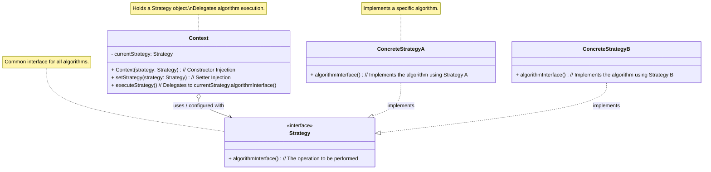

目次

- [デザインパターン詳細解説：Strategy パターン](#デザインパターン詳細解説strategy-パターン)
- [1. Strategy パターンとは？ ～目的と解決したい問題～](#1-strategy-パターンとは-目的と解決したい問題)
  - [1.1 このパターンを一言で言うと？（核心的な目的）](#11-このパターンを一言で言うと核心的な目的)
  - [1.2 なぜ Strategy パターンが必要なのか？（動機と背景）](#12-なぜ-strategy-パターンが必要なのか動機と背景)
    - [1.2.1 条件分岐だらけのコードが招く問題点](#121-条件分岐だらけのコードが招く問題点)
    - [1.2.2 変更に強いコード（OCP）を実現したい](#122-変更に強いコードocpを実現したい)
    - [1.2.3 アルゴリズムを安全かつ柔軟に切り替えたい](#123-アルゴリズムを安全かつ柔軟に切り替えたい)
  - [1.3 このパターンで解決できること（メリットの要約）](#13-このパターンで解決できることメリットの要約)
- [2. パターンの構造と実装 ～どのように実現するか～](#2-パターンの構造と実装-どのように実現するか)
  - [2.1 登場人物とその役割（クラス図と解説）](#21-登場人物とその役割クラス図と解説)
  - [2.2 実装のポイント：委譲による実現](#22-実装のポイント委譲による実現)
  - [2.3 コード例：具体的なシナリオでの実装](#23-コード例具体的なシナリオでの実装)
    - [2.3.1 シナリオ設定（例：データ検証）](#231-シナリオ設定例データ検証)
    - [2.3.2 サンプルコード（Java での例）](#232-サンプルコードjava-での例)
    - [2.3.3 コードのポイント解説](#233-コードのポイント解説)
- [3. Strategy パターンの利点 ～採用するメリット～](#3-strategy-パターンの利点-採用するメリット)
  - [3.1 柔軟性・拡張性の向上（OCP 準拠）](#31-柔軟性拡張性の向上ocp-準拠)
  - [3.2 コードの単純化（条件分岐の排除）](#32-コードの単純化条件分岐の排除)
  - [3.3 保守性・テスト容易性の向上](#33-保守性テスト容易性の向上)
  - [3.4 再利用性の向上と関心の分離](#34-再利用性の向上と関心の分離)
- [4. 注意点とトレードオフ ～適用前に考えるべきこと～](#4-注意点とトレードオフ-適用前に考えるべきこと)
  - [4.1 クラス数の増加と潜在的な複雑性](#41-クラス数の増加と潜在的な複雑性)
  - [4.2 クライアントの責任（戦略の選択）](#42-クライアントの責任戦略の選択)
  - [4.3 Context と Strategy 間のデータ連携方法](#43-context-と-strategy-間のデータ連携方法)
  - [4.4 パフォーマンスに関する考慮（通常は軽微）](#44-パフォーマンスに関する考慮通常は軽微)
- [5. 実装上のヒントと考慮事項 ～より良く使うために～](#5-実装上のヒントと考慮事項-より良く使うために)
  - [5.1 ステートレスな Strategy の推奨](#51-ステートレスな-strategy-の推奨)
  - [5.2 言語機能の活用（例：Java のラムダ式、関数型インターフェース）](#52-言語機能の活用例java-のラムダ式関数型インターフェース)
  - [5.3 よくある誤用・アンチパターン](#53-よくある誤用アンチパターン)
- [6. 他のパターンとの関連 ～比較と組み合わせ～](#6-他のパターンとの関連-比較と組み合わせ)
  - [6.1 似ているパターンとの比較](#61-似ているパターンとの比較)
    - [6.1.1 Strategy vs State](#611-strategy-vs-state)
    - [6.1.2 Strategy vs Template Method](#612-strategy-vs-template-method)
  - [6.2 組み合わせると効果的なパターン](#62-組み合わせると効果的なパターン)
    - [6.2.1 Factory パターンとの連携](#621-factory-パターンとの連携)
    - [6.2.2 Flyweight パターンとの連携（ステートレスな場合）](#622-flyweight-パターンとの連携ステートレスな場合)
- [7. リファクタリング：いつ Strategy パターンを導入するか](#7-リファクタリングいつ-strategy-パターンを導入するか)
  - [7.1 導入のきっかけとなる「コードの不吉な臭い」](#71-導入のきっかけとなるコードの不吉な臭い)
  - [7.2 段階的なリファクタリング手順（概要）](#72-段階的なリファクタリング手順概要)
- [8. まとめ ～ Strategy パターンの本質～](#8-まとめ--strategy-パターンの本質)

# デザインパターン詳細解説：Strategy パターン

# 1. Strategy パターンとは？ ～目的と解決したい問題～

## 1.1 このパターンを一言で言うと？（核心的な目的）

Strategy パターンは、「**アルゴリズム（戦略）をオブジェクトとしてカプセル化し、それらを交換可能にする**」ためのデザインパターンです。これにより、アルゴリズムを利用する側（Context）から、具体的なアルゴリズムの実装を分離できます。

## 1.2 なぜ Strategy パターンが必要なのか？（動機と背景）

ソフトウェア開発を進める中で、同じ目的を達成するための「やり方」が複数存在することはよくあります。たとえば、データのソート方法、支払い方法、経路探索などが考えられます。

### 1.2.1 条件分岐だらけのコードが招く問題点

これらの「やり方」のバリエーションを、単純に `if-else` 文や `switch` 文で処理しようとすると、いくつかの問題が発生します。

- **コードの複雑化:** アルゴリズムの種類が増えるにつれて、条件分岐はどんどん長くなり、ネストも深くなりがちです。コードの可読性が低下し、理解や修正が困難になります。
- **保守性の低下:** 新しいアルゴリズムを追加したり、既存のものを変更したりする際に、条件分岐を持つクラス本体に手を入れる必要があり、修正漏れや予期せぬバグ（デグレード）のリスクが高まります。
- **責務の混在:** アルゴリズムの選択ロジックと、アルゴリズムを利用するクラス本来の責務が混ざり合い、クラスの目的が曖昧になり、凝集度が低下します。

### 1.2.2 変更に強いコード（OCP）を実現したい

良い設計の指標の 1 つに、「**オープン/クローズドの原則 (OCP)**」があります。これは、「ソフトウェアの構成要素は、**拡張に対しては開いて**おり、**修正に対しては閉じている**べきである」という原則です。つまり、新しい機能（この場合は新しいアルゴリズム）を追加する際に、既存のコードを修正することなく、新しいコードを追加するだけで対応できるのが理想的です。`if-else` による実装は、この原則に反しやすくなります。

### 1.2.3 アルゴリズムを安全かつ柔軟に切り替えたい

実行時や設定に応じて、使用するアルゴリズムを動的に切り替えたいという要求もあります。また、各アルゴリズムを独立してテストし、その品質を保証したいというニーズもあります。条件分岐による実装では、これらの要求に柔軟に応えるのが難しくなります。

Strategy パターンは、これらの課題を解決するために考案されました。

## 1.3 このパターンで解決できること（メリットの要約）

Strategy パターンを適用することで、以下のようなメリットが期待できます。

- アルゴリズムの**追加・変更・交換が容易**になる（OCP 準拠）。
- `if-else` 等の**条件分岐を排除**し、コードがシンプルになる。
- アルゴリズムが**独立**し、**再利用性・テスト容易性**が向上する。
- アルゴリズムの利用側と実装側の**関心を分離**できる。

# 2. パターンの構造と実装 ～どのように実現するか～

## 2.1 登場人物とその役割（クラス図と解説）

Strategy パターンは、主に以下の 3 つの役割から構成されます。

- **`Strategy`（戦略インターフェース）:**
  - すべての具象戦略クラスが実装すべき共通のインターフェースを定義します。アルゴリズムを実行するためのメソッド（例: `executeAlgorithm()`, `doOperation()`）を宣言します。
- **`ConcreteStrategy`（具体的な戦略）:**
  - `Strategy` インターフェースを実装し、特定のアルゴリズムを具体的に実装します。アルゴリズムの種類ごとにクラスが作成されます。
- **`Context`（文脈、戦略を利用するクラス）:**
  - 内部に `Strategy` オブジェクトへの参照 (`currentStrategy` など) を保持します。
  - `Strategy` オブジェクトを設定するためのメソッド（コンストラクタやセッター）を持ちます。
  - クライアントからの要求に応じて、保持している `Strategy` オブジェクトのメソッドを呼び出し、アルゴリズムの実行を委譲します。`Context` は具体的な戦略の実装詳細を知りません。



_図: Strategy パターンのクラス図_

## 2.2 実装のポイント：委譲による実現

Strategy パターンの核心は「**委譲 (Delegation)**」にあります。`Context` はアルゴリズムを自身で実装する代わりに、`Strategy` インターフェースを通じて外部のオブジェクトに処理を委ねます。これにより、`Context` は具体的なアルゴリズムから独立し、`Strategy` インターフェースのみを知っていればよくなります。

クライアントは、利用したい `ConcreteStrategy` のインスタンスを生成し、それを `Context` に設定（多くの場合、コンストラクタやセッターメソッド経由で**注入**）します。その後、クライアントは `Context` のメソッドを呼び出すだけで、`Context` が内部で適切な `Strategy` のメソッドを呼び出してくれます。

## 2.3 コード例：具体的なシナリオでの実装

### 2.3.1 シナリオ設定（例：データ検証）

入力された文字列が特定のルールを満たしているかを検証する機能を考えます。検証ルール（必須入力、文字数制限、半角英数字のみなど）は複数あり、適用するルールを切り替えられるようにしたいとします。

### 2.3.2 サンプルコード（Java での例）

```java
import java.util.ArrayList;
import java.util.List;

// 1. Strategy インターフェース: 検証ルール
interface ValidationStrategy {
    boolean isValid(String input);
    String getErrorMessage();
}

// 2. ConcreteStrategy: 具体的な検証ルール
// 必須入力チェック
class RequiredValidationStrategy implements ValidationStrategy {
    @Override
    public boolean isValid(String input) {
        return input != null && !input.trim().isEmpty();
    }
    @Override
    public String getErrorMessage() {
        return "入力は必須です。";
    }
}
// 文字数制限チェック
class LengthValidationStrategy implements ValidationStrategy {
    private int minLength;
    private int maxLength;
    public LengthValidationStrategy(int min, int max) { this.minLength = min; this.maxLength = max; }
    @Override
    public boolean isValid(String input) {
        if (input == null) return false;
        int length = input.length();
        return length >= minLength && length <= maxLength;
    }
     @Override
    public String getErrorMessage() {
        return minLength + "文字以上、" + maxLength + "文字以下で入力してください。";
    }
}
// 半角英数字チェック
class AlphaNumericValidationStrategy implements ValidationStrategy {
     @Override
    public boolean isValid(String input) {
        if (input == null) return false;
        return input.matches("^[a-zA-Z0-9]*$"); // 正規表現でチェック
    }
     @Override
    public String getErrorMessage() {
        return "半角英数字で入力してください。";
    }
}

// 3. Context: 検証を実行するクラス
class Validator {
    private ValidationStrategy strategy;

    // コンストラクタで戦略を設定
    public Validator(ValidationStrategy strategy) {
        this.strategy = strategy;
    }

    // 検証を実行し、エラーメッセージを返す (無効な場合)
    public List<String> validate(String input) {
        List<String> errors = new ArrayList<>();
        if (!strategy.isValid(input)) {
            errors.add(strategy.getErrorMessage());
        }
        // 複数の Strategy をリストで持ち、順に適用するよう拡張も可能
        return errors;
    }

    // 戦略を切り替えるセッター (任意)
    public void setStrategy(ValidationStrategy strategy) {
        this.strategy = strategy;
    }
}

// --- Client (利用側) ---
public class ValidationClient {
    public static void main(String[] args) {
        // 必須チェック用の Validator
        Validator requiredValidator = new Validator(new RequiredValidationStrategy());
        List<String> errors1 = requiredValidator.validate(""); // 空文字でテスト
        System.out.println("必須チェック: " + (errors1.isEmpty() ? "OK" : errors1));

        // 文字数チェック用の Validator (5〜10文字)
        Validator lengthValidator = new Validator(new LengthValidationStrategy(5, 10));
        List<String> errors2 = lengthValidator.validate("abc"); // 3文字でテスト
        System.out.println("文字数チェック: " + (errors2.isEmpty() ? "OK" : errors2));
        List<String> errors3 = lengthValidator.validate("abcdefgh"); // 8文字でテスト
        System.out.println("文字数チェック: " + (errors3.isEmpty() ? "OK" : errors3));

        // 半角英数字チェック用の Validator
        Validator alphaNumValidator = new Validator(new AlphaNumericValidationStrategy());
        List<String> errors4 = alphaNumValidator.validate("abc123XYZ"); // OKケース
        System.out.println("英数字チェック: " + (errors4.isEmpty() ? "OK" : errors4));
        List<String> errors5 = alphaNumValidator.validate("abc-123"); // NGケース
        System.out.println("英数字チェック: " + (errors5.isEmpty() ? "OK" : errors5));

        // Validator の戦略を途中で切り替えることも可能
        alphaNumValidator.setStrategy(new RequiredValidationStrategy());
        List<String> errors6 = alphaNumValidator.validate("");
         System.out.println("切り替え後チェック: " + (errors6.isEmpty() ? "OK" : errors6));
    }
}
```

### 2.3.3 コードのポイント解説

- `ValidationStrategy` がアルゴリズムの共通インターフェースを定義しています。
- `RequiredValidationStrategy`, `LengthValidationStrategy`, `AlphaNumericValidationStrategy` がそれぞれ具体的な検証ロジックを実装しています。
- `Validator` クラス (Context) は、コンストラクタや `setStrategy` メソッドを通じて、使用する `ValidationStrategy` を受け取ります。
- `Validator` の `validate` メソッドは、実際の検証処理を保持している `strategy` オブジェクトの `isValid` メソッドに委譲しています。
- クライアントは、利用したい検証ルールに対応する `ConcreteStrategy` を生成し、それを `Validator` に設定して利用します。

# 3. Strategy パターンの利点 ～採用するメリット～

## 3.1 柔軟性・拡張性の向上（OCP 準拠）

新しいアルゴリズム（戦略）を追加する必要が生じた場合、新しい `ConcreteStrategy` クラスを作成し、インターフェースを実装するだけで対応できます。既存の `Context` クラスや他の `Strategy` クラスを修正する必要はありません。これは、オープン/クローズドの原則（OCP）に適合しており、ソフトウェアの拡張性を高めます。また、実行時に戦略を切り替えることも容易です。

## 3.2 コードの単純化（条件分岐の排除）

アルゴリズムの選択を `if-else` や `switch` で行っていた場合、Strategy パターンを適用することでこれらの条件分岐を `Context` から排除できます。`Context` のコードは、どの戦略が選択されているかを意識する必要がなくなり、よりシンプルで読みやすくなります。

## 3.3 保守性・テスト容易性の向上

各アルゴリズムが独立したクラス（`ConcreteStrategy`）にカプセル化されるため、それぞれのアルゴリズムに対する変更の影響範囲が限定されます。修正が必要な場合も、該当する `Strategy` クラスのみを修正すれば済みます。
また、各 `Strategy` クラスは独立しているため、個別に単体テスト（ユニットテスト）を行うことが容易になります。`Context` のテストでは、`Strategy` 部分をテストダブル（モックやスタブ）に差し替えることも可能です。

## 3.4 再利用性の向上と関心の分離

独立した `Strategy` クラスは、特定のアルゴリズムをカプセル化しているため、他の異なる `Context` やアプリケーションでも再利用しやすくなります。また、アルゴリズムの実装という関心事と、それを利用する `Context` の本来の責務とを明確に分離できます。

# 4. 注意点とトレードオフ ～適用前に考えるべきこと～

## 4.1 クラス数の増加と潜在的な複雑性

Strategy パターンを適用すると、アルゴリズムごとに `ConcreteStrategy` クラスを作成するため、システム全体のクラス数は増加します。アルゴリズムが非常にシンプルで、数も少ない場合には、パターン導入によるクラス数の増加が、得られるメリットに対して過剰（オーバーエンジニアリング）になる可能性も考慮する必要があります。

## 4.2 クライアントの責任（戦略の選択）

基本的な Strategy パターンの実装では、`Context` を利用するクライアントが、利用可能な戦略の種類を知っており、適切な `ConcreteStrategy` を選択して `Context` に設定（注入）する責任を持ちます。クライアントがこの選択ロジックを持つことが不適切であったり、複雑になったりする場合は、別途 Factory パターンなどを導入して、戦略オブジェクトの生成と選択のプロセスを隠蔽することを検討する必要があります。

## 4.3 Context と Strategy 間のデータ連携方法

`ConcreteStrategy` がアルゴリズムを実行するためには、`Context` が持つデータや、クライアントから渡されたデータが必要になる場合があります。このデータを `Strategy` にどのように渡すかは設計上のポイントです。
考えられる方法としては、

1.  `Strategy` のメソッド（例: `algorithmInterface`）の引数として必要なデータをすべて渡す。
2.  `Context` オブジェクト自身を `Strategy` のメソッドに引数として渡し、`Strategy` が `Context` から必要なデータを取得する。
    後者の方法は `Strategy` のメソッドシグネチャをシンプルに保てますが、`Strategy` が `Context` の内部により依存することになり、両者の結合度を高める可能性があります。

## 4.4 パフォーマンスに関する考慮（通常は軽微）

`Context` から `Strategy` オブジェクトのメソッドを呼び出すという間接的なステップが増えるため、すべてのロジックを 1 つのメソッド内に直接記述する場合と比較して、ごくわずかな実行時のオーバーヘッドが発生します。しかし、ほとんどのアプリケーションにおいて、このオーバーヘッドが性能上のボトルネックになることは稀です。設計上のメリット（柔軟性、保守性など）の方がはるかに大きい場合がほとんどです。

# 5. 実装上のヒントと考慮事項 ～より良く使うために～

## 5.1 ステートレスな Strategy の推奨

可能であれば、`ConcreteStrategy` オブジェクトは**状態を持たない（ステートレスな）** 設計にすることが推奨されます。つまり、`Strategy` オブジェクト自体が実行中に変化するデータ（フィールド変数）を持たず、アルゴリズムの実行に必要な情報はすべてメソッドの引数または `Context` から受け取るようにします。
`Strategy` がステートレスであれば、同じ `ConcreteStrategy` のインスタンスを複数の `Context` で安全に共有できます。これにより、オブジェクト生成のオーバーヘッドを削減でき、後述する Flyweight パターンとの組み合わせも可能になります。

## 5.2 言語機能の活用（例：Java のラムダ式、関数型インターフェース）

`Strategy` インターフェースがメソッドを 1 つしか持たない場合（**関数型インターフェース**）、Java 8 以降のラムダ式やメソッド参照を使うことで、`ConcreteStrategy` クラスを明示的に作成する代わりに、より簡潔に戦略を表現できることがあります。

```java
// 例: 関数型インターフェースとして定義
@FunctionalInterface
interface DiscountStrategyFunc {
    double applyDiscount(double amount);
}

public class FunctionalStrategyClient {
    public static void main(String[] args) {
        // ラムダ式で戦略を直接定義
        PriceCalculator calc = new PriceCalculator(amount -> amount * 0.8); // 20% OFF
        calc.calculate(1000);

        // 別の戦略（100円引き）をラムダ式で設定
        calc.setDiscountStrategy(amount -> Math.max(0, amount - 100));
        calc.calculate(1000);

        // PriceCalculator が DiscountStrategyFunc を受け取るように修正する必要がある
    }
    // (PriceCalculator クラスの discountStrategy フィールドの型と
    //  コンストラクタ/セッターの引数型を DiscountStrategyFunc に変更する想定)
}
```

これにより、とくに単純な戦略の場合には、コード量を削減し、可読性を高めることができます。ただし、戦略が複雑なロジックや状態を持つ場合には、個別のクラスとして定義する方が適切です。

## 5.3 よくある誤用・アンチパターン

- **Strategy と Context の役割混同:** `Context` が Strategy の選択ロジックを内部に持ちすぎて、結局 `if-else` が残ってしまう。Strategy の選択はクライアントまたは Factory が行うのが基本です。
- **ステートフルな Strategy の不用意な共有:** 状態を持つ `Strategy` インスタンスを複数の `Context` で共有してしまい、予期せぬ副作用が発生する。
- **単純すぎるアルゴリズムへの適用:** アルゴリズムが非常に単純で変更の可能性も低い場合にまで適用し、不必要にクラスを増やしてしまう（過剰設計）。

# 6. 他のパターンとの関連 ～比較と組み合わせ～

## 6.1 似ているパターンとの比較

### 6.1.1 Strategy vs State

- 構造は似ていますが、意図が異なります。Strategy はクライアントが**アルゴリズム（方法）**を選択・設定し、Context はそれにしたがって動作します。State はオブジェクトの**内部状態**に応じて**自動的に**振る舞いが変化し、状態遷移を管理します。

### 6.1.2 Strategy vs Template Method

- どちらもアルゴリズムのバリエーションを扱います。Strategy は**委譲**を使いアルゴリズム**全体**を交換可能にします。Template Method は**継承**を使いアルゴリズムの**骨組み**を固定し、**一部のステップ**をサブクラスで実装させます。一般に Strategy の方が柔軟性が高いです。

## 6.2 組み合わせると効果的なパターン

### 6.2.1 Factory パターンとの連携

- クライアントが `ConcreteStrategy` を直接生成する代わりに、Factory パターン（Factory Method や Abstract Factory）を使って Strategy オブジェクトを生成・取得するようにすると、クライアントは具体的な Strategy クラスを知る必要がなくなり、より疎結合になります。

### 6.2.2 Flyweight パターンとの連携（ステートレスな場合）

- `Strategy` オブジェクトがステートレス（状態を持たない）であれば、Flyweight パターンを適用してインスタンスを共有し、メモリ使用量を削減できます。

# 7. リファクタリング：いつ Strategy パターンを導入するか

既存のコードを改善するリファクタリングの過程で、Strategy パターンを導入することが有効な場合があります。

## 7.1 導入のきっかけとなる「コードの不吉な臭い」

- **巨大な条件分岐 (Complicated Conditional):** メソッド内にアルゴリズムを選択するための長い `if-else` や `switch` が存在する場合、Strategy パターンで置き換える有力な候補です。
- **型コードによる分岐 (Replace Type Code with State/Strategy):** オブジェクトの種類やモードを示すフラグ変数（型コード）の値によって処理を分岐している場合、その分岐ロジックを Strategy（または State）パターンに置き換えることで、よりオブジェクト指向的な設計に改善できます。

## 7.2 段階的なリファクタリング手順（概要）

1.  **Strategy インターフェースの定義:** 交換したいアルゴリズムの共通インターフェースを定義します。
2.  **ConcreteStrategy クラスの作成:** 条件分岐の各ブランチに対応するロジックを、それぞれ `ConcreteStrategy` クラスとして抽出・実装します。
3.  **Context の修正:**
    - `Strategy` インターフェース型のフィールドを追加します。
    - `Strategy` を設定するためのコンストラクタまたはセッターを追加します。
    - 元の条件分岐を削除し、保持している `Strategy` オブジェクトへの処理の委譲に置き換えます。
4.  **クライアントの修正:** クライアントコードで適切な `ConcreteStrategy` を生成し、`Context` に設定するように修正します（または Factory を導入します）。
5.  **テスト:** 各ステップでテストを実行し、振る舞いが変わっていないことを確認します。

# 8. まとめ ～ Strategy パターンの本質～

**Strategy パターン**は、ソフトウェアの**振る舞い（アルゴリズムや戦略）を、それを利用するクラスから分離し、独立したオブジェクトとしてカプセル化する**ための強力なデザインパターンです。

このパターンを適用することで、アルゴリズムの**交換や追加が容易**になり、**変更に強く（OCP 準拠）**、**コードがシンプル**になります。また、アルゴリズムが**独立**するため、**再利用性やテスト容易性も向上**します。

その本質は、「**振る舞いをオブジェクトとして扱い、委譲によって利用する**」ことにあります。これにより、オブジェクト指向の持つ「柔軟性」というメリットを最大限に引き出すことができます。

一方で、クラス数が増える可能性やクライアントの責任、データ連携などのトレードオフも存在するため、状況に応じた適切な判断が求められます。

Strategy パターンは、多くの場面で応用が利く、基本的かつ重要なパターンの 1 つです。このパターンの考え方を身につけ、実践することで、皆さんの設計スキルは確実に向上するでしょう。
