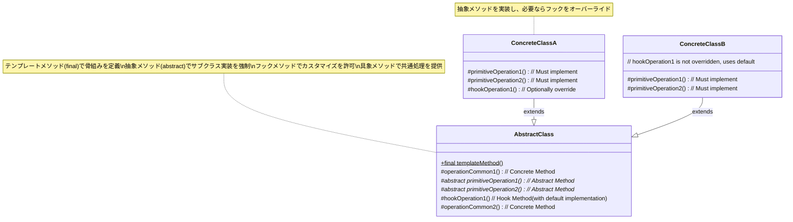

**目次**

- [デザインパターン詳細解説：Template Method パターン](#デザインパターン詳細解説template-method-パターン)
- [1. Template Method パターンとは？ ～目的と解決したい問題～](#1-template-method-パターンとは-目的と解決したい問題)
  - [1.1 このパターンを一言で言うと？（核心的な目的）](#11-このパターンを一言で言うと核心的な目的)
  - [1.2 なぜ Template Method パターンが必要なのか？（動機と背景）](#12-なぜ-template-method-パターンが必要なのか動機と背景)
    - [1.2.1 コードの重複という問題：似たような手順の繰り返し](#121-コードの重複という問題似たような手順の繰り返し)
    - [1.2.2 処理の「骨組み」は変えずに、一部だけカスタマイズしたい](#122-処理の骨組みは変えずに一部だけカスタマイズしたい)
    - [1.2.3 フレームワークのような共通処理を提供したい](#123-フレームワークのような共通処理を提供したい)
  - [1.3 このパターンで解決できること（メリットの要約）](#13-このパターンで解決できることメリットの要約)
- [2. パターンの構造と実装 ～どのように実現するか～](#2-パターンの構造と実装-どのように実現するか)
  - [2.1 登場人物とその役割（クラス図と解説）](#21-登場人物とその役割クラス図と解説)
    - [2.1.1 AbstractClass (抽象クラス)](#211-abstractclass-抽象クラス)
    - [2.1.2 ConcreteClass (具象クラス)](#212-concreteclass-具象クラス)
    - [2.1.3 クラス図](#213-クラス図)
  - [2.2 実装のポイント：継承と「ハリウッドの原則」](#22-実装のポイント継承とハリウッドの原則)
  - [2.3 コード例：具体的なシナリオでの実装](#23-コード例具体的なシナリオでの実装)
    - [2.3.1 シナリオ設定（例：データ処理）](#231-シナリオ設定例データ処理)
    - [2.3.2 サンプルコード（Java での例）](#232-サンプルコードjava-での例)
    - [2.3.3 コードのポイント解説](#233-コードのポイント解説)
- [3. Template Method パターンの利点 ～採用するメリット～](#3-template-method-パターンの利点-採用するメリット)
  - [3.1 コードの重複削減と共通化](#31-コードの重複削減と共通化)
  - [3.2 アルゴリズム骨組みの強制と一貫性維持](#32-アルゴリズム骨組みの強制と一貫性維持)
  - [3.3 拡張性の確保（OCP への貢献）](#33-拡張性の確保ocp-への貢献)
  - [3.4 フレームワーク実装の基盤](#34-フレームワーク実装の基盤)
- [4. 注意点とトレードオフ ～適用前に考えるべきこと～](#4-注意点とトレードオフ-適用前に考えるべきこと)
  - [4.1 継承による密結合のリスク](#41-継承による密結合のリスク)
  - [4.2 柔軟性の限界（骨組み自体の変更）](#42-柔軟性の限界骨組み自体の変更)
  - [4.3 親クラスの複雑化の可能性](#43-親クラスの複雑化の可能性)
  - [4.4 LSP 違反のリスク（フックメソッドの誤用など）](#44-lsp-違反のリスクフックメソッドの誤用など)
- [5. 実装上のヒントと考慮事項 ～より良く使うために～](#5-実装上のヒントと考慮事項-より良く使うために)
  - [5.1 抽象メソッドとフックメソッドの使い分け](#51-抽象メソッドとフックメソッドの使い分け)
  - [5.2 `final` キーワードの活用（テンプレートメソッドの保護）](#52-final-キーワードの活用テンプレートメソッドの保護)
  - [5.3 親クラスのコンストラクタの利用](#53-親クラスのコンストラクタの利用)
- [6. 他のパターンとの関連 ～比較と組み合わせ～](#6-他のパターンとの関連-比較と組み合わせ)
  - [6.1 似ているパターンとの比較](#61-似ているパターンとの比較)
    - [6.1.1 Template Method vs Strategy：継承か委譲か、骨組みか全体か](#611-template-method-vs-strategy継承か委譲か骨組みか全体か)
    - [6.1.2 Template Method vs Factory Method：目的の違い](#612-template-method-vs-factory-method目的の違い)
  - [6.2 組み合わせると効果的なパターン](#62-組み合わせると効果的なパターン)
    - [6.2.1 Factory Method との連携（ステップ内でのオブジェクト生成）](#621-factory-method-との連携ステップ内でのオブジェクト生成)
- [7. リファクタリング：いつ Template Method パターンを導入するか](#7-リファクタリングいつ-template-method-パターンを導入するか)
  - [7.1 導入のきっかけとなる「コードの不吉な臭い」](#71-導入のきっかけとなるコードの不吉な臭い)
    - [7.1.1 複数のクラスにおける重複コード (Duplicated Code)](#711-複数のクラスにおける重複コード-duplicated-code)
    - [7.1.2 サブクラス間での類似した処理手順](#712-サブクラス間での類似した処理手順)
  - [7.2 段階的なリファクタリング手順（概要）](#72-段階的なリファクタリング手順概要)
- [8. まとめ ～ Template Method パターンの本質～](#8-まとめ--template-method-パターンの本質)

# デザインパターン詳細解説：Template Method パターン

# 1. Template Method パターンとは？ ～目的と解決したい問題～

## 1.1 このパターンを一言で言うと？（核心的な目的）

Template Method パターンは、「**ある処理（アルゴリズム）の骨組み（テンプレート）をスーパークラスで定義し、その骨組みの中の具体的なステップの実装はサブクラスに任せる（遅延させる）**」ためのデザインパターンです。継承を利用してコードの再利用と部分的なカスタマイズを両立させます。

## 1.2 なぜ Template Method パターンが必要なのか？（動機と背景）

ソフトウェア開発において、似たような手順で処理が進むけれども、細部だけが異なる、という状況は頻繁に発生します。このような状況で、各バリエーションごとにすべての手順を記述していると、いくつかの問題が生じます。

### 1.2.1 コードの重複という問題：似たような手順の繰り返し

たとえば、テキストファイル処理と CSV ファイル処理を考えてみましょう。どちらも「ファイルを開く → データを読み込む → データを処理する → ファイルを閉じる」という大まかな流れは同じかもしれません。しかし、この流れ全体をそれぞれのクラスに別々に実装してしまうと、「ファイルを開く」「ファイルを閉じる」といった共通の手順が**コードとして重複**してしまいます。

コードの重複は、

- **修正の手間と漏れ:** 共通部分に修正が必要になった場合、すべての重複箇所を探し出して修正する必要があり、漏れが発生するとバグの原因になります。
- **可読性の低下:** 全体の処理の流れが各クラスに分散し、どこが共通でどこが異なるのかを把握しにくくなります。
- **コード量の増加:** 単純にコード全体が長くなります。

といった問題を引き起こします。DRY (Don't Repeat Yourself) 原則にも反する状態です。

### 1.2.2 処理の「骨組み」は変えずに、一部だけカスタマイズしたい

複数の処理バリエーションがある場合でも、「基本的な手順」や「処理の順序」といった**アルゴリズムの骨組み（構造）**は固定したい、あるいは共通化したい、という要求があります。たとえば、「特定の認証プロセスは必ずこの順序で行い、途中のステップを省略させたくない」といったケースです。

しかし、その骨組みの中の**特定のステップ**（たとえば、具体的な認証方法や、データの検証方法）だけは、サブクラスごと、あるいは状況に応じて変更・カスタマイズ可能にしたい、というニーズも同時に存在します。

### 1.2.3 フレームワークのような共通処理を提供したい

ライブラリやフレームワークを開発する際には、利用者が共通して行うであろう処理の流れ（たとえば、Web リクエストの受付からレスポンス返却までのライフサイクル、テスト実行前のセットアップと実行後の後片付けなど）を提供しつつ、利用者が**独自の処理を組み込める「拡張点」**を用意する必要があります。

Template Method パターンは、このようなフレームワーク的な構造、つまり「大枠は決まっているが、詳細は利用者が決める」という仕組みをエレガントに実現する手段を提供します。

## 1.3 このパターンで解決できること（メリットの要約）

Template Method パターンを適用することで、以下のようなメリットが期待できます。

- **コードの重複を削減**し、共通ロジックを一箇所（スーパークラス）に集約できる。
- アルゴリズムの**骨組みを固定化**し、処理手順の一貫性を保つことができる。
- サブクラスで**部分的な実装の変更・拡張**を容易に行える（**オープン/クローズドの原則**に貢献）。
- フレームワークのように、**共通処理とカスタマイズ可能な部分を分離**できる。

---

# 2. パターンの構造と実装 ～どのように実現するか～

Template Method パターンは、継承というオブジェクト指向の基本的な仕組みを利用して、アルゴリズムの骨組みと具体的なステップの実装を分離します。この章では、その具体的な構造と実装方法について見ていきましょう。

## 2.1 登場人物とその役割（クラス図と解説）

Template Method パターンは、主に以下の 2 種類の登場人物（クラス）から構成されます。

### 2.1.1 AbstractClass (抽象クラス)

- **役割:** アルゴリズムの**骨組み（テンプレート）**を定義する、**親クラス**の役割を果たします。多くの場合、このクラス自体はインスタンス化されず、サブクラスで利用されることを前提とした**抽象クラス (abstract class)** として定義されます。
- **持つもの:**
  - **テンプレートメソッド (Template Method):** アルゴリズムの骨組み、つまり処理のステップとその順序を定義したメソッドです。このメソッドは、後述する抽象メソッドやフックメソッドを適切な順序で呼び出します。**サブクラスでこの骨組み自体を変更できないように、通常は `final` キーワード（Java, C# の場合）などでオーバーライド（上書き）を禁止**します。
  - **抽象メソッド (Abstract Method / Primitive Operation):** テンプレートメソッドから呼び出される処理ステップのうち、**具体的な実装がサブクラスごとに異なる**部分です。`AbstractClass` ではメソッドのシグネチャ（名前、引数、戻り値の型）だけを宣言し（`abstract` キーワードなど）、**実際の処理内容は定義しません**。サブクラスは、この抽象メソッドを必ず実装（オーバーライド）する必要があります。
  - **フックメソッド (Hook Method):** テンプレートメソッドから呼び出される処理ステップのうち、**サブクラスで任意にオーバーライドして振る舞いを変更・追加できる**メソッドです。`AbstractClass` では、**デフォルトの振る舞い**（何もしない、あるいは基本的な処理）を実装しておくことが多いです。サブクラスは、必要に応じてこのフックメソッドをオーバーライドします。フックメソッドは必須ではありません。
  - **具象メソッド (Concrete Method):** テンプレートメソッドから呼び出される処理ステップのうち、**すべてのサブクラスで共通して利用できる**具体的な処理を実装したメソッドです。サブクラスは通常、このメソッドをそのまま利用します。

### 2.1.2 ConcreteClass (具象クラス)

- **役割:** `AbstractClass` を**継承**し、アルゴリズムの**具体的なステップを実装**する**子クラス**の役割を果たします。アルゴリズムのバリエーションごとに、この `ConcreteClass` が作成されます。
- **実装すること:**
  - 親クラス (`AbstractClass`) で宣言された**抽象メソッドを、自身の具体的な処理内容でオーバーライド**して実装します。
  - 必要に応じて、親クラスの**フックメソッドをオーバーライド**し、アルゴリズムの振る舞いをカスタマイズします。

### 2.1.3 クラス図



_図: Template Method パターンのクラス図（メソッドの種類を明記）_

## 2.2 実装のポイント：継承と「ハリウッドの原則」

- **継承の利用:** このパターンは、クラスの**継承**を前提としています。`ConcreteClass` は `AbstractClass` のサブクラスとして定義されます。
- **アクセス修飾子:** テンプレートメソッドから呼び出される抽象メソッド、フックメソッド、具象メソッドは、サブクラスからアクセス（オーバーライドまたは呼び出し）できる必要があるため、通常 `protected` として宣言されます。テンプレートメソッド自体は、外部から利用されるため `public` とし、サブクラスに変更させないために `final` とするのが一般的です。
- **ハリウッドの原則:** Template Method パターンは、「**Don't call us, we'll call you.（こちらから電話しないでください、必要ならこちらからかけます）**」という「ハリウッドの原則」の良い例です。サブクラス（`ConcreteClass`）がスーパークラス（`AbstractClass`）のメソッドを能動的に呼び出すのではなく、スーパークラスのテンプレートメソッドが、アルゴリズムの流れの中で必要なタイミングでサブクラスのメソッド（オーバーライドされた抽象メソッドやフックメソッド）を呼び出します。制御の流れが親クラス側にあるのが特徴です。

## 2.3 コード例：具体的なシナリオでの実装

### 2.3.1 シナリオ設定（例：データ処理）

ファイルからデータを読み込み、加工して、保存するという一連のデータ処理を考えます。処理の基本的な流れ（接続 → 読み込み → 加工 → 保存 → 切断）は共通ですが、読み込み方法と加工方法がファイル形式（例: テキスト、CSV）によって異なるとします。また、加工後の保存はデフォルトで行うが、場合によっては保存しない選択肢も設けたい（フック）とします。

### 2.3.2 サンプルコード（Java での例）

```java
import java.util.Arrays;
import java.util.List;

// 1. AbstractClass: データ処理の骨組み
abstract class DataProcessor {

    // ★ Template Method: 処理の骨組みを定義 (final で変更禁止)
    public final void process(String source) {
        connect(source); // 共通ステップ
        Object rawData = readData(); // ★サブクラス実装 (抽象メソッド)
        Object processedData = parseData(rawData); // ★サブクラス実装 (抽象メソッド)
        if (shouldSaveHook()) { // ★サブクラス任意実装 (フックメソッド)
            saveData(processedData); // 共通ステップ
        }
        disconnect(); // 共通ステップ
    }

    // --- 共通ステップ (具象メソッド) ---
    protected void connect(String source) {
        System.out.println("[" + getClass().getSimpleName() + "] " + source + " に接続しました。");
    }
    protected void saveData(Object data) {
        System.out.println("[" + getClass().getSimpleName() + "] データを保存しました: " + data);
    }
    protected void disconnect() {
        System.out.println("[" + getClass().getSimpleName() + "] 接続を切断しました。");
    }

    // --- サブクラスに実装を任せるステップ (抽象メソッド) ---
    protected abstract Object readData();
    protected abstract Object parseData(Object rawData);

    // --- サブクラスが任意で変更できるステップ (フックメソッド) ---
    // デフォルトでは true (保存する) を返す
    protected boolean shouldSaveHook() {
        return true;
    }
}

// 2. ConcreteClass: テキストファイル用
class TextProcessor extends DataProcessor {
    @Override
    protected Object readData() {
        System.out.println("  テキストデータを読み込みます。");
        return "line1\nline2\nline3"; // ダミーデータ
    }
    @Override
    protected Object parseData(Object rawData) {
        System.out.println("  テキストデータを解析し、行数カウントします。");
        return ((String) rawData).split("\n").length + " 行";
    }
    // shouldSaveHook はオーバーライドしないので、デフォルト (true) が使われる
}

// 3. ConcreteClass: CSVファイル用 (保存しない例)
class CsvProcessor extends DataProcessor {
    @Override
    protected Object readData() {
        System.out.println("  CSVデータを読み込みます。");
        return "id,name\n1,Alice\n2,Bob"; // ダミーデータ
    }
    @Override
    protected Object parseData(Object rawData) {
        System.out.println("  CSVデータを解析し、ヘッダーを除いたリストにします。");
        List<String> lines = new java.util.ArrayList<>(Arrays.asList(((String) rawData).split("\n")));
        lines.remove(0); // ヘッダー削除
        return lines;
    }
    // フックメソッドをオーバーライドして保存しないように変更
    @Override
    protected boolean shouldSaveHook() {
        System.out.println("  フック: CSVデータは保存しません。");
        return false;
    }
}

// --- Client (利用側) ---
public class TemplateMethodClient {
    public static void main(String[] args) {
        System.out.println("--- テキスト処理 ---");
        DataProcessor textProc = new TextProcessor();
        textProc.process("myDocument.txt"); // テンプレートメソッドを呼び出す

        System.out.println("\n--- CSV処理 ---");
        DataProcessor csvProc = new CsvProcessor();
        csvProc.process("users.csv"); // テンプレートメソッドを呼び出す
    }
}
```

### 2.3.3 コードのポイント解説

- `DataProcessor` が `AbstractClass` に相当し、`process` メソッドが **テンプレートメソッド** です。処理の流れ（connect → read → parse → save (if hook) → disconnect）がここで定義されています。`final` で宣言されているため、サブクラスはこの流れを変更できません。
- `readData` と `parseData` は、具体的な実装がファイル形式によって異なるため、**抽象メソッド**として宣言されています。`TextProcessor` と `CsvProcessor` (ConcreteClass) は、これらのメソッドを自身の処理内容で**オーバーライド**しています。
- `connect`, `saveData`, `disconnect` は、ファイル形式にかかわらず共通の処理であるため、`DataProcessor` 内で**具象メソッド**として実装されています。
- `shouldSaveHook` は**フックメソッド**です。`DataProcessor` でデフォルトの振る舞い（`true` を返す）が定義されていますが、`CsvProcessor` ではこれをオーバーライドして `false` を返し、保存処理をスキップさせています。`TextProcessor` はオーバーライドしていないため、デフォルトの振る舞いが適用されます。
- クライアント (`TemplateMethodClient`) は、`TextProcessor` や `CsvProcessor` のインスタンスを生成し、**テンプレートメソッド (`process`) を呼び出すだけ**です。内部でどのメソッドがどの順序で呼ばれるかは、`DataProcessor` のテンプレートメソッドが管理しています。

このように、Template Method パターンを使うことで、処理の共通部分と可変部分を効果的に分離し、再利用性と拡張性を両立させることができます。

---

# 3. Template Method パターンの利点 ～採用するメリット～

Template Method パターンを適用することで、ソフトウェアの設計と実装において多くのメリットが得られます。主な利点を以下にまとめます。

## 3.1 コードの重複削減と共通化

このパターンがもたらすもっとも直接的なメリットの 1 つは、**コードの重複を効果的に排除できる**ことです。複数のクラスで共通して行われる一連の処理手順（アルゴリズムの骨組み）がある場合、その共通部分をスーパークラスのテンプレートメソッドと具象メソッドに集約できます。

サブクラスは、共通部分を再実装する必要がなく、異なる部分（抽象メソッドやフックメソッドで定義される箇所）の実装に集中できます。これにより、コードベース全体のコード量が削減され、ロジックが一箇所にまとまるため、**可読性**が向上します。

## 3.2 アルゴリズム骨組みの強制と一貫性維持

スーパークラスのテンプレートメソッドで処理全体の流れ（各ステップの呼び出し順序）を定義し、通常は `final` で宣言してオーバーライドを禁止します。これにより、**アルゴリズムの基本的な構造を固定化**し、サブクラスが勝手に処理手順を変更してしまうことを防ぐことができます。

これは、特定の処理が必ず定められた順序で実行されることを保証したい場合（たとえば、リソースの確保と解放、トランザクションの開始と終了など）に非常に有効です。システム全体として**処理の一貫性**を保つのに役立ちます。

## 3.3 拡張性の確保（OCP への貢献）

Template Method パターンは、**オープン/クローズドの原則 (OCP)** を実現する手段の 1 つとなります。アルゴリズムの骨組み（テンプレートメソッド）は**修正に対して閉じて**いますが、新しいバリエーション（新しい `ConcreteClass`）を追加することによって、システムの振る舞いを**拡張することに対しては開いて**います。

新しい種類の処理を追加したい場合、開発者は既存の `AbstractClass` を継承し、必要な抽象メソッドやフックメソッドを実装するだけで済みます。既存のスーパークラスや、他のサブクラスのコードを修正する必要は（基本的には）ありません。これにより、機能拡張が容易になり、変更に伴うリスクも低減されます。

## 3.4 フレームワーク実装の基盤

Template Method パターンは、ライブラリや**フレームワーク**を構築する際の基本的な設計パターンとして広く利用されています。フレームワークは、アプリケーションの全体的な制御フローや共通の処理基盤を提供しつつ、アプリケーション固有のロジックを開発者が実装するための「穴」や「フック」を用意する必要があります。

Template Method パターンを用いることで、フレームワーク側で主要な処理の流れ（テンプレートメソッド）を定義し、アプリケーション開発者がカスタマイズすべき箇所を抽象メソッドやフックメソッドとして提供する、という構造を自然に実現できます。開発者は、フレームワークの内部実装の詳細を知らなくても、定められたメソッドを実装するだけで、フレームワークの恩恵を受けながら独自の機能を組み込むことができます。

これらの利点により、Template Method パターンは、コードの再利用性を高め、一貫性を保ち、将来の拡張にも柔軟に対応できる、堅牢で保守しやすいソフトウェア設計を支援します。

---

# 4. 注意点とトレードオフ ～適用前に考えるべきこと～

Template Method パターンは多くの利点を提供しますが、一方で適用する際には注意すべき点や、考慮すべきトレードオフも存在します。パターンを導入する前に、これらの点を理解しておくことが重要です。

## 4.1 継承による密結合のリスク

Template Method パターンは、クラスの**継承**を基本的なメカニズムとして利用します。継承はコード再利用の強力な手段ですが、同時に**スーパークラス (AbstractClass) とサブクラス (ConcreteClass) の間に強い結合**を生み出します。

- **親クラスへの依存:** サブクラスは親クラスの実装（とくにテンプレートメソッドの構造や、具象メソッド、フックメソッドのデフォルト実装）に依存します。
- **親クラス変更の影響:** もし親クラスの実装（たとえば、テンプレートメソッド内のステップの順序や、フックメソッドのデフォルト挙動）が変更されると、それが意図せずにすべてのサブクラスの振る舞いに影響を及ぼす可能性があります。
- **「脆弱な基底クラス問題」:** 親クラスの設計が不適切だったり、将来的に大きく変更されたりすると、その影響がサブクラス全体に波及し、修正が困難になる可能性があります。

このため、親クラスの設計は慎重に行い、安定させることが重要です。また、継承以外の方法（たとえば Strategy パターンによる委譲）で同じ目的を達成できないかも検討する価値があります。

## 4.2 柔軟性の限界（骨組み自体の変更）

Template Method パターンは、アルゴリズムの**骨組み（ステップの順序）は固定**し、**部分的なステップの実装**をサブクラスで変える、という状況に適しています。

しかし、もし**アルゴリズムの骨組み自体を動的に変更したい**、あるいは**アルゴリズム全体をまったく異なるものに入れ替えたい**という要求がある場合、Template Method パターンだけでは対応が難しくなります。テンプレートメソッドは通常 `final` であり、サブクラスで骨組み自体をオーバーライドすることは想定されていないためです。

このような、より高い柔軟性が求められる場合には、アルゴリズム全体をオブジェクトとして扱う **Strategy パターン**の方が適していることが多いです。

## 4.3 親クラスの複雑化の可能性

テンプレートメソッドが多くのステップを含んでいたり、多数の抽象メソッドやフックメソッドを定義したりすると、`AbstractClass` が**複雑化**してしまう可能性があります。サブクラスを実装する開発者は、親クラスのどのメソッドをオーバーライドする必要があるのか、各フックメソッドがどのような影響を持つのかを正確に理解しなければならず、学習コストが高くなることがあります。

親クラスの責務が肥大化しないように、適切に役割を分割したり、関連するステップをヘルパーメソッドにまとめたりするなどの工夫が必要になる場合があります。

## 4.4 LSP 違反のリスク（フックメソッドの誤用など）

**リスコフの置換原則 (LSP)** は、「サブクラスは、そのスーパークラスの型が期待される場所で、プログラムの動作を変えることなく置換可能でなければならない」という原則です。Template Method パターンにおいて、とくにフックメソッドをサブクラスがオーバーライドする際に、この原則を意図せず破ってしまう可能性があります。

たとえば、フックメソッドがテンプレートメソッドの特定の前提条件を変更してしまったり、期待されない副作用を追加してしまったりすると、親クラスの型として扱った場合に予期せぬ動作を引き起こす可能性があります。サブクラスを実装する際には、親クラス（テンプレートメソッド）が期待しているであろう**規約**や**前提**を理解し、それを尊重するように注意する必要があります。

これらの注意点とトレードオフを理解した上で、Template Method パターンが現在の設計課題に対して本当に適切な解決策なのか、他のパターンと比較検討しながら慎重に判断することが、より良い設計につながります。

---

# 5. 実装上のヒントと考慮事項 ～より良く使うために～

Template Method パターンを実際にコードに落とし込む際には、いくつかの実装上のヒントや考慮事項があります。これらを意識することで、より効果的で保守しやすい実装を目指すことができます。

## 5.1 抽象メソッドとフックメソッドの使い分け

`AbstractClass` 内で、サブクラスに実装を委ねるメソッドを設計する際に、「抽象メソッド」と「フックメソッド」のどちらを使うかは重要な選択です。

- **抽象メソッド (Abstract Method):**
  - **使う場面:** そのステップの実装が**サブクラスごとに必須であり、かつ、必ず異なる**場合。サブクラスに具体的な実装を**強制**したい場合。
  - **特徴:** 親クラスでは実装を持たず、サブクラスでのオーバーライドが必須となります（コンパイルエラーで強制される）。
- **フックメソッド (Hook Method):**
  - **使う場面:** そのステップが**オプション**である場合（実行するかどうかをサブクラスが決められる）、あるいは**デフォルトの基本的な実装**が存在し、サブクラスが**任意で**その振る舞いを変更・拡張できるようにしたい場合。
  - **特徴:** 親クラスで具体的な実装（空実装を含む）を提供します。サブクラスは必要に応じてオーバーライドしますが、必須ではありません。フックメソッドの戻り値（例: `boolean`）をテンプレートメソッド内の条件分岐で使い、処理の流れを制御することもよくあります（例: 前章の `shouldSaveHook()`）。

どちらを使うかは、そのステップがアルゴリズムの骨組みにおいて「必須の変動要素」なのか、「オプションの拡張点」なのかによって判断します。適切に使い分けることで、サブクラスの実装者に意図が伝わりやすくなり、柔軟性と強制力のバランスを取ることができます。

## 5.2 `final` キーワードの活用（テンプレートメソッドの保護）

スーパークラスで定義する**テンプレートメソッド**（アルゴリズムの骨組みを定義するメソッド）は、**サブクラスによってオーバーライド（変更）されることを意図していません**。アルゴリズムの構造自体は親クラスで固定化し、サブクラスにはその中のステップの実装のみを委ねるのが、このパターンの基本的な考え方です。

そのため、テンプレートメソッドは、Java や C# などの言語が提供する **`final` キーワード（あるいはそれに相当する機能）を使って、オーバーライドを明示的に禁止する**ことが強く推奨されます。これにより、誤ってサブクラスがアルゴリズムの骨組みを変更してしまうことを防ぎ、パターンの意図をコード上で明確に示すことができます。

```java
// 例: テンプレートメソッドに final をつける
public abstract class DataProcessor {
    // final をつけてオーバーライドを禁止
    public final void process(String source) {
        // ... (ステップの呼び出し) ...
    }
    // ... (抽象メソッド、フックメソッドなど) ...
}
```

## 5.3 親クラスのコンストラクタの利用

`AbstractClass` が、すべてのサブクラスで共通して必要となる初期化処理やフィールドを持つ場合、それらを親クラスのコンストラクタで処理し、サブクラスのコンストラクタから `super()` を使って呼び出すように設計できます。

これにより、共通の初期化コードが親クラスに集約され、サブクラスのコンストラクタは自身の初期化に集中できます。

```java
// 例: 親クラスのコンストラクタ活用
public abstract class ReportGenerator {
    protected final ReportSettings settings; // 全サブクラスで使う設定

    // 親クラスのコンストラクタで共通の初期化
    protected ReportGenerator(ReportSettings settings) {
        if (settings == null) {
            throw new IllegalArgumentException("Settings cannot be null");
        }
        this.settings = settings;
        initializeCommonResources(); // 共通の初期化処理
    }

    private void initializeCommonResources() {
        // ... 全てのレポート生成で必要な初期化 ...
        System.out.println("共通リソースを初期化しました。");
    }

    public final void generate() {
        // ... (テンプレートメソッド) ...
    }
    // ... (抽象メソッドなど) ...
}

public class PdfReportGenerator extends ReportGenerator {
    public PdfReportGenerator(ReportSettings settings) {
        super(settings); // ★ 親クラスのコンストラクタを呼び出す
        // ... PdfReportGenerator 固有の初期化 ...
        System.out.println("PDFジェネレータを初期化しました。");
    }
    // ... (抽象メソッドの実装) ...
}
```

これらの実装上のヒントを考慮することで、Template Method パターンをより効果的に、そして意図通りに活用できます。

---

# 6. 他のパターンとの関連 ～比較と組み合わせ～

Template Method パターンは、他のデザインパターンと比較されたり、組み合わせて利用されたりすることがよくあります。これらの関連性を理解することで、パターンの特徴をより深く把握し、設計の選択肢を広げることができます。

## 6.1 似ているパターンとの比較

### 6.1.1 Template Method vs Strategy：継承か委譲か、骨組みか全体か

この 2 つのパターンは、どちらもアルゴリズムのバリエーションを扱う点でよく比較されますが、そのアプローチは対照的です。

- **Template Method:**

  - **実現方法:** **継承**を利用します。
  - **目的:** アルゴリズムの**骨組み（テンプレート）**をスーパークラスで固定し、**部分的なステップ**の実装をサブクラスに委ねます。
  - **柔軟性:** アルゴリズムの骨組み自体は変更できません。変更できるのは、定義されたステップの実装のみです。
  - **使い分け:** アルゴリズムの構造が安定しており、部分的な実装の違いを吸収したい場合に適しています。フレームワーク的な構造に向いています。

- **Strategy:**
  - **実現方法:** **委譲（コンポジション）**を利用します。
  - **目的:** アルゴリズム**全体**を独立したオブジェクト（戦略）としてカプセル化し、それらを丸ごと交換可能にします。
  - **柔軟性:** 実行時にアルゴリズム全体を自由に切り替えられます。継承関係に縛られません。
  - **使い分け:** アルゴリズム全体を柔軟に入れ替えたい場合や、継承を使いたくない場合に適しています。一般的に Strategy の方が柔軟性は高いとされます。

選択に迷った場合は、「アルゴリズムの構造を共通化したいか？（→ Template Method）」、「アルゴリズム全体を交換したいか？（→ Strategy）」という観点で考えると良いでしょう。

### 6.1.2 Template Method vs Factory Method：目的の違い

どちらもスーパークラスでメソッドを定義し、サブクラスでそれを実装（オーバーライド）するという点で構造が似ていることがあります。しかし、その目的は異なります。

- **Template Method:** **アルゴリズムの実行**に関するパターンです。処理の「手順」の骨組みを定義します。
- **Factory Method:** **オブジェクトの生成**に関するパターンです。「どのクラスのインスタンスを生成するか」の決定をサブクラスに委譲します。

Template Method パターンのテンプレートメソッド内で、特定のステップ（たとえば、処理に必要なオブジェクトの準備）において Factory Method パターンを利用する、という組み合わせは可能です。

## 6.2 組み合わせると効果的なパターン

### 6.2.1 Factory Method との連携（ステップ内でのオブジェクト生成）

前述の通り、Template Method パターンのテンプレートメソッド内で実行される特定のステップにおいて、生成するオブジェクトの種類をサブクラスに決定させたい場合があります。このような場合に、そのステップの処理を Factory Method として定義し、サブクラスで具体的なオブジェクト生成を実装させることができます。

たとえば、レポート生成のテンプレートメソッド内で、「使用するデータフォーマッターオブジェクトを取得する」というステップがあり、レポート形式（PDF, CSV など）に応じて異なるフォーマッターを使いたい場合、`createFormatter()` のような Factory Method を定義し、サブクラス（`PdfReportGenerator`, `CsvReportGenerator`）でそれぞれ `PdfFormatter`, `CsvFormatter` を生成して返す、といった使い方が考えられます。

このように、Template Method パターンと他のパターン（とくに Factory Method や Strategy）を組み合わせることで、より複雑な要求に対応する柔軟な設計を構築することも可能です。設計の際には、それぞれのパターンの役割と目的を明確に意識することが重要です。

---

# 7. リファクタリング：いつ Template Method パターンを導入するか

Template Method パターンは、最初から設計に組み込むだけでなく、既存のコードを改善する**リファクタリング**の過程で導入されることもよくあります。ここでは、どのような状況（コードの不吉な臭い）が Template Method パターンの導入を示唆するのか、そしてどのようにリファクタリングを進めるかの概要を見ていきます。

## 7.1 導入のきっかけとなる「コードの不吉な臭い」

既存のコードベースの中に以下のような兆候が見られた場合、Template Method パターンの適用を検討する良い機会かもしれません。

### 7.1.1 複数のクラスにおける重複コード (Duplicated Code)

- **症状:** いくつかの異なるクラス（多くは同じような目的を持つ兄弟クラス）の中に、**非常によく似たメソッド**が存在し、そのメソッド内の**処理手順（ステップの順序）がほとんど同じ**だが、**一部のステップの具体的な実装だけが異なっている**。
- **問題:** コードの重複は、修正漏れや保守コストの増大につながります（DRY 原則違反）。
- **解決策:** Template Method パターンを適用し、共通する処理手順（骨組み）をスーパークラスのテンプレートメソッドにまとめ、異なる部分だけをサブクラスの抽象メソッド（またはフックメソッド）で実装するように変更します。

### 7.1.2 サブクラス間での類似した処理手順

- **症状:** あるスーパークラスを継承した複数のサブクラスがあり、それぞれのサブクラスが**同じような目的のメソッドを独自に実装している**が、よく見るとその**メソッド内部の処理の流れ（大枠）が非常に似通っている**。
- **問題:** 処理手順に関する知識がサブクラス側に分散してしまっており、手順の変更や一貫性の維持が難しい。コードの重複も発生しやすい。
- **解決策:** 類似した処理手順をスーパークラスのテンプレートメソッドとして抽出し、サブクラス固有の処理部分を抽象メソッドやフックメソッドに分離します。これにより、処理手順の制御をスーパークラスに集約できます。

これらの「臭い」は、アルゴリズムの共通部分と可変部分を分離する機会を示唆しており、Template Method パターンが有効な解決策となり得ます。

## 7.2 段階的なリファクタリング手順（概要）

既存のコードに Template Method パターンを導入する際の、大まかなリファクタリング手順は以下のようになります。（安全に進めるためには、各ステップでテストを実行することが前提です。「リファクタリング入門」参照）

1. **対象メソッドの特定:** 複数のクラスに存在する、処理手順が類似しているメソッドを特定します。
2. **共通スーパークラスの準備:** 対象となるクラス群に共通のスーパークラスが存在しない場合は、**スーパークラスの抽出 (Extract Superclass)** リファクタリングを行い、共通の親クラスを作成します。（すでにあればそれを利用します）
3. **メソッドのプルアップ:** 特定した類似メソッドを、まずはそのままの形でスーパークラスに**移動（プルアップ）**します。この時点では、サブクラス固有のロジックも含まれたままかもしれません。（移動先のメソッドは `protected` にすることが多いです）
4. **骨組みと可変部分の分離:** スーパークラスに移動したメソッド（これがテンプレートメソッドの元になります）の内部を分析し、すべてのサブクラスで**共通の処理ステップ**と、サブクラスごとに**異なる処理ステップ**を明確に区別します。
5. **抽象メソッド/フックメソッドの宣言:** サブクラスごとに異なるステップに対応する部分を、スーパークラスで**抽象メソッド (abstract method)** または**フックメソッド (hook method)** として宣言します。
6. **テンプレートメソッドの修正:** スーパークラスのテンプレートメソッド本体を修正し、ステップ 4 で分離した共通処理と、ステップ 5 で宣言した抽象メソッド/フックメソッドを適切な順序で呼び出すように書き換えます。テンプレートメソッドには `final` を付けることを検討します。
7. **サブクラスの実装:** 各サブクラスで、スーパークラスで宣言された抽象メソッドを実装（オーバーライド）します。必要であればフックメソッドもオーバーライドします。サブクラスにあった元の類似メソッドは削除します。
8. **テスト:** すべてのステップの後でテストを実行し、リファクタリングによって外部から見た振る舞いが変わっていないことを確認します。

この手順はあくまで一例であり、具体的な状況に応じて調整が必要です。重要なのは、小さなステップで、テストによる検証を繰り返しながら慎重に進めることです。IDE のリファクタリング支援機能を活用することも有効です。

リファクタリングを通じて Template Method パターンを適用することで、既存コードの重複を排除し、構造を整理し、より保守しやすく拡張性の高い設計へと改善できます。

---

# 8. まとめ ～ Template Method パターンの本質～

**Template Method パターン**は、オブジェクト指向設計における**継承**を効果的に活用し、**アルゴリズムの骨組み（テンプレート）とその具体的なステップの実装とを分離する**ための基本的なデザインパターンです。

このパターンを適用することで、

- **コードの重複を排除し、共通ロジックをスーパークラスに集約できる。**
- **アルゴリズムの基本的な手順や順序を固定化し、一貫性を保つことができる。**
- **サブクラスでアルゴリズムの一部を安全かつ容易にカスタマイズ・拡張できる（OCP 準拠）。**
- **フレームワークなど、共通基盤と拡張点を分離する構造を効果的に実現できる。**

といったメリットが得られます。

その本質は、「**処理の不変な部分（骨組み）と可変な部分（ステップ）を分離し、不変な部分の制御をスーパークラスが持ち、可変な部分の実装をサブクラスに委ねる**」という点にあります。「ハリウッドの原則（Don't call us, we'll call you.）」が示すように、制御の流れはスーパークラスにあり、サブクラスはスーパークラスから呼び出される形でアルゴリズムに参加します。

一方で、継承に基づくがゆえの**親クラスとの密結合**や、**骨組み自体の変更には弱い**といったトレードオフも存在します。アルゴリズム全体を柔軟に交換したい場合は、**Strategy パターン**の方が適している場合があります。

Template Method パターンは、コードの再利用性を高め、構造的な一貫性を保ちながら拡張性を確保するための、非常に実用的で広く使われるパターンです。その構造、利点、そして注意点を理解し、Strategy パターンなど他の関連パターンとの違いを意識しながら、適切な場面で活用していくことが、より良いソフトウェア設計に繋がります。
