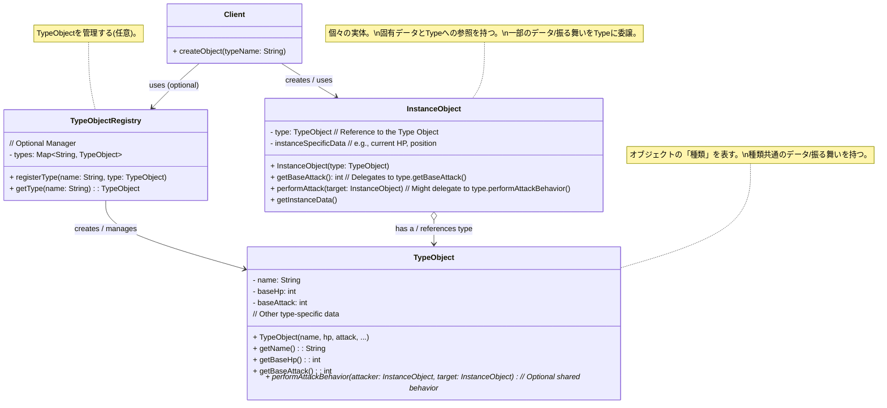

**目次**

- [デザインパターン詳細解説：Type Object パターン](#デザインパターン詳細解説type-object-パターン)
- [1. Type Object パターンとは？ ～目的と解決したい問題～](#1-type-object-パターンとは-目的と解決したい問題)
  - [1.1 このパターンを一言で言うと？（核心的な目的）](#11-このパターンを一言で言うと核心的な目的)
  - [1.2 なぜ Type Object パターンが必要なのか？（動機と背景）](#12-なぜ-type-object-パターンが必要なのか動機と背景)
    - [1.2.1 クラス継承による型定義の限界](#121-クラス継承による型定義の限界)
    - [1.2.2 「型」そのものを柔軟に扱いたい](#122-型そのものを柔軟に扱いたい)
  - [1.3 このパターンで解決できること（メリットの要約）](#13-このパターンで解決できることメリットの要約)
- [2. パターンの構造と実装 ～どのように実現するか～](#2-パターンの構造と実装-どのように実現するか)
  - [2.1 登場人物とその役割（クラス図と解説）](#21-登場人物とその役割クラス図と解説)
  - [2.2 実装のポイント：インスタンスとタイプの分離](#22-実装のポイントインスタンスとタイプの分離)
  - [2.3 コード例：具体的なシナリオでの実装](#23-コード例具体的なシナリオでの実装)
    - [2.3.1 シナリオ設定（例：ゲームのモンスター）](#231-シナリオ設定例ゲームのモンスター)
    - [2.3.2 サンプルコード（Java での例）](#232-サンプルコードjava-での例)
    - [2.3.3 コードのポイント解説](#233-コードのポイント解説)
- [3. Type Object パターンの利点 ～採用するメリット～](#3-type-object-パターンの利点-採用するメリット)
  - [3.1 クラス数の爆発を抑制](#31-クラス数の爆発を抑制)
  - [3.2 実行時の種類追加・変更の可能性](#32-実行時の種類追加変更の可能性)
  - [3.3 種類共通のデータと振る舞いの一元管理](#33-種類共通のデータと振る舞いの一元管理)
  - [3.4 データ駆動設計との高い親和性](#34-データ駆動設計との高い親和性)
- [4. 注意点とトレードオフ ～適用前に考えるべきこと～](#4-注意点とトレードオフ-適用前に考えるべきこと)
  - [4.1 静的な型チェックの利点の喪失](#41-静的な型チェックの利点の喪失)
  - [4.2 設計の複雑さの増加（場合による）](#42-設計の複雑さの増加場合による)
  - [4.3 振る舞いの実装場所](#43-振る舞いの実装場所)
  - [4.4 実行時の型情報の取得とキャスト](#44-実行時の型情報の取得とキャスト)
- [5. 実装上のヒントと考慮事項 ～より良く使うために～](#5-実装上のヒントと考慮事項-より良く使うために)
  - [5.1 `Type Object` の不変性 (Immutability)](#51-type-object-の不変性-immutability)
  - [5.2 `Instance Object` と `Type Object` の責務分担](#52-instance-object-と-type-object-の責務分担)
  - [5.3 `Type Object Registry/Manager` の設計](#53-type-object-registrymanager-の設計)
  - [5.4 種類固有の振る舞いの実装方法](#54-種類固有の振る舞いの実装方法)
  - [5.5 言語機能の活用](#55-言語機能の活用)
- [6. 他のパターンとの関連 ～比較と組み合わせ～](#6-他のパターンとの関連-比較と組み合わせ)
  - [6.1 似ているパターンや概念との比較](#61-似ているパターンや概念との比較)
    - [6.1.1 Type Object vs クラス継承](#611-type-object-vs-クラス継承)
    - [6.1.2 Type Object vs State パターン](#612-type-object-vs-state-パターン)
    - [6.1.3 Type Object vs Strategy パターン](#613-type-object-vs-strategy-パターン)
    - [6.1.4 Type Object vs Flyweight パターン](#614-type-object-vs-flyweight-パターン)
  - [6.2 組み合わせると効果的なパターン](#62-組み合わせると効果的なパターン)
- [7. リファクタリング：いつ Type Object パターンを導入するか](#7-リファクタリングいつ-type-object-パターンを導入するか)
  - [7.1 導入のきっかけとなる「コードの不吉な臭い」や状況変化](#71-導入のきっかけとなるコードの不吉な臭いや状況変化)
  - [7.2 段階的なリファクタリング手順（概要）](#72-段階的なリファクタリング手順概要)
- [8. まとめ ～ Type Object パターンの本質～](#8-まとめ--type-object-パターンの本質)

# デザインパターン詳細解説：Type Object パターン

# 1. Type Object パターンとは？ ～目的と解決したい問題～

## 1.1 このパターンを一言で言うと？（核心的な目的）

Type Object パターンは、「**オブジェクトの『種類（Type）』に関する情報や振る舞いを、通常のクラス定義ではなく、別の専用オブジェクト（Type Object）として表現・管理する**」デザインパターンです。これにより、オブジェクトの種類を**実行時に定義・変更**したり、種類ごとの**共通データを効率的に管理**したりすることを目的とします。

## 1.2 なぜ Type Object パターンが必要なのか？（動機と背景）

オブジェクト指向プログラミングでは、オブジェクトの種類（型）は通常、**クラス**によって定義されます。たとえば、「スライム」と「ドラゴン」という 2 種類のモンスターがいれば、`Slime` クラスと `Dragon` クラスをそれぞれ定義し、必要に応じてそれらを継承したサブクラス（例: `MetalSlime`, `RedDragon`）を作成します。

### 1.2.1 クラス継承による型定義の限界

このクラスベースの型定義は強力ですが、以下のような状況では限界や問題が生じることがあります。

- **クラス数の爆発:** オブジェクトの種類が非常に多い場合や、種類の組み合わせ（例: 材質 × 色 × サイズ）で型が決まる場合、必要なクラスの数が爆発的に増加し、管理が困難になります。
- **実行時の種類追加・変更の困難さ:** 新しい種類を追加するには、新しいクラスを作成し、多くの場合プログラムの再コンパイルが必要になります。アプリケーションの実行中にユーザーが新しい種類を定義したり、既存の種類の情報を変更したりすることは、クラスベースのモデルでは通常困難です。
- **種類ごとの共通データの管理:** 同じ種類のオブジェクトが共通して持つべきデータ（例: スライムの基本 HP、ドラゴンの基本攻撃力）を、各インスタンスではなく「種類」レベルで管理したい場合があります。`static` フィールドを使う方法もありますが、柔軟性に欠けることがあります。
- **データ駆動設計との相性:** ゲームのモンスターデータや商品マスタのように、オブジェクトの種類やその属性を外部データ（設定ファイル、データベース）から読み込んで動的に定義したい場合、クラスベースのモデルでは対応が難しいことがあります。

### 1.2.2 「型」そのものを柔軟に扱いたい

これらの問題を解決するために、「**オブジェクトの『種類』自体を、通常のデータを持つオブジェクトとして扱えないか？**」という発想が出てきます。もし「スライムという種類」「ドラゴンという種類」を表すオブジェクト（Type Object）が存在し、個々のモンスターインスタンスが「自分はこの種類のモンスターです」とその Type Object を参照する形にできれば、より柔軟な設計が可能になります。

Type Object パターンは、この「**型情報をオブジェクトとしてカプセル化する**」というアプローチを取ります。

## 1.3 このパターンで解決できること（メリットの要約）

Type Object パターンを適用することで、以下のようなメリットが期待できます。

- **クラス数の爆発を抑制**できる（とくに種類が多い場合）。
- オブジェクトの**種類を実行時に追加・変更**することが可能になる。
- 種類ごとの**共通データやデフォルトの振る舞い**を Type Object で一元管理できる。
- **データ駆動設計**（設定ファイルや DB から型情報をロードするなど）との親和性が高い。
- システム全体の**柔軟性**を高めることができる。

---

# 2. パターンの構造と実装 ～どのように実現するか～

Type Object パターンは、オブジェクトの「型」に関する情報をクラス定義から分離し、専用の「Type Object」に持たせることで実現されます。個々のインスタンスは、自身が属する「型」を表す Type Object への参照を持ちます。

## 2.1 登場人物とその役割（クラス図と解説）

Type Object パターンにおける主要な登場人物（役割）は以下の通りです。（クラス名は文脈に応じて変わります。例: Breed, Kind, Species, Type など）

- **`Instance Object` (インスタンスオブジェクト / 個別オブジェクト):**
  - **役割:** システム内に存在する個々の**実体**を表すオブジェクトです。（例: ゲーム内の特定のモンスター「スライム A」、「スライム B」）
  - **実装:**
    - 自身固有の状態（例: 現在の HP、位置座標）を持ちます。
    - 自身が属する**「種類」を表す `Type Object` への参照**を持ちます。この参照は通常、インスタンス生成時に設定され、変更されません。
    - 一部のデータ（例: 基本攻撃力）や振る舞い（例: デフォルトの攻撃方法）は、保持している `Type Object` から取得したり、`Type Object` に**委譲**したりします。
- **`Type Object` (タイプオブジェクト / 型オブジェクト):**
  - **役割:** オブジェクトの**「種類」や「分類」**を表すオブジェクトです。（例: 「スライム」という種類、「ドラゴン」という種類）
  - **実装:**
    - その**種類に共通するデータ**（例: スライムの基本 HP、基本防御力、属性、名前）を保持します。
    - その**種類に共通するデフォルトの振る舞い**（メソッド）を持つこともあります。（例: スライムの基本的な攻撃パターン）
    - 通常、Type Object 自体は、アプリケーション内でその種類ごとに**少数（あるいは 1 つ）**しか存在しません。Instance Object から共有して参照されます。
- **(任意) `Type Object Registry/Manager` (タイプオブジェクト管理クラス):**
  - **役割:** 利用可能な `Type Object` を**管理（登録、検索、生成）**するクラスです。必須ではありませんが、Type Object の種類が多い場合や、外部データから動的に生成する場合に便利です。
  - **実装:** `Type Object` を名前や ID と関連付けて保持し（例: `Map` を使用）、要求に応じて適切な `Type Object` を返します。



_図: Type Object パターンのクラス図 (Registry を含む場合)_

## 2.2 実装のポイント：インスタンスとタイプの分離

- **参照による関連付け:** `Instance Object` が `Type Object` への**参照**を持つことが、このパターンの基本です。これにより、複数の `Instance Object` が同じ `Type Object` を共有できます。
- **データと振る舞いの委譲:** `Instance Object` が必要とするデータや振る舞いのうち、その**種類によって決まるもの**（例: 基本ステータス、デフォルトの行動パターン）は、`Type Object` から取得するか、`Type Object` のメソッドに処理を委譲します。`Instance Object` は、自身固有の変動する状態（例: 現在の HP）のみを保持します。
  ```java
  // InstanceObject のメソッド例
  public int getAttackPower() {
      // 基本攻撃力は TypeObject から取得する
      return this.type.getBaseAttack() + this.attackModifier; // 自身の補正を加えるなど
  }
  ```
- **Type Object の不変性:** `Type Object` は複数の `Instance Object` から共有されることが多いため、通常は**不変 (Immutable)** に設計するか、あるいはその状態変更がすべての関連インスタンスに意図通りに反映されることを慎重に管理する必要があります。不変にするのがもっとも安全でシンプルです。
- **Type Object の生成と管理:**
  - **ハードコーディング:** 種類が少なく固定的な場合は、コード内で直接 `Type Object` を生成して定数として保持することも可能です。
  - **外部データからのロード:** ゲームデータや設定ファイル、データベースなどから `Type Object` の情報を読み込み、アプリケーション起動時などに動的に生成・登録する方法。データ駆動設計に適しています。
  - **Registry/Manager:** 種類が多い場合や動的にロードする場合、`Type Object Registry` を用意して、名前や ID で `Type Object` を検索・取得できるようにすると便利です。

## 2.3 コード例：具体的なシナリオでの実装

### 2.3.1 シナリオ設定（例：ゲームのモンスター）

シンプルな RPG ゲームで、さまざまな種類のモンスターが登場するシナリオを考えます。モンスターの種類（スライム、ゴブリンなど）ごとに、名前、基本 HP、基本攻撃力が共通で定義されており、個々のモンスターインスタンスは現在の HP を持ちます。攻撃時の振る舞いは種類によって少し異なるとします。

### 2.3.2 サンプルコード（Java での例）

```java
import java.util.HashMap;
import java.util.Map;
import java.util.Objects;

// 1. Type Object: モンスターの種類を表すクラス
final class MonsterBreed { // final で不変性を示すことが多い
    private final String name;
    private final int baseHp;
    private final int baseAttack;
    private final String attackMessage; // 種類ごとの攻撃メッセージ

    public MonsterBreed(String name, int baseHp, int baseAttack, String attackMessage) {
        this.name = name;
        this.baseHp = baseHp;
        this.baseAttack = baseAttack;
        this.attackMessage = attackMessage;
    }

    // 種類共通のデータを取得するゲッター
    public String getName() { return name; }
    public int getBaseHp() { return baseHp; }
    public int getBaseAttack() { return baseAttack; }

    // 種類共通の振る舞い (例: 攻撃メッセージを生成)
    public String getAttackMessage(String attackerName) {
        return attackerName + " の " + this.attackMessage;
    }
}

// 2. Instance Object: 個々のモンスターを表すクラス
class Monster {
    private final MonsterBreed breed; // ★ Type Object への参照 (final)
    private int currentHp; // インスタンス固有の状態

    public Monster(MonsterBreed breed) {
        this.breed = Objects.requireNonNull(breed);
        this.currentHp = breed.getBaseHp(); // ★ 初期HPはBreedから取得
    }

    public String getName() {
        return breed.getName(); // ★ 名前はBreedから取得
    }

    public int getCurrentHp() { return currentHp; }

    public void takeDamage(int damage) {
        this.currentHp -= damage;
        System.out.println(getName() + " は " + damage + " のダメージを受けた！ (残りHP: " + currentHp + ")");
        if (currentHp <= 0) {
            System.out.println(getName() + " は倒れた...");
        }
    }

    // 攻撃処理 (一部をBreedに委譲)
    public void attack(Monster target) {
        String message = breed.getAttackMessage(this.getName()); // ★ 攻撃メッセージをBreedから取得
        int damage = breed.getBaseAttack(); // ★ 基本攻撃力をBreedから取得
        System.out.println(message);
        target.takeDamage(damage);
    }

    public boolean isAlive() {
        return this.currentHp > 0;
    }
}

// 3. Type Object Registry (任意)
class MonsterBreedRegistry {
    private static final Map<String, MonsterBreed> breeds = new HashMap<>();

    // アプリケーション初期化時などにBreedを登録
    static {
        breeds.put("スライム", new MonsterBreed("スライム", 50, 5, "溶解液を飛ばした！"));
        breeds.put("ゴブリン", new MonsterBreed("ゴブリン", 80, 10, "棍棒で殴りかかった！"));
        breeds.put("ドラゴン", new MonsterBreed("ドラゴン", 200, 25, "炎を吐いた！"));
        System.out.println("モンスターの種類を登録しました。");
    }

    public static MonsterBreed getBreed(String name) {
        MonsterBreed breed = breeds.get(name);
        if (breed == null) {
            throw new IllegalArgumentException("未知のモンスター種別です: " + name);
        }
        return breed;
    }
}

// --- Client (利用側) ---
public class TypeObjectClient {
    public static void main(String[] args) {
        // Registry を使って Breed (Type Object) を取得
        MonsterBreed slimeBreed = MonsterBreedRegistry.getBreed("スライム");
        MonsterBreed goblinBreed = MonsterBreedRegistry.getBreed("ゴブリン");

        // Breed を使って Monster (Instance Object) を生成
        Monster slimeA = new Monster(slimeBreed);
        Monster slimeB = new Monster(slimeBreed); // 同じ種類のモンスター
        Monster goblin1 = new Monster(goblinBreed);

        System.out.println("\n--- バトル開始 ---");
        System.out.println(slimeA.getName() + " が現れた！ (HP: " + slimeA.getCurrentHp() + ")");
        System.out.println(goblin1.getName() + " が現れた！ (HP: " + goblin1.getCurrentHp() + ")");

        goblin1.attack(slimeA); // ゴブリンがスライムAを攻撃
        slimeA.attack(goblin1); // スライムAがゴブリンを攻撃

        // 新しい種類のモンスター「ドラゴン」を追加する場合、
        // Dragon クラスを作る必要はなく、MonsterBreedRegistry に
        // "ドラゴン" のデータを追加するだけで良い（データ駆動）。
        System.out.println("\n--- ドラゴン登場 ---");
        Monster dragon = new Monster(MonsterBreedRegistry.getBreed("ドラゴン"));
        System.out.println(dragon.getName() + " が現れた！ (HP: " + dragon.getCurrentHp() + ")");
        dragon.attack(goblin1);
    }
}
```

### 2.3.3 コードのポイント解説

- `MonsterBreed` が `Type Object` です。種類共通の名前、基本 HP、基本攻撃力、攻撃メッセージを保持しています。`final` クラスとして不変性を確保しています。
- `Monster` が `Instance Object` です。`MonsterBreed` への `final` な参照を持ち、コンストラクタで設定します。現在の HP (`currentHp`) というインスタンス固有の状態を持ちます。
- `getName()`, `getBaseHp()`, `getBaseAttack()`, `getAttackMessage()` といった情報は、`Monster` が直接持つのではなく、保持している `breed` (Type Object) から取得しています。`attack()` メソッドも一部の処理を `breed` に委譲しています。
- `MonsterBreedRegistry` が Type Object の管理クラスとして機能し、名前を使って `MonsterBreed` を取得できるようにしています。
- クライアントは、`MonsterBreedRegistry` から必要な `Breed` を取得し、それを使って `Monster` インスタンスを生成します。新しい種類のモンスター（ドラゴン）は、クラスを追加することなく、Registry へのデータ追加だけで対応できています。

このように、Type Object パターンは、クラス定義ではなくオブジェクトを用いて「型」を表現することで、システムの柔軟性とデータ駆動性を高めることができます。

---

# 3. Type Object パターンの利点 ～採用するメリット～

Type Object パターンを適用することで、とくにオブジェクトの種類が多いシステムや、データ駆動で種類を定義したい場合に、多くの設計上のメリットが得られます。

## 3.1 クラス数の爆発を抑制

これが Type Object パターンの**もっとも大きなメリットの一つ**です。オブジェクトの種類が非常に多い場合、あるいは種類の組み合わせ（例: 材質 × 色 × 形状）によって特性が決まるような場合に、**それぞれの種類や組み合わせに対応するクラスを個別に定義する必要がなくなります**。

代わりに、`Instance Object` のクラスは 1 つ（または少数）だけで済み、種類の違いは、そのインスタンスが参照する `Type Object` の違いによって表現されます。これにより、管理すべきクラスの数が大幅に削減され、システムの複雑さを抑制できます。

## 3.2 実行時の種類追加・変更の可能性

クラスベースの型定義では、新しい種類を追加するには通常、新しいクラスを作成し、プログラムを再コンパイルする必要があります。アプリケーションの実行中に動的に種類を追加することは困難です。

Type Object パターンでは、「種類」はオブジェクトとして表現されるため、**アプリケーションの実行中に新しい `Type Object` を生成・登録**したり、**既存の `Type Object` のデータ（種類共通の属性）を変更**したりすることが原理的に可能です。これにより、たとえば以下のような柔軟なシステムを構築できます。

- ユーザーが独自のアイテム種類やモンスター種類を定義できるゲーム。
- 設定ファイルやデータベースから読み込んだデータに基づいて、アプリケーション起動時に動的にオブジェクトの種類を構成するシステム。

## 3.3 種類共通のデータと振る舞いの一元管理

同じ種類に属するすべてのインスタンスが共有すべき**共通のデータ**（例: モンスターの基本ステータス、アイテムの基本効果）や、**デフォルトの振る舞い**（例: 基本的な攻撃方法）を、**`Type Object` で一元的に管理**できます。

- **データ効率:** 共通データを各インスタンスが個別に持つ必要がなくなり、メモリ使用量を削減できます。
- **保守性:** 種類共通のデータを変更したい場合、対応する `Type Object` を修正するだけで、その種類のすべてのインスタンスに影響を与えることができます。修正箇所が一箇所に集約されます。

## 3.4 データ駆動設計との高い親和性

Type Object パターンは、**データ駆動設計**（システムの振る舞いや構成を、コードではなく外部データによって定義・制御する設計アプローチ）と非常に相性が良いです。

`Type Object` のデータ（種類名、属性、デフォルトの振る舞いに関する情報など）を、JSON ファイル、XML ファイル、データベーステーブルなどの**外部データソース**として定義・管理できます。アプリケーションは起動時や必要に応じてこれらのデータを読み込み、`Type Object` インスタンスを動的に生成・登録します。

これにより、

- プログラマでないデザイナーやプランナーが、コードを触ることなくゲームのモンスターやアイテムの種類・バランスを調整できる。
- アプリケーションの再コンパイルなしに、外部データを更新するだけでシステムの動作（登場するオブジェクトの種類や特性）を変更できる。

といった、柔軟で効率的な開発・運用プロセスを実現できます。

これらのメリットにより、Type Object パターンは、とくにゲーム開発、設定管理、商品マスタ管理など、多数の「種類」を扱う必要があり、かつそれらをデータとして柔軟に扱いたいシステムにおいて、強力な設計パターンとなります。

---

# 4. 注意点とトレードオフ ～適用前に考えるべきこと～

Type Object パターンは柔軟性をもたらしますが、その導入にはいくつかの注意点や、従来のクラスベースの設計と比較した場合のトレードオフが存在します。

## 4.1 静的な型チェックの利点の喪失

従来のクラスベースの設計では、オブジェクトの種類はコンパイル時にクラスとして定義されているため、**コンパイラによる静的な型チェック**の恩恵を最大限に受けることができます。たとえば、`Slime` クラスにしか存在しないメソッドを `Dragon` オブジェクトから呼び出そうとすれば、コンパイルエラーとして検出されます。

Type Object パターンでは、「種類」の情報は実行時に `Type Object` を参照して決定されるため、**コンパイル時にはすべての `Instance Object` が同じ型（あるいは少数の型）に見える**ことが多くなります。これにより、以下のような影響が出る可能性があります。

- 特定の「種類」だけが持つべき振る舞いやデータを誤って利用しようとしても、コンパイルエラーにならず、**実行時エラー**となる可能性がある。
- IDE によるコード補完やリファクタリング支援が、種類固有の情報に基づいては機能しにくくなる場合がある。

静的な型安全性よりも、実行時の柔軟性を重視する場合に Type Object パターンは適していますが、このトレードオフは十分に理解しておく必要があります。

## 4.2 設計の複雑さの増加（場合による）

Type Object パターンを導入すると、`Instance Object` と `Type Object` という 2 種類のオブジェクトが登場し、両者の間の参照関係や責任分担（どのデータをどちらが持つか、どの振る舞いをどちらに委譲するか）を明確に設計する必要があります。また、任意で `Type Object Registry` も登場します。

オブジェクトの種類が少なく、型の違いをクラスで表現しても問題ないような単純なケースにまで Type Object パターンを適用すると、かえって**設計が複雑になり、理解しにくくなる**可能性があります。クラスベースのシンプルな設計の方が適切な場合もあります。

## 4.3 振る舞いの実装場所

種類ごとの振る舞い（メソッド）をどこに実装するかは、設計上の選択肢となります。

- **`Type Object` に実装する:** 種類共通のデフォルト振る舞いを `Type Object` に持たせ、`Instance Object` はそれを呼び出す（委譲する）形。シンプルですが、`Instance Object` 固有の状態を使った振る舞いの実装が少し面倒になる場合があります（`Instance Object` を引数で渡すなど）。
- **`Instance Object` に実装し、`Type Object` のデータを使う:** `Instance Object` が振る舞いを持ち、その中で `Type Object` から取得した種類共通のデータ（基本攻撃力など）を利用する形。`Instance Object` 固有の状態と組み合わせやすいですが、振る舞いのロジックが `Instance Object` 側に偏る可能性があります。
- **Strategy パターンなどとの組み合わせ:** 種類ごとの振る舞いを `Strategy` オブジェクトとして `Type Object` に持たせ、`Instance Object` がそれを呼び出す、といったより高度な設計も考えられますが、さらに複雑になります。

どの方法が良いかは、振る舞いの性質（種類だけで決まるか、インスタンスの状態にも依存するか）や複雑さによって異なります。

## 4.4 実行時の型情報の取得とキャスト

クライアントコードが、ある `Instance Object` が**具体的にどの「種類」(`Type Object`)** であるかを知りたい場合、`Instance Object` が持つ `Type Object` への参照を取得し、その情報を調べる必要があります。場合によっては、特定の種類の `Type Object` であることを期待してダウンキャストを行う必要が出てくるかもしれません。これは、静的な型チェックの恩恵を受けにくいという点とも関連します。

これらの注意点を理解し、Type Object パターンを導入するメリット（クラス数削減、実行時の柔軟性、データ駆動）が、これらのトレードオフ（静的型チェックの低下、設計の複雑さ）を上回るかどうかを、システムの要件や特性に応じて慎重に判断することが重要です。

---

# 5. 実装上のヒントと考慮事項 ～より良く使うために～

Type Object パターンを効果的に実装し、そのメリットを最大限に活かすためには、いくつかの実践的なヒントや考慮事項があります。

## 5.1 `Type Object` の不変性 (Immutability)

`Type Object` は、多くの場合、複数の `Instance Object` から共有して参照されます。そのため、**`Type Object` は不変 (Immutable) に設計することが強く推奨されます**。つまり、一度生成された `Type Object` の内部状態（種類共通のデータ）は、後から変更できないようにします。

- **実装方法:** フィールドを `final` (Java, C#) や `readonly` (C#) にする、Setter メソッドを提供しない、などが考えられます。
- **メリット:**
  - 複数のインスタンスから安全に共有できます（スレッドセーフティの確保にも繋がります）。
  - `Type Object` の状態が意図せず変更され、共有している他のインスタンスに影響が及ぶ、といった予期せぬ副作用を防ぐことができます。
  - システムの挙動が予測しやすくなります。

もし、種類共通のデータを実行中に変更する必要がある場合は、新しい `Type Object` インスタンスを生成して差し替えるか、あるいはそのデータが本当に「種類共通」なのか、インスタンス固有の状態ではないか、設計を再検討する必要があります。

## 5.2 `Instance Object` と `Type Object` の責務分担

どのデータや振る舞いを `Instance Object` に持たせ、どれを `Type Object` に持たせるかの**責務分担**を明確にすることが重要です。

- **`Type Object` が持つべきもの:**
  - その「種類」を定義する不変のデータ（名前、ID、基本ステータス、カテゴリなど）。
  - その種類に共通するデフォルトの振る舞いや定数。
- **`Instance Object` が持つべきもの:**
  - その**個体**に固有の、**変動する可能性のある状態**（現在の HP、位置、在庫数、設定値など）。
  - `Type Object` への参照。
  - `Type Object` から取得したデータや振る舞いを利用しつつ、自身の状態に基づいて実行される具体的なアクション。

この境界が曖昧になると、設計が複雑になったり、データの整合性を保つのが難しくなったりします。

## 5.3 `Type Object Registry/Manager` の設計

`Type Object` を管理する Registry や Manager クラスを導入する場合、その設計も考慮点となります。

- **キーの選択:** `Type Object` を識別するためのキー（名前、ID など）をどのように決定し、管理するか。
- **生成タイミング:** いつ `Type Object` を生成し、Registry に登録するか（アプリケーション起動時か、オンデマンドか）。
- **外部データとの連携:** 設定ファイルやデータベースから `Type Object` の情報を読み込み、Registry に登録する仕組み。エラーハンドリング（不正なデータの扱いなど）も考慮が必要です。
- **スレッドセーフティ:** Registry が複数のスレッドからアクセスされる可能性がある場合は、スレッドセーフな実装（例: `ConcurrentHashMap` の利用や適切な同期処理）が必要です。

## 5.4 種類固有の振る舞いの実装方法

すべての種類に共通ではない、特定の種類のオブジェクトだけが持つ**固有の振る舞い**をどのように実装するかは、課題となることがあります。

- **`Type Object` に振る舞いを持たせる:** もし振る舞いが `Type Object` のデータだけで完結するなら、`Type Object` にメソッドとして実装し、`Instance Object` が委譲するのがシンプルです。
- **`Instance Object` で条件分岐:** `Instance Object` が保持している `Type Object` の種類（名前や ID など）を判定し、`if-else` や `switch` で振る舞いを切り替える方法。これは Type Object パターンの利点を一部損なう可能性がありますが、限定的なら許容される場合もあります。
- **Strategy パターンなどとの組み合わせ:** 種類固有の振る舞いを `Strategy` オブジェクトとして `Type Object` に持たせ、`Instance Object` がその Strategy を利用する、というより高度な設計も考えられます。
- **サブクラス化の併用:** Type Object パターンを使いつつも、とくに振る舞いが大きく異なるいくつかの「大分類」については、`Instance Object` を継承したサブクラスを作成するという、ハイブリッドなアプローチも考えられます。

どの方法が最適かは、振る舞いの複雑さや種類の数、将来の拡張性などを考慮して決定します。

## 5.5 言語機能の活用

- **Enum (列挙型):** 種類が固定的で、種類ごとの共通データや簡単な振る舞いを持つ場合、Java や C# の Enum (列挙型) を `Type Object` の代わりとして（あるいは組み合わせて）利用できることがあります。Enum は定数としての性質を持ち、型安全性を高めることができます。
- **データクラス / レコード型:** Kotlin の data class や Java の record など、データを保持することを主目的とした言語機能は、不変な `Type Object` を簡潔に定義するのに役立ちます。

これらの実装上のヒントを考慮することで、Type Object パターンをより効果的に、そして保守しやすく実装できます。

---

# 6. 他のパターンとの関連 ～比較と組み合わせ～

Type Object パターンは、オブジェクトの「型」情報をデータとして扱うというユニークなアプローチを取りますが、他のデザインパターンと比較されたり、連携して使われたりすることがあります。

## 6.1 似ているパターンや概念との比較

### 6.1.1 Type Object vs クラス継承

- **根本的な違い:** Type Object は**オブジェクトのコンポジション（参照）**を使って型の違いを表現するのに対し、クラス継承は**クラス間の静的な親子関係**で型の違い（is-a 関係）を表現します。
- **柔軟性:** Type Object は実行時に型を追加・変更できる点で柔軟性が高いですが、静的な型チェックの恩恵は受けにくくなります。クラス継承は静的で型安全性が高いですが、実行時の柔軟性は低く、クラス爆発のリスクがあります。
- **使い分け:** オブジェクトの種類が固定的で階層関係が明確ならクラス継承。種類が多く動的、データ駆動で定義したいなら Type Object を検討します。両者を組み合わせる（大分類は継承、細かい種類は Type Object）こともあります。

### 6.1.2 Type Object vs State パターン

- **類似点:** どちらもオブジェクトの振る舞いを変更するメカニズムを提供します。`Instance Object` が `Type Object` を参照する関係は、`Context` が `State` を参照する関係に似ています。
- **違い:** 主な目的が異なります。State パターンはオブジェクトの**内部状態**に応じて**振る舞い**を切り替え、**状態遷移**を管理することに焦点を当てます。Type Object パターンはオブジェクトの**「種類」**を定義し、種類**共通のデータやデフォルトの振る舞い**を提供することに焦点を当てます。`Type Object` は通常、不変で、インスタンス間で共有されますが、`State` オブジェクトは `Context` ごとに変わる可能性があります。
- **連携:** オブジェクトの状態遷移が、そのオブジェクトの「種類」（Type Object）によって異なる場合など、両者を組み合わせることも考えられます。

### 6.1.3 Type Object vs Strategy パターン

- **類似点:** `Instance Object` が振る舞いの一部を `Type Object` に委譲する点は、`Context` が `Strategy` に委譲する点と似ています。
- **違い:** Strategy パターンは**アルゴリズム（振る舞い）**そのものを交換可能にすることが主目的です。Type Object パターンは**型の定義（データとデフォルトの振る舞い）**をオブジェクト化することが主目的です。
- **連携:** Type Object が種類ごとのデフォルトの「戦略（Strategy）」を保持し、`Instance Object` がそれを利用する、という形で連携できます。

### 6.1.4 Type Object vs Flyweight パターン

- **類似点:** どちらもオブジェクト間で情報を共有することで、効率化（メモリ削減など）を図ることがあります。
- **違い:** Flyweight は多数のオブジェクト間で**共有可能な状態（内部状態）**を分離・共有することに焦点を当てます。Type Object は**型の定義（種類共通のデータや振る舞い）**を共有することに焦点を当てます。
- **連携:** `Type Object` 自体を Flyweight として扱い、種類ごとに唯一のインスタンスを共有することは非常に一般的です（Singleton や Registry を使う）。

## 6.2 組み合わせると効果的なパターン

- **Singleton パターン / Flyweight パターン:**
  - **連携:** 前述の通り、`Type Object` は種類ごとに 1 つあれば十分な場合が多く、Singleton または Flyweight パターンを適用してインスタンスを共有することで、メモリ効率を高めるのが一般的です。`Type Object Registry` は Flyweight Factory の役割を果たすことがあります。
- **Factory パターン (Factory Method, Abstract Factory):**
  - **連携:** `Instance Object` を生成する際に、どの `Type Object` を参照させるかを決定・設定するロジックを Factory パターンでカプセル化できます。たとえば、`MonsterFactory` が `createMonster("スライム")` のようなメソッドを持ち、内部で `MonsterBreedRegistry` から `Slime` の `Breed` を取得し、それを使って `new Monster(slimeBreed)` を実行して返す、といった構成です。
- **Strategy パターン:**
  - **連携:** `Type Object` が、種類ごとのデフォルトの振る舞いを表す `Strategy` オブジェクトへの参照を持つことができます。`Instance Object` は、`Type Object` を通じてそのデフォルト Strategy を利用したり、あるいは自身で別の Strategy を設定して振る舞いをオーバーライドしたりできます。
- **Interpreter パターン:**
  - **連携:** 外部データ（設定ファイルなど）から `Type Object` を動的に生成する場合、そのデータの解析・解釈に Interpreter パターンを利用することが考えられます。

Type Object パターンは、他のパターンと組み合わせることで、データ駆動設計、効率的なリソース管理、柔軟な振る舞いの定義など、より洗練された設計を実現するための基盤となることができます。

---

# 7. リファクタリング：いつ Type Object パターンを導入するか

Type Object パターンは、システムの初期設計段階から採用されることもありますが、開発が進むにつれてクラス継承による型管理の限界が見えてきた場合などに、**リファクタリング**によって後から導入することも有効な改善策となります。

## 7.1 導入のきっかけとなる「コードの不吉な臭い」や状況変化

既存のコードベースに以下のような兆候（コードの不吉な臭い）や状況の変化が見られた場合、Type Object パターンの導入を検討する価値があります。

- **クラス数の爆発的な増加:**
  - **症状:** オブジェクトの種類や特性の組み合わせ（例: アイテムの材質 × 色 × 効果）ごとに**多数のサブクラス**が作られており、クラス数が管理しきれないほど増えている。あるいは、今後さらに種類が増えることが予想され、クラスの爆発が懸念される。
  - **問題:** システムが複雑になり、コンパイル時間が増加し、新しい種類の追加や変更が非常に困難になります。
  - **解決策:** Type Object パターンを導入します。種類の違いを表現する情報をクラス定義から `Type Object` に移し、`Instance Object` のクラス数を削減します。組み合わせは、`Instance Object` が複数の `Type Object` を参照するなどの方法で表現できます。
- **型コード (Type Code) やタグに基づいた条件分岐:**
  - **症状:** クラス内に種類やカテゴリを表すためのフィールド（例: `int monsterType`, `String itemCategory`）があり、メソッド内でその値に基づいて `if-else` や `switch` で処理を分岐している箇所が多数存在する。
  - **問題:** 新しい種類を追加するたびに、これらの条件分岐すべてを修正する必要があり、保守性が低く、OCP に反します。種類ごとの共通データも扱いにくいです。
  - **解決策:** Type Object パターンを導入します。型コードで表されていた「種類」を `Type Object` として定義し、種類ごとのデータやデフォルトの振る舞いを `Type Object` に持たせます。`Instance Object` は `Type Object` への参照を持ち、条件分岐の代わりに `Type Object` の情報を利用したり、処理を委譲したりするように変更します。（これは「型コードを State/Strategy/TypeObject で置き換える」という一般的なリファクタリングパターンの一部です）
- **サブクラス間の重複データ:**
  - **症状:** 継承階層において、同じ「種類」に属する複数のサブクラス間で、共通の定数値や設定データ（例: 特定種族の基本能力値）が重複して定義されている。
  - **問題:** データが分散し、変更時に修正漏れが発生しやすくなります。
  - **解決策:** Type Object パターンを導入し、種類共通のデータを `Type Object` に集約します。各サブクラス（あるいは共通の `Instance Object` クラス）は、`Type Object` を参照してそのデータを取得するように変更します。
- **実行時の種類定義・変更の要求:**
  - **症状:** アプリケーションの実行中に、ユーザーが新しいオブジェクトの種類（アイテム、キャラクターなど）を定義したり、既存の種類のパラメータを調整したりする必要が出てきた。
  - **問題:** クラスベースのモデルでは、実行時にクラスを動的に生成・変更するのは非常に困難です。
  - **解決策:** Type Object パターンを導入します。「種類」をデータ（`Type Object`）として扱うことで、実行時に `Type Object` を生成・変更し、それを `Instance Object` から参照させることで、要求に対応できます。

これらの状況は、現在のクラスベースの型定義がシステムの柔軟性や保守性を損なっている可能性を示唆しており、Type Object パターンの導入によって設計を大幅に改善できる可能性があります。

## 7.2 段階的なリファクタリング手順（概要）

既存のコード（とくにクラス継承や型コードを多用している場合）に Type Object パターンを導入する際の、一般的なリファクタリング手順の概要は以下の通りです。（テストによる安全確保が前提です）

1. **`Type Object` クラスの作成:**
   - システム内の「種類」を表現するための新しい `Type Object` クラス（例: `MonsterBreed`）を作成します。
   - このクラスに、種類ごとに共通となるデータ（フィールド）と、必要であればデフォルトの振る舞い（メソッド）を定義します。
2. **既存クラスからのデータ/振る舞いの移動:**
   - 既存のクラス階層（スーパークラスやサブクラス）や、型コードによる分岐ロジックの中から、種類によって決まるデータや振る舞いを特定します。
   - 特定したデータや振る舞いを、新しく作成した `Type Object` クラスに**移動 (Move Field / Move Method)** します。
3. **`Instance Object` クラスの修正:**
   - 「種類」を表していた元のクラス（または型コードを持っていたクラス）を `Instance Object` クラスとして位置づけます（必要であればリネームします）。
   - `Instance Object` クラスに、`Type Object` への参照を持つフィールドを追加します。
   - `Instance Object` のコンストラクタを修正し、対応する `Type Object` を引数で受け取り、フィールドに設定するようにします。
   - `Instance Object` 内で、ステップ 2 で `Type Object` に移動したデータや振る舞いを直接持っていた箇所を修正し、代わりに保持している `Type Object` を参照または委譲するように変更します。
   - （もしサブクラス階層があった場合）種類ごとの違いを `Type Object` で表現できるようになったのであれば、**サブクラスを削除 (Collapse Hierarchy)** して `Instance Object` クラスに統合できる可能性があります。
4. **`Type Object` の生成と管理:**
   - 必要な `Type Object` インスタンスを生成するコードを追加します（ハードコード、外部データからのロードなど）。
   - 必要であれば、`Type Object Registry` クラスを作成し、生成した `Type Object` を登録・管理します。
5. **クライアントコードの修正:**
   - クライアントコードが具体的なサブクラスや型コードに依存していた箇所を修正します。
   - `Instance Object` を生成する際には、まず適切な `Type Object` を（Registry などから）取得し、それを `Instance Object` のコンストラクタに渡すように変更します。
   - 種類に基づく条件分岐を行っていた箇所は、`Instance Object` が参照する `Type Object` の情報を利用するか、`Type Object` に処理を委譲する形に置き換えます。
6. **テスト:** 各ステップの後、および最終的に、テストを実行してリファクタリングによって外部から見た振る舞いが変わっていないこと、そしてオブジェクトが正しい「種類」の情報に基づいて動作することを確認します。

このリファクタリングプロセスは、とくに既存の深い継承階層や複雑な型コードを解消する場合、大規模になる可能性があります。小さなステップで、テストによる検証を繰り返しながら慎重に進めることが非常に重要です。結果として、クラス構造がシンプルになり、システムの柔軟性とデータ駆動性が向上します。

---

# 8. まとめ ～ Type Object パターンの本質～

**Type Object パターン**は、オブジェクトの**「種類（Type）」に関する情報や振る舞いを、クラス定義から分離し、専用のオブジェクト（`Type Object`）として表現・管理する**デザインパターンです。

このパターンを適用することで、

- オブジェクトの**種類が非常に多い**場合や**組み合わせ**で決まる場合に、**クラス数の爆発を抑制**できる。
- オブジェクトの**種類を実行時に動的に追加・変更**することが可能になる。
- 種類ごとに**共通するデータやデフォルトの振る舞いを `Type Object` で一元管理**し、効率化と保守性向上を図れる。
- **データ駆動設計**との親和性が高く、設定ファイルやデータベースから型情報を読み込んでシステムを構成できる。
- システム全体の**柔軟性**を高めることができる。

といったメリットが得られます。

その本質は、「**『型』そのものをデータ（オブジェクト）として扱う**」という発想の転換にあります。個々のインスタンス (`Instance Object`) は自身固有の状態を持ちつつ、自身が属する「種類」を表す `Type Object` への参照を持ちます。そして、種類によって決まるデータや振る舞いは、この `Type Object` から取得したり、委譲したりします。

ただし、従来のクラスベースの型定義と比較して、**静的な型チェックの恩恵を受けにくくなる**、設計が（最初は）**やや複雑になる**可能性がある、といった**トレードオフ**も存在します。

Type Object パターンは、とくに**ゲーム開発**（モンスターやアイテムの種類管理）、**設定情報の管理**、**商品マスタ**など、データとして「種類」を柔軟に扱いたいシステムにおいて非常に強力な設計アプローチです。クラス継承の限界を感じた際や、データ駆動でシステムを構築したい場合に、このパターンの導入を検討する価値は大きいでしょう。
