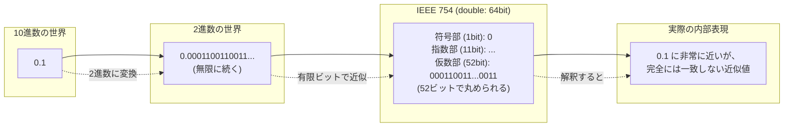

# コンピュータと小数の深い関係：誤差と速度の謎を解き明かす

# はじめに：0.1 + 0.2 は 0.3 ではない？ コンピュータと小数の不思議な関係

若手エンジニアの皆さん、日々の開発業務、本当にお疲れ様です。プログラミングを学んでいく中で、整数 (`int`) とは別に、小数（多くの言語で `float` や `double`）というデータ型があることは、ごく自然に受け入れているかと思います。

しかし、この「小数」の扱いには、実は多くのエンジニアが一度は足を取られる「落とし穴」が潜んでいます。

たとえば、皆さんが使っているプログラミング言語で、試しに以下のような計算を実行してみてください。

```javascript
// JavaScript の例
console.log(0.1 + 0.2);

// Python の例
print(0.1 + 0.2);
```

この結果が、私たちの期待する `0.3` ではなく、`0.30000000000000004` のような、非常に近いけれどもピッタリではない値になることを不思議に思いませんか？

あるいは、金融システムの開発などで、「金額の計算に浮動小数点数（`float`, `double`）を使ってはならない」という鉄則を耳にしたことがあるかもしれません。

なぜ、コンピュータはこんなに単純な小数の足し算さえ、正確に行えないのでしょうか？
また、一般的に「小数の計算は整数の計算よりも遅い」と言われるのは、なぜなのでしょうか？

この資料では、コンピュータにおける「小数」の扱い、とくに「**浮動小数点数 (Floating-Point Number)**」と呼ばれる一般的な表現方法が持つ、以下の 2 つの重要な特性について、その根本的な理由から実践的な対処法までを解説します。

1. **コンピュータは小数を正確に表現するのが苦手である（表現誤差の問題）**
2. **小数の計算は整数の計算に比べて遅くなる傾向がある（パフォーマンスの問題）**

これらの特性を理解することは、単に「コンピュータの雑学」を増やすことではありません。それは、

- 予期せぬ計算誤差によるバグを未然に防ぎ、
- 金融計算のような正確性が絶対的に求められる場面で、正しい技術選択をし、
- そして、性能がクリティカルな場面で、適切なコードを書く

ための、すべてのソフトウェアエンジニアにとって不可欠な基礎知識です。

コンピュータと小数の、一見すると不思議で、しかし非常に論理的な関係を解き明かす旅へ、一緒に出発しましょう。

# なぜコンピュータは小数を正確に表現できないのか？

コンピュータが小数を扱う上で「誤差」が避けられない根本的な理由は、私たちが普段使っている**10 進数**の世界と、コンピュータが内部ですべてを処理する**2 進数**の世界との間に存在する、数学的な「壁」にあります。

## 2 進数と 10 進数の壁

私たちは、日常生活で数を 0 から 9 までの 10 個の数字で表現する「10 進法」を使っています。たとえば、「0.75」という小数は、`7 * (1/10) + 5 * (1/100)` を意味します。

一方、コンピュータの内部では、すべての情報が 0 と 1 の組み合わせである「2 進法」で表現されます。2 進法の小数は、`1/2`, `1/4`, `1/8`, `1/16`, ... といった「2 のべき乗の逆数」の和で表現されます。

たとえば、10 進数の `0.75` は、`1/2 + 1/4` と表現できるため、2 進数では `0.11` と正確に表現できます。

```
0.11 (2進数) = 1 * (1/2) + 1 * (1/4)
             = 0.5 + 0.25
             = 0.75 (10進数)
```

同様に、10 進数の `0.5` は 2 進数で `0.1`、`0.25` は `0.01` と正確に表現できます。

**ここで問題が発生します。**

私たちが 10 進法で有限の桁数で表現できる小数のうち、いくつかは、**2 進法で表現しようとすると、永遠に続く「循環小数」になってしまい、有限の桁数では正確に表現できない**のです。

その最も有名な例が、冒頭で見た「**0.1**」です。

10 進数の `0.1` を 2 進数に変換しようとすると、

`0.00011001100110011... (2進数)`

というように、「0011」のパターンが無限に繰り返される循環小数になってしまいます。これは、ちょうど私たちが 10 進法で `1/3` を `0.33333...` としか表現できないのと同じような現象です。

コンピュータのメモリは有限です。無限に続く数をそのまま保存することはできません。そのため、コンピュータは、この無限に続く 2 進数の循環小数を、途中のどこかで **「丸めて（または切り捨てて）」近似値として保存**するしかありません。

これが、「コンピュータは `0.1` のような単純な小数さえ正確に表現できない」という事実の根本的な理由です。`0.1` も `0.2` も、内部的にはどちらも微小な誤差を含む近似値として保持されているため、それらを足し算した結果もまた、真の `0.3` からわずかにずれた値になってしまうのです。

この「2 進数で小数を表現する際の限界」こそが、浮動小数点数が「誤差」を本質的に内包する原因となっています。

---

## IEEE 754 の仕組み（符号部、指数部、仮数部）と「浮動小数点」の意味

コンピュータが 2 進数では正確に表現できない小数がある、ということを学びました。では、コンピュータは、これらの「不正確さ」を内包する小数を、具体的にどのような形式でメモリ上に保存しているのでしょうか？

そのための世界的な標準規格が、「**IEEE 754**」です。現代のほとんどすべてのコンピュータやプログラミング言語は、`float` や `double` といった小数型を、この IEEE 754 という規格に定められた「**浮動小数点数 (Floating-Point Number)**」形式で表現しています。

**浮動小数点数の内部構造**

IEEE 754 形式では、1 つの小数は、大きく分けて以下の 3 つの部分からなるビット列として表現されます。

1. **符号部 (Sign bit)**
   - 数値が正か負かを示す 1 ビット。`0` なら正、`1` なら負を表します。
2. **指数部 (Exponent part)**
   - 数値の「桁の大きさ（スケール）」を表す部分です。非常に大きな数や、非常に小さな数を表現するために使われます。
   - 実際には、単純な指数ではなく、少しずらした値（バイアス値、または「げた」を履かせた値）が格納されます。これにより、正と負の両方の指数を効率的に表現できます。
3. **仮数部 (Fraction / Mantissa part)**
   - 数値の「有効桁」を表す部分です。数値の精度（どれだけ細かく値を表現できるか）を決定します。
   - 通常、「正規化」というルールにより、先頭が `1.` で始まるように小数点の位置を調整し、その `1.` を省略して、小数点以下の部分だけを格納することで、効率的にビットを使います。

**「浮動小数点」と呼ばれる所以**

この形式が「浮動小数点」と呼ばれるのは、指数部の値によって、仮数部が表す数の「小数点の位置が、あたかも浮動（動く）するかのように」解釈されるためです。

たとえば、科学的記数法で `1.2345 × 10^3` や `1.2345 × 10^-2` と書くように、`1.2345` という有効数字の部分（仮数部に相当）は同じでも、`10` の何乗かという指数（指数部に相当）を変えることで、小数点の位置をずらし、非常に大きな数（1234.5）や小さな数（0.012345）を表現できます。浮動小数点数も、これと同じ考え方を 2 進数で行っているのです。

`（符号） × 1.xxxx... (2進数の仮数部) × 2^(yyyy... (2進数の指数部))`

**`float` (単精度) と `double` (倍精度) の違い**

多くのプログラミング言語で提供されている `float` と `double` は、この IEEE 754 形式で、各部に割り当てられているビット数が異なります。

| 型                    | 全ビット数    | 符号部   | 指数部    | 仮数部    | 10 進数での有効桁数（目安） |
| :-------------------- | :------------ | :------- | :-------- | :-------- | :-------------------------- |
| **`float`** (単精度)  | **32 ビット** | 1 ビット | 8 ビット  | 23 ビット | 約 7 桁                     |
| **`double`** (倍精度) | **64 ビット** | 1 ビット | 11 ビット | 52 ビット | 約 15 ～ 16 桁              |

この表から分かるように、

- `double` は `float` の倍のビット数を使っており、**より広い範囲の数**（指数部のビット数が多いため）を、**より高い精度で**（仮数部のビット数が多いため）表現できます。
- そのため、特別な理由がない限り、**現代のプログラミングでは、より精度の高い `double` を使うのが一般的**です。（GPU での大量計算や、メモリ制約が極めて厳しい組み込みシステムなど、性能やメモリが重要な場面では `float` が選択されることもあります。）

**表現できる値の範囲と精度の限界**

この浮動小数点数の仕組みは、非常に広範囲な数値を効率的に表現できる一方で、その構造的な性質から、いくつかの重要な「限界」を持っています。

- **表現できる値の範囲の限界:**
  指数部が表現できる範囲を超えると、数値が大きすぎて表現できない「**オーバーフロー (Overflow)**」や、小さすぎて表現できない「**アンダーフロー (Underflow)**」が発生します。
- **精度の限界:**
  仮数部のビット数は有限です。そのため、表現できる有効桁数にも限界があります。この有限な仮数部で、本来無限に続く 2 進数の循環小数を近似して格納するため、必然的に「**表現誤差（丸め誤差）**」が生じるのです。`double` は `float` よりも精度が高いですが、それでも誤差がゼロになるわけではありません。

**特殊な値：`NaN` と `Infinity`**

IEEE 754 規格では、通常の数値以外に、いくつかの「特殊な値」も定義されています。これらは、指数部のビットパターンが特定の値（すべて 1 など）の場合に表現されます。

- **`Infinity` (無限大):**
  - `1 / 0` のような、ゼロによる除算の結果や、表現可能な最大値を超えるオーバーフローの結果として生成されます。正の無限大 (`+Infinity`) と負の無限大 (`-Infinity`) があります。
- **`NaN` (Not a Number / 非数):**
  - `0 / 0` や、`Infinity - Infinity`、`sqrt(-1)`（負の数の平方根）といった、数学的に定義できない、あるいは不定となるような演算の結果として生成されます。
  - `NaN` の興味深い性質として、「**`NaN` は、`NaN` 自身を含め、いかなる値とも等しくない (`NaN == NaN` が `false` になる)**」というものがあります。ある値が `NaN` かどうかを判定するには、専用の関数（例: `isNaN()`, `is_nan()`）を使う必要があります。

IEEE 754 という共通規格の存在により、私たちは異なるプラットフォーム間でも一貫した方法で小数を扱うことができます。しかし、その内部構造が「符号部・指数部・仮数部」という限られたビット数による近似表現であることを理解しておくことが、浮動小数点数が持つ「誤差」や「限界」を正しく認識し、それによって引き起こされるバグを避けるための第一歩となるのです。

## 表現誤差（丸め誤差）の発生

ここまでの説明で、コンピュータが小数を扱う上で「誤差」がなぜ避けられないのか、その 2 つの根本的な理由が見えてきました。

1. **基数の違いによる問題（2 進数 vs 10 進数）:**
   私たちが普段使う 10 進法では有限桁で表せる小数の多く（例: `0.1`, `0.2`）が、コンピュータ内部の **2 進法では無限に続く循環小数**になってしまう。
2. **ビット数の限界による問題（IEEE 754）:**
   コンピュータのメモリ（ビット数）は有限であるため、この無限に続く 2 進数の循環小数を、**有限の仮数部のビット数に収まるように、途中で「丸める（または切り捨てる）」必要がある**。

この、本来の値と、コンピュータ内部で実際に表現されている値との間に生じる、ごくわずかな差のことを「**表現誤差 (Representation Error)**」または「**丸め誤差 (Rounding Error)**」と呼びます。

**誤差は「ほぼすべての」小数に存在する**

重要なのは、この表現誤差は、`0.1` や `0.2` といった特定の小数だけに存在するのではなく、**2 進数で正確に表現できない、非常に多くの 10 進数の小数**に対して、多かれ少なかれ存在しているということです。

2 進数で正確に表現できるのは、`0.5` (`1/2`), `0.25` (`1/4`), `0.75` (`1/2 + 1/4`), `0.125` (`1/8`) といった、「2 のべき乗の逆数の和」で表せる小数に限られます。それ以外の、私たちがキリが良いと感じる多くの 10 進数の小数は、コンピュータの内部では近似値として扱われているのです。



_図: 10 進数の 0.1 が、コンピュータ内部で近似値になるまでの流れ_

**誤差の不可避性**

この表現誤差は、プログラミング言語のバグでも、CPU の欠陥でもありません。それは、**有限のビット数で実数を表現しようとする、浮動小数点数という仕組みそのものが本質的に抱える「仕様」であり、「限界」** なのです。

`double`（倍精度）は `float`（単精度）よりも仮数部のビット数が多いため、より高い精度で値を近似できますが、それでも誤差がゼロになるわけではありません。誤差がより小さくなるだけで、その存在自体はなくならないのです。

---

# 第 2 章：浮動小数点数演算の落とし穴

第 1 章で、浮動小数点数が「表現誤差」を本質的に内包する近似値であることを学びました。この一見するとごくわずかな誤差が、実際のプログラムの演算において、しばしばプログラマの直感に反する、予期せぬ結果を引き起こします。

この章では、浮動小数点数演算でよく遭遇する代表的な「落とし穴」と、それらを避けるための基本的な考え方やテクニックについて見ていきましょう。

---

## 計算結果の誤差： `0.1 + 0.2 != 0.3` 問題

浮動小数点数の世界でもっとも有名で、象徴的な問題が、冒頭でも触れた「**`0.1 + 0.2` が `0.3` にならない**」という現象です。

**なぜこうなるのか？（復習）**

1. **`0.1` の近似**  
   10 進数の `0.1` は、2 進数では無限循環小数 `0.000110011...` となります。コンピュータはこれを有限のビット数（例: `double` なら 52 ビットの仮数部）で丸めるため、内部的には `0.1` よりごくわずかに大きい値として表現されます。
   - `0.1` (10 進数) ≈ `0.10000000000000000555...` (10 進数での内部値のイメージ)
2. **`0.2` の近似**  
   同様に、10 進数の `0.2` も、2 進数では無限循環小数 `0.001100110011...` となり、内部的には `0.2` よりごくわずかに大きい近似値として表現されます。
   - `0.2` (10 進数) ≈ `0.2000000000000000111...` (10 進数での内部値のイメージ)
3. **近似値同士の加算**  
   コンピュータは、これらの「ごくわずかに大きい近似値」同士を足し算します。その結果もまた、真の `0.3` ではありません。
   - `(0.1 の近似値) + (0.2 の近似値) ≈ 0.30000000000000004`
4. **`0.3` の近似**  
   一方、`0.3` というリテラルもまた、コンピュータ内部では 2 進数に変換され、`0.3` に非常に近い近似値として表現されます。
   - `0.3` (10 進数) ≈ `0.2999999999999999888...` (10 進数での内部値のイメージ)
5. **比較の結果**  
   最終的に、`0.1 + 0.2` の計算結果である `0.30000000000000004...` と、`0.3` の内部表現である `0.2999999999999999888...` は、異なるビットパターンを持つため、`==` による比較は `false` となってしまうのです。

**この問題が示唆すること**

この `0.1 + 0.2 != 0.3` 問題は、単なる「おもしろいトリビア」ではありません。これは、浮動小数点数演算における非常に重要な教訓を含んでいます。

- **浮動小数点数演算は常に誤差を伴う**  
  四則演算（とくに関数呼び出しを伴うより複雑な計算）を行うたびに、表現誤差が伝播したり、新たな演算誤差（計算結果を丸める際に生じる誤差）が加わったりして、誤差は積み重なっていく可能性があります。
- **見た目通りの値ではない**  
  コード上に `0.1` と書いてあっても、それはあくまで人間にとっての表現であり、コンピュータが内部で扱っているのは、それにもっとも近い 2 進数の近似値である、ということを常に意識する必要があります。
- **等価比較 (`==`) の危険性**  
  誤差を含む可能性のある浮動小数点数同士を、`==` 演算子で直接比較するのは非常に危険です。期待通りに `true` となることは稀であり、ほとんどの場合、意図しない `false` となってロジックのバグを引き起こします。

この問題は、JavaScript, Python, Java, C++, C# など、IEEE 754 規格を採用するほとんどすべてのプログラミング言語で共通して発生します。

---

## 小数の比較： `==` は使わず、許容誤差 `epsilon` で比較する

浮動小数点数同士を `==` 演算子で直接比較するのは、表現誤差や演算誤差のために意図しない結果を招く、非常に危険な行為です。`a == b` という比較は、「`a` と `b` の内部的なビット表現が完全に一致しているか」を問うものであり、微小な誤差が存在する浮動小数点数の世界では、この条件が満たされることは稀だからです。

では、2 つの浮動小数点数が「実質的に等しい」かどうかを安全に判定するには、どうすればよいのでしょうか？

そのための標準的なアプローチが、「**二つの値の差の絶対値が、非常に小さい許容誤差（イプシロン, Epsilon）未満であるかどうかで判断する**」という方法です。

**基本的な考え方**

数学的には、`a = b` は `a - b = 0` と同値です。しかし、浮動小数点数の世界では、計算結果が正確に 0 になることは期待できません。そこで、代わりに「`a` と `b` の差が、実質的に 0 と見なせるほど小さいか？」を問います。

`|a - b| < ε`

- `a`, `b`: 比較したい 2 つの浮動小数点数
- `|...|`: 絶対値
- `ε` (イプシロン): 許容できる、非常に小さい正の値（許容誤差）

この式が真 (true) であれば、`a` と `b` は「ほぼ等しい」と見なすことができます。

**実装例**

```java
// Java での浮動小数点数の比較例

public class FloatComparison {

    // 許容誤差 (イプシロン) を定数として定義
    // この値は、求められる精度に応じて慎重に選ぶ必要がある
    public static final double EPSILON = 0.000001;

    // 二つの double 値が「ほぼ等しい」か判定する関数
    public static boolean areAlmostEqual(double a, double b) {
        // 差の絶対値がイプシロン未満かチェック
        return Math.abs(a - b) < EPSILON;
    }

    public static void main(String[] args) {
        double val1 = 0.1 + 0.2;
        double val2 = 0.3;

        // == を使った直接比較 (多くの場合 false になる)
        System.out.println("== での比較: " + (val1 == val2)); // 出力: == での比較: false

        // 許容誤差を使った比較
        System.out.println("許容誤差での比較: " + areAlmostEqual(val1, val2)); // 出力: 許容誤差での比較: true
    }
}
```

この例では、`areAlmostEqual` 関数が、2 つの `double` 値の差の絶対値を計算し、それが事前に定義した小さな定数 `EPSILON` より小さいかどうかを判定しています。これにより、`0.1 + 0.2` の計算結果と `0.3` を、実質的に等しいと正しく判断できています。

**許容誤差 (Epsilon) の選び方**

このアプローチでもっとも重要かつ難しいのが、「**適切な `EPSILON` の値をどう選ぶか**」という点です。

- **小さすぎる Epsilon:**
  もし `EPSILON` が小さすぎると、本来等しいと見なすべきわずかな演算誤差も許容できず、比較が `false` になってしまう可能性があります。
- **大きすぎる Epsilon:**
  もし `EPSILON` が大きすぎると、本来は異なるべき値（例: `1.0000001` と `1.0000002`）まで「等しい」と誤判定してしまう可能性があります。

`EPSILON` の値は、アプリケーションが扱う数値のスケール（大きさ）や、求められる計算精度によって、ケースバイケースで慎重に決定する必要があります。「常にこの値を使えば良い」という万能な `EPSILON` は存在しません。

**相対誤差による比較（より堅牢なアプローチ）**

絶対的な許容誤差を使う上記の方法は、比較する値が 0 に近い場合にはうまく機能しますが、値が非常に大きい場合や非常に小さい場合には、うまく機能しないことがあります（例: 非常に大きな数同士のわずかな差は `EPSILON` より大きくなってしまう）。

そのため、より堅牢な比較方法として、「**相対誤差**」を考慮するアプローチもよく用いられます。これは、差の絶対値を、比較する値自体の大きさで割って正規化する考え方です。

`|a - b| < ε * max(|a|, |b|)`

あるいは、言語やライブラリによっては、そのデータ型が表現できる最小の差を表す「**機械エプシロン (Machine Epsilon)**」に関連した値を使って比較を行う、より洗練された関数が提供されていることもあります。

**重要な教訓**

どのような方法を取るにせよ、覚えておくべきもっとも重要な教訓は、

「**浮動小数点数を `==` で直接比較してはいけない。常に、何らかの形の『許容誤差』を考慮した比較を行うべきである。**」

ということです。

この原則は、条件分岐 (`if`) やループの終了条件 (`while (x != target)`) など、プログラムのロジックを制御するあらゆる場面で適用されます。この習慣を身につけることが、浮動小数点数に起因する多くの厄介なバグを防ぐための、もっとも基本的で重要な防御策となります。

---

## 誤差の累積：桁落ちと情報落ち

個々の浮動小数点数が持つ「表現誤差」や、1 回の演算で生じる「丸め誤差」は、それ自体は非常に小さいものかもしれません。しかし、これらのごくわずかな誤差も、**計算を何度も繰り返すうちに積み重なり（累積し）、最終的には無視できないほど大きな、そして予期せぬ誤差となって現れる**ことがあります。

とくに、数値計算のアルゴリズムを実装する際には、誤差の累積を引き起こしやすい、いくつかの典型的な「危険な演算」のパターンが存在することを知っておく必要があります。ここでは、その代表例である「**桁落ち (Loss of significance)**」と「**情報落ち (Absorption)**」について見ていきましょう。

### 桁落ち (Loss of significance)：ほぼ等しい値同士の引き算の危険

「**桁落ち**」とは、**値が非常に近い（ほぼ等しい）二つの浮動小数点数を引き算した際に、有効桁数が大幅に失われてしまい、計算結果の相対的な誤差が非常に大きくなってしまう**現象です。

**なぜ桁落ちが起こるのか？**

浮動小数点数は、限られた桁数（仮数部のビット数）で数値を表現しています。たとえば、簡単のため 10 進数で有効桁数が 4 桁の浮動小数点数を考えてみましょう。

`1.234` と `1.233` という 2 つの数があります。
これらを単純に引き算すると、`1.234 - 1.233 = 0.001` となります。

しかし、もし元の `1.234` と `1.233` が、それぞれ真の値（たとえば `1.2341...` と `1.2332...`）を丸めた結果であったとしたらどうでしょうか？

- 元の数の上位の桁 `1.23` の部分は共通しており、引き算によってキャンセルされて消えてしまいます。
- 計算結果 `0.001` は、元の数の下位の桁（誤差を含んでいる可能性のある桁）だけで構成されることになります。
- この `0.001` を、再び有効桁数 4 桁の浮動小数点数として表現するために正規化すると `1.000 × 10^-3` のようになりますが、この下位の `000` の部分は、もはや元の数の精度を反映しておらず、信頼性が低い（大きな相対誤差を含んだ）値になってしまっているのです。

**桁落ちへの対策**

- **計算順序の工夫**  
  可能であれば、ほぼ等しい値同士の引き算が発生しないように、数式を変形したり、別のアルゴリズムを選択したりします。
- **より高い精度の利用**  
  計算の途中経過だけでも、`float` ではなく `double` を、あるいは `double` ではなく `long double` や多倍長精度のライブラリを使うことで、失われる桁の影響を緩和できる場合があります。

### 情報落ち (Absorption)：大きい数と小さい数の足し算の悲劇

「**情報落ち**」とは、**絶対値が非常に大きく異なる二つの浮動小数点数を足し算（または引き算）した際に、小さい方の値が計算結果にまったく反映されず、無視されて（丸められて）消えてしまう**現象です。

**なぜ情報落ちが起こるのか？**

浮動小数点数の足し算は、まず 2 つの数の小数点の位置（指数部）を揃えてから、仮数部の足し算を行います。このとき、片方の数がもう片方に比べて極端に小さいと、小数点を揃える過程で、小さい方の数の有効桁が仮数部の表現範囲の外に押し出されてしまい、計算から「落ちて」しまうのです。

たとえば、再び有効桁数 4 桁の浮動小数点数を考えます。

`1.234 × 10^4` (`12340`) と `5.678 × 10^0` (`5.678`) を足し算してみましょう。

1. 指数を大きい方に揃えるため、小さい方の数を `0.0005678 × 10^4` のように変形します。
2. 仮数部同士を足し算します: `1.234 + 0.0005678 = 1.2345678`
3. 結果は `1.2345678 × 10^4` となります。
4. しかし、この結果を再び有効桁数 4 桁に丸めると、**`1.235 × 10^4`** となります。あれ？ `5.678` の情報はどこに行ったのでしょう？ `1.234` が `1.235` になっただけで、`5.678` の多くの情報が失われてしまいました。
5. もし、足す数がさらに小さく `5.678 × 10^-1` (`0.5678`) であれば、`1.234 + 0.00005678 = 1.23405678` となり、有効桁数 4 桁に丸めると **`1.234 × 10^4`** となって、**小さい方の値は完全に無視されてしまいます**。

**情報落ちが発生しやすい例**

- **多数の小さな値を合計するループ**  
  `sum = 0.0; for (i=0; i < N; i++) { sum += small_value[i]; }`  
  このように、大きな合計値 `sum` に、次々と小さな値を加えていくと、`sum` が大きくなるにつれて、後から加えられる `small_value` が情報落ちによって無視されやすくなり、最終的な合計値が真の値よりも小さくなる可能性があります。

**情報落ちへの対策**

- **計算順序の工夫**
  - 多数の値を合計する場合、**絶対値が小さいものから順に足していく**ことで、情報落ちの影響を軽減できます。これにより、合計値がまだ小さいうちに小さな値同士が加算され、その情報が結果に反映されやすくなります。
  - より高度なアルゴリズムとして、Kahan の加算アルゴリズムのように、各ステップで失われた誤差（情報落ちした部分）を覚えておき、次の加算時に補正する、といった方法もあります。
- **より高い精度の利用**  
  桁落ちと同様に、`double` や多倍長精度ライブラリを使うことで、情報落ちが発生しにくくなります。

**誤差の累積を意識するということ**

桁落ちや情報落ちは、浮動小数点数演算における誤差の累積が、いかに直感に反する結果を生み出すかを示す良い例です。

これらの問題は、一度きりの単純な計算では表面化しないことが多いですが、**繰り返し計算を行うループ処理や、複雑な数値アルゴリズム、あるいは長時間のシミュレーション**などでは、その影響が顕著になる可能性があります。

制御系システムや科学技術計算といった分野で、高い精度が求められる計算処理を実装する際には、このような誤差の累積の可能性を常に念頭に置き、アルゴリズムの選択や計算順序の設計に注意を払うことが、信頼性の高い結果を得るための鍵となります。

## 計算速度：なぜ整数演算より遅いのか（ハードウェア的な側面）

ソフトウェア開発において、パフォーマンスは常に重要な関心事の 1 つです。そして、一般的に「**小数の計算は、整数の計算よりも遅い**」ということがよく言われます。この資料の冒頭で挙げた学習ポイントの 1 つですね。なぜ、このような速度差が生まれるのでしょうか？その理由は、主にコンピュータの心臓部である CPU のハードウェア的な設計にあります。

**整数演算と浮動小数点数演算の専門家**

現代の CPU 内部には、大きく分けて二種類の計算ユニットが存在します。

1. **ALU (Arithmetic Logic Unit / 算術論理演算装置)**
   - 主に**整数**の足し算、引き算、論理演算（AND, OR, NOT など）、ビットシフトといった、比較的単純で高速な計算を担当します。
   - 整数の計算は、コンピュータにとってもっとも基本的な操作であり、ALU はその処理を極めて高速に（通常は 1 ～数クロックサイクルで）実行できるように最適化されています。
2. **FPU (Floating-Point Unit / 浮動小数点数演算装置)**
   - **浮動小数点数**の四則演算（足し算、引き算、掛け算、割り算）や、平方根、三角関数といった、より複雑な数学的計算を専門に担当します。FPU は、しばしば「数値演算コプロセッサ」とも呼ばれます。

**浮動小数点数演算の複雑な手順**

FPU が行う浮動小数点数の計算は、整数計算に比べてはるかに複雑な手順を必要とします。たとえば、2 つの浮動小数点数 `A` と `B` を足し算する場合、FPU は内部で以下のような処理を行っています。

1. **分解:** `A` と `B` を、それぞれ符号部、指数部、仮数部に分解します。
2. **指数の比較:** `A` と `B` の指数部を比較し、どちらが大きいか（あるいは小さいか）を判断します。
3. **仮数部の桁合わせ（シフティング）:** 指数が小さい方の仮数部を、指数が大きい方に合わせて右にシフトさせ、小数点の位置を揃えます。この過程で、小さい方の数の下位ビットが失われる（情報落ちの原因）ことがあります。
4. **仮数部の加算/減算:** 桁合わせされた仮数部同士で足し算または引き算を行います。
5. **結果の正規化:** 計算結果の仮数部が、再び「1.xxxx...」という形式になるように、必要であればシフト操作を行い、指数部もそれに合わせて調整します。
6. **丸め処理 (Rounding):** 正規化の過程で失われたビットを、もっとも近い値に丸める（あるいは切り捨てるなど、設定された丸めモードに従う）処理を行います。
7. **例外チェック:** 計算結果がオーバーフロー、アンダーフロー、あるいは NaN になっていないかなどをチェックします。
8. **再構成:** 最終的な符号部、指数部、仮数部を組み合わせて、結果の浮動小数点数を生成します。

このように、たった 1 回の浮動小数点数の足し算にも、内部的には多くのステップが含まれています。掛け算や割り算はさらに複雑です。これらの複雑な処理をハードウェア（FPU）で高速に実行しているとはいえ、単純な整数演算に比べて、より多くの回路と、より多くのクロックサイクルを必要とすることは避けられません。

**パフォーマンスへの影響**

- **レイテンシ（遅延）:** 1 回の浮動小数点数演算にかかる時間は、整数演算よりも長くなります。
- **スループット（処理能力）:** FPU は、パイプライン化などの技術によって、複数の浮動小数点数演算を連続して効率的に処理できるようになっていますが、それでも単位時間あたりに処理できる演算の数は、ALU の整数演算に比べて少なくなる傾向があります。

**どのような場合に速度差が問題になるか？**

- **計算集約的なループ**  
  科学技術計算や、3D グラフィックス、信号処理、機械学習のモデル計算など、ループの中で浮動小数点数演算を何百万回、何億回と繰り返すようなアプリケーションでは、この整数演算と浮動小数点数演算の速度差が、プログラム全体の実行時間に直接的な、そして大きな影響を与えます。
- **リソース制約の厳しい組み込みシステム**  
  すべてのマイクロコントローラが、高性能なハードウェア FPU を搭載しているわけではありません。低コストなマイコンの中には FPU に制約があります。
  - **FPU を持たない:** この場合、浮動小数点数演算は、コンパイラが生成する非常に多くの整数命令の組み合わせ（ソフトウェアエミュレーション）によって実行されるため、極めて低速になります。
  - **単精度 (float) のみの FPU:** `double` 型の演算は、ソフトウェアエミュレーションで行われるため、`float` 型に比べて大幅に遅くなります。

このような環境では、安易に浮動小数点数を使うと、システムのリアルタイム性を満たせなくなる可能性があるため、可能な限り整数演算や、後述する固定小数点数演算で処理を代替できないかを慎重に検討する必要があります。

**現代のデスクトップ/サーバー CPU における状況**

現代の高性能な PC やサーバー向けの CPU では、FPU の性能も大幅に向上しており、SIMD (Single Instruction, Multiple Data) 命令（AVX など）を使えば、複数の浮動小数点数データを一度に並列処理することも可能です。そのため、単純な 1 回きりの演算では、整数演算との速度差が体感できることは少なくなっています。

しかし、それでもなお、ハードウェアの根源的な仕組みとして、**整数演算の方が浮動小数点数演算よりも基本的で、より高速に処理できる**という事実は変わりません。

# 第 3 章：正しい小数の扱い方：ケース別実践ガイド

これまでの章で、浮動小数点数が持つ「表現誤差」と「パフォーマンス」という 2 つの大きな特性について、その背景と原因を学んできました。これらの特性は、浮動小数点数が「悪い」あるいは「使えない」技術であるという意味では決してありません。むしろ、非常に広範囲の数値を効率的に扱うための、非常に洗練された仕組みです。

重要なのは、これらの**特性を正しく理解し、その長所と短所を知った上で、状況に応じて適切な「道具」を選択し、「作法」にしたがって正しく扱う**ことです。

この章では、ソフトウェア開発で遭遇する具体的なケースごとに、浮動小数点数（あるいは小数一般）をどのように扱うべきか、その実践的なガイドラインと代替策について見ていきましょう。

## 科学技術計算など、ある程度の誤差が許容される場合

3D グラフィックス、物理シミュレーション、信号処理、統計分析、機械学習といった多くの**科学技術計算**の分野では、扱う数値が実世界の連続的な量であり、元々の測定値にもある程度の誤差が含まれていることが多いため、浮動小数点数が持つ微小な表現誤差や演算誤差は、多くの場合**許容範囲内**と見なされます。

これらの分野では、浮動小数点数が提供する**広いダイナミックレンジ (非常に大きな数から非常に小さな数までを扱える能力)** と、**ハードウェア (FPU) による高速な計算能力**が、誤差の存在というデメリットを上回る大きなメリットとなるからです。

しかし、このような分野であっても、浮動小数点数を扱う際には、以下のプラクティスを遵守することが、計算結果の信頼性を高める上で非常に重要です。

- **`double`（倍精度）を優先的に使用する**  
  メモリ使用量や特定のハードウェア性能が極端にクリティカルな場合を除き、`float`（単精度）よりもはるかに精度が高く、誤差の累積も起きにくい `double` をデフォルトの選択肢とすべきです。`float` を使うのは、その選択が性能やメモリ要件上、明確に正当化できる場合に限ります。
- **等価比較には許容誤差 (Epsilon) を使う**  
  「`==` は使わず、許容誤差 `epsilon` で比較する」のセクションで学んだように、2 つの浮動小数点数が等しいかどうかの判定は、必ず `abs(a - b) < epsilon` のような許容誤差を考慮した方法で行います。これは、ループの終了条件や、アルゴリズムの収束判定などで非常に重要になります。
- **誤差の累積（桁落ち・情報落ち）を意識する**  
  とくに多数の数値を合計したり、反復計算を行ったりするアルゴリズムでは、計算の順序が最終的な結果の精度に影響を与える可能性があることを認識しておく必要があります。
  - **対策例:** 多数の値を合計する場合は、絶対値の小さいものから順に加算していくことで、情報落ちの影響を軽減できます。
  - ほぼ等しい値の引き算（桁落ち）が発生するような数式は、可能であれば代数的に変形し、桁落ちを避ける工夫を検討します。
- **数値計算ライブラリの活用**  
  複雑な数学的計算（例: 行列演算、フーリエ変換、最適化問題など）を行う場合は、自分で一から実装するのではなく、広く使われ、十分にテスト・最適化された**実績のある数値計算ライブラリ**（例: BLAS, LAPACK, GSL (GNU Scientific Library), NumPy/SciPy (Python), Eigen (C++) など）を活用することが、結果の正確性と開発効率の両面から強く推奨されます。これらのライブラリは、しばしば数値的な安定性を高めるための工夫が内部で凝らされています。
- **アルゴリズムの数値的安定性を考慮する**  
  同じ問題を解くアルゴリズムでも、計算誤差の影響を受けやすい「数値的に不安定な」アルゴリズムと、影響を受けにくい「数値的に安定な」アルゴリズムが存在する場合があります。アルゴリズムを選択・実装する際には、その数値的な安定性も考慮に入れる必要があります。

これらのプラクティスを心がけることで、浮動小数点数の「誤差」という性質と上手く付き合いながら、科学技術計算の分野でその強力な計算能力を最大限に活用できます。

## 金額計算など、絶対的な正確性が求められる場合（整数、固定小数点数、BigDecimal/Decimal ライブラリ）

科学技術計算とは対照的に、**金融システム、会計システム、課金システムといった分野における「金額」の計算**では、1 セント、あるいは 1 円の誤差も許されません。`0.1 + 0.2` が `0.30000000000000004` になってしまうような近似計算は、絶対的に不適切です。

このような、**誤差が一切許容されない正確な 10 進数計算**が求められる場面では、**浮動小数点数 (`float`, `double`) を使ってはならない**、というのがソフトウェア開発における鉄則です。

では、代わりにどのような方法を使えばよいのでしょうか？主に以下の 3 つのアプローチがあります。

### 1. 整数で計算する（最小通貨単位での扱い）

もっともシンプルで、多くの状況で効果的な方法が、**すべての金額を、その通貨の最小単位の「整数」として扱う**ことです。

- **考え方:**
  - たとえば、日本円を扱う場合、すべての金額を「円」ではなく「**銭（1/100 円）**」や、あるいはさらに細かい「**1/1000 円**」といった単位の**整数**としてメモリ上に保持し、計算もすべて整数演算で行います。
  - `123.45` 円を扱うのであれば、内部では整数の `12345` (銭単位) として保持します。
  - 計算（足し算、引き算、掛け算）はすべて整数で行い、最終的にユーザーに表示する際や、外部システムとの連携で必要になった場合にのみ、100 で割って小数点以下の表示に戻します。
- **メリット:**
  - 整数の計算は、CPU にとって非常に高速で効率的です。
  - 2 進数で正確に表現でき、演算誤差も発生しないため、計算結果の正確性が保証されます。
  - 実装が比較的シンプルで、特別なライブラリも不要です。
- **注意点:**
  - 掛け算（例: 消費税計算）や割り算を行う際に、丸め処理（切り捨て、切り上げ、四捨五入）のルールを明確に定義し、正しく実装する必要があります。とくに割り算の端数処理は、ビジネス要件を正確に反映させる必要があります。
  - 扱える金額の上限（整数の最大値）を考慮する必要があります。非常に大きな金額を扱う場合は、64 ビット整数 (`long long` や `long`) や、多倍長整数ライブラリの利用を検討します。
  - どの変数が「円」で、どの変数が「銭」なのか、コード上で混乱しないように、命名規則や型定義で明確に区別することが重要です。

### 2. 固定小数点数 (Fixed-Point Number)

- **考え方:**
  「固定小数点数」は、その名の通り、**小数点の位置をあらかじめ固定して数値を表現する**方法です。これは、実質的には前述の「整数で計算する」アプローチを、より体系化したものと言えます。
  - たとえば、「小数点以下 4 桁を有効とする」と決め、`123.4567` という値を、内部的には整数の `1234567` として保持します。
  - 四則演算は、この「スケールファクター（この例では 10^4 = 10000）」を考慮しながら整数演算で行います。
    - 足し算/引き算: そのまま整数の足し算/引き算。
    - 掛け算: `(a * b) / scale_factor`
    - 割り算: `(a * scale_factor) / b`
- **メリット:**
  - 浮動小数点数のような表現誤差が発生せず、10 進数の計算を正確に行えます。
  - 一部のプロセッサや DSP (Digital Signal Processor) は、固定小数点数演算を高速に実行するための専用命令を持っている場合があります。
- **デメリット:**
  - 表現できる数値の範囲（ダイナミックレンジ）が、浮動小数点数に比べて狭くなります。非常に大きな数と非常に小さな数を同時に扱うのは苦手です。
  - 開発者が常に小数点の位置（スケールファクター）を意識して計算ロジックを実装する必要があり、手間がかかり、間違いも起こしやすいです。
  - 多くの汎用プログラミング言語では、固定小数点数が標準のデータ型として提供されていないため、自前で実装するか、専用のライブラリを利用する必要があります。

### 3. 十進演算ライブラリ (Decimal / BigDecimal)

多くのプログラミング言語は、このような正確な 10 進数計算の要求に応えるために、専用のライブラリやクラスを提供しています。

- **考え方:**
  - これらのライブラリは、数値を内部的に 10 進数のまま（あるいはそれに近い形で）保持し、10 進数としての四則演算をソフトウェア的にシミュレートします。
  - これにより、`0.1 + 0.2` が正確に `0.3` となるような、私たちが期待する通りの 10 進数計算を実現します。
- **代表的な例:**
  - **Java:** `java.math.BigDecimal`
  - **Python:** `decimal` モジュール
  - **C#:** `System.Decimal`
  - **JavaScript:** `Big.js`, `Decimal.js` といった外部ライブラリ
- **メリット:**
  - **正確性:** 10 進数計算の誤差が発生しないため、金融計算などの要件を確実に満たすことができます。
  - **使いやすさ:** 演算子のオーバーロード（`+`, `-`, `*`, `/`）や、豊富なメソッドが提供されており、比較的直感的に正確な計算を記述できます。丸めモードなども明示的に指定できます。
- **デメリット:**
  - **パフォーマンス:** 計算はすべてソフトウェア的に行われるため、ハードウェア (FPU) で直接実行される浮動小数点数演算や、単純な整数演算に比べて、**パフォーマンスは大幅に低下**します。計算速度は数十倍～数百倍遅くなることも珍しくありません。
  - **メモリ消費:** 内部的に数値をより複雑なデータ構造で保持するため、メモリ消費量も大きくなる傾向があります。

**どの方法を選ぶべきか？**

- **金額計算の第一選択肢は「整数で計算する」**  
  シンプルさ、パフォーマンス、そして正確性のバランスがもっとも良いため、多くのシステムでこの方法が採用されています。
- **非常に大きな桁数や、複雑な丸めルールが必要な場合**  
  「十進演算ライブラリ (`BigDecimal` など)」の利用を検討します。パフォーマンスの低下が許容できるかどうかを事前に評価することが重要です。
- **固定小数点数は、特定の分野や環境で選択**  
  DSP での信号処理や、浮動小数点数ユニットを持たないが高速な整数演算が可能な組み込みプロセッサなど、特定のハードウェア環境や性能要件がある場合に選択肢となります。

浮動小数点数は、科学技術計算のための強力なツールです。しかし、それが「近似値」であるという本質を忘れ、誤差が許されない金額計算のような場面で誤って使ってしまうと、深刻なバグを引き起こします。

# おわりに：浮動小数点数の特性を理解し、適切な道具を選ぶ

この資料では、多くのプログラマが一度は直面する「コンピュータと小数の不思議な関係」について、その根本的な原因から実践的な対処法までを探求してきました。

私たちは、

- コンピュータが内部的に **2 進数**で数を扱うため、`0.1` のような多くの 10 進数の小数が**正確に表現できず、表現誤差（丸め誤差）が生じる**こと。
- **IEEE 754** という標準規格が、どのようにして符号、指数、仮数という部品を使って広範囲の数値を効率的に表現しているか、そしてその構造的な限界。
- この表現誤差が原因で、**浮動小数点数同士の `==` による比較は非常に危険**であり、**許容誤差 (epsilon) を用いた比較**が不可欠であること。
- 小さな誤差も、計算の繰り返しによって**累積し、桁落ちや情報落ち**といった、より大きな問題を引き起こす可能性があること。
- そして、浮動小数点数の計算は、整数計算に比べてハードウェア的に複雑であり、**パフォーマンス上のオーバーヘッド**があること。

といった、浮動小数点数が持つ 2 つの重要な側面、「**不正確さ**」と「**遅さ**」について学んできました。

そしてもっとも重要なのは、これらの特性を踏まえた上で、**状況に応じて適切な「道具」を選択する**という実践的な知識です。

- 科学技術計算のように、広範囲な数値を扱い、ある程度の誤差が許容できる場面では、`double` 型を基本とし、誤差の累積や比較の仕方に注意しながら、**浮動小数点数の強力な計算能力を活かす**。
- 金融や会計のように、絶対的な正確性が求められる場面では、浮動小数点数を避け、**整数（最小通貨単位）や、専用の十進演算ライブラリ (`BigDecimal` など) といった、誤差の発生しない道具を確実に選択する**。

浮動小数点数は、決して「欠陥品」ではありません。それは、実数という無限の連続体を、有限のデジタル世界で扱うための、非常に巧みで洗練された「近似」の技術です。その特性、つまり「何が得意で、何が苦手なのか」を正しく理解し、敬意をもって扱うこと。それが、予期せぬバグに悩まされることなく、堅牢で信頼性の高いソフトウェアを構築できる、プロフェッショナルなエンジニアへの道と言えるでしょう。
