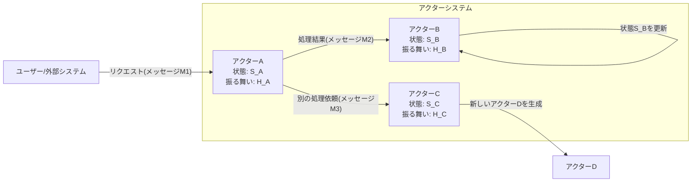
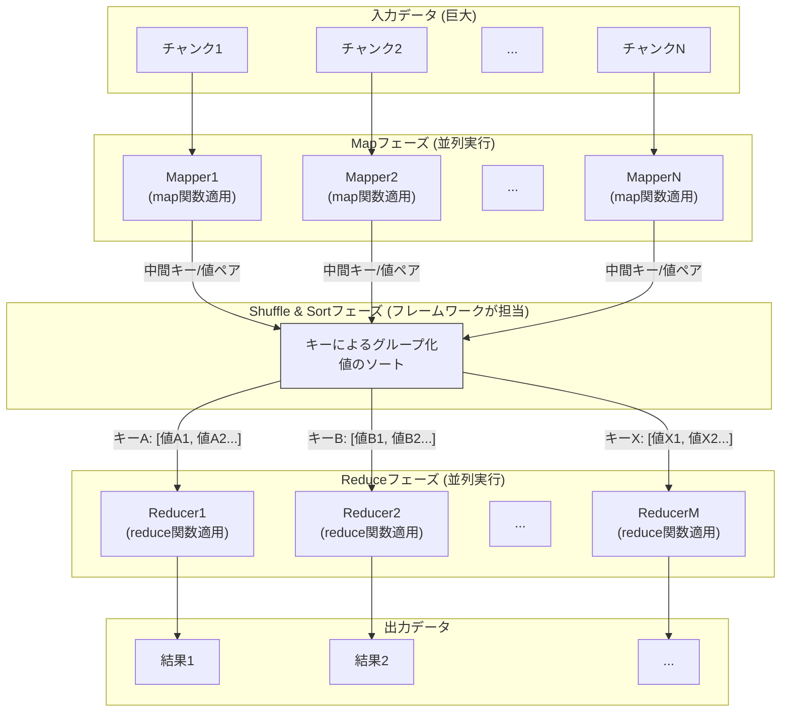
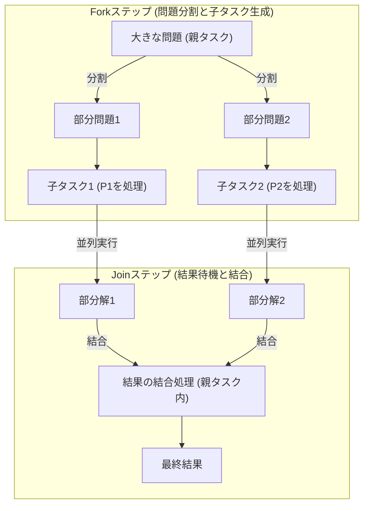

**目次**

- [並行処理設計 中級：高度なパターン、性能最適化、そして堅牢なシステムへ](#並行処理設計-中級高度なパターン性能最適化そして堅牢なシステムへ)
- [はじめに：初級編の復習と、さらなる課題への挑戦](#はじめに初級編の復習とさらなる課題への挑戦)
- [第 1 部：高度な並行処理モデルとパターン](#第-1-部高度な並行処理モデルとパターン)
  - [Actor モデルのより詳細な解説と適用例](#actor-モデルのより詳細な解説と適用例)
  - [CSP (Communicating Sequential Processes) の考え方と Go 言語の Goroutine/Channel](#csp-communicating-sequential-processes-の考え方と-go-言語の-goroutinechannel)
    - [CSP の基本的な考え方](#csp-の基本的な考え方)
    - [Go 言語の Goroutine と Channel](#go-言語の-goroutine-と-channel)
  - [並行データ構造（ロックフリーキュー、並行ハッシュマップなど、「排他制御 初級」のロックフリーの続き）](#並行データ構造ロックフリーキュー並行ハッシュマップなど排他制御-初級のロックフリーの続き)
  - [並列アルゴリズムのパターン（MapReduce, Fork/Join など）](#並列アルゴリズムのパターンmapreduce-forkjoin-など)
    - [MapReduce パターン：分散データ処理の強力なモデル](#mapreduce-パターン分散データ処理の強力なモデル)
    - [Fork/Join パターン：再帰的なタスク分割と結果統合](#forkjoin-パターン再帰的なタスク分割と結果統合)
- [第 2 部：非同期プログラミングパターン（深掘り）](#第-2-部非同期プログラミングパターン深掘り)
  - [Future/Promise の高度な合成とエラーハンドリング](#futurepromise-の高度な合成とエラーハンドリング)
    - [Promise チェーンのさらなる活用 (`.then()` / `.catch()` の高度なパターン)](#promise-チェーンのさらなる活用-then--catch-の高度なパターン)
    - [`Promise.allSettled()`：すべての結果を確実に取得する](#promiseallsettledすべての結果を確実に取得する)
    - [`Promise.any()`：最初に成功した結果だけを取得する](#promiseany最初に成功した結果だけを取得する)
    - [非同期処理のキャンセル戦略（AbortController の活用など）](#非同期処理のキャンセル戦略abortcontroller-の活用など)
    - [非同期処理の再試行（リトライ）ロジック](#非同期処理の再試行リトライロジック)
  - [リアクティブプログラミング / イベントストリーム処理の応用](#リアクティブプログラミング--イベントストリーム処理の応用)
    - [複雑な UI イベント処理の宣言的な記述](#複雑な-ui-イベント処理の宣言的な記述)
    - [リアルタイムデータ処理とストリームの集約・分析](#リアルタイムデータ処理とストリームの集約分析)
    - [アプリケーション状態管理への応用 (Redux/NgRx との親和性)](#アプリケーション状態管理への応用-reduxngrx-との親和性)
- [第 3 部：並行システムのパフォーマンス分析とチューニング](#第-3-部並行システムのパフォーマンス分析とチューニング)
  - [ボトルネックの特定（プロファイリングツールの活用）](#ボトルネックの特定プロファイリングツールの活用)
    - [プロファイリングツールとは？ 何を測定できるのか？](#プロファイリングツールとは-何を測定できるのか)
    - [代表的なプロファイリングツール（再訪）](#代表的なプロファイリングツール再訪)
    - [ボトルネック特定の手順とポイント](#ボトルネック特定の手順とポイント)
  - [スケーラビリティの評価（アムダールの法則、グスタフソンの法則）](#スケーラビリティの評価アムダールの法則グスタフソンの法則)
    - [アムダールの法則：逐次処理部分がボトルネックになる](#アムダールの法則逐次処理部分がボトルネックになる)
    - [グスタフソンの法則：問題サイズも一緒に大きくする](#グスタフソンの法則問題サイズも一緒に大きくする)
  - [キャッシュコヒーレンシと偽共有（False Sharing）の問題（マルチコア環境）](#キャッシュコヒーレンシと偽共有false-sharingの問題マルチコア環境)
  - [クリティカルセクションの最適化戦略（ロックの粒度、データコピー）](#クリティカルセクションの最適化戦略ロックの粒度データコピー)
    - [ロックの粒度 (Lock Granularity)：どこまで細かく保護するか？](#ロックの粒度-lock-granularityどこまで細かく保護するか)
    - [データコピーの活用：クリティカルセクションからの処理の追い出し](#データコピーの活用クリティカルセクションからの処理の追い出し)
  - [スピンロック：CPU を回して待つことの是非](#スピンロックcpu-を回して待つことの是非)
  - [ロックの公平性とスループットのバランス（再訪）](#ロックの公平性とスループットのバランス再訪)
- [第 4 部：並行システムの堅牢性設計と高度なテスト](#第-4-部並行システムの堅牢性設計と高度なテスト)
  - [タイムアウトとリトライ：応答しない処理への対処](#タイムアウトとリトライ応答しない処理への対処)
    - [タイムアウト処理の重要性と実装パターン](#タイムアウト処理の重要性と実装パターン)
    - [リトライ戦略：一時的な障害からの回復](#リトライ戦略一時的な障害からの回復)
  - [サーキットブレーカー：連鎖的障害を防ぐ保護パターン](#サーキットブレーカー連鎖的障害を防ぐ保護パターン)
  - [(補足)分散システムにおける合意形成の初歩（なぜ難しいのか）](#補足分散システムにおける合意形成の初歩なぜ難しいのか)
  - [並行処理バグのデバッグ戦略と高度なテスト技法](#並行処理バグのデバッグ戦略と高度なテスト技法)
    - [再現性の低いバグへの体系的アプローチ（再訪と深化）](#再現性の低いバグへの体系的アプローチ再訪と深化)
    - [静的解析と動的解析ツールの高度な活用（再訪と深化）](#静的解析と動的解析ツールの高度な活用再訪と深化)
    - [モデルベーステストと形式手法の導入（概要）](#モデルベーステストと形式手法の導入概要)
- [番外編：並行処理のための関数型データ構造とテクニック（再訪と発展）](#番外編並行処理のための関数型データ構造とテクニック再訪と発展)
  - [不変データ構造とスレッドセーフティ（設計原則としての再確認）](#不変データ構造とスレッドセーフティ設計原則としての再確認)
  - [ソフトウェアトランザクショナルメモリ (STM) のさらなる考察](#ソフトウェアトランザクショナルメモリ-stm-のさらなる考察)
  - [(発展) 関数型リアクティブプログラミング (FRP) と並行性の表現](#発展-関数型リアクティブプログラミング-frp-と並行性の表現)
- [おわりに：並行処理のエキスパートを目指して](#おわりに並行処理のエキスパートを目指して)

# 並行処理設計 中級：高度なパターン、性能最適化、そして堅牢なシステムへ

# はじめに：初級編の復習と、さらなる課題への挑戦

若手エンジニアの皆さん、「並行処理設計 初級」では、システムを複数のタスクに分割し、それらがメッセージキューやセマフォといった基本的な同期プリミティブを使って協調動作するための、基本的な設計原則とパターンについて学びましたね。プロデューサー/コンシューマーパターンやリーダー/ライターパターンといった「型」を知ることで、一般的な同期問題を解決するための見通しが立ったことと思います。

しかし、現代のソフトウェアシステムは、その規模と複雑さを増し続けており、

- **より多数の独立したコンポーネントが、より複雑な相互作用をする場合**
- **システムの性能（スループット、レイテンシ）に対する要求が非常に厳しい場合**
- **一部の障害がシステム全体に波及するのを防ぎ、高い耐障害性が求められる場合**
- **分散環境での協調動作が必要となる場合**

といった、初級編で扱ったテクニックだけでは対応が難しい、さらに高度な課題に直面することがあります。

この「並行処理設計 中級」では、これらのより困難な課題に立ち向かうために、

- **Actor モデル**や **CSP (Communicating Sequential Processes)** といった、共有メモリモデルとは異なる、より抽象度の高い**高度な並行処理モデル**。
- **ロックフリーデータ構造**のような、極限の性能と並行性を追求するためのテクニックの紹介。
- **非同期プログラミングパターン**のより深い活用。
- 並行システムの**パフォーマンス分析とチューニング**の勘所。
- そして、システムの**堅牢性と耐障害性**を高めるための設計戦略。

といった、より専門的で実践的なトピックを探求していきます。

目標は、皆さんが、より大規模で複雑、かつ高性能・高信頼性が求められる並行システムの設計と実装において、より洗練されたアプローチを選択し、適用できるようになることです。これまでの知識を土台として、並行処理のエキスパートへの道を目指し、さらにステップアップしていきましょう。

# 第 1 部：高度な並行処理モデルとパターン

初級編では、主にスレッド/タスクと、それらが共有メモリ（とロック）または基本的なメッセージキューを通じて協調するモデルを見てきました。この部では、これらの基本的なモデルを超えて、より大規模で複雑な並行性や分散性を扱うために考案された、より抽象度の高い、あるいは異なる思想に基づいた並行処理モデルと、それらに関連するパターンについて学んでいきます。

## Actor モデルのより詳細な解説と適用例

「関数型プログラミング：安全な並行・非同期処理の実践」の資料でもその基本的な考え方に触れましたが、**Actor モデル**は、並行・分散システムを構築するための非常に強力でエレガントなパラダイムです。ここでは、その特徴と利点を改めて整理し、どのような場合に適用を検討すべきか、そして設計上の考慮点について、もう少し詳しく見ていきましょう。

**Actor モデルの核心（再訪）:**

おさらいですが、Actor モデルはシステムを以下の要素からなるものとして捉えます。

- **アクター (Actor):** 状態（プライベートなデータ）と振る舞い（メッセージハンドラ）をカプセル化した、独立した計算単位。
- **メッセージパッシング (Message Passing):** アクター間の唯一の通信手段。非同期的であり、メッセージは不変（またはコピー）であることが推奨される。
- **メールボックス (Mailbox):** 各アクターが受信したメッセージを一時的に保持するキュー。アクターはメッセージを一つずつ取り出して処理する。
- **アドレス (Address):** 各アクターは一意なアドレスを持ち、他のアクターはこのアドレス宛にメッセージを送信する。
- **基本的な振る舞い:** メッセージを受信したアクターは、以下のいずれか（または複数）を行うことができます。
  1. 自身のプライベートな状態を変更する。
  2. 他の（あるいは自分自身の）アクターに有限個のメッセージを送信する。
  3. 有限個の新しいアクターを生成する。

**「状態を共有せず、メッセージを共有する」原則の徹底:**

Actor モデルの最も強力な点は、**共有メモリに起因する多くの並行処理の問題（データ競合、デッドロックなど）を、設計レベルで根本的に回避できる**可能性を秘めていることです。各アクターは自身の状態を完全に内に閉じ込め、外部とはメッセージという明確なインターフェースを通じてのみやり取りするため、低レベルなロック機構の必要性が大幅に減ります。



_図: Actor モデルにおけるアクター間のメッセージパッシングと状態管理のイメージ_

**Actor モデルの適用例とメリット:**

1. **高い並行性とスケーラビリティ:**

   - アクターは軽量なため、多数（数万～数百万）のアクターを一つのシステム内で効率的に実行できます。
   - 各アクターは独立してメッセージを処理できるため、マルチコア CPU 上での真の並列実行が容易です。
   - **位置透過性 (Location Transparency):** メッセージの送信先アクターが同じプロセス内にいるか、別のプロセス、あるいはネットワーク越しの別のマシン上にいるかを、送信側が意識する必要がないように設計できます。これにより、アプリケーションのロジックを変更することなく、アクターを物理的に分散させ、システムを水平にスケールさせることが容易になります。
   - **適用例:** 大量の同時接続を処理する Web サーバー、リアルタイムなメッセージングシステム、IoT プラットフォームのデバイス管理など。

2. **優れた耐障害性（フォールトトレランス）:**

   - 「関数型プログラミング：安全な並行・非同期処理の実践」でも触れた「**スーパービジョン階層 (Supervision Hierarchy)**」と「**Let it crash**」の哲学により、非常に堅牢なシステムを構築できます。
   - 親アクター（スーパーバイザー）が子アクターの障害を検知し、再起動、処理の代替、あるいはエラーのエスカレーションといった回復戦略を実行します。個々のアクターは複雑なエラー回復ロジックを持つ必要がなく、自身のビジネスロジックに集中できます。
   - **適用例:** 24 時間 365 日稼働が求められる通信システム、金融取引システム、ミッションクリティカルな制御システムの一部。

3. **ステートフルなサービスの自然なモデル化:**

   - ユーザーセッション、ゲームのプレイヤーキャラクター、IoT デバイス、あるいは特定のビジネスエンティティといった、「状態」を持つ多数の独立した「モノ」を、それぞれ個別の「アクター」として自然にモデル化できます。
   - 各アクターが自身の状態を管理するため、グローバルな状態管理の複雑さを軽減し、状態へのアクセス競合もアクターのメールボックス処理によって暗黙的に直列化されます。
   - **適用例:** オンラインゲームのサーバー、多数のユーザーの状態を個別に管理するチャットサーバー、個々のセンサーの状態を追跡する IoT システム。

4. **イベント駆動型アーキテクチャとの親和性:**
   - Actor モデルは本質的にメッセージ駆動（イベント駆動）です。外部からのイベント（リクエスト、センサーデータなど）をメッセージとしてアクターに送り、アクターがそれを処理して状態を更新し、必要なら他のアクターに新たなメッセージを送る、という流れは、イベント駆動型アーキテクチャの考え方と非常によく合致します。
   - **適用例:** 複雑なワークフローエンジン、リアルタイム分析システム。

**設計上の考慮点と課題:**

- **メッセージの設計:**
  アクター間でどのようなメッセージを交換するか、そのメッセージのフォーマット（不変性、シリアライズ可能かなど）やセマンティクス（コマンドかイベントか、応答を期待するかなど）を明確に設計する必要があります。
- **アクターの粒度:**
  個々のアクターにどれだけの状態とロジックを持たせるか、その「粒度」の設計は重要です。細かすぎるとメッセージングのオーバーヘッドが増え、大きすぎるとアクター内部が複雑になり並行性のメリットが薄れます。
- **メールボックスの管理とオーバーフロー:**
  アクターのメールボックスが有限の場合、メッセージが処理しきれずに溢れてしまう（オーバーフロー）可能性があり、その場合の対処（メッセージの破棄、送信側へのエラー通知、バックプレッシャーなど）を考慮する必要があります。
- **非同期性と順序の保証:**
  メッセージパッシングは非同期的であるため、メッセージが送信された順序と、受信側アクターがそれを処理する順序が必ずしも一致するとは限りません（とくに複数の送信者がいる場合や、ネットワークを経由する場合）。処理の順序性が重要な場合は、シーケンス番号を付与するなどのアプリケーションレベルでの工夫が必要になることがあります。
- **デッドロック（メッセージングパターンによる）:**
  共有メモリロックによるデッドロックは避けられますが、アクター同士が互いに相手からの特定のメッセージを待ち合ってしまうような「通信デッドロック」や、リソース（例: ワーカーアクターのプール）の枯渇による進行不能状態は依然として発生しえます。
- **テストの難しさ（分散時）:**
  個々のアクターのロジックはテストしやすいですが、多数のアクターが非同期に連携するシステム全体の振る舞いをテストし、デバッグするのは、従来のマルチスレッドプログラムと同様に（あるいはそれ以上に）難しい場合があります。アクターごとの詳細なログ記録や、メッセージの流れを追跡する仕組みが重要になります。
- **学習コストとエコシステム:**
  Actor モデルの考え方や、Akka や Orleans といったフレームワークの学習には、ある程度の時間と努力が必要です。また、利用可能なライブラリやツール、コミュニティの成熟度も、技術選択の際には考慮すべき点です。

**関数型プログラミングとの関係:**

Actor モデルは、それ自体が純粋な関数型プログラミングとは限りませんが（アクターは内部状態を変更できるため）、関数型プログラミングの原則と非常に高い親和性を持っています。

- **メッセージの不変性:** 送受信されるメッセージを不変オブジェクトとすることで、安全性が高まります。
- **アクターの振る舞いの純粋性（部分的）:** メッセージを受信して次の状態と送信すべきメッセージを決定するロジックは、純粋関数に近い形で記述できることが多いです。
- **副作用の隔離:** 各アクターが自身の状態をカプセル化し、外部への影響はメッセージ送信に限定されるため、副作用が管理しやすくなります。

Actor モデルは、共有メモリモデルの複雑さや危険性を回避しつつ、高い並行性、スケーラビリティ、そして耐障害性を実現するための、非常に洗練された強力な設計パラダイムです。とくに、多数の独立した「エージェント」が相互作用するような、本質的に分散的な性質を持つ問題に対して、その力を最大限に発揮するでしょう。

## CSP (Communicating Sequential Processes) の考え方と Go 言語の Goroutine/Channel

Actor モデルと並んで、メッセージパッシングに基づく並行処理のもう一つの重要な理論モデルが、「**CSP (Communicating Sequential Processes / 通信する逐次プロセス)**」です。CSP は、1970 年代後半に計算機科学者アントニー・ホーア（C.A.R. Hoare、クイックソートの考案者としても有名）によって提唱された、並行システムの動作を記述し、検証するための形式的な数学的理論（プロセス代数の一種）です。

CSP の理論自体は非常に学術的ですが、その中心的なアイデア、とくに「**独立したプロセス（実行単位）が、明確に定義された『チャネル (Channel)』を通じて同期的に（あるいはバッファリングを伴って非同期的に）メッセージを交換することで協調動作する**」という考え方は、いくつかのプログラミング言語やライブラリに大きな影響を与え、より安全で理解しやすい並行プログラミングの実現に貢献しています。

その中でも、とくに Go 言語（Golang）が提供する「**Goroutine (ゴルーチン)**」と「**Channel (チャネル)**」は、CSP の理念を現代的なプログラミング環境に巧みに取り入れた、非常に実践的で強力な並行処理メカニズムとして広く知られています。

### CSP の基本的な考え方

CSP の核心的な要素は以下の通りです。

1. **プロセス (Process):**
   独立して実行される逐次的な処理の単位です。プロセスは自身のローカルな状態を持ち、他のプロセスとは状態を共有しません。Go 言語における「Goroutine」が、この CSP のプロセスに近い概念と考えることができます。
2. **イベント (Event):**
   プロセスの振る舞いを特徴づける、観測可能なアクションの発生です。CSP では、プロセス間の「通信」そのものが重要なイベントとして扱われます。
3. **チャネル (Channel):**
   二つ（あるいはそれ以上）のプロセス間で、値を**同期的に（またはバッファを介して非同期的に）送受信するための、型付けされた「通信路」**です。
   - **送信 (Send):** あるプロセスがチャネルに対して値を送信しようとします。
   - **受信 (Receive):** 別のプロセスが同じチャネルから値を受信しようとします。
   - **同期:** もしチャネルがバッファを持たない（またはバッファが空/満杯の）場合、送信操作と受信操作は「**ランデブー (rendezvous)**」します。つまり、送信側は受信側が現れるまでブロックし、受信側も送信側が現れるまでブロックします。両者が揃った時点で初めて値の受け渡しが行われ、両方のプロセスが処理を再開します。これにより、プロセス間の処理のタイミングが「同期」されます。
4. **選択 (Choice / Select):**
   プロセスが、複数の異なるチャネルからの通信（入力または出力）のいずれか一つを、非決定的に（あるいは条件付きで）選択して実行できるようにするための仕組みです。これにより、複数のイベントソースからの入力を待ったり、複数の出力先にデータを送ったりする際の柔軟な制御が可能になります。Go 言語の `select` ステートメントがこれに相当します。

**「状態を共有するのではなく、通信によって状態を共有する」**

CSP の哲学は、しばしば「**Do not communicate by sharing memory; instead, share memory by communicating.（メモリを共有することで通信するな。代わりに、通信することでメモリを共有せよ）**」という言葉で表現されます（これは Go 言語の Effective Go でも引用されている有名なフレーズです）。

これは、Actor モデルと同様に、共有メモリへの直接的なアクセスとそれに伴うロックの複雑さを避け、代わりに明確な通信チャネルを通じて値を「渡す」ことで、データの所有権を移転させたり、安全に共有したりすることを推奨する考え方です。

### Go 言語の Goroutine と Channel

Go 言語は、CSP のアイデアを非常にうまく言語機能として取り込んでいます。

- **Goroutine (ゴルーチン):**

  - Go 言語における軽量な並行実行の単位です。OS のスレッドよりもはるかに軽量（小さなスタックサイズで起動できる）であり、一つの OS スレッド上で多数のゴルーチンを効率的に多重化して実行できます（M:N スケジューリング）。
  - 関数の呼び出しの前に `go` キーワードを付けるだけで、その関数を新しいゴルーチンとして非同期的に起動できます。
  - ```go
    // func say(s string) {
    //  for i := 0; i < 3; i++ {
    //      time.Sleep(100 * time.Millisecond)
    //      fmt.Println(s)
    //  }
    // }
    //
    // func main_goroutine_example() {
    //  go say("world") // 新しいゴルーチンで say("world") を実行
    //  say("hello")    // 現在のゴルーチンで say("hello") を実行
    //  // (終了待ちをしないと main が先に終わってしまう)
    //  // time.Sleep(1000 * time.Millisecond)
    // }
    ```

- **Channel (チャネル):**

  - ゴルーチン間で、特定の型の値を安全に送受信するための「通信路」です。チャネルは `make(chan 型)` のようにして作成します。
  - **送信:** `channelName <- value`
  - **受信:** `variable := <- channelName`
  - **バッファなしチャネル (Unbuffered Channel):**
    `make(chan int)` のようにバッファサイズを指定しない場合、送信側と受信側がランデブーするまで、どちらかがブロックします（同期的な通信）。
  - **バッファありチャネル (Buffered Channel):**
    `make(chan int, 10)` のようにバッファサイズを指定すると、そのサイズまでは送信側はブロックせずにメッセージをチャネルに送信でき、受信側はメッセージがなければブロックします（非同期的な通信）。バッファが満杯になると送信側もブロックします。
  - **チャネルは「型付け」されています。** `chan int` は整数を送受信するチャネル、`chan string` は文字列を送受信するチャネルです。
  - チャネルは、それ自体がスレッドセーフ（複数のゴルーチンから安全にアクセス可能）であるように実装されています。開発者は、チャネルへのアクセスに対して明示的なロックを行う必要はありません。

  ```go
  func sum(s []int, c chan int) {
    sum := 0
    for _, v := range s {
       sum += v
    }
    c <- sum // 計算結果をチャネル c に送信
  }

  func main_channel_example() {
    s := []int{7, 2, 8, -9, 4, 0}
    c := make(chan int) // int 型の値を送受信するチャネルを作成

    go sum(s[:len(s)/2], c) // 配列の前半を計算するゴルーチン
    go sum(s[len(s)/2:], c) // 配列の後半を計算するゴルーチン

    x, y := <-c, <-c // チャネル c から2つの値を受信 (ブロックする)

    fmt.Println(x, y, x+y) // 結果: (例) -5 17 12  または 17 -5 12 (順序は不定)
  }
  ```

- **`select` ステートメント:**

  - 複数のチャネル操作（送信または受信）を同時に監視し、そのうちのいずれか一つが準備できた（ブロックせずに実行できる）場合に、対応するケースを実行します。もし複数のケースが同時に準備できた場合は、ランダムに一つが選択されます。
  - `default` ケースを指定すると、どのチャネル操作も準備できていない場合に実行され、`select` 全体がブロックするのを防ぎます。
  - タイムアウト処理や、複数のイベントソースからの入力を公平に扱う、といった制御に非常に役立ちます。

  ```go
  func main_select_example() {
    tick := time.Tick(100 * time.Millisecond)   // 100ms ごとに値を送信するチャネル
    boom := time.After(500 * time.Millisecond)  // 500ms 後に値を送信するチャネル
    for {
       select {
       case <-tick:
           fmt.Println("tick.")
       case <-boom:
           fmt.Println("BOOM!")
           return
       default: // どのチャネルも準備できていない場合
           fmt.Println("    .")
           time.Sleep(50 * time.Millisecond)
       }
    }
  }
  ```

**CSP / Go モデルのメリット:**

1. **競合状態の回避:**
   メモリを直接共有せず、チャネルを通じてデータの所有権を移転させる（あるいはコピーを渡す）ことで、共有メモリモデルにおけるデータ競合のリスクを大幅に低減します。「チャネルが同期プリミティブである」と考えることができます。
2. **シンプルな同期:**
   バッファなしチャネルによるランデブー同期は、複雑なロックや条件変数を使わずに、プロセス間の処理のタイミングを合わせるための直感的で強力な手段となります。
3. **デッドロックの可能性の低減（ただし注意は必要）:**
   チャネル操作が主な同期手段となるため、複数のロックを複雑に獲得し合うことによるデッドロックは発生しにくいです。しかし、ゴルーチン同士が互いに相手からのチャネル受信を待ち合ってしまうような「通信デッドロック」は依然として発生しうるため、設計には注意が必要です。
4. **高い表現力:**
   `select` ステートメントを使うことで、複数の非同期イベントを扱う複雑な制御フローを、比較的シンプルかつ安全に記述できます。
5. **軽量なゴルーチン:**
   ゴルーチンの起動コストが非常に低いため、多数の並行処理を気軽に生成できます。

**Actor モデルとの比較（簡単なイメージ）:**

- **状態の持ち方:**
  - Actor: 各アクターが自身の状態をカプセル化して持つ。
  - CSP/Go: プロセス（ゴルーチン）もローカル状態を持てるが、チャネルを通じて渡されるデータ（メッセージ）の所有権の移動という側面が強い。状態は、チャネルを通じて特定のゴルーチンに「閉じ込められる」ことで安全に扱われることが多い（例: 状態を管理する専用のゴルーチンを作り、すべての状態変更要求をチャネル経由でそのゴルーチンに送る）。
- **通信:**
  - Actor: 非同期メッセージパッシング（メールボックス）。送信先はアクターのアドレス。
  - CSP/Go: チャネルを通じた値の送受信。送信先はチャネル。同期/非同期はチャネルのバッファサイズで決まる。
- **抽象化のレベル:**
  - Actor モデルは、より「オブジェクト」や「エージェント」に近い、高レベルな抽象化を提供する傾向がある（とくに Akka のようなフレームワーク）。
  - CSP/Go は、より低レベルな「プロセス」と「通信路」というプリミティブを提供するが、これらを組み合わせて多様な並行パターンを構築できる。

CSP とそれを具現化した Go 言語のゴルーチン/チャネルは、共有メモリとロックに依存しない、もう一つの強力な並行処理の設計パラダイムです。そのシンプルさと安全性から、ネットワークプログラミングや分散システム、あるいは OS 内部の並行処理など、多くの分野で効果的に活用されています。

関数型プログラミングの原則（とくに不変なメッセージのやり取り）と組み合わせることで、CSP ベースのシステムもまた、その堅牢性と理解しやすさをさらに高めることができるでしょう。

## 並行データ構造（ロックフリーキュー、並行ハッシュマップなど、「排他制御 初級」のロックフリーの続き）

これまでに見てきた Actor モデルや CSP (Go のゴルーチン/チャネル) といった高レベルな並行処理モデルは、共有メモリへの直接的なアクセスや低レベルなロック操作の複雑さを隠蔽し、開発者がより安全に並行プログラムを構築するのを助けてくれます。これらのモデルの内部では、メッセージキューやチャネルといった、効率的でスレッドセーフな「**並行データ構造 (Concurrent Data Structures)**」が重要な役割を果たしています。

また、「排他制御 初級」では、ロックを一切使わずに共有データへの安全なアクセスを目指す「**ロックフリー (Lock-Free)**」や「**ウェイトフリー (Wait-Free)**」といったアルゴリズムの概念に触れました。これらのアルゴリズムは、まさに高性能な並行データ構造を実装するための核心技術です。

このセクションでは、これらの並行データ構造、とくにロックフリーなアプローチが、なぜ高性能な並行システムにおいて重要視されるのか、そしてその設計における主なアイデアと課題について、改めて概観します。

**なぜロックベースでは限界があるのか？（再訪）**

従来のロックベースのデータ構造（例: ミューテックスで保護された標準的なキューやハッシュマップ）は、実装が比較的容易で、正しく使えば安全性も保証できます。しかし、多数のスレッドが高頻度にアクセスするような高競合状態においては、以下のような性能上の限界や問題点が顕在化します。

- **ロック競合によるスループット低下:** ロックの獲得待ちでスレッドが頻繁にブロックされ、CPU コアが遊休状態になったり、コンテキストスイッチのオーバーヘッドが増大したりして、システム全体のスループットが頭打ちになります。
- **優先度逆転とコンボイ現象:** 低優先度スレッドがロックを保持していると、高優先度スレッドが待たされ、さらにその間に中優先度スレッドが実行される（優先度逆転）。あるいは、ロックの解放を待つスレッドが長蛇の列を作り、一度解放されてもすぐに次のスレッドがロックを獲得するため、全体としてなかなか処理が進まない（コンボイ現象）。
- **デッドロックのリスク:** 複数のロックを扱う場合、依然としてデッドロックのリスクが伴います。
- **割り込みコンテキストからの利用不可:** ISR のような、ブロッキングが許されないコンテキストからは、ロックベースのデータ構造は原則として安全に利用できません。

**ロックフリーデータ構造の目指すもの**

ロックフリーデータ構造は、これらのロックベースの課題を克服し、

- **より高い並行性とスケーラビリティ:** 複数のスレッドが、可能な限り互いにブロックし合うことなく、データ構造に対して同時に操作を行えるようにする。
- **デッドロックからの解放:** ロックを使わないため、ロック起因のデッドロックは原理的に発生しない。
- **（理想的には）ブロッキングの排除:** スレッドが他のスレッドの遅延や障害の影響を受けにくくする（とくにウェイトフリーの場合）。

ことを目指します。その実現の鍵となるのが、CPU が提供する**アトミック操作 (Atomic Operations)**、とくに **CAS (Compare-And-Swap)** や **LL/SC (Load-Linked/Store-Conditional)** といった強力なプリミティブです。

**代表的なロックフリーデータ構造のアイデア（「排他制御 初級」の復習と発展）**

- **ロックフリーキュー (例: Michael-Scott Queue):**
  - `Head` と `Tail` ポインタをアトミックに更新することで、エンキューとデキュー操作の並行性を高めます。
  - エンキューは主に `Tail` 側で、デキューは主に `Head` 側で行われるため、両操作がある程度独立して進められます。
  - ABA 問題や安全なメモリ解放（とくに非 GC 環境）が大きな課題となります。
- **ロックフリースタック (例: Treiber Stack):**
  - スタックの `Top` ポインタを CAS でアトミックに更新することで、プッシュとポップ操作を実現します。
  - 比較的シンプルなロックフリー構造ですが、やはり ABA 問題への対処が必要です。
- **並行ハッシュマップ (Concurrent Hash Map):**
  - Java の `java.util.concurrent.ConcurrentHashMap` は、ロックフリー技術の優れた応用例の一つです（完全なロックフリーではありませんが、非常に高い並行性を実現しています）。
  - ロックストライピング（複数のロックでハッシュバケットを分割統治）を基本としつつ、特定の操作（要素数のカウントなど）や、ノードの更新の一部に CAS などのアトミック操作を巧みに組み合わせています。
  - テーブルのリサイズ処理は、依然として非常に複雑な同期制御を伴います。

**ロックフリー設計の難しさと、その価値**

「排他制御 初級」でも強調したように、正しいロックフリーデータ構造やアルゴリズムを設計・実装することは、**極めて高度な専門知識と細心の注意を要求される、非常に困難な作業**です。

- あらゆるスレッドの実行順序（インターリーブ）を考慮し、データの一貫性が常に保たれることを保証しなければなりません。
- ABA 問題、メモリの可視性、命令のリオーダリング、安全なメモリ再利用といった、低レベルで微妙な問題を正確に理解し、対処する必要があります。
- テストやデバッグも、再現性の低さから非常に困難です。

そのため、**アプリケーション開発者が、日常的に独自のロックフリーデータ構造を一から実装することは、ほとんどの場合推奨されません。**

**では、なぜこのトピックを学ぶのか？**

1. **既存の高性能ライブラリの理解:**
   私たちが利用する多くの OS カーネル、データベースシステム、高性能な並行ライブラリやフレームワークの内部では、これらのロックフリー（あるいはそれに近い）テクニックが実際に使われています。その基本的なアイデアを知っておくことは、これらのライブラリがなぜ高いパフォーマンスを発揮できるのか、その背景を理解する助けになります。
2. **並行処理の限界と可能性の認識:**
   ロックベースの排他制御が持つ限界と、それを超えようとするロックフリーというアプローチの存在を知ることで、並行処理の設計における選択肢やトレードオフに対するより深い洞察が得られます。
3. **アトミック操作の重要性の再認識:**
   CAS のようなアトミック操作が、いかに並行プログラミングの基本的な構成要素であるかを再認識できます。
4. **将来の技術への備え:**
   プロセッサのコア数が増え続ける中で、より高いスケーラビリティを持つ並行処理技術への要求はますます高まっています。ロックフリー技術は、その一つの重要な方向性です。

**現実的なアプローチ**

実用的な並行システムの設計においては、

- まずは、**言語や実績のあるライブラリが提供する、十分にテストされたスレッドセーフな並行データ構造**（例: Java の `java.util.concurrent` パッケージ、C++ の Boost.Lockfree や Intel TBB の一部、Go のチャネルなど）を積極的に活用することを第一に考えます。
- これらの既存の解決策で性能要件を満たせない、あるいは特定の非常にクリティカルな部分でロックのオーバーヘッドが許容できない、といった**限定的な状況**においてのみ、より専門的なロックフリーテクニックの導入（あるいは専門家の助けを借りた実装）を検討します。
- 多くの場合、**アプリケーションレベルでの設計の工夫**（タスク分割の最適化、共有状態の最小化、不変データの活用、メッセージパッシングの導入など）によって、ロック競合を減らし、システム全体のパフォーマンスを向上させる方が、低レベルなロックフリー実装に挑むよりも現実的で効果的なことが多いです。

並行データ構造、とくにロックフリーなアプローチは、並行処理の性能とスケーラビリティを追求する上でのフロンティアの一つです。その複雑さと難易度を理解しつつも、その基本的なアイデアに触れておくことは、皆さんの並行処理設計に関する視野を広げ、より深いレベルでの問題解決能力を養う上で、きっと役立つでしょう。

## 並列アルゴリズムのパターン（MapReduce, Fork/Join など）

マルチコア CPU が当たり前となった現代において、計算集約的なタスクの処理時間を短縮するためには、「**並列アルゴリズム (Parallel Algorithms)**」の考え方を取り入れ、複数の CPU コアを効果的に活用することが不可欠です。

並列アルゴリズムとは、**一つの大きな問題を、同時に（並列に）処理できる複数の小さな部分問題に分割し、それらを別々のプロセッサコア（あるいは計算ノード）に割り当てて実行し、最後にそれらの結果を統合して元の問題の解を得る**、という計算の手順や方法のことです。

これまでに学んできた並行処理のモデル（共有メモリ、メッセージパッシング）や、同期プリミティブ、並行データ構造といった要素は、すべてこの並列アルゴリズムを効率的かつ安全に実装するための「道具立て」と考えることができます。

ここでは、広く知られている代表的な並列アルゴリズムの「パターン（型）」をいくつか紹介し、それらがどのような考え方に基づいているのか、その概要を見ていきましょう。

### MapReduce パターン：分散データ処理の強力なモデル

「**MapReduce (マップリデュース)**」は、もともと Google によって、超大規模なデータセット（数テラバイト～ペタバイト級）に対する分散バッチ処理を効率的に行うために考案されたプログラミングモデルおよびその実装フレームワークです。そのシンプルさと強力さから、Hadoop といったオープンソース実装を通じて広まり、ビッグデータ処理の分野でデファクトスタンダードの一つとなりました。

関数型プログラミングの `map` 関数と `reduce` 関数の考え方を、大規模な分散環境に拡張したものと捉えることができます。

**MapReduce の基本的な処理フロー:**

1. **入力分割 (Input Split):**
   まず、処理対象の巨大な入力データセットを、独立して処理可能な小さな「チャンク（塊）」に分割します。
2. **Map フェーズ (Map Phase):**
   - 分割された各チャンクは、多数の「**Mapper（マッパー）**」タスクに並列に割り当てられます。
   - 各 Mapper は、担当するチャンク内の各データ項目に対して、ユーザーが定義した「**`map` 関数**」を適用します。
   - `map` 関数は、入力データ項目を受け取り、それを処理して、0 個以上の「**中間的なキー/値ペア (Intermediate Key/Value Pair)**」を生成（出力）します。
   - **イメージ:** 大量のアンケート用紙（入力データ）を、複数の担当者（Mapper）に配り、各担当者がアンケートの特定の項目（例: 年齢と性別）を抜き出して、集計しやすい形（例: 「30 代男性、1 票」）の付箋（中間キー/値ペア）に書き出す作業。
3. **シャッフル＆ソートフェーズ (Shuffle & Sort Phase):**
   - Map フェーズで生成されたすべての中間キー/値ペアは、**キーの値に基づいてグループ化（シャッフル）**され、同じキーを持つペアが同じ場所に集められます。
   - そして、各キーグループ内で、値が（必要であれば）ソートされます。
   - このフェーズは、通常 MapReduce フレームワークが自動的に行います。
   - **イメージ:** 各担当者が書き出した付箋を、まずキー（例: 「30 代男性」）ごとに集め、同じキーの付箋を一つの束にする作業。
4. **Reduce フェーズ (Reduce Phase):**
   - シャッフル＆ソートされた中間キー/値ペアのグループ（つまり、同じキーを持つ値のリスト）は、多数の「**Reducer（リデューサー）**」タスクに並列に割り当てられます。
   - 各 Reducer は、担当するキーと、そのキーに対応する値のリストに対して、ユーザーが定義した「**`reduce` 関数**」を適用します。
   - `reduce` 関数は、キーと値のリストを受け取り、それらを集約・計算して、0 個以上の「**最終的な出力キー/値ペア**」を生成します。
   - **イメージ:** 各キー（例: 「30 代男性」）の付箋の束（値のリスト）を受け取った別の担当者（Reducer）が、その束の中の票の数を合計して、「30 代男性、合計 XX 票」という最終結果を出す作業。
5. **出力 (Output):**
   Reduce フェーズで生成された最終的な出力キー/値ペアが、結果としてファイルシステムなどに書き出されます。



_図: MapReduce パターンの基本的な処理フロー_

**MapReduce のメリット:**

- **高いスケーラビリティと耐障害性:**
  Map 処理と Reduce 処理は、それぞれ多数の独立したタスクとして、多数のマシン（計算ノード）に分散して並列実行できます。一部のマシンが故障しても、フレームワークが自動的にそのタスクを別のマシンで再実行することで、処理全体を継続できます。
- **プログラミングモデルの単純さ:**
  開発者は、基本的に `map` 関数と `reduce` 関数のロジックを定義するだけで済み、分散処理、データの分割・転送、タスクのスケジューリング、耐障害性といった複雑な詳細は、MapReduce フレームワークが隠蔽してくれます。
- **多様な問題への適用可能性:**
  単語数のカウント、逆引きインデックスの作成、ログ解析、グラフ処理、機械学習アルゴリズムなど、一見異なる多くの種類のバッチ処理問題を、この MapReduce の枠組みで表現できます。

MapReduce は、関数型プログラミングの `map` と `reduce` という基本的なアイデアを、分散コンピューティングという壮大なスケールで実現した、非常に影響力のあるパターンと言えるでしょう。

### Fork/Join パターン：再帰的なタスク分割と結果統合

「**Fork/Join (フォーク/ジョイン) パターン**」は、主に共有メモリ型のマルチコアプロセッサ環境で、**再帰的に問題を小さな部分問題に分割（Fork）し、それらを並列に解き、最後にそれらの結果を結合（Join）して元の問題の解を得る**という、古典的な「**分割統治法 (Divide and Conquer)**」を並列化したアルゴリズムパターンです。

**Fork/Join の基本的な処理フロー:**

1. **問題の分割 (Fork):**
   現在のタスクは、処理すべき問題が「十分に小さい（もはや並列化するメリットがない、あるいは直接解ける）」かどうかを判断します。
   - もし問題が十分に小さければ、その問題を直接（逐次的に）解きます。
   - もし問題がまだ大きければ、その問題を複数の（通常は 2 つ以上の）独立して解ける「部分問題」に分割します。
     そして、分割した各部分問題を処理するための**新しい子タスクを生成（Fork）**し、それらを並列に実行開始させます（あるいは、スレッドプールに投入します）。
2. **結果の待機と結合 (Join):**
   親タスクは、自身が Fork したすべての子タスクの処理が完了するのを**待機（Join）**します。
   すべての子タスクが完了し、それぞれが部分問題の解を返してきたら、親タスクはそれらの部分的な解を**結合（マージ）**して、元の問題の解を構築します。
3. **再帰的な適用:**
   Fork された各子タスクもまた、同様に自身の問題をさらに分割（Fork）し、その結果を結合（Join）する、という処理を再帰的に繰り返します。

この再帰的な分割と結合は、問題が十分に小さな単位になるまで続き、最終的に全体の解がボトムアップ的に組み上げられていきます。



_図: Fork/Join パターンの基本的な流れ（1 段階の分割・結合の例）_

**Fork/Join パターンの実装支援 (フレームワーク):**

多くのプログラミング言語やライブラリは、この Fork/Join パターンを効率的に実装するためのフレームワークを提供しています。

- **Java の Fork/Join Framework (`java.util.concurrent.ForkJoinPool`, `RecursiveTask`, `RecursiveAction`):**
  Java 7 で導入された、Fork/Join パターンを実装するための高レベルなフレームワークです。開発者は、問題を再帰的に分割・解決するロジックを `RecursiveTask`（結果を返す場合）や `RecursiveAction`（結果を返さない場合）のサブクラスとして定義し、それを `ForkJoinPool`（専用のスレッドプール）で実行します。`ForkJoinPool` は、「**ワークスティーリング (Work Stealing)**」という巧妙なスケジューリングアルゴリズムを採用しており、手の空いたスレッドが他のスレッドの処理待ちキューからタスクを「盗んで」実行することで、CPU コアの利用効率を高め、負荷を均等化しようとします。
- **C++ の Intel Threading Building Blocks (TBB) や OpenMP:**
  TBB の `parallel_invoke`, `parallel_for`, `parallel_reduce` や、OpenMP の `#pragma omp task` といった機能も、Fork/Join に類する再帰的なタスク並列性を実現するのに役立ちます。

**Fork/Join パターンのメリットと適用分野:**

- **マルチコア性能の引き出し:** 再帰的な分割によって多数の独立したタスクを生成できるため、マルチコア CPU の各コアに処理を効果的に割り当て、並列度を高めることができます。
- **分割統治アルゴリズムとの自然な親和性:** マージソート、クイックソート、行列乗算（ストラッセンのアルゴリズムなど）、探索問題（例: 木の探索）、数値積分といった、分割統治法に基づいて設計される多くのアルゴリズムを、自然な形で並列化できます。
- **負荷分散（ワークスティーリングによる）:** Java の ForkJoinPool のような優れた実装では、ワークスティーリングによって、個々のタスクの処理時間にばらつきがあっても、CPU コアを遊ばせにくくし、全体の処理効率を高めることができます。

**Fork/Join パターンの注意点:**

- **分割のオーバーヘッド:** 問題を分割し、新しいタスクを生成・管理する処理自体にもオーバーヘッドがあります。問題をあまりにも細かく分割しすぎると、このオーバーヘッドが実際の計算時間を上回ってしまう可能性があります。適切な「十分に小さい」の閾値（逐次処理に切り替える基準）を設定することが重要です。
- **結果の結合コスト:** 分割された部分問題の解を結合する処理が複雑だったり、時間がかかったりする場合、そこが新たなボトルネックになる可能性があります。
- **データの局所性:** 共有メモリモデルで実装されることが多いため、複数のタスクが同じデータ領域にアクセスする際のキャッシュコヒーレンシや偽共有（False Sharing）といった問題が、パフォーマンスに影響を与える可能性があります。
- **スタック消費（深い再帰の場合）:** 再帰の階層が非常に深くなると、各タスクの呼び出しスタックがメモリを圧迫する可能性があります。

MapReduce と Fork/Join は、どちらも大きな問題を小さな部分に分割して並列に処理するという点で共通していますが、MapReduce が主にキー/値ペアのデータフローと分散環境でのバッチ処理に焦点を当てているのに対し、Fork/Join は主に共有メモリ型のマルチコア環境で、再帰的なアルゴリズムを効率的に並列化することに焦点を当てています。

これらの並列アルゴリズムパターンを理解することは、計算集約的な処理の性能を向上させるための、強力な武器を手にすることを意味します。関数型プログラミングの考え方（とくに、処理を純粋関数として定義し、データを不変に扱うこと）は、これらのパターンをより安全かつシンプルに実装する上で、非常に相性が良いと言えるでしょう。

# 第 2 部：非同期プログラミングパターン（深掘り）

「関数型プログラミング：安全な並行・非同期処理の実践」の資料では、Future/Promise やイベントストリームといった、非同期処理を扱うための基本的な抽象化について学びました。これらの抽象化は、コールバック地獄を避け、非同期コードをより構造化され、宣言的な形で記述するのに役立ちます。

この部では、これらの非同期プログラミングのテクニックをさらに一歩進め、より複雑な非同期ワークフローをどのように構築・管理していくか、エラーハンドリングをどのように洗練させていくか、そしてパフォーマンスやリソース管理といった実践的な側面について、より深く掘り下げていきます。

## Future/Promise の高度な合成とエラーハンドリング

Future/Promise（以下、主に Promise と表記）は、単一の非同期操作の結果を表現する基本的なビルディングブロックです。しかし、実際のアプリケーションでは、複数の非同期操作を特定の順序で実行したり、並行して実行してそれらの結果を組み合わせたり、あるいは複雑な条件に基づいて処理フローを分岐させたり、といった、より高度な「合成」が必要になる場面が多くあります。

また、非同期処理においては、エラーハンドリングも重要な課題です。どの処理でエラーが発生し、それが後続の処理にどのように影響し、最終的にユーザーやシステムにどのようにフィードバックされるべきか、その戦略を明確に設計する必要があります。

### Promise チェーンのさらなる活用 (`.then()` / `.catch()` の高度なパターン)

基本的な `.then(onFulfilled, onRejected)` や `.catch(onRejected)` の使い方に加え、これらをより効果的に組み合わせることで、複雑な非同期フローを制御できます。

- **エラーからの回復 (Recovery):**
  `.catch()` ブロック内で、エラーを捕捉した後、単にエラーをログに出力するだけでなく、**デフォルト値を返す**か、あるいは**代替の Promise を返す**ことで、エラー状態から「回復」し、後続の `.then()` の成功パスに処理を繋げることができます。

  ```javascript
  fetchPrimaryData() // Promise を返す
    .catch((error) => {
      console.warn(
        "プライマリデータの取得に失敗。フォールバックを試みます:",
        error.message
      );
      return fetchFallbackData(); // 代替の非同期処理 (Promise) を返す
    })
    .then((data) => {
      // data はプライマリデータ、またはフォールバックデータ
      processData(data);
    })
    .catch((finalError) => {
      // プライマリもフォールバックも失敗した場合の最終エラー処理
      showErrorMessage("データの取得に完全に失敗しました。");
    });
  ```

- **条件付きチェーン:**
  `.then()` の中で、前の Promise の結果に基づいて、次に実行する Promise を条件分岐で選択することができます。

  ```javascript
  checkUserPermission(userId) // Promise<boolean> を返す
    .then((hasPermission) => {
      if (hasPermission) {
        return performSensitiveOperation(userId); // Promise を返す
      } else {
        return Promise.reject(new Error("権限がありません")); // 失敗した Promise を返す
        // あるいは Promise.resolve(defaultNonSensitiveData); なども可能
      }
    })
    .then((result) => {
      /* センシティブな操作の結果処理 */
    })
    .catch((error) => {
      /* 権限エラーなどの処理 */
    });
  ```

- **`.finally()` の確実な実行:**
  Promise が成功しようと失敗しようと、必ず最後に実行したいクリーンアップ処理（例: ローディングインジケータの非表示、リソースの解放）は、`.finally()` ブロックに記述することで保証されます。`.finally()` は、Promise の解決値を変更せず、そのまま後続に伝播します。

### `Promise.allSettled()`：すべての結果を確実に取得する

「関数型プログラミング：安全な並行・非同期処理の実践」で学んだ `Promise.all()` は、与えられたすべての Promise が成功した場合にのみ成功となり、一つでも失敗すると全体がその最初のエラーで失敗するという振る舞いでした。

しかし、複数の独立した非同期処理を実行し、**それぞれの処理が成功したか失敗したかに関わらず、すべての結果（またはエラー）を個別に知りたい**という場合があります。このような場合に役立つのが、「`Promise.allSettled()`」です (ES2020 で標準化)。

- **動作:**
  Promise の配列を受け取り、**すべての Promise が解決（成功または失敗のいずれか）されるまで**待ちます。
  返される新しい Promise は、常に成功 (Fulfilled) し、その結果として、各入力 Promise の結果を表すオブジェクトの配列を返します。各結果オブジェクトは、以下のいずれかの形を持ちます。
  - `{ status: 'fulfilled', value: <成功した値> }`
  - `{ status: 'rejected', reason: <失敗した理由(エラー)> }`
- **用途:**
  - 複数の独立した API 呼び出しの結果をまとめて表示したいが、一部が失敗しても他の成功した結果は利用したい場合。
  - 複数のリソースの初期化処理を並行して行い、それぞれの成否を個別に記録したい場合。

```javascript
const p1 = Promise.resolve(3);
const p2 = new Promise((resolve, reject) => setTimeout(reject, 100, "foo"));
const p3 = Promise.reject("bar"); // すぐに失敗

Promise.allSettled([p1, p2, p3]).then((results) => {
  // results は以下のようになる:
  // [
  //   { status: 'fulfilled', value: 3 },
  //   { status: 'rejected', reason: 'foo' }, (100ms後)
  //   { status: 'rejected', reason: 'bar' }
  // ]
  results.forEach((result) => {
    if (result.status === "fulfilled") {
      console.log(`成功: ${result.value}`);
    } else {
      console.error(`失敗: ${result.reason}`);
    }
  });
});
```

### `Promise.any()`：最初に成功した結果だけを取得する

`Promise.race()` は、複数の Promise の中で最初に「解決（成功または失敗）」したものの結果を採用しました。これに対し、「`Promise.any()`」 (ES2021 で標準化) は、**複数の Promise の中で、最初に「成功 (Fulfilled)」したものの結果だけを採用**します。

- **動作:**
  Promise の配列を受け取ります。
  - いずれか一つの Promise が成功したら、`Promise.any()` はその最初の成功した値で成功した Promise を返します。他の Promise の結果は無視されます。
  - もし、**与えられたすべての Promise が失敗 (Rejected) した場合にのみ**、`Promise.any()` は `AggregateError` という特殊なエラーオブジェクト（すべての個別のエラー理由を含む）で失敗した Promise を返します。
- **用途:**
  - 複数のエンドポイントから同じリソースを取得しようとし、最も速く応答したものを利用したい場合（ただし、失敗は許容する）。
  - 複数の異なる方法で処理を試み、最初に成功したアプローチの結果を採用したい場合。

```javascript
const pErr = new Promise((resolve, reject) => {
  reject("常に失敗");
});
const pSlow = new Promise((resolve) => {
  setTimeout(resolve, 500, "遅いけど成功");
});
const pFast = new Promise((resolve) => {
  setTimeout(resolve, 100, "速い成功");
});

Promise.any([pErr, pSlow, pFast])
  .then((firstSuccess) => {
    console.log("最初に成功した結果:", firstSuccess); // 出力: 最初に成功した結果: 速い成功
  })
  .catch((aggregateError) => {
    // この例では呼ばれない
    console.error("すべて失敗:", aggregateError.errors);
  });

Promise.any([pErr, Promise.reject("もう一つ失敗")])
  .then((value) => {
    /* 呼ばれない */
  })
  .catch((err) => {
    console.error("すべて失敗した場合:", err.errors); // 出力: ["常に失敗", "もう一つ失敗"]
  });
```

### 非同期処理のキャンセル戦略（AbortController の活用など）

「関数型プログラミング：安全な並行・非同期処理の実践」でも触れましたが、Promise 自体には標準的なキャンセル機構がありません。しかし、とくに Web API の `fetch` を使う場合など、現代の JavaScript 環境では「**`AbortController`**」と「**`AbortSignal`**」という仕組みを使って、Promise ベースの非同期処理（とくに `fetch` リクエスト）を外部から中断（アボート）させることが可能です。

- **`AbortController`:** `signal` プロパティ（`AbortSignal` オブジェクト）と `abort()` メソッドを持ちます。
- **`AbortSignal`:** 非同期操作に「この操作は中断される可能性がある」というシグナルを渡すために使います。`fetch` のオプションに `signal` として渡すことができます。
- **`controller.abort()`:** このメソッドを呼び出すと、関連付けられた `AbortSignal` が「中断要求」を発し、そのシグナルを受け取った非同期操作（例: `fetch`）は処理を中断し、Promise を特定のエラー（`AbortError`）で reject します。

```javascript
const controller = new AbortController();
const signal = controller.signal;

const fetchDataWithAbort = fetch("/api/long-running-data", { signal })
  .then((response) => response.json())
  .then((data) => console.log("データ受信:", data))
  .catch((err) => {
    if (err.name === "AbortError") {
      console.log("Fetch aborted!");
    } else {
      console.error("Fetch error:", err);
    }
  });

// 500ms 後にリクエストを中断する
setTimeout(() => {
  console.log("中断シグナルを送信します...");
  controller.abort();
}, 500);
```

この `AbortController` のパターンは、Promise ベースの非同期処理に、ある種の「キャンセル可能性」をもたらすための標準的な方法となりつつあります。FRP ライブラリのストリーム（Observable）も、購読解除 (`unsubscribe`) という形でキャンセル機構を提供していますが、Promise を直接扱う際には `AbortController` の利用を検討すると良いでしょう。

### 非同期処理の再試行（リトライ）ロジック

ネットワークエラーなど、一時的な問題で失敗した非同期処理を、**自動的に再試行（リトライ）**させたいという要求もよくあります。Promise を使ってリトライロジックを実装するには、一般的に以下のようなパターンが考えられます。

1. 非同期処理を実行する関数を定義します。
2. その関数を呼び出し、`.catch()` でエラーを捕捉します。
3. もしリトライ回数が上限に達していなければ、一定時間待機した後（指数バックオフなどが望ましい）、再度その関数を呼び出します（再帰的な Promise チェーン）。
4. リトライ回数上限に達したら、最終的なエラーとして処理します。

```javascript
function fetchWithRetry(
  url,
  maxRetries = 3,
  currentAttempt = 1,
  delayMs = 1000
) {
  return fetch(url) // Promise を返す非同期処理
    .then((response) => {
      if (!response.ok) {
        throw new Error(`HTTP error! status: ${response.status}`);
      }
      return response.json();
    })
    .catch((error) => {
      console.error(
        `試行 ${currentAttempt}/${maxRetries} でエラー: ${error.message}`
      );
      if (currentAttempt < maxRetries) {
        console.log(`${delayMs}ms 後にリトライします...`);
        return new Promise((resolve) => setTimeout(resolve, delayMs)) // 遅延
          .then(() =>
            fetchWithRetry(url, maxRetries, currentAttempt + 1, delayMs * 2)
          ); // 再帰呼び出し
      } else {
        console.error("最大リトライ回数に達しました。");
        throw error; // 最終的なエラーをスロー
      }
    });
}

fetchWithRetry("/api/sometimes-fails-data")
  .then((data) => console.log("最終的に成功:", data))
  .catch((err) => console.error("最終的な失敗:", err.message));
```

この種のリトライロジックは、より洗練された形で多くの Promise ユーティリティライブラリや、FRP ライブラリの演算子（例: RxJS の `retry`, `retryWhen`）として提供されています。

Promise/Future は、単発の非同期処理を扱うための基本ですが、これらの高度な合成パターンやエラーハンドリング戦略、そしてキャンセルやリトライといった周辺のテクニックを理解し、組み合わせることで、より複雑で堅牢な非同期アプリケーションを構築するための強力な基盤となるのです。

## リアクティブプログラミング / イベントストリーム処理の応用

「関数型プログラミング：イベントストリームとリアクティブ処理入門」では、時間とともに流れる非同期的なイベントやデータを「Observable（イベントストリーム）」として捉え、それらを強力な「演算子」で変換・合成していく、関数型リアクティブプログラミング (FRP) の基本的な考え方を学びました。

Promise/Future が主に「単発の」非同期処理の結果を扱うのに対し、FRP のイベントストリームは、「**連続的、あるいは断続的に発生する可能性のある、複数の非同期イベント**」を扱うのに非常に適しています。

このセクションでは、FRP の考え方やテクニックが、実際のアプリケーション開発におけるより複雑な課題、とくにユーザーインターフェース (UI) のインタラクションや、リアルタイムなデータ処理、状態管理といった場面で、どのように応用できるのか、その可能性を探ります。

### 複雑な UI イベント処理の宣言的な記述

現代の UI は、ユーザーの多様な操作（クリック、マウス移動、キー入力、スクロール、タッチジェスチャーなど）にリアルタイムに応答し、インタラクティブな体験を提供することが求められます。これらの多数の非同期イベントを、従来のコールバックベースで個別に管理しようとすると、コードはすぐに複雑化し、状態管理も煩雑になりがちです。

FRP は、これらの UI イベントをすべて「ストリーム」として捉え、それらを演算子で組み合わせることで、複雑なインタラクションロジックを非常に宣言的かつエレガントに記述することを可能にします。

- **イベントのフィルタリングと変換:**
  - `fromEvent(button, 'click').pipe(map(event => event.clientX))` : クリックイベントのストリームを、クリックされた X 座標のストリームに変換する。
  - `fromEvent(inputField, 'keyup').pipe(filter(event => event.key === 'Enter'))` : キー入力ストリームから、Enter キーが押されたイベントだけをフィルタリングする。
- **時間ベースの制御:**
  - `fromEvent(inputField, 'input').pipe(debounceTime(300), distinctUntilChanged(), switchMap(term => searchApi(term)))` : 検索ボックスへの入力が 300ms 落ち着き、かつ値が変化した場合にのみ、検索 API を呼び出す（`switchMap` で古い検索リクエストはキャンセル）。これはオートコンプリート機能の典型的な実装パターンです。
  - `fromEvent(dragHandle, 'mousedown').pipe(switchMap(() => fromEvent(document, 'mousemove').pipe(takeUntil(fromEvent(document, 'mouseup')))))` : ドラッグ＆ドロップ操作を、マウスの mousedown, mousemove, mouseup イベントストリームの合成として表現する。
- **複数のイベントソースの合成:**
  - `merge(buttonAClick$, buttonBClick$).pipe(scan((count, _) => count + 1, 0))` : ボタン A またはボタン B のいずれかがクリックされたら、クリック総数をカウントアップする。
  - `combineLatest(colorPickerValue$, sizePickerValue$).subscribe(([color, size]) => updateProductPreview(color, size))` : カラーピッカーの値とサイズピッカーの値のストリームを監視し、どちらかが変わるたびに、両方の最新値を使って商品プレビューを更新する。

このように、FRP の演算子を駆使することで、従来は複雑な状態変数やフラグ、多数のコールバック関数を使って実現していた UI ロジックを、見通しの良い「データの流れ（ストリームのパイプライン）」として記述できるようになります。

### リアルタイムデータ処理とストリームの集約・分析

センサーデータ、株価情報、ソーシャルメディアのフィード、ログデータといった、リアルタイムに大量に発生し続けるデータストリームを処理し、そこから意味のある情報を抽出したり、特定のパターンを検知したりする際にも、FRP のアプローチは非常に有効です。

- **ウィンドウ処理と集約:**
  - `sensorDataStream$.pipe(bufferTime(5000), map(chunk => calculateAverage(chunk)))` : センサーデータのストリームを 5 秒間の「ウィンドウ」に区切り、各ウィンドウ内のデータの平均値を計算して発行する。
  - `tradeStream$.pipe(window(interval(60000)), mergeMap(window$ => window$.pipe(reduce((acc, trade) => acc + trade.volume, 0))))` : 取引ストリームを 1 分間のウィンドウに分け、各ウィンドウ内の総取引量を計算する。
- **パターン検出:**
  - 複数のイベントストリームを `zip` や `combineLatest` で組み合わせ、特定の条件（例: 温度が閾値を超え、かつ湿度が一定以下）が満たされた場合にアラートを発行するストリームを生成する。
  - `sequenceEqual` のような演算子（もしライブラリにあれば）や、`bufferCount` と `filter` を組み合わせて、特定のイベントシーケンス（例: 「上、上、下、下、左、右、左、右、B、A」のようなコマンド入力）を検出する。
- **バックプレッシャーの考慮:**
  「関数型プログラミング：安全な並行・非同期処理の実践」の「バックプレッシャー」セクションで学んだように、高速なデータストリームを処理する際には、消費側の処理能力を超えないように、`throttleTime`, `debounceTime`, `buffer` などの演算子や、Reactive Streams 仕様に基づいたメカニズムで、データの流れを適切に制御することがシステムの安定稼働には不可欠です。

### アプリケーション状態管理への応用 (Redux/NgRx との親和性)

多くのモダンなフロントエンドアプリケーションでは、アプリケーション全体の状態を一元的に管理するためのパターン（例: Redux, NgRx, Vuex, Zustand）が採用されています。これらの状態管理ライブラリの多くは、実は FRP の考え方と非常に親和性が高い、あるいは FRP ライブラリ（とくに RxJS）を内部で活用したり、連携したりすることが可能です。

- **アクションはストリーム:** ユーザー操作や API 応答などによって発行される「アクション（状態変更の意図）」を、イベントストリームとして捉えることができます。
- **リデューサ/副作用処理のストリーム変換:**
  - アクションストリームに対して `scan` 演算子を適用することで、状態を累積的に更新していくリデューサのロジックを表現できます（`newState = reducer(currentState, action)`）。
  - アクションストリームを `filter` で特定の種類のアクションに絞り込み、`mergeMap` や `switchMap` を使って副作用（API 呼び出しなど）を実行し、その結果として新しいアクションを発行する、といった非同期処理のフロー（Redux-Observable や NgRx Effects のような仕組み）も、FRP のパイプラインとしてエレガントに記述できます。
- **状態の変更通知もストリーム:** アプリケーションの状態（ストア）の変更そのものも、Observable として公開し、UI コンポーネントがそれを購読して自身の表示をリアクティブに更新する、というデータバインディングが実現できます。

FRP を状態管理に取り入れることで、

- 非同期的なアクションや副作用の処理フローが明確になる。
- 状態変更のロジックが、テストしやすい純粋関数的な変換として記述しやすくなる。
- 複雑な状態間の依存関係や、状態更新のシーケンスを、宣言的なストリームの合成として扱える。

といったメリットが期待できます。

リアクティブプログラミングとイベントストリームの考え方は、単に UI イベントを扱うためだけのものではありません。それは、時間とともに変化するあらゆる種類のデータやイベントの流れを、統一的かつ宣言的な方法でモデル化し、操作するための、非常に強力で汎用的なパラダイムなのです。

このアプローチに慣れるには少し時間が必要かもしれませんが、一度その表現力と柔軟性を理解すれば、これまで複雑で扱いにくいと感じていた多くの非同期処理やイベント駆動型の問題を、よりシンプルで、より堅牢な形で解決できる新しい道が開けるでしょう。

# 第 3 部：並行システムのパフォーマンス分析とチューニング

並行処理や非同期処理を導入する大きな動機の一つは、システムの**パフォーマンス（応答性やスループット）を向上させる**ことです。しかし、ただ闇雲にスレッドやタスクを増やしたり、非同期処理を導入したりするだけでは、期待したほどの効果が得られないばかりか、かえってロック競合やリソースの浪費によって性能が悪化してしまうことさえあります。

効果的なパフォーマンス改善のためには、まず「**システムのどこが遅いのか？」「何が原因で処理が滞っているのか？**」といった**ボトルネック**を正確に特定し、それに対して的確な対策を講じる必要があります。

この部では、並行システムのパフォーマンスをどのように分析し、ボトルネックを特定するのか、そして特定された問題に対してどのようなチューニング（最適化）のアプローチが考えられるのか、その基本的な考え方とテクニックについて学んでいきます。

## ボトルネックの特定（プロファイリングツールの活用）

「測定なくして最適化なし」という格言は、並行システムのパフォーマンスチューニングにおいても、まさに金科玉条です。勘や憶測に基づいて最適化を行っても、的外れな箇所に時間を浪費し、効果が得られないばかりか、コードを不必要に複雑にしてしまうことになりかねません。

パフォーマンス改善の最初のステップは、**プロファイリングツールを使って、アプリケーションの実際の実行時の振る舞いを詳細に測定・分析し、性能上のボトルネックとなっている箇所を客観的なデータに基づいて特定する**ことです。

### プロファイリングツールとは？ 何を測定できるのか？

プロファイリングツールは、アプリケーションの実行中に、以下のような様々なパフォーマンス関連情報を収集し、開発者が分析しやすい形で提示してくれる専門のツールです。

- **CPU プロファイリング:**
  - **メソッド/関数の実行時間:** どのメソッドや関数が最も多くの CPU 時間を消費しているか。
  - **ホットスポット分析:** プログラムの中で、とくに実行頻度が高い、あるいは実行に時間がかかっている「ホットな」コード箇所を特定します。
  - **呼び出しツリー/コールグラフ:** 関数間の呼び出し関係と、それぞれのパスで費やされた時間を表示し、処理の流れの中でどこに時間がかかっているかを追跡できます。
- **メモリプロファイリング:**
  - **オブジェクトの割り当て:** どのオブジェクトが、どのくらいの頻度で、どのくらいの量のメモリを割り当てているか。
  - **ガベージコレクション (GC) の影響:** GC がどのくらいの頻度で発生し、どれだけの時間アプリケーションを停止させているか（Stop-the-World）。
  - **メモリリークの検出:** 不要になったオブジェクトが解放されずにメモリを圧迫していないか。
- **スレッド/タスクプロファイリング（並行処理において特に重要）:**
  - **スレッド/タスクの状態遷移:** 各スレッド/タスクが、実行中、実行可能（待機中）、ブロック（ロック待ち、I/O 待ちなど）、スリープといった状態間でどのように遷移しているか、その時間的推移。
  - **ロック競合の分析:**
    - どのロック（ミューテックス、セマフォなど）で、どの程度の頻度で競合が発生しているか。
    - 各ロックの平均/最大待ち時間。
    - どのスレッドがどのロックを保持し、どのスレッドがそれを待っているか。
      （これは「排他制御 初級」の「ロック競合の測定と分析」でも触れましたね。）
  - **コンテキストスイッチの頻度:** OS がスレッド/タスクを切り替えるコンテキストスイッチが、どのくらいの頻度で発生しているか。頻繁すぎるコンテキストスイッチはオーバーヘッドとなります。
  - **CPU コアごとの使用率:** マルチコア環境で、各 CPU コアがどの程度均等に利用されているか。特定のコアに負荷が集中していないか。
- **I/O プロファイリング:**
  - ディスク I/O やネットワーク I/O の処理時間、スループット、待ち時間など。

### 代表的なプロファイリングツール（再訪）

「排他制御 初級」でもいくつか名前を挙げましたが、主要なプログラミング言語やプラットフォームには、それぞれ強力なプロファイリングツールが提供されています。

- **Java:** JDK Mission Control (JMC) と Java Flight Recorder (JFR) (JDK 標準)、VisualVM、YourKit, JProfiler (商用)
- **C# / .NET:** Visual Studio Diagnostic Tools (CPU Usage, Memory Usage, Performance Profiler), PerfView, dotTrace (JetBrains, 商用)
- **C/C++:** Linux なら `perf`, `gprof`, `Valgrind (Callgrind, Cachegrind)`, Windows なら Visual Studio Profiler, Intel VTune Profiler (商用)
- **Python:** cProfile (標準), profile (標準), Py-Spy, Scalene
- **JavaScript (Node.js):** Node.js 内蔵プロファイラ (`--prof` オプション), Chrome DevTools (Node.js インスペクタ経由)
- **JavaScript (ブラウザ):** 各ブラウザの開発者ツール (Performance タブ、Memory タブ)
- **RTOS 固有のトレース/プロファイリングツール:** 多くの RTOS ベンダーが、タスクの実行状況、割り込み、同期プリミティブの動作などを詳細に可視化・分析するツールを提供しています。

### ボトルネック特定の手順とポイント

1. **明確な性能目標の設定:**
   まず、「何をもって性能が良い（あるいは悪い）とするのか」という具体的な目標値や許容範囲（例: 平均応答時間 0.5 秒以内、秒間 1000 リクエスト処理、CPU 使用率 70% 以下など）を明確にします。目標がなければ、どこまで改善すればよいのか判断できません。
2. **代表的なユースケース/負荷シナリオの選定:**
   アプリケーションの典型的な使われ方や、性能が問題となりそうな負荷の高いシナリオを選んで、プロファイリングの対象とします。
3. **プロファイリングの実施:**
   選定したシナリオでアプリケーションを実際に動作させ、プロファイリングツールを使ってデータを収集します。できるだけ本番環境に近い、あるいは再現性の高い環境で測定することが望ましいです。
4. **データの分析とボトルネックの特定:**
   収集されたプロファイリングデータ（CPU 時間、ロック競合、メモリ割り当てなど）を詳細に分析し、アプリケーション全体のパフォーマンスを最も大きく制限している箇所（**ボトルネック**）を特定します。
   - **80/20 の法則（パレートの法則）を意識する:** 多くの場合、プログラム全体の実行時間のごく一部（例: 20% のコード）が、実行時間の大部分（例: 80%）を消費しています。この「ホットスポット」を見つけ出すことが重要です。
   - **ロック競合に注目:** 並行システムでは、ロック競合が最も一般的なパフォーマンスボトルネックの一つです。どのロックが最も待たれているか、そのロックの保持時間はどのくらいか、などを重点的に確認します。
   - **I/O 待ちの特定:** CPU 使用率が低いにもかかわらず応答が遅い場合は、ディスク I/O やネットワーク I/O での待ち時間がボトルネックになっている可能性が高いです。
5. **仮説の設定と検証:**
   ボトルネックの箇所が特定できたら、「なぜそこが遅いのか？」という原因に関する仮説を立て、それを検証するための追加調査や、小規模な実験を行います。

**やってはいけないこと：「勘」による最適化**

プロファイリングを行わずに、「たぶんここが遅いだろう」という勘や憶測だけでコードの最適化（とくに複雑な書き換え）を行うのは、**絶対に避けるべき**です。それは、

- 的外れな箇所を修正してしまい、効果がないばかりか、時間を浪費する。
- コードを不必要に複雑化し、可読性や保守性を損なう。
- 新たなバグを混入させてしまう。

といったリスクを伴います。必ず、**測定データに基づいて、客観的にボトルネックを特定してから**、具体的な改善策を検討するようにしましょう。

ボトルネックの特定は、並行システムのパフォーマンスチューニングにおける最も重要な最初のステップです。プロファイリングツールという「聴診器」を使いこなし、システムの「健康状態」を正確に診断する能力を身につけることが、効率的な性能改善への道を開くのです。

## スケーラビリティの評価（アムダールの法則、グスタフソンの法則）

並行処理や並列処理を導入する大きな目的の一つは、システムの「**スケーラビリティ (Scalability)**」を高めることです。スケーラビリティとは、システムへの負荷（データ量、ユーザー数、リクエスト数など）が増加したり、あるいは利用可能な計算リソース（CPU コア数、マシン数など）が増加したりした場合に、システムが**どの程度うまく性能（スループットや応答時間）を向上（あるいは維持）できるか**という能力を指します。

とくにマルチコア CPU 環境においては、「CPU コア数を増やせば、処理速度もそれに比例して速くなるはずだ」と期待しがちです。しかし、現実はそう単純ではありません。プログラムの並列化には限界があり、その限界を理論的に説明する法則として、「**アムダールの法則 (Amdahl's Law)**」と「**グスタフソンの法則 (Gustafson's Law)**」が知られています。

これらの法則を理解することは、並列化による性能向上の期待値を現実的に見積もり、どこに並列化の努力を集中すべきか、あるいは並列化の限界はどこにあるのか、といった点を考察する上で非常に重要です。

### アムダールの法則：逐次処理部分がボトルネックになる

**アムダールの法則**は、プログラムの一部分を並列化した場合に、プログラム全体の実行時間がどの程度短縮されるか（つまり、高速化率がどの程度になるか）の上限を示す法則です。

この法則の核心的なメッセージは、「**プログラムの中に、どうしても並列化できない逐次処理の部分が残っている限り、いくらプロセッサ（CPU コア）の数を増やしても、全体の高速化には限界がある**」というものです。

**法則の考え方:**

プログラム全体の実行時間のうち、

- **P:** 並列化可能な部分の割合（0 ≤ P ≤ 1）
- **S:** 並列化できない逐次処理部分の割合（S = 1 - P）

とします。そして、N 個のプロセッサを使って並列化可能な部分を N 倍に高速化できたと仮定します。（これは理想的な状況で、実際には通信オーバーヘッドなどで N 倍にはなりません。）

このとき、プログラム全体の高速化率 (Speedup) は、以下の式で与えられます。

`Speedup = 1 / (S + P/N)`
または `Speedup = 1 / ((1 - P) + P/N)`

**アムダールの法則が示す重要なこと:**

- **逐次部分 S の影響:**
  この式の分母を見ると、`S` (逐次処理部分の割合) が残っています。つまり、たとえ N（プロセッサ数）を無限に大きくしても、高速化率は `1/S` を超えることはできません。
  - たとえば、プログラムの 90% (P=0.9) が並列化可能で、残りの 10% (S=0.1) がどうしても逐次処理しなければならない場合、CPU コア数をどれだけ増やしても、高速化は最大で `1 / 0.1 = 10` 倍にしかなりません。
  - もし逐次処理部分が 50% (S=0.5) もあれば、高速化は最大でも 2 倍です。
- **ボトルネックの特定と改善の重要性:**
  アムダールの法則は、並列化による性能向上を目指す際には、**まずプログラム全体のどこが逐次処理のボトルネックになっているのかを特定し、その逐次部分 (S) の割合をできるだけ小さくする努力が最も重要である**ことを教えてくれます。並列化可能な部分 (P) をいくら効率的に並列化しても、S が大きければ効果は限定的です。
  排他制御のためのロック区間（ミューテックスで保護されたクリティカルセクションなど）は、まさにこの「並列化できない逐次処理部分」の典型例です。ロック競合が激しく、クリティカルセクションの実行時間が長いほど、S の割合が大きくなり、システム全体のスケーラビリティが低下します。

```mermaid
xychart-beta
    title "アムダールの法則による高速化率 (P: 並列化可能部分の割合)"
    x-axis "プロセッサ数 (N)" [1, 2, 4, 8, 16, 32, 64, 128, "∞"]
    y-axis "最大高速化率"
    bar [1.0, 1.0, 1.0, 1.0, 1.0, 1.0, 1.0, 1.0, 1.0]
    line "P = 0%" [1.0, 1.0, 1.0, 1.0, 1.0, 1.0, 1.0, 1.0, 1.0]
    line "P = 50%" [1.0, 1.33, 1.6, 1.78, 1.88, 1.94, 1.97, 1.98, 2.0]
    line "P = 90%" [1.0, 1.82, 3.08, 4.71, 6.96, 8.65, 9.48, 9.85, 10.0]
    line "P = 99%" [1.0, 1.98, 3.88, 7.44, 13.91, 24.43, 39.26, 56.39, 100.0]
    bar [1.0, 2.0, 4.0, 8.0, 16.0, 32.0, 64.0, 128.0, 0]
    line "P = 100% (理想)" [1.0, 2.0, 4.0, 8.0, 16.0, 32.0, 64.0, 128.0, 0]
```



_図: アムダールの法則のイメージ。逐次部分 S (S=1-P) があると、プロセッサ数を増やしても高速化には限界がある。_

### グスタフソンの法則：問題サイズも一緒に大きくする

アムダールの法則は、ある固定された問題サイズに対して、並列化によってどれだけ実行時間を短縮できるか、という視点（**固定問題サイズスケーリング / Strong Scaling**）でした。

しかし、多くの場合、プロセッサの数が増えると、私たちはより大きな問題を解きたくなったり、より精度の高い計算をしたくなったりします。つまり、**計算リソースの増加に合わせて、扱う問題のサイズも大きくする**という状況です。

「**グスタフソンの法則 (Gustafson's Law / Gustafson-Barsis's Law)**」は、このような「**並列処理時間（または総実行時間）を固定したまま、プロセッサ数を増やした場合に、どれだけ大きな問題を解けるようになるか（あるいは、どれだけ多くの仕事をこなせるようになるか）**」という視点（**固定時間スケーリング / Weak Scaling**）で、並列化の効果を評価する法則です。

**法則の考え方:**

- **S:** プログラムの実行時間のうち、逐次処理にかかる部分（これはプロセッサ数 N によらず一定と仮定）。
- **P:** プログラムの実行時間のうち、1 つのプロセッサで実行した場合に並列処理にかかる部分。
- N 個のプロセッサを使うと、この並列処理部分 P は N 倍の仕事量を同じ時間でこなせると仮定します。

このとき、N 個のプロセッサを使った場合の高速化率 (Scaled Speedup) は、

`Scaled Speedup = S + P * N` (これは 1 プロセッサで同じ時間内にこなせる仕事量との比較)
ではなく、より正確には、
1 プロセッサで逐次実行した場合の総実行時間を `Ts = S + P` とし、
N プロセッサで並列実行した場合の総実行時間を `Tn = S + P/N` ではなく、
**N プロセッサで、逐次部分 S はそのまま、並列部分が P\*N の仕事量をこなすと考えたときの、スケーリングされた問題サイズでの高速化**を考えます。

グスタフソンの法則は、より一般的に、
逐次実行部分の割合を `s`（小文字の s）とすると、
N プロセッサでの高速化 `Speedup(N)` は、

`Speedup(N) = s + (1 - s) * N = N - (N - 1) * s`

と表現されます。ここで重要なのは、`s` は**並列化後のプログラムにおける逐次部分の割合**であり、これは問題サイズが大きくなると相対的に小さくなる可能性がある、という点です。

**グスタフソンの法則が示す重要なこと:**

- **問題サイズのスケーリング:**
  もし、プロセッサ数を増やすのに合わせて、プログラムが処理する問題のサイズ（とくに並列化可能な部分の計算量）も大きくできるのであれば、逐次処理部分の割合 `s` が相対的に小さくなり、高速化率はほぼプロセッサ数 N に比例して向上する可能性があります。
  - たとえば、画像処理で、解像度を上げたり（ピクセル数が増える）、処理する画像の枚数を増やしたりする場合、計算量は増えますが、その多くは並列化可能な部分です。この場合、コア数を増やせば、より大きな画像やより多くの画像を、ほぼ同じ時間で処理できるようになるかもしれません。
- **逐次部分の絶対時間の重要性:**
  グスタフソンの法則においても、逐次処理部分の**絶対的な実行時間**が依然として全体の実行時間に影響します。問題サイズを大きくしても、この逐次部分の実行時間が支配的であれば、やはりスケーラビリティは頭打ちになります。

**アムダール vs グスタフソン：どちらの視点か？**

- **アムダールの法則:** 「**同じ問題**を、より多くの CPU コアで、**より速く**解きたい」という場合に、その限界を示します。応答時間（レイテンシ）の改善が主な関心事です。
- **グスタフソンの法則:** 「**同じ時間内**に、より多くの CPU コアで、**より大きな問題**を解きたい（あるいは、より多くの仕事をこなしたい）」という場合に、その可能性を示します。処理能力（スループット）の向上が主な関心事です。

どちらの法則も、並列プログラミングにおける性能評価の重要な視点を提供してくれます。

**並行システム設計への示唆:**

これらの法則から、並行システムの設計者は以下のことを学ぶべきです。

1.  **逐次処理部分の最小化:**
    どのようなスケーリングを目指すにしても、並列化できない逐次処理部分（ロック区間、同期オーバーヘッド、シーケンシャルな I/O など）を特定し、それを最小限に抑える努力が最も重要です。
2.  **問題分割の粒度:**
    問題をどのように小さなタスクに分割し、それらをどのように CPU コアに割り当てるか（タスクの粒度、負荷分散）が、並列化効率に大きく影響します。
3.  **通信と同期のオーバーヘッド:**
    アムダールの法則もグスタフソンの法則も、理想的な状況（並列化部分は完全に N 倍速になる）を仮定していますが、現実にはタスク間の通信や同期にはオーバーヘッドが伴います。このオーバーヘッドも、スケーラビリティを制限する要因となります。
4.  **測定の重要性:**
    これらの法則は理論的なモデルです。実際のシステムの性能やスケーラビリティは、プロファイリングツールを使って**実測**し、ボトルネックを特定し、改善していく必要があります。

スケーラビリティは、並行システムの重要な品質特性の一つです。アムダールの法則とグスタフソンの法則は、その達成の可能性と限界を理解するための、基本的な思考の枠組みを与えてくれるのです。

## キャッシュコヒーレンシと偽共有（False Sharing）の問題（マルチコア環境）

マルチコア CPU 環境で高いパフォーマンスを発揮する並行プログラムを書くためには、単に処理を複数のコアに分割するだけでなく、CPU の「**キャッシュメモリ (Cache Memory)**」の振る舞いを理解し、それが並行性に与える影響を考慮することが非常に重要になります。とくに、「**キャッシュコヒーレンシ (Cache Coherency)**」と、それに起因する「**偽共有 (False Sharing)**」という問題は、見過ごすと予期せぬパフォーマンス低下を招く可能性があります。

（このトピックは非常に低レベルでハードウェアに近い話になりますが、高性能な並行処理を目指す上では避けて通れない概念です。ここではその概要と考え方を紹介します。）

**キャッシュメモリの基本:**

- CPU は、メインメモリ（RAM）へのアクセスよりもはるかに高速にアクセスできる、小容量の「キャッシュメモリ」を内蔵（または近傍に配置）しています。
- CPU がメモリからデータを読み書きする際には、まずキャッシュに必要なデータがあるかを確認し、あればキャッシュから高速にアクセスします（キャッシュヒット）。なければメインメモリから読み込み、それをキャッシュにもコピーしておきます（キャッシュミス）。
- キャッシュは、通常「**キャッシュライン (Cache Line)**」という固定サイズのブロック（例: 64 バイト、128 バイト）単位でデータを管理します。つまり、メモリからデータを読み込む際や、キャッシュに書き戻す際には、このキャッシュライン単位でデータが移動します。

**キャッシュコヒーレンシ (Cache Coherency / キャッシュ一貫性):**

マルチコア CPU 環境では、**各 CPU コアがそれぞれ独自のキャッシュ（L1 キャッシュ、L2 キャッシュなど）を持っています**。ここで問題となるのが、複数のコアが同じメモリ領域のデータをそれぞれのキャッシュにコピーして持っている場合に、あるコアがそのデータを更新したときに、他のコアのキャッシュにある古いデータとの間で**一貫性をどのように保つか**、という点です。

この一貫性を保つためのハードウェア的なメカニズムが「**キャッシュコヒーレンシプロトコル**」（例: MESI プロトコル）です。このプロトコルは、

- あるコアが共有データを書き換えた場合、他のコアが持つそのデータのキャッシュコピーを「無効 (Invalidate)」にする。
- あるいは、更新された値を他のコアのキャッシュにも「伝播 (Update / Propagate)」する。

といった動作を通じて、すべてのコアが最終的には同じ最新のデータを見られるように保証します。

**キャッシュコヒーレンシがパフォーマンスに与える影響:**

このキャッシュコヒーレンシプロトコル自体は、データの整合性を保つために不可欠ですが、その動作にはオーバーヘッドが伴います。

- あるコアがキャッシュラインを更新すると、そのキャッシュラインを共有していた他のコアのキャッシュは無効化され、次にそのデータにアクセスしようとするとキャッシュミスが発生し、メインメモリ（あるいは共有キャッシュ）からの読み込み直しが必要になります。これは遅延を引き起こします。
- 複数のコアが同じキャッシュラインに対して頻繁に書き込みを行おうとすると、キャッシュラインの所有権の奪い合いや、頻繁な無効化/更新通知が発生し（**キャッシュピンポン / Cache Ping-Ponging**）、バスの帯域を消費し、パフォーマンスが著しく低下することがあります。これは、実質的に共有データへのアクセスが逐次化されているのと同じような状況を生み出します。

**偽共有 (False Sharing):**

キャッシュコヒーレンシに関連して、とくに厄介なのが「**偽共有 (False Sharing)**」という問題です。

- **偽共有とは:**
  複数のスレッドが、**論理的には全く異なる、独立したデータ**を操作しているにもかかわらず、それらのデータが**たまたま同じキャッシュライン上に配置されてしまっている**ために、あたかも共有データを更新しているかのようにキャッシュコヒーレンシプロトコルが働き、互いのキャッシュを無効化し合ってしまう現象です。
- **なぜ問題か:**
  - スレッド A が変数 X を更新し、スレッド B が変数 Y を更新しているとします。X と Y はプログラム上は無関係です。しかし、もし X と Y が同じキャッシュラインに乗っていた場合、スレッド A が X を更新すると、そのキャッシュライン全体が変更されたとみなされ、スレッド B のキャッシュにある Y を含むキャッシュラインも無効化されてしまいます。次にスレッド B が Y にアクセスしようとするとキャッシュミスが発生します。逆もまた同様です。
  - これにより、実際にはデータ競合がないにもかかわらず、キャッシュレベルでの不必要な競合とパフォーマンス低下が発生します。
- **発生しやすいケース:**
  - 構造体やクラスの複数の小さなフィールドが、異なるスレッドから頻繁に更新される場合。
  - 配列の隣接する要素が、異なるスレッドに割り当てられて更新される場合。

```mermaid
graph LR
    subgraph CPUコア1
        Cache1["L1キャッシュ (コア1)"]
    end
    subgraph CPUコア2
        Cache2["L1キャッシュ (コア2)"]
    end
    Memory["メインメモリ"]

    subgraph "キャッシュライン (例: 64バイト)"
        X["変数X<br>(スレッドAが更新)"]
        Y["変数Y<br>(スレッドBが更新)"]
        Z["変数Z<br>(未使用など)"]
    end
    subgraph "別のキャッシュライン"
        W["変数W"]
    end


    Cache1 -- "X, Y, Z を含むラインをロード" --> Memory
    Cache2 -- "X, Y, Z を含むラインをロード" --> Memory
    ThreadA["スレッドA"] -- "Xを更新" --> Cache1
    Cache1 -- "Xの更新によりラインが無効化される<br>(コヒーレンシプロトコル)" --> Cache2
    ThreadB["スレッドB"] -- "Yをアクセスしようとすると<br>キャッシュミス発生" --> Cache2


    note right of ThreadA
      スレッドAはXのみを更新。
      スレッドBはYのみを更新。
      XとYは論理的には独立。
      しかし、同じキャッシュラインに
      乗っているため、偽共有が発生。
    end
```

_図: 偽共有 (False Sharing) の概念図。論理的に独立な変数 X と Y が同じキャッシュラインにあると、一方の更新が他方のキャッシュを無効化する。_

**偽共有への対策:**

- **パディング (Padding):**
  異なるスレッドからアクセスされる可能性のあるデータ（構造体のフィールドや配列の要素）の間に、意図的に未使用のデータ（パディング）を挿入し、それらが別々のキャッシュラインに配置されるようにします。

  ```c
  // // 偽共有の可能性のある構造体
  // struct PotentiallyFalseShared {
  //     volatile int counter_thread_a; // スレッドAが更新
  //     volatile int counter_thread_b; // スレッドBが更新
  // };

  // // パディングによる偽共有対策の例
  // #define CACHE_LINE_SIZE 64 // 仮のキャッシュラインサイズ
  // struct NoFalseSharing {
  //     volatile int counter_thread_a;
  //     char padding_a[CACHE_LINE_SIZE - sizeof(int)]; // パディング
  //     volatile int counter_thread_b;
  //     char padding_b[CACHE_LINE_SIZE - sizeof(int)]; // パディング
  // };
  ```

  ただし、キャッシュラインサイズは CPU アーキテクチャに依存するため、移植性の問題や、メモリの無駄遣いにも繋がる可能性があります。

- **データ構造の工夫:**
  スレッドごとにローカルなデータ構造を持たせ、集計などの処理を各スレッドで独立して行い、最後に結果をマージする、といったアプローチも考えられます。
- **アライメント指定:**
  コンパイラによっては、特定の変数がキャッシュラインの境界に配置されるようにアライメントを指定する機能がある場合があります。

キャッシュコヒーレンシと偽共有の問題は、非常に低レベルで、かつ検出や分析も難しいパフォーマンス問題です。しかし、マルチコア環境で極限の性能を追求する際には、これらのハードウェアに近い挙動を理解し、それがソフトウェアの並行性に与える影響を考慮に入れることが、真の最適化への道を開くことがあります。

多くの場合、アプリケーションプログラマは、これらの問題を直接意識するよりも、OS や並行ライブラリが提供する抽象化された同期プリミティブや並行データ構造を適切に利用することで、これらの複雑さからある程度隔離されます。しかし、なぜ特定の並行データ構造が高いパフォーマンスを発揮できるのか、その背景にはこのような低レベルな工夫が隠されていることを知っておくのは有益です。

## クリティカルセクションの最適化戦略（ロックの粒度、データコピー）

排他制御のパフォーマンスにおいて、最も直接的に影響を与えるのが「**クリティカルセクションの設計**」です。クリティカルセクションとは、共有リソースへのアクセスを保護するためにロックを獲得してから解放するまでのコード区間でしたね。この区間が長すぎたり、不必要に広範囲だったりすると、ロック競合が頻発し、タスクの待機時間が増大し、システムの並行性が著しく損なわれます。

「排他制御入門」や「排他制御 初級」でも、「クリティカルセクションは極力短く」という原則に触れましたが、ここではそのための具体的な戦略、「**ロックの粒度 (Lock Granularity)**」の調整と、「**データコピー**」の活用について、より深く見ていきましょう。

### ロックの粒度 (Lock Granularity)：どこまで細かく保護するか？

ロックの粒度とは、**一つのロックが保護する共有リソースの範囲の大きさ**を指します。

- **粗い粒度 (Coarse-grained Locking):**
  - 一つのロックが、広範囲のデータや、多くの異なる種類の共有リソースをまとめて保護する方式です。
  - **例:** システム全体でたった一つのグローバルロックを使う、大きなデータ構造全体（例: すべての顧客情報を保持するリスト）を単一のミューテックスで保護する。
  - **メリット:** 設計や実装が比較的シンプルで、ロック管理が容易。デッドロックのリスクも（ロックが少ないため）相対的に低い。
  - **デメリット:** 並行性が著しく低い。実際には異なるデータにアクセスしようとしている複数のタスクが、同じロックの解放を待たなければならず、不必要な競合が発生しやすい。システムのボトルネックになりやすい。
- **細かい粒度 (Fine-grained Locking):**
  - 共有リソースをより小さな単位に分割し、それぞれの単位に対して個別のロックを割り当てる方式です。
  - **例:** 顧客リストの各顧客オブジェクトごとにロックを持つ（ただし、これは極端な例で現実的ではないことが多い）、ハッシュテーブルの各バケット（またはバケットのグループ）ごとにロックを持つ（ロックストライピング）。
  - **メリット:** 異なるデータ単位へのアクセスは異なるロックで保護されるため、複数のタスクが同時に異なる部分を安全に操作でき、システムの並行性が向上します。ロック競合の確率も低下します。
  - **デメリット:**
    - ロックの数が増えるため、管理が複雑になります。
    - 複数のロックを獲得する必要がある操作（例: あるバケットから別のバケットへ要素を移動する）では、ロック獲得順序を誤るとデッドロックのリスクが高まります。
    - ロック獲得・解放のオーバーヘッドが、保護する処理に対して相対的に大きくなる可能性があります（とくにクリティカルセクションが非常に短い場合）。

**適切な粒度の選択:**

「粗すぎるロック」は並行性を殺し、「細かすぎるロック」は複雑性とオーバーヘッドを増大させます。最適なロックの粒度は、アプリケーションのアクセスパターン、データの構造、競合の頻度などを考慮して、慎重に決定する必要があります。

- **基本方針:** 保護すべき共有リソースの論理的な単位（例: 個々のデータエントリ、データ構造の独立した部分）を見極め、それに対応するロックを用意することを検討します。
- **プロファイリング:** 実際にロック競合がどこで多発しているかをプロファイリングツールで測定し、競合の激しいロックについては、その保護範囲を分割できないか（粒度を細かくできないか）を検討します。
- **データ構造の工夫:** ロックストライピングのように、データ構造自体を並行アクセスに適した形（複数の独立したセグメントに分割するなど）に設計することも有効です。

### データコピーの活用：クリティカルセクションからの処理の追い出し

クリティカルセクションを短く保つための非常に効果的なテクニックが、**共有データへの実際のアクセス（読み書き）と、そのデータを使った時間のかかる処理を分離し、後者をロックの外で行う**というものです。これを実現する主な方法が「データコピー」です。

1. **読み取り処理の場合:**

   - **手順:**
     1. ロックを獲得する。
     2. 共有メモリ上のデータを、**迅速にローカル変数（またはスレッドローカルなメモリ）にコピー**する。
     3. 速やかにロックを解放する。
     4. コピーしたローカルデータを使って、時間のかかる計算、分析、表示処理などを行う。
   - **メリット:** 共有リソースのロック保持時間が、データのコピーに必要なごく短い時間に限定されるため、他のタスクのロック待ち時間が大幅に短縮されます。
   - **注意点:**
     - コピーしたデータは、そのコピー時点での「スナップショット」です。その後の処理中に、元の共有データが他のタスクによって変更される可能性があることを理解しておく必要があります。常に最新のデータが必要な処理には適用できません。
     - 大きなデータ構造を頻繁にコピーする場合、そのコピー自体のオーバーヘッド（メモリ確保、コピー時間）が無視できなくなる可能性もあります。

2. **書き込み処理の場合:**
   - **手順:**
     1. 共有メモリに書き込みたいデータを、まずローカル変数や一時的なデータ構造として、ロックの外で完全に準備・計算します。
     2. ロックを獲得する。
     3. 準備したローカルデータを、**迅速に共有メモリ上の対応する場所に書き込む（コピーまたは更新する）**。
     4. 速やかにロックを解放する。
   - **メリット:** 共有リソースへの書き込み（ロック保持時間）を、実際のデータ転送に必要な最小限の時間に抑えることができます。複雑な計算や検証ロジックをロックの外で行えます。
   - **注意点:** 書き込むデータの一貫性を、ローカルで準備する段階で保証しておく必要があります。

```c
// 読み取り時のデータコピーの例 (C言語風疑似コード)
SharedData_t g_critical_data;
Mutex_t g_data_mutex;

void process_data_safely() {
    LocalDataCopy_t local_copy;

    // --- ロック獲得 ---
    rtos_mutex_lock(&g_data_mutex, WAIT_FOREVER);
    // --- クリティカルセクション (データコピーのみ) ---
    copy_shared_to_local(&local_copy, &g_critical_data);
    // --- クリティカルセクション終了 ---
    rtos_mutex_unlock(&g_data_mutex);
    // --- ロック解放 ---

    // 時間のかかる処理はローカルコピーに対して行う
    result = perform_lengthy_calculation_on_local_copy(&local_copy);
    update_ui_with_result(result);
}
```

**その他の最適化戦略のヒント:**

- **リードコピーアップデート (RCU) の考え方の応用（限定的）:**
  「排他制御 初級」で概要を触れましたが、書き込みよりも読み取りが圧倒的に多い場合、書き込み側がデータの新しいバージョンを作成し、読み取り側はロックなしで（あるいは非常に軽量な同期で）古いまたは新しいバージョンを参照できるようにする、という高度なテクニック。実装は非常に複雑です。
- **アトミック操作の活用:**
  単純なカウンターやフラグの更新であれば、ロックの代わりに CPU のアトミック命令を使うことで、オーバーヘッドを削減し、競合も減らせる場合があります。
- **不変データ構造の利用:**
  可能であれば、共有データを不変にすることで、読み取りアクセスに対するロックの必要性をなくし、書き込み時も新しいインスタンスを生成して参照を切り替える（この切り替え自体は排他制御が必要な場合がある）というアプローチも、並行性を高める上で非常に有効です。

クリティカルセクションの最適化は、単にコードを速くするだけでなく、システムの並行性を高め、より多くのタスクがスムーズに協調動作できるようにするための重要な設計活動です。プロファイリングによるボトルネックの特定と、これらの最適化戦略の慎重な適用が、高性能な並行システムへの道を開きます。

## スピンロック：CPU を回して待つことの是非

「排他制御 初級」で、スピンロックが「ロックが解放されるまで CPU を使ってループ（スピン）しながら待ち続ける」ノンブロッキング（ただし CPU は占有する）なロックメカニズムであることを学びました。そして、その適用場面は非常に限定的であり、とくにシングルコア環境では基本的に意味がなく、マルチコア環境でもロック保持時間が極めて短い場合にのみ検討される、という注意点も確認しました。

ここでは、このスピンロックについて、その「是非」、つまりどのような状況でメリットがあり得て、どのような状況では絶対に避けるべきなのか、そして使う場合のさらなる注意点について、もう少し深く考察します。

**スピンロックの「利点」とされる点（再確認と深掘り）**

1. **コンテキストスイッチのオーバーヘッド回避（理論上、超短時間ロックの場合）:**

   - **状況:** ロックの競合が発生し、かつ、そのロックが**極めて短い時間**（たとえば、数マイクロ秒どころか、数十～数百ナノ秒、あるいは数十 CPU クロックサイクル程度）で解放されることが**ほぼ確実**である場合。
   - **論理:** このような超短時間でロックが解放されるなら、OS のスケジューラを呼び出して現在のタスクをスリープさせ、後で再びウェイクアップさせるという一連のコンテキストスイッチ（これも数マイクロ秒～数十マイクロ秒のオーバーヘッドがある）を行うよりも、CPU を少しの間（数スピン）ビジーループさせた方が、結果的にロック獲得までの総遅延時間が短くなる「かもしれない」。
   - **前提:** これは、スピンしている間に他の CPU コア上でロックを保持しているタスクが迅速にロックを解放してくれる、という**マルチコアプロセッサ (SMP) 環境**が前提です。シングルコアでは、スピンしているタスクが CPU を占有し続けるため、ロックを保持している他のタスク（もしあれば）が実行機会を得られず、永遠にスピンし続けるデッドロックになります。

2. **割り込みコンテキストからの限定的な利用可能性（極めて注意深く）:**
   - **状況:** OS のミューテックスのようなブロッキングする同期プリミティブが使えない割り込みサービスルーチン (ISR) 内で、タスクと ISR 間、あるいは異なる優先度の ISR 間で、非常に短期間だけ共有リソースを保護する必要がある、ごく稀なケース。
   - **論理:** スピンロックは（正しく実装されていれば）スリープしないため、ISR をブロックさせません。
   - **重大な注意点:** ISR 内でスピンロックを使う場合、
     - スピンする時間は、他のより高い優先度の割り込みの応答性に影響を与えないよう、**絶対に極めて短く**なければなりません。
     - ロックを保持する側の処理（タスク側または別の ISR）が、この ISR の実行を妨げない（例: より低い割り込み優先度である、またはこの ISR が最優先である）ことが保証されなければなりません。そうでないと、ISR が永遠にスピンし続ける可能性があります。
     - 多くの場合、ISR との共有データ保護は、割り込み禁止や、アトミック操作、あるいは ISR からはキューにデータを投げるだけといった、より安全でシンプルな方法が推奨されます。スピンロックは最後の手段中の最後の手段です。

**スピンロックの「非」とされる点（デメリットと危険性 - 再確認と強調）**

1. **CPU リソースの甚だしい浪費:**
   スピンロックの最大の欠点は、ロックが解放されるまで CPU をアクティブに占有し続ける（ビジーループする）ことです。もしロックの保持時間が少しでも長引いたり、競合が頻発したりすると、CPU は延々と無駄なループを回し続け、他の有用な計算処理や応答処理に CPU 時間を割り当てられなくなり、システム全体のパフォーマンスと応答性が劇的に低下します。
2. **シングルコア環境では絶対禁忌（デッドロックの原因）:**
   繰り返しになりますが、シングルコア CPU 環境で、タスクがスピンロックで待機する場合、そのタスク自身が CPU を占有しているため、ロックを解放すべき他のタスク（同じ優先度かそれ以下）は実行機会を得られません。結果、スピンロックは永遠に解放されず、システムはデッドロックします。
3. **優先度の逆転問題の悪化:**
   高優先度タスクがスピンロックで待機し、そのロックを低優先度タスクが保持している場合、低優先度タスクが CPU を得るまで高優先度タスクは無駄にスピンし続け、優先度の逆転がより深刻な形で現れます。OS のミューテックスが持つ優先度継承のような仕組みは、単純なスピンロックには（通常）ありません。
4. **電力消費の増大:**
   CPU を常にアクティブに動かし続けるため、とくにバッテリー駆動の組み込みシステムなどでは、電力消費の観点からも不利です。OS がタスクをスリープさせれば、CPU は省電力モードに入ることができます。
5. **実装の難しさと微妙な問題:**
   - 正しいスピンロックを実装するには、CPU のアトミック命令（Test-and-Set, Compare-and-Swap, Fetch-and-Add など）や、メモリバリア（マルチコア環境でのメモリ可視性のため）を正確に理解し、利用する必要があります。これらは非常に低レベルでアーキテクチャ依存性が高く、誤ると深刻なバグを生みます。
   - スピンの仕方（単純なループか、PAUSE 命令のような CPU 負荷軽減命令を挟むか）も性能に影響します。

**いつ、スピンロックを検討する「余地」があるのか？（極めて限定的な状況）**

上記のデメリットを考慮すると、アプリケーションレベルのプログラマがスピンロックを積極的に選択すべき場面は、**ほとんどありません**。

それでも、スピンロックが「最後の選択肢」として検討されるかもしれないのは、以下のようなすべての条件が満たされる、非常に特殊でクリティカルな状況に限られます。

1. **マルチコアプロセッサ環境であること。**
2. 保護すべきクリティカルセクションの実行時間が、**確実に、かつ常に、極めて短い**（理想的にはコンテキストスイッチのオーバーヘッドよりも大幅に短い）ことが保証されていること。
3. ロックの**競合がほとんど発生しない**（あるいは、発生してもごく稀である）と予測されること。
4. OS のミューテックスなどのブロッキング型ロックのオーバーヘッドが、その短いクリティカルセクションの実行時間に対して、どうしても許容できないほど大きいという、**明確な性能測定データ**があること。
5. 割り込みコンテキストからの利用など、ブロッキングが絶対に許されない、かつ他の軽量な同期手段（アトミック操作、割り込み禁止など）では不十分な、**真にやむを得ない理由**があること。

これらの条件を満たさない限り、**OS が提供するミューテックスやセマフォといった、より安全で汎用的なブロッキング型の同期プリミティブを使用するのが、圧倒的に賢明な選択**です。

「CPU を回して待つ」というスピンロックの振る舞いは、一見すると単純に見えるかもしれませんが、その背後には多くの危険性が潜んでいます。その適用は、システムの非常に深いレベルを理解し、かつその影響を正確に見積もれる、高度な専門知識を持つエンジニアによって、慎重に判断されるべきものです。若手エンジニアの皆さんは、まずはミューテックスやセマフォを正しく使いこなすことに注力し、スピンロックの存在は「こういう特殊な道具もある」という知識として留めておくのが良いでしょう。

## ロックの公平性とスループットのバランス（再訪）

「排他制御 初級」で、ロック（ミューテックスやセマフォなど）が複数の待機タスクを持つ場合に、次にどのタスクにロックを与えるかという「公平性 (Fairness)」と、システム全体の処理能力である「スループット (Throughput)」の間には、しばしばトレードオフが存在することを学びました。

- **公平なロック (Fair Lock):** 待機開始順（FIFO）でロックを割り当てる。スターベーションを防ぎやすいが、スループットが低下する可能性がある。
- **不公平なロック (Unfair Lock):** 待機順を保証せず、ロック解放時に最も効率よくロックを獲得できるタスク（例: 既に実行準備ができている、優先度が高いなど）に与える傾向がある。スループットは向上しやすいが、スターベーションのリスクがある。

パフォーマンスチューニングの文脈でこの問題を再訪する際、重要なのは、**「どちらが絶対的に良い」というわけではなく、アプリケーションの具体的な要件と、観測される実際の性能特性に基づいて、最適なバランス点を見つけること**です。

**スループット重視の不公平ロックがデフォルトである理由**

多くの汎用的な OS やスレッドライブラリが提供するミューテックスは、デフォルトで「不公平」な（あるいは、弱い公平性しか持たない）実装になっていることが多いです。これは、多くの場合、**システム全体のスループットを最大化する**ことが、より一般的な要求であると見なされているためです。

- **コンテキストスイッチの削減:** 不公平なロックでは、ロックが解放された瞬間に、たまたま実行中だった（あるいはすぐに実行可能になる）スレッドが、他の待機中のスレッド（もしかしたらスリープ解除やコンテキストスイッチに時間がかかるかもしれない）を追い越してロックを再獲得できる「バーゲイニング (barging)」や「ハンドオフ (handoff)」といった現象が起こりえます。これにより、ロックのアイドル時間が短縮され、コンテキストスイッチの回数も減り、結果としてスループットが向上する可能性があります。
- **キャッシュ効果の維持:** もしロックを解放したスレッドが、すぐにまた同じロックを（他のスレッドに割り込むことなく）再獲得できれば、そのスレッドが以前にクリティカルセクションでアクセスしていたデータが、まだ CPU のキャッシュに残っている可能性が高く（キャッシュの局所性）、メモリアクセスの効率が向上します。

**公平なロックが必要となる場合とその代償**

しかし、不公平なロックには、前述の通り**スターベーションのリスク**が伴います。特定のタスク（とくに優先度が低い、あるいはロック獲得のタイミングが悪いタスク）が、いつまでたってもロックを獲得できず、その処理が全く進まない、という事態は避けなければなりません。

以下のような場合には、公平なロックの導入を検討する価値があります。

1. **スターベーションが実際に問題となっている場合:**
   プロファイリングやログ分析の結果、特定のタスクがロック獲得で著しく長時間待たされており、それがシステムの応答性や機能の遂行に悪影響を与えていることが明確になった場合。
2. **応答時間の予測可能性が非常に重要な場合:**
   すべてのタスクに対して、ロック獲得までの待ち時間がある程度公平に分散され、極端な遅延が発生するリスクを低減したい場合。（ただし、平均応答時間は不公平ロックより悪化する可能性もあります。）
3. **リソースへのアクセス機会の均等性が求められる場合:**
   すべてのタスクが、ある程度均等な機会で共有リソースを利用できることを保証する必要があるアプリケーション（例: 特定の種類のリアルタイムスケジューリングポリシー）。

公平なロックを実装する（あるいは、OS が提供する公平ロックオプションを選択する）場合、その**代償としてシステム全体のスループットが低下する可能性がある**ことを理解しておく必要があります。待機キューの厳密な管理や、意図的なタスクのウェイクアップ順序制御には、追加のオーバーヘッドが伴うためです。

**パフォーマンスチューニングにおけるバランスの取り方**

1. **まずはデフォルト（多くは不公平ロック）で測定:**
   特別な理由がない限り、まずは OS やライブラリが提供するデフォルトのロック実装でシステムの性能を測定し、ボトルネックを特定します。
2. **ロック競合の分析:**
   プロファイリングツールを使って、どのロックで競合が多発し、どのタスクが長時間待たされているかを詳細に分析します。
3. **スターベーションの確認:**
   もし、特定のタスクの処理が極端に進まない、あるいは応答時間が著しく悪いといった現象が見られる場合、それが不公平なロック割り当てによるスターベーションでないかを疑います。
4. **公平ロックの試用と効果測定:**
   スターベーションが疑われる、あるいは応答時間の公平性が非常に重要であると判断されるロックに対して、公平なロックオプション（もしあれば）を試してみます。そして、その変更によって、**スターベーションが改善されるか**、**システム全体のスループットにどの程度の影響が出るか**を、再度測定して比較評価します。
5. **アプリケーションレベルでの対策検討:**
   OS レベルのロックの公平性だけで問題が解決しない場合は、
   - ロックの粒度を見直す（競合を減らす）。
   - クリティカルセクションを短縮する。
   - そもそもロックを使わない別の設計（不変データ、メッセージパッシング、ロックフリー構造など）を検討する。
     といった、より根本的なアプリケーションレベルでの設計変更が必要になることもあります。

**「公平性」と「スループット」は、並行システムの設計において常に意識すべき重要なトレードオフの一つです。** どちらをどの程度重視するかは、システムの具体的な要件と、実際の運用状況に基づいて判断する必要があります。

パフォーマンスチューニングは、一度で完了するものではなく、測定、分析、変更、再測定というサイクルを繰り返しながら、最適なバランス点を探っていく、地道で継続的なプロセスなのです。そして、その過程で、ロックの公平性という一見すると単純な問題が、実はシステムの奥深い挙動と密接に関連していることを理解できるでしょう。

# 第 4 部：並行システムの堅牢性設計と高度なテスト

これまでの部では、並行処理を実現するための様々なモデルやテクニック、そしてパフォーマンスに関する考慮点について学んできました。しかし、高性能であると同時に、システムは「**堅牢 (Robust)**」でなければなりません。つまり、予期せぬエラーや障害が発生した場合でも、システム全体が停止したり、危険な状態に陥ったりすることなく、可能な限り安定して動作を継続できるか、あるいは安全に処理を中断できる能力が求められます。

また、複雑な並行処理のロジックが正しく実装されていることを保証するためには、従来の逐次処理とは異なる、より高度で専門的なテスト戦略が必要になります。

この部では、並行システムの**堅牢性**と**耐障害性 (Fault Tolerance)** を高めるための設計パターンや考え方、そして並行処理特有のバグを発見し、品質を確保するための**高度なテスト技法**について探求していきます。

## タイムアウトとリトライ：応答しない処理への対処

並行システム、とくに他のタスクや外部システム（ネットワークサービス、ハードウェアデバイスなど）と連携して動作するシステムにおいて、**呼び出した処理や要求したリソースが、期待した時間内に応答を返さない、あるいは利用可能にならない**、という状況は、しばしば発生しうる問題です。

もし、このような「応答なし」の状態に対して何の対策も講じられていないと、呼び出し側のタスクは永遠に待ち続けてしまい（無限ブロック）、そのタスクが担当する処理が停止するだけでなく、場合によってはシステム全体のリソースを占有し続け、他のタスクの動作にも悪影響を及ぼす可能性があります。

このような事態を防ぎ、システムの堅牢性を高めるための基本的な設計パターンが、「**タイムアウト (Timeout)**」処理の導入と、それに続く「**リトライ (Retry)**」戦略です。

### タイムアウト処理の重要性と実装パターン

**タイムアウト処理**とは、ある操作の開始から、あらかじめ定められた**制限時間（タイムアウト期間）**が経過しても、その操作が完了しない（あるいは期待した応答が得られない）場合に、その操作を「失敗」とみなし、エラー処理や代替処理に移行する仕組みのことです。

**なぜタイムアウトが重要か？**

- **無限ブロックの防止:** 外部リソースの障害や、相手タスクのバグなどによって、応答が永遠に返ってこない状況から、自タスクを保護します。
- **リソースの解放:** 応答を待ち続けることで不必要に占有しているリソース（メモリ、ソケット、ロックなど）を解放し、他のタスクが利用できるようにします。
- **ユーザー体験の向上:** システムが応答しない状態を長引かせず、ユーザーにエラーを通知したり、代替手段を提示したりすることで、ユーザー体験の悪化を防ぎます。
- **障害の早期検出:** 応答がないことを早期に検出し、問題の調査や回復処理を開始するきっかけとなります。

**タイムアウトの実装パターン:**

1. **同期プリミティブのタイムアウト付き待機:**
   多くの RTOS やスレッドライブラリが提供するミューテックス、セマフォ、メッセージキュー、条件変数の待機操作（例: `rtos_mutex_lock()`, `rtos_queue_receive()`）には、**タイムアウト値を指定できるオプション**が用意されています。

   ```c
   // RTOS API風疑似コード
   status = rtos_mutex_lock(&my_mutex, TIMEOUT_100_MS);
   if (status == RTOS_TIMEOUT) {
       // 100ミリ秒以内にロックを獲得できなかった場合の処理
       log_error("Mutex lock timeout!");
       return ERROR_TIMEOUT;
   } else if (status != RTOS_SUCCESS) {
       // その他のエラー処理
       return ERROR_MUTEX_FAIL;
   }
   // ロック獲得成功、クリティカルセクションへ
   ```

   この方法は、OS レベルで効率的にタイムアウトを管理してくれるため、最も基本的で推奨されるアプローチです。

2. **専用のタイマーを使った自前実装:**
   もし同期プリミティブ自体にタイムアウト機能がない場合や、より複雑なタイムアウト条件を管理したい場合は、アプリケーション側でタイマー（OS のタイマーサービスやハードウェアタイマー）を起動し、期待する操作の完了前にタイマーが満了したら、タイムアウトイベントを発生させて処理を中断する、という方法も考えられます。
   「関数型プログラミング：安全な並行・非同期処理の実践」で見た `Promise.race()` を使ったタイムアウトの実装も、この考え方に近いです。

**適切なタイムアウト値の設定:**

タイムアウト値の設定は非常に重要です。

- **短すぎるタイムアウト:** 正常な処理でもネットワークの揺らぎや一時的な負荷増大でタイムアウトと誤判定してしまい、不必要なリトライやエラー処理を頻発させ、システムを不安定にする可能性があります。
- **長すぎるタイムアウト:** 本当に問題が発生している場合の検出が遅れ、システムが長時間応答しない状態が続いたり、リソースを無駄に占有し続けたりします。

適切なタイムアウト値は、対象とする操作の通常の応答時間、ネットワーク環境、システムの負荷状況、そしてユーザーが許容できる待ち時間などを考慮して、経験的に、あるいは測定に基づいて決定する必要があります。場合によっては、固定値ではなく、状況に応じて動的に調整することも考えられます。

### リトライ戦略：一時的な障害からの回復

タイムアウトが発生した場合、あるいは一時的と思われるエラー（例: ネットワークの一時的な切断、サーバーの短期的な過負荷）で操作が失敗した場合に、その操作を**自動的に数回再試行（リトライ）する**ことで、永続的な障害でなければ問題を解決し、処理を成功させることができる場合があります。

**リトライ戦略の主な要素:**

1. **リトライ回数の上限:**
   無限にリトライを繰り返すと、永続的な障害の場合にシステムリソースを浪費し続けることになるため、必ず**最大リトライ回数**を設定します。上限に達しても成功しなければ、最終的なエラーとして処理します。
2. **リトライ間隔（遅延）:**
   失敗後すぐにリトライするのではなく、**一定時間待機してから再試行**するのが一般的です。これにより、一時的な問題（例: ネットワークの輻輳）が解消する時間を与えたり、相手システムへの負荷を軽減したりできます。
   - **固定遅延 (Fixed Delay):** 常に同じ時間だけ待機します。
   - **指数バックオフ (Exponential Backoff):** リトライ回数が増えるごとに、待機時間を指数関数的に（例: 1 秒、2 秒、4 秒、8 秒…）長くしていきます。これは、ネットワークサービスへのリトライなどで、相手システムへの負荷を急激に高めるのを避けるための標準的なプラクティスです。多くの場合、ランダムな揺らぎ（ジッター）も加えて、複数のクライアントが同時にリトライするのを避けます。
3. **リトライ対象とするエラーの種類:**
   すべての種類のエラーに対してリトライが有効とは限りません。
   - **リトライすべきエラー:** 一時的なネットワークエラー、サーバーの過負荷 (HTTP 503 など)、リソースの競合によるタイムアウトなど、再試行すれば成功する可能性のあるエラー。
   - **リトライすべきでないエラー:** 入力パラメータの不正 (HTTP 400 系など)、認証失敗 (HTTP 401/403)、リソースが見つからない (HTTP 404) といった、再試行しても結果が変わらない（あるいは状況を悪化させる）エラー。
     エラーの種類（エラーコード、例外の型など）を判別し、リトライが適切かどうかを判断するロジックが必要です。
4. **冪等性 (Idempotence) の考慮:**
   リトライを行う操作は、**冪等（べきとう）であること**が強く推奨されます。冪等な操作とは、「同じ操作を何度繰り返しても、結果が同じになる（副作用が一度だけ発生するか、あるいは複数回発生しても問題ない）」という性質です。
   - 例: データベースのレコードを特定の ID で読み取る操作は冪等です。
   - 例: 銀行口座への「入金」操作を単純にリトライすると、二重入金になってしまうため冪等ではありません（トランザクション ID などで重複実行を防ぐ工夫が必要）。
     冪等でない操作をリトライすると、意図しない副作用が発生する可能性があるため、注意が必要です。

**リトライ戦略の実装:**

リトライロジックは、Promise/Future の `.catch()` と再帰的な呼び出し（「Future/Promise の高度な合成とエラーハンドリング」セクションの例参照）や、FRP ライブラリの `retry` / `retryWhen` 演算子などを使って、比較的簡潔に実装できます。

```javascript
// 指数バックオフとジッターを伴うリトライの概念的イメージ (Promise風)
function fetchDataWithAdvancedRetry(
  url,
  options = { maxRetries: 3, initialDelay: 500 }
) {
  let attempt = 0;
  const { maxRetries, initialDelay } = options;

  function attemptFetch(currentDelay) {
    return fetch(url) // Promise を返す
      .then((response) => {
        if (response.status === 503) {
          // 例えばサーバー過負荷ならリトライ
          throw new Error("Service Unavailable (503)");
        }
        if (!response.ok) {
          // その他の回復不能なHTTPエラー
          throw new Error(`HTTP error! status: ${response.status}`);
        }
        return response.json();
      })
      .catch((error) => {
        attempt++;
        if (attempt >= maxRetries) {
          console.error(
            `最大リトライ(${maxRetries}回)に達しました。最終エラー: ${error.message}`
          );
          throw error; // 諦めて最終エラーをスロー
        }
        const jitter = Math.random() * currentDelay * 0.5; // ±25%程度の揺らぎ
        const nextDelay = Math.min(currentDelay * 2 + jitter, 30000); // 最大30秒まで
        console.warn(
          `試行 ${attempt}でエラー。${Math.round(
            nextDelay
          )}ms 後にリトライします... (${error.message})`
        );
        return new Promise((resolve) => setTimeout(resolve, nextDelay)).then(
          () => attemptFetch(nextDelay)
        ); // 再帰的にリトライ
      });
  }
  return attemptFetch(initialDelay);
}
```

タイムアウトとリトライは、不安定なネットワーク環境や、障害が発生しうる外部システムと連携する際に、アプリケーションの**自己回復能力**と**堅牢性**を高めるための重要な設計パターンです。「一度失敗したら終わり」ではなく、「一時的な問題なら乗り越えて処理を継続する」という粘り強さをシステムに与えることができます。

しかし、これらの戦略も万能ではありません。タイムアウト値やリトライ回数、リトライ間隔の設定は、システムの特性や相手システムへの影響を考慮して慎重に行う必要があります。また、根本的な原因（例: 常に過負荷なサーバー、設計上のバグ）がある場合は、リトライだけでは問題を解決できず、その原因究明と対策が別途必要になります。

## サーキットブレーカー：連鎖的障害を防ぐ保護パターン

タイムアウトやリトライ戦略は、一時的なエラーや応答遅延に対処するのに有効ですが、もし連携先の外部システムが**持続的な障害**に陥っている場合、リトライを繰り返すだけでは問題は解決せず、むしろ状況を悪化させる可能性があります。

- 障害中の外部システムに対して繰り返しリクエストを送り続けると、そのシステムにさらなる負荷をかけ、回復を遅らせてしまうかもしれません。
- 自システムのリソース（スレッド、ソケット、メモリなど）も、応答のない外部システムへの接続試行や待機のために消費され続け、やがて枯渇し、自システム全体が不安定になったり、他の正常な処理にまで影響が及んだりする可能性があります。

このような「**障害の連鎖（カスケード障害）**」を防ぎ、システム全体を保護するための強力な設計パターンが、「**サーキットブレーカー (Circuit Breaker)**」です。

**電気回路のブレーカーのアナロジー**

このパターンの名前は、家庭の電気回路にある「ブレーカー（遮断器）」から来ています。電気回路で過電流などの異常が発生すると、ブレーカーが「落ちて」回路を遮断し、火災や機器の損傷を防ぎます。サーキットブレーカーパターンも、これと同様の役割をソフトウェアシステムの中で果たします。

**サーキットブレーカーの 3 つの状態**

サーキットブレーカーは、連携先の外部サービス（またはリソース）の状態を監視し、以下の 3 つの状態を持ちながら動作します。

1. **クローズ (Closed / 閉):**

   - **動作:** 通常の状態。外部サービスへのリクエストは通常通り許可されます。
   - **監視:** 呼び出しの失敗回数やタイムアウト回数を監視しています。
   - **遷移:** 失敗回数が一定の閾値を超えると、「オープン」状態に遷移します。
   - **イメージ:** 電気回路のブレーカーが「入っている」状態。電流は流れる。

2. **オープン (Open / 開):**

   - **動作:** 外部サービスが障害中であると判断された状態。この状態では、外部サービスへのリクエストは**即座に失敗（またはエラーを返す）**させ、実際には呼び出しを行いません。
   - **目的:** 障害中のサービスにさらなる負荷をかけるのを避け、また、自システムのリソースを無駄に消費するのを防ぎます。呼び出し側には、迅速にエラーを返すことで、フォールバック処理（代替処理）への移行を促します。
   - **遷移:** 一定のタイムアウト期間が経過すると、「ハーフオープン」状態に遷移します。
   - **イメージ:** 電気回路のブレーカーが「落ちた（切れた）」状態。電流は遮断される。

3. **ハーフオープン (Half-Open / 半開):**
   - **動作:** オープン状態から一定時間が経過した後、外部サービスが回復したかどうかを試すための一時的な状態。
   - **監視:** 限られた数のリクエスト（通常は 1 つまたはごく少数）だけを外部サービスに実際に送信し、その成否を監視します。
   - **遷移:**
     - もし、試行リクエストが成功すれば、外部サービスが回復したと判断し、「クローズ」状態に戻ります。
     - もし、試行リクエストが失敗すれば、外部サービスはまだ障害中であると判断し、再び「オープン」状態に戻り、次のタイムアウト期間を待ちます。
   - **イメージ:** ブレーカーを一度「入れて」みて、すぐにまた落ちないか様子を見る状態。

```mermaid
stateDiagram-v2
    direction LR
    state "クローズ (Closed)" as Closed {
        note right of Closed : 通常処理。<br/>失敗をカウント。<br/>失敗が閾値超えでオープンへ。
    }
    state "オープン (Open)" as Open {
        note right of Open : リクエストを即時失敗させる。<br/>一定時間後にハーフオープンへ。
    }
    state "ハーフオープン (Half-Open)" as HalfOpen {
        note right of HalfOpen : 少数のリクエストを試行。<br/>成功ならクローズへ。<br/>失敗ならオープンへ。
    }

    [*] --> Closed : 初期状態
    Closed --> Open : 失敗回数 > 閾値
    Open --> HalfOpen : タイムアウト経過
    HalfOpen --> Closed : 試行成功
    HalfOpen --> Open : 試行失敗
```

_図: サーキットブレーカーの 3 つの状態と遷移_

**サーキットブレーカー導入のメリット**

- **障害の隔離と連鎖障害の防止:** 障害が発生している外部サービスへの無駄な呼び出しを遮断することで、自システムのパフォーマンス低下やリソース枯渇を防ぎ、障害の影響範囲を限定します。
- **迅速な失敗（フェイルファスト）:** 外部サービスが明らかに利用不可能な場合、呼び出し側は長時間待たされることなく、即座にエラーを受け取ることができます。これにより、ユーザーへの応答性を改善したり、代替処理へ素早く移行したりできます。
- **外部サービスの保護:** 障害中の外部サービスに対して過度なリクエスト負荷をかけることを避けるため、そのサービスの回復を助ける効果も期待できます。
- **自動的なサービス回復の試行:** ハーフオープン状態を通じて、外部サービスが復旧したかどうかを定期的に（ただし慎重に）確認し、回復すれば自動的に通常運用に戻ることができます。

**実装における考慮点:**

- **状態の保持場所:** サーキットブレーカーの状態（クローズ、オープン、ハーフオープン、失敗回数、オープンからの経過時間など）は、通常、呼び出し側のアプリケーションのメモリ内で管理されます。複数のインスタンスで動作する分散アプリケーションの場合は、この状態を共有するための仕組み（例: 分散キャッシュ、専用の状態管理サービス）が必要になることもあります。
- **閾値とタイムアウトの設定:**
  - クローズ状態からオープン状態へ遷移する「失敗回数の閾値」。
  - オープン状態からハーフオープン状態へ遷移する「タイムアウト期間」。
    これらの値は、対象とする外部サービスの特性（通常の応答時間、障害時の復旧時間など）や、自システムの許容度を考慮して、慎重に設定・調整する必要があります。
- **どのレベルで導入するか:**
  個々の外部サービス呼び出しごとにサーキットブレーカーを設けるか、あるいは特定の種類の外部サービス群に対して共通のサーキットブレーカーを使うかなど、適用する粒度を検討します。
- **ライブラリの活用:**
  多くのプログラミング言語やマイクロサービスフレームワーク（例: Netflix Hystrix (Java、現在はメンテナンスモード)、Resilience4j (Java), Polly (.NET), Istio (サービスメッシュ)など）が、サーキットブレーカーパターンを実装するためのライブラリや機能を提供しています。これらを活用することで、複雑な状態管理やスレッドセーフティを自前で実装する手間を省き、実績のある堅牢なソリューションを利用できます。

サーキットブレーカーは、マイクロサービスアーキテクチャのような、多数の独立したサービスがネットワーク越しに連携する分散システムにおいて、一部のサービスの障害がシステム全体に波及するのを防ぎ、システム全体の**耐障害性（レジリエンス）**を高めるための、非常に重要な設計パターンです。

タイムアウトやリトライが「個々の呼び出し」レベルでのエラー対処戦略であるのに対し、サーキットブレーカーは、連携先の「サービス全体の健康状態」を監視し、より大局的な視点から障害の影響を隔離・制御するための仕組みと言えるでしょう。

## (補足)分散システムにおける合意形成の初歩（なぜ難しいのか）

これまでの議論では、主に単一のシステム内、あるいは比較的単純なクライアント・サーバー間の並行処理や非同期処理における堅牢性の設計に焦点を当ててきました。しかし、現代の多くのシステム、とくにクラウドネイティブなアプリケーションや大規模なバックエンドシステムは、複数の独立したコンピュータ（ノード）がネットワークを介して連携し、一つの大きな目的を達成しようとする「**分散システム (Distributed System)**」として構築されています。

マイクロサービスアーキテクチャも、この分散システムの一形態と言えます。

分散システムは、スケーラビリティ、可用性、耐障害性といった多くの利点をもたらす一方で、単一のシステムにはなかった、新たな種類の複雑さと課題を生み出します。その中でも、最も根源的で、かつ解決が難しい問題の一つが、「**合意形成 (Consensus)**」です。

**合意形成とは何か？**

分散システムにおける合意形成とは、**複数の独立したノード（プロセス）が、ある値や決定（例: リーダーの選出、トランザクションのコミット/アボート、共有状態の更新）について、すべてのノードが同じ結論に到達し、かつ一度到達した結論は覆らないことを保証する**プロセスです。

たとえば、

- 分散データベースにおいて、あるデータを更新するトランザクションを実行する場合、そのトランザクションに関わるすべてのノードが、その更新を「コミット（確定）」するのか、それとも「アボート（取り消し）」するのかについて、全員で同じ意見（合意）に達しなければなりません。一部のノードだけがコミットし、他がアボートしてしまうと、データの一貫性が破壊されてしまいます。
- 複数のサーバーで構成されるクラスターにおいて、どのサーバーが現在「リーダー（主系）」として動作し、どのサーバーが「フォロワー（待機系）」となるのかを、すべてのサーバーが共通認識として持たなければなりません。

**なぜ分散システムで合意形成は難しいのか？（FLP 不可能性結果など）**

一見すると、単純な問題のように思えるかもしれません。しかし、分散システム特有の以下の要因が、合意形成を非常に困難なものにしています。

1. **非同期的なメッセージ通信と遅延:**
   ノード間の通信はネットワークを介して行われ、メッセージの到着には遅延が生じます。また、メッセージがどのくらいの時間で届くか、あるいは本当に届くかどうかも保証されません（メッセージの損失）。
2. **ノード（プロセス）の故障:**
   分散システムを構成する個々のノードは、 jederzeit (いつでも) 故障（クラッシュ、応答停止など）する可能性があります。一部のノードが故障しても、残りの健全なノードでシステムが正しく動作し続ける（合意を形成し続ける）必要があります。
3. **ネットワーク分断 (Network Partition):**
   ネットワークの問題により、システムが複数の互いに通信できないサブグループに分断されてしまう可能性があります。各サブグループは、他のグループの状況を知ることができません。

これらの不確実性の中で、すべての健全なノードが確実に同じ結論に至るアルゴリズムを設計することは、非常に難しいのです。

実際、分散コンピューティングの理論には、「**FLP 不可能性結果 (FLP Impossibility Result)**」という有名な定理があります（Fischer, Lynch, Paterson によって 1985 年に証明）。これは、**非同期的な分散システムにおいて、たった一つのプロセスでも故障する可能性がある場合、すべての健全なプロセスが必ず有限時間内に合意に達することを保証する決定論的な（ランダム性を使わない）合意形成アルゴリズムは存在しない**、というものです。

この結果は衝撃的ですが、「絶対に不可能」と言っているわけではありません。「必ず有限時間内に」という強い保証ができない、ということであり、確率的なアルゴリズムを使ったり、あるいは特定の仮定（例: メッセージ遅延には上限がある、故障するプロセスの数には上限があるなど、部分的に同期的なモデル）を置いたりすることで、実用的な合意形成アルゴリズム（例: Paxos, Raft, Zab）が考案され、実際に多くの分散システム（例: 分散データベースの ZooKeeper, etcd, Consul など、あるいはブロックチェーン技術）で利用されています。

**合意形成アルゴリズムの複雑さ（Paxos, Raft など）**

これらの実用的な合意形成アルゴリズム（Paxos や Raft など）は、非常に巧妙で洗練されていますが、その理解と正しい実装は依然として非常に困難です。

- **リーダー選出:** 多くの場合、まずシステム内で「リーダー」となるノードを選出し、そのリーダーが提案の調整や決定の伝播を行います。リーダーが故障した場合の新しいリーダー選出も複雑なプロセスです。
- **クォーラム (Quorum):** 決定を行うためには、多数派（過半数など、システム全体のノード数に対する一定の割合）のノードからの承認（投票）が必要となります（クォーラムベースの合意）。
- **ログの複製と一貫性:** リーダーが行った決定や状態変更は、フォロワーノードにログとして複製され、一貫性が保たれるようにします。

**この資料での位置づけ**

この「並行処理設計 中級編」で、Paxos や Raft のような具体的な合意形成アルゴリズムの詳細にまで踏み込むのは、スコープ外となります。これらは、それ自体が非常に専門的で奥深い研究分野です。

しかし、皆さんが将来、マイクロサービスアーキテクチャや、分散データベース、あるいはフォールトトレラントなクラスターシステムといった、より大規模で複雑な分散システムの設計や運用に関わる際には、この「合意形成」という問題の存在と、その根源的な難しさを知っておくことは非常に重要です。

なぜなら、

- 分散システムにおけるデータの一貫性や、リーダー選出の信頼性が、なぜそれほどまでに慎重に設計・実装されなければならないのか、その背景を理解する助けになるからです。
- ZooKeeper や etcd のような合意形成サービスが、どのような役割を果たし、なぜそれらが分散システムの「基盤」として利用されるのか、その価値を認識できるからです。
- そして、安易に「自前で」分散合意アルゴリズムを実装しようとすることの危険性を理解し、実績のある既存のソリューションやライブラリを適切に評価・選択するための判断材料となるからです。

分散システムにおける合意形成は、並行処理の難しさをさらに一段階引き上げた、まさに「究極の課題」の一つと言えるでしょう。その入口に触れることで、皆さんの並行・分散システムに対する視野が広がることを期待します。

## 並行処理バグのデバッグ戦略と高度なテスト技法

「排他制御 初級」の資料でも、並行処理バグのデバッグの難しさや、ロギング、トレース、デバッガの基本的な活用法について触れました。しかし、より複雑な並行システムや、再現性の極めて低いタイミング依存のバグに直面した場合、これらの基本的なテクニックだけでは限界を感じることがあります。

このセクションでは、より高度で専門的な、並行処理特有のバグ（とくにデータ競合、デッドロック、ライブロック、スターベーションなど）のデバッグ戦略と、それらを検出・予防するためのテスト技法について、その考え方やアプローチを紹介します。

### 再現性の低いバグへの体系的アプローチ（再訪と深化）

並行処理バグの多くは、特定のまれなスレッドの実行順序（インターリーブ）や、外部イベントのタイミング、システムの負荷状況など、複数の要因が複雑に絡み合った結果として発生するため、その再現が非常に困難です。

1. **徹底的な情報収集と仮説構築（より高度なレベルで）:**

   - **超詳細ロギング/トレース:** 問題発生時に、可能な限り多くの情報（スレッド ID、タイムスタンプ（マイクロ秒～ナノ秒単位）、ロックの獲得/解放、共有変数の値、関数呼び出しシーケンス、OS のスケジューリングイベントなど）を記録できるように、あらかじめ高度なロギング・トレース機構を組み込んでおく。OS が提供するカーネルレベルのトレース機能（例: Linux の ftrace, eBPF）や、専用のリアルタイムトレースツールが役立つことも。
   - **クラッシュダンプ/コアダンプ解析:** システムがクラッシュした場合、その時点のメモリイメージ（コアダンプ）を保存し、デバッガを使って詳細に分析する。各スレッドの状態、スタックトレース、変数の値などを調べ、何が起きていたのかを再構築する。
   - **障害パターンの記録と分類:** どのような条件下で問題が発生しやすいか（高負荷時、特定の操作シーケンス後など）、そのパターンを注意深く記録し、類似の過去事例と比較する。
   - これらの情報から、考えられるすべての原因について仮説を立て、優先順位をつけます。

2. **ヒューリスティックな再現試行と環境制御:**

   - **負荷の印加（ストレステストの高度化）:** 問題が発生しやすいと思われる負荷パターン（例: 特定のリクエストを集中させる、リソースを意図的に枯渇させる）を、より精密に制御しながら長時間実行する。
   - **タイミングの意図的な変更（Fault Injection / Perturbation）:**
     - テストコードやデバッグ用の仕組みを使って、スレッドの `sleep` 時間をランダムに変えたり、特定のロック獲得のタイミングをわざと遅らせたり、あるいは OS のスケジューリングに介入してスレッドの実行順序を強制的に変えたりすることで、通常では現れにくいインターリーブを意図的に発生させ、バグの再現を試みます。
     - ハードウェアレベルでのフォールトインジェクション（例: メモリエラーのシミュレート、通信パケットの遅延や損失）も、分散システムなどでは有効な場合があります。
   - **決定論的実行環境の利用（もし可能なら）:** 一部の研究的なシステムや特殊なデバッグ環境では、マルチスレッドプログラムの実行順序を記録し、それを正確に再現することで、非決定的なバグを決定的なものとしてデバッグしようとする試みもあります（ただし、一般的に利用可能なツールは限られています）。

3. **コードレビューと設計の再検証（より厳密に）:**
   - 再現が極めて困難な場合は、コードに戻り、とくに排他制御ロジック、共有データアクセス、タスク間通信、割り込み処理といった、並行処理のクリティカルな部分を、複数の専門家（チーム外の経験者も含む）の目で徹底的にレビューします。
   - 設計ドキュメント（状態遷移図、シーケンス図、ロック獲得順序の規約など）と実装との間に乖離がないか、設計原則（デッドロック予防策、優先度逆転対策など）が正しく守られているかを再検証します。

### 静的解析と動的解析ツールの高度な活用（再訪と深化）

「排他制御 初級」でも触れましたが、高度な解析ツールは、人間では見つけにくい並行処理のバグを検出する上で不可欠です。

1. **高度な静的解析 (Advanced Static Analysis):**

   - **データフロー解析とポインタエイリアス解析:** 複数のスレッドからアクセスされる可能性のある共有データを特定し、それらへのアクセスが適切に保護されているかを、より深く解析します。
   - **モデル検査 (Model Checking) の適用（一部ツール）:** システムの状態遷移モデルを構築し、そのモデル上でデッドロックやライブロック、特定の安全条件違反といった望ましくない状態に到達可能かどうかを、網羅的に探索・検証する形式手法。非常に強力ですが、適用できるシステムの規模や種類には限界があります。
   - **言語固有の並行性アノテーションの活用:** Java の `@ThreadSafe`, `@GuardedBy` や、C++ のスレッド安全性属性 (`[[deprecated("thread-unsafe")]]` など) といったアノテーションをコードに付与し、静的解析ツールがそれらの規約違反をチェックできるようにします。

2. **高度な動的解析 (Advanced Dynamic Analysis / Runtime Verification):**
   - **スレッドサニタイザ (ThreadSanitizer - TSan):** Google などが開発した、データ競合とデッドロックをプログラム実行中に検出するための強力な動的解析ツール。コンパイル時にコードに計装を施し、実行時のメモリアクセスやロック操作を監視して、競合パターンを非常に高い精度で検出します。LLVM/Clang や GCC に組み込まれています。
   - **Helgrind (Valgrind のツール):** スレッドエラー、とくに POSIX スレッドにおけるミューテックスの誤用（ロック獲得順序違反による潜在的デッドロック、解放忘れなど）や、条件変数の不適切な使用などを検出します。
   - **OS のカーネルトレースと組み合わせた解析:** OS が提供する詳細な実行トレース情報（スケジューリング、割り込み、システムコールなど）と、アプリケーションレベルのログを組み合わせることで、より複雑なタイミング依存の問題の原因を特定する手がかりを得ます。
   - **ファジング (Fuzzing) との組み合わせ:** ランダムな入力やイベントシーケンスを大量に与えるファジングと、動的な競合検出ツールを組み合わせることで、予期せぬ実行パスにおける並行処理バグの発見を目指します。

### モデルベーステストと形式手法の導入（概要）

非常に高い信頼性が求められるシステム（例: 航空宇宙、医療、鉄道制御など）では、上記のようなテスト技法に加えて、より形式的で厳密な検証アプローチが採用されることがあります。

- **モデルベーステスト (Model-Based Testing - MBT):**
  - システムの振る舞いのモデル（UML ステートマシン図、形式仕様記述言語で書かれたモデルなど）から、テストケース（入力シーケンスや期待される出力）を自動的または半自動的に生成するテストアプローチです。
  - モデルが正しければ、そのモデルを網羅するテストケースを体系的に生成でき、人間が思いつきにくいエッジケースもカバーできる可能性があります。
- **形式手法 (Formal Methods):**
  - システムの仕様や設計を、数学的に厳密な形式言語（例: TLA+, Alloy, Z など）で記述し、その記述に対して数学的な証明やモデル検査ツールによる網羅的な検証を行うことで、特定の性質（例: デッドロックフリー、安全性プロパティ）が常に満たされることを保証しようとするアプローチです。
  - 非常に高い専門知識とコストを要しますが、最高の信頼性が求められる分野では不可欠な技術となりつつあります。

これらの高度なデバッグ・テスト技法は、それぞれに得手不得手があり、適用には専門的な知識やツール、そして時間が必要です。しかし、並行処理のバグがもたらす潜在的なリスクの大きさを考えれば、これらの技術の存在を知り、状況に応じて（あるいは専門家の助けを借りて）活用を検討することは、システムの堅牢性を追求する上で非常に重要です。

最も効果的なのは、単一のテクニックに頼るのではなく、**設計段階からの慎重な配慮（共有状態の最小化、明確な同期プロトコルなど）、徹底的なコードレビュー、静的解析、そして多様な動的テスト（ストレステスト、タイミング注入、ファジングなど）を組み合わせる、多層的な品質保証戦略**を採ることです。

# 番外編：並行処理のための関数型データ構造とテクニック（再訪と発展）

「関数型プログラミング：安全な並行・非同期処理の実践」の資料で、不変データ構造やソフトウェアトランザクショナルメモリ (STM) といった、関数型プログラミングの原則に基づいた並行処理のためのテクニックに触れました。これらのアプローチは、従来のロックベースの排他制御とは異なる視点から、並行処理の安全性と効率性を追求するものです。

この部では、これらの概念を「並行処理設計」という文脈で改めて捉え直し、それらがマルチコア環境におけるスケーラビリティや堅牢性にどのように貢献するのか、そしてどのような発展的な考え方があるのかを概観します。

## 不変データ構造とスレッドセーフティ（設計原則としての再確認）

関数型プログラミングにおける「**不変性 (Immutability)**」の原則、つまり「一度作成されたデータは変更されない」という性質は、並行プログラミングにおけるスレッドセーフティを達成するための最もシンプルかつ強力な設計原則の一つです。

**なぜ不変データ構造は本質的にスレッドセーフなのか？（復習）**

- **読み取りは常に安全:** データが変更されないため、複数のスレッドが同時に同じ不変データ構造のインスタンスを読み取っても、データ競合は一切発生しません。読み取り操作に対してロックは不要です。
- **変更は新しいインスタンスを生成:** もしデータの「変更版」が必要な場合は、元のデータを変更するのではなく、変更内容を反映した**新しいインスタンスが生成**されます。これにより、元のデータは影響を受けず、他のスレッドがそれを参照していても安全です。

この原則は、複雑なロック戦略や同期制御の必要性を大幅に減らし、並行プログラムの設計と推論を格段に容易にします。

**設計への応用:**

- **タスク間でのデータ共有:** 可能な限り、タスク間で共有されるデータは不変なオブジェクトまたはデータ構造として設計します。
- **メッセージパッシング:** メッセージキューやチャネルを通じてタスク間でデータを渡す際、そのメッセージ（データ）自体を不変にすることで、受信側タスクが安全にデータを扱えるようになります。
- **状態管理:** アプリケーションの状態を大きな不変データ構造として管理し、状態遷移（更新）のたびに新しい状態オブジェクトを生成するアプローチ（例: Redux のような状態コンテナの考え方）は、状態変化の追跡を容易にし、並行アクセス時の安全性を高めます。
- **永続データ構造の活用:** 「関数型プログラミング：関数操作の応用とデータ構造編」で学んだ永続データ構造（構造共有を伴う不変データ構造）は、不変性を保ちつつも、更新操作（新しいバージョンの作成）を効率的に行うための重要な技術です。これにより、パフォーマンスへの懸念を軽減しながら不変性のメリットを享受できます。

**「共有するなら不変に、変更するなら隔離する」**

これは、並行処理設計における重要なヒューリスティック（発見的手法）です。

- もし複数のタ SK がデータにアクセスする必要があるなら、そのデータは不変にするのが最も安全です。
- もしデータが可変でなければならないなら、その可変状態へのアクセスは単一のタスク（あるいはアクター、または厳密にロックで保護されたクリティカルセクション）に**隔離**し、他のタスクはそのタスクに対してメッセージを送るなどして間接的に状態変更を依頼する、という設計を検討します。

## ソフトウェアトランザクショナルメモリ (STM) のさらなる考察

「関数型プログラミング：安全な並行・非同期処理の実践」で概要を説明した STM は、複数の共有メモリ位置に対する一連の操作を、データベースのトランザクションのようにアトミックに実行するための、ロックに代わる魅力的な並行性制御メカニズムです。

**STM の利点（再確認と深掘り）：**

1. **構成可能性 (Composability) の高さ:**
   STM の最も強力な利点の一つは、個別にアトミックであることが保証された複数のトランザクショナルな操作を組み合わせて、より大きなアトミックな操作を安全かつ容易に構築できる点です。
   - ロックベースのシステムでは、複数の独立して設計されたモジュールがそれぞれ独自のロックを持っている場合、それらを組み合わせて使うと、予期せぬデッドロックが発生しやすいという大きな問題がありました（モジュール間のロック獲得順序の不整合など）。
   - STM では、各トランザクションがアトミックであるため、それらをネストしたり逐次実行したりしても、デッドロックの心配は（STM システムが正しく実装されていれば）基本的にありません。これは、大規模でモジュール化された並行システムを構築する上で非常に大きなメリットです。
2. **デッドロックからの解放（多くの場合）:**
   STM は通常、楽観的実行と衝突検出、リトライといったメカニズムを用いるため、ロックベースのデッドロックは発生しません。ただし、トランザクションが際限なくリトライを繰り返す「ライブロック」や、リソース不足による「スターベーション」の可能性は依然として考慮が必要です。
3. **プログラミングモデルの単純化（理想的には）:**
   開発者は、共有メモリへのアクセスを「アトミックなトランザクションブロック」として宣言するだけで済み、どのデータをどのロックで保護するか、ロックの獲得順序はどうするか、といった複雑な詳細を考える負担から（ある程度）解放されることが期待されます。
4. **細粒度な並行性の可能性:**
   ロックの粒度を粗くする必要がないため、理論的にはより多くの並行性を引き出せる可能性があります（ただし、トランザクションの衝突頻度によります）。

**STM の課題と実用上の注意点（再確認と深掘り）：**

1. **パフォーマンスオーバーヘッド:**
   トランザクションの開始、読み書きの記録、衝突検出、コミット/アボート、リトライといった処理には、相応のオーバーヘッドが伴います。競合が少ない状況では、細かくチューニングされたロックベースの実装の方が高速であることも多いです。STM が真価を発揮するのは、ロック競合が激しい、あるいはデッドロックのリスクが高い複雑なシナリオです。
2. **副作用（I/O など）との相性の悪さ:**
   STM のトランザクションは、アボートして「ロールバック」できることが前提です。しかし、ファイル書き込みやネットワーク送信といった、一度実行してしまうと簡単には元に戻せない「副作用」を伴う操作を、STM のトランザクションブロック内に含めるのは非常に困難です。もしトランザクションがアボートした場合、これらの副作用をどう扱うか（キャンセルするのか、補償トランザクションを実行するのかなど）は、STM システムだけでは解決できない難しい問題です。
   そのため、STM は主にメモリ上の状態変更に適用され、副作用はトランザクションがコミットされた後（あるいはトランザクションの外）で実行されるように設計するのが一般的です（例: IO モナドとの連携）。
3. **トランザクションの長さと衝突確率:**
   トランザクションがアクセスする共有データの範囲が広かったり、トランザクションの実行時間が長かったりすると、他のトランザクションとの間で衝突が発生する確率が高まり、リトライが頻発してパフォーマンスが低下する可能性があります。トランザクションはできるだけ短く、アクセスするデータも限定的にすることが望ましいです。
4. **非トランザクショナルなコードとの連携:**
   STM で管理されているデータと、そうでない（通常のロックや無防備なアクセスで扱われる）データが混在する場合、システム全体の一貫性を保つのは非常に難しくなります。

**STM の適用分野と将来性:**

STM は、その構成可能性の高さから、とくに複数の独立したモジュールが協調して複雑な共有状態を更新する必要があるような、高度に並行的なアプリケーション（例: 一部の金融システム、並行アルゴリズムの実装、言語ランタイムなど）において、ロックの複雑さを回避するための有望な技術として研究・開発が進められています。

Haskell (Control.Concurrent.STM) や Clojure (Refs, Atoms, Agents) といった関数型指向の強い言語では、STM が言語機能や標準ライブラリとして提供され、不変性を基本としつつ、どうしても必要な可変状態の安全な共有を実現するための重要な手段として活用されています。

すべての並行処理問題に対する万能薬ではありませんが、STM は「ロックに代わる、より宣言的で合成可能なアトミック操作」という、並行プログラミングの未来を示唆する重要なアイデアの一つと言えるでしょう。

## (発展) 関数型リアクティブプログラミング (FRP) と並行性の表現

「関数型プログラミング：イベントストリームとリアクティブ処理入門」で学んだ FRP は、非同期的なイベントの「流れ (Stream / Observable)」を扱い、それらを演算子で変換・合成するパラダイムでした。この FRP の考え方も、実は並行・非同期処理を宣言的に、かつ安全に表現するための強力なアプローチとなり得ます。

- **イベントストリームとしての非同期タスク:**
  Promise/Future が単発の非同期結果を表したのに対し、Observable は複数の結果（あるいは継続的なイベント）を非同期に発行できます。時間のかかる計算処理や I/O 操作を Observable としてモデル化し、その結果をストリームとして扱うことができます。
- **演算子による並行処理の合成:**
  - `merge`: 複数のストリームを並行して実行し、結果を到着順にマージする。
  - `concat`: 複数のストリームを順番に実行する。
  - `zip`: 複数のストリームの結果を対応するもの同士でペアにする（すべてのソースが値を発行するまで待つ）。
  - `combineLatest`: 複数のストリームの最新値を組み合わせて常に最新の状態を反映する。
  - `mergeMap`/`flatMap`: あるストリームの各値に基づいて、新しい（内部）ストリームを並行して開始し、それらの結果をマージする。並行度を制御できる場合もある。
- **スケジューラによる実行コンテキストの制御:**
  多くの FRP ライブラリ（例: RxJS）は、「スケジューラ (Scheduler)」という仕組みを提供しており、ストリームのどの部分（値の発行、演算子の実行、購読者の処理など）をどのスレッドプールやイベントループで実行するかを細かく制御できます。これにより、CPU バウンドな処理と I/O バウンドな処理を適切な実行コンテキストに振り分けたり、UI スレッドとの安全な連携を実現したりできます。
- **バックプレッシャー:**
  高速なプロデューサーと低速なコンシューマー間のデータ流量を調整し、システムの安定性を保つバックプレッシャーの仕組みも、多くのリアクティブストリーム実装の重要な特徴です。

FRP は、非同期処理の複雑な時間的依存関係や、イベントの組み合わせ、エラーハンドリング、リソース管理（購読解除）といった側面を、宣言的な演算子のパイプラインとして非常にエレガントに表現できます。

これは、低レベルなスレッドやロックを直接扱うのとは異なる、より高レベルな抽象化であり、関数型プログラミングの「計算をデータの流れとして捉える」という思想を、非同期・並行の世界に拡張したものと言えるでしょう。

この「中級編」では、これらのテクニックが「並行処理設計」という大きな枠組みの中で、従来のロックベースのアプローチとどのように比較され、どのような場面で代替または補完となりうるのか、その可能性を認識しておくことが重要です。詳細な FRP のテクニックについては、専用の資料でさらに深く学ぶことができます。

# おわりに：並行処理のエキスパートを目指して

この「並行処理設計 中級編」では、「入門編」「初級編」で培った並行処理の基礎知識をさらに発展させ、より高度な並行処理モデル（Actor モデル、CSP）、並行データ構造の深層、非同期プログラミングパターンの応用、そして並行システムのパフォーマンス分析・最適化、さらには堅牢性と耐障害性を高めるための設計戦略や高度なテスト技法といった、多岐にわたる専門的なトピックを探求してきました。

皆さんは、この資料を通じて、

- 共有メモリモデルの限界を超えようとする、**メッセージパッシング**や**アクターモデル**といった異なる並行処理のパラダイムの存在とその利点を理解したことでしょう。
- **ロックフリー**という、ロックの呪縛から逃れようとする野心的な試みと、その裏にあるアトミック操作やメモリ可視性といった**低レベルな世界の複雑さ**の一端に触れたはずです。
- Future/Promise のより**高度な合成**や、**イベントストリーム処理 (FRP)** の応用が、いかに複雑な非同期フローをエレガントに記述できるか、その可能性を感じたかもしれません。
- 並行システムの**パフォーマンス**が、単にコードを速くするだけでなく、ロック競合、スケーラビリティ、さらには CPU キャッシュの振る舞いといった要因と深く関わっていることを学んだでしょう。
- そして、**タイムアウト、リトライ、サーキットブレーカー**といったパターンが、いかにして不安定な外部環境や障害からシステムを守り、**堅牢性**を高めるかを知ったはずです。
- 最後に、再現性の低い並行処理バグに立ち向かうための、より**高度なデバッグ戦略やテスト技法**の存在を認識したことと思います。

これらの知識は、皆さんがこれから設計・開発するであろう、より大規模で、より複雑で、そしてより高い性能と信頼性が求められるシステムにおいて、必ずや大きな力となるはずです。

しかし、この中級編で学んだことは、並行処理という広大で奥深い世界の、さらなる探求への「招待状」に過ぎません。

- **特定の並行処理モデルやフレームワーク（Akka, Go, RxJS, Project Reactor など）を深く使いこなす**には、それぞれの専門書やドキュメント、そして何よりも実践を通じた経験が必要です。
- **ロックフリーアルゴリズムやデータ構造の設計・実装**は、それ自体が一つの研究分野であり、最高の専門性が求められます。
- **分散システムにおける合意形成や一貫性の保証**は、さらに困難な課題を提示します。
- そして、**形式手法やモデル検査**といった、数学的な厳密性をもってシステムの正しさを検証するアプローチも、高信頼性が求められる分野ではその重要性を増しています。

**並行処理のエキスパートへの道は、決して平坦ではありません。** それは、論理的な思考力、システム全体を見通す俯瞰的な視点、細部への注意力、そして何よりも、複雑な問題に粘り強く立ち向かう探求心と、常に新しいことを学び続ける謙虚な姿勢を要求します。

しかし、その挑戦の先には、コンピュータの持つ力を最大限に引き出し、現代社会の基盤を支える高性能で信頼性の高いソフトウェアシステムを創造するという、エンジニアとしての大きな喜びと達成感が待っています。

この「並行処理設計」シリーズ（入門、初級、そしてこの中級編）が、皆さんのその長い学びの旅路において、確かな道しるべとなり、困難な課題に立ち向かう勇気と知恵を与えられたなら、これに勝る喜びはありません。

ぜひ、ここで得た知識と視点を、日々の設計と実装の中で積極的に試し、失敗から学び、そして成功体験を積み重ねていってください。そして、いつの日か、皆さんが並行処理のエキスパートとして、革新的なシステムを世に送り出すことを心から楽しみにしています。

探求を続け、創造し、そして常に向上し続けてください。
