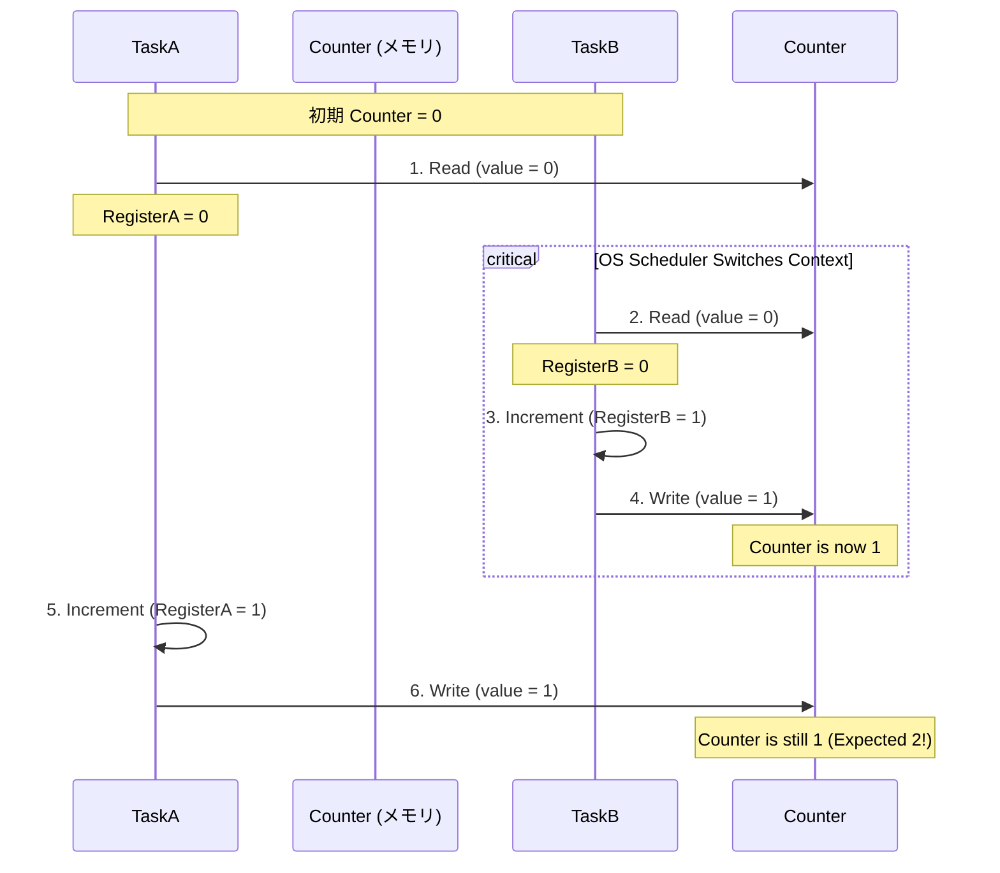
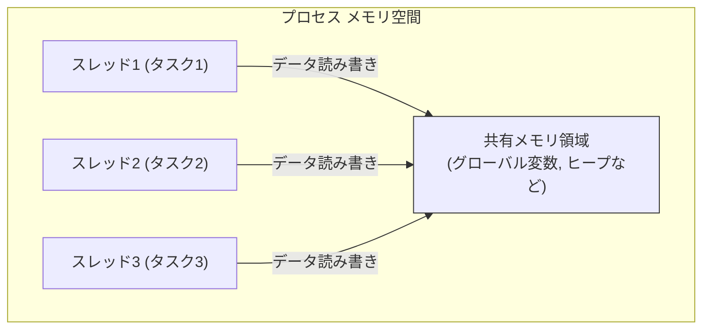
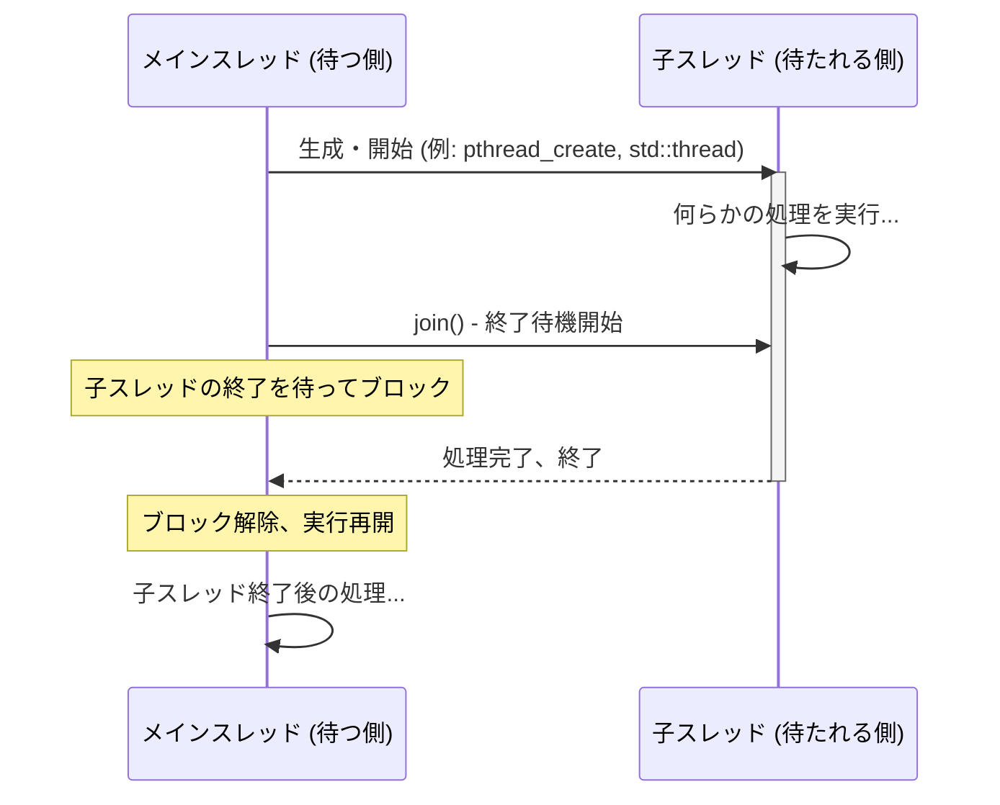

**目次**

- [並行処理設計 入門：なぜ同時に動かすの？ 基本モデルと最初のステップ](#並行処理設計-入門なぜ同時に動かすの-基本モデルと最初のステップ)
- [はじめに：私たちの周りの「ながら処理」とソフトウェア](#はじめに私たちの周りのながら処理とソフトウェア)
  - [なぜ「並行処理」が現代のソフトウェアに必要なのか？](#なぜ並行処理が現代のソフトウェアに必要なのか)
  - [並行、並列、非同期：言葉の整理（ごく簡単に）](#並行並列非同期言葉の整理ごく簡単に)
  - [この入門資料で目指すこと：並行処理の世界への第一歩](#この入門資料で目指すこと並行処理の世界への第一歩)
- [第 1 部：並行処理の基本的な考え方](#第-1-部並行処理の基本的な考え方)
  - [プロセスとスレッド（タスク）：実行の単位](#プロセスとスレッドタスク実行の単位)
    - [プロセスとは？（独立したメモリ空間）](#プロセスとは独立したメモリ空間)
    - [スレッド/タスクとは？（プロセス内の実行単位、メモリ共有）](#スレッドタスクとはプロセス内の実行単位メモリ共有)
    - [組み込みシステムにおける「タスク」](#組み込みシステムにおけるタスク)
  - [並行処理の主な目的とメリット（再訪）](#並行処理の主な目的とメリット再訪)
  - [共有リソースと競合状態：並行処理の最初の壁](#共有リソースと競合状態並行処理の最初の壁)
    - [なぜ問題が起きるのか（「排他制御入門」への橋渡し）](#なぜ問題が起きるのか排他制御入門への橋渡し)
    - [簡単な競合状態の例](#簡単な競合状態の例)
- [第 2 部：代表的な並行処理モデル](#第-2-部代表的な並行処理モデル)
  - [モデル 1：共有メモリモデル (Shared Memory Model)](#モデル-1共有メモリモデル-shared-memory-model)
    - [考え方：複数のスレッド/タスクが同じメモリ領域を共有して協調](#考え方複数のスレッドタスクが同じメモリ領域を共有して協調)
    - [メリット：直接的なデータ共有による高速な連携の可能性](#メリット直接的なデータ共有による高速な連携の可能性)
    - [デメリット：競合状態のリスク、排他制御の必要性（ミューテックス、セマフォなど）](#デメリット競合状態のリスク排他制御の必要性ミューテックスセマフォなど)
    - [一般的な言語での例（スレッドライブラリなど）](#一般的な言語での例スレッドライブラリなど)
  - [モデル 2：メッセージパッシングモデル (Message Passing Model)](#モデル-2メッセージパッシングモデル-message-passing-model)
    - [「状態を共有せず、メッセージを共有する」](#状態を共有せずメッセージを共有する)
    - [メリット：競合状態のリスク低減、疎結合、分散システムとの親和性](#メリット競合状態のリスク低減疎結合分散システムとの親和性)
    - [デメリット：メッセージングのオーバーヘッド、複雑な通信パターンの設計](#デメリットメッセージングのオーバーヘッド複雑な通信パターンの設計)
    - [Actor モデル、CSP (Communicating Sequential Processes) の概要紹介](#actor-モデルcsp-communicating-sequential-processes-の概要紹介)
- [第 3 部：最初の並行プログラム：スレッド/タスクの基本操作](#第-3-部最初の並行プログラムスレッドタスクの基本操作)
  - [スレッド/タスクの生成と開始](#スレッドタスクの生成と開始)
    - [（使用言語/環境に応じた簡単な API 紹介：pthread, C++ std::thread, Java Thread, RTOS タスク生成など）](#使用言語環境に応じた簡単な-api-紹介pthread-c-stdthread-java-thread-rtos-タスク生成など)
  - [スレッド/タスクの終了と待機（ジョイン）](#スレッドタスクの終了と待機ジョイン)
  - [簡単な並行処理の例：複数の仕事を同時に実行してみる](#簡単な並行処理の例複数の仕事を同時に実行してみる)
  - [共有データアクセス時の問題点の体験（意図的に競合を起こしてみる例）](#共有データアクセス時の問題点の体験意図的に競合を起こしてみる例)
- [第 4 部：同期の必要性：足並みを揃えるということ](#第-4-部同期の必要性足並みを揃えるということ)
  - [なぜ「同期」が必要なのか？](#なぜ同期が必要なのか)
    - [処理の順序制御](#処理の順序制御)
    - [リソースへの排他アクセス（「排他制御入門」の重要性の再確認）](#リソースへの排他アクセス排他制御入門の重要性の再確認)
    - [条件待ち](#条件待ち)
  - [同期プリミティブの簡単な紹介（名前と役割だけ）](#同期プリミティブの簡単な紹介名前と役割だけ)
- [おわりに：並行処理の面白さと難しさ、そして次の一歩へ](#おわりに並行処理の面白さと難しさそして次の一歩へ)

# 並行処理設計 入門：なぜ同時に動かすの？ 基本モデルと最初のステップ

# はじめに：私たちの周りの「ながら処理」とソフトウェア

若手エンジニアの皆さん、日々の開発業務、お疲れ様です。皆さんは普段、コンピュータやスマートフォンを使って、音楽を聴き「ながら」ウェブサイトを閲覧したり、文章を書き「ながら」バックグラウンドでファイルがダウンロードされるのを待ったり、といった「ながら処理」を当たり前のように行っていますよね。

これらの「ながら処理」は、コンピュータの内部で複数のプログラムや処理が、あたかも**同時並行**に動いているかのように見えることで実現されています。もし、一つの処理が終わるまで次の処理が全く開始できないとしたら、私たちのデジタル体験はずっと不便で退屈なものになってしまうでしょう。

この「複数の処理を同時に、あるいは見かけ上同時に進める」という考え方こそが、「**並行処理 (Concurrent Processing)**」の基本的なアイデアです。

## なぜ「並行処理」が現代のソフトウェアに必要なのか？

現代のソフトウェア、とくに私たちが日常的に触れるアプリケーションや、社会の基盤を支えるシステムにおいて、並行処理はもはや特別なものではなく、なくてはならない基本的な技術となっています。なぜなら、並行処理を効果的に活用することで、以下のような大きなメリットが得られるからです。

- **応答性の向上（ユーザー体験）:**
  時間のかかる処理（例: 大容量ファイルの読み込み、ネットワーク通信、複雑な計算）をバックグラウンドで行わせることで、その間もユーザーインターフェース (UI) はユーザーの操作に応答し続けることができます。これにより、アプリケーションが「固まった」ように見えるのを防ぎ、ユーザーにとって快適な操作感（良いユーザー体験）を提供できます。
- **スループットの向上（処理能力）:**
  複数の独立したタスクを同時に処理することで、システム全体として単位時間あたりにこなせる仕事の量（スループット）を向上させることができます。たとえば、Web サーバーは、複数のクライアントからのリクエストを並行して処理することで、より多くのユーザーにサービスを提供できます。
- **マルチコア CPU の有効活用:**
  近年のコンピュータの CPU は、複数の処理コア（マルチコア）を持つのが一般的です。並行処理（とくに後述する「並列処理」）のテクニックを使うことで、これらの複数のコアを同時に活用し、CPU の計算能力を最大限に引き出すことができます。単一の処理しか行えないプログラムでは、せっかくのマルチコア CPU の性能を持て余してしまうことになります。

## 並行、並列、非同期：言葉の整理（ごく簡単に）

ここで、よく似た言葉ですが、少しずつ意味合いの異なる「並行」「並列」「非同期」という用語について、ごく簡単に整理しておきましょう。（これらの詳細な違いや関係性については、より専門的な資料で学ぶことができます。）

- **並行 (Concurrency):** **複数のタスクが、見かけ上、同時に進行している**状態を指します。シングルコア CPU であっても、OS が非常に短い時間でタスクを切り替えながら実行することで、人間にはあたかも複数のタスクが同時に動いているように見えます。複数のタスクが**論理的に**同時に存在し、進行できる状態です。
- **並列 (Parallelism):** **複数のタスクが、物理的に（実際に）同時に実行されている**状態を指します。これには、マルチコア CPU や複数のプロセッサが不可欠です。並行処理の概念の一部であり、並行性を実現するための一つの方法です。
- **非同期 (Asynchrony):** ある処理（タスク A）が別の処理（タスク B、多くは時間のかかる処理）を呼び出した際に、タスク A が**タスク B の完了を待たずに**、自身の次の処理に進むことができる、という処理の実行方式を指します。タスク B が完了した際には、何らかの形でタスク A に通知されます（例: コールバック、Promise/Future）。非同期処理は、並行性を実現するための重要なテクニックの一つです。

この入門資料では、これらの用語を厳密に区別しすぎることはせず、主に「複数の処理が（見かけ上でも物理的にでも）同時に進むこと」を広く指す言葉として「並行処理」という用語を使っていきます。

## この入門資料で目指すこと：並行処理の世界への第一歩

並行処理は、ソフトウェアに大きな力をもたらしますが、同時に新たな複雑さや、これまで経験しなかった種類の問題（バグ）を生み出す可能性も秘めています。

この「並行処理設計 入門」では、

- 並行処理の基本的な「なぜ」「なに」を理解する。
- 代表的な並行処理の「考え方のモデル」を知る。
- ごく簡単な並行プログラムを動かしてみて、その挙動と課題を体験する。
- そして、複数の処理が安全に協調動作するための「同期」の必要性に気づく。

といった点を目標に、皆さんが並行処理という広大で奥深い世界への、確かな第一歩を踏み出すお手伝いをします。複雑なバグに悩まされる前に、まずはその基本的な原理と、潜む危険性を知ることから始めましょう。

# 第 1 部：並行処理の基本的な考え方

並行処理の設計について学ぶ前に、まずその土台となるいくつかの基本的な考え方や用語を理解しておく必要があります。この部では、プログラムが実行される「単位」とは何か、そしてなぜ並行処理が時に問題を引き起こすのか、その根本的な原因について見ていきます。

## プロセスとスレッド（タスク）：実行の単位

コンピュータ上でプログラムが実行されるとき、それは OS（オペレーティングシステム）によって管理される何らかの「実行の単位」として扱われます。この実行単位には、主に「**プロセス (Process)**」と「**スレッド (Thread)**」（組み込みシステムの文脈ではしばしば「**タスク (Task)**」とも呼ばれます）という二つのレベルがあります。

### プロセスとは？（独立したメモリ空間）

「**プロセス**」は、OS がプログラムを実行するための、**最も基本的な単位の一つ**です。皆さんがアプリケーション（例えば、Web ブラウザやワープロソフト）を起動すると、OS はそのアプリケーションのために新しいプロセスを生成します。

プロセスの主な特徴は以下の通りです。

- **独立したメモリ空間:** 各プロセスは、OS によって割り当てられた**独自のメモリ空間（アドレス空間）**を持ちます。原則として、あるプロセスは他のプロセスのメモリ空間に直接アクセスすることはできません。これにより、一つのプロセスでエラーが発生しても、他のプロセスに影響が及びにくい（保護されている）という利点があります。
- **プログラムの実行インスタンス:** プロセスは、ディスク上に保存されている実行可能なプログラム（実行ファイル）が、メモリにロードされて実際に実行されている「実体（インスタンス）」と考えることができます。
- **リソースの割り当て単位:** OS は、CPU 時間、メモリ、ファイルハンドルといったシステムリソースを、プロセス単位で割り当て、管理します。
- **プロセス間通信 (IPC):** 独立したメモリ空間を持つプロセス同士が情報をやり取りするためには、パイプ、ソケット、共有メモリ（特別な設定が必要）、メッセージキューといった、OS が提供する特別な「プロセス間通信 (Inter-Process Communication - IPC)」の仕組みが必要になります。

### スレッド/タスクとは？（プロセス内の実行単位、メモリ共有）

「**スレッド (Thread)**」は、**一つのプロセスの中で、さらに細かく分割された実行の単位**です。一つのプロセスは、一つ以上のスレッドを持つことができます（マルチスレッドプロセス）。組み込みシステムの RTOS (リアルタイムオペレーティングシステム) の文脈では、このスレッドに相当するものを「**タスク (Task)**」と呼ぶことが一般的です。この資料では、文脈に応じてスレッドまたはタスクという用語を使います。

スレッド/タスクの主な特徴は以下の通りです。

- **プロセス内の実行の流れ:** スレッドは、プロセスという大きなプログラムの中で、実際に CPU の命令を順番に実行していく「処理の流れ」そのものです。
- **メモリ空間の共有:** 同じプロセスに属する複数のスレッドは、そのプロセスの**メモリ空間（グローバル変数、ヒープ領域など）を共有**します。これにより、スレッド間のデータ共有は非常に簡単かつ高速に行えます（特別な IPC 機構は不要）。しかし、これが後述する「競合状態」の主な原因ともなります。
- **独立した実行コンテキスト（一部）:** 各スレッドは、自分自身のプログラムカウンタ（次に実行する命令のアドレス）、レジスタセット、スタック（ローカル変数や関数呼び出し履歴を保持）といった、独立した実行コンテキストを持ちます。これにより、同じプロセス内でも、複数のスレッドがそれぞれ異なる処理を（見かけ上）同時に進めることができます。
- **軽量な実行単位:** プロセスの生成に比べて、スレッドの生成や切り替え（コンテキストスイッチ）にかかるオーバーヘッドは一般的に小さいため、より多くのスレッドを効率的に扱うことができます。

### 組み込みシステムにおける「タスク」

多くの組み込みシステムで採用されている RTOS では、アプリケーションは複数の「タスク」の集まりとして構成されます。各タスクは、特定の機能（例: センサーデータの読み取り、モーターの制御、通信処理、UI の表示など）を担当し、それぞれに優先度が割り当てられ、RTOS のスケジューラによって実行順序が制御されます。これらのタスクも、基本的には同じメモリ空間を共有して動作するため、スレッドと同様の並行処理の課題（共有リソースへのアクセス競合など）に直面します。

プロセスとスレッド/タスクの違いを理解することは、並行処理の設計において、どのレベルで並行性を導入し、どのようにデータ共有や通信を行うかを考える上での出発点となります。

## 並行処理の主な目的とメリット（再訪）

「はじめに」のセクションでも触れましたが、なぜ私たちはわざわざ複雑さを伴う可能性のある「並行処理」というテクニックをソフトウェアに取り入れようとするのでしょうか？ それは、並行処理を効果的に活用することで、ソフトウェアの性能やユーザー体験を大幅に向上させる、多くの魅力的なメリットが得られるからです。

ここで、改めて並行処理を導入する主な目的とその具体的な利点について、整理しておきましょう。

1.  **応答性の向上 (Improved Responsiveness):**

    - **目的:** ユーザーインターフェース (UI) を持つアプリケーションにおいて、ユーザーの操作に対するシステムの「反応の良さ」を維持・向上させること。
    - **メリット:**
      - 時間のかかる処理（例: ネットワークからのデータダウンロード、大規模なファイル操作、複雑な計算）をバックグラウンドの別スレッドやタスクで実行させることで、その間も UI スレッドはフリーズすることなく、ユーザーの入力（クリック、スクロールなど）に応答し続けることができます。
      - これにより、アプリケーションが「固まった」「応答がない」といった印象をユーザーに与えるのを防ぎ、スムーズで快適なユーザー体験を提供できます。
    - **例:** Web ブラウザで重い画像を表示しようとしている間も、他のタブを操作したり、スクロールしたりできる。ワープロソフトで長大な文書を印刷している間も、別の文書の編集を続けられる。

2.  **スループットの向上 (Increased Throughput):**

    - **目的:** システム全体として、単位時間あたりに処理できる仕事の量（タスクの数、リクエストの数など）を増大させること。
    - **メリット:**
      - 複数の独立した、あるいは部分的に独立したタスクを、複数の CPU コア上で同時に（並列に）処理したり、あるいは I/O 待ちの時間を他のタスクの CPU 処理に充てたりすることで、システム全体の処理能力を高めることができます。
      - とくにサーバーアプリケーションでは、多数のクライアントからのリクエストを並行して処理することで、より多くのユーザーにサービスを提供し、システム全体の効率を向上させます。
    - **例:** Web サーバーが複数のクライアントからの HTTP リクエストを同時に処理する。動画エンコードソフトが、動画の異なる部分を複数のコアで並列にエンコードする。

3.  **リソースの有効活用 (Efficient Resource Utilization):**

    - **目的:** CPU、メモリ、I/O デバイスといった、限られたコンピュータ資源をより効率的に活用すること。
    - **メリット:**
      - **CPU の有効活用:** マルチコア CPU 環境では、複数のスレッド/タスクを並列実行することで、すべてのコアを遊ばせることなく活用し、計算能力を最大限に引き出します。
      - **I/O 待ち時間の有効活用:** あるタスクがディスク I/O やネットワーク I/O の完了を待っている間（CPU はアイドル状態）、別のタスクに CPU を割り当てることで、CPU の遊休時間を減らし、システム全体の処理効率を上げます。（これは「非同期処理」の重要な利点でもあります。）
    - **例:** データベースへの問い合わせを行っているタスクが応答を待っている間に、別のタスクが CPU を使って計算処理を進める。

4.  **問題の自然な分割 (Natural Problem Decomposition):**
    - **目的:** 複雑な問題を、それぞれが特定の関心事を担当する、より小さく、より管理しやすい、独立した処理単位（タスクやスレッド）に分割してモデル化すること。
    - **メリット:**
      - 現実世界の多くの事象は、本質的に並行して発生・進行します（例: 工場の複数の機械の同時稼働、複数のセンサーからの同時データ入力）。これらの事象を、それぞれ独立したタスクとしてソフトウェアにマッピングすることで、問題領域の構造をより自然な形でプログラムに反映でき、設計や理解が容易になる場合があります。
      - 各タスクが特定の役割に集中することで、モジュール性が高まり、開発の分担や保守がしやすくなることもあります。
    - **例:** ロボット制御システムで、センサーデータ処理タスク、モーター制御タスク、経路計画タスク、通信タスクなどをそれぞれ独立したタスクとして設計する。

これらのメリットは非常に魅力的であり、現代の多くのソフトウェアが何らかの形で並行処理のテクニックを利用している理由です。しかし、次のセクションで見るように、これらのメリットを享受するためには、並行処理特有の課題、とくに「共有リソース」の扱いに関する問題を克服する必要があります。

## 共有リソースと競合状態：並行処理の最初の壁

並行処理がもたらすメリットは大きい一方で、複数の処理（タスクやスレッド）が同時に実行される環境は、新たな種類の複雑さと、そして非常に厄介な「バグ」を生み出す土壌ともなります。その中でも、もっとも基本的で、かつ頻繁に遭遇する問題が、「**共有リソース (Shared Resource)**」へのアクセスと、それに伴う「**競合状態 (Race Condition)**」です。

### なぜ問題が起きるのか（「排他制御入門」への橋渡し）

「排他制御入門」の資料でも詳しく学びましたが、ここでもその核心的なポイントを再確認しておきましょう。

- **共有リソースとは:** 前の「プロセスとスレッド（タスク）」のセクションで触れたように、同じプロセスに属する複数のスレッド（タスク）は、そのプロセスのメモリ空間（グローバル変数、ヒープ領域、静的変数など）を**共有**します。また、ファイル、データベース接続、ハードウェアデバイスといったシステムリソースも、複数のスレッド/タスクからアクセスされる可能性があります。これらが「共有リソース」です。
- **アトミックでない操作:** プログラミング言語で一行で書かれているような単純に見える操作（例: `counter++`）も、CPU の命令レベルでは、多くの場合、「メモリから値を読み出す → 値を計算する → メモリに値を書き戻す」という複数のステップに分割されて実行されます。
- **プリエンプション（割り込み）:** マルチタスク OS 環境では、あるスレッド/タスクがこれらの複数ステップの操作を実行している途中で、OS のスケジューラによって実行が中断され（プリエンプトされ）、別のスレッド/タスクに CPU の実行権が切り替わることが、いつでも起こりえます。

これらの要素が組み合わさると、何が起きるでしょうか？

### 簡単な競合状態の例

「排他制御入門」でも見た、共有カウンターの例を思い出してみましょう。

共有変数 `counter` (初期値 0) があり、タスク A とタスク B がそれぞれ `counter` を 1 増やす処理（`counter++`）を行うとします。

期待する最終結果は `2` です。

しかし、以下のような実行順序（インターリーブ）が発生する可能性があります。

1.  タスク A: `counter` の現在の値 (0) を CPU のレジスタに読み込む。
2.  **（ここでタスク A が中断され、タスク B に切り替わる）**
3.  タスク B: `counter` の現在の値 (0) を CPU のレジスタに読み込む。
4.  タスク B: レジスタの値に 1 を加え、結果 (1) を得る。
5.  タスク B: 計算結果 (1) をメモリの `counter` に書き戻す。(`counter` は今 `1`)
6.  **（ここでタスク B が中断され、タスク A に切り替わる）**
7.  タスク A: （以前に読み込んだ 0 を基に）レジスタの値に 1 を加え、結果 (1) を得る。
8.  タスク A: 計算結果 (1) をメモリの `counter` に書き戻す。(`counter` は今 `1` のまま！)



_図: 共有カウンターにおける競合状態の発生シーケンス例_

最終的に `counter` の値は `1` となり、期待した `2` にはなりませんでした。タスク B の行ったインクリメント処理が、実質的に「失われて」しまったのです。これが典型的な「**競合状態**」です。

この競合状態は、

- **発生タイミングが非決定的:** タスクの切り替えタイミングは OS のスケジューリングに依存するため、常に発生するとは限りません。テストで見つかりにくく、本番環境で稀に発生しては原因不明の不具合となることがあります。
- **デバッグが困難:** 再現性が低いため、デバッグツールで追跡するのも非常に難しいです。
- **データ不整合の源泉:** 単純なカウンターだけでなく、より複雑なデータ構造（リスト、キュー、状態変数など）に対する競合は、深刻なデータの不整合や、プログラムの誤動作、クラッシュを引き起こします。

この「共有リソースへの安全なアクセス」という課題こそが、並行処理設計における最初の、そして最大の壁と言えるでしょう。そして、この壁を乗り越えるための技術が、まさに「**排他制御**」や「**同期**」といったメカニズムなのです。（これらの詳細については、「排他制御入門」および「排他制御 初級」の資料で深く学んでいきます。）

並行処理のメリットを享受するためには、まずこの競合状態のリスクを正しく理解し、それを防ぐための設計原則と実装テクニックを学ぶことが不可欠です。

# 第 2 部：代表的な並行処理モデル

並行処理を実現するためのプログラムの「形」や「考え方」には、いくつかの代表的なモデル（様式）が存在します。これらのモデルは、タスクやスレッドがどのようにデータを共有し、どのように互いに協調動作するのか、その基本的な枠組みを提供します。

この部では、主要な二つの並行処理モデル、「共有メモリモデル」と「メッセージパッシングモデル」について、その基本的な考え方、メリット、デメリット、そしてどのような場面で使われるのかを見ていきましょう。

## モデル 1：共有メモリモデル (Shared Memory Model)

「**共有メモリモデル (Shared Memory Model)**」は、おそらく皆さんがマルチスレッドプログラミングとして最初に触れるであろう、最も直感的で広く使われている並行処理モデルです。

### 考え方：複数のスレッド/タスクが同じメモリ領域を共有して協調

このモデルの基本的な考え方は、**複数のスレッド（または同じプロセス内のタスク）が、共通のメモリ領域（グローバル変数、ヒープに確保されたオブジェクト、共有バッファなど）に直接アクセスし、そのデータを読み書きすることで、互いに情報を共有し、協調動作する**というものです。

まるで、複数の作業者が、同じ一つの「作業台（共有メモリ）」の上にある「部品（データ）」を、それぞれが手にとって加工したり、新しい部品を置いたりしながら、共同で一つの製品を作り上げていくようなイメージです。



_図: 共有メモリモデルの概念図。複数のスレッドが同じメモリ領域を共有する。_

各スレッドは、自分自身のスタック（ローカル変数など）は個別に持ちますが、それ以外の多くのメモリ領域は他のスレッドと共有しています。

### メリット：直接的なデータ共有による高速な連携の可能性

共有メモリモデルの主なメリットは、以下の通りです。

- **データ共有の容易さと効率:**
  スレッド（タスク）間でデータを共有するために、特別な IPC (プロセス間通信) メカニズム（パイプやソケットなど）を用意する必要がなく、あたかも単一スレッドのプログラムでグローバル変数を扱うかのように、共有メモリ上のデータに直接アクセスできます。これにより、スレッド間の情報伝達が非常に高速に行える可能性があります。
- **細やかな連携:**
  共有メモリを通じて、非常に細かい粒度でデータを共有し、スレッド間の緊密な連携を実現できます。
- **多くの言語と OS で標準的にサポート:**
  C, C++, Java, Python, C# といった多くの主要なプログラミング言語や、ほとんどの汎用 OS、RTOS が、スレッド生成と共有メモリへのアクセスを標準的な機能としてサポートしています。そのため、比較的容易に導入・利用できます。

### デメリット：競合状態のリスク、排他制御の必要性（ミューテックス、セマフォなど）

一方で、共有メモリモデルは、そのデータ共有の容易さゆえに、並行処理における最も困難な問題を引き起こす原因ともなります。

- **競合状態 (Race Condition) の発生リスク（最重要課題）:**
  前の部で見たように、複数のスレッドが何の制御もなく共有メモリ上のデータに同時に書き込みを行ったり、あるいは書き込み中に別のスレッドが読み取りを行ったりすると、データの不整合や予期せぬプログラムの誤動作、クラッシュといった「競合状態」が容易に発生します。
- **排他制御の必須性:**
  競合状態を防ぐためには、共有リソースへのアクセスを行うクリティカルセクションを、ミューテックス、セマフォ、あるいはその他の同期プリミティブを使って**厳密に排他制御**する必要があります。この排他制御の設計と実装が、共有メモリモデルにおけるプログラミングの複雑さと難しさの中心となります。
- **デッドロック、ライブロック、スターベーションのリスク:**
  排他制御（とくにロック）を導入すると、今度はデッドロック（タスクが互いにロック解放を待ち合って停止）、ライブロック（タスクが処理を進めずに譲り合い続ける）、スターベーション（特定のタスクがリソースを得られず飢餓状態になる）といった、新たな種類の問題が発生するリスクが生まれます。これらへの対策も必要になります。
- **プログラムの複雑化:**
  共有するデータの種類やアクセスパターンが増えるにつれて、どこでどのロックを獲得・解放すべきか、その管理が非常に複雑になり、コードの見通しが悪くなりがちです。排他制御のロジックが、本来のビジネスロジックに絡みつき、プログラム全体の理解や保守を困難にすることがあります。
- **スケーラビリティの限界（ロック競合による）:**
  CPU コア数を増やしても、共有リソースへのアクセスが単一のロックによって逐次化されていると、そのロックがボトルネックとなり、期待したほど性能が向上しない（スケールしない）ことがあります。

### 一般的な言語での例（スレッドライブラリなど）

共有メモリモデルに基づく並行プログラミングは、以下のような言語機能やライブラリを使って実現されます。

- **POSIX スレッド (Pthreads):** C 言語などで使われる、スレッド操作の標準的な API。ミューテックス (`pthread_mutex_t`) やセマフォ (`sem_t`)、条件変数 (`pthread_cond_t`) などが提供されます。
- **C++ 標準ライブラリ (`<thread>`, `<mutex>`, `<condition_variable>`など):** C++11 以降で標準化されたスレッドサポート。RAII を活用したロック管理 (`std::lock_guard`, `std::unique_lock`) が推奨されます。
- **Java (`java.lang.Thread`, `java.util.concurrent` パッケージ):** 言語レベルでのスレッドサポートと、高度な並行ユーティリティ（ロック、アトミック変数、並行コレクション、エグゼキュータフレームワークなど）が豊富に提供されています。`synchronized` キーワードや `ReentrantLock` などが代表的な排他制御手段です。
- **Python (`threading` モジュール):** スレッドベースの並行処理をサポート。ただし、GIL (Global Interpreter Lock) の存在により、CPU バウンドな処理の真の並列実行には制約があります。
- **RTOS のタスク管理 API と同期プリミティブ:** 多くの RTOS が、タスク生成、優先度管理、そしてタスク間同期・通信のためのミューテックス、セマフォ、メッセージキューなどを提供しています。

共有メモリモデルは、その直感的なデータ共有のしやすさから広く使われていますが、その力を安全かつ効果的に引き出すためには、**排他制御の原則とテクニックを深く理解し、慎重に適用することが絶対不可欠**です。「排他制御入門」や「排他制御 初級」で学ぶ内容は、まさにこの共有メモリモデルを使いこなすための知識と言えるでしょう。

## モデル 2：メッセージパッシングモデル (Message Passing Model)

共有メモリモデルが「同じ作業台の部品をみんなで直接触る」というイメージだったのに対し、「**メッセージパッシングモデル (Message Passing Model)**」は、それとは対照的なアプローチを取ります。このモデルでは、**並行して動作する各実行単位（プロセス、タスク、アクターなど）は、それぞれが独立した状態（メモリ）を持ち、互いに直接メモリを共有しません。その代わり、協調動作や情報交換は、すべて「メッセージ」を互いに送り合う（送受信する）ことによって行われます。**

まるで、それぞれが自分の部屋（独立したメモリ空間）を持つ複数の人が、手紙（メッセージ）を郵便ポスト（メッセージキューやチャネル）に投函したり、受け取ったりすることでコミュニケーションを取り、共同作業を進めていくようなイメージです。

```mermaid
graph TD
    subgraph 実行単位A (プロセス/アクターAなど)
        direction LR
        StateA["ローカル状態 A"]
        LogicA["処理ロジック A"]
    end
    subgraph 実行単位B (プロセス/アクターBなど)
        direction LR
        StateB["ローカル状態 B"]
        LogicB["処理ロジック B"]
    end

    MQ["メッセージキュー<br>(またはチャネルなど)"]

    LogicA -- メッセージ送信 --> MQ
    MQ -- メッセージ受信 --> LogicB
    LogicB -- (応答)メッセージ送信 --> MQ
    MQ -- (応答)メッセージ受信 --> LogicA

    style StateA fill:#lightblue,stroke:#333
    style StateB fill:#lightgreen,stroke:#333
    style MQ fill:#lightyellow,stroke:#333
```

_図: メッセージパッシングモデルの概念図。各実行単位は独立した状態を持ち、メッセージを介して通信する。_

### 「状態を共有せず、メッセージを共有する」

このモデルの核心的な原則は、「**状態を共有せず、メッセージを（値として）共有する (Share Nothing, Communicate by Passing Messages)**」というものです。各実行単位は、自身の内部状態については全責任を持ち、他の実行単位がその状態を直接読み書きすることはできません。状態を変更する必要がある場合は、その変更を依頼するメッセージを送るか、あるいは変更結果を伝えるメッセージを受け取る、という形になります。

メッセージ自体は、通常、不変なデータ（値のコピー）であるか、あるいは所有権が明確に管理されるデータへの参照です。これにより、共有メモリモデルで問題となったデータ競合のリスクを根本的に回避しようとします。

### メリット：競合状態のリスク低減、疎結合、分散システムとの親和性

メッセージパッシングモデルを採用することには、多くの重要なメリットがあります。

- **競合状態の原理的な回避（または大幅な低減）:**
  メモリを直接共有しないため、複数の実行単位が同じデータに対して同時に書き込みを行うことによる競合状態は、原理的に発生しにくくなります（ただし、メッセージキューのような通信チャネル自体へのアクセスには、依然として何らかの同期が必要な場合があります）。これにより、複雑なロック機構の必要性が大幅に減り、コードがシンプルになります。
- **高い疎結合性:**
  各実行単位は、他の実行単位の内部状態や実装の詳細を知る必要がなく、定義されたメッセージのフォーマットと、メッセージを送受信するための「アドレス」や「チャネル」だけを知っていれば連携できます。これにより、システム全体の結合度が低く保たれ、各単位の独立した開発、テスト、変更が容易になります。
- **分散システムとの高い親和性:**
  メッセージパッシングは、ネットワーク越しに異なるマシン上で動作するプロセス間の通信とも非常に相性が良いため、分散システム（例: マイクロサービスアーキテクチャ）を構築する際の自然なモデルとなります。「位置透過性」（相手がローカルにいるかリモートにいるかを意識せずにメッセージを送れる）を実現しやすいです。
- **スケーラビリティ:**
  各実行単位が独立しているため、負荷に応じて特定の実行単位の数を増やしたり（水平スケーリング）、異なるマシンに配置したりすることが比較的容易です。
- **耐障害性（設計による）:**
  ある実行単位で障害が発生しても、その影響が他の独立した実行単位に波及しにくい構造を作りやすいです（ただし、メッセージの損失や、応答がない場合のタイムアウト処理などは別途考慮が必要です）。

### デメリット：メッセージングのオーバーヘッド、複雑な通信パターンの設計

一方で、メッセージパッシングモデルにもいくつかのデメリットや考慮点があります。

- **メッセージングのオーバーヘッド:**
  データをメッセージとしてパッケージ化し、それをキューやネットワーク経由で送受信する処理には、共有メモリへの直接アクセスに比べて、ある程度のオーバーヘッド（処理時間やメモリ消費）が伴います。非常に細粒度で高頻度なデータ共有には向かない場合があります。
- **データのコピーコスト:**
  メモリを共有しないため、実行単位間でデータを渡す際には、データのコピーが発生することが多いです（値渡し）。大きなデータを頻繁にやり取りする場合、このコピーコストが無視できなくなる可能性があります。（ただし、共有不可能で不変なデータへの参照を渡す、といった最適化も考えられます。）
- **複雑な通信パターンの設計:**
  複数の実行単位が複雑な順序でメッセージを交換したり、同期的な応答を待ったり、あるいはブロードキャスト（一斉送信）やリクエスト/リプライといったパターンを実現したりするには、メッセージのルーティングや状態管理、タイムアウト処理などを慎重に設計する必要があります。
- **デバッグの難しさ（分散時）:**
  処理が複数の独立した実行単位にまたがり、非同期的なメッセージで連携する場合、システム全体の動作を追跡し、問題発生時の原因を特定するのが、単一プロセスのマルチスレッドプログラムに比べて難しくなることがあります。分散トレーシングのような仕組みが必要になることもあります。

### Actor モデル、CSP (Communicating Sequential Processes) の概要紹介

メッセージパッシングモデルを具現化するための、いくつかの有名な理論モデルやプログラミングアプローチが存在します。

- **Actor モデル (Actor Model):**
  「関数型プログラミング：安全な並行・非同期処理の実践」でも触れましたが、システムを「アクター」と呼ばれる独立した計算単位の集まりとして捉えます。各アクターは自身の状態とメールボックスを持ち、他のアクターとは非同期的なメッセージの送受信のみで通信します。Erlang/OTP や Akka といったフレームワークが代表的です。

  ```mermaid
  graph TD
      A[アクターA<br>(状態A, メールボックスA)]
      B[アクターB<br>(状態B, メールボックスB)]
      C[アクターC<br>(状態C, メールボックスC)]

      A -- メッセージ1 --> B
      B -- メッセージ2 --> C
      C -- メッセージ3 --> A
  ```

  _図: Actor モデルのイメージ_

- **CSP (Communicating Sequential Processes / 通信する逐次プロセス):**
  トニー・ホーアによって提唱された、並行システムを記述・検証するための形式的な理論モデルです。独立したプロセスが、「チャネル (Channel)」と呼ばれる明示的な通信路を通じて、同期的に（あるいはバッファ付きで非同期的に）メッセージを送受信することで協調動作します。Go 言語の「Goroutine」と「Channel」は、この CSP の考え方に強く影響を受けています。

  ```mermaid
  graph TD
      P1["プロセス1 (Goroutine1)"]
      P2["プロセス2 (Goroutine2)"]
      CH["チャネル<br>(同期/非同期)"]

      P1 -- データ送信 --> CH
      CH -- データ受信 --> P2
  ```

  _図: CSP (Go 言語のチャネル) のイメージ_

これらのモデルは、共有メモリモデルとは異なるアプローチで並行処理の課題に取り組むための、強力な枠組みを提供してくれます。とくに、本質的に副作用を伴う「状態」を、各実行単位の内部に閉じ込め、外部とは明確なメッセージインターフェースを通じてのみやり取りするという考え方は、関数型プログラミングの原則（副作用の局所化、不変メッセージなど）とも非常に高い親和性を持っています。

共有メモリモデルとメッセージパッシングモデル、どちらが常に優れているということはありません。解決しようとしている問題の性質、システムの規模や分散の要件、そして利用可能な技術スタックなどを考慮し、それぞれのモデルの長所と短所を理解した上で、適切なものを選択、あるいは組み合わせていくことが、効果的な並行処理設計の鍵となります。

# 第 3 部：最初の並行プログラム：スレッド/タスクの基本操作

これまでの部で、並行処理の基本的な考え方や、主要な並行処理モデルについて学んできました。いよいよこの部では、実際にプログラムコードを書きながら、どのようにして複数の処理の流れ（スレッドやタスク）を生成し、実行させ、そしてそれらがどのように相互作用するのか（あるいは、してしまうのか）を体験してみましょう。

ここでは、特定の高級な並行処理ライブラリやフレームワークに深入りするのではなく、多くのプログラミング言語や RTOS で提供されている、より**基本的なスレッド/タスク操作の API** の考え方に焦点を当てます。具体的な API の名前や構文は言語や環境によって異なりますが、その根本的な概念は共通しています。

この部を通じて、皆さんが「自分の手で」最初の並行プログラムを動かし、その挙動を観察することで、並行処理の面白さと、そして潜む課題を実感できるようになることを目指します。

## スレッド/タスクの生成と開始

並行処理を実現するための最初のステップは、メインの処理の流れとは別に、新しい独立した処理の流れ、つまり**新しいスレッド（またはタスク）を生成し、それを実行開始させる**ことです。

### （使用言語/環境に応じた簡単な API 紹介：pthread, C++ std::thread, Java Thread, RTOS タスク生成など）

各プログラミング環境は、このための API を提供しています。

- **C 言語 (POSIX スレッド - Pthreads):**
  `pthread_create()` 関数を使って新しいスレッドを生成し、そのスレッドで実行される関数（スレッド関数）を指定します。

  ```c
  #include <pthread.h>
  #include <stdio.h>
  #include <unistd.h> // for sleep

  void* thread_function(void* arg) {
      char* message = (char*)arg;
      for (int i = 0; i < 3; ++i) {
          printf("スレッドメッセージ: %s (カウント %d)\n", message, i);
          sleep(1); // 1秒待機
      }
      return NULL;
  }

  // int main_pthread_example() { // mainからの呼び出しを想定
  //     pthread_t thread_id1, thread_id2;
  //     char* msg1 = "Thread 1";
  //     char* msg2 = "Thread 2";
  //
  //     printf("メイン: スレッドを生成します。\n");
  //
  //     // スレッド1を生成・開始
  //     if (pthread_create(&thread_id1, NULL, thread_function, (void*)msg1) != 0) {
  //         perror("pthread_create error");
  //         return 1;
  //     }
  //     // スレッド2を生成・開始
  //     if (pthread_create(&thread_id2, NULL, thread_function, (void*)msg2) != 0) {
  //         perror("pthread_create error");
  //         return 1;
  //     }
  //
  //     // メインスレッドも何か処理を続ける (ここでは少し待つだけ)
  //     sleep(4);
  //     printf("メイン: 終了します。\n");
  //     // (実際には pthread_join でスレッドの終了を待つことが多い - 次のセクションで)
  //     return 0;
  // }
  ```

  この例では、`thread_function` という関数が、それぞれのスレッドで独立して実行されます。`pthread_create` の第 4 引数で、スレッド関数に渡す引数を指定できます。

- **C++ (標準ライブラリ `<thread>`):**
  `std::thread` オブジェクトを、実行したい関数（またはラムダ式、関数オブジェクト）を引数として生成することで、新しいスレッドが開始されます。

  ```cpp
  #include <iostream>
  #include <thread>
  #include <chrono> // for std::chrono::seconds
  #include <string>

  // void cpp_thread_function(const std::string& message, int id) {
  //     for (int i = 0; i < 3; ++i) {
  //         std::cout << "C++スレッド " << id << " メッセージ: " << message << " (カウント " << i << ")" << std::endl;
  //         std::this_thread::sleep_for(std::chrono::seconds(1));
  //     }
  // }
  //
  // int main_cpp_thread_example() {
  //     std::cout << "メイン: C++スレッドを生成します。" << std::endl;
  //     // スレッド1を生成・開始 (引数も渡せる)
  //     std::thread t1(cpp_thread_function, "Hello", 1);
  //     // スレッド2をラムダ式で生成・開始
  //     std::thread t2([]() {
  //         for (int i = 0; i < 2; ++i) {
  //             std::cout << "C++スレッド 2 (ラムダ) (カウント " << i << ")" << std::endl;
  //             std::this_thread::sleep_for(std::chrono::milliseconds(700));
  //         }
  //     });
  //
  //     // メインスレッドはスレッドの終了を待つ (join - 次のセクションで)
  //     if (t1.joinable()) t1.join();
  //     if (t2.joinable()) t2.join();
  //
  //     std::cout << "メイン: C++スレッド終了、メインも終了します。" << std::endl;
  //     return 0;
  // }
  ```

- **Java (`java.lang.Thread` または `java.util.concurrent.ExecutorService`):**
  `Thread` クラスを継承するか、`Runnable` インターフェースを実装したクラスのインスタンスを `Thread` オブジェクトに渡して `start()` メソッドを呼び出すことでスレッドを開始します。より現代的な Java では `ExecutorService` を使ってスレッドプールでタスクを実行することが推奨されます。

  ```java
  // // Java でのスレッド生成 (Runnable を使用)
  // class MyRunnable implements Runnable {
  //     private String message;
  //     public MyRunnable(String msg) { this.message = msg; }
  //
  //     @Override
  //     public void run() { // スレッドで実行される処理
  //         for (int i = 0; i < 3; i++) {
  //             System.out.println(Thread.currentThread().getName() + ": " + message + " (カウント " + i + ")");
  //             try {
  //                 Thread.sleep(1000);
  //             } catch (InterruptedException e) {
  //                 System.err.println(message + " interrupted.");
  //                 return;
  //             }
  //         }
  //     }
  // }
  //
  // public class JavaThreadExample {
  //     public static void main(String[] args) {
  //         System.out.println("メイン: Javaスレッドを生成します。");
  //
  //         Thread t1 = new Thread(new MyRunnable("スレッドA"), "Thread-A");
  //         Thread t2 = new Thread(() -> { // ラムダ式 (Java 8+)
  //             for (int i = 0; i < 2; i++) {
  //                 System.out.println(Thread.currentThread().getName() + ": スレッドB (ラムダ) (カウント " + i + ")");
  //                 try { Thread.sleep(700); } catch (InterruptedException ignored) {}
  //             }
  //         }, "Thread-B");
  //
  //         t1.start(); // スレッドの実行開始
  //         t2.start();
  //
  //         System.out.println("メイン: スレッドを開始しました。メインは終了を待ちます...");
  //         try {
  //             t1.join(); // t1の終了を待つ
  //             t2.join(); // t2の終了を待つ
  //         } catch (InterruptedException e) {
  //             System.err.println("メインスレッドが中断されました。");
  //         }
  //         System.out.println("メイン: すべてのスレッドが終了しました。");
  //     }
  // }
  ```

- **RTOS におけるタスク生成:**
  各 RTOS は、独自の API を提供してタスクを生成・管理します。通常、タスクで実行する関数、タスクの優先度、スタックサイズなどを指定してタスクを生成します。
  - 例 (FreeRTOS API 風): `xTaskCreate(pvTaskCode, pcName, usStackDepth, pvParameters, uxPriority, pxCreatedTask)`

これらの API の詳細な使い方は、それぞれの言語や OS のドキュメントを参照する必要がありますが、共通しているのは、**「実行したい処理（関数）」と、場合によっては「その処理に渡す引数」や「実行時の属性（優先度、スタックサイズなど）」を指定して、新しい独立した実行の流れを作り出す**、という点です。

スレッド/タスクを生成すると、OS のスケジューラが、CPU 時間をこれらの複数の実行の流れに（優先度などに基づいて）適切に割り当て、見かけ上、それらが同時に進行しているかのように動作します。

**注意点:**

- **リソース消費:** スレッドやタスクは、それぞれがスタックメモリなどのリソースを消費します。無闇に大量のスレッド/タスクを生成すると、システムリソースを圧迫する可能性があります。
- **開始のタイミング:** スレッド/タスクを生成（API 呼び出し）したからといって、即座にその処理が開始されるとは限りません。実際の実行開始タイミングは、OS のスケジューリングポリシーや、他のスレッド/タスクの状況に依存します。
- **引数の渡し方とライフタイム:** スレッド関数に引数を渡す場合、その引数（とくにポインタや参照で渡すデータ）のライフタイム（生存期間）に注意が必要です。もし、呼び出し元の関数が終了してローカル変数が破棄された後に、生成されたスレッドがその変数を参照しようとすると、未定義の動作やクラッシュを引き起こします。データをヒープに確保するか、スレッドが終了するまで呼び出し元がデータを保持するなどの工夫が必要です。

新しいスレッドやタスクを生成することは、並行処理のまさに第一歩です。しかし、ただ生成するだけでは、それらがどのように連携し、どのように終了するのか、といった管理ができません。次のセクションでは、これらのスレッド/タスクの終了をどのように扱うかを見ていきます。

## スレッド/タスクの終了と待機（ジョイン）

新しいスレッドやタスクを生成し、処理を開始させることができるようになりました。しかし、多くの場合、メインの処理の流れ（たとえば、`main` 関数を実行しているメインスレッドや、親タスク）は、生成した子スレッド/タスクがその処理を**完了するのを待ってから**、自身の次の処理に進んだり、あるいはプログラム全体を終了したりする必要があります。

もし、メインスレッドが子スレッドの処理完了を待たずに終了してしまうと、子スレッドがまだ処理の途中であっても、プロセス全体が終了してしまい、子スレッドの処理が中途半端に打ち切られてしまう可能性があります。

この「**あるスレッド/タスクが、別のスレッド/タスクの終了を待つ**」ためのメカニズムを、一般的に「**ジョイン (Join)**」と呼びます。

**ジョイン操作の基本的な考え方**

- スレッド/タスク A (待つ側) が、スレッド/タスク B (待たれる側) に対して「ジョイン」操作を行うと、スレッド A は、**スレッド B がその処理を完了（終了）するまで、実行を一時停止（ブロック）**します。
- スレッド B が終了すると、スレッド A はブロック状態から解除され、実行を再開します。
- 多くの場合、ジョイン操作では、終了したスレッド B から何らかの「終了ステータス」や「戻り値」を受け取ることができます。



_図: スレッドのジョイン操作の基本的な流れ_

**各環境でのジョイン操作 API (例)**

- **C 言語 (Pthreads):**
  `pthread_join(thread_id, &return_value_ptr)` 関数を使います。

  - `thread_id`: 待機対象のスレッドの ID。
  - `return_value_ptr`: スレッド関数が返した値（`void*` 型）を受け取るためのポインタ（不要なら `NULL`）。
  - この関数は、指定されたスレッドが終了するまで呼び出し元スレッドをブロックします。

  ```c
  // (前出の pthread_example の main 関数に追記するイメージ)
  // pthread_t thread_id1, thread_id2;
  // ... スレッド生成 ...

  // スレッド1の終了を待つ
  // if (pthread_join(thread_id1, NULL) != 0) {
  //     perror("pthread_join thread1 error");
  // }
  // printf("メイン: スレッド1が終了しました。\n");
  //
  // // スレッド2の終了を待つ
  // void* thread2_return_value;
  // if (pthread_join(thread_id2, &thread2_return_value) != 0) {
  //     perror("pthread_join thread2 error");
  // }
  // printf("メイン: スレッド2が終了しました。(戻り値: %p)\n", thread2_return_value);
  //
  // printf("メイン: すべてのスレッドが終了、メインも終了します。\n");
  ```

- **C++ (標準ライブラリ `<thread>`):**
  `std::thread` オブジェクトの `join()` メンバ関数を呼び出します。

  - `join()` を呼び出す前に、そのスレッドが `joinable()`（まだジョインされていない、かつデタッチもされていない状態）であるかを確認するのが一般的です。
  - C++ の `std::thread` の場合、スレッドオブジェクトが破棄される（スコープを抜けるなど）**前**に、必ず `join()` するか `detach()` する（後述）必要があります。そうしないと、デストラクタでプログラムが異常終了 (`std::terminate`) します。

  ```cpp
  // (前出の cpp_thread_example の main 関数に追記するイメージ)
  // std::thread t1(...);
  // std::thread t2(...);
  //
  // // ...
  //
  // if (t1.joinable()) {
  //     t1.join(); // t1 の終了を待つ
  //     std::cout << "メイン: スレッド t1 がジョインしました。" << std::endl;
  // }
  // if (t2.joinable()) {
  //     t2.join(); // t2 の終了を待つ
  //     std::cout << "メイン: スレッド t2 がジョインしました。" << std::endl;
  // }
  ```

- **Java (`java.lang.Thread`):**
  `Thread` オブジェクトの `join()` メソッドを呼び出します。タイムアウト付きの `join(long millis)` もあります。

  ```java
  // (前出の JavaThreadExample の main メソッド参照)
  // t1.join(); // t1 が終了するまでメインスレッドは待機
  // t2.join(); // t2 が終了するまでメインスレッドは待機
  ```

- **RTOS におけるタスク待機:**
  多くの RTOS も、特定のタスクの終了（あるいは削除）を待機するための API を提供しています。あるいは、タスクが終了時に特定の同期オブジェクト（セマフォやイベントフラグなど）をシグナルし、それを親タスクが待つ、といった形で実現することもあります。

**デタッチ (Detach) という選択肢**

スレッド/タスクの終了を待つ「ジョイン」とは対照的に、「**デタッチ (Detach)**」という操作もあります。デタッチされたスレッド/タスクは、生成元のスレッド/タスクとは独立して実行を続け、その終了を誰も待つ必要がなくなります。スレッド/タスクが終了すると、それが使用していたリソースは自動的にシステムに返却されます。

- **用途:** 長時間かかるバックグラウンド処理で、その完了をメインの処理が待つ必要がない場合（「起動したら後は任せた」というケース）。
- **注意点:**
  - デタッチされたスレッド/タスクの終了状態や戻り値は、通常、直接受け取ることができません。
  - デタッチしたスレッドが共有リソースにアクセスする場合、そのリソースのライフタイム管理（メインスレッドが先に終了してリソースが解放されてしまわないかなど）に細心の注意が必要です。
  - C++ の `std::thread` では、`join()` も `detach()` もされずにデストラクタが呼ばれると問題なので、どちらかを明示的に行う必要があります。

**ジョインの重要性:**

- **リソースの確実な解放:** ジョイン可能なスレッドが終了すると、そのスレッドが確保していたリソース（スタック領域など）がシステムに正しく返却されることを保証する上で重要です（OS やライブラリの実装によります）。
- **処理結果の取得:** スレッド関数が何らかの結果を返す場合、ジョイン操作を通じてそれを受け取ることができます。
- **プログラムの正しい終了順序:** メインの処理が、必要なバックグラウンド処理の完了を待ってから終了することを保証します。

スレッドやタスクを生成したら、その終了をどのように扱うか（ジョインして待つのか、デタッチして独立させるのか）を明確に設計することが、安定した並行プログラムを書くための重要なステップです。多くの場合、とくに子スレッドの処理結果が必要な場合や、プログラム全体の終了前にすべての子スレッドの完了を保証したい場合には、ジョイン操作が不可欠となります。

## 簡単な並行処理の例：複数の仕事を同時に実行してみる

スレッドやタスクを生成し、その終了を待つ（ジョインする）という基本的な操作を学んだところで、実際にこれらの仕組みを使って、複数の仕事を「同時」に実行させてみましょう。

ここでは、非常にシンプルな例として、「2 つの異なるメッセージを、それぞれ別のスレッド（タスク）が、少し時間をかけながら数回ずつ表示する」というプログラムを考えてみます。これにより、各スレッドが独立して動作し、OS のスケジューラによって実行が切り替わる様子を観察できます。

**(ここでのコード例は、特定の言語に сильно 依存しない概念的なものと、C++ の `std::thread` を使った具体的なイメージを併記します。実際のコンパイル・実行には適切な環境が必要です。)**

**シナリオ:**

1.  スレッド A: 「こんにちは！ (from A)」というメッセージを 1 秒おきに 3 回表示する。
2.  スレッド B: 「こんばんは！ (from B)」というメッセージを 0.7 秒おきに 4 回表示する。
3.  メインスレッド: スレッド A とスレッド B を起動し、両方のスレッドが終了するのを待ってから、「すべての処理が完了しました。」と表示して終了する。

**C++ (`std::thread`) を使った実装イメージ:**

```cpp
#include <iostream>
#include <thread>
#include <string>
#include <vector>
#include <chrono> // 時間関連

// 各スレッドで実行される関数
void print_message_repeatedly(const std::string& message, int repeat_count, int interval_ms) {
    for (int i = 0; i < repeat_count; ++i) {
        // 現在のスレッドIDとメッセージを表示 (スレッドIDはデバッグに役立つ)
        std::cout << "[スレッドID: " << std::this_thread::get_id() << "] "
                  << message << " (" << i + 1 << "回目)" << std::endl;
        std::this_thread::sleep_for(std::chrono::milliseconds(interval_ms));
    }
    std::cout << "[スレッドID: " << std::this_thread::get_id() << "] "
              << message << " の処理が完了しました。" << std::endl;
}

int main_concurrent_example() { // mainからの呼び出しを想定した関数名
    std::cout << "[メインスレッド] 並行処理を開始します。" << std::endl;

    // スレッドAを生成し、実行開始
    std::thread thread_a(print_message_repeatedly, "こんにちは！ (from A)", 3, 1000); // メッセージ, 回数, 間隔(ms)

    // スレッドBを生成し、実行開始
    std::thread thread_b(print_message_repeatedly, "こんばんは！ (from B)", 4, 700);  // メッセージ, 回数, 間隔(ms)

    std::cout << "[メインスレッド] スレッドAとスレッドBを起動しました。終了を待ちます..." << std::endl;

    // スレッドAの終了を待つ (ジョイン)
    if (thread_a.joinable()) {
        thread_a.join();
    }
    std::cout << "[メインスレッド] スレッドAがジョインしました。" << std::endl;

    // スレッドBの終了を待つ (ジョイン)
    if (thread_b.joinable()) {
        thread_b.join();
    }
    std::cout << "[メインスレッド] スレッドBがジョインしました。" << std::endl;

    std::cout << "[メインスレッド] すべての処理が完了しました。" << std::endl;
    return 0;
}
```

**期待される動作と実行結果のイメージ (順序は実行ごとに変わる可能性あり):**

このプログラムを実行すると、`print_message_repeatedly` 関数が、スレッド A とスレッド B のそれぞれで、**見かけ上ほぼ同時に**実行を開始します。OS のスケジューラが、これらのスレッドとメインスレッドの間で CPU の実行時間を細かく切り替えながら処理を進めるため、出力は以下のように入り混じった形になることが予想されます（ただし、正確な順序は実行環境やタイミングによって変わります）。

```
[メインスレッド] 並行処理を開始します。
[メインスレッド] スレッドAとスレッドBを起動しました。終了を待ちます...
[スレッドID: xxxx] こんにちは！ (from A) (1回目)  // スレッドAが先に動き出すかもしれない
[スレッドID: yyyy] こんばんは！ (from B) (1回目) // スレッドBが次に動くかもしれない
[スレッドID: yyyy] こんばんは！ (from B) (2回目) // Bは0.7秒間隔
[スレッドID: xxxx] こんにちは！ (from A) (2回目)  // Aは1秒間隔
[スレッドID: yyyy] こんばんは！ (from B) (3回目)
[スレッドID: yyyy] こんばんは！ (from B) (4回目)
[スレッドID: yyyy] こんばんは！ (from B) の処理が完了しました。
[メインスレッド] スレッドBがジョインしました。        // Bが先に終わったので、Bのジョインが先に完了
[スレッドID: xxxx] こんにちは！ (from A) (3回目)
[スレッドID: xxxx] こんにちは！ (from A) の処理が完了しました。
[メインスレッド] スレッドAがジョインしました。        // 次にAのジョインが完了
[メインスレッド] すべての処理が完了しました。
```

**この例から学べること:**

- **並行実行の確認:** 複数の処理（メッセージ表示）が、時間軸上で入り混じりながら実行されている様子が確認できます。これが並行処理の基本的な振る舞いです。
- **OS スケジューラの役割:** どのスレッドがどのタイミングで CPU を割り当てられるかは、OS のスケジューラに依存するため、実行のたびにメッセージの表示順序が微妙に変わる可能性があります（非決定性）。
- **`join()` の重要性:** メインスレッドが `thread_a.join()` と `thread_b.join()` を呼び出すことで、これらの子スレッドがすべてのメッセージを表示し終えるまで、メインスレッドは「すべての処理が完了しました。」の表示に進むのを待機します。もし `join()` がなければ、メインスレッドは子スレッドの処理完了を待たずに先に終了してしまい、子スレッドのメッセージが途中で途切れてしまう可能性があります。
- **スレッドごとの独立した実行:** 各スレッドは、`print_message_repeatedly` という同じ関数を実行していますが、渡された引数（メッセージ、回数、間隔）や、内部のループカウンター `i` は、それぞれのスレッドで独立して保持・管理されています。

この非常にシンプルな例でも、並行処理の基本的なダイナミクス（複数の処理が同時に進むように見えること、OS によるスケジューリング、終了待ちの必要性）を感じ取ることができるはずです。

次のセクションでは、この例に「共有データ」という要素を加え、それがどのような問題を引き起こすのかを実際に見ていきます。

## 共有データアクセス時の問題点の体験（意図的に競合を起こしてみる例）

前のセクションで、各スレッドが独立して動作する様子を見ました。では、これらのスレッドが**共通のデータ（共有リソース）**にアクセスしようとすると、何が起こるでしょうか？ 「排他制御入門」で学んだ「競合状態」を、実際にコードで体験してみましょう。

**シナリオ:**

1.  グローバル変数として、共有カウンター `g_shared_counter` (初期値 0) を用意します。
2.  2 つのスレッド（スレッド X、スレッド Y）を生成します。
3.  各スレッドは、ループの中で `g_shared_counter` の値を 10 万回ずつインクリメント（1 増やす）します。
4.  両方のスレッドが終了した後、メインスレッドが `g_shared_counter` の最終的な値を表示します。

もし、競合状態が発生しなければ、最終的なカウンターの値は 10 万 + 10 万 = **20 万** になるはずです。

**C++ (`std::thread` と共有変数) を使った実装イメージ:**
（※このコードは意図的に競合状態を発生させやすくしています。実際の製品コードでは絶対に行わないでください。）

```cpp
#include <iostream>
#include <thread>
#include <vector>
#include <atomic> // 本来なら std::atomic を使うべきだが、ここでは競合を見るため raw int

// 共有カウンター (グローバル変数)
int g_shared_counter = 0;
// Mutex_t counter_mutex; // 本来ならミューテックスで保護するべき

const int INCREMENT_COUNT = 100000; // 各スレッドでのインクリメント回数

// 各スレッドで実行される関数 (カウンターをインクリメント)
void increment_global_counter() {
    for (int i = 0; i < INCREMENT_COUNT; ++i) {
        // rtos_mutex_lock(&counter_mutex); // 保護なし！
        g_shared_counter = g_shared_counter + 1; // この操作はアトミックではない！
        // rtos_mutex_unlock(&counter_mutex);
    }
}

int main_race_condition_example() { // mainからの呼び出しを想定
    std::cout << "[メインスレッド] 共有カウンターの競合状態テストを開始します。" << std::endl;
    std::cout << "[メインスレッド] 初期カウンター値: " << g_shared_counter << std::endl;

    std::thread thread_x(increment_global_counter);
    std::thread thread_y(increment_global_counter);

    std::cout << "[メインスレッド] スレッドXとYを起動しました。終了を待ちます..." << std::endl;

    if (thread_x.joinable()) thread_x.join();
    if (thread_y.joinable()) thread_y.join();

    std::cout << "[メインスレッド] すべてのスレッドが終了しました。" << std::endl;
    std::cout << "[メインスレッド] 最終カウンター値: " << g_shared_counter << std::endl;
    std::cout << "[メインスレッド] 期待される値 (競合なしの場合): " << INCREMENT_COUNT * 2 << std::endl;

    if (g_shared_counter == INCREMENT_COUNT * 2) {
        std::cout << "[メインスレッド] 結果は期待通りです！ (競合は運良く起きなかったか、非常に稀)" << std::endl;
    } else {
        std::cout << "[メインスレッド] !!! 結果が期待値と異なります。競合状態が発生しました !!!" << std::endl;
    }
    return 0;
}
```

**実行結果の予測と観察:**

このプログラムを実行すると、多くの場合、`g_shared_counter` の最終的な値は、期待される `200000` よりも**小さい値**になるはずです。そして、実行するたびにその値は異なる可能性があります。

なぜなら、`g_shared_counter = g_shared_counter + 1;` という一見単純な操作も、CPU レベルでは、

1. `g_shared_counter` の現在の値をメモリからレジスタに**読み込む**。
2. レジスタの値を 1 **増やす**。
3. レジスタの値をメモリの `g_shared_counter` に**書き戻す**。
   という複数のステップに分かれており、これらのステップの途中でスレッドの切り替えが発生すると、一方のスレッドによるインクリメントが他方のスレッドによって「上書き」されてしまい、結果としてカウントが失われる（インクリメントが反映されない）からです。これがまさに、データ競合による問題です。

**この体験から学ぶこと:**

- **共有リソースへの非保護アクセスの危険性:** 複数の実行単位が、何の保護もなく共有データにアクセスすると、いとも簡単にデータ不整合が発生し、プログラムは期待通りに動作しなくなります。
- **アトミック性の重要性:** 一連の操作として不可分であるべき処理（例: 読み取り-変更-書き込み）が、途中で中断されることの危険性を理解できます。
- **排他制御の必要性の実感:** このような問題を確実に防ぐためには、`g_shared_counter` へのアクセスを行うクリティカルセクションを、ミューテックスなどの排他制御メカニズムで保護する必要がある、という結論に至ります。

この「意図的に競合を起こす」例は、並行処理の難しさと、排他制御がいかに重要であるかを実感するための、ある意味で「痛みを伴う」学習体験と言えるかもしれません。しかし、この体験こそが、次の「同期の必要性」のセクションへと繋がる重要な動機付けとなるのです。

# 第 4 部：同期の必要性：足並みを揃えるということ

第 3 部では、実際に複数のスレッド（タスク）を並行して動かし、それらが独立して処理を進める様子や、逆に共有データにアクセスしようとすると競合状態という問題が発生することを体験しました。

並行処理は、応答性やスループットの向上といった大きなメリットをもたらしますが、複数の処理の流れが何のルールもなく勝手気ままに動いてしまうと、システム全体としては期待した結果を得られないどころか、破綻してしまうことさえあります。

そこで不可欠となるのが、「**同期 (Synchronization)**」という考え方です。

## なぜ「同期」が必要なのか？

「同期」とは、広義には、**複数の並行して動作するタスク（またはスレッド、プロセス）が、互いの処理のタイミングや順序を調整し、あるいは共有リソースへのアクセスを調停しながら、協調して正しく動作するためのメカニズム全般**を指します。

もし同期がなければ、

- タスク A が準備したデータを、タスク B が準備完了前に使おうとしてしまう（**処理順序の問題**）。
- 複数のタスクが同時に共有カウンターを更新し、カウントが失われる（**排他アクセスの問題**、競合状態）。
- タスク C が、タスク D とタスク E の両方が特定の処理を終えるのを待たなければならないのに、その待機方法がない（**条件待ちの問題**）。

といった、様々な問題が発生し、システムは期待通りに機能しません。

同期が必要となる主な理由は、以下の 3 点に集約できます。

### 処理の順序制御

多くの並行システムでは、あるタスクの処理が、別のタスクの特定の処理が完了した**後で**行われなければならない、といった「処理の順序依存性」が存在します。

- **例 1：データの準備と利用**
  - プロデューサー/コンシューマーパターン：プロデューサー（生産者タスク）がデータを生成してバッファに格納し、その後でコンシューマー（消費者タスク）がそのデータを取り出して処理する。コンシューマーは、バッファにデータが入るまで待たなければなりません。
- **例 2：初期化処理の完了待ち**
  - システム起動時に、複数のハードウェア初期化タスクが並行して実行され、それらすべての初期化が完了してから、メインのアプリケーョンタスクが処理を開始する。
- **例 3：段階的な処理パイプライン**
  - あるデータに対して、タスク A が前処理を行い、その結果をタスク B が中間処理し、さらにその結果をタスク C が後処理する。タスク B はタスク A の完了を、タスク C はタスク B の完了を待つ必要があります。

これらの順序制御を実現するためには、タスク間で「準備ができたよ」「あなたの番ですよ」といった合図を送り合い、処理の開始タイミングを調整する同期メカニズムが必要です。

### リソースへの排他アクセス（「排他制御入門」の重要性の再確認）

これは、まさに「排他制御入門」および「排他制御 初級」の資料で中心的に扱ってきたテーマであり、並行処理における同期の最も基本的な、そして重要な側面です。

前述の共有カウンターの例のように、複数のタスクが共有リソース（変数、データ構造、ハードウェアレジスタなど）に対して同時に書き込みを行ったり、書き込み中に読み取りを行ったりすると、データ不整合や競合状態が発生します。

これを防ぐためには、共有リソースにアクセスするクリティカルセクションを、**一度に一つのタスクだけが実行できるように「排他制御」する**必要があります。これにより、共有リソースは常に一貫した状態に保たれ、予測可能な結果が得られます。

ミューテックスやセマフォといった同期プリミティブは、この排他アクセスを実現するための主要な道具です。

### 条件待ち

タスクが処理を進めるためには、**特定の「条件」が満たされるまで待機**しなければならない、という状況も頻繁に発生します。

- **例 1：イベントの発生待ち**
  - ユーザーからの入力イベント、センサーからのデータ到着イベント、ネットワークからのパケット受信イベントなど、外部からの非同期的なイベントが発生するのを待つ。
- **例 2：リソースの利用可能性待ち**
  - 共有バッファに空きスロットができるのを待つ（プロデューサー）。
  - 共有バッファにデータが格納されるのを待つ（コンシューマー）。
  - プリンターなどの共有デバイスが利用可能になるのを待つ。
- **例 3：他のタスクの特定の状態待ち**
  - 他の複数のタスクが、ある共同作業の準備段階をすべて完了するのを待ってから、次のステップに進む（バリア同期など）。

これらの「条件待ち」を実現するためには、タスクを効率的にスリープさせ、条件が満たされたら速やかに目覚めさせるための同期メカニズム（例: セマフォ、条件変数、イベントフラグなど）が必要になります。

同期は、並行して動作する個々のタスクを、システム全体として調和の取れた、期待通りの振る舞いをするように「オーケストレーション（指揮）」するための、いわば「交通整理」の役割を果たします。この交通整理がうまくいかないと、並行処理のメリットを活かせないばかりか、デッドロックやデータ破損といった深刻な問題を引き起こしてしまうのです。

## 同期プリミティブの簡単な紹介（名前と役割だけ）

これらの「処理の順序制御」「リソースへの排他アクセス」「条件待ち」といった同期の必要性に応えるために、オペレーティングシステム (RTOS を含む) やプログラミング言語のライブラリは、様々な「**同期プリミティブ (Synchronization Primitives)**」と呼ばれる基本的な道具を提供しています。

この入門資料では、これらのプリミティブの**詳細な使い方には深入りしません**（それらは「排他制御入門」や「排他制御 初級」の資料で詳しく学びます）が、ここでは代表的なものの「名前」と、それが「主にどのような役割を果たすのか」という概要だけを、今後の学習への布石として紹介しておきます。

- **ミューテックス (Mutex):**
  - **役割:** 主に「**排他アクセス**」を実現します。クリティカルセクションを保護し、一度に一つのタスクだけがその区間を実行できるようにするための「鍵」です。
- **セマフォ (Semaphore):**
  - **役割:**
    - **バイナリセマフォ (値が 0 か 1):** ミューテックスと同様に排他アクセスにも使えますが、主にタスク間の単純な「**シグナリング**」や「**イベント通知**」（例: ISR からタスクへ）、「**処理の順序待ち**」に使われます。
    - **カウンティングセマフォ (値が 0 以上の整数):** 利用可能な「**リソースの数**」を管理するのに使われます。リソースが空くまで待つ、といった制御が可能です。
- **イベントフラグ (Event Flags / Event Group):**
  - **役割:** 複数の独立した「**イベントの発生**」をビットフラグの集まりとして表現し、タスクが一つまたは複数のイベント（AND 条件や OR 条件で指定）が発生するのを待機するために使われます。
- **条件変数 (Condition Variable):**
  - **役割:** ミューテックスと組み合わせて使い、より複雑な「**条件待ち**」を実現します。タスクは、ミューテックスで保護された共有データの特定の条件が満たされるまで、ミューテックスを解放して安全に待機し、条件が満たされたら他のタスクからの通知 (signal/broadcast) で目覚めます。
- **メッセージキュー (Message Queue):**
  - **役割:** タスク間で「**データを伴うメッセージ**」を送受信するための FIFO (先入れ先出し) バッファです。非同期的なタスク間通信と、それに伴う処理の順序付け（メッセージがキューに到着するまで待つ）に使われます。

これらの同期プリミティブは、それぞれ得意とする同期のパターンや解決できる課題が異なります。並行システムを設計する際には、どのような種類の同期が必要なのかを正確に見極め、適切なプリミティブを選択し、そして何よりも**正しく使いこなす**ことが、信頼性の高い並行プログラムを構築するための鍵となります。

誤った同期プリミティブの使い方や、不適切な組み合わせは、競合状態、デッドロック、パフォーマンス低下といった、新たな問題の原因となり得ることを忘れないでください。

# おわりに：並行処理の面白さと難しさ、そして次の一歩へ

この「並行処理設計 入門」では、なぜ並行処理が必要なのか、その基本的な考え方、主要な実行モデル（共有メモリとメッセージパッシング）、そして実際に複数のスレッド/タスクを動かしてみて初めて見えてくる課題（競合状態）と、それを解決するための「同期」の必要性について、その入り口を覗いてきました。

並行処理は、ソフトウェアに大きなパワーと柔軟性をもたらしますが、同時に、

- **非決定性:** 実行のたびにタスクの実行順序やタイミングが微妙に変わりうる。
- **状態空間の爆発:** 考えられるタスク間の相互作用のパターンが膨大になる。
- **デバッグの困難さ:** 再現性の低いバグが多く、原因特定が難しい。

といった、従来の逐次処理プログラミングにはなかった、特有の「**難しさ**」を伴います。

しかし、この難しさの向こう側には、コンピュータの能力を最大限に引き出し、ユーザーにとってより快適で、システム全体としてより効率的な、洗練されたソフトウェアを創造するという、「**面白さ**」と「**大きな達成感**」が待っています。

この入門資料が、皆さんが並行処理という、挑戦的ではあるが非常に重要な分野への興味を持ち、その第一歩を踏み出すためのきっかけとなれば幸いです。

**次の一歩へ：**

並行処理の世界は非常に奥深く、この入門資料で触れたのは、ほんの表面に過ぎません。もし、さらに学びを深めたい、あるいは実際の開発で安全な並行プログラムを書きたい、と考えるようになったら、ぜひ以下のトピックについて学習を進めていくことをお勧めします。

- **排他制御の具体的なテクニック:** ミューテックス、セマフォ、条件変数などをどのように正しく使い、デッドロックや優先度逆転といった問題をどう回避するか。（「排他制御入門」「排他制御 初級」で詳しく扱います）
- **タスク設計とスケジューリング:** 複雑なシステムをどのようにタスクに分割し、それぞれの優先度や実行周期をどう設計するか。
- **より高度な並行処理モデル:** Actor モデル、CSP、関数型リアクティブプログラミング (FRP) といった、共有メモリモデルの課題を克服しようとするアプローチ。
- **並行データ構造とアルゴリズム:** ロックフリーなデータ構造など、高い並行性を実現するための専門的なテクニック。

これらの知識と経験を積み重ねることで、皆さんは、現代のソフトウェア開発において不可欠な「並行処理設計」のスキルを確実に身につけ、より複雑で高性能なシステムを自信を持って構築できるようになるでしょう。

並行処理の探求は、エンジニアとしての思考力と問題解決能力を大いに鍛えてくれます。ぜひ、このエキサイティングな分野への挑戦を続けていってください。
