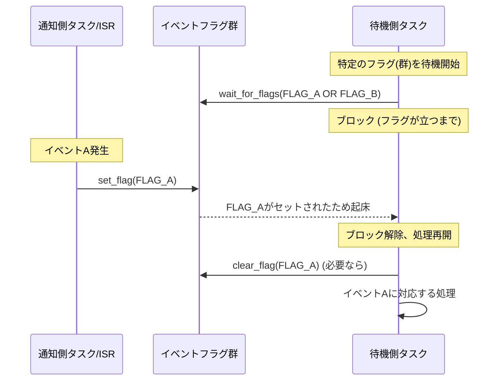
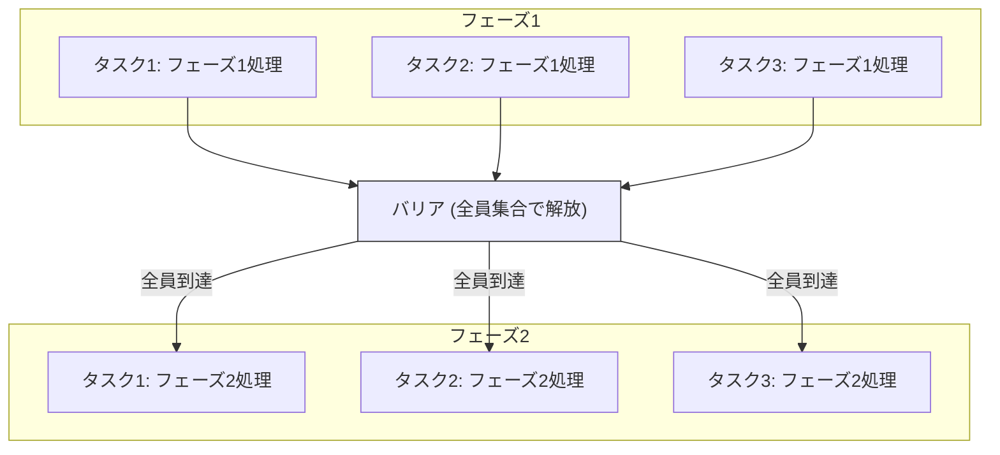

**目次**

- [並行処理設計 初級：タスクをどう分ける？ 基本的な同期パターンを学ぶ](#並行処理設計-初級タスクをどう分ける-基本的な同期パターンを学ぶ)
- [はじめに：入門編の復習と、設計へのステップアップ](#はじめに入門編の復習と設計へのステップアップ)
- [第 1 部：タスク分割の設計原則](#第-1-部タスク分割の設計原則)
  - [機能、イベントソース、優先度、実行周期などに基づく分割](#機能イベントソース優先度実行周期などに基づく分割)
  - [タスクの粒度（大きすぎず、小さすぎず）](#タスクの粒度大きすぎず小さすぎず)
  - [タスク間のインターフェース設計](#タスク間のインターフェース設計)
- [第 2 部：タスク間通信 (IPC - Inter-Process Communication) の基本パターン](#第-2-部タスク間通信-ipc---inter-process-communication-の基本パターン)
  - [共有メモリ（排他制御を伴う）の正しい使い方](#共有メモリ排他制御を伴うの正しい使い方)
  - [メッセージキューによる非同期通信](#メッセージキューによる非同期通信)
  - [イベントフラグ/シグナルによる単純な通知](#イベントフラグシグナルによる単純な通知)
- [第 3 部：代表的なタスク同期パターン](#第-3-部代表的なタスク同期パターン)
  - [プロデューサー/コンシューマーパターン（キューとセマフォ/条件変数）](#プロデューサーコンシューマーパターンキューとセマフォ条件変数)
  - [リーダー/ライターパターン（リーダー/ライターロックの応用）](#リーダーライターパターンリーダーライターロックの応用)
  - [バリア同期（「排他制御 初級」のバリアの応用）](#バリア同期排他制御-初級のバリアの応用)
  - [定期実行タスクとイベント駆動タスクの連携](#定期実行タスクとイベント駆動タスクの連携)
- [ケーススタディ：排他制御の適用例](#ケーススタディ排他制御の適用例)
- [おわりに：より複雑な並行処理への準備](#おわりにより複雑な並行処理への準備)

# 並行処理設計 初級：タスクをどう分ける？ 基本的な同期パターンを学ぶ

# はじめに：入門編の復習と、設計へのステップアップ

若手エンジニアの皆さん、「並行処理設計 入門」では、なぜ並行処理が必要なのか、その基本的なモデル（共有メモリ、メッセージパッシング）、そして複数の処理を安全に協調動作させるための「同期」の重要性について学びましたね。共有リソースへのアクセスには排他制御が不可欠であり、それなしではいとも簡単に競合状態が発生してしまうことも体験しました。

入門編が「並行処理のなぜ？」と「基本的な危険性」に焦点を当てていたとすれば、この「初級編」では、より一歩進んで、「**どのようにして、より安全で、より構造化された並行プログラムを設計し、実装していくのか？**」という、より具体的な「How」の部分に踏み込んでいきます。

とくに、

- 複雑なシステムを、どのような基準で「**タスク（スレッド）**」に分割すればよいのか？（**タスク分割の設計原則**）
- 分割されたタスク間で、どのようにして安全かつ効率的に情報をやり取り（**タスク間通信**）し、互いの処理の足並みを揃える（**タスク同期**）のか？
- そして、これらのタスク間通信と同期を実現するための、代表的な「**基本的な同期パターン**」とは何か？

といった点を中心に、実践的な知識とテクニックを学んでいきます。

この資料を通じて、皆さんが、単にスレッドを起動するだけでなく、複数のタスクが協調して動作する小さなシステムを、自信を持って設計・実装できるようになること。そして、より複雑な並行処理の課題に立ち向かうための基礎体力を養うこと。それが、この「初級編」の目標です。

（なお、ミューテックスやセマフォといった個々の同期プリミティブの詳細な使い方や注意点については、「排他制御入門」および「排他制御 初級」の資料も合わせて参照してください。この資料では、それらのプリミティブを「道具」として、どのように「パターン」として活用するかに焦点を当てます。）

# 第 1 部：タスク分割の設計原則

並行処理システムを設計する際の最初の大きなステップは、システム全体が持つべき機能を、複数の独立して（あるいは協調して）動作する「**タスク (Task)**」（またはスレッド）にどのように分割するか、という「**タスク分割 (Task Decomposition)**」です。

適切なタスク分割は、システムのモジュール性、保守性、拡張性、そしてリアルタイム性能に大きな影響を与えます。しかし、「唯一の正しい分割方法」というものは存在せず、システムの特性や要求に応じて、様々な観点から最適な分割方法を検討する必要があります。

この部では、タスク分割を行う際の基本的な考え方や、一般的な設計指針について見ていきましょう。

## 機能、イベントソース、優先度、実行周期などに基づく分割

システムをタスクに分割する際には、以下のような様々な「切り口」や「基準」が考えられます。これらを単独で、あるいは組み合わせて適用することで、より合理的で管理しやすいタスク構成を目指します。

1. **機能に基づく分割 (Functional Decomposition):**

   - **考え方:** システムが持つべき主要な「機能」や「責務」ごとに、それぞれを担当するタスクを割り当てます。これは、ソフトウェア設計における「関心の分離 (Separation of Concerns)」の原則を、タスクレベルで適用するものです。
   - **例:**
     - 通信制御システム：「受信処理タスク」「送信処理タスク」「データ処理タスク」「ユーザーインターフェースタスク」
     - モーター制御システム：「センサーデータ取得タスク」「制御アルゴリズム実行タスク」「モータードライブ出力タスク」「状態監視タスク」
   - **メリット:** 各タスクの役割が明確になり、開発の分担や、個々のタスクの設計・テストが容易になります。
   - **注意点:** 機能間の連携が密接な場合、タスク間通信が頻繁になり、そのオーバーヘッドや複雑さが問題になる可能性もあります。

2. **イベントソースに基づく分割 (Event Source Decomposition):**

   - **考え方:** システムが応答すべき主要な「イベントの発生源」ごとに、そのイベントを処理する専門のタスクを割り当てます。
   - **例:**
     - ユーザーからのキー入力イベントを処理する「キー入力ハンドリングタスク」
     - 特定のセンサーからの割り込み信号を処理する「センサー A 処理タスク」
     - ネットワークからのデータ受信を処理する「ネットワーク受信タスク」
     - タイマー満了イベントを処理する「定期処理タスク」
   - **メリット:** イベントの種類ごとに処理ロジックを分離でき、応答性が重要なイベントに対して専用のタスクを割り当てることで、リアルタイム性を確保しやすくなります。
   - **注意点:** イベントの種類が非常に多い場合、タスクの数が増えすぎる可能性があります。類似のイベントは一つのタスクでまとめて処理することも検討します。

3. **優先度に基づく分割 (Priority-Based Decomposition):**

   - **考え方:** システムが実行すべき処理を、その「緊急度」や「重要度」に基づいて異なる優先度レベルに分類し、各優先度レベル（あるいはそのグループ）に対応するタスクを割り当てます。リアルタイム OS (RTOS) を使用するシステムでは、この考え方が非常に重要になります。
   - **例:**
     - 最高優先度：「緊急停止処理タスク」「安全監視タスク」
     - 高優先度：「高速なフィードバック制御ループタスク」
     - 中優先度：「通常のデータ処理タスク」「通信処理タスク」
     - 低優先度：「ログ記録タスク」「UI 更新タスク（応答性がそれほどクリティカルでない場合）」
   - **メリット:** 時間的制約の厳しいクリティカルな処理が、そうでない処理によって妨げられるのを防ぎ、システム全体のリアルタイム性と信頼性を確保します。
   - **注意点:** タスクの優先度設定は慎重に行う必要があります。不適切な優先度設定は、優先度の逆転やスターベーションといった問題を引き起こす可能性があります（「排他制御 初級」参照）。

4. **実行周期に基づく分割 (Rate-Based / Periodic Decomposition):**

   - **考え方:** 定期的に実行する必要のある処理を、その「実行周期（レート）」ごとにグループ化し、それぞれを独立した周期タスクとして割り当てます。制御系システムでは一般的なアプローチです。
   - **例:**
     - 1 ミリ秒周期：「高速センサーサンプリングタスク」「モーター電流制御タスク」
     - 10 ミリ秒周期：「PID 制御演算タスク」「フィルター処理タスク」
     - 100 ミリ秒周期：「状態表示更新タスク」「データロギングタスク」
   - **メリット:** 各処理の実行タイミングが予測しやすくなり、システムの決定論的な振る舞いを実現しやすくなります。リアルタイムスケジューリング理論（例: Rate Monotonic Scheduling）との親和性も高いです。
   - **注意点:** 異なる周期のタスク間でデータを共有・連携する際には、適切な同期メカニズム（例: メッセージキュー、ダブルバッファリングなど）と排他制御が必要です。

5. **処理の独立性・並列性に基づく分割:**
   - **考え方:** 互いにほとんど依存せず、独立して並列に実行できる可能性のある処理の塊を、それぞれ別のタスクとして割り当てます。マルチコア CPU 環境で、システムの処理能力を最大限に引き出すことを目指します。
   - **例:** 大規模な画像処理で、画像の異なる領域をそれぞれ別のタスクで並列に処理する。複数の独立した計算タスクを同時に実行する。
   - **メリット:** CPU コアを有効活用し、システム全体のスループットを向上させることができます。
   - **注意点:** タスク間のデータ依存性が本当にないか、あるいは最小限であるかを慎重に評価する必要があります。依存性がある場合は、その同期のためのオーバーヘッドが並列化のメリットを上回らないように注意が必要です。

**組み合わせとバランスが重要**

実際には、これらの分割基準は単独で使われるよりも、**組み合わせて適用される**ことが多いです。たとえば、「機能」で大まかに分割し、さらにその内部で「優先度」や「実行周期」に基づいてタスクを細分化する、といったアプローチです。

どの基準を重視し、どの程度の粒度でタスクに分割するかは、システムの複雑さ、リアルタイム要件、利用可能なリソース（CPU パワー、メモリ）、そして開発チームのスキルや経験などを総合的に考慮して、**バランスの取れた判断**をすることが求められます。

タスク分割は、並行処理設計のまさに「最初の設計判断」であり、この段階での決定が、後のシステムの構造、性能、そして保守性に大きな影響を与えることを心に留めておきましょう。

## タスクの粒度（大きすぎず、小さすぎず）

前のセクションで、タスク分割のための様々な基準について見てきました。これらの基準を適用してタスクを設計する際に、もう一つ非常に重要な考慮事項があります。それが、「**タスクの粒度 (Task Granularity)**」です。

タスクの粒度とは、**個々のタスクが担当する仕事の「大きさ」や「範囲」**を指します。一つのタスクにどれだけの機能や処理をまとめるか、あるいはどれだけ細かくタスクを分割するか、という設計判断です。

このタスクの粒度は、システムの性能、応答性、モジュール性、そして開発・保守のしやすさに大きな影響を与えます。そして、ここでもまた、「大きすぎてもダメ、小さすぎてもダメ」という、バランスの取れた設計が求められます。

**粒度が大きすぎるタスク (Coarse-grained Tasks) の問題点**

もし、一つのタスクにあまりにも多くの異なる機能や、長時間かかる処理を詰め込んでしまうと（粒度が大きすぎると）、以下のような問題が生じやすくなります。

- **応答性の低下:**
  タスクが大きな処理の塊を実行している間は、そのタスクは他の（もしかしたらより緊急度の高い）イベントに応答できません。とくにシングルスレッドで実装されたタスクの場合、その処理が終わるまで他のすべての処理がブロックされてしまいます。これにより、システム全体の応答性が悪化し、ユーザー操作への反応が鈍くなったり、リアルタイム制約を満たせなくなったりする可能性があります。
- **優先度の扱いが困難:**
  一つのタスク内に、優先度の高い処理と低い処理が混在していると、タスク全体の優先度を適切に設定するのが難しくなります。高優先度に設定すると、実際には優先度が低い処理までが高優先度で実行されてしまい、他の本当に重要なタスクの実行を妨げる可能性があります。逆に低優先度にすると、タスク内の重要な処理の実行が遅れてしまうかもしれません。
- **モジュール性の低下と保守の困難:**
  多くの異なる機能が一つのタスクに集中すると、そのタスクのコードは長大で複雑になりがちです（「神タスク」化）。個々の機能の理解や修正が難しくなり、変更の影響範囲も広がりやすくなります。テストも困難になります。
- **並列性の制限（マルチコア環境）:**
  処理の塊が大きすぎると、それを複数の CPU コアに効果的に分散させることが難しくなり、マルチコアの利点を十分に活かせない可能性があります。

**粒度が小さすぎるタスク (Fine-grained Tasks) の問題点**

逆に、システムをあまりにも細かく、多数の小さなタスクに分割しすぎると（粒度が小さすぎると）、以下のような問題が生じる可能性があります。

- **タスク切り替え（コンテキストスイッチ）のオーバーヘッド増大:**
  OS がタスクを切り替える際には、現在のタスクの状態（レジスタなど）を保存し、次に実行するタスクの状態を復元するという「コンテキストスイッチ」が発生します。このコンテキストスイッチには、ある程度の CPU 時間（オーバーヘッド）が必要です。タスクの数が非常に多く、かつ各タスクの実行時間が非常に短い場合、このコンテキストスイッチのオーバーヘッドが相対的に大きくなり、システム全体の有効な処理時間が減少してしまう（CPU をタスク切り替えにばかり使ってしまう）可能性があります。
- **タスク間通信と同期のオーバーヘッド増大:**
  細かく分割されたタスク同士は、協調して動作するために、より頻繁にタスク間通信（メッセージキュー、セマフォなど）や同期処理を行う必要が出てくるかもしれません。これらの通信・同期処理にもオーバーヘッドが伴います。
- **システム全体の理解の困難（別の意味で）:**
  タスクの数が極端に多いと、今度は個々のタスクの役割は単純でも、それらがどのように連携してシステム全体の機能を実現しているのか、その全体像を把握するのが難しくなることがあります。タスク間の依存関係が複雑に絡み合い、管理が煩雑になる可能性もあります。
- **リソース消費の増大（タスク制御ブロックなど）:**
  各タスクは、OS によって管理されるためのデータ構造（タスク制御ブロック - TCB）や、自身のスタック領域を必要とします。タスクの数が多すぎると、これらのリソース消費が無視できなくなる場合があります（とくにメモリ制約の厳しい組み込みシステム）。

**適切な粒度の見つけ方：バランスとトレードオフ**

では、どうすれば「適切な」タスクの粒度を見つけることができるのでしょうか？ これにもまた「銀の弾丸」はなく、システムの特性や要件に応じた**バランス感覚**と**トレードオフの判断**が重要になります。

- **まずは関心の分離を基本に:**
  「機能」「イベントソース」「優先度」といった基準で、まずは論理的に関心事が異なる部分をタスクとして分割することを考えます。
- **応答性とリアルタイム要件を考慮:**
  時間的制約の厳しい処理は、他の処理から独立した、比較的小さな高優先度タスクとして分離することを検討します。UI 応答性を担当するタスクも、他の重い処理から分離します。
- **データフローと依存関係を分析:**
  タスク間でどのようにデータが流れ、どのタスクがどのタスクの結果を待つ必要があるのかを分析します。密接に関連し、頻繁にデータをやり取りする一連の処理は、一つのタスクにまとめた方が効率的な場合もあります。
- **オーバーヘッドを意識する:**
  タスク切り替えやタスク間通信のオーバーヘッドが、システムのパフォーマンスに許容できないほどの影響を与えないか、とくにタスク数が多くなりそうな場合は注意します。
- **測定と調整（反復的なアプローチ）:**
  最初から完璧なタスク分割を目指すのは難しいものです。まずはある程度の設計で実装を進め、プロファイリングツールなどで実際のシステムの動作（CPU 使用率、タスクの実行時間、コンテキストスイッチの頻度、応答時間など）を測定し、ボトルネックや問題点が見つかれば、タスクの分割・統合といった再設計を行う、という反復的なアプローチが有効です。
- **シンプルさを心がける（KISS 原則）:**
  不必要に複雑なタスク構成は避けます。理解しやすく、保守しやすい構造を常に目指します。

タスクの粒度は、多すぎても少なすぎても問題を引き起こします。「この処理は独立したタスクにするほどの『重さ』や『独立性』があるか？」「このタスクは、あまりに多くの異なることをやりすぎていないか？」といった自問自答を繰り返しながら、システム全体のバランスを見て、最適な分割点を探っていくことが、効果的な並行処理設計の鍵となるのです。

## タスク間のインターフェース設計

システムを複数のタスクに分割したら、次に重要になるのは、それらの**タスク同士がどのように情報をやり取りし、互いの処理を連携させるか**、つまり「**タスク間のインターフェース (Interface)**」をどのように設計するか、という点です。

個々のタスクがどれほど優れたロジックを持っていても、それらがうまく協調動作できなければ、システム全体としては期待通りに機能しません。明確で、効率的で、そして安全なタスク間インターフェースは、堅牢で保守しやすい並行システムの土台となります。

**インターフェース設計で考慮すべきこと**

タスク間のインターフェースを設計する際には、主に以下の点を考慮する必要があります。

1. **通信の方法 (Communication Mechanism):**

   - タスク間で情報を伝達するために、どのような仕組みを使うか？
     - **共有メモリ (Shared Memory):** グローバル変数や共有バッファを通じてデータを直接読み書きする。最も原始的で高速な可能性があるが、厳密な排他制御が不可欠。
     - **メッセージキュー (Message Queue):** 一方のタスクがメッセージ（データを含むことができる）をキューに送信し、もう一方のタスクがキューからメッセージを受信する。非同期的な通信に適しており、タスク間の結合度を下げやすい。
     - **イベントフラグ / シグナル (Event Flags / Signals):** 特定のイベントの発生を、他のタスクに単純なフラグやシグナルで通知する。データの受け渡しは伴わないか、ごく少量。
     - **セマフォ (Semaphore):** リソースの利用可能性を通知したり、処理の完了を待ったりする同期にも使われる。
     - **(より高度なもの) RPC (Remote Procedure Call) / ソケット通信:** 異なるプロセス間や、ネットワーク越しのタスク間通信で使われる。
   - 選択するメカニズムは、通信するデータの種類や量、同期/非同期の要件、リアルタイム制約などによって異なります。

2. **データの形式と内容 (Data Format and Content):**

   - タスク間でどのようなデータをやり取りするのか、そのデータの構造（例: 構造体、固定長の配列、可変長のメッセージなど）と、各フィールドの意味を明確に定義します。
   - データのエンディアン（バイトオーダー）やアライメントが問題になるような、異なるハードウェアアーキテクチャが混在するシステムでは、とくに注意が必要です。
   - 可能であれば、やり取りするデータは**不変 (Immutable)** にするか、あるいは明確な**所有権 (Ownership)** を持つように設計すると、競合状態のリスクを減らせます。

3. **同期の方式 (Synchronization Method):**

   - タスク間の処理のタイミングをどのように合わせるか？
     - **同期的 (Synchronous):** 一方のタスクがもう一方のタスクからの応答や処理完了を待つ（ブロックする）。
     - **非同期的 (Asynchronous):** 一方のタスクはメッセージを送信（またはイベントを通知）したら、応答を待たずに自身の処理を続ける。応答は後で別のメッセージやコールバックで受け取る。
   - 非同期的な連携はシステム全体の応答性を高めるのに役立ちますが、処理の順序や状態管理が複雑になる可能性があります。

4. **エラーハンドリング (Error Handling):**

   - タスク間通信の途中でエラーが発生した場合（例: メッセージキューが満杯、送信先のタスクが存在しない、通信タイムアウトなど）、それをどのように検出し、どのように処理するかを明確に定義します。
   - エラー情報をどのように相手タスクに伝えるか、あるいは上位の管理タスクに報告するかのルールも必要です。

5. **インターフェースの明確な定義 (API 仕様):**
   - 各タスクが他のタスクに対して提供する「サービス」や、他のタスクから受け付ける「要求」を、関数シグネチャ、メッセージフォーマット、プロトコルといった形で明確に定義します。
   - これは、各タスクの「公開インターフェース (API)」となり、タスク間の依存関係を管理し、個々のタスクを独立して開発・テストするための基礎となります。
   - コメントやドキュメントで、各インターフェースの事前条件、事後条件、期待される振る舞い、エラー時の挙動などを記述しておくことが重要です。

**設計原則の適用**

タスク間のインターフェース設計においても、これまでに学んできたソフトウェア設計の基本的な原則が役立ちます。

- **疎結合 (Low Coupling):**
  タスク同士は、互いの内部実装の詳細にできるだけ依存しないように設計します。明確に定義されたインターフェース（メッセージや API）を通じてのみ連携することで、一方のタスクの変更が他方に影響を与えにくくなります。
- **高凝集 (High Cohesion):**
  各タスクは、自身の明確な責任範囲内の処理に集中し、関連性の低い機能を他のタスクに押し付けないようにします。
- **情報隠蔽 (Information Hiding):**
  タスクは、自身の内部状態や実装の詳細を他のタスクから隠蔽し、公開されたインターフェースを通じてのみ必要な情報を提供・操作できるようにします。
- **関心の分離 (Separation of Concerns):**
  通信処理のロジック、データ変換のロジック、そして本来のビジネスロジックなどを、可能な範囲で分離して設計します。

**インターフェース設計は「契約」である**

タスク間のインターフェースは、タスク同士が互いに期待する振る舞いや、提供するサービスに関する「**契約**」であると考えることができます。この契約が明確で、安定的で、かつ双方にとって理解しやすいものであればあるほど、システム全体はより堅牢で、保守しやすく、そして拡張しやすいものになります。

逆に、インターフェースが曖昧だったり、頻繁に変更されたり、あるいは複雑すぎたりすると、タスク間の連携は脆くなり、バグの温床となったり、システム全体の変更を困難にしたりするでしょう。

タスク分割と並んで、このタスク間インターフェースの設計は、並行処理システムの品質を左右する、非常に重要な設計活動なのです。

# 第 2 部：タスク間通信 (IPC - Inter-Process Communication) の基本パターン

システムを複数のタスクに分割したら、これらのタスクが互いに情報を交換し、協調して動作するための仕組み、すなわち「**タスク間通信 (Inter-Task Communication または Inter-Process Communication - IPC)**」が必要になります。

IPC には様々な方法がありますが、それぞれに特徴があり、適した利用場面や注意点が異なります。「並行処理設計 入門」で触れた「共有メモリモデル」と「メッセージパッシングモデル」は、まさにこの IPC の基本的な考え方を反映したものです。

この部では、代表的なタスク間通信のパターンと、それらを実装する上で不可欠となる同期プリミティブ（「排他制御入門」「排他制御 初級」で学んだミューテックスやセマフォなど）の正しい使い方について、より具体的に見ていきます。

## 共有メモリ（排他制御を伴う）の正しい使い方

複数のタスク（スレッド）が同じプロセスのメモリ空間を共有している環境において、最も直接的で、かつ潜在的に最も高速なタスク間通信の方法が、「**共有メモリ (Shared Memory)**」を利用するものです。これは、グローバル変数、静的変数、あるいはヒープ上に確保され複数のタスクからポインタでアクセスされるデータ構造などを通じて、タスク間で情報を直接読み書きするアプローチです。

しかし、「並行処理設計 入門」や「排他制御入門」で繰り返し学んだように、**共有メモリへのアクセスは、何の制御もなしに行うと、いとも簡単にデータ競合や不整合を引き起こします。** したがって、共有メモリをタスク間通信の手段として安全に利用するためには、**厳密な「排他制御」が絶対に不可欠**です。

**共有メモリ利用の基本的な流れと排他制御**

1. **共有するデータ構造の定義:**
   タスク間で共有したい情報を格納するためのデータ構造（例: グローバルな構造体変数、共有バッファ配列など）を定義します。

   ```c
   // 例: センサーデータとステータスを共有する構造体
   typedef struct {
       float temperature;
       int   humidity;
       bool  is_valid;
       // ... 他のデータメンバ
   } SharedSensorData_t;

   volatile SharedSensorData_t g_latest_sensor_data; // 共有されるグローバル変数
   // Mutex_t g_sensor_data_mutex; // このデータを保護するためのミューテックス (後で初期化)
   ```

   `volatile` キーワードは、コンパイラの最適化によってメモリアクセスが省略されたり順序が変更されたりするのを防ぎ、変数がいつでも変更されうることを示すために、共有変数に対してしばしば（ただし、これだけではスレッドセーフティは保証されません）使われます。

2. **排他制御メカニズムの準備:**
   共有データ構造へのアクセスを保護するための排他制御メカニズム（通常は**ミューテックス**）を用意し、初期化します。

   ```c
   // (RTOS API風の疑似コード)
   // rtos_mutex_create(&g_sensor_data_mutex);
   ```

3. **クリティカルセクション内でのアクセス:**
   共有メモリにアクセスするすべてのコード区間（読み取り、書き込み、あるいはその両方）は、必ず**クリティカルセクション**として扱い、事前にミューテックスを獲得（ロック）し、アクセスが終わったら速やかにミューテックスを解放（アンロック）します。

   **書き込み側のタスク (例: センサーデータ取得タスク):**

   ```c
   // void sensor_reading_task() {
   //     SensorValues_t current_values = read_from_physical_sensor();
   //
   //     if (rtos_mutex_lock(&g_sensor_data_mutex, SENSOR_MUTEX_TIMEOUT) == RTOS_SUCCESS) {
   //         // --- クリティカルセクション開始 ---
   //         g_latest_sensor_data.temperature = current_values.temp;
   //         g_latest_sensor_data.humidity = current_values.hum;
   //         g_latest_sensor_data.is_valid = true;
   //         // --- クリティカルセクション終了 ---
   //         rtos_mutex_unlock(&g_sensor_data_mutex);
   //     } else {
   //         // ロック獲得失敗（タイムアウトなど）のエラー処理
   //     }
   // }
   ```

   **読み出し側のタスク (例: データ表示タスク):**

   ```c
   // void data_display_task() {
   //     SharedSensorData_t local_copy; // 安全なローカルコピー用
   //     bool data_was_valid = false;
   //
   //     if (rtos_mutex_lock(&g_sensor_data_mutex, DISPLAY_MUTEX_TIMEOUT) == RTOS_SUCCESS) {
   //         // --- クリティカルセクション開始 ---
   //         if (g_latest_sensor_data.is_valid) {
   //             local_copy = g_latest_sensor_data; // 構造体全体をコピー
   //             data_was_valid = true;
   //             // (読み取った後、もしフラグをクリアするならここで行う)
   //             // g_latest_sensor_data.is_valid = false;
   //         }
   //         // --- クリティカルセクション終了 ---
   //         rtos_mutex_unlock(&g_sensor_data_mutex);
   //     } else {
   //         // ロック獲得失敗のエラー処理
   //     }
   //
   //     if (data_was_valid) {
   //         display_on_screen(local_copy.temperature, local_copy.humidity);
   //     }
   // }
   ```

**正しい使い方のポイント:**

- **保護対象の明確化:** どの共有データが、どのミューテックスによって保護されているのかを、設計上もコード上も明確にします。一つのミューテックスが、論理的に関連する一まとまりのデータを保護するのが一般的です。
- **クリティカルセクションの最小化:** 「排他制御 初級」で学んだように、ミューテックスを保持する時間（クリティカルセクションの長さ）は、共有データへのアクセスに必要な**最小限の期間**に留めます。時間のかかる処理は、データをローカルにコピーするなどして、ロックの外で行います。
- **ロック獲得と解放の徹底:** クリティカルセクションのすべての入り口でロックを獲得し、すべての出口（正常終了、エラーリターン、例外など）で**必ずロックを解放**します。解放忘れは致命的なデッドロックの原因となります。
- **デッドロックへの配慮:** 複数のミューテックスを使用する場合は、すべてのタスクが同じ順序でロックを獲得するように設計し、デッドロックを予防します。
- **データのコピーの活用:**
  - 読み出し側は、ロックを獲得した後、共有データを速やかにローカル変数にコピーし、ロックを解放してからそのローカルコピーを使って処理を行うことで、ロック保持時間を短縮できます。
  - 書き込み側も、書き込むデータをまずローカルで完全に準備してから、ロックを獲得し、迅速に共有メモリにコピー（または更新）し、ロックを解放する、という手順が推奨されます。
- **`volatile` の適切な使用:** コンパイラの最適化によって共有変数へのメモリアクセスが期待通りに行われないことを防ぐため、共有変数には `volatile` キーワードを付けることが C/C++ では一般的です。ただし、`volatile` はアトミック性を保証するものでも、キャッシュコヒーレンシを解決するものでもないため、これだけでスレッドセーフになるわけではありません。あくまで排他制御と組み合わせて使うものです。

**共有メモリ利用のメリット（再掲）：**

- **潜在的な高速性:** データコピーのオーバーヘッドが（メッセージパッシングに比べて）少ないため、適切に排他制御されていれば、タスク間で非常に高速に情報を共有できます。
- **柔軟なデータ構造:** 複雑なデータ構造も比較的容易に共有できます。

**共有メモリ利用のデメリット（再掲）：**

- **排他制御の必須性と複雑さ:** 安全に使うためには、ミューテックスなどの排他制御が不可欠であり、その設計と実装（デッドロック回避、優先度逆転対策など）は依然として複雑で、バグを生みやすい箇所です。
- **密結合になりやすい:** タスクが共有データの具体的な構造に直接依存するため、そのデータ構造の変更が複数のタスクに影響を与えやすく、疎結合な設計を妨げる可能性があります。
- **スケーラビリティのボトルネック:** 共有データへのアクセスが頻繁で、かつロックによる競合が多い場合、そのロックがシステム全体のスケーラビリティのボトルネックとなることがあります。

共有メモリは、その手軽さと潜在的な効率性から、多くの並行システムでタスク間通信の手段として利用されています。しかし、その力を安全に引き出すためには、**「共有するものは最小限に」「アクセスは厳密に保護する」**という原則を常に念頭に置き、慎重な設計と実装を心がけることが何よりも重要です。

## メッセージキューによる非同期通信

共有メモリとミューテックスを使ったタスク間通信は、データを直接的にやり取りできる反面、厳密な排他制御が必要で、使い方を誤ると競合状態やデッドロックといった問題を引き起こしやすいという側面がありました。

これに対し、「**メッセージキュー (Message Queue)**」（または単に「キュー」）は、**タスク間でデータをコピーして受け渡す**ことで、より疎結合で、かつ非同期的な通信を実現するための一般的な IPC (タスク間通信) メカニズムです。メッセージキューは、その名の通り、メッセージを一時的に格納しておく「キュー（待ち行列）」のデータ構造を中心に動作します。

**メッセージキューの基本的な仕組みと操作**

1. **キューの作成:**
   まず、システム内にメッセージを格納するためのキューを作成します。キューを作成する際には、通常、以下の要素を指定します。

   - **キューの最大長（容量）:** 一度にキューに格納できるメッセージの最大数。
   - **メッセージの最大サイズ（または固定サイズ）:** キューでやり取りする個々のメッセージのデータサイズ。
     多くの RTOS は、メッセージキューの作成と管理のための API を提供しています。

2. **メッセージの送信 (Send / Post / Enqueue):**
   あるタスク（**送信側タスク / プロデューサー**）が、別のタスク（**受信側タスク / コンシューマー**）に情報を伝えたい場合、送信側タスクは伝えたいデータ（またはデータへのポインタ）を「メッセージ」としてパッケージ化し、それを対象のメッセージキューに送信（ポスト、エンキュー）します。

   - **ノンブロッキング送信（一般的）:** 送信操作は、通常、キューに空きがあればメッセージを格納してすぐに制御を返すノンブロッキングな動作をします。
   - **キューが満杯の場合の動作:** もしキューが満杯で新しいメッセージを格納できない場合、送信タスクの動作は実装によります。
     - 即座にエラーを返す。
     - キューに空きができるまで一定時間待機（タイムアウト付きブロック）。
     - キューに空きができるまで無期限に待機（ブロック）。

3. **メッセージの受信 (Receive / Pend / Dequeue):**
   別のタスク（**受信側タスク / コンシューマー**）は、メッセージキューからメッセージを受信（ペンド、デキュー）しようとします。
   - **ブロッキング受信（一般的）:** 受信操作は、通常、キューにメッセージが到着するまでタスクをブロック（待機）させます。メッセージが到着すると、タスクは目覚めてメッセージを受け取り、処理を再開します。タイムアウト付きの受信操作も一般的です。
   - **ノンブロッキング受信（ポーリング）:** キューをチェックし、メッセージがあれば受け取り、なければ即座に制御を返す（エラーまたはメッセージなしを示す）。
   - **FIFO (First-In, First-Out):** ほとんどのメッセージキューは FIFO 順でメッセージを処理します。つまり、先に送信されたメッセージが先に受信されます。

```mermaid
graph TD
    subgraph 送信側タスク (プロデューサー)
        P_Logic["処理ロジックP"]
        P_Msg["メッセージ作成"]
    end
    subgraph 受信側タスク (コンシューマー)
        C_Logic["処理ロジックC"]
        C_Msg["メッセージ処理"]
    end

    MQ["メッセージキュー<br>(FIFO, 有限バッファ)"]

    P_Logic --> P_Msg
    P_Msg -- Send(メッセージ) --> MQ
    MQ -- Receive(メッセージ) --> C_Msg
    C_Msg --> C_Logic

    style MQ fill:#lightyellow,stroke:#333
    style P_Logic fill:#lightblue,stroke:#333
    style C_Logic fill:#lightgreen,stroke:#333
```

_図: メッセージキューによるタスク間通信の基本的な流れ_

**メッセージキュー利用のメリット**

メッセージキューを使ったタスク間通信には、多くのメリットがあります。

1. **タスク間の疎結合:**
   送信側タスクと受信側タスクは、互いの存在や状態を直接知る必要がありません。共通のメッセージキューの「名前」や「ハンドル」さえ知っていれば、非同期にメッセージをやり取りできます。これにより、各タスクの独立性が高まり、システムの変更や拡張が容易になります。
2. **非同期通信の容易な実現:**
   送信側はメッセージを送ったらすぐに自身の処理に戻れ、受信側はメッセージが来るまで待機できるため、システム全体の応答性を損なうことなく、タスク間の連携が可能です。
3. **データのコピーによる安全性:**
   多くの場合、メッセージキューを通じて渡されるのはデータの**コピー**（あるいは不変なデータへの参照）です。これにより、送信側と受信側が同じメモリ領域を同時に変更しようとして競合状態が発生する、といったリスクを（共有メモリ方式に比べて）大幅に低減できます。排他制御の必要性が、キュー自体の内部実装にカプセル化されるため、アプリケーションレベルでの複雑なロック管理が不要になることが多いです。
4. **バッファリングによる負荷平準化:**
   送信側が一時的に多くのメッセージを生成しても、キューがそれらをバッファリングし、受信側が自身のペースで処理できるようにすることで、システム全体の負荷を平準化し、安定性を高めます。
5. **優先度に基づいたメッセージ処理（一部のキュー）:**
   メッセージ自体に優先度を付けられる機能を持つキューもあり、受信側が優先度の高いメッセージから処理できるようになります。

**メッセージキュー利用の注意点と考慮事項**

- **キューのオーバーフロー:**
  キューのバッファサイズは有限です。もし送信側のメッセージ生成速度が、受信側の処理速度を継続的に上回ると、キューが満杯になり、新しいメッセージを送信できなくなる（あるいは古いメッセージが失われる）可能性があります。キューのサイズを適切に見積もり、オーバーフロー発生時の対処（送信側ブロック、エラー通知、メッセージ破棄など）を明確に設計する必要があります。これはバックプレッシャーの問題とも関連します。
- **メッセージのコピーコスト:**
  大きなデータをメッセージとして頻繁にやり取りする場合、そのデータのコピーにかかる時間とメモリがオーバーヘッドとなる可能性があります。場合によっては、データそのものではなく、データが格納されている共有メモリ領域へのポインタ（と、そのアクセスを制御するための通知）をメッセージとして送る、といった工夫も考えられます（ただし、これは再び共有メモリの排他制御の問題に繋がります）。
- **デッドロック（間接的に）:**
  メッセージキュー自体が直接デッドロックを引き起こすことは稀ですが、たとえばタスク A がタスク B からのメッセージを待ち、タスク B もタスク A からのメッセージを待つ、といった「通信の循環待ち」が発生すると、デッドロック状態に陥ります。また、キューが満杯で送信側がブロックし、その送信側が保持している別のリソース（ミューテックスなど）を、キューを処理すべき受信側が必要としている、といった複雑な依存関係でもデッドロックは起こりえます。
- **メッセージのフォーマットとバージョニング:**
  システムが進化する中で、メッセージのデータ構造（フォーマット）を変更する必要が出てくることがあります。その際、異なるバージョンのメッセージフォーマットを扱うタスク間で互換性を保つための考慮が必要です。
- **メッセージの損失（信頼性の低いキューの場合）:**
  システムによっては、メッセージの完全な到達を保証しない（例: UDP ベースのメッセージング）軽量なキューが使われることもあります。その場合は、アプリケーションレベルでメッセージの欠損や順序の入れ替わりに対処する必要があります。（多くの RTOS が提供するメッセージキューは、通常、信頼性の高い（損失しない、順序保証）ものです。）

**どのような場面で有効か？**

メッセージキューは、

- **タスク間で非同期的にデータを渡したい場合。**
- **処理の依頼（コマンド）や、状態変化の通知（イベント）を、別のタスクに伝えたい場合。**
- **ISR からタスクへ、比較的まとまったデータや複数の情報を安全に渡したい場合。**
- **複数のプロデューサーと複数のコンシューマーが、共通のデータストリームを処理する場合。**
- **システムの異なる部分を疎結合に保ち、変更の影響範囲を限定したい場合。**

といった多くの場面で、非常に有効なタスク間通信の手段となります。

共有メモリとミューテックスが「同じ机の上で、注意深く道具を共有しながら作業する」イメージだとすれば、メッセージキューは「それぞれの作業者が、完成した部品や指示書を、中央の受け渡し箱に入れて、次の担当者に渡していく」ような、より分業的で流れ作業的なイメージに近いかもしれません。どちらが良いかは、解決したい問題の性質によります。

## イベントフラグ/シグナルによる単純な通知

メッセージキューが「データを伴うメッセージ」のやり取りに適しているのに対し、タスク間で**単純な「出来事の発生」や「条件の成立」だけを通知し、それに基づいて相手タスクの動作を同期させたい**という、より軽量なコミュニケーションが必要な場合があります。このような場合に用いられるのが、「**イベントフラグ (Event Flags)**」や「**シグナル (Signals)**」といった同期プリミティブです。
（これらは OS や環境によって呼び名が異なり、セマフォ（とくにバイナリセマフォ）が同様の目的で使われることもあります。）

**イベントフラグ/シグナルの基本的な考え方**

- **フラグ (旗):**
  システム内に、一つまたは複数の「旗（フラグ）」を用意しておきます。各フラグは、特定のイベントや条件に対応し、「立っている（セットされている）」か「倒れている（クリアされている）」かの二つの状態を持ちます。
- **イベントの通知 (フラグを立てる / Set):**
  あるタスクや ISR が、特定のイベントが発生したこと、あるいは特定の条件が満たされたことを他のタスクに知らせたい場合、対応するフラグを「立てます（セットします）」。
- **イベントの待機 (フラグを待つ / Wait / Pend):**
  別のタスクは、一つまたは複数の特定のフラグが「立つ」のを待機します。待機中、そのタスクは通常ブロック（スリープ）します。指定されたフラグ（またはフラグの組み合わせ）が立つと、タスクは目覚めて処理を再開します。
- **フラグのクリア (Clear):**
  待機していたタスクが目覚めた後、あるいはイベントを通知した側が、そのフラグを「倒して（クリアして）」、次のイベント通知に備えるのが一般的です。クリアのタイミング（自動か手動か）は、フラグのタイプや OS の実装によります。



_図: イベントフラグによるタスク間通知のイメージ_

**イベントフラググループ (Event Flag Group)**

多くの RTOS では、複数のイベントフラグを一つの「グループ」としてまとめて管理し、タスクがそのグループ内の**複数のフラグの組み合わせ（AND 条件や OR 条件）**を待機できる機能を提供しています。

- **AND 待ち:** 指定したすべてのフラグがセットされるまで待機する。
- **OR 待ち:** 指定したフラグのうち、いずれか一つでもセットされたら待機を終了する。

これにより、より複雑なイベントの発生条件の同期が可能になります。たとえば、「センサー A からのデータ準備完了フラグ **AND** 通信バッファ空きフラグ」が両方立つまで待つ、といった制御が実現できます。

**シグナル (Signal) との関連**

「シグナル」という用語は、より広範な意味で使われることがありますが、OS のコンテキストでは、プロセス（またはスレッド/タスク）に対して非同期的に特定のイベント（例: エラー発生、タイマー満了、子プロセスの終了など）を通知するための仕組みを指すことがあります。POSIX シグナル (`kill`, `signal`, `sigwait`) などがその例です。これらのシグナルも、ある種のイベント通知と待機のメカニズムと見なすことができます。

**イベントフラグ/シグナルのメリット**

1. **軽量な通知:**
   メッセージキューのようにデータを直接コピーして渡すわけではないため、イベントの発生を伝えるだけなら、非常に軽量で高速な通知手段となります。
2. **複数のイベント条件の組み合わせ待機:**
   イベントフラググループを使えば、「A かつ B を待つ」「A または B を待つ」といった、より柔軟なイベント待ち合わせが可能です。
3. **ISR からの通知に適している:**
   ISR 内では、実行時間を極力短く保つ必要があります。フラグをセットするだけの操作は非常に高速であるため、ISR からメインタスクへイベントを通知する手段として適しています。（ただし、フラグ変数へのアクセス自体はアトミックであるか、保護されている必要があります。）

**イベントフラグ/シグナルの注意点と考慮事項**

- **データ受け渡しには不向き:**
  イベントフラグ/シグナルは、基本的に「イベントが起きた」という事実を伝えるだけであり、それに付随する詳細なデータ（例: センサーの測定値、受信したメッセージの内容）を直接渡すのには向いていません。データを渡したい場合は、メッセージキューを使うか、あるいは共有メモリ（とそれを保護するミューテックス、そして準備完了を知らせるフラグ）を組み合わせる必要があります。
- **フラグのクリアタイミング:**
  フラグをどのタイミングでクリア（リセット）するかは重要な設計ポイントです。
  - **自動クリア:** イベントを待っていたタスクが目覚めた時点で、OS が自動的にフラグをクリアするタイプ。
  - **手動クリア:** タスクが明示的にクリア操作を行うまで、フラグはセットされたままのタイプ。
    手動クリアの場合、クリアし忘れると、同じイベントに対して何度も反応してしまったり、他のタスクが誤って反応したりする可能性があります。
- **待機タスクの起床順序:**
  複数のタスクが同じフラグ（またはフラグの組み合わせ）を待機している場合に、フラグがセットされたときにどのタスク（あるいはすべてのタスク）が目覚めるかは、OS の実装やフラグの設定（AND/OR 待ち、クリアオプションなど）によって異なります。
- **ロストウェイクアップの可能性（使い方による）:**
  もし、イベントを通知する側がフラグをセットする前に、待機する側がフラグの状態をチェックして「まだ立っていないから待つのをやめよう」と判断し、その直後に通知側がフラグをセットする、といった競合が起こると、イベント通知が失われてしまう（ロストウェイクアップ）可能性があります。これを避けるためには、フラグのチェックと待機操作がアトミックに行われる（あるいは、セマフォのように待機操作自体がカウンターを管理する）ようなプリミティブを使う必要があります。

**どのような場面で有効か？**

イベントフラグやシグナルは、

- **タスクの起動トリガー:** ある条件が満たされたら、スリープしているタスクを起こして処理を開始させたい。
- **単純な状態変化の通知:** 「処理完了」「エラー発生」「準備 OK」といった、YES/NO で伝えられる情報を他のタスクに知らせたい。
- **ISR からの軽量なイベント通知:** ISR が検知したハードウェアイベントを、メインの処理タスクに迅速に伝えたい（ただし、データは別途共有メモリやキューで渡すことが多い）。
- **複数のサブシステムの準備完了待ち:** 複数の初期化タスクがそれぞれ完了フラグを立て、すべてのフラグが揃ったらメイン処理を開始する、といった同期。

といった、比較的シンプルなイベント通知と同期のシナリオで効果を発揮します。より複雑なデータや、複数のメッセージを順序付けてやり取りしたい場合は、メッセージキューの方が適しているでしょう。

これらの基本的な同期プリミティブは、それぞれが持つ特性を理解し、解決したい同期問題の性質に合わせて適切に使い分けることが、堅牢で効率的な並行システムを設計するための鍵となります。

# 第 3 部：代表的なタスク同期パターン

タスク分割を行い、タスク間通信の基本的な手段（共有メモリ、メッセージキュー、イベントフラグなど）を理解したところで、次はいよいよ、これらの道具を使って、複数のタスクが協調して特定の目的を達成するための、より具体的な「設計パターン」を見ていきましょう。

並行プログラミングの世界には、繰り返し現れる典型的な同期の問題と、それに対する実績のある解決策の「型」が存在します。これらを学ぶことで、ゼロから同期方法を考える手間を省き、より安全で効率的な並行処理ロジックを構築することができます。

この部では、制御系システムを含む多くの並行システムで頻繁に利用される、代表的なタスク同期パターンをいくつか紹介し、それらがどのようにしてタスク間の協調動作を実現するのか、そしてどのような同期プリミティブが使われるのかを解説します。

## プロデューサー/コンシューマーパターン（キューとセマフォ/条件変数）

「**プロデューサー/コンシューマーパターン (Producer-Consumer Pattern)**」は、並行プログラミングにおいて最も基本的で、かつ広く応用されている同期パターンの一つです。このパターンは、**データを生成する役割のタスク（プロデューサー）と、そのデータを処理する役割のタスク（コンシューマー）が、共有のデータバッファ（通常はキュー）を介して非同期的に連携する**というモデルを扱います。

**パターンの構成要素と基本的な流れ:**

1. **プロデューサー (Producer) タスク:**
   - データを生成するか、あるいは外部からデータを受信します。
   - 生成（または受信）したデータを、共有バッファ（キュー）に格納（エンキュー）します。
2. **コンシューマー (Consumer) タスク:**
   - 共有バッファ（キュー）からデータを取り出し（デキュー）ます。
   - 取り出したデータを処理（消費）します。
3. **共有バッファ (Shared Buffer / Queue):**
   - プロデューサーが生成したデータを一時的に保持し、コンシューマーがそれを取り出せるようにするための、有限サイズの記憶領域です。通常、FIFO (First-In, First-Out) のキューとして実装されます。


_図: プロデューサー/コンシューマーパターンの基本的な構成_

**このパターンが解決しようとする主な同期問題:**

- **バッファが満杯の場合のプロデューサーの待機:** プロデューサーは、共有バッファがいっぱいのときは、新しいデータを格納できません。空きができるまで待機する必要があります。
- **バッファが空の場合のコンシューマーの待機:** コンシューマーは、共有バッファが空のときは、データを取り出せません。新しいデータが格納されるまで待機する必要があります。
- **共有バッファへの排他的アクセス:** プロデューサーがバッファに書き込んでいる最中や、コンシューマーがバッファから読み出している最中に、もう一方のタスクがバッファの内部状態（例: ポインタ、要素数）を同時に変更しようとすると、データ不整合が発生します。バッファへのアクセスは排他的に行われる必要があります。

**同期プリミティブによる実現方法:**

これらの同期問題を解決するために、一般的に以下の同期プリミティブが組み合わせて使われます。

1. **ミューテックス (Mutex):**

   - **役割:** 共有バッファの内部状態（書き込み/読み出しポインタ、要素数、バッファ配列そのものなど）へのアクセスを保護し、一度に一つのタスクだけがバッファを操作できるようにします。
   - **使い方:** プロデューサーがバッファにデータを書き込む直前、およびコンシューマーがバッファからデータを読み出す直前にミューテックスをロックし、操作が終わったらアンロックします。

2. **カウンティングセマフォ (Counting Semaphore) (2 種類):**
   - **`empty_slots` (または `not_full`) セマフォ:**
     - **役割:** 共有バッファの「**空きスロットの数**」を管理します。
     - **初期値:** バッファの最大サイズ。
     - **プロデューサー:** データをバッファに格納する**前**に、このセマフォに対して P 操作 (wait/acquire) を行います。もしカウンターが 0（つまり空きスロットがない）なら、プロデューサーは待機します。
     - **コンシューマー:** データをバッファから取り出した**後**に、このセマフォに対して V 操作 (signal/release) を行い、空きスロットが 1 つ増えたことを通知します。
   - **`filled_slots` (または `not_empty`) セマフォ:**
     - **役割:** 共有バッファ内の「**データが格納されているスロットの数**」を管理します。
     - **初期値:** 0。
     - **コンシューマー:** データをバッファから取り出す**前**に、このセマフォに対して P 操作 (wait/acquire) を行います。もしカウンターが 0（つまりデータがない）なら、コンシューマーは待機します。
     - **プロデューサー:** データをバッファに格納した**後**に、このセマフォに対して V 操作 (signal/release) を行い、データが 1 つ増えたことを通知します。

**C 言語/RTOS 風 疑似コード（再掲：「排他制御 初級」の例を一部修正）:**

```c
// #define BUFFER_SIZE 10
// Item_t g_shared_buffer[BUFFER_SIZE];
// int g_in_index = 0;
// int g_out_index = 0;

// Mutex_t g_buffer_mutex;      // バッファアクセス保護用ミューテックス
// Semaphore_t g_empty_slots_sem; // 空きスロット数セマフォ
// Semaphore_t g_filled_slots_sem;// データ入りスロット数セマフォ

// void initialize_producer_consumer() {
//     rtos_mutex_create(&g_buffer_mutex);
//     rtos_semaphore_create(&g_empty_slots_sem, BUFFER_SIZE); // 初期値: バッファサイズ
//     rtos_semaphore_create(&g_filled_slots_sem, 0);         // 初期値: 0
//     // バッファやインデックスの初期化もここで行う
// }

// void producer_task() {
//     Item_t item_to_produce;
//     while (1) {
//         produce_an_item(&item_to_produce); // データを生成
//
//         // 1. 空きスロットができるのを待つ (empty_slots_sem の P操作)
//         rtos_semaphore_wait(&g_empty_slots_sem, WAIT_FOREVER);
//
//         // 2. バッファへのアクセスをミューテックスで保護
//         rtos_mutex_lock(&g_buffer_mutex, WAIT_FOREVER);
//         // --- クリティカルセクション ---
//         g_shared_buffer[g_in_index] = item_to_produce;
//         g_in_index = (g_in_index + 1) % BUFFER_SIZE;
//         // --- クリティカルセクション ---
//         rtos_mutex_unlock(&g_buffer_mutex);
//
//         // 3. データ入りスロットが増えたことを通知 (filled_slots_sem の V操作)
//         rtos_semaphore_signal(&g_filled_slots_sem);
//     }
// }

// void consumer_task() {
//     Item_t consumed_item;
//     while (1) {
//         // 1. データがバッファに入るのを待つ (filled_slots_sem の P操作)
//         rtos_semaphore_wait(&g_filled_slots_sem, WAIT_FOREVER);
//
//         // 2. バッファへのアクセスをミューテックスで保護
//         rtos_mutex_lock(&g_buffer_mutex, WAIT_FOREVER);
//         // --- クリティカルセクション ---
//         consumed_item = g_shared_buffer[g_out_index];
//         g_out_index = (g_out_index + 1) % BUFFER_SIZE;
//         // --- クリティカルセクション ---
//         rtos_mutex_unlock(&g_buffer_mutex);
//
//         // 3. 空きスロットが増えたことを通知 (empty_slots_sem の V操作)
//         rtos_semaphore_signal(&g_empty_slots_sem);
//
//         process_consumed_item(&consumed_item); // 取り出したデータを処理
//     }
// }
```

**条件変数を使った場合（「排他制御 初級」で触れたアプローチ）:**

カウンティングセマフォの代わりに、ミューテックスと 2 つの条件変数（`バッファが満杯でないことを待つ条件` と `バッファが空でないことを待つ条件`）を使っても、同様のプロデューサー/コンシューマーパターンを実現できます。この場合、バッファ内の実際のアイテム数を明示的に管理し、その数に基づいて条件変数で `wait` や `signal`/`broadcast` を行うことになります。条件変数版の方が、より複雑な条件（例: 特定の種類のアイテムだけを待つなど）を扱う柔軟性がある場合がありますが、実装はセマフォ版よりも少し複雑になる傾向があります。

**メリット:**

- **処理の非同期化と並行性の向上:** プロデューサーとコンシューマーは、バッファを介して非同期に動作できるため、それぞれの処理を並行して進めることができ、システム全体のスループットが向上します。
- **負荷変動の吸収:** プロデューサーのデータ生成速度とコンシューマーの処理速度が一時的に変動しても、バッファがその差を吸収し、システム全体の安定性を保ちます。
- **モジュール性の向上:** プロデューサーのロジックとコンシューマーのロジックを明確に分離できるため、それぞれの開発・テスト・保守が容易になります。

**適用場面:**

プロデューサー/コンシューマーパターンは、非常に広範囲な応用が可能です。

- **データ処理パイプライン:** あるタスクが処理した結果を、次のタスクが入力として受け取って処理する、という一連のデータ処理の流れ。
- **I/O 処理の非同期化:** 時間のかかる I/O 操作（ファイル読み書き、ネットワーク送受信）をバックグラウンドのプロデューサータスクに任せ、メインタスクはキューから結果を受け取るコンシューマーとなる。
- **イベント駆動システム:** イベントを生成する側（プロデューサー）と、イベントを処理する側（コンシューマー）を分離する。
- **ロギングシステム:** アプリケーションの各所からログメッセージ（イベント）が生成され（プロデューサー）、それをファイルやネットワークに書き出す専門のロギングタスク（コンシューマー）が処理する。

プロデューサー/コンシューマーパターンは、並行処理システムにおいて、データの流れを整理し、タスク間の協調を円滑にするための、基本的かつ非常に強力な設計パターンです。その実現には、ミューテックスとセマフォ（あるいは条件変数）の正しい理解と使い方が不可欠となります。

## リーダー/ライターパターン（リーダー/ライターロックの応用）

「排他制御 初級」で学んだ「**リーダー/ライターロック (Readers-Writer Lock)**」は、共有リソースへのアクセスが「読み取り (Read)」と「書き込み (Write)」で性質が異なる場合に、より高い並行性を実現するための同期プリミティブでした。基本的な考え方は、「**読み取り操作は互いに干渉しないため複数同時に許可するが、書き込み操作は排他的（一度に一つだけ）に行い、かつ書き込み中は他の読み取りも許可しない**」というものです。

このリーダー/ライターロックの考え方を応用したタスク同期パターンが、「**リーダー/ライターパターン (Readers-Writer Pattern)**」です。このパターンは、共有データに対して、多数の「リーダー」タスク（データを読み取るだけ）と、少数の「ライター」タスク（データを変更する）が存在するような状況で、システムのパフォーマンスを最適化することを目指します。

**パターンの構成要素と基本的な考え方:**

1. **共有データ (Shared Data):**
   複数のタスクからアクセスされるデータ構造。
2. **リーダー (Reader) タスク群:**
   共有データを**読み取るだけ**で、変更は行いません。複数のリーダータスクが、同時に共有データにアクセスすることが許容されます。
3. **ライター (Writer) タスク群:**
   共有データを**変更（書き込み）**する可能性があります。ライタータスクが共有データにアクセスする際は、他のすべてのリーダーおよびライタータスクからのアクセスを排他しなければなりません。つまり、一度に一つのライタータスクしかアクティブになれません。
4. **リーダー/ライターロック (Readers-Writer Lock):**
   上記のアクセスルールを実現するための同期プリミティブ。
   - リーダータスクは、データ読み取り前に「読み取りロック (Read Lock / Shared Lock)」を獲得し、読み取り後に解放します。
   - ライタータスクは、データ書き込み前に「書き込みロック (Write Lock / Exclusive Lock)」を獲得し、書き込み後に解放します。

```mermaid
graph TD
    subgraph "リーダータスク群"
        R1["リーダー1"]
        R2["リーダー2"]
        R3["..."]
        R4["リーダーN"]
    end
    subgraph "ライタータスク群 (通常は少数)"
        W1["ライターA"]
        W2["ライターB (もしあれば)"]
    end

    RWLock["リーダー/ライターロック"]
    SharedData["共有データ"]

    R1 -- "1. 読み取りロック獲得" --> RWLock
    RWLock -- "2. 獲得成功 (他のライターがいなければ)" --> R1
    R1 -- "3. データ読み取り" --> SharedData
    R1 -- "4. 読み取りロック解放" --> RWLock

    R2 -- "読み取りロック獲得 (R1と並行可能)" --> RWLock
    RWLock -- "獲得成功" --> R2
    R2 -- "データ読み取り" --> SharedData
    R2 -- "読み取りロック解放" --> RWLock

    W1 -- "5. 書き込みロック獲得" --> RWLock
    RWLock -- "6. 獲得成功 (他のリーダー/ライターがいなければ)" --> W1
    W1 -- "7. データ書き込み" --> SharedData
    W1 -- "8. 書き込みロック解放" --> RWLock

    note right of R1
      複数のリーダーは
      同時に読み取り可能
    end
    note right of W1
      ライターは常に排他的
      (他のリーダーもブロック)
    end
    style RWLock fill:#lightyellow,stroke:#333
```

_図: リーダー/ライターパターンの概念図_

**このパターンが効果を発揮する状況:**

- **読み取り操作の頻度が、書き込み操作の頻度よりも圧倒的に高い場合。**
  - 例: 頻繁に参照されるが、更新は稀な設定情報、製品カタログ、統計データなど。
  - 例: 多数のクライアントがデータを照会し、一部の管理者だけがデータを更新するようなシステム。
- **読み取り操作の実行時間が、ロック獲得/解放のオーバーヘッドに比べて十分に長い場合。**
  そうでなければ、リーダー/ライターロックの複雑さに見合うほどの性能向上が得られない可能性があります。
- **データの整合性よりも、読み取りの応答性やスループットを優先したい場合（ただし、書き込み時は厳密な整合性を保つ）。**

**「排他制御 初級」で学んだリーダー/ライターロックの注意点の再確認:**

リーダー/ライターパターンを適用する際には、リーダー/ライターロックが持つ以下の特性や潜在的な問題を再度考慮する必要があります。

- **ライターのスターベーション:**
  リーダー優先の実装の場合、読み取り要求が絶え間なく続くと、ライターがいつまでたっても書き込みロックを獲得できない可能性があります。システムの要件によっては、ライター優先のポリシーや、公平性を考慮したロック実装の選択が必要です。
- **実装の複雑性:**
  単純なミューテックスに比べて、リーダー/ライターロックの実装や API は複雑になる傾向があります。
- **パフォーマンスオーバーヘッド:**
  ロック獲得・解放の処理自体は、ミューテックスよりもオーバーヘッドが大きい場合があります。書き込み頻度が高い場合は、性能が悪化することもありえます。

**リーダー/ライターパターンのバリエーションと応用:**

- **キャッシュの一貫性維持:**
  - 読み取りはキャッシュされたデータに対して行い（ロックフリーまたは非常に軽量なロック）、キャッシュミスした場合や定期的な更新時にのみ、オリジナルのデータソースに対して書き込みロックを取得してキャッシュを更新する、といったパターン。
- **不変データ構造との組み合わせ:**
  - 共有データを不変なデータ構造とし、ライターがデータを更新する際には、新しい不変なデータ構造のインスタンスを生成し、共有されている「最新版へのポインタ（または参照）」をアトミックに（あるいは短い書き込みロックで保護して）切り替える。リーダーは、その瞬間の最新版ポインタが指す不変データをロックなしで読み取る。これは Read-Copy-Update (RCU) の考え方に近いです。
- **シーケンスロック (Seqlock):**
  - リーダー/ライターロックの一種で、とくに書き込みが非常に稀で、かつリーダーのオーバーヘッドを極限まで減らしたい場合に Linux カーネルなどで使われるテクニック。ライターはシーケンスカウンターを更新し、リーダーは読み取り前後でカウンターが変化していないか（書き込みと競合しなかったか）をチェックし、もし競合していたら読み直しを行います。

**設計上の判断:**

リーダー/ライターパターンを導入するかどうかの判断は、以下の点を総合的に考慮して行います。

1. **アクセスパターンの分析:** 本当に読み取りが書き込みよりも圧倒的に多いのか？
2. **性能要件:** 現在のミューテックスベースの実装で性能上の問題が実際に発生しているのか、あるいは将来的に発生する可能性が高いのか？
3. **複雑さの許容度:** リーダー/ライターロック導入によるコードの複雑化と、それによって得られる性能向上のバランスはどうか？
4. **利用可能な同期プリミティブ:** 使用している OS やライブラリが、どのような特性（リーダー優先、ライター優先など）のリーダー/ライターロックを提供しているか？

多くの場合、**最初はよりシンプルなミューテックスによる排他制御から始め、性能測定の結果、読み取り競合が実際にボトルネックになっていることが判明した場合に、リーダー/ライターパターンの導入を検討する**、というアプローチが現実的かつ安全です。

「銀の弾丸」はありません。リーダー/ライターパターンもまた、特定の種類の問題に対して効果を発揮する「一つの道具」であり、その適用には慎重な分析と設計が求められるのです。

## バリア同期（「排他制御 初級」のバリアの応用）

「排他制御 初級」で、**バリア (Barrier)** が「複数のタスク（またはスレッド）が、プログラムの実行の途中で、ある特定の**同期ポイント（待ち合わせ場所）に全員が到達するまで互いに待ち合わせ、全員が揃ったら一斉に次の処理ステップに進む**」という種類の同期を実現するためのメカニズムであることを学びました。

このバリア同期の考え方は、複数のタスクが協調して何か大きな仕事を**段階的 (フェーズごと)**に進めていく必要があるような、多くの並行処理のシナリオで非常に有効な同期パターンとなります。

**バリア同期パターンの基本的な流れ:**

1. **初期化:** バリアオブジェクトを、待ち合わせに参加するタスクの総数を指定して初期化します。
2. **フェーズ 1 の処理:** 各参加タスクは、それぞれ並行して、第 1 フェーズの処理を実行します。
3. **バリアでの待機:** 第 1 フェーズの処理を終えた各タスクは、バリアの `wait` (または `arrive_and_wait`) 操作を呼び出し、他のすべての参加タスクが第 1 フェーズを終えてバリアに到達するまで待機（ブロック）します。
4. **バリア解放とフェーズ 2 の開始:** 最後のタスクがバリアに到達すると、バリアは解放され、待機していたすべてのタスクが一斉に実行を再開し、第 2 フェーズの処理を開始します。
5. 以降、必要であれば同様の「処理フェーズ → バリア同期」を繰り返します。もしサイクリックバリアを使っていれば、同じバリアオブジェクトを繰り返し利用できます。



_図: バリア同期パターンの基本的な流れ。各タスクはフェーズ 1 の処理後、バリアで待ち合わせ、全員揃ったらフェーズ 2 へ進む。_

**このパターンが有効な応用例:**

- **データ並列アルゴリズムのステージ同期:**

  - 大規模なデータセットを複数のチャンクに分割し、各チャンクを別々のタスクが並列に処理するようなアルゴリズム（例: 画像処理、科学技術計算における反復解法、並列ソートの一部など）。
  - 各計算ステージの終わりにバリアを設け、すべてのタスクがそのステージの計算を完了したことを確認してから、次のステージ（例えば、隣接チャンクの結果を利用する計算や、全体の結果を集約する処理）に進みます。
  - これにより、あるタスクがまだ計算途中の古いデータを使ってしまう、といったデータの不整合を防ぎます。

- **マルチプレイヤーゲームのラウンド同期:**

  - オンラインゲームなどで、すべてのプレイヤーが次のゲームラウンドを開始する準備が整うまで（例: マップのロード完了、初期配置完了など）、互いに待機する。全員の準備ができたら、一斉にラウンドを開始します。

- **シミュレーションのステップ同期:**

  - 複雑な物理シミュレーションや経済モデルのシミュレーションなどで、シミュレーション時間をステップごとに進める場合。各タイムステップの終わりにバリアを設け、すべての計算モジュール（タスク）がそのステップの計算を完了するのを待ってから、次のタイムステップに進みます。

- **テストにおける複数スレッドの動作協調:**
  - マルチスレッドプログラムのテストにおいて、複数のスレッドを特定の実行ポイントまで進めさせてから、一斉に次のアクションを起こさせたり、その時点での各スレッドの状態を検証したりするために、テストコード内でバリアを使うことがあります。

**バリア同期パターンを利用する際の考慮点（「排他制御 初級」の注意点の再確認）：**

- **ストラグラー問題（最も遅いタスクに律速される）:**
  バリアは、すべての参加タスクが到達するまで解放されません。そのため、一つでも極端に処理が遅いタスク（ストラグラー）があると、他のすべてのタスクがその遅いタスクを待たされることになり、システム全体のパフォーマンスがその最も遅いタスクによって決定されてしまいます。各タスクの処理時間のばらつきをできるだけ小さくする工夫や、負荷分散の考慮が必要です。
- **参加タスク数の管理:**
  バリアに設定する待ち合わせタスク数と、実際にバリアの `wait` を呼び出すタスクの数が一致している必要があります。数が合わないと、バリアが永遠に解放されないデッドロック状態になったり、予期せぬタイミングで解放されたりします。動的にタスクが増減するようなシステムでは、バリアの管理がより複雑になります。
- **デッドロック（他の同期プリミティブとの組み合わせ）:**
  バリアで待機中のタスクが、バリアに到達する前に他のミューテックスなどを保持したままになっていると、デッドロックを引き起こす可能性があります。バリアに到達する前には、他のタスクが要求する可能性のあるロックは解放しておく、といった配慮が必要です。

**バリアと他の同期プリミティブの使い分け:**

- **セマフォや条件変数との違い:**
  - セマフォや条件変数は、より一般的な「条件待ち」や「リソース数の管理」に使われます。待機していたタスクは、条件が満たされたりリソースが利用可能になったりした時点で、個別に（あるいは一部が）目覚めます。
  - バリアは、「**全員が揃うまで待ち、揃ったら全員が一斉に再開する**」という、より特殊で集団的な同期に特化しています。
- **いつバリアを選ぶか:**
  - 複数のタスクが、明確な「フェーズ」や「ステップ」を持って協調し、各フェーズの完了を全員で足並みを揃える必要がある場合に、バリアは非常に直感的で強力な同期手段となります。

バリア同期パターンは、一見すると単純なメカニズムですが、並列アルゴリズムやマルチプレイヤーアプリケーションといった、複数の独立した処理単位が緊密に協調しながら段階的に仕事を進めていくようなシナリオにおいて、その処理の流れを明確に構造化し、制御するための重要な「型」となるのです。

## 定期実行タスクとイベント駆動タスクの連携

制御系システムでは、しばしば異なるタイミングで動作する二種類のタスクが登場します。

1. **定期実行タスク (Periodic Task / Time-Triggered Task):**
   あらかじめ定められた一定の周期（例: 10 ミリ秒ごと、1 秒ごと）で、正確に繰り返し実行されるタスク。センサーデータのサンプリング、制御ループの実行、状態の定期監視などに使われます。RTOS のタイマー割り込みや遅延機能を使って実現されることが多いです。
2. **イベント駆動タスク (Event-Driven Task):**
   特定の外部イベント（例: ユーザーのボタン操作、通信ポートからのデータ受信、他のタスクからの通知）の発生をきっかけとして、非同期的に実行されるタスク。イベントが発生するまで待機（ブロック）し、発生したら対応する処理を行います。

これらの異なる種類のタスクが、システム全体として協調して動作するためには、適切な**タスク間通信 (IPC) と同期のメカニズム**が必要になります。ここでは、定期実行タスクとイベント駆動タスクが連携する際の、いくつかの典型的なパターンと注意点を見ていきましょう。

**1. 定期実行タスク (プロデューサー) → イベント駆動タスク (コンシューマー)**

- **シナリオ:**
  定期実行タスクがセンサーデータを一定周期で読み取り（または計算し）、そのデータをイベント駆動タスクが非同期に受け取って処理する（例: 画面に表示する、ログに記録する、他のモジュールに送信する）。
- **連携パターン:**
  - **メッセージキュー:**
    定期実行タスクは、取得（または生成）したデータをメッセージとしてキューに送信します。イベント駆動タスクは、そのキューからメッセージを受信するまで待機し、メッセージを受け取ったら処理を行います。
    - **メリット:** プロデューサーとコンシューマーを時間的に分離（デカップリング）でき、データのバッファリングも可能です。
    - **注意点:** キューのオーバーフロー（定期実行タスクのデータ生成速度が、イベント駆動タスクの処理速度を上回る場合）に注意が必要です。
  - **イベントフラグ + 共有メモリ (排他制御付き):**
    定期実行タスクは、共有メモリ領域に最新のデータを書き込み（ミューテックスで保護）、書き込み完了後にイベントフラグをセットします。イベント駆動タスクは、そのフラグがセットされるのを待機し、セットされたら共有メモリからデータを読み取り（ミューテックスで保護）、フラグをクリアします。
    - **メリット:** 最新のデータだけに関心がある場合（途中のデータは上書きされてもよい）には、キューよりもシンプルで効率的な場合があります。
    - **注意点:** 共有メモリへのアクセスは必ず排他制御が必要です。イベントフラグのセット/クリアのタイミングと、データの読み書きの順序に注意しないと、データ競合やロストアップデートが発生する可能性があります。

**2. イベント駆動タスク → 定期実行タスクへの影響（設定変更など）**

- **シナリオ:**
  ユーザーが UI を操作（イベント）して、定期実行される制御ループのパラメータ（例: 目標温度、モーターの回転速度）を変更する。
- **連携パターン:**
  - **共有メモリ (排他制御付き):**
    イベント駆動タスク（UI 処理タスクなど）は、ユーザーが入力した新しいパラメータ値を、ミューテックスで保護された共有メモリ領域に書き込みます。定期実行タスク（制御ループタスク）は、各周期の開始時に、その共有メモリから最新のパラメータ値を読み取り、自身の制御ロジックに反映させます。
    - **メリット:** 比較的シンプルに実装できます。
    - **注意点:** 共有メモリへのアクセスは必ず排他制御が必要です。パラメータの更新タイミングと、定期実行タスクがそれを読み取るタイミングによっては、変更が次の制御周期まで反映されない（一周期分の遅延が生じる）ことがあります。
  - **コマンドキュー:**
    イベント駆動タスクは、「パラメータ変更コマンド」をメッセージとして専用のキューに送信します。定期実行タスクは、自身の周期処理の中でそのコマンドキューをチェックし、もしコマンドがあれば、それを取り出してパラメータを更新します。
    - **メリット:** パラメータ変更の要求とその処理を非同期化でき、コマンドの順序も保証されます。
    - **注意点:** キューの管理が必要です。

**3. タスク間の状態同期と起動制御**

- **シナリオ:**
  定期実行タスク A が特定の条件を満たしたら、別のイベント駆動タスク B の処理を開始させたい。あるいは、タスク B が処理を完了するまで、タスク A は次の定期処理を待機したい。
- **連携パターン:**
  - **セマフォ (バイナリまたはカウンティング):**
    - タスク A が条件を満たしたらセマフォを V 操作（シグナル）し、タスク B はそのセマフォを P 操作（ウェイト）して待機する。
    - 逆に、タスク A がタスク B の完了を待つ場合は、タスク B が完了時にセマフォを V 操作し、タスク A が P 操作で待つ。
  - **イベントフラグ:**
    タスク A が特定のフラグをセットし、タスク B がそのフラグ（または複数のフラグの組み合わせ）を待つ。
  - **条件変数 (ミューテックスと併用):**
    より複雑な条件での待ち合わせが必要な場合。タスク A が条件を変更してコンディションをシグナルし、タスク B がコンディションをウェイトする。

**設計上の考慮点:**

- **優先度の設定:** 定期実行タスクとイベント駆動タスクの優先度をどのように設定するかは、システム全体の応答性やリアルタイム性に大きく影響します。時間的制約の厳しいタスクには高い優先度を割り当てますが、優先度の逆転には注意が必要です。
- **ブロッキング時間:** 一方のタスクが、もう一方のタスクからの通知やリソース解放を待ってブロックする場合、その最大ブロッキング時間がシステムのデッドラインを満たせる範囲内であるかを評価する必要があります。
- **データの鮮度と一貫性:** 共有メモリを使う場合、データがいつ読み書きされたのか、その「鮮度」が問題になることがあります。また、複数の関連データを共有する場合、それらが一貫した状態で読み書きされることを保証するための排他制御がより重要になります。
- **デッドロックのリスク:** 複数の同期プリミティブ（ミューテックス、セマフォ、キューなど）を組み合わせて使う場合は、タスク間のリソース獲得順序などを慎重に設計し、デッドロックを避ける必要があります。

定期実行タスクとイベント駆動タスクは、多くの制御システムにおいて基本的な構成要素です。これらが互いに干渉することなく、必要な情報を安全かつ効率的に交換し、システム全体として調和の取れた動作を実現するためには、それぞれのタスクの役割と、それらの間の「インターフェース（通信・同期の方法）」を明確に設計することが不可欠なのです。

# ケーススタディ：排他制御の適用例

（このセクションは、「排他制御 初級」の資料で既に同様の内容（共有バッファ、デバイスレジスタ、ISR とタスク間のデータ共有）を扱っています。この「並行処理設計 初級」の文脈では、それらのケーススタディを「タスク同期パターン」の具体的な応用例として再構成・参照する形が良いかもしれません。あるいは、ここでは異なる、よりタスク協調に焦点を当てた例を挙げることも考えられます。）

**もし、ここで新たなケーススタディを展開する場合の例:**

**ケーススタディ案：信号機制御システムのタスク協調**

- **タスク構成案:**
  1. **周期タイマータスク (高優先度):** 一定周期（例: 1 秒）でイベントを発生させ、信号機の状態遷移のタイミングを管理する。
  2. **信号機制御タスク (中優先度):** 周期タイマーからのイベントや、歩行者用押しボタンからのイベントを受け取り、UML ステートマシン図に基づいた信号機の状態（赤 → 青 → 黄 → 赤）を遷移させ、対応するランプ点灯アクション（他のタスクへのコマンド送信）を行う。
  3. **ランプ駆動タスク (低優先度、複数インスタンスも可):** 信号機制御タスクからの指示（例: 「赤ランプ点灯」「青ランプ消灯」といったメッセージ）を受け取り、実際のハードウェア（GPIO など）を操作してランプを点灯・消灯させる。
  4. **(オプション) 歩行者ボタン監視タスク (イベント駆動):** 歩行者用押しボタンの状態を監視し、押されたら信号機制御タスクにイベントを通知する。
- **タスク間通信と同期のポイント:**
  - 周期タイマータスクから信号機制御タスクへ：イベントフラグまたは軽量なメッセージキュー。
  - 歩行者ボタン監視タスクから信号機制御タスクへ：イベントフラグまたはメッセージキュー。
  - 信号機制御タスクからランプ駆動タスクへ：コマンドメッセージを含むメッセージキュー。
  - 信号機の現在の「状態」は、信号機制御タスクが内部で保持・管理し、他のタスクが直接変更しないようにする。必要なら、状態を問い合わせるためのインターフェースを用意する（ただし、過度な依存は避ける）。
- **議論のポイント:**
  - 各タスクの優先度をどう設定するか？
  - 信号機制御タスクの状態遷移ロジックと、ランプ駆動タスクのハードウェア操作をどのように分離・連携させるか？
  - 押しボタンが連打された場合の対処（チャタリング防止、イベントのキューイング）。
  - 安全性（例: 青と赤が同時に点灯しないことの保証）をどのように設計・テストするか。

（このケーススタディ案を展開するか、あるいは「排他制御 初級」のケーススタディへの参照に留めるか、ご指示ください。）

# おわりに：より複雑な並行処理への準備

この「並行処理設計 初級」では、システムを複数のタスクに分割するための基本的な考え方と、分割されたタスク間で情報を交換し、処理の足並みを揃えるための代表的な通信・同期パターンについて学んできました。

タスク分割の基準（機能、イベント、優先度、周期など）、タスクの粒度の重要性、そしてタスク間のインターフェース設計の考慮点。これらは、皆さんがこれから並行システムを設計する上での、最初の羅針盤となるはずです。

また、共有メモリ、メッセージキュー、イベントフラグといったタスク間通信の手段と、プロデューサー/コンシューマーパターン、リーダー/ライターパターン、バリア同期といった古典的でありながら強力な同期パターンは、多くの並行処理の課題に対する実績のある「解法」を提供してくれます。

しかし、忘れてはならないのは、これらのパターンやテクニックを支えているのは、「排他制御入門」や「排他制御 初級」で学んだ、ミューテックスやセマフォといった同期プリミティブの正しい理解と使い方である、ということです。どんなに洗練されたパターンであっても、その基礎となる排他制御の実装に誤りがあれば、システム全体の信頼性は損なわれてしまいます。

この初級編で得た知識は、皆さんが、

- **より構造化され、モジュール化された並行プログラムを設計し、**
- **タスク間の依存関係を明確にし、安全な連携を実現し、**
- **そして、より複雑なリアルタイムシステムの課題に自信を持って取り組む**

ための、重要なステップアップとなるでしょう。

次の「並行処理設計 中級」では、さらに高度な並行処理モデル（Actor モデル、CSP など）、並行データ構造、非同期プログラミングパターン、そしてパフォーマンス分析や堅牢性といった、より実践的で挑戦的なトピックへと進んでいきます。

並行処理の世界は、知れば知るほどその奥深さと面白さが増していきます。ぜひ、ここで学んだことを土台として、実際の開発で試し、経験を積み重ね、より高度な並行処理設計の技術を習得していってください。
