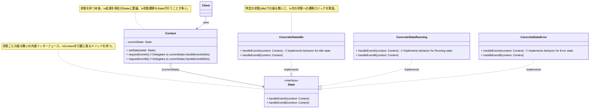
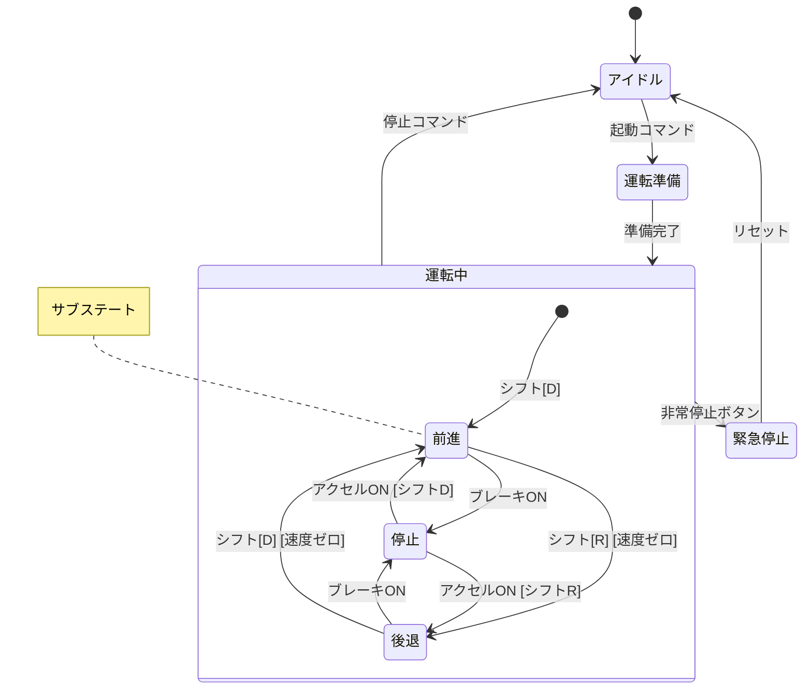
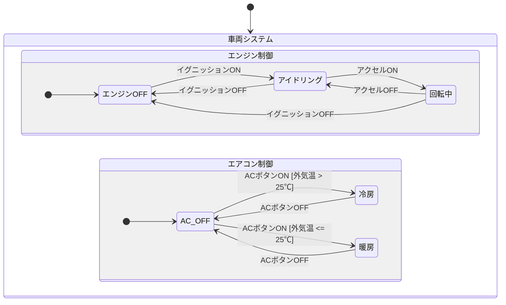

# 制御システムの状態設計 実践テクニック：パターンと実装で堅牢なロジックを築く

# はじめに：設計から実装へ、状態ロジックをコードにする

若手エンジニアの皆さん、「制御システムのための状態設計入門」では、状態、イベント、遷移といった状態設計の基本的な言葉と、UML ステートマシン図という強力な「見える化」の道具について学びましたね。これにより、システムの複雑な振る舞いを整理し、関係者と共通の理解を持つための土台ができたことと思います。

しかし、素晴らしい設計図（ステートマシン図）も、それだけではシステムを動かすことはできません。次の重要なステップは、その**設計図を、実際に動作する具体的な「プログラムコード」へと落とし込む**ことです。

この「状態設計 実践テクニック」編では、UML ステートマシン図などで設計された状態ロジックを、どのようにして効率的かつ保守しやすいコードとして実装していくか、そのための代表的な**実装パターン**や**テクニック**、そしてより複雑な状態を扱うための**発展的な UML ステートマシン図の概念**について探求していきます。

状態ロジックの実装方法は一つではありません。システムの規模、複雑さ、使用するプログラミング言語、そして求められる性能や保守性によって、適切なアプローチは異なります。この資料を通じて、

- 代表的な状態設計の実装パターン（`switch-case`、State パターン、状態テーブル駆動など）とその特徴を理解する。
- それぞれのパターンのメリット・デメリットを把握し、状況に応じて適切なものを選択できるようになる。
- 階層的ステートマシンや並行ステートといった、より高度な状態表現を理解し、活用できるようになる。

ことを目指します。

設計と実装は密接に関連しています。良い設計は良い実装を導き、また、実装のしやすさを考慮した設計は、より現実的で効果的なものとなります。この資料が、皆さんが状態設計の知識をさらに深め、より堅牢で洗練された制御ロジックを自信を持って実装できるようになるための一助となれば幸いです。

# 状態設計の実装パターン：それぞれの特徴と選択基準

設計された状態マシンモデル（UML ステートマシン図や状態遷移表など）を、実際のプログラムコードに変換するには、いくつかの代表的な実装パターンが存在します。それぞれのパターンには、メリットとデメリット、そして得意とする状況があります。ここでは、主要な実装パターンを見ていきましょう。

## 単純な `switch-case` / `if-else` による実装

状態マシンを実装する最も直接的で、おそらく最初に思いつく方法は、現在の状態を表す変数（**状態変数**）を用意し、イベントが発生するたびに、その状態変数の値に応じて `switch-case` 文や `if-else if-else` 文を使って処理を分岐させるというものです。

### 考え方と具体例 (C 言語など)

1. **状態変数の定義:**
   システムの現在の状態を保持するための変数を定義します。多くの場合、整数型や列挙型 (enum) が使われます。

   ```c
   typedef enum {
       STATE_IDLE,
       STATE_RUNNING,
       STATE_ERROR,
       // ... 他の状態
   } SystemState_t;

   SystemState_t currentState = STATE_IDLE; // 初期状態
   ```

2. **イベント処理関数の実装:**
   イベントを受け取り、現在の状態 (`currentState`) に応じて処理を分岐させる関数（イベントハンドラやメインループ内の処理など）を実装します。

   ```c
   void processEvent(Event_t event) {
       switch (currentState) {
           case STATE_IDLE:
               if (event == EVENT_START_COMMAND) {
                   // アイドル状態で開始コマンドを受け取ったら
                   // アクションを実行
                   performStartAction();
                   // 次の状態へ遷移
                   currentState = STATE_RUNNING;
               } else if (event == EVENT_RESET_COMMAND) {
                   performResetAction();
                   currentState = STATE_IDLE; // 自己遷移または初期化
               }
               // ... 他のイベント処理 ...
               break;

           case STATE_RUNNING:
               if (event == EVENT_STOP_COMMAND) {
                   performStopAction();
                   currentState = STATE_IDLE;
               } else if (event == EVENT_SENSOR_ERROR) {
                   logError("Sensor error detected!");
                   currentState = STATE_ERROR;
               }
               // ... 他のイベント処理 ...
               break;

           case STATE_ERROR:
               // エラー状態では、特定のリセットイベントのみ受け付けるなど
               if (event == EVENT_RESET_COMMAND) {
                   performResetAction();
                   currentState = STATE_IDLE;
               }
               break;

           // ... 他の状態のケース ...

           default:
               // 未定義の状態 (念のため)
               break;
       }
   }
   ```

   この例では、`processEvent` 関数がイベントを受け取り、現在の `currentState` に基づいて `switch` で処理を分け、さらに `if-else` でイベントの種類に応じたアクションの実行と状態遷移（`currentState` の更新）を行っています。

### メリット：シンプルで直感的

- **理解しやすい:** 状態の数が少なく、遷移ロジックも単純な場合は、このアプローチは非常に直感的で、コードの動作を追いやすいです。
- **実装が容易:** 特別なライブラリや複雑な設計パターンを必要とせず、基本的な制御構文だけで実装できます。
- **オーバーヘッドが少ない:** 関数呼び出しやオブジェクト生成のオーバーヘッドが比較的小さいため、性能が非常にクリティカルな場面や、リソースが極端に制約された環境では有利な場合があります。

### デメリット：状態や遷移が増えると複雑化、保守性低下

このシンプルなアプローチも、システムの規模が大きくなり、状態の数やイベントの種類、遷移のパターンが増えてくると、いくつかの深刻な問題点に直面します。

- **コードの肥大化と可読性の低下:**
  `switch-case` 文や `if-else` のネストが深くなり、一つの関数（イベント処理関数）が非常に長大で複雑になりがちです（いわゆる「神関数」化）。どこでどの状態遷移が起こるのか、どのアクションが実行されるのかを把握するのが困難になります。
- **保守性の低下（スパゲッティ化のリスク）:**
  新しい状態やイベント、遷移ルールを追加・変更する際に、巨大な `switch-case` 文の適切な箇所を見つけて修正する必要があり、修正漏れや、意図しない他の部分への影響（デグレード）を引き起こしやすくなります。コードが「スパゲッティコード」化していくリスクがあります。
- **拡張性の限界:**
  状態ごとの振る舞いや、遷移時のアクションが複雑になってくると、それらをすべて `if-else` の中に記述するのは現実的ではなくなり、拡張が困難になります。
- **テストの困難:**
  単一の巨大な関数にロジックが集中するため、個々の状態や遷移だけを分離してテストするのが難しくなります。すべての状態とイベントの組み合わせをテストしようとすると、テストケースが爆発的に増加します。

### 適用可能なケースと限界

単純な `switch-case` / `if-else` による実装は、

- **状態の数が非常に少ない（目安として数個程度）。**
- **状態遷移のロジックが非常にシンプルで、条件分岐も浅い。**
- **将来的に状態や遷移が大幅に増える可能性が低い。**
- **極めて厳しい性能要件やメモリ制約があり、他のパターンのオーバーヘッドが許容できない。**

といった、比較的限定的な状況においては、手軽で有効な選択肢となり得ます。

しかし、多くの実用的な制御システムでは、状態や遷移の数はこれよりも多く、ロジックも複雑になりがちです。そのような場合には、この単純なアプローチではすぐに限界が見えてくるため、次に紹介する State パターンや状態テーブル駆動といった、より構造化され、拡張性や保守性に優れた実装パターンを検討する必要が出てきます。

## State パターン (GoF デザインパターン)

前述の単純な `switch-case` や `if-else` を使った状態マシンの実装は、状態や遷移が増えるにつれてコードが複雑化し、保守性が低下するという課題がありました。この課題に対する、オブジェクト指向プログラミングの強力な解決策の一つが、GoF (Gang of Four) のデザインパターンの一つである「**State パターン**」です。

State パターンは、**オブジェクトの内部状態に応じてその振る舞いが変わる様子を、状態ごとに独立したクラスとして表現し、オブジェクト自身（コンテキスト）が、現在の状態を表すオブジェクトに処理を委譲する**ことで、あたかもオブジェクトのクラスが実行時に変わったかのように振る舞いを変化させることを可能にするパターンです。（『オブジェクト指向における再利用のためのデザインパターン 改訂版』参照）

### 考え方：各状態を独立したクラスとしてカプセル化

State パターンの核心的なアイデアは、「**状態」そのものをオブジェクト（State オブジェクト）として捉え、各状態における「振る舞い（イベントに対する応答やアクション）」を、その State オブジェクトのメソッドとしてカプセル化する**ことです。

そして、状態を持つ本体のオブジェクト（これを「**コンテキスト (Context)**」と呼びます）は、現在の状態を表す State オブジェクトへの参照を内部に保持します。コンテキストが外部からイベントを受け取ると、そのイベントに対応する処理を、現在保持している State オブジェクトのメソッドに**委譲**します。状態遷移が必要な場合は、State オブジェクトがコンテキストに対して次の状態を指示し、コンテキストが保持する State オブジェクトを新しいものに切り替えます。

これにより、コンテキストクラス自身のコードからは、状態を判定するための巨大な `if-else` や `switch-case` 文が消え去り、各状態固有のロジックは、それぞれの State クラス内にきれいに分離・整理されます。

### クラス構造と役割 (Context, State, ConcreteState)

State パターンは、通常、以下の主要な登場人物（クラスやインターフェース）で構成されます。

1. **`Context` (文脈、状態を持つオブジェクト):**
   - クライアント（利用者）が直接やり取りするオブジェクトです。
   - 現在の状態を表す `State` 型のオブジェクト（インスタンス変数 `currentState` など）を内部に保持します。
   - 外部からの要求（メソッド呼び出し）を、現在の `currentState` オブジェクトに委譲します。
   - 新しい状態に遷移するためのメソッド（例: `setState(newState)`）を提供します。このメソッドは、通常、`State` オブジェクトから呼び出されて、自身の状態を更新します。
2. **`State` (状態インターフェースまたは抽象クラス):**
   - すべての具体的な状態クラス (`ConcreteState`) が実装すべき共通の**インターフェース**（または継承すべき抽象クラス）を定義します。
   - コンテキストが委譲してくる可能性のある、すべてのイベントに対応するメソッド（例: `handleEventA()`, `handleEventB()`）を宣言します。これらのメソッドは、通常、引数として `Context` オブジェクト自身を受け取り、必要に応じてコンテキストの状態遷移をトリガーできるようにします。
3. **`ConcreteState` (具体的な状態クラス):**
   - `State` インターフェースを実装（または抽象クラスを継承）し、**特定の状態における具体的な振る舞い**を実装します。
   - イベント（メソッド呼び出し）を受け取ると、その状態における適切なアクションを実行し、必要であれば次の状態への遷移を `Context` に指示します（`context.setState(new NextConcreteState())` のように）。



_図: State パターンの基本的なクラス構造_

### 具体例 (C++ やオブジェクト指向言語)

簡単な例として、ボタンで ON/OFF を切り替えるライトの制御を考えてみましょう。

**状態インターフェース (`LightState.h`):**

```cpp
// LightState.h (インターフェース)
#pragma once
class LightContext; // 前方宣言

class LightState {
public:
    virtual ~LightState() = default;
    virtual void onButtonPressed(LightContext* context) = 0; // ボタンが押されたときの振る舞い
    virtual void displayState() const = 0; // 現在の状態を表示 (デバッグ用など)
};
```

**コンテキストクラス (`LightContext.h` / `.cpp`):**

```cpp
// LightContext.h
#pragma once
#include "LightState.h"
#include <memory> // for std::unique_ptr

class LightContext {
private:
    std::unique_ptr<LightState> currentState;

public:
    LightContext(); // 初期状態は OffState とする
    void setState(std::unique_ptr<LightState> newState);
    void buttonPressed(); // 外部からのイベント
    void displayCurrentState() const;
};

// LightContext.cpp
#include "LightContext.h"
#include "OffState.h" // 具体的な状態クラスをインクルード (後で定義)
#include <iostream>

LightContext::LightContext() {
    // 初期状態を OffState に設定
    currentState = std::make_unique<OffState>();
    std::cout << "ライトが初期化されました（OFF状態）" << std::endl;
    displayCurrentState();
}

void LightContext::setState(std::unique_ptr<LightState> newState) {
    currentState = std::move(newState); // 状態を切り替え
    std::cout << "ライトの状態が遷移しました。" << std::endl;
    displayCurrentState();
}

void LightContext::buttonPressed() {
    if (currentState) {
        currentState->onButtonPressed(this); // 現在の状態オブジェクトに処理を委譲
    }
}
void LightContext::displayCurrentState() const {
    if (currentState) {
        currentState->displayState();
    }
}
```

**具体的な状態クラス (`OffState.h` / `.cpp`, `OnState.h` / `.cpp`):**

```cpp
// OffState.h
#pragma once
#include "LightState.h"

class OffState : public LightState {
public:
    void onButtonPressed(LightContext* context) override;
    void displayState() const override;
};

// OffState.cpp
#include "OffState.h"
#include "OnState.h" // 次の状態クラス
#include "LightContext.h"
#include <iostream>
#include <memory>

void OffState::onButtonPressed(LightContext* context) {
    std::cout << "  (OffState) ボタンが押されました。ON状態に遷移します。" << std::endl;
    // アクション: ライトを点灯する処理 (ここでは省略)
    context->setState(std::make_unique<OnState>()); // 次の状態 (OnState) をコンテキストに設定
}
void OffState::displayState() const {
    std::cout << "現在の状態: OFF" << std::endl;
}


// OnState.h
#pragma once
#include "LightState.h"

class OnState : public LightState {
public:
    void onButtonPressed(LightContext* context) override;
    void displayState() const override;
};

// OnState.cpp
#include "OnState.h"
#include "OffState.h" // 次の状態クラス
#include "LightContext.h"
#include <iostream>
#include <memory>

void OnState::onButtonPressed(LightContext* context) {
    std::cout << "  (OnState) ボタンが押されました。OFF状態に遷移します。" << std::endl;
    // アクション: ライトを消灯する処理 (ここでは省略)
    context->setState(std::make_unique<OffState>()); // 次の状態 (OffState) をコンテキストに設定
}
void OnState::displayState() const {
    std::cout << "現在の状態: ON" << std::endl;
}
```

**利用例 (`main.cpp`):**

```cpp
// main.cpp
#include "LightContext.h"
#include <iostream>

int main() {
    LightContext light; // 初期状態は OFF

    light.buttonPressed(); // OFF -> ON
    light.buttonPressed(); // ON -> OFF
    light.buttonPressed(); // OFF -> ON

    return 0;
}
```

この例では、`LightContext` が現在の状態（`OffState` または `OnState` のインスタンス）を保持し、`buttonPressed()` イベントが発生すると、その処理を現在の状態オブジェクトの `onButtonPressed()` メソッドに委譲しています。各状態クラス (`OffState`, `OnState`) が、その状態でボタンが押された場合の振る舞い（次の状態への遷移を含む）を実装しています。

### メリット：状態ごとの振る舞いを明確に分離、拡張性・保守性の向上

State パターンを適用することで、多くのメリットが得られます。

- **状態固有のロジックの局所化:** 各状態における振る舞いや遷移ロジックが、対応する `ConcreteState` クラス内にカプセル化されるため、コードの凝集度が高まり、理解しやすくなります。
- **条件分岐の排除:** `Context` クラスから、状態を判定するための複雑な `if-else` や `switch-case` 文がなくなります。`Context` は、現在の `State` オブジェクトに処理を委譲するだけで済み、コードが非常にシンプルになります。
- **拡張性の向上（オープン/クローズドの原則）:** 新しい状態を追加したい場合は、新しい `ConcreteState` クラスを作成し、`State` インターフェースを実装するだけで済みます。既存の `Context` クラスや他の `State` クラスへの変更は最小限（あるいは不要）となり、オープン/クローズドの原則に準拠しやすくなります。
- **保守性の向上:** 状態ごとのロジックが分離されているため、特定状態の振る舞いを修正したい場合、対応する `ConcreteState` クラスだけを修正すればよく、変更の影響範囲が限定されます。

### デメリット：クラス数の増加、状態遷移ロジックの分散の可能性

一方で、State パターンにはいくつかの注意点もあります。

- **クラス数の増加:** 状態の種類ごとに `ConcreteState` クラスを作成する必要があるため、状態の数が多い場合は、システムのクラス数が大幅に増加する可能性があります。
- **状態遷移ロジックの分散（場合による）:** 各 `ConcreteState` クラスが次の状態への遷移を決定・実行するため、システム全体の状態遷移の全体像が、各 State クラスに分散して記述される形になり、一箇所で把握しにくくなる場合があります。（状態遷移表などで別途全体像を管理する必要が出てくるかもしれません。）
- **State オブジェクトの管理:** `ConcreteState` オブジェクトをいつ生成するか（遷移のたびに `new` するか、あらかじめすべてのインスタンスを生成しておいて共有（Flyweight パターン）するかなど）を考慮する必要があります。状態が内部データを持たない場合は、Singleton として実装することも可能です。

State パターンは、オブジェクトが取りうる状態が明確に定義されており、かつ状態によって振る舞いが大きく変わる場合に、その複雑さを管理し、コードをより構造化され、保守しやすく、拡張しやすいものにするための非常に強力なデザインパターンです。単純な `if-else` では手に負えなくなってきたと感じたら、このパターンの適用を検討する価値は大いにあります。

## 状態テーブル駆動 (State Table Driven)

State パターンは、各状態を独立したクラスとして表現することで、オブジェクト指向のメリット（カプセル化、拡張性など）を享受できる強力な実装方法でした。しかし、状態の数が非常に多くなったり、あるいはオブジェクト指向言語の機能が限定的な環境（一部の C 言語環境など）では、クラス数の増加が懸念されたり、そもそもクラスベースの実装が難しい場合があります。

このような状況で、状態マシンのロジックをよりデータ中心に、コンパクトに表現し、管理するための一つのアプローチが「**状態テーブル駆動 (State Table Driven)**」設計です。

### 考え方：状態遷移表をデータ（配列や構造体）として持ち、汎用エンジンで遷移を管理

状態テーブル駆動の基本的なアイデアは、UML ステートマシン図で学んだ「**状態遷移表 (State Transition Table)**」そのものを、プログラム内の**データ構造（たとえば、配列や構造体の配列）として直接定義**してしまう、というものです。

そして、この「状態遷移テーブル」を解釈し、現在の状態と発生したイベントに基づいて、次に実行すべきアクションと遷移先の状態を決定する、比較的小さく**汎用的な「状態遷移エンジン」**（またはディスパッチャ）を用意します。

**状態遷移テーブルの構成要素（例）:**

状態遷移テーブルの各行（あるいは各要素）は、通常、以下の情報を含みます。

1.  **現在の状態 (Current State):** このルールが適用される状態。
2.  **イベント (Event):** この状態でこのイベントが発生したら、というトリガー。
3.  **ガード条件 (Guard Condition) (オプション):** イベント発生時に、さらに満たすべき追加条件（この条件をチェックする関数ポインタなど）。
4.  **アクション (Action) (オプション):** 遷移時に実行される処理（アクションを実行する関数ポインタなど）。
5.  **次の状態 (Next State):** 遷移先の状態。

**状態遷移エンジンの役割:**

1.  システムは現在の状態を保持する「状態変数」を持ちます。
2.  イベントが発生すると、状態遷移エンジンは、
    a. 状態遷移テーブルを検索し、現在の状態と発生したイベントに一致するルール（行）を見つけます。
    b. もしガード条件があれば、それを評価します。
    c. ガード条件が満たされれば（あるいはガード条件がなければ）、定義されたアクションを実行します。
    d. 最後に、状態変数をルールに示された「次の状態」に更新します。

### 具体例 (C 言語など)

簡単な例として、前にも出てきた ON/OFF スイッチの制御を、状態テーブル駆動で実装してみましょう。

**状態とイベントの定義 (C 言語風):**

```c
typedef enum {
    STATE_OFF,
    STATE_ON
} LightState_t;

typedef enum {
    EVENT_BUTTON_PRESSED
    // 他のイベントも定義可能
} Event_t;

LightState_t g_currentLightState = STATE_OFF; // グローバルな状態変数 (例)

// アクション関数のプロトタイプ宣言 (例)
void turnLightOn(void);
void turnLightOff(void);
```

**状態遷移テーブルの定義:**
各要素が「現在の状態」「イベント」「実行するアクション関数」「次の状態」を持つ構造体の配列として定義できます。

```c
typedef struct {
    LightState_t currentState;
    Event_t      event;
    void         (*action)(void); // 実行するアクション (関数ポインタ)
    LightState_t nextState;
} StateTransition_t;

// 状態遷移テーブル本体
const StateTransition_t stateTransitionTable[] = {
    // 現在状態        イベント                アクション        次の状態
    { STATE_OFF, EVENT_BUTTON_PRESSED, turnLightOn,  STATE_ON  },
    { STATE_ON,  EVENT_BUTTON_PRESSED, turnLightOff, STATE_OFF }
    // 他の遷移ルールもここに追加
};
const int NUM_TRANSITIONS = sizeof(stateTransitionTable) / sizeof(stateTransitionTable[0]);
```

**アクション関数の実装:**

```c
#include <stdio.h> // for printf

void turnLightOn(void) {
    printf("アクション: ライトをONにしました。\n");
}

void turnLightOff(void) {
    printf("アクション: ライトをOFFにしました。\n");
}
```

**状態遷移エンジンの実装 (イベント処理関数):**

```c
void processLightEvent(Event_t event) {
    for (int i = 0; i < NUM_TRANSITIONS; ++i) {
        if (stateTransitionTable[i].currentState == g_currentLightState &&
            stateTransitionTable[i].event == event) {
            // 一致するルールが見つかった

            printf("イベント '%d' 受信。状態 '%d' から ", event, g_currentLightState);

            // アクションがあれば実行
            if (stateTransitionTable[i].action != NULL) {
                stateTransitionTable[i].action();
            }

            // 状態を遷移
            g_currentLightState = stateTransitionTable[i].nextState;
            printf("状態 '%d' へ遷移しました。\n", g_currentLightState);
            return; // 処理完了
        }
    }
    // 一致するルールがない場合は、何もしないか、エラー処理を行う
    printf("イベント '%d' は現在の状態 '%d' では処理されませんでした。\n", event, g_currentLightState);
}
```

**利用例:**

```c
int main_state_table_example() { // mainからの呼び出しを想定した関数名
    printf("初期状態: %d\n", g_currentLightState); // 初期状態: 0 (STATE_OFF)

    processLightEvent(EVENT_BUTTON_PRESSED); // OFF -> ON
    processLightEvent(EVENT_BUTTON_PRESSED); // ON -> OFF
    processLightEvent(EVENT_BUTTON_PRESSED); // OFF -> ON
    processLightEvent(EVENT_BUTTON_PRESSED); // ON -> OFF

    return 0;
}
```

この例では、状態遷移のロジック（どの状態でどのイベントが来たら、何をしてどこへ行くか）が、`stateTransitionTable` というデータ構造に集約されています。`processLightEvent` 関数（状態遷移エンジン）は、このテーブルを参照して汎用的な処理を行うだけです。

### メリット：状態遷移ロジックの変更が容易（テーブル修正のみ）、コードの見通しが良い

状態テーブル駆動アプローチには、以下のようなメリットがあります。

- **状態遷移ロジックの明確な分離と可視化:**
  システムのすべての状態遷移ルールが、一箇所（状態遷移テーブル）にデータとしてまとまっているため、システム全体の振る舞いの見通しが非常に良くなります。「この状態でこのイベントが来たらどうなる？」という確認が容易です。
- **変更容易性の向上:**
  状態遷移のルールを変更したい場合（例: 新しい遷移を追加する、特定のアクションを変えるなど）、多くの場合、**状態遷移テーブルのデータを修正するだけで済み**、状態遷移エンジンのコード自体を変更する必要はありません。これにより、変更による影響範囲が限定され、保守性が向上します。
- **コードの簡潔化（エンジン部分）:**
  状態遷移エンジンは、テーブルを解釈する比較的小さく汎用的なロジックで済むため、`switch-case` がネストした巨大な関数に比べて、コードがスッキリする傾向があります。
- **拡張性:**
  新しい状態やイベントを追加する場合も、基本的にはテーブルに新しい行を追加し、対応するアクション関数を定義することで対応できます。
- **ツールによる生成の可能性:**
  UML ステートマシン図から状態遷移テーブルを自動生成するツールや、逆にテーブルから図を生成するツールなども考えられ、設計と実装の連携をスムーズにする可能性があります。

### デメリット：エンジンの実装が必要、アクションの記述が制約される場合がある

一方で、いくつかのデメリットや注意点も存在します。

- **状態遷移エンジンの実装:**
  最初に、状態遷移テーブルを解釈し、適切なアクション呼び出しと状態遷移を行うための「エンジン」部分を設計・実装する必要があります。このエンジンの設計が悪いと、全体の効率や柔軟性が損なわれる可能性があります。（ただし、一度作れば再利用可能です。）
- **アクションの柔軟性の制約:**
  多くの場合、アクションは関数ポインタなどでテーブルに登録されるため、アクション関数が取れる引数や戻り値の形式が固定されがちです。非常に複雑なパラメータを持つアクションや、状況に応じて細かく振る舞いを変えるアクションを表現するのが、State パターンに比べて少し煩雑になることがあります。
- **ガード条件の扱い:**
  ガード条件をテーブルに含める場合、その評価ロジックをどのようにエンジンに組み込むか、あるいはガード条件を判定する関数ポインタをテーブルに持たせるかなど、設計上の工夫が必要になります。
- **パフォーマンス:**
  イベント発生のたびにテーブルを検索する処理が入るため、`switch-case` による直接的な分岐に比べて、わずかながらパフォーマンス上のオーバーヘッドが生じる可能性があります。遷移の数が多い場合や、イベント発生頻度が非常に高い場合は、テーブル検索の効率も考慮する必要があります。
- **状態内アクティビティ（entry/exit/do）の表現:**
  単純な状態遷移テーブルだけでは、State パターンで自然に表現できるような、状態の entry/exit アクションや do アクティビティを直接的に記述するのが難しい場合があります。これらを扱うためには、テーブルの構造を拡張したり、エンジン側で追加のロジックを持たせたりする工夫が必要です。

状態テーブル駆動は、とくに状態遷移のルールが明確に定義されており、そのルールが将来変更される可能性がある場合や、システムの振る舞いをデータとして管理・可視化したい場合に非常に有効なアプローチです。C 言語のような、オブジェクト指向機能が限定的な環境でも、構造化された状態マシンを効率的に実装する手段として、長年活用されてきました。

どちらのパターン（State パターンか状態テーブル駆動か、あるいは単純な `switch-case` か）を選択するかは、システムの要件、複雑さ、使用言語、そしてチームのスキルセットなどを総合的に考慮して決定すべきです。

## (補足) 有限状態機械 (FSM) ライブラリ/ツールの活用

これまで、状態マシンの実装パターンとして、`switch-case` による基本的な方法、オブジェクト指向の State パターン、そしてデータ駆動型の状態テーブルを見てきました。これらのアプローチは、それぞれメリット・デメリットがあり、プロジェクトの特性に応じて選択されます。

しかし、とくに複雑な状態マシンを扱う場合や、より宣言的で安全な状態管理を目指す場合には、既存の「**有限状態機械 (Finite State Machine - FSM) ライブラリ**」や「**ステートチャートツール**」を活用することも非常に有効な選択肢となります。

### 既存ライブラリのメリットと選定ポイント

多くのプログラミング言語には、FSM やステートチャートの概念を簡単に利用できるようにするためのライブラリが存在します。これらのライブラリを利用する主なメリットは以下の通りです。

- **開発効率の向上:** 状態遷移の管理、イベントのディスパッチ、アクションの実行といった、FSM の基本的な骨組み（エンジン部分）を自分で実装する必要がなく、開発者は状態の定義やアクションの記述といった本質的な部分に集中できます。
- **コードの削減と可読性向上:** ライブラリが提供する宣言的な API（例: 状態と遷移を定義するための専用の構文やビルダー）を使うことで、手書きの `switch-case` や State パターンのクラス群よりも、状態マシンのロジックを簡潔かつ直感的に表現できる場合があります。
- **堅牢性の向上:** 実績のあるライブラリは、エッジケースや競合状態など、FSM 実装で陥りやすい問題に対して、あらかじめ考慮された堅牢な実装を提供していることが多いです。
- **追加機能の提供:**
  - 階層的ステートマシンや並行ステートといった、UML ステートマシン図の高度な機能をサポートしている場合があります。
  - 状態遷移のロギングやデバッグ支援機能。
  - 状態マシンモデルの視覚化機能（例: PlantUML や Mermaid 形式での出力）。
  - タイマーイベントの簡単な管理。

FSM ライブラリを選定する際には、以下のようなポイントを考慮すると良いでしょう。

- **言語とプラットフォームの互換性:** 開発に使用しているプログラミング言語やターゲットプラットフォームで利用可能か。
- **機能の豊富さ:** 基本的な FSM 機能に加えて、階層構造、並行性、ガード条件、entry/exit/do アクション、タイマーなどをどの程度サポートしているか。
- **API の使いやすさと表現力:** 状態や遷移を直感的かつ宣言的に定義できるか。学習コストはどうか。
- **パフォーマンスとリソース消費:** とくに組み込みシステムでは、ライブラリのオーバーヘッド（メモリ使用量、実行速度）が許容範囲内か。
- **ドキュメントとコミュニティ:** 十分なドキュメントやサンプルコード、そして活発なコミュニティが存在するか。
- **ライセンス:** プロジェクトの要件に適合するライセンス形態か。

### コード生成ツールの可能性

より大規模で複雑なステートマシンを扱う場合や、設計と実装の一貫性を厳密に保ちたい場合には、「**ステートチャートツール**」や「**モデルベース開発 (MBD) ツール**」の利用も検討されます。

これらのツールは、

- GUI を使ってステートマシン図を視覚的に設計できる。
- 設計したモデルから、特定のプログラミング言語（C, C++, Java など）のソースコードを**自動生成**できる。
- モデルのシミュレーションや検証機能を提供している場合もある。

といった特徴を持ちます。

コード生成ツールを活用するメリットは、

- **設計と実装の同期:** 設計モデル（図）の変更が、直接コードに反映されるため、設計と実装の乖離を防ぎやすい。
- **開発期間の短縮:** 定型的な状態管理ロジックのコーディング作業を自動化できる。
- **品質の向上:** 実績のあるツールが生成するコードは、人手によるコーディングミスを減らし、一定の品質を担保しやすい。

ただし、ツールへの依存度が高まることや、生成されるコードが必ずしも人間にとって最適とは限らない（可読性やデバッグのしやすさなど）、ツール自体の学習コストや導入コストがかかる、といった側面も考慮する必要があります。

FSM ライブラリやコード生成ツールは、状態設計と実装の複雑さを軽減し、開発効率と品質を向上させるための強力な支援となります。プロジェクトの規模や要件、チームのスキルセットなどを考慮し、これらのツールの導入が適切かどうかを判断することが重要です。

たとえライブラリやツールを使わない場合でも、それらがどのような機能を提供し、どのような問題を解決しようとしているのかを知っておくことは、自身で状態マシンを設計・実装する際のヒントとなるでしょう。

# 3. イベント駆動型アーキテクチャと状態設計の連携

これまでに学んできた状態設計の考え方や実装パターンは、システムが外部や内部からの「イベント」に応じて状態を遷移させ、振る舞いを変化させる、という点で、本質的に「**イベント駆動型 (Event-Driven)**」のアプローチと非常に高い親和性を持っています。

「**イベント駆動型アーキテクチャ (Event-Driven Architecture - EDA)**」とは、システムの動作やコンポーネント間の連携が、非同期的な「イベント」の発生、検知、処理を中心として構成されるソフトウェアアーキテクチャのスタイルです。このアーキテクチャスタイルは、疎結合でスケーラブル、かつ応答性の高いシステムを構築するのに適しており、マイクロサービスやリアルタイムデータ処理など、現代的な多くのシステムで採用されています。

状態マシンは、このイベント駆動型アーキテクチャにおいて、個々のコンポーネント（サービス、モジュール、オブジェクトなど）が**どのようにイベントを処理し、自身の状態を管理し、そして次のアクション（場合によっては新たなイベントの発行）を決定するか**、その振る舞いの核心部分を担うメカニズムとして、非常に重要な役割を果たします。

## 3.1 イベントキュー：イベントの順序制御とバッファリング

イベント駆動型システムでは、様々なソースから多数のイベントが、時には同時に、あるいは非常に短い間隔で発生する可能性があります。これらのイベントを適切に処理するためには、**イベントを一時的に保持し、順序付け、そして状態マシン（あるいはイベントハンドラ）が処理可能なペースで供給する**仕組みが必要になります。この役割を果たすのが「**イベントキュー (Event Queue)**」または「メッセージキュー (Message Queue)」です。

**イベントキューの主な機能とメリット:**

- **非同期処理の実現:** イベントの発生源（プロデューサー）と、イベントの処理側（コンシューマー、この場合は状態マシン）を時間的に分離します。プロデューサーはイベントをキューに投入するだけで、コンシューマーの処理完了を待つ必要がありません。これにより、システム全体の応答性が向上します。
- **イベントの順序保証 (多くの場合 FIFO):** 通常、イベントキューは FIFO (First-In, First-Out) の順序でイベントを処理側に渡すため、イベントの発生順序が重要な場合に、その順序性を保証するのに役立ちます。
- **バッファリングと負荷平準化:** イベントが一時的に集中して発生した場合でも、キューがそれらをバッファリングし、処理側が自身のペースで取り出せるようにすることで、処理側の負荷を平準化し、システムの安定性を高めます。
- **イベントの永続化 (一部のキュー):** 高度なメッセージキューシステム（例: Kafka, RabbitMQ）では、キューに投入されたイベントを永続化し、万が一システムがダウンしてもイベントが失われないようにする機能を持つものもあります。

**状態マシンとイベントキューの連携:**

状態マシンは、このイベントキューからイベントを一つずつ取り出し、現在の状態とイベントの種類に基づいて、定義された状態遷移とアクションを実行します。

```
[イベントソース1] ---> |         | --イベントA--> [状態マシン]
[イベントソース2] ---> | イベント | --イベントB--> [状態マシン]
[イベントソース3] ---> |  キュー  | --イベントC--> [状態マシン]
                     |         |
                     -----------
```

この連携により、状態マシンは、外部からのイベントの発生タイミングや頻度に直接左右されることなく、自身のペースで安定して状態遷移ロジックを実行できます。とくに、割り込み処理のように非同期かつ優先度の高いイベントと、通常のタスクレベルで処理されるイベントが混在する組み込みシステムなどでは、イベントキューを介した状態マシンへのイベント通知は、非常に一般的な設計パターンです。

## 3.2 イベントハンドラと状態更新ロジックの分離

イベント駆動型システムにおいて、特定のイベントが発生した際に呼び出される処理の塊を「**イベントハンドラ (Event Handler)**」と呼びます。状態マシンを実装する際、このイベントハンドラの設計が重要になります。

**状態設計の観点からの良いイベントハンドラのあり方:**

- **関心の分離:** イベントハンドラの主な責務は、「**発生したイベントの種類を特定し、現在の状態に基づいて、状態マシンにそのイベントをディスパッチ（処理を依頼）する**」ことと、「**状態マシンからの結果（実行されたアクションや次の状態）を受け取る**」ことに限定するのが望ましいです。
- **状態更新ロジックの集約:** 実際の状態遷移の判断や、それに伴うアクションの実行、そして状態変数の更新といった**状態管理の核心的なロジックは、状態マシン自身（あるいは State パターンなら各 State クラス、状態テーブル駆動なら状態遷移エンジン）の内部にカプセル化**されているべきです。

**避けるべきアンチパターン:**

イベントハンドラのあちこちに、現在の状態をチェックする `if-else` が散らばり、そこで直接状態変数を書き換えたり、状態ごとの詳細な処理ロジックが長々と記述されたりするような実装は、状態管理が分散し、コードの見通しが悪くなり、保守性も低下するため避けるべきです。これは、状態マシンのメリットを損なうアンチパターンと言えます。

**理想的な連携:**

```
イベント発生 (例: ボタンクリック)
  ↓
イベントハンドラ
  - イベントの種類と関連データを取得
  - 現在の状態マシンインスタンスにイベントを渡す (例: `stateMachine.processEvent(eventData)`)
  - (必要であれば) 状態マシンからの戻り値や、状態変化の通知を受けて後続処理
  ↓
状態マシン
  - 現在の状態と受け取ったイベントに基づき、
    - ガード条件を評価
    - アクションを実行
    - 次の状態へ遷移 (内部の状態変数を更新)
```

このように、イベントハンドラは「受付窓口」や「連絡係」に徹し、実際の状態遷移やビジネスロジックの実行は状態マシン自身に委ねることで、関心の分離が促進され、よりクリーンでテストしやすい構造になります。

## 3.3 状態マシンと他のモジュール（タスク）との連携方法

制御系システムでは、状態マシンが単独で存在するだけでなく、多くの場合、他のモジュールやタスク（RTOS におけるタスクなど）と連携して動作します。この連携をどのように設計するかも重要なポイントです。

**連携のパターン:**

- **状態マシンからのイベント発行:**
  ある状態マシンが特定の状態に遷移したり、特定のアクションを実行したりした結果として、**別のモジュールやタスクに対して新たなイベントを発行する**（例: 別のイベントキューにメッセージを送信する、共有メモリにフラグを立てる、セマフォを解放するなど）。これにより、システム全体の協調動作が実現されます。
- **他のモジュールからのイベント受信:**
  これはイベントキューを介した基本的な連携です。センサーデータの処理タスクが新しい値をキューに入れ、状態マシンがそれを取り出して状態遷移のトリガーとする、など。
- **状態の問い合わせ:**
  他のモジュールが、状態マシンの現在の状態を（直接的または間接的に）問い合わせ、その状態に応じて自身の振る舞いを決定する場合があります。この場合、状態マシンは自身の状態を外部に公開するためのインターフェース（例: `getCurrentState()` のような関数）を提供する必要があります。ただし、外部モジュールが状態マシンの状態に過度に依存しすぎると、結合度が高まるため注意が必要です。
- **アクション実行の委譲:**
  状態マシンが遷移時や状態内で実行するアクションとして、他のモジュールが提供する関数やサービスを呼び出すことは一般的です。たとえば、「エラー状態」に遷移した際に、ログ記録モジュールの「エラーログ書き込み関数」を呼び出す、などです。この際も、依存性の注入 (DI) の考え方を適用し、状態マシンが具体的なモジュール実装に直接依存するのではなく、抽象的なインターフェースを介して連携するように設計すると、テスト容易性や柔軟性が向上します。

イベント駆動型アーキテクチャと状態設計は、互いを補完し合う非常に強力な組み合わせです。イベントキューによる非同期性とバッファリング、イベントハンドラと状態ロジックの明確な分離、そして他のモジュールとの適切なインターフェースを通じた連携。これらを意識することで、複雑なイベントの連続にも堅牢に対応し、システム全体として調和の取れた、変更に強いソフトウェアを構築することが可能になります。

# 4. 複雑な状態を扱うための UML ステートマシン図（発展）

「状態設計入門」では、UML ステートマシン図の基本的な要素（状態、遷移、イベント、ガード、アクションなど）について学びました。これらを使えば、比較的単純なシステムの振る舞いは十分に表現できます。しかし、現実の制御システムはしばしばより複雑な状態構造を持ち、基本的な記法だけでは図が煩雑になったり、すべてのニュアンスを表現しきれなかったりすることがあります。

UML ステートマシン図は、このような複雑な状況に対応するために、さらにいくつかの強力な表現能力を持っています。ここでは、その中でも特に重要で実用的な「**階層的ステートマシン**」「**並行ステート**」「**ヒストリステート**」という発展的な概念について解説します。これらの概念を理解し活用することで、より複雑な状態ロジックも、構造的に、そして分かりやすくモデル化できるようになります。

## 4.1 階層的ステートマシン（サブステート、コンポジットステート）

システムの状態を洗い出していくと、「ある大きな状態の中に、さらにいくつかの詳細な状態が存在する」という、**状態の入れ子構造（階層構造）**が見えてくることがあります。

たとえば、「自動車の運転」という大きな状態を考えてみましょう。この「運転中」という状態の中には、さらに「前進中」「後退中」「停車中（エンジンは ON）」といった、より詳細なサブ状態が存在しえます。そして、これらのサブ状態に共通する振る舞い（例: 「アクセルを踏むと加速する」が「前進中」と「後退中」で基本は同じだが方向が違う）や、サブ状態に遷移するためのイベント（例: シフトレバー操作）などが考えられます。

このように、**ある状態が内部にさらに別の状態（サブステート）を持つ場合、その親となる状態を「コンポジットステート (Composite State)」または「スーパーステート (Superstate)」と呼びます**。そして、コンポジットステートとその内部のサブステート、およびサブステート間の遷移をまとめて表現するモデルを「**階層的ステートマシン (Hierarchical State Machine - HSM)**」と呼びます。

### 状態のグループ化と抽象化

階層的ステートマシンを用いる主なメリットは以下の通りです。

- **複雑な状態図の見通し改善:**
  多数のフラットな状態を並べる代わりに、関連する状態をコンポジットステートとしてグループ化することで、状態図全体の構造が整理され、見通しが格段に良くなります。上位レベルでは大まかな状態遷移を、下位レベル（コンポジットステートの内部）ではより詳細な状態遷移を、といった形で段階的に理解できます。
- **共通の遷移や振る舞いの集約:**
  コンポジットステート内のすべてのサブステートに共通する遷移（例: どのサブ状態からでも「緊急停止イベント」で「エラー状態」へ遷移する）や、共通の entry/exit アクションなどを、コンポジットステート自体に定義することで、記述の重複を避け、モデルを簡潔にできます。
- **状態の抽象化:**
  上位レベルの視点からは、コンポジットステートの内部詳細（サブステートの存在）を意識せずに、そのコンポジットステート全体が一つの状態であるかのように扱うことができます。

### 例：機器の動作モードと詳細状態



_図: 階層的ステートマシンの例（自動車の運転モード）。「運転中」がコンポジットステートで、内部に「前進」「停止」「後退」というサブステートを持つ。_

この図では、「運転中」というコンポジットステートの中に、さらに「前進」「停止」「後退」というサブステートと、それらの間の遷移が定義されています。「運転中」状態への遷移（例: 「準備完了」イベント）や、「運転中」状態からの遷移（例: 「停止コマンド」イベント）は、サブステートの現在の状態に関わらず適用されます。また、「非常停止ボタン」イベントは、「運転中」のどのサブ状態からでも「緊急停止」状態へ遷移する共通の遷移として表現できます（図では簡略化のため省略）。

階層的ステートマシンは、状態の数が多くなりがちな複雑な制御システムの振る舞いを、より構造的かつ効率的にモデル化するための非常に強力なテクニックです。

## 4.2 並行ステート（直交領域）

システムによっては、**互いに独立して同時に存在しうる、複数の「状態の側面」**を持つことがあります。たとえば、自動車の制御システムを考えると、「エンジンの状態（停止中、始動中、アイドリング中、回転中など）」と、「トランスミッションの状態（パーキング、リバース、ニュートラル、ドライブなど）」、「エアコンの状態（OFF、冷房、暖房、送風など）」は、ある程度独立して、それぞれが自身の状態遷移を持つと考えられます。

このように、**一つのオブジェクト（あるいはシステム）が、同時に複数の異なる状態マシン（状態のセット）を並行して実行しているかのように振る舞う**場合、それを表現するために「**並行ステート (Concurrent States)**」または「**直交領域 (Orthogonal Regions)**」という概念が用いられます。

### 同時に複数の状態を保持・遷移する場合の表現

UML ステートマシン図では、一つのコンポジットステートの内部を、破線で複数の「領域（リージョン）」に分割することで、並行ステートを表現します。各領域は、それぞれ独立した初期状態と状態遷移を持つ、小さな状態マシンとして振る舞います。そして、コンポジットステート全体としては、すべての内部領域の状態の組み合わせが、現在のシステムの状態となります。



_図: 並行ステートの例（車両システム）。「エンジン制御」と「エアコン制御」は、それぞれ独立した状態遷移を持つ直交領域。_

この図では、「車両システム」というコンポジットステートが、「エンジン制御」と「エアコン制御」という二つの直交領域を持っています。車両システムは、常に「エンジン制御のいずれかの状態」**かつ**「エアコン制御のいずれかの状態」にあります。たとえば、「エンジンはアイドリング中」で、かつ「エアコンは冷房中」という状態があり得るわけです。

**並行ステートのメリット:**

- **関心の分離:** 互いに独立した振る舞いの側面を、別々の状態マシンとしてモデル化できるため、それぞれのロジックがシンプルになり、理解しやすくなります。
- **状態爆発の抑制:** もし並行する状態を一つのフラットな状態マシンで表現しようとすると、状態の組み合わせの数が爆発的に増加してしまいます（例: エンジン状態 3 × エアコン状態 3 = 9 つの複合状態）。並行ステートを使うことで、これをよりコンパクトに表現できます。
- **モジュール性の向上:** 各直交領域は、比較的独立して設計・変更・テストできます。

並行ステートは、システムが複数の独立した「側面」の状態を同時に持つ場合に、その複雑な振る舞いを整理し、管理しやすくするための有効なモデリング手法です。

## 4.3 ヒストリステート

あるコンポジットステートから一度出て、再びそのコンポジットステートに戻ってきたときに、「**以前そのコンポジットステートを離れたときのサブステートから処理を再開したい**」という場合があります。

たとえば、音楽プレイヤーが「再生中」というコンポジットステートを持っており、その内部に「曲 A を再生中」「曲 B を再生中」… といったサブステートがあったとします。電話がかかってきたので音楽再生を一時停止し（「再生中」コンポジットステートから「通話中」状態へ遷移）、通話が終わったので再び音楽再生を再開する場合、できれば「一時停止したまさにその曲のその場所から」再生を続けたいですよね。

このような「**最後にアクティブだったサブステートを記憶しておき、そこへ戻る**」という振る舞いを実現するのが、「**ヒストリステート (History State)**」です。

**中断前の状態を記憶し、再開時にそこへ戻る**

UML ステートマシン図では、ヒストリステートは、丸の中に「H」と書かれた記号（**浅い履歴 / Shallow History**）や、丸の中に「H\*」と書かれた記号（**深い履歴 / Deep History**）で表現されます。

- **浅い履歴 (H):** コンポジットステートに戻ってきたときに、そのコンポジットステートが**直接的に含んでいたサブステートのうち、最後にアクティブだったもの**へ遷移します。もし、そのサブステートもまたコンポジットステートであった場合、その内部のサブステートは初期状態から始まります。
- **深い履歴 (H\*):** コンポジットステートに戻ってきたときに、ネストしたサブステートの階層を記憶しておき、**最も深いレベルで最後にアクティブだったサブステート**へ遷移します。

```mermaid
stateDiagram-v2
    [*] --> アイドル
    アイドル --> 処理実行 : start
    state 処理実行 {
        direction LR
        [*] --> 処理A
        処理A --> 処理B : eventX
        処理B --> 処理A : eventY
        state 処理B {
             direction LR
            [*] --> サブ処理B1
            サブ処理B1 --> サブ処理B2 : eventZ
        }
    }
    処理実行 --> 中断 : interrupt
    中断 --> 処理実行 (H*) : resume / (深い履歴へ遷移)

    note right of "処理実行 (H*)"
        H* (深い履歴):
        もし中断前に サブ処理B2 にいたなら、
        resume時に サブ処理B2 から再開。
        もし浅い履歴(H)なら、
        処理B の初期状態(サブ処理B1)から再開。
    end
```

_図: ヒストリステートの概念図（深い履歴 H\* の例）_

ヒストリステートは、中断と再開のロジックを持つシステムや、エラーからの復帰処理などで、「以前の作業状態に戻りたい」という要求を実現するのに役立ちます。ただし、どの状態を記憶し、どの条件で履歴をクリアするかなど、その振る舞いを慎重に設計する必要があります。

これらの発展的な UML ステートマシン図の概念（階層、並行、履歴）を理解し、適切に使いこなすことで、現実の制御システムが持つ複雑な状態ロジックも、より構造的に、より正確に、そしてより分かりやすくモデル化することが可能になります。これは、後の実装フェーズにおけるコードの品質と保守性を大きく左右する、重要な設計スキルと言えるでしょう。

# 5. おわりに：実装パターンを理解し、適切な設計選択を

この「制御システムの状態設計 実践テクニック」編では、UML ステートマシン図などで設計された状態ロジックを、どのようにして具体的なプログラムコードに落とし込んでいくか、そのための代表的な**実装パターン**（単純な `switch-case`/`if-else`、State パターン、状態テーブル駆動）と、それらのメリット・デメリット、そして適用場面について学んできました。

また、イベント駆動型アーキテクチャとの連携や、より複雑な状態構造（階層的ステートマシン、並行ステート、ヒストリステート）を UML でどのように表現し、設計に活かしていくか、その発展的な概念についても触れました。

**状態設計は、一度「図を描いて終わり」ではありません。** その設計意図を正しく、かつ保守しやすい形でコードに反映させ、実際にシステムを動かすことができて初めて、その価値が生まれます。そして、その「実装」の方法には、唯一絶対の正解があるわけではありません。

- 非常にシンプルな状態遷移であれば、**`switch-case` 文**による直接的な実装が最も手軽で分かりやすいかもしれません。
- 状態ごとの振る舞いが複雑で、将来的な拡張性や保守性を重視するならば、オブジェクト指向の**State パターン**が強力な選択肢となります。
- 状態遷移のルールがデータとして明確に定義されており、そのルールを柔軟に変更したい、あるいは C 言語のような環境で構造化された状態管理を行いたい場合には、**状態テーブル駆動**が有効なアプローチとなり得ます。
- あるいは、利用可能な**FSM ライブラリやツール**が、皆さんのプロジェクトの要求に合致し、開発効率と品質を向上させてくれるかもしれません。

重要なのは、これらの**各実装パターンが持つ特性（メリット、デメリット、複雑さ、拡張性、パフォーマンスなど）を理解し、直面しているシステムの要件、規模、使用する言語、そしてチームのスキルセットといった「文脈」を総合的に考慮した上で、最も適切な実装方法を選択する**という「設計判断」です。

そして、UML ステートマシン図の発展的な機能（階層、並行、履歴）は、現実の制御システムが持つ複雑な状態の側面を、より構造的かつエレガントにモデル化するための強力な語彙を提供してくれます。これらの概念を理解しておくことで、より高度な状態設計にも対応できるようになるでしょう。

この資料で学んだ知識やテクニックが、皆さんの「状態設計の引き出し」を増やし、

- **より堅牢で、バグの少ない制御ロジックを実装し、**
- **将来の変更や拡張にも柔軟に対応できる、保守しやすいコードを書き、**
- **そして何よりも、自信を持って状態という複雑な問題に取り組む**

ための一助となることを心から願っています。

次のステップでは、制御システムに特有のさらに厳しい要求事項、たとえばリアルタイム性、安全性（フェールセーフ）、割り込み処理との連携、そしてそれらのテスト戦略といった、より高度で実践的なトピックへと進んでいきます。状態設計の旅はまだ続きます。ぜひ、ここで得た知識を土台として、さらなる高みを目指してください。
