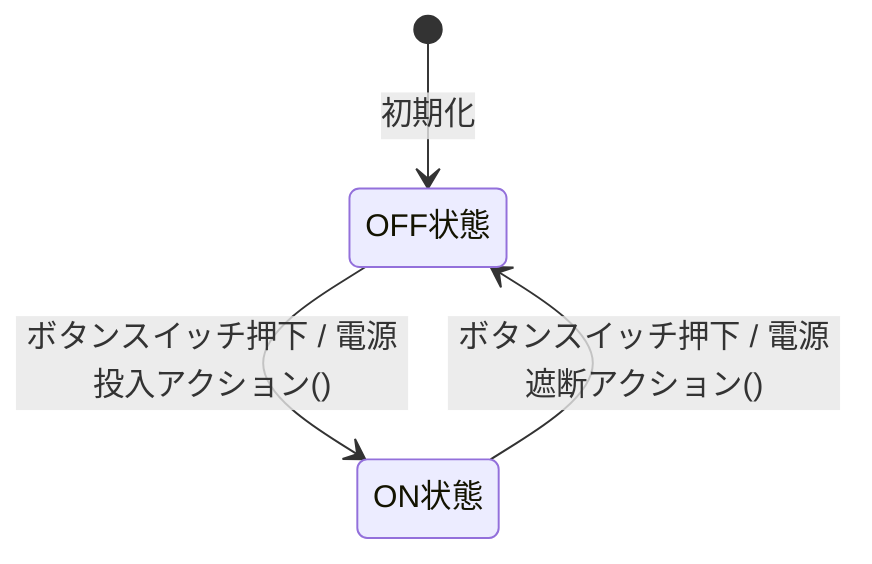
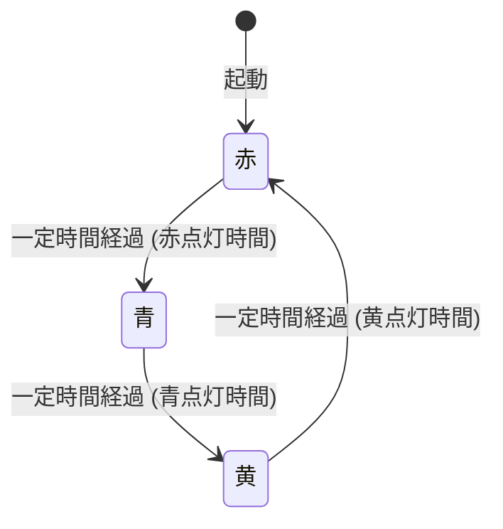
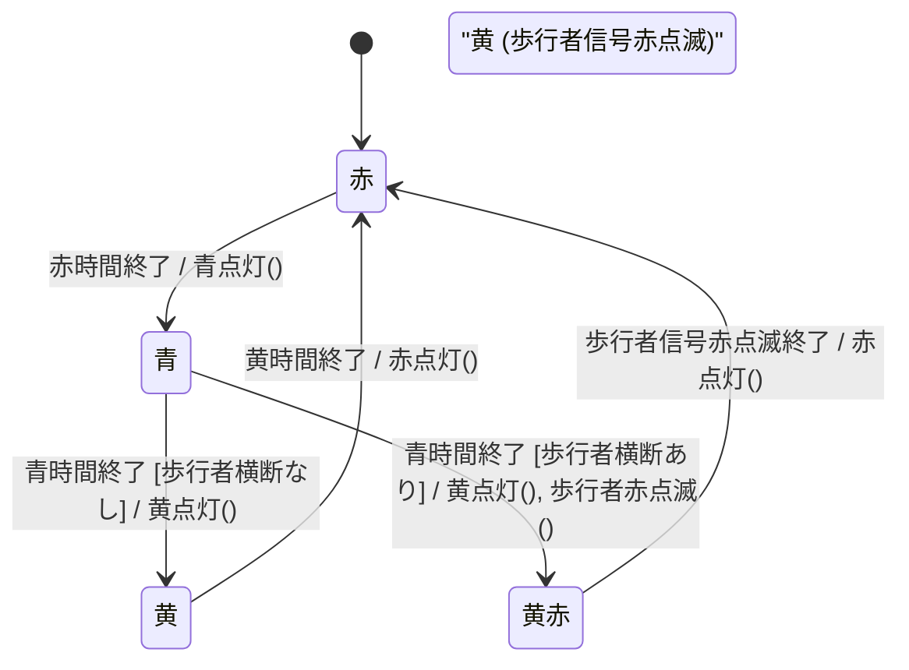
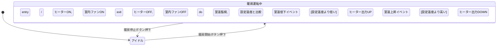

承知いたしました。ご提示いただいたトピックは確かにボリュームが大きいので、複数の資料に分割するのが学習効果を高める上で有効ですね。

ここでは、3 つの資料に分割する案を提案します。それぞれが段階的にステップアップできるような構成を目指します。

**資料 1：状態設計の基礎と UML ステートマシン図入門**

- **タイトル案:** 「制御システムのための状態設計入門：UML ステートマシン図で振る舞いを捉える」
- **学習のゴール:** 制御系システムにおける状態設計の「なぜ」と「何を」を理解し、UML ステートマシン図という共通言語でシステムの振る舞いを表現できるようになる。
- **目次案:**

  ```markdown
  # 制御システムのための状態設計入門：UML ステートマシン図で振る舞いを捉える

  # はじめに：なぜ制御系システムで「状態」がこれほど重要なのか？

  ## 制御系システムとは？ 日常にあふれる「状態」を持つ機械たち

  ## 「状態」の誤りが引き起こす問題：安全と信頼の土台

  ## 状態設計を学ぶメリット：より良い制御システムを作るために

  ## この資料で学ぶこと：状態設計の第一歩

  # 状態設計の基本的な言葉たち：状態、イベント、遷移、アクション

  ## 状態 (State) とは何か？：システムが取りうる「状況」

  ## イベント (Event) とは何か？：状態を変える「きっかけ」

  ## 遷移 (Transition) とは何か？：状態から状態への「移り変わり」

  ## アクション (Action) とは何か？：状態が変わるとき、あるいは状態にいる間に行う「振る舞い」

  ## ガード条件 (Guard Condition)：遷移を制御する「門番」

  # UML ステートマシン図入門：状態と遷移を「見える化」する

  ## なぜ図で表現するのか？：複雑な振る舞いを整理する共通言語

  ## ステートマシン図の基本的な要素と記法

      ### 状態 (State)
      ### 初期状態 (Initial State) と終了状態 (Final State)
      ### 遷移 (Transition) とトリガー (Trigger / Event)
      ### ガード条件 (Guard Condition)
      ### アクション (Action / Effect)

  ## 簡単な例で学ぶステートマシン図の読み方・書き方

      ### 例1：ON/OFF スイッチ
      ### 例2：信号機の状態遷移

  ## 状態内でのアクティビティ (Internal Activities)

      ### entry アクション：状態に入ったときの処理
      ### exit アクション：状態から出るときの処理
      ### do アクティビティ：状態に留まっている間の処理

  # 制御系システムにおける状態設計の最初のステップ

  ## Step 1: 制御対象の振る舞いをよく観察し、理解する

  ## Step 2: システムが取りうる主要な「状態」を洗い出す

  ## Step 3: 状態を変化させる「イベント」を特定する

  ## Step 4: 状態間の「遷移」とその条件、伴う「アクション」を定義する

  ## Step 5: ステートマシン図を描いてみる（そしてレビューする）

  # おわりに：状態設計の基礎を固めて、次のステップへ
  ```

**資料 2：状態設計パターンと実装テクニック**

- **タイトル案:** 「制御システムの状態設計 実践テクニック：パターンと実装で堅牢なロジックを築く」
- **学習のゴール:** 設計したステートマシンを、具体的なプログラミングコードに落とし込むための代表的なパターンと実装方法を理解し、それぞれのメリット・デメリットを把握する。
- **目次案:**

  ```markdown
  # 制御システムの状態設計 実践テクニック：パターンと実装で堅牢なロジックを築く

  # はじめに：設計から実装へ、状態ロジックをコードにする

  # 状態設計の実装パターン：それぞれの特徴と選択基準

  ## 単純な `switch-case` / `if-else` による実装

      ### 考え方と具体例 (C言語など)
      ### メリット：シンプルで直感的
      ### デメリット：状態や遷移が増えると複雑化、保守性低下
      ### 適用可能なケースと限界

  ## State パターン (GoF デザインパターン)

      ### 考え方：各状態を独立したクラスとしてカプセル化
      ### クラス構造と役割 (Context, State, ConcreteState)
      ### 具体例 (C++ やオブジェクト指向言語)
      ### メリット：状態ごとの振る舞いを明確に分離、拡張性・保守性の向上
      ### デメリット：クラス数の増加、状態遷移ロジックの分散の可能性

  ## 状態テーブル駆動 (State Table Driven)

      ### 考え方：状態遷移表をデータ（配列や構造体）として持ち、汎用エンジンで遷移を管理
      ### 具体例 (C言語など)
      ### メリット：状態遷移ロジックの変更が容易（テーブル修正のみ）、コードの見通しが良い
      ### デメリット：エンジンの実装が必要、アクションの記述が制約される場合がある

  ## (補足) 有限状態機械 (FSM) ライブラリ/ツールの活用

      ### 既存ライブラリのメリットと選定ポイント
      ### コード生成ツールの可能性

  # イベント駆動型アーキテクチャと状態設計の連携

  ## イベントキュー：イベントの順序制御とバッファリング

  ## イベントハンドラと状態更新ロジックの分離

  ## 状態マシンと他のモジュール（タスク）との連携方法

  # 複雑な状態を扱うための UML ステートマシン図（発展）

  ## 階層的ステートマシン（サブステート、コンポジットステート）

      ### 状態のグループ化と抽象化
      ### メリット：複雑な状態図の見通し改善
      ### 例：機器の動作モードと詳細状態

  ## 並行ステート（直交領域）

      ### 同時に複数の状態を保持・遷移する場合の表現
      ### 例：モーター制御とLED表示の独立した状態管理

  ## ヒストリステート

      ### 中断前の状態を記憶し、再開時にそこへ戻る
      ### 例：エラー発生後、正常復帰時に元いた詳細状態へ

  # おわりに：実装パターンを理解し、適切な設計選択を
  ```

**資料 3：制御系システム特有の考慮事項とテスト戦略**

- **タイトル案:** 「実践 制御システムの高信頼化設計：安全性、リアルタイム性、そしてテスト戦略」
- **学習のゴール:** 制御系システム特有の設計上の課題（リアルタイム性、安全性、エラー処理など）を理解し、それらに対処するための具体的な設計アプローチとテスト戦略を学ぶ。
- **目次案:**

  ```markdown
  # 実践 制御システムの高信頼化設計：安全性、リアルタイム性、そしてテスト戦略

  # はじめに：単に動くだけではない、制御システムに求められる「信頼性」

  # リアルタイム性の考慮：時間に厳しい要求に応える

  ## 状態遷移とアクションの実行時間制約

  ## 優先度ベースのイベント処理とタスクスケジューリング

  ## タイマーイベントの正確な扱いとタイムアウト処理

  # 安全性とフェールセーフ設計：万が一に備える

  ## リスク分析とハザードの特定（概要）

  ## 不正な状態遷移の徹底的な防止（ガード条件、入力バリデーション）

  ## 予期せぬイベントへの対処戦略

      ### デフォルト遷移、エラー状態への安全な移行
      ### 未定義のイベントの無視またはログ記録

  ## センサー故障やアクチュエータ異常時のフォールトトレラント設計

      ### 故障検出メカニズムとの連携
      ### 縮退運転モード、安全停止シーケンス

  ## ウォッチドッグタイマー（WDT）の適切な活用と状態設計

  ## 電源投入時/遮断時の状態管理

      ### 安全な初期状態への遷移保証
      ### 電源断前の状態保存と復帰（必要な場合）

  # 割り込み処理と状態遷移の相互作用

  ## 割り込みコンテキストでの状態変数の安全な更新（排他制御、クリティカルセクション）

  ## 割り込みハンドラからメイン処理へのイベント通知方法

  ## 状態マシンと割り込み処理の責務分担

  # デバッグ容易性のための設計：問題解決を迅速に

  ## 現在状態の可視化（デバッグポート、表示器、ロギング）

  ## 状態遷移履歴のログ記録とトレース

  ## テスト容易な状態モジュールの設計（再訪）

  # 制御システムのテスト戦略

  ## 状態遷移テストとカバレッジ基準（再訪と深化）

      ### 0スイッチ、1スイッチカバレッジの考え方

  ## 異常系イベント、境界値イベントの重点的テスト

  ## タイミング依存のテストの課題とアプローチ

  ## シミュレータと実機テストの使い分け

  ## ハードウェアインザループ (HIL) シミュレーションの活用

  # ケーススタディ（より実践的な制御システムの例）

      ## （例：簡単なFA装置のシーケンス制御、温度調節システムの安全状態管理など）

  # おわりに：信頼される制御システムエンジニアを目指して
  ```

**分割の意図:**

- **資料 1** で、状態設計の本当に基本的な「言葉」と「図の描き方・読み方」、そして最初の「考え方」を学びます。
- **資料 2** で、その設計を具体的な「コード」にするための様々な「パターン」と、より複雑な状態を UML で表現する「発展的な図の描き方」を学びます。
- **資料 3** で、制御システムという分野に特有の「厳しい要求（リアルタイム性、安全性）」にどう応えるか、そして作ったものをどう「テスト」して信頼性を担保するか、というより高度で実践的な内容を学びます。

この 3 部構成により、若手エンジニアが無理なく段階的に知識を習得し、最終的には信頼性の高い制御システムの設計・実装ができるようになることを目指します。

いかがでしょうか。この分割案と各資料の目次構成でよろしければ、どの資料から本文作成を進めますか？

# 制御システムの状態設計入門：UML ステートマシン図で振る舞いを捉える

# はじめに：なぜ制御系システムで「状態」がこれほど重要なのか？

若手エンジニアの皆さん、日々の開発業務、本当にお疲れ様です。皆さんがこれから携わる可能性のある「制御系システム」——たとえば、工場の自動組立機、エレベーターの昇降制御、自動車のエンジン制御、あるいは身近な家電製品の動作制御など——これらは、私たちの生活や産業を支える非常に重要な役割を担っています。

そして、これらの制御系システムを正しく、そして安全に動かすために、避けては通れない設計上の重要な考え方が「**状態設計**」です。

## 制御系システムとは？ 日常にあふれる「状態」を持つ機械たち

「状態設計」の話に入る前に、少しだけ「制御系システム」についてイメージを共有しましょう。制御系システムとは、何らかの対象（機械、プロセス、環境など）を、センサーからの情報に基づいて判断し、アクチュエータ（モーター、バルブ、表示器など）を操作することで、望ましい状態に保ったり、目的の動作をさせたりするシステムのことです。

私たちの周りには、実はこの「状態」を持つ制御システムがたくさんあります。

- **自動販売機:** 「待機中」「金額投入済み」「商品選択待ち」「商品排出中」「お釣り排出中」…
- **信号機:** 「赤」「黄」「青」…
- **エアコン:** 「停止中」「冷房運転中」「暖房運転中」「除湿運転中」「霜取り運転中」…

これらのシステムは、その時々の「状態」によって、ユーザーからの操作（ボタンを押すなど）や、外部からの情報（センサーの値など）に対する反応（振る舞い）が変わりますよね。

## 「状態」の誤りが引き起こす問題：安全と信頼の土台

もし、これらの制御系システムの状態管理や状態遷移の設計に誤りがあったら、どうなるでしょうか？

- エレベーターが、ドアが開いているのに動き出してしまう。
- 工場のロボットアームが、予期しないタイミングで誤った動作をしてしまう。
- 医療機器が、患者の状態に応じて適切な処置を行えない。

考えるだけでも恐ろしい事態です。制御系システムにおける「状態」の誤認識や、不正な状態遷移は、単なるバグというだけでなく、**人命に関わる事故や、大きな経済的損失、あるいはシステムの信頼性の失墜**に直結する可能性があります。

だからこそ、制御系システムの開発において、「状態」をいかに正確に定義し、その変化（遷移）をいかに厳密に管理し、各状態でシステムがどのように振る舞うべきかを明確に設計する「状態設計」が、何よりも重要なのです。それは、システムの安全性と信頼性のまさに「土台」を築く作業と言えます。

## 状態設計を学ぶメリット：より良い制御システムを作るために

状態設計の考え方やテクニックを学ぶことは、皆さんがより質の高い、安全で信頼できる制御システムを開発するために、多くのメリットをもたらします。

- **システムの振る舞いの明確化:** 複雑な制御ロジックも、状態と遷移という観点から整理することで、その振る舞いが非常に明確になり、関係者間での認識のズレを防ぎます。
- **設計品質の向上:** 仕様の漏れや曖昧さ、矛盾点を早期に発見しやすくなり、より堅牢な設計に繋がります。
- **バグの低減:** 状態遷移のルールが明確になることで、不正な遷移や予期せぬ状態での誤動作といったバグを未然に防ぎやすくなります。
- **テスト容易性の向上:** 設計された状態や遷移が、そのままテストすべき項目（テストケース）の重要な指針となり、網羅的で効果的なテストの実施を助けます。
- **保守性の向上:** システムの変更や機能追加が必要になった際に、どの状態に影響があるのか、どの遷移ルールを修正すべきかが分かりやすくなり、保守作業が効率化されます。

## この資料で学ぶこと：状態設計の第一歩

この資料では、制御系システムにおける状態設計の「いろは」とも言える、以下の基本的な内容を学んでいきます。

1.  状態設計で使われる基本的な「言葉」（状態、イベント、遷移、アクションなど）の意味。
2.  状態と遷移を視覚的に表現するための共通言語である「**UML ステートマシン図**」の基本的な読み方と書き方。
3.  実際に状態設計を進めていく上での、最初のステップと考え方。

この資料が、皆さんが「状態」という強力な武器を手に入れ、制御系システムの設計に対する自信を深めるための一助となることを願っています。さあ、状態設計の扉を開けて、その奥深い世界を探求していきましょう。

# 状態設計の基本的な言葉たち：状態、イベント、遷移、アクション

状態設計について学ぶ上で、まず基本となるいくつかの重要な「言葉」とその意味を正確に理解しておく必要があります。これらの言葉は、状態設計の議論や、後で学ぶ UML ステートマシン図を読み解く上での共通言語となります。

## 状態 (State) とは何か？：システムが取りうる「状況」

「**状態 (State)**」とは、ある瞬間の**システム（あるいはその一部、特定のオブジェクトなど）が置かれている、明確に区別可能な「状況」や「振る舞いのパターン」**のことです。システムは、その状態に応じて、外部からの刺激（イベント）に対する反応の仕方や、実行可能な操作が変わることがあります。

たとえば、

- 信号機の「赤」「黄」「青」は、それぞれ異なる状態です。「赤」の状態では「止まれ」を意味し、「青」の状態では「進め」を意味します。
- 自動ドアの「閉まっている」「開いている」「開きかけ」「閉まりかけ」も状態です。「閉まっている」状態では人感センサーに反応しますが、「開いている」状態では反応の仕方が異なるかもしれません。
- モーターの「停止中」「正転中」「逆転中」も、それぞれ異なる状態であり、速度指令や停止指令といったイベントに対する振る舞いが変わります。

状態を設計する際には、

- **その状態でシステムは何をしているのか（あるいは何を待っているのか）？**
- **その状態でどのようなイベントを受け付け、どのように応答するのか？**
- **他の状態と明確に区別できる特徴は何か？**

といった点を考慮し、システムが取りうる意味のある「状況」を過不足なく洗い出すことが重要です。状態には、通常、分かりやすい名前が付けられます（例: `IdleState`, `RunningState`, `ErrorState`）。

## イベント (Event) とは何か？：状態を変える「きっかけ」

システムが特定の「状態」にあるとき、その状態を別の状態へと変化させる「**きっかけ**」となる出来事、それが「**イベント (Event)**」です。イベントは、システムの外部から発生することもあれば、システム内部の条件変化によって発生することもあります。

イベントが発生すると、システムは現在の状態と発生したイベントの種類に応じて、次の状態へ「**遷移 (Transition)**」（後述）したり、特定の「**アクション (Action)**」（後述）を実行したりします。

制御系システムにおいてよく見られるイベントの例としては、以下のようなものがあります。

- **外部からの入力（ユーザー操作やセンサー入力）:**
  - ユーザーがボタンを押した（例: 「起動ボタン押下イベント」「商品選択イベント」）
  - センサーが特定の値を超えた（例: 「温度上限超過イベント」「近接センサー検知イベント」）
  - 通信ポートからデータを受信した（例: 「コマンド受信イベント」）
- **時間の経過:**
  - タイマーが満了した（例: 「タイムアウトイベント」「定期実行イベント」）
  - 一定時間が経過した
- **内部的な条件の変化:**
  - ある処理が完了した（例: 「初期化完了イベント」「データ処理完了イベント」）
  - システム内部でエラーが発生した（例: 「メモリ不足エラーイベント」「通信エラーイベント」）
  - 特定の条件式が真 (true) になった
- **他の状態マシンからの通知:**
  システムが複数の状態マシンで構成されている場合、ある状態マシンからの状態変化通知が、別の状態マシンのイベントとなることもあります。

イベントを設計する際には、

- **何がそのイベントを引き起こすのか（発生源）？**
- **イベント発生時に、システムにどのような情報が伝えられるのか（イベントパラメータ）？**
  （例: 「ボタン押下イベント」なら、どのボタンが押されたか。「データ受信イベント」なら、受信したデータそのもの。）
- **そのイベントは、どの状態で発生しうるのか？**
- **そのイベントが発生した場合、システムはどのように応答すべきか？**

といった点を明確にすることが重要です。イベントにも、その内容が分かりやすい名前が付けられます（例: `StartButtonPressed`, `TemperatureThresholdExceeded`, `TimerExpired`, `DataReceived`）。

イベントは、状態を持つシステムが「受動的」に待っている刺激であり、システムが次の行動を起こすためのトリガーとなる、非常に重要な概念です。

## 遷移 (Transition) とは何か？：状態から状態への「移り変わり」

システムが特定の「状態」にあるとき、何らかの「イベント」が発生した結果として、システムが**現在の状態から別の（あるいは同じ）状態へと移り変わる**こと、これを「**遷移 (Transition)**」と呼びます。

遷移は、状態設計における「動き」や「変化」を表現するものであり、システムがどのようにイベントに応答し、その振る舞いを変えていくのかを示す中心的な要素です。

遷移を定義する際には、通常、以下の 3 つの要素が重要になります。

1.  **遷移元状態 (Source State):** 遷移が開始される、現在の状態。
2.  **トリガーイベント (Trigger Event):** この遷移を引き起こす特定のイベント。
3.  **遷移先状態 (Target State):** イベント発生の結果としてシステムが移り変わる、新しい状態。

たとえば、「信号機が『赤』の状態（遷移元状態）で、『青信号許可イベント』（トリガーイベント）が発生すると、『青』の状態（遷移先状態）に変わる」というのが一つの遷移です。

**遷移の特性と考慮事項:**

- **遷移は一瞬で起こる (概念上):**
  UML ステートマシン図などでは、遷移は瞬間的に発生するものとしてモデル化されます。実際のシステムでは処理時間がかかりますが、状態モデル上は、ある状態から次の状態へ直接移ると考えます。
- **ガード条件による遷移の制御:**
  イベントが発生したとしても、常に遷移が発生するとは限りません。特定の「**ガード条件 (Guard Condition)**」（後述する「門番」）が満たされた場合にのみ、その遷移が実行されるように定義することができます。
  - 例: 「自動販売機が『金額投入済み』状態で『商品選択ボタン押下イベント』が発生し、**かつ**『選択された商品の在庫がある』**ならば**、『商品排出中』状態へ遷移する。」（太字部分がガード条件）
- **アクションを伴う遷移:**
  状態が遷移する際に、何らかの処理（**アクション**）を実行するように定義することができます。このアクションは、遷移が発生するときに一度だけ実行されます。
  - 例: 「『支払い待ち』状態で『支払い完了イベント』が発生したら、『発送準備中』状態へ遷移し、**かつ**『顧客に支払い完了メールを送信する』アクションを実行する。」
- **自己遷移 (Self-Transition):**
  イベントが発生した結果、遷移先状態が現在の状態と同じである場合もあります。これを「自己遷移」と呼びます。自己遷移の場合でも、エントリー/エグジットアクション（後述）や遷移時アクションは実行されることがあります。
  - 例: 「暖房運転中」状態で「室温設定変更イベント」が発生しても、状態は「暖房運転中」のままだが、「設定温度を更新する」アクションを実行する。
- **内部遷移 (Internal Transition):**
  イベントが発生しても状態は変わらず、状態内のアクティビティだけが実行される場合。これは、状態のエントリー/エグジットアクションを実行せずに、状態に留まったまま処理を行う場合に使われます。

遷移を正確に定義することは、システムの動的な振る舞いを設計する上で非常に重要です。どの状態から、どのイベントによって、どの条件で、どのアクションを伴って、どの状態へ移るのか。これらの関係性を網羅的かつ矛盾なく定義することが、信頼性の高い状態設計の鍵となります。UML ステートマシン図は、これらの遷移を視覚的に分かりやすく表現するための強力なツールです。

## アクション (Action) とは何か？：状態が変わるとき、あるいは状態にいる間に行う「振る舞い」

システムが状態間を「遷移」したり、あるいは特定の「状態」に留まったりする際には、何らかの具体的な「**処理**」や「**動作**」が伴うことが一般的です。この、状態マシンの振る舞いの中で実行される、比較的短時間で完了する不可分な処理のことを「**アクション (Action)**」と呼びます。

アクションは、システムの外部環境に影響を与えたり（例: LED を点灯する、モーターを回転させる）、システム内部の変数を更新したり、あるいは他のイベントを発生させたりする役割を担います。

UML ステートマシン図においては、アクションは主に以下のタイミングで定義され、実行されます。

1.  **遷移時アクション (Transition Action / Effect Action):**

    - **タイミング:** 特定の状態遷移が発生する際に、**一度だけ**実行されます。
    - **記述場所:** ステートマシン図の遷移を示す矢印のそばに、イベント名やガード条件に続けて `/ アクション名` のように記述されます。
    - **例:**
      - 「待機中」状態から「エラー発生イベント」で「エラー状態」へ遷移する際に、「/ エラーランプを点灯する」アクションを実行する。
      - 「商品選択済み」状態で「購入確定イベント」が発生し「決済処理中」状態へ遷移する際に、「/ 注文データをデータベースに保存する」アクションを実行する。
    - **特徴:** その遷移が起こったときにだけ実行される、瞬間的な処理を表現するのに適しています。

2.  **エントリーアクション (Entry Action):**

    - **タイミング:** ある状態に**入った直後に、一度だけ**実行されます。その状態への遷移がどのイベントやどの遷移元状態から来たかに関わらず、その状態に入るたびに実行されます。
    - **記述場所:** ステートマシン図の状態を表す角丸四角形の中に、`entry / アクション名` のように記述されます。
    - **例:**
      - 「暖房運転中」状態に入ったときに、「entry / ヒーターを ON にする」アクションを実行する。
      - 「設定モード」状態に入ったときに、「entry / 設定メニューを表示する」アクションを実行する。
    - **特徴:** 状態の初期化処理や、その状態になったことを示すための処理を記述するのに便利です。

3.  **エグジットアクション (Exit Action):**

    - **タイミング:** ある状態から**出る直前に、一度だけ**実行されます。その状態からどのイベントでどの状態へ遷移するかに関わらず、その状態を離れるたびに実行されます。
    - **記述場所:** ステートマシン図の状態を表す角丸四角形の中に、`exit / アクション名` のように記述されます。
    - **例:**
      - 「暖房運転中」状態から出るときに、「exit / ヒーターを OFF にする」アクションを実行する。
      - 「設定モード」状態から出るときに、「exit / 設定変更を保存する」アクションを実行する。
    - **特徴:** 状態を離れる際の後片付け処理や、状態変更の記録などを記述するのに便利です。

4.  **状態内アクティビティ (Internal Activity / Do Activity):**
    - **タイミング:** オブジェクトが特定の状態に**留まっている間、継続的に実行されるか、あるいは特定の内部イベントに応答して実行される**処理です。これは遷移を伴いません。
    - **記述場所:** ステートマシン図の状態を表す角丸四角形の中に、`do / アクティビティ名`（継続的な活動の場合）や、`内部イベント名 / アクション名`（内部イベントに応答する場合）のように記述されます。
    - **例:**
      - 「データ収集中」状態で、「do / センサー値を定期的に読み取りバッファに保存する」アクティビティを実行する。
      - 「アラーム鳴動中」状態で、「一定時間経過イベント / アラーム音量を下げる」アクションを実行する。
    - **特徴:**
      - `do` アクティビティは、通常、その状態を離れるときに中断されます。
      - 内部遷移（状態を変えずにアクションだけを実行する）も、このアクティビティの一種として表現できます。

**アクション設計のポイント:**

- **短時間で完了する処理:** アクションは、状態遷移を妨げないように、比較的短時間で完了する処理であるべきです。時間のかかる処理は、別途タスクとして実行し、その完了をイベントとして状態マシンに通知する、といった設計を検討します。
- **不可分性:** 各アクションは、途中で中断されることのない、一連のまとまった処理として考えます。
- **明確な責務:** 各アクションが何を行うのか、その目的を明確にします。

アクションを適切に定義し、状態や遷移と関連付けることで、システムがイベントに応じて具体的にどのような振る舞いをするのか、その詳細なロジックを状態マシンモデルの中に効果的に組み込むことができます。これにより、設計の意図がより明確になり、実装へのスムーズな移行が期待できます。

## ガード条件 (Guard Condition)：遷移を制御する「門番」

システムがある状態にあるとき、特定のイベントが発生したとしても、常に同じように次の状態へ遷移するとは限りません。場合によっては、「**イベントが発生し、かつ、ある特定の条件が満たされている場合にのみ**」遷移を実行したい、ということがあります。この「特定の条件」の役割を果たすのが、「**ガード条件 (Guard Condition)**」です。

ガード条件は、状態遷移の矢印に付随して記述され、その遷移が発生するための**追加の制約**を示します。イベントが発生した上で、このガード条件が真 (true) と評価された場合にのみ、その遷移と関連するアクションが実行されます。もしガード条件が偽 (false) と評価された場合は、たとえイベントが発生しても、その遷移は実行されません（他の遷移が選択されるか、あるいは何も起こらない）。

**ガード条件のイメージ：「遷移の門番」**

ガード条件は、状態遷移の経路に置かれた「**門番**」のようなものだと考えると分かりやすいでしょう。

1.  まず、「イベント」という訪問者がやってきます。
2.  次に、「門番（ガード条件）」が、その訪問者（イベント）と、現在のシステムの状態や関連するデータなどをチェックします。
3.  門番が「よし、通ってよし！（ガード条件が真）」と判断すれば、訪問者は門を通り、遷移が実行されます。
4.  もし門番が「いや、君はまだ通れない（ガード条件が偽）」と判断すれば、訪問者は門を通れず、遷移は発生しません。

**UML ステートマシン図におけるガード条件の記述:**

ステートマシン図では、ガード条件は遷移を示す矢印のそばに、イベント名に続けて角括弧 `[]` で囲んで記述するのが一般的です。

`イベント名 [ガード条件] / アクション名`

**例:**

- `ボタン押下 [在庫あり] / 商品を排出する`
  （ボタンが押され、かつ、在庫があれば、商品を排出し、状態が遷移する）
- `温度センサー値受信 [温度 > 閾値] / 警告ランプ点灯`
  （温度センサーの値を受信し、かつ、その温度が閾値を超えていれば、警告ランプを点灯させ、状態が遷移する）
- `タイマー満了 [エラーフラグ == false] / 正常処理継続`
  （タイマーが満了し、かつ、エラーフラグが立っていなければ、正常処理を継続する状態へ遷移する）

**ガード条件の評価タイミング:**

ガード条件は、対応するイベントが発生した**後**、そして遷移が実際に実行される**前**に評価されます。

**ガード条件設計のポイント:**

- **ブール式 (Boolean Expression):** ガード条件は、必ず真 (true) または偽 (false) の結果を返すブール式でなければなりません。
- **副作用を持たないこと:** ガード条件の評価自体が、システムの状態を変更するような**副作用を持ってはいけません**。ガード条件は、あくまで現在の状態を「検査」するだけであり、状態を変更するのは遷移に伴うアクションの役割です。もしガード条件の評価が副作用を持つと、システムの振る舞いが予測しにくくなり、デバッグも困難になります。
- **評価の即時性:** ガード条件の評価は、遷移の可否を判断するために即座に行われるべきであり、時間のかかる処理を含むべきではありません。
- **網羅性と排他性（同じイベントに対する複数の遷移の場合）:**
  ある状態で同じイベントに対して複数の遷移が定義されており、それぞれに異なるガード条件が付いている場合、それらのガード条件は、
  - **網羅的であること:** 考えられるすべての状況をカバーしているか（意図しない限り、「どのガード条件も満たさない」という宙ぶらりんな状況がないか）。
  - **互いに排他的であること:** 同時に複数のガード条件が真になることがないか（もし真になる場合、どの遷移が優先されるかのルールが必要）。
    を検討する必要があります。UML では、通常、ガード条件が互いに排他的であることが期待されます。

**ガード条件のメリット:**

- **より詳細な遷移制御:** イベントだけでなく、システムの現在の内部状態や関連データに基づいて、遷移の可否をよりきめ細かく制御できます。
- **状態数の削減:** ガード条件をうまく使うことで、似たような振る舞いをするが、わずかな条件の違いで区別されるような状態を、多数定義するのを避けられる場合があります。つまり、状態の数を増やさずに、条件分岐を遷移ロジックに含めることができます。
- **仕様の明確化:** 「どのような条件下で遷移が起こるのか」というルールが、ステートマシン図上で明確に表現されるため、仕様の理解が深まります。

ガード条件は、状態遷移のロジックをより豊かで現実に即したものにするための重要な要素です。イベントとガード条件、そしてアクションを適切に組み合わせることで、複雑なシステムの振る舞いも、明確かつ体系的に設計することが可能になります。

# UML ステートマシン図入門：状態と遷移を「見える化」する

これまでに、状態設計における基本的な「言葉」である状態、イベント、遷移、アクション、そしてガード条件について学んできました。これらの概念は、システムの動的な振る舞いを捉える上で非常に重要ですが、文章だけでこれらの複雑な関係性を正確に記述し、関係者間で誤解なく共有するのは、なかなか難しいものです。

そこで登場するのが、「**UML ステートマシン図 (UML State Machine Diagram)**」（単に「状態遷移図」や「ステートチャート」とも呼ばれます）です。これは、オブジェクト指向モデリング言語である UML (Unified Modeling Language) の中で定義されている図の一つで、**システムやオブジェクトが取りうる状態と、状態間の遷移、そしてその遷移を引き起こすイベントや条件、遷移に伴うアクションを視覚的に表現するための標準的な記法**です。

## なぜ図で表現するのか？：複雑な振る舞いを整理する共通言語

私たちがソフトウェアの振る舞いを設計する際に、なぜわざわざ「図」という形式で表現しようとするのでしょうか？ UML ステートマシン図のような図を用いることには、以下のような大きなメリットがあります。

- **一目瞭然の理解（視覚的な分かりやすさ）:**
  複雑な状態遷移のロジックも、図で表現することで、その全体像や主要な流れを直感的に把握しやすくなります。「百聞は一見に如かず」というように、文章で長々と説明するよりも、一枚の図の方がはるかに多くの情報を、より速く、より正確に伝えることができる場合があります。
- **曖昧さの排除と厳密な表現:**
  自然言語（日本語や英語など）による記述は、どうしても解釈の曖昧さが生じやすいものです。UML ステートマシン図は、標準化された記法を用いることで、状態、遷移、イベントといった要素間の関係をより厳密に、誤解の余地なく表現することを目指します。
- **仕様の抜け漏れや矛盾の発見:**
  図として全体を俯瞰することで、「この状態から、このイベントが発生した場合の遷移が定義されていないな」「このガード条件だと、同時に複数の遷移が起きてしまうのではないか？」といった、仕様の抜け漏れや矛盾点、あるいは考慮が不足しているケースを発見しやすくなります。
- **関係者間のコミュニケーション円滑化:**
  ステートマシン図は、開発者、設計者、テスター、そして場合によっては顧客といった、プロジェクトに関わる様々な立場の人々が、システムの振る舞いについて議論し、共通の理解を形成するための「**共通言語**」として機能します。図を見ながら具体的なシナリオを辿ることで、認識のズレを早期に解消できます。
- **設計から実装への橋渡し:**
  設計されたステートマシン図は、後の実装フェーズにおいて、具体的なコード（`if-else` や `switch-case` による分岐処理、State パターンなど）に落とし込む際の明確な指針となります。
- **テストケース設計のインプット:**
  図で表現された状態や遷移は、そのまま「何をテストすべきか」というテスト条件の洗い出しに直結し、状態遷移テストなどのテストケースを体系的に設計するための重要な情報源となります。
- **ドキュメントとしての価値:**
  作成されたステートマシン図は、システムの動的な振る舞いを記録した重要な設計ドキュメントとして、将来の保守や機能追加の際に役立ちます。

もちろん、どんなに詳細な図を描いたとしても、それがすべての情報を完全に表現できるわけではありませんし、図を作成・維持するためにはコストもかかります。しかし、とくに状態によって振る舞いが複雑に変化する制御系システムにおいては、UML ステートマシン図という「見える化」のツールを活用することが、システムの品質と開発効率を向上させる上で、非常に有効な手段となるのです。

次のセクションからは、この UML ステートマシン図を構成する具体的な要素とその記法について、詳しく見ていきましょう。

## ステートマシン図の基本的な要素と記法

UML ステートマシン図は、いくつかの標準的な図形と記法を使って、システムやオブジェクトの状態と振る舞いを表現します。これらの基本的な「部品」とその意味を理解することが、ステートマシン図を効果的に活用するための第一歩です。

### 状態 (State)

- **意味:** システムやオブジェクトが取りうる、特定の期間継続する「状況」や「条件」を表します。その状態で何が起こるか、あるいは何を待っているかを示します。
- **記法:** **角の丸い四角形**で表現されます。状態の名前を四角形の中に記述します。

  ```mermaid
  stateDiagram-v2
      state "待機中" as Waiting
      state "処理中" as Processing
      state "エラー" as ErrorState
  ```

  _図: 状態の表現例_

### 初期状態 (Initial State) と終了状態 (Final State)

- **初期状態 (Initial State):**
  - **意味:** ステートマシン（あるいはその一部であるコンポジットステート）が開始されるときの、**一番最初の状態**を示します。システムやオブジェクトが生成された直後、または特定のコンテキストが始まったときに、どの状態から始まるかを定義します。
  - **記法:** **黒塗りの円 (●)** で表現されます。通常、この黒丸から、実際の最初の状態（角丸四角形）への矢印（遷移）が引かれます。この遷移にはイベント名は記述されません（自動的に遷移するため）。
- **終了状態 (Final State):**

  - **意味:** ステートマシン（あるいはその一部であるコンポジットステート）の**ライフサイクルが終了**したことを示す状態です。これ以上のアクティビティや遷移は発生しません。
  - **記法:** **二重丸（◎、ブルズアイとも呼ばれます）**で表現されます。複数の終了状態が存在することもあります。

  ```mermaid
  stateDiagram-v2
      [*] --> アイドル状態
      アイドル状態 --> 処理中 : イベントA
      処理中 --> アイドル状態 : 処理完了
      処理中 --> [*] : 致命的エラー
  ```

  _図: 初期状態と終了状態の例_

### 遷移 (Transition) とトリガー (Trigger / Event)

- **遷移 (Transition):**
  - **意味:** ある状態（遷移元状態）から別の状態（遷移先状態）へ**移り変わる**ことを表します。自己遷移（同じ状態への遷移）も可能です。
  - **記法:** 状態間を結ぶ**矢印**で表現されます。
- **トリガー (Trigger / Event):**

  - **意味:** その遷移を引き起こす**きっかけとなるイベント**の名前です。
  - **記法:** 遷移の矢印のそばに、イベント名を記述します。もしイベントなしに自動的に遷移する場合（例: 初期状態からの遷移）は、イベント名は記述しません。

  ```mermaid
  stateDiagram-v2
      state "ドア閉" as Closed
      state "ドア開" as Opened
      Closed --> Opened : 開ボタン押下
      Opened --> Closed : 閉ボタン押下
  ```

  _図: 遷移とトリガーの例_

### ガード条件 (Guard Condition)

- **意味:** 遷移が発生するための**追加の論理条件**です。トリガーとなるイベントが発生した上で、このガード条件が真 (true) と評価された場合にのみ、遷移が実行されます。
- **記法:** 遷移の矢印のそばに、イベント名に続けて、**角括弧 `[]` で囲んで**記述します。

  ```mermaid
  stateDiagram-v2
      state "待機中" as Idle
      state "印刷中" as Printing
      Idle --> Printing : 印刷開始 [インク残量あり AND 用紙あり]
      Printing --> Idle : 印刷完了
  ```

  _図: ガード条件の例_

### アクション (Action / Effect)

- **意味:** 遷移が発生するときに**一度だけ実行される処理**です。比較的短時間で完了する不可分な操作を想定します。
- **記法:** 遷移の矢印のそばに、イベント名やガード条件に続けて、**スラッシュ `/` の後にアクション名を記述**します。

  ```mermaid
  stateDiagram-v2
      state "電源OFF" as PowerOff
      state "電源ON" as PowerOn
      PowerOff --> PowerOn : 電源ボタン押下 / LED点灯処理()
      PowerOn --> PowerOff : 電源ボタン押下 / LED消灯処理()
  ```

  _図: アクションの例_

**まとめると、遷移のラベルは一般的に以下の形式で記述されます（すべてが必須ではありません）。**

`イベント名 [ガード条件] / アクション名`

これらの基本的な要素と記法を組み合わせることで、システムやオブジェクトの動的な振る舞いを、UML ステートマシン図として明確に、かつ視覚的に表現することができます。最初は覚えることが多いように感じるかもしれませんが、実際に簡単な例を描いてみたり、他の人が描いた図を読み解いたりするうちに、自然と身についていくでしょう。

## 簡単な例で学ぶステートマシン図の読み方・書き方

これまでに学んだ UML ステートマシン図の基本的な要素（状態、初期状態、終了状態、遷移、イベント、ガード条件、アクション）が、実際の図の中でどのように使われるのか、いくつかの簡単な例を通じて見ていきましょう。これらの例を通じて、ステートマシン図の読み方と、基本的な書き方のイメージを掴んでください。

### 例 1：ON/OFF スイッチの振る舞い

もっとも単純な例として、一つのボタンで ON と OFF を切り替えるスイッチの振る舞いを考えてみます。

- **状態:** 「OFF 状態」「ON 状態」の二つ。
- **イベント:** 「ボタンスイッチ押下」
- **初期状態:** スイッチは最初「OFF 状態」であるとします。

これをステートマシン図で表現すると、以下のようになります。



**図の読み解き方:**

1.  `[*]` (黒丸) から「OFF 状態」へ矢印が伸びています。これは、システム（スイッチ）が起動したとき、最初に「OFF 状態」になることを示しています。この遷移にはイベント名はなく、「初期化」というラベルが付いている場合もあります（自動的に遷移することを意味します）。
2.  「OFF 状態」のとき:
    - 「ボタンスイッチ押下」というイベントが発生すると、「ON 状態」へ遷移します。
    - その際、「電源投入アクション()」というアクションが実行されます（例: 機器に電源を供給する、LED を点灯するなど）。
3.  「ON 状態」のとき:
    - 再び「ボタンスイッチ押下」というイベントが発生すると、今度は「OFF 状態」へ遷移します。
    - その際、「電源遮断アクション()」というアクションが実行されます（例: 機器への電源供給を止める、LED を消灯するなど）。

このように、非常にシンプルなシステムでも、状態とイベント、遷移、アクションを明確にすることで、その振る舞いを誤解なく表現できます。

### 例 2：信号機の状態遷移（少し複雑な例）

次に、もう少しだけステップが多い例として、一般的な車両用信号機の基本的な状態遷移を考えてみましょう。

- **状態:** 「赤」「黄」「青」
- **イベント:** 「一定時間経過」
- **初期状態:** 「赤」から始まるとします。
- **アクション:** 各状態に対応してランプを点灯・消灯するアクションがあるとします（図では簡略化のため省略することもありますが、実際には entry/exit アクションなどで表現できます）。

ステートマシン図は以下のようになります。



**図の読み解き方:**

1.  システム起動時、信号機は「赤」状態から始まります。
2.  「赤」状態で「一定時間経過（赤信号の点灯時間が過ぎる）」というイベントが発生すると、「青」状態へ遷移します。
3.  「青」状態で「一定時間経過（青信号の点灯時間が過ぎる）」というイベントが発生すると、「黄」状態へ遷移します。
4.  「黄」状態で「一定時間経過（黄信号の点灯時間が過ぎる）」というイベントが発生すると、再び「赤」状態へ遷移します。

このサイクルが繰り返されることで、信号機の基本的な動作が実現されます。

**ガード条件やアクションの追加（より詳細な表現）:**

上記の信号機の例を、もう少し詳細に、ガード条件やアクションを含めて表現することもできます。たとえば、特定の条件下（例: 夜間押しボタンが押された）でのみ遷移が変わる場合や、状態遷移時に特定のアクション（例: 歩行者用信号の制御）を行う場合などです。



> note right of 青
> この状態の間、
> 歩行者用信号は青
> end

_図: 少し詳細化した信号機の状態遷移の例（簡略版）_

この詳細化された例では、

- 遷移に `/ 青点灯()` のようなアクションが追加されています。
- 青から黄への遷移に `[歩行者横断なし]` と `[歩行者横断あり]` というガード条件が追加され、条件によって遷移先（または途中のアクション）が変わる可能性を示唆しています（ここでは新しい状態「黄赤」を追加してみました）。

**ステートマシン図を書く際のポイント:**

- **まず主要な状態を洗い出す:** システムが取りうる明確に区別できる状況を考えます。
- **状態間の遷移を引き起こすイベントを特定する:** 何がきっかけで状態が変わるのかを考えます。
- **正常な流れ（ハッピーパス）から描いてみる:** まず、システムが期待通りに動作する場合の主要な状態遷移を描き、その後で例外的なケースやエラー状態を追加していくと、整理しやすいです。
- **ガード条件やアクションは必要に応じて追加する:** 最初からすべての詳細を盛り込もうとせず、まずは状態とイベント、遷移の基本的な骨格を作り、徐々に詳細化していきます。
- **シンプルさを心がける:** あまりに多くの状態や複雑な遷移が一つの図に混在すると、かえって分かりにくくなります。必要に応じて、階層的なステートマシン（後述）を使って、複雑な部分を別の図に分割することも検討します。
- **チームでレビューする:** 作成したステートマシン図は、他のメンバーにも見てもらい、仕様の解釈に誤りがないか、考慮漏れがないかなどを確認することが非常に重要です。

これらの簡単な例を通じて、UML ステートマシン図が、システムの動的な振る舞いをどのように視覚的に整理し、理解を助けるか、その基本的なイメージを掴んでいただけたでしょうか。実際に手を動かして、身の回りの簡単なシステムのステートマシン図を描いてみるのも、良い練習になるでしょう。

## 状態内でのアクティビティ (Internal Activities)

これまでの説明では、主に「状態間の遷移」と、その遷移時に発生する「アクション」に焦点を当ててきました。しかし、システムやオブジェクトは、ある特定の「状態」に**留まっている間**にも、何らかの処理を実行したり、内部的なイベントに応答したりすることがあります。

UML ステートマシン図では、このような**特定の状態内での振る舞い**を表現するために、「**アクティビティ (Activity)**」や「**内部遷移 (Internal Transition)**」といった概念が用意されています。これらは、状態を表す角丸四角形の中に記述されます。

主なものとして、以下の 3 種類があります。

### entry アクション：状態に入ったときの処理

- **意味:** オブジェクトが特定の状態に**入った（遷移してきた）直後に、一度だけ実行されるアクション**です。その状態への入り口で必ず行われるべき初期化処理やセットアップ処理などを記述するのに使われます。
- **記法:** 状態の内部に `entry / アクション名` または `entry / do: アクション名()` のように記述します。
- **例:**
  - `エアコン「冷房運転」状態`: `entry / 冷却ファンを起動する`
  - `プリンタ「印刷中」状態`: `entry / 印刷枚数カウンターをリセットする`
  - `GUI「設定画面表示」状態`: `entry / 現在の設定値を画面にロードする`
- **特徴:** どの遷移を通ってその状態に入ってきたかに関わらず、その状態がアクティブになるたびに必ず実行されます。

### exit アクション：状態から出るときの処理

- **意味:** オブジェクトが特定の状態から**出る（別の状態へ遷移する）直前に、一度だけ実行されるアクション**です。その状態を離れる際の後片付け処理や、状態変更の記録などを記述するのに使われます。
- **記法:** 状態の内部に `exit / アクション名` または `exit / do: アクション名()` のように記述します。
- **例:**
  - `エアコン「冷房運転」状態`: `exit / 冷却ファンを停止する`
  - `プリンタ「印刷中」状態`: `exit / 印刷ジョブログを保存する`
  - `GUI「設定画面表示」状態`: `exit / 未保存の変更があれば警告する`
- **特徴:** どのイベントでどの状態へ遷移するかに関わらず、その状態を離れる際には必ず実行されます。

### do アクティビティ：状態に留まっている間の処理

- **意味:** オブジェクトが特定の状態に**留まっている間、継続的に実行される処理（アクティビティ）**、またはその状態で発生する**内部的なイベントに対する応答処理（内部遷移）**を記述します。
- **記法:**
  - **継続的なアクティビティ:** 状態の内部に `do / アクティビティ名` のように記述します。このアクティビティは、その状態にいる間ずっと実行され続け、状態を離れる際に（通常は）中断されます。
  - **内部イベントへの応答 (内部遷移):** 状態の内部に `イベント名 [ガード条件] / アクション名` のように記述します。これは、外部への状態遷移を引き起こさずに、その状態内で完結するイベント処理です。重要なのは、内部遷移では `entry` アクションや `exit` アクションは実行されないという点です。
- **例 (do アクティビティ):**
  - `モーター「回転中」状態`: `do / モーター速度を監視し、目標速度に維持する`
  - `LED「点滅中」状態`: `do / LEDを一定間隔でON/OFFする`
- **例 (内部遷移):**
  - `ボリューム「調整中」状態`:
    - `音量アップボタン押下 / 現在音量を1上げる()`
    - `音量ダウンボタン押下 [現在音量 > 0] / 現在音量を1下げる()`
      （これらのイベントでは、「調整中」状態は変わらないが、内部のアクションが実行される）
- **特徴:**
  - `do` アクティビティは、時間のかかる可能性のある処理や、状態に依存した継続的な振る舞いを表現するのに適しています。
  - 内部遷移は、現在の状態を維持したまま、特定のイベントに対して応答する必要がある場合に便利です。これにより、不要な状態遷移や、それに伴う `entry`/`exit` アクションの実行を避けることができます。

**これらの状態内アクティビティを組み合わせることで、より詳細で現実に即した状態マシンの振る舞いをモデル化できます。**



_図: 状態内アクティビティ（entry, exit, do, 内部遷移）の例_

この例では、「暖房運転中」状態に入るとヒーターとファンが ON になり (entry)、状態を抜けるときには OFF になります (exit)。状態中は室温を監視し (do)、室温の変化という内部的なイベントに応じてヒーター出力を調整します (内部遷移)。

状態内アクティビティを適切に活用することで、ステートマシン図は単なる状態遷移の骨格だけでなく、各状態におけるより具体的な振る舞いやロジックをも表現できるようになり、設計の精度と実装への橋渡しがよりスムーズになります。

# 4. 制御系システムにおける状態設計の最初のステップ

UML ステートマシン図という強力な「見える化」のツールと、状態設計の基本的な「言葉」を学んだところで、いよいよ実際に制御系システムの状態設計を進めていく際の、最初の具体的なステップについて考えていきましょう。

状態設計は、闇雲に図を描き始めるのではなく、体系的なアプローチで進めることが重要です。ここでは、複雑な制御システムの振る舞いを捉え、堅牢な状態マシンモデルを構築するための、初期段階における 5 つの重要なステップを紹介します。これらのステップは、必ずしも厳密にこの順番で一度だけ行うものではなく、状況に応じて行ったり来たりしながら、徐々にモデルを洗練させていく反復的なプロセスとなることもあります。

## Step 1: 制御対象の振る舞いをよく観察し、理解する

状態設計のすべての始まりは、**制御しようとしている対象（システム、機器、プロセスなど）が、そもそも「どのように振る舞うのか」「どのような特性を持っているのか」を深く、そして正確に理解する**ことです。

- **要求仕様書の精読:** まずは、システムの要求仕様書、機能仕様書、安全規格、関連する技術資料などを徹底的に読み込みます。何が求められているのか、どのような制約があるのかを把握します。
- **ドメインエキスパートへのヒアリング:** 制御対象の分野に詳しい専門家（たとえば、その機械の設計者、そのプロセスの運用担当者、あるいはその技術に精通した先輩エンジニアなど）に積極的に話を聞き、ドメイン知識を吸収します。彼らの言葉の中には、重要な状態やイベント、制約条件に関する多くのヒントが隠されています。
- **既存システムや類似システムの分析:** もし参考になる既存のシステムや類似製品があれば、その動作を観察したり、関連ドキュメントを分析したりすることも、理解を深める上で非常に有効です。
- **実際の動作のシミュレーション（頭の中で、あるいは紙の上で）:** 「もし、この入力があったらどうなるべきか？」「この状況で、あのセンサーが反応したら、次に何が起こるべきか？」といったように、具体的なシナリオを想定し、システムの振る舞いを頭の中で、あるいは紙とペンを使ってシミュレートしてみます。

この段階で重要なのは、技術的な実装の詳細に囚われるのではなく、**ユーザーの視点や、システムが置かれる現実の文脈から見て、制御対象がどのように振る舞うべきか、その本質を捉える**ことです。曖昧な点や疑問点はリストアップし、関係者と積極的にコミュニケーションを取って解消していく姿勢が求められます。

## Step 2: システムが取りうる主要な「状態」を洗い出す

制御対象の振る舞いに対する理解が深まったら、次に、そのシステム（または注目している部分）が取りうる**主要な「状態 (State)」を洗い出します**。

「状態とは何か？」で学んだように、状態とは「システムが置かれている、明確に区別可能な状況や振る舞いのパターン」のことです。

- **キーワードに着目する:** 要求仕様書やヒアリング記録の中で、「～中」「～待ち」「～完了」「～モード」「～状態」といった言葉で表現されている箇所は、状態の候補となる可能性があります。
- **システムのライフサイクルを考える:** システムが起動してから停止するまでの間に、どのような主要なフェーズやモードを経るのかを考えてみます。（例: 「初期化中」「待機中」「運転中」「エラー発生中」「終了処理中」）
- **イベントに対する応答の違いで区別する:** あるイベントに対して、システムの応答が明らかに異なる状況があれば、それらは異なる状態である可能性が高いです。（例: 「電源ボタン押下」イベントに対して、「電源が入る」場合と「電源が切れる」場合は、それぞれ異なる状態（「電源 OFF 状態」と「電源 ON 状態」）からの応答です。）
- **グルーピングと抽象化:** 最初は細かすぎる状態がたくさん出てくるかもしれませんが、それらをより大きな意味のある状態にグループ化したり、逆に一つの状態が複数の異なる振る舞いを含んでいるようであれば分割したり、といった整理を行います。

洗い出した状態には、それぞれ分かりやすい名前を付けます。この段階では、まだすべての状態を完璧に洗い出す必要はありません。主要な状態を捉えることが目標であり、詳細は後で追加・修正していくことができます。

## Step 3: 状態を変化させる「イベント」を特定する

主要な状態がいくつか見えてきたら、次に、**ある状態から別の状態へとシステムを「動かす」きっかけとなる「イベント (Event)」を特定します**。

- **状態遷移のトリガーは何か？:** 洗い出した各状態について、「この状態から別の状態に移るとしたら、何がその引き金になるのだろうか？」と考えます。
- **外部からの入力:** ユーザーによるボタン操作、スイッチの ON/OFF、通信ポートからのコマンド受信、センサー値の変化（閾値超過など）といった、システムの外部から与えられる刺激がイベントの主な候補です。
- **内部的な発生源:** タイマーの満了、特定の処理の完了、内部エラーの検出といった、システム内部で発生する事象も重要なイベントとなります。
- **イベントのパラメータ:** イベントが発生する際に、どのような情報が付随してくるか（例: どのボタンが押されたか、センサーの具体的な値は何か）も考慮しておくと、後のガード条件やアクションの設計に役立ちます。

各イベントにも、その内容が明確に分かる名前を付けます（例: `StartButtonPressed`, `TimeoutOccurred`, `DataReceived`）。

## Step 4: 状態間の「遷移」とその条件、伴う「アクション」を定義する

状態とイベントが洗い出せたら、いよいよそれらを結びつけて、システムの具体的な「動き」である「**遷移 (Transition)**」を定義していきます。

- **どの状態から、どのイベントで、どの状態へ？:**
  「状態 A にあるとき、イベント X が発生したら、状態 B へ遷移する」という基本的な関係性を、洗い出したすべての状態とイベントの組み合わせについて検討します。
- **ガード条件の明確化:**
  単にイベントが発生しただけでは遷移せず、さらに特定の条件（ガード条件）が満たされる必要がある場合は、その条件を明確に定義します。「イベント X が発生し、かつ、条件 Y が真ならば、状態 B へ遷移する」。
- **遷移時アクションの特定:**
  状態が遷移する際に、実行すべき処理（アクション）があれば、それを定義します。「状態 A からイベント X で状態 B へ遷移する際に、アクション Z を実行する」。
- **状態内アクティビティの考慮 (entry/exit/do):**
  特定の状態に入った直後（entry）、出る直前（exit）、あるいはその状態に留まっている間（do）に実行すべきアクションやアクティビティがあれば、それも合わせて定義します。

このステップでは、**状態遷移表 (State Transition Table)** を作成すると、網羅的な検討がしやすくなります。状態遷移表は、行に現在の状態、列にイベントを配置し、各セルに遷移先の状態と実行されるアクションを記述する表です。

| 現在の状態 | イベント A [ガード A1] / アクション A1 | イベント B / アクション B1 | ... |
| :--------- | :------------------------------------- | :------------------------- | :-- |
| 状態１     | 状態２                                 | 状態３                     |     |
| 状態２     | 状態１                                 | 状態２ (自己遷移)          |     |
| ...        |                                        |                            |     |

この表を埋めていく過程で、考慮漏れの遷移や、矛盾した定義などを発見しやすくなります。

## Step 5: ステートマシン図を描いてみる（そしてレビューする）

ここまでのステップで洗い出し、定義してきた状態、イベント、遷移、アクション、ガード条件といった情報を、UML ステートマシン図という「**見える形**」に落とし込みます。

- **図にすることで全体像を把握:** 個別の遷移ルールだけでなく、システム全体の動的な振る舞いの流れや、状態間の関係性が視覚的に捉えやすくなります。
- **抜け漏れや矛盾の再確認:** 図を描く過程で、矢印が繋がっていない状態（デッドロックの可能性）や、あるイベントに対する遷移が定義されていない状態（考慮漏れ）、あるいはガード条件の不備（同時に複数の遷移が起こりうるなど）といった問題点に、改めて気づくことがあります。
- **コミュニケーションとレビューのツールとして:** 作成したステートマシン図は、チームメンバーや他の関係者（設計者、テスター、場合によっては顧客）と、システムの振る舞いについて議論し、認識を合わせるための非常に有効なツールとなります。図を見ながら「この状態でこのイベントが来たら、本当にこの動きで正しいか？」といったレビューを行うことで、設計の妥当性を高めることができます。

最初のステートマシン図は、完璧である必要はありません。むしろ、この図を「叩き台」として、関係者からのフィードバックを得ながら、何度も見直し、修正し、徐々に洗練させていくことが重要です。

これらのステップを通じて、制御系システムの複雑な振る舞いを、構造化された、理解しやすく、そして検証可能な状態マシンモデルへと落とし込んでいく。これが、状態設計の初期段階における重要な目標となります。

# 5. おわりに：状態設計の基礎を固めて、次のステップへ

この「制御システムのための状態設計入門」では、なぜ制御系システムにおいて「状態」という概念がこれほどまでに重要なのか、そしてその状態と振る舞いを捉え、表現するための基本的な「言葉」（状態、イベント、遷移、アクション、ガード条件）と、共通言語としての「UML ステートマシン図」の基礎について学んできました。

皆さんがこれから設計・開発に携わる制御系システムは、その対象や目的は様々であっても、多くの場合、何らかの「状態」を持ち、その状態に応じて振る舞いを変化させるという共通の特性を持っています。この「状態」をいかに正確に理解し、モデル化し、そして制御するかが、システムの品質、安全性、そして信頼性を左右する鍵となります。

この資料で学んだこと、とくに、

- **状態設計の基本的な語彙の理解。**
- **UML ステートマシン図の基本的な読み書き能力。**
- **状態、イベント、遷移、アクションを体系的に洗い出し、モデル化していく最初のステップ。**

これらは、皆さんがより複雑な制御ロジックに立ち向かい、堅牢なシステムを構築していくための、まさに「基礎体力」となるものです。

**次のステップへ**

状態設計の世界は、ここで終わりではありません。この入門編で得た知識を土台として、さらに以下のようなトピックへと学びを深めていくことで、皆さんの設計スキルはさらに向上していくでしょう。

- **より高度なステートマシン図のテクニック:** 階層的ステートマシン、並行ステート、ヒストリステートといった、UML ステートマシン図の持つさらに強力な表現力を学ぶ。（これらは次の資料「制御システムの状態設計 実践テクニック」で扱います。）
- **状態設計パターンと実装方法:** 設計した状態マシンを、どのように効率的かつ保守しやすいコードに落とし込むか。State パターン、状態テーブル駆動といった具体的な実装パターンを学ぶ。（これも次の資料で詳しく扱います。）
- **制御系特有の考慮事項:** リアルタイム性、安全性（フェールセーフ、フォールトトレランス）、割り込み処理、電源管理といった、制御システムならではの厳しい要求に、状態設計がどのように応えていくかを学ぶ。（これはさらにその次の資料「実践 制御システムの高信頼化設計」で深掘りします。）
- **テスト戦略:** 設計した状態マシンをどのようにテストし、その品質を保証していくか。状態遷移テストやカバレッジ基準について学ぶ。

これらのより進んだ知識やテクニックは、皆さんが直面するであろう、より複雑で挑戦的な制御システムの開発において、必ずや大きな助けとなるはずです。

まずは、この資料で学んだ基本的な考え方と UML ステートマシン図を使って、身の回りの簡単なシステムの「状態」をモデル化してみることから始めてみてください。実際に手を動かし、図を描き、そしてそれを他の人と議論する中で、状態設計の面白さと奥深さを実感できることでしょう。

状態を制する者は、制御を制す。この言葉を胸に、信頼される制御システムエンジニアを目指して、学びと実践を続けていってください。皆さんのこれからの活躍を心から応援しています。
