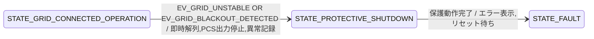

**目次**

- [実践 制御システムの高信頼化設計：安全性、リアルタイム性、そしてテスト戦略](#実践-制御システムの高信頼化設計安全性リアルタイム性そしてテスト戦略)
- [はじめに：単に動くだけではない、制御システムに求められる「信頼性」](#はじめに単に動くだけではない制御システムに求められる信頼性)
- [リアルタイム性の考慮：時間に厳しい要求に応える](#リアルタイム性の考慮時間に厳しい要求に応える)
  - [状態遷移とアクションの実行時間制約](#状態遷移とアクションの実行時間制約)
  - [優先度ベースのイベント処理とタスクスケジューリング](#優先度ベースのイベント処理とタスクスケジューリング)
  - [タイマーイベントの正確な扱いとタイムアウト処理](#タイマーイベントの正確な扱いとタイムアウト処理)
- [安全性とフェールセーフ設計：万が一に備える](#安全性とフェールセーフ設計万が一に備える)
  - [リスク分析とハザードの特定（概要）](#リスク分析とハザードの特定概要)
  - [不正な状態遷移の徹底的な防止（ガード条件、入力バリデーション）](#不正な状態遷移の徹底的な防止ガード条件入力バリデーション)
  - [予期せぬイベントへの対処戦略](#予期せぬイベントへの対処戦略)
    - [デフォルト遷移、エラー状態への安全な移行](#デフォルト遷移エラー状態への安全な移行)
  - [センサー故障やアクチュエータ異常時のフォールトトレラント設計](#センサー故障やアクチュエータ異常時のフォールトトレラント設計)
    - [故障検出メカニズムとの連携](#故障検出メカニズムとの連携)
    - [縮退運転モード、安全停止シーケンス](#縮退運転モード安全停止シーケンス)
  - [ウォッチドッグタイマー（WDT）の適切な活用と状態設計](#ウォッチドッグタイマーwdtの適切な活用と状態設計)
  - [電源投入時/遮断時の状態管理](#電源投入時遮断時の状態管理)
    - [安全な初期状態への遷移保証](#安全な初期状態への遷移保証)
    - [電源断前の状態保存と復帰（必要な場合）](#電源断前の状態保存と復帰必要な場合)
- [割り込み処理と状態遷移の相互作用](#割り込み処理と状態遷移の相互作用)
  - [割り込みコンテキストでの状態変数の安全な更新（排他制御、クリティカルセクション）](#割り込みコンテキストでの状態変数の安全な更新排他制御クリティカルセクション)
  - [割り込みハンドラからメイン処理へのイベント通知方法](#割り込みハンドラからメイン処理へのイベント通知方法)
  - [状態マシンと割り込み処理の責務分担](#状態マシンと割り込み処理の責務分担)
- [デバッグ容易性のための設計：問題解決を迅速に](#デバッグ容易性のための設計問題解決を迅速に)
  - [現在状態の可視化（デバッグポート、表示器、ロギング）](#現在状態の可視化デバッグポート表示器ロギング)
    - [デバッグポート / テストピンの活用](#デバッグポート--テストピンの活用)
    - [外部表示器（LED、LCD）の活用](#外部表示器ledlcdの活用)
    - [ロギング機能による状態とイベントの記録](#ロギング機能による状態とイベントの記録)
  - [状態遷移履歴のログ記録とトレース](#状態遷移履歴のログ記録とトレース)
  - [テスト容易な状態モジュールの設計（再訪）](#テスト容易な状態モジュールの設計再訪)
- [制御システムのテスト戦略](#制御システムのテスト戦略)
  - [状態遷移テストとカバレッジ基準（再訪と深化）](#状態遷移テストとカバレッジ基準再訪と深化)
  - [異常系イベント、境界値イベントの重点的テスト](#異常系イベント境界値イベントの重点的テスト)
    - [異常系イベントのテスト：システムはパニックに陥らないか？](#異常系イベントのテストシステムはパニックに陥らないか)
    - [境界値イベントの重点的テスト：ギリギリの攻防](#境界値イベントの重点的テストギリギリの攻防)
  - [タイミング依存のテストの課題とアプローチ](#タイミング依存のテストの課題とアプローチ)
  - [シミュレータと実機テストの使い分け](#シミュレータと実機テストの使い分け)
  - [ハードウェアインザループ (HIL) シミュレーションの活用](#ハードウェアインザループ-hil-シミュレーションの活用)
- [ケーススタディ（より実践的な制御システムの例）](#ケーススタディより実践的な制御システムの例)
  - [ケーススタディ：太陽光 PCS の系統連系制御（簡略版）](#ケーススタディ太陽光-pcs-の系統連系制御簡略版)
    - [特定のシナリオにおける状態遷移の追跡 と UML ステートマシン図（簡略版）](#特定のシナリオにおける状態遷移の追跡-と-uml-ステートマシン図簡略版)
    - [実装パターンの検討](#実装パターンの検討)
    - [リアルタイム性・安全性の考慮点の洗い出し](#リアルタイム性安全性の考慮点の洗い出し)
- [おわりに：信頼される制御システムエンジニアを目指して](#おわりに信頼される制御システムエンジニアを目指して)

# 実践 制御システムの高信頼化設計：安全性、リアルタイム性、そしてテスト戦略

# はじめに：単に動くだけではない、制御システムに求められる「信頼性」

若手エンジニアの皆さん、これまでの学習で、状態設計の基本的な考え方、UML ステートマシン図によるモデル化、そして具体的な実装パターンについて学んできましたね。これらの知識は、システムの振る舞いを明確にし、構造化されたコードを書く上で非常に重要です。

しかし、私たちが「制御系システム」と呼ぶものの多く、とくに工場で稼働する産業機械、自動車の電子制御ユニット (ECU)、医療機器、航空宇宙システムといった分野では、単に「仕様通りに機能が動く」だけでは不十分であり、それに加えて**極めて高い「信頼性 (Reliability)」**が求められます。

この「信頼性」という言葉は、実に多くの側面を含んでいます。

- システムは、**期待される時間内に、確実に**応答しなければならない（**リアルタイム性**）。
- システムは、予期せぬ事態や故障が発生しても、**人命や環境、あるいはシステム自身に危害を加えることなく、安全に**振る舞わなければならない（**安全性、フェールセーフ**）。
- システムは、外部からの割り込みや、電源の瞬断といった**厳しい環境下でも、安定して動作**し続けなければならない（**堅牢性**）。

これらの厳しい要求に応えるためには、これまでに学んだ状態設計の知識をさらに深め、制御システム特有の課題や制約を考慮した、より高度な設計アプローチと、その設計が正しく実装されていることを徹底的に検証するためのテスト戦略が必要になります。

この「実践 制御システムの高信頼化設計」編では、

- **リアルタイム性**を考慮した状態設計と実装。
- システムの**安全性**を高めるためのフェールセーフ設計やフォールトトレラントな考え方。
- **割り込み処理**と状態マシンの安全な連携。
- そして、これらの高信頼性を担保するための**テスト戦略**。

といった、より実践的で、制御システム開発の現場で直面することの多いトピックを中心に掘り下げていきます。

この資料を通じて、皆さんが「単に動く」システムから一歩進んで、「信頼される」システムを設計・開発するための知識と視点を身につけ、より責任感と自信を持って制御システム開発に取り組めるようになることを目指します。

# リアルタイム性の考慮：時間に厳しい要求に応える

多くの制御系システム、とくにハードリアルタイムシステムと呼ばれるものでは、処理の「正しさ」だけでなく、その処理が「**いつまでに完了するか（時間的制約）**」が極めて重要になります。定められた時間内に応答や制御が行われなければ、システムの誤動作や、場合によっては深刻な事故に繋がる可能性があるからです。

状態設計においても、この「リアルタイム性」は重要な考慮事項です。状態遷移の速さ、各状態で実行されるアクションの処理時間、イベント発生から応答までの遅延などが、システム全体のリアルタイム性能に影響を与えます。

## 状態遷移とアクションの実行時間制約

状態マシンモデルにおいて、状態間の「遷移」や、遷移時および状態内で実行される「アクション」は、それぞれが CPU 時間を消費する処理です。これらの処理にかかる時間が、システムのリアルタイム要件を満たす範囲内に収まっているかを評価し、設計する必要があります。

- **最悪実行時間 (WCET - Worst-Case Execution Time) の見積もり:**
  各アクションや、遷移の条件判断（ガード条件の評価など）にかかる最悪の実行時間を見積もることが重要です。とくに、ループ処理や外部デバイスへのアクセス、複雑な計算などが含まれる場合は注意が必要です。
  WCET の見積もりには、静的コード解析ツールや、実機での測定、あるいは経験に基づいた評価などが用いられます。
- **デッドライン (Deadline) の設定:**
  特定のイベント発生から、対応するアクションが完了し、次の安定した状態に遷移するまでに許容される時間（デッドライン）が、システムの要求仕様から定義されている場合があります。設計された状態マシンが、このデッドラインを確実に守れるかを確認する必要があります。
- **遷移のオーバーヘッド:**
  状態遷移のメカニズム自体（例: State パターンにおけるオブジェクト切り替え、状態テーブルの検索）にも、わずかながら処理時間がかかります。状態遷移が非常に頻繁に発生するシステムでは、このオーバーヘッドも無視できない場合があります。
- **アクションの分割と非同期化:**
  もし、あるアクションの処理時間が長すぎてデッドラインを満たせない場合は、そのアクションをより小さなステップに分割したり、時間のかかる部分を別の低優先度タスクにオフロード（非同期化）し、状態マシン自身は迅速に次の状態へ遷移できるようにする、といった設計上の工夫が必要になることがあります。その場合、オフロードしたタスクの完了は、新たなイベントとして状態マシンに通知される形になります。

**例：モーター制御システム**

高速で回転するモーターの位置を精密に制御するシステムを考えてみましょう。エンコーダーから数ミリ秒ごとに現在のモーター位置情報がイベントとして入力され、状態マシンはそれに基づいて次の制御指令（例: トルク指令値）を計算し、これも数ミリ秒以内にモータードライバに出力しなければならない、といった厳しいリアルタイム制約が存在します。

この場合、

- 位置情報受信イベントの処理。
- 制御指令計算アクション。
- 状態遷移ロジック。

これらの実行時間の合計が、定められた制御周期内に確実に収まるように、アルゴリズムの選択やコードの実装レベルでの最適化、場合によってはハードウェア（より高速な CPU）の選定まで考慮する必要があります。

状態設計の段階で、各状態や遷移に関連する処理の「時間的コスト」を意識し、それがシステム全体のリアルタイム要件と整合性が取れているかを見積もることは、後工程での手戻りを防ぎ、期待される性能を達成するために非常に重要です。

## 優先度ベースのイベント処理とタスクスケジューリング

制御系システム、とくにリアルタイム性が求められるシステムでは、様々な種類のイベントが、異なるタイミングで、そして異なる「**重要度**」を持って発生します。たとえば、

- 数ミリ秒ごとに処理しなければならない高速なセンサーデータ処理イベント。
- 数百ミリ秒ごとのユーザーインターフェース更新イベント。
- いつ発生するかわからないが、発生したら即座に対応しなければならない緊急停止イベント。
- バックグラウンドで定期的に実行されるデータのロギング処理イベント。

これらのイベントを、すべて同じように到着順（FIFO）で処理しているだけでは、本当に重要な、時間的制約の厳しいイベントの処理が遅れてしまい、システム全体のリアルタイム性や安全性が損なわれる可能性があります。

そこで重要になるのが、「**優先度ベースのイベント処理**」と、それを支える「**タスクスケジューリング**」の考え方です。

**イベントの優先度付け**

まず、システム内で発生しうる各イベントに対して、その**重要度や緊急度に応じた「優先度 (Priority)」**を割り当てます。

- **高い優先度:**
  - システムの安全性に直結するイベント（例: 緊急停止、異常検出）。
  - 厳しいリアルタイム制約を持つイベント（例: 高速なフィードバック制御ループ）。
  - 他の多くの処理の前提となる重要なイベント。
- **低い優先度:**
  - 多少処理が遅れてもシステム全体への影響が少ないイベント（例: UI の表示更新の一部、バックグラウンドのログ記録）。
  - 時間的制約が比較的緩やかなイベント。

この優先度付けは、システムの要求仕様、リスク分析、そして制御対象の特性に基づいて慎重に行う必要があります。

**優先度付きイベントキューとディスパッチャ**

イベントを処理する際には、単純な FIFO のイベントキューではなく、「**優先度付きイベントキュー (Priority Event Queue)**」を用いることが一般的です。

- 優先度付きイベントキューは、イベントをその優先度順に保持します。
- イベント処理のディスパッチャ（イベントをキューから取り出して対応するハンドラに渡す部分）は、常にキューの中で最も優先度の高いイベントから取り出して処理します。

これにより、たとえ処理待ちのイベントが溜まっていたとしても、より重要なイベントが到着すれば、それが先に処理されるようになります。

**リアルタイムオペレーティングシステム (RTOS) とタスクスケジューリング**

より複雑な制御システムでは、イベント処理やアクションの実行が、**リアルタイムオペレーティングシステム (RTOS)**上の複数の「**タスク (Task)**」（またはスレッド）に分割されて行われることが一般的です。RTOS は、これらのタスクの実行順序を、そのタスクに割り当てられた優先度に基づいて決定する「**タスクスケジューラ (Task Scheduler)**」機能を提供します。

- **タスクへの優先度割り当て:**
  各タスク（例: センサーデータ処理タスク、制御ロジック実行タスク、通信タスク、UI 更新タスク）に対して、そのタスクが担当する処理の重要度やリアルタイム要件に応じて、静的または動的に優先度を割り当てます。
- **プリエンプティブなスケジューリング:**
  多くの RTOS では、「**プリエンプティブ（横取り可能）な優先度ベーススケジューリング**」が採用されています。これは、現在実行中のタスクよりも高い優先度のタスクが実行可能状態（例: 対応するイベントが発生した）になると、OS は即座に現在のタスクの実行を中断し、より高い優先度のタスクに CPU の実行権を切り替える、というものです。
- **状態マシンとタスクの連携:**
  状態マシンのロジック自体を一つのタスクとして実装し、イベントキューからイベントを受け取って状態遷移を行う、という構成がよく見られます。あるいは、状態マシンが実行するアクションの一部（とくに時間のかかるものや、優先度が異なるもの）を、別のタスクとして起動し、その完了をイベントとして待つ、といった設計も考えられます。

**優先度設計における注意点:**

- **優先度の逆転 (Priority Inversion):**
  低い優先度のタスクが共有リソース（ミューテックスなど）を保持しているために、そのリソースを必要とする高い優先度のタスクが待たされてしまう、という問題。これを避けるために、優先度継承プロトコル (Priority Inheritance Protocol) や優先度上限プロトコル (Priority Ceiling Protocol) といったメカニズムが RTOS に備わっていることがあります。
- **スターベーション (Starvation):**
  低い優先度のタスクが、常に高い優先度のタスクによって実行機会を奪われ、いつまでたっても実行されない、という問題。タスクの優先度設計や、周期的な処理のスケジューリングを慎重に行う必要があります。
- **デッドラインの考慮:**
  単に優先度が高いだけでなく、各処理が持つべき「デッドライン（完了期限）」を考慮したスケジューリング手法（例: Rate Monotonic Scheduling - RMS, Earliest Deadline First - EDF）も存在します。

優先度ベースのイベント処理とタスクスケジューリングは、制御系システムがその時間的制約を守り、重要な処理を確実に実行するための根幹となる技術です。状態設計を行う際には、各状態やイベント、アクションが、システム全体のタスク構成やスケジューリングポリシーとどのように整合し、リアルタイム要件を満たすのかを常に意識する必要があります。これには、RTOS の機能や特性に対する深い理解も不可欠となります。

## タイマーイベントの正確な扱いとタイムアウト処理

制御系システムにおいて、「**時間**」は非常に重要な要素です。一定時間後に何らかの処理を開始したり、定期的に特定の動作を繰り返したり、あるいは予期したイベントが一定時間内に発生しなかった場合にエラーとして対処したりと、時間に基づいた制御は随所で見られます。

これらの時間に関連する制御を実現するために、「**タイマーイベント**」と「**タイムアウト処理**」の正確な設計と実装が不可欠となります。

**タイマーイベントの役割と種類**

タイマーイベントは、あらかじめ設定された時間が経過したことを状態マシン（あるいは他の処理モジュール）に通知し、特定の遷移やアクションのトリガーとなるイベントです。

- **ワンショットタイマー (One-Shot Timer):**
  設定された時間が一度経過するとイベントを発生させ、その後は停止するタイマー。
  - 用途例:
    - ある操作の開始を一定時間遅延させる。
    - イベントの応答待ちに時間制限を設ける（タイムアウト検出）。
    - 特定の期間だけ有効な状態を表現する。
- **周期的タイマー (Periodic Timer / Repeating Timer):**
  設定された時間間隔で、繰り返しイベントを発生させ続けるタイマー。
  - 用途例:
    - センサーデータの定期的なサンプリング。
    - 制御ループの周期的な実行トリガー。
    - UI の定期的な表示更新。
    - ハートビート信号の送信。

これらのタイマーは、通常、OS (RTOS) が提供するタイマーサービスや、ハードウェアタイマーを利用して実現されます。状態マシンは、これらのタイマーサービスに対してタイマーの開始、停止、周期の変更といった操作を行い、タイマー満了時に対応するイベント（例: `TIMER_EXPIRED_EVENT`, `TIMEOUT_EVENT`）を受け取って処理します。

**タイマーイベントの正確な扱いにおける注意点**

タイマーを正確に扱うためには、いくつかの点に注意が必要です。

- **タイマーの精度と分解能:**
  システムが要求する時間の精度（例: ミリ秒単位、マイクロ秒単位）に対して、使用するタイマーサービスやハードウェアタイマーが十分な精度と分解能を持っているかを確認する必要があります。
- **タイマーのドリフト（ずれ）:**
  ソフトウェアタイマーは、OS のスケジューリング遅延や他の割り込み処理の影響を受けて、設定した時間きっかりにイベントが発生するとは限らず、多少のずれ（ジッター）が生じる可能性があります。このずれが許容範囲内であるか、あるいは補正が必要かを検討します。ハードウェアタイマーの方が一般的に高精度です。
- **タイマーの管理:**
  複数のタイマーを同時に使用する場合、それぞれのタイマー ID、満了時間、発生させるイベントの種類などを適切に管理する仕組みが必要です。状態遷移時に不要になったタイマーは確実に停止・破棄し、リソースリークを防ぐ必要があります。
- **タイマーイベントの処理遅延:**
  タイマーが満了してイベントが発生しても、そのイベントが実際に状態マシンで処理されるまでには、イベントキューの待ち時間や、他の高優先度タスクによる実行遅延などが生じる可能性があります。この処理遅延がシステムのリアルタイム性に影響を与えないか考慮が必要です。

**タイムアウト処理：予期せぬ「待ち」からの脱出**

制御系システムでは、外部デバイスからの応答を待ったり、特定の条件が成立するのを待ったりする場面が多くあります。しかし、もしその応答が永遠に来なかったり、条件がいつまでも成立しなかったりすると、システムはその箇所で「ハングアップ（停止）」してしまう可能性があります。これは、システムの信頼性や安全性を著しく損なうため、絶対に避けなければなりません。

「**タイムアウト処理**」は、このような**予期せぬ長時間の「待ち」状態からシステムを安全に脱出させる**ための重要なメカニズムです。

- **タイムアウトの設定:**
  何らかの応答や条件成立を待つ処理を開始する際に、同時にワンショットタイマーを起動し、「この時間内に応答がなければタイムアウトとみなす」という時間制限を設定します。
- **タイムアウトイベントの発生:**
  設定した時間内に期待した応答や条件成立のイベントが発生すれば、タイムアウトタイマーはキャンセルされます。もし、時間内に応答がなければ、タイマーが満了し、「タイムアウトイベント」が発生します。
- **タイムアウト時の処理:**
  状態マシンは、このタイムアウトイベントを受け取ると、
  - エラー状態へ遷移する。
  - リトライ処理を行う。
  - デフォルトの処理を実行する。
  - ユーザーや上位システムにエラーを通知する。
    といった、あらかじめ定義されたエラー処理や回復処理を実行します。

**タイムアウト設計のポイント:**

- **適切なタイムアウト値の設定:**
  タイムアウト値が短すぎると、正常な応答でもタイムアウトと誤判定してしまい、システムの効率を低下させます。長すぎると、本当に問題が発生している場合の検出が遅れ、システムが長時間応答しない状態が続く可能性があります。対象とする処理の通常の応答時間や、システムが許容できる最大待ち時間などを考慮し、適切な値を設定する必要があります。
- **タイムアウト発生時の回復戦略:**
  タイムアウトが発生した場合に、システムとしてどのように振る舞うべきか（リトライ回数の上限、エラー通知の方法、安全な状態への移行手順など）を明確に定義しておくことが重要です。
- **どこでタイムアウトを検出・処理するか:**
  個々のデバイスドライバレベルでタイムアウトを設けるか、より上位のアプリケーションロジックレベルで設けるか、あるいは両方で設けるかなど、タイムアウト検出の責務をどこに持たせるかを設計します。

タイマーイベントとタイムアウト処理は、制御系システムの時間の流れを正確に刻み、予期せぬ事態にも堅牢に対応するための、状態設計における基本的ながらも非常に重要な要素です。これらの設計を怠ると、システムは不安定になりやすく、デバッグも困難になるため、開発の初期段階から慎重に検討し、UML ステートマシン図などにも明確にモデル化しておくことが推奨されます。

# 安全性とフェールセーフ設計：万が一に備える

これまでのセクションでは、主にシステムの機能的な振る舞いや時間的な制約をどのように状態設計に落とし込むかを見てきました。しかし、制御系システム、とくに人々の安全や環境、あるいは高価な設備に影響を与える可能性のあるシステムにおいては、単に「正しく動く」だけでは不十分であり、「**いかに安全に動くか、そして万が一の際にはいかに安全に停止または縮退するか**」という「**安全性 (Safety)**」の観点が極めて重要になります。

この部では、システムの安全性を高めるための設計思想である「**フェールセーフ (Fail-safe)**」や「**フォールトトレランス (Fault Tolerance)**」の考え方を状態設計にどのように取り入れ、万が一の事態にも堅牢に対応できるシステムを構築していくか、その基本的なアプローチについて探求します。

## リスク分析とハザードの特定（概要）

安全なシステムを設計するための第一歩は、「**何が危険なのか（ハザード）**」を特定し、「**その危険がどの程度の確率で、どの程度の被害をもたらしうるのか（リスク）**」を評価することです。これを「**リスク分析 (Risk Analysis)**」と呼びます。

状態設計の文脈でリスク分析を行うことは、

- どの状態が潜在的に危険な状況につながりやすいか？
- どのイベントが予期せぬハザード（危険源）を引き起こす可能性があるか？
- どの状態遷移が失敗した場合に、最も大きな影響が出るか？

といった点を明らかににし、設計段階で事前に対策を講じるための基礎となります。

**ハザード (Hazard) の特定:**

ハザードとは、「危害（人への傷害や健康障害、財産や環境への損害）の潜在的な源」のことです。制御系システムにおいては、以下のようなものがハザードの例として考えられます。

- 機械の可動部による挟まれ、巻き込まれ。
- 高温部への接触による火傷。
- 電気的なショートによる感電や火災。
- 制御不能な暴走による衝突や破壊。
- 誤った薬剤の投与（医療機器）。
- システムの機能停止による、重要なプロセスの遅延や損失。

これらのハザードを、システムの機能、構造、使用環境、起こりうる誤操作などを考慮しながら、網羅的に洗い出すことが最初のステップです。ブレインストーミングや、FMEA (Failure Mode and Effects Analysis - 故障モード影響解析) や FTA (Fault Tree Analysis - フォールトツリー解析) といった体系的な分析手法が用いられることもあります。

**リスク (Risk) の評価:**

特定された各ハザードに対して、そのハザードが実際に危害を引き起こす「**可能性（発生確率）**」と、危害が発生した場合の「**深刻度（被害の大きさ）**」を評価し、両者を組み合わせて「**リスクレベル**」を決定します。

リスクレベル = 発生確率 × 被害の深刻度

たとえば、

- 発生確率は低いが、発生した場合の被害が致命的（人命に関わるなど）なハザードは、高いリスクレベルと評価されます。
- 発生確率は比較的高いが、被害は軽微（少しの不便が生じる程度）なハザードは、比較的低いリスクレベルと評価されるかもしれません。

このリスク評価の結果に基づいて、どのハザードに対して優先的に対策を講じるべきか、どの程度の安全対策が必要か、といった判断が行われます。

**状態設計へのフィードバック:**

リスク分析とハザード特定の活動は、状態設計に対して以下のような重要なフィードバックを与えます。

- **安全状態の定義:** システムが異常を検知した場合や、危険な状況に陥る可能性がある場合に、遷移すべき「安全な状態（フェールセーフ状態）」を明確に定義する必要性を示唆します。
- **危険な遷移の特定:** 特定の状態遷移が、もし失敗したり、予期せぬタイミングで発生したりした場合に、ハザードに繋がる可能性がないかを検証します。
- **ガード条件の重要性:** 危険な状態への遷移を防ぐためのガード条件や、安全な操作を保証するための前提条件の必要性を明らかにします。
- **エラー処理と回復戦略:** どのような種類の故障やエラーを想定し、それぞれの場合にシステムがどのように振る舞い、どのように安全を確保し、可能であればどのように回復すべきか、その戦略を具体化するインプットとなります。

リスク分析は、一度行ったら終わりではなく、設計が進むにつれて新たなリスクが見えてくることもあるため、反復的に見直すことが重要です。安全なシステムを設計するためには、まず「何が危ないのか」を徹底的に知ろうとする姿勢が不可欠なのです。

## 不正な状態遷移の徹底的な防止（ガード条件、入力バリデーション）

リスク分析によってシステムに潜むハザードが特定されたら、次はそのハザードが現実のものとならないように、設計レベルで対策を講じていく必要があります。とくに状態設計においては、「**意図しない状態遷移**」や「**不正な状態での操作**」が、しばしば危険な状況を引き起こす直接的な原因となります。

これらを防ぐための最も基本的な、そして強力な手段が、「**ガード条件 (Guard Condition)**」の徹底的な活用と、「**入力バリデ ชัน (Input Validation)**」の厳密な実施です。

**ガード条件による遷移の厳格化**

「状態設計の基本的な言葉たち」のセクションでも触れましたが、ガード条件は「遷移が発生するための追加の論理条件」であり、イベントが発生した上で、この条件が真 (true) でなければ遷移は実行されません。

安全性を高めるためには、このガード条件を設計のあらゆる場面で活用し、**システムが安全な状態にあること、あるいは遷移を実行するための前提条件がすべて満たされていることを、遷移の直前に必ず確認する**ようにします。

- **センサー値の範囲チェック:**
  「モーター回転開始イベント」が発生したとしても、「[モーター温度が安全範囲内 AND 負荷センサーが正常値]」でなければ、回転状態へは遷移しない。
- **リソースの可用性チェック:**
  「データ書き込み要求イベント」が発生したが、「[書き込み先メモリに十分な空き容量あり]」でなければ、書き込み処理状態へは遷移せず、エラー状態へ遷移する。
- **操作順序の正当性チェック:**
  「製品組み立てアーム下降コマンド」を受け取ったが、「[製品が正しい位置にセットされている AND 安全扉が閉まっている]」ことが確認できなければ、アーム下降状態へは遷移しない。
- **相互排他の保証:**
  ある処理 A を実行中の状態から、競合する可能性のある処理 B の開始イベントを受け取った場合、「[処理 A が完了している OR 処理 A が安全に中断可能]」でなければ、処理 B の実行状態へは遷移しない。

ガード条件は、いわば状態遷移の「最後の砦」です。この砦を堅固にすることで、予期せぬイベントや、システム内部の潜在的な不整合が、即座に危険な状態遷移に繋がるのを防ぎます。

**入力バリデーションによる不正データの排除**

制御システムが外部（ユーザー、他のシステム、センサーなど）から受け取る「入力データ」は、常に信頼できるとは限りません。ノイズが乗ったセンサー値、範囲外のパラメータ指定、あるいは悪意のある不正なデータなど、予期しない入力がシステムに与えられる可能性を常に考慮する必要があります。

これらの不正な入力データが、そのままシステム内部のロジックや状態遷移の判断に使われてしまうと、誤動作や不安定な挙動、最悪の場合は安全性を損なう事態を引き起こしかねません。

「**入力バリデーション**」とは、システムが外部からデータを受け取った際に、そのデータが**期待される形式、範囲、内容であるかを厳密に検証し、不正なデータであれば受け付けを拒否したり、エラー処理を行ったりする**ことです。

- **型チェック:** 期待されるデータ型（整数、浮動小数点数、文字列など）であるか。
- **範囲チェック:** 数値が許容される最小値と最大値の間にあるか（同値分割や境界値分析の考え方を活用）。
- **フォーマットチェック:** 特定の書式（日付形式、IP アドレス形式など）に従っているか。
- **一貫性チェック:** 他のデータとの間に矛盾がないか（例: 開始時刻が終了時刻より前であるか）。
- **存在チェック:** 必須のパラメータが欠落していないか。

入力バリデーションは、できるだけシステムの「入り口」に近い部分（データ受信モジュール、ユーザーインターフェース処理部など）で行い、不正なデータがシステム内部のコアなロジックに到達する前に排除することが重要です。

**状態マシンと入力バリデーションの連携:**

状態マシンがイベントを受け取る際、そのイベントに含まれるデータパラメータに対しても、状態遷移のガード条件の一部として、あるいはアクションの実行前に、入力バリデーションを行うべきです。

- 例: 「速度設定イベント (設定値: V)」を受け取ったが、「[V が許容速度範囲内]」でなければ、速度変更状態へは遷移せず、エラーを通知する。

**防御的プログラミングの精神**

ガード条件の徹底と入力バリデーションの厳密な実施は、「**防御的プログラミング (Defensive Programming)**」という、より広範な設計思想の一環です。防御的プログラミングとは、「プログラムの外部から予期せぬデータやイベントが与えられること、あるいはプログラム内部で予期せぬ状態が発生することを常に想定し、それらが発生してもシステムが破綻したり、危険な状態に陥ったりしないように、あらかじめ防御的なコードを記述しておく」という考え方です。

アサーション（プログラムの特定の箇所で、ある条件が必ず真であるはずだということを表明し、もし偽であればエラーとする仕組み）の活用も、防御的プログラミングの有効な手段の一つです。

不正な状態遷移や不正なデータによる誤動作は、制御システムの信頼性と安全性を脅かす大きな要因です。ガード条件と入力バリデーションを、設計の初期段階から徹底的に検討し、実装に漏れなく組み込むことで、これらのリスクを大幅に低減し、より堅牢で信頼されるシステムを構築することができるのです。

## 予期せぬイベントへの対処戦略

状態マシンを設計する際には、各状態で「期待されるイベント」と、それに対する「遷移」や「アクション」を定義していきます。しかし、現実のシステムでは、設計者が当初想定していなかった「**予期せぬイベント**」が発生する可能性も考慮しなければなりません。

予期せぬイベントとは、たとえば以下のようなものです。

- 現在の状態では処理すべきではない種類のイベント。
- 通常ではありえない順序で発生したイベント。
- パラメータが異常なイベント。
- 外部ノイズや通信エラーなどによって誤って生成されたかのように見えるイベント。

これらの予期せぬイベントに対して、システムが何の対処もせずに無視したり、あるいは定義されていない振る舞いをしたりすると、システムが不安定になったり、デッドロック状態に陥ったり、最悪の場合は安全性を損なう危険な状態に遷移してしまう可能性があります。

したがって、堅牢な制御システムを設計するためには、これらの「予期せぬイベント」が発生した場合に、システムがどのように振る舞うべきか、その**対処戦略**をあらかじめ明確に定義しておくことが非常に重要です。

### デフォルト遷移、エラー状態への安全な移行

予期せぬイベントへの対処戦略として、一般的に以下のようなアプローチが考えられます。

1. **イベントを無視する (Ignore the Event):**

   - **考え方:** 現在の状態において、そのイベントがシステムの動作や安全性に何ら影響を与えず、かつ処理する必要もないと判断される場合、そのイベントは単に無視（破棄）します。状態遷移もアクションも発生しません。
   - **適用例:** システムが安定した待機状態にあるときに、関連性のないセンサーからの一時的なノイズデータを受信した場合など。
   - **注意点:** 本当に無視して良いのか、慎重な判断が必要です。無視した結果、後で問題が隠蔽されることのないように注意します。ログに「未処理イベント」として記録しておくのも一つの手です。

2. **エラー状態へ遷移する (Transition to an Error State):**

   - **考え方:** 予期せぬイベントの発生が、システムにとって何らかの異常事態を示している、あるいは危険な状況を引き起こす可能性があると判断される場合、システムをあらかじめ定義された「**エラー状態**」または「**安全停止状態 (Fail-safe State)**」へ即座に遷移させます。
   - **適用例:** 運転中に、本来ありえないセンサーの組み合わせパターンを検出した場合。重要な制御パラメータが範囲外の値で設定されようとした場合。
   - **エラー状態での振る舞い:** エラー状態では、通常、システムの動作を安全な形で制限・停止し、エラーの原因を示す警告（ランプ、ブザー、メッセージなど）を発し、管理者によるリセットや対処を待つ、といった振る舞いをします。
   - **UML ステートマシン図での表現:** 各状態から、予期せぬイベント（あるいは「その他すべてのイベント」を示すワイルドカード的なイベント）をトリガーとして、共通のエラー状態への遷移を定義します。

3. **デフォルト遷移を定義する (Default Transition):**

   - **考え方:** ある状態で、明示的に遷移が定義されていないイベントが発生した場合に、あらかじめ定められた「デフォルトの遷移先状態」へ移るようにします。これは、エラー状態への遷移の一種と考えることもできますし、あるいは「現在の処理を中断して初期状態に戻る」といった、より一般的な回復処理である場合もあります。
   - **適用例:** ユーザーインターフェースで、現在のモードでは無効なボタンが押された場合に、特にエラー表示はせず、単に現在のモードを維持する（自己遷移で何もしない）、あるいは操作ガイドを表示する状態へ移るなど。
   - **UML ステートマシン図での表現:** 特定のイベント名を指定せず、ガード条件のみで遷移を定義したり、あるいは階層的ステートマシンのスーパーステートレベルで共通のイベントハンドリングを定義したりすることで実現できます。

4. **ログ記録と通知 (Logging and Notification):**
   - 予期せぬイベントが発生したという事実（イベントの種類、発生時刻、その時のシステム状態など）を、詳細なログとして記録しておくことは、後の問題解析やデバッグにおいて非常に重要です。
   - 重大な予期せぬイベントの場合は、システム管理者やオペレーターに即座に通知（アラート）を発する仕組みも必要になることがあります。

**対処戦略の選択基準:**

どの対処戦略を選択するかは、

- その予期せぬイベントがシステムに与える潜在的な**リスクの大きさ**。
- システムの**安全要求レベル**。
- イベントの**性質**（一時的なノイズか、致命的な異常か）。
- システムが許容できる**ダウンタイム**や**回復時間**。

などを総合的に考慮して決定する必要があります。

**設計段階からの組み込みの重要性:**

予期せぬイベントへの対処戦略は、実装段階で場当たり的に追加するのではなく、**状態設計の初期段階から意識的に検討し、UML ステートマシン図などの設計モデルにも明確に反映させておく**ことが、システムの堅牢性と安全性を確保する上で不可欠です。

「ありえないはずのイベント」は、えてして「起こりうる」ものです。それらに対する備えを怠らないことが、信頼される制御システムを築くための重要な心構えと言えるでしょう。

## センサー故障やアクチュエータ異常時のフォールトトレラント設計

制御系システムは、その名の通り、センサーからの情報を基に判断し、アクチュエータを操作することで対象を制御します。しかし、これらの物理的な入出力デバイス（センサーやアクチュエータ）は、機械的な摩耗、電気的なノイズ、環境要因、あるいは寿命などにより、**故障したり、異常な値を示したりする可能性**を常に持っています。

もし、システムがこれらの故障や異常を検知できず、誤ったセンサー情報に基づいて制御を続けたり、あるいはアクチュエータが意図通りに動作しないまま処理を進めたりすると、製品の品質低下、設備の破損、そして何よりも人々の安全を脅かす深刻な事態に繋がりかねません。

「**フォールトトレランス (Fault Tolerance / 耐故障性)**」とは、システムの一部に故障（フォールト）が発生した場合でも、システム全体としては機能の低下を最小限に抑え、可能な限り動作を継続するか、あるいは少なくとも安全な状態に移行できる能力のことです。状態設計においては、このフォールトトレランスの考え方を取り入れ、センサーやアクチュエータの故障・異常に「**備える**」設計が不可欠となります。

### 故障検出メカニズムとの連携

フォールトトレラントな状態設計の前提として、まず**センサーやアクチュエータの故障や異常を検知するためのメカニズム**が必要です。これには、以下のような様々なアプローチが考えられます。

- **センサー値の範囲チェック (Range Check):** センサーからの入力値が、物理的にありえない値（例: 温度センサーが -1000℃ を示す）や、正常動作範囲を大幅に逸脱した値（例: モーターの回転数が定格の 2 倍を超える）を示していないかを常に監視します。
- **センサー値の変化率チェック (Rate of Change Check):** センサー値が、時間的にありえないほど急激に変化していないか（例: 水槽の水位が一瞬で満水になったり空になったりする）を監視します。
- **センサー間のクロスチェック (Cross-checking):** 複数の冗長なセンサー（同じ対象を計測する複数のセンサー）を搭載している場合、それらの値が互いに大きく矛盾していないかを比較します。あるいは、異なる種類のセンサー情報（例: モーターの回転数と消費電流）から、一方の異常を推測することもあります。
- **アクチュエータのフィードバック監視:** アクチュエータ（例: バルブ、モーター）に対して操作指令を出した後、そのアクチュエータが実際に期待通りに動作したかどうかを、別のセンサー（例: バルブの開閉センサー、エンコーダー）からのフィードバックによって確認します。指令とフィードバックに一定時間以上乖離があれば、異常と判断します。
- **ハートビート監視 (Heartbeat Monitoring):** センサーやアクチュエータ（あるいはそれらを制御する下位モジュール）が定期的に「生存信号（ハートビート）」を送信し、それを受信できなくなったら故障とみなす方法。
- **自己診断機能 (Self-diagnosis):** デバイス自身が持つ自己診断機能の結果（エラーコードなど）を定期的に読み取り、異常を検知します。

これらの故障検出メカニズムは、ハードウェア的に実装されることもあれば、ソフトウェア（ドライバ層や監視タスクなど）で実装されることもあります。重要なのは、状態マシンがこれらの**故障検出メカニズムからの通知（イベント）を受け取れるように設計する**ことです。

### 縮退運転モード、安全停止シーケンス

センサー故障やアクチュエータ異常が検知された場合、状態マシンは通常の動作状態から、より安全な状態へと速やかに遷移する必要があります。この際の遷移先として、主に以下の二つのモードが考えられます。

1. **縮退運転モード (Degraded Mode / Limp Home Mode):**

   - **考え方:** システムの一部の機能が利用できなくなっても、**限定的ながらも最低限の動作を継続**し、システム全体の完全な停止を避けることを目指すモードです。
   - **適用例:**
     - 自動車で、特定のセンサーが故障した場合でも、エンジン出力を制限したり、変速を固定したりして、安全な場所まで走行を続けられるようにする。
     - 生産ラインで、一部の装置が故障した場合、その装置を使わない代替の生産プロセスに切り替えたり、生産速度を落として運転を継続したりする。
     - 温度センサーが故障した場合、ヒーターの出力を固定の安全な値にするか、あるいはより安全側の制御（例: 常に冷却ファンを回す）に切り替える。
   - **状態設計:** 縮退運転モードも、一つの（あるいは複数の）明確な「状態」として定義し、その状態での振る舞いや、通常状態へ復帰するための条件（例: 故障が解消された、手動でリセットされた）を設計します。

2. **安全停止シーケンス (Safe Shutdown Sequence / Fail-Safe State):**
   - **考え方:** 故障や異常がシステムの安全な継続運転を困難にすると判断された場合、あるいは縮退運転でも安全が確保できない場合に、システムを**最も安全な状態へと導き、停止させる**一連の手順（シーケンス）を実行します。
   - **適用例:**
     - ロボットアームが制御不能な動きを検知した場合、すべてのモーターへの電力を遮断し、ブレーキをかける。
     - 化学プラントで危険な温度上昇や圧力上昇が検知された場合、バルブを閉じて原料供給を停止し、冷却システムを最大稼働させる。
     - 医療機器で患者に危害が及ぶ可能性のある異常が発生した場合、アラームを鳴らし、すべての動作を安全に停止する。
   - **状態設計:** 安全停止シーケンス自体も、複数のステップ（状態）からなる小さな状態マシンとして設計されることがあります（例: 「緊急ブレーキ状態」→「電源遮断準備状態」→「電源遮断完了状態」）。そして、システムは最終的に「完全停止状態」や「要メンテナンス状態」といった終了状態に至ります。

どちらのモードに移行するか、あるいはどのような安全停止シーケンスを実行するかは、リスク分析の結果や、システムの安全要求レベルに基づいて慎重に決定する必要があります。

**フォールトトレラント設計のポイント:**

- **故障の想定と分類:** どのような種類の故障（センサーの断線、短絡、値の固定、ノイズ、アクチュエータの固着、応答なしなど）が発生しうるかを具体的に想定し、それぞれに対する検出方法と対処戦略を検討します。
- **冗長化 (Redundancy):** 重要なセンサーやアクチュエータ、あるいは制御モジュール自体を多重化（冗長化）し、一つが故障しても他の系で機能を継続できるようにする設計も、フォールトトレランスを高める有効な手段です。（ただし、コストや複雑さとのトレードオフになります。）
- **状態遷移の明確化:** 故障検出イベントを受け取った場合に、どの状態からどの安全状態（縮退運転または安全停止）へ、どのような条件で、どのようなアクションを伴って遷移するのかを、UML ステートマシン図などに明確に記述します。
- **ユーザー/オペレーターへの通知:** システムが故障や異常を検知し、縮退運転や安全停止に移行した場合は、その旨をユーザーやオペレーターに明確に通知し、必要な対処を促す必要があります。

センサー故障やアクチュエータ異常は、制御システムにとって「想定内」の事態として扱われるべきです。これらに対するフォールトトレラントな状態設計を事前に行っておくことが、システムの信頼性と安全性を確保し、万が一の際の被害を最小限に食い止めるための鍵となるのです。

## ウォッチドッグタイマー（WDT）の適切な活用と状態設計

制御系システム、とくに予期せぬプログラムの暴走やフリーズが深刻な事態を引き起こす可能性のあるシステムにおいては、「**ウォッチドッグタイマー (Watchdog Timer - WDT)**」というハードウェア（またはソフトウェア）の仕組みが、システムの信頼性と安全性を高めるための重要な役割を果たします。

ウォッチドッグタイマーは、その名の通り、システムの「番犬」のようなものです。プログラムが正常に動作している間は、定期的にこの番犬を「撫でて（リセットして）」あげる必要があります。もし、プログラムが何らかの原因で暴走したり、無限ループに陥ったり、あるいはフリーズしたりして、一定時間この番犬を撫でるのを忘れてしまうと、番犬は「異常事態発生！」と判断し、システムに対して強制的なリセット信号を発行したり、特定のエラー処理ルーチンを起動したりします。

状態設計においては、このウォッチドッグタイマーの存在を考慮し、その機能を効果的に活用しつつ、意図しないリセットを避けるための設計が求められます。

**ウォッチドッグタイマーの基本的な仕組みと役割**

- **タイマーのカウントダウン:** WDT は、内部でタイマーを持っており、電源投入時や初期化時に特定のタイムアウト時間でカウントダウンを開始します。
- **クリア (リフレッシュ / キック / 撫でる):** 正常に動作しているプログラムは、この WDT のタイマーがゼロになる（タイムアウトする）前に、定期的に WDT に対して「クリア信号」を送信し、タイマーを初期値にリセットします。これを「WDT をキックする」「WDT を撫でる」「WDT をリフレッシュする」などと表現します。
- **タイムアウト時の動作:** もしプログラムが WDT を期間内にクリアしなかった場合、WDT はタイムアウトしたと判断し、あらかじめ設定された動作（通常はシステムリセット、あるいは特定の割り込みの発生）を実行します。
- **目的:** CPU の暴走、ソフトウェアの無限ループ、タスクのデッドロックといった、プログラム自身では回復が困難な「ソフトウェア的なハングアップ」状態から、システムを強制的に回復させ、最悪の事態（システムの完全な応答不能や、危険な状態の継続）を防ぐことを目的としています。

**状態設計とウォッチドッグタイマーの連携**

状態マシンがシステムの主要な制御ロジックを担う場合、WDT のクリア処理をどこで、どのように行うかを慎重に設計する必要があります。

- **メインループやディスパッチャでの定期的なクリア:**
  状態マシンがイベント駆動で動作し、メインループ（またはイベントディスパッチャタスク）がイベントキューを監視して状態遷移を実行するような構成の場合、このメインループが一定周期で WDT をクリアするのが一般的な方法です。これにより、メインループ自体が正常に巡回していることを監視できます。
- **特定の「正常動作」状態でのみクリア:**
  システムの特定の「正常な動作状態」（例: 「待機中」「通常運転中」）にいる場合にのみ WDT をクリアし、もしシステムが予期せぬ「エラー状態」や「ハングアップしやすい処理中」に長時間留まっている場合は、あえて WDT をクリアせずにタイムアウトさせ、強制的な回復を促す、という設計も考えられます。
- **長時間処理を行う状態での注意:**
  もし、ある状態のアクションや do アクティビティが、WDT のタイムアウト期間を超える可能性のある長時間処理を含む場合、その処理の途中で定期的に WDT をクリアするか、あるいはその処理を別のタスクに分割し、状態マシンは迅速に次の状態へ遷移できるようにする（そして長時間処理タスクの完了をイベントで待つ）といった工夫が必要です。長時間処理中に WDT のクリアを怠ると、正常な処理中にもかかわらず WDT タイムアウトが発生してしまいます。
- **WDT タイムアウトをイベントとして扱う:**
  一部のシステムでは、WDT タイムアウトが発生した際に、即座にシステムリセットするのではなく、まず特定の割り込みを発生させ、その割り込みハンドラ（あるいはそこから通知されるイベント）を状態マシンが受け取って、ログの保存や、より穏やかなシャットダウンシーケンスを実行してからリセットする、といった段階的なエラー処理を行うこともあります。この場合、「WDT タイムアウトイベント」も状態遷移のトリガーの一つとしてモデル化します。

**WDT 活用における注意点:**

- **タイムアウト値の適切な設定:**
  WDT のタイムアウト値は、システムの通常の処理サイクルや、想定される最長の応答時間などを考慮して、短すぎず長すぎない適切な値に設定する必要があります。短すぎると、正常な処理の僅かな遅延でも誤ってタイムアウトが発生し、システムが不安定になります。長すぎると、本当に問題が発生した場合の検出と回復が遅れます。
- **クリア処理の確実な実装:**
  WDT をクリアする処理は、プログラムのメインの制御フローの中に確実に組み込まれ、どのような正常な動作経路を辿っても、定期的に実行されるようにしなければなりません。特定の条件分岐の奥深くにクリア処理が隠れてしまい、そこを通らない場合にタイムアウトする、といったバグは避けなければなりません。
- **WDT の無効化は慎重に:**
  デバッグ中などに一時的に WDT を無効化することはあっても、製品リリース時には必ず有効にし、その機能が正しく動作することを確認する必要があります。安易な WDT の無効化は、システムの最後の安全網を失うことにつながります。
- **「撫ですぎ」に注意:**
  WDT をあまりにも頻繁に、あるいはシステムの深い部分（例: 個々のドライバ関数の中など）で無秩序にクリアしてしまうと、プログラムの一部がハングアップしていても、他の部分が WDT をクリアし続けてしまうため、WDT が本来の「番犬」としての役割を果たせなくなる可能性があります。WDT のクリアは、システム全体の健全性がある程度確認できる、より上位の適切な箇所で行うのが基本です。

ウォッチドッグタイマーは、ソフトウェアだけでは検出しきれない、あるいは回復しきれない種類の致命的な障害に対する、ハードウェア的な（あるいはそれに近いレベルの）最後の安全装置です。状態設計においては、この WDT の存在を常に念頭に置き、そのクリア処理をシステムの正常なライフサイクルの中に適切に組み込み、かつ、WDT が効果的に機能するような設計（例: 長時間ブロックする処理の回避）を心がけることが、高信頼な制御システムを構築する上で非常に重要です。

## 電源投入時/遮断時の状態管理

制御系システムは、電源が投入されて起動する瞬間から、そして電源が遮断されて停止する瞬間まで、そのライフサイクル全体を通じて、安全かつ予測可能な振る舞いを維持する必要があります。「**電源投入時の初期化シーケンス**」と「**電源遮断時のシャットダウンシーケンス**」における状態管理は、システムの信頼性と安全性を確保する上で、とくに慎重な設計が求められる領域です。

### 安全な初期状態への遷移保証

システムに電源が投入された直後、あるいはリセットが発生した直後は、ハードウェアコンポーネント（メモリ、ペリフェラル、センサー、アクチュエータなど）の状態が不定であったり、あるいは予期せぬ状態になっている可能性があります。

状態マシンの設計においては、この**電源投入（またはリセット）というイベントを明確に捉え、システム全体をあらかじめ定義された安全かつ一貫性のある「初期状態」へと確実に遷移させる**ための初期化シーケンスを設計する必要があります。

- **ハードウェア初期化:**
  - CPU、クロック、メモリコントローラ、割り込みコントローラといった基本的なハードウェアの初期設定。
  - GPIO ポートの方向（入力/出力）や初期値の設定。
  - 通信ペリフェラル（UART, SPI, I2C など）のボーレートやモード設定。
  - センサーやアクチュエータ制御用 IC の初期化コマンド送信。
- **ソフトウェア初期化:**
  - グローバル変数や静的変数の初期値設定。
  - OS (RTOS) を使用している場合は、タスクの生成、セマフォやミューテックス、メッセージキューといった同期オブジェクトの初期化。
  - 各ソフトウェアモジュールの初期化関数の呼び出し。
  - 不揮発性メモリ（フラッシュメモリ、EEPROM など）に保存された設定値や前回の状態情報の読み込み（必要な場合）。
- **状態マシンの初期状態設定:**
  すべての初期化処理が正常に完了した後、システムのメインの状態マシンを、定義された「初期状態」（例: `STATE_IDLE`, `STATE_INITIALIZING` を経て `STATE_READY` など）に設定します。
- **初期診断 (POST - Power-On Self-Test):**
  重要なシステムでは、電源投入時に主要なハードウェアコンポーネント（メモリ、センサー、アクチュエータなど）の自己診断テストを実行し、異常があればエラー状態に遷移したり、ユーザーに通知したりするシーケンスを含めることがあります。

**状態設計における考慮点:**

- 初期化シーケンス自体も、複数のステップからなる小さな状態マシンとして設計することができます（例: 「HW 初期化中」→「SW 初期化中」→「自己診断中」→「待機状態へ」）。
- 初期化処理中にエラーが発生した場合（例: 必須センサーの応答がない、メモリテストに失敗した）に、どのように安全にエラー状態へ遷移し、それを通知するかを明確に定義しておく必要があります。
- ウォッチドッグタイマーは、通常、初期化シーケンスの比較的早い段階で有効化され、初期化処理が無限ループに陥らないように監視します。

### 電源断前の状態保存と復帰（必要な場合）

システムによっては、電源が遮断される直前に、現在の重要な状態情報や処理中のデータを不揮発性メモリに保存しておき、次回の電源投入時にその情報を読み込んで、中断した箇所から処理を再開したり、あるいは前回の設定を復元したりする機能が求められることがあります。

- **電源断検出:**
  予期せぬ電源断（瞬断や停電など）を検知するためのハードウェア的な仕組み（例: 電源電圧監視 IC、大容量キャパシタによる短時間の電力維持）や、OS からのシャットダウン通知が必要になる場合があります。
- **シャットダウンシーケンスの状態設計:**
  電源断が検知された場合、システムは通常の動作状態から「シャットダウン処理中」といった専用の状態へ遷移し、以下のような処理を迅速に行う必要があります。
  - 実行中のアクチュエータを安全な状態に停止させる。
  - 処理中のデータを確定させ、矛盾のない状態で保存する。
  - 必要な状態情報（例: 現在のモード、設定値、処理の進捗など）を不揮発性メモリに書き込む。
  - ファイルシステムを安全にアンマウントする。
  - 周辺デバイスの電源を適切な順序で遮断する。
- **保存データの選択とフォーマット:**
  何を不揮発性メモリに保存するか、そのデータのフォーマット、そして書き込みにかかる時間を考慮する必要があります。電源が完全に失われるまでの時間は非常に短い場合が多いため、保存するデータは最小限にし、高速に書き込める形式を選ぶことが重要です。
- **次回起動時の復帰ロジック:**
  次回の電源投入時に、保存された状態情報を読み込み、それが有効であれば（例: チェックサムが一致するなど）、その情報に基づいて状態マシンを特定の状態から再開させるか、あるいは設定値を復元します。もし保存された情報が無効であったり、存在しなかったりする場合は、安全なデフォルトの初期状態から起動します。

**状態設計における考慮点:**

- シャットダウンシーケンスもまた、時間的制約の厳しい状態遷移として設計されます。各ステップで実行すべきアクションと、その最大許容時間を明確にする必要があります。
- 不揮発性メモリへの書き込み処理は、比較的時間がかかり、また書き込み回数に上限がある場合もあるため、頻繁な電源断が予想されるシステムでは、書き込み戦略（例: 変更があった場合のみ書き込む、定期的にまとめて書き込むなど）を工夫する必要があります。
- 電源投入時に、前回のシャットダウンが正常に完了したかどうかを示すフラグなどを確認し、もし異常終了していた場合は、特別な回復処理や診断処理を行う状態へ遷移させることも検討します。

電源投入時の初期化と、電源遮断時のシャットダウンは、システムの安定稼働とデータ保全、そして安全性を確保するための「縁の下の力持ち」的な状態管理です。これらのシーケンスを状態マシンとして明確に設計し、あらゆる状況を考慮した堅牢なロジックを組み込むことが、信頼性の高い制御システムを実現する上で不可欠と言えるでしょう。

# 割り込み処理と状態遷移の相互作用

多くの制御系システム、とくにリアルタイム性が求められる組み込みシステムでは、「**割り込み (Interrupt)**」が非常に重要な役割を果たします。割り込みは、CPU が現在実行しているメインの処理（タスクやメインループ）を一時的に中断させ、特定のハードウェアイベント（例: タイマー満了、センサーからのデータ受信完了、外部ピンの変化）やソフトウェア的な要求に応じて、優先的に特定の処理（**割り込みサービスルーチン - ISR**）を実行させるための仕組みです。

割り込み処理は、システムへの迅速な応答を可能にしますが、状態マシンの設計と実装においては、いくつかの特別な注意が必要になります。とくに、割り込みサービスルーチン (ISR) が状態マシンの「状態」を変更したり、状態マシンが使用する共有データにアクセスしたりする場合、メインの処理と ISR との間で**競合状態 (Race Condition)** が発生し、システムの誤動作や不安定化を引き起こす可能性があるからです。

この部では、割り込み処理と状態マシンが安全かつ効果的に連携するための設計上の考慮点について見ていきます。

## 割り込みコンテキストでの状態変数の安全な更新（排他制御、クリティカルセクション）

割り込みサービスルーチン (ISR) は、メインのプログラムフローとは非同期的に、かつ優先的に実行されます。もし、ISR の中で、メインの処理（例: 状態マシンの状態遷移ロジックを実行するタスク）と共通の「状態変数」や共有データにアクセスし、それを更新しようとする場合、特別な配慮なしには安全性を保証できません。

**競合状態のリスク**

たとえば、メインのタスクが状態変数 `g_systemMode` を読み取り、その値に基づいて条件判断を行い、新しい値を書き込もうとしている最中に、割り込みが発生し、ISR が同じ `g_systemMode` を読み取って別の値に書き換えてしまったらどうなるでしょうか？ メインのタスクが処理を再開したときには、前提としていた `g_systemMode` の値が変わってしまっているため、意図しない動作やデータの不整合が生じる可能性があります。

とくに、状態変数の読み取り、変更、書き込みという一連の操作が、CPU の命令レベルでは複数のステップに分割される場合（例: 8 ビット CPU で 16 ビット変数を操作する場合など）、途中で割り込みが入ると、変数の値が中途半端な（壊れた）状態になる「**アトミックでない操作 (Non-atomic Operation)**」の問題も発生します。

このような、複数の実行コンテキスト（メインタスクと ISR）が共有データにアクセスする際に発生しうる問題を避けるためには、「**排他制御 (Mutual Exclusion)**」のメカニズムが必要になります。

**クリティカルセクションと排他制御**

共有データ（この場合は状態変数など）にアクセスするコードの区間を「**クリティカルセクション (Critical Section)**」と呼びます。排他制御とは、このクリティカルセクションを、ある時点でたかだか一つの実行コンテキスト（タスクまたは ISR）だけが実行できるように保証する仕組みです。

割り込みコンテキストとメインタスク間の共有データアクセスにおいて、一般的に用いられる排他制御の方法には、以下のようなものがあります。

1. **割り込みの禁止・許可 (Disabling/Enabling Interrupts):**

   - **方法:** メインのタスクがクリティカルセクションに入る直前に、関連する（あるいは全ての）割り込みを一時的に禁止し、クリティカルセクションの処理が終わったら速やかに割り込みを許可（再開）します。
   - **メリット:** 実装が比較的シンプルで、オーバーヘッドも小さい。
   - **デメリット:**
     - 割り込みを禁止している間は、他の重要な割り込み処理も遅延させてしまうため、システムのリアルタイム性を損なう可能性があります。割り込み禁止区間は**極力短く**しなければなりません。
     - 多重割り込み（割り込み処理中にさらに別の割り込みが発生する）の制御が複雑なシステムでは、単純な割り込み禁止だけでは不十分な場合があります。
     - マルチコア CPU の場合は、他のコアからの同時アクセスを防げないため、追加の排他制御（スピンロックなど）が必要です。
   - **C 言語での例（概念的）:**
     ```c
     // volatile SystemState_t g_sharedState; // 共有される状態変数
     //
     // void enterCriticalSection() { disable_interrupts(); }
     // void exitCriticalSection() { enable_interrupts(); }
     //
     // // メイン処理側
     // enterCriticalSection();
     // // g_sharedState の読み書き処理
     // exitCriticalSection();
     //
     // // ISR側 (もしISRからも変更する場合)
     // void MyISR() {
     //     // ISR内での割り込み禁止/許可はさらに慎重な設計が必要
     //     // 通常、ISRがメインタスクのクリティカルセクションと競合する場合は、
     //     // ISR内では直接変更せず、フラグを立ててメインタスクに処理を促す方が安全なことが多い
     //     enterCriticalSection(); // 非常に短時間で済むなら…
     //     // g_sharedState の読み書き処理
     //     exitCriticalSection();
     // }
     ```

2. **アトミックな操作の利用:**

   - **方法:** もし、共有データの読み書きが、CPU の命令セットレベルで「アトミック（不可分）」に実行できるのであれば（例: 特定のサイズの変数の読み書き、アトミック命令）、割り込み禁止なしでも安全にアクセスできる場合があります。
   - **メリット:** オーバーヘッドが非常に小さい。
   - **デメリット:** 適用できる操作やデータサイズに制約があります。コンパイラの最適化によって意図した通りにアトミックにならない場合もあるため、注意が必要です (`volatile` キーワードの適切な使用など)。

3. **ロックフリーなデータ構造やアルゴリズム (発展的):**
   - **方法:** ロック（割り込み禁止など）を使わずに、複数の実行コンテキストからの同時アクセスを安全に処理できるように設計された特別なデータ構造（例:ロックフリーキュー）やアルゴリズムを利用します。
   - **メリット:** 割り込み禁止による応答性の低下や、ロックによるデッドロックのリスクを回避できます。
   - **デメリット:** 設計と実装が非常に高度で難しく、専門的な知識が必要です。

**状態設計における推奨アプローチ:**

割り込みコンテキストで状態マシンの状態変数を直接変更することは、競合のリスクが高く、デバッグも困難になるため、一般的には**避けるべき**とされています。より安全で推奨されるアプローチは以下の通りです。

- **ISR はイベント通知に徹する:**
  ISR の役割は、ハードウェアイベントを検知し、そのイベントが発生したという情報を、イベントキューやフラグなどを通じて、メインの処理タスク（状態マシンを実行するタスク）に**通知する**ことに限定します。ISR 内での処理は最小限（短時間）に留め、状態変数の変更や複雑なロジックの実行は行いません。
- **状態遷移とアクションはメインタスクで実行:**
  メインの処理タスクが、ISR から通知されたイベントをイベントキューなどから受け取り、現在の状態に基づいて、状態遷移の判断、アクションの実行、そして状態変数の更新といった、状態マシンのロジック全体を実行します。これにより、状態変数へのアクセスは単一のタスクコンテキストに限定され、排他制御の必要性が大幅に減少します。

この「ISR はイベントを通知するだけ、状態マシンはメインタスクで動く」という分離は、システムの構造をシンプルに保ち、リアルタイム性を損なうことなく、割り込みと状態マシンの安全な連携を実現するための、非常に効果的な設計パターンです。

もし、どうしても ISR とメインタスク間で少量のデータを共有する必要がある場合は、そのデータアクセス部分のみを、割り込み禁止などの適切な排他制御で保護された、極めて短いクリティカルセクションとして実装することを検討します。

## 割り込みハンドラからメイン処理へのイベント通知方法

前のセクションで述べたように、割り込みサービスルーチン (ISR) の中で直接状態マシンの状態変数を変更したり、複雑な処理を行ったりすることは、競合状態のリスクやリアルタイム性の低下を招くため、一般的に避けるべきです。より安全で推奨されるアプローチは、**ISR はハードウェアイベントを検知し、その発生をメインの処理タスク（状態マシンを実行するタスク）に通知することに徹し、実際の状態遷移ロジックはメインタスク側で実行する**という役割分担です。

では、この「ISR からメインタスクへのイベント通知」は、具体的にどのように実現すればよいのでしょうか？ いくつかの一般的な方法があります。

1. **イベントフラグ (Event Flags / Semaphores):**

   - **仕組み:** ISR は、特定のイベントが発生したことを示す**グローバルなフラグ変数**（またはバイナリセマフォなど、OS が提供する同期プリミティブ）をセット（または解放）します。メインの処理タスクは、このフラグを定期的にポーリング（チェック）するか、あるいはセマフォが解放されるのを待機します。フラグがセットされている（またはセマフォが解放された）ことを検知したら、対応するイベントが発生したとみなし、状態マシンの処理を実行します。
   - **メリット:** 実装が比較的シンプルで、OS がない環境でも単純なフラグ変数なら利用可能です。
   - **デメリット:**
     - ポーリング方式の場合、メインタスクがフラグをチェックする間隔によっては、イベント発生から処理開始までに遅延が生じる可能性があります。
     - 複数の種類のイベントを区別したり、イベントに付随するデータ（イベントパラメータ）を渡したりするのが、フラグだけでは難しい場合があります。
     - フラグ変数へのアクセスはアトミックであるか、あるいは短いクリティカルセクションで保護する必要があります（特に ISR とメインタスクの両方が書き込む可能性がある場合）。
   - **C 言語での例（単純なフラグ）:**

     ```c
     volatile bool g_eventOccurred_A = false; // イベントAのフラグ
     volatile int g_eventData_A = 0;       // イベントAのデータ (もしあれば)

     void ISR_HandleEventA(int data) {
         // ISR内では最小限の処理
         g_eventData_A = data;
         g_eventOccurred_A = true; // フラグを立てる
     }

     void mainLoop() {
         while (1) {
             if (g_eventOccurred_A) {
                 g_eventOccurred_A = false; // フラグをクリア
                 int eventData = g_eventData_A;
                 // stateMachine_processEvent(EVENT_A, eventData);
                 printf("メインループ: イベントAを処理 (データ: %d)\n", eventData);
             }
             // ... 他の処理 ...
         }
     }
     ```

2. **イベントキュー (Event Queue / Message Queue):**

   - **仕組み:** ISR は、発生したイベントの種類や、関連するデータ（イベントパラメータ）を、あらかじめ用意された**イベントキュー（またはメッセージキュー）に投入**します。メインの処理タスクは、このキューからイベントを一つずつ取り出し、順番に処理していきます。イベントキューは通常、FIFO (First-In, First-Out) で動作します。
   - **メリット:**
     - 複数のイベントが連続して発生した場合でも、それらを失うことなく一時的に保持（バッファリング）できます。
     - イベントの種類だけでなく、イベントに付随するデータも一緒に渡すことができます。
     - メインタスクは、キューにイベントが来るまで待機できるため、ポーリングに比べて CPU リソースを効率的に使えます（OS のメッセージキューの場合）。
     - イベントの処理順序が保証されます（FIFO の場合）。
     - 割り込み処理とメイン処理の間の結合度を低く保つことができます。ISR はキューに書き込むだけで、メインタスクの実装を意識する必要がありません。
   - **デメリット:**
     - キューの実装（配列ベースのリングバッファなど）や、キューへのアクセス（エンキュー、デキュー）に関する排他制御が必要です。多くの RTOS は、スレッドセーフなメッセージキュー機能を提供しています。
     - キューのサイズが有限である場合、イベントの発生頻度が処理速度を上回ると、キューが満杯（オーバーフロー）になる可能性があります。その場合の対処（古いイベントを破棄する、エラーとするなど）を考慮する必要があります。
   - **概念図:**
     ```
     ISR (イベント発生) --(イベントデータ)--> [イベントキュー] --(イベントデータ)--> メインループ/状態マシンタスク
     ```

3. **コールバック関数の登録（高度な使い方/制約あり）:**
   - **仕組み:** （これは ISR から直接メインタスクの関数を呼び出すのではなく、より抽象化されたイベントディスパッチメカニズムの一部として使われることがあります。）メインタスク側で、特定のイベントに対応するコールバック関数（イベントハンドラ）をあらかじめ登録しておき、ISR (または ISR から通知を受けた低レベルなドライバ) が、そのイベントが発生したことを検知したら、登録されたコールバック関数を（間接的に、多くはメインタスクのコンテキストで）呼び出す、というものです。
   - **メリット:** イベントと処理の結びつきが明確になる場合があります。
   - **デメリット:** ISR から直接メインタスクの関数を呼び出すのは、コンテキストスイッチやリエントラント性（再入可能性）の問題から非常に危険であり、通常は行いません。もしコールバックを使う場合でも、ISR はあくまで「イベント発生の通知」を軽量なメカニズム（例: OS のイベントオブジェクト、シグナル）で行い、その通知を受けたメインタスクが、自身のコンテキストで適切なコールバック関数を実行する、という形になります。

**選択のポイント:**

- **システムの複雑さ:** イベントの種類が少なく、データも単純ならフラグで十分かもしれません。多くの種類のイベントやデータを扱うなら、イベントキューが適しています。
- **リアルタイム OS (RTOS) の有無:** RTOS を使用している場合は、その OS が提供するメッセージキュー、セマフォ、イベントフラグといった機能を活用するのが一般的で、より堅牢な実装が可能です。OS がないベアメタル環境では、自前でシンプルなキューやフラグを実装する必要があります。
- **イベントの発生頻度と処理時間:** イベントが非常に高頻度で発生する場合や、イベント処理に時間がかかる場合は、イベントキューによるバッファリングが重要になります。
- **イベントパラメータの有無:** イベントに付随するデータを渡す必要がある場合は、フラグだけでは不十分で、キューや共有メモリ（排他制御付き）などが必要になります。

**推奨されるアプローチ（RTOS 環境を想定した場合）:**

多くの組み込みリアルタイムシステムでは、**RTOS が提供するメッセージキュー**を利用して、ISR からメインの状態マシンタスクへイベント（とデータ）を通知するのが、最も一般的で堅牢な方法の一つです。

- ISR は、メッセージ（イベントの種類と関連データを含む構造体など）を作成し、それをメッセージキューに送信します。ISR 内での処理はこれだけなので、非常に短時間で完了します。
- 状態マシンを実行するメインタスクは、メッセージキューからのメッセージ受信を待機します。メッセージを受信したら、その内容に基づいて状態遷移やアクションを実行します。

この方法は、ISR の処理時間を最小限に抑え、メインタスクと ISR の間の結合を疎にし、かつイベントデータの受け渡しも確実に行えるため、多くの利点があります。

割り込みという非同期的なイベントを、いかに安全かつ効率的にメインの制御ロジック（状態マシン）に伝えるかは、制御系システムの安定性と応答性を左右する重要な設計ポイントです。

## 状態マシンと割り込み処理の責務分担

割り込みサービスルーチン (ISR) と、メインの制御ロジックを担う状態マシンとの間で、どのように役割（責務）を分担するかは、リアルタイム制御システムの設計において非常に重要な決定事項です。この責務分担が適切でないと、システムの応答性が損なわれたり、コードが複雑になったり、あるいは競合状態によるバグが発生しやすくなったりします。

**基本的な原則：「ISR は短く、メイン処理は計画的に」**

一般的に推奨される、そして多くの実績のある設計パターンは、以下の原則に基づいています。

1. **割り込みサービスルーチン (ISR) の責務は最小限に:**

   - **ハードウェアイベントの検知と応答:** ISR の主な役割は、ハードウェアからの割り込み要求を即座に受け付け、割り込みの原因となったイベントを特定し、必要な最小限のハードウェア操作（例: 割り込みフラグのクリア、受信バッファからのデータ読み取りの開始指示など）を行うことです。
   - **イベント通知:** そして最も重要なのは、そのイベントが発生したという事実を、より上位のメイン処理タスク（状態マシンを実行するタスクなど）に**迅速かつ確実に通知する**ことです。この通知には、前述したイベントフラグ、セマフォ、あるいはメッセージキューなどが用いられます。
   - **実行時間は極力短く:** ISR の実行中は、他の割り込み（同じかより低い優先度のもの）がブロックされるため、ISR の処理時間は可能な限り短くしなければなりません。数マイクロ秒から数十マイクロ秒オーダーが目標となることもあります。時間のかかる処理、複雑な計算、ループ、ブロッキングする可能性のある関数呼び出し（例: `printf` や一部の OS サービス呼び出し）などは、ISR 内では**絶対に避けるべき**です。
   - **状態変数の直接操作は避ける:** 原則として、ISR 内で状態マシンの状態変数や、メインタスクと共有する複雑なデータを直接変更することは避けます。これは競合状態のリスクを最小限に抑えるためです。

2. **状態マシン（メイン処理タスク）の責務:**
   - **イベントの解釈と状態遷移ロジックの実行:** メインの処理タスク（多くの場合、RTOS のタスクとして実装される）が、ISR から通知されたイベント（イベントキューから受信したメッセージなど）を解釈し、現在の状態に基づいて、状態遷移の判断、ガード条件の評価、遷移時アクションの実行、そして状態変数の更新といった、**状態マシンの核心的なロジック**を実行します。
   - **時間のかかる処理の実行:** 状態遷移に伴うアクションの中で、比較的時間がかかる可能性のある処理（例: 複雑な計算、他のモジュールへのコマンド送信、ログファイルへの書き込みなど）は、このメインタスクのコンテキストで実行します。これにより、ISR の実行時間に影響を与えることなく、計画的に処理を行えます。
   - **タスクスケジューリングの恩恵:** RTOS 上のタスクとして実行されることで、他のタスクとの優先度に基づいたスケジューリングや、タスク間の同期・通信といった OS の機能を活用できます。

**なぜこの責務分担が推奨されるのか？**

- **リアルタイム性の確保:** ISR の処理時間を最小限に抑えることで、他の重要な割り込みへの応答遅延を防ぎ、システム全体のリアルタイム性を維持します。
- **競合状態のリスク低減:** 状態マシンの状態変数や主要なデータへのアクセスを、単一のメインタスクコンテキストに集約することで、ISR との間の複雑な排他制御の必要性を大幅に減らし、競合状態のリスクを低減します。
- **コードのモジュール性と可読性の向上:** ハードウェアに近い低レベルな割り込み処理と、アプリケーションのロジックを担う状態マシン処理が明確に分離されるため、それぞれのコードがシンプルになり、理解しやすく、保守しやすくなります。
- **テスト容易性の向上:** 状態マシンのロジックは、ISR の複雑なタイミングやハードウェア依存性から切り離されるため、単体テストやシミュレーションが容易になります。ISR からのイベント通知部分だけをモックすれば、状態マシン全体の振る舞いをテストベッド上で検証できます。
- **デバッグの容易化:** 問題が発生した場合、それが ISR 内の非常にタイミングクリティカルな問題なのか、あるいはメインタスク内のロジックの問題なのかを切り分けやすくなります。ISR 内でのデバッグは一般的に制約が多いため、複雑なロジックはメインタスク側に置く方がデバッグ効率も上がります。

**例外的なケース（慎重な判断が必要）:**

ごく稀に、ナノ秒オーダーでの応答が求められるような極めて高速な制御ループや、ハードウェアが直接状態を変化させるようなフィードバック機構などにおいて、ISR が状態変数の一部を直接操作せざるを得ないケースも存在しえます。しかし、そのような場合でも、

- 操作は必ずアトミックに行う（または極めて短い割り込み禁止区間で保護する）。
- 変更する状態変数は最小限に限定する。
- メインタスク側は、その状態変数が非同期に変更されうることを前提としたロジック（例: `volatile` 修飾子の適切な使用、読み取り値の一時変数へのコピーなど）を組む。

といった、最大限の注意と慎重な設計が不可欠です。

基本的には、「**ISR は素早く検知して軽く知らせる伝令役、状態マシンは受け取った情報に基づいてじっくり考えて行動する司令官**」という役割分担を意識することが、安全で信頼性の高い制御システムの状態設計における重要な鍵となります。

# デバッグ容易性のための設計：問題解決を迅速に

制御システムを開発する上で、プログラムが期待通りに動作しない、あるいは予期せぬ振る舞いをする、といった問題（バグ）に遭遇することは避けられません。問題が発生した際に、その原因を迅速かつ正確に特定し、修正する「**デバッグ (Debugging)**」作業は、開発プロセスにおいて非常に重要な時間と労力を占めます。

そして、このデバッグ作業の効率を大きく左右するのが、「**デバッグ容易性 (Debuggability)**」、つまり「システムがどれだけデバッグしやすいように作られているか」という設計上の配慮です。とくに、状態を持つ制御システムにおいては、**「今、システムはどの状態にあるのか？」「なぜその状態になったのか？」「次にどの状態へ遷移しようとしているのか？」**といった情報が、問題解決の鍵となることが多々あります。

この部では、状態設計の段階からデバッグのしやすさを考慮し、問題発生時の原因究明を助けるための設計上の工夫について見ていきます。

## 現在状態の可視化（デバッグポート、表示器、ロギング）

状態マシンのデバッグにおいて、最も基本的かつ重要な情報は、「**現在、どの状態にいるのか**」という情報です。これが分からなければ、なぜ特定のイベントに対して期待通りの応答がないのか、あるいは予期せぬ動作をしているのか、その原因を推測することすら困難になります。

したがって、システムの現在の状態を、開発者やテスターが**外部から観測（可視化）できる手段**を、設計の初期段階から組み込んでおくことが非常に有効です。

### デバッグポート / テストピンの活用

- **考え方:** マイクロコントローラの GPIO ポート（汎用入出力ポート）の一部をデバッグ専用に割り当て、状態マシンが特定の状態に遷移した際や、特定のイベントを処理した際に、これらのポートの出力を変化させる（HIGH/LOW を切り替える）ようにします。
- **観測方法:** オシロスコープやロジックアナライザといった計測器でこれらのポートの信号波形を観測することで、状態遷移のタイミングや、特定の処理にかかっている時間、あるいはイベントの発生頻度などを、リアルタイムに近い形で把握できます。
- **メリット:**
  - ソフトウェア的なオーバーヘッドが非常に小さい（ポート操作は通常 1 ～数クロック）。
  - 割り込み処理のタイミングなど、非常に時間分解能の高い解析が可能。
  - printf デバッグのようなシリアル通信による遅延がない。
- **デメリット:**
  - 観測できる情報量に限りがある（ポート数に依存）。
  - 状態名のような詳細な情報を直接見ることは難しい（波形パターンと状態の対応を別途管理する必要がある）。
  - 専用の計測器が必要。
- **活用例:**
  - 主要な状態ごとに異なる GPIO ピンを HIGH にする。
  - 特定のイベント処理の開始時にピンを HIGH にし、終了時に LOW にすることで処理時間を計測する。
  - RTOS のタスクスイッチのタイミングを専用ピンに出力し、タスクのスケジューリング状況を把握する。

### 外部表示器（LED、LCD）の活用

- **考え方:** システムに搭載されている LED や小型の LCD 表示器などを利用して、現在の主要な状態や、エラーコードなどを簡易的に表示します。
- **観測方法:** 目視。
- **メリット:**
  - 特別な計測器がなくても、システムの動作状況を大まかに把握できる。
  - フィールドでの簡易的なトラブルシューティングにも役立つ場合がある。
- **デメリット:**
  - 表示できる情報量に限りがある。
  - 状態遷移が速い場合は追いきれない。
  - 状態遷移の詳細な履歴は分からない。
- **活用例:**
  - 通常動作中は緑 LED 点灯、エラー発生時は赤 LED 点滅。
  - LCD に現在の動作モード名（例: "IDLE", "RUNNING", "CALIBRATING"）を表示する。
  - エラー発生時に、LCD にエラーコード番号を表示する。

### ロギング機能による状態とイベントの記録

- **考え方:** システムの動作中に、状態の遷移、発生したイベント、実行されたアクション、重要な変数の値といった情報を、**タイムスタンプと共に**、シリアルポート（UART）、ファイル（SD カードなど）、あるいはネットワーク経由で外部に出力し、**ログとして記録**します。
- **観測方法:** ターミナルソフト、ログ解析ツール、デバッガなど。
- **メリット:**
  - 非常に詳細な情報を、時系列で記録・追跡できる。
  - 問題発生時の状況（どの状態で、どのイベントが来て、何が起きたか）を後から詳細に分析できる。
  - リモートでのデバッグや、長期間の動作試験における問題解析に不可欠。
- **デメリット:**
  - ログ出力処理自体にオーバーヘッドがあるため、リアルタイム性を著しく損なう可能性のある箇所（例: 高頻度の ISR 内）での過度なログ出力は避けるべき。
  - ログの量が多くなりすぎると、解析が大変になったり、ストレージを圧迫したりする。適切なログレベル（DEBUG, INFO, WARN, ERROR など）を設定し、フィルタリングできるようにすることが重要。
  - ログ出力のための通信ポートや記憶媒体が必要。
- **活用例:**
  - `[時刻] State: IDLE -> RUNNING (Event: START_CMD)` のような形式で状態遷移を記録。
  - `[時刻] Event: SENSOR_X_OVER_LIMIT (Value: 123.4)` のようにイベント発生を記録。
  - `[時刻] Action: motor_set_speed(500)` のように実行アクションとパラメータを記録。
  - エラー発生時には、より詳細なスタックトレースや関連変数の値を記録。

**設計段階からの組み込みが鍵**

これらの「状態の可視化」の仕組みは、開発の後期になってから慌てて追加しようとすると、大きな手戻りや設計変更が必要になることがあります。**設計の初期段階から、どのようにしてシステムの内部状態をデバッグ時に観測できるようにするかを計画し、必要なハードウェアリソース（GPIO ピン、表示器、通信ポートなど）を確保し、ソフトウェアアーキテクチャにもそのためのフックやインターフェースを組み込んでおく**ことが、デバッグ容易性の高いシステムを構築するための重要なポイントです。

「見えないものは制御できないし、デバッグもできない」。この言葉を胸に、状態を「見える化」するための工夫を凝らしましょう。

## 状態遷移履歴のログ記録とトレース

前項で述べたロギング機能の中でも、とくに状態マシンのデバッグにおいて非常に強力な情報となるのが、「**状態遷移の履歴**」です。システムが時間の経過とともに、どの状態からどの状態へ、どのようなイベントや条件で遷移していったのか、その一連のシーケンスを記録・追跡（トレース）できることは、複雑な振る舞いの理解や、問題発生時の原因究明において計り知れない価値を持ちます。

**なぜ状態遷移履歴が重要なのか？**

- **問題発生の文脈理解:**
  多くの場合、システムが予期せぬ振る舞いをするのは、特定の状態にいるときに、特定の（あるいは予期せぬ）イベントシーケンスが発生し、意図しない状態遷移が引き起こされた結果です。遷移履歴があれば、「なぜ今この状態にいるのか？」「その直前に何が起こったのか？」という問題発生の**文脈**を正確に把握できます。
- **再現性の低いバグの解析:**
  特定のまれな条件下でのみ発生するような、再現性の低いバグを調査する際には、問題発生時の遷移履歴が唯一の手がかりとなることもあります。
- **設計の検証:**
  実際に記録された遷移履歴と、設計時に想定していたステートマシン図の遷移パスとを比較することで、設計の妥当性や、考慮漏れの遷移がないかなどを検証するのに役立ちます。
- **システムの動的振る舞いの学習:**
  開発者自身がまだ完全に把握しきれていない複雑なシステムの動的な振る舞いを、実際の遷移履歴を通じて学習・理解することができます。

**状態遷移履歴として記録すべき情報**

効果的な状態遷移ログには、一般的に以下の情報が含まれます。

1. **タイムスタンプ:** 遷移が発生した正確な時刻。これにより、イベントの発生間隔や処理時間なども分析できます。
2. **遷移元状態 (Previous State):** 遷移する前の状態の名前。
3. **トリガーイベント (Triggering Event):** 遷移を引き起こしたイベントの名前や種類。可能であれば、イベントに関連する重要なパラメータも記録します。
4. **ガード条件の評価結果 (Guard Condition Result) (オプション):** もし遷移にガード条件が関連していた場合、その条件がどのように評価されたか（真または偽）を記録しておくと、なぜその遷移が選択された（あるいはされなかった）のかが分かりやすくなります。
5. **実行されたアクション (Executed Action(s)) (オプション):** 遷移時に実行された主要なアクションの名前や、その結果の概要を記録します。
6. **遷移先状態 (New State):** 遷移後の新しい状態の名前。

**ログのフォーマット例:**

```
[2023-10-27 10:00:01.123] STATE_TRANSITION: From[IDLE] Event[START_CMD] Guard[N/A] Action[INIT_MOTOR] To[MOTOR_RUNNING]
[2023-10-27 10:00:05.456] STATE_TRANSITION: From[MOTOR_RUNNING] Event[SENSOR_HIGH] Guard[SPEED > 1000] Action[REDUCE_SPEED] To[MOTOR_ADJUSTING]
```

このような形式でログが出力されれば、後からテキスト処理ツール（`grep` など）や専用のログ解析ツールを使って、特定の遷移パターンを検索したり、時系列で状態の変化を追跡したりすることが容易になります。

**トレース機能の実装方法**

状態遷移の履歴を記録・トレースするための実装方法はいくつか考えられます。

- **リングバッファによるメモリ内トレース:**
  限られたメモリ領域（リングバッファ）に、最新の数十～数百件の状態遷移情報を保持します。常に最新の履歴が上書きされていきますが、問題発生時にメモリダンプを取得したり、デバッガで内容を確認したりすることで、直前の遷移シーケンスを把握できます。組み込みシステムのように、ファイルシステムを持たないか、あるいはログ出力のオーバーヘッドを極力避けたい場合に有効です。
- **シリアルポートやファイルへのログ出力:**
  前項で述べた一般的なロギング機能の一部として、状態遷移情報をシリアルポート経由で PC に送信したり、SD カードなどのファイルシステムに書き出したりします。より多くの履歴を長期間保存できますが、出力処理のオーバーヘッドを考慮する必要があります。
- **専用のトレースツールやデバッガ連携:**
  一部の RTOS や開発ツールには、タスクの実行履歴やイベントの発生順序を視覚的にトレースできる機能が備わっている場合があります。また、JTAG デバッガなどを使って、状態変数の変化履歴を追跡することも可能です。

**状態設計における組み込み**

状態遷移履歴のロギング機能は、状態マシンの実装（例: State パターンの Context クラスや、状態テーブル駆動のエンジン部分）の中で、**状態が実際に変化する直前または直後**に、必要な情報を記録するコードを挿入することで実現します。

```c
// 状態テーブル駆動エンジンの遷移処理部分のイメージ (C言語風)
void processStateTransition(LightState_t previousState, Event_t event, void (*action)(void), LightState_t nextState) {
    // 1. アクションがあれば実行
    if (action != NULL) {
        action();
    }

    // 2. 状態変数を更新
    g_currentLightState = nextState;

    // 3. 状態遷移をログに記録 (この部分を追加)
    logStateTransition(previousState, event, nextState); // ログ関数を呼び出す
}

void logStateTransition(LightState_t prev, Event_t ev, LightState_t next) {
    // タイムスタンプ取得、イベント名や状態名を文字列に変換、
    // リングバッファやシリアルポートに書き出す処理など
    printf("[%lu] State Transition: %s -> %s (Event: %s)\n",
           get_timestamp_ms(),
           stateToString(prev),
           stateToString(next),
           eventToString(ev));
}
```

状態遷移の履歴は、複雑な制御システムの「航海日誌」のようなものです。問題という嵐に遭遇したとき、この日誌が、どこで航路を誤ったのか、何が原因だったのかを解き明かすための、かけがえのない手がかりを与えてくれるでしょう。デバッグの初期段階で「まずログを見る」という習慣は、多くのエンジニアにとって共通のプラクティスであり、そのための質の高いログを設計段階から意識することが重要です。

## テスト容易な状態モジュールの設計（再訪）

これまでの学習で、「テスト容易性（Testability）」がソフトウェア全体の品質と保守性にとって非常に重要である、という点は繰り返し強調されてきました。状態を持つ制御システムの設計においても、このテスト容易性の原則は極めて重要であり、状態マシン（あるいは状態を管理するモジュール）をいかにテストしやすく設計するかが、その信頼性を大きく左右します。

「なぜテスト容易性が大切なのか」「テスト容易性を高める一般的な設計のヒント（DI、インターフェースへの依存、副作用の分離、SRP など）」については、既に関連資料（「オブジェクト指向設計入門」や「自動テスト入門」など）で学んできましたが、ここでは、とくに**状態マシンのテスト**という文脈で、これらの原則がどのように活かされ、どのような点に注意すべきかを再確認し、深掘りしていきましょう。

**状態マシンのテストの難しさ（なぜテスト容易性が必要か？）**

状態マシンは、その性質上、

- 内部に「状態」という時間とともに変化する情報を持ち、
- 過去のイベントのシーケンス（履歴）に依存して現在の振る舞いが変わり、
- 多くの遷移パス（状態とイベントの組み合わせ）が存在しうる

ため、ナイーブな実装ではテストが非常に複雑になりがちです。

もし、状態ロジックが他のビジネスロジックや UI ロジック、あるいはハードウェアアクセス処理と密結合してしまっていると、

- 特定の状態を作り出すための前提条件の準備が大変。
- 状態遷移の結果（次の状態や実行されたアクション）を外部から観測・検証するのが難しい。
- テスト実行に実際のハードウェアや外部環境が必要になり、テストの自動化や再現が困難。
- 小さな変更でも、広範囲のテストケースの再実行が必要になる。

といった問題が発生し、効果的かつ効率的なテストの実施を妨げます。

**テスト容易な状態モジュールを設計するための鍵**

これらの課題を克服し、状態マシンをテストしやすくするためには、やはり**「関心の分離」**と**「疎結合」**の原則に立ち返ることが基本となります。

1. **状態ロジックの純粋化と分離:**

   - **理想:** 状態マシンのコアロジック（現在の状態とイベントを受け取り、次の状態と実行すべきアクション（の記述）を決定する部分）を、可能な限り**純粋関数**（またはそれに近い、副作用の少ないモジュール）として分離します。
     `(currentState, event) => (nextState, List<ActionDescription>)`
   - **メリット:** この純粋な状態遷移関数は、入力と出力だけでテストできるため、非常にテストが容易です。外部依存がないため、モックも不要です。
   - **実践:** 実際の副作用（ハードウェア操作、ファイル書き込みなど）は、この純粋な関数が返した「アクションの記述」に基づいて、別の「不純な」実行エンジンやアダプタ層が担当するようにします。（IO モナドの考え方に近いですね。）

2. **副作用（アクション）の外部注入 (DI):**

   - 状態遷移時に実行されるアクションが、外部リソース（ハードウェア、ファイル、ネットワークなど）にアクセスする必要がある場合、そのアクセス処理を直接状態マシン内に実装するのではなく、**抽象的なインターフェース**（例: `ILedDriver`, `ISensorReader`, `ILogger`）として定義し、具体的な実装は外部から**依存性の注入 (DI)** によって与えるようにします。
   - **メリット:** テスト時には、このインターフェースに対するテストダブル（モックやスタブ）を注入することで、実際のハードウェアや外部システムがなくても、状態マシンが期待通りにアクションを「要求」したかどうかを検証できます。

3. **状態とイベントの明確なインターフェース:**

   - 状態マシンを外部から操作するためのインターフェース（どのイベントを投入できるか）と、状態マシンの結果を外部から観測するためのインターフェース（現在の状態を取得する、アクションの実行結果を受け取るなど）を明確に定義します。
   - **メリット:** これにより、状態マシンをブラックボックスとして扱いやすくなり、その公開されたインターフェースを通じてテストを行えます。

4. **状態マシンのインスタンス化と初期化の容易さ:**

   - テストコードから、状態マシンを特定の初期状態で簡単に生成・初期化できるように設計します。複雑なグローバル状態への依存や、長大な初期化シーケンスが必要な設計は、テストの準備を困難にします。
   - **メリット:** 各テストケースで、必要な初期状態を迅速にセットアップできます。

5. **時間依存性の排除（あるいは制御可能な形での導入）:**
   - タイマーイベントやタイムアウト処理が状態ロジックに深く関わる場合、テスト時に「時間」を制御できるようにすることが重要です。
   - **対策例:**
     - タイマーサービスを抽象インターフェース化し、テスト時には仮想的な時間を進められるテストダブルを注入する。
     - （FRP のテストで見たような）テストスケジューラを利用できる環境であれば活用する。
   - **メリット:** `Thread.sleep()` のような実際の時間待ちをテストコードに入れる必要がなくなり、高速かつ安定したテストが可能になります。

**状態パターンや状態テーブル駆動とテスト容易性**

- **State パターン:**
  各状態が独立したクラスとして実装されるため、個々の状態クラスの振る舞い（特定のイベントに対する応答やアクション）を単体テストしやすくなります。Context クラスも、State オブジェクトの切り替えロジックを中心にテストできます。DI と組み合わせることで、State オブジェクトが依存するサービスもモック可能です。
- **状態テーブル駆動:**
  状態遷移テーブル自体が、テストケース設計のための強力な仕様となります。テーブルの各行（遷移ルール）が、テストすべきシナリオを示唆します。状態遷移エンジンは汎用的なため、一度そのエンジンが正しく動作することを確認すれば、あとはテーブルのデータとアクション関数のテストに集中できます。アクション関数も、可能であれば純粋関数として設計し、個別にテストするのが理想です。

「この状態マシン、どうやってテストしよう…？」と頭を抱える前に、設計の段階で「どうすればテストしやすくなるだろうか？」と考える。この小さな意識の転換が、結果として、より理解しやすく、変更に強く、そして何よりも信頼性の高い状態モジュール、ひいては制御システム全体を生み出すことに繋がるのです。

テスト容易性は、もはや単なる「テストのしやすさ」ではなく、優れたソフトウェア設計の重要な品質特性の一つとして、設計の初期段階から積極的に追求されるべきものと言えるでしょう。

# 制御システムのテスト戦略

これまでの部で、制御システムの高信頼化設計における様々な側面、とくにリアルタイム性、安全性、割り込み処理、そしてデバッグ容易性について学んできました。どれほど優れた設計を施したとしても、それが正しく実装され、期待通りに動作することを保証するためには、徹底的かつ効果的な「**テスト**」が不可欠です。

制御システムは、その性質上、

- 外部環境（センサー、アクチュエータ、他のシステム）との複雑な相互作用を持ち、
- 時間的な制約（リアルタイム性）が厳しく、
- 状態によって振る舞いが大きく変化し、
- そして何よりも、誤動作が安全性に直結する可能性がある、

といった特徴を持っています。これらの特徴を踏まえ、制御システムのテストは、一般的な IT システムのテストとは異なる、あるいはより重点を置くべき観点や戦略が必要となります。

この部では、制御システム特有の課題に対応し、その信頼性を高めるためのテスト戦略と、具体的なテストアプローチについて探求していきます。

## 状態遷移テストとカバレッジ基準（再訪と深化）

「状態設計の基礎と UML ステートマシン図入門」の資料で、状態遷移テストの基本的な考え方と、UML ステートマシン図がテストケース設計のインプットとなることについて触れました。ここでは、その概念を再訪し、制御システムのテスト戦略において、より深く、そして実践的にどのように活用していくかを見ていきましょう。

状態マシンで設計された制御ロジックの品質を保証する上で、**状態遷移テストはもっとも基本的かつ重要なテストアプローチの一つ**です。

**状態遷移テストの目的（再確認）:**

- 設計されたすべての「状態」をシステムが取りうることの確認。
- 各状態において、期待される「イベント」に対して正しい「アクション」を実行し、正しい「次の状態」へ遷移することの確認。
- 予期しないイベントや、不正な遷移を試みた場合に、システムが安全かつ適切に振る舞うこと（例: エラー状態へ遷移、イベントを無視）の確認。
- ガード条件が正しく評価され、遷移の可否を適切に制御していることの確認。
- entry/exit アクションや do アクティビティが、期待されるタイミングで実行されることの確認。

**カバレッジ基準（網羅基準）の重要性**

状態遷移テストを設計する際に、「どこまでテストすれば十分と言えるのか？」という網羅性の度合いを測るための指標が「**カバレッジ基準 (Coverage Criterion / Test Coverage)**」です。カバレッジ基準を設定することで、テストの抜け漏れを防ぎ、テストの十分性を客観的に評価する助けとなります。

「状態設計入門」で触れた基本的なカバレッジ基準を再確認し、さらに制御システムで考慮すべき点を加えます。

1. **全状態網羅 (All States Coverage / State Coverage):**

   - **定義:** 設計されたすべての状態を、テスト実行中に少なくとも 1 回は経験（到達）する。
   - **意義:** 最も基本的な基準。システムが取りうるすべての主要な「状況」を一度はテストすることを保証します。
   - **限界:** すべての状態を通ったからといって、すべての遷移やイベント処理がテストされたわけではありません。

2. **全イベント網羅 (All Events Coverage / Event Coverage):**

   - **定義:** 各状態で発生しうるすべての有効なイベントを、テスト実行中に少なくとも 1 回は発生させる。
   - **意義:** システムが応答すべきすべての「きっかけ」をテストします。通常、全状態網羅と組み合わせて使われます。
   - **限界:** イベントを発生させても、ガード条件によって遷移が起こらない場合や、同じイベントでも状態によって遷移先が異なる場合を区別できません。

3. **全遷移網羅 (All Transitions Coverage / Transition Coverage / 0-Switch Coverage):**
   - **定義:** ステートマシン図（あるいは状態遷移表）で定義されたすべての有効な遷移（状態 A → イベント E → 状態 B という矢印）を、テスト実行中に少なくとも 1 回は実行する。
   - **意義:** これが状態遷移テストにおける**実質的な基本目標**となることが多いです。すべての定義された「振る舞いの変化」をテストすることを保証します。
   - **限界:** 個々の遷移はテストされますが、遷移の特定の「順序」や「シーケンス」に依存するようなバグは発見しにくい場合があります。

**より強力なカバレッジ基準（深化）:**

制御システムの信頼性をさらに高めるためには、全遷移網羅よりも強力なカバレッジ基準の適用を検討することがあります。

4. **全遷移ペア網羅 (All Transition Pairs Coverage / 1-Switch Coverage):**

   - **定義:** ステートマシン図で定義された、連続して実行可能なすべての「遷移のペア」（状態 A → 状態 B → 状態 C という、2 つの連続した遷移）を、テスト実行中に少なくとも 1 回は実行する。
   - **意義:** 単独の遷移では問題なくても、特定の遷移の後に別の遷移が続いた場合にのみ発生するような、より複雑なシーケンス依存のバグを発見するのに役立ちます。
   - **課題:** テストケース数が全遷移網羅よりも大幅に増加する可能性があります。

5. **全アクション網羅 (All Actions Coverage):**

   - **定義:** 状態遷移時や状態内で定義されたすべてのアクションが、テスト実行中に少なくとも 1 回は実行される。
   - **意義:** すべての「処理」が実行されることを保証します。
   - **注意点:** アクションが実行されただけでなく、そのアクションの結果が正しいかも別途検証が必要です。

6. **全ガード条件網羅 (All Guard Conditions Coverage):**

   - **定義:** 各ガード条件について、その条件が真 (true) となるケースと偽 (false) となるケースの両方をテスト実行中に少なくとも 1 回は経験する。
   - **意義:** ガード条件のロジックの正しさを検証します。これは、ホワイトボックステストの分岐網羅（ブランチカバレッジ）の考え方に近いです。

7. **ループカバレッジ (Loop Coverage):**
   - 状態マシン内にループする遷移（例: ある処理を繰り返す状態）がある場合、そのループを 0 回実行するケース、1 回だけ実行するケース、複数回（代表的な回数）実行するケース、そして最大回数（もし定義されていれば）実行するケースなどをテストします。
   - **意義:** ループ処理の開始条件、継続条件、終了条件に関連するバグを発見します。

**カバレッジ基準の選択とトレードオフ:**

より強力なカバレッジ基準を目指せば、それだけ多くの種類の欠陥を発見できる可能性が高まりますが、同時にテストケースの数も増大し、テストにかかるコストと時間も増加します。

どのカバレッジ基準を採用するかは、

- システムの**リスクレベル**（誤動作した場合の影響の大きさ）。
- **安全要求レベル**（IEC 61508 や ISO 26262 といった機能安全規格で要求されるレベルなど）。
- 利用可能な**テストリソース**（時間、人員、予算）。
- プロジェクトの**開発フェーズ**（初期の探索的テストか、リグレッションテストか）。

などを総合的に考慮して、現実的かつ効果的な目標を設定する必要があります。

多くの場合、**「全遷移網羅 (0-Switch Coverage)」を基本としつつ、リスクが高いと判断される部分や、複雑なロジックを持つ部分に対しては、より強力な基準（例: 1-Switch Coverage やガード条件網羅）を部分的に適用する**、といった現実的なアプローチが取られます。

状態遷移テストと適切なカバレッジ基準の適用は、制御システムの動的な振る舞いの品質を体系的に保証するための、非常に強力なテスト戦略の柱となるのです。

## 異常系イベント、境界値イベントの重点的テスト

状態遷移テストやその他のテスト技法を適用してテストケースを設計する際、私たちはしばしば「システムが正常に動作するシナリオ（ハッピーパス）」に注目しがちです。もちろん、システムが期待通りに機能することを確認するのは非常に重要です。しかし、制御システムの信頼性と安全性を本当に高めるためには、それだけでは不十分です。

**システムが「予期しない状況」や「限界的な状況」にどのように対処するか**、すなわち「**異常系 (Error/Exception Handling)**」のテストと、「**境界値 (Boundary Value)**」付近での振る舞いのテストが、欠陥を発見し、システムの堅牢性を保証する上で極めて重要な役割を果たします。

### 異常系イベントのテスト：システムはパニックに陥らないか？

「予期せぬイベントへの対処戦略」のセクションでも触れたように、システムは設計者が想定していなかったイベントや、通常ではありえない順序でイベントを受け取る可能性があります。これらの「異常系イベント」に対して、システムがどのように振る舞うかをテストすることは、潜在的な脆弱性や予期せぬ誤動作を発見するために不可欠です。

**テストすべき異常系イベントの例:**

- **現在の状態では無効なイベント:**
  - 例: 「ドアが開いている」状態で「ドアをさらに開く」コマンドを受け取った場合。
  - 例: 「モーター停止中」に「速度変更」コマンドを受け取った場合。
  - **期待される振る舞い:** イベントを無視する、エラーを通知する、あるいは定義された安全な状態を維持する。
- **ありえない順序のイベント:**
  - 例: 「初期化完了」イベントの前に、「運転開始」イベントが発生した場合。
  - 例: 「支払い完了」イベントの前に、「商品発送」イベントが発生した場合。
  - **期待される振る舞い:** 処理を拒否し、エラーを通知する、あるいは適切な初期状態へ誘導する。
- **パラメータが不正なイベント:**
  - 例: 速度設定イベントで、許容範囲外の速度値（負の値や極端に大きな値）が指定された場合。
  - 例: センサーデータ受信イベントで、明らかに異常なセンサー値（物理的にありえない値）が含まれていた場合。
  - **期待される振る舞い:** 不正なパラメータを検出し、エラー処理を行う（値を無視する、エラー状態へ遷移する、デフォルト値を使うなど）。入力バリデーションのテストと密接に関連します。
- **イベントの欠落:**
  - 例: ある処理を開始するイベントは発生したが、その処理を完了させるべき対応イベントが一定時間内に発生しなかった場合（タイムアウト処理のテスト）。
  - **期待される振る舞い:** タイムアウトを検出し、適切なエラー処理や回復処理を実行する。
- **イベントの洪水（高頻度発生）:**
  - 例: ボタンが短時間に何度も連続して押された場合。センサーデータがノイズによって非常に高頻度で変化した場合。
  - **期待される振る舞い:** システムがハングアップしたり、処理能力を超えて不安定になったりしないこと。チャタリング防止処理や、イベント処理のレート制限などが正しく機能するか。
- **外部要因による強制的なイベント:**
  - 例: 緊急停止ボタンが押された場合。電源断が検知された場合。
  - **期待される振る舞い:** 定義された安全停止シーケンスやシャットダウン処理が正しく実行されること。

これらの異常系イベントに対するテストケースを設計する際には、「もし、こんなありえないことが起きたら、システムはどうなってしまうだろうか？」という**ネガティブ思考（破壊的テストの精神）**で、意地悪なシナリオを考えることが重要です。

### 境界値イベントの重点的テスト：ギリギリの攻防

「ブラックボックステスト技法入門」で学んだ「境界値分析」の考え方は、イベントのパラメータや、状態遷移のガード条件が持つ「境界」に対しても非常に有効です。プログラムの誤りは、しばしばこれらの境界部分で発生しやすいためです。

**テストすべき境界値イベントの例:**

- **数値パラメータの境界:**
  - センサー値が、正常範囲の上限ギリギリ、上限ピッタリ、上限をわずかに超えた場合。下限についても同様。
  - タイマーの設定値が、許容される最小時間、最大時間の場合。
  - カウンターが、オーバーフローする直前、オーバーフローした瞬間の場合。
- **時間的な境界:**
  - タイムアウトが発生する時間ピッタリに応答があった場合、あるいはわずかに遅れた場合。
  - 複数のイベントが、ほぼ同時に（あるいは非常に短い時間差で）発生した場合の競合や順序依存性。
- **リソースの境界:**
  - イベントキューが満杯になる直前、満杯になった瞬間、満杯のときに新しいイベントが来た場合。
  - 利用可能なメモリが限界に近い状態で、大きなデータを処理するイベントが発生した場合。
- **ガード条件の境界:**
  - 状態遷移のガード条件（例: `[temperature > 100]`）が、ちょうど境界値（`temperature == 100`）で真になるか偽になるか、そのギリギリの値をテストします。`>` と `>=` のような比較演算子の誤りは、境界値テストで発見されやすい代表的なバグです。

これらの境界値イベントに対するテストは、システムの限界性能や、稀な条件下での安定性を検証する上で非常に重要です。

**異常系・境界値テストの進め方:**

1. **リスク分析との連携:** リスク分析の結果、とくに影響が大きいと評価されたハザードや故障モードに関連する異常系・境界値イベントを優先的にテスト対象とします。
2. **仕様書と設計書の精査:** 仕様書や設計書に明記されているエラー処理や限界条件を基に、テストすべきシナリオを洗い出します。もし記述が曖昧な場合は、設計者や開発者に確認し、明確化します。
3. **「もし～だったら？」の思考実験:** 開発者自身が、「もしユーザーがこんな変な操作をしたら？」「もしこのセンサーがこんなありえない値を返したら？」といった「もしも」のシナリオを積極的に考え、テストケースに落とし込みます。
4. **テストツールの活用（可能な場合）:** ファジングツール（ランダムな不正データを大量に送り込むツール）や、境界値テストケースを自動生成するツールなどを活用できる場合もあります。

異常系テストや境界値テストは、しばしば「見過ごされがち」ですが、これらを怠ると、リリース後に深刻な問題として発覚するリスクが高まります。システムの「想定外」の状況に対する耐性を高め、真の堅牢性を実現するためには、これらのテストに十分な時間と労力を割くことが、制御システム開発におけるプロフェッショナルな姿勢と言えるでしょう。

## タイミング依存のテストの課題とアプローチ

リアルタイム制御システムにおいて、最もテストが難しく、そして再現性の低いバグの原因となりやすいのが、「**タイミング依存 (Timing Dependent)**」の問題です。タイミング依存のバグとは、複数の処理やイベントが特定の順序や時間間隔で発生した場合にのみ顕在化するような、時間的な要因が複雑に絡み合った結果として生じる欠陥のことです。

たとえば、

- 割り込み A の処理が完了する前に、割り込み B が発生するとデータが破壊される。
- タスク X が共有リソースを解放するタイミングと、タスク Y がそのリソースを獲得しようとするタイミングが特定の関係にあるとデッドロックが発生する。
- センサーからのデータ受信と、それに基づく制御コマンドの送信の間に許容される遅延時間を超えると、システムが不安定になる。
- メッセージキューへの書き込み速度と読み出し速度のバランスが崩れ、特定の条件下でキューがオーバーフローする。

これらの問題は、通常の機能テストや、単一のイベントシーケンスをテストするだけではなかなか発見できず、また、一度発生しても同じ条件を再現するのが非常に難しいため、デバッグも困難を極めます。

**タイミング依存のテストが難しい理由**

- **非決定性:** 外部からの割り込みタイミング、タスクのスケジューリング、ネットワークの遅延といった多くの要因は、テスト実行ごとに微妙に変動するため、テスト結果が非決定的になりやすいです。同じテストを繰り返しても、バグが再現したりしなかったりします。
- **観測の難しさ:** マイクロ秒単位の非常に短い時間で起こる現象や、複数の処理が複雑に絡み合う様子を、外部から正確に観測し、記録するのは容易ではありません。
- **テスト環境の構築:** 実機と同じタイミング条件をテスト環境で正確に再現するのが難しい場合があります。
- **テストケースの爆発:** 考えられるイベントの順序やタイミングの組み合わせは膨大であり、すべてを網羅的にテストすることは不可能です。

**タイミング依存の問題に対処するためのアプローチ**

タイミング依存のバグを完全に防いだり、すべてを発見したりするのは非常に困難ですが、リスクを低減し、問題発生の可能性を減らすために、設計段階とテスト段階で以下のようなアプローチを検討することが重要です。

**1. 設計段階での配慮（バグを未然に防ぐ）:**

- **状態マシンの厳密な設計:** 予期しないイベントシーケンスや、状態間の不正な遷移が発生しないように、状態遷移のルール（ガード条件を含む）を網羅的かつ排他的に定義します。
- **共有リソースへのアクセスの最小化と排他制御の徹底:**
  複数のタスクや ISR が共有するデータ（グローバル変数、ハードウェアレジスタなど）は最小限に留め、それらへのアクセスは必ず適切な排他制御（ミューテックス、セマフォ、割り込み禁止など）で保護されたクリティカルセクション内で行います。
- **非同期メッセージングの活用:** タスク間の直接的な関数呼び出しや共有メモリによる通信を避け、イベントキューやメッセージキューを介した非同期的なメッセージパッシングを基本とすることで、タイミングへの依存性を緩和します。
- **デッドロックフリーな設計:** リソース獲得の順序を統一するなど、デッドロックが発生しないような設計原則を適用します。
- **タイムアウト処理の導入:** 外部からの応答待ちや、処理の完了待ちには、必ずタイムアウト処理を設け、無限待機状態に陥るのを防ぎます。
- **レート制御とバッファリング:** 高頻度で発生するイベントに対しては、処理が追いつくように、適切なバッファリングや、イベントのレートを制御する仕組み（スロットリング、デバウンスなど）を導入します。

**2. テスト段階での工夫（問題を発見しやすくする）:**

- **ストレステスト（負荷テスト）:**
  システムに対して、通常よりもはるかに高い頻度でイベントを発生させたり、大量のデータを処理させたり、あるいは多くのタスクを同時に実行させたりすることで、普段は隠れているタイミング依存のバグ（競合状態やリソース枯渇など）を強制的に顕在化させることを狙います。
- **ランダムテスト（ファジングの一種）:**
  イベントの発生順序やタイミング、入力データの値などをランダムに変化させながら長時間のテストを実行し、予期せぬ組み合わせによる問題を検出します。
- **タイミング注入 (Timing Injection / Fault Injection):**
  テストツールやデバッグ機能を使って、意図的に特定の処理の実行タイミングを遅延させたり、割り込みの発生タイミングをずらしたり、あるいは通信に遅延やエラーを注入したりすることで、システムがそのような状況に耐えられるか、あるいは異常を正しく検知・処理できるかを検証します。
- **高精度なロギングとトレース:**
  イベントの発生時刻、タスクの実行開始・終了時刻、共有リソースへのアクセス時刻といった情報を、できるだけ高い時間精度でログに記録し、問題発生時の詳細なタイムラインを追跡できるようにします。
- **テストハーネスとシミュレーション環境の活用:**
  実機のタイミングを完全に再現するのは難しいため、外部環境（センサー、アクチュエータ、通信相手など）の振る舞いをシミュレートできるテストハーネスやシミュレーション環境を用意し、その中で特定のタイミング条件を作り出してテストを行うことも有効です。
- **コードインスペクションと静的解析:**
  タイミング依存の問題が発生しやすいコードパターン（例: ロックの取り忘れ、共有変数への不適切なアクセス）を、コードレビューや静的解析ツールによって発見することも重要です。

タイミング依存のテストは、まさに「根気」と「洞察力」が求められる領域です。一つのバグを修正しても、別のタイミングで新たな問題が発生することも少なくありません。しかし、設計段階からの慎重な配慮と、多様なテストアプローチを組み合わせることで、これらの厄介な問題に立ち向かい、システムの信頼性を高めていくことが可能です。

とくに、**不変データ構造や純粋関数といった関数型プログラミングの原則を部分的にでも取り入れることは、共有状態に起因するタイミング依存の問題を大幅に削減する上で、非常に効果的なアプローチ**となり得ることを覚えておきましょう。

## シミュレータと実機テストの使い分け

制御システムのテストを行う際には、大きく分けて「**シミュレータ（またはエミュレータ）を使ったテスト**」と「**実機（実際のハードウェアターゲット）を使ったテスト**」という二つのアプローチがあります。それぞれにメリットとデメリットがあり、開発のフェーズやテストの目的に応じて、これらを効果的に使い分けることが、効率的かつ網羅的なテスト戦略の鍵となります。

**シミュレータ / エミュレータを使ったテスト**

- **シミュレータ (Simulator):**
  制御対象のハードウェア（CPU、メモリ、ペリフェラルなど）の動作を、別のコンピュータ（通常は開発用 PC）上でソフトウェア的に「模倣（シミュレート）」する環境です。実際のハードウェアは使用しません。
- **エミュレータ (Emulator):**
  シミュレータと似ていますが、より忠実にターゲットハードウェアの動作を再現し、場合によってはターゲット用のバイナリコードをそのまま実行できるものを指すことが多いです（ICE: In-Circuit Emulator のようなハードウェアエミュレータも存在します）。

**シミュレータ/エミュレータテストのメリット:**

1. **開発初期からのテスト開始:**
   実機ハードウェアがまだ完成していなくても、あるいは入手が困難な場合でも、ソフトウェアの開発と並行して、早期からテストを開始できます。これにより、設計上の問題やロジックのバグを早期に発見し、手戻りを減らすことができます。
2. **デバッグの容易さ:**
   PC 上で動作するため、強力なデバッグツール（ブレークポイント、ステップ実行、メモリ監視、変数書き換えなど）をフルに活用できます。実機では再現や解析が難しい問題も、シミュレータ上なら詳細に追跡できる場合があります。
3. **テストの自動化と再現性:**
   外部環境（センサー入力、通信相手の応答など）の振る舞いをスクリプトなどで自由に制御できるため、特定のテストシナリオを正確に、かつ繰り返し再現することが容易です。これにより、テストの自動化（CI/CD パイプラインへの組み込みなど）も進めやすくなります。
4. **異常系・限界系テストの実施しやすさ:**
   実機では危険を伴うような異常な入力（例: 極端なセンサー値、通信エラーの頻発）や、ハードウェアの故障状態などを、安全にシミュレートしてテストできます。
5. **コスト効率:**
   高価な実機ハードウェアを多数用意したり、テストのために物理的なセットアップを変更したりする必要がないため、とくに多数のテストケースを実行する場合にはコスト効率が良いことがあります。

**シミュレータ/エミュレータテストのデメリットと限界:**

1. **実環境との差異:**
   どれほど高機能なシミュレータ/エミュレータであっても、実際のハードウェアの電気的な特性、タイミングの微妙なずれ、割り込みの挙動、センサーやアクチュエータの個体差やノイズといった、**実環境特有の要因を完全に再現することは困難**です。シミュレータでは問題なく動作しても、実機では問題が発生する、というケースは十分にあり得ます。
2. **ハードウェア依存の問題の未検出:**
   特定のハードウェアドライバのバグ、ハードウェア自体の設計不良や故障、あるいはリアルタイム OS とハードウェアの相互作用に起因するような問題は、シミュレータでは検出できない可能性があります。
3. **性能評価の限界:**
   シミュレータ上での実行速度やリソース消費量は、実機とは異なるため、厳密なリアルタイム性能の評価や、消費電力の見積もりなどには限界があります。
4. **シミュレータ自体の開発・保守コスト:**
   高機能なシミュレータや、制御対象の複雑な振る舞いを忠実にモデル化するためには、シミュレータ自体の開発やメンテナンスにも相応のコストと時間が必要になる場合があります。

**実機テスト**

ターゲットとなる実際のハードウェア上でソフトウェアを実行し、その動作を検証するテストです。

**実機テストのメリット:**

1. **実環境での動作保証:**
   最終的に製品が動作するのと同じ、あるいはそれに極めて近い環境でテストを行うため、ハードウェア依存の問題や、実環境特有のタイミング問題、ノイズの影響などを検出できる唯一の方法です。
2. **総合的な性能評価:**
   システムの応答時間、スループット、消費電力といった、実際の性能指標を正確に測定・評価できます。
3. **物理的な相互作用の確認:**
   センサーが現実世界の物理量を正しく検知しているか、アクチュエータが期待通りに物理的な動作（モーターの回転、バルブの開閉など）を行っているかを確認できます。
4. **最終的な信頼性の確認:**
   リリース前の最終的な品質保証として、実機での長期間の稼働テストや、様々な環境条件下でのストレステストは不可欠です。

**実機テストのデメリットと課題:**

1. **デバッグの困難さ:**
   実機上では、PC 上のような高度なデバッグツールが使えない（あるいは制約がある）ことが多く、問題発生時の原因特定や状態の観測が難しい場合があります（JTAG デバッガ、ロギング、オシロスコープなどの活用が必要）。
2. **テストの再現性の確保:**
   外部環境の変動や、ハードウェアの個体差などにより、特定のテストシナリオを正確に再現するのが難しい場合があります。
3. **テスト環境の準備とコスト:**
   実機ハードウェア、センサー、アクチュエータ、計測器など、テスト環境の準備に時間とコストがかかります。とくに多数のテストを並行して行うのは困難な場合があります。
4. **危険性:**
   テスト中に予期せぬ誤動作が発生した場合、ハードウェアを破損させたり、安全上の問題を引き起こしたりするリスクがあります（そのため、最初は安全が確保された環境で、段階的にテストを進める必要があります）。

**効果的な使い分け戦略**

シミュレータ/エミュレータテストと実機テストは、どちらか一方だけを行えば良いというものではなく、それぞれの長所を活かし、短所を補い合うように、**開発フェーズやテストの目的に応じて効果的に使い分ける、あるいは組み合わせる**ことが重要です。

- **開発初期～中期（単体テスト、モジュール結合テスト、基本的な機能テスト）:**
  - **シミュレータ/エミュレータを積極的に活用**し、ロジックのバグを早期に発見・修正します。
  - テストの自動化を進め、頻繁なリグレッションテストを実施します。
  - 可能な範囲で、異常系や限界系のテストもシミュレータ上で行います。
- **開発中期～後期（ハードウェア統合テスト、システムテスト、性能テスト）:**
  - 徐々に**実機でのテストの割合を増やし**ていきます。
  - 基本的な I/O（センサー入力、アクチュエータ出力）が正しく動作するか、ドライバレベルの検証を行います。
  - シミュレータで検証済みのソフトウェアモジュールを実機に搭載し、ハードウェアと結合した状態での機能テスト、性能テスト、安定性テストを実施します。
  - タイミング依存の問題や、ハードウェア特有の問題の洗い出しに注力します。
- **最終検証フェーズ（受け入れテスト、フィールドテスト）:**
  - **実機での徹底的なテスト**が中心となります。
  - 実際の運用環境に近い状況での長期間稼働テストや、様々な条件下でのストレステストを行い、最終的な品質と信頼性を確認します。

「**テストピラミッド**」の考え方（「自動テスト入門」で触れます）をここにも適用すると、多数のテストケースをカバーする下層のテスト（単体テストなど）はシミュレータで効率的に行い、より上位の、実環境に近いテスト（システムテスト、受け入れテストなど）は、ケース数を絞りつつも実機で重点的に行う、といったバランスが考えられます。

シミュレータと実機テストは、どちらも制御システムの品質を保証するための重要な武器です。それぞれの特性を理解し、プロジェクトの状況に合わせて賢く使い分けることが、開発の効率と信頼性を両立させる鍵となるでしょう。

## ハードウェアインザループ (HIL) シミュレーションの活用

シミュレータを使ったテストは、開発の初期段階から多くのバグを発見するのに役立ちますが、実際のハードウェアとの連携や、実環境特有の振る舞いを完全に再現するには限界がありました。一方、実機テストは最も現実に近い検証が可能ですが、テスト環境の準備や、危険な状態の再現、デバッグの困難さといった課題があります。

これらの「シミュレータの手軽さ・安全性」と「実機テストの現実性」のギャップを埋め、より高度で効率的なテストを実現するための一つの強力なアプローチが、「**ハードウェアインザループ (Hardware-in-the-Loop / HIL / ヒル) シミュレーション**」です。

**HIL シミュレーションとは何か？**

HIL シミュレーションとは、**テスト対象となる実際の電子制御ユニット (ECU) やコントローラ（これが "Hardware-in-the-Loop" の "Hardware" です）を、その ECU が制御するはずの物理的な対象（例: エンジン、モーター、ブレーキシステム、あるいはプラント全体）の振る舞いをリアルタイムで模擬する「シミュレータ（プラントモデル）」に接続し、閉ループ (Closed-loop) でテストを行う手法**です。

```
+---------------------+      制御信号      +----------------------------+
| テスト対象のECU/    | -----------------> | プラントモデル(シミュレータ) |
| コントローラ (実物) | <----------------- | (制御対象の振る舞いを模擬) |
+---------------------+      センサー信号    +----------------------------+
         ^                                      |
         | 外部からのテスト入力/監視                |
         +--------------------------------------+
```

- **テスト対象 (ECU/コントローラ):** 実際に製品に搭載される、あるいはそれと等価なハードウェアとソフトウェア。
- **プラントモデル (Plant Model):** ECU が制御する対象（機械、電気回路、油圧システム、化学プロセスなど）の物理的な振る舞いや応答特性を、数式モデルやシミュレーションソフトウェア（例: MATLAB/Simulink, dSPACE, NI VeriStand など）を使ってリアルタイムに模擬します。
- **インターフェース:** ECU からの制御信号（例: PWM 信号、CAN メッセージ、アナログ電圧）は、プラントモデルへの入力となり、プラントモデルはその入力に基づいて状態を変化させます。そして、プラントモデルが模擬するセンサー信号（例: 回転数、温度、圧力、CAN メッセージ）は、ECU へのフィードバック入力となります。このインターフェース部分には、実際の信号レベルに変換するための I/O ボードなどが使われます。

つまり、HIL シミュレーションでは、**ECU は「自分は本物の機械を制御している」と信じ込んで動作しますが、実際にはその相手は精巧なシミュレータ**なのです。

**HIL シミュレーションのメリット**

HIL シミュレーションを導入することには、多くの大きなメリットがあります。

1. **実機を使わない安全なテスト:**
   - ECU が誤動作したり、限界的な制御を行ったりしても、物理的な機械を破損させたり、オペレーターを危険に晒したりするリスクがありません。とくに、故障モードのテストや、危険な運転領域でのテストを安全に実施できます。
2. **テストの再現性と自動化:**
   - プラントモデルのパラメータや外部環境条件（例: 外気温、路面状況）を自由に設定・変更し、特定のテストシナリオを正確に、かつ何度でも再現できます。
   - テスト手順やパラメータ設定をスクリプト化することで、テストの自動実行や、多数のテストケースの連続実行（リグレッションテスト）が容易になります。
3. **開発サイクルの短縮:**
   - 実機が完成する前や、実機を長時間占有できない場合でも、ECU のソフトウェア開発と並行して、現実的な条件下でのシステムレベルのテストを進めることができます。
   - 問題発見から修正、再テストまでのイテレーションを迅速に回せます。
4. **限界条件・故障モードのテスト:**
   - 実機では再現が難しい、あるいは危険な限界的な動作条件（例: 極端な温度、最大負荷）や、センサー故障、アクチュエータの応答遅れといった故障モードを、シミュレータ上で安全かつ意図的に作り出してテストできます。
5. **テストカバレッジの向上:**
   - 手動の実機テストでは網羅しきれない多くの動作パターンやパラメータの組み合わせを、自動テストによって効率的にカバーできます。
6. **コスト削減（長期的には）:**
   - 高価な実機プロトタイプの破損リスク低減、実機テストにかかる時間や人員の削減、開発後期での手戻り削減などを通じて、長期的には開発コスト全体の削減に貢献する可能性があります。

**HIL シミュレーションの適用場面**

HIL シミュレーションは、とくに以下のような分野や種類の制御システム開発で広く活用されています。

- **自動車産業:** エンジン制御 ECU、トランスミッション制御、ブレーキシステム (ABS, ESC)、電動パワーステアリング、先進運転支援システム (ADAS) などの開発・テスト。
- **航空宇宙産業:** フライトコントロールシステム、エンジン制御、衛星の姿勢制御などの開発・テスト。
- **産業機械・ロボット:** モーター制御、シーケンス制御、安全システムの検証。
- **電力・エネルギー:** 発電プラントの制御システム、パワーエレクトロニクス機器の制御。
- **家電製品:** 高機能なエアコン、洗濯機、冷蔵庫などの制御ロジック検証。

**HIL シミュレーション導入の考慮点**

非常に強力な HIL シミュレーションですが、導入と運用にはいくつかの考慮点があります。

- **プラントモデルの精度:**
  テストの有効性は、プラントモデルが実際の制御対象の振る舞いをどれだけ忠実に再現できるかに大きく依存します。不正確なモデルでは、誤ったテスト結果を導く可能性があります。モデルの作成と検証には専門的な知識と時間が必要です。
- **初期導入コスト:**
  HIL シミュレーションシステム（リアルタイムシミュレータハードウェア、I/O ボード、シミュレーションソフトウェア、プラントモデル開発など）の初期導入には、相応のコストがかかります。
- **ツールの習熟:**
  HIL システムを効果的に運用するためには、関連するツールやソフトウェアの操作方法、モデリング技術などを習得する必要があります。
- **実機テストの代替ではない:**
  HIL シミュレーションは非常に強力ですが、最終的なシステムの妥当性確認や、シミュレータでは再現しきれない微妙な物理現象（例: 摩擦、振動、電磁ノイズの影響）の検証のためには、依然として**実機でのテストが不可欠**です。HIL は、実機テストを補完し、その効率と安全性を高めるための手段と捉えるべきです。

HIL シミュレーションは、制御システムの開発プロセスにおいて、よりフロントローディング（開発の初期段階で問題を発見・解決すること）を可能にし、テストの質と効率を飛躍的に向上させるための重要な技術です。システムの複雑さや安全要求レベルが高い場合には、その導入を積極的に検討する価値があるでしょう。

# ケーススタディ（より実践的な制御システムの例）

これまでに学んできた状態設計の原則、UML ステートマシン図、実装パターン、そして制御系特有の考慮事項といった知識を、より具体的なイメージで理解するために、ここでは簡単なケーススタディを通じて、実際の設計プロセスの一端を追体験してみましょう。

題材として取り上げるのは、「**太陽光発電システムのパワーコンディショナ（PCS）における系統連系制御**」の、ごく一部の機能です。非常に簡略化したモデルとなりますが、状態設計の考え方をどのように適用していくか、その流れを感じ取ってください。

## ケーススタディ：太陽光 PCS の系統連系制御（簡略版）

**システムの概要と目的:**

家庭用の太陽光発電システムにおいて、パワーコンディショナ (PCS) は、太陽光パネルが生み出す直流 (DC) 電力を、家庭内の電化製品や電力会社の電力系統（グリッド）で利用可能な交流 (AC) 電力に変換する重要な役割を担います。

このケーススタディでは、PCS が電力系統と**連系**して、発電した電力を系統に供給（いわゆる「売電」）する際の、以下の主要な動作シーケンスと、系統異常時の保護動作に焦点を当てて状態設計を行います。

- システムの起動と待機。
- 発電状況と系統状況を監視し、安全に系統連系を開始する準備。
- 系統と同期して電力を供給する運転。
- 電力系統に異常（電圧や周波数の異常、停電など）が発生した場合の、迅速かつ安全な系統からの解列（切り離し）。
- 発電量の低下や外部コマンドによる、通常の運転停止。

**主要な状態候補の洗い出し:**

まず、この PCS の系統連系制御が取りうる主要な「状態」を大まかに洗い出してみましょう。

1. **`STATE_INITIALIZING` (初期化中):** 電源投入直後、PCS 内部のハードウェアやソフトウェアの初期化を行っている状態。
2. **`STATE_STANDBY` (待機中):** 初期化完了後、系統連系の条件が整うのを待っている状態。発電量が不十分、または系統が不安定な場合など。
3. **`STATE_PREPARING_CONNECTION` (連系準備中):** 発電量と系統状態が連系可能な条件を満たし、系統との同期や内部チェックを行っている状態。
4. **`STATE_GRID_CONNECTED_OPERATION` (系統連系運転中):** 系統と連系し、発電した電力を系統に供給している状態。
5. **`STATE_PROTECTIVE_SHUTDOWN` (保護遮断中):** 系統異常を検出し、即座に系統から解列し、安全を確保するための処理を行っている状態。
6. **`STATE_NORMAL_SHUTDOWN` (通常停止処理中):** 発電量低下や停止コマンドにより、安全に系統から解列し、待機状態に戻るための処理を行っている状態。
7. **`STATE_FAULT` (故障/エラー状態):** 保護遮断後や、自己診断で重大なエラーが検出された場合に遷移する、手動リセット待ちなどの状態。

**主要なイベント候補の洗い出し:**

次に、これらの状態間の遷移を引き起こす可能性のある「イベント」を考えます。

- `EV_POWER_ON`: 電源投入。
- `EV_INITIALIZATION_COMPLETE`: 初期化完了。
- `EV_PV_POWER_OK`: 太陽光発電量が連系可能レベルに到達。
- `EV_PV_POWER_LOW`: 太陽光発電量が連系維持不可能レベルに低下。
- `EV_GRID_STABLE`: 電力系統の電圧・周波数が安定。
- `EV_GRID_UNSTABLE`: 電力系統の電圧・周波数に異常発生。
- `EV_GRID_BLACKOUT_DETECTED`: 電力系統の停電を検出。
- `EV_CONNECTION_SEQUENCE_COMPLETE`: 系統連系シーケンス完了。
- `EV_DISCONNECTION_SEQUENCE_COMPLETE`: 系統解列シーケンス完了。
- `EV_STOP_COMMAND_RECEIVED`: 外部からの運転停止コマンド受信。
- `EV_FAULT_DETECTED`: PCS 内部の自己診断エラー検出。
- `EV_RESET_COMMAND_RECEIVED`: リセットコマンド受信。
- `EV_TIMER_EXPIRED_XXX`: 各種タイムアウトイベント（例: 連系準備タイムアウト）。

**ガード条件やアクションの検討（概要）:**

- **ガード条件:** たとえば、「連系準備中」から「系統連系運転中」への遷移は、「`EV_CONNECTION_SEQUENCE_COMPLETE`」イベントだけでなく、「`[系統同期OK AND 内部チェックOK]`」といったガード条件が満たされる必要があるでしょう。
- **アクション:** 各状態遷移時には、リレーの ON/OFF、インバータの制御パラメータ変更、LED 表示の更新、ログ記録といったアクションが伴います。また、各状態の entry/exit/do アクティビティとして、センサー値の監視、制御演算、通信処理なども考えられます。

これらの洗い出した状態、イベント、ガード、アクションを基に、UML ステートマシン図を作成し、システムの振る舞いを詳細にモデル化していくことになります。そして、そのモデルを実装する際には、状態テーブル駆動や State パターンといった実装パターンを選択し、リアルタイム性や安全性を確保するための排他制御やエラーハンドリング、ウォッチドッグタイマーの管理などを組み込んでいく、という流れになります。

このケーススタディでは、すべての詳細を網羅することはできませんが、これまで学んできた状態設計の考え方やテクニックが、実際の制御システムの設計においてどのように繋がり、活用されるのか、そのイメージを掴むための一助となれば幸いです。

### 特定のシナリオにおける状態遷移の追跡 と UML ステートマシン図（簡略版）

洗い出した状態とイベントを基に、いくつかの代表的なシナリオでシステムの振る舞いがどのようになるか、状態遷移を追ってみましょう。ここでは、**シナリオ 1：正常起動 → 系統連系運転 → 通常停止** の主要な流れを UML ステートマシン図（Mermaid 形式）で示します。

**シナリオ 1：正常起動 → 系統連系運転 → 通常停止 のステートマシン図（簡略版）**

```mermaid
stateDiagram-v2
    direction LR
    [*] --> STATE_INITIALIZING : EV_POWER_ON / HW,SW初期化
    STATE_INITIALIZING --> STATE_STANDBY : EV_INITIALIZATION_COMPLETE / 待機表示,系統監視開始
    STATE_STANDBY --> STATE_PREPARING_CONNECTION : EV_PV_POWER_OK AND EV_GRID_STABLE / 連系シーケンス開始,タイマー起動
    STATE_PREPARING_CONNECTION --> STATE_GRID_CONNECTED_OPERATION : EV_CONNECTION_SEQUENCE_COMPLETE [系統同期OK AND 内部チェックOK] / 連系リレーON,電力供給開始,タイマー停止
    STATE_GRID_CONNECTED_OPERATION --> STATE_NORMAL_SHUTDOWN : EV_PV_POWER_LOW OR EV_STOP_COMMAND_RECEIVED / 電力供給停止シーケンス開始
    STATE_NORMAL_SHUTDOWN --> STATE_STANDBY : EV_DISCONNECTION_SEQUENCE_COMPLETE / 連系リレーOFF,待機表示
```



>     note right of STATE_PREPARING_CONNECTION
>         連系準備タイムアウトが発生した場合の
>         エラー遷移はここでは省略
>     end
>     note right of STATE_GRID_CONNECTED_OPERATION
>         系統異常発生時の
>         保護遮断遷移はここでは省略
>     end

_図: PCS 正常運転シーケンスのステートマシン図（主要部分・簡略版）_

**この図からシナリオを追ってみましょう:**

1. **電源投入 (`EV_POWER_ON`):**
   - `[*] (初期状態)` から `STATE_INITIALIZING` へ遷移します。
   - 遷移時に「HW,SW 初期化」アクションが実行されます。
2. **初期化完了 (`EV_INITIALIZATION_COMPLETE`):**
   - `STATE_INITIALIZING` から `STATE_STANDBY` へ遷移します。
   - 遷移時に「待機表示,系統監視開始」アクションが実行されます。
3. **発電・系統安定 (複合イベントと解釈):**
   - `STATE_STANDBY` にいるとき、「太陽光発電量が OK (`EV_PV_POWER_OK`)」かつ「系統が安定 (`EV_GRID_STABLE`)」という条件が満たされると（これを一つの複合イベントトリガーとして解釈、あるいはガード条件として表現も可能）、`STATE_PREPARING_CONNECTION` へ遷移します。
   - 遷移時に「連系シーケンス開始,タイマー起動」アクションが実行されます。
4. **連系シーケンス完了 (`EV_CONNECTION_SEQUENCE_COMPLETE`):**
   - `STATE_PREPARING_CONNECTION` にいるとき、「連系シーケンス完了イベント (`EV_CONNECTION_SEQUENCE_COMPLETE`)」が発生し、かつガード条件 `[系統同期OK AND 内部チェックOK]` が真であれば、`STATE_GRID_CONNECTED_OPERATION` へ遷移します。
   - 遷移時に「連系リレー ON,電力供給開始,タイマー停止」アクションが実行されます。
5. **発電量低下または停止コマンド (複合イベント):**
   - `STATE_GRID_CONNECTED_OPERATION` にいるとき、「太陽光発電量が低下 (`EV_PV_POWER_LOW`)」または「停止コマンド受信 (`EV_STOP_COMMAND_RECEIVED`)」というイベント（いずれか）が発生すると、`STATE_NORMAL_SHUTDOWN` へ遷移します。
   - 遷移時に「電力供給停止シーケンス開始」アクションが実行されます。
6. **解列シーケンス完了 (`EV_DISCONNECTION_SEQUENCE_COMPLETE`):**
   - `STATE_NORMAL_SHUTDOWN` にいるとき、「解列シーケンス完了イベント (`EV_DISCONNECTION_SEQUENCE_COMPLETE`)」が発生すると、`STATE_STANDBY` へ遷移します。
   - 遷移時に「連系リレー OFF,待機表示」アクションが実行されます。

この図は、正常系の主要な流れを示しています。実際のシステムでは、各状態からエラー状態への遷移（例: `STATE_PREPARING_CONNECTION` で連系準備がタイムアウトした場合など）や、より詳細なサブ状態なども考慮する必要があります。

**シナリオ 2：系統連系運転中に系統異常発生**

次に、運転中に系統異常が発生した場合の保護動作のシナリオを考えてみましょう。これは、上記の図で `STATE_GRID_CONNECTED_OPERATION` から分岐する形で表現できます。



> note right of STATE*PROTECTIVE_SHUTDOWN : この遷移は最優先で、かつ迅速に行われる必要がある
> *図: 系統異常発生時の保護遮断シーケンス（部分）\_

1. **系統異常検出:**
   - `STATE_GRID_CONNECTED_OPERATION` 状態にあるとき、「系統不安定イベント (`EV_GRID_UNSTABLE`)」または「系統停電検出イベント (`EV_GRID_BLACKOUT_DETECTED`)」が発生すると、即座に `STATE_PROTECTIVE_SHUTDOWN` へ遷移します。
   - 遷移時のアクションとして「即時解列,PCS 出力停止,異常記録」が実行されます。このアクションは、システムの安全を確保するために非常に迅速に行われなければなりません。
2. **保護動作完了後:**
   - `STATE_PROTECTIVE_SHUTDOWN` で必要な保護動作（例: 内部コンデンサの放電など、数秒かかる場合もある）が完了すると、「保護動作完了」という内部イベント（または条件）により `STATE_FAULT` へ遷移します。
   - 遷移時のアクションとして「エラー表示,リセット待ち」が実行されます。

これらのシナリオを UML ステートマシン図で具体的に表現することで、

- **システムの振る舞いが視覚的に明確になる。**
- **イベントと状態遷移の関係が網羅的に検討しやすくなる。**
- **ガード条件やアクションの記述漏れを発見しやすくなる。**
- **チームメンバーとの間で、設計に関する共通理解を深めることができる。**

といったメリットがあります。実際の設計では、これらの図をベースに、さらに詳細な条件やアクション、エラー処理などを追加していくことになります。

### 実装パターンの検討

この PCS の系統連系制御の状態マシンを実装する場合、どのようなパターンが考えられるでしょうか？

- **単純な `switch-case` / `if-else`:**
  状態の数が 7 つと、イベントの種類もそれなりにあります。また、各状態でのイベント処理や遷移条件も異なるため、単純な `switch-case` だけでは、すぐにコードが長大化し、見通しが悪くなる可能性が高いです。とくに、`STATE_GRID_CONNECTED_OPERATION` のように、監視すべきイベントが多い状態の処理は複雑になりがちです。小規模なサブ状態（例: 初期化シーケンス内の詳細ステップ）には適用できるかもしれませんが、全体をこれで実装するのは保守性の観点から推奨されにくいでしょう。
- **State パターン (GoF):**
  各状態（`InitializingState`, `StandbyState`, `GridConnectedOperationState` など）を独立したクラスとして定義し、それぞれのクラスがその状態で発生しうるイベントへの応答（アクションと次の状態への遷移）を実装するアプローチです。
  - **メリット:**
    - 状態ごとのロジックが明確に分離され、コードの凝集度が高まります。
    - 新しい状態の追加や、特定状態の振る舞いの変更が、他の状態への影響を最小限に抑えつつ行えます（拡張性）。
    - `Context` クラス（PCS 本体）は、状態遷移の複雑な `if-else` から解放され、現在の `State` オブジェクトに処理を委譲するだけで済みます。
  - **デメリット:**
    - 状態の数だけクラスが必要になるため、クラス数は増加します。
    - 状態遷移の全体像が各 State クラスに分散するため、UML ステートマシン図や状態遷移表といった設計ドキュメントとの整合性を保つことがより重要になります。
  - **適用可能性:** この PCS の例程度の複雑さであれば、State パターンは非常に有効な選択肢となり得ます。とくに、C++ や Java のようなオブジェクト指向言語で実装する場合に適しています。
- **状態テーブル駆動:**
  状態遷移のルール（現在の状態、イベント、ガード条件、アクション、次の状態）を表形式のデータ（状態遷移テーブル）として定義し、汎用的な状態遷移エンジンがそのテーブルを解釈して動作するアプローチです。
  - **メリット:**
    - 状態遷移のロジックがデータとして一元管理されるため、全体の見通しが良く、ルールの変更もテーブルデータの修正で済むことが多いです（柔軟性）。
    - C 言語のような、オブジェクト指向機能が限定的な環境でも、構造化された状態マシンを実装しやすいです。
    - エンジン部分は再利用可能です。
  - **デメリット:**
    - アクションやガード条件を関数ポインタなどでテーブルに登録する必要があり、複雑な処理や引数の多い関数を扱うのが少し煩雑になる場合があります。
    - 状態ごとの entry/exit アクションや do アクティビティを表現するには、テーブル構造やエンジンに工夫が必要になることがあります。
  - **適用可能性:** 組み込みシステムでよく用いられる堅実なアプローチです。アクション関数やガード条件判定関数を適切にモジュール化すれば、C 言語でも十分に保守性の高い実装が可能です。

**選択の指針:**

この PCS の例では、ある程度の状態と遷移の複雑さがあるため、**State パターン**または**状態テーブル駆動**のいずれかが、単純な `switch-case` よりも適していると考えられます。

- オブジェクト指向設計に慣れており、各状態の振る舞いをクラスとしてカプセル化したい場合は State パターン。
- 状態遷移のルールをデータとして明確に管理・変更したい場合や、C 言語での実装を主とする場合は状態テーブル駆動。

を選択の目安とすることができます。場合によっては、両者の考え方を組み合わせたハイブリッドなアプローチも考えられます。

### リアルタイム性・安全性の考慮点の洗い出し

この PCS の系統連系制御において、とくに注意すべきリアルタイム性と安全性の考慮点をいくつか挙げてみましょう。

- **系統異常検出から解列までの時間 (リアルタイム性):**
  `STATE_GRID_CONNECTED_OPERATION` 状態から、`EV_GRID_UNSTABLE` や `EV_GRID_BLACKOUT_DETECTED` イベントを検知し、`STATE_PROTECTIVE_SHUTDOWN` へ遷移し、連系リレーを OFF にするまでの時間は、電力系統の安全規格（例: 日本では系統連系規程）によって厳密に定められています（例: 0.1 秒～数秒以内、異常の種類による）。この時間内に確実に動作を完了させるための設計（割り込み処理の優先度、アクション処理の WCET 解析、RTOS のタスクスケジューリングなど）が不可欠です。
- **ウォッチドッグタイマー (WDT) の適切なクリア (安全性):**
  PCS が何らかの原因でソフトウェア的にハングアップした場合でも、最終的に安全な状態（系統解列など）に移行させるために WDT が使われます。状態マシンが正常に各状態を巡回し、イベントを処理していることを示すために、適切な箇所（例: メインループ、主要な正常状態での定期処理）で WDT をクリア（キック）する必要があります。長時間処理を行う状態や、エラーでループしている状態では、意図せず WDT がタイムアウトしないように、また、本当にハングアップした場合には確実にタイムアウトするように設計します。
- **センサー故障への対応 (安全性/フォールトトレランス):**
  系統電圧センサー、周波数センサー、太陽光パネルの電圧/電流センサーなどが故障（ありえない値を返す、応答がないなど）した場合の検出メカニズムと、それに対応する安全な状態（例: `STATE_FAULT` や、運転停止）への遷移を設計に組み込む必要があります。
- **不正なコマンドへの対処 (安全性):**
  外部（例: 通信経由での遠隔操作）から、現在の状態では実行不可能なコマンド（例: 停止中にいきなり「売電開始」など）を受け取った場合に、それを無視するか、エラーとして応答するか、といった振る舞いを明確に定義し、不正な状態遷移を防ぎます。ガード条件がここで役立ちます。
- **状態遷移時のアクチュエータ操作順序 (安全性):**
  たとえば、系統に連系する際には、電圧や周波数、位相を系統と正確に同期させてからリレーを投入する、といった厳密な手順が必要です。これらの手順（アクションシーケンス）が、状態遷移の中で正しい順序で、かつ確実に実行されるように設計します。
- **割り込み処理の優先度と排他制御 (リアルタイム性/安全性):**
  系統異常を検出する処理（例: ADC で電圧をサンプリングし、異常判定する）が割り込みで行われる場合、その割り込み優先度を適切に設定し、状態マシンが使用する共有データ（例: 系統状態フラグ）へのアクセスは、競合が起きないように排他制御（割り込み禁止区間、セマフォなど）を行う必要があります。ただし、ISR 内での処理は最小限に留め、複雑な判断や状態遷移はメインタスクに委ねるのが基本です。

これらの考慮点は、UML ステートマシン図の詳細化（ガード条件の追加、アクションの具体化、エラー状態への遷移の明確化など）や、状態マシンの実装パターンの選択、そしてシステム全体のタスク設計やリアルタイム OS の設定といった、より広範な設計活動に反映されていくことになります。

このケーススタディを通じて、状態設計が単に図を描くだけでなく、システムの具体的な振る舞い、実装方法、そしてリアルタイム性や安全性といった深いレベルまで考慮が及ぶ、非常に重要な設計活動であることが少しでも伝われば幸いです。

# おわりに：信頼される制御システムエンジニアを目指して

この「実践 制御システムの高信頼化設計」編では、単に機能が動くだけではない、制御システムに真に求められる「信頼性」――すなわち、**リアルタイム性、安全性、そしてそれらを保証するためのテスト戦略**――という、より高度で実践的な側面に焦点を当ててきました。

状態遷移やアクションの実行時間制約、優先度ベースのイベント処理、正確なタイマー管理といった**リアルタイム性**の確保。
リスク分析に基づくハザードの特定、ガード条件や入力バリデーションによる不正遷移の防止、センサー故障やアクチュエータ異常に対する**フォールトトレラント設計**、ウォッチドッグタイマーの適切な活用、そして電源投入・遮断時の**安全な状態管理**。
さらに、割り込み処理と状態マシンの**安全な連携**、デバッグを容易にするための**状態の可視化**や**遷移履歴のトレース**。
そして最後に、これらの設計が正しく実装されていることを検証するための、状態遷移テストを中心とした**テスト戦略**と、シミュレータや HIL といった**テスト環境の活用**。

これらのトピックは、いずれも制御システム開発の現場で日々直面する、非常に重要かつ挑戦的な課題です。

この資料で学んだことは、高信頼性が求められるシステムを設計・開発していく上での「考え方のフレームワーク」や「注意すべきポイント」であり、皆さんがこれから経験を積んでいく中で、その意味や重要性がより深く理解されていくことでしょう。

**完璧な設計や、絶対にバグのないシステムというものは存在しません。** しかし、

- **常に最悪の事態を想定し（What if...?）**
- **潜在的なリスクを洗い出し（Risk Analysis）**
- **安全を最優先する設計原則を適用し（Fail-Safe, Fault Tolerance）**
- **システムの振る舞いを厳密に定義し（State Machine Modeling）**
- **徹底的なテストによってその妥当性を検証する（Verification & Validation）**

という、地道で誠実なエンジニアリングの積み重ねこそが、システムの信頼性を限りなく高め、ユーザーや社会からの「信頼」を得る唯一の道です。

制御システムエンジニアの仕事は、単にコードを書くことではありません。それは、物理的な世界と相互作用し、時には人々の安全や生活基盤を直接支える「責任あるシステム」を創造することです。その責任の重さを自覚し、常に学び続け、技術を磨き、そして何よりも「安全」に対する高い意識を持ち続けることが求められます。

この資料が、皆さんがそのような「信頼される制御システムエンジニア」へと成長していくための一助となり、日々の設計・開発業務において、より自信を持って、より高い品質を目指して取り組むための力となることを心から願っています。

制御システムの世界は、挑戦に満ちていますが、それ以上に大きなやりがいと達成感を与えてくれる分野です。ぜひ、探求心と向上心を持ち続け、素晴らしいシステムを世に送り出していってください。
