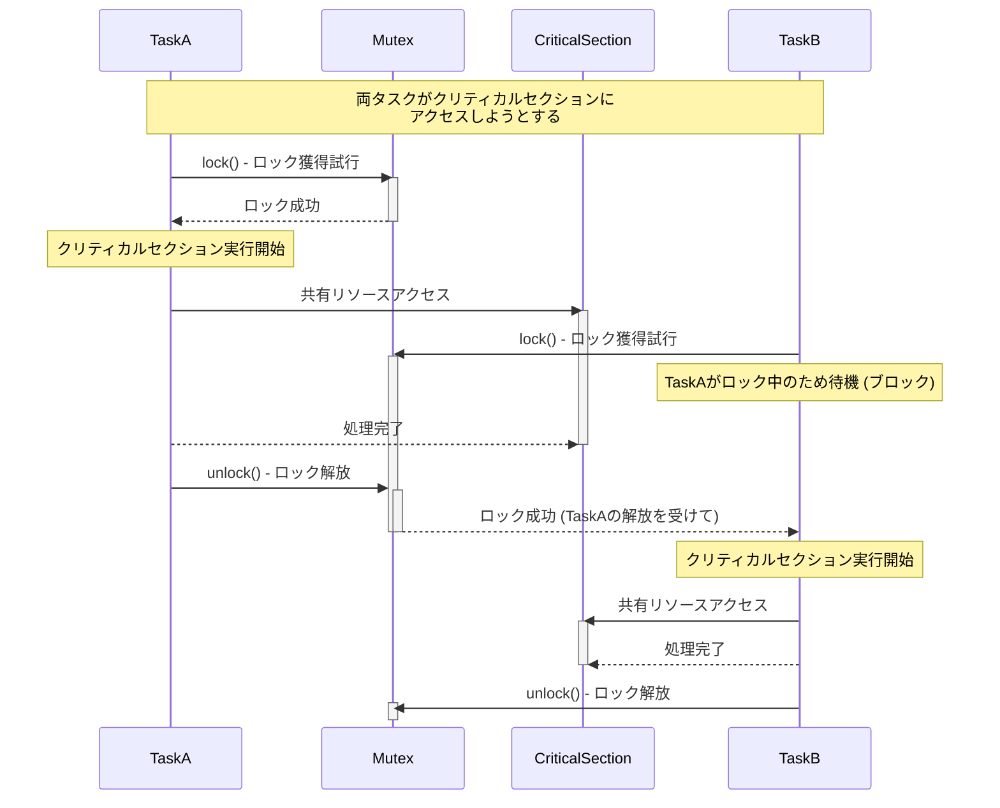

**目次**

- [排他制御入門：共有リソースを安全に守るための基礎知識](#排他制御入門共有リソースを安全に守るための基礎知識)
- [はじめに：なぜ「排他制御」が必要なのか？](#はじめになぜ排他制御が必要なのか)
  - [マルチタスク/マルチスレッドの世界：並行処理の課題](#マルチタスクマルチスレッドの世界並行処理の課題)
  - [共有リソースと競合状態 (Race Condition)：意図しない結果の恐怖](#共有リソースと競合状態-race-condition意図しない結果の恐怖)
    - [データ不整合の具体例](#データ不整合の具体例)
    - [再現性の低いバグの温床](#再現性の低いバグの温床)
  - [排他制御とは何か？：「一人ずつ使ってね」のルール](#排他制御とは何か一人ずつ使ってねのルール)
  - [この資料で学ぶこと：安全な共有リソースアクセスの第一歩](#この資料で学ぶこと安全な共有リソースアクセスの第一歩)
- [排他制御の基本概念：言葉を理解する](#排他制御の基本概念言葉を理解する)
  - [共有リソース (Shared Resource)：守るべき対象](#共有リソース-shared-resource守るべき対象)
  - [クリティカルセクション (Critical Section)：保護すべきコード区間](#クリティカルセクション-critical-section保護すべきコード区間)
  - [アトミック操作 (Atomic Operation)：中断されない最小単位の操作](#アトミック操作-atomic-operation中断されない最小単位の操作)
  - [ミューテックス (Mutex)：相互排他のための「鍵」](#ミューテックス-mutex相互排他のための鍵)
  - [セマフォ (Semaphore)：利用可能なリソース数を管理する「信号機」](#セマフォ-semaphore利用可能なリソース数を管理する信号機)
  - [カウンティングセマフォ (Counting Semaphore)](#カウンティングセマフォ-counting-semaphore)
    - [複数のリソースインスタンスを管理](#複数のリソースインスタンスを管理)
    - [プロデューサー/コンシューマー問題への応用例](#プロデューサーコンシューマー問題への応用例)
    - [メリットと注意点](#メリットと注意点)
  - [割り込み禁止・許可 (Disabling/Enabling Interrupts)](#割り込み禁止許可-disablingenabling-interrupts)
    - [シングルコア CPU における単純な排他制御](#シングルコア-cpu-における単純な排他制御)
    - [ISR とタスク間の共有データ保護](#isr-とタスク間の共有データ保護)
    - [メリット（低オーバーヘッド）と重大なデメリット（リアルタイム性阻害、マルチコア非対応）](#メリット低オーバーヘッドと重大なデメリットリアルタイム性阻害マルチコア非対応)
    - [適用範囲の限定と使用上の厳重な注意](#適用範囲の限定と使用上の厳重な注意)
  - [リーダー/ライターロック (Readers-Writer Lock)](#リーダーライターロック-readers-writer-lock)
    - [読み取りは並行、書き込みは排他的に許可](#読み取りは並行書き込みは排他的に許可)
    - [読み取りが多い場合のパフォーマンス向上](#読み取りが多い場合のパフォーマンス向上)
    - [メリットと複雑性](#メリットと複雑性)
  - [(補足) 条件変数 (Condition Variable) / モニター (Monitor)](#補足-条件変数-condition-variable--モニター-monitor)
    - [特定の条件が満たされるまでタスクを待機させる高度な同期機構](#特定の条件が満たされるまでタスクを待機させる高度な同期機構)
    - [ミューテックスとの組み合わせ（概要紹介）](#ミューテックスとの組み合わせ概要紹介)
- [4. 排他制御における一般的な問題とその対策](#4-排他制御における一般的な問題とその対策)
  - [デッドロック (Deadlock)：永遠の待ち合わせ](#デッドロック-deadlock永遠の待ち合わせ)
    - [デッドロック発生の 4 つの条件](#デッドロック発生の-4-つの条件)
    - [デッドロックの予防策（リソース獲得順序の統一など）](#デッドロックの予防策リソース獲得順序の統一など)
  - [ライブロック (Livelock)：譲り合いの無限ループ](#ライブロック-livelock譲り合いの無限ループ)
    - [デッドロックとの違い](#デッドロックとの違い)
    - [発生メカニズムと対策](#発生メカニズムと対策)
  - [スターベーション (Starvation)：永遠に待たされるタスク](#スターベーション-starvation永遠に待たされるタスク)
    - [優先度の低いタスクが実行機会を得られない](#優先度の低いタスクが実行機会を得られない)
    - [対策（優先度エージングなど）](#対策優先度エージングなど)
  - [優先度の逆転 (Priority Inversion)：下剋上は許さない](#優先度の逆転-priority-inversion下剋上は許さない)
    - [低優先度タスクが共有リソースを保持し、高優先度タスクをブロックする](#低優先度タスクが共有リソースを保持し高優先度タスクをブロックする)
    - [目的](#目的)
    - [具体的な動作（火星探査機マーズ・パスファインダーの事例）](#具体的な動作火星探査機マーズパスファインダーの事例)
    - [優先度継承プロトコル (Priority Inheritance Protocol)](#優先度継承プロトコル-priority-inheritance-protocol)
    - [優先度上限プロトコル (Priority Ceiling Protocol / Immediate Ceiling Priority Protocol)](#優先度上限プロトコル-priority-ceiling-protocol--immediate-ceiling-priority-protocol)
  - [クリティカルセクションの粒度：大きすぎず、小さすぎず](#クリティカルセクションの粒度大きすぎず小さすぎず)
    - [粒度が大きすぎる場合の性能低下](#粒度が大きすぎる場合の性能低下)
    - [粒度が小さすぎる場合の複雑化とロックオーバーヘッド](#粒度が小さすぎる場合の複雑化とロックオーバーヘッド)
- [5. 安全で効率的な排他制御のための設計プラクティス](#5-安全で効率的な排他制御のための設計プラクティス)
  - [5.1 共有リソースを最小限にする設計](#51-共有リソースを最小限にする設計)
    - [そもそも共有しないのが最善（不変データ、アクターモデルなど）](#そもそも共有しないのが最善不変データアクターモデルなど)
  - [5.2 クリティカルセクションは極力短く](#52-クリティカルセクションは極力短く)
  - [5.3 ロックのスコープを明確にする](#53-ロックのスコープを明確にする)
  - [5.4 エラー処理とロック解放の徹底（例外発生時など）](#54-エラー処理とロック解放の徹底例外発生時など)
  - [5.5 ロックフリー/ウェイトフリーアルゴリズムの可能性（概要紹介）](#55-ロックフリーウェイトフリーアルゴリズムの可能性概要紹介)
  - [5.6 コードレビューと静的解析ツールの活用](#56-コードレビューと静的解析ツールの活用)
- [6. ケーススタディ：排他制御の適用例](#6-ケーススタディ排他制御の適用例)
  - [6.1 共有バッファ（リングバッファなど）へのアクセス制御](#61-共有バッファリングバッファなどへのアクセス制御)
  - [6.2 複数のタスクからのデバイスレジスタ操作](#62-複数のタスクからのデバイスレジスタ操作)
  - [6.3 割り込みハンドラとメインタスク間のデータ共有（再訪）](#63-割り込みハンドラとメインタスク間のデータ共有再訪)
- [7. おわりに：排他制御を制して、信頼される並行処理を](#7-おわりに排他制御を制して信頼される並行処理を)

# 排他制御入門：共有リソースを安全に守るための基礎知識

# はじめに：なぜ「排他制御」が必要なのか？

若手エンジニアの皆さん、日々の開発業務、本当にお疲れ様です。皆さんがソフトウェア開発、とくに組み込みシステムやサーバーサイドアプリケーションの開発に携わるようになると、「**並行処理（複数の処理が同時に動いているように見えること）**」という概念に必ず直面します。

現代のコンピュータは、複数の CPU コアを持っていたり、リアルタイムオペレーティングシステム (RTOS) によって複数のタスク（プログラムの実行単位）が見かけ上同時に実行されたりすることが当たり前になっています。これにより、システム全体の応答性や処理能力を向上させることができます。

しかし、この「同時に動く」という性質は、新たな複雑さと、そして見過ごすことのできない「危険」をもたらします。

## マルチタスク/マルチスレッドの世界：並行処理の課題

複数のタスクやスレッド（タスク内のさらに細かい実行単位）が、まるで独立して動いているように見えても、多くの場合、それらは何らかの形で互いに影響し合います。とくに問題となるのが、複数のタスク/スレッドが、システム内の**共通の「何か」**に同時にアクセスしようとする場面です。

この「共通の何か」とは、例えば、

- グローバル変数や静的変数
- 共有メモリ領域
- ハードウェアのレジスタ（例: センサーの値、アクチュエータの制御ポート）
- ファイル
- 通信ポート
- データ構造（キュー、リスト、バッファなど）

など、プログラムの複数の部分から参照されたり、変更されたりする可能性のあるあらゆるリソースを指します。

## 共有リソースと競合状態 (Race Condition)：意図しない結果の恐怖

これらの「共通の何か」、すなわち「**共有リソース (Shared Resource)**」に対して、複数のタスク/スレッドが何の配慮もなく同時に読み書きを行おうとすると、「**競合状態 (Race Condition)**」と呼ばれる非常に厄介な問題が発生する可能性があります。

競合状態とは、**複数の処理が共有リソースにアクセスする際の実行順序やタイミングによって、プログラム全体の最終的な結果が意図せず変わってしまう**状況のことです。まるで、複数の人が一枚の紙に同時に書き込もうとして、文字が重なって読めなくなったり、一部が消えてしまったりするようなものです。

### データ不整合の具体例

簡単な例を考えてみましょう。ある共有変数 `counter` があり、初期値は 0 だとします。タスク A とタスク B が、それぞれこの `counter` の値を 1 増やす処理を行うとします。

- **タスク A の処理:**
  1. `counter` の現在の値を読み取る (例: 0)
  2. 読み取った値に 1 を加える (0 + 1 = 1)
  3. 計算結果を `counter` に書き込む (counter = 1)
- **タスク B の処理:** (タスク A と同じ)
  1. `counter` の現在の値を読み取る
  2. 読み取った値に 1 を加える
  3. 計算結果を `counter` に書き込む

もし、タスク A が 1 ～ 3 を実行し、その後にタスク B が 1 ～ 3 を実行すれば、`counter` の最終的な値は期待通り `2` になります。

しかし、もしタスク A が 1（読み取り）を実行した直後に、OS のスケジューリングによってタスク B に処理が切り替わり、タスク B が 1 ～ 3 をすべて実行し終えた後（この時点で `counter` は `1`）、再びタスク A に処理が戻って 2 と 3 を実行したらどうなるでしょうか？ タスク A は最初に `0` を読み取っているので、それに 1 を加えた `1` を `counter` に書き込みます。結果として、`counter` の最終的な値は `1` となり、期待した `2` にはなりません。

このように、CPU の命令レベルでは単純に見える「値を 1 増やす」という操作も、実際には「読み取り → 計算 → 書き込み」という複数のステップに分かれており、その途中で他のタスクが割り込むと、いとも簡単にデータ不整合が発生してしまうのです。

### 再現性の低いバグの温床

競合状態によるバグの最も厄介な点は、**発生するタイミングが非決定的**であるため、**再現性が非常に低い**ことです。「テスト中は問題なかったのに、納品先で時々おかしな動きをする…」「昨日まで動いていたのに、今日なぜかデータが壊れる…」といった、原因特定が非常に困難な「幽霊のようなバグ」の多くは、この競合状態に起因しています。

## 排他制御とは何か？：「一人ずつ使ってね」のルール

このような共有リソースへの同時アクセスによって引き起こされる問題を未然に防ぎ、プログラムの動作の整合性と信頼性を確保するためのメカニズムが、「**排他制御 (Mutual Exclusion / Mutex)**」です。

排他制御の基本的な考え方は非常にシンプルで、「**共有リソース（あるいは、それを操作するコードの特定区間）には、ある時点ではたかだか一つのタスク/スレッドしかアクセスできないようにする**」というものです。つまり、「この場所は今、他の人が使っているので、あなたは終わるまで待っていてくださいね。終わったら、次はあなたの番ですよ」という「**一人ずつ使ってね**」のルールを設けるわけです。

## この資料で学ぶこと：安全な共有リソースアクセスの第一歩

この資料では、マルチタスク/マルチスレッド環境におけるこの「排他制御」の重要性を理解し、そのための基本的な概念（クリティカルセクション、アトミック操作など）や、代表的な排他制御の道具（ミューテックス、セマフォ、割り込み禁止など）、そして排他制御を扱う上で注意すべき一般的な問題（デッドロック、優先度逆転など）とその対策について、若手エンジニアの皆さんにも分かりやすく解説していきます。

排他制御は、並行プログラミングにおける最も基本的かつ重要な技術の一つです。この資料を通じて、皆さんが共有リソースを安全に保護し、信頼性の高い並行処理プログラムを構築するための確かな知識とスキルを身につける一助となることを願っています。

# 排他制御の基本概念：言葉を理解する

排他制御について学ぶ上で、まず基本となるいくつかの重要な「言葉」とその意味を正確に理解しておく必要があります。これらの言葉は、排他制御の議論や、関連する技術資料、OS の API ドキュメントなどを読み解く上での共通言語となります。

## 共有リソース (Shared Resource)：守るべき対象

「**共有リソース (Shared Resource)**」とは、プログラム内の**複数のタスク（あるいはスレッド、割り込みサービスルーチンなど、並行して動作する可能性のある実行単位）から、同時にアクセスされる可能性のある、あらゆるデータやハードウェア資源**のことを指します。

具体的には、以下のようなものが共有リソースに該当します。

- **メモリ上のデータ:**
  - グローバル変数、静的変数
  - 複数のタスクからポインタでアクセスされるヒープ上のデータ構造（リスト、キュー、バッファなど）
  - 共有メモリ領域（プロセス間通信で使われるなど）
- **ハードウェア資源:**
  - マイクロコントローラのペリフェラルレジスタ（例: UART の送受信データレジスタ、タイマーの制御レジスタ、GPIO のポートレジスタ）
  - A/D コンバータ、D/A コンバータといった変換器
  - センサーやアクチュエータといった外部デバイス
  - プリンタ、ストレージデバイス（SD カードなど）、ネットワークインターフェース
- **ファイル:** 複数のタスクが同じファイルに対して読み書きを行う場合。
- **OS が管理する資源:** メッセージキュー、セマフォ、イベントフラグなども、それ自体が共有リソースと見なせます。

これらの共有リソースに対して、複数の実行単位が何の制御もなく同時に「書き込み」を行ったり、あるいは「書き込み中」に別の実行単位が「読み取り」を行ったりすると、前述したデータ不整合や予期せぬ動作を引き起こす「競合状態」が発生する可能性があります。

**排他制御の目的は、まさにこの「共有リソース」へのアクセスを適切に管理し、競合状態を防ぐこと**にあります。どのデータや資源が「共有」されているのかを正確に特定することが、排他制御設計の最初のステップです。

## クリティカルセクション (Critical Section)：保護すべきコード区間

共有リソースを特定したら、次に考えるべきは、「**その共有リソースに対して、具体的にプログラムのどの部分がアクセス（読み取りや書き込み）を行うのか**」ということです。

「**クリティカルセクション (Critical Section)**」とは、**共有リソースにアクセスするコードの区間（一部分）**のことを指します。このクリティカルセクションは、複数のタスクやスレッドから同時に実行されてしまうと、競合状態を引き起こす可能性があるため、**排他制御によって保護され、ある時点ではたかだか一つのタスク/スレッドだけが実行できるように保証されなければならない**区間です。

レストランの個室を想像してみてください。個室（共有リソース）は一度に一組のお客さんしか利用できません。お客さんが個室に入ってから出るまでの一連の行動（クリティカルセクション）の間は、他のお客さんは待たなければなりません。

**クリティカルセクションの特定**

プログラムの中でクリティカルセクションを特定する際には、以下の点に注意します。

- **共有リソースへのすべてのアクセス箇所:**
  グローバル変数を読み書きしている箇所、共有バッファにデータを追加・削除している箇所、ハードウェアレジスタを操作している箇所などが該当します。
- **複数の命令にまたがる操作:**
  たとえ一行のコードに見えても、コンパイラによって複数の CPU 命令に展開され、その途中で割り込みなどによって中断される可能性がある操作は、クリティカルセクションとして考慮する必要があります。
  - 例: `shared_counter++;` という C のコードは、実際には「メモリから値を読み出す → レジスタで値を 1 増やす → メモリに値を書き戻す」という複数のステップに分かれることが多く、各ステップの間で競合が発生しえます。
- **一連の不可分な処理:**
  複数の共有リソースを操作し、それら全体として一貫性が保たれなければならない一連の処理も、一つの大きなクリティカルセクションとして扱われることがあります。（例: 口座 A から引き落とし、口座 B に入金する、という処理全体）

**クリティカルセクションの設計原則**

効果的な排他制御のためには、クリティカルセクションを以下のように設計することが推奨されます。

1. **クリティカルセクションはできるだけ短く:**
   排他制御によって保護されている間は、他のタスク/スレッドはその共有リソースへのアクセスを待たなければなりません。クリティカルセクションが長すぎると、他のタスクの待ち時間が長くなり、システム全体の応答性やスループットが低下します。共有リソースへのアクセスに必要な最小限のコードだけをクリティカルセクションとし、それ以外の処理はクリティカルセクションの外に出すように努めます。
2. **クリティカルセクション内でのブロッキング操作を避ける:**
   クリティカルセクションの内部で、他のタスクの完了を待つような処理（例: 他のセマフォの獲得待ち、時間のかかる I/O 待ち）や、無限ループに陥る可能性のある処理は、**絶対に避けるべき**です。もしクリティカルセクションを保持したままタスクがブロックしてしまうと、他のすべてのタスクがその共有リソースにアクセスできなくなり、システム全体がデッドロック状態に陥る危険性が非常に高くなります。
3. **クリティカルセクションの範囲を明確にする:**
   どこからどこまでがクリティカルセクションなのか、コード上で明確に識別できるようにします。排他制御の開始（ロック獲得）と終了（ロック解放）のペアが、正しく対応していることを確認します。

クリティカルセクションを正しく特定し、その範囲を適切に設計・保護することが、競合状態を防ぎ、安全な並行処理を実現するための基本中の基本です。次の「アトミック操作」の概念も、このクリティカルセクションの考え方と密接に関連しています。

## アトミック操作 (Atomic Operation)：中断されない最小単位の操作

クリティカルセクションの議論の中で、`shared_counter++;` のような一見単純な操作も、CPU レベルでは複数の命令に分割され、その途中で割り込みなどによって中断されると競合状態を引き起こす可能性がある、という点に触れました。

この問題に対処するための一つの重要な概念が、「**アトミック操作 (Atomic Operation)**」または「**不可分操作**」です。アトミック操作とは、その一連の処理が、**外部から見て、途中で中断されることなく、あたかも一瞬で完了したかのように振る舞う操作**のことを指します。つまり、操作が開始されたら、完了するまで他のいかなるタスクや割り込みも、その操作の途中経過に干渉できない、という性質を持ちます。

アトミック操作は、排他制御を実現するための最も基本的な構成要素の一つです。

**アトミック操作の例と実現方法**

1. **CPU 命令レベルでのアトミック性:**

   - 多くの CPU アーキテクチャでは、特定のメモリサイズ（例: 1 バイト、2 バイト、4 バイトなど、CPU のワードサイズに依存）に対する単純な読み取りや書き込みは、1 命令で実行され、本質的にアトミックであることが保証されている場合があります。
   - また、インクリメント/デクリメント、テスト＆セット、コンペア＆スワップ (CAS) といった、より高度なアトミック命令（ハードウェアによる排他制御命令）をサポートしている CPU もあります。これらは、ロックを使わずに特定の共有変数を安全に更新するための強力な手段となります。
   - **注意点:** C 言語のような高級言語で記述した操作が、必ずしもコンパイラによってアトミックな機械語命令に変換されるとは限りません。`volatile` キーワードの適切な使用や、アセンブリコードレベルでの確認が必要になる場合もあります。

2. **割り込み禁止によるアトミック性の確保:**
   クリティカルセクションのセクションで触れたように、共有リソースにアクセスするコード区間の前後で割り込みを一時的に禁止することで、その区間の処理を「擬似的に」アトミックにすることができます。割り込みが入らなければ、シングルコア CPU 上ではそのコード区間は他の処理に中断されることがないためです。
   ただし、これはあくまで「その CPU コア上での」アトミック性であり、マルチコア環境では他のコアからの同時アクセスを防げませんし、割り込み禁止期間が長すぎるとリアルタイム性を損なうという大きなデメリットがあります。

3. **OS やライブラリが提供するアトミック操作 API:**
   リアルタイムオペレーティングシステム (RTOS) や、特定のライブラリ（例: C++ の `<atomic>` ヘッダ）は、整数型などに対するアトミックなインクリメント、デクリメント、比較交換といった操作を行うための API を提供していることがあります。これらは、プラットフォームの特性に応じて、最も効率的かつ安全な方法でアトミック性を保証するように実装されています。

**アトミック操作の重要性**

- **競合状態の防止:** アトミック操作は、共有変数に対する単純な更新処理（カウンターのインクリメント、フラグのセット/クリアなど）を、ロック機構なしに安全に行うための基礎となります。
- **より高度な同期プリミティブの構築要素:** ミューテックスやセマフォといった、より複雑な排他制御メカニズムも、その内部実装のどこかで、これらのアトミックな操作（あるいはそれに類するハードウェアサポート）を利用していることが一般的です。
- **ロックフリープログラミングへの道:** （これは非常に高度なトピックですが）アトミック命令を巧みに組み合わせることで、ロックを一切使わずに複数のスレッドが安全に協調動作する「ロックフリー」なデータ構造やアルゴリズムを構築することも可能です。

**アトミック操作の限界**

アトミック操作は非常に強力ですが、万能ではありません。

- **複雑な処理の非アトミック性:** 複数の共有変数を一貫して更新したり、複数のステップからなる複雑なロジックを実行したりするような処理は、通常、単一のアトミック命令では実現できません。そのような場合は、ミューテックスなどのより高レベルな排他制御メカニズムを使って、より大きなクリティカルセクションを保護する必要があります。
- **対象の限定:** CPU 命令レベルのアトミック操作は、通常、特定のサイズの整数型やポインタ型などに限定されます。複雑なデータ構造全体をアトミックに操作するのは困難です。

**設計における考慮**

共有リソースへのアクセスを設計する際には、

- 「この操作は、本当にアトミックである必要があるか？」
- 「もしアトミック性が必要なら、CPU 命令レベルで保証されるか、OS の API を使うべきか、あるいは割り込み禁止で保護すべきか？」
- 「操作が複数のステップに分かれるなら、それはクリティカルセクションとしてミューテックスなどで保護すべきではないか？」

といった点を慎重に検討する必要があります。

アトミック操作の概念を理解し、それが保証される範囲と限界を知ることは、低レベルな排他制御のバグを避け、より安全で効率的な並行処理コードを書くための重要な知識となります。

## ミューテックス (Mutex)：相互排他のための「鍵」

クリティカルセクション（共有リソースにアクセスするコード区間）を保護し、ある時点ではたかだか一つのタスク/スレッドだけがその区間を実行できるようにするための、最も基本的で広く使われている排他制御メカニズムの一つが「**ミューテックス (Mutex)**」です。「**Mut**ual **Ex**clusion（相互排他）」の略語であり、その名の通り、互いに排他的に何かを行うための仕組みを提供します。

ミューテックスは、しばしば「**鍵 (Lock)**」に例えられます。クリティカルセクションという「部屋」に入るためには、まず受付で「鍵」を一つだけ借りる必要があります。鍵を借りられたタスクだけが部屋に入って作業でき、他のタスクは鍵が返却されるまで待たなければなりません。作業が終わったら、鍵を受付に返却し、次のタスクが鍵を借りられるようにします。

**ミューテックスの基本的な操作**

ミューテックスを利用した排他制御は、主に以下の 3 つの操作で構成されます。

1. **初期化 (Initialization):**
   ミューテックスを使用する前に、まずミューテックスオブジェクト（またはそれに類するデータ構造）を初期化する必要があります。初期化されたミューテックスは、最初は「アンロック状態（鍵が受付にある状態）」になっています。
2. **ロック獲得 (Lock / Acquire / P-operation / Wait):**
   タスクがクリティカルセクションに入る**前**に、対応するミューテックスの「ロック獲得」操作を試みます。
   - もしミューテックスが現在アンロック状態（鍵が利用可能）であれば、タスクはミューテックスをロック状態（鍵を取得した状態）にし、クリティカルセクションの実行を開始します。
   - もしミューテックスが既に他のタスクによってロック状態（鍵が貸し出し中）であれば、ロックを獲得しようとしたタスクは、ミューテックスがアンロックされるまで**待機（ブロック）**させられます。OS のスケジューラは、この待機中のタスクをスリープさせ、他の実行可能なタスクに CPU を割り当てます。
3. **ロック解放 (Unlock / Release / V-operation / Signal):**
   タスクがクリティカルセクションの実行を**終えた後**に、必ず対応するミューテックスの「ロック解放」操作を行います。
   - これにより、ミューテックスはアンロック状態（鍵が返却された状態）に戻ります。
   - もし、このミューテックスのアンロックを待っていた他のタスクがあれば、OS のスケジューラはそのうちのどれか一つ（通常は最も優先度が高いか、最も長く待っていたタスク）を目覚めさせ、ロックを獲得させてクリティカルセクションの実行を許可します。



_図: ミューテックスによる排他制御の動作イメージ_

**C 言語/RTOS での利用例（API 紹介レベル）**

多くのリアルタイムオペレーティングシステム (RTOS) は、ミューテックス機能を提供しています。API の具体的な名前や使い方は OS によって異なりますが、基本的な考え方は共通です。（以下はあくまで汎用的なイメージです。）

```c
// (RTOSのAPIを想定した疑似コード)
// #include "rtos_mutex_api.h" // OSのミューテックスAPIヘッダ

// Mutex_t myMutex; // ミューテックスオブジェクト
// extern SharedData_t g_sharedData; // 保護対象の共有データ

// void initializeMyApp() {
//     rtos_mutex_create(&myMutex); // ミューテックスの生成と初期化
// }

// void task_A_function() {
//     while(1) {
//         // ... 何らかの処理 ...

//         if (rtos_mutex_lock(&myMutex, TIMEOUT_MS) == RTOS_SUCCESS) { // ロック獲得 (タイムアウト付き)
//             // === クリティカルセクション開始 ===
//             // g_sharedData への安全なアクセス
//             g_sharedData.value++;
//             sprintf(g_sharedData.message, "Updated by Task A: %d", g_sharedData.value);
//             // === クリティカルセクション終了 ===
//             rtos_mutex_unlock(&myMutex); // 必ずロックを解放
//         } else {
//             // ロック獲得タイムアウト処理など
//         }
//         // ... 何らかの処理 ...
//         rtos_task_delay(DELAY_A_MS);
//     }
// }

// void task_B_function() {
//     // Task A と同様に myMutex を使って g_sharedData にアクセス
// }
```

この例では、`rtos_mutex_lock()` でクリティカルセクションに入る前にロックを獲得し、処理が終わったら `rtos_mutex_unlock()` で必ずロックを解放しています。ロック獲得にタイムアウトを設定できる API も一般的です。

**メリットと注意点**

- **メリット:**
  - **単純明快な排他制御:** 「鍵」のメタファーで理解しやすく、共有リソースへのアクセスを確実に一つに限定できます。
  - **OS による待機管理:** ロックが獲得できないタスクは OS によって効率的にスリープさせられるため、CPU リソースを無駄に消費するポーリング（スピンロックと対比）を避けられます。
  - **広く普及:** ほとんどの RTOS やマルチスレッド対応言語で標準的な機能として提供されています。
- **注意点（デッドロックのリスクなど）:**
  - **デッドロック (Deadlock):**
    ミューテックスの最も注意すべき問題がデッドロックです。複数のミューテックスを使用する際に、タスク A がミューテックス X を保持したままミューテックス Y を待機し、同時にタスク B がミューテックス Y を保持したままミューテックス X を待機する、といった状況が発生すると、両タスクとも永遠に処理を進められなくなります。デッドロックの回避策（例: ロック獲得順序の統一）を設計段階から考慮する必要があります。（詳細は後のセクションで解説します。）
  - **ロック解放忘れ:**
    クリティカルセクションの処理が終わった後に、何らかの理由（例: `return` 文による途中脱出、エラー処理の不備）でロックの解放を忘れてしまうと、そのミューテックスは永遠にロックされたままになり、他のタスクがそのリソースにアクセスできなくなります。RAII (Resource Acquisition Is Initialization) の考え方（C++）や、`try...finally` 構文（Java, Python など）を使って、確実な解放を保証する工夫が重要です。
  - **優先度の逆転 (Priority Inversion):**
    低優先度のタスクがミューテックスを保持しているために、そのミューテックスを必要とする高優先度のタスクが待たされる、という問題が発生する可能性があります。（これも後のセクションで詳しく解説します。）
  - **クリティカルセクションの粒度:**
    ロックで保護する範囲が広すぎると（粒度が大きいと）、並行性が損なわれ、システム全体のパフォーマンスが低下します。逆に狭すぎると、保護すべき共有リソースアクセスが漏れてしまう可能性があります。適切な粒度でクリティカルセクションを設定することが重要です。

ミューテックスは、並行プログラミングにおける排他制御の基本中の基本ですが、その使い方を誤ると深刻な問題を引き起こす可能性も秘めています。その動作原理と潜在的なリスクを正しく理解し、慎重に設計・実装することが求められます。

## セマフォ (Semaphore)：利用可能なリソース数を管理する「信号機」

ミューテックスが「一つの鍵」を使ってクリティカルセクションへのアクセスを一人に限定するのに対し、「**セマフォ (Semaphore)**」は、もう少し一般的な同期メカニズムであり、**限られた数の「リソース」や「許可証」を複数のタスク/スレッド間で安全に共有・管理する**ために使われます。

セマフォは、オランダの計算機科学者エドガー・ダイクストラによって考案されました。その名前は、鉄道の「腕木式信号機」に由来しており、まさに「進んでよし（リソース利用可）」「待て（リソース利用不可）」を制御する信号機のような役割を果たします。

**セマフォの基本的な考え方と操作**

セマフォは、内部に「**カウンター（カウンタ値）**」を持っています。このカウンターの値が、現在利用可能なリソースの数（または、処理を続行してよい許可の数）を表します。

セマフォに対する主な操作は、以下の 2 つです（ダイクストラによるオリジナルの用語と、一般的な API でよく使われる用語を併記します）。

1. **P 操作 (Proberen / Wait / Acquire / Down / Pend):**

   - **意味:** リソースの「獲得」を試みる操作、または処理を進めるための「許可」を待つ操作。
   - **動作:**
     1. セマフォのカウンター値を 1 減らします。
     2. もし、減らした結果のカウンター値が **0 未満**になった場合、リソースが現在利用できない（または許可が得られない）ことを意味するため、この操作を行ったタスクは**待機（ブロック）**させられます。
     3. もし、カウンター値が **0 以上**であれば、タスクは処理を続行できます。
   - **イメージ:** 駐車場に入ろうとするとき、ゲートで「空きがありますか？」と尋ねる。空きがあれば（カウンターが正なら）ゲートが開き、空き台数が 1 つ減る。空きがなければ（カウンターが 0 以下なら）待たされる。

2. **V 操作 (Verhogen / Signal / Release / Up / Post):**
   - **意味:** 利用していたリソースを「返却」する操作、または他の待機中タスクに「許可」を与える操作。
   - **動作:**
     1. セマフォのカウンター値を 1 増やします。
     2. もし、この V 操作によってカウンター値が **0 以下から正の値に変わった**（または、カウンター値が 0 以下で、かつこのセマフォで待機しているタスクが存在する）場合、待機していたタスクのどれか一つ（OS のスケジューリングポリシーによる）が**目覚めさせられ**、実行可能状態になります。
   - **イメージ:** 駐車場から車が出るとき、ゲートで「1 台空きましたよ」と伝え、空き台数が 1 つ増える。もし満車で待っていた車があれば、そのうちの 1 台が入れるようになる。

**セマフォの種類：カウンティングセマフォとバイナリセマフォ**

セマフォの内部カウンターが取りうる値の範囲によって、主に二つの種類に分けられます。

- **カウンティングセマフォ (Counting Semaphore):**
  カウンターが 0 以上の任意の整数値（初期値として設定した最大リソース数まで）を取ることができるセマフォです。複数の同一種類のリソース（例: プリンターの利用可能な台数、バッファの空きスロット数、同時に実行できるタスクの最大数）を管理するのに適しています。
- **バイナリセマフォ (Binary Semaphore):**
  カウンターが 0 または 1 の値しか取ることができないセマフォです。実質的に「利用可能（1）」か「利用不可（0）」の二つの状態だけを表します。

**バイナリセマフォとミューテックスの違い（対比）**

バイナリセマフォは、カウンターの取りうる値が 0 か 1 だけなので、一つのリソースへのアクセスを排他的に制御するという点で、ミューテックスと非常に似た使い方ができます。しかし、両者にはいくつかの重要な違いがあります。

| 特徴               | ミューテックス (Mutex)                                           | バイナリセマフォ (Binary Semaphore)                                   |
| :----------------- | :--------------------------------------------------------------- | :-------------------------------------------------------------------- |
| **主な目的**       | **相互排他 (Mutual Exclusion)**：クリティカルセクションの保護    | **同期 (Synchronization)**：タスク間の処理の順序待ち、イベント通知    |
| **所有権の概念**   | **あり**: ロックを獲得したタスクだけが、そのロックを解放できる。 | **なし**: P 操作（獲得）と V 操作（解放）は、異なるタスクから行える。 |
| **再帰的ロック**   | サポートしている場合がある（同じタスクからの複数回ロック）       | 通常サポートしない                                                    |
| **優先度逆転対策** | 優先度継承などの仕組みを内蔵している OS が多い                   | 通常は内蔵していない（OS による）                                     |
| **カウンター値**   | 概念的にはロック/アンロックの 2 状態（内部実装は様々）           | 0 (利用不可) または 1 (利用可)                                        |

**使い分けの目安:**

- **クリティカルセクションを保護し、共有リソースへの排他的アクセスを保証したい場合** → **ミューテックス** がより適切です。「所有権」の概念があるため、ロックの解放忘れを防ぎやすく、意図も明確になります。また、OS が優先度逆転対策を提供している場合、その恩恵も受けられます。
- **あるタスクが別のタスクの処理完了を待つ（同期を取る）、あるいは ISR からタスクへイベントを通知する、といった単純なシグナリング** → **バイナリセマフォ** が適している場合があります。V 操作を ISR から行い、P 操作をタスクで行う、といった使い方が可能です（ミューテックスでは ISR からのアンロックは通常できません）。

ただし、OS やライブラリによっては、ミューテックスとバイナリセマフォの機能や挙動が非常に近かったり、あるいはミューテックスがバイナリセマフォの機能（とくに同期目的）を包含していたりすることもあります。使用するシステムのドキュメントをよく確認することが重要です。

この資料では、次の「カウンティングセマフォ」で、より具体的な利用例を見ていきます。

## カウンティングセマフォ (Counting Semaphore)

前のセクションで触れたように、**カウンティングセマフォ**は、その内部カウンターが 0 以上の任意の整数値（通常は初期設定された最大値まで）を取ることができるセマフォです。この性質により、カウンティングセマフォは、**同時に利用可能な数が限られている「複数個の同一種類のリソース」へのアクセスを制御・管理する**のに非常に適しています。

### 複数のリソースインスタンスを管理

カウンティングセマフォのカウンターの初期値は、**利用可能なリソースの総数**に設定されます。

- タスクがリソースを 1 つ使用したい場合、セマフォに対して **P 操作 (Wait/Acquire)** を行います。
  - もしカウンター値が 1 以上であれば、カウンターが 1 減らされ、タスクはリソースを使用できます。
  - もしカウンター値が 0 であれば（つまり、すべてのリソースが使用中であれば）、タスクはカウンター値が 1 以上になるまで待機（ブロック）させられます。
- タスクがリソースの使用を終えたら、セマフォに対して **V 操作 (Signal/Release)** を行います。
  - これによりカウンター値が 1 増やされ、もし待機中のタスクがあれば、そのうちの一つが目覚めさせられ、リソースを使用できるようになります。

**具体的な利用例:**

1. **有限サイズのバッファ/プールの管理:**
   - たとえば、システム内に固定サイズのメモリブロックプールがあり、そこからタスクが必要に応じてメモリブロックを確保し、使い終わったら返却する、という場合。
   - カウンティングセマフォの初期値をプールの空きブロック数に設定します。タスクがブロックを確保する際に P 操作を、返却する際に V 操作を行います。セマフォのカウンターが 0 になれば、空きブロックがないことを意味し、確保しようとしたタスクは待機します。
2. **同時に実行できる処理の最大数の制限:**
   - たとえば、特定の重い計算処理を同時に実行できるのは最大 3 タスクまで、といった制限を設けたい場合。
   - カウンティングセマフォの初期値を 3 に設定します。計算処理を開始する前に P 操作を、終了後に V 操作を行います。これにより、常に 3 タスク以下しか計算処理を実行できなくなります。
3. **ライセンス管理:**
   - ソフトウェアのある機能について、同時に利用できるユーザー数やセッション数にライセンス上の上限がある場合。
   - カウンティングセマフォの初期値をライセンス数に設定し、機能利用開始時に P 操作、終了時に V 操作を行います。

### プロデューサー/コンシューマー問題への応用例

カウンティングセマフォは、古典的な並行プログラミングの問題である「**プロデューサー/コンシューマー問題 (Producer-Consumer Problem)**」を解決するためにもよく使われます。（この問題の完全な解決には、通常、複数のセマフォやミューテックスを組み合わせます。）

**プロデューサー/コンシューマー問題の概要:**

- **プロデューサー (生産者):** データを生成し、共有バッファ（キューなど）に格納するタスク。
- **コンシューマー (消費者):** 共有バッファからデータを取り出し、それを処理するタスク。
- **課題:**
  - プロデューサーは、バッファがいっぱいのときは新しいデータを格納できない（待つ必要がある）。
  - コンシューマーは、バッファが空のときはデータを取り出せない（待つ必要がある）。
  - バッファへのアクセス（データの格納と取り出し）は排他的に行われる必要がある。

**カウンティングセマフォの役割（この問題における一例）：**

- **`empty_slots` セマフォ:** バッファの「**空きスロット数**」を管理するカウンティングセマフォ。初期値はバッファの最大サイズ。プロデューサーがデータを格納する前に P 操作を行い、コンシューマーがデータを取り出した後に V 操作を行う。
- **`filled_slots` セマフォ:** バッファ内の「**データが入っているスロット数**」を管理するカウンティングセマフォ。初期値は 0。コンシューマーがデータを取り出す前に P 操作を行い、プロデューサーがデータを格納した後に V 操作を行う。
- （これに加えて、バッファ自体へのアクセスを保護するための**ミューテックス**も通常必要です。）

```c
// プロデューサー/コンシューマー問題でのセマフォ利用の疑似コードイメージ
// #define BUFFER_SIZE 10
// Item_t buffer[BUFFER_SIZE];
// int in_index = 0;
// int out_index = 0;

// Mutex_t buffer_mutex; // バッファアクセス保護用ミューテックス
// Semaphore_t empty_slots_sem; // 空きスロット数カウンティングセマフォ
// Semaphore_t filled_slots_sem; // データ入りスロット数カウンティングセマフォ

// void initializeProducerConsumer() {
//     rtos_mutex_create(&buffer_mutex);
//     rtos_semaphore_create(&empty_slots_sem, BUFFER_SIZE); // 初期値: バッファサイズ
//     rtos_semaphore_create(&filled_slots_sem, 0);         // 初期値: 0
// }

// void producer_task() {
//     Item_t item;
//     while(1) {
//         produce_item(&item); // データを生成
//         rtos_semaphore_wait(&empty_slots_sem, WAIT_FOREVER); // 空きスロットができるまで待つ
//         rtos_mutex_lock(&buffer_mutex, WAIT_FOREVER);     // バッファをロック
//         // --- クリティカルセクション ---
//         buffer[in_index] = item;
//         in_index = (in_index + 1) % BUFFER_SIZE;
//         // --- クリティカルセクション ---
//         rtos_mutex_unlock(&buffer_mutex);                 // バッファをアンロック
//         rtos_semaphore_signal(&filled_slots_sem);         // データ入りスロットが増えたことを通知
//     }
// }

// void consumer_task() {
//     Item_t item;
//     while(1) {
//         rtos_semaphore_wait(&filled_slots_sem, WAIT_FOREVER); // データが来るまで待つ
//         rtos_mutex_lock(&buffer_mutex, WAIT_FOREVER);      // バッファをロック
//         // --- クリティカルセクション ---
//         item = buffer[out_index];
//         out_index = (out_index + 1) % BUFFER_SIZE;
//         // --- クリティカルセクション ---
//         rtos_mutex_unlock(&buffer_mutex);                  // バッファをアンロック
//         rtos_semaphore_signal(&empty_slots_sem);          // 空きスロットが増えたことを通知
//         consume_item(&item); // データを利用
//     }
// }
```

この例では、`empty_slots_sem` がプロデューサーの動きを、`filled_slots_sem` がコンシューマーの動きを、それぞれ適切にブロック/再開させることで、バッファのオーバーフローやアンダーフローを防いでいます。

### メリットと注意点

- **メリット:**
  - **複数のリソースの効率的な管理:** 限られた数の同一リソースを、複数のタスク間で安全に共有・利用するためのシンプルで効果的な手段です。
  - **タスク間の同期:** プロデューサー/コンシューマー問題のように、ある条件が満たされるまでタスクの実行を待機させる、といった同期処理にも応用できます。
- **注意点:**
  - **デッドロック:** ミューテックスと同様に、複数のセマフォを使用する場合や、セマフォとミューテックスを組み合わせて使用する場合には、デッドロックが発生する可能性があります。リソース獲得の順序などを慎重に設計する必要があります。
  - **カウンター値の管理:** セマフォのカウンター値は、P 操作と V 操作のペアが正しく対応していないと、意図しない値（負の値になったり、初期値を超えたり）になり、期待通りに動作しなくなる可能性があります。とくに、エラー処理の途中で V 操作を忘れる、といったミスに注意が必要です。
  - **複雑な同期には不向きな場合も:** 非常に複雑な条件での待ち合わせや、複数のイベントの組み合わせによる同期などには、カウンティングセマフォだけでは表現が難しく、条件変数やイベントフラググループといった、より高度な同期プリミティブが必要になることがあります。

カウンティングセマフォは、その名前の通り「数える」ことでリソースの利用状況を管理し、タスク間の協調動作を可能にする、排他制御と同期のための重要な道具の一つです。

## 割り込み禁止・許可 (Disabling/Enabling Interrupts)

これまでに見てきたミューテックスやセマフォは、主にリアルタイムオペレーティングシステム (RTOS) が提供する、タスクレベルでの排他制御や同期のためのメカニズムでした。しかし、より低レベルな、あるいは OS がないような環境（ベアメタルプログラミング）や、割り込みサービスルーチン (ISR) とタスク間の非常に短いクリティカルセクションを保護する際には、「**割り込みの禁止・許可**」という直接的な手段が用いられることがあります。

### シングルコア CPU における単純な排他制御

シングルコアの CPU 環境において、あるコード区間（クリティカルセクション）を実行している最中に、他のタスクや ISR による割り込み（プリエンプション）が発生しなければ、そのコード区間の処理は中断されずに完了できます。これを利用した排他制御が、**クリティカルセクションの開始前に割り込みを禁止 (Disable Interrupts) し、終了後に割り込みを許可 (Enable Interrupts) する**という方法です。

```c
// 割り込み禁止・許可による排他制御のイメージ (C言語風)
// extern volatile SharedData_t g_critical_data; // 保護対象の共有データ

// unsigned long interrupt_flags; // 割り込み状態を保存する変数 (CPUアーキテクチャ依存)

// // --- クリティカルセクション開始 ---
// interrupt_flags = disable_global_interrupts(); // 全割り込みを禁止し、以前の状態を保存
//
// // g_critical_data へのアクセス (例: 読み取り、変更、書き込み)
// g_critical_data.field1 = new_value1;
// if (g_critical_data.field2 > THRESHOLD) {
//     g_critical_data.status_flag = true;
// }
//
// enable_global_interrupts(interrupt_flags); // 以前の割り込み状態に復元
// // --- クリティカルセクション終了 ---
```

このコード区間では、`disable_global_interrupts()` が呼び出されてから `enable_global_interrupts()` が呼び出されるまでの間、CPU は（通常、NMI: Non-Maskable Interrupt を除く）すべての外部割り込みやタイマー割り込みなどを受け付けなくなります。そのため、この間の `g_critical_data` へのアクセスは、他の割り込み処理によって中断されることがなく、アトミックであるかのように振る舞います。

**注意:** `disable_global_interrupts()` のような関数は、通常、以前の割り込み許可状態（例: CPU のステータスレジスタの内容）を返すように設計されており、`enable_global_interrupts()` はその保存した状態を復元することで、ネストした割り込み禁止/許可の呼び出しにも対応できるようにしています。

### ISR とタスク間の共有データ保護

割り込みサービスルーチン (ISR) は、メインのタスクとは非同期に実行され、同じ共有データにアクセスする可能性があります。この場合、タスク側が共有データにアクセスするクリティカルセクションを、割り込み禁止で保護することで、ISR による途中でのデータ変更を防ぐことができます。

- **タスク側:** 共有データアクセス前に割り込みを禁止し、アクセス後に許可する。
- **ISR 側:** もし ISR も同じデータを変更する場合、ISR の実行自体が既に他の割り込みを（あるレベルまで）ブロックしていることが多いですが、タスク側のクリティカルセクションとの競合を避けるためには、共有データの構造やアクセス方法を慎重に設計する必要があります。多くの場合、ISR はデータを直接変更せず、フラグを立てたりキューにデータを入れたりして、実際の処理はタスク側に委ねる方が安全です（「割り込みハンドラからメイン処理へのイベント通知方法」参照）。

### メリット（低オーバーヘッド）と重大なデメリット（リアルタイム性阻害、マルチコア非対応）

**メリット:**

- **低オーバーヘッド:** OS のミューテックスやセマフォのような複雑なメカニズムに比べて、CPU の割り込み制御命令を直接操作するため、実行時のオーバーヘッドが非常に小さいです。極めて短いクリティカルセクションの保護には効率的です。
- **シンプル（に見える）:** 見かけ上のコードは単純になることがあります。

**しかし、この方法は多くの重大なデメリットと危険性を伴います。**

**重大なデメリットと危険性:**

1. **リアルタイム性の著しい阻害:**
   割り込みを禁止している間は、システムは外部からのいかなる緊急のイベント（例: 高優先度のセンサー入力、通信タイムアウト、安全保護機構のトリガー）にも応答できなくなります。この**割り込み禁止時間が長引くと、システムのリアルタイム性が致命的に損なわれ**、デッドラインミスや、最悪の場合はシステムの誤動作や暴走に繋がる可能性があります。**割り込み禁止区間は、絶対に必要最小限の、極めて短い時間に留めなければなりません。**
2. **マルチコア CPU 環境では効果がない:**
   この方法は、基本的にシングルコア CPU 環境を前提としています。マルチコア CPU 環境では、一つのコアで割り込みを禁止しても、他のコアは並行して動作し続けるため、他のコア上のタスクや ISR から共有データに同時にアクセスされる可能性を防げません。マルチコア環境での排他制御には、スピンロックや OS が提供するコア間同期プリミティブなど、別のメカニズムが必要です。
3. **デバッグの困難さ:**
   割り込み禁止/許可の使い方が不適切だと、非常に見つけにくいタイミング依存のバグや、システムのハングアップを引き起こす可能性があります。
4. **ネストした割り込み禁止/許可の管理:**
   割り込み禁止区間の中で、さらに割り込み禁止を呼び出すようなコード（例: ライブラリ関数内での呼び出し）があると、意図せず割り込みが許可されてしまったり、逆に禁止されたままになったりするリスクがあり、管理が複雑になります。
5. **OS との協調性の問題:**
   RTOS を使用している環境で、アプリケーションが直接 CPU の割り込みマスクを操作することは、OS のスケジューラや割り込み管理メカニズムと競合し、予期せぬ問題を引き起こす可能性があります。OS が提供する排他制御 API（ミューテックス、セマフォ、あるいは OS 固有の割り込み禁止/許可 API）を使うべきです。

### 適用範囲の限定と使用上の厳重な注意

これらの重大なデメリットから、**割り込み禁止・許可による排他制御は、その適用範囲を非常に限定し、使用する際には最大限の注意を払う必要があります**。

一般的に、許容される（あるいは検討される）のは、

- OS がないベアメタル環境での、ごく短時間のクリティカルセクション保護。
- RTOS 環境下でも、OS が提供する API（例: `taskENTER_CRITICAL()`, `taskEXIT_CRITICAL()` in FreeRTOS）を使って、OS の管理下で安全に割り込みを制御する場合。
- アトミック性が保証されないが、数命令で完了するような、非常に短いデータ操作（例: 8 ビット CPU で 16 ビット変数の読み書きの一部を保護）。

といったケースです。

多くの場合、とくに RTOS を使用している環境では、**ミューテックスやセマフォといった、より高レベルで安全な排他制御メカニズムを利用することが強く推奨されます**。割り込み禁止・許可は、いわば「伝家の宝刀」であり、その切れ味（低オーバーヘッド）は魅力的ですが、使い方を誤ると自らを傷つける（システムを不安定にする）危険性が高いことを、常に肝に銘じておく必要があります。

## リーダー/ライターロック (Readers-Writer Lock)

これまでに見てきたミューテックスは、共有リソースへのアクセスを完全に排他的（一度に一つのタスク/スレッドのみ）にするものでした。これは、共有リソースを「書き込む」可能性がある場合には非常に重要です。しかし、もし複数のタスクが共有リソースを「**読み取るだけ**」で、誰も書き込みを行わないのであれば、これらの読み取り操作は互いに干渉しないため、同時に複数のタスクが読み取ることを許可しても問題ないはずです。

このような、「**読み取りアクセスは並行して許可するが、書き込みアクセスは排他的に行う**」という、より柔軟なアクセス制御を実現するための同期プリミティブが、「**リーダー/ライターロック (Readers-Writer Lock)**」または「共有読み取り/排他書き込みロック (Shared-Exclusive Lock)」です。

### 読み取りは並行、書き込みは排他的に許可

リーダー/ライターロックは、共有リソースに対するアクセスを以下の 2 種類に区別して扱います。

1.  **読み取りアクセス (Read Access / Shared Lock):**
    - タスクが共有リソースの内容を**変更せず、参照するだけ**の場合。
    - リーダー/ライターロックは、**現在誰も書き込みロックを保持していなければ**、複数のタスクが同時に読み取りロックを獲得し、共有リソースを並行して読み取ることを許可します。
    - つまり、複数の「リーダー (Reader)」は共存できます。
2.  **書き込みアクセス (Write Access / Exclusive Lock):**
    - タスクが共有リソースの内容を**変更する可能性がある**場合。
    - リーダー/ライターロックは、**現在誰も読み取りロックも書き込みロックも保持していない場合にのみ**、一つのタスクが書き込みロックを獲得することを許可します。書き込みロックが保持されている間は、他のいかなるタスク（リーダーもライターも）もアクセスできません。
    - つまり、「ライター (Writer)」は常に一人だけであり、ライターがいる間はリーダーも存在できません。

**基本的な操作（概念的）:**

- `acquire_read_lock()`: 読み取りロックを獲得しようとします。現在書き込みロックがなければ成功し、読み取りロックのカウンターが増えます。書き込みロックがあれば待機します。
- `release_read_lock()`: 読み取りロックを解放します。読み取りロックのカウンターが減ります。
- `acquire_write_lock()`: 書き込みロックを獲得しようとします。現在誰も読み取りロックも書き込みロックも保持していなければ成功します。そうでなければ待機します。
- `release_write_lock()`: 書き込みロックを解放します。

### 読み取りが多い場合のパフォーマンス向上

リーダー/ライターロックの最大のメリットは、**共有リソースへのアクセスが「読み取り中心」である場合に、システムの並行性とパフォーマンスを向上させられる**点にあります。

- もし、ミューテックスを使って読み取りアクセスも排他制御してしまうと、たとえ誰も書き込みをしていなくても、読み取りたいタスクは順番待ちをする必要があり、スループットが低下します。
- リーダー/ライターロックを使えば、書き込みが発生していない間は、複数のリーダーが同時にリソースにアクセスできるため、読み取り処理のボトルネックを軽減できます。

**適用例:**

- **頻繁に読み取られるが、更新は稀な共有設定データ:** システム全体で参照される設定情報など。
- **キャッシュデータ:** 多くのタスクがキャッシュされたデータを読み取り、時々キャッシュの更新（書き込み）が行われる場合。
- **大規模な読み取り専用データ構造の検索:** 検索処理（読み取り）は並行して行い、データ構造の更新（書き込み）は排他的に行う。

### メリットと複雑性

**メリット:**

- **読み取り処理の並行性向上:** 書き込みが頻繁でなければ、読み取り操作のスループットを大幅に向上させることができます。
- **ミューテックスよりも高い並行性:** 読み取りが支配的なシナリオでは、単純なミューテックスよりもシステム全体の応答性や効率が改善される可能性があります。

**デメリットと複雑性:**

1. **実装の複雑さ:**
   リーダー/ライターロックの内部実装は、単純なミューテックスよりも複雑になります。ロックの状態（誰もロックしていない、読み取りロック中、書き込みロック中）を管理し、リーダーとライターの間の調停（どちらを優先するかなど）を行うロジックが必要です。
2. **ライターのスターベーション (Writer Starvation):**
   もし、読み取り要求がひっきりなしにやってくるような状況で、リーダーを優先するような実装になっていると、書き込みを行いたいライタータスクが、いつまでたってもロックを獲得できずに待たされ続ける（スターベーションに陥る）可能性があります。
   これを避けるために、ライター優先の実装や、あるいは公平性を考慮した実装（例: 新しいリーダーは待機中のライターがいればその後ろに並ぶ）が必要になる場合がありますが、これはさらに実装を複雑にします。
3. **デッドロック:**
   ミューテックスと同様に、複数のリーダー/ライターロックを使用する場合や、他の同期プリミティブと組み合わせて使用する場合には、デッドロックのリスクが依然として存在します。
4. **パフォーマンスオーバーヘッド:**
   ロック獲得・解放の処理自体は、単純なミューテックスよりもオーバーヘッドが大きい場合があります。書き込みが非常に頻繁に発生するようなシナリオでは、リーダー/ライターロックの恩恵が薄れ、むしろ性能が悪化することもありえます。

**選択の指針:**

リーダー/ライターロックは、

- 共有リソースへのアクセスが**圧倒的に読み取り操作中心**である。
- 書き込み操作の頻度が比較的低い。
- 読み取り操作の並行性を高めることで、システム全体のパフォーマンス向上が期待できる。

といった場合に、適用を検討する価値があります。

しかし、その実装の複雑さや、ライターのスターベーションといった潜在的な問題を考慮すると、**本当に必要性が高い場合に限定して使用すべき**であり、まずはよりシンプルなミューテックスで要件を満たせないかを検討するのが良いでしょう。多くの RTOS やスレッドライブラリは、リーダー/ライターロック機能を提供していますが、その具体的な振る舞い（リーダー優先かライター優先かなど）や API の使い方を、ドキュメントでよく確認する必要があります。

## (補足) 条件変数 (Condition Variable) / モニター (Monitor)

これまでに学んできたミューテックスやセマフォは、共有リソースへのアクセスを排他的にしたり、リソースの利用数を管理したりするための基本的な同期プリミティブでした。しかし、より複雑なタスク間の協調動作を実現するためには、これらだけでは不十分な場合があります。

とくに、「**ある特定の『条件』が満たされるまで、タスクの実行を一時停止（待機）させ、その条件が満たされた時点で処理を再開させたい**」という種類の同期を実現するためには、「**条件変数 (Condition Variable)**」や、それをさらに抽象化した「**モニター (Monitor)**」といった、より高度な同期機構が用いられます。

これらは、排他制御の応用的なトピックであり、この入門資料では詳細な使い方には深入りしませんが、そのような仕組みが存在することを知っておくことは、将来より複雑な並行プログラミングに取り組む上で役立つでしょう。

### 特定の条件が満たされるまでタスクを待機させる高度な同期機構

**条件変数 (Condition Variable):**

- **考え方:** 条件変数は、**ミューテックスと組み合わせて**使用され、特定の条件の成立を待つためのキュー（待ち行列）のような役割を果たします。
- **主な操作:**
  1. **`wait(condition_variable, mutex)`:**
     - 呼び出したタスクは、まず関連付けられたミューテックスを**解放**し、その後、条件変数に対応する待機キューに入って**スリープ（待機）**します。
     - 他のタスクによって条件が満たされ、この条件変数に対して `signal` または `broadcast` が行われると、待機していたタスクは目覚めます。
     - 目覚めたタスクは、`wait` から戻る前に、**自動的に再度ミューテックスを獲得**しようとします。（獲得できるまでブロックする可能性があります。）
     - **重要:** `wait` から戻ったとしても、待っていた条件が本当に満たされているとは限らないため（**スプリアスウェイクアップ**の可能性や、他のタスクが先に条件を変えてしまった可能性）、通常はループ (`while (!condition_is_met) { wait(...); }`) の中で条件を再チェックします。
  2. **`signal(condition_variable)` (または `notify_one`):**
     - この条件変数で待機しているタスクが**あれば、そのうちの少なくとも一つ**を目覚めさせます。どのタスクが目覚めるかはスケジューリングによります。待機中のタスクがなければ、何も起こりません。
  3. **`broadcast(condition_variable)` (または `notify_all`):**
     - この条件変数で待機している**すべてのタスク**を目覚めさせます。
- **典型的な利用パターン（プロデューサー/コンシューマー問題など）:**
  - 共有バッファが空のとき、コンシューマーは「バッファにデータが入る」という条件を条件変数で待機します。
  - プロデューサーがバッファにデータを追加したら、その条件変数に対して `signal` を送り、待機中のコンシューマーを目覚めさせます。
  - この際、共有バッファへのアクセスは、常にミューテックスで保護されている必要があります。

**モニター (Monitor):**

- **考え方:** モニターは、条件変数とミューテックスの概念をさらに抽象化し、**共有データとそのデータに対する操作（メソッド）、そして関連する条件変数を一つのモジュール（あるいはオブジェクト）としてカプセル化**した、より高水準な同期構文です。
- **特徴:**
  - モニター内のメソッドは、**暗黙的に相互排他**で実行されます（つまり、モニターのメソッドを実行する際には、自動的にロックが獲得され、終了時に解放されるイメージです）。
  - モニター内部で、特定の条件を待つための `wait` 操作や、条件が満たされたことを他のタスクに通知する `signal`/`notify` 操作が提供されます。
  - Java の `synchronized` メソッドや `synchronized` ブロック、そして `Object` クラスの `wait()`, `notify()`, `notifyAll()` メソッドは、このモニターの概念に基づいた機能です。C# の `lock` ステートメントや `Monitor` クラスも同様です。
- **メリット:** ミューテックスのロック/アンロックや、条件変数との連携といった低レベルな詳細をプログラマが直接意識する必要が減り、より安全で直感的に同期処理を記述しやすくなります。

### ミューテックスとの組み合わせ（概要紹介）

繰り返しになりますが、**条件変数は、必ずミューテックスとペアで使われます**。

1. タスクは、まずミューテックスを獲得してクリティカルセクションに入り、共有データ（条件判断に使われるデータ）にアクセスします。
2. もし条件が満たされていなければ、`wait` を呼び出します。`wait` は**アトミックに**ミューテックスを解放し、タスクを待機状態にします。ミューテックスを解放することで、他のタスクがクリティカルセクションに入り、条件を変える（満たす）ことができるようになります。
3. 他のタスクが条件を満たし、`signal` または `broadcast` を呼び出すと、待機していたタスクが目覚めます。
4. 目覚めたタスクは、`wait` から戻る前に、再度ミューテックスを獲得しようとします。獲得できたら、クリティカルセクション内で条件を再チェックし、処理を続行します。

このミューテックスとの連携が、条件変数を使った安全な同期処理の鍵となります。

条件変数やモニターは、単純な排他制御だけでは不十分な、より複雑なタスク間の協調や同期を実現するための強力なツールです。これらを正しく理解し、使いこなせるようになると、並行プログラミングの表現力は格段に向上しますが、同時にその使い方を誤るとデッドロックや競合状態といった新たな問題を引き起こす可能性もあるため、慎重な学習と設計が求められます。

この入門資料では、これらの高度な同期機構については概要の紹介に留めますが、皆さんが将来、より複雑な並行システムの設計に携わる際には、これらの概念が重要な役割を果たすことを覚えておいてください。

# 4. 排他制御における一般的な問題とその対策

ミューテックスやセマフォといった排他制御メカニズムは、共有リソースを安全に保護するための強力な道具ですが、その使い方を誤ると、新たな、そして非常に厄介な問題を引き起こす可能性があります。とくにマルチタスク環境においては、複数のタスクが互いにリソースを要求し合う中で、システム全体が停止してしまうような事態に陥ることがあります。

この部では、排他制御を用いる際によく遭遇する代表的な問題（デッドロック、ライブロック、スターベーション、優先度の逆転など）と、それらを未然に防ぐための対策、あるいは発生した場合の対処法について学んでいきます。これらの問題を理解し、適切に対処する能力は、信頼性の高い並行システムを構築する上で不可欠です。

## デッドロック (Deadlock)：永遠の待ち合わせ

排他制御に関連する問題の中で、最も有名で、かつ深刻なものの一つが「**デッドロック (Deadlock)**」です。デッドロックとは、**複数のタスク（またはスレッド）が、互いに相手が保持しているリソースの解放を待ち続け、結果としてどのタスクも永遠に処理を進めることができなくなってしまう状態**を指します。

まるで、狭い一本道で二台の車が向かい合ってしまい、どちらも道を譲らず（相手がバックするのを待ち）、結果として両方とも動けなくなってしまうような状況です。一度デッドロックが発生すると、外部からの介入なしにはシステムが回復しないことが多く、システムの完全なハングアップに繋がります。

### デッドロック発生の 4 つの条件

デッドロックが発生するためには、以下の 4 つの条件が**同時に**満たされている必要があると言われています（エドガー・ダイクストラまたはコフマンによって提唱）。これらの条件のうち、一つでも崩すことができれば、原理的にデッドロックは発生しなくなります。

1.  **相互排他 (Mutual Exclusion):**
    リソースは、ある時点ではたかだか一つのタスクしか利用できない（排他的に確保される）。（例: ミューテックスで保護された共有データ）
    これは排他制御の基本的な性質なので、この条件自体をなくすのは難しいことが多いです。
2.  **保持と待機 (Hold and Wait):**
    あるタスクが、少なくとも一つのリソースを**保持したまま**の状態で、別のタスクが保持している**追加のリソースの解放を待機**している。
3.  **横取り不可 (No Preemption):**
    タスクが一度獲得したリソースは、そのタスクが自発的に解放するまで、他のタスクによって**強制的に横取り（解放）されることはない**。
4.  **循環待ち (Circular Wait):**
    リソースを待っているタスクの間に、**循環的な待ち関係**が存在する。
    たとえば、タスク A がタスク B の持つリソースを待ち、タスク B がタスク C の持つリソースを待ち、そしてタスク C がタスク A の持つリソースを待つ、といった閉じた輪（サイクル）ができている状態です。（最も単純なのは、タスク A が B を待ち、B が A を待つ、という 2 者間の循環です。）

これらの 4 条件がすべて揃ったときに、デッドロックが発生する「可能性」が生まれます。

### デッドロックの予防策（リソース獲得順序の統一など）

デッドロックを完全に防ぐことは難しい場合もありますが、設計段階から以下のようないくつかの予防策を講じることで、その発生リスクを大幅に低減できます。

1.  **リソース獲得順序の統一 (Hierarchical Locking / Ordered Resource Allocation):**

    - **考え方:** システム内のすべての共有リソース（ミューテックス、セマフォなど）に対して、あらかじめ**グローバルな獲得順序（階層）を定義**しておき、すべてのタスクが、複数のリソースを獲得する際には、必ずこの**定義された順序に従って獲得**するように強制する、という最も一般的で効果的な予防策です。
    - **例:** ミューテックス M1, M2, M3 があり、獲得順序を M1 → M2 → M3 と定めた場合、タスクは M2 を獲得する前に必ず M1 を獲得し、M3 を獲得する前に必ず M2 を獲得しなければなりません。M2 を保持したまま M1 を獲得しようとする、といった逆順の獲得は禁止します。
    - **効果:** このルールを守れば、上記デッドロック発生条件の「循環待ち」が原理的に発生しなくなるため、デッドロックを防ぐことができます。
    - **課題:** システム全体で一貫したリソース順序を定義し、それをすべての開発者が遵守するのは、大規模なシステムでは難しい場合があります。また、状況によっては、定義された順序でロックを獲得するのが非効率的な場合もあります。

2.  **「保持と待機」条件の破壊:**

    - **一度にすべてのリソースを獲得する:** タスクが必要とするすべてのリソースを、処理を開始する前に一度にまとめて獲得しようと試み、もし一つでも獲得できなければ、既に獲得したリソースをすべて一旦解放し、後で再試行する。
    - **ロックのタイムアウト付き獲得:** ミューテックスなどのロック獲得操作にタイムアウトを設定し（例: `rtos_mutex_lock(&mutex, TIMEOUT_MS)`）、もし時間内に獲得できなければ、エラーとして処理を中断するか、あるいは保持している他のリソースを解放してリトライする。
    - **課題:** 必要なリソースが事前にすべて分かっている必要がある、リソースの利用効率が低下する可能性がある、といった問題があります。

3.  **「横取り不可」条件の破壊（難しい）:**

    - あるタスクがリソースを保持したまま別のリソースを待っている場合に、OS や他の高優先度タスクが、その保持しているリソースを強制的に横取り（解放）させる、という考え方。
    - **課題:** 一般的な RTOS では、このようなリソースの横取り機能は提供されていないことが多く、実装も非常に複雑で、データの整合性を保つのが困難です。現実的な予防策とは言えません。

4.  **デッドロックの検出と回復（難しい課題）**

    デッドロックの発生を完全に予防するのが難しい場合に、**デッドロックが発生したことを検出し、そこからシステムを回復させる**というアプローチも理論的には存在します。

    - **検出:** OS や監視タスクが、リソースの割り当て状況やタスクの待ち関係を監視し、循環待ちが発生していないかを定期的にチェックします（リソース割り当てグラフのサイクル検出など）。
    - **回復:** もしデッドロックが検出された場合、以下のようないくつかの方法で回復を試みます。
      - **タスクの強制終了:** デッドロックに関与しているタスクのどれか一つ（あるいは複数）を強制的に終了させ、そのタスクが保持していたリソースを解放する。
      - **リソースの横取り:** （前述の通り難しいですが）タスクからリソースを強制的に奪う。
      - **ロールバック:** デッドロックに関与しているタスクの処理を、デッドロック発生前の安全な状態まで巻き戻す（チェックポイントなどが必要）。

    **検出と回復の課題:**

    - デッドロック検出アルゴリズム自体にオーバーヘッドがあり、リアルタイムシステムでの実装は難しい。
    - どのタスクを終了させるか、どのリソースを横取りするかの判断が難しい。
    - タスクを強制終了したり、ロールバックしたりすると、データの不整合やシステム全体の不安定化を招くリスクがある。

    そのため、多くの組み込みシステムやリアルタイムシステムでは、デッドロックの**検出と回復**に頼るよりも、設計段階での**予防**に重点を置くのが一般的です。とくに「**リソース獲得順序の統一**」は、最も基本的かつ効果的な予防策として、常に意識すべきです。

デッドロックは、一度発生するとシステムの信頼性を著しく損なう深刻な問題です。排他制御を行う際には、このデッドロックの発生メカニズムを理解し、それを避けるための設計を事前に行うことが、堅牢な並行システムを構築するための絶対条件と言えるでしょう。

## ライブロック (Livelock)：譲り合いの無限ループ

デッドロックと似ていますが、少し異なる種類の問題として「**ライブロック (Livelock)**」があります。デッドロックでは、複数のタスクが互いにリソースの解放を**待ってしまい、完全に処理が停止**してしまう状態でした。

一方、ライブロックは、**複数のタスクが互いに相手の行動に反応して自身の状態を変化させ続けるものの、システム全体としては有用な処理が全く進まない**、という状況を指します。タスクは「生きている (live)」ように見え、CPU も消費していますが、実際には生産的な作業は何も行われておらず、無限の「譲り合い」や「衝突回避の繰り返し」に陥ってしまっているのです。

### デッドロックとの違い

- **デッドロック:** タスクはリソースを待って**ブロック（停止）**している。CPU はほとんど消費しない。
- **ライブロック:** タスクは**アクティブに動作し続けている**（状態変化や再試行を繰り返している）が、目的の処理は進まない。CPU を消費する。

### 発生メカニズムと対策

ライブロックが発生する典型的なシナリオとしては、以下のようなものが考えられます。

1.  **過度な親切さ / 衝突回避の失敗:**

    - **シナリオ:** 狭い廊下で二人が向かい合って出会ったとします。A さんが右によけようとすると、B さんも同時に（A さんを避けるために）自分の左（つまり A さんと同じ方向）によけてしまう。次に A さんが左によけようとすると、B さんもまた自分の右によけてしまい、いつまでたってもすれ違えない、という状況です。
    - **ソフトウェアでの例:**
      複数のタスクが共有リソースにアクセスしようとし、衝突を検知すると、両方のタスクが一旦処理をバックオフ（中断して後で再試行）するようなアルゴリズムの場合。もし、バックオフの戦略（例: 待機時間、再試行のタイミング）が両タスクで同じで、かつタイミングが悪く同期してしまうと、両者が永遠に「バックオフ → 再試行 → 衝突 → バックオフ…」を繰り返してしまう可能性があります。
    - **対策:**
      - **ランダムなバックオフ時間:** 再試行するまでの待機時間に、ランダムな要素を加えることで、タスク間の同期的な衝突を崩し、いずれかのタスクが先に進めるようにします。（例: イーサネットの CSMA/CD における衝突後のランダムな再送遅延）
      - **優先順位付け:** 何らかの方法でタスクに優先順位を付け、優先度の高いタスクが先にリソースを獲得できるようにする（ただし、スターベーションに注意）。

2.  **メッセージキューの処理ループ:**

    - **シナリオ:** タスク A がメッセージを処理し、その結果としてタスク B にメッセージを送ります。タスク B もそのメッセージを処理し、その結果として（あるいはエラー処理として）タスク A に別のメッセージを送り返します。もし、このメッセージのやり取りが、エラー条件や特定の状況下で、互いに相手をトリガーし続けるようなループに陥ると、両タスクはメッセージを送り合い続けるだけで、実質的な処理は進まなくなります。
    - **対策:**
      - メッセージ処理のループが発生しないように、状態遷移やエラー処理のロジックを慎重に設計する。
      - メッセージの再送回数に上限を設ける。
      - 特定の種類のメッセージの処理にタイムアウトを設ける。

3.  **リソースの「解放と再獲得」の繰り返し:**
    - **シナリオ:** 複数のタスクが、いくつかのリソースを順番に必要とするが、すべてのリソースを一度に確保できない場合に、一旦確保したリソースを解放して再試行するような戦略を取っている場合。もし、他のタスクも同様の戦略で、かつリソース獲得の試みが常に衝突し続けると、どのタスクも必要なリソースセットを揃えられず、獲得と解放を繰り返すだけで処理が進まない可能性があります。
    - **対策:**
      - デッドロックの予防策である「リソース獲得順序の統一」を徹底する。
      - 可能であれば、必要なリソースを一度に確保する（「保持と待機」条件の破壊）。

ライブロックは、デッドロックほど頻繁に議論されるわけではありませんが、とくに分散システムや、高度な衝突回避アルゴリズム、あるいは複雑なエラー回復メカニズムを持つシステムでは、発生する可能性のある問題です。

ライブロックの検出は、デッドロックよりもさらに難しい場合があります。なぜなら、タスクは「活動している」ように見えるため、システムがハングアップしているわけではないからです。しかし、CPU 使用率が高いにもかかわらず、システムの処理スループットが極端に低い、あるいは特定の処理がいつまでたっても完了しない、といった兆候が見られる場合は、ライブロックを疑ってみる必要があるかもしれません。

対策としては、

- **アルゴリズムレベルでの慎重な設計:** とくに再試行ロジックや、複数のエージェントが協調するようなプロトコルでは、ライブロックに陥る可能性がないかをよく検討する。
- **ランダム性の導入:** 再試行間隔などにランダムな要素を加えることで、同期的な衝突を避ける。
- **処理の進捗監視:** システムが本当に有用な仕事を進めているのか、進捗を監視するメカニズムを設ける。
- **タイムアウト:** 長時間処理が進まない場合に、それを検出して何らかの介入（エラー通知、処理の強制中断など）を行う。

といったものが考えられます。ライブロックは、システムの「活気ある袋小路」とも言える状態であり、その存在を認識し、設計段階からその発生を防ぐための配慮をすることが重要です。

## スターベーション (Starvation)：永遠に待たされるタスク

デッドロックやライブロックは、複数のタスクが互いに影響し合うことでシステム全体の進行が妨げられる状態でした。これらとは少し性質が異なりますが、並行プログラミングにおいて注意すべきもう一つの問題が「**スターベーション (Starvation)**」、日本語では「**飢餓状態**」です。

スターベーションとは、**システム内で、ある特定のタスク（または複数のタスク）が、CPU の実行時間や必要なリソースを割り当てられる機会を長期間（あるいは永遠に）得られず、その処理を全く進めることができない状態**を指します。他のタスクは正常に動作しているように見えても、一部のタスクだけが「飢え」てしまっているのです。

### 優先度の低いタスクが実行機会を得られない

スターベーションが発生する最も一般的な原因は、**タスクのスケジューリングポリシー、とくに「静的な優先度ベースのスケジューリング」における、優先度の割り当て方の問題**です。

- **シナリオ:**
  システム内に、非常に高い優先度を持つタスク（例: 割り込み処理に近い緊急のタスク）が複数存在し、これらの高優先度タスクがひっきりなしに実行状態になる（CPU を占有し続ける）とします。もし、これらよりも低い優先度を持つタスクが存在する場合、その低優先度タスクは、高優先度タスクが常に CPU を使っているために、いつまでたっても実行の順番が回ってこない、という状況が発生しえます。
- **影響:**
  低優先度タスクが担当している処理（たとえば、ログの定期的な書き出し、UI の稀な更新、重要度の低いバックグラウンド処理など）が全く実行されなくなります。これが長期間続くと、データの損失、システム状態の不整合、あるいはユーザーから見た応答性の欠如といった問題に繋がる可能性があります。

### 対策（優先度エージングなど）

スターベーションを防ぐための対策としては、主に OS のスケジューラレベルでの工夫や、アプリケーションレベルでの設計上の配慮が考えられます。

1. **優先度エージング (Priority Aging):**

   - **考え方:** 長い間実行機会を得られていない（待機状態が続いている）タスクの優先度を、時間とともに徐々に上げていく仕組みです。
   - **効果:** これにより、優先度が低いタスクでも、いずれは実行されるのに十分な優先度まで上昇し、スターベーションを回避できます。多くの汎用 OS のスケジューラには、このようなエージングの考え方が取り入れられています。ただし、リアルタイム OS では、厳密な優先度制御を重視するため、必ずしもこの機能があるとは限りません。

2. **ラウンドロビンスケジューリングの併用:**

   - **考え方:** 同じ優先度レベルのタスクが複数存在する場合、それらのタスクに均等に CPU 時間を割り当てる（順番に少しずつ実行させる）ラウンドロビン方式を、優先度ベーススケジューリングと組み合わせて使用します。
   - **効果:** これにより、同じ優先度内でのスターベーション（特定のタスクだけが実行されない）を防ぐことができます。

3. **タスクの優先度の適切な設計:**

   - **根本的な対策:** システム内の各タスクの役割とリアルタイム要件を正確に分析し、優先度を適切に割り当てることが最も重要です。本当に高い優先度が必要なタスクだけに高い優先度を与え、不必要に多くのタスクを高優先度にしないようにします。
   - 高優先度タスクの処理時間は、できるだけ短く、周期的であるべきです。長時間 CPU を占有するような処理は、可能な限り低い優先度のタスクに分割・委譲することを検討します。

4. **リソース割り当ての公平性:**

   - セマフォやミューテックスの待機キューが、厳密な FIFO (先着順) ではなく、優先度に基づいて待機タスクを目覚めさせる場合、低い優先度のタスクがリソース獲得の機会を失い続ける可能性があります。OS の同期プリミティブがどのような公平性ポリシーを持っているかを確認し、必要であればアプリケーションレベルで対策（例: 待機時間に上限を設けるなど）を講じます。

5. **負荷制御:**
   - システム全体の負荷が高すぎると、スターベーションが発生しやすくなります。システムが処理しきれないほどのイベントやリクエストが集中しないように、入力レートを制御したり、過負荷時には一部の処理を制限したりする（ロードシェディング）といった、負荷制御のメカニズムを導入することも有効です。

スターベーションは、デッドロックやライブロックほどシステム全体を即座に停止させるものではありませんが、特定の機能が静かに「死んで」しまうという、発見しにくい問題を引き起こす可能性があります。とくに、多くのタスクが様々な優先度で動作する複雑なリアルタイムシステムにおいては、このスターベーションのリスクを念頭に置き、タスク設計とスケジューリングポリシーを慎重に検討することが、システムの安定性と信頼性を確保する上で重要となります。

## 優先度の逆転 (Priority Inversion)：下剋上は許さない

リアルタイムオペレーティングシステム (RTOS) を使ったマルチタスク環境では、各タスクに「優先度」が割り当てられ、CPU は基本的に、その時点で実行可能なタスクの中で最も優先度の高いものを実行します。これは、時間的制約の厳しい処理を、そうでない処理よりも優先して実行させるための基本的な仕組みです。

しかし、この優先度ベースのスケジューリングと、ミューテックスなどを使った共有リソースの排他制御が組み合わさると、「**優先度の逆転 (Priority Inversion)**」という、非常に厄介で、システムのリアルタイム性を著しく損なう可能性のある問題が発生することがあります。

### 低優先度タスクが共有リソースを保持し、高優先度タスクをブロックする

**優先度の逆転**とは、**低い優先度のタスク (L) が共有リソース（ミューテックス M で保護されているとします）を獲得してクリティカルセクションを実行している最中に、そのリソース M を必要とする高い優先度のタスク (H) が実行可能状態になったにもかかわらず、タスク L がリソース M を解放するまで、タスク H が待たされてしまう**、という現象です。

ここまでは、ある意味で排他制御の当然の帰結（リソースが使用中なら待つしかない）と言えます。しかし、問題はさらに深刻化することがあります。

もし、タスク L がリソース M を保持している間に、タスク L よりも優先度が高く、かつタスク H よりも優先度が低い、**中間の優先度のタスク (M) が実行可能状態になった**とします。このタスク M は、リソース M を必要としていません。

この状況で何が起こるでしょうか？

1.  タスク L (低優先度) がミューテックス M をロックし、クリティカルセクションを実行中。
2.  タスク H (高優先度) が起動し、ミューテックス M を獲得しようとするが、L が保持しているためブロック（待機）。
3.  ここで、タスク M (中優先度) が起動する。タスク M はミューテックス M を必要としない。
4.  OS のスケジューラは、実行可能なタスクの中で最も優先度の高いものを選択するため、**タスク M を実行**します（タスク H は M を待ってブロック中、タスク L は M よりも優先度が低いため実行されない）。
5.  結果として、**本来最優先で実行されるべきタスク H が、自身よりも優先度が低い（しかし、クリティカルセクションを保持しているタスク L よりは高い）タスク M のために、実行を妨げられてしまう**のです。タスク L がミューテックス M を解放しない限り、タスク H は進めませんが、そのタスク L は、中間のタスク M によって実行機会を奪われています。

これが「優先度の逆転」と呼ばれる現象です。「低い（L）」が「高い（H）」を間接的にブロックし、その間に「中間（M）」が実行されるという、優先順位がねじれた状態です。

### 目的

（この小見出しは、優先度の逆転という現象自体の「目的」ではなく、このセクションで「優先度の逆転」という問題を説明する「目的」と解釈して記述します。）

この優先度の逆転という現象を理解する目的は、

- リアルタイムシステムにおいて、なぜタスクの応答性が予期せず悪化するのか、その潜在的な原因の一つを認識すること。
- 排他制御を行う際に、単に共有リソースを保護するだけでなく、システム全体のスケジューリングやリアルタイム性にどのような影響を与えうるのかを考慮に入れる必要があることを理解すること。
- そして、この問題を回避または軽減するための一般的な対策（プロトコル）が存在することを知り、適切な状況でそれらを適用できるようになること。

です。

### 具体的な動作（火星探査機マーズ・パスファインダーの事例）

優先度の逆転は、理論上の問題だけでなく、実際に深刻な問題を引き起こした事例として、1997 年に火星に着陸した NASA の探査機「マーズ・パスファインダー」のケースが有名です。

この探査機では、高優先度の情報バス管理タスクが、データ収集を行う低優先度タスクが保持するミューテックスを待っている間に、中優先度の通信タスクが CPU を占有してしまい、情報バス管理タスクが時間内に処理を完了できず、システム全体が定期的にリセットを繰り返すという問題が発生しました。幸い、地球からのパッチ適用（ミューテックスに優先度継承を有効にする設定変更）によって問題は解決されましたが、これは優先度の逆転がいかに現実的かつ重大な問題であるかを示す教訓的な事例となっています。

### 優先度継承プロトコル (Priority Inheritance Protocol)

優先度の逆転問題を解決するための最も一般的なメカニズムの一つが、「**優先度継承プロトコル (Priority Inheritance Protocol - PIP)**」です。

- **考え方:**
  もし、ある低優先度タスク L が保持しているリソースを、より高い優先度のタスク H が待機している場合、タスク L の優先度を、一時的にタスク H の優先度まで「**引き上げる（継承させる）**」。
- **効果:**
  タスク L の優先度がタスク H と同等になるため、中間の優先度のタスク M がタスク L をプリエンプト（横取り）することができなくなります。これにより、タスク L は速やかにクリティカルセクションを完了し、リソースを解放することができ、結果としてタスク H の待ち時間を短縮できます。タスク L がリソースを解放すると、その優先度は元の低い優先度に戻ります。
- **多くの RTOS でサポート:** 多くの商用・オープンソース RTOS のミューテックス実装には、この優先度継承プロトコルがオプションとして（あるいはデフォルトで）組み込まれています。

### 優先度上限プロトコル (Priority Ceiling Protocol / Immediate Ceiling Priority Protocol)

優先度継承プロトコルよりも、さらに強力に優先度の逆転を防ぎ、かつデッドロックの発生も（特定の条件下で）防ぐことができる、より高度なプロトコルとして「**優先度上限プロトコル (Priority Ceiling Protocol - PCP)**」または「**即時優先度上限プロトコル (Immediate Ceiling Priority Protocol - ICPP)**」があります。

- **考え方 (ICPP の場合):**
  各共有リソース（ミューテックス）に対して、そのリソースを使用する可能性のある**すべてのタスクの中で最も高い優先度**を、あらかじめ「**リソースの優先度上限（シーリング）**」として設定しておきます。
  そして、タスクがミューテックスを獲得する際には、そのタスク自身の優先度を、獲得しようとするミューテックスの「優先度上限」まで**即座に引き上げます**。タスクがミューテックスを解放すると、優先度は元に戻ります。
- **効果:**
  - **優先度逆転の防止:** リソースを保持しているタスクは、常にそのリソースを使用しうる最高の優先度で動作するため、中間の優先度タスクによるブロックを防ぎます。
  - **デッドロックの防止（特定の条件下）:** すべてのタスクが必要なすべてのミューテックスを事前に宣言し、システムがそれを基に適切なシーリングを設定できるなどの条件下では、デッドロックの発生も防ぐことができます。
  - **ブロッキング時間の予測可能性向上:** タスクが高々一つのクリティカルセクションでしかブロックされない、といった性質を持つため、応答時間の最悪値解析（スケジューラビリティ解析）が容易になります。
- **課題:**
  - 実装が優先度継承よりも複雑になります。
  - システム内のすべてのリソースとその利用タスク、優先度を正確に把握し、適切なシーリング値を設定する必要があります。
  - 優先度が不必要に高く設定される期間が長くなる可能性もあります。

優先度の逆転は、リアルタイムシステムの設計者にとって、常に注意を払うべき重要な問題です。使用する RTOS がどのような優先度逆転防止メカニズム（PIP や PCP/ICPP）を提供しているか、そしてそれらをどのように設定・利用すればよいかを正しく理解し、適用することが、システムの信頼性と時間的制約の遵守を保証する上で不可欠となります。ミューテックスを選択する際には、これらの機能の有無も重要な選定基準の一つとなるでしょう。

## クリティカルセクションの粒度：大きすぎず、小さすぎず

排他制御を行う際、ミューテックスやセマフォで保護する「クリティカルセクション」の範囲、つまり「**粒度 (Granularity)**」をどの程度にするかは、システムのパフォーマンスと安全性の両方に影響を与える重要な設計判断です。

### 粒度が大きすぎる場合の性能低下

もし、共有リソースへのアクセスが必要な範囲よりも**はるかに広いコード区間**を、一つの大きなクリティカルセクションとしてロックで保護してしまうと（**粒度が大きすぎる / Coarse-grained locking**）、どうなるでしょうか？

- **並行性の低下:** 多くのタスクが、実際には競合しないかもしれない処理も含めて、その大きなクリティカルセクションの実行を待たなければならなくなり、システム全体の並行性が著しく低下します。CPU がアイドル状態になる時間が増え、スループットが落ち込みます。
- **応答性の悪化:** 高優先度のタスクも、不必要に長い時間、低優先度のタスクが保持するロックの解放を待たされる可能性が高まります。
- **デッドロックのリスク増大（間接的に）:** クリティカルセクションが長ければ長いほど、その内部で他のロックを必要とする処理を呼び出してしまう可能性が高まり、結果としてデッドロックのリスクを増大させる可能性があります。

**例：大きなデータ構造全体を一つのミューテックスで保護する**
巨大な設定情報を持つ構造体があり、その一部のフィールドだけを更新する複数のタスクが存在する場合。もし構造体全体を一つのミューテックスで保護すると、あるタスクがフィールド A を更新している間、別のタスクはそれとは無関係なフィールド B を読み取ることさえできなくなってしまいます。

### 粒度が小さすぎる場合の複雑化とロックオーバーヘッド

逆に、クリティカルセクションの範囲を**極端に細かく分割**しすぎると（**粒度が小さすぎる / Fine-grained locking**）、以下のような問題が生じる可能性があります。

- **ロック/アンロックのオーバーヘッド:** ミューテックスの獲得（ロック）と解放（アンロック）の操作自体にも、ある程度の CPU 時間（コンテキストスイッチや OS の処理）が必要です。クリティカルセクションが非常に短く、その処理時間に対してロック/アンロックのオーバーヘッドが無視できないほど大きくなると、かえってパフォーマンスが悪化することがあります。
- **コードの複雑化とバグのリスク:**
  - ロックとアンロックのペアがコードのあちこちに散らばり、管理が煩雑になります。ロックの解放忘れや、二重ロックといったバグを混入させやすくなります。
  - 一連の操作としてアトミックに行われるべき処理が、複数の小さなクリティカルセクションに分割されてしまうと、その間でデータの不整合が生じる可能性があります。
- **デッドロックのリスク（依然として存在）:** 粒度を細かくしても、複数のロックを獲得する際の順序が適切でなければ、デッドロックのリスクは依然として残ります。

**例：カウンターのインクリメントの各ステップを個別のロックで保護する**
（これは極端な例ですが）`counter = counter + 1;` という処理を、「`counter` の読み取り」「`+1` の計算」「`counter` への書き込み」の各ステップで別々のロック（あるいは同じロックの頻繁な獲得・解放）を行うのは、明らかに非効率で複雑です。

**適切な粒度の見つけ方**

クリティカルセクションの適切な粒度を見つけるのは、常に簡単なわけではなく、トレードオフを考慮した設計判断が求められます。

- **保護対象は明確に:** まず、どの共有リソースを、どのような競合から守りたいのかを明確にします。
- **必要最小限の範囲で:** 共有リソースへのアクセスに本当に必要な最小限のコード区間だけをクリティカルセクションとします。共有リソースにアクセスしない処理は、できるだけクリティカルセクションの外に出します。
- **一連の操作はまとめる:** 複数のステップからなり、全体として一貫性が保たれなければならない操作（例: 銀行口座間の送金、データ構造への要素追加と内部カウンター更新）は、一つのクリティカルセクションとしてまとめて保護します。
- **性能と安全性のバランス:** 性能を意識しすぎてロックの範囲を不必要に狭め、安全性を損なうことがないように注意します。逆に、安全性を意識しすぎてロックの範囲を広げすぎ、性能を犠牲にしないようにバランスを取ります。
- **測定と改善:** 実際にシステムを動作させ、プロファイリングツールなどでロックの競合状況や待ち時間などを測定し、ボトルネックになっている箇所があれば、クリティカルセクションの粒度を見直す、といった反復的な改善が重要です。

クリティカルセクションの粒度は、「大きすぎても小さすぎてもダメ」という、まさに「言うは易く行うは難し」の典型的な設計課題の一つです。しかし、この粒度を適切にコントロールすることが、安全でかつ効率的な並行システムを構築するための鍵となるのです。

# 5. 安全で効率的な排他制御のための設計プラクティス

排他制御は、並行プログラミングにおける「必要悪」とも言えるかもしれません。共有リソースを保護するためには不可欠ですが、使い方を誤ればデッドロックや性能低下といった新たな問題を引き起こします。ここでは、排他制御をより安全かつ効率的に行うための、いくつかの重要な設計プラクティス（良い習慣）を紹介します。

## 5.1 共有リソースを最小限にする設計

排他制御の複雑さや困難さに直面する前に、まず考えるべき最も根本的な対策は、「**そもそも共有するリソースの数をできるだけ減らせないか？**」ということです。共有するものが少なければ少ないほど、競合の可能性も、排他制御の必要性も減ります。

### そもそも共有しないのが最善（不変データ、アクターモデルなど）

- **不変データ (Immutable Data):**
  「関数型プログラミング」の資料でも学んだように、一度作成されたらその内容が変更されない「不変データ」は、複数のタスク/スレッドから同時に読み取られても、データ競合の問題は一切発生しません。なぜなら、誰もデータを「変更」しないからです。可能な限り、共有するデータは不変にする、あるいは不変な形で受け渡すことを検討しましょう。
- **タスクローカルなデータ:**
  他のタスクと共有する必要のないデータは、各タスクのローカル変数や、タスク固有のメモリ領域に保持するようにします。これにより、排他制御の必要がなくなります。
- **メッセージパッシング (Actor モデル、CSP など):**
  タスク間でデータを直接共有する代わりに、データのコピー（または不変なデータへの参照）を含む「メッセージ」を、キューなどを介して非同期的に送り合うことで協調動作するアーキテクチャ（例: Actor モデル）を採用すると、共有メモリへの直接的なアクセス競合を大幅に減らすことができます。「状態を共有せず、メッセージを共有する」という考え方です。
- **純粋関数:**
  副作用を持たない純粋関数は、入力だけで出力が決まり、外部の状態に影響を与えません。システムのロジックを可能な限り純粋関数で構成することで、状態共有や副作用に起因する並行性の問題を減らせます。

共有リソースを完全にゼロにすることは難しい場合が多いですが、設計の初期段階から「このデータは本当に共有する必要があるか？」「もっと局所化できないか？」と常に問いかける習慣を持つことが、排他制御の複雑さを軽減するための第一歩です。

## 5.2 クリティカルセクションは極力短く

前のセクション「クリティカルセクションの粒度」でも触れましたが、これは非常に重要なプラクティスなので改めて強調します。

**ミューテックスやセマフォで保護するクリティカルセクションの実行時間は、可能な限り短く、そしてその範囲は必要最小限に留めるべき**です。

- **なぜ短い方が良いのか？**
  - クリティカルセクションが実行されている間は、他のタスクはそのリソースへのアクセスを待たされます。この待ち時間が長ければ長いほど、システム全体の応答性やスループットが悪化します。
  - 割り込み禁止で保護する場合、禁止時間が長引くとリアルタイム性が致命的に損なわれます。
  - クリティカルセクションが短いほど、その内部で他のロックを必要とする処理を呼び出してしまう（そしてデッドロックを引き起こす）リスクも低減できます。
- **どうすれば短くできるか？**
  - 共有リソースへのアクセスに直接関係のない処理（例: 時間のかかる計算、他のモジュールへの通知、ログ出力の詳細処理など）は、できるだけクリティカルセクションの**外**に出します。
  - たとえば、共有キューにデータを追加する場合、クリティカルセクションはキューへのポインタ操作や要素数の更新といった最小限の処理に限定し、追加するデータ自体の生成や、キューが満杯だった場合の通知処理などは、ロックを獲得する前や解放した後で行う、といった工夫です。
  - クリティカルセクション内でのループ処理や、ブロッキングする可能性のある関数呼び出しは極力避けます。

「ロックは素早く獲得し、最小限の仕事だけをして、すぐに解放する」という意識が、効率的な排他制御の鍵です。

## 5.3 ロックのスコープを明確にする

ミューテックスなどのロックメカニズムを使用する際には、「**どのロックが、どの共有リソースを、そしてどのコード区間（クリティカルセクション）を保護しているのか**」という対応関係（スコープ）を、設計上もコード上も明確にすることが非常に重要です。

- **一つのロックは一つの（あるいは密接に関連する一組の）共有リソースを守る:**
  複数の独立した共有リソースを、たった一つのグローバルな「万能ロック」で保護しようとすると、実際には競合しないはずのアクセス同士も互いにブロックし合い、システムの並行性が著しく低下します。各共有リソース（またはそのグループ）に対応する、専用のロックを用意するのが基本です。
- **ロックとクリティカルセクションの対応を明確に:**
  コードを読む人が、どのロックがどのクリティカルセクションの開始と終了に対応しているのか、一目で理解できるようにします。
  - C++ の RAII (Resource Acquisition Is Initialization) を利用したロックガードクラス（コンストラクタでロックを獲得し、デストラクタで自動的に解放する）は、ロックのスコープを明確にし、解放忘れを防ぐための非常に優れたプラクティスです。
  - C 言語などでは、ロック獲得と解放のペアが、同じ関数内のできるだけ近い位置にあり、かつ、すべての脱出経路（正常終了、エラーリターンなど）で確実に解放されるように、細心の注意を払う必要があります。`goto` を使ったエラー処理時の共通解放処理なども検討されます。
- **コメントやドキュメントの活用:**
  どのロックが何を保護しているのか、なぜそこでロックが必要なのか、といった設計意図を、コード内のコメントや設計ドキュメントに明記しておくことが、将来の保守性や他の開発者による誤用を防ぐ上で役立ちます。

ロックのスコープが曖昧だと、保護漏れによる競合状態や、過剰なロックによる性能低下、あるいはデッドロックといった問題を引き起こしやすくなります。

## 5.4 エラー処理とロック解放の徹底（例外発生時など）

クリティカルセクションの途中でエラーが発生したり、あるいは関数が早期に `return` したりする場合でも、**獲得したロックは必ず解放されなければなりません**。ロックの解放忘れは、そのロックを待つ他のすべてのタスクを永久にブロックさせ、システム全体のデッドロックやハングアップを引き起こす、致命的なバグです。

- **C++ の RAII (Resource Acquisition Is Initialization):**
  前述の通り、C++ では、ロックガードオブジェクトのデストラクタでロックを自動的に解放する RAII パターンが、この問題を解決するための最も堅牢な方法です。スコープを抜ける際にデストラクタが自動的に呼ばれるため、例外が発生した場合でも確実にロックが解放されます。

  ```cpp
  // std::mutex my_mutex;
  // void critical_operation() {
  //     std::lock_guard<std::mutex> lock(my_mutex); // コンストラクタでロック獲得
  //     // --- クリティカルセクション ---
  //     if (some_error_condition) {
  //         throw std::runtime_error("Error in critical section"); // 例外発生
  //     }
  //     // ... 処理 ...
  // } // lockオブジェクトが破棄される際にデストラクタで自動的にアンロック
  ```

- **`try...finally` / `try...catch...finally` (Java, C#, Python など):**
  例外処理をサポートする多くの言語では、`finally` ブロックが、`try` ブロックの処理が正常に終了したか、途中で例外が発生したかに関わらず、**必ず最後に実行される**ことを保証します。ロックの解放処理は、この `finally` ブロック内に記述するのが定石です。

  ```java
  // ReentrantLock lock = new ReentrantLock();
  // void criticalOperation() {
  //     lock.lock(); // ロック獲得
  //     try {
  //         // --- クリティカルセクション ---
  //         if (someErrorCondition) {
  //             throw new RuntimeException("Error");
  //         }
  //     } finally {
  //         lock.unlock(); // 必ず最後にロックを解放
  //     }
  // }
  ```

- **C 言語における注意深いエラー処理:**
  C 言語には RAII や `finally` のような言語機能がないため、エラー発生時のロック解放はプログラマが明示的に管理する必要があります。

  - 各エラーリターンパスで `unlock` を呼び出す。
  - あるいは、`goto` を使って関数の最後に共通のクリーンアップ処理（ロック解放を含む）をまとめる。
    どちらの方法も、記述漏れや間違いが起こりやすいため、細心の注意が必要です。

  ```c
  // int_fast8_t_Mutex my_mutex; // OSのミューテックス型とする
  // int critical_operation_c() {
  //     int result = -1; // エラーコード
  //     if (rtos_mutex_lock(&my_mutex, TIMEOUT_MS) != RTOS_SUCCESS) {
  //         return -1; // ロック獲得失敗
  //     }
  //
  //     // --- クリティカルセクション ---
  //     if (some_error_condition) {
  //         // printf("Error in critical section\n");
  //         goto cleanup; // エラー時はクリーンアップへ
  //     }
  //     // ... 正常処理 ...
  //     result = 0; // 成功
  //
  // cleanup:
  //     rtos_mutex_unlock(&my_mutex); // 成功時もエラー時も必ず解放
  //     return result;
  // }
  ```

どのような言語や環境であっても、「獲得したリソースは必ず解放する」という原則は、排他制御における鉄則です。

## 5.5 ロックフリー/ウェイトフリーアルゴリズムの可能性（概要紹介）

これまでは、ミューテックスやセマフォといった「ロックベース」の排他制御メカニズムを中心に見てきました。ロックは強力な道具ですが、デッドロック、ライブロック、優先度逆転、性能ボトルネックといった潜在的な問題を常に抱えています。

これに対し、「**ロックフリー (Lock-Free)**」や「**ウェイトフリー (Wait-Free)**」と呼ばれるアルゴリズムやデータ構造は、ロックを一切使用せずに、複数のタスク/スレッドが共有データに対して安全に操作を行うことを目指す、より高度な並行プログラミングのテクニックです。（これらは非常に専門的で実装も困難なため、ここでは概念の概要紹介に留めます。）

- **ロックフリーアルゴリズム:**
  システム全体としては、常にいずれかのスレッドが処理を進めていることを保証します。つまり、一部のスレッドが他のスレッドの完了を待ってブロックすることはあっても、システム全体が停止（デッドロックやライブロック）することはありません。多くの場合、CPU のアトミック命令（CAS: Compare-And-Swap など）を巧みに利用して実現されます。
- **ウェイトフリーアルゴリズム:**
  ロックフリーよりもさらに強い性質を持ち、すべてのスレッドが、他のスレッドの実行速度やスケジューリングに関わらず、有限のステップ数で自身の操作を完了できることを保証します。つまり、個々のスレッドがスターベーションに陥ることもありません。実現は極めて困難です。

これらのアルゴリズムは、OS のカーネル内部、高性能な並行データ構造（例: 一部の並行キューやハッシュマップ）、あるいは非常に厳しいリアルタイム性が求められるシステムなどで、専門家によって慎重に設計・実装されることがあります。

**メリット（理想的には）:**

- ロックに伴うオーバーヘッドや諸問題（デッドロックなど）からの解放。
- 高いスケーラビリティとスループット。
- 割り込みハンドラ内からでも安全に呼び出せる可能性がある。

**デメリット/課題:**

- **設計と実装が極めて複雑で難解:** 正しいロックフリー/ウェイトフリーアルゴリズムを設計するのは非常に難しく、高度な専門知識と細心の注意が必要です。わずかなミスが深刻なデータ競合を引き起こします。
- **ABA 問題などの微妙な問題:** CAS 命令を使う際に、値が A→B→A と変化した場合、CAS は変更なしと誤認する可能性がある、といった特有の問題に対処する必要があります。
- **パフォーマンスが常に優れているとは限らない:** ロックの競合が少ない状況では、ロックベースの実装の方がシンプルで、かつオーバーヘッドも小さい場合があります。
- **適用範囲の限定:** すべての種類の共有データアクセス問題に対して、効率的なロックフリー/ウェイトフリー解が存在するわけではありません。

若手エンジニアが、いきなりロックフリーアルゴリズムを設計・実装することは推奨されません。しかし、このようなアプローチが存在することを知っておき、OS やライブラリが提供する並行データ構造が、内部的にこのような高度なテクニックを利用している場合があることを理解しておくのは有益です。

まずは、ミューテックスやセマフォといった基本的なロックベースの排他制御を正しく使いこなすことが、安全な並行プログラムを書くための確実な第一歩です。

## 5.6 コードレビューと静的解析ツールの活用

排他制御に関連するバグ（競合状態、デッドロック、ロック解放忘れなど）は、その性質上、発見が非常に難しく、再現性も低いことが多いです。ひとたび製品に混入してしまうと、深刻な問題を引き起こす可能性があります。

そのため、これらのバグを未然に防ぎ、あるいは早期に発見するために、以下のような開発プラクティスを積極的に取り入れることが強く推奨されます。

- **コードレビューの徹底:**
  - 排他制御に関わるコード（クリティカルセクション、ロックの獲得/解放、共有データのアクセスなど）は、必ず複数の開発者（できれば並行処理に経験のあるシニアエンジニアを含む）によって、**入念にレビュー**されるべきです。
  - レビューの観点:
    - クリティカルセクションの範囲は適切か？（短すぎないか、長すぎないか）
    - すべての共有リソースアクセスが保護されているか？
    - ロックの獲得と解放は正しくペアになっているか？（すべての脱出経路で解放されているか）
    - 複数のロックを獲得する場合、デッドロックの可能性はないか？（ロック獲得順序は守られているか）
    - 優先度逆転の可能性は考慮されているか？
    - 割り込み禁止区間は最小限になっているか？
    - エラー処理は適切か？（エラー発生時にもロックは解放されるか）
  - 他の人の目を通すことで、自分では気づきにくい設計上の問題や、潜在的なバグを発見できる可能性が高まります。
- **静的解析ツールの活用:**
  - 近年では、ソースコードを解析し、競合状態、デッドロック、ロックに関する一般的な誤り（解放忘れ、二重ロックなど）といった、並行処理特有の潜在的なバグを自動的に検出してくれる**静的解析ツール**（例: Coverity, Klocwork, Polyspace, Clang Thread Safety Analysis など）も進化しています。
  - これらのツールは、すべての問題を検出できるわけではありませんが、人間が見逃しがちな多くの典型的な誤りを指摘してくれるため、コードレビューを補完する形で非常に有効です。
  - CI/CD パイプラインに静的解析を組み込み、コードがリポジトリにマージされる前に問題を自動的にチェックする体制を整えることも、品質向上のためには効果的です。
- **コーディング規約の整備:**
  - 排他制御の正しい使い方（例: ロック獲得順序の規約、エラー時のロック解放パターン、割り込み禁止の許容範囲など）について、チーム内で**明確なコーディング規約**を定め、それを遵守することも重要です。
  - 規約を設けることで、実装のばらつきを抑え、レビューの効率も向上します。

排他制御は、ソフトウェアの信頼性に直結する非常にデリケートな部分です。個人のスキルだけに頼るのではなく、チーム全体でのレビュー体制や、ツールの力を借りることで、より安全で堅牢な並行システムを構築していくことが求められます。

# 6. ケーススタディ：排他制御の適用例

これまでに学んできた排他制御の概念やメカニズムが、実際のプログラムの中でどのように適用されるのか、いくつかの具体的なケーススタディを通じて見ていきましょう。ここでは、組み込みシステムでよく見られるシナリオを想定し、C 言語風の疑似コードで排他制御のポイントを示します。（特定の RTOS API を前提とせず、汎用的な考え方を説明します。）

## 6.1 共有バッファ（リングバッファなど）へのアクセス制御

複数のタスク（あるいは ISR とタスク）が、データを一時的に格納するための共有バッファ（例: リングバッファ、FIFO キュー）に対して、データの書き込み（エンキュー）と読み出し（デキュー）を行う場面は非常に一般的です。

**問題点:**

- 書き込みタスクがバッファの内部ポインタ（例: 書き込み位置インデックス、要素数カウンター）を更新している最中に、読み出しタスクがそれらのポインタを参照すると、不整合な状態を読み取ってしまう可能性があります。
- 同様に、読み出しタスクがポインタを更新中に、書き込みタスクがアクセスすると問題が起きます。
- バッファが満杯のときに書き込もうとしたり、空のときに読み出そうとしたりする場合の処理も考慮が必要です。

**排他制御のアプローチ（プロデューサー/コンシューマー問題の応用）:**

「カウンティングセマフォ」のセクションで見たプロデューサー/コンシューマー問題の解決策が、ここでも有効です。

1.  **バッファ本体へのアクセス保護用ミューテックス (`buffer_mutex`):**
    バッファの内部ポインタ（書き込みインデックス、読み出しインデックス、要素数など）や、バッファ配列そのものへのアクセスを行うクリティカルセクションを保護します。
2.  **空きスロット数管理用カウンティングセマフォ (`empty_slots_sem`):**
    バッファに書き込み可能な空きスロットの数を管理します。初期値はバッファサイズ。書き込み側（プロデューサー）は、書き込む前にこのセマフォを P 操作（デクリメント）し、空きがなければ待機します。読み出し側（コンシューマー）は、読み出した後に V 操作（インクリメント）します。
3.  **データ入りスロット数管理用カウンティングセマフォ (`filled_slots_sem`):**
    バッファ内に存在する有効なデータの数を管理します。初期値は 0。読み出し側（コンシューマー）は、読み出す前にこのセマフォを P 操作し、データがなければ待機します。書き込み側（プロデューサー）は、書き込んだ後に V 操作します。

```c
// (前出のプロデューサー/コンシューマーの疑似コード参照)

// 書き込みタスク (プロデューサー)
// void producer_task_buffer() {
//     Data_t data_to_write;
//     while(1) {
//         generate_data(&data_to_write); // 書き込むデータを準備
//
//         rtos_semaphore_wait(&empty_slots_sem, TIMEOUT_OR_WAIT_FOREVER); // 空きができるまで待つ
//         rtos_mutex_lock(&buffer_mutex, TIMEOUT_OR_WAIT_FOREVER);    // バッファをロック
//         // --- クリティカルセクション (バッファへの書き込み) ---
//         write_to_shared_buffer(&data_to_write);
//         // --- クリティカルセクション ---
//         rtos_mutex_unlock(&buffer_mutex);                          // バッファをアンロック
//         rtos_semaphore_signal(&filled_slots_sem);                  // データが増えたことを通知
//     }
// }

// 読み出しタスク (コンシューマー)
// void consumer_task_buffer() {
//     Data_t read_data;
//     while(1) {
//         rtos_semaphore_wait(&filled_slots_sem, TIMEOUT_OR_WAIT_FOREVER); // データが来るまで待つ
//         rtos_mutex_lock(&buffer_mutex, TIMEOUT_OR_WAIT_FOREVER);     // バッファをロック
//         // --- クリティカルセクション (バッファからの読み出し) ---
//         read_from_shared_buffer(&read_data);
//         // --- クリティカルセクション ---
//         rtos_mutex_unlock(&buffer_mutex);                          // バッファをアンロック
//         rtos_semaphore_signal(&empty_slots_sem);                   // 空きが増えたことを通知
//
//         process_read_data(&read_data); // 読み出したデータを処理
//     }
// }
```

この設計により、バッファのオーバーフロー/アンダーフローを防ぎつつ、バッファの内部状態へのアクセスを安全に排他制御できます。クリティカルセクション（ミューテックスで保護された区間）は、バッファのポインタ操作やデータコピーといった最小限の処理に限定することが重要です。

## 6.2 複数のタスクからのデバイスレジスタ操作

組み込みシステムでは、マイクロコントローラのペリフェラル（UART, SPI, I2C, タイマー, ADC, GPIO など）を制御するために、特定のメモリアドレスにマップされた「デバイスレジスタ」を直接読み書きすることが頻繁に行われます。これらのデバイスレジスタは、システム全体で共有されるハードウェアリソースであり、複数のタスクや ISR からアクセスされる可能性があります。

**問題点:**

- あるタスクが複数ステップでレジスタを設定（例: 制御レジスタの特定ビットをセットし、次にデータレジスタに値を書き込む）している途中で、別のタスクが割り込んで同じレジスタ群を操作しようとすると、デバイスが意図しない状態になったり、設定が中途半端になったりする可能性があります。
- 読み取り専用のステータスレジスタであっても、読み取り操作自体がレジスタの状態を変化させる（例: 割り込みフラグを読むとクリアされる）ような場合、競合が発生しえます。

**排他制御のアプローチ:**

1.  **デバイスドライバレベルでのミューテックス保護:**

    - 各ペリフェラルデバイス（またはその機能グループ）に対応するミューテックスを用意します。
    - そのデバイスのレジスタにアクセスするすべての関数（デバイスドライバの API）は、処理の開始時にミューテックスを獲得し、終了時に解放するようにします。
    - これにより、あるタスクがデバイスを操作している間は、他のタスクはそのデバイスの操作を待機することになります。

    ```c
    // (UARTデバイスドライバの例)
    // Mutex_t uart_mutex;
    //
    // void uart_init() {
    //     rtos_mutex_create(&uart_mutex);
    //     // ... UARTハードウェア初期化 ...
    // }
    //
    // int uart_send_data(const uint8_t* data, size_t length) {
    //     if (rtos_mutex_lock(&uart_mutex, UART_TIMEOUT_MS) != RTOS_SUCCESS) {
    //         return -1; // エラー
    //     }
    //     // --- クリティカルセクション (UART送信レジスタ操作など) ---
    //     for (size_t i = 0; i < length; ++i) {
    //         while (!uart_is_tx_ready()); // 送信バッファが空くまで待つ (ブロッキング)
    //         UART_TX_DATA_REGISTER = data[i];
    //     }
    //     // --- クリティカルセクション ---
    //     rtos_mutex_unlock(&uart_mutex);
    //     return 0; // 成功
    // }
    //
    // // uart_receive_data() も同様に uart_mutex で保護
    ```

    **注意点:** `uart_send_data` 内の `while (!uart_is_tx_ready());` のようなビジーループ（ポーリングによる待機）は、ミューテックスを保持したまま CPU を占有するため、他のタスクの実行を妨げ、システムの応答性を悪化させる可能性があります。可能であれば、送信完了を割り込みや DMA で検知し、セマフォなどでタスクの実行を待機させるノンブロッキングな設計が望ましいです。ミューテックスを保持する時間は最小限にすべきです。

2.  **割り込み禁止による短時間の保護:**

    - もし、レジスタ操作が非常に短時間（数命令）で完了し、かつその操作がアトミックでない（途中で割り込まれると問題がある）場合、その操作の直前で割り込みを禁止し、直後に許可するという方法も考えられます。
    - これは、主に ISR との競合を避けるために、ISR ではないタスク側のコードで使われることがあります。
    - **ただし、割り込み禁止期間は極めて短くしなければならず、多用は避けるべきです**（「割り込み禁止・許可」セクションのデメリット参照）。

3.  **レジスタアクセスの抽象化と集中管理:**
    - ハードウェアレジスタへの直接的なアクセス（ポインタ経由での読み書きなど）を、アプリケーションのあちこちに分散させるのではなく、専用の低レベルなドライバ関数にカプセル化し、そのドライバ関数内部で適切な排他制御を行います。
    - アプリケーションの他の部分は、この抽象化されたドライバ API のみを呼び出すようにすることで、ハードウェア依存性を局所化し、排他制御の管理を容易にします。

デバイスレジスタ操作における排他制御は、システムの安定性とハードウェアの正しい動作を保証するために不可欠です。どのレジスタがどのタスク/ISR からアクセスされうるのかを正確に把握し、適切な保護を行う必要があります。

## 6.3 割り込みハンドラとメインタスク間のデータ共有（再訪）

「割り込み処理と状態遷移の相互作用」のセクションで、ISR はイベント通知に徹し、状態変数の直接操作は避けるべき、という原則を学びました。しかし、それでも ISR とメインタスク間で、何らかのデータ（例: 最新のセンサー値、受信した通信データ、エラーフラグなど）を共有する必要が出てくることはあります。

この場合のデータ共有と排他制御は、とくに慎重な設計が求められます。

**問題点:**

- ISR はメインタスクの実行を任意のタイミングで中断するため、メインタスクが共有データを更新している途中で ISR がそのデータを読み書きしようとすると、不整合なデータになったり、競合が発生したりします。
- ISR 内では、ミューテックスの獲得でブロックするような操作は（通常）行えません。もし ISR がミューテックスを待つと、システム全体がデッドロックする可能性があります。
- ISR の実行時間は極めて短く保つ必要があります。

**安全なデータ共有のアプローチ:**

1.  **アトミックなアクセスが可能なデータ型と操作の利用:**

    - もし共有するデータが、CPU が 1 命令で読み書きできるサイズ（例: 8 ビット、16 ビット、32 ビット、CPU アーキテクチャによる）で、かつその操作がアトミックであることが保証されるなら、単純な読み書きであればロックなしでも安全な場合があります（ただし、コンパイラの最適化による並び替えなどを防ぐために `volatile` 修飾子がしばしば必要です）。
    - インクリメント/デクリメントのような「読み取り-変更-書き込み」操作は、たとえ 1 行のコードでもアトミックではないため、保護が必要です。

2.  **割り込み禁止による短時間の保護（タスク側）:**

    - メインタスクが共有データを読み書きする、ごく短いクリティカルセクションの間だけ、関連する（あるいは全ての）割り込みを禁止します。これにより、その間 ISR による共有データへのアクセスは発生しません。
    - これは最も一般的な方法の一つですが、**割り込み禁止期間は絶対に最小限**にしなければなりません。

    ```c
    // volatile uint16_t g_shared_sensor_value; // ISRが書き込み、タスクが読み取る
    //
    // void SensorISR() {
    //     uint16_t raw_value = SENSOR_DATA_REGISTER;
    //     // (必要なら簡単な処理)
    //     g_shared_sensor_value = processed_value; // ISRによる書き込み
    // }
    //
    // void main_task_reads_sensor() {
    //     uint16_t local_copy;
    //     unsigned long flags;
    //
    //     flags = disable_interrupts(); // 割り込み禁止
    //     // --- クリティカルセクション ---
    //     local_copy = g_shared_sensor_value; // 共有変数をローカルにコピー
    //     // --- クリティカルセクション ---
    //     enable_interrupts(flags);     // 割り込み許可
    //
    //     // local_copy を使って処理 (割り込みが許可された状態で行う)
    //     process_sensor_value(local_copy);
    // }
    ```

    この例では、ISR は `g_shared_sensor_value` に書き込み、メインタスクはそれを読み取ります。メインタスクが読み取る際は、値が途中で ISR によって変更されないように、割り込みを禁止してローカル変数にコピーしています。

3.  **ロックフリーなキュー（リングバッファ）の利用:**

    - ISR がデータを生成（プロデュース）し、メインタスクがそれを消費（コンシューム）する場合、シングルプロデューサー・シングルコンシューマー（SPSC）のロックフリーなリングバッファを注意深く設計・実装することで、割り込み禁止なしでのデータ受け渡しが可能になる場合があります。
    - ただし、ロックフリーデータ構造の実装は非常に難しく、高度な専門知識が必要です。誤ると深刻なバグを生みます。多くの場合は、RTOS が提供する割り込みセーフなメッセージキューを利用する方が安全で簡単です。

4.  **ISR からのデータコピーと、メインタスクでの処理:**
    - ISR は、受信したデータやセンサー値を、ISR 専用の（メインタスクとは直接共有しない）一時バッファにまずコピーします。
    - その後、ISR はメインタスクに対して「新しいデータが準備できた」というイベントを通知します（例: セマフォを解放、イベントキューにメッセージをポスト）。
    - 通知を受けたメインタスクが、ISR が用意した一時バッファから安全な方法（場合によっては短い割り込み禁止やミューテックスで保護しつつ）でデータを自身の処理領域にコピーし、その後ゆっくりと処理します。
    - この方法は、ISR の処理時間を最小限にしつつ、比較的安全にデータを連携できます。

ISR とメインタスク間のデータ共有は、排他制御の中でも特にデリケートな部分です。常に「ISR は可能な限り短く、単純に」という原則を念頭に置き、OS が提供する安全な同期・通信メカニズム（メッセージキュー、イベントフラグなど）を優先的に検討し、どうしても直接的なデータ共有が必要な場合は、そのアクセス範囲と保護方法を極めて慎重に設計する必要があります。

# 7. おわりに：排他制御を制して、信頼される並行処理を

この「排他制御入門」では、なぜ排他制御が必要なのか、その基本的な概念（共有リソース、クリティカルセクション、アトミック操作）、代表的なメカニズム（ミューテックス、セマフォ、割り込み禁止など）、そして避けるべき問題（デッドロック、優先度逆転など）と、それらに対処するための設計プラクティスについて学んできました。

排他制御は、マルチタスクやマルチスレッドといった並行プログラミングを行う上で、避けては通れない、そしてマスターするには経験と深い理解が求められる、挑戦的なテーマです。しかし、その複雑さの奥には、システムを安全に、効率的に、そして予測可能に動作させるための、非常に論理的で美しい原則が隠されています。

この資料で得た知識は、皆さんがこれから取り組むであろう、より複雑な組み込みシステムや、リアルタイム性が求められるアプリケーションの開発において、

- **競合状態によるデータ不整合や予期せぬバグを未然に防ぎ、**
- **デッドロックやスターベーションといったシステムの停止・遅延を回避し、**
- **タスク間のスムーズで安全な協調動作を実現し、**
- **そして何よりも、ユーザーや社会から「信頼される」ソフトウェアを構築する**

ための、確かな土台となるはずです。

**排他制御の設計は、一度行ったら終わりではありません。** システムの機能追加や変更、あるいは性能要件の変化に伴い、常に最適な排他制御戦略を見直し、改善していく必要があります。

- **共有リソースは本当に共有する必要があるか？**
- **クリティカルセクションはもっと短くできないか？**
- **ロックの獲得順序は守られているか？**
- **この排他制御で、システムの応答性は損なわれていないか？**

といった問いを、常に自分自身に投げかけ続ける姿勢が重要です。

そして、コードレビューや静的解析ツールといった客観的な手段も積極的に活用し、チーム全体で排他制御の品質を高めていく努力を怠らないでください。

排他制御は、一見すると地味で、時には頭を悩ませる難しい問題かもしれません。しかし、これを制することができれば、皆さんは並行プログラミングの世界で、より大きな自信と、より高度な問題解決能力を手にすることができるでしょう。

この資料が、その長い学びの旅の、信頼できる最初の一歩となることを心から願っています。
